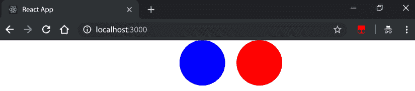

# 5

# 为浏览器编写代码

当我们与 React 和浏览器一起工作时，我们可以执行一些特定的操作。例如，我们可以要求我们的用户通过表单输入一些信息。在本章中，我们将探讨如何应用不同的技术来处理表单。我们可以实现**非受控组件**，让字段保持其内部状态，或者我们可以使用受控组件，其中我们可以完全控制字段的状态。

在本章中，我们还将探讨 React 中的事件是如何工作的，以及库如何实现一些高级技术，以在不同浏览器之间提供一致的接口。我们将探讨 React 团队实施的一些有趣的解决方案，以使事件系统非常高效。

事件发生后，我们将跳转到**refs**来查看我们如何在 React 组件中访问底层**DOM**节点。这代表了一个强大的功能，但应该谨慎使用，因为它打破了使 React 易于工作的某些约定。

在 refs 之后，我们将探讨如何使用 React 插件轻松实现动画。最后，我们将学习如何在 React 中与**可缩放矢量图形**（**SVG**）一起工作有多容易，以及我们如何为我们的应用程序创建动态可配置的图标。

本章我们将讨论以下主题：

+   使用不同的技术用 React 创建表单

+   监听 DOM 事件并实现自定义处理程序

+   使用 refs 在 DOM 节点上执行命令式操作的方法

+   创建在不同浏览器上都能工作的简单动画

+   React 生成 SVG 的方式

# 技术要求

要完成本章，你需要以下内容：

+   Node.js 19+

+   Visual Studio Code

你可以在本书的 GitHub 仓库中找到本章的代码：[`github.com/PacktPublishing/React-18-Design-Patterns-and-Best-Practices-Fourth-Edition/tree/main/Chapter05`](https://github.com/PacktPublishing/React-18-Design-Patterns-and-Best-Practices-Fourth-Edition/tree/main/Chapter05)。

# 理解和实现表单

在本节中，我们将学习如何使用 React 实现表单。一旦我们开始用 React 构建真实的应用程序，我们就需要与用户交互。如果我们想在浏览器中从我们的用户那里获取信息，表单是最常见的解决方案。由于库的工作方式和其声明性特性，使用 React 处理输入字段和其他表单元素并不简单，但一旦我们理解了其逻辑，它就会变得清晰。在下一节中，我们将学习如何使用非受控和受控组件。

## 非受控组件

**非受控组件**类似于常规 HTML 表单输入，对于这些输入，你将无法自行管理其值，而是 DOM 将负责处理该值，你可以通过使用 React ref 来获取这个值。让我们从一个基本示例开始——显示一个带有输入字段和`提交`按钮的表单。

代码相当简单：

```js
import { FC, useState, ChangeEvent, MouseEvent } from 'react'
const Uncontrolled: FC = () => {
  const [value, setValue] = useState<string>('')
  return (
    <form>
        <input type="text" />
        <button>Submit</button>
    </form>
  )
}
export default Uncontrolled 
```

如果我们在浏览器中运行前面的代码片段，我们会看到我们预期的结果——一个可以写入内容的输入框和一个可点击的按钮。这是一个未受控组件的例子，我们并没有设置输入框的值，而是让组件管理其自身的内部状态。

很可能，我们想在点击 `Submit` 按钮时对元素的值做些处理。例如，我们可能想将数据发送到 API 端点。

我们可以通过添加一个 `onChange` 监听器轻松做到这一点（我们将在本章后面更多地讨论事件监听器）。让我们看看添加监听器意味着什么。

我们需要创建 `handleChange` 函数：

```js
const handleChange = (e: ChangeEvent<HTMLInputElement>) => {
  console.log(e.target.value)
} 
```

事件监听器接收一个事件对象，其中目标表示生成事件的字段，我们对其值感兴趣。我们首先只是记录它，因为重要的是要从小步骤开始，但很快我们会将值存储到状态中。

最后，我们渲染表单：

```js
return (
  <form>
    <input type="text" onChange={handleChange} />
    <button>Submit</button>
  </form>
) 
```

如果我们在浏览器中渲染组件并将单词 `React` 输入到表单字段中，我们将在控制台看到如下内容：

```js
R
Re
Rea
Reac
React 
```

`handleChange` 监听器会在输入框的值每次改变时被触发。因此，我们的函数会在每个输入字符时被调用一次。下一步是存储用户输入的值，并在用户点击 `Submit` 按钮时使其可用。

我们只需更改处理程序的实施方式，将其存储在状态中而不是记录它，如下所示：

```js
const handleChange = (e: ChangeEvent<HTMLInputElement>) => {
  setValue(e.target.value)
} 
```

当表单提交时得到通知与监听输入字段的变化事件非常相似；它们都是浏览器在发生某些事情时调用的事件。

让我们定义 `handleSubmit` 函数，其中我们只是记录值。在现实世界的场景中，你可以将数据发送到 API 端点或传递给另一个组件：

```js
const handleSubmit = (e: MouseEvent<HTMLButtonElement>) => {
  e.preventDefault()

  console.log(value) // Here we are logging the value state
} 
```

这个处理程序相当简单；我们只是记录当前存储在状态中的值。我们还想克服表单提交时浏览器默认行为，执行自定义操作。这似乎是合理的，并且对于单个字段来说效果很好。现在的问题是，如果我们有多个字段怎么办？假设我们有数十个不同的字段？

让我们从基本示例开始，手动创建每个字段和处理程序，并看看我们如何通过应用不同的优化级别来改进它。

让我们创建一个新的表单，包含姓氏和名字字段。我们可以重用 `Uncontrolled` 组件并添加一些新的状态：

```js
const [firstName, setFirstName] = useState('')
const [lastName, setLastName] = useState('') 
```

我们在状态中初始化两个字段，并为每个字段定义一个事件处理程序。正如你可能已经注意到的，当有很多字段时，这并不很好地扩展，但在转向更灵活的解决方案之前，清楚地理解问题是重要的。

现在，我们实现新的处理程序：

```js
const handleChangeFirstName = ({ target: { value } }) => {
  setFirstName(value)
}

const handleChangeLastName = ({ target: { value } }) => {
  setLastName(value)
} 
```

我们还必须稍微更改提交处理程序，以便在点击时显示姓名的首尾：

```js
const handleSubmit = (e: MouseEvent<HTMLButtonElement>) => {
  e.preventDefault()

  console.log(`${firstName} ${lastName}`) // Logging the firstName and lastName states
} 
```

最后，我们渲染表单：

```js
return (
  <form onSubmit={handleSubmit}>
    <input type="text" onChange={handleChangeFirstName} />
    <input type="text" onChange={handleChangeLastName} />
    <button>Submit</button>
  </form>
) 
```

我们已经准备就绪：如果我们将在浏览器中运行前面的组件，我们将看到两个字段，如果我们将在第一个字段中输入`Carlos`，在第二个字段中输入`Santana`，当表单提交时，我们将在浏览器控制台中看到完整的姓名显示。

再次强调，这种方法效果良好，我们可以通过这种方式做一些有趣的事情，但它无法处理复杂场景，除非我们编写大量的模板代码。

让我们看看如何对其进行一点优化。我们的目标是使用单个更改处理程序，这样我们就可以添加任意数量的字段，而无需创建新的监听器。

让我们回到组件，并更改我们的状态：

```js
const [values, setValues] = useState({ firstName: '', lastName: '' }) 
```

我们可能仍然想要初始化值，在本节的后面部分，我们将探讨如何为表单提供预填充值。

现在，有趣的部分在于我们可以如何修改`onChange`处理程序实现，使其在不同的字段中工作：

```js
const handleChange = ({ target: { name, value } }) => {   
  setValues({
    ...values,
    [name]: value
  })
} 
```

如我们之前所见，我们接收的事件的`target`属性代表了触发事件的输入字段，因此我们可以使用字段的名称及其值作为变量。

然后，我们必须为每个字段设置名称：

```js
return (
  <form onSubmit={handleSubmit}>
    <input
      type="text"
      name="firstName"
      onChange={handleChange}
    />
    <input
      type="text"
      name="lastName"
      onChange={handleChange}
    />
    <button>Submit</button>
  </form>
) 
```

就这样！我们现在可以添加任意多的字段，而无需创建额外的处理程序。

## 受控组件

受控组件是 React 组件，它通过使用组件状态来控制表单中输入元素的值。

在这里，我们将探讨如何使用一些值预先填充表单字段，这些值可能来自服务器或作为父组件的 props。为了完全理解这个概念，我们将从一个非常简单的无状态函数组件开始，并逐步改进它。

第一个示例显示了输入字段内的预定义值：

```js
const Controlled = () => (
  <form>
    <input type="text" value="Hello React" />
    <button>Submit</button>
  </form>
) 
```

如果我们在浏览器中运行此组件，我们会发现它按预期显示了默认值，但它不允许我们更改值或在其内部输入其他内容。

原因在于，在 React 中，我们声明了希望在屏幕上显示的内容，设置固定值属性总会导致渲染该值，无论采取其他什么操作。这在实际应用中可能不是我们希望的行为。

如果我们打开控制台，我们会得到以下错误消息。React 本身告诉我们我们做错了什么：

```js
You provided a `value` prop to a form field without an `onChange` handler. This will render a read-only field. 
```

现在，如果我们只想让输入字段有一个默认值，并且我们想要能够通过输入来更改它，我们可以使用`defaultValue`属性：

```js
import { useState } from 'react'
const Controlled = () => {
  return (
    <form>
      <input type="text" defaultValue="Hello React" />
      <button>Submit</button>
    </form>
  )
}
export default Controlled 
```

这样，当字段被渲染时，它将显示`Hello React`，然后用户可以在其中输入任何内容并更改其值。现在让我们添加一些状态：

```js
const [values, setValues] = useState({ firstName: 'Carlos', lastName: 'Santana' }) 
```

处理程序与之前相同：

```js
const handleChange = ({ target: { name, value } }) => {
  setValues({
    [name]: value
  })
}

const handleSubmit = (e) => {
  e.preventDefault()

  console.log(`${values.firstName} ${values.lastName}`)
} 
```

实际上，我们将使用输入字段的值属性来设置它们的初始值以及更新后的值：

```js
return (
  <form onSubmit={handleSubmit}>
    <input
        type="text"
        name="firstName"
        value={values.firstName}
        onChange={handleChange}
    />
    <input
        type="text"
        name="lastName"
        value={values.lastName}
        onChange={handleChange}
    />
    <button>Submit</button>
  </form>
) 
```

当表单第一次渲染时，React 使用状态中的初始值作为输入字段的值。当用户在字段中输入某些内容时，`handleChange`函数被调用，并将字段的新值存储在状态中。

当状态发生变化时，React 会重新渲染组件并再次使用它来反映输入字段的当前值。我们现在完全控制字段的值，我们称这种模式为**受控组件**。

在下一节中，我们将处理事件，这是 React 处理来自表单的数据的基本部分。

# 处理事件

`事件`在不同的浏览器中工作方式略有不同。React 试图抽象事件的工作方式，并为开发者提供一个一致的接口来处理。这是 React 的一个伟大特性，因为我们可以忘记我们正在针对的浏览器，并编写事件处理程序和函数，它们是*供应商无关的*。

为了提供这个功能，React 引入了合成事件的概念。合成事件是一个对象，它包装了浏览器提供的原始事件对象，并且无论在哪里创建，都具有相同的属性。

要将事件监听器附加到节点并在事件触发时获取事件对象，我们可以使用一个简单的约定，它回忆了事件附加到 DOM 节点的方式。实际上，我们可以使用单词 on 加上`camelCased`事件名称（例如，`onKeyDown`）来定义在事件发生时被触发的回调。一个流行的约定是将事件处理程序函数命名为事件名称，并使用`handle`作为前缀（例如，`handleKeyDown`）。

我们在之前的示例中已经看到了这种模式的实际应用，当时我们正在监听表单字段的`onChange`事件。让我们再次回顾一个基本的事件监听器示例，看看我们如何以更优雅的方式在同一个组件内部组织多个事件。我们将实现一个简单的按钮，并且像往常一样，首先创建一个组件：

```js
const Button = () => {
}
export default Button 
```

然后我们定义事件处理程序：

```js
const handleClick = (syntheticEvent) => {
      console.log(syntheticEvent instanceof MouseEvent)
      console.log(syntheticEvent.nativeEvent instanceof MouseEvent)
    } 
```

正如您在这里所看到的，我们正在做一件非常简单的事情：我们只是检查从 React 接收的事件对象的类型以及附加到其上的原生事件类型。我们期望第一个返回 false，第二个返回 true。

您永远不需要访问原始的本地事件，但了解您可以在需要时这样做是好的。最后，我们使用`onClick`属性定义按钮，并将事件监听器附加到它：

```js
return (
  <button onClick={handleClick}>Click me!</button>
) 
```

现在，假设我们想要将第二个处理程序附加到按钮，以便监听双击事件。一个解决方案是创建一个新的单独的处理程序，并使用`onDoubleClick`属性将其附加到按钮，如下所示：

```js
<button
  onClick={handleClick}
  onDoubleClick={handleDoubleClick}
>
  Click me!
</button> 
```

请记住，我们总是力求编写更少的样板代码并避免代码重复。因此，一个常见的做法是为每个组件编写一个`单个事件处理程序`，它可以根据事件类型触发不同的操作。

这种技术由 Michael Chan 在一系列模式中描述：

[`reactpatterns.com/#event-switch`](http://reactpatterns.com/#event-switch)

让我们实现通用事件处理器：

```js
const handleEvent = (event) => {
  switch (event.type) {
    case 'click':
        console.log('clicked')
      break

    case 'dblclick':
        console.log('double clicked')
      break

    default:
        console.log('unhandled', event.type)
  }
} 
```

通用事件处理器接收事件对象并根据事件类型切换以触发正确的动作。如果我们想在每个事件上调用一个函数（例如，分析）或者某些事件共享相同的逻辑，这特别有用。

最后，我们将新的事件监听器附加到`onClick`和`onDoubleClick`属性：

```js
return (
  <button
    onClick={handleEvent}
    onDoubleClick={handleEvent}
  >
    Click me!
  </button>
) 
```

从这一点开始，每当我们需要为同一组件创建一个新的事件处理器时，我们只需向 switch 添加一个新的情况，而不是创建一个新的方法和绑定它。

关于 React 中事件的一些有趣的事情是，合成事件会被重用，并且存在一个**全局处理器**。第一个概念意味着我们不能存储一个合成事件并在之后重用它，因为事件在动作之后立即变为 null。这种技术在性能方面非常好，但如果出于某种原因我们想在组件的状态中存储事件，可能会遇到问题。为了解决这个问题，React 为我们提供了一个在合成事件上的持久化方法，我们可以调用它来使事件持久化，以便我们可以存储和稍后检索它。

第二个非常有趣的具体实现细节又是关于性能的，这涉及到 React 将事件处理器附加到 DOM 的方式。

每当我们使用 on 属性时，我们都在向 React 描述我们想要实现的行为，但库不会将实际的事件处理器附加到底层的 DOM 节点。

它所做的相反，是将单个事件处理器附加到根元素，该处理器监听所有事件，这要归功于**事件冒泡**。当浏览器触发我们感兴趣的事件时，React 代表它调用特定组件上的处理器。这种技术称为**事件委托**，用于内存和速度优化。

在下一节中，我们将探索 React refs 并了解如何利用它们。

# 探索 refs

人们喜欢 React 的一个原因是因为它是声明式的。声明式意味着你只需描述在任何时刻你想在屏幕上显示的内容，React 会负责与浏览器的通信。这个特性使得 React 在推理上非常容易，同时也很强大。

然而，可能有一些情况下你需要访问底层的 DOM 节点来执行一些命令式操作。这应该被避免，因为在大多数情况下，有更符合 React 的解决方案来实现相同的结果，但了解我们有这个选项并且知道它是如何工作的，以便我们可以做出正确的决定。

假设我们想要创建一个简单的表单，其中包含一个输入元素和一个按钮，并且我们希望它以这样的方式运行：当按钮被点击时，输入字段会获得焦点。我们想要做的是在浏览器窗口中调用输入节点（即输入的实际 DOM 实例）的 focus 方法。

让我们创建一个名为`Focus`的组件；你需要导入`useRef`并创建一个`inputRef`常量：

```js
import { useRef } from 'react'
const Focus = () => {
  const inputRef = useRef(null)
}
export default Focus 
```

然后，我们实现`handleClick`方法：

```js
const handleClick = () => {
  inputRef.current.focus()
} 
```

如你所见，我们正在引用`inputRef`的当前属性，并在其上调用 focus 方法。

要了解其来源，你只需检查`render`的实现：

```js
return (
  <>
    <input
      type="text"
      ref={inputRef}
    />
    <button onClick={handleClick}>Set Focus</button>
  </>
) 
```

接下来是逻辑的核心。我们在表单内部创建一个带有输入元素的表单，并在其`ref`属性上定义一个函数。

当组件挂载时，我们定义的回调会被调用，其中的 element 参数代表输入的 DOM 实例。重要的是要知道，当组件卸载时，相同的回调会被带有 null 参数调用，以释放内存。

在回调中我们所做的是存储元素的引用，以便将来使用（例如，当`handleClick`方法被触发时）。然后，我们有带有其事件处理器的按钮。在浏览器中运行前面的代码将显示带有字段和按钮的表单，点击按钮将使输入字段获得焦点，正如预期的那样。

*正如我们之前提到的，通常情况下，我们应该尽量避免使用 refs，因为它们会使代码变得更加命令式，并且它们变得难以阅读和维护。*

## 理解`forwardRef`

`React.forwardRef`是一个有用的特性，允许你从父组件向下传递一个 ref（简称“引用”）到子组件。本文将提供一个关于`React.forwardRef`的基本介绍，并提供一个简单的示例来帮助你理解其实际用法。

React 中的 refs 是一种机制，用于访问和与组件渲染的 DOM 元素交互。它们提供了一种修改 DOM 或直接访问 DOM 属性的方法。

`React.forwardRef`是一个高阶组件，允许你将 ref 传递给子组件。当你需要从父组件访问子组件的 DOM 元素或实例时，这非常有用。

要创建一个可以接受转发 ref 的组件，你将使用`React.forwardRef`函数，它接受一个作为参数的渲染函数。这个渲染函数接收两个参数：组件的`props`和转发的 ref。

```js
import React from 'react'
const TextInputWithRef = React.forwardRef((props, ref) => {
  return <input ref={ref} type="text" {...props} />
})
export default TextInputWithRef 
```

要使用`forwardRef`组件，你需要使用`useRef()`钩子创建一个 ref，并将其分配给`forwardRef`组件。

```js
import React, { useRef } from 'react'
import TextInputWithRef from './TextInputWithRef'
function App() {
  const inputRef = useRef()
  const handleClick = () => {
    inputRef.current.focus()
  }
  return (
    <div>
      <TextInputWithRef ref={inputRef} />
      <button onClick={handleClick}>Focus on input</button>
    </div>
  )
}
export default App 
```

在这个例子中，我们创建了一个`TextInputWithRef`组件，它接受一个传递的 ref。在`App`组件中，我们使用`useRef()`钩子创建一个 ref，然后将其传递给`TextInputWithRef`组件。当点击“聚焦到输入框”按钮时，会调用`handleClick`函数，该函数聚焦到输入元素。

`React.forwardRef`是一个强大的功能，允许您将 ref 从父组件传递到子组件，从而提供对子组件行为的更大控制。

通过理解`refs`和`forwardRef`的基本知识，并检查一个简单的示例，你可以在你的 React 应用程序中有效地利用这个功能。

在探讨了利用`React.forwardRef`以实现对组件的更高级控制之后，我们现在可以将注意力转向另一个增强 React 应用程序用户体验的关键方面：实现动画。

# 实现动画

当我们思考 UI 和浏览器时，我们肯定也会想到动画。动画化的 UI 对用户来说更愉快，它们是向用户展示已经发生或即将发生的事情的重要工具。

本节的目的不是提供一个创建动画和美观 UI 的详尽指南；这里的目的是提供一些关于我们可以实施以动画化我们的 React 组件的常见解决方案的基本信息。

对于像 React 这样的 UI 库，为开发者提供一个简单的方式来创建和管理动画至关重要。React 附带了一个名为`react-transition-group`的附加组件，它是一个帮助我们以声明式方式构建动画的组件。再次强调，能够以声明式方式执行操作非常强大，它使得代码更容易推理和与团队共享。

要开始构建动画组件，我们首先需要安装附加组件：

```js
npm install --save react-transition-group @types/react-transition-group 
```

完成这些后，我们可以导入组件：

```js
import { TransitionGroup} from 'react-transition-group' 
```

然后，我们只需将动画应用到我们想要应用的组件上：

```js
const Transition = () => (
  <TransitionGroup
    transitionName="fade"
    transitionAppear
    transitionAppearTimeout={500}
  >
    <h1>Hello React</h1>
  </TransitionGroup>
) 
```

如您所见，有一些属性需要解释。首先，我们声明了`transitionName`属性。`ReactTransitionGroup`将具有该属性名称的类应用到子元素上，这样我们就可以使用 CSS 过渡来创建动画。

使用单个类，我们无法轻松地创建合适的动画，这就是为什么过渡组根据动画的状态应用多个类。在这种情况下，使用`transitionAppear`属性，我们告诉组件当子元素出现在屏幕上时，我们想要对它们进行动画处理。

因此，库所做的是在组件渲染后立即将其`fade-appear`类（其中`fade`是`transitionName`属性的值）应用到组件上。在下一次 tick 时，应用`fade-appear-active`类，这样我们就可以使用 CSS 从初始状态到新状态触发动画。

我们还必须设置`transitionAppearTimeout`属性来告诉 React 动画的长度，这样它就不会在动画完成之前从 DOM 中删除元素。

使元素`淡入`的 CSS 如下。

首先，我们在初始状态中定义元素的透明度：

```js
.fade-appear {
  opacity: 0.01;
} 
```

然后，我们使用第二个类定义我们的过渡，它一旦应用到元素上就开始：

```js
.fade-appear.fade-appear-active {
  opacity: 1;
  transition: opacity .5s ease-in;
} 
```

我们正在使用缓动函数在 500ms 内将透明度从 0.01 过渡到 1。这很简单，但我们可以创建更复杂的动画，我们还可以动画化组件的不同状态。例如，当新的元素作为过渡组的子元素被添加时，会应用`*-enter`和`*-enter-active`类。类似的事情也适用于删除元素。

在深入研究动画的动态世界并了解它们如何极大地增强我们的 React 组件之后，现在让我们将注意力转向网络设计的另一个迷人方面：可伸缩矢量图形（**SVG**）的探索。

# 探索 SVG

最后，我们可以在浏览器中应用的一种最有趣的技巧是使用 SVG 来绘制图标和图表。

SVG 很棒，因为它是一种描述矢量的声明性方式，它与 React 的目的完美契合。我们过去使用图标字体来创建图标，但它们有众所周知的问题，首先是它们不可访问。使用 CSS 定位图标字体也很困难，并且它们并不总是在所有浏览器中看起来都很漂亮。这就是我们应该在我们的 Web 应用程序中优先考虑 SVG 的原因。

从 React 的角度来看，无论我们从渲染方法中输出 div 还是 SVG 元素，这都没有任何区别，这也是它如此强大的原因。我们也倾向于选择 SVG，因为我们可以使用 CSS 和 JavaScript 轻松地在运行时修改它们，这使得它们成为 React 函数式方法的绝佳候选者。

因此，如果我们把我们的组件视为其属性的函数，我们就可以很容易地想象出如何创建自包含的 SVG 图标，我们可以通过向它们传递不同的属性来操作它们。在 React web 应用中创建 SVG 的一个常见方法是将我们的矢量包装在一个 React 组件中，并使用属性来定义它们的动态值。

让我们看看一个简单的例子，我们画一个蓝色圆圈，从而创建一个包装 SVG 元素的 React 组件：

```js
const Circle = ({ x, y, radius, fill }) => (
  <svg>
    <circle cx={x} cy={y} r={radius} fill={fill} />
  </svg>
) 
```

如您所见，我们可以轻松使用无状态的函数式组件来包装 SVG 标记，并且它接受 SVG 相同的属性。

以下是一个示例用法：

```js
<Circle x={20} y={20} radius={20} fill="blue" /> 
```

我们显然可以使用 React 的全部功能并设置一些默认参数，这样，如果圆图标没有属性被渲染，我们仍然会显示一些内容。

例如，我们可以定义默认颜色：

```js
const Circle = ({ x, y, radius, fill = 'red' }) => (...) 
```

当我们构建 UI 时，这非常强大，尤其是在一个团队中，我们共享我们的图标集，并希望在它中设置一些默认值，但我们也希望让其他团队决定他们的设置，而无需重新创建相同的 SVG 形状。

然而，在某些情况下，我们更喜欢更加严格，并固定一些值以保持一致性。使用 React，这是一个超级简单的任务。

例如，我们可以将基本圆圈组件包裹在`RedCircle`中，如下所示：

```js
const RedCircle = ({ x, y, radius }) => (
  <Circle x={x} y={y} radius={radius} fill="red" />
) 
```

在这里，颜色默认设置，并且不能更改，而其他属性则透明地传递给原始圆。

以下截图显示了由 React 使用 SVG 生成的两个圆圈，蓝色和红色：



图 5.1：两个圆圈，蓝色和红色 SVG

我们可以应用这种技术并创建圆的不同变体，例如`SmallCircle`和`RightCircle`，以及构建我们的 UI 所需的一切。

# 摘要

在本章中，我们探讨了 React 在针对浏览器时的不同功能，从创建表单和处理事件到动画 SVG。我们还学习了新的`useRef`钩子，它提供了一种简单的方式来访问 DOM 节点。React 的声明式方法简化了复杂 Web 应用程序的管理。此外，React 提供了一种访问 DOM 节点的方式，如果需要，可以进行命令式操作，这使得将 React 与现有库集成变得更加容易。

在下一章中，我们将深入研究 CSS 和内联样式，并探讨在 JavaScript 中编写 CSS 的概念。
