# 第八章：React Hooks

React Hooks 已经彻底改变了我们编写 React 应用程序的方式，允许我们使用函数组件而不是类组件，使编码更快、更高效。自从它们在 React 16.8 中引入以来，Hooks 已经成为 React 开发的一个基本组成部分，并且大大提高了我们应用程序的性能。使用 Hooks，我们可以以更简洁、更易读的方式管理状态、处理副作用和重用代码。在下一章中，我们将探讨不同类型的 Hooks 以及如何使用它们来增强我们的 React 应用程序。

在本章中，我们将涵盖以下主题：

+   新的 React Hooks 及其使用方法

+   Hooks 的规则

+   如何将类组件迁移到 React Hooks

+   使用 Hooks 和 effects 理解组件生命周期

+   如何使用 Hooks 获取数据

+   如何使用 `memo`、`useMemo` 和 `useCallback` 来缓存组件、值和函数

+   如何实现 `useReducer`

# 技术要求

要完成本章，你需要以下内容：

+   Node.js 19+

+   Visual Studio Code

你可以在本书的 GitHub 仓库中找到本章的代码：[`github.com/PacktPublishing/React-18-Design-Patterns-and-Best-Practices-Fourth-Edition/tree/main/Chapter08`](https://github.com/PacktPublishing/React-18-Design-Patterns-and-Best-Practices-Fourth-Edition/tree/main/Chapter08)。

# 介绍 React Hooks

React Hooks 是 React 16.8 的新增功能。它们允许你使用状态和其他 React 功能，而无需编写 React 类组件。React Hooks 也是向后兼容的，这意味着它们不包含任何破坏性变更，也不会取代你对 React 概念的了解。在本章的整个过程中，我们将为经验丰富的 React 用户概述 Hooks，同时我们还将学习一些最常用的 React Hooks，例如 `useState`、`useEffect`、`useMemo`、`useCallback` 和 `memo`。

## 没有破坏性变更

在 React 开发的背景下，一个常见的误解是 React Hooks 的引入使得类组件变得过时。然而，这并不正确，因为 React 没有计划从 React 中移除类。Hooks API 并没有取代你对 React 概念的理解，而是提供了一个更流畅的方式来处理这些概念，例如 props、states、context、refs 和生命周期，这些你已经是熟悉的。

## 使用 State Hook

在旧的 React 代码中，我们使用 `this.setState` 来使用组件状态。现在我们将使用 `useState` Hook 来完成这项工作。

首先，你需要从 React 中提取 `useState` Hook：

```js
import { useState } from 'react' 
```

自 React 17 以来，不再需要 `React` 对象来渲染 JSX 代码。

然后，你需要通过定义状态和该特定状态的设置器来声明你想要使用的状态：

```js
const Counter = () => { 
  const [counter, setCounter] = useState<number>(0) 
} 
```

如你所见，我们使用 `setCounter` 设置器声明了计数器状态，并指定我们只接受数字，最后，我们将初始值设置为零。

为了测试我们的状态，我们需要创建一个方法，该方法将由`onClick`事件触发：

```js
type Operation = 'add' | 'substract'
const Counter = () => {
  const [counter, setCounter] = useState<number>(0)
  const handleCounter = (operation: Operation) => {
    if (operation === 'add') {
      return setCounter(counter + 1)
    }

    setCounter(counter - 1)
  }
} 
```

最后，我们可以渲染`counter`状态和一些按钮来增加或减少计数器状态：

```js
return (
  <p>
    Counter: {counter} <br />
    <button onClick={() => handleCounter('add')}>+ Add</button>
    <button onClick={() => handleCounter('subtract')}>- Subtract</button>
  </p>
) 
```

如果你点击**+ 添加**按钮一次，你应该看到**1**个**计数器**：

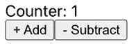

图 8.1：计数器 1

如果你点击**- 减少两次**按钮，那么你应该看到**-1**个**计数器**：

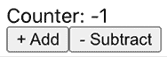

图 8.2：计数器-1

如你所见，`useState` Hook 是 React 的一个变革者，使得在函数组件中处理状态变得非常容易。

在欣赏了`useState` Hook 如何彻底改变了 React 中函数组件的状态管理之后，我们现在准备深入了解 Hooks 的细微差别。下一节将讨论控制 React 应用程序中 Hooks 使用的必要*Hooks 规则*。

# Hooks 规则

React Hooks 基本上是 JavaScript 函数，但你需要遵循两条规则才能使用它们。React 提供了一个 linter 插件来自动执行这些规则，你可以通过运行以下命令来安装：

```js
npm install --save-dev eslint-plugin-react-hooks 
```

让我们看看这两条规则。

## 规则 1：只从顶层调用 Hooks

为了确保 React Hooks 的正常工作，重要的是避免在循环、条件或嵌套函数中调用它们。相反，建议始终在 React 函数的最高级别使用 Hooks。这种做法确保每次组件渲染时 Hooks 的调用顺序相同，从而使 React 能够正确地保留多个`useState`和`useEffect`调用之间的 Hooks 状态。遵循此规则将帮助你用 React Hooks 编写更高效、更易于维护的代码。

## 规则 2：只从 React 函数中调用 Hooks

为了确保组件中所有有状态逻辑在源代码中清晰可见，避免从常规 JavaScript 函数中调用 Hooks。相反，在 React 函数组件或自定义 Hooks（我们将在下一节中学习）中使用 Hooks。通过遵循这种做法，你可以确保所有有状态逻辑都集中且易于理解。

在下一节中，我们将学习如何将类组件迁移到使用新的 React Hooks。

# 将类组件迁移到 React Hooks

让我们将当前使用类组件并使用一些生命周期方法的代码进行转换。在这个例子中，我们从 GitHub 仓库获取问题并列出它们。

对于这个例子，你需要安装`axios`来执行获取操作：

```js
npm install axios 
```

这是类组件版本：

```js
import axios from 'axios'
import { Component } from 'react'
type Issue = {
  number: number
  title: string
  state: string
}
type Props = {}
type State = { issues: Issue[] }
class Issues extends Component<Props, State> {
  constructor(props: Props) {
    super(props)
    this.state = {
      issues: []
    }
  }
  componentDidMount() {
    axios.get('https://api.github.com/repos/ContentPI/ContentPI/issues')
      .then((response: any) => {
        this.setState({
          issues: response.data
        })
      })
  }
  render() {
    const { issues = [] } = this.state
    return (
      <>
        <h1>ContentPI Issues</h1>
        {issues.map((issue: Issue) => (
          <p key={issue.title}>
            <strong>#{issue.number}</strong>{' '}
            <a
              href={`https://github.com/ContentPI/ContentPI/issues/${issue.number}`}
              target="_blank"
            >
              {issue.title}
            </a>{' '}
            {issue.state}
          </p>
        ))}
      </>
    )
  }
}
export default Issues 
```

如果你渲染这个组件，你应该看到类似以下的内容：

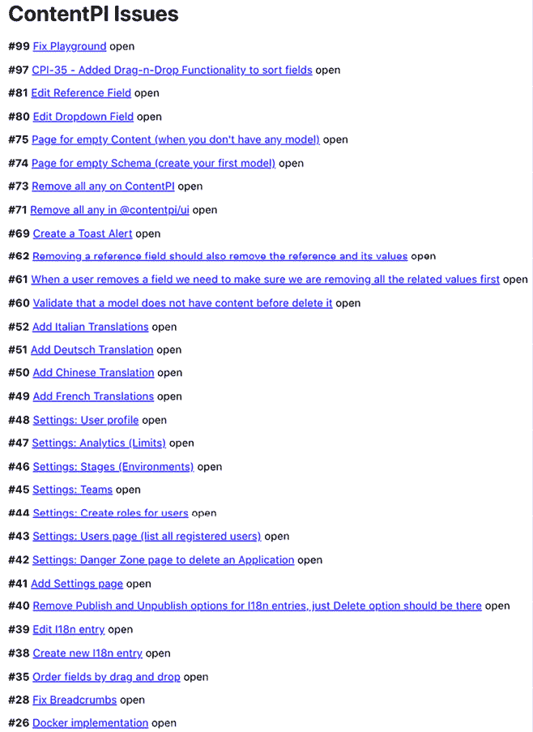

图 8.3：ContentPI 问题

现在，让我们使用 React Hooks 将我们的代码转换成一个函数组件。我们需要做的第一件事是导入一些 React 函数和类型：

```js
import { FC, useState, useEffect } from 'react'
import axios from 'axios' 
```

现在我们可以移除之前创建的`Props`和`State`类型，只留下`Issue`类型：

```js
type Issue = {
  number: number
  title: string
  state: string
} 
```

然后，你可以将类定义更改为使用函数组件：

```js
const Issues: FC = () => {...} 
```

`FC` 类型用于在 React 中定义 **函数组件**。如果你需要向组件传递一些属性，你可以这样传递：

```js
type Props = {
  propX: string
  propY: number
  propZ: boolean 
}
const Issues: FC<Props> = () => {...} 
```

接下来，我们需要用 `useState` Hook 来替换我们的构造函数和状态定义：

```js
// The useState hook replace the this.setState method
const [issues, setIssues] = useState<Issue[]>([]) 
```

我们之前使用过名为 `componentDidMount` 的生命周期方法，它在组件挂载时执行，并且只运行一次。新的 React Hook，称为 `useEffect`，现在将使用不同的语法处理所有生命周期方法，但让我们现在看看我们如何在新的函数组件中实现与 `componentDidMount` 相同的 *effect*：

```js
// When we use the useEffect hook with an empty array [] on the
// dependencies (second parameter)
// this represents the componentDidMount method (will be executed when the
// component is mounted).
useEffect(() => {
  axios
    .get('https://api.github.com/repos/ContentPI/ContentPI/issues')
    .then((response: any) => {
       // Here we update directly our issue state
        setIssues(response.data)
    })
}, []) 
```

最后，我们只需渲染我们的 JSX 代码：

```js
return (
  <>
    <h1>ContentPI Issues</h1>
    {issues.map((issue: Issue) => (
        <p key={issue.title}>
        <strong>#{issue.number}</strong> {' '}
            <a 
          href={`https://github.com/ContentPI/ContentPI/issues/${issue.number}`}      
          target="_blank">{issue.title}
        </a> {' '}
            {issue.state}
        </p>
    ))}
  </>
) 
```

如你所见，新的 Hooks 有助于我们极大地简化代码，并且更有意义。此外，我们还减少了 10 行代码（类组件代码有 53 行，函数组件有 43 行）。

现在我们已经看到了新的 Hooks 在简化我们的代码和减少冗余方面的变革力量，让我们将注意力转向 React 中的另一个基础概念。在下一节中，我们将深入了解在类组件中使用的组件生命周期方法和创新 React effects 之间的区别。

# 理解 React 的 effects

在本节中，我们将学习我们在类组件中使用的组件生命周期方法和新的 React effects 之间的区别。即使你在其他地方读到它们是相同的，只是语法不同，这也是不正确的。

## 理解 useEffect

当你使用 `useEffect` 时，你需要 *从 effects 的角度思考*。如果你想使用 `useEffect` 来执行与 `componentDidMount` 相当的方法，你可以这样做：

```js
useEffect(() => {
  // Here you perform your side effect
}, []) 
```

第一个参数是你想要执行的效果的回调函数，第二个参数是依赖项数组。如果你传递一个空数组 (`[]`) 到依赖项中，状态和属性将保留它们的原始初始值。

然而，重要的是要提到，尽管这是与 `componentDidMount` 最接近的等价物，但它并不具有相同的行为。与 `componentDidMount` 和 `componentDidUpdate` 不同，我们传递给 `useEffect` 的函数在布局和绘制之后、在延迟事件期间触发。这通常适用于许多常见的副作用，例如设置订阅和事件处理器，因为大多数类型的工作不应该阻止浏览器更新屏幕。

然而，并非所有 effects 都可以延迟。例如，如果你需要修改 **文档对象模型** (**DOM**)，你将看到一个闪烁。这就是为什么你必须在下一次绘制之前同步触发事件的原因。React 提供了一个名为 `useLayoutEffect` 的 Hook，它的工作方式与 `useEffect` 完全相同。

## 有条件地触发 effects

如果你需要有条件地触发一个影响（副作用），那么你应该将一个依赖项添加到依赖项数组中；否则，你将多次执行影响，这可能会导致无限循环。如果你传递一个依赖项数组，`useEffect` Hook 将仅在其中一个依赖项发生变化时运行：

```js
useEffect(() => {
// When you pass an array of dependencies the useEffect hook will only
// run if one of the dependencies changes.
}, [dependencyA, dependencyB]) 
```

如果你理解了 React 类生命周期方法的工作原理，基本上，`useEffect` 的行为与 `componentDidMount`、`componentDidUpdate` 和 `componentWillUnmount` 结合在一起。

影响（副作用）非常重要，但让我们也探索一些其他重要的新 Hooks，包括 `useCallback`、`useMemo` 和 `memo`。

## 理解 `useCallback`、`useMemo` 和 `memo`

为了理解 `useCallback`、`useMemo` 和 `memo` 之间的区别，我们将通过待办事项列表的示例来进行。你可以通过使用 `create-react-app` 和 Typescript 作为模板来创建一个基本的应用程序：

```js
npx create-react-app todo --template typescript 
```

在那之后，你可以移除所有额外的文件（`App.css`、`App.test.ts`、`index.css`、`logo.svg`、`reportWebVitals.ts` 和 `setupTests.ts`）。你只需要保留 `App.tsx` 文件，它将包含以下代码：

```js
import { FC, useState, useEffect, useMemo, useCallback, ChangeEvent } from 'react'
import List, { Todo } from './List'
const initialTodos: Todo[] = [
  { id: 1, task: 'Go shopping' },
  { id: 2, task: 'Pay the electricity bill'}
]
const App: FC = () => {
  const [todoList, setTodoList] = useState<Todo[]>(initialTodos)
  const [task, setTask] = useState<string>('')
  useEffect(() => {
    console.log('Rendering <App />')
  })
  const handleCreate = () => {
    const newTodo = {
        id: Date.now(),
        task
    }

    // Pushing the new todo to the list
    setTodoList([...todoList, newTodo])

    // Resetting input value
    setTask('')
  }
  return (
    <>
        <input
            type="text"
            value={task}
            onChange={(e: ChangeEvent<HTMLInputElement>) => setTask(e.target.value)}
        />
        <button onClick={handleCreate}>Create</button>
        <List todoList={todoList} />
    </>
  )
}
export default App 
```

基本上，我们定义了一些初始任务并创建了 `todoList` 状态，我们将将其传递给 `List` 组件。然后，你需要创建 `List.tsx` 文件，并使用以下代码：

```js
import { FC, useEffect } from 'react'
import Task from './Task'
export type Todo = {
  id: number
  task: string
}
interface Props {
  todoList: Todo[]
}
const List: FC<Props> = ({ todoList }) => {
  useEffect(() => {
    // This effect is executed every new render
    console.log('Rendering <List />')
  })
  return (
    <ul>
        {todoList.map((todo: Todo) => (
            <Task key={todo.id} id={todo.id} task={todo.task} />
        ))}
    </ul>
  )
}
export default List 
```

如你所见，我们通过使用 `Task` 组件渲染 `todoList` 数组中的每个任务，并将任务作为属性传递。我还添加了一个 `useEffect` Hook 来查看我们执行了多少次渲染。

最后，我们使用以下代码创建我们的 `Task.tsx` 文件：

```js
import { FC, useEffect } from 'react'
interface Props {
  id: number
  task: string
}
const Task: FC<Props> = ({ task }) => {
  useEffect(() => {
    console.log('Rendering <Task />', task)
  })
  return (
    <li>{task}</li>
  )
}
export default Task 
```

这是我们应该如何看待待办事项列表的方式：

![图片 B18414_08_04.png]

图 8.4：待办事项列表

如你所见，当我们渲染我们的待办事项列表时，默认情况下，我们正在执行两个 `Task` 组件的渲染，一个用于 `List`，另一个用于 `App` 组件。

现在，如果我们尝试在输入中写入一个新的任务，我们可以看到，对于每个我们写的字母，我们都会再次看到所有的那些渲染：


图 8.5：在待办事项列表中搜索

如你所见，仅仅通过写入 `Go`，我们就有了两批新的渲染，因此我们可以确定这个组件的性能不佳，这就是 `memo` 可以帮助我们提高性能的地方。在接下来的章节中，我们将学习如何实现 `memo`、`useMemo` 和 `useCallback` 来记忆化组件、值和函数。

### 使用 `memo` 记忆化组件

`memo` 高阶组件（**HOC**）与 React 类中的 `PureComponent` 类似，因为它执行了属性的浅比较（意味着表面检查），所以如果我们尝试始终使用相同的属性渲染组件，组件将只渲染一次并且会进行记忆。唯一重新渲染组件的方法是当属性值发生变化时。

为了在输入时将我们的组件固定，避免多次渲染，我们需要将我们的组件包裹在`memo` **高阶组件**中。

我们首先将修复的组件是`List`组件，你只需要在`import memo`和`export default`中包裹组件：

```js
import { FC, useEffect, memo } from 'react'
...
export default memo(List) 
```

然后，你需要对`Task`组件做同样的处理：

```js
import { FC, useEffect, memo } from 'react'
...
export default memo(Task) 
```

现在，当我们再次在输入中尝试编写`Go`时，让我们看看这次我们会得到多少次渲染：

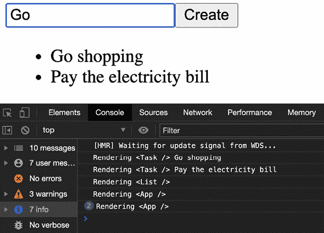

图 8.6：评估我们的待办事项列表执行了多少次渲染

现在，我们第一次只得到第一批渲染，然后，当我们编写`Go`时，我们只得到`App`组件的两次更多渲染，这是完全可以接受的，因为我们要改变的任务状态（输入值）实际上是`App`组件的一部分。

此外，我们还可以看到当我们点击**创建**按钮创建新任务时，我们执行了多少次渲染：

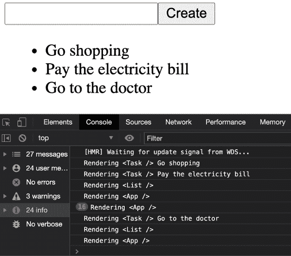

图 8.7：提高性能

如果你看到，前 16 次渲染是`Go to the doctor`字符串的单词计数，然后，当你点击**创建**按钮时，你应该看到`Task`组件的一次渲染，`List`组件的一次渲染，以及`App`组件的一次渲染。正如你所见，我们大大提高了性能，我们只是执行了确切的渲染需求。

到目前为止，你可能认为正确的事情是始终将`memo`添加到我们的组件中，或者你可能认为，为什么 React 不默认为我们做这件事？

原因是**性能**，这意味着**除非绝对必要，否则不建议将** `memo` **添加到所有我们的组件中**；否则，浅比较和记忆化的过程将比不使用它时的性能更差。

在决定是否使用`memo`时，我有一个规则，这个规则很简单：**尽量不要使用它**。通常，当我们处理小型组件或基本逻辑时，我们不需要这个功能，除非你正在处理来自某些 API 的大量数据，你的组件需要执行大量渲染（通常是巨大的列表），或者当你注意到你的应用运行缓慢时。只有在那种情况下，我才会推荐使用`memo`。

### 使用`useMemo`缓存值

假设我们现在想在我们的待办事项列表中实现一个搜索功能。我们首先需要做的是在`App`组件中添加一个新的状态`term`：

```js
const [term, setTerm] = useState('') 
```

然后，我们需要创建一个名为`handleSearch`的函数：

```js
const handleSearch = () => {
  setTerm(task)
} 
```

在返回之前，我们将创建`filterTodoList`，它将根据任务过滤待办事项，我们将在那里添加一个控制台来查看它被渲染了多少次：

```js
const filteredTodoList = todoList.filter((todo: Todo) => {
  console.log('Filtering...')
  return todo.task.toLowerCase().includes(term.toLowerCase())
}) 
```

最后，我们需要在已经存在的**创建**按钮旁边添加一个新按钮：

```js
<button onClick={handleSearch}>Search</button> 
```

到目前为止，我建议你删除或注释掉`List`和`Task`组件中的`console.log`，这样我们就可以专注于过滤的性能：

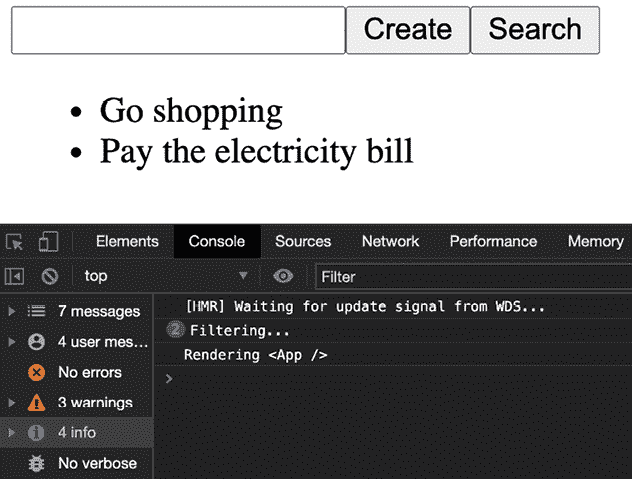

图 8.8：审查过滤性能

当你再次运行应用程序时，你会看到过滤正在执行两次，然后是`App`组件，这里看起来一切正常，但问题是什么？

再次在输入中尝试写`Go to the doctor`，让我们看看你得到多少次`Rendering…`和`Filtering…`的计数：

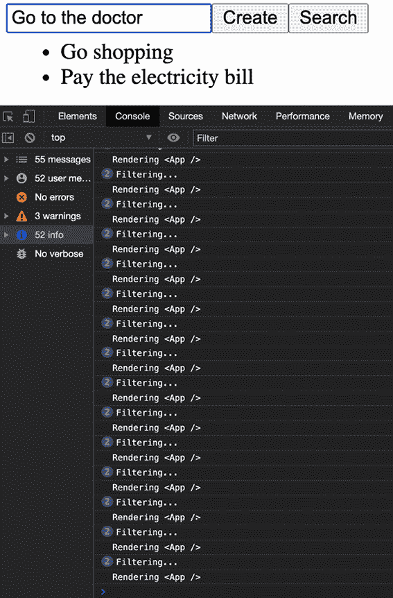

图 8.9：过滤性能不佳

如你所见，对于你输入的每个字母，你将得到两次过滤调用和一次`App`渲染。你不需要是天才就能看出这是性能不佳；更不用说如果你正在处理一个大的数据数组，这会更糟，那么我们如何解决这个问题呢？

在这种情况下，`useMemo` Hook 是我们的英雄，基本上，我们需要将我们的过滤移动到`useMemo`内部，但首先，让我们看看语法：

```js
const filteredTodoList = useMemo(() => SomeProcessHere, []) 
```

`useMemo` Hook 将记忆化函数的结果（值）并有一些依赖项需要监听。让我们看看我们如何实现它：

```js
const filteredTodoList = useMemo(() => todoList.filter((todo: Todo) => {
  console.log('Filtering...')
  return todo.task.toLowerCase().includes(term.toLowerCase())
}), []) 
```

现在，如果你再次在输入中写些东西，你会看到过滤不会像之前那样一直执行：

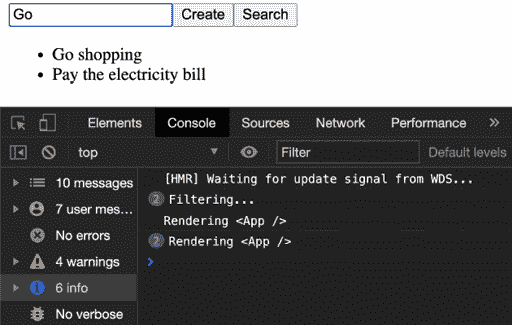

图 8.10：提高过滤性能

这很好，但还有一个小问题。如果你尝试点击**搜索**按钮，它不会过滤，这是因为我们遗漏了依赖项。

实际上，如果你查看控制台警告，你会看到这个警告：

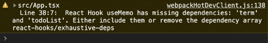

图 8.11：react-hooks/exhaustive-deps

你需要将`term`和`todoList`依赖项添加到数组中：

```js
const filteredTodoList = useMemo(() => todoList.filter((todo: Todo) => {
  console.log('Filtering...')
  return todo.task.toLowerCase().includes(term.toLowerCase())
}), [term, todoList]) 
```

如果你输入`Go`并点击**搜索**按钮，它现在应该可以工作：

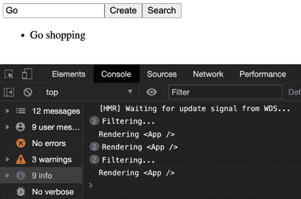

图 8.12：修复警告后的情况

在这里，我们必须使用与`memo`相同的规则；*除非绝对必要，否则不要使用它*。

### 使用`useCallback`记忆化函数定义

现在我们将添加一个删除任务功能来学习`useCallback`是如何工作的。我们首先需要做的是在我们的`App`组件中创建一个新的函数，称为`handleDelete`：

```js
const handleDelete = (taskId: number) => {
  const newTodoList = todoList.filter((todo: Todo) => todo.id !== taskId)
  setTodoList(newTodoList)
} 
```

然后你需要将这个函数作为 prop 传递给`List`组件：

```js
<List todoList={filteredTodoList} handleDelete={handleDelete} /> 
```

然后，在我们的`List`组件中，你需要将 prop 添加到`Props`接口：

```js
interface Props {
  todoList: Todo[]
  handleDelete: any
} 
```

接下来，你需要从 props 中提取它，并将其传递到`Task`组件：

```js
const List: FC<Props> = ({ todoList, handleDelete }) => {
  useEffect(() => {
    // This effect is executed every new render
    console.log('Rendering <List />')
  })
  return (
    <ul>
        {todoList.map((todo: Todo) => (
        <Task
          key={todo.id}
          id={todo.id}
          task={todo.task}
          handleDelete={handleDelete}
            />
        ))}
    </ul>
  )
} 
```

在`Task`组件中，你需要创建一个按钮，该按钮将执行`handleDelete` `onClick`：

```js
interface Props {
  id: number
  task: string
  handleDelete: any
}
const Task: FC<Props> = ({ id, task, handleDelete }) => {
  useEffect(() => {
    console.log('Rendering <Task />', task)
  })
  return (
    <li>{task} <button onClick={() => handleDelete(id)}>X</button></li>
  )
} 
```

到目前为止，我建议你从`List`和`Task`组件中删除或注释掉`console.log`，这样我们就可以专注于过滤的性能。现在你应该能看到任务旁边的**X**按钮：

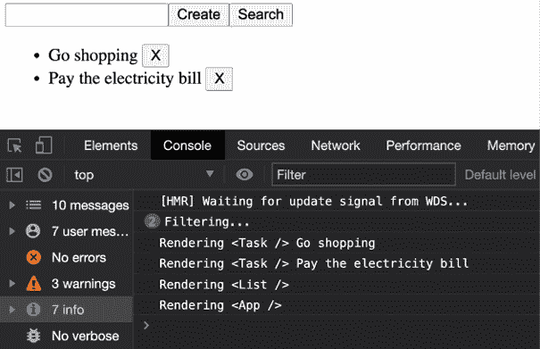

图 8.13：让我们删除一个任务

如果您点击 `Go shopping` 的 **X**，您应该能够删除它：

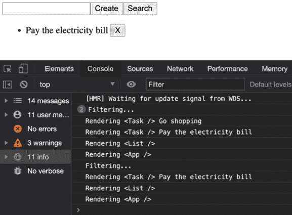

图 8.14：删除任务

到目前为止，一切都很顺利，对吧？但同样，我们在这个实现中又遇到了一点小问题。如果您现在尝试在输入框中输入一些内容，比如 `Go to the doctor`，让我们看看会发生什么：

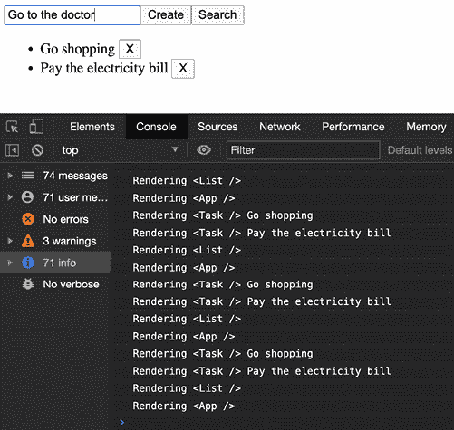

图 8.15：性能不佳

如您所见，我们再次对所有组件进行了 `71` 次渲染。此时，您可能正在想，如果我们已经实现了记忆 HOC 来记忆组件，会发生什么？但现在的问题是，我们的 `handleDelete` 函数被传递到两个组件中，从 `App` 到 `List` 和 `Task`，问题在于这个函数每次重新渲染时都会被重新生成，在这种情况下，每次我们写入某些内容时。那么我们如何解决这个问题呢？

在这种情况下，`useCallback` 钩子是英雄，其语法与 `useMemo` 非常相似，但主要区别在于，`useCallback` 不是像 `useMemo` 那样记忆函数的结果值，而是记忆**函数定义**：

```js
const handleDelete = useCallback(() => SomeFunctionDefinition, []) 
```

我们的 `handleDelete` 函数应该是这样的：

```js
const handleDelete = useCallback((taskId: number) => {
  const newTodoList = todoList.filter((todo: Todo) => todo.id !== taskId)
  setTodoList(newTodoList)
}, [todoList]) 
```

现在，如果我们再次写下 `Go to the doctor`，它应该可以正常工作：

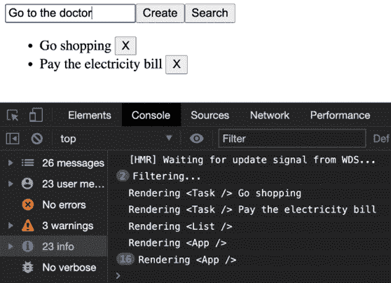

图 8.16：提高性能

现在，我们不再有 `71` 次渲染，而是只有 `23` 次，这是正常的，我们也能够删除任务：

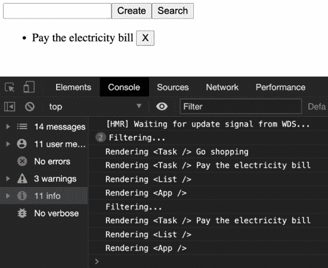

图 8.17：删除任务

如您所见，`useCallback` 钩子帮助我们显著提高性能。在下一节中，您将学习如何在 `useEffect` 钩子中记忆作为参数传递的函数。

### 在效果中记忆作为参数传递的函数

有一种特殊情况，我们需要使用 `useCallback` 钩子，那就是当我们在一个 `useEffect` 钩子中传递一个函数作为参数时，例如在我们的 `App` 组件中。让我们创建一个新的 `useEffect` 块：

```js
const printTodoList = () => {
  console.log('Changing todoList')
}
useEffect(() => {
  printTodoList()
}, [todoList]) 
```

在这种情况下，我们正在监听 `todoList` 状态的变化。如果您运行此代码并创建或删除一个任务，它将正常工作（记得先删除所有其他控制台输出）：

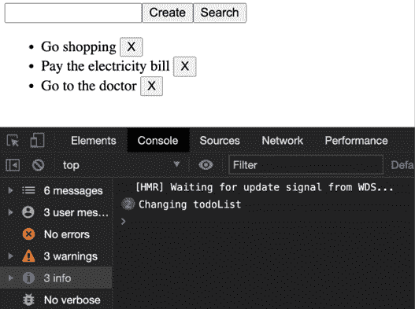

图 8.18：更改待办事项列表

一切都正常，但让我们将 `todoList` 添加到控制台：

```js
const printTodoList = () => {
  console.log('Changing todoList', todoList)
} 
```

如果您正在使用 Visual Studio Code，您将得到以下警告：

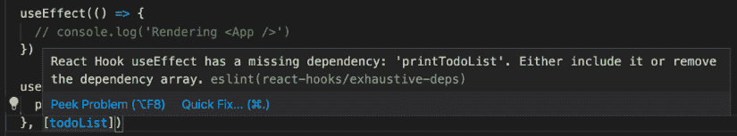

图 8.19：react-hooks/exhaustive-deps

实际上，它是在要求我们添加 `printTodoList` 函数到依赖项中：

```js
useEffect(() => {
  printTodoList()
}, [todoList, printTodoList]) 
```

但现在，在我们这样做之后，我们得到了另一个警告：

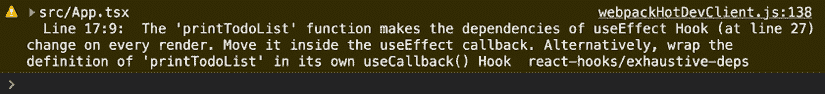

图 8.20：useCallback 警告

我们得到这个警告的原因是我们现在正在操作状态（控制台输出状态），这就是为什么我们需要在这个函数中添加一个 `useCallback` 钩子来解决这个问题：

```js
const printTodoList = useCallback(() => {
  console.log('Changing todoList', todoList)
}, [todoList]) 
```

现在，当我们删除一个任务时，我们可以看到 `todoList` 正确更新了：

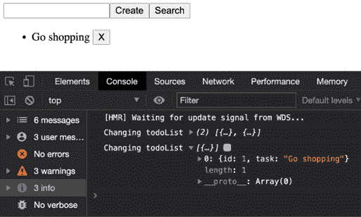

图 8.21：更改待办事项列表数据

到目前为止，这对你来说可能信息量过大，所以让我们快速回顾一下：

+   `memo`:

    +   记忆一个**组件**

    +   当属性改变时重新记忆

    +   避免重新渲染

+   `useMemo`:

    +   记忆一个计算值

    +   对于计算属性

    +   对于重型过程

+   `useCallback`:

    +   记忆一个**函数定义**以避免在每次渲染时重新定义它

    +   当一个函数作为效果参数传递时使用它

    +   当一个函数作为属性传递给记忆组件时使用它

最后，别忘了黄金法则：*除非绝对必要，否则不要使用它们*。

在下一节，我们将学习如何使用新的 `useReducer` 钩子。

# 理解 useReducer 钩子

你可能有一些使用 Redux (`react-redux`) 与类组件的经验，如果是这样，那么你会理解 `useReducer` 的工作原理。概念基本上是相同的：动作、还原器、分发、存储和状态。尽管在一般情况下它们看起来非常相似，但它们有一些区别。主要区别是 react-redux 提供了中间件和包装器，如 **thunk**、**sagas** 以及更多，而 `useReducer` 只提供了你可以用来分发普通对象的 `dispatch` 方法。此外，`useReducer` 默认没有存储；相反，你可以使用 `useContext` 创建一个，但这只是重新发明轮子。

让我们创建一个基本的应用程序来理解 `useReducer` 的工作原理。你可以从创建一个新的 React 应用程序开始：

```js
 npx create-react-app reducer --template typescript 
```

然后，像往常一样，你可以删除你的 `src` 文件夹中的所有文件，除了 `App.tsx` 和 `index.tsx` 以外，以启动一个全新的应用程序。

我们将创建一个基本的 `Notes` 应用程序，我们可以使用 `useReducer` 来 `list`、`delete`、`create` 或 `update` 我们笔记。你需要做的第一件事是将我们稍后创建的 `Notes` 组件导入到你的 `App` 组件中：

```js
import Notes from './Notes'
function App() {
  return (
    <Notes />
  )
}
export default App 
```

现在，在我们的 `Notes` 组件中，你首先需要导入 `useReducer` 和 `useState`：

```js
Import { useReducer, useState, ChangeEvent } from 'react' 
```

然后，我们需要定义一些 TypeScript 类型，这些类型是我们需要用于我们的 `Note` 对象、`Redux` 动作和 **动作类型**：

```js
type Note = {
  id: number
  note: string
}
type Action = {
  type: string
  payload?: any
}
type ActionTypes = {
  ADD: 'ADD'
  UPDATE: 'UPDATE'
  DELETE: 'DELETE'
}
const actionType: ActionTypes = {
  ADD: 'ADD',
  DELETE: 'DELETE',
  UPDATE: 'UPDATE'
} 
```

然后，我们需要创建一些初始的 `initialNotes`（也称为 `initialState`）来模拟一些笔记：

```js
const initialNotes: Note[] = [
  {
    id: 1,
    note: 'Note 1'
  },
  {
    id: 2,
    note: 'Note 2'
  }
] 
```

如果你记得如何使用 `reducers`，那么这将会非常类似于我们使用 `switch` 语句处理 `reducers` 的方式，以便执行基本的操作，如 `ADD`、`DELETE` 和 `UPDATE`：

```js
const reducer = (state: Note[], action: Action) => {
  switch (action.type) {
    case actionType.ADD:
        return [...state, action.payload]
    case actionType.DELETE:
        return state.filter(note => note.id !== action.payload)

    case actionType.UPDATE:
        const updatedNote = action.payload
        return state.map((n: Note) => n.id === updatedNote.id ? updatedNote : n)

    default:
          return state
  }
} 
```

最后，组件非常直接。基本上，你从`useReducer` Hook（类似于`useState`）获取笔记和分发方法，你需要传递`reducer`函数和`initialNotes`（`initialState`）：

```js
const Notes = () => {
  const [notes, dispatch] = useReducer(reducer, initialNotes)
  const [note, setNote] = useState<string>('')
  ...
} 
```

然后，我们有一个`handleSubmit`函数，当我们输入一些内容时创建一个新的笔记。然后，我们按下*Enter*：

```js
const handleSubmit = (e: ChangeEvent<HTMLInputElement>) => {
  e.preventDefault()
  const newNote = {
    id: Date.now(),
    note
  }
  dispatch({ type: actionType.ADD, payload: newNote })
} 
```

最后，我们使用`map`渲染我们的`Notes`列表，我们还创建了两个按钮，一个用于`delete`，一个用于`update`，然后输入应该被包裹在一个`<form>`标签中：

```js
return (
  <div>
    <h2>Notes</h2>
    <ul>
        {notes.map((n: Note) => (
            <li key={n.id}>
               {n.note} {' '}

            <button onClick={() => dispatch({ type: actionType.DELETE, payload: n.id })}>
           X
         </button>
         <button 
                 onClick={() => dispatch({ type: actionType.UPDATE, payload: {...n, note} })}
         >
            Update
         </button>
           </li>
        ))}
    </ul>

    <form onSubmit={handleSubmit}>
        <input 
            placeholder="New note"
            value={note}
            onChange={e => setNote(e.target.value)}
        />
    </form>
  </div>
)
export default Notes 
```

如果你运行应用程序，你应该看到以下输出：

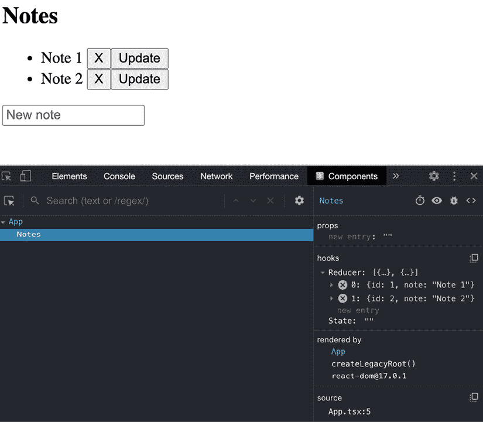

图 8.22：React DevTools

如您在**React DevTools**中看到的，`Reducer`对象包含了我们定义为我们初始状态的两个笔记。

现在，如果你在输入框中写下一些内容并按下*Enter*，你应该能够创建一个新的笔记：

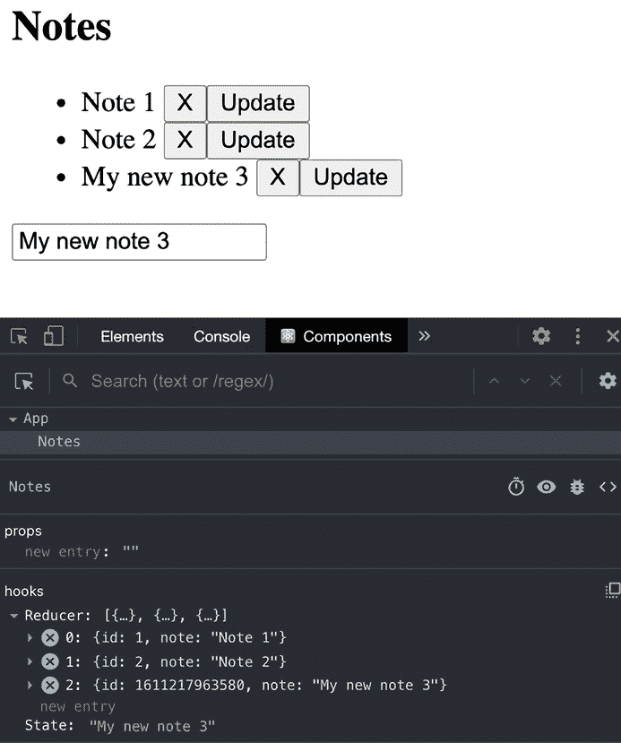

图 8.23：创建新笔记

然后，如果你想删除一个笔记，你只需点击**X**按钮。让我们删除**笔记 2**：

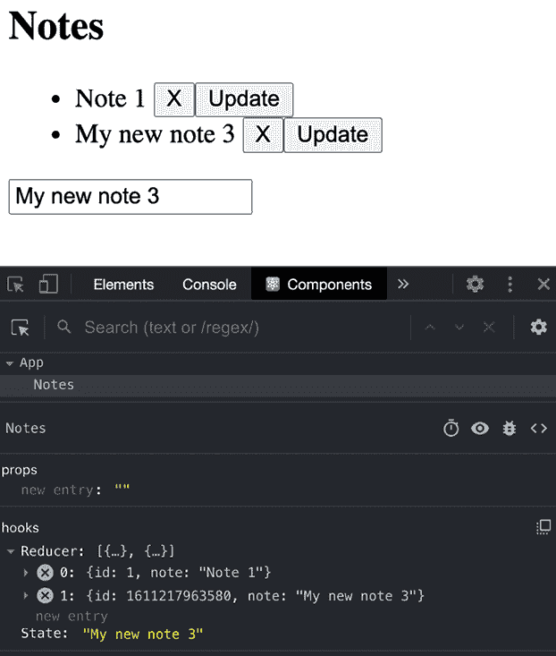

图 8.24：删除笔记

最后，你可以在输入框中写下任何你想要的内容，如果你点击**更新**按钮，你将改变笔记的值：

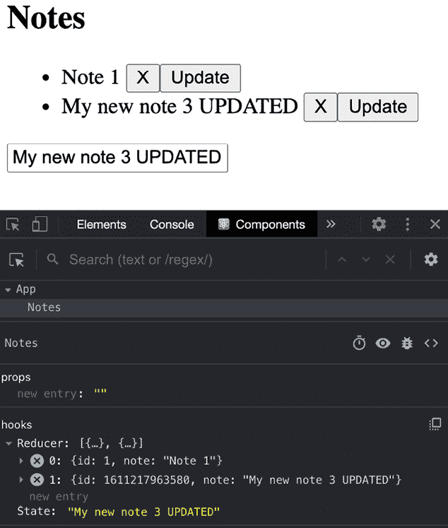

图 8.25：更新笔记

好吧，对吧？如您所见，`useReducer` Hook 在分发方法、动作和 reducer 方面与`redux`几乎相同，但主要区别在于这仅限于组件及其子组件的上下文，所以如果你需要一个可以从整个应用程序访问的全局存储，那么你应该使用`react-redux`。

# 摘要

希望你喜欢阅读这一章，它充满了关于新 React Hooks 的非常棒的信息。到目前为止，你已经学习了新 React Hooks 的工作原理；如何使用 Hooks 获取数据；如何将类组件迁移到**React Hooks**；效果的工作原理，`memo`、`useMemo`和`useCallback`之间的区别；最后，你学习了`useReducer` Hook 的工作原理以及与`react-redux`相比的主要区别。这将帮助你提高 React 组件的性能。

在下一章中，我们将学习 React Router v6 以及如何在我们的项目中实现它。
