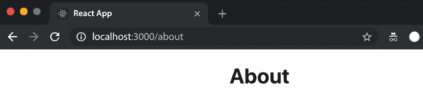
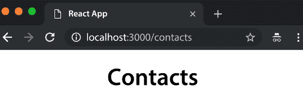
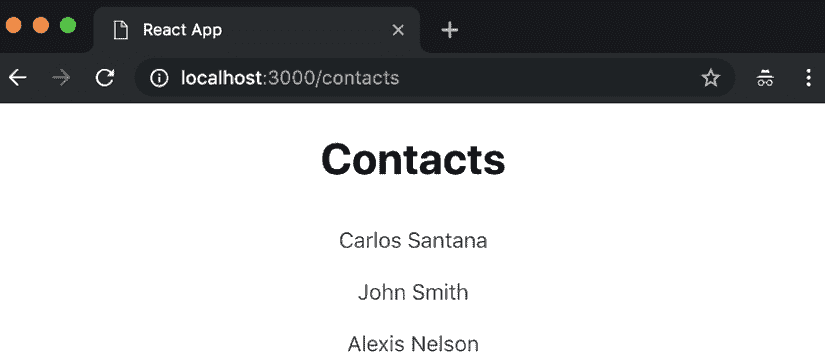
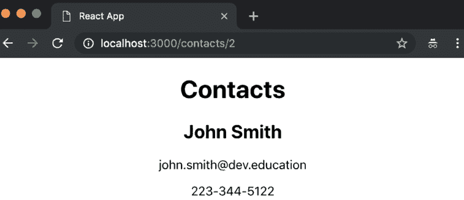
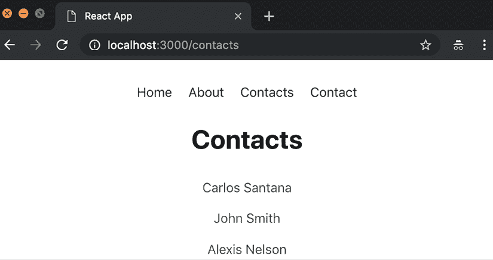
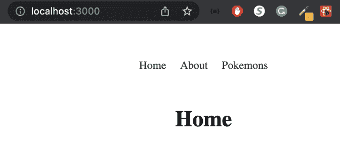
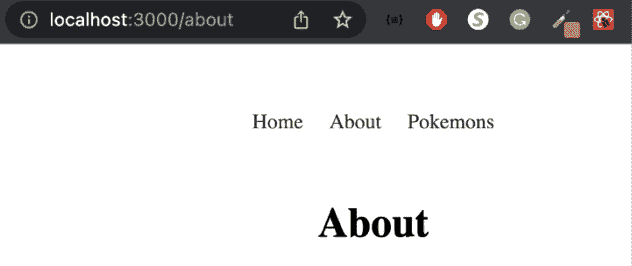
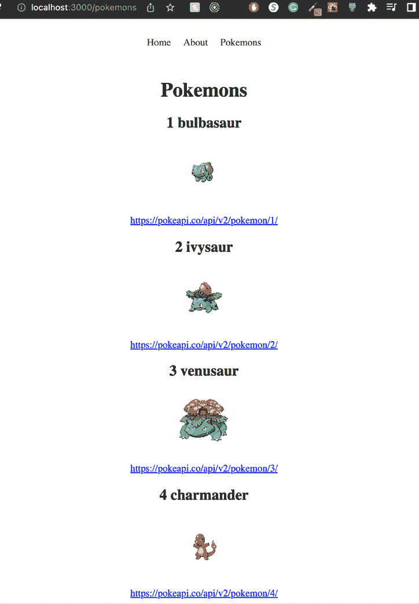

# 第九章：React Router

React 是一个提供大量用于创建网络应用程序的有用构建块的库，但它并不包含你可能需要的所有功能 *开箱即用*。React 不提供的一个关键特性是路由，即处理 URL 并在单页应用程序中导航到不同的页面或视图的能力。为此，我们转向第三方库，而 React 最受欢迎的库是 **React Router**。

在本章中，我们将探索 React Router 并学习如何使用它来创建动态路由并在我们的 React 应用程序中处理导航。到本章结束时，你将很好地理解 React Router 的工作原理以及如何在你的项目中有效地使用它。

在本章中，我们将涵盖以下主题：

+   理解 `react-router`、`react-router-dom` 和 `react-router-native` 包之间的区别

+   如何安装和配置 React Router

+   添加 `<Routes>` 组件

+   为路由添加参数

+   React Router v6.4 和 React Router 加载器

# 技术要求

要完成本章，你需要以下内容：

+   Node.js 19+

+   Visual Studio Code

你可以在本书的 GitHub 仓库中找到本章的代码：[`github.com/PacktPublishing/React-18-Design-Patterns-and-Best-Practices-Fourth-Edition/tree/main/Chapter09`](https://github.com/PacktPublishing/React-18-Design-Patterns-and-Best-Practices-Fourth-Edition/tree/main/Chapter09)。

# 安装和配置 React Router

使用 `create-react-app` 创建新的 React 应用程序后，你需要做的第一件事是安装 **React Router v6.x**，使用以下命令：

```js
npm install react-router-dom @types/react-router-dom 
```

你可能不明白为什么我们要安装 `react-router-dom` 而不是 `react-router`。React Router 包含了 `react-router-dom` 和 `react-router-native` 的所有常见组件。这意味着如果你使用 React 进行网页开发，你应该使用 `react-router-dom`，如果你使用 React Native，则需要使用 `react-router-native`。

`react-router-dom` 包最初是为了包含版本 4 而创建的，而 `react-router` 使用的是版本 3。`react-router-dom` v6 包在 `react-router` 上有一些改进。它们列在这里：

+   **简化路由配置**：React Router v6 引入了一种更直接的路线配置，消除了对 `Switch` 和精确属性的需求。路线现在根据它们的定义顺序隐式优先排序。

+   **嵌套路由**：React Router v6 改进了对嵌套路由的支持。`Outlet` 组件用于渲染子路由，允许更直观和可维护的路线结构。

+   **简化导航**：在 v6 中，`useNavigate` 钩子取代了 `useHistory` 钩子，提供了一种更直接和声明性的导航方法。

+   **路由相对链接和导航**：随着 v6 中 `useLinkProps` 和 `Link` 组件的引入，现在创建与当前路由相关的链接变得更加容易。这减少了硬编码完整路径的需求，并简化了路由管理。

+   **简化路由守卫**：React Router v6 引入了一种更简洁的方法来使用 `useRoutes` 钩子和 `element` 属性进行路由守卫。它允许更容易和更易于维护的路由保护模式。

自从 React Router v6.4 以来，创建路由的方法略有变化，但它仍然支持“旧方法”。在我们的最后一节中，我们将将相同的示例转换为新方法。

# 创建我们的部分

让我们创建一些部分来测试一些基本路由。我们需要创建四个无状态组件（`About`、`Contact`、`Home` 和 `Error404`）并将它们命名为 `index.tsx` 在它们的目录中。

你可以在 `src/components/Home.tsx` 组件中添加以下内容：

```js
const Home = () => (
<div className="Home">
  <h1>Home</h1>
</div>
)
export default Home 
```

`src/components/About.tsx` 组件可以创建如下：

```js
const About = () => (
<div className="About">
  <h1>About</h1>
</div>
)
export default About 
```

以下创建 `src/components/Contact.tsx` 组件：

```js
const Contact = () => (
<div className="Contact">
  <h1>Contact</h1>
</div>
)
export default Contact 
```

最后，`src/components/Error404.tsx` 组件的创建方式如下：

```js
const Error404 = () => (
<div className="Error404">
  <h1>Error404</h1>
</div>
)
export default Error404 
```

在我们创建了所有功能组件之后，我们需要修改我们的 `index.tsx` 文件以导入我们将在下一步创建的路由文件：

```js
// Dependencies
import { createRoot } from 'react-dom/client'
import { BrowserRouter as Router } from 'react-router-dom'
// Routes
import AppRoutes from './routes'
createRoot(document.getElementById('root') as HTMLElement).render(
<Router>
  <AppRoutes />
</Router>
) 
```

现在，我们需要创建 `src/routes.tsx` 文件，其中我们将渲染用户访问根路径（`/`）时的 `Home` 组件：

```js
// Dependencies
import { Routes, Route } from 'react-router-dom'
// Components
import App from './App'
import Home from './components/Home'
const AppRoutes = () => (
<App>
<Routes>
    <Route path="/" element={<Home />} />
</Routes>
</App>
)
export default AppRoutes 
```

之后，我们需要修改我们的 `App.tsx` 文件以将路由组件作为子组件渲染：

```js
import { FC, ReactNode } from 'react'
import './App.css'
type Props = {
children: ReactNode
}
const App: FC<Props> = ({ children }) => (
<div className="App">
    {children}
</div>
)
export default App 
```

如果你运行应用程序，你将在根目录（`/`）中看到 `Home` 组件：

![图片 B18414_09_01.png]

图 9.1：主页

现在，让我们在用户尝试访问任何其他路由时添加 `Error404`：

```js
// Dependencies
import { Routes, Route } from 'react-router-dom'
// Components
import App from './App'
import Home from './components/Home'
import Error404 from './components/Error404'
const AppRoutes = () => (
<App>
    <Routes>
      <Route path="/" element={<Home />} />
      <Route path="*" element={<Error404 />} />
    </Routes>
</App>
)
export default AppRoutes 
```

现在，如果你访问 `/somefakeurl`，你将能够看到 **Error404** 组件：

![图片 B18414_09_02.png]

图 9.2：错误 404 页面

现在，我们可以添加我们的其他组件（`About` 和 `Contact`）：

```js
// Dependencies
import { Routes, Route } from 'react-router-dom'
// Components
import App from './App'
import About from './components/About'
import Contact from './components/Contact'
import Home from './components/Home'
import Error404 from './components/Error404'
const AppRoutes = () => (
<App>
    <Routes>
      <Route path="/" element={<Home />} />
      <Route path="/about" element={<About />} />
      <Route path="/contact" element={<Contact />} />
      <Route path="*" element={<Error404 />} />
    </Routes>
</App>
)
export default AppRoutes 
```

现在，你可以访问 `/about`：



图 9.3：关于页面

或者，你现在可以访问 `/contact`：

![图片 B18414_09_04.png]

图 9.4：联系页面

现在你已经实现了你的第一个路由，让我们在下一节中向路由添加一些参数。

# 向路由添加参数

到目前为止，你已经学会了如何使用 React Router 进行基本路由（单级路由）。接下来，我将向你展示如何向路由添加一些参数并将它们传递到你的组件中。

对于这个例子，我们将创建一个 `Contacts` 组件，在访问 `/contacts` 路由时显示联系人列表，但当用户访问 `/contacts/:contactId` 时，我们将显示联系信息（姓名、电话和电子邮件）。

我们需要做的第一件事是创建我们的 `Contacts` 组件。让我们使用以下骨架：`const Contacts = () => (`

```js
<div className="Contacts">
  <h1>Contacts</h1>
</div>
)
export default Contacts 
```

让我们使用以下 CSS 样式：

```js
.Contacts ul {
  list-style: none;
  margin: 0;
  margin-bottom: 20px;
  padding: 0;
}
.Contacts ul li {
  padding: 10px;
}
.Contacts a {
  color: #555;
  text-decoration: none;
}
.Contacts a:hover {
  color: #ccc;
  text-decoration: none;
} 
```

一旦您创建了`Contacts`组件，您需要将其导入到您的路由文件中：

```js
import { Routes, Route } from 'react-router-dom'
import App from './App'
import About from './components/About'
import Contact from './components/Contact'
import Home from './components/Home'
import Error404 from './components/Error404'
import Contacts from './components/Contacts'
const AppRoutes = () => (
<App>
<Routes>
  <Route path="/" element={<Home />} />
  <Route path="/about" element={<About />} />
  <Route path="/contact" element={<Contact />} />
  <Route path="/contacts" element={<Contacts />} />
  <Route path="*" element={<Error404 />} />
</Routes>
</App>
)
export default AppRoutes 
```

现在，如果您访问`/contacts` URL，您将能够看到`Contacts`组件：



图 9.5：联系人页面

现在，由于`Contacts`组件已连接到 React Router，让我们将联系人作为列表渲染：

```js
import { FC, useState } from 'react'
import { Link, useParams } from 'react-router-dom'
import './Contacts.css'
type Contact = {
  id: number
  name: string
  email: string
  phone: string
}
const data: Contact[] = [
{
    id: 1,
    name: 'Carlos Santana',
    email: 'carlos.santana@dev.education',
    phone: '415-307-3112'
},
{
    id: 2,
    name: 'John Smith',
    email: 'john.smith@dev.education',
    phone: '223-344-5122'
},
{
    id: 3,
    name: 'Alexis Nelson',
    email: 'alexis.nelson@dev.education',
    phone: '664-291-4477'
}
]
const Contacts: FC = () => {
const { contactId = 0 } = useParams()
// For now we are going to add our contacts to our
// local state, but normally this should come
// from some service.
const [contacts, setContacts] = useState<Contact[]>(data)
const renderContacts = () => (
    <ul>
    {contacts.map((contact: Contact, key) => (
    <li key={contact.id}>
      <Link to={`/contacts/${contact.id}`}>{contact.name}</Link>
    </li>
    ))}
    </ul>
)
return (
    <div className="Contacts">
      <h1>Contacts</h1>
      {renderContacts()}
    </div>
)
}
export default Contacts 
```

如您所见，我们正在使用`<Link>`组件，它将生成一个指向`/contacts/contact.id`的`<a>`标签，这是因为我们将向我们的路由文件添加一个新的嵌套路由以匹配联系人的 ID：

```js
const AppRoutes = () => (
<App>
<Routes>
  <Route path="/" element={<Home />} />
  <Route path="/about" element={<About />} />
  <Route path="/contact" element={<Contact />} />
  <Route path="/contacts" element={<Contacts />}>
  <Route path=":contactId" element={<Contacts />} />
</Route>
  <Route path="*" element={<Error404 />} />
</Routes>
</App>
) 
```

React Router v6 有一个名为`useParams`的特殊钩子，它将为您提供访问`contactId`参数的权限：

```js
import { FC, useState } from 'react'
import { Link, useParams } from 'react-router-dom'
import './Contacts.css'
const data = [
{ 
id: 1, 
name: 'Carlos Santana', 
email: 'carlos.santana@dev.education',
phone: '415-307-3112'
},
{
  id: 2,
  name: 'John Smith',
  email: 'john.smith@dev.education',
  phone: '223-344-5122'
}, 
{
  id: 3,
  name: 'Alexis Nelson',
  email: 'alexis.nelson@dev.education',
  phone: '664-291-4477'
}
]
type Contact = {
  id: number
  name: string
  email: string
  phone: string
}
const Contacts: FC<any> = () => {
const { contactId = 0 } = useParams()
console.log('contactId', contactId) 
```

现在，我们将把联系人添加到我们的本地状态中，但通常这应该来自某个服务：

```js
const [contacts, setContacts] = useState<Contact[]>(data) 
```

默认情况下，我们的`selectedNote`是`false`：

```js
let selectedContact: any = false
if (contactId > 0) { 
```

如果`contactId`大于`0`，则我们从`contacts`数组中过滤它：

```js
selectedContact = contacts.filter((contact) => contact.id === Number(contactId))[0]
}
const renderSingleContact = ({ name, email, phone }: Contact) => (
<>
  <h2>{name}</h2>
  <p>{email}</p>
  <p>{phone}</p>
</>
)
const renderContacts = () => (
<ul>
 {contacts.map((contact: Contact, key) => (
  <li key={key}>
  <Link to={`/contacts/${contact.id}`}>{contact.name}</Link>
</li>
))}
</ul>
)
return (
<div className="Contacts">
  <h1>Contacts</h1>
  {/* We render our selectedContact or all the contacts */}
  {selectedContact ? renderSingleContact(selectedContact) :  renderContacts()}
</div>
)
}
export default Contacts 
```

如您所见，我们正在使用`useParams`接收`contactId`参数。

如果您再次运行应用程序，您应该会看到您的联系人如下所示：



图 9.6：显示联系人

如果您点击**约翰·史密斯**（其`contactId`为 2），您将看到联系信息：



图 9.7：显示特定联系人

在此之后，您可以在`App`组件中添加一个`navbar`以访问所有路由：

```js
import { Link } from 'react-router-dom'
import './App.css'
const App = ({ children }) => (
<div className="App">
    <ul className="menu">
    <li><Link to="/">Home</Link></li>
    <li><Link to="/about">About</Link></li>
    <li><Link to="/contacts">Contacts</Link></li>
     <li><Link to="/contact">Contact</Link></li>
    </ul>
    {children}
</div>
)
export default App 
```

现在，让我们修改我们的`App`样式：

```js
.App {
  text-align: center;
}
.App ul.menu {
  margin: 50px;
  padding: 0;
  list-style: none;
}
.App ul.menu li {
  display: inline-block;
  padding: 0 10px;
}
.App ul.menu li a {
  color: #333;
  text-decoration: none;
}
.App ul.menu li a:hover {
  color: #ccc;
} 
```

最后，您将看到类似这样的内容：



图 9.8：显示菜单

到本节结束时，您将知道如何将带参数的路由添加到您的应用程序中。*这真是太棒了，对吧？*

# React Router v6.4

如本章开头所述，**React Router v6.4**引入了一种新的路由实现方式。

让我们重写我们的最后一个示例来探索差异。第一个差异是，我们不再使用之前使用的`AppRoutes`，而是现在将路由直接添加到我们的`App.tsx`文件中。让我们首先修改我们的`main.tsx`并删除`AppRoutes`：

```js
import { createRoot } from 'react-dom/client'
import App from './App'
createRoot(document.getElementById('root') as HTMLElement).render(
<App />
) 
```

现在，在我们的`App.tsx`文件中，我们需要从`react-router-dom`导入一些新函数，并加载每个 URL 将渲染的组件：

```js
import { FC } from 'react'
import { 
  createBrowserRouter, 
  createRoutesFromElements, 
  Route, 
  Link, 
  Outlet, 
  RouterProvider 
} from 'react-router-dom'
import About from './components/About'
import Home from './components/Home'
import Pokemons, { dataLoader } from './components/Pokemons'
import Error404 from './components/Error404'
import './App.css' 
```

之后，我们需要通过使用`createBrowserRouter`和`createRoutesFromElements`函数来指定我们的路由：

```js
const App: FC<any> = () => {
const router = createBrowserRouter(
createRoutesFromElements(
  <Route path="/" element={<Root />}>
  <Route index element={<Home />} />
  <Route path="/about" element={<About />} />
  <Route path="*" element={<Error404 />} />
</Route>
)
)
} 
```

如您所见，我们正在渲染`<Root />`组件，您可能想知道这个组件在哪里。`<Root />`组件的作用是容纳我们的**导航**菜单。此外，使用新的`<Outlet />`组件，我们可以指定我们想要渲染路由内容的位置。为了实现这一点，您需要在定义`App`组件（在顶部）之前创建`<Root />`组件：

```js
const Root = () => (
<>
<ul className="menu">
<li><Link to="/">Home</Link></li>
  <li><Link to="/about">About</Link></li>
  <li><Link to="/pokemons">Pokemons</Link></li>
 </ul>
<div>
 <Outlet />
</div>
</>
 ) 
```

第一条路由是我们的`Home`，这就是为什么我们需要使用索引属性。接下来，我们有`about`路由，我们指定路径为`/about`。最后，我们添加了一个星号，这将匹配我们还没有的其他页面，渲染一个**404 错误页面**。

在创建了`Root`组件并指定了路由之后，我们需要渲染`RouterProvider`并将创建的 router 作为参数传递：

```js
return (
<div className="App">
  <RouterProvider router={router} />
</div>
) 
```

如果您一切操作正确，您应该能够看到**主页**和**关于**页面：



图 9.9：主页

如果您点击**关于**，您应该看到页面如下显示：



图 9.10：关于页面

在了解了 React Router v6.4 的变化之后，我们现在将探讨如何使用**Pokemons**页面作为我们的工作示例来实现新的加载器功能。

## React Router 加载器

React Router 6.4 的主要变化之一是增加了**加载器**。这些加载器提供了一种更好的方式来获取数据，消除了在组件内部使用`useEffect`和`fetch`的常见模式。

如您在菜单中可能已经注意到的，我包括了**Pokemons**页面，但尚未指定路由。这样做的原因是我想用这个页面作为示例来演示如何使用新的 React Router 加载器。

首先，让我们通过使用`Home`组件作为模板来创建我们的`Pokemons`组件：

```js
const Pokemons = () => ( 
<div className="Pokemons">
  <h1>Pokemons</h1>
</div>
)
export default Pokemons 
```

现在我们已经有了基本组件，我们需要创建一个异步的`dataLoader`函数。这个函数将负责获取数据：

```js
export const dataLoader = async () => {
const response = await fetch('https://pokeapi.co/api/v2/pokemon?limit=151')
const data = await response.json()
return data.results
}
export default Pokemons 
```

如您所见，我们在导出`Pokemons`组件作为默认值之前放置了`dataLoader`。一旦您创建了`dataLoader`，您需要在`App.tsx`文件中导入它并指定`Pokemons`的路由。请记住将`dataLoader`传递给加载器属性：

```js
import Pokemons, { dataLoader } from './components/Pokemons'
...
const router = createBrowserRouter(
createRoutesFromElements(
  <Route path="/" element={<Root />}>
  <Route index element={<Home />} />
  <Route path="/about" element={<About />} />
  <Route path="/pokemons" element={<Pokemons />} loader={dataLoader} />
  <Route path="*" element={<Error404 />} />
</Route>
)
) 
```

在将`dataLoader`连接到路由后，我们现在可以渲染`Pokemons`的数据。为了检索数据，我们将使用新的`useLoaderData`钩子。此外，我们将使用`useNavigation`钩子来监控路由的状态，使我们能够确定数据是否仍在加载。以下是为`Pokemons`组件编写的完整代码：

```js
import { useLoaderData, useNavigation } from 'react-router-dom'
const Pokemons = () => {
const pokemons: any = useLoaderData()
const navigation = useNavigation()
if (navigation.state === 'loading') {
return <h1>Loading...</h1>
}
const imgUrl = 'https://raw.githubusercontent.com/PokeAPI/sprites/master/sprites/pokemon/'
return (
<div className="Home">
  <h1>Pokemons</h1>
{pokemons.map((pokemon: any, index: number) => (
<div key={pokemon.name}>
  <h2>{index + 1} {pokemon.name}</h2>

 <p>
 <a href={pokemon.url} target="_blank" rel="noreferrer">
 {pokemon.url}
 </a>
 </p>
 </div>
 ))}
 </div>
)
}
export const dataLoader = async () => {
const response = await fetch('https://pokeapi.co/api/v2/pokemon?limit=151')
const data = await response.json()
return data.results
}
export default Pokemons 
```

让我们来测试我们的**Pokemons**页面。我们应该看到前 150 个**宝可梦**：



图 9.11：宝可梦页面

通过新功能如加载器，React Router v6.4 简化了 React 应用程序中的路由和数据获取。我们使用 `dataLoader` 函数创建了一个 **宝可梦** 页面，该函数从 API 异步获取数据。通过将此功能集成到我们的路由配置中并使用 React Router 的 `useLoaderData` 和 `useNavigation` 钩子，我们提供了一个更友好的用户界面。这些改进使得 React Router v6.4 现在更加健壮、高效和直观，使开发者能够以更少的努力创建更复杂、数据驱动的应用程序。

# 摘要

干得好！通过导航 React Router，你已经掌握了安装、配置和管理路由以及将参数纳入嵌套路由的基本技能。利用这些功能，你将能够使用 React Router 创建更动态和健壮的 Web 应用程序。此外，你还了解了 React Router v6.4 的前沿特性，特别是其创新地使用加载器。

我们即将开始本系列的下一章节，我们将探讨 React 18 中引入的令人兴奋的新功能。通过持续学习和应用，你将精通 React。

# 加入我们的 Discord 社区

加入我们的 Discord 空间，与作者和其他读者进行讨论：

[`packt.link/React18DesignPatterns4e`](https://packt.link/React18DesignPatterns4e)


