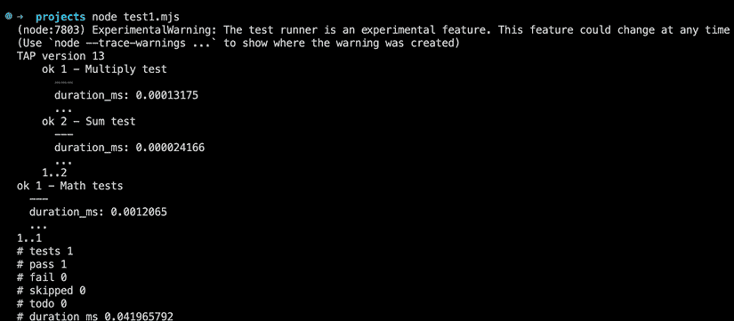

# 第十章：React 18 新特性

React 18，作为流行的 JavaScript 库的最新版本，引入了许多新特性和改进，旨在提高性能并增强开发者体验。作为不断发展的 React 生态系统的一部分，了解这些进步至关重要。在本章中，我们将简要概述 React 18 中最显著的新增功能，随后简要介绍 Node.js 19 的最新功能。

React 18 的新特性包括：

+   **状态更新的自动批处理**：React 18 自动将多个状态更新批处理为单个更新，从而提高了性能和更平滑的动画。这种自动批处理消除了手动批处理的需求。

+   **并发渲染**：此功能允许 React 优先渲染某些组件，从而实现更快的加载时间、更平滑的动画和更好的用户体验。

+   **数据获取的 Suspense**：Suspense 允许开发者挂起组件的渲染，直到所需数据加载完成，从而提供无缝的用户体验和改进的错误处理。

+   **改进的错误处理**：React 18 通过提供更多关于错误的信息，如错误发生的组件和代码位置，简化了错误处理，从而简化了调试过程。

+   **新的组件类型**：React 18 引入了两种新的组件类型—— portals 和具有副作用组件。Portals 允许在父组件之外渲染组件，而具有副作用组件允许在不使用单独函数的情况下执行副作用。

+   **不支持 Internet Explorer 11**：为了利用现代网络标准并提高性能，React 18 不再支持 Internet Explorer 11。开发者必须确保他们的用户使用现代、受支持的浏览器，如 Google Chrome、Mozilla Firefox、Apple Safari 或 Microsoft Edge。

我们将涵盖以下主要主题：

+   并发模式

+   自动批处理

+   服务器端的 Suspense

+   新的 API

+   新的 Hook

+   严格模式

+   Node.js 最新特性

# 并发模式

React **并发模式**是 React 18 的一组新特性，通过允许 React 同时处理多个任务，从而实现更快的响应式用户界面。

在传统的 React 中，渲染过程是同步的，这意味着 React 在单次遍历中更新用户界面。这有时会导致性能问题，尤其是在渲染大型、复杂的应用程序或处理实时更新时。

并发模式允许 React 将渲染过程拆分为更小的独立工作单元，这些单元可以独立并行执行。这意味着 React 可以优先处理某些任务，例如更新用户界面，同时仍然允许其他任务在后台运行，例如处理用户输入或获取数据。

这里是 React 并发模式的几个关键特性：

+   **时间分片**：时间分片是一种技术，允许 React 将大量工作分解成小块，并优先处理最重要的任务。这可以帮助减少应用程序的感知延迟，使其感觉更响应。

+   **Suspense**：Suspense 是 React 中的一种新特性，允许开发者挂起组件的渲染，直到必要的数据被加载。这可以帮助提高应用程序的感知性能并提供更好的用户体验。

+   **并发渲染**：并发渲染是 React 中的一种新渲染模式，允许 React 更频繁地更新用户界面，从而实现更平滑的动画和过渡效果。

总体而言，React 并发模式是一组强大的新特性，可以帮助开发者创建更快、更响应式的用户界面。虽然这可能需要对现有代码进行一些调整，但采用并发模式可以帮助改善应用程序的用户体验，并在快速发展的数字领域中保持竞争力。以下是一个演示在 React 18 中使用时间分片和并发渲染的例子：

```js
import React, { useState } from 'react'
function Counter() {
  const [count, setCount] = useState(0)

  function handleClick() {
    setCount(count + 1)
  } 
  return (
    <button onClick={handleClick}>
      {count}
    </button>
  )
}
function App() {
  return (
    <React.Suspense fallback={<div>Loading...</div>}>
      <Counter />
    </React.Suspense>
  )
}
ReactDOM.createRoot(document.getElementById('root')).render(<App />) 
```

# 自动批处理

自动批处理是 React 18 中的一个新特性，通过自动将多个更新组合成一个渲染遍历来提高更新的性能。在传统的 React 中，用户界面的更新通常是同步处理的，这意味着每次更新都会触发一个新的渲染遍历。

这可能效率低下，尤其是在多个更新连续发生时。自动批处理通过将多个更新组合在一起并在单个渲染遍历中处理它们来解决这个问题。

下面是一个说明自动批处理如何工作的例子：

```js
function MyComponent() {
  const [count, setCount] = useState(0)
  function handleClick() {
    setCount(count + 1)
    setCount(count + 1)
    setCount(count + 1)
  }
  return (
    <div>
      <p>Count: {count}</p>
      <button onClick={handleClick}>Increment</button>
    </div>
  )
} 
```

在这个例子中，我们有一个名为 `MyComponent` 的组件，它使用 `useState` 钩子来管理一个 `count` 状态变量。当用户点击 `Increment` 按钮，我们会连续三次快速调用 `setCount` 函数，每次将计数增加 1。

在传统的 React 中，每次调用 `setCount` 都会触发一个新的渲染遍历，导致用户界面有三个单独的更新。然而，在 React 18 的自动批处理中，这些更新会自动组合在一起并在单个渲染遍历中处理。这可以实现显著的性能提升，尤其是在处理用户输入或实时更新时。

总体来说，自动批处理是 React 18 中的一个强大新特性，可以帮助提高应用程序的性能和响应速度。通过自动将多个更新组合在一起，React 可以优化渲染过程并减少不必要的渲染遍历，从而实现更快、更高效的界面更新。

# 过渡效果

React 18 引入了一个名为 **transitions** 的新特性，允许开发者在其应用程序中创建平滑、声明式的动画和过渡效果。

过渡建立在 React 的声明式编程模型现有功能之上，提供了一种简单直观的方式来动画化元素和组件。

下面是一个简单的例子，说明过渡是如何工作的：

```js
import { useState } from 'react'
import { Transition } from 'react-transition-group'
function MyComponent() {
  const [show, setShow] = useState(false)
  function handleClick() {
    setShow(!show)
  }
  return (
    <div>
      <button onClick={handleClick}>
        {show ? 'Hide' : 'Show'}
      </button>
      <Transition in={show} timeout={300}>
        {(state) => (
          <div
            style={{
              transition: 'opacity 300ms ease-out',
              opacity: state === 'entered' ? 1 : 0,
            }}
          >
            {show && <p>Hello, world!</p>}
          </div>
        )}
      </Transition>
    </div>
  )
} 
```

在这个例子中，我们使用`react-transition-group`库中的`Transition`组件来动画化`p`元素的显示和消失。`Transition`组件接受一个`in`属性，该属性确定元素是否应该显示或隐藏，以及一个`timeout`属性，该属性指定过渡的持续时间（以毫秒为单位）。

在`Transition`组件内部，我们定义了一个函数，该函数接受一个状态参数并返回过渡元素的 内容。状态参数是一个字符串，表示过渡的当前状态，可以是`entering`、`entered`、`exiting`或`exited`之一。

在我们的例子中，我们使用状态参数来根据过渡的当前状态设置`div`元素的透明度。当状态是`entered`时，我们将透明度设置为`1`以使元素完全可见。当状态是`exiting`或`exited`时，我们将透明度设置为`0`以使元素平滑地淡出。

通过使用`Transition`组件和状态参数，我们可以创建一个平滑、声明式的动画，该动画能够响应应用程序状态的变化。这可以是一种强大的方式来创建引人入胜且动态的用户界面，使其感觉生动且响应迅速。

总体而言，过渡是 React 18 中的一个强大新特性，它允许开发者轻松地创建声明式动画和过渡。通过利用 React 的声明式编程模型，开发者可以用几行代码创建复杂的动画和过渡，使创建引人入胜且动态的用户界面变得比以往任何时候都更容易。

# 服务器上的 Suspense

React 18 通过 Suspense 引入了一些改进，这些改进允许开发者创建更高效和可扩展的服务器渲染应用程序。

在 React 18 之前，Suspense 主要用于客户端渲染来管理异步数据加载和代码拆分。然而，随着 React 18 的推出，Suspense 也可以在服务器上使用以优化服务器渲染组件的渲染。

下面是 Suspense 在服务器上工作的高级概述：

+   在服务器渲染组件的初始渲染过程中，任何 Suspense 边界都会被注册，并且它们的回退内容会被渲染而不是主内容。

+   当需要数据加载或代码拆分时，服务器可以返回一个包含 Suspense 边界回退内容的“占位符”HTML 响应。

+   一旦异步数据或代码加载完成，客户端可以使用实际内容来填充 Suspense 边界，用最终内容替换回退内容。

这种方法允许服务器避免渲染可能因数据加载或代码拆分而阻塞的组件树的开销。相反，服务器可以返回一个包含回退内容的简单 HTML 响应，客户端可以快速轻松地渲染它。这可以显著提高服务器端渲染应用程序的性能和可伸缩性。

下面是一个示例，说明如何在服务器上使用 Suspense：

```js
import { Suspense } from 'react'
import { fetchUserData } from './api'
function MyComponent() {
  const userData = fetchUserData();
  return (
    <div>
      <p>Name: {userData.name}</p>
      <Suspense fallback={<p>Loading...</p>}>
        <UserProfile userId={userData.id} />
      </Suspense>
    </div>
  )
} 
```

在这个例子中，我们有一个 `MyComponent` 组件，它从 API 获取用户数据并将其与需要额外数据加载的 `UserProfile` 组件一起渲染。通过在 `UserProfile` 组件周围包裹 `Suspense` 边界，我们可以确保在额外数据加载完成之前显示回退内容。

在服务器端渲染时，服务器可以返回一个简单的 HTML 响应，包含 Suspense 边界的回退内容，允许客户端快速轻松地渲染回退内容。一旦数据加载完成，客户端可以使用实际内容来填充 Suspense 边界，用最终内容替换回退内容。

总体而言，React 18 中 Suspense 对 SSR 的改进有助于提高服务器端渲染应用程序的性能和可伸缩性，使用户能够创建快速响应的 Web 体验。

# 新 API

React 18 引入了一系列新的 API，这些 API 专注于增强用户界面，提高应用程序性能，并为开发者提供更好的体验。值得注意的是，重要的新增包括 `createRoot`、`hydrateRoot` 和 `renderToPipeableStream`。

## createRoot

React 18 引入了一个名为 `createRoot` 的新 API，它提供了一种更简单、更明确的渲染 React 组件到 DOM 中的方法。

传统上，当将 React 应用程序渲染到 DOM 中时，你会使用 `ReactDOM.render` 方法来指定根元素和要渲染到其中的 React 组件。例如：

```js
import React from 'react'
import ReactDOM from 'react-dom'
const App = () => {
  return <div>Hello, world!</div>
}
ReactDOM.render(<App />, document.getElementById('root')) 
```

使用 `createRoot`，你可以创建一个根元素，可以用来 **渲染多个组件**，而不是为每个组件指定根元素。下面是一个示例：

```js
const App = () => {
  return <div>Hello, world!</div>
}
const root = ReactDOM.createRoot(document.getElementById('root'))
root.render(<App />) 
```

在这个例子中，我们首先使用 `createRoot` 创建一个根元素，将我们想要渲染 React 应用程序的 DOM 元素传递给它。然后，我们在 `root` 元素上使用 `render` 方法来指定要渲染的 React 组件。

`createRoot` API 也支持并发模式，这允许 React 通过将大型更新拆分为更小的块来更高效、更响应式地更新 UI。要使用 `createRoot` 的并发模式，你可以传递一个 `mode` 选项：

```js
const root = ReactDOM.createRoot(document.getElementById('root'), { mode: 'concurrent' })
root.render(<App />) 
```

在这个例子中，我们传递了 `mod`e 选项，其值为 `'concurrent'`，表示我们希望在渲染 React 组件时使用并发模式。

总体而言，`createRoot` API 提供了一种更简单、更灵活的方式来将 React 组件渲染到 DOM 中，并支持 React 18 中引入的新功能，如并发模式和改进的带有 Suspense 的服务器端渲染。

## hydrateRoot

`hydrateRoot` 是 React 18 中引入的另一个新 API，它与 `createRoot` 一起工作。

在传统的 React 渲染模型中，服务器会渲染一个静态的 HTML 文档并发送到客户端，客户端随后会创建一个新的 React 根并渲染应用在客户端。然而，随着 SSR 的出现，React 可以在服务器上渲染初始 HTML 并发送到客户端，客户端随后可以将 HTML “水合”成完全功能的 React 应用。

`hydrateRoot` 用于将服务器发送的初始 HTML 水合到 React 组件树的过程。它允许 React 重新使用服务器渲染的标记，从而使初始页面加载更快，客户端的工作量更少。

这里是一个如何使用 `hydrateRoot` 水合客户端初始 HTML 的示例：

```js
import React from 'react'
import { createRoot, hydrateRoot } from 'react-dom'
const App = () => {
  return <div>Hello, world!</div>
}
const root = createRoot(document.getElementById('root'))
if (root.isMounted()) {
  hydrateRoot(document.getElementById('root'), <App />)
} else {
  root.render(<App />)
} 
```

在这个示例中，我们首先使用 `createRoot` 创建一个根元素，就像在之前的示例中做的那样。然后我们通过调用 `root.isMounted()` 检查根是否已经挂载。如果是，我们使用 `hydrateRoot` 来水合页面上现有的 HTML。如果不是，我们使用 `root.render` 以通常的方式渲染 React 组件。

注意，你需要确保服务器和客户端渲染相同的 HTML 结构，否则，水合可能会失败，你可能会在服务器渲染的标记和已水合的 React 组件树之间出现不匹配。为了避免这种情况，你可以使用 Suspense 组件来处理服务器和客户端的异步渲染和数据获取，并确保 HTML 结构保持一致。

## renderToPipeableStream

`renderToPipeableStream` 是 React 18 中引入的另一个新 API，它允许你将 React 组件树渲染到 **Node.js** 流中。这在需要通过网络或文件发送渲染内容的服务器端渲染场景中非常有用。

这里是一个如何使用 `renderToPipeableStream` 将 React 组件渲染到流中的示例：

```js
import React from 'react'
import { renderToPipeableStream } from 'react-dom/server'
import { createServer } from 'http'
const App = () => {
  return <div>Hello, world!</div>
}
const server = createServer((req, res) => {
  const stream = renderToPipeableStream(<App />)
  stream.pipe(res)
})
server.listen(3000) 
```

在这个示例中，我们首先创建一个简单的 React 组件，称为 `App`。然后我们使用 `createServer` 方法创建一个 Node.js HTTP 服务器。当对服务器发出请求时，我们使用 `renderToPipeableStream` 将 `App` 组件渲染到 Node.js 流中。然后我们使用 `pipe` 方法将流管道连接到响应对象。

注意，`renderToPipeableStream` 返回一个 Node.js 流，你可以将其管道连接到其他流或将内容写入文件。这允许你轻松生成服务器端渲染的内容，并通过网络发送或将其保存到磁盘，而无需在内存中缓冲整个 HTML。

还要注意，`renderToPipeableStream` 是异步的，因此它返回一个解析为流的 Promise。这意味着你可以使用 `await` 等待渲染完成后再发送响应。

总体来说，`renderToPipeableStream` 是 Node.js 环境中 SSR 的一个有用 API，可以帮助提高你服务器端渲染应用程序的性能和可扩展性。

# 新钩子

在 React 18 中，引入了一系列创新的钩子，这些钩子提供了管理 ID、过渡和优化性能的增强技术。这些钩子包括 `useId`、`useTransition`、`useDeferredValue` 和 `useInsertionEffect`。

## useId

`useId` 是 React 18 中的一个新内置钩子，可用于生成唯一 ID。这在需要为 React 组件中的元素生成唯一标识符的场景中非常有用，例如在构建表单时。

下面是一个如何使用 `useId` 生成唯一 ID 的示例：

```js
import { useId } from 'react'
const MyComponent = () => {
  const id = useId()
  return <div id={id}>Hello, world!</div>
} 
```

在这个示例中，我们使用 `useId` 钩子生成一个唯一 ID，然后将其用作 `<div>` 元素的 `id` 属性。

`useId` 生成一个在每次渲染中保证不同的唯一 ID。它接受一个可选参数，可以用来指定生成 ID 的前缀，这对于以一致的方式命名元素非常有用。

下面是一个如何使用 `prefix` 参数指定生成 ID 的前缀的示例：

```js
import { useId } from 'react'
const MyComponent = () => {
  const id = useId('my-prefix')
  return <div id={id}>Hello, world!</div>
} 
```

在这个示例中，我们使用带有 `'my-prefix'` 前缀的 `useId` 钩子，它生成以字符串 `'my-prefix'` 开头的 ID。这可以用于以与你的应用程序命名约定一致的方式命名元素。

总体来说，`useId` 是 React 18 的一个有用补充，可以简化为 React 组件中的元素生成唯一标识符的过程。

虽然 React 18 中的 `useId` 钩子提供了独特的优势，但了解某些注意事项对于避免潜在问题至关重要。首先，不建议使用 `useId` 为列表中的元素生成键。首选的方法是直接从你的数据中派生键。其次，`useId` 钩子在服务器渲染期间需要服务器端和客户端组件树之间完全匹配。服务器和客户端渲染树之间的任何差异都可能导致 ID 不一致。

## useTransition

`useTransition` 是 React 18 中的一个新内置钩子，允许你为你的应用程序添加平滑的过渡效果。它是新并发模式功能的一部分，旨在与 Suspense 一起使用，以创建数据获取的加载状态和回退。

下面是一个如何使用 `useTransition` 在数据获取时添加加载指示器的示例：

```js
import React, { useState, useTransition } from 'react'
const MyComponent = () => {
  const [data, setData] = useState(null)
  const [startTransition, isPending] = useTransition({ timeoutMs: 3000 })
  const handleClick = () => {
    startTransition(() => {
      const newData = fetchData()
      setData(newData)
    })
  }
  return (
    <div>
      {isPending && <LoadingSpinner />}
      <button onClick={handleClick}>Fetch Data</button>
      {data && <DataDisplay data={data} />}
    </div>
  )
} 
```

在这个例子中，我们使用 `useState` 来存储获取的数据，并使用 `useTransition` 来处理数据获取时的加载状态。当点击 **Fetch Data** 按钮时，调用 `startTransition` 函数并传递一个回调函数，该回调函数获取数据并更新状态。从 `useTransition` 返回的 `isPending` 值用于条件性地渲染一个加载指示器。

`useTransition` 接收一个可选的配置对象，其中包含一个 `timeoutMs` 属性，该属性指定了在显示加载指示器之前，在挂起状态中可以花费的最大时间。如果数据在超时之前被获取，则不会显示加载指示器。

总体来说，`useTransition` 是 React 18 中一个强大的新特性，可以帮助你创建更平滑、更响应的应用程序，提供更好的用户体验。

## useDeferredValue

`useDeferredValue` 是 React 18 中一个新的内置钩子，允许你将值的更新延迟到下一帧。当处理性能密集型操作，如动画时，这可能很有用。

下面是一个如何使用 `useDeferredValue` 来动画化组件的例子：

```js
import { useState, useDeferredValue } from 'react'
function MyComponent() {
  const [x, setX] = useState(0)
  const deferredX = useDeferredValue(x, { timeoutMs: 100 })
  function handleClick() {
    setX(x => x + 100)
  }
  return (
    <div style={{ transform: `translateX(${deferredX}px)` }} onClick={handleClick}>
      Click me!
    </div>
  )
} 
```

在这个例子中，我们使用 `useState` 来存储组件的当前位置，并使用 `useDeferredValue` 来延迟对位置的更新直到下一帧。当组件被点击时，使用 `setX` 更新位置。延迟的值用于使用 CSS 变换渲染组件，并添加过渡效果。

`useDeferredValue` 接收两个参数：要延迟的值和一个可选的配置对象。配置对象可以用来指定一个 `timeoutMs` 属性，该属性决定了延迟更新的最大时间。默认情况下，更新将延迟到下一帧。

注意，`useDeferredValue` 只能与 `useTransition` 钩子一起使用，它提供了必要的定时信息，以便将更新延迟到下一帧。

## useInsertionEffect

`useInsertionEffect` 是现有 `useEffect` 钩子的一种变体，允许你在 DOM 节点被插入页面后执行操作。这对于与第三方库集成或执行需要 DOM 节点存在的操作非常有用。

下面是一个如何使用 `useInsertionEffect` 的例子：

```js
import { useInsertionEffect } from 'react'
function MyComponent() {
  useInsertionEffect(() => {
    const canvas = document.createElement('canvas')
    canvas.width = 300
    canvas.height = 200
    canvas.style.backgroundColor = 'red'
    document.body.appendChild(canvas)
    return () => {
      document.body.removeChild(canvas)
    }
  }, [])
  return (
    <div>
      <h1>Hello, world!</h1>
      <p>This is my React component.</p>
    </div>
  )
} 
```

在这个例子中，我们使用 `useInsertionEffect` 来创建一个新的 `canvas` 元素，并在组件挂载时将其添加到 DOM 中。钩子返回的清理函数在组件卸载时移除 canvas 元素。

注意，`useInsertionEffect` 的第二个参数是一个空数组。这是因为我们只想在组件挂载后执行一次插入操作。如果我们在这个数组中包含了任何依赖项，那么插入操作会在这些依赖项每次变化时执行。

# 严格模式

React 18 引入了一个名为**Strict Mode**的新功能，允许你为你的 React 应用程序选择更严格的检查和警告集。Strict Mode 的目标是在开发早期捕捉潜在的问题，并鼓励最佳实践，使你的代码更高效且更容易调试。

下面是一个如何使用 Strict Mode 的例子：

```js
import React from 'react'
function MyComponent() {
  return (
    <React.StrictMode>
      <div>
        <h1>Hello, world!</h1>
        <p>This is my React component.</p>
      </div>
    </React.StrictMode>
  )
} 
```

在这个例子中，我们用`React.StrictMode`组件包裹我们的组件树。这可以在开发期间启用一些额外的检查和警告，例如检测不安全的生命周期方法、识别潜在的副作用，以及突出潜在的性能问题。

Strict Mode 不会影响生产环境中应用程序的行为，并且仅在开发期间使用。一旦你确信你的代码没有 Strict Mode 突出显示的任何问题，你就可以从你的代码中移除`React.StrictMode`组件。

值得注意的是，虽然 Strict Mode 可以在开发早期捕捉潜在的问题很有用，但它不能替代彻底的测试和调试。在部署到生产之前，始终彻底测试你的代码，并使用像 React 内置调试工具这样的工具来识别和修复出现的任何问题。

# Node.js 最新特性

在 Node 的最新版本（18 和 19）中，有一些相关的新特性；让我们看看这些版本中有什么新内容。

## 实验性 Fetch API

Node.js 18（也包括在版本 19 中）包括一个默认可用的实验性全局**Fetch API**。该 API 的实现灵感来源于**node-fetch**，它最初基于**undici-fetch**，并来自**undici**。API 的开发者旨在使其尽可能接近规范，但一些功能需要浏览器环境，因此被省略。

下面是一个调用宝可梦 API 的例子：

```js
const getPokemons = async () => {
  const response = await fetch('https://pokeapi.co/api/v2/pokemon')
  if (response.ok) {
    const pokemons = await response.json()
    console.log(pokemons)
  } else {
    console.error(`${response.status} ${response.statusText}`)
  }
}
getPokemons() 
```

这个 Node.js 18（也包括在版本 19 中）的添加使得以下全局变量可用：`fetch`、`FormData`、`Headers`、`Request`和`Response`。用户可以通过指定`--no-experimental-fetch`命令行标志来禁用此 API。

## 实验性测试运行器模块

重要的是要注意，测试运行器模块仍然处于实验阶段。为了编写单元测试并生成**Test Anything Protocol**（**TAP**）格式的报告，我们可以导入`node:test`模块。在本节中，我们将提供一些示例来说明它是如何工作的。这种测试方法与广泛使用的 JavaScript 测试框架 Jest 有一些相似之处。

`node:test`模块简化了编写生成**TAP**格式报告的 JavaScript 测试的过程。要访问它，只需使用以下代码：

```js
import test from 'node:test'
import assert from 'node:assert' 
```

为了提供一个例子，这里是一个带有两个子测试的父测试演示：

```js
import test from 'node:test'
import assert from 'node:assert'
test('Math tests', async (t) => {
  await t.test('Multiply test', (t) => {
    const n = 2 * 2
    assert.equal(n, 4)
  })
  await t.test('Sum test', (t) => {
    const n = 5 + 3
    assert.equal(n, 8)
  })
}) 
```

如果一切正常，你应该会看到类似以下的内容：



图 10.1：实验性测试运行器模块

## 实验性 node watch

`Node --watch`被引入作为`nodemon`的直接竞争对手，并且是一个用于监视任何内容的流行工具，尽管它主要用于 Node.js 项目。然而，通过下面提供的代码片段，你现在可以更轻松地使用它：

```js
node --watch <file or directory to observe> 
```

此代码将自动检测对指定文件或目录所做的任何更改，并根据需要重新启动服务器或脚本。此功能在 Node.js 19.0.0 和 18.11.0+版本中可用。

## Node 18 现在是长期支持（LTS）

在 Node.js 19 发布之后，Node.js 18 于 2022 年 10 月 25 日成为**LTS**版本，代号为*Hydrogen*。这一过渡标志着 Node.js 18.x 的活跃开发阶段的结束。

当前 Node.js 18.x 版本已升级到**Active LTS**状态，并将保持这一状态直到 2023 年 10 月。之后，它将进入**维护**阶段，并继续接收必要的安全修复和更新，直到 2025 年 4 月底。

# 摘要

在 React 18 中，引入了一系列新的功能和改进，这些功能简化了高质量和交互式应用程序的开发。这包括自动批处理状态更新、并发渲染、包含用于数据获取的 Suspense、改进的错误处理以及新增组件类型。因此，开发者现在能够创建更响应和吸引人的用户界面。对于 React 开发者来说，考虑升级到 React 18 具有重大价值。此外，我们还探讨了 Node.js 18 和 19 的关键特性，这些特性对于增强我们的 Web 项目至关重要。

在下一章中，我们将学习如何通过使用 React Context API、React Suspense 和**stale-while-revalidate**（**SWR**）来正确处理数据。
