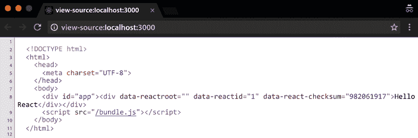

# 12

# 服务器端渲染

在构建 React 应用程序的下一步是学习服务器端渲染（**SSR**）是如何工作的以及它能够给我们带来什么好处。通过实现 SSR，我们可以创建对搜索引擎优化（**SEO**）更有利的**通用应用**，并使前端和后端之间的知识共享成为可能。它们还可以提高网络应用的感知速度，这通常会导致转化率的提高。然而，将 SSR 应用于 React 应用程序是有代价的，我们应该仔细考虑我们是否真的需要它。

在本章中，您将了解如何设置服务器端渲染应用，并在相关章节的末尾，您将能够构建一个通用应用并理解该技术的优缺点。

在本章中，我们将涵盖以下主题：

+   理解通用应用是什么

+   找出我们为什么可能想要启用 SSR 的原因

+   使用 React 创建一个简单的静态服务器端渲染应用

+   在服务器端渲染中添加数据获取，并理解脱水和再水合等概念

+   使用 Zeit 的 **Next.js** 轻松创建一个在服务器和客户端上运行的反应式应用

# 技术要求

为了完成本章，您需要以下内容：

+   Node.js 19+

+   Visual Studio Code

您可以在本书的 GitHub 仓库中找到本章的代码：[`github.com/PacktPublishing/React-18-Design-Patterns-and-Best-Practices-Fouth-Edition/tree/main/Chapter12`](https://github.com/PacktPublishing/React-18-Design-Patterns-and-Best-Practices-Fouth-Edition/tree/main/Chapter12)。

# 理解通用应用

通用应用是一种可以在服务器端和客户端以相同代码运行的应用。在本节中，我们将探讨为什么我们应该考虑使我们的应用通用，以及我们将学习 React 组件如何轻松地在服务器端渲染。

当我们谈论 JavaScript 网络应用时，我们通常想到的是存在于浏览器中的客户端代码。它们通常的工作方式是服务器返回一个带有 script 标签的空 HTML 页面，用于加载应用。当应用准备就绪时，它会在浏览器内部操作 DOM 来显示 UI 并与用户交互。这种情况在过去几年中一直如此，并且对于大量应用来说，这仍然是一种可行的方式。

在这本书中，我们已经看到使用 React 组件创建应用是多么容易，以及它们在浏览器中的工作方式。我们还没有看到的是 React 如何在服务器上渲染相同的组件，这为我们提供了一个强大的功能，称为 SSR。

在深入细节之前，让我们尝试理解创建既在服务器端又在客户端渲染的应用程序意味着什么。多年来，我们通常为服务器和客户端使用完全不同的应用程序：例如，使用 Django 应用程序在服务器上渲染视图，以及在客户端使用一些 JavaScript 框架，如 Backbone 或 jQuery。这些单独的应用程序通常需要由两个不同技能集的开发团队维护。如果你需要在服务器端渲染的页面和客户端应用程序之间共享数据，你可以在一个脚本标签中注入一些变量。使用两种不同的语言和平台，无法在应用程序的不同部分之间共享常见信息，如模型或视图。

自从 Node.js 在 2009 年发布以来，JavaScript 由于像 **Express** 这样的网络应用程序框架，在服务器端也获得了大量的关注和流行。

在两边使用相同的语言不仅使开发者更容易重用他们的知识，而且还使服务器和客户端之间共享代码的不同方式成为可能。

尤其是使用 React，同构 Web 应用程序的概念在 JavaScript 社区中变得非常流行。编写一个 **同构应用程序** 意味着构建一个在服务器和客户端看起来都一样的应用程序。使用相同的语言编写这两个应用程序意味着逻辑的大部分可以共享，这开辟了许多可能性。这使得代码库更容易推理，并避免了不必要的重复。

React 将这一概念推进了一步，为我们提供了一个简单的 API，可以在服务器上渲染我们的组件，并且透明地应用所有使页面交互所需的逻辑（例如，事件处理器）在浏览器上。

术语 *isomorphic* 在这个场景中不适用，因为在这种情况下，React 的应用程序是相同的，这就是为什么 React Router 的一个创造者 Michael Jackson 提出了一个更有意义的名称：**通用**。

在深入探讨实现通用服务器端渲染的具体原因之前，让我们暂停一下，确保我们有一个坚实的理解，即何时以及为什么这个功能可能对我们应用程序来说是必要的。

# 实现 SSR 的原因

SSR 是一个很棒的功能，但我们不应该仅仅为了使用它而盲目地跳进去。我们应该有一个真实、明确的原因来开始使用它。

没有明确目的的 SSR 可能会引入不必要的复杂性和问题到你的应用程序中。SSR 的复杂性可能会使诸如状态管理、数据获取和路由等方面变得复杂。此外，SSR 会增加服务器的负载，因为它负责为每个请求渲染 HTML。如果不仔细优化，这可能会导致响应时间变慢和更高的服务器成本。

此外，SSR（服务器端渲染）给应用程序带来的额外复杂性可能会减缓开发过程，使调试复杂化，并需要维护特定的工具和配置。此外，如果你的应用程序没有大量的公共内容，SSR 通常推动其采用的 SEO 好处可能并不显著。

从本质上讲，虽然 SSR 可以提供好处，但关键是要清楚地了解其权衡。在决定采用 SSR 之前，仔细评估应用程序的需求，并权衡其优势与潜在的不利因素。

## 实施 SEO

我们可能想要在服务器端渲染应用程序的主要原因之一是 SEO。如果我们向主要搜索引擎的爬虫提供空的 HTML 骨架，它们将无法从中提取任何有意义的信息。如今，Google 似乎能够运行 JavaScript，但有一些限制，SEO 通常是我们的业务的关键方面。

多年来，我们通常编写两个应用程序：一个用于爬虫的 SSR 应用程序，另一个用于用户在客户端使用。我们之所以这样做，是因为 SSR 应用程序无法提供用户期望的交互性水平，而客户端应用程序则不会被搜索引擎索引。

维护和支持两个应用程序是困难的，这使得代码库变得不那么灵活，也不太容易改变。幸运的是，随着 React 的出现，我们可以在服务器端渲染我们的组件，并以一种易于爬虫理解和索引内容的方式向爬虫提供我们应用程序的内容。

这对于 SEO 和社交分享服务来说都是非常好的。例如，Facebook 或 Twitter 等平台为我们提供了一种定义当我们的页面被分享时显示的内容片段的方法。

例如，使用 Open Graph，我们可以告诉 Facebook，对于特定的页面，我们希望显示特定的图像，并使用特定的标题作为帖子的标题。仅使用客户端应用程序几乎不可能做到这一点，因为从页面中提取信息的引擎使用的是服务器返回的标记。

如果我们的服务器为所有 URL 返回空的 HTML 结构，结果是当页面在社交网络上分享时，我们的 Web 应用程序的片段也是空的，这影响了它们的传播性。

## 共享的代码库

在应用程序的客户端和服务器端使用 JavaScript 提供了许多好处。首先，它通过在所有组件中使用相同的语言来简化问题。这简化了维护一个良好运行的系统的过程，并促进了公司内部同事之间的知识共享。

此外，在网站的前端和后端之间共享代码消除了重复工作的需要。因此，这种方法通常减少了错误和问题的发生。

此外，维护单个代码库比处理两个独立的代码库更容易管理。此外，在服务器端集成 JavaScript 可以增强前端和后端开发者之间的协作。通过利用相同的语言，他们可以有效地重用代码并迅速做出决策，从而提高工作流程和生产力。

## 更好的性能

最后但同样重要的是，我们都喜欢客户端应用程序，因为它们快速且响应灵敏，但存在一个问题——用户在可以对应用程序采取任何行动之前，必须先加载和运行捆绑包。

这可能在使用现代笔记本电脑或具有快速互联网连接的台式计算机上不是问题。然而，如果我们使用 3G 连接的移动设备加载一个巨大的 JavaScript 捆绑包，用户在与应用程序交互之前必须等待一段时间。这不仅对用户体验总体上不利，还影响转化率。大型电子商务网站已经证明，页面加载时增加的几毫秒可能会对收入产生巨大影响。

例如，如果我们通过服务器提供我们的应用程序，一个空的 HTML 页面和一个脚本标签，并且我们向用户显示一个旋转器，直到他们可以点击任何东西，那么网站速度的感知将受到显著影响。

如果我们在服务器端渲染我们的网站，并且用户在点击页面后立即看到一些内容，那么他们更有可能留下来，即使他们必须等待相同的时间才能真正做任何事情，因为客户端捆绑包必须加载，无论是否使用 SSR。

这种感知的性能是我们可以通过 SSR（服务器端渲染）大幅提升的，因为我们可以在服务器上输出我们的组件，并立即向用户返回一些信息。

## 不要低估 SSR 的复杂性

尽管 React 提供了一个简单的 API 来在服务器上渲染组件，但创建一个通用应用程序是有成本的。因此，在考虑启用它之前，我们应该仔细考虑上述原因，并检查我们的团队是否准备好支持和维护一个通用应用程序。

SSR 可能会产生额外的成本，延长开发时间并增加复杂性。它还增加了服务器负载，可能需要更昂贵的硬件基础设施。在运营方面，SSR 需要一个维护良好的服务器和完整的设置，从而导致运营成本增加。此外，由于复杂性增加，测试可能变得更加耗时。

在这些成本和 SSR（服务器端渲染）的潜在好处之间取得平衡至关重要，例如提高 SEO（搜索引擎优化）和加快初始页面加载速度。

随着我们进入即将到来的章节，我们将发现，在创建服务器端渲染应用的过程中，渲染组件并不是唯一需要完成的任务。我们必须建立并维护一个服务器，包括其路由和逻辑，管理服务器数据流，并执行各种其他必要任务，以维持一个完全功能化的通用应用。考虑缓存内容以提高页面服务效率，并处理其他必要的责任。

因此，我的建议是首先专注于构建你 Web 应用程序的客户端版本。一旦它在服务器上完全功能化并且表现良好，你就可以考虑将 SSR 纳入其中，以提升用户体验。只有在真正需要时才启用 SSR 至关重要。例如，如果你的网站在搜索引擎中的可见性（SEO）是一个优先事项，那么你应该开始考虑实施 SSR。

如果你意识到你的应用程序加载时间很长，并且你已经做了所有的优化（有关此主题的更多信息，请参阅第十六章，*提高应用程序的性能*），你可以考虑使用 SSR 为用户提供更好的体验并提高感知速度。现在我们已经学习了 SSR 是什么以及通用应用程序的好处，让我们在下一节中跳入一些基本的 SSR 示例。

# 创建一个基本的 SSR 示例

现在，我们将创建一个非常简单的服务器端应用程序，以查看构建基本通用设置所需的步骤。故意保持这种最小化和简单的设置，因为这里的目的是展示 SSR 是如何工作的，而不是提供一个全面的解决方案或模板，尽管你可以将示例应用程序作为实际应用的起点。

本节假设读者对 Node.js 有基本的了解，并且熟悉与 JavaScript 构建工具相关的概念，例如**webpack**及其加载器。

应用程序将包含两个部分：

+   在服务器端，我们将使用 Express 创建一个基本的 Web 服务器，并使用服务器端渲染的 React 应用程序提供 HTML 页面。

+   在客户端，我们将像往常一样使用`react-dom`来渲染应用程序。

## 从零开始配置我们的项目使用 webpack

在运行之前，应用程序的两侧都将使用 Babel 进行转译，并使用 webpack 进行打包，这将使我们能够在 Node.js 和浏览器上使用 ES6 的全部功能和模块。

让我们从创建一个新的项目文件夹（你可以称之为`ssr-project`）并运行以下命令来创建一个新的包开始：

```js
npm init 
```

一旦创建了`package.json`，就是安装依赖的时候了。我们可以从 webpack 开始：

```js
npm install webpack 
```

完成这些后，就是安装`ts-loader`和我们需要使用 React 和 TSX 编写 ES6 应用程序所需的预设的时候了：

```js
npm install --save-dev @babel/core @babel/preset-env @babel/preset-react ts-loader typescript 
```

为了创建服务器包，我们需要安装一个依赖项。Webpack 允许我们定义一组 externals，这些是我们不想包含在包中的依赖项。当为服务器生成构建时，最好不包含所有使用的 `Node.js` 包；相反，我们只想打包我们的服务器代码。从服务器包中排除依赖项提供了几个优点，包括减少包大小、加快编译速度以及与 Node.js 环境的兼容性。通过利用 Node.js 的原生模块系统，服务器代码可以直接访问已安装的包，而无需打包。像 `webpack-node-externals` 这样的工具有助于在 webpack 配置中将这些依赖项定义为 externals，从而实现优化的服务器包和简化的构建过程。让我们继续安装这个工具：

```js
npm install --save-dev webpack-node-externals 
```

太好了。现在是时候在 `package.json` 的 npm 脚本部分创建一个条目，这样我们就可以轻松地从终端运行 `build` 命令了：

```js
"scripts": {
  "build": "webpack"
} 
```

接下来，你需要在你的根路径下创建一个 `.babelrc` 文件：

```js
{
  "presets": ["@babel/preset-env", "@babel/preset-react"]
} 
```

我们现在需要创建一个配置文件，称为 `webpack.config.js`，以告诉 webpack 我们希望如何打包我们的文件。

让我们先导入我们将用来设置我们的 node externals 的库。我们还将为 `ts-loader` 定义配置，我们将使用它来为客户端和服务器：

```js
const nodeExternals = require('webpack-node-externals')
const path = require('path')
const rules = [{
  test: /\.(tsx|ts)$/,
  use: 'ts-loader',
  exclude: /node_modules/
}] 
```

在 *第六章*，*让你的组件看起来很漂亮* 中，我们探讨了如何从配置文件中导出一个配置对象。Webpack 有一个很酷的功能，允许我们导出一个配置数组，这样我们就可以在同一个地方定义客户端和服务器配置，并且一次使用两者。

下面的代码块中显示的客户端配置应该非常熟悉：

```js
const client = {
  entry: './src/client.tsx',
  output: {
   path: path.resolve(__dirname, './dist/public'),
   filename: 'bundle.js',
   publicPath: '/'
  },
  module: {
   rules
  }
} 
```

我们正在告诉 webpack 客户端应用程序的源代码位于 `src` 文件夹中，并且我们希望输出包生成在 `dist` 文件夹中。

我们还使用之前创建的带有 `ts-loader` 的对象设置了模块加载器。服务器配置略有不同；我们需要定义一个不同的入口，并添加一些新节点，例如 `target`、`externals` 和 `resolve`：

```js
const server = {
  entry: './src/server.ts',
  output: {
   path: path.resolve(__dirname, './dist'),
   filename: 'server.js',
   publicPath: '/'
  },
  module: {
   rules
  },
  target: 'node',
  externals: [nodeExternals()],
  resolve: {
   extensions: [".ts", ".tsx", ".js", ".json"]
  }
} 
```

如你所见，`entry`、`output` 和 `module` 都是相同的，除了文件名不同。

新参数是目标，我们指定节点告诉 webpack 忽略 Node.js 的所有内置系统包，例如 `fs`，以及 `externals`，我们使用之前导入的库告诉 webpack 忽略依赖项。

最后但同样重要的是，我们必须将配置作为一个数组导出：

```js
module.exports = [client, server] 
```

配置已完成。我们现在可以编写一些代码了，我们将从我们更熟悉的 React 应用程序开始。

## 创建应用程序

让我们创建一个 `src` 文件夹，并在其中创建一个 `app.ts` 文件。

`app.ts` 文件应该包含以下内容：

```js
const App = () => <div>Hello React</div>
export default App 
```

这里没有复杂的内容；我们导入 React，创建一个`App`组件，它渲染`Hello React`消息，并将其导出。

现在让我们创建`client.tsx`，它负责在 DOM 中渲染`App`组件：

```js
import { render } from 'react-dom'
import App from './app'
render(<App />, document.getElementById('root')) 
```

再次，这应该听起来很熟悉，因为我们导入了 React、ReactDOM 以及我们之前创建的`App`组件，并使用 ReactDOM 在具有应用程序 ID 的 DOM 元素中渲染它。

现在让我们转到服务器。

首件事是创建一个`template.ts`文件，它导出一个函数，我们将使用它来返回服务器将返回给浏览器的页面标记：

```js
export default body => `
  <!DOCTYPE html>
  <html>
   <head>
    <meta charset="UTF-8" />
   </head>
   <body>
    <div id="root">${body}</div>
    <script src="img/bundle.js"></script>
   </body>
</html> 
```

这应该相当直接。该函数接受`body`，我们稍后将看到它包含 React 应用程序，并返回页面的骨架。

值得注意的是，即使应用程序在服务器端渲染，我们也会在客户端加载捆绑包。SSR 只是 React 渲染我们的应用程序所做工作的一半。我们仍然希望我们的应用程序是一个客户端应用程序，具有我们可以在浏览器中使用的所有功能，例如事件处理器等。

然后，你需要安装`express`、`react`和`react-dom`：

```js
npm install express react react-dom @types/express @types/react @types/react-dom 
```

现在是时候创建`server.tsx`了，它有更多的依赖项，值得详细探索：

```js
import React from 'react'
import express, { Request, Response } from 'express'
import { renderToString } from 'react-dom/server'
import path from 'path'
import App from './App'
import template from './template' 
```

我们首先导入的是`express`，这是一个库，它允许我们轻松创建带有一些路由的 Web 服务器，并且还能够提供静态文件。

其次，我们导入 React 和 ReactDOM 来渲染`App`，我们也导入它。注意 ReactDOM 导入语句中的`/server`路径。最后我们导入的是我们之前定义的模板。

现在我们创建一个 Express 应用程序：

```js
const app = express() 
```

我们告诉应用程序我们的静态资源存储在哪里：

```js
app.use(express.static(path.resolve(__dirname, './dist/public'))) 
```

如您可能已经注意到的，路径与我们用于 webpack 客户端配置中的客户端包输出目标相同。

然后，接下来是使用 React 的 SSR 逻辑：

```js
app.get('/', (req: Request, res: Response) => {
  const body = renderToString(<App />)
  const html = template(body)
  res.send(html)
}) 
```

我们告诉 Express 我们想要监听`/`路由，当客户端击中它时，我们使用 ReactDOM 库将`App`渲染为一个字符串。这就是 React SSR 的神奇和简单之处。

`renderToString`所做的就是返回由我们的`App`组件生成的 DOM 元素的字符串表示，这与如果使用 ReactDOM 的`render`方法在 DOM 中渲染的相同树。

`body`变量的值可能如下所示：

```js
<div data-reactroot="" data-reactid="1" data-react-checksum="982061917">Hello React</div> 
```

如您所见，它代表我们在`App`的`render`方法中定义的内容，除了 React 在客户端使用的一些数据属性，用于将客户端应用程序附加到服务器端渲染的字符串。

现在我们有了我们应用程序的 SSR 表示，我们可以使用`template`函数将其应用于 HTML 模板，并在 Express 响应中将其发送回浏览器。

最后但同样重要的是，我们必须启动 Express 应用程序：

```js
app.listen(3000, () => {
  console.log('Listening on port 3000')
}) 
```

我们现在准备就绪；只剩下几个操作。第一个是定义 npm 的启动脚本并将其设置为运行节点服务器：

```js
"scripts": {
  "build": "webpack",
  "start": "node ./dist/server"
} 
```

脚本已经准备好了，所以我们可以首先使用以下命令构建应用程序：

```js
npm run build 
```

当创建捆绑包时，我们可以运行以下命令：

```js
npm start 
```

将浏览器指向`http://localhost:3000`并查看结果。

这里有两个需要注意的重要事项。首先，当我们使用浏览器的**查看页面源代码**功能时，我们可以看到应用程序被渲染并从服务器返回的源代码，如果我们没有启用 SSR，我们就看不到这些代码。

第二，如果我们打开 DevTools 并且安装了 React 扩展，我们可以看到`App`组件已经在客户端启动了。

以下截图显示了页面的源代码：



图 12.1：源代码页面

太棒了！现在你已经使用 SSR 创建了你的第一个 React 应用程序，让我们在下一节学习如何获取数据。

# 实现数据获取

上一节中的示例应该清楚地解释如何在 React 中设置一个通用应用程序。这相当直接，主要关注的是完成任务。然而，在实际应用中，我们可能更希望加载一些数据，而不是像示例中的`App`这样的静态 React 组件。

例如，假设我们想在服务器上加载 Dan Abramov 的`gists`，并从我们刚刚创建的 Express 应用程序返回项目列表。

在*第十二章*，*管理数据*的数据获取示例中，我们探讨了如何使用`useEffect`来触发数据加载。在服务器上这不会起作用，因为组件不会在 DOM 上挂载，生命周期 Hook 也永远不会被触发。

使用之前执行过的 Hooks 也不会起作用，因为数据获取操作是异步的，而`renderToString`不是。因此，我们必须找到一种方法在之前加载数据，并将其作为 props 传递给组件。

让我们看看如何将上一节中的应用程序稍作修改，使其在 SSR 阶段加载`gists`。

首件事是将**App.tsx**修改为接受一个`gists`列表作为`props`，并在`render`方法中遍历它以显示它们的描述：

```js
import { FC } from 'react'
type Gist = {
  id: string
  description: string
 }
 type Props = {
  gists: Gist[]
}
const App: FC<Props> = ({ gists }) => ( 
  <ul>
   {gists.map(gist => (
    <li key={gist.id}>{gist.description}</li>
   ))}
  </ul>
)
export default App 
```

应用我们在上一章中学到的概念，我们定义一个无状态的函数组件，它接收`gists`作为`props`并遍历元素以渲染项目列表。现在，我们必须更改服务器以检索`gists`并将它们传递给组件。

要在服务器端使用`fetch` API，我们必须安装一个名为`isomorphic-fetch`的库，该库实现了 fetch 标准。它可以在 Node.js 和浏览器中使用：

```js
npm install isomorphic-fetch @types/isomorphic-fetch 
```

我们首先将库导入到`server.tsx`中：

```js
import fetch from 'isomorphic-fetch' 
```

我们想要进行的 API 调用如下所示：

```js
fetch('https://api.github.com/users/gaearon/gists') 
  .then(response => response.json()) 
  .then(gists => {}) 
```

在这里，`gists` 可用于在最后一个 `then` 函数内部使用。在我们的情况下，我们希望将它们传递给 `App`。

因此，我们可以将 `/` 路由修改如下：

```js
app.get('/', (req, res) => { 
  fetch('https://api.github.com/users/gaearon/gists')
   .then(response => response.json()) 
   .then(gists => {
    const body = renderToString(<App gists={gists} />)
    const html = template(body)
    res.send(html)
    })
}) 
```

在这里，我们首先获取 `gists`，然后以字符串的形式渲染 `App`，并传递属性。

一旦 `App` 被渲染并且我们有了它的标记，我们就使用上一节中使用的模板，并将其返回给浏览器。

在控制台中运行以下命令，并将浏览器指向 `http://localhost:3000`。你应该能够看到一个 `server-side render` 的 `gists` 列表：

```js
npm run build && npm start 
```

为了确保列表是从 Express 应用程序渲染的，你可以导航到 `view-source:http://localhost:3000`，你将看到标记和 `gists` 的描述。

这很好，看起来也很简单，但如果我们检查 DevTools 控制台，我们可以看到 `Cannot read property 'map' of undefined error`。我们看到错误的原因是在客户端，我们再次渲染 `App`，但没有将 `gists` 传递给它。

这在开始时可能听起来有些反直觉，因为我们可能认为 React 足够智能，可以在客户端使用服务器端字符串中渲染的 `gists`。但这并不是实际情况，因此我们必须找到一种方法，使 `gists` 也可以在客户端使用。

你可能会考虑在客户端再次执行 `fetch`。这也可以工作，但不是最优的，因为你最终会触发两个 HTTP 请求，一个在 Express 服务器上，一个在浏览器中。如果我们仔细想想，我们已经在服务器上执行了调用，并且我们已经拥有了所有需要的数据。在服务器和客户端之间共享数据的一个典型解决方案是在 HTML 标记中解冻数据，并在浏览器中重新解冻它。

这看起来像是一个复杂的概念，但实际上并不复杂。我们现在将看看如何轻松实现。我们必须做的第一件事是在客户端获取 `gists` 之后，将它们注入到模板中。

要做到这一点，我们必须稍微修改一下模板，如下所示：

```js
export default (body, gists) => `
  <!DOCTYPE html>
  <html>
   <head>
    <meta charset="UTF-8" /> 
   </head>
   <body>
    <div id="root">${body}</div>
    <script>window.gists = ${JSON.stringify(gists)}</script>
    <script src="img/bundle.js"></script>
   </body>
  </html>
` 
```

`template` 函数现在接受两个参数——应用的 `body` 和 `gists` 集合。第一个参数被插入到 `app` 元素中，而第二个参数用于定义一个全局的 `gists` 变量，并将其附加到 `window` 对象上，这样我们就可以在客户端使用它。

在 Express 路由（`server.ts`）内部，我们只需更改生成模板时传递 `body` 的那一行，如下所示：

```js
const html = template(body, gists) 
```

最后但同样重要的是，我们必须在 `client.tsx` 文件中，使用附加到窗口上的 `gists`，这相当简单：

```js
ReactDOM.hydrate(
  <App gists={window.gists} />,
  document.getElementById('app') 
) 
```

`hydrate` 方法是在 React 16 中引入的，它在客户端与 `render` 方法的工作方式相似，无论 HTML 是否有服务器端渲染的标记。如果没有使用 SSR 的标记，那么 `hydrate` 方法将触发一个警告，你可以通过使用新的 `suppressHydrationWarning` 属性来忽略这个警告。

我们直接读取 `gists`，并将它们传递给在客户端渲染的 `App` 组件。

现在，再次运行以下命令：

```js
npm run build && npm start 
```

如果我们将浏览器窗口指向`http://localhost:3000`，错误就会消失，如果我们使用 React DevTools 检查`App`组件，我们可以看到客户端的`App`组件是如何接收 gists 集合的。

既然我们已经创建了第一个 SSR 应用程序，那么现在让我们看看如何通过在下一节中使用一个名为 Next.js 的 SSR 框架来更容易地做到这一点。

# 使用 Next.js 创建 React 应用程序

你已经了解了使用 React 的 SSR 基础知识，并且可以使用我们创建的项目作为真实应用程序的起点。然而，你可能认为有太多的样板代码，并且需要了解太多不同的工具才能运行一个简单的通用应用程序。这是一种常见的感受，称为**JavaScript 疲劳**，正如本书引言中所描述的。

幸运的是，Meta 的开发者和 React 社区中的其他公司正在非常努力地改进开发体验（DX），使开发者的生活更加轻松。你可能已经使用过`create-react-app`来尝试前几章中的示例，你应该理解它如何使创建 React 应用程序变得非常简单，而不需要开发者学习许多技术和工具。

现在，`create-react-app`还不支持 SSR，但有一家公司叫做**Vercel**，它创建了一个名为**Next.js**的工具，这使得生成通用应用程序变得非常容易，无需担心配置文件。它还大大减少了样板代码。

重要的是要说明，使用抽象来快速构建应用程序总是非常好的。然而，在添加太多层之前了解内部工作原理是至关重要的，这就是为什么我们在学习 Next.js 之前先从手动过程开始。我们已经研究了 SSR 的工作原理以及如何从服务器将状态传递到客户端。现在，基础概念已经清晰，我们可以继续使用一个稍微隐藏一些复杂性的工具，这样我们就可以用更少的代码实现相同的结果。

我们将创建一个相同的应用程序，其中加载了 Dan Abramov 的所有 gists，你将看到代码是如何干净且简单的，这要归功于 Next.js。

首先，创建一个新的项目文件夹（你可以称它为`next-project`），并运行以下命令：

```js
npm init 
```

当这一切完成时，我们可以安装 Next.js 库和 React：

```js
npm install next react react-dom typescript @types/react @types/node 
```

现在项目已经创建，我们必须添加一个 npm 脚本来运行二进制文件：

```js
"scripts": {
  "dev": "next" 
} 
```

完美！现在是我们生成`App`组件的时候了。Next.js 基于约定，其中最重要的一个约定是你可以创建与浏览器 URL 匹配的页面。默认页面是`index`，因此我们可以创建一个名为`pages`的文件夹，并在其中放置一个`index.js`文件。

我们开始导入依赖项：

```js
import fetch from 'isomorphic-fetch' 
```

再次，我们导入`isomorphic-fetch`，因为我们想能够在服务器端使用`fetch`函数。

然后我们定义一个名为`App`的组件：

```js
const App = () => {}
export default App 
```

然后我们定义一个静态异步函数，称为 `getInitialProps`，这是我们告诉 Next.js 我们想要加载哪些数据，无论是在服务器端还是在客户端。该库将函数返回的对象作为组件内部的 props 提供。

将 `stati`c 和 `async` 关键字应用于类方法意味着该函数可以在类的实例外部访问，并且该函数在其主体内部产生 `wait` 指令的执行。

这些概念相当高级，它们不属于本章的范围，但如果您对它们感兴趣，您应该查看 ECMAScript 提案 ([`github.com/tc39/proposals`](https://github.com/tc39/proposals))。

我们刚才描述的方法的实现如下：

```js
App.getInitialProps = async () => {
  const url = 'https://api.github.com/users/gaearon/gists'
  const response = await fetch(url)
  const gists = await response.json() 
  return {
   gists
  }
} 
```

我们正在告诉函数触发 `fetch` 并等待响应，然后我们将响应转换为 JSON，它返回一个承诺。当承诺解决时，我们可以返回带有 `gists` 的 `props` 对象。

组件的渲染看起来与上一个非常相似：

```js
return (
  <ul>
   {props.gists.map(gist => (
    <li key={gist.id}>{gist.description}</li> 
   ))}
  </ul> 
) 
```

在运行项目之前，您需要配置 `tsconfig.json`：

```js
{
  "compilerOptions": {
   "baseUrl": "src",
   "esModuleInterop": true,
   "module": "esnext",
   "noImplicitAny": true,
   "outDir": "dist",
   "resolveJsonModule": true,
   "sourceMap": false,
   "target": "esnext",
   "lib": ["dom", "dom.iterable", "esnext"],
   "allowJs": true,
   "skipLibCheck": true,
   "strict": true,
   "forceConsistentCasingInFileNames": true,
   "noEmit": true,
   "moduleResolution": "node",
   "isolatedModules": true,
   "jsx": "react-jsx"
  },
  "include": ["src/**/*.ts", "src/**/*.tsx"],
  "exclude": ["node_modules"]
} 
```

现在，打开控制台并运行以下命令：

```js
npm run dev 
```

我们将看到以下输出：

```js
> Ready on http://localhost:3000 
```

如果我们将浏览器指向该 URL，我们可以看到通用应用程序的实际运行情况。使用 Next.js 几行代码和零配置设置通用应用程序真是太容易了，这真的很令人印象深刻。

您可能还会注意到，如果您在编辑器中编辑应用程序，您将能够立即在浏览器中看到结果，而无需刷新页面。这是 Next.js 的另一个特性，它实现了热模块替换。这在开发模式下非常有用。

如果您喜欢这一章，请在 GitHub 上给它点个赞：[`github.com/zeit/next.js`](https://github.com/zeit/next.js)。

# 摘要

服务器端渲染的旅程已经结束。现在您可以使用 React 创建服务器端渲染的应用程序，并且应该清楚为什么这对您来说很有用。SEO 当然是主要原因之一，但社交分享和性能也是重要因素。您学习了如何在服务器上加载数据并在 HTML 模板中使其脱水，以便在浏览器启动时提供给客户端应用程序。

最后，您了解了如何使用 Next.js 等工具来减少样板代码并隐藏设置服务器端渲染的 React 应用程序通常带来的某些复杂性。

在下一章中，我们将讨论如何提高我们的 React 应用程序的性能。

# 加入我们的 Discord 社区

加入我们社区的 Discord 空间，与作者和其他读者进行讨论：

[`packt.link/React18DesignPatterns4e`](https://packt.link/React18DesignPatterns4e)


