# 第十四章：单仓库架构

当我们思考构建应用程序时，我们通常会谈论一个应用程序、一个`git`仓库和构建输出。然而，这种应用程序和仓库的配置并不总是反映开发者的实际体验。通常，组织会使用一个包含所有可能用于共同开发的程序、组件和库的单个仓库。这些被称为单仓库或单一仓库，并且它们正变得越来越受欢迎。

那么，是什么让单仓库对组织变得有趣？为什么要把所有代码放在一个地方？为什么不只有一个包含许多小型和独立仓库的单一`git`仓库？如果我们把所有代码都保存在一个项目中。

通过将所有代码保存在一个仓库中，你可以确保整个组织中的所有依赖项都保持最新。这可能是单仓库最大的好处。这样我们就可以停止浪费时间去更新几个不同项目的所有依赖项。

在本章中，我们将通过使用 TypeScript、webpack 和 NPM Workspaces 来创建包含多个包的单仓库进行讲解。

我们将探讨以下主题：

+   单仓库的优势及其解决的问题

+   如何创建单仓库

+   在单仓库中实现 TypeScript

+   创建一个`devtools`包以使用 Webpack 编译其他包

+   创建一个`utils`包

+   如何创建多站系统

# 技术要求

要完成本章，你需要以下内容：

+   Node.js 19+

+   Visual Studio Code

你可以在本书的 GitHub 仓库中找到本章的代码：[`github.com/PacktPublishing/React-18-Design-Patterns-and-Best-Practices-Fourth-Edition/tree/main/Chapter14`](https://github.com/PacktPublishing/React-18-Design-Patterns-and-Best-Practices-Fourth-Edition/tree/main/Chapter14)。

# 单仓库的优势及其解决的问题

**MonoRepo**（单仓库）的一些优势包括：

+   **共享变得简单**：由于所有代码都在一个地方，利用相同的代码或工具跨多个项目变得更加容易，从而节省宝贵的时间和精力。

+   **避免混淆**：在 MonoRepo 中，每个项目都使用共享组件的同一版本，消除了不同版本之间兼容性问题的担忧。

+   **一次性更改所有内容**：在单仓库（MonoRepo）中，同时跨所有项目进行更改变得简单直接，这与在单独的仓库中管理单个项目的复杂性形成对比。

+   **分组更改**：在 MonoRepo 中同时修改多个项目确保所有相关组件保持同步，从而实现高效和连贯的更新。

+   **人人皆可看到一切**：由于所有代码都集中在一个仓库中，所有开发者都可以访问它，这有助于更好地理解整个系统，并促进有效的协作。

现在让我们来探讨一些 MonoRepo 解决的实际问题：

+   **更新更快**：使用 MonoRepo，你可以一次性更新所有项目。没有它，你将不得不单独更新每个项目，这可能会花费很多时间。

+   **不再混淆**：没有 MonoRepo，不同的项目可能会使用相同事物的不同版本，这可能会引起问题。在 MonoRepo 中，所有东西都使用相同的版本，因此不会有混淆。

+   **更好的团队合作**：当所有代码都在一个地方时，开发者可以轻松地看到和理解其他人做了什么。这有助于他们更好地合作。

+   **新手更容易上手**：对于新团队成员来说，当所有代码都在一个地方时，开始工作会更容易。他们可以快速理解整个系统，而不是需要在不同地方搜索。

重要的是要记住，MonoRepos 可能并不总是最佳选择。它们可能会引入自己的挑战，例如当它们变得过大时可能出现的性能问题和复杂性增加。是否采用 MonoRepo 取决于团队的具体需求和项目规模。

在下面的图像中，你可以看到**MonoRepo**的结构与**多仓库**的结构有何不同：

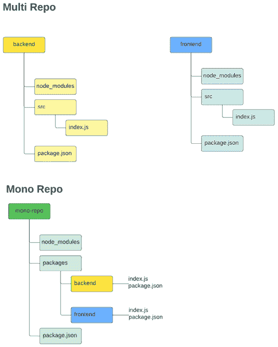

图 14.1：多仓库与单仓库对比

现在我们已经阐明了单仓库的概念，并探讨了为什么它越来越受到组织的青睐，我们将深入探讨使用 NPM Workspaces 实现单仓库的实践方法。

# 使用 NPM Workspaces 创建 MonoRepo

**NPM Workspaces**是在 NPM 7 中引入的，是一个通用术语，指的是 npm CLI 中提供支持管理本地文件系统中多个包的一组功能，这些包位于单个顶级根包内部。

为了创建一个单仓库，你需要首先创建一个根`package.json`文件，它应该包含以下代码：

```js
{
  "name": "web-creator",
  "private": true,
  "workspaces": [
    "packages/*"
  ]
} 
```

我们将命名我们的 MonoRepo 为`web-creator`。我们需要指定`web-creator`将是私有的（只有根目录），并且我们需要指定我们的包将驻留的工作区，即`"packages/*"`；这里的`*`表示我们将包括`packages`文件夹下存在的任何目录。之后，你需要直接创建包。

让我们在新的`packages`文件夹内创建两个目录：`"packages/api"`和`"packages/frontend"`。现在转到你的`api`项目并运行`npm init -y`：

```js
cd packages/api
npm init -y 
```

一旦运行该命令，它将创建一个`package.json`文件，如下所示：

```js
{
  "name": "api",
  "version": "1.0.0",
  "main": "index.js",
  "author": "",
  "license": "ISC"
} 
```

如你所见，该包的默认名称将是`"api"`，但为了将此包连接到我们的主单一仓库，我们需要使用特殊格式调用它；在这种情况下，你需要将其重命名为`"@<name_of_root_package>/api"`，在我们的例子中将是`"@web-creator/api"`。你的`package.json`应该像这样：

```js
{
  "name": "@web-creator/api",
  "version": "1.0.0",
  "main": "index.js",
  "author": "",
  "license": "ISC"
} 
```

现在，你需要在你的`api`目录（稍后我们将将其更改为 TypeScript）中创建一个文件（`packages/api/index.js`），包含以下代码：

```js
module.export = () => console.log("I'm the API package") 
```

在此之后，你需要前往你的`frontend`包（`packages/frontend`）并运行相同的`npm init -y`命令：

```js
cd packages/frontend
npm init -y 
```

此外，你还需要重命名那个包`@web-creator/frontend`：

```js
{
  "name": "@web-creator/frontend",
  "version": "1.0.0",
  "main": "index.js",
  "author": "Carlos Santana",
  "license": "ISC"
} 
```

单一仓库现在可以共享包了。假设你现在想在你的`frontend`包中消费你的`api`包。为此，你需要将`api`包指定为依赖项，并将该`api`包中的相同版本放入其中；在这种情况下，版本将是 1.0.0。你需要非常小心，除非你真的需要，否则不要更改此版本，如果你更改了它，那么你还需要在`dependencies`节点上更新它。

这将是你的`packages/frontend`中的`package.json`：

```js
{
  "name": "@web-creator/frontend",
  "version": "1.0.0",
  "main": "index.js",
  "author": "Carlos Santana",
  "license": "ISC",
  "dependencies": {
    "@web-creator/api": "1.0.0" // this version needs to match with the API package.json
  }
} 
```

在你指定了`api`包作为依赖项之后，你需要在前端项目中运行`npm install`。你将注意到一个非常有趣的事情，即使你在`frontend`包（`packages/frontend`）内部运行`npm install`命令，你的`node_modules`文件夹也会在根级别创建，看起来像这样：

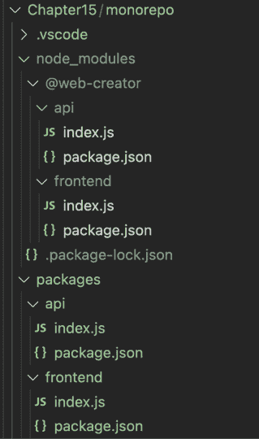

图 14.2：Monorepo 结构

如果一切按预期工作，你可以在你的`frontend`包中消费你的`api`包。为此，你需要在`packages/frontend/index.js`中创建一个`index.js`文件，包含以下代码：

```js
const api = require('@web-creator/api')
api() 
```

现在，你可以使用`node`执行你的索引文件，并看到来自`api`包的控制台消息：

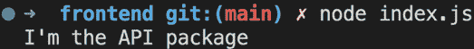

图 14.3：运行前端

单一仓库最大的优点之一是，如果你更新了你的 API `index.js`，变化将立即反映出来，无需你编译任何内容或发布任何包到 NPM 注册表。这对开发者在编码大型项目时非常有帮助。现在让我们将我们的消息更改为`I'm the API package UPDATED`在`packages/api/index.js`中，并再次使用`node`运行`index.js`：


图 14.4：更新 API

恭喜你，你已经成功创建了你的第一个 MonoRepo！在下一节中，我们将把我们的 MonoRepo 转换为使用 TypeScript。

# 在我们的 MonoRepo 中实现 TypeScript

在接下来的章节中，我将概述创建多站点的项目的步骤。由于涉及的代码量很大，我无法将所有内容都包含在这本书中。然而，我邀请您查看在 [`github.com/PacktPublishing/React-18-Design-Patterns-and-Best-Practices-Fourth-Edition/tree/main/Chapter14/web-creator`](https://github.com/PacktPublishing/React-18-Design-Patterns-and-Best-Practices-Fourth-Edition/tree/main/Chapter14/web-creator) 可用的存储库中的完整代码。

为了将 TypeScript 添加到你的项目中，你需要将 `typescript` 包安装到根级别：

```js
npm install -D typescript 
```

之后，你还需要在根级别创建 `tsconfig.json` 文件，代码如下：

```js
{
  "extends": "./tsconfig.common.json",
  "compilerOptions": {
    "baseUrl": "./packages",
    "paths": {
      "@web-creator/*": ["*/src"]
    }
  }
} 
```

如你所见，我们将 `tsconfig.json` 文件扩展到 `tsconfig.common.json`，这是因为我们不希望重复每个我们想要转换为 TypeScript 的包。我们想要指定的唯一的 `compilerOptions` 是 `packages` 目录上的 `baseUrl`，在路径中我们将指定我们的 MonoRepo 的名称，以便能够在代码中进行导入。这是你需要创建的 `tsconfig.common.json` 文件：

```js
{
  "compilerOptions": {
    "allowSyntheticDefaultImports": true,
    "alwaysStrict": true,
    "declaration": true,
    "declarationMap": true,
    "downlevelIteration": true,
    "esModuleInterop": true,
    "experimentalDecorators": true,
    "jsx": "react-jsx",
    "lib": ["DOM", "DOM.Iterable", "ESNext"],
    "module": "commonjs",
    "moduleResolution": "node",
    "noEmit": false,
    "noFallthroughCasesInSwitch": false,
    "noImplicitAny": true,
    "noImplicitReturns": true,
    "outDir": "dist",
    "resolveJsonModule": true,
    "skipLibCheck": true,
    "sourceMap": true,
    "strict": true,
    "strictFunctionTypes": true,
    "strictNullChecks": true,
    "suppressImplicitAnyIndexErrors": false,
    "target": "ESNext"
  },
  "exclude": ["node_modules", "dist", "coverage", ".vscode", "**/__tests__/*"]
} 
```

我们项目的架构将看起来像这样：

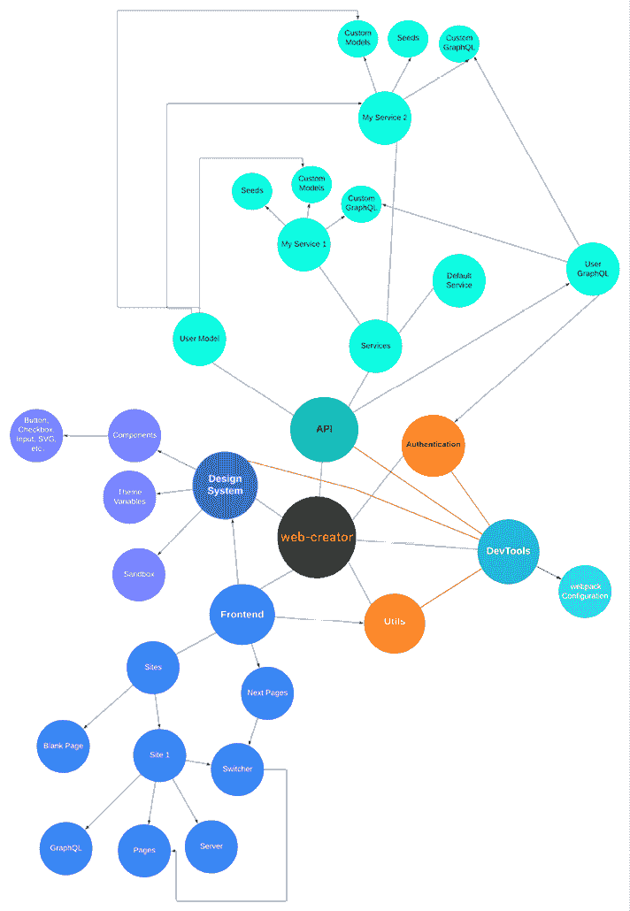

图 14.5：Web 创建器架构

现在我们已经探讨了项目的架构，让我们深入了解第一个将管理我们的 Webpack 配置的包。这个包将被称为 `devtools`。

# 创建一个用于使用 Webpack 编译包的 devtools 包

我们需要创建的第一个包，以便能够编译其他包，称为 `devtools`，应该创建在 `packages/devtools` 中。让我们看看它在 `package.json` 文件中应该是什么样子：

```js
{
  "name": "@web-creator/devtools",
  "version": "1.0.0",
  "main": "dist/index.js",
  "types": "dist/index.d.ts",
  "files": [
    "dist"
  ],
  "scripts": {
    "build": "npm-run-all clean compile",
    "clean": "rm -rf ./dist",
    "compile": "tsc",
    "lint": "npm run --prefix ../../ lint",
    "lint:fix": "npm run --prefix ../../ lint:fix"
  },
  "author": "Carlos Santana",
  "license": "MIT",
  "devDependencies": {
    "@types/cli-color": "².0.2",
    "@types/ip": "¹.1.0",
    "@types/webpack-bundle-analyzer": "⁴.6.0",
    "@types/webpack-node-externals": "².5.3"
  },
  "dependencies": {
    "@svgr/webpack": "⁶.5.1",
    "@types/file-loader": "⁵.0.1",
    "cli-color": "².0.3",
    "css-loader": "⁶.7.3",
    "dotenv": "¹⁶.0.3",
    "file-loader": "⁶.2.0",
    "html-webpack-plugin": "⁵.5.0",
    "path-browserify": "¹.0.1",
    "run-script-webpack-plugin": "⁰.1.1",
    "style-loader": "³.3.1",
    "ts-loader": "⁹.4.2",
    "typescript-plugin-styled-components": "².0.0",
    "webpack": "⁵.75.0",
    "webpack-bundle-analyzer": "⁴.7.0",
    "webpack-dev-server": "⁴.11.1",
    "webpack-node-externals": "³.0.0",
    "webpackbar": "⁵.0.2"
  }
} 
```

在创建 `package.json` 之后，你需要为 `devtools` 创建 `tsconfig.json` 文件。每个包都将有自己的 `tsconfig.json` 文件。基本上，我们将从根目录扩展我们的 `tsconfig.common.json`，并指定 `outDir` 并包含 `src` 文件夹内的文件：

```js
{
  "extends": "../../tsconfig.common.json",
  "compilerOptions": {
    "outDir": "./dist"
  },
  "include": ["src/**/*"]
} 
```

## 创建一个彩色的日志

我们需要创建一个日志函数，这将帮助我们突出显示我们将要实现的 Webpack 配置，为此我们将使用 `cli-color` 包，该包为日志添加颜色。你需要创建位于 `packages/devtools/src/cli/log.ts` 下的文件：

```js
import cliColor from 'cli-color'
type Args = {
text?: string
tag?: string
json?: any
type?: 'info' | 'error' | 'warning'
}
export const log = (args: Args | any) => {
const blockColor: any = {
info: cliColor.bgCyan.whiteBright.bold,
error: cliColor.bgRed.whiteBright.bold,
warning: cliColor.bgYellow.blackBright.bold
}
const textColor: any = {
info: cliColor.blue,
error: cliColor.red,
warning: cliColor.yellow
}
if (typeof args === 'string') {
console.info(textColor.info(args))
}
const { tag, json, type } = args
if (tag && json) {
console.info(blockColortype}`))
console.info(textColortype))
console.info(blockColortype} >>>`))
 }
 } 
```

## Webpack 通用配置

现在我们已经准备好了日志函数，我们将继续创建 Webpack 配置。我们将把 Webpack 配置分成三个文件：`webpack.common.ts`、`webpack.development.ts` 和 `webpack.production.ts`。通用配置将与开发和生产分别合并。然而，在创建我们的通用配置之前，我们需要创建我们的 Webpack 类型，并且你需要将此文件添加到 `packages/devtools/src/webpack/webpack.types.ts`：

```js
export type WebpackMode = 'production' | 'development'
export type ConfigType = 'web' | 'package'
export type Package = 'api' | 'design-system' | 'frontend' | 'utils'
export type ConfigArgs = {
mode: WebpackMode
type: ConfigType
sandbox?: 'true' | 'false'
packageName: Package
}
export type ModeArgs = {
configType: ConfigType
packageName: Package
mode?: WebpackMode
sandbox?: boolean
devServer?: boolean
isAnalyze?: boolean
port?: number
analyzerPort?: number
color?: string
htmlOptions?: {
title: string
template: string
}
} 
```

现在让我们创建我们的 `webpack.common.ts` 文件，从我们需要导入的包开始：

```js
import HtmlWebPackPlugin from 'html-webpack-plugin'
import path from 'path'
import createStyledComponentsTransformer from 'typescript-plugin-styled-components'
import { Configuration } from 'webpack'
import { BundleAnalyzerPlugin } from 'webpack-bundle-analyzer'
import nodeExternals from 'webpack-node-externals'
import { ModeArgs } from './webpack.types' 
```

接下来，我们需要创建`getWebpackCommonConfig`函数，它将接收来自终端的参数来通过 NPM 脚本来编译每个包：

```js
const getWebpackCommonConfig = (args: ModeArgs): Configuration => {
const {
configType, // it can be "web" or "package"
isAnalyze,
port = 3000,
mode,
analyzerPort = 9001,
packageName,
htmlOptions,
sandbox,
devServer
} = args
// Here goes the next block of codes
}
export default getWebpackCommonConfig 
```

在这一章的 GitHub 仓库中，您将看到的代码块需要添加到前一个代码中的注释位置：`// 这里是下一个代码块`。

首先，让我们检查我们是否正在运行沙盒（这将是我们的设计系统包）。如果是，我们将使用端口`8080`，如果不是，我们将使用`port + 1`（默认为`3001`）：

```js
const devServerPort = sandbox && devServer ? 8080 : port + 1 
```

我们需要创建的第一个配置选项是`entry`，它将定义我们将用于编译项目的索引文件，基于我们在脚本中指定的`packageName`。我们可以通过运行以下代码来创建`entry`：

```js
// Client Entry
const entry = configType !== 'web'
? path.resolve(__dirname, `../../../${packageName}/src/index.ts`)
: path.resolve(__dirname, `../../../${packageName}/src/index.tsx`) 
```

当我们的`configType`是`"package"`（或不同于`'web'`）时，我们将指定`index.ts`作为入口，而对于网络包，我们将使用`index.tsx`。

我们需要创建的第二个配置选项将是`resolve`节点，它将包括我们想要支持的扩展和每个包的别名（`~`）。在 Webpack 5 中，我们必须关闭一些默认未启用的回退包：

```js
// Resolve
const resolve = {
extensions: ['*', '.ts', '.tsx', '.js', '.jsx'],
alias: {
'~': path.resolve(__dirname, `../../../${packageName}/src`)
},
fallback: {
buffer: false,
crypto: false,
stream: false,
querystring: false,
os: false,
zlib: false,
http: false,
https: false,
url: false,
path: require.resolve('path-browserify')
}
} 
```

第三个配置选项是`output`，它将指定我们将放置编译后的项目的地方（`dist`目录），这将是一个动态的文件名（`[name].js`）。如果我们想要编译一个包，我们将添加必要的选项来能够导出该包（`libraryTarget`、`library`、`umdNamedDefine`和`globalObject`）：

```js
// Output
const output = {
 path: path.resolve(__dirname, `../../../${packageName}/dist`),
 filename: '[name].js',
 ...(sandbox && {
 publicPath: '/',
 chunkFilename: '[name].js'
 }),
 ...(configType === 'package' && !sandbox && {
 filename: 'index.js',
 libraryTarget: 'umd',
 library: 'lib',
 umdNamedDefine: true,
 globalObject: 'this'
 })
} 
```

第四个配置选项是`plugins`，它将根据某些条件应用，取决于我们是否想要分析我们的包大小（`BundleAnalyzerPlugin`）并添加带有`HtmlWebPackPlugin`的模板：

```js
// Plugins
const plugins = []
if (isAnalyze) {
plugins.push(
new BundleAnalyzerPlugin({
analyzerPort
})
)
}
if (mode === 'development' && htmlOptions?.title && htmlOptions.template) {
plugins.push(
new HtmlWebPackPlugin({
title: htmlOptions.title,
template: path.resolve(__dirname, `../../../${packageName}/${htmlOptions.template}`),
filename: './index.xhtml'
})
)
} 
```

第五个配置选项是`rules`，我们将根据我们想要处理的扩展文件来定义。我们还将使用 Webpack 加载器，如`ts-loader`来加载 TypeScript 文件或`svg-url-loader`和`@svgr/webpack`来加载 SVG 文件：

```js
// Rules
const rules = []
rules.push({
test: /\.(tsx|ts)$/,
exclude: /node_modules/,
loader: 'ts-loader',
options: {
getCustomTransformers: () => ({
 before: [
createStyledComponentsTransformer({
 displayName: true,
ssr: true,
 minify: true
 })
 ]
 })
}
})
if (packageName === 'design-system') {
const svgUrlLoaderInclude: Record<string, string[]> = {
'design-system': [
path.resolve(__dirname, '../../../design-system/src/components/Spinner/loaders'),
path.resolve(__dirname, '../../../design-system/src/components/Dialog/icons'),
path.resolve(__dirname, '../../../design-system/src/icons')
]
}
const svgrWebpackInclude: Record<string, string[]> = {
'design-system': [
path.resolve(__dirname, '../../../design-system/src/components/Icon/icons')
]
}
rules.push({
test: /\.svg$/,
oneOf: [
{
use: 'svg-url-loader',
include: configType === 'package' ? svgUrlLoaderInclude[packageName] ?? [] : []
},
{
use: '@svgr/webpack',
include: configType === 'package' ? svgrWebpackInclude[packageName] ?? [] : []
}
]
})
}
if (configType === 'package' && sandbox) {
rules.push({
test: /\.(jpe?g|png|gif|svg)$/i,
use: [{ loader: 'file-loader', options: {} }]
})
} 
```

最后，我们将所有选项一起放入`webpackConfig`对象中：

```js
const webpackConfig = {
entry,
...(configType === 'package' && sandbox && {
entry: path.resolve(__dirname, `../../../${packageName}/sandbox/index.tsx`)
}),
...(devServer && {
devServer: {
historyApiFallback: true,
static: output.path,
port: devServerPort
}
}),
...(!sandbox && {
externals: [nodeExternals()]
}),
output,
resolve,
plugins,
module: {
rules
},
...(configType !== 'web' && !sandbox && {
target: 'node'
})
}
return webpackConfig as Configuration 
```

## Webpack 开发配置

在创建我们的 Webpack 通用配置文件后，我们现在需要创建我们的`webpack.development.ts`文件，这个文件比通用文件小得多，并将扩展该配置（在`webpack.config.ts`上），指定 Webpack 的开发模式，添加源映射，并传递`HMR`插件：

```js
import {
Configuration as WebpackConfiguration,
HotModuleReplacementPlugin,
NoEmitOnErrorsPlugin
} from 'webpack'
import { Configuration as WebpackDevServerConfiguration } from 'webpack-dev-server'
interface Configuration extends WebpackConfiguration {
devServer?: WebpackDevServerConfiguration
}
const getWebpackDevelopmentConfig = (): Configuration => {
const webpackConfig: Configuration = {
mode: 'development',
devtool: 'source-map',
plugins: [new HotModuleReplacementPlugin(), new NoEmitOnErrorsPlugin()]
}
return webpackConfig
}
export default getWebpackDevelopmentConfig 
```

## Webpack 生产配置

我们需要创建的最后一个文件是`webpack.production.ts`，当我们尝试编译使用共享库（如**React**、**Apollo Server**或**JSON Web Tokens**）的包时，将使用外部库，将`mode`设置为生产模式，并禁用源映射：

```js
import { Configuration } from 'webpack'
import { ModeArgs } from './webpack.types'
const getWebpackProductionConfig = (args: ModeArgs): Configuration => {
const { configType } = args
// Externals
const externals = configType === 'package'
? {
react: {
commonjs: 'react',
commonjs2: 'react',
amd: 'React',
root: 'React'
},
'react-dom': {
commonjs: 'react-dom',
commonjs2: 'react-dom',
amd: 'ReactDOM',
root: 'ReactDOM'
},
'apollo-server-express': 'apollo-server-express',
jsonwebtoken: 'jsonwebtoken'
}
: {}
const webpackConfig = {
mode: 'production',
devtool: false,
externals
}
return webpackConfig as Configuration
}
export default getWebpackProductionConfig 
```

这就是我们的`devtools`包的全部内容。现在我们只需要在`packages/devtools/src/index.ts`中创建`index.ts`文件来导出所有 Webpack 配置，并能够编译我们的`devtools`包：

```js
// CLI
export * from './cli/log'
// Webpack
export { default as getWebpackCommonConfig } from './webpack/webpack.common'
export { default as getWebpackDevelopmentConfig } from './webpack/webpack.development'
export { default as getWebpackProductionConfig } from './webpack/webpack.production'
export * from './webpack/webpack.types' 
```

由于这将是一个将编译其他包的基础包，首先我们需要构建它，为此，我们只需在 `packages/devtools` 内运行 `build` 命令即可将 TypeScript 转换为 JavaScript 文件。

```js
npm run build 
```

如果一切正确，你应该会看到类似这样的内容：

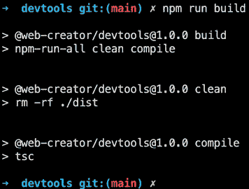

图 14.6：npm run build

最后，我们需要在根级别创建 `webpack.config.ts` 文件，在那里我们将使用我们的全新 `devtools` 包并使用 `webpack-merge` 合并配置（开发 + 公共或生产 + 公共）：

```js
import {
ConfigArgs,
getWebpackCommonConfig,
getWebpackDevelopmentConfig,
getWebpackProductionConfig,
log
} from '@web-creator/devtools'
import { Configuration } from 'webpack'
import { merge } from 'webpack-merge'
// Mode Config
const getModeConfig = {
development: getWebpackDevelopmentConfig,
production: getWebpackProductionConfig
}
// Mode Configuration (development/production)
const modeConfig: (args: ConfigArgs) => Configuration = ({mode, type, packageName}) => {
const getWebpackConfiguration = getModeConfig[mode]
return getWebpackConfiguration({ 
configType: type, 
packageName, 
sandbox: true, 
devServer: true 
})
}
// Merging all configurations
const webpackConfig: (args: ConfigArgs) => Promise<Configuration> = async ({ 
mode, type, sandbox, packageName 
} = {
mode: 'production',
type: 'web',
sandbox: 'false',
packageName: 'design-system'
}) => {
const isSandbox = type === 'package' && sandbox === 'true'
const commonConfiguration = getWebpackCommonConfig({
configType: type,
packageName,
mode,
...(isSandbox && {
htmlOptions: { title: 'Sandbox', template: 'sandbox/index.xhtml' },
sandbox: isSandbox,
devServer: isSandbox
})
})
// Mode Configuration
const modeConfiguration = mode && type ? modeConfig({ mode, type, packageName }) : {}
// Merging all configurations
const webpackConfiguration = merge(commonConfiguration, modeConfiguration)
// Logging Webpack Configuration
log({ tag: 'Webpack Configuration', json: webpackConfiguration, type: 'warning' })
return webpackConfiguration
}
export default webpackConfig 
```

# 创建 utils 包

在我们创建了 `devtools` 包之后，是时候添加一个基本的 `utils` 包来测试使用 `devtools` 的 Webpack 编译了。为此，你需要在 `packages/utils` 创建一个目录。对于书中的示例，我们只需添加一个 `util` 文件来测试我们的 `devtools`，但在实际的仓库中，你会找到更多已经添加到项目中的 `util` 文件。

如往常一样，让我们从 `utils` 包中创建 `package.json` 开始：

```js
{
  "name": "@web-creator/utils",
  "version": "1.0.0",
  "main": "dist/index.js",
  "types": "dist/index.d.ts",
  "files": [
    "dist"
  ],
  "scripts": {
    "build": "cross-env NODE_ENV=production npm-run-all clean compile webpack:production",
    "build:dev": "cross-env NODE_ENV=development npm-run-all clean compile webpack:development",
    "clean": "rm -rf ./dist",
    "compile": "tsc",
    "lint": "npm run --prefix ../../ lint",
    "lint:fix": "npm run --prefix ../../ lint:fix",
    "prepublishOnly": "npm run lint && npm run build",
    "webpack:development": "webpack --config=../../webpack.config.ts --env mode=development --env type=package --env packageName=utils",
    "webpack:production": "webpack --config=../../webpack.config.ts --env mode=production --env type=package --env packageName=utils"
  },
  "author": "Carlos Santana",
  "license": "MIT",
  "dependencies": {
    "currency-formatter": "¹.5.9",
    "slug": "⁸.2.2",
    "uuid": "⁹.0.0"
  },
  "devDependencies": {
    "@types/currency-formatter": "¹.5.1",
    "@types/slug": "⁵.0.3",
    "@types/uuid": "⁹.0.0"
  }
} 
```

在这个 `package.json` 文件中，有一些重要的元素我想提一下：

+   第一项是包的名称，它是 `@web-creator/utils`。正如我之前提到的，这是在 MonoRepo 内部命名包的正确格式。

+   第二个节点是 `version`，它始终将是 `1.0.0`（除非你想将这个包发布到 NPM 注册表；现在你不需要担心这个问题）。

+   `main` 是指定我们的 `utils` 代码将存在的地方，它将始终在 `dist/index.js`。

+   `types` 节是为了能够加载我们的 TypeScript 类型；如果你不指定这个，那么在消费这个包时，你将无法看到添加到你的 `utils` 包中的类型。

+   最后，`files` 节是一个数组，它将包含包含编译后包的 `dist` 目录。

此外，脚本还有一些有趣的事情你应该知道。我们的 `build` 命令将使用 `npm-run-all` 运行多个脚本，这是一个帮助我们依次运行多个脚本的库。在这种情况下，我们总是首先执行 `clean` 脚本来删除我们的 `dist` 文件夹并从头开始。然后我们使用 TypeScript (`tsc`) 编译代码，然后执行 `webpack:production`。这将执行 `webpack`，指定根目录中存在的配置文件（在两个级别之后）。我们还使用 `--env` 标志来传递变量。

这些变量定义在我们的 `webpack.config.ts` 文件中。在这种情况下，我们传递 `mode=production`、`type=package` 和 `packageName=utils`。

如果您注意到，一些脚本包含`npm run --prefix ../../`，我非常确信您想知道这个命令中的`--prefix`标志究竟是什么。它本质上是一种告诉 NPM 我们想要从一个不同的`package.json`中运行脚本的方法。在这个特定的例子中，我们返回两级以运行存在于我们根`package.json`中的`lint`脚本。

现在，让我们创建我们的第一个`util`文件，它将被命名为`is.ts`，并且您必须将其保存到`packages/utils/src/utils/is.ts`，以下代码如下：

```js
const is = {
Array(v: unknown) {
return v instanceof Array
},
Defined(v: unknown) {
return typeof v !== 'undefined' && v !== null
},
Email(email: string) {
const regex = /^[^\s@]+@[^\s@]+\.[^\s@]+$/
return regex.test(email)
},
False(v: unknown) {
return (this.Defined(v) && v === false) || v === 'false'
},
Number(v: unknown) {
return typeof v === 'number'
},
Function(v: unknown) {
return typeof v === 'function'
},
Object(v: unknown) {
return this.Defined(v) && typeof v === 'object' && !this.Array(v)
},
String(v: unknown) {
return this.Defined(v) && typeof v === 'string'
},
Undefined(v: unknown) {
return typeof v === 'undefined' || v === null
},
JSON(str: string) {
if (!str || str === null) {
return false
}
try {
JSON.parse(str)
} catch (e) {
return false
}
return true
},
Password(password: string, min = 8) {
return Boolean(password && password.length >= min)
},
PasswordMatch(p1: string, p2: string) {
return this.Password(p1) && this.Password(p2) && p1 === p2
},
Browser() {
return typeof window !== 'undefined'
},
Device() {
if (!this.Browser()) {
return false
}
const ua = navigator.userAgent
if (/(tablet|ipad|playbook|silk)|(android(?!.*mobi))/i.test(ua)) {
return true
}
if (/Mobile|Android|iP(hone|od)|IEMobile|BlackBerry|Kindle|Silk-Accelerated|(hpw|web)OS|Opera M(obi|ini)/.test(ua)) {
return true
}
return false
},
EmptyObject(v: any) {
return v ? Object.keys(v).length === 0 : true
}
}
export default is 
```

在您创建这个`util`之后，您需要在`packages/utils/src/index.ts`中创建一个`index.ts`文件，在那里您将导出所有的`utils`：

```js
export { default as is } from './utils/is' 
```

最后，您必须向根`package.json`添加一个脚本，以便能够编译您全新的`utils`包。以下是您的根`package.json`文件应该看起来像这样：

```js
{
  "name": "web-creator",
  "private": true,
  "workspaces": [
    "packages/*"
  ],
  "scripts": {
    "lint": "eslint --ext .tsx,.ts ./packages/**/src",
    "lint:fix": "eslint --ext .tsx,.ts ./packages/**/src",
    "build": "npm-run-all build:*",
    "build:devtools": "cd ./packages/devtools && npm run build",
    "build:utils": "cd ./packages/utils && npm run build",
    "build:authentication": "cd ./packages/authentication && npm run build",
    "build:design-system": "cd ./packages/design-system && npm run build",
    "build:api": "cd ./packages/api && npm run build",
  },
  "devDependencies": {
    "@typescript-eslint/eslint-plugin": "⁵.49.0",
    "@typescript-eslint/parser": "⁵.49.0",
    "cross-env": "⁷.0.3",
    "eslint": "⁸.33.0",
    "eslint-config-airbnb": "¹⁹.0.4",
    "eslint-config-airbnb-typescript": "¹⁷.0.0",
    "eslint-config-prettier": "⁸.6.0",
    "eslint-import-resolver-typescript": "³.5.3",
    "eslint-plugin-import": "².27.5",
    "eslint-plugin-jsx-a11y": "⁶.7.1",
    "eslint-plugin-prettier": "⁴.2.1",
    "eslint-plugin-react": "⁷.32.2",
    "eslint-plugin-react-hooks": "⁴.6.0",
    "npm-run-all": "⁴.1.5",
    "prettier": "².8.3",
    "ts-node": "¹⁰.9.1",
    "typescript": "⁴.9.5",
    "webpack-cli": "⁵.0.1"
  },
  "dependencies": {
    "webpack": "⁵.75.0",
    "webpack-merge": "⁵.8.0"
  }
} 
```

如您所见，我们需要为每个我们想要构建的包添加一个`build:package_name`（在这个例子中，`build:utils`）脚本，然后我们的构建脚本将使用`npm-run-all build:*`执行所有这些脚本。

现在您可以通过在`utils`目录中运行`npm run build`脚本来构建您的`utils`包；您应该看到类似以下的内容：

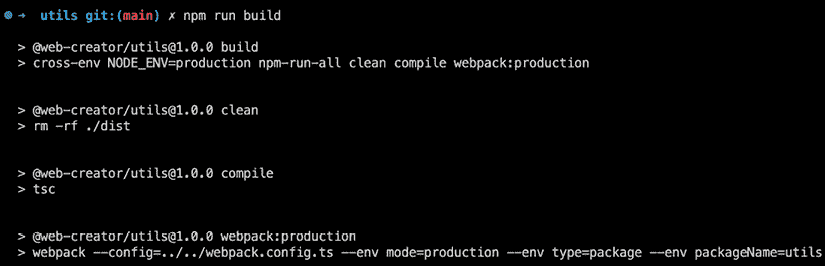

图 14.7：构建 utils

在此之后，您应该看到我们用于编译此包的 Webpack 配置日志：

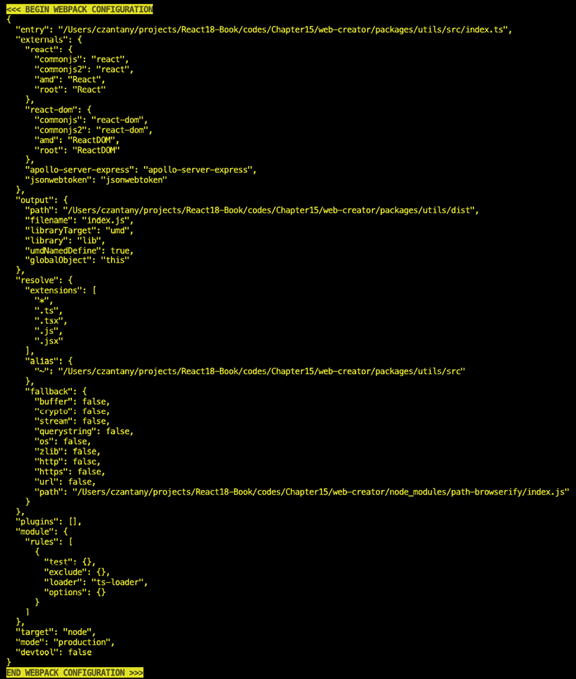

图 14.8：Webpack 配置

然后，在最后，您将看到 Webpack 编译的文件：

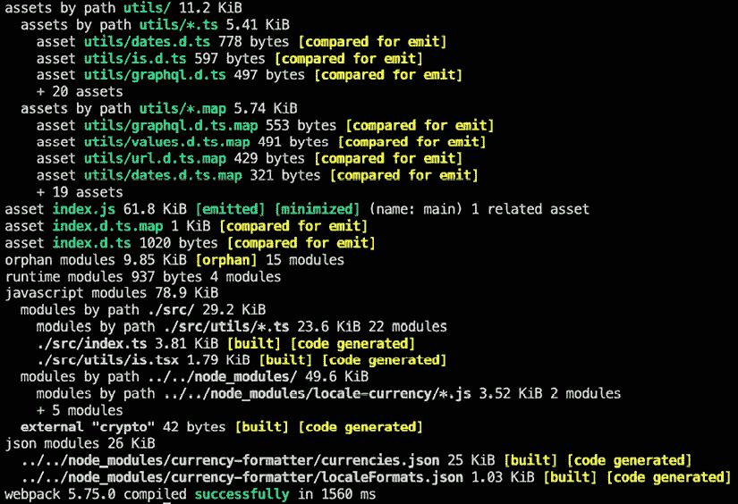

图 14.9：Webpack 编译的文件

现在我们已经创建了我们的第一个包，它是用`devtools`编译的，并且我们了解了包的结构，现在是时候开始处理我们的 API 了。

# 创建 API 包

在这个包中，我们将实现一个多服务系统，这将帮助我们连接到多个数据库。让我们看看我们的`package.json`文件对于`api`包应该看起来像什么：

```js
{
  "name": "@web-creator/api",
  "version": "1.0.0",
  "main": "index.js",
  "scripts": {
    "build": "cross-env NODE_ENV=production npm-run-all clean compile webpack:production",
    "build:dev": "cross-env NODE_ENV=development npm-run-all clean compile webpack:development",
    "clean": "rm -rf ./dist",
    "compile": "tsc",
    "dev": "ts-node-dev src/index.ts",
    "lint": "npm run --prefix ../../ lint",
    "lint:fix": "npm run --prefix ../../ lint:fix",
    "webpack:development": "webpack --config=../../webpack.config.ts --env mode=production --env type=api --env packageName=api",
    "webpack:production": "webpack --config=../../webpack.config.ts --env mode=development --env type=api --env packageName=api"
  },
  "author": "Carlos Santana",
  "license": "MIT",
  "dependencies": {
    "@graphql-tools/merge": "8.3.18",
    "@graphql-tools/schema": "9.0.16",
    "@web-creator/authentication": "1.0.0",
    "@web-creator/utils": "¹.0.0",
    "@apollo/server": "⁴.7.3",
    "cookie-parser": "¹.4.6",
    "cors": "².8.5",
    "dotenv": "¹⁶.0.3",
    "express": "⁴.18.2",
    "graphql": "16.6.0",
    "graphql-middleware": "6.1.33",
    "graphql-tag": "2.12.6",
    "isomorphic-fetch": "³.0.0",
    "jsonwebtoken": "⁹.0.0",
    "pg": "⁸.9.0",
    "pg-hstore": "².3.4",
    "pg-native": "³.0.1",
    "sequelize": "⁶.28.0",
    "sequelize-typescript": "².1.5"
  },
  "devDependencies": {
    "@types/body-parser": "¹.19.2",
    "@types/express-jwt": "⁶.0.4",
    "@types/jsonwebtoken": "⁹.0.1",
    "@types/cors": "².8.13",
    "@types/node": "¹⁸.11.18",
    "@types/pg": "⁸.6.6",
    "ts-node-dev": "2.0.0"
  }
} 
```

在这种情况下，我们将使用 Sequelize（一个 ORM）和 PostgreSQL 作为数据库，但请随意使用 MySQL 或其他 Sequelize 支持的数据库类型。

在接下来的章节中，我们将详细介绍每个步骤。我们将演示如何集成所有组件并成功运行您的 CRM 服务。如果它看起来很复杂，无需担心。我们将以稳定的速度进行，并在过程中提供解释。

## 创建用户共享模型

我们需要首先创建的是我们的共享模型，目前这将是唯一的`User`模型，以便能够为所有我们的网站创建一个共享的身份验证系统。

您必须在`packages/models/User.ts`中创建`User`模型文件，这将创建一个包含以下字段的表：`id`（`UUID`），`username`（`STRING`），`password`（`STRING`），`Email`（`STRING`），`Role`（`STRING`），和`active`（`BOOLEAN`）：

```js
import { security } from '@web-creator/utils'
import { DataType, Sequelize, User } from '../types'
export default (sequelize: Sequelize, dataType: DataType): User => {
const user = sequelize.define('User', {
id: {
primaryKey: true,
allowNull: false,
type: dataType.UUID,
defaultValue: dataType.UUIDV4()
},
username: {
type: dataType.STRING,
allowNull: false,
unique: true,
validate: {
isAlphanumeric: {
args: true,
msg: 'The user just accepts alphanumeric characters'
},
len: {
args: [4, 20],
msg: 'The username must be from 4 to 20 characters'
}
}
},
password: {
type: dataType.STRING,
allowNull: false
},
email: {
type: dataType.STRING,
allowNull: false,
unique: true,
validate: {
isEmail: {
args: true,
msg: 'Invalid email'
}
}
},
role: {
type: dataType.STRING,
allowNull: false
},
active: {
type: dataType.BOOLEAN,
allowNull: false,
defaultValue: false
 }
},
{
hooks: {
beforeCreate: (u: User): void => {
u.password = security.encrypt(u.password)
}
}
}
)
return user
} 
```

## 创建一个用户共享的 GraphQL 类型和解析器

除了`User`共享模型外，我们还需要创建一个共享的 GraphQL **类型**和**解析器**，以便在所有我们的网站上使用 GraphQL 处理认证。

首先，我们需要创建另一个共享的 GraphQL 类型，称为`error`，它将帮助我们处理我们稍后创建的任何查询或突变中的错误。此文件位于`packages/api/src/graphql/types/Error.ts`中：

```js
import gql from 'graphql-tag'
export default gql`
type ErrorResponse {
code: Int
message: String!
}

type Error {
error: ErrorResponse
}
` 
```

我们需要创建的另一个共享类型是标量类型，它将定义标量类型如`UUID`、`Datetime`和`JSON`。此文件位于`packages/api/src/graphql/types/Scalar.ts`中：

```js
import gql from 'graphql-tag'
export default gql`
scalar UUID
scalar Datetime
scalar JSON
` 
```

最后，我们需要创建我们的`User`类型，它将包括一些查询，通过访问令牌（`at`）获取特定用户，获取所有用户，以及一些突变来创建新用户和登录。此文件应放置在`packages/api/src/graphql/types/User.ts`中：

```js
import gql from 'graphql-tag'
export default gql`
"User type"
type User {
id: UUID!
username: String!
email: String!
role: String!
active: Boolean!
createdAt: Datetime!
updatedAt: Datetime!
}
"Token type"
type Token {
token: String!
}
"User Query"
type Query {
getUser(at: String!): User!
getUsers: [User!]
}
"User Mutation"
type Mutation {
createUser(input: ICreateUser): User!
login(input: ILogin): Token!
}
"CreateUser Input"
input ICreateUser {
username: String!
password: String!
email: String!
active: Boolean!
role: String!
}
"Login Input"
input ILogin {
emailOrUsername: String!
password: String!
}
` 
```

在创建前面的类型之后，您需要创建用户解析器。为此，我们将使用`authentication`包（请检查[`github.com/PacktPublishing/React-18-Design-Patterns-and-Best-Practices-Fourth-Edition/tree/main/Chapter14/web-creator/packages/authentication`](https://github.com/PacktPublishing/React-18-Design-Patterns-and-Best-Practices-Fourth-Edition/tree/main/Chapter14/web-creator/packages/authentication)中的代码）。您还记得我们在*第十三章*中创建的认证系统吗？这是相同的代码，但现在它将拥有自己的包。这个解析器应该在`packages/api/src/graphql/resolvers/user.ts`中创建：

```js
import { authenticate, getUserBy, getUserData } from '@web-builder/authentication'
import { ICreateUser, ILogin, Model } from '../../types'
const getUsers = (_: any, _args: any, { models }: { models: Model }) => models.User.findAll()
const getUser = async (_: any, { at }: { at: string }, { models }: {models: Model}) => {
const connectedUser = await getUserData(at)
if (connectedUser) {
// Validating if the user is still valid
const user = await getUserBy(
{
id: connectedUser.id,
email: connectedUser.email,
active: connectedUser.active
},
[connectedUser.role],
models
)
if (user) {
return {
...connectedUser
}
}
}
return {
id: '',
username: '',
email: '',
role: '',
active: false
}
}
const createUser = (_:any, {input}: {input: ICreateUser}, {models}: {models: Model}) =>
models.User.create({ ...input })
const login = (_: any, { input }: { input: ILogin }, { models }: { models: Model }) =>
authenticate(input.emailOrUsername, input.password, models)
export default {
Query: {
getUser,
getUsers
},
Mutation: {
createUser,
login
}
} 
```

## 创建自定义服务

现在是时候创建我们的自定义服务了；为此，我们将创建一个默认服务（只是为了有一个空的服务）和一个用于**CRM**项目的服务（它将被命名为`crm`）。

我们需要做的第一件事是创建我们的服务配置，为此我们将创建一些类型，这将帮助我们非常严格地限制我们的配置将接收的选项。此文件需要创建在`packages/api/src/types/config.ts`中：

```js
import { ValueOf } from '@web-creator/utils'
// Here you need to add all the services you want to create
export const Service = {
CRM: 'crm'
} as const
export type Service = ValueOf<typeof Service>
export type Mode = 'production' | 'development'
export enum DeploymentType {
PRODUCTION = 'production',
STAGING = 'staging',
DEVELOPMENT = 'development'
}
export interface ServiceConfiguration {
domainName: string
port: number
database?: {
engine?: string
port?: number
host?: string
database?: string
username?: string
password?: string
}
}
export interface ServiceBuilderConfiguration extends ServiceConfiguration {
service: Service
} 
```

我们默认的配置应该是这样的（`packages/api/src/services/default/config.ts`）：

```js
import { ServiceConfiguration } from '../../types/config'
export const config: ServiceConfiguration = {
domainName: 'localhost',
port: 4000,
database: {
engine: 'postgresql',
port: 5432,
host: 'localhost',
database: '',
username: '',
password: ''
}
} 
```

然后，让我们创建我们的 CRM 配置（自定义服务）。这应该放置在`packages/api/src/services/crm/config.ts`中：

```js
import { ServiceConfiguration } from '../../types/config'
export const config: ServiceConfiguration = {
domainName: 'ranchosanpancho.com',
port: 4000,
database: {
database: 'crm'
}
} 
```

我很确定您想知道数据库节点（`engine`、`port`、`host`、`username`和`password`）的其他选项在哪里。这些将在稍后创建的主要配置文件中被覆盖，但那些值将从我们的`.env`文件中获取（您必须重命名`.env.example`文件）。因此，让我们在`packages/api/.env`中创建该文件：

```js
DB_ENGINE=postgresql
DB_PORT=5432
DB_HOST=localhost
DB_USERNAME=<YourDBUserName>
DB_PASSWORD=<YourDBPassword> 
```

## 构建我们的服务配置

现在我们已经准备好了自定义服务（**CRM**），让我们构建我们的配置。为此，您需要在`packages/api/src/config.ts`中创建配置文件：

```js
// This package will load the environment variables from our .env file
import dotenv from 'dotenv'
// Here you can add your custom services configuration
import { config as crmConfig } from './services/crm/config'
import { config as blankServiceConfig } from './services/default/config'
import { Service, ServiceBuilderConfiguration, ServiceConfiguration } from './types/config'
// Loading Env vars
dotenv.config()
const getServiceConfig = (service: Service): ServiceConfiguration => {
switch (service) {
// Add your custom services here
case Service.CRM:
return crmConfig
default:
return blankServiceConfig
}
}
const buildConfig = (): ServiceBuilderConfiguration => {
const service = process.env.SERVICE as Service
if (!service) {
throw 'You must specify a service (E.g., SERVICE=crm npm run dev)'
}
const serviceConfig = getServiceConfig(service)
const config: ServiceBuilderConfiguration = {
...serviceConfig,
database: {
...serviceConfig.database,
engine: process.env.DB_ENGINE,
host: process.env.DB_HOST,
port: Number(process.env.DB_PORT),
username: process.env.DB_USERNAME,
password: process.env.DB_PASSWORD
},
service
}
return config
}
// Building the config
const Config = buildConfig()
export default Config 
```

## 创建我们的自定义模型

一旦我们正确创建了配置，我们需要创建我们的 CRM 服务的自定义模型，这些模型是专门为该服务创建的，并且它们将不会与其他服务共享。在这种情况下，我们将添加一个，并称之为`Guest`。这个模型需要保存在`packages/api/src/services/crm/models/Guest.ts`：

```js
import { DataType } from '../../../types'
export default (sequelize: any, dataType: DataType) => {
const Guest = sequelize.define('Guest', {
id: {
primaryKey: true,
allowNull: false,
type: dataType.UUID,
defaultValue: dataType.UUIDV4()
},
fullName: {
type: dataType.STRING,
allowNull: false
},
email: {
type: dataType.STRING,
allowNull: false,
unique: true
},
photo: {
type: dataType.STRING,
allowNull: true
},
phone: {
type: dataType.STRING,
allowNull: true
},
socialMedia: {
type: dataType.STRING,
allowNull: true
},
location: {
type: dataType.STRING,
allowNull: true
},
gender: {
type: dataType.STRING,
allowNull: true
},
birthday: {
type: dataType.STRING,
allowNull: true
}
})
return Guest
} 
```

在我们创建`Guest`模型后，我们需要连接到我们的数据库并将我们的全局模型（`User`）和本地模型（`Guest`）连接起来，以便创建我们的服务表。这个文件需要创建在`packages/api/src/services/crm/models/index.ts`：

```js
import { keys, ts } from '@web-creator/utils'
import pg from 'pg'
import { Sequelize } from 'sequelize'
import Config from '../../../config'
// Db Connection
const { engine, port, host, database, username, password } = Config.database ?? {}
const uri = `${engine}://${username}:${password}@${host}:${port}/${database}`
const sequelize = new Sequelize(uri, {
dialectModule: pg
})
// Models
const addModel = (path: string) => require(path).default(sequelize, Sequelize)
const models: any = {
User: addModel('../../../models/User'), // Global model
Guest: addModel('./Guest'), // Local model
sequelize // We must pass the sequelize object here
}
// Relationships
keys(models).forEach((modelName: string) => {
if (ts.hasKey(models, modelName)) {
if (models[modelName].associate) {
models[modelName].associate(models)
}
}
})
export default models 
```

## 创建模型种子

种子是我们模型（表）的初始数据。大多数时候，我们希望清除所有模型值但保留一些默认值，但在这个例子中，我们将为我们的`User`模型和`Guest`模型添加一些默认数据：

```js
import models from '../models'
async function createFirstUser(): Promise<any> {
const existingUsers = await models.User.findAll()
if (existingUsers.length === 0) {
const newUser: any = await models.User.create({
username: 'admin',
password: '12345678',
email: 'admin@ranchosanpancho.com',
role: 'god',
active: true
})
return newUser
}
return null
}
async function createGuests(): Promise<any> {
const existingGuests = await models.Guest.findAll()
if (existingGuests.length === 0) {
const newGuests: any = await models.Guest.bulkCreate([
{
fullName: 'Carlos Santana',
email: 'carlos@ranchosanpancho.com',
photo: 'carlos.jpg',
phone: '+1 555 555 5555',
socialMedia: 'https://www.facebook.com/carlos.santana',
location: 'Colima, Mexico',
gender: 'Male',
birthday: '11/21/1987'
},
{
fullName: 'Cristina Santana',
email: 'cristina@ranchosanpancho.com',
photo: 'cristina.jpg',
phone: '+1 444 444 4444',
socialMedia: 'https://www.facebook.com/cristina.santana',
location: 'Colima, Mexico',
gender: 'Female',
birthday: '1/20/1989'
}
])
return newGuests
}
return null
}
function setInitialSeeds(): void {
createFirstUser()
createGuests()
}
export default setInitialSeeds 
```

## 创建我们的自定义 GraphQL 类型和解析器

对于我们的 CRM，我们将创建一个`Guest`类型和解析器，只是为了说明我们如何在创建的不同服务中使用 GraphQL；您需要创建的第一个文件是`Guest`类型，它必须保存在`packages/api/src/services/crm/graphql/types/Guest.ts`：

```js
import gql from 'graphql-tag'
export default gql`
type Guest {
id: UUID!
fullName: String!
email: String!
photo: String!
socialMedia: String!
location: String!
phone: String!
gender: String!
birthday: String
createdAt: Datetime!
updatedAt: Datetime!
}
type GuestResponse {
guests: [Guest!]!
}
union GuestResult = GuestResponse | Error
type Query {
getGuests: GuestResult
}
` 
```

如您所见，我们使用一些个人字段如`fullName`、`email`、`photo`等定义了我们的`Guest`类型。然后我们创建了一个`GuestResponse`类型，它代表一个客人数组`([Guest!]!)`。方括号表示这是一个数组，感叹号（`!`）表示它不能包含`null`值。之后，我们创建了一个`union`类型，这使得`schema`字段可以返回多个对象类型中的一个。在这种情况下，当有客人时，它可以返回`GuestResponse`类型，如果没有客人或遇到任何其他问题，则返回`Error`类型。如果发生其他情况，我们在解析器中定义这些类型的响应。

在您创建了这个类型文件（或更多）之后，是时候合并您所有的**类型定义**（**TypeDefs**）了。为此，我们将在`types`目录内创建一个`index.ts`文件，并导入我们的全局类型（`Error`、`Scalar`和`User`）。我们还将包括我们的本地类型（`Guest`），并使用`@graphql-tools/merge`提供的函数将其合并。这个文件放在`packages/api/src/services/crm/types/index.ts`：

```js
import { mergeTypeDefs } from '@graphql-tools/merge'
// Global Types
import Error from '../../../../graphql/types/Error'
import Scalar from '../../../../graphql/types/Scalar'
import User from '../../../../graphql/types/User'
// Local Types
import Guest from './Guest'
export default mergeTypeDefs([Error, Scalar, User, Guest]) 
```

现在一旦您合并了您的类型，您需要创建`Guest`解析器。这个文件应该放在`packages/api/src/services/crm/graphql/resolvers/guest.ts`：

```js
export default {
Query: {
getGuests: async (_: any, _args: any, { models }: { models: any }): Promise<any> => {
const guests = await models.Guest.findAll({ 
order: [['fullName', 'ASC']]
})
// If there are guests, return them with a GuestResponse type
if (guests.length > 0) {
return {
__typename: 'GuestResponse',
guests
}
}
// If there are no guests, return an Error type with a 404 code and message 
return {
__typename: 'Error',
error: {
code: 404,
message: 'No guests found'
}
}
}
}
} 
```

如您所见，当我们找到客人（或数据）时，我们返回它们并添加一个`__typename`属性（这是一个 GraphQL 属性），其值为`GuestResponse`。由于我们使用的是`union`，这个属性对于正确解析查询是必要的。在这里，我们定义我们将返回的内容，无论是`GuestResponse`类型还是`Error`类型。另一方面，如果我们没有找到任何客人，我们返回一个包含代码和消息的错误对象，并将`__typename`设置为`'Error'`。

现在，我们需要对解析器做同样的事情。我们需要合并我们的解析器，包括全局解析器和本地解析器。为此，在相同的`resolvers`目录中创建一个`index.ts`文件，并添加以下代码：

```js
import { mergeResolvers } from '@graphql-tools/merge'
import user from '../../../../graphql/resolvers/user'
import guest from './guest'
const resolvers = mergeResolvers([user, guest])
export default resolvers 
```

我们已经像对`TypeDef`所做的那样对解析器做了类似的事情。现在，我们需要导入全局用户解析器并将其与我们的客人解析器合并。

## 同步我们的模型并启动 Apollo Server

现在我们已经创建了自定义的`configs`、`models`、`seeds`、`types`和`resolvers`，是时候将所有这些放在一起，同步我们的模型，并启动我们的 Apollo Server。此文件应放置在`packages/api/src/index.ts`：

```js
import { makeExecutableSchema } from '@graphql-tools/schema'
import { ts } from '@web-creator/utils'
import { ApolloServer } from '@apollo/server'
import { expressMiddleware } from '@apollo/server/express4'
import { ApolloServerPluginDrainHttpServer } from '@apollo/server/plugin/drainHttpServer'
import bodyParser from 'body-parser'
import http from 'http'
import cookieParser from 'cookie-parser'
import cors from 'cors'
import express, { NextFunction, Request, Response } from 'express'
import { applyMiddleware } from 'graphql-middleware'
import { json } from 'body-parser'
import { Service } from './types/config' 
```

在导入所有需要的包之后，首先我们需要检查是否从终端收到了`SERVICE`变量；如果没有，我们将选择默认服务。我们还将检查我们的服务是否有效（存在于我们的`Service`类型中）：

```js
// Service
const service: any = process.env.SERVICE ?? 'default'
// Validating service
if (!ts.includes(Service, service)) {
throw 'Invalid service'
} 
```

一旦我们确认我们的服务是有效的，然后我们将动态导入`resolvers`、`types`、`models`和`seeds`：

```js
// We are importing the service files dynamically
const resolvers = require(`./services/${service}/graphql/resolvers`).default
const typeDefs = require(`./services/${service}/graphql/types`).default
const models = require(`./services/${service}/models`).default
const seeds = require(`./services/${service}/seeds`).default 
```

然后我们创建我们的 Express 应用并配置`cors`、`cookieParser`和`bodyParser`：

```js
const app = express()
const httpServer = http.createServer(app)
const corsOptions = {
origin: '*',
credentials: true
}
app.use(cors(corsOptions))
app.use(cookieParser())
app.use(bodyParser.json())
// CORS
app.use((req: Request, res: Response, next: NextFunction) => {
res.header('Access-Control-Allow-Origin', '*')
res.header('Access-Control-Allow-Headers', 'Origin, X-Requested-With, Content-Type, Accept')
next()
}) 
```

我们需要使用`makeExecutableSchema`创建我们的 GraphQL 模式，并使用`applyMiddleware`：

```js
// Schema
const schema = applyMiddleware(
makeExecutableSchema({
typeDefs,
resolvers
})
) 
```

最后，我们创建我们的`ApolloServer`实例，传递模式和插件。

```js
// Apollo Server
const apolloServer = new ApolloServer({
schema,
plugins:[ApolloServerPluginDrainHttpServer({ httpServer })]
}) 
```

现在，我们需要同步我们的模型。`alter`选项使我们能够监听模型的变化并修改它们：

如果您更改了某些内容，请务必小心使用`force`选项。如果它是`true`，它将截断所有您的表（这意味着所有数据都将被删除）。因此，只有在绝对必要时才使用它。

```js
// Database Sync
  const main = async () => {
    const alter = true
    const force = false

    await apolloServer.start()
    await models.sequelize.sync({ alter, force })
    // Setting up initial seeds
    console.log('Initializing Seeds...')
    seeds()
    app.use(
      '/graphql',
      cors<cors.CorsRequest>(),
      json(),
      expressMiddleware(apolloServer, {
        context: async () => ({ models })
      })
    )
    await new Promise<void>((resolve) => httpServer.listen({ port: 4000 }, resolve))
    console.log(' Server ready at http://localhost:4000/graphql')
  }
  main() 
```

## 测试我们的 CRM 服务

如果您一切操作正确，您可以在`api`包内部运行命令`SERVICE=crm npm run dev`，您应该会看到类似以下的内容：


图 14.10：SERVICE=crm npm run dev

如果您检查您的数据库，您将看到从您的模型创建的两个表（`Guests`和`Users`），您应该能够看到您添加的种子：

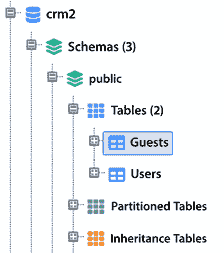

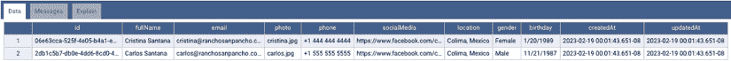

图 14.11：数据库查询

如您所见，`createdAt`和`updatedAt`字段是由 Sequelize 自动创建的。在此之后，您可以尝试访问[`localhost:4000/graphql`](http://localhost:4000/graphql)以查看您的 Apollo Server 是否运行正常。

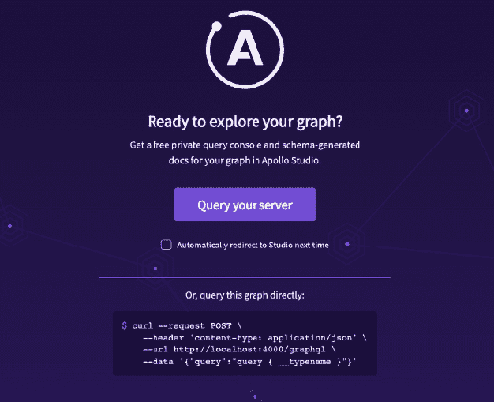

图 14.12：GraphQL 探索器

我们可以开始测试我们的服务查询，例如`getGuests`；让我们看看它返回什么：

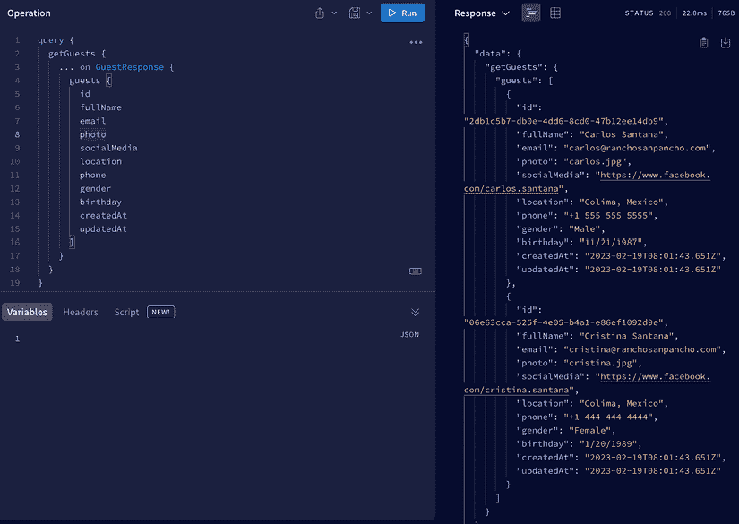

图 14.13：getGuests 查询

此外，您还可以测试`getUsers`查询：

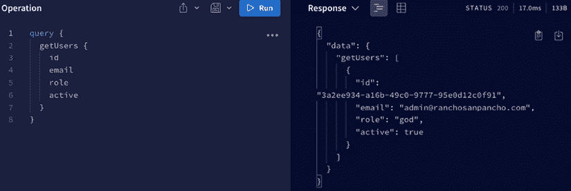

图 14.14：获取用户查询

最后，您还可以测试 `登录` 突变，以确保您的全局认证系统运行良好：

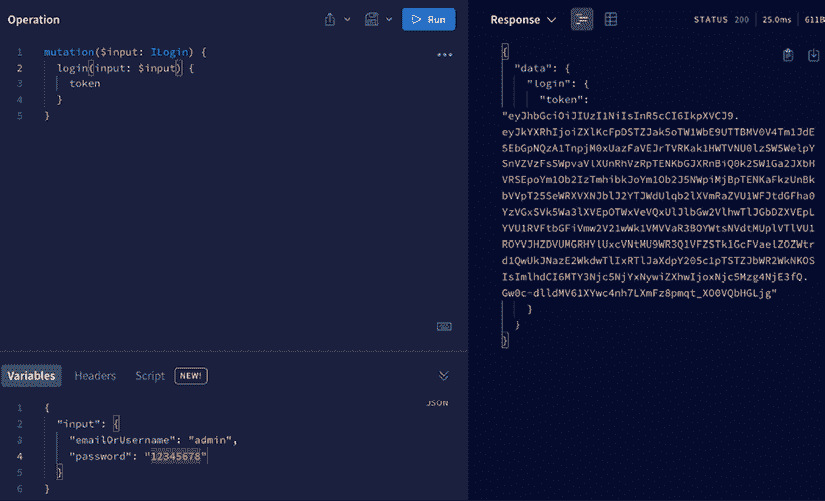

图 14.15：登录突变

# 创建前端包

在这个包中，我们将实现一个多站点系统，这将帮助我们拥有多个具有相同代码库的站点。

让我们看看这个包的 `package.json` 文件应该是什么样子：

```js
{
  "name": "@web-creator/frontend",
  "version": "1.0.0", 
  "scripts": {
    "dev": "cross-env NODE_ENV=development npm run next:dev",
    "build": "next build",
    "next": "ts-node src/server.ts",
    "next:dev": "ts-node src/server.ts",
    "lint": "npm run --prefix ../../ lint",
    "lint:fix": "npm run --prefix ../../ lint:fix",
    "typecheck": "tsc --noEmit"
  },
  "author": "Carlos Santana",
  "license": "ISC",
  "peerDependencies": {
    "react": ">=17.0.2",
    "react-dom": ">=17.0.2"
  },
  "devDependencies": {
    "@babel/core": "⁷.20.12",
    "@babel/node": "⁷.20.7",
    "@types/cookie-parser": "¹.4.3",
    "@types/isomorphic-fetch": "⁰.0.36",
    "@types/styled-components": "⁵.1.26",
    "babel-plugin-jsx-remove-data-test-id": "³.0.0",
    "babel-plugin-styled-components": "².0.7"
  },
  "dependencies": {
    "@apollo/client": "³.7.7",
    "@web-creator/authentication": "1.0.0",
    "@web-creator/devtools": "1.0.0",
    "@web-creator/utils": "¹.0.0",
    "babel-preset-next": "¹.4.0",
    "cookie-parser": "¹.4.6",
    "dotenv": "¹⁶.0.3",
    "express": "⁴.18.2",
    "isomorphic-fetch": "³.0.0",
    "next": "¹³.1.6",
    "react-cookie": "⁴.1.1",
    "styled-components": "⁵.3.6",
    "webpack": "⁵.75.0"
  }
} 
```

我们的 `前端` 包与其他包的工作方式略有不同，因为我们使用 **Next.js**，它负责自己的 Webpack 配置。我们不使用我们的 `devtools` 编译它，就像其他包一样，TypeScript 配置也有细微差别。

这是我们的 `前端` 包的 `tsconfig.json` 文件：

```js
{
  "extends": "../../tsconfig.common.json",
  "compilerOptions": {
    "outDir": "./dist",
    "baseUrl": ".",
    "isolatedModules": true,
    "noEmit": false,
    "allowJs": true,
    "forceConsistentCasingInFileNames": true,
    "incremental": true,
    "jsx": "preserve",
    "paths": {
      "~/*": ["./src/*"]
    }
  },
  "include": ["src/**/*"]
} 
```

如您所见，我们定义了 `~` 路径。在其他包中，这由 `devtools` 处理，但在我们的情况下，我们需要直接修改下一个 Webpack 配置。为此，您需要创建文件 `next.config.js`（是的，`.js`，而不是 `.ts`），代码应如下所示：

```js
const path = require('path')
module.exports = {
reactStrictMode: true,
webpack: (config, { isServer }) => {
// Fixes npm packages that depend on 'fs' module
if (!isServer) {
config.resolve.fallback.fs = false
}
// Aliases
config.resolve.alias['~'] = path.resolve(__dirname, './src')
return config
}
} 
```

我们还需要设置的一个配置是向我们的 `.babelrc` 文件添加 `styled-components` 插件。我们还将使用 `next/babel` 预设。此文件位于 `packages/frontend/.babelrc`：

```js
{
  "presets": ["next/babel"],
  "plugins": [["styled-components", { "ssr": true, "preprocess": false }]],
  "env": {
    "production": {
      "plugins": ["babel-plugin-jsx-remove-data-test-id"]
    }
  }
} 
```

现在我们已经完成了这一章节的这一部分，我们将继续创建一个通用的 `用户` 模型。这个模型将作为一个模板，可以在所有我们的网站上为任何注册的用户使用。

接下来，我们的重点将转向开发一个 `站点` 系统，这可以想象为一个负责管理我们网站的主控制室。就像切换电视频道一样，我们还将构建一个 **页面切换器**，使用户能够无缝地在我们的网站上切换不同的页面。

随后，我们将构建一个通用的 `登录` 系统，确保所有我们的网站上都有一致的登录体验。为了增强定制性和功能性，我们将设置一个 `站点` 配置，它作为每个独立站点的规则书或设置面板，规定其行为和功能。

为了将这些组件统一起来，我们将它们捆绑在一个名为 `server.ts` 的单个文件中，这个文件将作为我们系统的指挥中心。

一旦设置完成，我们将通过运行程序并使用各种示例检查结果来测试我们的工作。如果出现任何问题，我们的系统将提供错误消息以指示并协助故障排除。

在接下来的章节中，您将见证所有这些步骤的实际操作，使您能够理解它们如何集成到我们的更大系统中。请放心，尽管现在可能听起来很复杂，但我们将将其分解，并引导您通过每个步骤，确保对过程有清晰的理解。

## 创建我们的站点系统

网站系统基本上与我们之前在 API 包中创建的服务系统相同，但在这个案例中，我们不是管理数据库，而是管理网站。因此，就像我们之前做的那样，我们首先需要做的是创建每个网站的配置。在这个场景中，我们还将有一个**默认**网站，称为`'blank-page'`，以避免在没有提供网站时系统崩溃。

让我们在`packages/frontend/src/sites/blank-page/config.ts`中为这个网站创建配置文件，这是该文件的内容：

```js
import { SiteConfiguration } from '../../types/config'
export const config: SiteConfiguration = {
siteTitle: 'Blank Page',
domainName: 'localhost',
api: {
uri: 'http://localhost:4000/graphql'
},
pages: ['index']
} 
```

对于这个例子，我将使用两个个人网站，`san-pancho`和`codejobs`，但你可以自由地将任何网站添加到项目中。

作为网站的一部分，我们需要创建`graphql`文件，以消费我们的 API 查询和突变，以及这个网站的具体页面。我们现在将添加的唯一查询是我们之前在 API 包中创建的`getGuests`查询。这个文件应该在`packages/frontend/src/sites/san-pancho/graphql/guest/getGuests.query.ts`中。如果你在某个时候想创建一个突变，你可能想使用`myMutation.mutation.ts`格式作为文件名：

```js
import { gql } from '@apollo/client'
export const getGuestsQuery = '
getGuests {
... on GuestResponse {
guests {
id
fullName
email
photo
socialMedia
location
gender
birthday
note
}
}
... on Error {
error {
code
message
}
}
}
'
export default gql'
query getGuests {
${getGuestsQuery}
}
' 
```

## 创建我们的页面切换器

如果你以前使用过 Next.js，你会知道**Next**页面系统是如何工作的。本质上，你有一个`pages`目录，你添加到该目录的文件或目录将代表页面的路由。在我们的例子中，我们需要创建一些 Next 页面，这些页面将“切换”或从每个网站渲染自定义页面。我知道这听起来有点复杂，但让我们将其分解成几个部分。

首先要做的事情是在`packages/frontend/src/pages/index.ts`中创建我们的`index.ts`页面（这是一个 Next 页面）：

```js
import React, { FC } from 'react'
import Config from '~/config'
const SwitcherPage = require('~/sites/${Config.site}/switcher').default
const getRouterParams = require('~/sites/${Config.site}/server/routerParams').default
type Props = {
siteTitle: string
}
const Page: FC<Props> = ({ siteTitle }) => {
const routerParams = getRouterParams({})
return <SwitcherPage routerParams={routerParams} siteTitle={siteTitle} />
}
export default Page 
```

我们必须创建的另一个 Next.js 页面是具有特殊名称的页面，需要创建在`packages/frontend/src/pages/[page]/[...params].tsx`中。`[page]`将是一个动态路径。`[...params].tsx`文件将接收 URL 中传递的任何附加参数。如果我们有超过两个嵌套路由，这些附加路由将作为数组添加到`params`变量中：

```js
import { useRouter } from 'next/router'
import React, { FC } from 'react'
import Config from '~/config'
const SwitcherPage = require('~/sites/${Config.site}/switcher').default
const getRouterParams = require('~/sites/${Config.site}/server/routerParams').default
type Props = {
siteTitle: string
serverData: any
}
const Page: FC<Props> = ({ siteTitle, serverData }) => {
const router = useRouter()
const routerParams = getRouterParams(router.query)
return (
<SwitcherPage 
routerParams={routerParams} 
siteTitle={siteTitle} 
props={{ serverData }} 
/>
)
}
export default Page 
```

在每个 Next.js 页面上，我们将导入存在于每个网站上的`SwitcherPage`组件。我们还会导入`routerParams`，它也将控制每个网站的路由，并且我们将通过 props 接收`siteTitle`。换句话说，我们只是渲染`SwitcherPage`组件并传递 props。

让我们看看我们的`san-pancho`网站的`Switcher`组件是如何看的（`packages/frontend/src/sites/san-pancho/switcher.tsx`）：

```js
import dynamic from 'next/dynamic'
import React from 'react'
import Switcher, { Props } from '~/components/Switcher'
const dynamicPages: Record<string, Record<string, any>> = {
index: {
index: dynamic(() => import('./pages/index'))
},
login: {
index: dynamic(() => import('./pages/login'))
},
dashboard: {
index: dynamic(() => import('./pages/dashboard/index'))
}
}
export default ({ routerParams, siteTitle, props }: Props) => (
<Switcher
routerParams={routerParams}
siteTitle={siteTitle}
props={props}
dynamicPages={dynamicPages}
/>
) 
```

`next/dynamic`是`React.lazy`和`Suspense`的复合扩展。这些组件可以延迟水合，直到`Suspense`边界解决。在我们的情况下，我们从这个网站动态加载页面，具体是`index.index`、`login.index`和`dashboard.index`。你可能想知道为什么我们为每个都设置了嵌套的索引页面。这是因为我们可以有嵌套的页面；例如，`index.index`将指向[`localhost:3000/`](http://localhost:3000/)，`login.index`指向[`localhost:3000/login`](http://localhost:3000/login)，而`dashboard.index`指向[`localhost:3000/dashboard`](http://localhost:3000/dashboard)。然而，如果你想在仪表板内部添加一个名为`guests`的页面，那么你需要添加`dashboard.guests`，它将指向[`localhost:3000/dashboard/guests`](http://localhost:3000/dashboard/guests)。

`sites`目录中的每个`switcher.ts`文件都使用`Switcher`组件。因此，让我们创建它。此文件位于`packages/frontend/src/components/Switcher.tsx`：

```js
import React, { FC } from 'react'
import ErrorPage from '~/components/ErrorPage'
type Route = {
page: string
section?: string
subSection?: string
urlParams?: string[]
queryParams?: Record<string, string>
}
export type Props = {
routerParams: Route
siteTitle: string
props?: Record<string, any>
dynamicPages: any
}
const Switcher: FC<Props> = ({ routerParams, props = {}, dynamicPages: sitePages }) => {
const { 
page, 
section = 'index', 
subSection = '', 
urlParams, 
queryParams = {} 
} = routerParams
const extraProps = {
queryParams,
router: {
section,
subsection
},
...urlParams
}
const pageName = page
let PageToRender // This will be a dynamic React Component 
let sectionPages: any = {}
// We validate if our main page exists (index, login or dashboard)
if (sitePages[pageName]) {
// If exists we get our sectionsPages (index.index, login.index and dashboard.index)
sectionPages = sitePages[pageName]
// By default we will try to render the index of each page
PageToRender = sectionPages.index
// If we have subsection, we render it (dashboard.guests)
if (sectionPages[section][subSection]) {
PageToRender = sectionPages[section][subSection]
} else if (section !== 'index') {
// This is to render nested routes that only have index
PageToRender = sectionPages[section].index
}
} else {
// If we can't find any of the pages, then we render an ErrorPage
PageToRender = ErrorPage
}
return <PageToRender {...props} {...extraProps} />
}
export default Switcher 
```

现在，让我们为我们的 San Pancho 网站创建索引页面。这个页面有一个简单的目的：显示网站的标题，确认我们目前位于 San Pancho 网站上。此文件应位于`packages/frontend/src/sites/san-pancho/pages/index.tsx`：

```js
import React from 'react'
export default () => <h1>San Pancho Index Page</h1> 
```

在此之后，我们可以为我们的仪表板创建索引页面（`packages/frontend/src/sites/san-pancho/pages/dashboard/index.tsx`）：

```js
import React from 'react'
export default () => (
<>
<h1>Dashboard for San Pancho</h1>
<a href="/logout">Logout</a>
</>
) 
```

最后，我们需要为`san-pancho`创建我们的登录页面，它将共享所有网站的`Login`组件（`packages/frontend/src/sites/san-pancho/pages/login.tsx`）：

```js
import React from 'react'
import Login from '~/components/Login'
export default () => <Login /> 
```

## 创建我们的登录系统

我们所有的网站都将使用相同的登录页面，因为我们共享认证系统。让我们创建我们的`Login`组件，看看我们如何执行登录操作：

```js
import { Button, Input, RenderIf } from '@web-creator/design-system'
import { getRedirectToUrl, redirectTo } from '@web-creator/utils'
import React, { FC, useContext, useState } from 'react'
import { FormContext } from '~/contexts/form'
import { UserContext } from '~/contexts/user'
import { CSS } from './Login.styled'
type Props = {
  background?: string
}
const Login: FC<Props> = () => {
  const redirectToUrl = getRedirectToUrl()
  // States
  const [values, setValues] = useState({
    emailOrUsername: '',
    password: ''
  })
  const [notification, setNotification] = useState({
    id: Math.random(),
    message: ''
  })
  const [invalidLogin, setInvalidLogin] = useState(false)
  // Contexts
  const { change } = useContext(FormContext)
  const { login } = useContext(UserContext)
  // Methods
  const onChange = (e: any): any => change(e, setValues)
  const handleSubmit = async (user: any): Promise<void> => {
    const response = await login(user)
    if (response.error) {
      setInvalidLogin(true)
      setNotification({
        id: Math.random(),
        message: response.message
      })
    } else {
      redirectTo(redirectToUrl || '/', true)
    }
  }
  return (
    <>
      <RenderIf isTrue={invalidLogin && notification.message !== ''}>
        {notification.message}
      </RenderIf>
      <CSS.Login>
        <CSS.LoginBox>
          <header>
             <br />
            <h2>Sign In</h2>
          </header>
          <section>
            <Input
              autoComplete="off"
              name="emailOrUsername"
              placeholder="Email Or Username"
              onChange={onChange}
              value={values.emailOrUsername}
            />
            <Input 
              name="password"
              type="password"
              placeholder="Password"
              onChange={onChange}
              value={values.password}
            />
            <div className="actions">
              <Button onClick={(): Promise<void> => handleSubmit(values)}>
                Login
              </Button>
              <Button color="success">
                Register
              </Button>
            </div>
          </section>
        </CSS.LoginBox>
      </CSS.Login>
    </>
  )
}
export default Login 
```

如您所见，在`handleSubmit`中执行的`login`函数来自我们的`UserContext`。当用户需要执行登录操作时，它将执行`login`突变，并执行`getUser`查询以验证登录用户是否有效。让我们创建这个`User Context`（上下文 API），它应位于`packages/frontend/src/contexts/user.ts`：

```js
import { useMutation, useQuery } from '@apollo/client'
import { getGraphQlError, parseDebugData, redirectTo } from '@web-builder/utils'
import React, { createContext, FC, ReactElement, useEffect,useMemo,useState} from 'react'
import { useCookies } from 'react-cookie'
import Config from '~/config'
import GET_USER_QUERY from '~/graphql/user/getUser.query'
import LOGIN_MUTATION from '~/graphql/user/login.mutation'
// Interfaces
interface IUserContext {
login(input: any): any
user: any
}
type Props = {
children: ReactElement
}
// Creating context
export const UserContext = createContext<IUserContext>({
login: () => null,
user: null
})
const UserProvider: FC<Props> = ({ children }) => {
// States
const [cookies, setCookie] = useCookies()
const [user, setUser] = useState(null)
// Mutations
const [loginMutation] = useMutation(LOGIN_MUTATION)
// Queries
const { data: dataUser } = useQuery(GET_USER_QUERY, {
variables: {
at: cookies['at-${Config.site}'] || ''
}
})
// Effects
useEffect(() => {
if (dataUser) {
setUser(dataUser.getUser)
}
}, [dataUser])
async function login(input:{emailOrUsername: string;password: string }): Promise<any> {
try {
const { data: dataLogin } = await loginMutation({
variables: {
emailOrUsername: input.emailOrUsername,
password: input.password
}
})
if (dataLogin) {
setCookie('at-${Config.site}', dataLogin.login.token, { 
path: '/', 
maxAge: 45 * 60 * 1000 
})
return dataLogin.login.token
}
} catch (err) {
return getGraphQlError(err)
}
return null
}
const context = useMemo(() => ({
login,
user
}), [user])
return <UserContext.Provider value={context}>{children}</UserContext.Provider>
}
export default UserProvider 
```

现在，让我们创建我们的`login`突变，它将接收两个参数（`$emailOrUsername`和`$password`）。此文件应位于`packages/frontend/src/graphql/user/login.mutation.ts`：

```js
import { gql } from '@apollo/client'
export default gql`
mutation login($emailOrUsername: String!, $password: String!) {
login(input: { emailOrUsername: $emailOrUsername, password: $password }) {
token
}
}
` 
```

之后，我们需要创建`getUser`查询，它将`accessToken`（`at`）作为参数，并验证连接的用户是否有效。此文件位于`packages/frontend/src/graphql/user/getUser.query.ts`：

```js
import { gql } from '@apollo/client'
export default gql`
query getUser($at: String!) {
getUser(at: $at) {
id
email
username
role
active
}
}
` 
```

还有两件事要做。第一件事是将我们的`UserProvider`作为应用程序的包装器添加；我们需要在`pages`目录中的特殊页面`"_app.tsx"`上执行此操作：

```js
import { ApolloProvider } from '@apollo/client'
import React, { FC } from 'react'
import Config from '~/config'
import GlobalStyle from '~/components/GlobalStyles/GlobalStyles'
import { useApollo } from '~/contexts/apolloClient'
import FormProvider from '~/contexts/form'
import UserProvider from '~/contexts/user'
const App: FC<any> = ({ Component, pageProps }) => {
const apolloClient = useApollo((pageProps && pageProps.initialApolloState) || {})
return (
<>
<GlobalStyle />
<ApolloProvider client={apolloClient}>
<UserProvider>
<FormProvider>
<Component {...pageProps} />
</FormProvider>
</UserProvider>
</ApolloProvider>
</>
)
}
// @ts-ignore
App.getInitialProps = async () => ({
...Config
})
export default App 
```

最后，我们还需要在`pages`目录内创建另一个特殊文件，名为`"_document.tsx"`。在这个文件中，我们将渲染来自`styled-components`的`ServerStyleSheet`，以便在服务器（Next.js）中使用`styled-components`：

```js
import { cx } from '@web-creator/utils'
import Document, { Head, Html, Main, NextScript } from 'next/document'
import React from 'react'
import { ServerStyleSheet } from 'styled-components'
import Config from '~/config'
export default class MyDocument extends Document {
static async getInitialProps(ctx: any) {
const sheet = new ServerStyleSheet()
const originalRenderPage = ctx.renderPage
try {
ctx.renderPage = () =>
originalRenderPage({
enhanceApp: (App: any) => (props: any) => {
const themeClassname = 'theme--light'
return sheet.collectStyles(
<body className={cx.join(themeClassname)}>
<App {...props} title={Config.siteTitle} />
</body>
)
}
})
const initialProps = await Document.getInitialProps(ctx)
return {
...initialProps,
styles: (
<>
{initialProps.styles}
{sheet.getStyleElement()}
</>
)
}
} finally {
sheet.seal()
}
}
render() {
return (
<Html>
<Head>
<link rel="icon" type="image/x-icon" href="/images/favicon.png" />
</Head>
<Main />
<NextScript />
</Html>
)
}
} 
```

## 创建我们的站点配置

正如我们在我们的 API 项目中做的那样，我们需要为我们的站点创建一个配置。让我们首先创建我们的`SiteConfiguration`类型，该类型的文件将位于`packages/frontend/src/types/config.ts`：

```js
import { ValueOf } from '@web-creator/utils'
// Here you add your sites
export const Site = {
SanPancho: 'san-pancho',
Codejobs: 'codejobs',
BlankPage: 'blank-page'
} as const
export type Site = ValueOf<typeof Site>
export type Mode = 'production' | 'development'
export enum DeploymentType {
PRODUCTION = 'production',
STAGING = 'staging',
DEVELOPMENT = 'development'
}
export interface SiteConfiguration {
siteTitle: string
domainName: string
hostname?: string
mode?: string
api?: {
uri: string
}
pages: string[]
custom?: any
}
export interface SiteBuilderConfiguration extends SiteConfiguration {
site: Site
homeUrl: string
} 
```

我们将要进行的配置是为`san-pancho`站点，你应该将此文件添加到`packages/frontend/src/sites/san-pancho/config.ts`：

```js
import path from 'path'
import { SiteConfiguration } from '../../types/config'
export const config: SiteConfiguration = {
siteTitle: 'Cabañas San Pancho',
domainName: 'ranchosanpancho.com',
pages: ['index', 'login']
} 
```

在此之后，我们必须创建我们的主要`config.ts`文件，该文件应在`packages/frontend/src/config.ts`中：

```js
import { is } from '@web-creator/utils'
// Importing sites configurations
import { config as blankPageConfig } from './sites/blank-page/config'
import { config as sanPanchoConfig } from './sites/san-pancho/config'
import { config as codejobsConfig } from './sites/codejobs/config'
import { Site, SiteBuilderConfiguration, SiteConfiguration } from './types/config'
const isProduction = process.env.NODE_ENV === 'production'
const isLocal = process.env.LOCAL === 'true'
const isLocalProduction = isProduction && isLocal
// Getting site configuration
const getSiteConfig = (site: Site): SiteConfiguration => {
switch (site) {
case Site.SanPancho:
return sanPanchoConfig
case Site.Codejobs:
return codejobsConfig
default:
return blankPageConfig
}
}
// Building configuration
const buildConfig = (): SiteBuilderConfiguration => {
// Server site
let site = process.env.SITE as Site
// On client side we grab the site from Next props
if (is.Browser()) {
const { props } = window.__NEXT_DATA__
if (props && props.site) {
site = props.site
}
} else if (!site) {
throw 'You must specify a site (E.g. SITE=san-pancho npm run dev)'
}
const siteConfig = getSiteConfig(site)
// Building configuration based on the environment and site configuration
const config: SiteBuilderConfiguration = {
...siteConfig,
api: {
uri: isProduction && !isLocalProduction
? `https://${siteConfig.domainName}/graphql`
: `http://localhost:4000/graphql`
},
site,
homeUrl: `https://${siteConfig.domainName}`,
hostname: isProduction && !isLocalProduction ? siteConfig.domainName : 'localhost',
mode: isProduction ? 'production' : 'development'
}
return config
}
const Config = buildConfig()
export default Config 
```

## 将一切整合在一起

最后一部分是`server.ts`文件，它将处理 Next.js、我们的静态目录和路由。让我们将文件分解成几个部分，并详细查看每一个。此文件应在`packages/frontend/src/server.ts`中。

我们需要做的第一件事是导入一些依赖项和站点配置：

```js
import cookieParser from 'cookie-parser'
import express, { Application, NextFunction, Request, Response } from 'express'
import nextJS from 'next'
import path from 'path'
import { ts } from '@web-creator/utils'
import Config from './config'
import { isConnected } from './lib/middlewares/user'
import { Site } from './types/config' 
```

然后，我们需要检查终端中传递的`SITE`是否实际上是有效的：

```js
// Site
const site: string = process.env.SITE ?? 'blank-page'
// Validating service
if (!ts.includes(Site, site)) {
throw 'Invalid site'
} 
```

如果站点有效，那么我们准备我们的`Next`和`Express`应用程序：

```js
// Setting up Next App
const { hostname } = Config
const port = 3000
const dev = process.env.NODE_ENV !== 'production'
const nextApp = nextJS({ dev, hostname, port })
const handle = nextApp.getRequestHandler()
// Running Next App
nextApp.prepare().then(() => {
// Express application
const app: Application = express() 
```

我们还需要配置我们的`cookieParser`，以便能够使用 cookie 并设置我们站点的静态目录，这样我们就可以有一个共享的`public`文件夹，然后在每个站点内部有特定的`static`目录：

```js
// Cookies
app.use(cookieParser())
// Sites static directories
app.use(express.static(path.join(__dirname, '../public')))
app.use(express.static(path.join(__dirname, './sites/${Config.site}/static'))) 
```

接下来，我们将处理我们的自定义路由，并为特定路由，如`/dashboard`，添加额外的保护。我们希望确保只有已连接的用户才能访问此路由。为此，我们将使用`isConnected`中间件来验证用户是否已连接。如果用户未连接，我们将将他们重定向到登录页面：

```js
// Custom Routes
app.get('/logout', (req: Request, res: Response) => {
const redirect: any = req.query.redirectTo || '/'
// The "at (accessToken)" cookie will be per site, like: "at-san-pancho" or "at-codejobs".
res.clearCookie('at-${Config.site}')
res.redirect(redirect)
})
app.get(
'/dashboard',
isConnected(true, ['god', 'admin', 'editor'], '/login?redirectTo=/dashboard'),
(req: Request, res: Response, next: NextFunction) => next()
) 
```

最后，所有其他流量都将由 Next.js 处理；然后我们监听端口`3000`：

```js
// Traffic handling
app.all('*', (req: Request, res: Response) => handle(req, res))
// Listening...
app.listen(3000) 
```

## 展示时间！

在所有这些配置之后，我们准备好运行我们的项目并查看它是否工作。我们需要以与我们在 API 中相同的方式运行它，但我们将使用`SITE`变量而不是`SERVICE`变量。我们还需要指定我们想要运行哪个站点（`san-pancho`或`codejobs`）。如果你尝试运行一个不存在的其他站点，你会得到一个错误。让我们尝试一下以测试站点的验证：

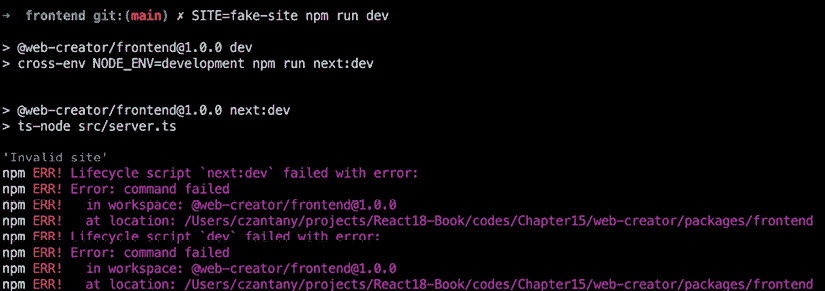

图 14.16：getGuests 查询

验证工作正常。现在，让我们使用`SITE=san-pancho npm run dev`命令运行我们的`san-pancho`站点：

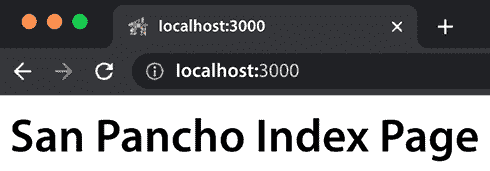

图 14.17：San Pancho 首页

如果一切顺利，你应该能看到前面的内容。接下来，让我们使用`SITE=codejobs npm run dev`命令运行我们的`codejobs`站点：

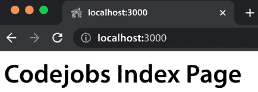

图 14.18：Codejobs 索引页面

很好，所以我们的两个网站都按预期工作！

现在是时候测试每个网站的登录页面了。让我们从 San Pancho 开始：

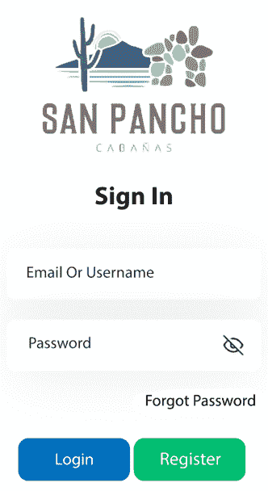

图 14.19：San Pancho 登录页面

然后让我们测试 Codejobs 登录页面：


图 14.20：Codejobs 登录页面

到目前为止，一切看起来都很正常。现在让我们用我们的默认凭证测试登录，这些凭证是**用户名**：`admin`和**密码**：`12345678`：

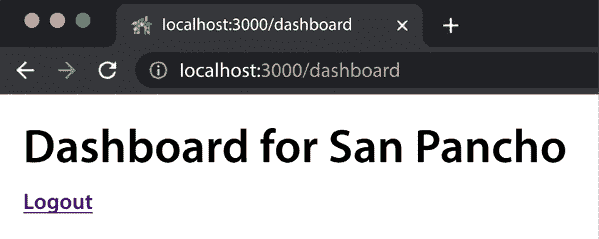

图 14.21：San Pancho 仪表板

很好！所以现在我们已经连接到了 San Pancho 的仪表板。

我想在这里强调的是我们用于用户会话的 cookie 名称，它是`at-san-pancho`。然而，即使你已经在 San Pancho 完成了登录，如果你尝试访问 Codejobs 仪表板，你将需要再次登录，因为每个网站会话都是独立的：

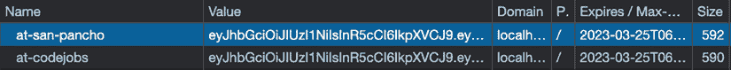

图 14.22：网站 cookie

最后，让我们测试一下访问我们网站上不存在的 URL：

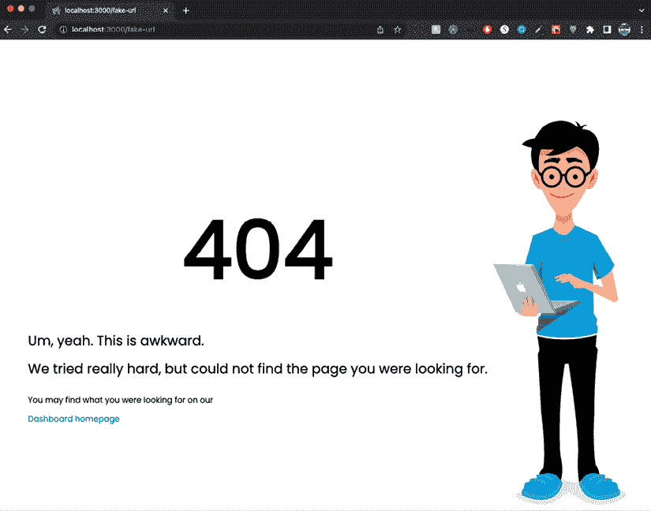

图 14.23：404 错误页面

你应该会看到一个`404`页面，它将在两个网站上共享。

# 摘要

恭喜你走到了这一步！毫无疑问，这一章内容复杂，但非常有趣。现在，你已经准备好了个人网站的骨架，可以开始工作了。

在本章的学习过程中，你掌握了一套全面的技能。你学习了如何创建`User`模型和 GraphQL 类型，理解错误处理，并设置自定义服务，如 CRM。你成功导航了构建站点系统的过程，通过页面切换器增强了用户体验，并建立了一个共享登录系统。此外，你获得了管理配置、使用模型的“种子”或默认数据以及将组件合并到命令文件（如`server.ts`）中的知识。因此，你现在精通同步模型、启动 Apollo Server、运行测试以及有效地解决可能出现的任何问题。本质上，你在管理多站网站系统、增强用户体验、理解 GraphQL 和故障排除方面建立了坚实的基础。

在下一章中，你将有机会进一步扩展你的技能，学习如何提高你的 React 应用程序的性能。
