# 第十六章：测试和调试

多亏了其组件，React 使得测试我们的应用变得容易。有许多不同的工具可供我们使用，我们可以用 React 创建测试。在本章中，我们将介绍最受欢迎的工具，以了解它们提供的优势。

**Jest** 是由 Meta 的 Christoph Nakazawa 和社区内的贡献者维护的**一站式**测试框架解决方案，旨在为您提供最佳的开发者体验。

到本章结束时，您将能够从头开始创建测试环境并为您的应用组件编写测试。

在本章中，我们将探讨以下主题：

+   为什么测试我们的应用很重要以及它们如何帮助开发者更快地工作

+   如何设置 Jest 环境以使用 Enzyme 测试组件

+   React Testing Library 是什么以及为什么它是测试 React 应用的**必备**工具

+   如何测试事件

+   如何实现 Vitest

+   React DevTools 和一些错误处理技术

# 技术要求

为了完成本章，您需要以下内容：

+   Node.js 19+

+   Visual Studio Code

您可以在本书的 GitHub 仓库中找到本章的代码：[`github.com/PacktPublishing/React-18-Design-Patterns-and-Best-Practices-Fourth-Edition/tree/main/Chapter16`](https://github.com/PacktPublishing/React-18-Design-Patterns-and-Best-Practices-Fourth-Edition/tree/main/Chapter16)。

# 理解测试的优势

测试 Web UI 一直是一项困难的任务。从单元测试到端到端测试，接口依赖于浏览器、用户交互以及许多其他变量，这使得实施有效的测试策略变得困难。

如果您曾经尝试为 Web 编写端到端测试，您就会知道如何获得一致的结果是多么复杂，以及结果通常如何受到网络等不同因素的影响，导致出现假阴性。除此之外，用户界面经常更新以提高体验、最大化转化率或简单地添加新功能。

如果测试难以编写和维护，开发者就不太可能覆盖他们的应用。另一方面，测试很重要，因为它们使开发者对自己的代码更有信心，这体现在速度和质量上。如果一段代码经过良好的测试（并且测试编写得很好），开发者可以确信它能够正常工作并准备好发布。同样，多亏了测试，重构代码变得更加容易，因为测试保证了在重写过程中功能不会改变。

开发者往往专注于他们当前正在实施的功能，有时很难知道应用的其他部分是否受到了这些更改的影响。测试有助于避免回归，因为它们可以告诉我们新代码是否破坏了旧测试。对编写新功能的更大信心导致更快地发布。

测试应用程序的主要功能可以使代码库更加稳固，每当发现新的错误时，它都可以被重现、修复并通过测试来防止未来再次发生。

幸运的是，React（以及组件时代）使得测试用户界面变得简单高效。测试组件或组件树是一项不那么繁重的任务，因为应用程序的每个部分都有其职责和边界。如果组件以正确的方式构建，如果它们是纯的，并且旨在具有可组合性和可重用性，那么它们可以像简单的函数一样进行测试。

现代工具带给我们的另一个强大功能是使用 Node.js 和控制台运行测试的能力。为每个测试启动浏览器会使测试变慢且不可预测，降低开发者的体验；相反，使用控制台运行测试要快得多。

仅在控制台中测试组件有时在它们在真实浏览器中渲染时可能会出现意外的行为，但根据我的经验，这种情况很少见。当我们测试 React 组件时，我们想要确保它们能正常工作，并且给定不同的 props 集合，它们的输出始终是正确的。

我们还可能想要覆盖组件可能具有的所有各种状态。状态可能会通过点击按钮而改变，因此我们编写测试来检查所有事件处理器是否正在执行它们应该执行的操作。

当组件的所有功能都被覆盖，但我们还想做更多的时候，我们可以编写测试来验证组件在**边缘情况**下的行为。边缘情况是组件可以假设的状态，例如，当所有 props 都是 null 或存在错误时。一旦编写了测试，我们就可以相当有信心地认为组件的行为符合预期。

测试单个组件固然很好，但这并不能保证将多个单独测试过的组件组合在一起后仍然能正常工作。正如我们稍后将会看到的，使用 React，我们可以挂载一个组件树并测试它们之间的集成。

我们可以使用不同的技术来编写测试，其中最受欢迎的一种是**测试驱动开发**（**TDD**）。应用 TDD 意味着先编写测试，然后再编写代码以通过测试。

遵循这种模式有助于我们编写更好的代码，因为我们被迫在实现功能之前更多地思考设计，这通常会导致更高的代码质量。

既然我们已经涵盖了所有这些内容，那就让我们挽起袖子开始为我们的 React 组件编写测试。我们还将了解一种称为测试驱动开发（test-driven development）的酷炫编程方式，并使用一个名为 Jest 的便捷工具来简化我们的 JavaScript 测试。准备好了吗？让我们深入其中，开始使用真实代码进行工作！

# 使用 Jest 进行无痛苦 JavaScript 测试

学习如何正确测试 React 组件最重要的方式是通过编写代码，这正是我们将在本节中要做的。

React 文档说明 Facebook 使用 Jest 来测试其组件。然而，React 并不强制你使用特定的测试框架，你可以使用你喜欢的任何一个而没有任何问题。为了看到 Jest 的实际应用，我们将从头创建一个项目，安装所有依赖项，并编写一个带有一些测试的组件。这将很有趣！

第一件事是要进入一个新的文件夹并运行以下命令：

```js
npm init 
```

一旦创建了 `package.json`，我们就可以开始安装依赖项，第一个是 `jest` 包本身：

```js
npm install --save-dev jest 
```

为了告诉 `npm` 我们想使用 `jest` 命令来运行测试，我们必须将以下脚本添加到 `package.json` 中：

```js
"scripts": {
  "build": "webpack",
  "start": "node ./dist/server",
  "test": "jest",
  "test:coverage": "jest --coverage"
} 
```

为了使用 ES6 和 JSX 编写组件和测试，我们必须安装所有与 Babel 相关的包，以便 Jest 可以使用它们进行转译和理解代码。

第二组依赖项的安装方式如下：

```js
npm install --save-dev @babel/core @babel/preset-env @babel/preset-react ts-jest 
```

如你所知，我们现在必须创建一个 `.babelrc` 文件，它被 Babel 用于知道我们希望在项目中使用的预设和插件。

`.babelrc` 文件看起来如下：

```js
{
  "presets": ["@babel/preset-env", "@babel/preset-react"]
} 
```

现在，是时候安装 React 和 ReactDOM，这是我们创建和渲染组件所需的：

```js
npm install --save react react-dom 
```

设置已完成，我们可以运行 Jest 对 ES6 代码进行测试，并在 DOM 中渲染我们的组件，但还有一件事要做。

我们需要安装 `jest-environment-jsdom`、`@testing-library/jest-dom` 和 `@testing-library/react`：

```js
npm install @testing-library/jest-dom @testing-library/react jest-environment-jsdom 
```

在你安装了这些包之后，你必须创建 `jest.config.js` 文件：

```js
module.exports = {
  preset: 'ts-jest',
  setupFilesAfterEnv: ['<rootDir>/setUpTests.ts'],
  testEnvironment: 'jsdom'
} 
```

然后，让我们创建 `setUpTests.ts` 文件：

```js
import '@testing-library/jest-dom/extend-expect' 
```

现在，让我们想象我们有一个 `Hello` 组件 (`src/components/Hello/index.tsx`)：

```js
import React, { FC } from 'react'
type Props = {
  name?: string
}
function Hello({ name }: Props) { 
  return <h1 className="Hello">Hello {name || 'World'}</h1>
}
 Hello.defaultProps = {
  name: ''
}
export default Hello 
```

为了测试这个组件，我们需要创建一个具有相同名称但添加 `.test`（或 `.spec`）后缀的新文件。这将是我们的测试文件：

```js
import React from 'react'
import { render, cleanup } from '@testing-library/react'
import Hello from './index'
 describe('Hello Component', () => {
  it('should render Hello World', () => {
   const wrapper = render(<Hello />)
   expect(wrapper.getByText('Hello World')).toBeInTheDocument()
  })
  it('should render the name prop', () => {
   const wrapper = render(<Hello name="Carlos" />)
   expect(wrapper.getByText('Hello Carlos')).toBeInTheDocument()
  })
  it('should has .Home classname', () => {
   const wrapper = render(<Hello />)
   expect(wrapper.container.firstChild).toHaveClass('Hello')
  })
  afterAll(cleanup)
}) 
```

然后，为了运行测试，你需要执行以下命令：

```js
npm test 
```

你应该看到以下结果：

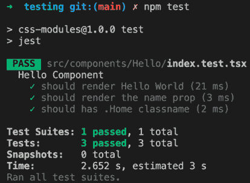

图 16.1：npm 测试

**PASS** 标签表示所有测试都已成功通过；如果至少有一个测试失败，你将看到 **FAIL** 标签。让我们更改我们的一个测试使其失败：

```js
it('should render the name prop', () => {
  const wrapper = render(<Hello name="Carlos" />)
  expect(wrapper.getByText('Hello World')).toBeInTheDocument()
}) 
```

这是结果：

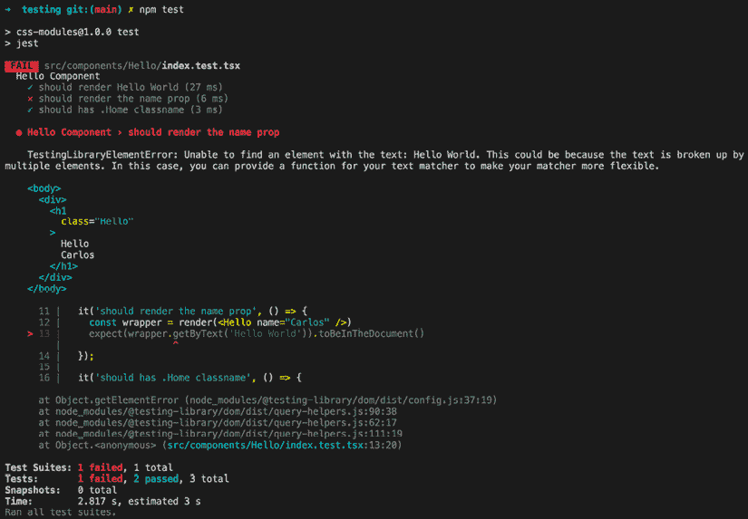

图 16.2：失败的测试

如你所见，**FAIL** 标签用 **X** 指定。此外，预期的和接收到的值提供了有用的信息，你可以看到预期的值和接收到的值。

如果你想要查看所有单元测试的覆盖率百分比，你可以执行以下命令：

```js
npm run test:coverage 
```

结果如下：

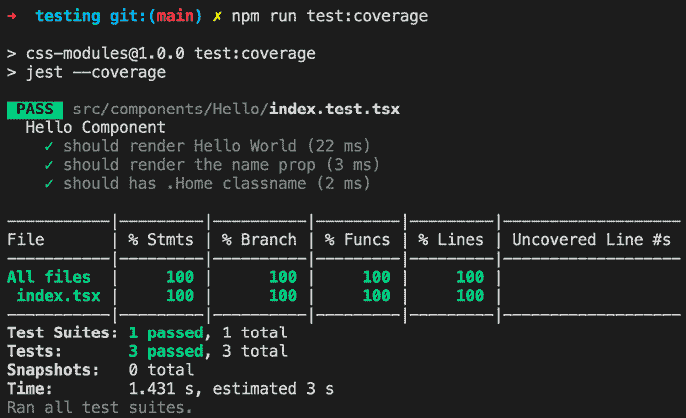

图 16.3：通过测试

覆盖率还会生成结果的 HTML 版本；它创建一个名为 `coverage` 的目录，并在其中创建一个名为 `Icov-report` 的目录。如果你在浏览器中打开 `index.xhtml` 文件，你会看到以下 HTML 版本：

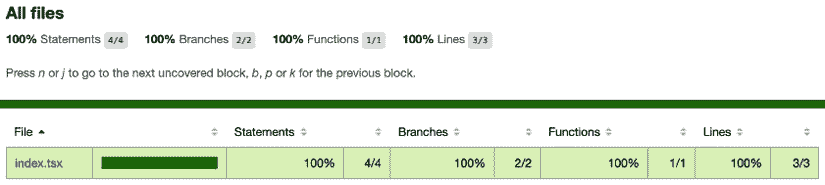

图 16.4：Icov-report

现在你已经完成了第一次测试，并且知道如何收集覆盖率数据，让我们看看如何在下一节测试事件。

## 测试事件

事件在任何网络应用中都非常常见，我们同样需要测试它们，所以让我们学习如何测试事件。为此，让我们创建一个新的 `ShowInformation` 组件：

```js
import { useState, ChangeEvent } from 'react'

 function ShowInformation() {
  const [state, setState] = useState({ name: '', age: 0, show: false })
  const handleOnChange = (e: ChangeEvent<HTMLInputElement>) => {
   const { name, value } = e.target
   setState({
    ...state,
    [name]: value
   })
  }
  const handleShowInformation = () => {
   setState({
    ...state,
    show: true
   })
  }
  if (state.show) {
   return (
    <div className="ShowInformation">
    <h1>Personal Information</h1>
     <div className="personalInformation">
      <p><strong>Name:</strong> {state.name}</p>
      <p><strong>Age:</strong> {state.age}</p>
     </div>
    </div>
   )
  }

  return (
   <div className="ShowInformation">
    <h1>Personal Information</h1>
    <p><strong>Name:</strong></p>
    <p>
     <input name="name" type="text" value={state.name} onChange={handleOnChange} />
    </p>
    <p>
     <input name="age" type="number" value={state.age} onChange={handleOnChange} />
    </p>
    <p><button onClick={handleShowInformation}>Show Information</button></p>
   </div>
  )
}
export default ShowInformation 
```

现在，让我们在 `src/components/ShowInformation/index.test.tsx` 创建测试文件：

```js
import { render, cleanup, fireEvent } from '@testing-library/react'
import ShowInformation from './index'
describe('Show Information Component', () => {
  let wrapper
  beforeEach(() => {
   wrapper = render(<ShowInformation />)
  })
  it ('should modify the name', () => {
   const nameInput = wrapper.container.querySelector('input[name="name"]') as HTMLInputElement
   const ageInput = wrapper.container.querySelector('input[name="age"]') as HTMLInputElement
   fireEvent.change(nameInput, { target: { value: 'Carlos' } })
   fireEvent.change(ageInput, { target: { value: 34 } })
   expect(nameInput.value).toBe('Carlos')
   expect(ageInput.value).toBe('34')
  })
  it ('should show the personal information when user clicks on the button', () => {
   const button = wrapper.container.querySelector('button')
   fireEvent.click(button)
   const showInformation = wrapper.container.querySelector('.personalInformation')
   expect(showInformation).toBeInTheDocument()
})
  afterAll(cleanup)
}) 
```

如果你运行测试并且一切正常，你应该会看到以下内容：

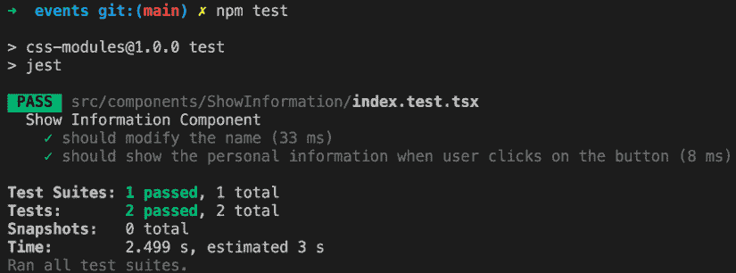

图 16.5：通过测试

# 介绍 Vitest

**Vitest** 是一个基于 **Vite** 构建的单元测试框架，旨在追求速度和最小化配置。它可作为 Jest、Mocha 和 Chai 等各种测试工具的替代品。由于 Vitest 是建立在 Jest API 之上的，如果你已经知道如何使用 Jest，它的工作方式将非常相似。

在这个上下文中，我们将利用 Vite，这是一个旨在为现代网络项目提供快速和精简开发体验的构建工具。

首先，你需要使用以下命令全局安装 Vite：

```js
npm install vite -g 
```

安装完成后，你需要使用 `npm` 命令创建你的第一个项目：

```js
npm create vite@latest 
```

它会要求你输入项目名称。你可以使用 `my-first-vite-project`，然后选择你想要使用的框架（`React`），最后选择变体（`TypeScript`）：

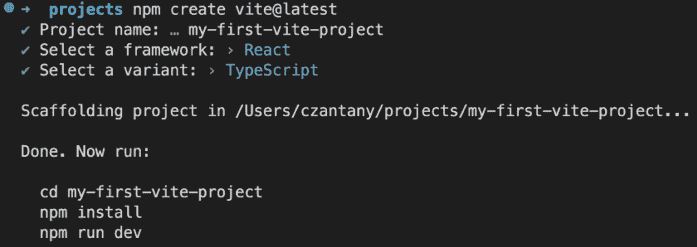

图 16.6：npm create vite@latest

接下来，你需要安装项目依赖并运行 `npm run dev` 命令。如果你这样做，你将在端口 `5173` 上看到类似以下内容：

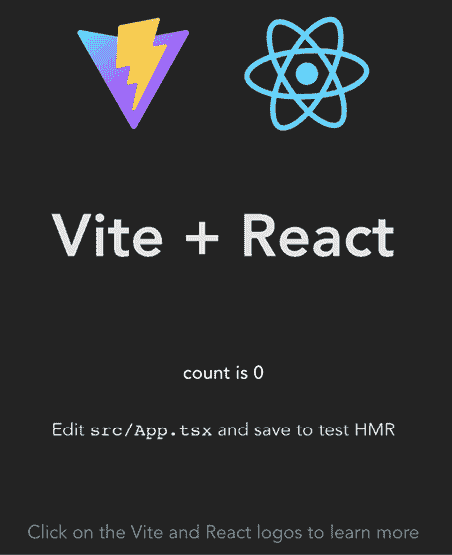

图 16.7：Vite 应用

## 安装和配置 Vitest

一旦你的 Vite 应用运行起来，就是时候安装 Vitest 了。要做到这一点，你只需要在你的项目终端中运行这个命令：

```js
 npm install -D vitest @test-library/react 
```

在安装了 Vitest 之后，你需要使用以下代码修改 `vite.config.ts` 文件：

```js
/// <reference types="vitest" />
import react from '@vitejs/plugin-react'
import { defineConfig } from 'vite'

// https://vitejs.dev/config/
export default defineConfig({
  plugins: [react()],
  test: {
   environment: 'jsdom'
  }
}) 
```

如你所见，我们将使用 `jsdom` 环境，因此你也需要安装它：

```js
npm install -D jsdom 
```

此外，Vitest 还提供了一个名为 Vitest UI 的插件，它使 Vitest 能够在浏览器中提供直观的用户界面来查看和交互测试。虽然这是一个可选插件，但我们将使用它。你可以通过执行以下命令来安装它：

```js
npm install -D @vitest/ui 
```

为了测试你的代码，你需要使用 `vitest --ui` 命令将测试脚本添加到你的 `package.json` 文件中：

```js
"scripts": {
  "dev": "vite",
  "build": "tsc && vite build",
  "preview": "vite preview",
  "test": "vitest --ui"
} 
```

我们将使用与 Jest 相同的 `Hello` 组件，尽管会有一些差异。你需要将此组件保存到 `src/components/Hello/index.tsx`：

```js
 import React, { FC } from 'react'
 type Props = {
  name?: string
 }
 const Hello: FC<Props> = ({ name }) => <h1 className="Hello">Hello {name || "World"}</h1>
 export default Hello 
```

然后，你需要在同一组件目录下创建一个名为 `index.test.tsx` 的测试文件：

```js
 import { cleanup, render } from '@testing-library/react'
 import { afterAll, describe, expect, it } from 'vitest'
 import Hello from './index'
 describe("Hello Component", () => {
  it("should render Hello World", () => {
   const wrapper = render(<Hello />)
   expect(wrapper.getByText("Hello World")).toBeDefined()
  })

  it("should render the name prop", () => {
   const wrapper = render(<Hello name="Carlos" />)
   expect(wrapper.getByText("Hello Carlos")).toBeDefined()
  })

  it("should has .Home classname", () => {
   const wrapper = render(<Hello />)
   const firstChild = wrapper.container.firstChild as HTMLElement
   expect(firstChild?.classList.contains("Hello")).toBe(true)
  })

  afterAll(cleanup)
 }) 
```

如你所见，代码与 Jest 非常相似。然而，主要区别之一是我们现在正在导入我们将要使用的所有测试方法，例如 `afterAll`、`describe`、`expect` 和 `it`。

如果您运行`test`命令，您应该在您的终端中看到类似以下的内容：

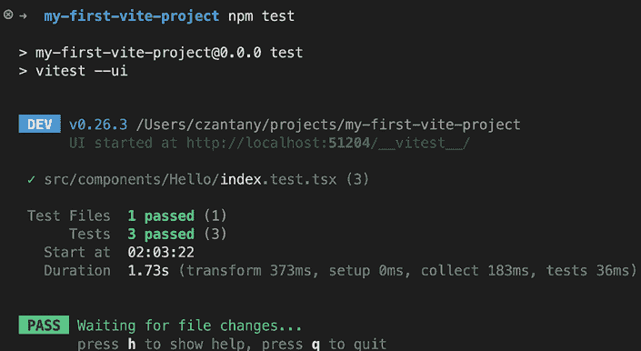

图 16.8：npm 测试

如果您已经注意到，这是由我们之前安装的 Vitest UI 插件生成的链接。如果您点击该链接，您将看到以下内容：

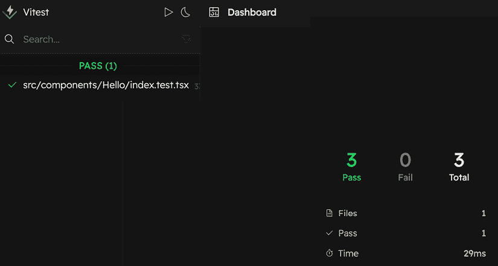

图 16.9：Vitest UI

目前，我们只有一个测试文件，但如果您添加更多，您将在左侧侧边栏上看到它们。现在，让我们点击我们当前的`Hello`测试：

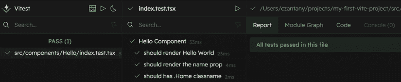

图 16.10 – 报告

您将能够看到正确通过的测试用例。然而，这个 UI 插件最有趣的优势之一是您甚至可以直接在浏览器中通过点击**代码**标签来修改测试代码：

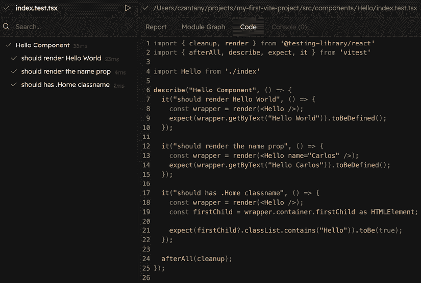

图 16.11：代码

让我们修改我们的代码，故意让一些测试失败。您可以将第一个测试改为`"Hello Foo"`而不是`"Hello World"`，并确保保存（*Cmd + S*）：

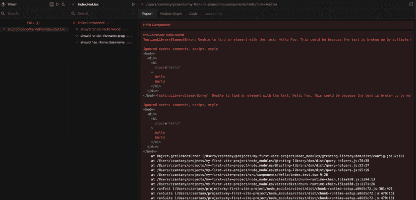

图 16.12：失败的测试

如您所见，现在我们的第一次测试失败了，因为它无法找到`"Hello Foo"`文本。

## 启用全局变量

个人来说，我更喜欢在一个文件中导入所有必要的函数或变量。然而，我意识到在创建大量测试文件时，反复导入全局测试变量如`describe`、`it`、`expect`等可能会变得繁琐和麻烦。

幸运的是，Vitest 提供了一个配置选项来启用`globals`，从而消除了每次都需要导入它们的需要。要启用此功能，您需要使用以下代码修改您的`vite.config.ts`文件：

```js
/// <reference types="vitest" />
/// <reference types="vite/client" />
import react from '@vitejs/plugin-react'
import { defineConfig } from 'vite'
// https://vitejs.dev/config/
export default defineConfig({
  plugins: [react()],
  test: {
   environment: "jsdom",
   globals: true
  }
}) 
```

在进行前面提到的更改后，您还需要通过添加全局类型来更新您的`tsconfig.json`文件：

```js
"compilerOptions": {
  "types": ["vitest/globals"]
} 
```

在遵循这些步骤之后，您现在将能够从您的测试文件中移除对`globals`的导入。如果您仍然遇到任何 TypeScript 错误，您可能需要重新启动您的 TypeScript 服务器或重新加载 VSCode 中的窗口。

## 在源代码中测试

Vitest 还提供了一种在源代码与实现一起运行测试的方法，类似于 Rust 的模块测试。

个人来说，我有一个老式的做法，我通常更喜欢为我的测试保留一个单独的测试文件。然而，在某些情况下，被测试的组件或函数非常小，创建一个新的测试文件可能看起来有些过度。

要启用此功能，您需要修改您的`vite.config.ts`文件并添加`includeSource`选项：

```js
export default defineConfig({
  plugins: [react()],
  test: {
   environment: "jsdom",
   globals: true,
   includeSource: ["src/**/*.{ts,tsx}"]
  }
}) 
```

要解决 TypeScript 问题，您需要在您的`tsconfig.json`文件中添加`vitest/importMeta`类型进行另一个更改：

```js
"compilerOptions": {
  "types": ["vitest/globals", "vitest/importMeta"]
} 
```

现在，让我们将我们的`Hello`组件测试文件移到同一个`Hello`组件内部。再次强调，这是可选的，只是为了演示这是可能的。最后，您可以选择使用哪种测试方法。

要实现这一点，我们需要在我们的 `Hello` 组件内部添加一个 `if` 语句来检查我们是否处于测试模式。我们可以用以下代码来完成这个任务：`if (import.meta.vitest)`。在这个块内部，我们将移动所有的测试用例，并且我们也将只在该块内部要求 **React 测试库** 方法。这样，我们的代码将类似于以下内容：

```js
import React, { FC } from 'react'
  type Props = {
  name?: string;
}
const Hello: FC<Props> = ({ name }) => <h1 className="Hello">Hello {name || "World"}</h1>
export default Hello;
if (import.meta.vitest) {
  const { cleanup, render } = require('@testing-library/react')

  describe("Hello Component", () => {
   it("should render Hello World", () => {
    const wrapper = render(<Hello />)
    expect(wrapper.getByText("Hello World")).toBeDefined()
   })

   it("should render the name prop", () => {
    const wrapper = render(<Hello name="Carlos" />)
    expect(wrapper.getByText("Hello Carlos")).toBeDefined()
   })
   it("should has .Home classname", () => {
    const wrapper = render(<Hello />)
    const firstChild = wrapper.container.firstChild as HTMLElement
    expect(firstChild?.classList.contains("Hello")).toBe(true)
   })

   afterAll(cleanup)
  })
} 
```

现在，你可以删除你之前的文件（`index.test.tsx`）。如果你再次运行你的测试，它们应该会按预期工作。

不同之处在于现在你将能够看到整个代码（`Component` 和 `Test` 用例）：

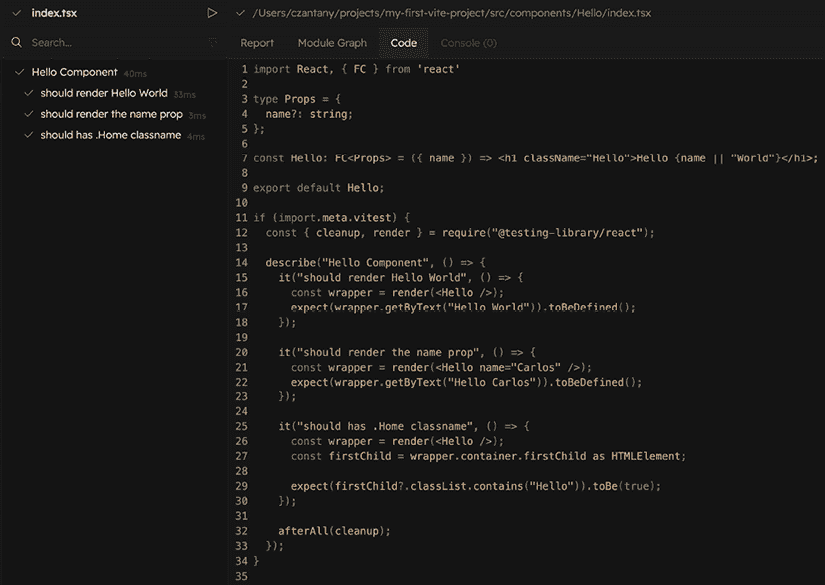

图 16.13：通过测试

这种方法可能会加快组件或函数的测试过程。然而，我个人仍然更喜欢在单独的测试文件中进行测试。尽管如此，你可以自由选择对你和你的项目最有效的方法。

在探索了源代码测试的概念之后，让我们继续了解如何有效地将 React DevTools 应用于我们的开发过程中，以优化我们应用程序的性能并确保其平稳运行。

# 使用 React DevTools

当在控制台测试不够时，并且我们想在浏览器内运行的应用程序中检查我们的应用程序时，我们可以使用 React DevTools。

你可以在以下网址将其作为 Chrome 扩展安装：[`chrome.google.com/webstore/detail/react-developer-tools/fmkadmapgo fadopljbjfkapdkoienihi?hl=en`](https://chrome.google.com/webstore/detail/react-developer-tools/fmkadmapgofadopljbjfkapdkoienihi?hl=en)。

安装会在 Chrome DevTools 中添加一个名为 **React** 的标签页，你可以检查组件的渲染树并检查它们在特定时间点接收了哪些属性以及它们的状态。

可以读取属性和状态，并且可以实时更改它们以触发 UI 的更新并立即看到结果。这是一个必备的工具，在最新版本中，它有一个可以通过勾选**跟踪 React 更新**复选框来启用的新功能。

当这个功能被启用时，我们可以使用我们的应用程序，并查看当我们执行特定操作时哪些组件被更新。更新的组件会用彩色矩形突出显示，这使得发现可能的优化变得容易。

## 使用 Redux DevTools

如果你正在你的应用程序中使用 Redux，你可能想使用 Redux DevTools 来调试你的 Redux 流程。你可以在以下网址安装它：[`chrome.google.com/webstore/detail/redux-devtools/lmhkpmbekcpmknklioeibfkpmmfibljd?hl=es`](https://chrome.google.com/webstore/detail/redux-devtools/lmhkpmbekcpmknklioeibfkpmmfibljd?hl=es)

此外，你还需要安装 `redux-devtools-extension` 包：

```js
npm install --save-dev redux-devtools-extension 
```

一旦你安装了 React DevTools 和 Redux DevTools，你将需要配置它们。

如果你尝试直接使用 Redux DevTools，它将不会工作；这是因为我们需要将 `composeWithDevTools` 方法传递给 Redux 存储；这应该是 `configureStore.ts` 文件：

```js
import { createStore, applyMiddleware } from 'redux';
import thunk from 'redux-thunk';
import { composeWithDevTools } from 'redux-devtools-extension';
import rootReducer from '@reducers';

export default function configureStore({
  initialState,
  reducer
}) {
const middleware = [thunk];
return createStore(
   rootReducer,
   initialState,
   composeWithDevTools(applyMiddleware(...middleware))
  );
} 
```

这是测试我们 Redux 应用程序的最佳工具。

# 摘要

在本章中，你全面了解了测试的好处，以及可用于测试 React 组件的各种框架和工具。你学习了如何使用 React Testing Library 来实现和测试组件和事件，以及如何使用 Jest 覆盖率来优化你的测试过程。此外，你还探索了 React DevTools 和 Redux DevTools 等工具，以进一步增强你的开发体验。在测试复杂组件时，如高阶组件或具有多个嵌套字段的表单，记住常见的解决方案是很重要的，以确保你的测试能够准确反映应用程序的功能。

在下一章中，你将学习如何将你的应用程序部署到生产环境。
