# 17

# 部署到生产环境

现在你已经完成了你的第一个 React 应用程序，是时候学习如何将其部署到世界上了。为此，我们将使用名为**DigitalOcean**的云服务。

在本章中，你将学习如何使用 Node.js 和`nginx`在 DigitalOcean 的 Ubuntu 服务器上部署你的 React 应用程序。简而言之，我们将涵盖以下主题：

+   创建 DigitalOcean Droplet 并配置它

+   配置 nginx、PM2 和域名

+   实施 CircleCI 进行持续集成

# 技术要求

为了完成本章，你需要以下内容：

+   Node.js 19+

+   Visual Studio Code

# 创建我们的第一个 DigitalOcean Droplet

我已经使用了 DigitalOcean 七年了，我可以这么说，它是我在尝试过的最好的云服务之一，不仅因为成本合理，而且因为它配置超级简单快捷，社区有大量的更新文档来修复大多数与服务器配置相关的问题。

到这一点，你需要投资一些钱来获取这项服务。我会向你展示最便宜的方法来做这件事，如果你将来想要增加 Droplet 的功率，你将能够增加容量而无需重新配置。

非常基础的 Droplet 的最低价格为每月 6.00 美元（每小时 0.009 美元）。

我们将使用 Ubuntu 20.04（但请随意使用最新版本，21.04）；你需要了解一些基本的 Linux 命令才能配置你的 Droplet。如果你是使用 Linux 的初学者，不要担心——我会尽量用非常简单的方式展示每个步骤。

## 在 DigitalOcean 上注册

如果你没有 DigitalOcean 账户，你可以在[`cloud.digitalocean.com/registrations/new`](https://cloud.digitalocean.com/registrations/new)注册。

你可以用你的 Google 账户注册，或者手动注册。一旦你用 Google 注册，你将看到**账单信息**视图，如下所示：

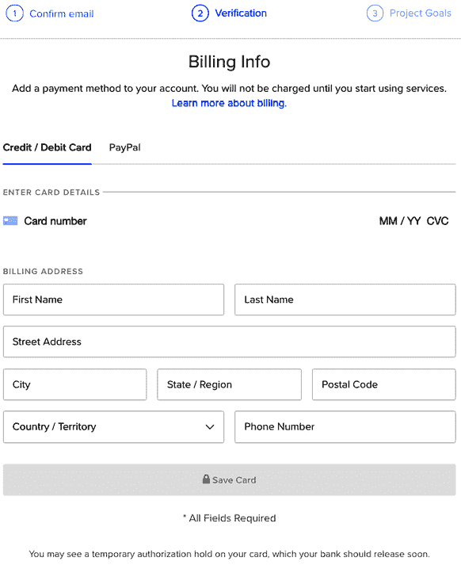

图 17.1：账单信息

你可以用信用卡或通过 PayPal 支付。一旦你配置了你的支付信息，DigitalOcean 将要求你提供一些关于你的项目的信息，以便它可以更快地配置你的 Droplet。

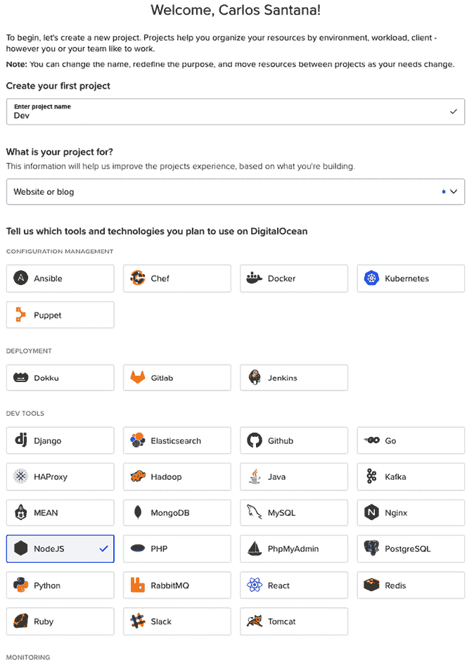

图 17.2：第一个应用程序

让我们继续创建我们的第一个 Droplet。

## 创建我们的第一个 Droplet

我们将从头开始创建一个新的 Droplet。按照以下步骤操作：

1.  选择**新 Droplet**选项，如下面的截图所示：

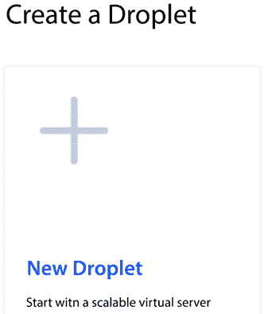

图 17.3：新 Droplet

1.  选择**Ubuntu 20.04 (LTS) x64**，如下所示：

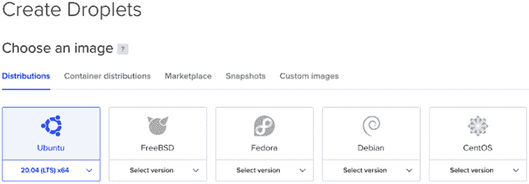

图 17.4：选择镜像

1.  然后，选择**基础**计划，如图所示：

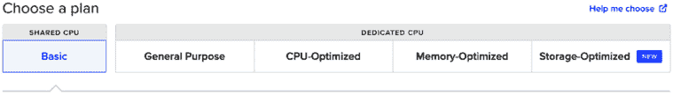

图 17.5：选择一个计划

1.  然后，你可以从支付计划选项中选择**$6/月**：

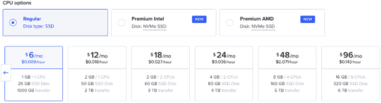

图 17.6：CPU 选项

1.  选择一个区域。在这种情况下，我们将选择**旧金山**区域：

    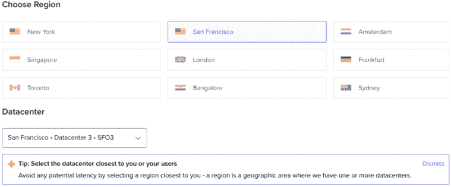

    图 17.7：选择区域

1.  创建一个根密码，添加你的 Droplet 名称，然后点击**创建 Droplet**按钮，如下所示：

    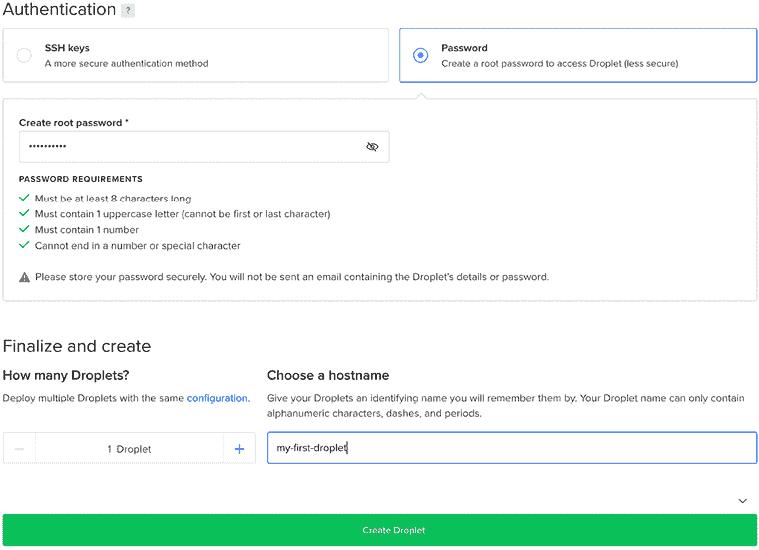

    图 17.8：身份验证

1.  创建你的 Droplet 大约需要 30 秒。一旦创建完成，你将能够看到它：

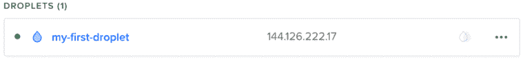

图 17.9：我的第一个 Droplet

1.  现在，在你的终端中，你可以使用以下命令访问 Droplet：

    ```js
    ssh root@THE_DROPLET_IP 
    ```

1.  第一次访问时，你会被要求输入指纹。你只需输入*是*，然后它会要求你输入密码（你在创建 Droplet 时定义的密码）。

这是一种专门设计用于防止*中间人攻击*的安全功能。服务器的“指纹”充当一个独特的数字签名，该签名仅属于服务器本身。当你观察到与预期匹配的指纹时，你可以通过输入`yes`并按*Enter*键继续。随后，服务器将提示你输入密码。请提供你在创建 Droplet 时定义的密码，并按*Enter*键。请注意，出于安全原因，在输入密码时屏幕上不会显示任何字符。认证成功后，你将登录到你的服务器，准备开始执行命令。

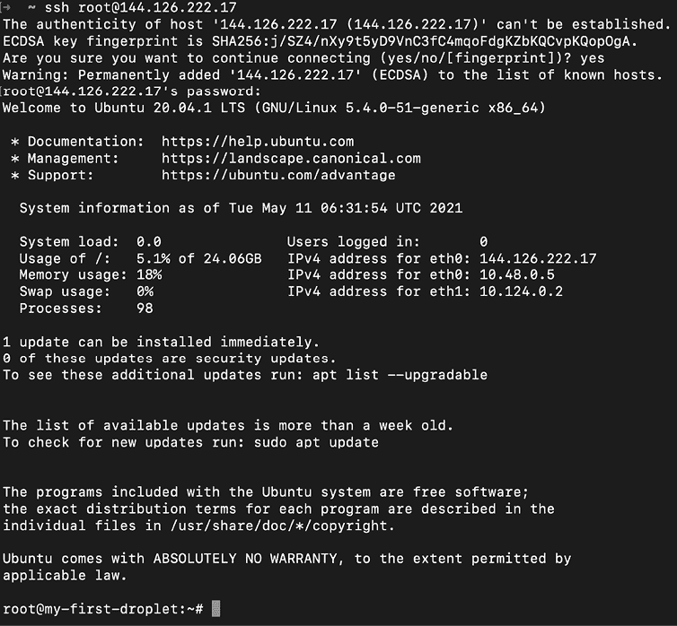

图 17.10：连接到 Droplet

现在我们已经准备好安装 Node.js，我们将在下一节中介绍。

## 安装 Node.js

现在你已经连接到你的 Droplet，让我们来配置它。首先，我们需要使用个人软件包存档安装 Node.js 的最新版本。本书撰写时 Node.js 的当前版本是 19.9.x。按照以下步骤安装 Node.js：

1.  如果你阅读这个段落时 Node.js 有新版本，请更改`setup_19.x`命令中的版本：

    ```js
    cd ~ 
    curl -sL https://deb.nodesource.com/setup_19.x -o nodesource_setup.sh 
    ```

1.  一旦你获取到`nodesource_setup.sh`文件，运行以下命令：

    ```js
    sudo bash nodesource_setup.sh 
    ```

1.  然后，通过运行以下命令安装 Node：

    ```js
    sudo apt install nodejs -y 
    ```

1.  如果一切正常，请使用以下命令验证安装的 Node 和`npm`版本：

    ```js
    node -v 
    v19.9.0 
    npm -v 
    9.6.3 
    ```

如果你需要 Node.js 的新版本，你可以随时升级它。

## 配置 Git 和 GitHub

我创建了一个特殊的仓库，帮助你将第一个 React 应用程序部署到生产环境（[`github.com/FoggDev/production`](https://github.com/FoggDev/production)）。

在你的 Droplet 上，你需要克隆这个 Git 仓库（或者如果你已经准备好了要部署的 React 应用程序，克隆你自己的仓库）。生产仓库是公开的，但通常你会使用私有仓库；在这种情况下，你需要将你的 Droplet 的 SSH 密钥添加到你的 GitHub 账户中。

要创建这个密钥，请按照以下步骤操作：

1.  运行 `ssh-keygen` 命令，然后按三次 *Enter* 键，不输入任何密码短语：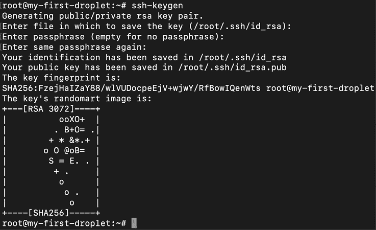

    图 17.11：ssh-keygen

    如果你让你的终端闲置超过五分钟，你的 Droplet 连接可能会被关闭，你需要再次连接。

1.  一旦你创建了你的 Droplet SSH 密钥，你可以通过运行以下命令来查看它：

    ```js
    vi /root/.ssh/id_rsa.pub 
    ```

    你会看到类似以下的内容：

    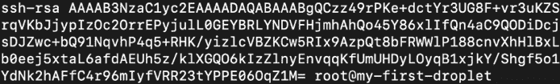

    图 17.12：ssh-rsa

1.  复制你的 SSH 密钥，然后访问你的 GitHub 账户。转到 **设置** | **SSH 和 GPG 密钥**（[`github.com/settings/ssh/new`](https://github.com/settings/ssh/new)）。然后，将你的密钥粘贴到文本区域，并为密钥添加标题：

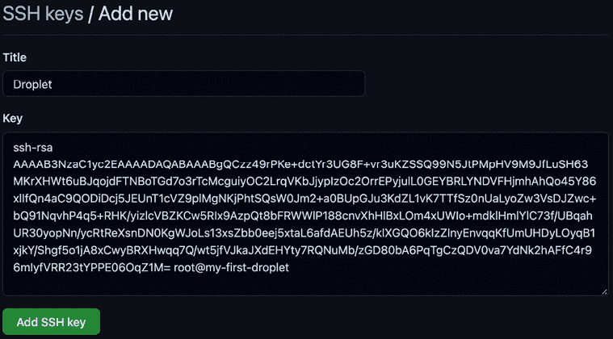

图 17.13：向 GitHub 添加新的 SSH 密钥

1.  一旦你点击 **添加 SSH 密钥** 按钮，你会看到你的 SSH 密钥，如下所示：

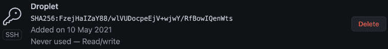

图 17.14：SSH

1.  现在，你可以使用以下命令克隆我们的仓库（或你的）：

    ```js
    git clone git@github.com:FoggDev/production.git 
    ```

1.  当你第一次克隆时，你会收到一条消息，要求你允许 RSA 密钥指纹：

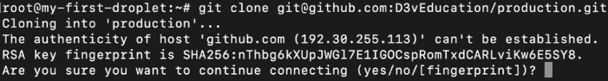

图 17.15：克隆仓库

1.  你必须输入 `Yes` 并按 *Enter* 键才能克隆它：

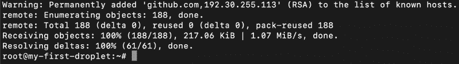

图 17.16：已知主机

1.  然后，你必须转到生产目录并安装 `npm` 包：

    ```js
    cd production 
    npm install 
    ```

1.  如果你想要测试应用程序，只需运行 `start` 脚本：

    ```js
    npm start 
    ```

1.  然后打开你的浏览器，转到你的 Droplet IP 并添加端口号。在我的例子中，它是 `http://144.126.222.17:3000`：

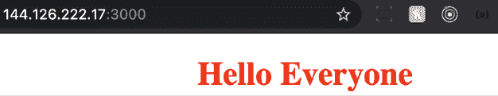

图 17.17：开发模式下的项目运行

1.  这将在开发模式下运行项目。如果你想以生产模式运行它，请使用以下命令：

    ```js
    npm run start:production 
    ```

    你应该会看到 **生产进程管理器**（**PM2**）正在运行，如下面的截图所示：

    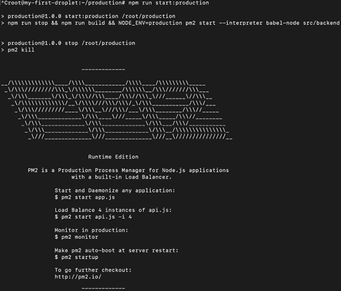

    图 17.18：PM2

1.  如果你运行它并在你的 Chrome DevTools 中的 **网络** 选项卡下查看，你会看到正在加载的包：

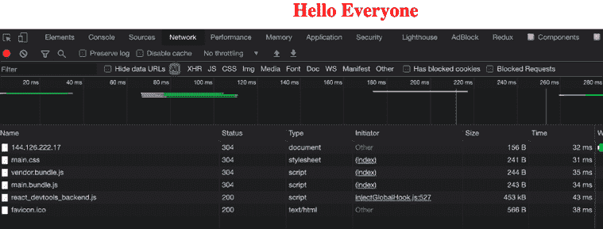

图 17.19：网络选项卡

现在，我们的 React 应用程序已经在生产环境中运行，但在下一节中，让我们看看我们还能用 DigitalOcean 做些什么。

## 关闭我们的 Droplet

要关闭 Droplet，请按照以下步骤操作：

1.  如果你想要关闭你的 Droplet，你可以转到 **电源** 部分，或者你可以使用 **开启/关闭** 开关：

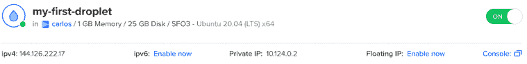

图 17.20：关闭 Droplet

1.  DigitalOcean 只在你开启 Droplet 时才会收费。如果你点击 **开启** 开关来关闭它，那么你会收到以下确认消息：

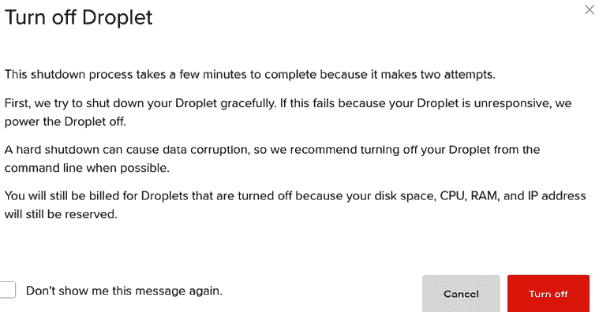

图 17.21：关闭 Droplet

这样，你可以控制你的 Droplet，并在不使用 Droplet 时避免不必要的付费。

# 配置 nginx、PM2 和域名

我们的 Droplet 已准备好用于生产，但正如你所见，我们仍在使用端口 `3000`。我们需要配置 nginx 并实现代理以将流量从端口 `80` 重定向到 `3000`；这意味着我们不再需要直接指定端口。

**Node PM2** 将帮助我们安全地运行 Node 服务器。通常，如果我们直接使用 `node` 或 `babel-node` 命令运行 Node，并且应用程序中发生错误，那么它将崩溃并停止工作。PM2 在发生错误时重新启动 Node 服务器。

首先，在你的 Droplet 中，你需要全局安装 PM2：

```js
npm install -g pm2 
```

PM2 将帮助我们以非常简单的方式运行我们的 React 应用程序。

## 安装和配置 nginx

要安装 nginx，你需要执行以下命令：

```js
sudo apt-get update 
sudo apt-get install nginx 
```

在你安装 nginx 之后，你可以开始配置：

1.  我们需要调整防火墙以允许端口 `80` 的流量。要列出可用的应用程序配置，你需要运行以下命令：

    ```js
    sudo ufw app list
    Available applications:
    Nginx Full
    Nginx HTTP
    Nginx HTTPS
    OpenSSH 
    ```

1.  `Nginx Full` 表示它将允许来自端口 `80`（HTTP）和端口 `443`（HTTPS）的流量。我们尚未配置任何带有 SSL 的域名，因此，目前我们应该限制流量仅通过端口 `80`（HTTP）发送：

    ```js
    sudo ufw allow 'Nginx HTTP'
    Rules updated
    Rules updated (v6) 
    ```

    如果你尝试访问 Droplet IP，你应该看到 nginx 正在运行：

    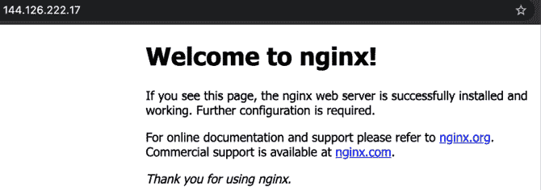

    图 17.22：欢迎使用 nginx

1.  你可以使用以下命令管理 nginx 进程：

    ```js
    Start server: sudo systemctl start nginx
    Stop server: sudo systemctl stop nginx
    Restart server: sudo systemctl restart nginx 
    ```

Nginx 是一个非常出色的网站服务器，现在越来越受欢迎。

## 设置反向代理服务器

如我之前所述，我们需要设置一个反向代理服务器，将端口 `80`（HTTP）的流量发送到端口 `3000`（React 应用程序）。为此，你需要打开以下文件：

```js
sudo vi /etc/nginx/sites-available/default 
```

设置反向代理服务器的步骤如下：

1.  在 `location /` 块中，你需要用以下代码替换文件中的代码：

    ```js
    location / {
      proxy_pass http://localhost:3000;
      proxy_http_version 1.1;
      proxy_set_header Upgrade $http_upgrade;
      proxy_set_header Connection 'upgrade'; 
      proxy_set_header Host $host; 
      proxy_cache_bypass $http_upgrade;
     } 
    ```

1.  保存文件后，你可以使用以下命令验证 nginx 配置中是否存在语法错误：

    ```js
    sudo nginx -t 
    ```

1.  如果一切正常，你应该看到这个：

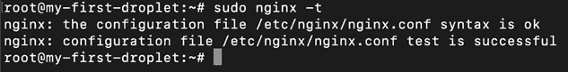

图 17.23：sudo ngnix-t

1.  最后，你需要重新启动 nginx 服务器：

    ```js
    sudo systemctl restart nginx 
    ```

现在，您应该能够访问不带端口的 React 应用程序，如下面的截图所示：

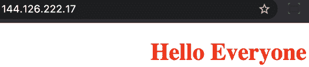

图 17.24：不带端口的 React 应用程序

我们几乎完成了！在下一节中，我们将向我们的 Droplet 添加一个域名。

## 将域名添加到我们的 Droplet

使用 IP 地址访问网站并不方便；我们总是需要使用域名来帮助用户更容易地找到我们的网站。如果您想使用与您的 Droplet 关联的域名，您需要更改域名的名称服务器，使其指向 DigitalOcean DNS。我通常使用 GoDaddy 来注册我的域名。

要使用 GoDaddy 完成此操作，请按照以下步骤进行：

1.  前往[`dcc.godaddy.com/manage/YOURDOMAIN.COM/dns`](https://dcc.godaddy.com/manage/YOURDOMAIN.COM/dns)，然后进入**名称服务器**部分：

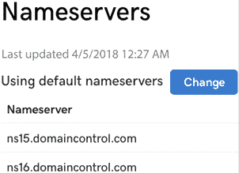

图 17.25：名称服务器

1.  点击**更改**按钮，选择**自定义**，然后指定 DigitalOcean DNS：

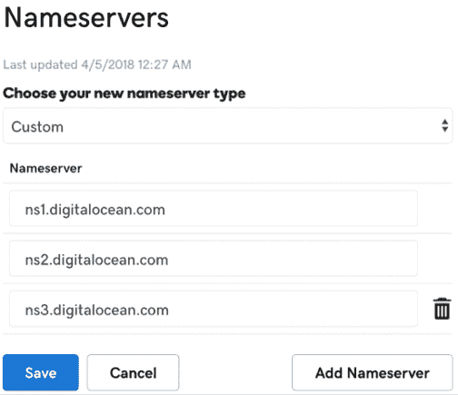

图 17.26：DigitalOcean 名称服务器

1.  通常，DNS 更改需要 15 到 30 分钟才能生效；现在，在您更新了名称服务器后，前往您的**Droplet**仪表板，然后选择**添加域名**选项：

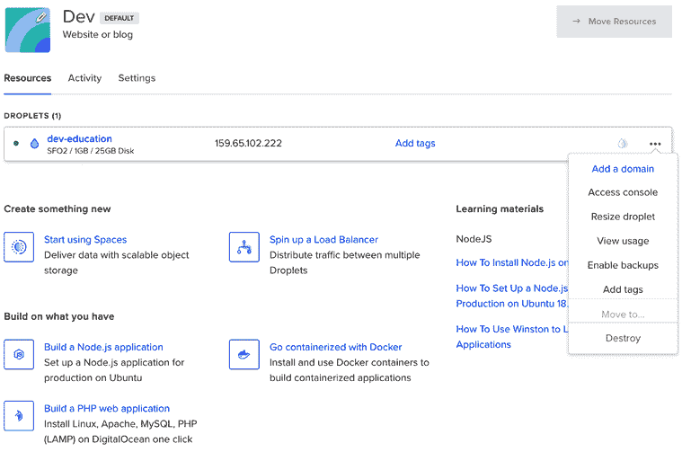

图 17.27：添加域名

1.  然后，输入您的域名，选择您的 Droplet，并点击**添加域名**按钮：

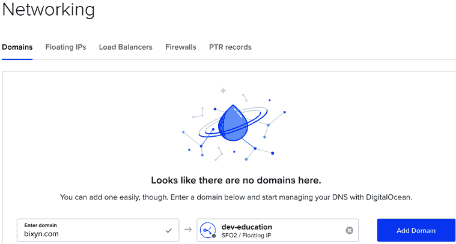

图 17.28：网络

1.  现在，您必须为**CNAME**创建一个新的记录。选择**CNAME**选项卡，在**主机名**中输入`www`；在别名字段中，默认写入`@`；默认情况下，TTL 为`43200`。所有这些都是为了通过`www`前缀访问您的域名：

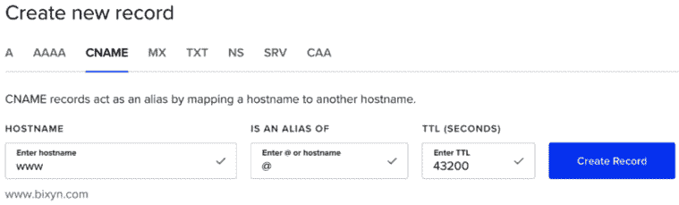

图 17.29：创建新记录

如果您一切操作正确，您应该能够访问您的域名并看到 React 应用程序正在运行。正如我之前所说，这个过程可能需要长达 30 分钟，但在某些情况下，可能需要长达 24 小时，具体取决于 DNS 传播速度。

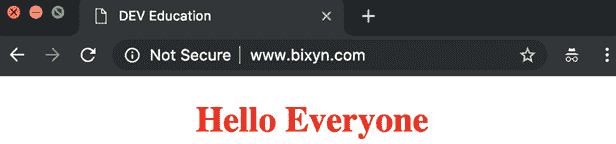

图 17.30：运行在域名上的 React 应用程序

太棒了。现在您已经正式部署了您的第一个 React 应用程序到生产环境！

# 实施 CircleCI 进行持续集成

我已经使用 CircleCI 一段时间了，我可以告诉你，它是最好的 CI 解决方案之一：对个人用户免费，提供无限数量的仓库和用户；你每月有 1,000 构建分钟，一个容器和一个并发作业；如果你需要更多，你可以以每月 50 美元的初始价格升级计划。

你需要做的第一件事是使用你的 GitHub 账户（或者如果你更喜欢，使用 Bitbucket）在该网站上注册。

如果你选择使用 GitHub，你需要在你的账户中授权 CircleCI，如下面的截图所示：

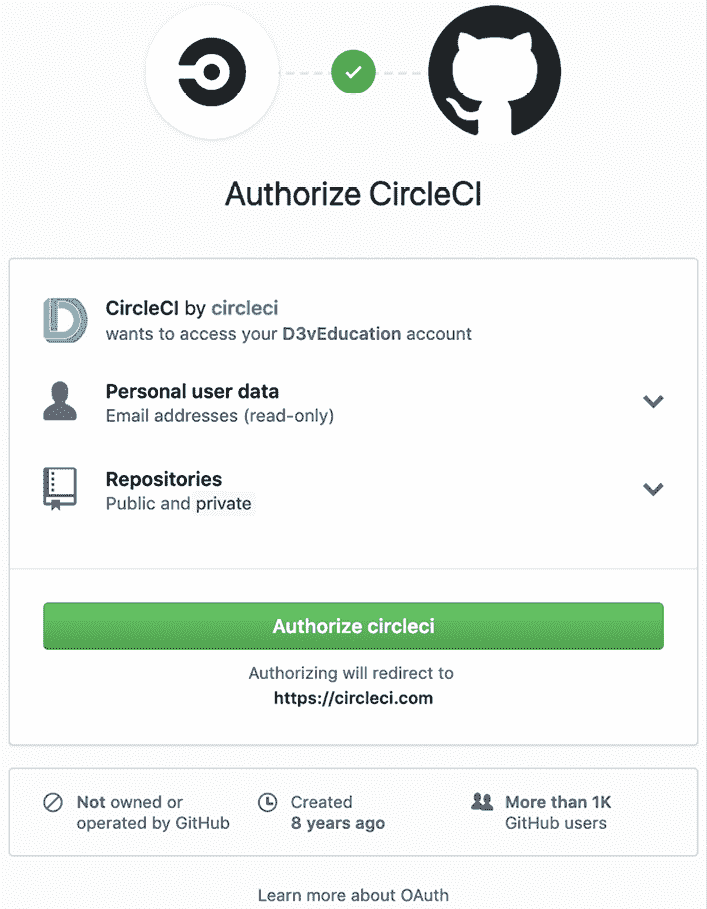

图 17.31：授权 CircleCI

在下一节中，我们将把我们的 SSH 密钥添加到 CircleCI。

## 在 CircleCI 中添加 SSH 密钥

现在，你已经创建了账户，CircleCI 需要一种方式来登录你的 DigitalOcean Droplet 以运行部署脚本。按照以下步骤完成此任务：

1.  在你的 Droplet 中使用以下命令创建一个新的 SSH 密钥：

    ```js
    ssh-keygen -t rsa
    # Then save the key as /root/.ssh/id_rsa_droplet with no password.
    # After go to .ssh directory
    cd /root/.ssh 
    ```

1.  然后，让我们将密钥添加到我们的 `authorized_keys`：

    ```js
    cat id_rsa_droplet.pub >> authorized_keys 
    ```

1.  现在，你需要下载私钥。为了验证你可以使用新密钥登录，你需要按照以下方式将其复制到你的本地机器：

    ```js
    # In your local machine do:
    scp root@YOUR_DROPLET_IP:/root/.ssh/id_rsa_droplet ~/.ssh/
    cd .ssh
    ssh-add id_rsa_droplet
    ssh -v root@YOUR_DROPLET_IP 
    ```

    如果你一切操作正确，你应该能够无密码登录你的 Droplet，这意味着 CircleCI 也可以访问我们的 Droplet。

1.  复制你的 `id_rsa_droplet.pub` 密钥的内容，然后转到你的仓库设置（[`app.circleci.com/settings/project/github/YOUR_GITHUB_USER/YOUR_REPOSITORY`](https://app.circleci.com/settings/project/github/YOUR_GITHUB_USER/YOUR_REPOSITORY)）：

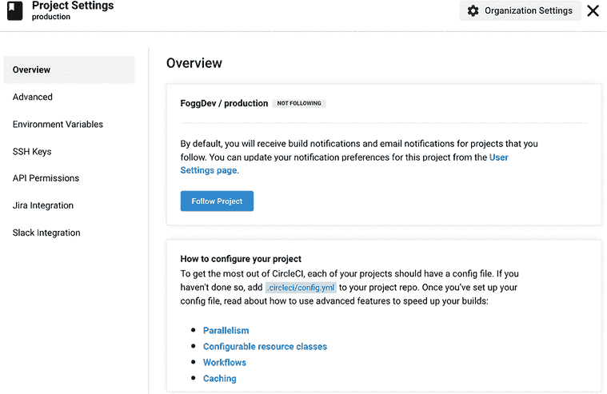

图 17.32：项目设置

1.  前往 **SSH 密钥**，如下所示：

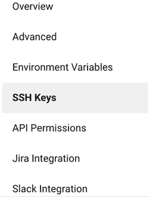

图 17.33：SSH 密钥

1.  你也可以访问 URL [`app.circleci.com/settings/project/github/YOUR_GITHUB_USER/YOUR_REPOSITORY/ssh`](https://app.circleci.com/settings/project/github/YOUR_GITHUB_USER/YOUR_REPOSITORY/ssh)，然后点击底部的 **添加 SSH 密钥** 按钮：

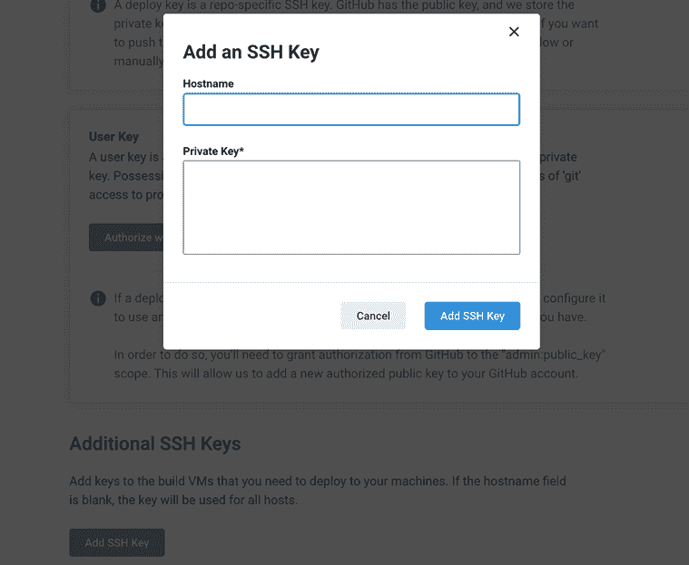

图 17.34：添加 SSH 密钥

1.  粘贴你的私钥，然后为 **主机名** 字段提供一个名称；我们将命名为 `DigitalOcean`。

现在，让我们在下一节中配置我们的 CircleCI 实例。

## 配置 CircleCI

现在，你已经为你的 Droplet 配置了 CircleCI 的访问权限，你需要向你的项目中添加一个 `config` 文件来指定部署过程中要执行的作业。

此过程在以下步骤中展示：

1.  为了这个，你需要创建 `.circleci` 目录并在 `config.yml` 文件中添加以下内容：

    ```js
    version: 2.1
    jobs:
    build:
    working_directory: ~/tmp
    docker:
      - image: cimg/node:14.16.1
    steps:
      - checkout
      - run: npm install
      - run: npm run lint
      - run: npm test
      - run: ssh -o StrictHostKeyChecking=no $DROPLET_USER@$DROPLET_IP 'cd production; git checkout master; git pull; npm install; npm run start:production;'
     workflows:
     build-deploy:
     jobs:
      - build:
     filters:
     branches:
     only: master 
    ```

1.  当你有一个 `.yml` 文件时，你需要注意缩进；它与 Python 类似，如果你没有正确使用缩进，你会得到一个错误。让我们看看这个文件是如何结构的。

1.  指定我们将使用的 CircleCI 版本。在这个例子中，你正在使用版本 `2.1`（撰写本书时的最新版本）：

    ```js
     version: 2.1 
    ```

1.  在 `jobs` 中，我们将指定需要配置容器；我们将使用 Docker 创建它，并概述部署过程的步骤。

1.  `working_directory` 将是我们将用于安装 npm 包和运行部署脚本的临时目录。在这种情况下，我决定使用 `tmp` 目录，如下所示：

    ```js
     jobs:
     build:
     working_directory: ~/tmp 
    ```

1.  如我之前所说，我们将创建一个 Docker 容器，在这个例子中，我选择了一个包含 `node: 18.12.1` 的现有镜像。如果你想了解所有可用的镜像，你可以访问 [`circleci.com/docs/2.0/circleci-images`](https://circleci.com/docs/2.0/circleci-images)：

    ```js
     docker:
     - image: cimg/node:18.12.1 
    ```

1.  对于代码案例，首先使用 `git checkout` 命令切换到 `master` 分支，然后在每个 `run` 语句中，你需要指定你想要运行的脚本：

    ```js
     steps:
     - checkout
     - run: npm install
     - run: npm run lint
     - run: npm test
     - run: ssh -o StrictHostKeyChecking=no $DROPLET_USER@$DROPLET_IP 'cd production; git checkout master; git pull; npm install; npm run start:production;' 
    ```

这里是对之前步骤的解释：

1.  首先，你需要使用 `npm install` 命令安装 npm 包，以便能够执行后续任务。

1.  使用 `npm run lint` 执行 ESLint 验证。如果失败，它将中断部署过程；否则，它将继续下一个运行。

1.  使用 `npm run test` 执行 Jest 验证；如果失败，它将中断部署过程。否则，它将继续下一个运行。

1.  在最后一步，我们连接到我们的 DigitalOcean Droplet，通过传递 `StrictHostKeyChecking=no` 标志来禁用严格的主机密钥检查。然后，我们使用 `$DROPLET_USER` 和 `$DROPLET_IP` `ENV` 变量来连接到它（我们将在下一步创建这些变量），最后，我们将使用单引号指定我们将在 Droplet 内执行的命令。

这些命令如下列出：

+   **cd production:** 授予对生产环境（或你的 Git 仓库名称）的访问权限。

+   **git checkout master:** 这将检出主分支。

+   **git pull:** 从我们的仓库拉取最新更改。

+   **npm run start:production:** 这是最后一步，它以生产模式运行我们的项目。

最后，让我们向我们的 CircleCI 添加一些环境变量。

## 在 CircleCI 中创建环境变量

正如你之前看到的，我们正在使用 **$DROPLET_USER** 和 **$DROPLET_IP** 变量，但我们如何定义这些变量呢？请按照以下步骤操作：

1.  你需要再次进入项目设置，并选择 **环境变量** 选项。然后，你需要创建 `DROPLET_USER` 变量：

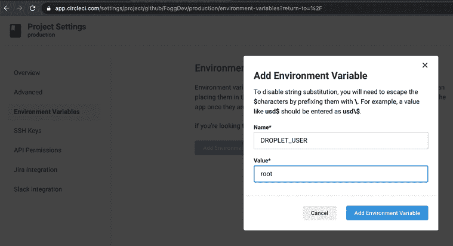

图 17.35：添加环境变量

1.  然后，你需要使用你的 Droplet IP 创建 **DROPLET_IP** 变量：

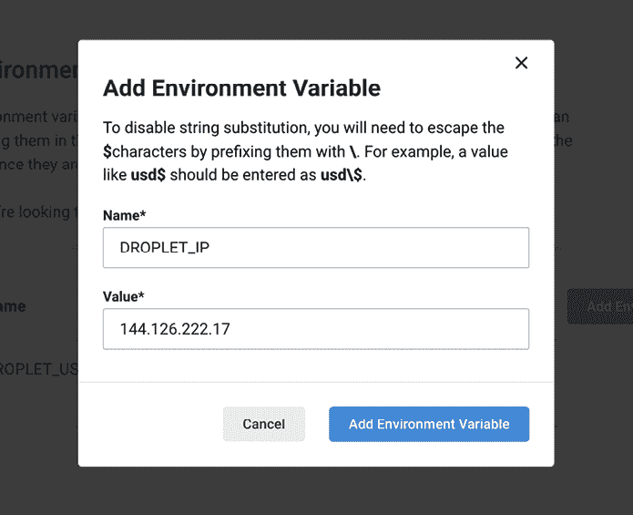

图 17.36：DROPLET_IP

1.  现在，你需要将配置文件推送到你的仓库，然后你就可以准备魔法时刻了。现在，由于 CircleCI 已经连接到你的仓库，每次你将更改推送到 master 分支时，它都会触发一个构建。

    通常，前两个或三个构建可能会因为语法错误、配置中的缩进错误，或者可能是因为我们有代码检查错误或单元测试错误而失败。如果你有失败，你会看到类似以下的内容：

    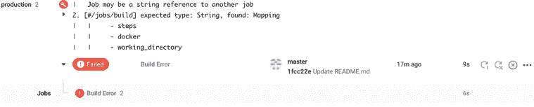

    图 17.37：构建错误

1.  如前一个屏幕截图所示，底部的第一个构建失败说**构建错误**，第二个在 WORKFLOW 下说`build-deploy`，如*图 17.38*所示。这基本上意味着在第一次构建中，我在`config.yml`文件中有语法错误。

1.  在你修复了`config.yml`文件中的所有语法错误以及所有与代码检查或单元测试相关的问题后，你应该会看到一个**成功**构建，如下所示：

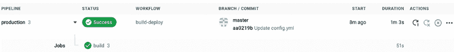

图 17.38：成功构建

1.  如果你点击构建号，你可以看到 CircleCI 在发布你 Droplet 中的新更改之前执行的所有步骤：

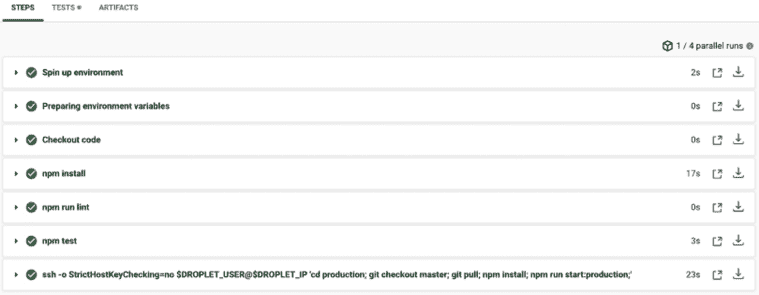

图 17.39：CircleCI 执行的步骤

1.  如你所见，步骤的顺序与我们指定的`config.yml`文件中的顺序相同；你甚至可以通过点击它来查看每个步骤的输出：

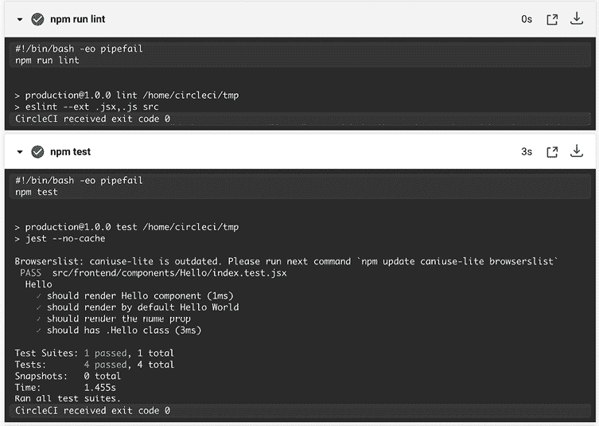

图 17.40：代码检查和测试步骤

1.  现在，假设你在你的代码检查验证或某些单元测试中遇到了错误。让我们看看在这种情况下会发生什么，如下所示：

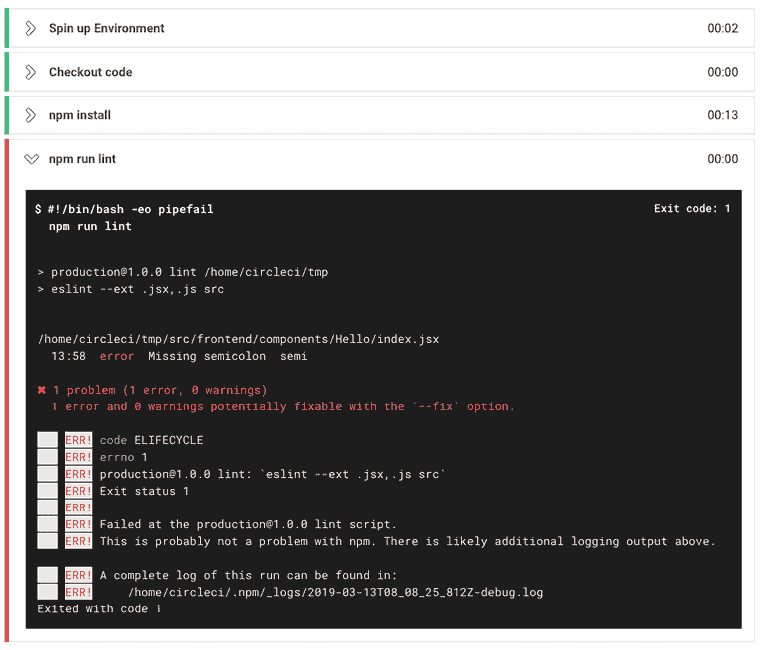

图 17.41：代码检查错误

如你所见，一旦检测到错误，它将以代码`1`退出。这意味着它将终止部署并将其标记为失败。请注意，在`npm run lint`之后的步骤都没有被执行。

另一件很酷的事情是，如果你现在去你的 GitHub 仓库检查你的提交，你会看到所有成功构建的提交和所有失败构建的提交：

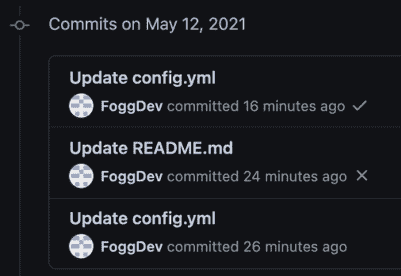

图 17.42：GitHub 成功构建

这真是太棒了：现在你的项目已经配置好了自动部署，并且它与你的 GitHub 仓库相连。

# 摘要

恭喜！我们已经完成了部署过程的旅程，你现在拥有了将你的 React 应用程序部署到世界（生产环境）所需的知识和技能。你还学会了如何实现 CircleCI 进行持续集成，简化你的开发流程，并确保你的应用程序保持高性能和可靠性。

通过利用本章中概述的策略和最佳实践，您可以自信地将您的应用程序推向全球受众，安心地知道它已经针对速度、可扩展性和弹性进行了优化。感谢您与我一同踏上这段旅程。我希望您喜欢阅读我的书籍。
