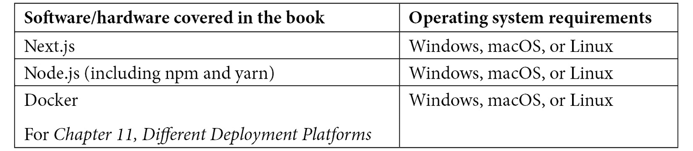

# 前言

Next.js 是一个用于现代 Web 开发的可扩展和高性能的 React.js 框架。它提供了一组丰富的功能，如混合渲染、路由预取、自动图像优化和国际化等。

Next.js 是一种令人兴奋的技术，可用于多种用途。如果你（或你的公司）想创建一个电子商务平台、博客或简单的网站，通过本书，你可以学习如何在性能、用户体验或开发者满意度上不做妥协。从 Next.js 的基础开始，你将了解框架如何帮助你实现目标，通过逐步解释构建实际应用，你将意识到 Next.js 的通用性。你将学习如何为你的网站选择合适的渲染方法，如何确保其安全，以及如何将其部署到不同的提供商。我们将始终关注性能和开发者满意度。

在本书结束时，你将能够使用任何无头 CMS 或数据源，使用 Next.js 设计、构建和部署美观且现代的架构。

# 本书面向对象

本书面向希望通过构建可扩展和可维护的全栈应用程序来提高其 React 技能的 Web 开发者——使用现代 Web 框架 Next.js。假设读者具备 ES6+、React、Node.js 和 REST 的中级知识。

# 本书涵盖内容

*第一章*, 《Next.js 简明介绍》，作为框架的入门指南，展示了如何设置新项目、自定义其配置，以及（如果需要）如何采用 TypeScript 作为 Next.js 开发的默认编程语言。

*第二章*, 《探索不同的渲染策略》，深入探讨了渲染方法，教授了服务器端渲染、静态站点生成、增量静态再生等之间的区别。

*第三章*, 《Next.js 基础和内置组件》，对 Next.js 的路由系统以及必要的内置组件进行了全面解释，重点关注搜索引擎优化和性能。

*第四章*, 《在 Next.js 中组织代码库和获取数据》，介绍了一些关于组织 Next.js 项目和在服务器端和客户端获取数据的实用技巧。

*第五章*, 《在 Next.js 中管理本地和全局状态》，通过 React Context 和 Redux 介绍状态管理，教你如何处理本地状态（组件级别）和全局状态（应用范围）。

*第六章*, *CSS 和内置样式方法*，介绍了 Next.js 中内置的基本样式方法，如 Styled JSX 和 CSS 模块。它还展示了如何为本地开发和生产构建启用 SASS 预处理器。

*第七章*, *使用 UI 框架*，通过介绍一些现代 UI 框架，如 TailwindCSS、Chakra UI 和 Headless UI，总结了关于样式的讨论。

*第八章*, *使用自定义服务器*，探讨了为什么我们可能（也可能不！）需要为我们的 Next.js 应用程序使用自定义服务器。它还展示了如何将 Next.js 与 Express.js 和 Fastify（两种最流行的 Node.js 网络框架）集成。

*第九章*, *测试 Next.js*，通过采用 Cypress 和 react-testing-library，介绍了单元测试和端到端测试的最佳实践。

*第十章*, *使用 SEO 和管理性能*，通过介绍一些有用的技巧和窍门，深入探讨了如何提升任何 Next.js 应用程序的 SEO 和性能。

*第十一章*, *不同的部署平台*，展示了如何根据其功能和许多其他方面选择合适的平台来托管 Next.js 应用程序。

*第十二章*, *管理身份验证和用户会话*，描述了如何通过选择合适的身份验证提供商来安全地管理用户身份验证。它还展示了如何将 Auth0（一个流行的身份管理平台）与任何 Next.js 应用程序集成。

*第十三章*, *使用 Next.js 和 GraphCMS 构建电子商务网站*，深入探讨了如何使用 Next.js、Chakra UI 和 GraphCMS 创建一个真实的 Next.js 电子商务平台。

*第十四章*, *示例项目和进一步学习的下一步行动*，通过提供一些有关如何继续学习框架的宝贵建议，以及一些示例项目来实现，来结束本书，以增强对 Next.js 的信心。

# 要充分利用这本书

要充分利用这本书，您可以按照以下章节中显示的所有代码示例进行编写。如果您遇到错误，您可以从本书的 GitHub 仓库下载所有可工作的代码示例。



**如果您正在使用本书的数字版，我们建议您亲自输入代码或从本书的 GitHub 仓库（下一节中提供链接）获取代码。这样做将有助于避免与代码复制和粘贴相关的任何潜在错误。**

# 下载示例代码文件

您可以从 GitHub 下载本书的示例代码文件 [`github.com/PacktPublishing/Real-World-Next.js`](https://github.com/PacktPublishing/Real-World-Next.js)。如果代码有更新，它将在 GitHub 仓库中更新。

我们还提供其他来自我们丰富图书和视频目录的代码包，可在 [`github.com/PacktPublishing/`](https://github.com/PacktPublishing/) 找到。查看它们吧！

# 下载彩色图片

我们还提供了一份包含本书中使用的截图和图表的彩色图片 PDF 文件。您可以从这里下载：[`static.packt-cdn.com/downloads/9781801073493_ColorImages.pdf`](https://static.packt-cdn.com/downloads/9781801073493_ColorImages.pdf)。

[`static.packt-cdn.com/downloads/9781801073493_ColorImages.pdf`](https://static.packt-cdn.com/downloads/9781801073493_ColorImages.pdf)。

# 使用的约定

本书使用了多种文本约定。

`文本中的代码`：表示文本中的代码单词、数据库表名、文件夹名、文件名、文件扩展名、路径名、虚拟 URL、用户输入和 Twitter 昵称。以下是一个示例：“我们将使用 Next.js 的内置`getServerSideProps`函数动态从 URL 中获取`[name]`变量，并向用户打招呼。”

代码块设置如下：

```js
export async function getServerSideProps({ params }) {  const { name } = params;  return {    props: {      name     }  } }function Greet(props) {  return (    <h1> Hello, {props.name}! </h1>  )}export default Greet;
```

当我们希望您注意代码块中的特定部分时，相关的行或项目将以粗体显示：

```js
<Link href='/blog/2021-01-01/happy-new-year'>  Read post </Link><Link href='/blog/2021-03-05/match-update'>  Read post </Link><Link href='/blog/2021-04-23/i-love-nextjs'>  Read post </Link>
```

任何命令行输入或输出都按以下方式编写：

```js
echo "Hello, world!" >> ./public/index.txt
```

**粗体**：表示新术语、重要单词或您在屏幕上看到的单词。例如，菜单或对话框中的单词以**粗体**显示。以下是一个示例：“实际上，如果我们打开 Google Chrome 开发者工具并转到**网络**，我们可以选择上述端点的 HTTP 请求，并在**请求头**部分看到授权令牌。”

小贴士或重要注意事项

看起来像这样。

# 联系我们

我们读者的反馈总是受欢迎的。

**一般反馈**：如果您对本书的任何方面有疑问，请通过电子邮件发送至 customercare@packtpub.com，并在邮件主题中提及书名。

**勘误表**：尽管我们已经尽一切努力确保内容的准确性，但错误仍然可能发生。如果您在本书中发现错误，我们将不胜感激，如果您能向我们报告，我们将不胜感激。请访问 [www.packtpub.com/support/errata](http://www.packtpub.com/support/errata) 并填写表格。

**盗版**：如果您在互联网上以任何形式遇到我们作品的非法副本，我们将不胜感激，如果您能提供位置地址或网站名称，我们将不胜感激。请通过电子邮件发送至 copyright@packt.com 并附上材料的链接。

**如果您有兴趣成为作者**：如果您在某个领域有专业知识，并且您有兴趣撰写或为书籍做出贡献，请访问 [authors.packtpub.com](http://authors.packtpub.com)。

# 分享您的想法

一旦您阅读了《*真实世界 Next.js*》，我们非常期待听到您的想法！请点击此处直接进入此书的亚马逊评论页面并分享您的反馈。

您的评论对我们和科技社区都至关重要，并将帮助我们确保我们提供高质量的内容。
