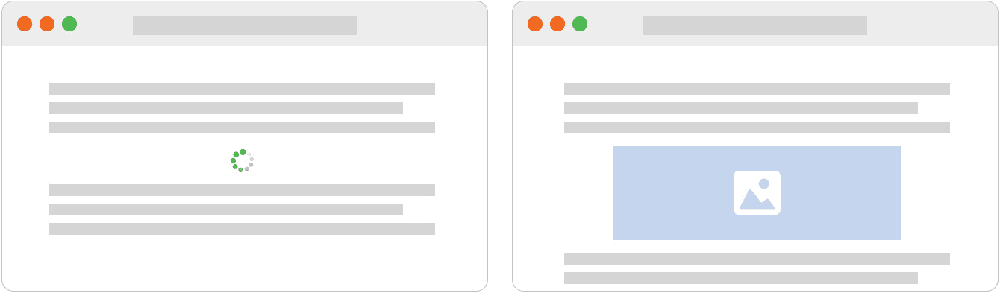
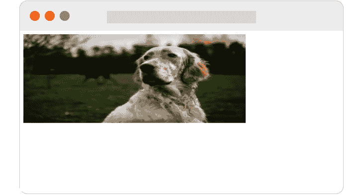
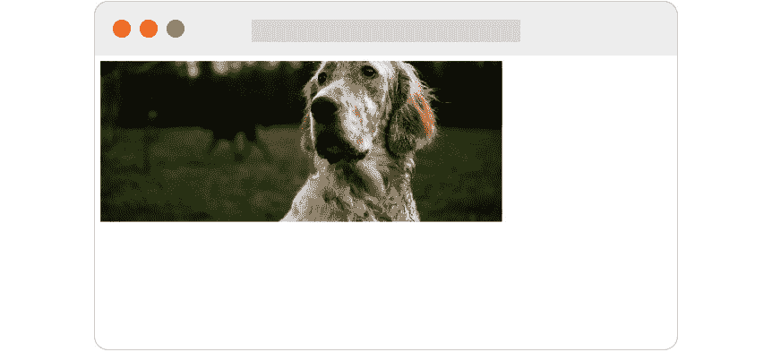

# *第三章*：Next.js 基础和内置组件

Next.js 不仅关于服务器端渲染。它提供了一些非常实用的内置组件和函数，我们可以使用它们来创建性能良好、动态和现代的网站。

在本章中，我们将探讨 Next.js 核心的一些概念，例如路由系统、客户端导航、服务优化图像、处理元数据等。一旦我们开始使用这个框架构建一些实际的应用程序，这些概念将非常有用。

我们还将更深入地研究`_app.js`和`_document.js`页面，这将使我们能够以多种方式自定义我们的 Web 应用行为。

在本章中，我们将涵盖以下主题：

+   路由系统如何在客户端和服务器端工作

+   如何优化页面间的导航

+   Next.js 如何服务静态资源

+   如何通过自动图像优化和新的`Image`组件优化图像服务

+   如何动态处理来自任何组件的 HTML 元数据

+   `_app.js`和`_document.js`文件是什么，以及如何自定义它们？

# 技术要求

要运行本章中的代码示例，您需要在您的本地机器上安装 Node.js 和 npm。

如果您喜欢，可以使用在线 IDE，例如[`repl.it`](https://repl.it)或[`codesandbox.io`](https://codesandbox.io)；它们都支持 Next.js，您不需要在您的电脑上安装任何依赖。

您可以在 GitHub 仓库中找到本章的代码：[`github.com/PacktPublishing/Real-World-Next.js`](https://github.com/PacktPublishing/Real-World-Next.js)。

# 路由系统

如果您来自客户端 React，您可能熟悉像*React Router*、*Reach Router*或*Wouter*这样的库。它们允许您仅创建客户端路由，这意味着所有页面都将创建并在客户端渲染；不涉及服务器端渲染。

Next.js 采用不同的方法：基于文件系统的页面和路由。如第二章中所述，*探索不同的渲染策略*，一个默认的 Next.js 项目包含一个`pages/`目录。该文件夹内的每个文件都代表您应用程序的一个新页面/路由。

因此，当我们谈论一个页面时，我们指的是从`pages/`文件夹内的`.js`、`.jsx`、`.ts`或`.tsx`文件中导出的 React 组件。

为了让事情更清晰，让我们假设我们只想创建一个包含两个页面的简单网站；第一个将是主页，而第二个将是一个简单的联系页面。为此，我们只需要在我们的`pages/`文件夹内创建两个新文件：`index.js`和`contacts.js`。这两个文件都需要导出一个返回一些 JSX 内容的函数；它将在服务器端渲染并发送到浏览器作为标准 HTML。

正如我们刚才看到的，一个页面必须返回有效的 JSX 代码，所以让我们创建一个非常简单和简洁的`index.js`页面：

```js
function Homepage() {
  return (
    <div> This is the homepage </div>
  )
};
export default Homepage;
```

如果我们在终端中运行`yarn dev`或`npm run dev`，然后在我们的浏览器中转到[`localhost:3000`](http://localhost:3000)，我们将在屏幕上只看到**这是主页**的消息。我们刚刚制作了我们的第一个页面！

我们也可以用我们的联系页面做同样的事情：

```js
function ContactPage() {
  return (
    <div>
      <ul>
        <li> Email: myemail@example.com</li>
        <li> Twitter: @myusername </li>
        <li> Instagram: myusername </li>
      </ul>
    </div>
  )
};
export default ContactPage;
```

由于我们已将我们的联系页面命名为`contacts.js`，我们可以导航到 http://localhost:3000/contacts 并在浏览器上看到显示的联系人列表。如果我们想要将该页面移动到 http://localhost:3000/contact-us，我们只需将我们的`contacts.js`文件重命名为`contact-us.js`，Next.js 将自动使用新的路由名称为我们重建页面。

现在，让我们尝试使事情变得稍微复杂一些。我们正在构建一个博客，因此我们想要为每篇文章创建一个路由。我们还想要创建一个`/posts`页面，该页面将显示网站上所有的文章。

要做到这一点，我们将使用以下动态路由：

```js
pages/
  - index.js
  - contact-us.js
  - posts/
      - index.js
      - [slug].js
```

我们还没有提到，我们可以使用`pages/`目录内的文件夹创建嵌套路由。如果我们想要创建一个`/posts`路由，我们可以在`pages/posts/`文件夹内创建一个新的`index.js`文件，导出一个包含一些 JSX 代码的函数，并访问 http://localhost:3000/posts。

然后，我们想要为每篇博客文章创建一个动态路由，这样我们就不必每次想要在网站上发布文章时手动创建一个新页面。要做到这一点，我们可以在`pages/posts/`文件夹内创建一个新文件，`pages/posts/[slug].js`，其中`[slug]`标识一个可以包含任何值的路由变量，这取决于用户在浏览器地址栏中输入的内容。在这种情况下，我们正在创建一个包含名为`slug`的变量的路由，该变量可以针对每篇博客文章而变化。我们可以从这个文件中导出一个简单的函数，返回一些 JSX 代码，然后浏览到 http://localhost:3000/posts/my-firstpost、http://localhost:3000/posts/foo-bar-baz 或任何其他 http://localhost:3000/posts/*路由。无论你浏览到哪个路由，它都会始终渲染相同的 JSX 代码。

我们还可以在`pages/`文件夹内嵌套多个动态路由；假设我们想要我们的文章页面结构如下：`/posts/[date]/[slug]`。我们只需在我们的`pages/`目录内添加一个新的名为`[date]`的文件夹，并将`slug.js`文件移入其中：

```js
pages/
  - index.js
  - contact-us.js
  - posts/
      - index.js
      - [date]/
          - [slug].js
```

我们现在可以访问[`localhost:3000/posts/2021-01-01/my-first-post`](http://localhost:3000/posts/2021-01-01/my-first-post)并查看我们之前创建的 JSX 内容。再次强调，`[date]`和`[slug]`变量可以代表任何你想要的内容，所以请随意通过在浏览器中调用不同的路由进行实验。

到目前为止，我们一直使用路由变量来渲染相同的页面，但这些变量主要用于创建高度动态的页面，其内容根据我们使用的路由变量而有所不同。让我们在下一节中看看如何根据变量渲染不同的内容。

## 在我们的页面中使用路由变量

路由变量对于创建非常动态的页面内容非常有用。

让我们用一个简单的例子来说明：一个问候页面。在上一节中使用的项目中，让我们创建以下文件：`pages/greet/[name].js`。我们将使用 Next.js 内置的 `getServerSideProps` 函数动态地从 URL 获取 `[name]` 变量并向用户问候：

```js
export async function getServerSideProps({ params }) {
  const { name } = params;
  return {
    props: {
      name
    }
  } 
}
function Greet(props) {
  return (
    <h1> Hello, {props.name}! </h1>
  )
}
export default Greet;
```

现在，打开您最喜欢的浏览器并转到 http://localhost:3000/greet/Mitch；您应该看到一个 "`name` 变量，所以请随意尝试一些不同的名字！

重要提示

当同时使用 `getServerSideProps` 和 `getStaticProps` 函数时，请记住它们 *必须* 返回一个对象。另外，如果你想从这两个函数之一传递任何属性到你的页面，确保在返回对象的 `props` 属性中传递它们。

能够从 URL 获取数据对于许多原因来说都是基本的。在之前的代码示例中，我们创建了一个简单的问候页面，但我们可以使用 `[name]` 变量用于其他目的，例如从数据库获取用户数据以显示他们的个人资料。我们将在 *第四章* 中更详细地了解数据获取，*Next.js 中的代码库组织和数据获取*。

有时候你需要从你的组件而不是你的页面中获取路由变量。Next.js 通过我们将在下一节中看到的 React 钩子使这一切变得轻松。

## 在组件中使用路由变量

在上一节中，我们学习了如何在页面中使用路由变量。Next.js 不允许我们在页面之外使用 `getServerSideProps` 和 `getStaticProps` 函数，那么我们如何在其他组件中使用它们呢？

Next.js 通过 `useRouter` 钩子使这一切变得轻松；我们可以从 `next/router` 文件中导入它：

```js
import { useRouter } from 'next/router';
```

它的工作方式就像任何其他 React 钩子（一个让你在函数组件中与 React 状态和生命周期交互的函数）一样，我们可以在任何组件中实例化它。让我们按照以下方式重构之前的问候页面：

```js
import { useRouter } from 'next/router';
function Greet() {
  const { query } = useRouter();
  return <h1>Hello {query.name}!</h1>;
}
export default Greet;
```

如您所见，我们正在从 `useRouter` 钩子中提取 `query` 参数。它包含我们的路由变量（在这个例子中，它只包含 `name` 变量）和解析后的查询字符串参数。

我们可以通过尝试将任何查询参数附加到我们的 URL 并在组件中记录 `query` 变量来观察 Next.js 如何通过 `useRouter` 钩子传递路由变量和查询字符串：

```js
import { useRouter } from 'next/router';
function Greet() {
  const { query } = useRouter();
  console.log(query);
  return <h1>Hello {query.name}!</h1>;
}
export default Greet;
```

如果我们现在尝试调用以下 URL，http://localhost:3000/greet/Mitch?learning_nextjs=true，我们将在我们的终端中看到以下对象：

```js
{learning_nextjs: "true", name: "Mitch"}
```

重要提示

如果您尝试附加与您的路由变量具有相同键的查询参数，Next.js 不会抛出任何错误。您可以通过调用以下 URL 来轻松尝试：http://localhost:3000/greet/Mitch?name=Christine。您将注意到 Next.js 将优先考虑您的路由变量，因此您将在页面上看到 **Hello, Mitch!** 的显示。

## 客户端导航

如我们所见，Next.js 不仅关乎在服务器上渲染 React。它提供了多种方式来优化您网站的性能，其中之一就是它处理客户端导航的方式。

实际上，它支持 HTML 标准 `<a>` 标签用于链接页面，但它还提供了一种更优化的方式在各个路由之间导航：`Link` 组件。

我们可以将其作为标准 React 组件导入，并用于链接我们网站的不同页面或部分。让我们看看一个简单的例子：

```js
import Link from 'next/link';
function Navbar() {
  return (
    <div>
      <Link href='/about'>Home</Link>
      <Link href='/about'>About</Link>
      <Link href='/about'>Contacts</Link>
    </div>
  );
}
export default Navbar;
```

默认情况下，Next.js 会预加载视口中找到的每一个 `Link`，这意味着一旦我们点击其中一个链接，浏览器就已经拥有了渲染页面所需的所有数据。

您可以通过将 `preload={false}` 属性传递给 `Link` 组件来禁用此功能：

```js
import Link from 'next/link';
function Navbar() {
  return (
    <div>
      <Link href='/about' preload={false}>Home</Link>
      <Link href='/about' preload={false}>About</Link>
      <Link href='/about' preload={false}>Contacts</Link> 
    </div>
  );
}
export default Navbar;
```

从 Next.js 10 版本开始，我们也可以轻松地使用动态路由变量链接页面。

假设我们想要链接以下页面：`/blog/[date]/[slug].js`。在使用 Next.js 的早期版本时，我们需要添加两个不同的属性：

```js
<Link href='/blog/[date]/[slug]'   as='/blog/2021-01-01/happy-new-year'>
  Read post
</Link>
```

`href` 属性告诉 Next.js 我们想要渲染哪个页面，而 `as` 属性将告诉我们在浏览器地址栏中如何显示它。

多亏了 Next.js 10 中引入的增强功能，我们不再需要使用 `as` 属性，因为 `href` 属性足以设置我们想要渲染的页面以及浏览器地址栏中显示的 URL。例如，我们现在可以这样编写我们的链接：

```js
<Link href='/blog/2021-01-01/happy-new-year'> Read post </Link>
<Link href='/blog/2021-03-05/match-update'> Read post </Link>
<Link href='/blog/2021-04-23/i-love-nextjs'> Read post </Link>
```

重要提示

虽然使用 `Link` 组件链接动态页面的传统方法在 Next.js >10 中仍然有效，但框架的最新版本使它变得更加简单。如果您有使用先前 Next.js 版本的经验，或者您愿意升级到版本 >10，请记住这个新功能，因为它将简化组件的开发，包括动态链接。

如果我们正在构建复杂的 URL，我们也可以将一个对象传递给 `href` 属性：

```js
<Link
  href={{
    pathname: '/blog/[date]/[slug]'
    query: {
      date: '2020-01-01',
      slug: 'happy-new-year',
      foo: 'bar'
    }
  }}
/>
  Read post
</Link>
```

一旦用户点击该链接，Next.js 将将浏览器重定向到以下 URL：http://localhost:3000/blog/2020-01-01/happy-new-year?foo=bar。

### 使用 router.push 方法

在 Next.js 网站页面之间移动的另一种方法是使用 `useRouter` 钩子。

假设我们只想让登录用户访问特定页面，并且我们已经有一个 `useAuth` 钩子来实现这一点。我们可以使用 `useRouter` 钩子动态地将用户重定向，如果在这种情况下他们未登录：

```js
import { useEffect } from 'react';
import { useRouter } from 'next/router';
import PrivateComponent from '../components/Private';
import useAuth from '../hooks/auth';
function MyPage() {
  const router = useRouter();
  const { loggedIn } = useAuth();
  useEffect(() => {
    if (!loggedIn) {
      router.push('/login')
    }
  }, [loggedIn]);
  return loggedIn
    ? <PrivateComponent />
    : null;
}
export default MyPage;
```

如您所见，我们使用`useEffect`钩子在客户端仅运行代码。在这种情况下，如果用户未登录，我们使用`router.push`方法将他们重定向到登录页面。

就像`Link`组件一样，我们可以通过传递一个对象到`push`方法来创建更复杂的页面路由：

```js
router.push({
  pathname: '/blog/[date]/[slug]',
  query: {
    date: '2021-01-01',
    slug: 'happy-new-year',
    foo: 'bar'
  }
});
```

一旦调用`router.push`函数，浏览器将被重定向到 http://localhost:3000/blog/2020-01-01/happy-new-year?foo=bar。

重要提示

Next.js 无法像使用`Link`组件那样预取所有链接的页面。

当需要在某些动作发生后在客户端重定向用户时，使用`router.push`方法很方便，但不建议将其用作处理客户端导航的默认方式。

到目前为止，我们已经看到了 Next.js 如何处理静态和动态路由的导航，以及如何在客户端和服务器端程序化地强制重定向和导航。

在下一节中，我们将探讨 Next.js 如何帮助我们提供静态资源并即时优化图片以提高性能和 SEO 评分。

# 提供静态资源

使用术语**静态资源**，我们指的是所有那些非动态文件，例如图片、字体、图标、编译后的 CSS 和 JS 文件。

提供这些资源的最简单方法是通过 Next.js 提供的默认`/public`文件夹。实际上，这个文件夹中的每个文件都将被视为静态资源。我们可以通过创建一个名为`index.txt`的新文件并将其放入`/public`文件夹来证明这一点：

```js
echo "Hello, world!" >> ./public/index.txt
```

如果我们现在尝试启动服务器，当我们访问[`localhost:3000/index.txt`](http://localhost:3000/index.txt)时，我们将在浏览器中看到文本**Hello, world!**显示。

在*第四章* *Next.js 中的代码库组织和数据获取*中，我们将更详细地探讨组织公共文件夹以提供常见的 CSS 和 JS 文件、图片、图标以及其他类型的静态文件。

提供静态资源相对简单。然而，特定类型的文件可能会严重影响您的网站性能（以及 SEO）：图片文件。

大多数情况下，提供未优化的图片会降低用户体验，因为它们可能需要一些时间来加载，一旦加载，它们会在渲染后移动布局的一部分，这可能会在用户体验方面引起许多问题。当这种情况发生时，我们谈论的是**累积布局偏移（CLS）**。以下是如何工作的简单表示：



图 3.1 – CLS 工作表示

在第一个浏览器标签中，图片尚未加载，因此两个文本区域看起来非常接近。图片加载后，它会将第二个文本区域向下移动。如果用户正在阅读第二个文本区域，他们很容易错过标记。

重要提示

如果你想了解更多关于 CLS 的信息，我推荐以下文章：[`web.dev/cls`](https://web.dev/cls)。

当然，Next.js 通过一个新的内置`Image`组件使得避免 CLS 变得简单。我们将在下一节中探讨这一点。

## Next.js 的自动图片优化

从 Next.js 10 版本开始，该框架引入了一个新的有用`Image`组件和自动图片优化功能。

在 Next.js 引入这两个新功能之前，我们必须使用外部工具对每个图片进行优化，然后为每个 HTML ``标签编写复杂的`srcset`属性，以设置不同屏幕尺寸的响应式图片。

事实上，自动图片优化将负责使用现代格式（如**WebP**）为所有支持这些格式的浏览器提供服务。但如果有浏览器不支持，它也能回退到较旧的图片格式，如*png*或*jpg*。它还会调整图片大小，以避免向客户端发送重量级的图片，因为这会负面影响资产的下载速度。

一个值得记住的伟大之处在于，自动图片优化是按需工作的，因为它仅在浏览器请求图片时才进行优化、调整大小和渲染。这很重要，因为它将与任何外部数据源（任何 CMS 或图片服务，如 Unsplash 或 Pexels）一起工作，并且不会减慢构建阶段。

我们可以在几分钟内在本地机器上尝试这个功能，亲自看看它是如何工作的。假设我们想要提供以下图片：


图 3.2 – 由Łukasz Rawa 在 Unsplash 上的图片 ([`unsplash.com/@lukasz_rawa`](https://unsplash.com/@lukasz_rawa))

使用标准的 HTML 标签，我们可以这样做：

```js

```

然而，我们也可能想要使用`srcset`属性来为响应式图片，因此我们实际上需要为不同的屏幕分辨率优化图片，这涉及到为我们的资产提供服务的一些额外步骤。

Next.js 通过仅配置`next.config.js`文件和使用`Image`组件，使得这个过程变得非常简单。我们之前提到过，我们想要提供来自 Unsplash 的图片，所以让我们将这个服务主机名添加到我们的`next.config.js`文件中的`images`属性下：

```js
module.exports = {
  images: {
    domains: ['images.unsplash.com']
  }
};
```

这样，每次我们在`Image`组件中使用来自该主机名的图片时，Next.js 都会自动为我们优化它。

现在，让我们尝试在页面中导入这张图片：

```js
import Image from 'next/image';
function IndexPage() {
  return (
    <div>
      <Image
        src='https://images.unsplash.com/photo-
         1605460375648-278bcbd579a6'
        width={500}
        height={200}
        alt='A beautiful English Setter'
      />
    </div>
  );
}
export default IndexPage;
```

打开浏览器，你会注意到图片被拉伸以适应你在`Image`组件中指定的`width`和`height`属性。



图 3.3 – 我们刚刚创建的图片组件的表示

我们可以使用可选的 `layout` 属性裁剪图像以适应所需的尺寸。它接受四个不同的值：`fixed`、`intrinsic`、`responsive` 和 `fill`。让我们更详细地看看这些：

+   `fixed` 与 `img` HTML 标签的工作方式相同。如果我们更改视口大小，它将保持相同的大小，这意味着它不会为较小（或较大）的屏幕提供响应式图像。

+   `响应式`与`固定`相反；当我们调整视口大小时，它会为我们的屏幕尺寸提供不同优化的图片。

+   `固有`介于 `固定` 和 `响应式` 之间；当我们调整视口大小时，它会提供不同的图像大小，但在大屏幕上会保留最大的图像不变。

+   `fill` 会根据其父元素的宽度和高度拉伸图像；然而，我们不能同时使用 `fill` 和 `width`、`height` 属性。您可以使用 `fill` 或 `width` 和 `height`）。

现在，如果我们想将我们的英语设定器图像固定显示在我们的屏幕上，我们可以按照以下方式重构我们的 `Image` 组件：

```js
import Image from 'next/image';
function IndexPage() {
  return (
    <div>
      <div
        style={{ width: 500, height: 200, position: 
         'relative' }}
      >
        <Image
          src='https://images.unsplash.com/photo-
           1605460375648-278bcbd579a6'
          layout='fill'
          objectFit='cover'
          alt='A beautiful English Setter'
        />
      </div>
    </div>
  );
}
export default IndexPage;
```

如您所见，我们用固定大小的 `div` 和设置为 `relative` 的 CSS `position` 属性包裹了 `Image` 组件。我们还从我们的 `Image` 组件中移除了 `width` 和 `height` 属性，因为它们会根据其父 `div` 的大小进行拉伸。

我们还添加了设置为 `cover` 的 `objectFit` 属性，以便根据其父 `div` 的大小裁剪图像，这就是最终的结果。



图 3.4 – 使用布局属性设置为 "fill" 的图像组件表示

如果我们现在尝试在浏览器中检查生成的 HTML，我们将看到 `Image` 组件生成了许多不同的图像大小，这些大小将通过标准 `img` HTML 标签的 `srcset` 属性提供：

```js
<div style="..."

```

最后值得一提的是，如果我们使用 Google Chrome 或 Firefox 检查图像格式，我们会看到它已经被作为 `WebP` 提供服务，即使从 Unsplash 提供的原始图像是 `jpeg`。如果我们现在尝试使用 iOS 上的 Safari 渲染相同的页面，Next.js 将提供原始的 `jpeg` 格式，因为（在撰写本文时）该 iOS 浏览器尚未支持 `WebP` 格式。

如本节开头所述，Next.js 会根据需要自动进行图像优化，这意味着如果某个图像从未被请求，它将不会被优化。

整个优化阶段都在 Next.js 运行的服务器上完成。如果您正在运行包含大量图像的 Web 应用程序，它可能会影响您的服务器性能。在下一节中，我们将看到如何将优化阶段委托给外部服务。

## 在外部服务上运行自动图像优化

默认情况下，自动图像优化是在与 Next.js 相同的服务器上运行的。当然，如果你在一个资源较少的小型服务器上运行你的网站，这可能会影响其性能。因此，Next.js 允许你通过在 `next.config.js` 文件中设置 `loader` 选项来在外部服务上运行自动图像优化：

```js
module.exports = {
  images: {
    loader: 'akamai',
    domains: ['images.unsplash.com']
  }
};
```

如果你将你的网络应用程序部署到 Vercel，你实际上不需要在 `next.config.js` 文件中设置任何加载器，因为 Vercel 会为你优化和提供图像文件。否则，你可以使用以下外部服务：

+   Akamai: [`www.akamai.com`](https://www.akamai.com)

+   Imgix: [`www.imgix.com`](https://www.imgix.com)

+   Cloudinary: [`cloudinary.com`](https://cloudinary.com)

如果你不想使用这些服务中的任何一个，或者你想使用你自己的自定义图像优化服务器，你可以在组件内部直接使用 `loader` 属性：

```js
import Image from 'next/image'
const loader = ({src, width, quality}) => {
  return `https://example.com/${src}?w=${width}&q=${quality 
   || 75}`
}
function CustomImage() {
  return (
    <Image
      loader={loader}
      src="img/myimage.png"
      alt="My image alt text"
      width={350}
      height={540}
    />
  )
}
```

这样，你将能够提供来自任何外部服务的图像，这让你能够利用自定义图像优化服务器或免费、开源项目，如 *Imgproxy* ([`github.com/imgproxy/imgproxy`](https://github.com/imgproxy/imgproxy)) 或 *Thumbor* (https://github.com/thumbor/thumbor)。

重要提示

当你使用自定义加载器时，请记住，每个服务都有自己的 API 用于调整图像大小和提供图像。例如，要从 *Imgproxy* 提供图像，你需要使用以下 URL 调用它：https://imgproxy.example.com/<auth-key>/fill/500/500/sm/0/plain/https://example.com/images/myImage.jpg。对于 *Thumbor*，你需要使用不同的 URL 架构：[`thumbor.example.com/500x500/smart/example.com/images/myImage.jpg`](https://thumbor.example.com/500x500/smart/example.com/images/myImage.jpg)。

在创建自定义加载器之前，请阅读你的图像优化服务器的文档。

在过去几年中，正确提供图像的过程变得越来越复杂，但花些时间微调这个过程是值得的，因为它可以从许多关键方面影响我们的用户体验。幸运的是，Next.js 通过其内置组件和优化使这个过程变得相当简单。

然而，当我们构建网络应用程序时，我们也应该考虑网络爬虫、机器人和网络蜘蛛！我指的是那些将查看我们网页的元数据以执行索引、链接和评估等操作的网络技术。我们将在下一节中看到如何处理元数据。

# 处理元数据

正确处理元数据是现代网络开发的关键部分。为了简化，让我们考虑一下我们在 Facebook 或 Twitter 上分享链接的情况。如果我们把 React 网站 ([`reactjs.org`](https://reactjs.org)) 分享到 Facebook，我们将在我们的帖子中看到以下卡片：


图 3.5 – https://reactjs.org 的 Open Graph 数据

)

为了知道应该显示在卡片内的哪些数据，Facebook 使用了一个名为 **Open Graph** 的协议（[`ogp.me`](https://ogp.me)）。为了将此信息提供给任何社交网络或网站，我们需要在我们的页面上添加一些元数据。

到目前为止，我们还没有讨论过如何动态设置开放图数据、HTML 标题或 HTML 元数据。虽然一个网站在技术上可以不使用这些数据而工作，但搜索引擎会惩罚你的页面，因为它们会错过重要信息。用户体验也可能受到负面影响，因为这些元标签会帮助浏览器为我们的用户创建优化的体验。

再次强调，Next.js 提供了一种解决这些问题的绝佳方法：内置的 `Head` 组件。确实，这个组件允许我们从任何组件更新我们 HTML 页面的 `<head>` 部分，这意味着我们可以根据用户的导航动态更改、添加或删除任何元数据、链接或脚本。

我们可以从我们元数据中最常见的动态部分开始：HTML `<title>` 标签。让我们设置一个新的 Next.js 项目，然后创建两个新的页面。

我们将创建的第一个页面是 `index.js`：

```js
import Head from 'next/head';
import Link from 'next/link';
function IndexPage() {
  return (
    <>
      <Head>
        <title> Welcome to my Next.js website </title>
      </Head>
      <div>
        <Link href='/about' passHref>
          <a>About us</a>
        </Link>
      </div>
   </>
  );
}
export default IndexPage;
```

第二个页面是 `about.js`：

```js
import Head from 'next/head';
import Link from 'next/link';
function AboutPage() {
  return (
    <>
      <Head>
        <title> About this website </title>
      </Head>
      <div>
        <Link href='/'passHref>
          <a>Back to home</a>
        </Link>
      </div>
    </>
  );
}
export default AboutPage;
```

运行服务器后，您可以在这两个页面之间导航，并看到 `<title>` 内容会根据您访问的路由而变化。

现在，让我们使事情变得稍微复杂一些。我们想要创建一个新的组件，它只显示一个按钮。一旦我们点击它，我们当前所在的页面标题将改变；我们可以通过再次点击按钮来始终恢复到原始标题。

让我们在项目根目录中创建一个新的文件夹 `components/`，并在其中创建一个新的文件 `components/Widget.js`：

```js
import { useState } from 'react;
import Head from 'next/head';
function Widget({pageName}) {
  const [active, setActive] = useState(false);
  if (active) {
    return (
      <>
        <Head>
          <title> You're browsing the {pageName} page 
          </title>
        </Head>
        <div>
          <button onClick={() =>setActive(false)}>
            Restore original title
          </button>
          Take a look at the title!
        </div>
      </>
    );
  }
  return (
    <>
      <button onClick={() =>setActive(true)}>
        Change page title
      </button>
    </>
  );
}
export default Widget;
```

太好了！现在让我们编辑我们的 `index.js` 和 `about.js` 页面，以包含该组件。

我们将首先打开 `index.js` 文件，导入 `Widget` 组件，然后我们将将其渲染在一个新的 `<div>` 中：

```js
import Head from 'next/head';
import Link from 'next/link';
import Widget from '../components/Widget';
function IndexPage() {
  return (
    <>
      <Head>
        <title> Welcome to my Next.js website </title>
      </Head>
      <div>
        <Link href='/about' passHref>
          <a>About us</a>
        </Link>
      </div>
      <div>
        <Widget pageName='index' />
      </div>
    </>
  );
}
export default IndexPage;
```

让我们对 `about.js` 页面做同样的事情：

```js
import Head from 'next/head';
import Link from 'next/link';
import Widget from '../components/Widget';
function AboutPage() {
  return (
    <>
      <Head>
        <title> About this website </title>
      </Head>
      <div>
        <Link href='/'passHref>
          <a>Back to home</a>
        </Link>
      </div>
      <div>
        <Widget pageName='about' />
      </div>
    </>
  );
}
export default AboutPage;
```

在这个标题重构之后，每次我们点击 `<title>` 元素。

重要提示

如果多个组件试图更新同一个元标签，Next.js 有时会重复相同的标签，但内容不同。例如，如果我们有两个组件正在编辑 `<title>` 标签，我们最终可能会在我们的 `<head>` 中有两个不同的 `<title>` 标签。我们可以通过向我们的 HTML 标签添加 `key` 属性来避免这种情况：

`<title key='htmlTitle'>some content</title>`。这样，Next.js 将寻找带有该特定键的每个 HTML 标签，并更新它而不是添加一个新的。

到目前为止，我们已经看到了如何在页面和组件中处理元数据，但在某些情况下，您可能希望在不同的组件上使用相同的元标签。在这些情况下，您可能不想为每个组件从头开始重写所有元数据，因此出现了通过创建一个专门用于处理这种 HTML 标签的整个组件来分组元数据的概念。我们将在下一节中更详细地探讨这种方法。

## 将常见的元标签分组

到目前为止，我们可能想要向我们的网站添加许多其他元标签以提高其 SEO 性能。问题是，我们很容易就创建出包含基本上相同标签的大型页面组件。因此，创建一个或多个组件（根据您的需求而定）来处理大多数常见的 `head` 元标签是一种常见的做法。

假设我们想在网站上添加一个博客部分。我们可能希望为我们的博客帖子添加对开放图数据、Twitter 卡片和其他元数据的支持，这样我们就可以轻松地将所有这些常见数据组合在一个 `PostHead` 组件中。

让我们创建一个新的文件，`components/PostHead.js`，并添加以下脚本：

```js
import Head from 'next/head';
function PostMeta(props) {
  return (
    <Head>
      <title> {props.title} </title>
      <meta name="description" content={props.subtitle} />
      {/* open-graph meta */}
      <meta property="og:title" content={props.title} />
      <meta property="og:description" 
       content={props.subtitle} />
      <meta property="og:image" content={props.image} />
      {/* twitter card meta */}
      <meta name="twitter:card" content="summary" />
      <meta name="twitter:title" content={props.title} />
      <meta name="twitter:description" 
       content={props.description} />
      <meta name="twitter:image" content={props.image} />
    </Head>
  );
}
export default PostMeta;
```

现在，让我们为我们的帖子创建一个模拟。我们将在 `data` 文件夹中创建一个新的文件夹，并创建一个名为 `posts.js` 的文件：

```js
export default [
  {
    id: 'qWD3Pzce',
    slug: 'dog-of-the-day-the-english-setter',
    title: 'Dog of the day: the English Setter',
    subtitle:      'The English Setter dog breed was named 
     for these dogs\' practice of "setting", or crouching 
     low, when they found birds so hunters could throw 
     their nets over them',
    image: 'https://images.unsplash.com/photo-
     1605460375648-278bcbd579a6'
  },
  {
    id: 'yI6BK404',
    slug: 'about-rottweiler',
    title: 'About Rottweiler',
    subtitle:
      "The Rottweiler is a breed of domestic dog, regarded 
       as medium-to-large or large. The dogs were known in 
       German as Rottweiler Metzgerhund, meaning Rottweil 
       butchers' dogs, because their main use was to herd 
       livestock and pull carts laden with butchered meat 
       to market",
    image: 'https://images.unsplash.com/photo-
     1567752881298-894bb81f9379'
  },
  {
    id: 'VFOyZVyH',
    slug: 'running-free-with-collies',
    title: 'Running free with Collies',
    subtitle:
      'Collies form a distinctive type of herding dogs, 
       including many related landraces and standardized 
       breeds. The type originated in Scotland and Northern 
       England. Collies are medium-sized, fairly lightly-
       built dogs, with pointed snouts. Many types have a 
       distinctive white color over the shoulders',
    image: 'https://images.unsplash.com/photo-
     1517662613602-4b8e02886677'
  }
];
```

太好了！现在我们只需要创建一个 `[slug]` 页面来显示我们的帖子。完整的路由将是 `/blog/[slug]`，所以让我们在 `pages/blog/` 中创建一个名为 `[slug].js` 的新文件，并添加以下内容：

```js
import PostHead from '../../components/PostHead';
import posts from '../../data/posts';
export function getServerSideProps({ params }) {
  const { slug } = params;
  const post = posts.find((p) => p.slug === slug);
  return {
    props: {
      post
    }
  };
}
function Post({ post }) {
  return (
    <div>
      <PostHead {...post} />
        <h1>{post.title}</h1>
        <p>{post.subtitle}</p>
    </div>
  );
}
export default Post;
```

如果我们现在访问 http://localhost:3000/blog/dog-of-the-day-the-english-setter 并检查生成的 HTML，我们将看到以下标签：

```js
<head>
   ...
  <title> Dog of the day: the English Setter </title>
  <meta name="description" content="The English Setter dog 
   breed was named for these dogs' practice of "setting", 
   or crouching low, when they found birds so hunters could 
   throw their nets over them">
  <meta property="og:title" content="Dog of the day: the 
   English Setter">
  <meta property="og:description" content="The English 
   Setter dog breed was named for these dogs' practice of 
   "setting", or crouching low, when they found birds so 
   hunters could throw their nets over them">
  <meta property="og:image" content=
   "https://images.unsplash.com/photo-1605460375648-
   278bcbd579a6">
  <meta name="twitter:card" content="summary">
  <meta name="twitter:title" content="Dog of the day: the 
   English Setter">
  <meta name="twitter:description">
  <meta name="twitter:image" content=
   "https://images.unsplash.com/photo-1605460375648-
   278bcbd579a6">
...
</head>
```

现在，尝试浏览其他博客帖子，看看每个帖子的 HTML 内容是如何变化的。

这种方法不是强制性的，但它允许您逻辑上分离与头部相关的组件和其他组件，从而使得代码库更加有序。

但如果我们需要在每个页面上都有相同的元标签（或者至少是一些常见的基本数据）怎么办？我们实际上不需要在每个页面上重写每个标签或导入一个通用组件。我们将在下一节中看到如何通过自定义我们的 `_app.js` 文件来避免这种情况。

# 自定义 `_app.js` 和 `_document.js` 页面

在某些情况下，您需要控制页面初始化，以便每次渲染页面时，Next.js 都需要在向客户端发送结果 HTML 之前运行某些操作。为此，该框架允许我们在 `pages/` 目录中创建两个新文件，分别称为 `_app.js` 和 `_document.js`。

## `_app.js` 页面

默认情况下，Next.js 附带以下[pages/_app.js](http://pages/_app.js)文件：

```js
import '../styles/globals.css'
function MyApp({ Component, pageProps }) {
  return <Component {...pageProps} />
}
export default MyApp
```

如您所见，该函数只是返回 Next.js 页面组件（`Component`属性）及其属性（`pageProps`）。

但现在，假设我们想在所有页面上共享一个导航栏，而不需要在每个页面上手动导入该组件。我们可以从在 `components/Navbar.js` 中创建导航栏开始：

```js
import Link from 'next/link';
function Navbar() {
  return (
    <div
      style={{
        display: 'flex',
        flexDirection: 'row',
        justifyContent: 'space-between',
        marginBottom: 25
      }}
    >
      <div>My Website</div>
      <div>
        <Link href="/">Home </Link>
        <Link href="/about">About </Link>
        <Link href="/contacts">Contacts </Link>
      </div>
    </div>
  );
}
export default Navbar;
```

那是一个非常简单的导航栏，只有三个链接，这将允许我们在网站上导航。

现在，我们需要在 `_app.js` 页面中导入它，如下所示：

```js
import Navbar from '../components/Navbar';
function MyApp({ Component, pageProps }) {
  return (
    <>
        <Navbar />
        <Component {...pageProps} />
    </>
  );
}
export default MyApp;
```

如果我们现在再创建两个页面（`about.js` 和 `contacts.js`），我们会看到导航栏组件将在任何页面上渲染。

现在，让我们通过添加对暗色和亮色主题的支持使其变得更加复杂。我们将通过创建一个 React 上下文并在我们的 `_app.js` 文件中包裹 `<Component />` 组件来实现这一点。

让我们从在 `components/themeContext.js` 中创建一个上下文开始：

```js
import { createContext } from 'react';
const ThemeContext = createContext({
  theme: 'light',
  toggleTheme: () => null
});
export default ThemeContext;
```

现在，让我们回到我们的 `_app.js` 文件，创建主题状态，内联 CSS 样式，并将页面组件包裹在一个上下文提供者中：

```js
import { useState } from 'react';
import ThemeContext from '../components/themeContext';
import Navbar from '../components/Navbar';
const themes = {
  dark: {
    background: 'black',
    color: 'white'
  },
  light: {
    background: 'white',
    color: 'black'
  }
};
function MyApp({ Component, pageProps }) {
  const [theme, setTheme] = useState('light');
  const toggleTheme = () => {
    setTheme(theme === 'dark' ? 'light' : 'dark');
  };
  return (
    <ThemeContext.Provider value={{ theme, toggleTheme }}>
      <div
        style={{
          width: '100%',
          minHeight: '100vh',
          ...themes[theme]
        }}
      >
        <Navbar />
        <Component {...pageProps} />
      </div>
    </ThemeContext.Provider>
  );
}
export default MyApp;
```

最后但同样重要的是，我们需要添加一个按钮来切换暗色/亮色主题。我们将将其添加到导航栏中，所以让我们打开 `components/Navbar.js` 文件并添加以下代码：

```js
import { useContext } from 'react';
import Link from 'next/link';
import themeContext from '../components/themeContext';
function Navbar() {
  const { toggleTheme, theme } = useContext(themeContext);
  const newThemeName = theme === 'dark' ? 'light' : 'dark';
  return (
    <div
      style={{
        display: 'flex',
        flexDirection: 'row',
        justifyContent: 'space-between',
        marginBottom: 25
      }}
    >
      <div>My Website</div>
      <div>
        <Link href="/">Home </Link>
        <Link href="/about">About </Link>
        <Link href="/contacts">Contacts </Link>
        <button onClick={toggleTheme}>
          Set {newThemeName} theme
        </button>
      </div>
    </div>
  );
}
export default Navbar;
```

如果你尝试切换暗色主题，然后使用导航栏在所有网站页面之间导航，你会看到 Next.js 在每个路由之间保持主题状态的一致性。

在自定义 `_app.js` 页面时，有一件重要的事情需要记住，它不是为了使用 `getServerSideProps` 或 `getStaticProps` 运行数据获取而设计的，就像其他页面那样。它的主要用例是在导航期间在页面之间维护状态（暗色/亮色主题、购物车中的项目等）、添加全局样式、处理页面布局或向页面 props 添加附加数据。

如果出于某种原因，你绝对需要在每次渲染页面时在服务器端获取数据，你仍然可以使用内置的 `getInitialProps` 函数，但这样做是有代价的。你将失去动态页面中的自动静态优化，因为 Next.js 将需要为每个页面执行服务器端渲染。

如果这个代价对你的 Web 应用来说是可接受的，你可以很容易地按照以下方式使用那个内置方法：

```js
import App from 'next/app'
function MyApp({ Component, pageProps }) {
  return <Component {...pageProps} />
};
MyApp.getInitialProps = async (appContext) => {
  const appProps = await App.getInitialProps(appContext);
  const additionalProps = await fetch(...) 
  return {
    ...appProps,
    ...additionalProps
  }
};
export default MyApp;
```

当一个自定义 `_app.js` 文件允许我们自定义渲染页面组件的方式时，可能会有一些情况它无法帮助；例如，当我们需要自定义 HTML 标签，如 `<html>` 或 `<body>` 时。我们将在下一节中学习如何做到这一点。

## `_document.js` 页面

当我们编写 Next.js 页面组件时，我们不需要定义基本的 HTML 标签，如 `<head>`、`<html>` 或 `<body>`。我们已经看到如何使用 `Head` 组件来自定义 `<head>` 标签，但我们需要对 `<html>` 和 `<body>` 标签采取不同的方法。

为了渲染这两个基本标签，Next.js 使用一个名为 `Document` 的内置类，它允许我们通过在 `pages/` 目录中创建一个名为 `_document.js` 的新文件来扩展它，就像我们对 `_app.js` 文件所做的那样：

```js
import Document,{
    Html,
    Head,
    Main,
    NextScript
  } from 'next/document';
class MyDocument extends Document {
  static async getInitialProps(ctx) {
    const initialProps =
      await Document.getInitialProps(ctx);
    return { ...initialProps };
  }
  render() {
    return (
      <Html>
        <Head />
        <body>
          <Main />
          <NextScript />
        </body>
      </Html>
    );
  }
}
export default MyDocument;
```

让我们分解一下我们刚刚创建的 `_document.js` 页面。首先，我们通过导入 `Document` 类开始，我们将扩展这个类来添加我们的自定义脚本。然后，我们导入四个强制组件，以便我们的 Next.js 应用程序能够正常工作：

+   `Html`: 这是我们的 Next.js 应用的`<html>`标签。我们可以将其任何标准 HTML 属性（如`lang`）作为属性传递给它。

+   `Head`: 我们可以使用这个组件来处理所有应用页面共有的标签。这**不是**我们在上一章中看到的`Head`组件。它们的行为相似，但我们应该只将其用于所有网站页面共有的代码。

+   `Main`: 这将是 Next.js 渲染我们页面组件的地方。浏览器不会初始化`<Main>`之外的所有组件，所以如果我们需要在页面之间共享通用组件，我们应该将它们放在`_app.js`文件中。

+   `NextScript`: 如果你尝试检查由 Next.js 生成的 HTML 页面，你可能已经注意到它添加了一些自定义 JavaScript 脚本到你的标记中。在这些脚本内部，我们可以找到运行客户端逻辑、React hydration 等所需的所有代码。

移除前面提到的任何四个组件都会破坏我们的 Next.js 应用，所以在编辑`_document.js`页面之前，请确保导入它们。

就像`_app.js`一样，`_document.js`不支持服务器端数据获取方法，如`getServerSideProps`和`getStaticProps`。我们仍然可以访问`getInitialProps`方法，但我们应该避免在其中放置数据获取函数，因为这会禁用自动站点优化，迫使服务器在每次请求时都进行服务器端渲染页面。

摘要

在本章中，我们介绍了许多使 Next.js 成为一个出色的框架的重要概念。我们现在知道如何以最少的努力正确地提供图像，通过预取目标页面在页面之间导航，动态创建和删除自定义元数据，以及创建动态路由以使用户体验更加动态。我们还查看了对`_app.js`和`_document.js`文件的定制，这将使我们能够以最少的努力在所有应用页面之间保持用户界面的一致性。

到目前为止，我们一直避免调用外部 REST API，因为这给我们的应用引入了额外的复杂性。我们将在下一章中介绍这个主题，了解如何在客户端和服务器端集成*REST*和*GraphQL* API。
