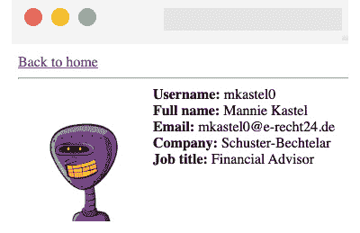
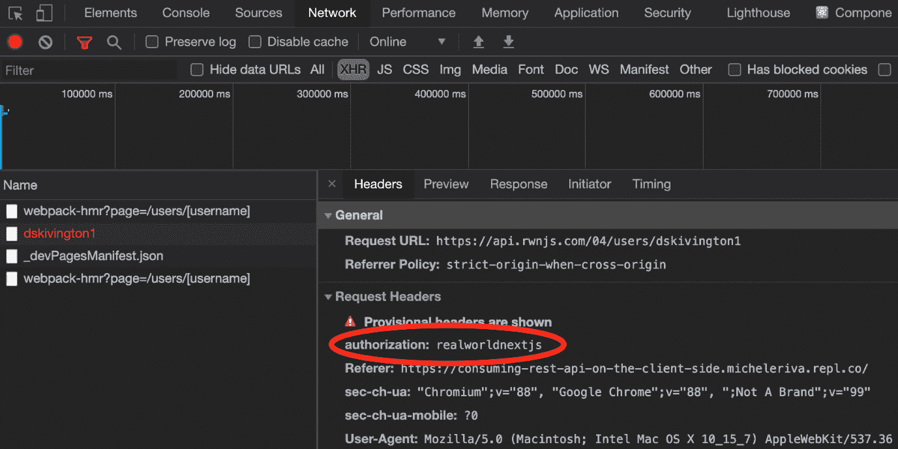

# *第四章*：组织 Next.js 中的代码库和获取数据

Next.js 之所以最初受到欢迎，是因为它能够使在服务器上而不是仅客户端渲染 React 页面变得容易。然而，为了渲染特定的组件，我们通常需要从外部来源（如 API 和数据库）获取一些数据。

在本章中，我们将首先了解如何组织我们的文件夹结构，因为这将是保持 Next.js 数据流整洁时管理应用程序状态的决定因素（正如我们将在*第五章*，*Next.js 中的本地和全局状态管理*中看到的那样），然后我们将了解如何在客户端和服务器端集成外部 REST 和 GraphQL API。

随着我们的应用程序的增长，其复杂性不可避免地会增加，我们需要为此做好准备，因为项目的启动阶段。一旦我们实现新功能，我们就需要添加新的组件、实用工具、样式和页面。因此，我们将更详细地研究基于原子设计原则组织我们的组件，实用函数，样式，以及如何使您的代码库能够快速且整洁地处理应用程序状态。 

我们将详细介绍以下主题：

+   使用原子设计原则组织我们的组件

+   组织我们的实用函数

+   整洁地组织静态资源

+   组织样式文件的简介

+   `lib`文件是什么以及如何组织它们

+   仅在服务器端消费 REST API

+   仅在客户端消费 REST API

+   设置 Apollo 以在客户端和服务器端消费 GraphQL API

到本章结束时，您将了解如何通过遵循组件的原子设计原则来组织您的代码库，以及如何逻辑地分割不同的实用文件。您还将学习如何消费 REST 和 GraphQL API。

# 技术要求

要运行本章中的代码示例，您需要在您的本地机器上安装 Node.js 和 npm。如果您愿意，可以使用在线 IDE，例如[`repl.it`](https://repl.it)或[`codesandbox.io`](https://codesandbox.io)，因为它们都支持 Next.js，并且您不需要在您的计算机上安装任何依赖项。

您可以在 GitHub 上找到本章的代码库：[`github.com/PacktPublishing/Real-World-Next.js`](https://github.com/PacktPublishing/Real-World-Next.js)。

# 组织文件夹结构

整洁且清晰地组织您的新项目文件夹结构对于保持代码库可扩展和可维护至关重要。

正如我们已经看到的，Next.js 强制你将一些文件和文件夹放置在你的代码库的特定位置（想想`_app.js`和`_documents.js`文件，`pages/`和`public/`目录等），但它也提供了一种方法来自定义它们在你项目仓库中的位置。

我们已经看到了这一点，但让我们快速回顾一下默认的 Next.js 文件夹结构：

```js
next-js-app
  - node_modules/
  - package.json
  - pages/
  - public/
  - styles/
```

从上到下阅读，当我们使用 `create-next-app` 创建一个新的 Next.js 应用程序时，我们会得到以下文件夹：

+   `node_modules/`：Node.js 项目依赖项的默认文件夹

+   `pages/`：放置我们的页面并构建我们的 Web 应用程序路由系统的目录

+   `public/`：放置要作为静态资源（编译后的 CSS 和 JavaScript 文件、图像和图标）提供的文件的目录

+   `styles/`：放置我们的样式模块的目录，无论其格式如何（CSS、SASS、LESS）

从这里，我们可以开始自定义我们的仓库结构，使其更容易导航。首先要知道的是，Next.js 允许我们将 `pages/` 目录移动到 `src/` 文件夹内部。我们还可以将所有其他目录（当然不包括 `public/` 和 `node_modules`）移动到 `src/` 内部，使我们的根目录更加整洁。

重要提示

记住，如果您在项目中同时有 `pages/` 和 `src/pages/` 目录，Next.js 将忽略 `src/pages/`，因为根级别的 `pages/` 目录具有优先级。

在下一节中，我们将探讨一些组织整个代码库的流行约定，从 React 组件开始。

## 组织组件

现在，让我们看看一个真实世界的文件夹结构示例，包括一些样式资产（*第六章*，*CSS 和内置样式方法*）和测试文件（*第九章*，*测试 Next.js*）。

就目前而言，我们将只讨论一个可以帮助我们轻松编写和查找配置文件、组件、测试和样式的文件夹结构。我们将在各自的章节中深入探讨之前引用的技术。

我们有不同方式来设置我们的文件夹结构。我们可以从将组件分为三个不同的类别开始，然后将样式和测试放在每个组件的同一文件夹中。

要做到这一点，在我们的根目录内创建一个新的 `components/` 文件夹。然后，进入它，创建以下文件夹：

```js
mkdir components && cd components
mkdir atoms
mkdir molecules
mkdir organisms
mkdir templates
```

如您可能已经注意到的，我们正在遵循 *原子设计原则*，我们希望将我们的组件划分为不同的层级，以便更好地组织我们的代码库。这只是一个流行的约定，您可以根据自己的喜好选择任何其他方法来组织您的代码。

我们将我们的组件划分为四个类别：

+   `atoms`：这是我们将在代码库中编写的最基本组件。有时，它们充当标准 HTML 元素（如 `button`、`input` 和 `p`）的包装器，但我们也可以向这类组件添加动画、调色板等。

+   `molecules`：这些是由原子组合而成的小组，用于创建具有最小实用性的稍微复杂一些的结构。输入原子和标签原子一起可以是一个分子是什么的简单例子。

+   `organisms`：分子和原子结合形成复杂结构，例如注册表单、页脚和轮播图。

+   `templates`：我们可以将模板视为我们页面的骨架。在这里，我们决定将有机体、原子和分子放在一起，以创建用户最终将浏览的最终页面。

如果你想要了解更多关于原子设计的信息，这里有一篇很好的文章详细解释了它：[`bradfrost.com/blog/post/atomic-web-design`](https://bradfrost.com/blog/post/atomic-web-design)。

现在，让我们假设我们想要创建一个`Button`组件。当我们创建一个新的组件时，我们通常至少需要三个不同的文件：组件本身、其样式和一个测试文件。我们可以通过移动到`components/atoms/`并创建一个名为`Button/`的新文件夹来创建这些文件。一旦我们创建了此文件夹，我们就可以继续创建组件的文件：

```js
cd components/atoms/Button
touch index.js
touch button.test.js
touch button.styled.js # or style.module.css
```

以这种方式组织我们的组件将极大地帮助我们，当我们需要搜索、更新或修复给定的组件时。假设我们在生产环境中发现了一个涉及我们的`Button`组件的 bug。我们可以在我们的代码库中轻松找到该组件，找到其测试和样式文件，并修复它们。

当然，遵循原子设计原则不是必须的，但我个人推荐这样做，因为它有助于保持项目结构整洁且易于长期维护。

## 组织实用工具

有一些文件不导出任何组件；它们只是用于许多不同目的的模块化脚本。我们在这里谈论的是实用脚本。

让我们假设我们有几个组件，它们的目的是检查一天中的特定小时是否已经过去以显示某些信息。在每一个组件内部编写相同的函数是没有意义的。因此，我们可以编写一个通用的实用函数，然后将其导入需要这种功能的每个组件中。

我们可以将所有的实用函数放在一个`utility/`文件夹中，并根据它们的目的将我们的实用工具分成不同的文件。例如，假设我们需要四个实用函数：第一个将基于当前时间进行计算，第二个将在`localStorage`上执行某些操作，第三个将处理**JWT (JSON Web Token**)，最后一个将帮助我们为我们的应用程序编写更好的日志。

我们可以通过在`utilities/`目录内创建四个不同的文件来继续：

```js
cd utilities/
touch time.js
touch localStorage.js
touch jwt.js
touch logs.js
```

现在我们已经创建了文件，我们可以通过创建它们各自的测试文件来继续：

```js
touch time.test.js
touch localStorage.test.js
touch jwt.test.js
touch logs.test.js
```

到目前为止，我们已经根据它们的范围将我们的实用工具分组，这使得在开发过程中记住在哪个文件中导入特定的函数变得容易。

可能还有其他组织实用文件的方法。你可能想为每个实用文件创建一个文件夹，以便你可以在其中放置测试、样式和其他内容，从而使你的代码库更加有序。这完全取决于你！

## 组织静态资源

如前一章所示，Next.js 使提供静态文件变得容易，您只需将它们放在 `public/` 文件夹中，框架就会完成剩余的工作。

从这个点开始，我们需要确定我们需要从 Next.js 应用程序中提供哪些静态文件。

在一个标准网站上，我们可能至少想要提供以下静态资源：

+   图片

+   编译后的 JavaScript 文件

+   编译后的 CSS 文件

+   图标（包括 favicon 和 web 应用图标）

+   `manifest.json`、`robot.txt` 和其他静态文件

进入我们的 `public/` 文件夹，我们可以创建一个名为 `assets/` 的新目录：

```js
cd public && mkdir assets
```

在新创建的目录内部，我们将为每种类型的静态资源创建一个新的文件夹：

```js
cd assets
mkdir js
mkdir css
mkdir icons
mkdir images
```

我们将把编译后的供应商 JavaScript 文件放在 `js/` 目录中，同样地，编译后的供应商 CSS 文件也会放在 `css/` 目录中（当然是在 `css/` 目录中）。当我们启动 Next.js 服务器时，我们可以在 http://localhost:3000/assets/js/<任何-js 文件> 和 http://localhost:3000/assets/css/<任何-css 文件> 下访问这些公共文件。我们还可以通过调用以下 URL 来访问每个公共图像，http://localhost:3000/assets/image/<任何图像文件>，但我建议您使用内置的 `Image` 组件来提供这类资源，正如前一章所展示的。

`icons/` 目录主要用于提供我们的 *web 应用清单* 图标。web 应用清单是一个包含有关您正在构建的渐进式网络应用的一些有用信息的 JSON 文件，例如应用名称和安装到移动设备时使用的图标。您可以在 [`web.dev/add-manifest`](https://web.dev/add-manifest) 上了解更多关于 web 应用清单的信息。

我们可以很容易地创建这个清单文件，通过进入 `public/` 文件夹并添加一个名为 `manifest.json` 的新文件：

```js
cd public/ && touch manifest.json
```

到目前为止，我们可以用一些基本信息填充 JSON 文件。以下是一个 JSON 示例：

```js
{
  "name": "My Next.js App",
  "short_name": "Next.js App",
  "description": "A test app made with next.js",
  "background_color": "#a600ff",
  "display": "standalone",
  "theme_color": "#a600ff",
  "icons": [
    {
      "src": "/assets/icons/icon-192.png",
      "type": "image/png",
      "sizes": "192x192"
    },
    {
      "src": "/assets/icons/icon-512.png",
      "type": "image/png",
      "sizes": "512x512"
    }
  ]
}
```

我们可以使用 HTML meta 标签来包含该文件，如第三章中所示，*Next.js 基础和内置组件*：

```js
<link rel="manifest" href="/manifest.json">
```

这样，从移动设备浏览您的 Next.js 应用程序的用户将能够在他们的智能手机或平板电脑上安装它。

## 样式组织

样式组织实际上可以取决于您想要用于样式化 Next.js 应用的堆栈。

从 *CSSinJS* 框架，如 *Emotion*、*styled-components*、*JSS* 和类似框架开始，一个常见的方法是为每个组件创建一个特定的样式文件；这样，当我们需要做出一些更改时，我们更容易在我们的代码库中找到特定的组件样式。

然而，尽管根据各自的组件来分离样式文件可以帮助我们保持代码库的整洁，我们可能还需要创建一些通用样式或实用文件，例如调色板、主题和媒体查询。

在这种情况下，重用默认 Next.js 安装中提供的默认 `styles/` 目录可能很有用。我们可以将我们的常用样式放在这个文件夹中，并在需要时在其他样式文件中导入它们。

话虽如此，实际上并没有一个标准的组织样式文件的方法。我们将在 *第六章*，*CSS 和内置样式方法*，以及 *第七章*，*使用 UI 框架* 中更详细地查看这些文件。

## Lib 文件

当谈到 lib 文件时，我们指的是明确封装第三方库的脚本作为 lib 文件。虽然实用脚本非常通用，可以被许多不同的组件和库使用，但 lib 文件是针对特定库的。为了使这个概念更清晰，让我们暂时谈谈 GraphQL。

正如我们将在本章的最后部分 *数据获取* 中看到的，我们需要初始化一个 GraphQL 客户端，本地保存一些 GraphQL 查询和突变，等等。为了使这些脚本更模块化，我们将它们存储在一个名为 `graphql/` 的新文件夹中，该文件夹位于 `lib/` 目录内，位于我们项目的根目录。

如果我们尝试可视化前述示例的文件夹结构，我们将得到以下模式：

```js
next-js-app
  - lib/
    - graphql/
      - index.js
      - queries/
        - query1.js
        - query2.js
      - mutations/
        - mutation1.js
        - mutation2.js
```

其他 lib 脚本可以包括所有连接和向 Redis、RabbitMQ 等进行查询的文件，或者针对任何外部库的特定函数。

当谈论 Next.js 数据流时，一个有组织的文件夹结构似乎与上下文不符，但实际上它可以帮助我们管理应用程序状态，正如我们将在 *第五章*，*在 Next.js 中管理本地和全局状态* 中看到的。

但谈到应用程序状态，我们希望大多数时候我们的组件是动态的，这意味着它们可以根据全局应用程序状态或来自外部服务的数据进行内容渲染和行为变化。实际上，在许多情况下，我们需要调用外部 API 来动态检索我们的网络应用程序内容。在下一节中，我们将看到如何使用 GraphQL 和 REST 客户端在客户端和服务器端获取数据。

# 数据获取

如前几章所述，Next.js 允许我们在客户端和服务器端获取数据。服务器端数据获取可以在两个不同的时刻发生：在构建时（使用 `getStaticProps` 为静态页面），以及在运行时（使用 `getServerSideProps` 为服务器端渲染的页面）。

数据可以来自多个资源：数据库、搜索引擎、外部 API、文件系统，以及许多其他来源。尽管技术上 Next.js 可以访问数据库并查询特定数据，但我个人会劝阻这种做法，因为 Next.js 应该只关心我们应用程序的前端。

让我们举一个例子：我们正在构建一个博客，我们想要显示一个作者页面，展示他们的姓名、职位和传记。在这个例子中，数据存储在 MySQL 数据库中，我们可以使用任何 Node.js 的 MySQL 客户端轻松访问它。

尽管从 Next.js 访问这些数据相对容易，但这会使我们的应用安全性降低。恶意用户可能会找到一种方法利用未知框架漏洞来利用我们的数据，注入恶意代码，并使用其他技术窃取我们的数据。

因此，我强烈建议将数据库连接和查询委托给外部系统（换句话说，如 *WordPress*、*Strapi* 和 *Contentful* 这样的 CMS）或后端框架（换句话说，*Spring*、*Laravel* 和 *Ruby on Rails*），这将确保数据来自可信的来源，将检测到潜在的恶意代码的用户输入进行清理，并在您的 Next.js 应用程序和它们的 API 之间建立安全的连接。

在接下来的章节中，我们将看到如何从客户端和服务器端集成 *REST* 和 *GraphQL* API。

## 在服务器端获取数据

如我们所见，Next.js 允许我们通过使用其内置的 `getStaticProps` 和 `getServerSideProps` 函数在服务器端获取数据。

由于 Node.js 不支持浏览器那样的 JavaScript `fetch` API，我们在服务器上发起 HTTP 请求有两个选择：

1.  使用 Node.js 内置的 `http` 库：我们可以不安装任何外部依赖项就使用此模块，但即使它的 API 简单且制作精良，与第三方 HTTP 客户端相比，它可能需要做更多额外的工作。

1.  使用 HTTP 客户端库：Next.js 有几个优秀的 HTTP 客户端，使得从服务器发起 HTTP 请求变得非常简单。流行的库包括 *isomorphic-unfetch*（使 JavaScript `fetch` API 在 Node.js 上可用）、*Undici*（官方 Node.js HTTP 1.1 客户端）和 *Axios*（一个非常流行的 HTTP 客户端，在客户端和服务器上运行，具有相同的 API）。

在下一节中，我们将使用 *Axios* 来发起 REST 请求，因为它可能是客户端和服务器上最常用的 HTTP 客户端之一（每周在 npm 上下载量约为 ~17,000,000 次），你迟早会用到它。

## 在服务器端消费 REST API

当讨论 REST API 的集成时，我们需要将它们分为 *公共* 和 *私有* API。公共 API 任何人都可以无授权访问，而私有 API 总是需要授权才能返回某些数据。

此外，授权方法并不总是相同的（不同的 API 可能需要不同的授权方法），因为它取决于谁开发了 API 以及他们的选择。例如，如果您想使用任何 *Google* API，您将需要进入一个称为 *OAuth 2.0* 的过程，这是在用户身份验证下保护 API 的行业标准。您可以在官方 Google 文档中了解更多关于 OAuth 2.0 的信息：[`developers.google.com/identity/protocols/oauth2`](https://developers.google.com/identity/protocols/oauth2)。

其他 API，如 *Pexels* API（[`www.pexels.com/api/documentation`](https://www.pexels.com/api/documentation)），允许您使用 *API key* 消费其内容，这基本上是一个授权令牌，您需要在请求中发送它。

可能还有其他方式可以授权您的请求，但 Oauth 2.0、JWT 和 API Key 是在开发 Next.js 应用程序时您可能会遇到的最常见方式。

如果在阅读本节后，您想尝试不同的 API 和授权方法，这里有一个包含免费 REST API 列表的出色的 GitHub 仓库：https://github.com/public-apis/public-apis。

目前，我们将使用为本书专门制作的自定义 API：[`api.realworldnextjs.com`](https://api.realworldnextjs.com)（或者，如果您更喜欢：https://api.rwnjs.com）。我们可以从创建一个新的 Next.js 项目开始：

```js
npx create-next-app ssr-rest-api
```

在运行 Next.js 初始化脚本后，我们可以添加 `axios` 作为依赖项，因为我们将其用作 HTTP 客户端来制作 REST 请求：

```js
cd ssr-rest-api
yarn add axios
```

在这一点上，我们可以轻松地编辑默认的 Next.js 首页。在这里，我们将使用公开 API 列出一些用户，仅暴露他们的用户名和个人 ID。点击其中一个用户名后，我们将被重定向到一个详情页面，以查看更多关于我们用户的个人信息。

让我们从创建 `pages/index.js` 页面布局开始：

```js
import { useEffect } from 'react';
import Link from 'next/link';
export async function getServerSideProps() {
  // Here we will make the REST request to our APIs
}
function HomePage({ users }) {
  return (
    <ul>
      {
        users.map((user) =>
          <li key={user.id}>
            <Link
              href={`/users/${user.username}`}
              passHref
            >
              <a> {user.username} </a>
            </Link>
          </li>
        )
      }
    </ul>
  )
}
export default HomePage;
```

如果我们尝试运行前面的代码，我们会看到错误，因为我们还没有我们的用户数据。我们需要从内置的 `getServerSideProps` 调用一个 REST API，并将请求结果作为 prop 传递给 `HomePage` 组件：

```js
import { useEffect } from 'react';
import Link from 'next/link';
import axios from 'axios';
export async function getServerSideProps() {
  const usersReq =
    await axios.get('https://api.rwnjs.com/04/users')
  return {
    props: {
      users: usersReq.data
    }
  }
}
function HomePage({ users }) {
  return (
    <ul>
      {
        users.map((user) =>
          <li key={user.id}>
            <Link
              href={`/users/${user.username}`}
              passHref
            >
              <a> {user.username} </a>
            </Link>
          </li>
        )
      }
    </ul>
  )
}
export default HomePage;
```

现在，运行服务器然后访问 `http://localhost:3000`。我们应该在浏览器中看到以下用户列表：

![Figure 4.1 – API result rendered on the browser]

![Figure 4.01_B16985.jpg]

图 4.1 – 浏览器上渲染的 API 结果

如果我们现在尝试点击列表中的任何一个用户，我们将被重定向到一个 404 页面，因为我们还没有创建单个页面用户。

我们可以通过创建一个新的文件，`pages/users/[username].js`，并调用另一个 REST API 来获取单个用户数据来解决这个问题。

要获取单个用户数据，我们可以调用以下 URL，https://api.rwnjs.com/04/users/[username]，其中 `[username]` 是一个路由变量，代表我们想要获取数据的用户。

让我们转到 `pages/users/[username].js` 文件，并添加以下内容，从 `getServerSideProps` 函数开始：

```js
import Link from 'next/link';
import axios from 'axios';
export async function getServerSideProps(ctx) {
  const { username } = ctx.query;
  const userReq =
    await axios.get(
      `https://api.rwnjs.com/04/users/${username}`
    );
  return {
    props: {
      user: userReq.data
    }
  };
}
```

现在，在同一个文件中，让我们添加一个 `UserPage` 函数，它将是我们的 `/users/[username]` 路由的页面模板：

```js
function UserPage({ user }) {
  return (
    <div>
      <div>
        <Link href="/" passHref>
          Back to home
        </Link>
      </div>
      <hr />
      <div style={{ display: 'flex' }}>
        
        <div>
          <div>
            <b>Username:</b> {user.username}
          </div>
          <div>
            <b>Full name:</b>
              {user.first_name} {user.last_name}
          </div>
          <div>
            <b>Email:</b> {user.email}
          </div>
          <div>
            <b>Company:</b> {user.company}
          </div>
          <div>
            <b>Job title:</b> {user.job_title}
          </div>
        </div>
      </div>
    </div>
  );
}
export default UserPage;
```

但仍然存在一个问题：如果我们尝试渲染单个用户页面，由于我们没有权限从该 API 获取数据，我们将在服务器端收到错误。还记得我们在这个部分开头提到的话吗？并非所有 API 都是公开的，这在很多情况下是有意义的，因为有时我们想访问非常私人的信息，公司和开发人员通过仅允许授权人员访问他们的 API 来保护这些信息。

在那种情况下，我们需要在发起 API 请求时传递一个有效的令牌作为 HTTP 授权头，这样服务器就会知道我们有权限访问这些信息：

```js
export async function getServerSideProps(ctx) {
  const { username } = ctx.query;
  const userReq = await axios.get(
    `https://api.rwnjs.com/04/users/${username}`,
    {
      headers: {
        authorization: process.env.API_TOKEN
      }
    }
  );
  return {
    props: {
      user: userReq.data
    }
  };
}
```

如您所见，`axios` 使得向请求中添加 HTTP 头变得非常简单，因为我们只需要将一个对象作为其 `get` 方法的第二个参数传递，该对象包含一个名为 `headers` 的属性，它是一个对象，包含我们想要在请求中发送到服务器的所有 HTTP 头。

你可能想知道 `process.env.API_TOKEN` 是什么意思。虽然可以将硬编码的字符串作为该头部的值传递，但出于以下原因，这并不是一个好的做法：

1.  当你使用 Git 或其他版本控制系统提交代码时，所有有权访问该存储库的人都将能够读取私人信息，如授权令牌（即使是在外部协作者）。请将其视为应该保密的密码。

1.  大多数情况下，API 令牌会根据我们运行应用程序的阶段而变化：在本地运行我们的应用程序时，我们可能想使用测试令牌访问 API，而在部署时使用生产令牌。使用环境变量将使我们能够根据环境使用不同的令牌。对于 API 端点也是如此，但我们将稍后在本文档的这一部分中看到。

1.  如果出于任何原因 API 令牌发生变化，你可以轻松地使用整个应用程序的共享环境文件来编辑它，而不是在每个 HTTP 请求中更改令牌值。

因此，我们不必手动在我们的文件中写入敏感数据，我们可以在项目的根目录内创建一个新的文件名为 `.env`，并将我们应用程序运行所需的所有信息添加到该文件中。

永远不要提交 .env 文件

`.env` 文件包含敏感和私人信息，不应使用任何版本控制软件提交。在部署或提交代码之前，请确保将 `.env` 添加到 `.gitignore`、`.dockerignore` 和其他类似文件中。

现在，让我们创建并编辑 `.env` 文件，添加以下内容：

```js
API_TOKEN=realworldnextjs
API_ENDPOINT=https://api.rwnjs.com
```

Next.js 内置了对 `.env` 和 `.env.local` 文件的支持，因此你不需要安装外部库来访问这些环境变量。

编辑完文件后，我们可以重启 Next.js 服务器，并点击主页上列出的任何用户，从而访问用户详情页面，其外观应如下所示：



图 4.2 – 用户详情页面

如果我们尝试访问像`http://localhost:3000/users/mitch`这样的页面，我们会得到一个错误，因为不存在用户名为`mitch`的用户，REST API 将返回`404`状态码。我们可以轻松地捕获这个错误，并通过在`getServerSideProps`函数中添加以下脚本返回 Next.js 默认的 404 页面：

```js
export async function getServerSideProps(ctx) {
  const { username } = ctx.query;
  const userReq = await axios.get(
    `${process.env.API_ENDPOINT}/04/users/${username}`,
    {
      headers: {
        authorization: process.env.API_TOKEN
      }
    }
  );
  if (userReq.status === 404) {
    return {
      notFound: true
    };
  }
  return {
    props: {
      user: userReq.data
    }
  };
}
```

这样，Next.js 将自动将我们重定向到其默认的`404`页面，无需其他配置。

因此，我们已经看到了 Next.js 如何通过使用其内置的`getServerSideProps`函数允许我们在服务器端独家获取数据。我们本可以使用`getStaticProps`函数，这意味着页面将在构建时进行静态渲染，正如在*第二章*中看到的，*探索不同的渲染策略*。

在下一节中，我们将看到如何仅从客户端获取数据。

## 在客户端获取数据

客户端数据获取是任何动态 Web 应用的关键部分。虽然服务器端数据获取相对安全（当谨慎操作时），但在浏览器上获取数据可能会增加一些额外的复杂性和漏洞。

在服务器上执行 HTTP 请求会隐藏 API 端点、参数、HTTP 头信息以及可能存在的授权令牌，从而保护用户信息不被泄露。然而，从浏览器端执行此类操作可能会暴露这些私人信息，使得恶意用户能够轻易地执行一系列可能的攻击，从而利用你的数据。

在浏览器上发起 HTTP 请求时，一些特定的规则是必不可少的：

1.  *仅向可信来源发起 HTTP 请求*。你应该始终对开发你使用的 API 的开发者及其安全标准进行一些研究。

1.  *仅当使用 SSL 证书加密时才调用 HTTP API*。如果一个远程 API 没有在 HTTPS 下进行加密，那么你和你用户的个人信息就会暴露在许多攻击之下，例如中间人攻击，恶意用户可以通过简单的代理嗅探客户端和服务器之间传输的所有数据。

1.  *永远不要从浏览器连接到远程数据库*。这看似显而易见，但从技术上讲，JavaScript 可以访问远程数据库。这会使你和你用户面临高风险，因为任何人都有可能利用漏洞并访问你的数据库。

在下一节中，我们将更深入地探讨客户端如何消费 REST API。

## 在客户端消费 REST API

与服务器端类似，客户端获取数据相对简单，如果你已经具备 React 或其他 JavaScript 框架或库的经验，你可以直接利用现有知识，从浏览器端发起 REST 请求而无需任何复杂操作。

在 Next.js 中，服务器端数据获取阶段仅在声明在其内置的`getServerSideProps`和`getStaticProps`函数内时发生，如果我们在一个给定组件内发起 fetch 请求，它将默认在客户端执行。

我们通常希望客户端请求在两种情况下运行：

+   在组件挂载后立即

+   在特定事件发生后

在这两种情况下，Next.js 不会强制您以不同于 React 的方式执行这些请求，因此您基本上可以使用浏览器的内置`fetch` API 或像`axios`这样的外部库来发起 HTTP 请求，就像我们在上一节中看到的那样。让我们尝试重新创建上一节中相同的简单 Next.js 应用程序，但将所有 API 调用移动到客户端。

创建一个新的 Next.js 项目，并编辑`pages/index.js`文件，如下所示：

```js
import { useEffect, useState } from 'react';
import Link from 'next/link';
function List({users}) {
  return (
    <ul>
      {
        users.map((user) =>
          <li key={user.id}>
            <Link
              href={`/users/${user.username}`}
              passHref
            >
              <a> {user.username} </a>
            </Link>
          </li>
        )
      }
    </ul>
  )
}
function Users() {
  const [loading, setLoading] = useState(true);
  const [data, setData] = useState(null);
  useEffect(async () => {
    const req =
      await fetch('https://api.rwnjs.com/04/users');
    const users = await req.json();
    setLoading(false);
    setData(users);
  }, []);
  return (
    <div>
      {loading &&<div>Loading users...</div>}
      {data &&<List users={data} />}
    </div>
  )
}
export default Users;
```

您能发现这个组件与其 SSR 对应组件之间的区别吗？

+   服务器端生成的 HTML 包含`Loading users...`文本，因为这是我们`HomePage`组件的初始状态。

+   只有在 React hydration 完成后，我们才能看到用户列表。我们需要等待组件在客户端挂载，并使用浏览器的`fetch` API 发起 HTTP 请求。

现在我们需要按照以下方式实现单用户页面：

1.  让我们创建一个新的文件，`pages/users/[username].js`，并开始编写`getServerSideProps`函数，其中我们从路由中获取`[username]`变量，并从`.env`文件中获取授权令牌：

    ```js
    import { useEffect, useState } from 'react'
    import Link from 'next/link';
    export async function getServerSideProps({ query }) {
      const { username } = query;
      return {
        props: {
          username,
          authorization: process.env.API_TOKEN
        }
      }
    }
    ```

1.  现在，在同一个文件中，让我们创建`UserPage`组件，我们将在这里执行客户端数据获取函数：

    ```js
    function UserPage({ username, authorization }) {
      const [loading, setLoading] = useState(true);
      const [data, setData] = useState(null);
      useEffect(async () => {
        const req = await fetch(
          `https://api.rwnjs.com/04/users/${username}`,
          { headers: { authorization } }
        );
        const reqData = await req.json();
        setLoading(false);
        setData(reqData);
      }, []);
      return (
        <div>
          <div>
            <Link href="/" passHref>
              Back to home
            </Link>
          </div>
          <hr />
          {loading && <div>Loading user data...</div>}
          {data && <UserData user={data} />}
        </div>
      );
    }
    export default UserPage;
    ```

    正如您可能已经注意到的，一旦我们使用`setData`钩子函数设置数据，我们就渲染一个`<UserData />`组件。

1.  创建该组件，始终在同一个`pages/users/[username].js`组件内部：

    ```js
    function UserData({ user }) {
      return (
        <div style={{ display: 'flex' }}>
          
          <div>
            <div>
              <b>Username:</b> {user.username}
            </div>
            <div>
              <b>Full name:</b>
                {user.first_name} {user.last_name}
            </div>
            <div>
              <b>Email:</b> {user.email}
            </div>
            <div>
              <b>Company:</b> {user.company}
            </div>
            <div>
              <b>Job title:</b> {user.job_title}
            </div>
          </div>
        </div>
      )
    }
    ```

    如您所见，我们正在使用与主页相同的方法，即组件在客户端挂载后立即发起 HTTP 请求。我们还通过`getServerSideProps`将服务器的`API_TOKEN`传递到客户端，以便我们可以用它来发起授权请求。然而，如果您尝试运行前面的代码，您将至少看到两个问题。

    第一个问题与**CORS**有关。

在`HomePage`组件中，我们已经能够从不同域名（localhost、replit.co 域名、CodeSandbox 域名等）调用`https://api.rwnjs.com/04/users` API，因为服务器允许任何域名访问该特定路由的资源。

然而，在这种情况下，浏览器对`https://api.rwnjs.com/04/users/[username]`端点有一些限制，我们无法直接从客户端调用此 API，因为我们被 CORS 策略阻止。CORS 有时可能很棘手，我鼓励你阅读 Mozilla 开发者网络页面上的更多关于此安全策略的信息：[`developer.mozilla.org/en-US/docs/Web/HTTP/CORS`](https://developer.mozilla.org/en-US/docs/Web/HTTP/CORS)。

第二个问题与向客户端暴露授权令牌有关。实际上，如果我们打开谷歌 Chrome 开发者工具并转到**网络**，我们可以选择端点的 HTTP 请求，并在**请求头**部分看到授权令牌的纯文本：




图 4.3 – HTTP 请求头

那么，这有什么问题吗？

假设您正在为通过 API 公开实时天气更新的服务付费，并且假设每 100 次请求的费用为 1 美元。

一个想要免费使用相同服务的恶意用户可以轻易地在请求头中找到您的私有授权令牌，并使用它来为他们的天气网络应用供电。这样，如果恶意用户发起 1,000 次请求，您将支付 10 美元，而实际上并没有使用他们的服务。

我们可以快速解决这两个问题，多亏了 Next.js API 页面，它允许我们快速创建 REST API，在服务器端使用 HTTP 请求，并将结果返回给客户端。

让我们在`pages/`内部创建一个名为`api/`的新文件夹和一个新文件，`pages/api/singleUser.js`：

```js
import axios from 'axios';
export default async function handler(req, res) {
  const username = req.query.username;
  const API_ENDPOINT = process.env.API_ENDPOINT;
  const API_TOKEN = process.env.API_TOKEN;
  const userReq = await axios.get(
    `${API_ENDPOINT}/04/users/${username}`,
    { headers: { authorization: API_TOKEN } }
  );
  res
    .status(200)
    .json(userReq.data);
}
```

如您所见，在这种情况下，我们暴露了一个接受两个参数的简单函数：

+   `req`：Node.js 的`http.IncomingMessage`实例([`nodejs.org/api/http.html#http_class_http_incomingmessage`](https://nodejs.org/api/http.html#http_class_http_incomingmessage))，与一些预构建的中间件合并，例如`req.cookies`、`req.query`和`req.body`。

+   `res`：Node.js 的`http.serverResponse`实例([`nodejs.org/api/http.html#http_class_http_serverresponse`](https://nodejs.org/api/http.html#http_class_http_serverresponse))，与一些预构建的中间件合并，例如`res.status(code)`用于设置 HTTP 状态码，`res.json(json)`用于返回有效的 JSON，`res.send(body)`用于发送包含`string`、`object`或`Buffer`的 HTTP 响应，以及`res.redirect([status,] path)`用于重定向到具有给定（可选）状态码的特定页面。

`pages/api/`目录中的每个文件都将被 Next.js 视为一个 API 路由。

现在我们可以通过将 API 端点更改为新创建的一个来重构我们的`UserPage`组件：

```js
function UserPage({ username }) {
  const [loading, setLoading] = useState(true);
  const [data, setData] = useState(null);
  useEffect(async () => {
    const req = await fetch(
`/api/singleUser?username=${username}`,
    );
    const data = await req.json();
    setLoading(false);
    setData(data);
  }, []);
  return (
    <div>
      <div>
        <Link href="/" passHref>
          Back to home
        </Link>
      </div>
      <hr />
      {loading && <div>Loading user data...</div>}
      {data && <UserData user={data} />}
    </div>
  );
}
```

如果我们现在尝试运行我们的网站，我们将看到我们的两个问题都得到了解决！

但我们仍然需要注意一些事情。我们通过编写一种为单个用户 API 的 *代理* 来隐藏了 API 令牌，但恶意用户仍然能够轻松地使用 `/api/singleUser` 路由来访问私有数据。

为了解决那个特定的问题，我们可以采取各种不同的方式：

+   仅在服务器上渲染组件列表，就像在上一节中那样：这样，恶意用户就不会调用私有 API 或窃取秘密的 API 令牌。然而，在某些情况下，你只能在服务器上运行这些类型的 API 调用；如果你需要在用户点击按钮后进行 REST 请求，你被迫在客户端进行。

+   使用一种身份验证方法，让经过身份验证的用户只能访问特定的 API（JWT、API 密钥等）。

+   使用如 **Ruby on Rails**、**Spring**、**Laravel**、**Nest.js** 和 **Strapi** 这样的后端框架：它们都提供了不同的方法来保护你的 API 调用免受客户端的攻击，这使得我们创建安全的 Next.js 应用程序变得更加容易。

在 *第十三章* *使用 Next.js 和 GraphCMS 构建电子商务网站* 中，我们将看到如何将 Next.js 作为不同 CMS 和电子商务平台的前端使用，我们还将涵盖用户身份验证和安全的 API 调用。现在，在本章中，我们只关注如何从服务器和客户端进行 HTTP 请求。

在下一节中，我们将看到如何将 GraphQL 作为 REST 的替代方案用于 Next.js 中的数据获取。

## 消费 GraphQL API

GraphQL 已经在 API 世界中掀起了一场革命，并且由于其易用性、模块化和灵活性，它的受欢迎程度正在不断增加。

对于那些不太熟悉 GraphQL 的人来说，它基本上是一种查询语言，由 *Facebook* 在 2012 年首次发明。与 REST 或 SOAP 等其他网络服务架构相比，它在数据获取和处理的关键方面进行了许多改进。实际上，它允许你避免数据过度获取（你可以简单地查询你需要的字段），在单个请求中获取多个资源，为你的数据提供一个强类型和静态类型的接口，避免 API 版本化，等等。

在本节中，我们将使用 Apollo Client ([`www.apollographql.com/docs/react`](https://www.apollographql.com/docs/react))，这是一个非常流行的 GraphQL 客户端，内置了对 React 和 Next.js 的支持，用于构建一个非常简单的在线签名簿。

让我们先创建一个新的项目：

```js
npx create-next-app signbook
```

现在，让我们添加一些依赖项：

```js
yarn add @apollo/client graphql isomorphic-unfetch
```

我们现在需要为我们的 Next.js 应用程序创建一个 Apollo 客户端。我们将通过在 `lib/apollo/index.js` 内部创建一个新文件，然后编写以下函数来完成：

```js
import { useMemo } from 'react';
import {
  ApolloClient,
  HttpLink,
  InMemoryCache
} from '@apollo/client';
let uri = 'https://rwnjssignbook.herokuapp.com/v1/graphql';
let apolloClient;
function createApolloClient() {
  return new ApolloClient({
    ssrMode: typeof window === 'undefined',
    link: new HttpLink({ uri }),
    cache: new InMemoryCache(),
  });
} 
```

如您所假设，通过设置`ssrMode: typeof window === "undefined"`，我们将使用相同的 Apollo 实例来处理客户端和服务器。此外，`ApolloClient`使用浏览器的`fetch` API 来发送 HTTP 请求，因此我们需要导入一个 polyfill 来使其在服务器端也能工作；在这种情况下，我们将使用`isomorphic-unfetch`。

如果您尝试在浏览器上运行[`api.realworldnextjs.com/04/signbook/graphql`](https://api.realworldnextjs.com/04/signbook/graphql)，它将重定向您到一个公共的*GraphCMS* GraphQL 编辑器。实际上，我们将使用那个无头 CMS 作为我们目前正在编写的应用程序的数据源。

在同一个`lib/apollo/index.js`文件中，让我们添加一个新的函数来初始化 Apollo 客户端：

```js
export function initApollo(initialState = null) {
  const client = apolloClient || createApolloClient();
  if (initialState) {
    client.cache.restore({
      ...client.extract(),
      ...initialState
    });
  }
  if (typeof window === "undefined") {
    return client;
  }
  if (!apolloClient) {
    apolloClient = client;
  }
  return client;
}
```

这个函数将允许我们避免为每个页面重新创建一个新的 Apollo 客户端。实际上，我们将在服务器上（在之前编写的`apolloClient`变量中）存储一个客户端实例，我们可以将初始状态作为参数传递。如果我们将此参数传递给`initApollo`函数，它将与本地缓存合并，以便在移动到另一个页面时恢复状态的完整表示。

为了实现这一点，我们首先需要在`lib/apollo/index.js`文件中添加另一个`import`语句。鉴于使用复杂的初始状态重新初始化 Apollo 客户端在性能上可能是一个昂贵的任务，我们将使用 React 的`useMemo`钩子来加速这个过程：

```js
import { useMemo } from "react";
```

然后，我们将导出最后一个函数：

```js
export function useApollo(initialState) {
  return useMemo(
    () => initApollo(initialState),
    [initialState]
  );
}
```

转到我们的`pages/`目录，我们现在可以创建一个新的`_app.js`文件，正如在*第三章*，*Next.js 基础和内置组件*中看到的。在这里，我们将使用官方的 Apollo 上下文提供者包裹整个应用：

```js
import { ApolloProvider } from "@apollo/client";
import { useApollo } from "../lib/apollo";
export default function App({ Component, pageProps }) {
  const apolloClient =
    useApollo(pageProps.initialApolloState);
  return (
    <ApolloProvider client={apolloClient}>
      <Component {...pageProps} />
    </ApolloProvider>
  );
}
```

我们现在可以开始编写我们的查询了！

我们将把我们的查询组织在一个名为`lib/apollo/queries/`的新文件夹中。

让我们从创建一个新的文件`lib/apollo/queries/getLatestSigns.js`开始，公开以下 GraphQL 查询：

```js
import { gql } from "@apollo/client";
const GET_LATEST_SIGNS = gql`
  query GetLatestSigns($limit: Int! = 10, $skip: Int! = 0){
    sign(
      offset: $skip,
      limit: $limit,
      order_by: { created_at: desc }
    ) {
      uuid
      created_at
      content
      nickname
      country
    }
  }
`;
export default GET_LATEST_SIGNS;
```

我们现在可以在`pages/index.js`文件中导入这个查询，并尝试使用 Apollo 和 Next.js 进行我们的第一个 GraphQL 请求：

```js
import { useQuery } from "@apollo/client";
import GET_LATEST_SIGNS from
  '../lib/apollo/queries/getLatestSigns'
function HomePage() {
  const { loading, data } = useQuery(GET_LATEST_SIGNS, {
    fetchPolicy: 'no-cache',
  });
  return <div></div>
}
export default HomePage
```

如您所见，Apollo 客户端的使用非常简单。多亏了`useQuery`钩子，我们将能够访问三个不同的状态：

+   `loading`：正如其名所示，它仅在请求完成或仍在挂起时返回`true`或`false`。

+   `error`：如果请求因任何原因失败，我们将能够捕获错误并向用户发送一条友好的消息。

+   `data`：包含我们通过查询请求的数据。

现在，让我们暂时回到主页。为了简单起见，我们将只添加一个远程的*TailwindCSS*依赖项来为我们的演示应用进行样式设计。在*第六章* *CSS 和内置样式方法*和*第七章* *使用 UI 框架*中，我们将看到如何优化和集成 UI 框架，但现在，我们将保持简单，因为我们只想关注应用的数据获取部分。

打开`pages/index.js`文件并按照以下方式编辑它：

```js
import Head from "next/head";
import { ApolloProvider } from "@apollo/client";
import { useApollo } from "../lib/apollo";
export default function App({ Component, pageProps }) {
  const apolloClient =
    useApollo(pageProps.initialApolloState || {});
return (
  <ApolloProvider client={apolloClient}>
    <Head>
      <link href="https://unpkg.com/tailwindcss@²/dist/        tailwind.min.css"
       rel="stylesheet"
      />
    </Head>
    <Component {...pageProps} />
  </ApolloProvider>
 );
}
```

现在，我们可以创建一个新的文件，`components/Loading.js`。在我们从`GraphCMS`获取标志时，我们将渲染它：

```js
function Loading() {
  return (
    <div
      className="min-h-screen w-screen flex justify-center
        items-center">
      Loading signs from Hasura...
    </div>
  );
}
export default Loading;
```

一旦我们成功获取了所需的数据，我们需要在主页上显示它。为此，我们将在`components/Sign.js`文件内创建一个新的组件，内容如下：

```js
function Sign({ content, nickname, country }) {
  return (
    <div className="max-w-7xl rounded-md border-2 border-
      purple-800 shadow-xl bg-purple-50 p-7 mb-10">
      <p className="text-gray-700"> {content} </p>
      <hr className="mt-3 mb-3 border-t-0 border-b-2 
        border-purple-800" />
      <div>
        <div className="text-purple-900">
          Written by <b>{nickname}</b>
          {country && <span> from {country}</span>}
        </div>
      </div>
    </div>
  );
}
export default Sign;
```

现在，让我们将这两个新组件集成到我们的主页中：

```js
import { useQuery } from "@apollo/client";
import GET_LATEST_SIGNS from
  '../lib/apollo/queries/getLatestSigns'
import Sign from '../components/Sign'
import Loading from '../components/Loading'
function HomePage() {
  const { loading, error, data } =
    useQuery(GET_LATEST_SIGNS, {
      fetchPolicy: 'no-cache',
    });
  if (loading) {
    return <Loading />;
  }
  return (
    <div className="flex justify-center items-center flex-
      col mt-20">
<h1 className="text-3xl mb-5">Real-World Next.js 
        signbook</h1>
      <Link href="/new-sign">
<button className="mb-8 border-2 border-purple-800 
          text-purple-900 p-2 rounded-lg text-gray-50
            m-auto  mt-4">
          Add new sign
        </button>
      </Link>
      <div>
        {data.sign.map((sign) => (
          <Sign key={sign.uuid} {...sign} />
        ))}
      </div>
    </div>
  );
}
export default HomePage
```

如果我们现在尝试浏览主页，我们将看到一个标志列表！

我们也可以通过在`pages/new-sign.js`下创建一个新的页面来创建一个添加新标志的简单路由。让我们先为该页面添加所需的`imports`： 

```js
import { useState } from "react";
import Link from "next/link";
import { useRouter } from "next/router";
import { useMutation } from "@apollo/client";
import ADD_SIGN from "../lib/apollo/queries/addSign";
```

如您所见，我们正在从不同的库中导入大量函数。我们将使用`useState`React 钩子来跟踪我们的表单变化以便提交标志，Next.js 的`useRouter`钩子用于在用户创建了一个新标志后将用户重定向到主页，以及 Apollo 的`useMutation`钩子用于在 GraphCMS 上创建一个新的标志。我们还`import`了一个名为`ADD_SIGN`的新 GraphQL 变异，我们将在创建此页面后详细了解它。

接下来，我们创建页面结构：

```js
function NewSign() {
  const router = useRouter();
  const [formState, setFormState] = useState({});
  const [addSign] = useMutation(ADD_SIGN, {
    onCompleted() {
      router.push("/");
    }
  });
  const handleInput = ({ e, name }) => {
    setFormState({
      ...formState,
      [name]: e.target.value
    });
  };
}
export default NewSign;
```

从上到下阅读，我们可以看到我们正在使用 Apollo 的`useMutation`钩子创建一个新的标志。一旦标志被正确创建，它将运行`onCompleted`回调，我们将在此回调中将用户重定向到主页。

接下来，我们来看看组件体内声明的下一个函数，我们可以清楚地看到我们将使用`handleInput`函数，通过 React 的`useState`钩子动态设置表单状态，一旦用户在表单输入中输入任何内容。

现在，我们需要渲染包含三个输入的实际 HTML 表单：用户的`nickname`，要在`signbook`中写入的消息，以及（可选的）用户写作的`country`：

```js
return (
    <div className="flex justify-center items-center flex-
      col mt-20">
      <h1 className="text-3xl mb-10">Sign the Real-World 
        Next.js signbook!</h1>
      <div className="max-w-7xl shadow-xl bg-purple-50 p-7 
        mb-10 grid grid-rows-1 gap-4 rounded-md border-2 
          border- purple-800">
     <div>
          <label htmlFor="nickname" className="text-purple-
            900 mb-2">
            Nickname
          </label>
          <input
            id="nickname"
            type="text"
            onChange={(e) => handleInput({ e, name: 
              'nickname' })}
            placeholder="Your name"
            className="p-2 rounded-lg w-full"
          />
        </div>
        <div>
          <label htmlFor="content" className="text-purple-
            900 mb-2">
            Leave a message!
          </label>
          <textarea
            id="content"
            placeholder="Leave a message here!"
            onChange={(e) => handleInput({ e, name: 
              'content' })}
            className="p-2 rounded-lg w-full"
          />
        </div>
        <div>
          <label htmlFor="country" className="text-purple-
            900 mb-2">
            If you want, write your country name and its 
              emoji flag
          </label>
          <input
            id="country"
            type="text"
            onChange={(e) => handleInput({ e, name: 
              'country' })}
            placeholder="Country"
            className="p-2 rounded-lg w-full"
          />
          <button
            className="bg-purple-600 p-4 rounded-lg text-
              gray-50 m-auto mt-4"
            onClick={() => addSign({ variables: formState })}>
            Submit
          </button>
        </div>
      </div>
      <Link href="/" passHref>
        <a className="mt-5 underline"> Back to the
          homepage</a>
      </Link>
    </div>
  );
)
```

让我们更详细地看看我们是如何通过点击提交按钮创建一个变异的：

```js
onClick={() => addSign({ variables: formState})}
```

如您所见，我们正在将来自`useState`钩子的`formState`变量中存储的整个状态传递给`addSign`函数使用的`variables`属性：

```js
  const [addSign] = useMutation(ADD_SIGN, {
    onCompleted() {
      router.push("/");
    }
  });
```

`addSign`函数代表将新标志添加到 GraphCMS 的变异，我们可以通过传递一个与`lib/apollo/queries/addSign.js`文件中编写的变异变量匹配的对象来添加动态数据：

```js
import { gql } from "@apollo/client";
const ADD_SIGN = gql`
  mutation InsertNewSign(
    $nickname: String!,
    $content: String!,
    $country: String
    ) {
    insert_sign(objects: {
        nickname: $nickname,
        country: $country,
        content: $content
    }) {
      returning {
        uuid
      }
    }
  }
`;
export default ADD_SIGN;
```

事实上，`ADD_SIGN` 变异操作需要三个参数变量：`$nickname`、`$content` 和 `$country`。使用反映变异变量命名的表单字段名，我们可以简单地将整个表单状态作为值传递给我们的变异操作。

你现在可以尝试创建一个新的签名。提交表单后，你将被自动重定向到主页，你将在页面顶部看到你的签名。

# 摘要

在本章中，我们讨论了在谈论 Next.js 时的两个关键主题：项目结构组织和获取数据的不同方式。即使这两个主题看似无关，能够逻辑上分离组件和工具，以及以不同的方式获取数据，都是让你更好地理解下一章，*第五章**，* *在 Next.js 中管理本地和全局状态* 的基本技能。正如我们在本章中所看到的，任何应用程序的复杂性都只能随着时间的推移而增长，因为我们添加了更多功能、错误修复等等。拥有一个良好的文件夹结构和清晰的数据流可以帮助我们跟踪应用程序的状态。

我们还探讨了如何使用 GraphQL 获取数据。这是一个令人兴奋的话题，因为在下一章中，我们将看到如何将 Apollo Client 作为除 GraphQL 客户端之外的状态管理器来使用。
