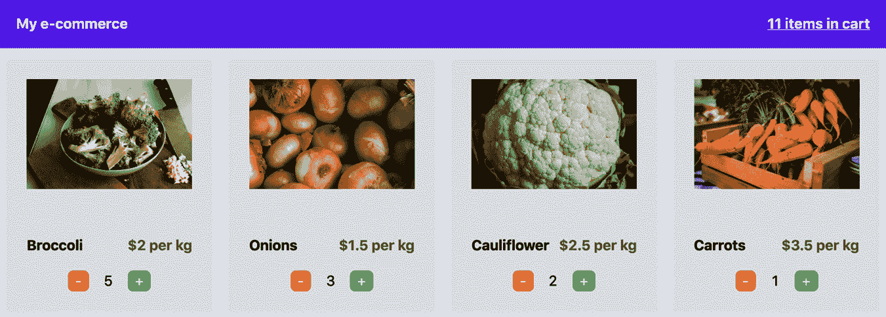

# *第五章*：在 Next.js 中管理本地和全局状态

状态管理是任何 React 应用程序（包括 Next.js 应用程序）的核心部分之一。当谈到状态时，我们指的是那些动态信息片段，使我们能够创建高度交互的**用户界面**（**UIs**），使客户的体验尽可能美丽和愉悦。

考虑到现代网站，我们可以在 UI 的许多部分中发现状态变化：从浅色主题切换到深色主题意味着我们在改变 UI 主题状态，用我们的运输信息填写电子商务表单意味着我们在改变该表单状态，甚至点击一个简单的按钮也可能潜在地改变本地状态，因为它可以使我们的 UI 以许多不同的方式反应，这取决于开发者如何决定管理那个状态更新。

尽管状态管理使我们能够在应用程序内部创建美丽的交互，但它也带来了一些额外的复杂性。许多开发者提出了非常不同的解决方案来管理它们，使我们能够以更直接和更有组织的方式管理应用程序状态。

谈到 React，特别是从库的第一个版本开始，我们就有了访问类组件的权限，其中类保持本地状态，使我们能够通过`setState`方法与之交互。随着更现代的 React 版本（>16.8.0）的引入，这个过程通过引入 React Hooks（包括`useState`钩子）得到了简化。

在 React 应用程序中管理状态的最大困难是数据流应该是单向的，这意味着我们可以将给定状态作为 prop 传递给子组件，但不能对父元素做同样的事情。这意味着本地状态管理可以因为类组件和 Hooks 而变得轻松，但全局状态管理可能会变得非常复杂。

在本章中，我们将探讨两种不同的管理全局应用程序状态的方法。首先，我们将了解如何使用 React Context API；然后，我们将使用**Redux**重写应用程序，这将让我们了解如何在客户端和服务器端初始化外部状态管理库。

我们将详细探讨以下主题：

+   本地状态管理

+   通过 Context API 管理应用程序状态

+   通过 Redux 管理应用程序状态

到本章结束时，您将了解本地状态管理和全局状态管理之间的区别。您还将学习如何使用 React 内置的 Context API 或外部库（如 Redux）来管理全局应用程序状态。

# 技术要求

要运行本章中的代码示例，您需要在您的本地计算机上安装 Node.js 和 npm。如果您愿意，可以使用在线 IDE，例如[`repl.it`](https://repl.it)或 https://codesandbox.io，因为它们都支持 Next.js，您不需要在您的计算机上安装任何依赖项。

与其他章节一样，您可以在 GitHub 上找到本章的代码库：[`github.com/PacktPublishing/Real-World-Next.js`](https://github.com/PacktPublishing/Real-World-Next.js)。

# 本地状态管理

当我们谈论本地状态管理时，我们指的是*组件作用域*的应用状态。我们可以用一个基本的`Counter`组件来概括这个概念：

```js
import React, { useState } from "react";
function Counter({ initialCount = 0 }) {
  const [count, setCount] = useState(initialCount);
  return (
    <div>
      <b>Count is: {count}</b><br />
      <button onClick={() => setCount(count + 1)}>
        Increment +
      </button>
      <button onClick={() => setCount(count - 1)}>
        Decrement -
      </button>
    </div>
  )
}
export default Counter;
```

当我们点击`Increment`按钮时，我们将`1`添加到当前的`count`值。反之，当我们点击`Decrement`按钮时，我们将从该值中减去`1`；没什么特别的！

虽然对于父组件来说，将`initialCount`值作为`Counter`元素的 prop 传递很容易，但将当前的`count`值传递给父组件可能要复杂得多。在许多情况下，我们只需要管理本地状态，React 的`useState`钩子可以是一个做这件事的绝佳方式。这些情况可能包括（但不限于）以下内容：

+   **原子组件**：如第四章中所述，*在 Next.js 中组织代码库和获取数据*，原子是我们可能遇到的最重要的 React 组件，它们很可能只管理少量本地状态。在许多情况下，更复杂的状态可以委托给**分子**或**组织体**。

+   在获取请求完成之前将`loading`状态设置为`true`，以便在 UI 上显示一个漂亮的加载指示器。

React 钩子如`useState`和`useReducer`使本地状态管理变得轻而易举，而且大多数时候，您不需要任何外部库来处理它。

当您需要维护所有组件的全局应用状态时，情况可能会有所变化。一个典型的例子可能是一个电子商务网站，一旦您将商品添加到购物车，您可能希望在导航栏内显示您购买的产品数量。

我们将在下一节中详细讨论这个特定的例子。

# 全局状态管理

当我们谈论全局应用状态时，我们指的是给定 Web 应用中所有组件之间共享的状态，因此任何组件都可以访问和修改。

如前所述，React 的数据流是单向的，这意味着组件可以向其子组件传递数据，但不能向其父组件传递（与 Vue 或 Angular 不同）。这使得我们的组件更不容易出错，更容易调试，更高效，但增加了额外的复杂性：默认情况下，不能有全局状态。

让我们看看以下场景：



图 5.1 – 产品卡片和购物车中项目之间的链接

在前一个屏幕截图所示的 Web 应用中，我们希望显示许多产品，并让我们的用户将它们放入购物车。这里最大的问题是导航栏中显示的数据与产品卡片之间没有链接，并且当用户点击某个产品的“添加”按钮时，立即更新购物车中产品数量的操作可能相当复杂。而且如果我们想在页面更改时保持这些信息呢？一旦单个卡片组件及其本地状态卸载，这些信息就会丢失。

今天，许多库使管理这些情况变得容易一些：**Redux**、**Recoil**和**MobX**只是最受欢迎的解决方案之一，但还有其他方法。实际上，随着 React Hooks 的引入，我们可以使用*Context API*来管理全局应用状态，而无需外部库。还有一个不太受欢迎的方法，我想考虑一下：使用**Apollo Client**（及其**内存缓存**）。这将改变我们看待状态的方式，并为我们提供了一个正式的查询语言，用于与全局应用数据交互。如果您对这个方法感兴趣，我强烈建议阅读官方的 Apollo GraphQL 教程：[`www.apollographql.com/docs/react/local-state/local-state-management`](https://www.apollographql.com/docs/react/local-state/local-state-management).

从下一节开始，我们将构建一个非常简单的店面，就像我们在上一幅图中看到的那样。一旦用户将一个或多个产品添加到购物车中，我们将在导航栏中更新计数。一旦用户决定进行结账，我们需要在结账页面上显示所选的产品。

## 使用 Context API

随着**React v16.3.0**的发布，该版本于 2018 年发布，我们终于可以访问稳定的 Context API。它们为我们提供了一个简单的方法，在给定上下文内的所有组件之间共享数据，而无需显式地通过 props 从一个组件传递到另一个组件，甚至是从子组件传递到父组件。如果您想了解更多关于 React Context 的信息，我强烈建议阅读官方的 React 文档：https://reactjs.org/docs/context.html.

从本节开始，我们将始终使用相同的样板代码来使用不同的库处理全局状态管理。您可以在以下位置找到此样板代码：https://github.com/PacktPublishing/Real-World-Next.js/tree/main/05-state-management-made-easy/boilerplate.

为了简化起见，我们将采用相同的方法在全局状态中存储所选产品；我们的状态将是一个 JavaScript 对象。每个属性是产品的 ID，其值将表示用户所选产品的数量。如果你打开`data/items.js`文件，你会找到一个表示我们产品的对象数组。如果用户选择了四个胡萝卜和两个洋葱，我们的状态将如下所示：

```js
{
  "8321-k532": 4,
  "9126-b921": 2
}
```

话虽如此，让我们首先为我们的购物车创建上下文。我们可以通过创建一个新的文件来实现：`components/context/cartContext.js`：

```js
import { createContext } from 'react';
const ShoppingCartContext = createContext({
  items: {},
  setItems: () => null,
});
export default ShoppingCartContext;
```

就像在典型的客户端渲染的 React 应用中一样，我们现在希望将所有需要共享购物车数据的组件都包裹在同一个上下文中。例如，`/components/Navbar.js`组件需要被挂载在`/components/ProductCard.js`组件相同的上下文中。

我们还应该考虑，当页面发生变化时，我们希望我们的全局状态保持持久，因为我们希望在结账页面上显示用户所选产品的数量。因此，我们可以自定义`/pages/_app.js`页面，如*第三章**，Next.js 基础和内置组件*所示，将整个应用程序包裹在同一个 React 上下文中：

```js
import { useState } from 'react';
import Head from 'next/head';
import CartContext from
  '../components/context/cartContext';
import Navbar from '../components/Navbar';
function MyApp({ Component, pageProps }) {
  const [items, setItems] = useState({});
  return (
    <>
      <Head>
        <link
href="https://unpkg.com/tailwindcss@²/dist/tailwind.min.css"
          rel="stylesheet"
        />
      </Head>
      <CartContext.Provider value={{ items, setItems }}>
        <Navbar />
        <div className="w-9/12 m-auto pt-10">
          <Component {...pageProps} />
        </div>
      </CartContext.Provider>
    </>
  );
}
export default MyApp;
```

正如你所见，我们在同一个上下文中包裹了`<Navbar />`和`<Component {...pageProps />`。这样，它们就能访问相同的全局状态，从而在每一页上渲染的所有组件和导航栏之间建立联系。

现在，让我们快速看一下`/pages/index.js`页面：

```js
import ProductCard from '../components/ProductCard';
import products from '../data/items';
function Home() {
  return (
    <div className="grid grid-cols-4 gap-4">
      {products.map((product) => (
        <ProductCard key={product.id} {...product} />
      ))}
    </div>
  );
}
export default Home;
```

为了简化，我们正在从本地 JavaScript 文件中导入所有产品，但当然，它们也可以来自远程 API。对于每个产品，我们渲染`ProductCard`组件，这将使用户能够将它们添加到购物车，然后进行结账。

让我们来看看`ProductCard`组件：

```js
function ProductCard({ id, name, price, picture }) {
  return (
    <div className="bg-gray-200 p-6 rounded-md">
    <div className="relative 100% h-40 m-auto">
      
    </div>
    <div className="flex justify-between mt-4">
    <div className="font-bold text-l"> {name} </div>
    <div className="font-bold text-l text-gray-500"> ${price}       per kg </div>
    </div>
    <div className="flex justify-between mt-4 w-2/4 m-auto">
      <button
      className="pl-2 pr-2 bg-red-400 text-white rounded-md"
      disabled={false /* To be implemented */}
      onClick={() => {} /* To be implemented */}>
        -
      </button>
    <div>{/* To be implemented */}</div>
      <button
      className="pl-2 pr-2 bg-green-400 text-white rounded-md"      onClick={()  => {} /* To be implemented */}>
        +
      </button>
</div>
</div>
  );
}
export default ProductCard;
```

正如你所见，我们已经在构建该组件的 UI，但在点击`increment`和`decrement`按钮时没有任何反应。现在，我们需要将该组件链接到`cartContext`上下文，并在用户点击这两个按钮之一时立即更新上下文状态：

```js
import { useContext } from 'react';
import cartContext from '../components/context/cartContext';
function ProductCard({ id, name, price, picture }) {
const { setItems, items } = useContext(cartContext);
// ...
```

使用`useContext`钩子，我们将`_app.js`页面中的`setItems`和`items`链接到我们的`ProductCard`组件。每次我们在该组件上调用`setItems`时，我们都会更新全局的`items`对象，并且这个变化将传播到所有位于相同上下文并链接到相同全局状态的组件。这也意味着我们不需要为每个`ProductCard`组件保留本地状态，因为关于单个产品添加到购物车中的数量信息已经存在于我们的上下文状态中。因此，如果我们想知道添加到购物车中的产品数量，我们可以按以下步骤进行：

```js
import { useContext } from 'react';
import cartContext from '../components/context/cartContext';
function ProductCard({ id, name, price, picture })
  const { setItems, items } = useContext(cartContext);
  const productAmount = id in items ? items[id] : 0;
// ...
```

这样，每次用户点击特定产品的`增加`按钮时，全局`items`状态将改变，`ProductCard`组件将被重新渲染，`productAmount`常量将最终具有新的值。

再次谈到处理`增加`和`减少`操作，我们需要控制用户对那些按钮的点击。我们可以编写一个通用的`handleAmount`函数，它接受一个参数，可以是`"increment"`或`"decrement"`。如果传递的参数是`"increment"`，我们需要检查当前产品是否已经存在于全局状态中（记住，初始的全局状态是一个空对象）。如果存在，我们只需要将其值增加一；否则，我们需要在`items`对象中创建一个新的属性，其键将是我们的产品 ID，其值将被设置为`1`。

如果参数是`"decrement"`，我们应该检查当前产品是否已经存在于全局`items`对象中。如果是这种情况，并且值大于`0`，我们只需减少它。在所有其他情况下，我们只需退出函数，因为我们不能将负数作为产品数量的值：

```js
import { useContext } from 'react';
import cartContext from '../components/context/cartContext';
function ProductCard({ id, name, price, picture }) {
  const { setItems, items } = useContext(cartContext);
  const productAmount = items?.[id] ?? 0;
  const handleAmount = (action) => {
    if (action === 'increment') {
      const newItemAmount = id in items ? items[id] + 1 : 1;
      setItems({ ...items, [id]: newItemAmount });
    }
    if (action === 'decrement') {
      if (items?.[id] > 0) {
        setItems({ ...items, [id]: items[id] - 1 });
      }
    }
  };
// ...
```

我们现在只需要更新`增加`和`减少`按钮，以便在点击时触发`handleAmount`函数：

```js
<div className="flex justify-between mt-4 w-2/4 m-auto">
<button
  className="pl-2 pr-2 bg-red-400 text-white rounded-md"
  disabled={productAmount === 0}
  onClick={() => handleAmount('decrement')}>
    -
</button>
  <div>{productAmount}</div>
<button
  className="pl-2 pr-2 bg-green-400 text-white rounded-md"
  onClick={() => handleAmount('increment')}>
    +
</button>
</div>
```

如果我们现在尝试增加和减少产品的数量，我们将在每次按钮点击后看到`ProductCard`组件中的数字变化！但是，当我们查看导航栏时，值将保持为`0`，因为我们还没有将全局项目状态链接到`Navbar`组件。让我们打开`/components/Navbar.js`文件并输入以下内容：

```js
import { useContext } from 'react';
import Link from 'next/link';
import cartContext from '../components/context/cartContext';
function Navbar() {
  const { items } = useContext(cartContext);
// ...
```

我们不需要从我们的导航栏更新全局`items`状态，所以在这种情况下，我们不需要声明`setItems`函数。在这个组件中，我们只想显示添加到购物车中的产品总数（例如，如果我们添加了两根胡萝卜和一颗洋葱，我们应该在“导航栏”中看到总数为`3`）。我们可以很容易地做到这一点：

```js
import { useContext } from 'react';
import Link from 'next/link';
import cartContext from '../components/context/cartContext';
function Navbar() {
  const { items } = useContext(cartContext);
  const totalItemsAmount = Object.values(items)
    .reduce((x, y) => x + y, 0);
// ...
```

现在让我们只显示`totalItemsAmount`变量在生成的 HTML 中：

```js
// ...
<div className="font-bold underline">
  <Link href="/cart" passHref>
    <a>{totalItemsAmount} items in cart</a>
  </Link>
</div>
// ...
```

太好了！我们只错过了一件事：点击“导航栏”链接到结算页面，我们看不到页面上的任何产品显示。我们可以通过修复`/pages/cart.js`页面来解决这个问题：

```js
import { useContext } from 'react';
import cartContext from '../components/context/cartContext';
import data from '../data/items';
function Cart() {
  const { items } = useContext(cartContext);
// ...
```

如您所见，我们像往常一样导入上下文对象和完整的商品列表。这是因为我们需要获取完整的商品信息（在状态中，我们只有产品 ID 和产品数量的关系）以显示产品的名称、数量和该产品的总价。然后我们需要一种方法来获取给定产品 ID 的整个商品对象。我们可以在组件外部编写一个`getFullItem`函数，它只接受一个 ID 并返回整个商品对象：

```js
import { useContext } from 'react';
import cartContext from '../components/context/cartContext';
import data from '../data/items';
function getFullItem(id) {
  const idx = data.findIndex((item) => item.id === id);
  return data[idx];
}
function Cart() {
  const { items } = useContext(cartContext);
// ...
```

现在我们已经可以访问完整的商品对象，我们可以在购物车中的所有产品内获取总价：

```js
// ...
function Cart() {
  const { items } = useContext(cartContext);
  const total = Object.keys(items)
    .map((id) => getFullItem(id).price * items[id])
    .reduce((x, y) => x + y, 0);
// ...
```

我们还希望在购物车中显示产品列表，格式为*x2 Carrots ($7)*。我们可以轻松创建一个新的数组`amounts`，并填充我们添加到购物车中的所有产品以及每个产品的数量：

```js
// ...
function Cart() {
  const { items } = useContext(cartContext);
  const total = Object.keys(items)
    .map((id) => getFullItem(id).price * items[id])
    .reduce((x, y) => x + y, 0);
  const amounts = Object.keys(items).map((id) => {
    const item = getFullItem(id);
    return { item, amount: items[id] };
  });
// ...
```

现在，我们只需要更新该组件的返回模板：

```js
// ...
<div>
<h1 className="text-xl font-bold"> Total: ${total} </h1>
<div>
  {amounts.map(({ item, amount }) => (
    <div key={item.id}>
x{amount} {item.name} (${amount * 
        item.price})
</div>
  ))}
</div>
</div>
// ...
```

完成了！在启动服务器后，我们可以将尽可能多的产品添加到购物车中，并看到总价会显示在`/cart`页面上。

在 Next.js 中使用上下文 API 并不困难，因为对于纯 React 应用，这些概念是相同的。在下一节中，我们将看到如何使用 Redux 作为全局状态管理器来实现相同的结果。

## 使用 Redux

在 2015 年，React 首次公开发布后的两年，用于处理大规模应用程序状态的框架和库并没有像今天这样多。处理单向数据流最先进的方式是 Flux，但随着时间的推移，它已经被更直接、更现代的库如**Redux**和**MobX**所取代。

特别是 Redux 对 React 社区产生了重大影响，并迅速成为构建 React 大规模应用程序的事实上的状态管理器。

在本节中，我们将使用纯 Redux（不使用如**redux-thunk**或**redux-saga**等中间件）来管理店面状态，而不是使用 React Context API。

让我们从克隆[`github.com/PacktPublishing/Real-World-Next.js/tree/main/05-managing-local-and-global-states-in-nextjs/boilerplate`](https://github.com/PacktPublishing/Real-World-Next.js/tree/main/05-managing-local-and-global-states-in-nextjs/boilerplate)的样板代码开始（就像我们在上一节中所做的那样）。

到目前为止，我们需要安装两个新的依赖项：

```js
yarn add redux react-redux
```

我们还可以安装**Redux DevTools 扩展程序**，它允许我们从浏览器中检查和调试应用程序状态：

```js
yarn add -D redux-devtools-extension
```

现在，我们可以开始编写我们的 Next.js + Redux 应用程序了。

首先，我们需要初始化全局存储，这是我们应用程序包含应用程序状态的部分。我们可以通过在项目根目录下创建一个新文件夹，命名为`redux/`来实现。在这里，我们可以编写一个新的`store.js`文件，包含初始化我们存储的客户端和服务器端逻辑：

```js
import { useMemo } from 'react';
import { createStore, applyMiddleware } from 'redux';
import { composeWithDevTools } from 'redux-devtools-extension';
let store;
const initialState = {};
// ...
```

如您所见，我们首先实例化一个新的变量`store`，它（正如您可能已经猜到的）将用于稍后保持 Redux 存储。

然后，我们初始化 Redux 存储的`initialState`。在这种情况下，它将是一个空对象，因为我们将在用户在店面选择哪个产品的基础上添加更多属性。

我们现在需要创建我们的第一个也是唯一的一个 reducer。在现实世界的应用中，我们会在许多不同的文件中编写许多不同的 reducer，这使得我们的项目在可维护性方面更加易于管理。在这种情况下，我们将只编写一个 reducer（因为我们只需要一个），并且为了简便起见，我们将将其包含在`store.js`文件中：

```js
//...
const reducer = (state = initialState, action) => {
  const itemID = action.id;
  switch (action.type) {
    case 'INCREMENT':
      const newItemAmount = itemID in state ? 
        state[itemID] + 1 : 1;
      return {
        ...state,
        [itemID]: newItemAmount,
      };
    case 'DECREMENT':
      if (state?.[itemID] > 0) {
        return {
          ...state,
          [itemID]: state[itemID] - 1,
        };
      }
      return state;
    default:
      return state;
  }
};
```

Reducer 的逻辑与我们之前在`ProductCard`组件的`handleAmount`函数中编写的逻辑并没有太大的不同。

现在我们需要初始化我们的存储，我们可以通过创建两个不同的函数来实现这一点。第一个将是一个简单的辅助函数，称为`initStore`，它将使后续操作更加简便：

```js
// ...
function initStore(preloadedState = initialState) {
  return createStore(
    reducer,
    preloadedState,
    composeWithDevTools(applyMiddleware())
  );
}
```

我们需要创建的第二个函数是我们将用于正确初始化存储的函数，我们将称之为`initializeStore`：

```js
// ...
export const initializeStore = (preloadedState) => {
  let _store = store ?? initStore(preloadedState);
  if (preloadedState && store) {
    _store = initStore({
      ...store.getState(),
      ...preloadedState,
    });
    store = undefined;
  }
  //Return '_store' when initializing Redux on the server-side
  if (typeof window === 'undefined') return _store;
  if (!store) store = _store;
  return _store;
};
```

现在我们已经设置了存储，我们可以创建最后一个函数，一个我们将要在我们的组件中使用的钩子。我们将它包裹在一个`useMemo`函数中，以利用 React 内置的 memoization 系统，这将缓存复杂的初始状态，避免在每次`useStore`函数调用时重新解析系统：

```js
// ...
export function useStore(initialState) {
  return useMemo(
    () => initializeStore(initialState), [initialState]
  );
}
```

太好了！我们现在可以继续前进，将 Redux 附加到我们的 Next.js 应用上了。

正如我们在上一节中使用 Context API 所做的那样，我们需要编辑我们的`_app.js`文件，以便 Redux 将全局可用，对于 Next.js 应用中每个居住的组件：

```js
import Head from 'next/head';
import { Provider } from 'react-redux';
import { useStore } from '../redux/store';
import Navbar from '../components/Navbar';
function MyApp({ Component, pageProps }) {
  const store = useStore(pageProps.initialReduxState);
  return (
  <>
<Head>
  <link href="https://unpkg.com/tailwindcss@²/dist/tailwind.    min.css" rel="stylesheet" />
</Head>
  <Provider store={store}>
<Navbar />
  <div className="w-9/12 m-auto pt-10">
    <Component {...pageProps} />
  </div>
  </Provider>
</>
  );
}
export default MyApp;
```

如果你将这个`_app.js`文件与我们之前创建的文件进行比较，你可能会注意到一些相似之处。从现在开始，这两个实现将看起来非常相似，因为 Context API 试图使全局状态管理对每个人来说更加可访问和容易，Redux 对这些 API 的影响是显而易见的。

我们现在需要实现`ProductCard`组件的`increment`/`decrement`逻辑，使用 Redux。让我们首先打开`components/ProductCard.js`文件，并添加以下导入：

```js
import { useDispatch, useSelector, shallowEqual } from 'react-redux';
// ...
```

现在，让我们创建一个钩子，当我们需要从我们的 Redux 存储中获取所有产品时，它会很有用：

```js
import { useDispatch, useSelector, shallowEqual } from 'react-redux';
function useGlobalItems() {
  return useSelector((state) => state, shallowEqual);
}
// ...
```

在同一文件中，让我们通过集成我们需要的 Redux Hooks 来编辑`ProductCard`组件：

```js
// ...
function ProductCard({ id, name, price, picture }) {
  const dispatch = useDispatch();
  const items = useGlobalItems();
  const productAmount = items?.[id] ?? 0;
  return (
// ...
```

最后，我们需要在用户点击我们组件的按钮之一时触发一个分发操作。多亏了我们之前导入的`useDispatch`钩子，这个操作将非常容易实现。我们只需要更新渲染函数中 HTML 按钮的`onClick`回调，如下所示：

```js
// ...
<div className="flex justify-between mt-4 w-2/4 m-auto">
  <button
    className="pl-2 pr-2 bg-red-400 text-white rounded-md"
    disabled={productAmount === 0}
    onClick={() => dispatch({ type: 'DECREMENT', id })}>
      -
  </button>
<div>{productAmount}</div>
  <button
    className="pl-2 pr-2 bg-green-400 text-white rounded-md"
    onClick={() => dispatch({ type: 'INCREMENT', id })}>
      +
  </button>
</div>
// ...
```

假设你已经为你的浏览器安装了 Redux DevTools 扩展。在这种情况下，你现在可以开始增加或减少产品，并直接在你的调试工具中看到分发的动作。

顺便说一下，我们仍然需要在添加或从购物车中移除产品时更新导航栏。我们可以通过编辑`components/NavBar.js`组件，就像我们为`ProductCard`所做的那样，轻松地做到这一点：

```js
import Link from 'next/link';
import { useSelector, shallowEqual } from 'react-redux';
function useGlobalItems() {
  return useSelector((state) => state, shallowEqual);
}
function Navbar() {
  const items = useGlobalItems();
  const totalItemsAmount = Object.keys(items)
    .map((key) => items[key])
    .reduce((x, y) => x + y, 0);
  return (
    <div className="w-full bg-purple-600 p-4 text-white">
    <div className="w-9/12 m-auto flex justify-between">
    <div className="font-bold">
      <Link href="/" passHref>
        <a> My e-commerce </a>
      </Link>
    </div>
    <div className="font-bold underline">
      <Link href="/cart" passHref>
        <a>{totalItemsAmount} items in cart</a>
      </Link>
     </div>
     </div>
     </div>
  );
}
export default Navbar;
```

我们现在可以尝试添加和删除我们的店面产品，并看到状态变化在导航栏中反映出来。

在我们考虑我们的电子商务应用程序完整之前，还有最后一件事：我们需要更新`/cart`页面，以便在进入结账步骤之前查看购物车摘要。这将非常简单，因为我们将会结合之前章节中学到的 Context API 和刚刚获得的 Redux Hooks 知识。让我们打开`pages/Cart.js`文件，并导入我们用于其他组件的相同 Redux Hook：

```js
import { useSelector, shallowEqual } from 'react-redux';
import data from '../data/items';
function useGlobalItems() {
  return useSelector((state) => state, shallowEqual);
}
// ...
```

在这一点上，我们只需复制我们在上一节为 Context API 创建的`getFullItem`函数：

```js
// ...
function getFullItem(id) {
  const idx = data.findIndex((item) => item.id === id);
  return data[idx];
}
// ...
```

对于`Cart`组件也是如此。我们将基本上复制我们在上一节所做的一切，唯一的区别是`items`对象将来自 Redux 存储而不是 React 上下文：

```js
function Cart() {
  const items = useGlobalItems();
  const total = Object.keys(items)
    .map((id) => getFullItem(id).price * items[id])
    .reduce((x, y) => x + y, 0);
  const amounts = Object.keys(items).map((id) => {
    const item = getFullItem(id);
    return { item, amount: items[id] };
  });
  return (
    <div>
      <h1 className="text-xl font-bold"> Total: ${total}  
      </h1>
    <div>
        {amounts.map(({ item, amount }) => (
          <div key={item.id}>
            x{amount} {item.name} (${amount * item.price})
    </div>
        ))}
    </div>
    </div>
  );
}
export default Cart;
```

如果您现在尝试将一些产品添加到您的购物车中，然后转到`/cart`页面，您将看到您的费用摘要。

正如您可能已经注意到的，Context API 和纯 Redux（不使用任何中间件）之间没有太多区别。顺便说一句，通过使用 Redux，您将获得一个极其庞大的生态系统，包括插件、中间件和调试工具，这将使您的开发体验在需要扩展和处理 Web 应用程序内部非常复杂业务逻辑时变得更加轻松。

# 摘要

在本章中，我们专注于使用 React 内置 API（Context API 和 Hooks）以及外部库（Redux）进行状态管理。还有许多其他工具和库用于管理应用程序的全局状态（**MobX**、**Recoil**、**XState**、**Unistore**，仅举几个例子）。您可以在 Next.js 应用程序中使用它们，通过为客户端和服务器端使用初始化它们，就像我们使用 Redux 一样。

此外，您可以使用 Apollo GraphQL 及其内存缓存来管理您的应用程序状态，从而获得一个用于修改和查询全局数据的正式查询语言。

我们现在可以创建更复杂和交互式的 Web 应用程序，使用我们想要的任何库来管理不同种类的状态。

但一旦您的数据组织得很好并且准备好使用，您就需要根据您的应用程序状态显示它并渲染您的应用程序 UI。在下一章中，您将看到如何通过配置和使用不同的 CSS 和 JavaScript 库来设置您的 Web 应用程序样式。
