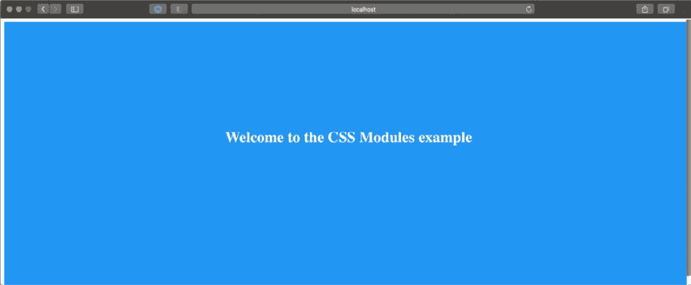
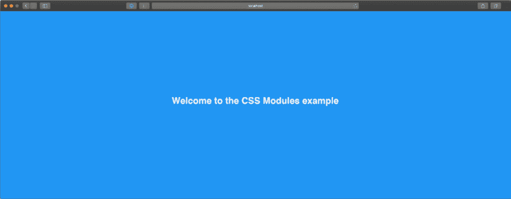

# 第六章：CSS 和内置样式方法

优秀 UI 和糟糕 UI 之间的区别是什么？有些人可能会回答“功能！”而其他人可能会说“交互速度！”但我会个人定义为优秀设计和易用性的良好结合。你的 Web 应用可能潜在地是世界上功能最强大的应用。然而，如果 UI 设计不佳且实现不当，用户很难按照预期使用它。因此，样式概念应运而生。

我们都知道 CSS 是什么：*一组基本规则，告诉浏览器如何图形化渲染 HTML 内容*。虽然这似乎是一个简单的任务，但 CSS 生态系统在近年来已经发生了很大的变化，所有帮助开发者使用模块化、轻量级和性能良好的 CSS 规则构建优秀用户界面的工具也发生了变化。

在本章中，我们将探讨编写 CSS 规则的不同方法。这将为*第七章*，“使用 UI 框架”，铺平道路，我们将使用外部 UI 框架和实用工具实现 UI，以使开发者的体验更加流畅。

注意

本章的目的不是教你如何在任何特定的技术或语言中编写 CSS 规则。相反，我们将探讨 Next.js 默认集成的编写模块化、可维护和性能良好的 CSS 样式的技术。如果你对以下任何技术感兴趣，我建议在进一步实现 UI 之前先阅读官方文档。

我们将详细探讨以下主题：

+   Styled JSX

+   CSS 模块

+   如何集成 SASS 预处理器

到本章结束时，你将了解三种不同的内置样式方法，它们之间的区别，以及如何根据你的需求进行配置。

# 技术要求

要运行本章中的代码示例，你需要在本地机器上安装 Node.js 和 npm。

如果你愿意，可以使用在线 IDE，例如[`repl.it`](https://repl.it)或[`codesandbox.io`](https://codesandbox.io)；它们都支持 Next.js，你不需要在电脑上安装任何依赖。至于其他章节，你可以在 GitHub 上找到本章的代码库：https://github.com/PacktPublishing/Real-World-Next.js。

# 探索和使用 Styled JSX

在本节中，我们将探讨 Styled JSX，这是 Next.js 默认提供的内置样式机制。

如果你不想学习新的样式语言，例如**SASS**或**LESS**，并且想在 CSS 规则中集成一些 JavaScript，那么你可能对**Styled JSX**感兴趣。它是由 Next.js 背后的公司 Vercel 创建的**CSS-in-JS**库（这意味着我们可以使用 JavaScript 来编写 CSS 属性），允许你编写作用域特定组件的 CSS 规则和类。

让我用一个简单的例子来解释这个概念。假设我们有一个`Button`组件，我们想使用 Styled JSX 来为其添加样式：

```js
export default function Button(props) {
  return (
    <>
      <button className="button">{props.children}</button>
      <style jsx>{`
        .button {
          padding: 1em;
          border-radius: 1em;
          border: none;
          background: green;
          color: white;
        }
      `}</style>
    </>
  );
}
```

正如你所见，我们使用了一个非常通用的`button`类名，这很可能会与其他使用相同类名的组件产生冲突，对吧？答案是：不会！这就是为什么 Styled JSX 如此强大的原因。它不仅允许你通过 JavaScript 编写高度动态的 CSS，而且还确保你声明的规则不会影响你正在编写的组件以外的任何组件。

因此，如果我们现在想要创建一个名为`FancyButton`的新组件，我们可以使用相同的类名，并且由于 Styled JSX，当两者都在页面上渲染时，它不会覆盖`Button`组件的样式：

```js
export default function FancyButton(props) {
  return (
    <>
      <button className="button">{props.children}</button>
      <style jsx>{`
        .button {
          padding: 2em;
          border-radius: 2em;
          background: purple;
          color: white;
          font-size: bold;
          border: pink solid 2px;
        }
      `}</style>
    </>
  );
}
```

同样的情况也发生在 HTML 选择器上。如果我们正在编写一个`Highlight`组件，我们可以简单地使用 Styled JSX 来为整个组件添加样式，甚至不需要声明一个特定的类：

```js
export default function Highlight(props) {
  return (
    <>
      <span>{props.text}</span>
      <style jsx>{`
        span {
          background: yellow;
          font-weight: bold;
        }
       `}</style>
    </>
  );
}
```

在这种情况下，我们编写的`<span>`样式只会应用于`Highlight`组件，而不会影响你页面中的任何其他`<span>`元素。

如果你想要创建一个应用于所有组件的 CSS 规则，你只需使用`global`属性，并且 Styled JSX 会将该规则应用于所有匹配你的选择器的 HTML 元素：

```js
export default function Highlight(props) {
  return (
    <>
      <span>{props.text}</span>
      <style jsx global>{`
        span {
          background: yellow;
          font-weight: bold;
        }
      `}</style>
    </>
  )
}
```

在上一个示例中，我们在我们的样式声明中添加了`global`属性，因此现在每次我们使用一个`<span>`元素时，它都会继承我们在`Highlight`组件内部声明的样式。当然，这可能会有些风险，所以请确保这是你想要的。

如果你想知道如何开始使用 Styled JSX 以及为什么我们还没有介绍这个包的安装...那是因为 Styled JSX 是内置在 Next.js 中的，所以你可以在项目初始化后立即开始使用它！

在下一个部分，我们将探讨编写 CSS 规则的一个更*经典*的方法：CSS 模块。

# CSS 模块

在上一个部分，我们看到了一个 CSS-in-JS 库，这意味着我们必须在 JavaScript 中编写我们的 CSS 定义，根据我们选择的库以及如何配置它，在运行时或编译时将这些样式规则转换为纯 CSS。

虽然我个人喜欢 CSS-in-JS 的方法，但我最终意识到，在选择新 Next.js 应用的样式方法时，它有一些显著的缺点需要考虑。

许多 CSS-in-JS 库没有提供良好的 IDE/代码编辑器支持，这使得开发者的工作变得更加困难（没有语法高亮、自动完成、代码检查等等）。此外，使用 CSS-in-JS 迫使你采用越来越多的依赖项，使得你的应用程序包更大、速度更慢。

谈到性能，这里还有一个很大的缺点：即使我们在服务器端预先生成 CSS 规则，我们仍然需要在客户端的 React hydration 之后重新生成它们。这会增加很高的运行时成本，使得网络应用程序变得越来越慢，而且当我们向我们的应用程序添加更多功能时，情况只会变得更糟。

但这里有一个出色的替代方案：CSS 模块。在前一节中，我们讨论了局部作用域的 CSS 规则以及 Styled-JSX 如何使创建具有相同名称但不同目的的 CSS 类变得容易（避免命名冲突）。CSS 模块通过编写纯 CSS 类并将它们导入 React 组件而不产生任何运行时成本，将同样的概念带到了桌面上。

让我们看看一个基本的例子：一个简单的蓝色背景和欢迎文本的着陆页。让我们先创建一个新的 Next.js 应用，然后创建`pages/index.js`文件，如下所示：

```js
import styles from '../styles/Home.module.css';
export default function Home() {
  return (
    <div className={styles.homepage}>
      <h1> Welcome to the CSS Modules example </h1>
    </div>
  );
}
```

如您所见，我们正在从以`.module.css`结尾的纯 CSS 文件中导入我们的 CSS 类。尽管`Home.module.css`是一个 CSS 文件，但 CSS 模块将其内容转换为一个 JavaScript 对象，其中每个键都是一个类名。让我们详细看看`Home.module.css`文件：

```js
.homepage {
  display: flex;
  justify-content: center;
  align-items: center;
  width: 100%;
  min-height: 100vh;
  background-color: #2196f3;
}
.title {
  color: #f5f5f5;
}
```

运行后，这里是结果：



图 6.1 – 使用 CSS 模块设计的首页

如前所述，这些类是组件作用域的。如果您检查生成的 HTML 页面，您的着陆页将包含一个看起来像这样的`div`类：

```js
<div class="Home_homepage__14e3j">
  <h1 class="Home_title__3DjR7">
    Welcome to the CSS Modules example
  </h1>
</div>
```

如您所见，CSS 模块为我们的规则生成了唯一的类名。即使我们现在在其他 CSS 文件中使用相同的通用`title`和`homepage`名称创建新类，由于这种策略，也不会有任何命名冲突。

但可能存在我们希望我们的规则是全局的情况。例如，如果我们尝试渲染我们刚刚创建的首页，我们会注意到字体仍然是默认的。还有默认的`body`边距，我们可能想要覆盖这些默认设置。我们可以通过创建一个包含以下内容的新的`styles/globals.css`文件来快速解决这个问题：

```js
html,
body {
  padding: 0;
  margin: 0;
  font-family: sans-serif;
}
```

然后，我们可以将其导入到我们的`pages/_app.js`文件中：

```js
import '../styles/globals.css';
function MyApp({ Component, pageProps }) {
  return <Component {...pageProps} />;
}
export default MyApp;
```

如果我们现在尝试渲染首页，我们会看到默认的`body`边距已经消失，现在字体是 sans-serif 类型的：



图 6.2 – 使用全局 CSS 模块样式设计的首页

我们还可以使用`:global`关键字来创建全局可用的 CSS 规则，例如：

```js
.button :global {
  padding: 5px;
  background-color: blue;
  color: white;
  border: none;
  border-radius: 5px;
}
```

此外，还有一个我想要您在测试这种样式方法时考虑的出色的 CSS 模块功能：**选择器组合**。

事实上，您可以通过创建一个非常通用的规则，然后使用`composes`属性来覆盖其中的一些属性：

```js
.button-default {
  padding: 5px;
  border: none;
  border-radius: 5px;
  background-color: grey;
  color: black;
}
.button-success {
  composes: button-default;
  background-color: green;
  color: white;
}
.button-danger {
  composes: button-default;
  background-color: red;
  color: white;
}
```

CSS 模块的主要思想是提供一个简单直接的方式来编写模块化的 CSS 类，在每种语言中都具有零运行时成本。多亏了**PostCSS 模块**([`github.com/madyankin/postcss-modules`](https://github.com/madyankin/postcss-modules))，您几乎可以在任何语言（PHP、Ruby、Java 等）和模板引擎（Pug、Mustache、EJS 等）中使用 CSS 模块。

我们只是触及了 CSS 模块的表面以及为什么它们是编写模块化、轻量级、无运行时成本的类的优秀解决方案。如果你想了解更多关于 CSS 模块规范的信息，你可以查看官方仓库：[`github.com/css-modules/css-modules`](https://github.com/css-modules/css-modules)。

就像 Styled JSX 一样，CSS 模块在每次 Next.js 安装中都是现成的，所以一旦你启动了你的项目，你就可以立即开始使用它们。尽管如此，你可能需要调整默认配置来添加、删除或编辑一些功能，而 Next.js 也使得这一步骤变得简单。

事实上，Next.js 使用**PostCSS**编译 CSS 模块，这是一个在构建时编译 CSS 的流行工具。

默认情况下，Next.js 已经配置了以下功能：

+   *Autoprefixer*：它使用`::placeholder`选择器的值为你添加供应商前缀到 CSS 规则中，它将编译它以使其与所有选择器略有不同的浏览器兼容，例如`:-ms-input-placeholder`、`::-moz-placeholder`等等。你可以了解更多关于这个功能的信息：[`github.com/postcss/autoprefixer`](https://github.com/postcss/autoprefixer)。

+   *跨浏览器 flexbox 错误修复*：PostCSS 遵循社区维护的 flexbox 问题列表（可以在[`github.com/philipwalton/flexbugs`](https://github.com/philipwalton/flexbugs)找到），并为使其在所有浏览器上正确工作添加了一些解决方案。

+   *IE11 兼容性*：PostCSS 编译新的 CSS 功能，使其在旧浏览器（如 IE11）上可用。然而，有一个例外：CSS 变量不会被编译，因为这并不安全。如果你真的需要支持旧浏览器并且还想使用它们，你可以跳到下一节（*将 SASS 与 Next.js 集成*）并使用 SASS/SCSS 变量。

我们可以通过在项目根目录中创建一个`postcss.config.json`文件来编辑 PostCSS 的默认配置，然后添加默认的 Next.js 配置：

```js
{
  "plugins": [
    "postcss-flexbugs-fixes",
    [
      "postcss-preset-env",
      {
        "autoprefixer": {
          "flexbox": "no-2009"
        },
        "stage": 3,
        "features": {
          "custom-properties": false
        }
      }
    ]
  ]
}
```

从这个点开始，我们可以根据喜好编辑配置，添加、删除或更改任何属性。

在下一节中，我们将看到如何集成另一个流行的 CSS 预处理器：**Sass**。

# 将 SASS 与 Next.js 集成

SASS 可能是最受欢迎和使用的 CSS 预处理器之一，Next.js 也做得很好，使得它能够轻松地与之集成。事实上，就像 CSS 模块和 Styled JSX 一样，SASS 也是现成的；我们只需在我们的 Next.js 项目中安装`sass npm`包，就可以开始了：

```js
yarn add sass
```

到目前为止，你可以开始使用 CSS 模块和 SASS/SCSS 语法，就像我们在上一节中做的那样。

让我们来看一个简单的例子。如果我们打开上一节中的`pages/index.js`文件，我们只需将 CSS 导入更改如下：

```js
import styles from '../styles/Home.module.scss';
export default function Home() {
  return (
    <div className={styles.homepage}>
      <h1> Welcome to the CSS Modules example </h1>
    </div>
  );
}
```

现在，我们需要将我们的`styles/Home.module.css`文件重命名为`styles/Home.module.scss`，然后我们就可以使用 Sass（或 SCSS）特定的语法编辑该文件了。

多亏了 SASS 和 SCSS 语法，我们可以利用一组丰富的功能，使我们的代码更加模块化且易于维护。

注意名称！

SASS 和 SCSS 是同一 CSS 预处理器（预处理器）的两种不同语法。然而，它们都提供了增强的 CSS 样式编写方式，例如`for`变量、循环、混入以及许多其他功能。

虽然名称可能看起来很相似，最终目的也相同，但主要区别在于 SCSS（Sassy CSS）通过添加每个`.scss`文件中可用的那些功能来扩展 CSS 语法。任何标准的`.css`文件都可以无任何问题重命名为`.scss`，因为 CSS 语法在`.scss`文件中是有效的。

SASS 是一种较旧的语法，与标准 CSS 不兼容。它不使用花括号或分号；它只使用缩进和换行来分隔属性和嵌套选择器。

这两种语法都需要被转换成纯 CSS，以便在常规网页浏览器中使用。

让我们以 CSS 模块的`compose`属性为例。我们之前已经看到如何创建新的 CSS 类，它扩展了现有的一个：

```js
.button-default {
  padding: 5px;
  border: none;
  border-radius: 5px;
  background-color: grey;
  color: black;
}
.button-success {
  composes: button-default;
  background-color: green;
  color: white;
}
.button-danger {
  composes: button-default;
  background-color: red;
  color: white;
}
```

使用 SCSS，我们可以选择多种不同的方法，例如使用`@extend`关键字（它的工作方式与 CSS 模块中的`compose`关键字类似）：

```js
.button-default {
  padding: 5px;
  border: none;
  border-radius: 5px;
  background-color: grey;
  color: black;
}
.button-success {
  @extend .button-default;
  background-color: green;
  color: white;
}
.button-danger {
  @extend .button-default;
  background-color: red;
  color: white;
}
```

或者，我们可以稍微改变一下类名，并利用**选择器嵌套**功能：

```js
.button {
  padding: 5px;
  border: none;
  border-radius: 5px;
  background-color: grey;
  color: black;
  &.success {
    background-color: green;
    color: white;
  }
  &.danger {
    background-color: red;
    color: white;
  }
}
```

SCSS 附带了一组丰富的功能，例如循环、混入、函数等，使得任何开发者都能轻松编写复杂的 UI。

尽管 Next.js 原生集成了它，但你可能仍然需要启用或禁用某些特定功能或编辑默认的 SASS 配置。

你可以通过编辑`next.config.js`配置文件轻松做到这一点：

```js
module.exports = {
  sassOptions: {
    outputStyle: 'compressed'
    // ...add any SASS configuration here
  },
}
```

如果你想要了解更多关于 SASS 和 SCSS 的信息，我强烈建议查看官方文档[`sass-lang.com`](https://sass-lang.com)。

# 摘要

近年来，CSS 生态系统已经发生了很大的变化，Next.js 团队不断更新框架，以提供最现代、性能最佳和模块化的 CSS 样式编写解决方案。

在本章中，我们探讨了三种不同的内置解决方案，当然，与其它方案相比，任何一种方案都有一些权衡。

例如，Styled JSX 确实是编写 CSS 规则最容易的方法之一。你可以与 JavaScript 交互，根据用户操作动态更改一些 CSS 规则和属性，等等，但它也有一些显著的缺点。像大多数 CSS-in-JS 库一样，Styled JSX 首先在服务器端渲染，但在 React 活化后立即在客户端重新渲染整个生成的 CSS。这会给你的应用程序增加一些运行时成本，使应用程序的性能降低，并且更难以扩展。此外，它使得浏览器无法缓存你的 CSS 规则，因为它们在服务器端和客户端渲染的每个请求中都会被重新生成。

SASS 和 SCSS 语法与 Next.js 集成得很好，并且它们为你提供了大量的功能，用于以零运行时成本编写复杂的 UI。实际上，Next.js 会在构建时将所有的 `.scss` 和 `.sass` 文件编译成纯 CSS，使得浏览器能够缓存所有的样式规则。然而，我们应该考虑的是，我们无法在最终构建阶段看到生产优化的纯 CSS 输出。与 CSS 模块不同，我们在最终生产包中得到的确实非常接近我们编写的代码，SASS 提供的庞大功能集可能会生成一个巨大的最终 CSS 文件，并且在编写深层嵌套规则、循环等时，预测编译器的输出并不总是容易。

最终，CSS 模块和 PostCSS 似乎是为编写现代 CSS 样式提供了一个极好的选择。生成的输出更容易预测，并且 PostCSS 会自动为旧浏览器（甚至到 IE11）填充现代 CSS 功能。

在下一章中，我们将看到如何集成外部 UI 库，这将使编写样式丰富和功能齐全的组件和 UI 更加容易。
