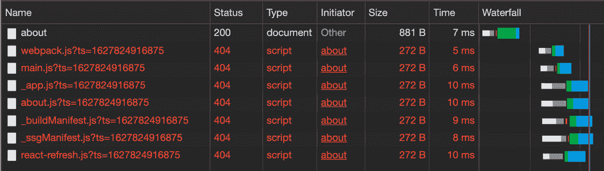

# *第八章*：使用自定义服务器

Next.js 是一个非常强大的框架。在这本书的前七章中，我们已经能够创建一些不错的服务器端渲染 Web 应用程序，而无需真正关心调整和自定义 Web 服务器。当然，在现实生活中，我们讨论在 Express.js 或 Fastify 服务器中实现 Next.js 应用程序的机会很少，但了解如何这样做在很多情况下可能很有用。

以我自己的经验来说，在过去几年里，我使用 Next.js 创建了数十个大规模 Web 应用程序，我很少需要使用自定义服务器。然而，在某些情况下，这是不可避免的。

我们将详细探讨以下主题：

+   当我们可能需要使用“自定义服务器”时，它的含义是什么，以及有哪些选项。

+   如何一起使用 Express.js 和 Next.js

+   如何一起使用 Fastify 和 Next.js

+   部署自定义服务器有哪些要求？

到本章结束时，你将能够确定何时使用自定义服务器，它的优缺点是什么，以及它可以解决什么问题。

# 技术要求

要运行本章中的代码示例，你需要在本地机器上安装 Node.js 和 `npm`。

如果你愿意，你可以使用在线 IDE，例如 [`repl.it`](https://repl.it) 或 [`codesandbox.io`](https://codesandbox.io)；它们都支持 Next.js，你不需要在电脑上安装任何依赖。与其他章节一样，你可以在 GitHub 上找到本章的代码库：https://github.com/PacktPublishing/Real-World-Next.js。

# 关于使用自定义服务器

正如我们已经看到的，Next.js 随带自己的服务器，因此我们不需要配置自定义服务器就可以开始使用这个框架编写 Web 应用程序。然而，在某些情况下，我们可能希望从自定义 Web 服务器（如 Express.js 或 Fastify）中提供服务 Next.js 应用程序，框架通过公开一些简单的 API 来实现这一点，我们将在下一刻探讨。但在查看实现之前，让我们回答一个重要的问题：*我们真的需要自定义服务器吗？*

简短的回答是，大多数时候，*不需要*。Next.js 是一个如此完整的框架，我们很少需要通过 Express.js、Fastify 或其他任何服务器端框架来定制服务器端逻辑。但有时，这是不可避免的，因为它可以解决特定的问题。

自定义服务器的常见用例如下：

+   **将 Next.js 集成到现有服务器中**：假设你正在重构一个现有的 Web 应用程序以采用 Next.js；你可能希望尽可能多地保留服务器端逻辑，包括你的中间件和路由。在这种情况下，你可以通过选择你的网站哪些页面将由框架提供服务，哪些页面将由其他方式渲染来逐步添加 Next.js。

+   **多租户模式**：尽管 Next.js 支持根据当前主机名支持多个域名和条件渲染（如果你对原生解决方案感兴趣，请查看 [`github.com/leerob/nextjs-multiple-domains`](https://github.com/leerob/nextjs-multiple-domains)），但在某些情况下，你可能需要更多的控制权以及一个简化的工作流程来处理多达数千个不同的域名。如果你对 Next.js 的 Express.js/Fastify 多租户中间件感兴趣，可以查看 [`github.com/micheleriva/krabs`](https://github.com/micheleriva/krabs)。

+   **你想要更多的控制权**：尽管 Next.js 为创建强大和完整的用户体验提供了所需的一切，但在某些情况下，如果你的应用程序正在变得更加复杂，你想要使用不同的方法来组织后端代码，例如采用 MVC 哲学，其中 Next.js 只是过程中的“视图”部分。

虽然自定义服务器可以解决一些问题，但它也有一些缺点。例如，你不能将自定义服务器部署到由 Next.js 作者创建的 Vercel 平台，该平台高度优化了框架。此外，你将需要编写和维护更多的代码，如果你在一个侧项目中工作，在一个小团队中，或者在一个小公司中，这可能会是一个重大的缺点。

在下一节中，我们将看到如何使用 Node.js 最受欢迎的 Web 框架之一 Express.js 为 Next.js 编写自定义服务器。

# 使用自定义 Express.js 服务器

编写用于渲染 Next.js 页面的自定义 Express.js 服务器比你想象的要简单。让我们创建一个新的项目并安装以下依赖项：

```js
yarn add express react react-dom next
```

一旦我们安装了这四个包，我们就可以开始编写自定义的 Express.js 服务器。让我们在项目根目录下创建一个 `index.js` 文件，并首先导入所需的依赖项：

```js
const { parse } = require('url');
const express = require('express');
const next = require('next');
```

我们现在需要实例化 Next.js 应用程序，我们可以在导入语句之后添加以下代码来完成此操作：

```js
const dev = process.env.NODE_ENV !== 'production';
const app = next({ dev });
```

让我们通过编写 `main` 函数来完成我们的服务器，该函数将每个传入的 `GET` 请求传递给 Next.js 进行服务器端渲染：

```js
async function main() {
  try {
    await app.prepare();
    const handle = app.getRequestHandler();
    const server = express();
    server
      .get('*', (req, res) => {
        const url = parse(req.url, true);
        handle(req, res, url);
      })
      .listen(3000, () => console.log('server ready'));
  } catch (err) {
    console.log(err.stack);
  }
}
main();
```

让我们关注 `main` 函数的主体，看看发生了什么。

首先，我们等待 Next.js 应用程序准备好进行渲染。然后，我们创建一个 `handle` 常量，该常量将代表 Next.js 处理传入的请求。然后，我们创建 Express.js 服务器，并要求它使用 Next.js 请求处理程序处理所有 `GET` 请求。

我们现在可以通过创建一个新的 `pages/` 目录和一个 `pages/index.js` 文件来创建一个主页，该文件包含以下内容：

```js
export default function Homepage() {
  return <div> Homepage </div>;
}
```

如果我们尝试运行 `node index.js`，然后访问 `http://localhost:3000`，我们将在屏幕上看到 **主页** 文本。我们做到了！

我们还可以通过创建一个包含以下内容的 `pages/greet/[user].js` 文件来测试动态路由：

```js
export function getServerSideProps(req) {
  return {
    props: {
      user: req.params.user,
    },
  };
}
export default function GreetUser({ user }) {
  return (
    <div>
      <h1>Hello {user}!</h1>
    </div>
  );
}
```

访问 `http://localhost:3000/greet/Mitch`，我们将在屏幕上看到一个友好的 **Hello Mitch!** 消息。正如你所见，实现动态路由非常简单！

从这个点开始，我们可以继续像以前一样工作在 Next.js 上。与上一章相比，没有太多区别，但如果我们没有充分利用自定义服务器的全部潜力，那么拥有一个自定义服务器有什么意义呢？

我们已经看到，当我们将现有的 Web 应用程序逐步迁移到 Next.js 时，自定义服务器可能非常有帮助。

通过如下重构服务器来添加一些更多功能：

```js
    server
      .get('/', (req, res) => {
        res.send('Hello World!');
      })
      .get('/api/greet', (req, res) => {
        res.json({ name: req.query?.name ?? 'unknown' });
      })
      .listen(3000, () => console.log('server ready'));
```

正如你所见，我们现在并没有用 Next.js 服务任何页面。所以，我们只是提供了一个主页，并在 `/api/greet` 提供了一个假 API。

现在，我们想要创建一个新的 `/about` 页面并使用 Next.js 来提供服务。但首先，我们需要在 `/pages/about` 路径下创建一个由 Next.js 驱动的页面：

```js
export default function About() {
  return <div> This about page is served from Next.js </div>;
}
```

现在，我们可以回到我们的 `index.js` 文件并编辑 `main` 函数，如下所示：

```js
server
  .get('/', (req, res) => {
    res.send('Hello World!');
  })
  .get('/about', (req, res) => {
    const { query } = parse(req.url, true);
    app.render(req, res, '/about', query);
  })
  .get('/api/greet', (req, res) => {
    res.json({ name: req.query?.name ?? 'unknown' });
  })
  .listen(3000, () => console.log('server ready'));
```

我们现在使用一个不同的函数来渲染 Next.js 页面：`app.render`。

此函数接受以下参数：Express.js 的 `request` 和 `response`、要渲染的页面以及解析后的查询字符串。

但当我们启动服务器并访问 `http://localhost:3000/about` 时，我们会注意到一个空白页面。如果我们检查此页面的网络调用，我们会看到以下情况：



图 8.1 – Next.js 脚本未找到

这里发生了什么？Next.js 正确渲染了页面，正如你可以通过检查 HTML 输出所知，但页面完全是白色的！

我们忘记告诉 Express.js，每个以 `_next/` 开头的静态资源都需要由 Next.js 本身处理。这是因为所有这些静态资源（通常是 JavaScript 文件）都负责将 React 导入浏览器，处理水合，以及管理所有 Next.js 前端特定功能。

我们可以通过添加以下路由来快速修复这个问题：

```js
// ...
await app.prepare();
const handle = app.getRequestHandler();
const server = express();
server
  .get('/', (req, res) => {
    res.send('Hello World!');
  })
  .get('/about', (req, res) => {
    const { query } = parse(req.url, true);
    app.render(req, res, '/about', query);
  })
  .get('/api/greet', (req, res) => {
    res.json({ name: req.query?.name ?? 'unknown' });
  })
  .get(/_next\/.+/, (req, res) => {
    const parsedUrl = parse(req.url, true);
    handle(req, res, parsedUrl);
  })
  .listen(3000, () => console.log('server ready'));
```

由于我们无法预测 Next.js 静态资源名称，我们将使用一个正则表达式 (`/_next\/.+/`) 匹配所有以 `_next/` 开头的文件。然后我们使用 Next.js 的 handle 方法来服务这些文件。

我们现在可以启动我们的服务器并看到它按预期工作。

正如我们之前所看到的，从现在开始，开发 Next.js 页面的开发者体验将保持不变。我们仍然可以访问 `_app.js` 和 `_document.js` 文件，我们仍然可以使用内置的 `Link` 组件，等等。

在下一节中，我们将了解如何将 Next.js 与另一个非常流行的 Node.js 网络框架 Fastify 集成。

# 使用自定义 Fastify 服务器

Fastify 是一个出色的 Node.js 网络框架。正如其名称所暗示的，与其他网络框架（如 Express.js、Koa 和 Hapi）相比，它非常吸引人，因为它确实非常快。如果您想了解更多关于其性能的信息，您可以在以下存储库中找到官方基准测试：[`github.com/fastify/benchmarks`](https://github.com/fastify/benchmarks)。

这个网络框架是由一些 Node.js 的核心开发者开发和维护的，例如 Matteo Collina（Node.js 技术指导委员会成员）。因此，正如您所想象的，Fastify 背后的团队完美地了解运行时的工作原理，并使框架尽可能优化。

但 Fastify 不仅仅关于性能：它还强制执行优秀的设计最佳实践，以尽可能保持开发者的体验。它还有一个强大的插件系统，允许每个人轻松编写自己的插件或中间件。如果您还没有这样做，我强烈建议您在 https://github.com/fastify/fastify 上查看。

Fastify 提供了一个官方插件来管理 Next.js 渲染的路由：`fastify-nextjs`。您可以在以下位置找到其源代码：https://github.com/fastify/fastify-nextjs。

让我们创建一个新的空项目，并安装以下依赖项以查看其效果：

```js
yarn add react react-dom fastify fastify-nextjs next
```

我们现在可以创建与过去章节中相同的三个页面。

在 `/pages/index.js` 下实现一个简单的首页如下：

```js
export default function Homepage() {
  return <div> Homepage </div>;
}
```

在 `/pages/about.js` 下实现一个“关于”页面如下：

```js
export default function About() {
  return <div> This about page is served from Next.js </div>;
}
```

最后，一个用于在 `/pages/greet/[user].js` 下问候用户的动态页面可以按以下方式实现：

```js
export function getServerSideProps(req) {
  return {
    props: {
      user: req.params.user,
    },
  };
}
export default function GreetUser({ user }) {
  return (
    <div>
      <h1>Hello {user}!</h1>
    </div>
  );
}
```

我们现在可以编写我们的 Fastify 服务器了，与 Express.js 相比，这将非常简单。让我们在项目的根目录下创建一个 `index.js` 文件，并添加以下内容：

```js
const fastify = require('fastify')();
fastify
  .register(require('fastify-nextjs'))
  .after(() => {
    fastify.next('/');
    fastify.next('/about');
    fastify.next('/greet/:user');
  });
fastify.listen(3000, () => {
  console.log('Server listening on http://localhost:3000');
});
```

启动服务器后，我们将能够渲染我们在 `index.js` 文件中指定的所有页面！如您所注意到的，这种实现甚至比 Express.js 更简单。我们只需调用 `fastify.next` 函数来渲染一个 Next.js 页面，而且我们甚至不需要担心 Next.js 的静态资源；Fastify 会代表我们处理它们。

从这一点开始，我们可以开始编写不同的路由，提供不同的内容，例如 JSON 响应、HTML 页面和静态文件：

```js
fastify.register(require('fastify-nextjs')).after(() => {
  fastify.next('/');
  fastify.next('/about');
  fastify.next('/greet/:user');
  fastify.get('/contacts', (req, reply) => {
    reply
      .type('html')
      .send('<h1>Contacts page</h1>');
  });
});
```

如您所见，将 Next.js 与 Fastify 集成非常简单。从这一点开始，就像与 Express.js 一样，我们可以做任何我们想做的事情，就像我们正在编写一个普通的 Next.js 网络应用程序。

我们可以创建 `_app.js` 和 `_document.js` 文件来定制 Next.js 页面的行为，集成任何 UI 库，并执行我们在前面章节中看到的所有事情。

# 摘要

在本章中，我们看到了如何将 Next.js 与 Node.js 最受欢迎的两个网络框架集成：Express.js 和 Fastify。Next.js 与其他网络框架集成也是可能的，其实现方式与前面章节中看到的不同。

在使用任何类型的自定义服务器时（无论是 Express.js、Fastify 还是任何其他框架），需要考虑的一点是我们不能将其部署到某些提供商，例如 Vercel 或 Netlify。

从技术上来说，许多提供商（Vercel、Netlify、Cloudflare 等等）提供了一种很好的方式来服务由 Node.js 驱动的应用程序：无服务器函数。然而，由于这是一个相当高级的话题，我们将在*第十一章*，“不同的部署平台”中深入讨论它。

正如我们将在*第十一章*，“不同的部署平台”中看到的那样，Next.js 是一个高度优化以在 Vercel 上运行的框架，这是框架背后的公司提供的基础设施。使用自定义服务器，我们将失去部署到这个基础设施的能力，这使得事情变得稍微不那么优化和集成。

仍然，还有其他一些很棒的选择，例如 DigitalOcean、Heroku、AWS 和 Azure。从这一点来看，我们可以在所有支持 Node.js 环境的这些服务上部署我们的自定义 Next.js 服务器。

从*第十一章*，“不同的部署平台”开始，我们将更深入地讨论 Next.js 的部署。但到目前为止，我们只想集中讨论其功能和集成。

具体谈到其集成，一旦我们为我们的 Next.js 应用程序编写了一个页面、一些中间件或一个组件，我们希望在将其部署到生产环境之前测试它是否正常工作。在下一章中，我们将讨论使用两个最常用的测试库来实现单元和端到端测试：Jest 和 Cypress。
