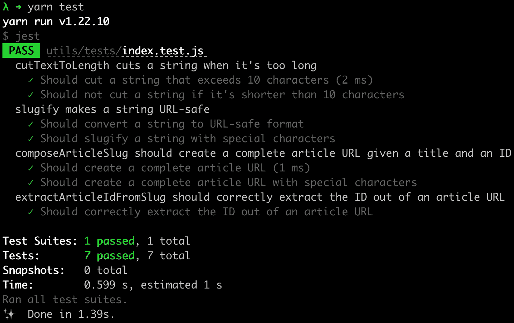
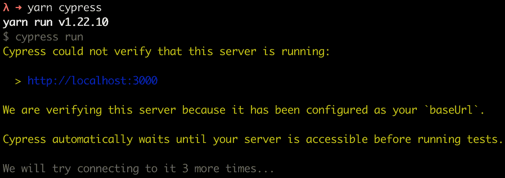

# *第九章*: 测试 Next.js

测试是整个开发工作流程的重要组成部分。它使您更有信心，您不会将错误引入代码，也不会破坏任何现有功能。

专门测试 Next.js 与测试任何其他 React 应用程序或 Express.js、Fastify 或 Koa 应用程序并无不同。实际上，我们可以将测试阶段分为三个不同的阶段：

+   单元测试

+   端到端测试

+   集成测试

我们将在本章的各个部分中详细探讨这些概念。

如果您已经具备编写 React 应用程序的先前经验，您很可能会将您的知识重新用于测试基于 Next.js 的网站。

在本章中，我们将详细探讨以下内容：

+   测试和测试框架简介

+   设置测试环境

+   如何使用一些最受欢迎的测试运行器、框架和实用库

到本章结束时，您将能够使用测试运行器和测试库设置测试环境，并在将代码发送到生产之前运行测试。

# 技术要求

要运行本章中的代码示例，您需要在您的本地机器上安装 Node.js 和 npm。

如果您愿意，可以使用在线 IDE，例如 https://repl.it 或 https://codesandbox.io；它们都支持 Next.js，并且您不需要在您的计算机上安装任何依赖项。与其他章节一样，您可以在 GitHub 上找到本章的代码库：[`github.com/PacktPublishing/Real-World-Next.js`](https://github.com/PacktPublishing/Real-World-Next.js)。

# 测试简介

正如本章引言中所见，测试是任何开发工作流程的重要组成部分，可以分为三个独立的测试阶段：

+   *单元测试*：这些测试旨在确保您的代码中的每个函数都在正常工作。它们通过针对正确和错误的输入单独测试代码库中的函数，断言其结果和可能的错误，以确保它们按预期工作。

+   *端到端测试*：这种测试策略重现了用户与应用程序的典型交互，确保在给定动作发生时，应用程序会以特定的输出响应，就像我们在浏览器上手动测试网站一样。例如，如果我们构建了一个表单，我们希望自动确保它能够正确工作，验证输入，并在表单提交时执行特定的操作。此外，我们还想通过使用特定的 CSS 类、挂载某些 HTML 元素等方式来测试用户界面是否按预期渲染。

+   *集成测试*：在这种情况下，我们想要确保我们应用程序的各个部分，如函数和模块，能够协同工作。例如，我们想要断言组合两个函数会产生特定的输出，等等。与单元测试不同，在单元测试中我们单独测试我们的函数，而在集成测试中，我们确保当给定不同的输入集时，整个聚合函数和模块组能够产生正确的输出。

可能还有其他测试阶段和哲学，但在接下来的章节中，我们将专注于我们在这里提到的那些，因为它们是测试工作流程的基本部分，我强烈建议你在将代码部署到生产环境时采用所有这些阶段。

如本章引言所述，测试 Next.js 与测试 React 应用程序或 **Express.js/Fastify/Koa** 网络服务器没有区别。我们需要选择合适的测试运行器和库，并确保我们的代码按预期工作。

当谈到测试运行器时，我们指的是负责执行代码库中找到的每个测试、收集覆盖率并在控制台显示测试结果的工具。如果测试运行器进程失败（并以非零退出代码退出），则认为测试失败。

Node.js 和 JavaScript 生态系统为测试运行器提供了大量的选择，但从下一节开始，我们将专注于两个最受欢迎的替代方案：**Jest**（用于单元和集成测试）和**Cypress**（用于**e2e**，即**端到端**测试）。

# 运行单元和集成测试

在本节中，我们将使用 JavaScript 生态系统中最受欢迎的测试运行器之一：Jest，编写一些集成和单元测试。

在安装所有需要的依赖项之前，克隆以下存储库，它已经包含了一个小型网络应用程序，我们将用它作为编写测试的示例：[`github.com/PacktPublishing/Real-World-Next.js/tree/main/09-testing-nextjs/boilerplate`](https://github.com/PacktPublishing/Real-World-Next.js/tree/main/09-testing-nextjs/boilerplate)。

这是一个具有以下功能的简单网站：

+   两个页面：一个包含我们博客中所有文章的主页和一个单独的文章页面。

+   文章页面 URL 实现了以下格式：`<article_slug>-<article-id>`。

+   有一些实用函数用于创建页面的 URL、从文章 URL 中检索文章 ID 等。

+   两个 REST API：一个用于获取所有文章，另一个用于根据 ID 获取特定文章。

现在，让我们进入我们克隆的项目，并安装以下依赖项：

```js
yarn add -D jest
```

Jest 是我们测试所需的唯一依赖项，因为它既充当测试框架，也充当测试运行器。它提供了一套广泛的功能，将使我们的开发（和测试）体验变得愉快。

由于我们正在使用 ESNext 特性编写函数和组件，我们希望告诉 Jest 使用默认的 Next.js babel 预设来正确转换这些模块。我们可以在项目的根目录中创建一个 `.babelrc` 文件，并添加以下内容：

```js
{
  "presets": ["next/babel"]
}
```

`next/babel` 预设是 Next.js 预先安装的，所以我们不需要安装任何东西，我们已经准备好开始使用了。

我们可以开始使用它而无需任何其他配置，因为它已经预先配置为运行所有以 `.test.js` 或 `.spec.js` 结尾的文件。

尽管如此，关于如何编写和放置这些文件的方法有很多种。例如，有些人喜欢将测试文件放在源文件附近，而有些人则喜欢将所有测试放在 `tests/` 目录中。当然，这些方法都没有错：这取决于你的喜好。

在编写 Next.js 页面测试时请注意

Next.js 将放置在 `pages/` 目录内的所有 `.js`、`.jsx`、`.ts` 和 `.tsx` 文件作为应用程序页面提供服务。因此，*你不应该在那个目录中放置任何测试文件*，否则 Next.js 将尝试将其渲染为应用程序页面。我们将在下一节中编写端到端测试时看到如何测试 Next.js 页面。

让我们编写我们的第一个测试，从代码库中最简单的一部分开始：实用函数。我们可以创建一个新文件，`utils/tests/index.test.js`，并首先导入我们可以在 `utils/index.js` 文件中找到的所有函数：

```js
import { 
  trimTextToLength, 
  slugify, 
  composeArticleSlug, 
  extractArticleIdFromSlug
} from '../index';
```

我们现在可以编写 `trimTextToLength` 函数的第一个测试。这个函数接受两个参数：一个字符串和我们将要切割的长度，并在其末尾添加省略号。我们使用这个函数来展示文章内容的预览，以诱使读者阅读整篇文章。

例如，假设我们有一个以下字符串：

```js
const str = "The quick brown fox jumps over the lazy dog";
```

如果我们将 `trimTextToLength` 应用到它上面，我们应该看到以下输出：

```js
const str = "The quick brown fox jumps over the lazy dog";
const cut = trimTextToLength(str, 5);
cut === "The q..." // true
```

我们可以将前面的函数描述翻译成以下代码：

```js
describe("trimTextToLength", () => {
test('Should cut a string that exceeds 10 characters', () => {
    const initialString = 'This is a 34 character long 
     string';
    const cutResult = trimTextToLength(initialString, 10);
    expect(cutResult).toEqual('This is a ...');
  });
});
```

如您所见，我们正在使用 Jest 的内置函数，例如 `describe`、`test` 和 `expect`。它们各自都有其特定的功能，我们可以总结如下：

+   `describe`: 创建一个相关测试的组。例如，我们应该在该函数内部包含与相同函数或模块相关的测试。

+   `test`: 声明一个测试并运行它。

+   `expect`: 这是我们将用于将我们的函数输出与固定数量的结果进行比较的函数。

正如我们所见，我们可以在 `describe` 组中添加多个测试，以便我们可以针对多个值测试我们的函数：

```js
describe("trimTextToLength cuts a string when it's too long, () => {
  test('Should cut a string that exceeds 10 characters', () 
    => {
    const initialString = 'This is a 35 characters long 
     string';
    const cutResult = trimTextToLength(initialString, 10);
    expect(cutResult).toEqual('This is a ...');
  });
test("Should not cut a string if it's shorter than 10 
  characters",
    () => {
        const initialString = '7 chars';
const cutResult = trimTextToLength(initialString, 
         10);
        expect(cutResult).toEqual('7 chars');
    }
  );
});
```

接下来是 `slugify` 函数，让我们尝试为其编写自己的测试：

```js
describe('slugify makes a string URL-safe', () => {
  test('Should convert a string to URL-safe format', () => 
   {
    const initialString = 'This is a string to slugify';
    const slugifiedString = slugify(initialString);
    expect(slugifiedString).
      toEqual('this-is-a-string-to-slugify');
   });
  test('Should slugify a string with special 
    characters', () => {
    const initialString = 'This is a string to 
    slugify!@#$%^&*()+';
    const slugifiedString = slugify(initialString);
    expect(slugifiedString).
      toEqual('this-is-a-string-to-slugify');
  });
});
```

现在，尝试自己实现剩余函数的测试。如果你有任何疑问，可以在以下链接中找到完整的测试实现：[`github.com/PacktPublishing/Real-World-Next.js/blob/main/09-testing-nextjs/unit-integration-tests/utils/tests/index.test.js`](https://github.com/PacktPublishing/Real-World-Next.js/blob/main/09-testing-nextjs/unit-integration-tests/utils/tests/index.test.js)。

一旦我们编写了所有剩余的测试，我们就可以最终运行我们的测试套件。为了使其更简单和标准化，我们可以在 `package.json` 文件中创建一个新的脚本：

```js
"scripts": {
  "dev": "next dev",
  "build": "next build",
  "start": "next start",
  "test": "jest"
},
```

就这些了！现在我们可以在控制台中输入 `yarn test` 并欣赏以下输出：



图 9.1 – 单元测试输出

我们现在可以继续编写更复杂的测试。如果你打开 `components/ArticleCard/index.js` 文件，你会看到一个简单的 React 组件，它创建了一个指向 Next.js 页面的链接。

在那种情况下，我们想要测试我们的 `composeArticleSlug` 和 `trimTextToLength` 函数（在该组件中使用）是否正确集成，并产生预期的输出。我们还想测试当给定一个文章作为输入时，显示的文本将匹配一个固定的结果。

很遗憾，Jest 单独不足以测试 React 组件。我们需要挂载和渲染它们来测试它们的输出，而特定的库在这方面做得非常好。

目前最受欢迎的选项是 `react-testing-library`，但你可以自由地尝试使用 Enzyme，看看哪种方法更符合你的喜好。

让我们通过运行以下命令来安装 `react-testing-library` 包：

```js
yarn add @testing-library/react
```

现在，让我们继续创建一个名为 `components/ArticleCard/tests/index.test.js` 的新文件。

在继续测试实现之前，让我们考虑一下。我们现在需要测试我们的 `ArticleCard` 组件与 REST API 的兼容性，但在测试执行期间我们不会运行服务器。目前，我们不是测试我们的 API 是否以正确的 JSON 格式响应包含文章，我们只是在测试给定一个文章作为输入时，组件是否会生成固定的输出。

话虽如此，我们可以轻松地创建一个包含我们期望文章包含的所有信息的模拟，并将其作为输入提供给我们的组件。

让我们创建一个新文件，`components/ArticleCard/tests/mock.js`，并包含以下内容（或者直接从本书的 GitHub 仓库中的 `09-testing-nextjs/unit-integration-tests/components/ArticleCard/tests/mock.js` 复制过来）：

```js
export const article = {
  id: 'u12w3o0d',
  title: 'Healthy summer melon-carrot soup',
  body: 'Lorem ipsum dolor sit amet, consectetur adipiscing 
   elit. Morbi iaculis, felis quis sagittis molestie, mi 
   sem lobortis dui, a sollicitudin nibh erat id ex.',
  author: {
    id: '93ksj19s',
    name: 'John Doe',
  },
  image: {
    url: 'https://images.unsplash.com/photo-1629032355262-
     d751086c475d',
    author: 'Karolin Baitinger',
  },
};
```

如果你尝试运行 Next.js 服务器，你会看到 `pages/api/` 内部的 API 将返回一个文章数组或单个文章，格式与我们用于模拟的相同。

我们终于准备好编写测试了。打开 `components/ArticleCard/tests/index.test.js` 文件，并首先导入我们想要测试的 react-testing-library 函数、组件、模拟和实用工具：

```js
import { render, screen } from '@testing-library/react';
import ArticleCard from '../index';
import { trimTextToLength } from '../../../utils';
import { article } from '../tests/mock';
```

现在我们来编写第一个测试用例。如果我们打开`ArticleCard`组件，我们会看到整个卡片都被 Next.js 链接组件包裹。这个链接的`href`应该遵循`/articles/<article-title-slugified>-id`的格式。

作为第一个测试用例，我们将测试是否存在一个链接，其中`href`属性等于`/articles/healthy-summer-meloncarrot-soup-u12w3o0d`（这是我们模拟中可以看到的标题加上文章 ID）：

```js
 describe('ArticleCard', () => {
   test('Generated link should be in the correct format', () 
     => {
        const component = render(<ArticleCard {...article} />);
        const link = component.getByRole('
        link').getAttribute('href');
        expect(link).toBe(
        '/articles/healthy-summer-meloncarrot-soup-u12w3o0d'
     );
  });
});
```

我们使用 react-testing-library 的`render`方法来挂载和渲染组件，然后获取链接并提取其`href`属性。我们最终将这个属性值与一个固定字符串进行比较，这是预期的值。

然而，我们的测试还存在一个问题。如果我们尝试运行它，我们将在控制台看到以下错误：

```js
The error below may be caused by using the wrong test environment, see https://jestjs.io/docs/configuration#testenvironment-string.
Consider using the "jsdom" test environment.
```

这是因为 react-testing-library 依赖于浏览器文档的全局变量，而在 Node.js 中不可用。

我们可以通过将此测试文件的 Jest 环境更改为 JSDOM（一个用于测试目的模拟浏览器大部分功能的库）来快速解决这个问题。我们不需要安装任何东西；我们只需在测试文件顶部添加以下注释，在`import`语句之前，Jest 就会完成剩余的工作：

```js
/**
 * @jest-environment jsdom
 */
```

如果我们现在在终端中运行`yarn test`，测试将如预期那样成功。

在`ArticleCard`组件内部，我们展示文章内容的简要摘录，以诱使读者阅读整篇文章。它使用`trimTextToLength`函数将文章内容截断到最大长度为 100 个字符，因此我们期望在渲染的组件中看到前 100 个章节。

我们可以按照以下方式编写测试：

```js
describe('ArticleCard', () => {
  test('Generated link should be in the correct format', () 
    => {
       const component = render(<ArticleCard {...article} />);
       const link = component.getByRole('link')
         .getAttribute('href');
       expect(link).toBe(
       '/articles/healthy-summer-meloncarrot-soup-u12w3o0d'
    );
  });
test('Generated summary should not exceed 100 
   characters',
    async () => {
      render(<ArticleCard {...article} />);
      const summary = screen.getByText(
        trimTextToLength(article.body, 100)
      );
    expect(summary).toBeDefined();
  });
});
```

在这种情况下，我们渲染整个组件，然后生成文章摘要，并期望它存在于我们的文档中。

那是一个如何使用 Jest 和 react-testing-library 测试我们的代码库的基本示例。在编写实际应用时，我们也想测试我们的组件对错误数据的处理能力，看看它们是否可以正确处理任何错误，无论是抛出错误、在屏幕上显示消息等等。

测试不是一个容易的话题，但我们必须认真对待，因为它可以帮助我们避免发布损坏的代码或引入回归（例如，破坏之前工作良好的组件）到现有的代码库中。这是一个如此复杂的问题，以至于还有一本关于如何使用 react-testing-library 测试 React 组件的整本书：由 Scottie Crump 所著，Packt 出版社出版的《使用 React Testing Library 简化测试》。

如果你对此感兴趣并想深入了解 React 测试，我强烈建议阅读这本书。

话虽如此，我们的测试中仍然缺少一部分。我们没有测试完整页面的渲染，API 是否发送了正确数据，以及我们是否可以在页面之间正确导航。但这正是端到端测试的全部内容，我们将在下一节中讨论这一点。

# 使用 Cypress 进行端到端测试

Cypress 是一个强大的测试工具，可以测试在网页浏览器上运行的任何内容。

它允许您通过在基于 Firefox 和 Chromium 的浏览器（例如 Google Chrome）上运行测试来高效地编写和运行单元、集成和端到端测试。

到目前为止，我们已经编写了测试来了解我们的函数和组件是否按预期工作。现在，我们需要测试整个应用程序是否正确工作。

要开始使用 Cypress，我们只需将其作为项目的 `dev` 依赖项安装。我们将使用与最新部分相同的同一个项目，但如果您想从一个干净的项目开始，您可以克隆以下存储库 [并从这里开始：https://github.com/PacktPublishing/Real-World-Next.js/tree/main/09-testing-](https://github.com/PacktPublishing/Real-World-Next.js/tree/main/09-testing-nextjs/unit-integration-tests)nextjs/unit-integration-tests。

让我们在终端中输入以下命令来安装 Cypress：

```js
yarn add -D cypress
```

一旦安装了 Cypress，我们就可以通过添加以下脚本来编辑我们的主 `package.json` 文件：

```js
"scripts": {
  "dev": "next dev",
  "build": "next build",
  "start": "next start",
  "test": "jest",
  "cypress": "cypress run",
},
```

现在，我们需要创建一个 Cypress 配置文件。让我们在项目根目录中编写一个 `cypress.json` 文件，包含以下内容：[`localhost:3000`](http://localhost:3000)

```js
{
  "baseUrl": http://localhost:3000
}
```

在这里，我们告诉 Cypress 在运行测试时查找的位置；在我们的案例中，`localhost:3000`。现在我们已经准备好了，让我们继续编写我们的第一个测试！

按照惯例，我们将把我们的端到端测试放在一个名为 `cypress/` 的文件夹中，该文件夹位于存储库的根级别。

我们将从一项简单的测试开始，以验证我们的 REST API 是否正确工作。

如果您打开 `pages/api/` 文件夹，您将看到两个不同的 API：

+   `articles.js`，它返回一系列文章：

    ```js
    import data from '../../data/articles';
    export default (req, res) => {
      res.status(200).json(data);
    };
    ```

+   `article/index.js`，它接受一个文章 ID 作为查询字符串参数，并返回具有该 ID 的单个文章：

    ```js
    import data from '../../../data/articles';
    export default (req, res) => {
      const id = req.query.id;
      const requestedArticle = data.find(
        (article) => article.id === id
      );
      requestedArticle
        ? res.status(200).json(requestedArticle)
        : res.status(404).json({ error: 'Not found' });
    };
    ```

让我们创建我们的第一个 Cypress 测试文件，命名为 `cypress/integration/api.spec.js`，并添加以下内容：

```js
describe('articles APIs', () => {
  test('should correctly set application/json header', () 
   => {
    cy.request('http://localhost:3000/api/articles')
      .its('headers')
      .its('content-type')
      .should('include', 'application/json');
  });
});
```

API 与 Jest 的略有不同，但我们仍然可以看出它们共享相同的理念。我们使用它们来描述来自服务器的响应，并对其进行固定值的测试。

在前面的例子中，我们只是在测试 HTTP 头部是否包含 `content-type=application/json` 头部。

我们可以通过测试状态码来继续操作，该状态码应等于 `200`：

```js
describe('articles APIs', () => {
  test('should correctly set application/json header', () 
   => {
    cy.request('http://localhost:3000/api/articles')
      .its('headers')
      .its('content-type')
      .should('include', 'application/json');
  });
  test('should correctly return a 200 status code', () => {
    cy.request('http://localhost:3000/api/articles')
      .its('status')
      .should('be.equal', 200);
  });
});
```

接下来，我们将进行一个更复杂的测试案例，测试 API 输出是否为对象的数组，其中每个对象必须包含一组最小属性。测试实现将如下所示：

```js
test('should correctly return a list of articles', (done) => {
  cy.request('http://localhost:3000/api/articles')
    .its('body')
    .each((article) => {
      expect(article)
        .to.have.keys('id', 'title', 'body', 'author', 
          'image');
      expect(article.author).to.have.keys('id', 'name');
      expect(article.image).to.have.keys('url', 'author');
        done();
    });
});
```

如您所见，我们正在使用 `.to.have.keys` 方法来测试返回的对象是否包含函数参数中指定的所有键。

另一个需要注意的事情是我们正在 `each` 循环中这样做。因此，一旦我们测试了所有期望的属性，我们就需要调用 `done` 方法（代码片段中突出显示），因为 Cypress 无法控制 `each` 回调内部的代码何时返回。

我们可以继续编写另外几个测试，看看我们是否可以给定一个固定的文章 ID 获取单个文章：

```js
test('should correctly return a an article given an ID', (done) => {
  cy.request('http://localhost:3000/api/article?id=u12w3o0d')
    .then(({ body }) => {
      expect(body)
        .to.have.keys('id', 'title', 'body', 'author', 
         'image');
      expect(body.author).to.have.keys('id', 'name');
      expect(body.image).to.have.keys('url', 'author');
      done();
  });
});
```

我们还可以测试当文章未找到时，服务器返回的 `404` 状态码。为此，我们需要稍微更改我们的请求方法，因为 Cypress 默认情况下，在遇到大于或等于 400 的状态码时会抛出错误：

```js
test('should return 404 when an article is not found', () => {
  cy.request({
    url: 'http://localhost:3000/api/article?id=unexistingID',
    failOnStatusCode: false,
  })
  .its('status')
  .should('be.equal', 404);
});
```

现在我们已经编写了测试，我们准备运行它们，但仍然存在问题。如果我们尝试运行 `yarn cypress`，我们将在控制台看到以下错误：



图 9.2 – Cypress 无法连接到服务器

事实上，Cypress 是在针对一个真实的服务器运行我们的测试，但目前这个服务器是不可访问的。我们可以通过添加以下依赖项快速解决这个问题：

```js
yarn add -D start-server-and-test
```

这将帮助我们通过构建和启动服务器，一旦它可访问，它将运行 Cypress。为此，我们还需要编辑我们的 `package.json` 文件：

```js
"scripts": {
  "dev": "next dev",
  "build": "next build",
  "start": "next start",
  "test": "jest",
  "cypress": "cypress run",
  "e2e": "start-server-and-test 'yarn build && yarn start' 
   http://localhost:3000 cypress"
},
```

如果我们现在尝试运行 `yarn e2e`，我们将看到测试正在正确通过！

让我们创建一个最后的测试文件，我们将在这里测试页面之间的导航。我们可以将其命名为 `cypress/integration/navigation.spec.js`，并添加以下内容：

```js
describe('Navigation', () => {
  test('should correctly navigate to the article page', () 
   => {
    cy.visit('http://localhost:3000/');
    cy.get('a[href*="/articles"]').first().click();
    cy.url().should('be.equal', 
    'http://localhost:3000/articles/healthy-summer-meloncarrot-
     soup-u12w3o0d');
    cy.get('h1').contains('Healthy summer melon-carrot 
     soup');
  });
  test('should correctly navigate back to the homepage', () 
   => {
    cy.visit('http://localhost:3000/articles/
      healthy-summer-meloncarrot-soup-u12w3o0d');
    cy.get('a[href*="/"]').first().click();
    cy.url().should('be.equal', 'http://localhost:3000/');
    cy.get('h1').contains('My awesome blog');
  });
});
```

在第一个测试用例中，我们要求 Cypress 访问我们网站的首页。然后，我们查找所有 `href` 属性包含 `/articles` 的链接。然后我们点击第一个出现的链接，并期望新的 URL 等于一个固定的值（`http://localhost:3000/articles/healthy-summer-meloncarrot-soup-u12w3o0d`）。

我们还测试了 `<h1>` HTML 元素包含正确的标题。但这个测试告诉我们什么？

+   我们可以在页面之间导航；链接没有损坏。当然，我们接下来应该为链接添加更多的测试，但我们现在只想看看这个概念。

+   Next.js 服务器正确地请求并提供了正确数据，因为我们可以在渲染的页面中找到正确的标题。

在第二个测试用例中，我们要求 Cypress 访问单个文章页面，然后点击链接返回主页。我们再次测试新的 URL 是否正确，以及 `<h1>` HTML 元素包含主页的正确标题。

当然，这些测试并不完整，因为我们可能还想检查网站的行为在不同浏览器之间是否一致（特别是如果我们做了很多客户端渲染），现有的表单是否得到正确验证，为用户提供准确的反馈，等等。

就像单元测试和集成测试一样，端到端测试是一个庞大且复杂的主题，在我们将代码部署到生产环境之前必须处理，因为它可以确保我们的产品拥有更高的质量，更少的错误，并对回归有更多的控制。

如果你想要了解更多关于 Cypress 的信息，我建议你阅读由 Waweru Mwaura 撰写并由 Packt 出版的书籍《使用 Cypress 进行端到端 Web 测试》。

# 摘要

在本章中，我们看到了如何使用一些最受欢迎的库和测试运行器来编写单元、集成和端到端测试，例如 Cypress、Jest 和 react-testing-library。

正如本章多次提到的，测试对于任何应用程序的开发和发布过程都是至关重要的。它应该被认真对待，因为它可能是成功产品与失败产品之间的区别。

在下一章中，我们将关注一个不同但同样关键的主题：SEO 和性能。即使我们的代码库已经 100%经过测试、设计良好且运行出色，我们也需要考虑其 SEO 分数和性能。在许多情况下，我们希望尽可能多的人浏览我们的应用程序，我们必须注意搜索引擎优化，以吸引大量受众来验证我们的产品。
