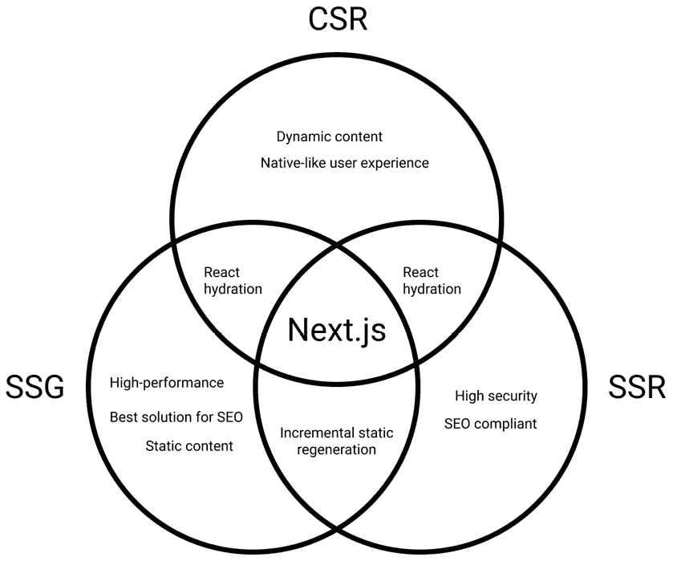
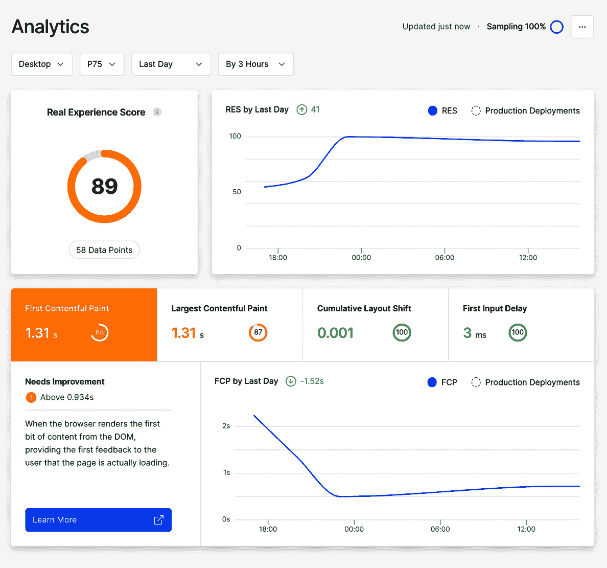
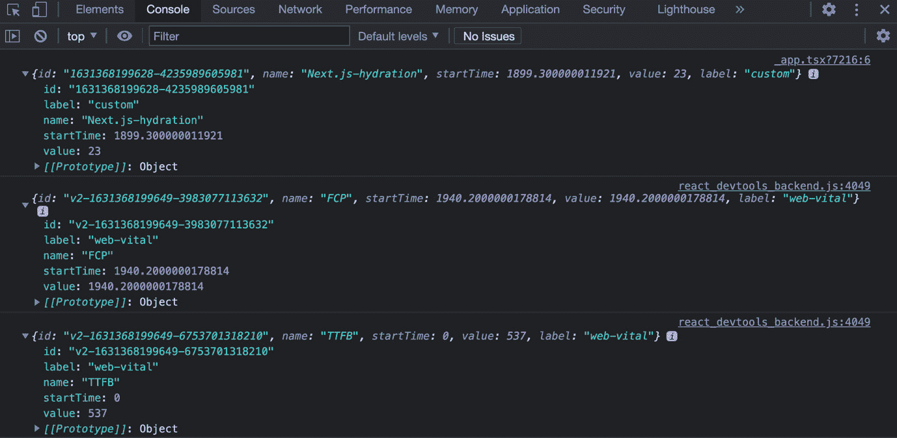

# *第十章*：与 SEO 合作并管理性能

**SEO**（即**搜索引擎优化**）和性能是两个在整体开发过程中紧密相连的话题。

尽管 Next.js 方面已经进行了多次增强，以改进性能并促进 SEO 最佳实践，但我们仍然需要知道我们的应用程序可能在哪些方面可能产生问题，从而导致搜索引擎索引不佳和糟糕的用户体验。

在本章中，我们将详细介绍以下主题：

+   为您的应用程序选择合适的渲染方法（SSR、SSG、CSR）。

+   应用程序在性能方面通常会失败的情况

+   如何使用 Vercel Analytics 模块

+   帮助我们编写 SEO 友好型 Web 应用程序的工具

到本章结束时，您将通过学习处理这些复杂主题的一些最佳实践和工具，能够优化您的 Web 应用程序以实现 SEO 和性能。

# 技术要求

要运行本章中的代码示例，您需要在您的本地计算机上安装 Node.js 和 npm。

如果您愿意，可以使用在线 IDE，例如[`repl.it`](https://repl.it)或[`codesandbox.io`](https://codesandbox.io)；它们都支持 Next.js，您不需要在您的计算机上安装任何依赖项。至于其他章节，您可以在 GitHub 上找到本章的代码库：[`github.com/PacktPublishing/Real-World-Next.js`](https://github.com/PacktPublishing/Real-World-Next.js)。

# SEO 和性能 - 简介

自从第一个大型搜索引擎兴起以来，Web 开发者一直在努力寻找一种方法来优化他们的 Web 应用程序，以便在 Google、Bing、Yandex、DuckDuckGo 和其他许多流行搜索引擎的搜索结果中获得更好的排名。

随着前端 Web 框架的演变，事情变得更加复杂。虽然 React、Angular、Vue（以及许多其他框架）提供了一种处理复杂 UI 的绝佳方式，但它们让网络爬虫（负责将网站索引到搜索引擎中的机器人）的工作变得更加困难。它们需要执行 JavaScript，等待 UI 渲染，并最终索引高度动态的网页。此外，许多内容最初都是隐藏的，因为它们在用户交互后由前端 JavaScript 直接动态生成。

这导致了许多问题，让无数开发者后悔“那些美好的旧时光”，当时 Web 基本上是服务器端渲染的，JavaScript 仅用于在 UI 中添加一点动态效果。

好吧，我有点夸张了。开发者最终面对了这样一个事实：React、Angular、Vue 以及其他同行框架给 Web 开发领域带来了如此重大的创新，他们不会放弃它们。

Next.js 部分是对这些问题的回应。虽然有一些框架只关心 SEO 和性能，通过在构建时静态生成所有 Web 页面（如第二章中所述，*探索不同的渲染策略*），Next.js 允许你决定哪些页面需要静态生成和服务器端渲染，哪些组件需要仅在客户端渲染。

在第二章，*探索不同的渲染策略*中，我们描述了这些渲染方法之间的差异。在下一节中，我们将讨论一些使用 Next.js 渲染网页时选择渲染策略的实际例子。

# 从性能和 SEO 的角度来看，渲染策略

根据你想要构建的网站或 Web 应用，你可能需要考虑不同的渲染策略。

每种渲染策略都有其优缺点，但 Next.js 的伟大之处在于你不必做出妥协。相反，你可以为你的 Web 应用中的每一页选择最佳的渲染策略。

让我们假设一下，Next.js 此刻并不存在。这听起来是不是很可怕？

我们想使用 React 构建一个 Web 应用，但我们必须在渲染策略之间做出妥协。

客户端渲染是一个很好的起点。应用将以 JavaScript 包的形式部署，一旦下载到浏览器，就会动态生成 HTML 内容。性能将非常出色，因为所有计算都在客户端完成。此外，用户体验将非常出色，因为客户会感觉自己就像在使用原生应用。另一方面，你将不得不在 SEO 上挣扎，因为客户端渲染让搜索引擎爬虫的工作变得更难。

重新考虑一下，我们可能会考虑服务器端渲染。我们会将所有对 SEO 重要的内容在服务器端渲染，允许客户端生成其余内容。这在安全性方面可能是最佳选择，因为我们可以在后端隐藏许多数据获取、验证和敏感的 API 调用。这是一个好的替代方案，但也有一些缺点。在客户端渲染中，我们已经看到应用如何被捆绑成一个独特的 JavaScript 文件。在 SSR（服务器端渲染）中，我们需要设置、维护和扩展服务器。随着流量的增加，它将变慢、更昂贵，且更难维护。是时候寻找第三个选项了。

我们最后的选项是在构建时静态生成整个网站。我们会实现最佳的性能，同时 SEO 评分将显著提高，但仍然有一些显著的缺点。

如果我们的 SEO 敏感内容频繁更改，我们可能需要在几小时内多次重新渲染整个网站。这在大网站上可能是一个重大问题，因为构建可能需要相当长的时间。此外，处理用户安全性也会更困难，因为每个敏感 API 调用（在构建阶段之后发生）或计算都会在客户端独家进行。

让我们回顾一下我们的选择：

+   **客户端渲染**（**CSR**）：出色的性能，高度动态的内容，但 SEO 和安全性较差

+   **服务器端渲染**（**SSR**）：更好的 SEO，出色的安全性，但可能性能较差，且管理服务器更具挑战性

+   **静态站点生成**（**SSG**）：最佳性能，最佳 SEO 评分，但缺乏安全性且不适合高度动态的内容

现在，我们终于可以停止假装 Next.js 不存在，并开始欣赏这个框架为我们提供的可能性。

我们不必选择单一渲染方法来实现我们的 Web 应用。我们可以选择所有这些方法。



图 10.1 – Next.js 渲染策略

Next.js 的一个关键特性是能够选择是否在服务器上渲染页面或在其构建时生成（甚至完全在客户端端进行）。

基于这种可能性，我们可以开始将我们的网站视为由不同部分组成，这些部分以多种不同的方式渲染，具体取决于每个部分的目的。

在下一节中，我们将通过一个真实网站示例来了解如何选择正确的渲染方法。

## 真实网站示例背后的推理

让我们假设我们正在构建一个摄影网站。用户可以上传他们的照片，并从平台上的其他用户那里获得反馈和投票。当用户登录时，主页将显示用户关注者的照片列表。点击任何这些照片将打开图片详情页面，我们可以阅读关于照片的评论、反馈和历史。

基于这些信息，我们可以开始思考我们想要如何渲染这些网站部分。

首先，我们知道主页内容会根据用户的浏览方式而变化。因此，我们可以在构建时排除静态生成主页上的主要图片列表，因为内容高度动态。

我们有以下几种选择：

+   我们使用一些占位符静态渲染主页上的图片，这些图片将在客户端的 React hydration 之后加载，具体取决于用户是否登录以及是否关注网站上的任何人。

+   我们可以在服务器端渲染页面。多亏了会话 cookie，我们可能已经知道用户是否登录，我们可以在将页面发送到客户端之前在服务器上预先渲染这个列表。

一件事是肯定的：当我们处理这个特定的图片列表时，我们并不真的关心 SEO。谷歌机器人永远不会登录到这个网站，因为没有理由索引每个用户都不同的自定义内容。

谈到性能，我们在决定如何渲染主页之前应该考虑几个因素。如果用于生成定制图片流的 API 足够快，并且图片高度优化，我们当然可以在服务器端预先渲染整个列表。否则，我们可以创建一些看起来不错的骨架加载占位符，在我们等待 API 响应和前端渲染图片时，可以娱乐用户。

最坏的情况是 API 很慢，图片没有优化，因此我们需要为此做好准备。然后我们决定在构建时静态生成整个页面，但我们将在 React 水合后进行 API 调用并生成优化后的图片（也许使用 Next.js 内置的图片组件，如第三章，*Next.js 基础和内置组件*所示）。

因此，最终决定是 SSG 和 CSR。我们将静态生成主页并在客户端创建图像列表。

在下一节中，我们将看到处理图片详情页的最佳方式。

## 渲染图片详情页

接下来，我们想要为我们的网站创建一个单独的图片页面模板。在这里，我们将渲染用户发布的照片、描述、一些标签以及其他用户给出的所有评论和反馈。

在这种情况下，我们希望这个页面被搜索引擎索引，因为其内容不依赖于用户会话或任何其他此类变量。

再次强调，我们必须选择我们想要渲染此页面的方式。我们已经知道 SEO 至关重要，因此我们排除了全客户端渲染作为选项。我们必须在构建时静态生成此页面或在每个请求时服务器端渲染它之间做出选择。

我们知道无论选择哪个选项都会帮助我们进行 SEO，但在这里做出错误的决定将会在网站需要扩展时立即影响其性能。是时候比较 SSG 和 SSR 在这个特定用例中的优缺点了。

### 静态站点生成动态页面的优缺点

静态站点生成为这种类型的应用程序提供了许多优点：

+   一旦在构建过程中生成静态页面，服务器就不需要在每次请求时重新渲染它。这减少了服务器的负载，从而降低了基础设施成本，并在高负载下轻松扩展。

+   图片作者可能希望在生成后更改一些静态内容。然而，在这个时候，我们不想等待下一次构建发生：我们可以在（比如说）每 30 分钟更改一次内容的情况下，仅使用增量静态重新生成，在服务器上重新渲染静态页面。

+   页面性能将是最佳可能的。

+   动态部分，如评论和点赞数（可能对 SEO 不重要）可以在客户端稍后渲染。

+   当用户想要添加一张新图片时，他们不必等待下一次构建才能在网站上看到他们的图片。实际上，我们可以在`getStaticPaths`函数的返回对象中设置`fallback: true`参数，让 Next.js 在请求时静态渲染一个新页面。

在构建时渲染这类网页有一个很大的缺点：如果你有成千上万的页面，你的网站构建将花费大量时间。选择 SSG 进行动态路由时，这是需要考虑的事情。我们未来可能支持多少动态页面？构建过程生成它们需要多少时间？

现在让我们继续探讨单张图片详情页服务器端渲染的优缺点。

### 服务器端渲染动态页面的优缺点

与针对此特定页面的静态网站生成相比，服务器端渲染提供了一些重要的优点。

第一点是，如果用户更改了页面的内容，我们不必等待增量静态再生成发生。当图片作者更改其照片的任何信息时，我们可以在生产页面上立即看到更改的反映。

第二个优点甚至更为关键。正如之前所见，当生成大量静态页面时，SSG 可能需要几分钟才能完成。服务器端渲染通过仅在请求时渲染页面来解决这个问题，使得整个部署管道更快。

如果你考虑像 Google 和 Facebook 这样的大型网站，你很容易理解为什么在构建时生成这些页面可能是个问题。如果你只想渲染几十或几百个页面，这可以工作得很好，但如果你生成数百万甚至数十亿个页面，它将变成一个巨大的瓶颈。

在我们的案例中，我们预计将托管成千上万张图片，每张图片都有一个详情页。因此，我们最终将决定为它们采用服务器端渲染。

另一个选择是在构建时静态生成最受欢迎的页面（比如说前一千页），然后使用“回退”属性在运行时生成它们。

我们现在只需要定义私有路由的渲染策略，用户可以在那里更改自己的个人资料详情。我们将在下一节中详细说明。

# 私有路由

如形容词“私有”所暗示的，私有页面不是为了让每个人都能访问。相反，它们应该只对已登录用户开放，并包含管理账户设置所需的基本信息（用户名、密码、电子邮件等）。

话虽如此，我们不会真正关心 SEO，但我们会专注于安全。这些页面中的数据是敏感的，我们不惜一切代价来保护它。

这是我们想牺牲一些性能以改善我们安全性的罕见情况之一。

我们可以快速生成私有路由的静态版本，然后在客户端执行所有必要的 API 调用，但如果不正确处理，这可能会暴露一些个人（或私有）数据。因此，我们将采用服务器端渲染策略，在渲染页面之前检测匿名用户并将他们重定向走。此外，如果请求的用户已登录，我们可以在后端预加载所有数据，并通过`getServerSideProps`将其传递到客户端，这极大地提高了在向客户端传输数据时的安全性。

现在我们已经定义了如何管理私有路由，我们已经完成了基本渲染策略分析，因此现在是快速回顾的时候了。我们将在下一节中看到这一点。

# 关于我们决策的快速回顾

在前面的章节中，我们根据我们需要为我们的摄影网站渲染的页面类型做出了一些决定。

这项分析至关重要，应该考虑我们未来将要工作的每一个网站。如果我们需要向现有的 Next.js 网站添加新页面，我们将需要执行类似的分析，以了解最佳解决方案，以获得最佳性能、安全性和 SEO 合规性。

对于我们的摄影网站，我们提出了以下结构：

+   **主页**：我们将静态生成整个主页，除了自定义图片列表，它将根据用户浏览情况进行客户端渲染。

+   **图片详情页**：我们可以选择在服务器端渲染它（因为这将允许我们优化页面以适应 SEO，并保证以最佳方式扩展我们的网站以适应数百万个不同的图片详情页）或者，在构建时静态生成最受欢迎的页面，然后使用“回退”属性在运行时生成缺失的页面。

+   **私有页面**：我们将服务器端渲染它们，以确定在渲染页面之前用户是否已登录。此外，我们将在服务器端获取所有私有数据，将此 API 调用隐藏在前端。

例如，在*第十三章*，“使用 Next.js 和 GraphCMS 构建电子商务网站”，我们将需要做出这样的决定来构建一个真实的 Next.js 电子商务网站。然而，如果你想在进入之前练习，我建议你考虑如何重新创建你最喜欢的网站。

Facebook、Google、YouTube、Amazon——它们都有特定的需求、安全要求和 SEO 规范。那么，你将如何处理？他们是如何处理这些功能的？

在下一节中，我们将专注于通过使用一些开源工具来提高 SEO，这些工具将帮助我们处理搜索引擎爬虫。

# 与 SEO 合作

在 Next.js 中的 SEO 与其他任何框架并无不同。搜索引擎机器人不会区分差异；它们只关心网站内容和质量。因此，尽管 Next.js 试图简化事情，我们仍然需要尊重特定的规则，并在搜索引擎规范的基础上开发我们的网站，以获得良好的索引评分。

考虑到 Next.js 为我们提供的渲染可能性，我们已经知道特定的决策可能会对最终的 SEO 评分产生负面影响（例如，在客户端渲染重要数据）。我们已经在前面的章节中讨论过这一点，所以不会再深入探讨。

在开发网站时，有一些特定的 SEO 指标可能超出了我们的控制范围。域名权威性、引用域名、页面浏览量、点击率和有机市场份额只是其中的一些。尽管我们不太可能在开发过程中提高这些指标（因为它们是网站良好内容管理的结果），但我们应尽最大努力通过编码网站来改善我们能控制的部分。这包括一系列优化和发展，包括但不限于以下内容：

+   *创建一个对 SEO 友好的路由结构*：一个制作精良的路由系统对于搜索引擎机器人正确索引网站至关重要。URL 应始终对人类友好，并按照一定的逻辑组成。例如，如果我们正在创建一个博客，我们应该使用 URL 结构来帮助用户仅通过查看页面 URL 就能识别页面内容。虽然像 [`myblog.com/posts/1`](https://myblog.com/posts/1) 这样的 URL 可能更容易处理，但它对于博客用户（以及搜索引擎！）来说更困难，因为通过查看页面地址，我们无法知道内容是什么。[`myblog.com/posts/how-to-deal-with-seo`](https://myblog.com/posts/how-to-deal-with-seo) 是一个更好的 URL，它告诉我们在这个页面上，我们正在讨论 SEO 以及如何处理它。

+   *在页面中填充正确的完整元数据*：在 *第三章*，*Next.js 基础和内置组件* 中，我们已经看到了如何处理元数据。这是我们应该始终包含在页面中的基本数据，没有例外。有一些优秀的库，如 `next-seo` ([`github.com/garmeeh/next-seo`](https://github.com/garmeeh/next-seo))，可以在开发过程中显著减少管理元数据所需的时间。

+   *优化你的图片*：我们已经讨论了如何优化图片。内置的图片组件是与 Google Chrome 团队合作开发的，以提供更好的图片支持，这也在一些 SEO 指标（如累积布局偏移和首次内容绘制）中得到了体现。

+   *生成合适的网站地图*：一旦我们准备好部署网站，我们可以将网站地图提交给搜索引擎，以帮助他们索引我们的内容。一个制作精良的网站地图对任何网站都是必不可少的，因为它允许搜索引擎创建一个整洁、结构化的路径，以便索引网站。至于今天，Next.js 中没有内置的解决方案来创建网站地图，但有一些优秀的库，包括`nextjs-sitemap-generator`([`github.com/IlusionDev/nextjs-sitemap-generator`](https://github.com/IlusionDev/nextjs-sitemap-generator))，可以帮助创建它。

+   *使用正确的 HTML 标签*：使用语义 HTML 标签构建网站是至关重要的，因为它们告诉搜索引擎机器人如何根据优先级和重要性索引内容。例如，虽然我们总是希望我们的内容被索引，但使用`<h1>`HTML 标签为所有文本内容并不是 SEO 的最佳选择。我们总是需要找到合适的平衡，以便我们的 HTML 标签对用户和搜索引擎机器人都有意义。

处理 SEO 不是一个容易的任务。它一直具有挑战性，并且随着新技术和规则的兴起，未来可能会变得更加困难。好消息是，每条规则对每个网站都是相同的，所以你可以轻松地将你在其他框架、CMS 和开发工具上的经验带到 Next.js 中，因为它只能帮助你以更少的努力创建更优化的网站。

另一个可能影响 SEO 的指标是网站的性能。这同样是一个关键话题，我们将在下一节中探讨。

# 处理性能

性能和 SEO 是任何 Web 应用的两个重要方面。特别是性能，它可以影响 SEO 评分，因为性能差的网站会降低 SEO 评分。

在本章的开头，我们已经看到了选择正确的渲染策略如何帮助我们提高性能，但有时，我们不得不在为了安全、业务逻辑等因素而略微降低性能之间做出妥协。

另一个可能影响（或降低）性能的因素是部署平台。例如，如果你将 Next.js 静态网站部署到 CDN 如 Cloudflare 或 AWS Cloudfront，你很可能会获得最佳性能。另一方面，将服务器端渲染的应用程序部署到小型、便宜的服务器上，一旦网站开始扩展而服务器无法处理所有传入的请求，很可能会遇到一些麻烦，导致性能下降。我们将在*第十一章*深入讨论这个话题，*不同的部署平台*。至于现在，请记住，这也是性能分析期间需要考虑的另一个重要话题。

当我们谈论性能时，我们并不总是指代服务器端指标；前端性能同样至关重要，如果不加以妥善处理，这可能会导致糟糕的 SEO 评分和不良的用户体验。

随着 Next.js 10 的发布，Vercel 团队宣布了一个新的内置函数，我们可以在我们的页面中使用：`reportWebVitals`。

它是与 Google 合作开发的，使我们能够收集有关我们前端性能的宝贵信息，包括以下内容：

+   **最大内容渲染 (LCP)**：这衡量的是加载性能，应该在页面初始加载后的 2.5 秒内完成。

+   **首次输入延迟 (FID)**：这衡量的是页面变得可交互所需的时间。它应该少于 100 毫秒。

+   **累积布局偏移 (CLS)**：这衡量的是视觉稳定性。还记得我们讨论图片的时候吗？一张重量级的图片可能需要很长时间才能加载。一旦它出现，就会改变布局，导致用户失去他们正在查看的部分的跟踪。图片是一个典型的例子，但其他元素也可能涉及其中：广告横幅、第三方小部件等等。

当我们部署我们的 Next.js 网站时，我们可以启用平台跟踪这些值，以帮助我们了解我们的 Web 应用程序在实际数据上的性能。Vercel 将为我们提供一个精心制作的仪表板，该仪表板将跟踪部署以及新功能如何影响整体网站性能。让我们看看以下示例仪表板：



图 10.2 – Vercel 分析仪表板

如你所见，前面的仪表板显示了整个网站的平均数据。虽然 CLS 和 FID 值已经得到很好的实现，但我们明显可以看出 FCP 和 LCP 可以得到改善。

如果你不愿意在 Vercel 上托管你的 Web 应用程序，你仍然可以通过在 `_app.js` 页面上实现 `reportWebVitals` 函数来收集这些数据。让我们举一个简单的例子：

```js
export const reportWebVitals = (metrics) => console.  log(metrics);
export default function MyApp({ Component, pageProps }) {
  return <Component {...pageProps} />;
}
```

多亏了这个单行函数，每次我们进入新页面时，我们都会在控制台看到以下输出：



图 10.3 – Web Vitals

我们可以决定将此数据发送到任何外部服务，例如 Google Analytics 或 Plausible，以收集这些有用的信息：

```js
export const reportWebVitals = (metrics) =>
  sendToGoogleAnalytics(metric);
export default function MyApp({ Component, pageProps }) {
  return <Component {...pageProps} />;
}
```

如果你想了解更多关于 Web Vitals 的信息，Google 维护的官方网站总是更新最新的改进和规则：[`web.dev/vitals`](https://web.dev/vitals)。我强烈建议你在开始收集和测量你的 Web 应用程序前端性能之前阅读此内容。

# 摘要

在本章中，我们看到了如何就我们的页面与 SEO、性能和安全进行推理。尽管这些主题相当复杂，但本章的主要目的是提供一个思考框架。实际上，随着网络本身以新的性能指标、SEO 规则和安全标准快速前进，这些主题很可能会在未来发生变化。

在下一章中，我们将从另一个角度继续讨论这些主题。我们将了解如何根据我们的需求部署我们的 Web 应用程序并选择合适的托管平台。
