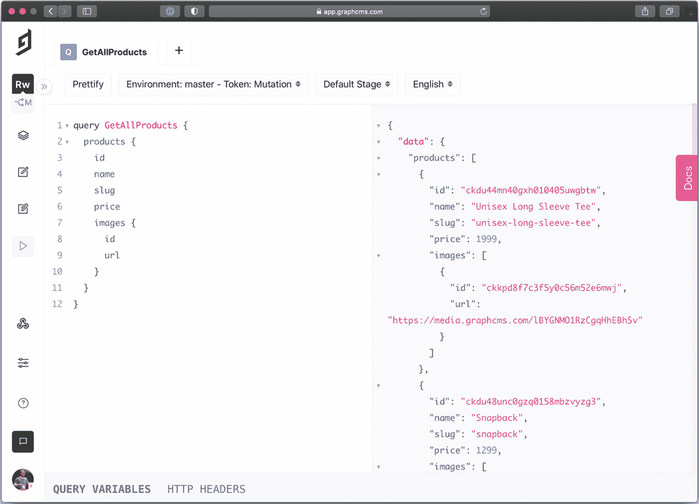

# *第十三章*：使用 Next.js 和 GraphCMS 构建电子商务网站

在我们探索 Next.js 的旅程中，我们学到了很多。我们探索了不同的渲染方法、样式技术、集成甚至部署策略。

现在是时候开始创建一些值得投入生产的作品了，利用我们迄今为止所学的一切。

在本章中，我们将看到如何采用 Next.js 从头开始构建电子商务店面。

我们将详细探讨以下内容：

+   什么是 GraphCMS 以及如何采用它

+   如何集成支付方式，例如 Stripe

+   如何部署电子商务网站

到本章结束时，您将能够描述一个 Next.js 电子商务架构，找到合适的 SEO 和性能权衡，并在正确的云平台上部署您的 Next.js 实例。

# 技术要求

要运行本章中的代码示例，您需要在您的本地机器上安装 Node.js 和 npm。

如果您愿意，可以使用在线 IDE，例如[`repl.it`](https://repl.it)或[`codesandbox.io`](https://codesandbox.io)；它们都支持 Next.js，您不需要在您的电脑上安装任何依赖。与其他章节一样，您可以在 GitHub 上找到本章的代码库：https://github.com/PacktPublishing/Real-World-Next.js。

# 为现代网络创建电子商务网站

自从 90 年代末互联网开始传播以来，它为在线业务开辟了一个充满可能性的世界。因此，许多公司开始开发**软件即服务**（**SaaS**）产品，以帮助人们建立自己的在线购物平台。

今天，这个领域有几个重要的参与者：Shopify、Big Cartel、WordPress（使用 WooCommerce 或其他插件）和 Magento，仅举几个例子。

还有像 PayPal 和 Stripe 这样的公司，它们使在任何平台上集成支付方式变得极其简单，为定制电子商务创建铺平了道路，我们的想象力是唯一的限制。

当谈论电子商务创建中的“限制”时，我指的是某些 SaaS 平台可能会让开发者难以自定义 UI、支付流程等。

以 Shopify 为例，通过创建一个新的服务器端渲染的 React.js 框架来解决此问题，名为**Hydrogen**，它包含预构建的组件和 Hooks 以与 GraphQL API 通信，使开发者能够轻松地在前端创建独特的用户体验。

Next.js 发布了 Next.js Commerce，这是一个高度可定制的入门套件，可以轻松创建电子商务体验，能够与许多不同的平台集成。

Next.js Commerce 并没有为 Next.js 框架添加任何新功能。相反，它作为一个模板来启动一个新的电子商务网站，知道我们可以极其容易地定制它的每一个部分。我们不会涉及实际的定制能力；然而，我们仍然会部署一个性能卓越且优化的在线商店。

我们可以使用 Next.js Commerce 与任何无头后端服务一起使用。无论我们使用 Shopify、BigCommerce、Saleor 还是任何其他服务，只要它们公开一些 API 与后端通信即可。

从下一节开始，我们将使用目前最好的无头 CMS 平台之一，它可以管理现代电子商务平台的任何方面，从产品库存到内容翻译，始终采用 API 首选的方法：GraphCMS。

# 设置 GraphCMS

在电子商务领域有许多不同的竞争对手；它们都提供了一套构建现代和高效解决方案的功能，但在分析后台功能、前端定制能力、API、集成等方面总会有一定的权衡。

在本章中，我们将使用 GraphCMS 的一个简单原因：它易于集成，提供慷慨的免费计划，并且不需要为复杂的发布流程、数据库或其他任何东西进行设置。我们只需要开设一个账户，利用庞大的免费功能集来构建一个完全工作的电子商务网站。

它还提供了一个带有预构建（但完全可定制）内容的电子商务入门模板，这意味着一个预构建的 GraphQL 模式，可以在前端消费以创建产品页面、目录等。

我们可以通过访问 [`graphcms.com`](https://graphcms.com) 来创建一个新的 GraphCMS 账户。一旦我们登录到我们的控制台，我们会看到 GraphCMS 会提示我们创建一个新的项目，我们将在几个预制的模板中进行选择。我们可以选择**商业商店**模板，这将为我们生成一些模拟内容。


图 13.1 – GraphCMS 控制台

一旦我们通过选择**商业商店**作为模板创建了项目，我们就可以在我们的 GraphCMS 控制台中浏览**内容**部分，看看我们有什么模拟数据。

我们将看到许多有用且预先填充的部分，如产品、产品变体、类别和评论；我们将在我们的 Next.js 电子商务应用中很快使用这些数据。

现在我们有了内容，我们需要创建一个 Next.js 应用程序，通过使用强大的 GraphCMS GraphQL API 在前端显示它：

```js
npx create-next-app with-graphcms
```

一旦我们创建了应用程序，我们就可以开始考虑我们想要的 UI 是什么样子。在这种情况下，我们希望保持简单，我们将使用 Chakra UI 来为我们的组件进行样式设计。让我们安装它并在我们的 Next.js 应用程序中设置它：

```js
yarn add @chakra-ui/react @emotion/react@¹¹ @emotion/styled@¹¹ framer-motion@⁴
```

让我们打开 `_app.js` 文件并添加 Chakra 提供者：

```js
import { ChakraProvider } from '@chakra-ui/react';
function MyApp({ Component, pageProps }) {
  return (
    <ChakraProvider>
      <Component {...pageProps} />
    </ChakraProvider>
  );
}
export default MyApp;
```

现在我们已经设置了一个基本的 Next.js 应用程序，我们可以开始考虑将 GraphCMS 连接到它。

如前所述，GraphCMS 提供了出色的 GraphQL API，因此我们需要通过该协议连接到它。我们已经在 *第四章* 中讨论了如何使用 Apollo 连接到任何 GraphQL 端点，*在 Next.js 中组织代码库和获取数据*。为了简化，我们现在将使用一个更直接的库来连接到 GraphCMS：`graphql-request`。

我们可以通过使用 Yarn 来安装它：

```js
yarn add graphql-request graphql
```

现在，让我们创建一个基本的 GraphQL 接口，将 GraphCMS 连接到我们的店面。首先，让我们创建一个名为 `lib/graphql/index.js` 的新文件，并添加以下内容：

```js
import { GraphQLClient } from 'graphql-request';
const { GRAPHCMS_ENDPOINT, GRAPHCMS_API_KEY = null } =       
  process.env;
const authorization = `Bearer ${GRAPHCMS_API_KEY}`;
export default new GraphQLClient(GRAPHCMS_ENDPOINT, {
  headers: {
    ...(GRAPHCMS_API_KEY && { authorization} }),
  },
});
```

这里发生了什么？

如您所见，我们需要创建几个环境变量：`GRAPHCMS_ENDPOINT` 和 `GRAPHCMS_API_KEY`。第一个包含 GraphCMS 端点 URL，第二个是用于访问受保护数据的可选 API 密钥。

实际上，GraphCMS 允许您公开其数据，这在某些情况下可能很有用。然而，在其他情况下，我们希望我们的数据只能被授权客户端访问，因此我们需要使用一个 API 密钥。

我们可以通过访问我们的 GraphCMS 控制面板上的**设置**然后**API 访问**来检索这些环境变量值。


图 13.2 – GraphCMS 的 API 访问管理

现在，我们可以从我们的代码库中的`.env.local`文件中获取`GRAPHCMS_ENDPOINT`值。当然，如果这个文件不存在，我们可以从头创建它：

```js
GRAPHCMS_ENDPOINT=https://api-eu-central-1.graphcms.com/v2/ckvt6q8oe1h5d01xpfkub364l/master
```

现在，我们需要设置 API 密钥，这允许我们在 CMS 上执行突变（例如，一旦付款，保存订单）。我们可以在 `.env.local` 文件中使用默认的 `GRAPHCMS_API_KEY` 值。

我们现在准备就绪！我们已经与 CMS 建立了连接，因此我们可以通过 GraphQL API 读取、写入，甚至更新或删除数据。在下一节中，我们将使用它们来创建店面和产品详情页面。

# 创建店面、购物车和产品详情页面

GraphCMS 提供了一个制作精良、坚如磐石的开源模板，用于创建电子商务网站，您可以通过此 URL 获取：[`github.com/GraphCMS/graphcms-commerce-starter`](https://github.com/GraphCMS/graphcms-commerce-starter)。

我们没有采用这个入门模板，因为我们想完全理解某些技术决策背后的推理以及如何处理开发阶段可能出现的问题。

话虽如此，我们可以专注于开发我们店面所需的第一批基本组件。

我们将把整个应用程序包裹在一个 Chakra UI 框架中，这样每个页面都将拥有相似的布局。我们可以通过打开 `_app.js` 文件并添加以下组件来实现这一点：

```js
import { Box, Flex, ChakraProvider } from '@chakra-ui/react';
function MyApp({ Component, pageProps }) {
  return (
<ChakraProvider>
  <Flex w="full" minH="100vh" bgColor="gray.100">
    <Box maxW="70vw" m="auto">
      <Component {...pageProps} />
    </Box>
  </Flex>
</ChakraProvider>
  );
}
export default MyApp;
```

现在，我们可以开始考虑我们如何在主页上展示我们的产品。然而，在这样做之前，我们可能想检查 CMS 通过 GraphQL API 提供的数据，我们可以通过进入仪表板的**API 演示场**部分轻松做到这一点。在这里，我们可以编写我们的 GraphQL 查询，利用**探索器**功能帮助我们轻松创建高度可定制的 GraphQL 查询。



图 13.3 – GraphCMS API 演示场

在前面的屏幕截图所示的查询中，我们正在检索所有公开可用的产品。我们可以在我们的 Next.js 应用程序中使用这个确切的查询，所以让我们创建一个新的`/lib/graphql/queries/getAllProducts.js`文件并添加以下内容：

```js
import { gql } from 'graphql-request';
export default gql`
  query GetAllProducs {
    products {
      id
      name
      slug
      price
      images {
        id
        url
      }
    }
  }
`;
```

我们现在已准备好获取所有产品以填充我们的主页。为了在构建时生成静态页面，让我们前往`pages/index.js`页面并在`getStaticProps`函数中检索产品：

```js
import graphql from '../lib/graphql';
import getAllProducts from '../lib/graphql/queries/getAllProducts';
export const getStaticProps = async () => {
  const { products } = await graphql.request(getAllProducts)
  return {
    props: {
      products,
    },
  };
};
```

在这个阶段，我们可能会想知道如何处理我们创建一个新产品并希望立即在主页上显示的情况。这里，我们有两种选择：

+   使用`getServerSideProps`而不是`getStaticProps`，这将根据每个请求动态生成页面，但我们已经知道它的缺点，如在第十章中所述，*与 SEO 合作和管理性能*。

+   使用增量静态再生，这样在给定的时间后，页面会得到再生，包括任何新的 API 更改。

我们将通过添加以下属性到我们的返回的`getStaticProps`对象中继续进行第二种选择：

```js
import graphql from '../lib/graphql';
import getAllProducts from '../lib/graphql/queries/getAllProducts';
export const getStaticProps = async () => {
  const { products } = await graphql.request(getAllProducts)
  return {
    revalidate: 60, // 60 seconds
    props: {
      products,
    },
  };
};
```

我们现在已准备好在主页上展示所有产品。我们将通过在`/components/ProductCard/index.js`下创建一个新的组件来实现这一点，并公开以下函数：

```js
import Link from 'next/link';
import { Box, Text, Image, Divider } from '@chakra-ui/react';
export default function ProductCard(props) {
  return (
    <Link href={`/product/${props.slug}`} passHref>
      <Box
        as="a"
        border="1px"
        borderColor="gray.200"
        px="10"
        py="5"
        rounded="lg"
        boxShadow="lg"
        bgColor="white"
        transition="ease 0.2s"
        _hover={{
        boxShadow: 'xl',
        transform: 'scale(1.02)',
        }}>
    <Image src={props.images[0]?.url} alt={props.name} />
    <Divider my="3" />
    <Box>
      <Text fontWeight="bold" textColor="purple"        
        fontSize="lg">{props.name}
      </Text>
      <Text textColor="gray.700">€{props.price/ 100}</Text>
    </Box>
  </Box>
</Link>
  );
}
```

如您所见，这是一个简单的组件，它显示包含产品图片、名称和价格的产品卡片。

如果你查看使用的属性（在前面的代码片段中突出显示），你会注意到它与从 GraphCMS 返回的数据一一对应。这是使用 GraphQL 的另一个微小优势：它允许你在查询数据的同时对数据进行建模，这使得围绕它构建组件、函数甚至算法变得极其容易。

现在我们有了`ProductCard`组件，我们可以将其导入到我们的主页中，并使用它来显示从 CMS 获取的所有产品：

```js
import { Grid } from '@chakra-ui/layout';
import graphql from '../lib/graphql';
import getAllProducts from '../lib/graphql/queries/getAllProducts';
import ProductCard from '../components/ProductCard';
export async const getStaticProps = () => {
  // ...
}
export default function Home(props) {
  return (
<Grid gridTemplateColumns="repeat(4, 1fr)" gap="5">
  {props.products.map((product) => (
  <ProductCard key={product.id} {...product} />
      ))}
</Grid>
  );
}
```

如果我们现在启动开发服务器并转到[`localhost:3000`](http://localhost:3000)，我们将能够看到我们的店面。


图 13.4 – 我们基于 Next.js 的第一个店面

现在我们有一个工作的店面，我们需要创建一个单独的产品页面。

至于主页，我们将使用 SSG + ISR 来构建所有产品页面，这将帮助我们保持良好的性能并提高 SEO 和用户体验。

我们可以通过在 `pages/product/[slug].js` 下创建一个新文件来实现这一点，在那里我们可以开始编写以下函数定义：

```js
export async function getStaticPaths() {}
export async function getStaticProps() {}
export default function ProductPage() {}
```

正如你可能猜到的，我们需要为每个产品生成一个新的页面，我们可以通过使用 Next.js 的保留函数 `getStaticPaths` 来实现这一点。

在该函数内部，我们将查询我们 CMS 中的所有产品，然后为每个产品生成动态 URL 路径；这样，在构建时，Next.js 将生成我们网站中需要的所有页面。

其他两个函数应该已经很熟悉了，所以我们将稍后实现它们。

现在，我们需要编写一个 GraphQL 查询来获取 GraphCMS 中的所有产品。为了保持简单，我们可以重用我们为主页编写的查询，该查询已经获取了所有产品，包括它们的 slugs（这将是产品 URL 的一部分）。

让我们通过向 GraphCMS 发送请求来更新我们的产品页面，获取库存中的所有产品：

```js
import graphql from '../../lib/graphql';
import getAllProducts from '../../lib/graphql/queries/getAllProducts';
export async function getStaticPaths() {
const { products } = await 
    graphql.request(getAllProducts);
  const paths = products.map((product) => ({
    params: {
      slug: product.slug,
    },
  }));
  return {
    paths,
    fallback: false,
  };
}
```

通过这次编辑，我们正在返回一个包含我们在构建时需要生成的所有页面的对象。实际上，返回的对象将看起来像这样：

```js
{
  paths: [
   {
      params: {
        slug: "unisex-long-sleeve-tee"
      }
    },
    {
      params: {
        slug: "snapback"
      }
    },
    // ...
  ]
  fallback: false
}
```

正如你可能猜到的，这将帮助 Next.js 匹配给定的 `/product/[slug]` 路由与正确的产品 slugs。

在这一点上，我们需要创建一个 GraphQL 查询来获取单个产品的详细信息。我们可以在 `lib/graphql/queries/getProductDetail.js` 下创建一个新文件并添加以下内容：

```js
import { gql } from 'graphql-request';
export default gql`
  query GetProductBySlug($slug: String!) {
  products(where: { slug: $slug }) {
    id
    images(first: 1) {
    id
    url
  }
    name
    price
    slug
    description
  }
}
`;
```

通过这个查询，我们将获取所有与 `$slug` 查询变量匹配的产品。鉴于 `slug` 属性在 GraphCMS 中是唯一的，如果请求的产品存在，它将返回一个只有一个结果的数组；如果不存在，则返回一个空数组。

现在我们已经准备好导入这个查询并编辑 `getStaticProps` 函数：

```js
import graphql from '../../lib/graphql';
import getAllProducts from '../../lib/graphql/queries/getAllProducts';
import getProductDetail from '../../lib/graphql/queries/getProductDetail';
export async function getStaticProps({ params }) {
const { products } = await 
    graphql.request(getProductDetail, {
    slug: params.slug,
  });
  return {
    props: {
      product: products[0],
    },
  };
}
```

现在我们只需要创建产品页面布局，包含我们产品的图片、标题、简要描述、价格和数量选择器。为此，我们可以按照以下方式编辑 `ProductPage` 函数：

```js
import { Box, Flex, Grid, Text, Image, Divider, Button,  
  Select } from '@chakra-ui/react';
// ...
function SelectQuantity(props) {
  const quantity = [...Array.from({ length: 10 })];
  return (
  <Select  placeholder="Quantity"
    onChange={(event) =>props.onChange(event.target.value)}>
      {quantity.map((_, i) => (
    <option key={i + 1} value={i + 1}>
      {i + 1}
    </option>
    ))}
  </Select>
  );
}
export default function ProductPage({ product }) {
  return (
    <Flex rounded="xl" boxShadow="2xl" w="full" p="16"  
      bgColor="white">
    <Image height="96" width="96" src={product.images[0].url}/>
    <Box ml="12" width="container.xs">
    <Text as="h1" fontSize="4xl" fontWeight="bold">
      {product.name}
    </Text>
    <Text lineHeight="none" fontSize="xl" my="3"   
    fontWeight="bold" textColor="blue.500">
      €{product.price / 100}
    </Text>
    <Text maxW="96" textAlign="justify" fontSize="sm">
      {product.description}
    </Text>
    <Divider my="6" />
    <Grid gridTemplateColumns="2fr 1fr" gap="5"    
      alignItems="center">
    <SelectQuantityonChange={() => {}} />
    <Button colorScheme="blue">
      Add to cart
    </Button>
    </Grid>
    </Box>
    </Flex>
  );
}
```

如果我们现在启动开发服务器并打开单个产品页面，我们将看到以下内容：


图 13.5 – 单个产品详情页面

既然我们现在可以从主页导航到产品页面，我们需要构建一个导航栏，以便我们可以返回店面或转到购物车来查看我们想要购买的产品，然后进行支付。

我们可以通过在 `components/NavBar/index.js` 下创建一个新文件并添加以下内容来轻松创建一个导航栏：

```js
import Link from 'next/link';
import { Flex, Box, Button, Text } from '@chakra-ui/react';
import { MdShoppingCart } from 'react-icons/md';
export default function NavBar() {
  return (
    <Box position="fixed" top={0} left={0} w="full"   
    bgColor="white" boxShadow="md">
    <Flex width="container.xl" m="auto" p="5"     
      justifyContent="space-between">
    <Link href="/" passHref>
    <Text textColor="blue.800" fontWeight="bold"      
      fontSize="2xl" as="a">
        My e-commerce
    </Text>
    </Link>
    <Box>
    <Link href="/cart" passHref>
      <Button as="a">
        <MdShoppingCart />
      </Button>
    </Link>
    </Box>
    </Flex>
    </Box>
  );
}
```

我们还需要安装 `react-icons` 库，正如其名所示，这是一个包含数百个精心制作且实用的图标，非常适合我们的基于 React 的项目的优秀包：

```js
yarn add react-icons
```

现在我们只需要更新我们的 `_app.js` 文件，包括最新的 `NavBar` 组件，这样它就会在所有应用程序页面上渲染：

```js
import { Box, Flex, ChakraProvider } from '@chakra-ui/react';
import NavBar from '../components/NavBar';
function MyApp({ Component, pageProps }) {
  return (
    <ChakraProvider>
    <Flex w="full" minH="100vh" bgColor="gray.100">
    <NavBar />
    <Box maxW="70vw" m="auto">
      <Component {...pageProps} />
    </Box>
    </Flex>
    </ChakraProvider>
  );
}
export default MyApp;
```

我们现在可以从店面导航到产品页面，然后再返回！

现在网站已经初具规模，我们想要将产品添加到我们的购物篮中。我们曾在 *第五章* 中讨论过类似的场景，*在 Next.js 中管理本地和全局状态*。

我们需要创建一个 React 上下文来保存购物清单，直到用户付款。

首先，我们需要在 `lib/context/Cart/index.js` 下创建一个新文件。在这里，我们将编写以下脚本：

```js
import { createContext } from 'react';
const CartContext = createContext({
  items: {},
  setItems: () => {},
});
export default CartContext;
```

现在，我们需要将整个应用程序包裹在这个上下文中，因此我们需要打开 `_app.js` 文件并按以下方式编辑它：

```js
import { useState } from 'react';
import { Box, Flex, ChakraProvider } from '@chakra-ui/react';
import NavBar from '../components/NavBar';
import CartContext from '../lib/context/Cart';
function MyApp({ Component, pageProps }) {
  const [items, setItems] = useState({});
  return (
    <ChakraProvider>
    <CartContext.Provider value={{ items, setItems }}>
    <Flex w="full" minH="100vh" bgColor="gray.100">
    <NavBar />
      <Box maxW="70vw" m="auto">
        <Component {...pageProps} />
      </Box>
    </Flex>
    </CartContext.Provider>
    </ChakraProvider>
  );
}
export default MyApp;
```

这与我们在 *第五章* 中创建的上下文非常相似，*在 Next.js 中管理本地和全局状态*，对吧？

现在，我们需要将单个产品页面链接到上下文，以便将产品添加到购物篮中。让我们打开 `components/ProductCard/index.js` 文件，并将上下文链接到**选择数量**和**添加到购物篮**操作：

```js
import { useContext, useState } from 'react';
import CartContext from '../../lib/context/Cart';
// ...
export default function ProductPage({ product }) {
  const [quantity, setQuantity] = useState(0);
  const { items, setItems } = useContext(CartContext);
  const alreadyInCart = product.id in items;
  function addToCart() {
      setItems({
      ...items,
      [product.id]: quantity,
    });
  }
  return (
   <Flex rounded="xl" boxShadow="2xl" w="full" p="16"   
     bgColor="white">
   <Image height="96" width="96" src={product.images[0].url} />
   <Box ml="12" width="container.xs">
     <Text as="h1" fontSize="4xl" fontWeight="bold">
       {product.name}
    </Text>
    <Text lineHeight="none" fontSize="xl" my="3"    
       fontWeight="bold" textColor="blue.500">
          €{product.price / 100}
    </Text>
    <Text maxW="96" textAlign="justify" fontSize="sm">
          {product.description}
    </Text>
    <Divider my="6" />
    <Grid gridTemplateColumns="2fr 1fr" gap="5"       
      alignItems="center">
     <SelectQuantity
onChange={(quantity)=>setQuantity 
         (parseInt(quantity))} 
      />
      <Button colorScheme="blue" onClick={addToCart}>
            {alreadyInCart ? 'Update' : 'Add to cart'}
      </Button>
    </Grid>
  </Box>
</Flex>
  );
}
```

我们还可以通过显示购物车中有多少产品来使事情更加有趣和动态。我们可以通过将 `NavBar` 组件链接到相同的 `CartContext` 来实现这一点，只需添加几行代码：

```js
import { useContext } from 'react';
import Link from 'next/link';
import { Flex, Box, Button, Text } from '@chakra-ui/react';
import { MdShoppingCart } from 'react-icons/md';
import CartContext from '../../lib/context/Cart';
export default function NavBar() {
  const { items } = useContext(CartContext);
  const itemsCount = Object
    .values(items)
    .reduce((x, y) => x + y, 0);
  return (
    <Box position="fixed" top={0} left={0} w="full"    
      bgColor="white" boxShadow="md">
    <Flex width="container.xl" m="auto" p="5"
      justifyContent="space-between">
      <Link href="/" passHref>
      <Text textColor="blue.800" fontWeight="bold"   
         fontSize="2xl" as="a">
            My e-commerce
      </Text>
      </Link>
<Box>
<Link href="/cart" passHref>
  <Button as="a">
    <MdShoppingCart />
<Text ml="3">{itemsCount}</Text>
  </Button>
</Link>
</Box>
</Flex>
</Box>
  );
}
```

现在我们有了向购物篮添加项目的方法，我们需要创建购物页本身。让我们创建一个新的 `pages/cart.js` 文件，我们将添加以下组件：

```js
import { useContext, useEffect, useState } from 'react';
import { Box, Divider, Text } from '@chakra-ui/react';
export default function Cart() {
  return (
    <Box
      rounded="xl"
      boxShadow="2xl"
      w="container.lg"
      p="16"
      bgColor="white"
     >
     <Text as="h1" fontSize="2xl" fontWeight="bold">
        Cart
     </Text>
     <Divider my="10" />
     <Box>
       <Text>The cart is empty.</Text>
     </Box>
     </Box>
  );
}
```

这将是购物篮页面的默认状态。当用户将任何产品放入篮子时，我们需要在这里显示它。

为了做到这一点，我们可以轻松地使用我们刚刚创建的购物车上下文，这将告诉我们每个产品的 ID 和数量：

```js
import { useContext, useEffect, useState } from 'react';
import { Box, Divider, Text } from '@chakra-ui/react';
import cartContext from '../lib/context/Cart';
export default function Cart() {
  const { items } = useContext(cartContext);
  return (
    // ...
  );
}
```

我们最终得到了一个包含每个产品的 ID 和数量的对象，格式为 `{ [product_id]: quantity }`。

我们将使用此对象的键，通过一个新的查询从 GraphCMS 获取所有所需的产品，该查询位于 `lib/graphql/queries/getProductsById.js`：

```js
import { gql } from 'graphql-request';
export default gql`
  query GetProductByID($ids: [ID!]) {
  products(where: { id_in: $ids }) {
    id
    name
    price
    slug
    }
  }
`;
```

一旦我们完成查询的编写，我们可以回到我们的 `cart.js` 文件，并使用 `useEffect` React 钩子实现它，以便在页面加载时立即获取所有产品：

```js
import { useContext, useEffect, useState } from 'react';
import { Box, Divider, Text } from '@chakra-ui/react';
import graphql from '../lib/graphql';
import cartContext from '../lib/context/Cart';
import getProductsById from '../lib/graphql/queries/getProductsById';
export default function Cart() {
  const { items } = useContext(cartContext);
  const [products, setProducts] = useState([]);
  const hasProducts = Object.keys(items).length;
  useEffect(() => {
    // only fetch data if user has selected any product
    if (!hasProducts) return;
  graphql.request(getProductsById, {
        ids: Object.keys(items),
      })
      .then((data) => {
        setProducts(data.products);
      })
      .catch((err) =>console.error(err));
  }, [JSON.stringify(products)]);
  return (
    // ...
  );
}
```

当我们尝试将几个产品添加到购物篮中，然后转到购物页时，我们会看到以下错误：


图 13.6 – 浏览器找不到进程变量

Next.js 告诉我们，包含所有环境变量的 `process` 变量在浏览器中不可用。幸运的是，即使这个变量没有被任何浏览器官方支持，Next.js 为我们提供了一个出色的 polyfill；我们只需要做一些更改使其有效。

首先，我们需要将 `GRAPHCMS_ENDPOINT` 变量重命名为 `NEXT_PUBLIC_GRAPHCMS_ENDPOINT`。通过在环境变量前添加 `NEXT_PUBLIC_`，Next.js 将添加一个 `process.env` 对象，在浏览器中可用，仅公开公共变量。

让我们在`.env.local`文件中进行更改，然后回到`lib/graphql/index.js`文件并对其进行一些小的修改：

```js
import { GraphQLClient } from 'graphql-request';
const GRAPHCMS_ENDPOINT = process.env.NEXT_PUBLIC_GRAPHCMS_ENDPOINT;
const GRAPHCMS_API_KEY = process.env.GRAPHCMS_API_KEY;
const authorization = `Bearer ${GRAPHCMS_API_KEY}`;
export default new GraphQLClient(GRAPHCMS_ENDPOINT, {
  headers: {
    ...(GRAPHCMS_API_KEY && { authorization }),
  },
});
```

请注意，我们没有修改`GRAPHCMS_API_KEY`环境变量名称，因为它包含私有数据，永远不应该暴露。

现在我们已经解决了这个小问题，我们终于准备好编写购物车页面了。

首先，我们需要编写一个函数来计算最终费用，通过将产品价格乘以它们的数量来求和。我们可以在组件的主体中添加此函数来实现：

```js
export default function Cart() {
  // ...
function getTotal() {
  if (!products.length) return 0;
  return Object.keys(items)
    .map(
      (id) =>
        products.find((product) => product.id === id).price
        * (items[id] / 100) // Stripe requires the prices to be
                            // integers (i.e., €4.99 should be
                            // written as 499). That's why
                            // we need to divide by 100 the                                prices
                            // we get from GraphCMS, which are
                            // already in the correct
                            // Stripe format
      )
      .reduce((x, y) => x + y)
      .toFixed(2);
  }
// ...
}
```

现在，我们可以通过包括我们添加到购物车中的产品列表来更新我们的组件返回的 JSX：

```js
  return (
    <Box
      rounded="xl"
      boxShadow="2xl"
      w="container.lg"
      p="16"
      bgColor="white">
    <Text as="h1" fontSize="2xl" fontWeight="bold">
      Cart
    </Text>
    <Divider my="10" />
    <Box>
      {!hasProducts ? (
    <Text>The cart is empty.</Text>
        ) : (
    <>
       {products.map((product) => (
    <Flex
      key={product.id}
      justifyContent="space-between"
      mb="4">
    <Box>
    <Link href={`/product/${product.slug}`} passHref>
    <Text
      as="a"
      fontWeight="bold"
      _hover={{
      textDecoration: 'underline',
      color: 'blue.500' }}>
        {product.name}
      <Text as="span" color="gray.500">
        {''}
        x{items[product.id]}
      </Text>
      </Text>
      </Link>
      </Box>
      <Box>
        €{(items[product.id] *
        (product.price / 100)).toFixed(2)}
      </Box>
      </Flex>
            ))}
      <Divider my="10" />
      <Flex
        alignItems="center"
        justifyContent="space-between">
        <Text fontSize="xl" fontWeight="bold">
          Total: €{getTotal()}
        </Text>
     <Button colorScheme="blue"> Pay now </Button>
     </Flex>
     </>
        )}
</Box>
</Box>
  );
}
```

我们已经准备好管理购物车了！我们现在需要通过选择一个金融服务，例如 Stripe、PayPal 或 Braintree 来处理支付。

在下一节中，我们将看到如何使用 Stripe 实现支付功能。

# 使用 Stripe 处理支付

Stripe 是市面上最好的金融服务之一；它使用简单，并提供优秀的文档，帮助我们了解如何集成他们的 API。

在继续本节之前，请确保在 https://stripe.com 上开设账户。

一旦我们有了账户，我们可以登录并前往[`dashboard.stripe.com/apikeys`](https://dashboard.stripe.com/apikeys)，在那里我们将检索以下信息：发布密钥和秘密密钥。我们需要将它们存储在两个环境变量中，遵循以下命名约定：

```js
NEXT_PUBLIC_STRIPE_SHARABLE_KEY=
STRIPE_SECRET_KEY=
```

请务必检查您没有暴露`STRIPE_SECRET_KEY`变量，并且`.env.local`文件没有被添加到 Git 历史记录中，通过将其包含在`.gitignore`文件中来实现。

现在我们将 Stripe JavaScript SDK 安装到我们的项目中：

```js
yarn add @stripe/stripe-js stripe
```

两个包安装完成后，我们可以在`lib/stripe/index.js`下创建一个新文件，包含以下脚本：

```js
import { loadStripe } from '@stripe/stripe-js';
const key = process.env.NEXT_PUBLIC_STRIPE_SHARABLE_KEY;
let stripePromise;
const getStripe = () => {
  if (!stripePromise) {
    stripePromise = loadStripe(key);
  }
  return stripePromise;
};
export default getStripe;
```

此脚本将确保我们只加载一次 Stripe，即使我们多次返回购物车页面。

在这一点上，我们需要创建一个 API 页面来创建 Stripe 会话。通过这样做，Stripe 将创建一个美丽且安全的结账页面，将我们的用户重定向到输入他们的支付和配送详情。一旦用户下订单，他们将被重定向到我们选择的着陆页，但我们会在这个部分的后面看到。

让我们在`/pages/api/checkout/index.js`下创建一个新的 API 路由，我们将在这里编写一个非常基本的 Stripe 结账会话请求：

```js
import Stripe from 'stripe';
const stripe = new Stripe(process.env.STRIPE_SECRET_KEY);
export default async function handler(req, res) {
}
```

一旦我们创建了这个基本函数，我们需要了解 Stripe 需要哪些数据来完成会话。

我们需要按照特定的顺序传递以下数据：

+   所有要购买的产品，包含名称、数量、价格和（可选）图片

+   所有可用的支付方式（信用卡、支付宝、SEPA 借记或其他支付方式，如 Klarna）

+   运费

+   无论是成功还是取消重定向 URL

我们可以从考虑第一个点开始；我们可以轻松地将整个购物车上下文对象传递到这个端点，包括要购买的产品 ID 和它们的数量。然后我们需要向 GraphCMS 请求产品详情，我们可以在 `lib/graphql/queries/getProductDetailsById.js` 下创建一个新的特定查询来完成这个操作：

```js
import { gql } from 'graphql-request';
export default gql`
  query GetProductDetailsByID($ids: [ID!]) {
    products(where: { id_in: $ids }) {
      id
      name
      price
      slug
      description
      images {
        id
         url
      }
    }
  }
`;
```

回到我们的 `/pages/api/checkout/index.js` API 页面，我们可以从实现查询以检索产品详情开始：

```js
import Stripe from 'stripe';
import graphql from '../../../lib/graphql';
import getProductsDetailsById from '../../../lib/graphql/queries/getProductDetailsById';
const stripe = new Stripe(process.env.STRIPE_SECRET_KEY);
export default async function handler(req, res) {
  const { items } = req.body;
  const { products } = await graphql
    .request(getProductsDetailsById, { ids: Object.keys(items) });
}
```

Stripe 需要一个包含一个名为 `line_items` 的属性的配置对象，该属性描述了所有准备购买的产品。现在我们有了所有产品信息，我们可以以下这种方式来组合这个属性：

```js
export default async function handler(req, res) {
  const { items } = req.body;
  const { products } = await graphql
    .request(getProductsDetailsById, { ids: Object.keys(items) });
  const line_items = products.map((product) => ({
    // user can change the quantity during checkout
    adjustable_quantity: {
      enabled: true,
      minimum: 1,
    },
  price_data: {
  // of course, it can be any currency of your choice
    currency: 'EUR',
    product_data: {
      name: product.name,
      images: product.images.map((img) => img.url),
      },
  // please note that GraphCMS already returns the price in the
  // format required by Strapi: €4.99, for instance, should be
  // passed to Stripe as 499.
    unit_amount: product.price,
    },
    quantity: items[product.id],
  }));
```

作为参考，如果用户从我们的商店购买几个背包，`line_items` 数组看起来会是这样：

```js
[
  {
    "adjustable_quantity": {
      "enabled": true,
      "minimum": 1
    },
    "price_data": {
      "currency": "EUR",
      "product_data": {
        "name": "Backpack",
        "images": [
          https://media.graphcms.com/U5y09n80TpuRKJU6Gue1
        ]
      },
      "unit_amount": 4999
    },
    "quantity": 2
  }
]
```

现在，我们可以开始通过使用 `line_items` 数组和一些更多信息来编写 Stripe 结账会话请求：

```js
export default async function handle(req, res) {
  // ...
  const session = await stripe.checkout.sessions.create({
    mode: 'payment', // can also be "subscription" or "setup"
    line_items,
    payment_method_types: ['card', 'sepa_debit'],
    // the server doesn't know the current URL, so we need to     write
    // it into an environment variable depending on the current
    // environment. Locally, it should be URL=http://    localhost:3000
    success_url: `${process.env.URL}/success`,
    cancel_url: `${process.env.URL}/cancel`,
  });
    res.status(201).json({ session });
}
```

我们几乎完成了。现在，我们只需要获取配送信息并将其存储在两个不同的 Stripe 会话属性中：`shipping_address_collection` 和 `shipping_options`。

我们可以在 `handler` 函数外部创建两个新变量。尽管如此，正如你所想象的，这可以完全由 CMS 驱动。

为了保持简单，让我们创建第一个 `shipping_address_collection` 变量：

```js
export const shipping_address_collection = {
  allowed_countries: ['IT', 'US'],
};
```

如你所见，我们可以通过手动选择我们配送的国家来限制配送。如果你想全球配送，你可以简单地避免将 `shipping_address_collection` 属性传递到 Stripe 会话中。

第二个变量更复杂，但允许我们创建具有不同费用的不同配送方式。比如说，我们提供免费配送，通常需要 3 到 5 个工作日才能送达，而快递次日配送需要 €4.99。

我们可以创建以下一系列的配送选项：

```js
export const shipping_options = [
  {
    shipping_rate_data: {
      type: 'fixed_amount',
      fixed_amount: {
        amount: 0,
        currency: 'EUR',
  },
    display_name: 'Free Shipping',
delivery_estimate: {
        minimum: {
          unit: 'business_day',
          value: 3,
        },
        maximum: {
          unit: 'business_day',
          value: 5,
        },
      },
    },
  },
  {
shipping_rate_data: {
      type: 'fixed_amount',
fixed_amount: {
        amount: 499,
        currency: 'EUR',
      },
display_name: 'Next day air',
delivery_estimate: {
        minimum: {
          unit: 'business_day',
          value: 1,
        },
        maximum: {
          unit: 'business_day',
          value: 1,
        },
      },
    },
  },
];
```

配送对象是自解释的。我们终于可以添加这两个新属性到我们的 Stripe 结账会话中：

```js
export default async function handle(req, res) {
  // ...
  const session = await stripe.checkout.sessions.create({
    mode: 'payment', // can also be "subscription" or "setup"
    line_items,
    payment_method_types: ['card', 'sepa_debit'],
    // the server doesn't know the current URL, so we need to     write
    // it into an environment variable depending on the current
    // environment. Locally, it should be URL=http://    localhost:3000
    shipping_address_collection,
    shipping_options,
      success_url: `${process.env.URL}/success`,
      cancel_url: `${process.env.URL}/cancel`,
  });
      res.status(201).json({ session });
}
```

完成了！我们现在回复一个包含用于在前端重定向用户到 Stripe 托管的结账页面的重定向 URL 的会话对象。

我们可以通过回到我们的 `pages/cart.js` 页面并添加以下函数来实现这一点：

```js
import loadStripe from '../lib/stripe';
// ...
export default function Cart() {
  // ...
  async function handlePayment() {
    const stripe = await loadStripe();
    const res = await fetch('/api/checkout', {
      method: 'POST',
      headers: {
        'Content-Type': 'application/json',
      },
      body: JSON.stringify({
        items,
      }),
    });
    const { session } = await res.json();
    await stripe.redirectToCheckout({
      sessionId: session.id,
    });
  }
  // ...
}
```

最后，我们只需要将这个函数链接到 `Cart` 函数：

```js
// ...
<Button colorScheme="blue" onClick={handlePayment}>
    Pay now
</Button>
// ...
```

我们终于准备好测试我们的结账流程了！让我们启动开发服务器，将几个产品添加到购物车中，然后转到 **购物车** 部分，点击 **立即支付** 按钮。我们应该会到达这个美丽的、由 Stripe 提供支持的结账页面，在那里我们可以输入我们的配送信息，选择所需的支付方式，并修改购物车中每个产品的数量：


图 13.7 – Stripe 结账页面

在我的情况下，您可以看到我被重定向到了一个**Michele Riva**商店（左上角），因为我使用我的名字打开了 Stripe 账户，但如果你也这样做并想自定义商店名称，你可以在 Stripe 仪表板上编辑它。

点击左上角的商店名称，我们将被重定向到我们在`pages/api/checkout/index.js`页面设置的`cancel_url`；如果我们成功完成购买，我们将被重定向到`success_url`。我将把这个创建这两个页面的任务留给你，作为在进入下一章之前完成的小作业。

# 摘要

在前面的章节中，我们看到了如何使用 GraphCMS 和 Stripe 这两个令人难以置信的产品创建一个简单的电子商务网站，这两个产品可以帮助构建可扩展、安全且易于维护的店面。

尽管我们在本章中取得了一些显著的进展，但我们仍然缺少一些值得专门写一本书来介绍的功能。

例如，如果我们现在想从 Stripe 结账导航回购物车页面，我们会发现我们的购物车是空的，因为购物车上下文不是持久的。那么，如果我们想允许我们的用户创建账户并查看运输进度、订单历史和其他有用的信息呢？

如您所想，这些都是复杂的话题，我们不可能在一个章节中专门处理它们。有一点可以肯定：一旦我们知道了如何通过 Auth0 处理用户和身份验证，如何在 GraphCMS 上管理产品库存和订单历史，以及如何在 Stripe 上完成结账，我们就拥有了创建稳固的用户体验和开发工作流程所需的所有元素。

Vercel 团队也在最新版本中宣布了 Next.js Commerce，这是一个可以立即附加到 Shopify、Saleor、BigCommerce 等几个电子商务平台的模板，以创建店面自定义 UI。我们之所以没有深入研究这个模板，原因很简单：它很有吸引力，但它抽象了连接不同系统（如 Stripe 和 GraphCMS 或 PayPal 和 WordPress）所需的大部分工作，而我们想为了学习而自己理解如何完成这些工作。

在本章中，我们看到了如何将无头 CMS 集成到我们的 Next.js 前端。但如果你觉得这很容易，那主要是因为 GraphCMS 被明智地构建，以开发者的体验为出发点，使我们能够利用为现代网络时代构建的优秀的 GraphQL API。

我们不能说同样的情况适用于其他在互联网仍处于幼年和成长时期诞生的 CMS，它们采用全栈方法，即我们使用 CMS 本身来构建应用的后端和前端。但如今，即使是那些较老的 CMS 平台也在社区不可思议的努力下不断发展，旨在通过允许我们采用 Next.js（或任何其他框架）作为前端来提供出色的开发者体验。例如，有一个出色的 WordPress 插件可以从现有网站生成优秀的 GraphQL API；这样，我们可以将 WordPress 作为一个完整的无头 CMS 使用，创建一个强大、性能优异、定制的 Next.js 前端。您可以在 https://www.wpgraphql.com 了解更多关于这个插件的信息。同样的情况也适用于 Drupal，另一个流行的开源 CMS，它可以通过 GraphQL 模块暴露 GraphQL API：[`www.drupal.org/project/graphql`](https://www.drupal.org/project/graphql)。

在下一章中，我们将简要回顾到目前为止我们所看到的内容，并看看我们可以构建的一些示例项目，以进一步练习使用 Next.js。
