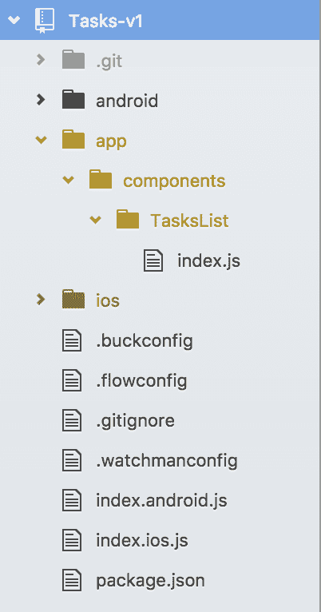
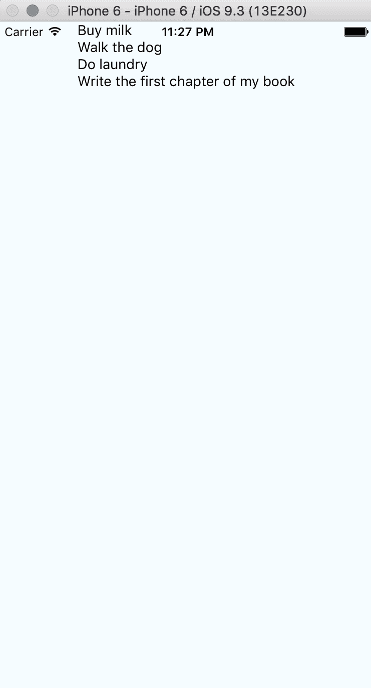
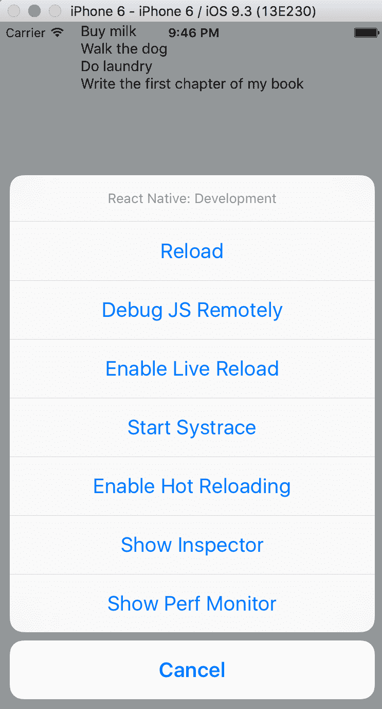
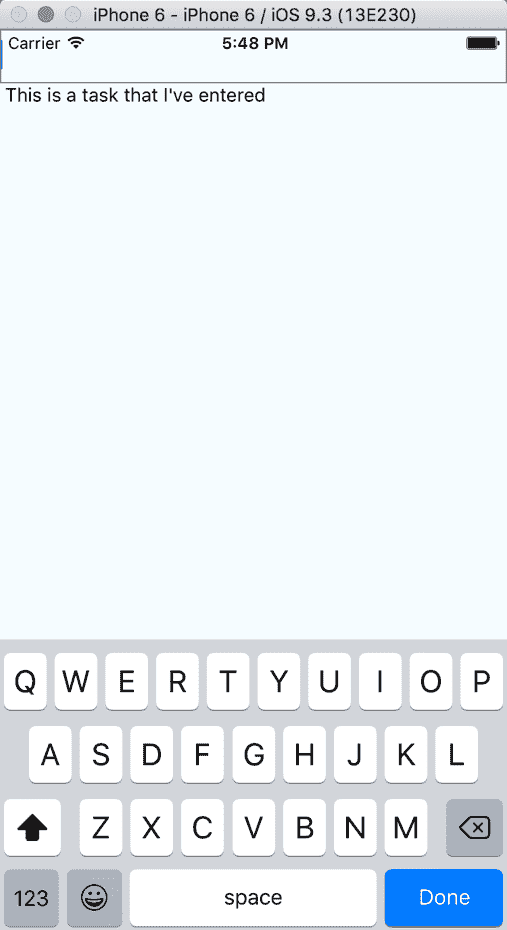

# 第一个项目 - 创建基本待办事项应用程序

在前言中我们已经为 React Native 开发设置了环境，现在让我们开始开发应用程序。在整个本书中，我将使用我最初开始的项目名称——`Tasks`来指代这个应用程序。在本章中，我们将涵盖以下主题：

+   规划待办事项应用程序应具备的功能

+   基本项目架构

+   介绍`StyleSheet`，这是 React Native 用于处理样式的组件

+   Flexbox 概述，这是一种受 CSS 启发的布局模式，用于在 React Native 中进行样式设计

+   熟悉 ES6，我们将使用的新 JavaScript 语法

+   使用`TextInput`、`ListView`、`AsyncStorage`、`Input`、状态和属性创建`Tasks`的构建块

+   了解 iOS 模拟器的开发者菜单，这有助于我们在编写应用程序时

# 初始化新项目

由于已经安装了 React Native SDK，因此初始化新的 React Native 项目就像使用以下命令行一样简单：

```js
react-native init Tasks 

```

让 React Native 命令行界面工作一会儿，然后完成后再打开名为`Tasks`的目录。

从那里开始，在 iOS 模拟器中运行您的应用程序就像输入以下命令一样简单：

```js
react-native run-ios 

```

这将启动构建和编译您的 React Native 应用程序的过程，启动 iOS 模拟器，将应用程序导入模拟器，并启动它。每次您对应用程序进行更改时，您都可以立即重新加载并看到这些更改。

# 功能规划

在编写任何代码之前，我想花时间规划我在项目中的目标，并确定一个**最小可行产品（MVP**）作为构建任何高级功能之前的目标。这有助于确定我们应用程序的关键组件，以便我们有一个可以运行的原型。

对我来说，最小可行产品（MVP）是一种将我的想法量化为可以互动并用于验证任何假设或捕捉任何边缘情况的方法，同时将所需的时间降到最低。以下是我如何进行功能规划：

+   我正在构建的产品做什么？

+   理想情况下，有哪些突出特点使这个应用程序脱颖而出？

+   在前面的列表中，哪些功能是构建一个工作产品所必需的？一旦你知道了必要的功能，就删除所有不提供基本功能的东西。

+   考虑其设计，但暂时不要对每个细节都过于纠结。

带着这些意图，以下是我想到的：

+   这是一个让我能够创建和跟踪任务列表的应用程序。这些可以小到购物清单，也可以大到长期目标。

+   我希望为每个独特的任务设置一个提醒，这样我就可以有序地完成每个任务。理想情况下，列表中的项目可以按类别分组。类别分组可能可以通过某种像图标这样的东西来简化。这样，我也可以通过图标对列表进行排序和筛选。

+   从一开始，唯一必要的事情是，我可以用一个文本输入字段来输入任务，将其渲染到项目列表中，并在完成时标记它们；其他所有事情都是次要的。

现在我们对应用有了更清晰的了解，让我们分解一些我们可以采取的具体步骤来实现它：

1.  让我们*生成一个默认项列表*。这些项不需要手动输入，因为我们只想在应用本身中看到我们的列表被填充。

1.  之后，你的用户应该能够使用文本字段和原生键盘*输入他们自己的任务*。

1.  接下来，我想*使那个列表可滚动*，以防我的任务列表超过了整个垂直屏幕的高度。

1.  然后，我们应该通过某种视觉指示器*让项目标记为完成*。

就这些了！这是我们目前拥有的四个目标。正如我之前提到的，其他所有事情目前都是次要的。现在，我们只想尽快推出一个最小可行产品（MVP），然后我们将在之后根据我们的意愿对其进行调整。

让我们继续前进，开始思考架构。

# 项目架构

下一个重要的事情是我想要解决的问题是架构；这是关于我们的 React Native 应用如何布局的问题。虽然我们为这本书构建的项目旨在单独完成，但我坚信，始终以期望下一个人查看它时是一个脾气暴躁的斧头杀手的方式来编写和架构代码是很重要的。这里的想法是使任何人都能查看你的应用程序的结构，并能够跟随。

首先，让我们看看 React Native CLI 是如何构建我们的项目的；每个相关文件的注释都记在双斜杠（`//`）的右侧：

```js
|Tasks // root folder
|__Android*
|__ios*
|__node_modules
|__.buckconfig
|__.flowconfig
|__.gitignore
|__.watchmanconfig
|__index.android.js // Android entry point
|__index.ios.js // iOS entry point
|__package.json // npm package list

```

`Android`和`iOS`文件夹将深入几层，但这都是其构建过程的一部分，我们目前不需要担心这一点。

根据这个布局，我们可以看到我们应用的 iOS 版本入口是`index.ios.js`，并且生成了一个特定的`iOS`文件夹（以及相应的`Android`文件夹）。

而不是使用这些特定平台的文件夹来存储仅适用于一个平台的组件，我建议在这些文件夹旁边创建一个名为`app`的文件夹，它将封装我们编写的所有逻辑。

在这个`app`文件夹内，我们将有包含我们的组件和资源的子文件夹。对于组件，我希望将它的样式表与其 JS 逻辑耦合在其自己的文件夹中。

此外，组件文件夹不应该嵌套，否则会变得非常难以跟踪和搜索。相反，我更喜欢使用一种命名约定，使一个组件与其父/子/兄弟的关系立即显而易见。

这就是我的建议结构将看起来：

```js
|Tasks 
|__app 
|____components 
|______TasksList 
|________index.js 
|________styles.js 
|______TasksListCell 
|________index.js 
|________styles.js 
|______TasksListInput 
|________index.js 
|________styles.js 
|____images 
|__Android 
|__ios 
|__node_modules 
|__.buckconfig 
|__.flowconfig 
|__.gitignore 
|__.watchmanconfig 
|__index.android.js 
|__index.ios.js 
|__package.json 

```

只从快速观察中，你可能能够推断出`TasksList`是处理屏幕上显示的任务列表的组件。`TasksListCell`将是列表中的每一行，而`TasksListInput`将处理键盘输入字段。

这非常基础，我们可以进行一些优化。例如，我们可以考虑 iOS 和 Android 的平台特定扩展，以及为 Redux 构建更进一步的架构；但出于这个特定应用的目的，我们只需从基础开始。

# 样式表

React Native 的核心视觉组件接受一个名为`style`的属性，其名称和值与 CSS 的命名约定大致相同，但有一个主要例外——kebab-case 被替换为 camelCase，这与 JavaScript 中的命名方式相似。例如，CSS 属性`background-color`在 React Native 中会转换为`backgroundColor`。

为了可读性和重用，将内联样式拆分到自己的`styles`对象中是有益的，通过使用 React Native 的`StyleSheet`组件定义所有样式到`styles`对象中，并在组件的`render`方法中引用它。

再进一步，对于大型应用，最好将样式表分离到自己的 JavaScript 文件中以提高可读性。让我们看看这些如何比较，使用为我们生成的非常注解的 Hello World 示例。这些示例将只包含使我的观点成立的必要代码。

# 内联样式

内联样式是在你的代码标记内定义的样式。看看这个示例：

```js
class Tasks extends Component { 
  render () { 
    return ( 
      <View style = {{ flex: 1, justifyContent: 'center',  
        alignItems: 'center', backgroundColor: '#F5FCFF'  
      }}> 
        <Text style = {{ fontSize: 20, textAlign:  
          'center', margin: 10 }}> 
          Welcome to React Native! 
        </Text> 
      </View> 
    ) 
  } 
} 

```

在前面的代码中，你可以看到内联样式如何创建一个非常复杂和混乱的混乱，特别是当我们想要将多个样式属性应用到每个组件上时。在大型应用中，我们这样编写样式并不实用，所以让我们将样式拆分成一个`StyleSheet`对象。

# 使用样式表，在同一个文件中

这就是组件如何访问同一文件中创建的`StyleSheet`：

```js
class Tasks extends Component { 
  render () { 
    return ( 
      <View style = { styles.container }> 
        <Text style = { styles.welcome }> 
          Welcome to React Native! 
        </Text> 
      </View> 
    ) 
  } 
} 

const styles = StyleSheet.create({ 
  container: { 
    flex: 1, 
    justifyContent: 'center', 
    alignItems: 'center', 
    backgroundColor: '#F5FCFF' 
  }, 
  welcome: { 
    fontSize: 20, 
    textAlign: 'center', 
    margin: 10 
  } 
)}; 

```

这样要好得多。我们将样式移动到一个对象中，这样我们就可以引用它，而无需反复重写相同的内联样式。然而，我们面临的问题是文件非常长，包含大量的应用逻辑，未来的维护者可能需要滚动查看一行又一行的代码才能找到样式。我们可以更进一步，将样式分离到它们自己的模块中。

# 作为导入模块的样式表

在你的组件中，你可以像下面这样导入你的样式：

```js
import styles from './styles.js'; 

class Tasks extends Component { 
  render(){ 
    return ( 
      <View style = { styles.container }> 
        <Text style = { styles.welcome }> 
          Welcome to React Native! 
        </Text> 
      </View> 
    ) 
  } 
} 

```

然后，你可以在一个单独的文件中定义它们：

```js
const styles = StyleSheet.create({ 
  container: { 
    flex: 1, 
    justifyContent: 'center', 
    alignItems: 'center', 
    backgroundColor: '#F5FCFF' 
  }, 
  welcome: { 
    fontSize: 20, 
    textAlign: 'center', 
    margin: 10 
  } 
)}; 

export default styles; 

```

这要好得多。通过将我们的样式逻辑封装到自己的文件中，我们正在分离我们的关注点，使每个人都能更容易地阅读它。

# Flexbox

你可能注意到了我们的 `StyleSheet` 中有一个名为 `flex` 的属性。这与 Flexbox 有关，Flexbox 是一种 CSS 布局系统，它可以在不同屏幕尺寸之间提供布局的一致性。React Native 中的 Flexbox 与其 CSS 规范类似，只有一些差异。需要注意的最重要差异是，在 React Native 中，默认的 `flex` 方向被反转到 `column`，而在 Web 中是 `row`，默认将项目对齐到 `stretch` 属性，而不是浏览器中的 `flex-start`，React Native 中的 `flex` 参数只支持单个数字作为其值。

随着我们通过这些项目，我们将深入了解 Flexbox；我们将从查看基础知识开始。

# flex

你的布局的 `flex` 属性在操作上与 CSS 中的操作略有不同。在 React Native 中，它接受一个单个数字。如果这个数字是正数（意味着大于 0），具有此属性的组件将变得灵活。

# flexDirection

你的布局也接受一个名为 `flexDirection` 的属性。这个属性有四个选项：`row`、`row-reverse`、`column` 和 `column-reverse`。这些选项决定了你的 flex 容器子项的布局方向。

# 使用 ES6 编写

**ECMAScript 版本 6**（**ES6**）是 JavaScript 语言的最新规范。它也被称为 ES2016。它为 JavaScript 带来了新的特性和语法，这些是你在本书中取得成功应该熟悉的内容。

首先，`require` 语句现在是 `import` 语句。它们用于从外部模块或脚本中导入函数、对象等。在过去，为了在文件中包含 React，我们会写类似这样的内容：

```js
var React = require('react'); 
var Component = React.Component; 

```

使用 ES6 的 `import` 语句，我们可以将其重写为：

```js
import React, { Component } from 'react'; 

```

在花括号周围导入 `Component` 的操作称为解构赋值。这是一种赋值语法，允许我们从数组或对象中提取特定数据到变量中。通过解构赋值导入 `Component`，我们可以在代码中直接调用 `Component`；它自动声明为具有相同名称的变量。

接下来，我们将用两个不同的语句替换 `var`：`let` 和 `const`。第一个语句 `let` 声明了一个块级作用域变量，其值可以被修改。第二个语句 `const` 声明了一个块级作用域变量，其值不能通过重新赋值或重新声明来改变。

在先前的语法中，导出模块通常使用 `module.exports` 完成。在 ES6 中，这通过 `export default` 语句来实现。

# 构建应用

回到几页前的列表，这是我想在应用中做的第一件事：

+   让我们生成一个默认项的列表。这些项不必手动输入；我们只想看到我们的列表在应用本身中被填充。

# ListView

当查看 React Native 组件的文档时，你可能会注意到一个名为`ListView`的组件。这是一个旨在显示垂直滚动数据列表的核心组件。

下面是如何`ListView`工作的。我们将创建一个数据源，用数据块数组填充它，创建一个以该数组作为数据源的`ListView`组件，并在其`renderRow`回调中传递一些 JSX，该回调将获取数据并为数据源中的每个数据块渲染一行。

从高层次来看，它看起来是这样的：

```js
class TasksList extends Component { 
  constructor (props) { 

    super (props); 

    const ds = new ListView.DataSource({ 
      rowHasChanged: (r1, r2) => r1 !== r2 }); 

    this.state = { 
      dataSource: ds.cloneWithRows(['row 1', 'row 2']) 
    }; 
  } 

  render () { 
    return ( 
      <ListView 
        dataSource = { this.state.dataSource } 
        renderRow = { (rowData) => <Text>  
          { rowData } </Text> } 
      /> 
    ); 
  } 
} 

```

让我们看看发生了什么。在我们组件的`constructor`中，我们创建了一个`ListViewDataSource`的实例。一个新的`ListViewDataSource`的构造函数接受一个参数，该参数可以包含以下四个之一：

+   `getRowData(dataBlob`, `sectionID`, `rowID)`

+   `getSectionHeaderData(dataBlob`, `sectionID)`

+   `rowHasChanged(previousRowData`, `nextRowData)`

+   `sectionHeaderHasChanged(previousSectionData`, `nextSectionData)`

`getRowData`是一个获取渲染行所需数据的函数。你可以按自己的喜好自定义该函数，并将其传递给`ListViewDataSource`的构造函数，但如果未指定，`ListViewDataSource`将提供默认值。

`getSectionHeaderData`是一个函数，它接受一个数据块和一个部分 ID，并返回仅用于渲染部分标题所需的数据。像`getRowData`一样，如果没有指定，它将提供默认值。

`rowHasChanged`是一个函数，它作为性能优化设计，仅重新渲染其源数据已更改的任何行。与`getRowData`和`getSectionHeaderData`不同，你需要传递自己的`rowHasChanged`版本。先前的示例，它接受当前和之前的行值并返回一个布尔值以显示它是否已更改，是最常见的实现。

`sectionHeaderHasChanged`是一个可选函数，它比较部分标题的内容以确定它们是否需要重新渲染。

然后，在我们的`TasksView`构造函数中，我们的状态接收一个名为`dataSource`的属性，其值等于调用我们之前创建的`ListViewDataSource`实例上的`cloneWithRows`。`cloneWithRows`接受两个参数：一个`dataBlob`和一个`rowIdentities`。`dataBlob`是传递给它的任何任意数据块，而`rowIdentities`代表行标识符的二维数组。`rowIdentities`是一个可选参数——它不包括在先前的示例代码中。我们的示例代码传递了一个硬编码的数据块——两个字符串：`'row 1'`和`'row 2'`。

现在也很重要地提到，我们`dataSource`中的数据是不可变的。如果我们想稍后更改它，我们必须从`dataSource`中提取信息，对其进行修改，然后替换`dataSource`中的数据。

在 `TasksList` 中渲染的 `ListView` 组件本身可以接受许多不同的属性。其中最重要的一个，我们在我们的示例中使用，是 `renderRow`。

`renderRow` 函数从你的 `ListView` 的 `dataSource` 中获取数据，并为你的 `dataSource` 中的每一行数据返回一个要渲染的组件。在我们的前一个例子中，`renderRow` 从我们的 `dataSource` 中的每个字符串中获取数据，并在 `Text` 组件中渲染它。

使用前面的代码，以下是 `TasksList` 将如何渲染。因为我们还没有给它添加样式，所以你会看到 iOS 状态栏覆盖了第一行：


太好了！没有太多可以看的，但我们已经完成了一些事情：我们创建了一个 `ListView` 组件，传递了一些数据，并将这些数据渲染到了我们的屏幕上。让我们退后一步，在我们的应用程序中正确地创建这个组件。

# 创建 TasksList 组件

回到之前提出的文件结构，你的项目应该看起来像这样：



让我们从编写我们的第一个组件——`TasksList` 模块开始。

我们首先需要做的是导入我们对 React 的依赖：

```js
import React, { Component } from 'react'; 

```

然后，我们将从 React Native (`react-native`) 库中导入我们需要的构建块：

```js
import { 
  ListView, 
  Text 
} from 'react-native'; 

```

现在，让我们编写组件。在 ES6 中创建新组件的语法如下：

```js
export default class TasksList extends Component { 
  ... 
} 

```

从这里，让我们给它一个在创建时触发的构造函数：

```js
export default class TasksList extends Component { 
  constructor (props) { 
    super (props); 
    const ds = new ListView.DataSource({ 
     rowHasChanged: (r1, r2) => r1 !== r2 
    }); 

    this.state = { 
     dataSource: ds.cloneWithRows([ 
        'Buy milk', 
        'Walk the dog', 
        'Do laundry', 
        'Write the first chapter of my book' 
      ]) 
    }; 
  } 
} 

```

我们的构造函数在 `TasksList` 的状态中设置一个 `dataSource` 属性，等于一个硬编码的字符串数组。我们的首要目标仍然是简单地在一个屏幕上渲染一个列表。

接下来，我们将利用 `TasksList` 组件的 `render` 方法来完成这个任务：

```js
  render () { 
    return ( 
      <ListView 
        dataSource={ this.state.dataSource } 
        renderRow={ (rowData) =>  
          <Text> { rowData } </Text> } 
      /> 
    ); 
  } 

```

合并起来，代码应该看起来像这样：

```js
// Tasks/app/components/TasksList/index.js 

import React, { Component } from 'react'; 

import { 
  ListView, 
  Text 
} from 'react-native'; 

export default class TasksList extends Component { 
  constructor (props) { 
    super (props); 

    const ds = new ListView.DataSource({ 
      rowHasChanged: (r1, r2) => r1 !== r2 
    }); 

    this.state = { 
      dataSource: ds.cloneWithRows([ 
        'Buy milk', 
        'Walk the dog', 
        'Do laundry', 
        'Write the first chapter of my book' 
      ]) 
    }; 
  } 

  render () { 
    return ( 
      <ListView 
        dataSource={ this.state.dataSource } 
        renderRow={ (rowData) => 
          <Text>{ rowData }</Text> } 
      /> 
    ); 
  } 
} 

```

太好了！这应该就足够了。然而，我们需要将这个组件链接到我们应用程序的入口点。让我们跳转到 `index.ios.js` 并做一些更改。

# 将 TasksList 链接到 index

我们 iOS 应用程序的入口点是 `index.ios.js`，它渲染的所有内容都从这里开始。现在，如果你使用 `react-native run-ios` 命令启动 iOS 模拟器，你将看到我们在前言中熟悉的相同的 Hello World 示例应用程序。

我们现在需要做的是将我们刚刚构建的 `TasksList` 组件链接到 `index`，并自动移除所有不必要的 JSX。让我们继续清除 `Tasks` 组件的 `render` 方法中的几乎所有内容，除了顶层的 `View` 容器。当你完成时，它应该看起来像这样：

```js
class Tasks extends Component { 
  render () { 
    return ( 
      <View style={styles.container}> 
      </View> 
    ); 
  } 
} 

```

我们希望在 `View` 容器中插入 `TasksList`。然而，在我们这样做之前，我们必须让 `index` 文件能够访问该组件。让我们使用一个 `import` 语句来完成：

```js
import TasksList from './app/components/TasksList'; 

```

虽然这个 `import` 语句只是指向我们的 `TasksList` 组件所在的文件夹，但 React Native 智能地寻找一个名为 `index` 的文件，并将其分配给我们想要的。

现在`TasksList`已经可以供我们使用了，让我们将其包含在`Tasks`的`render`方法中：

```js
export default class Tasks extends Component { 
  render () { 
    return ( 
      <View style={styles.container}> 
        <TasksList /> 
      </View> 
    ); 
  } 
} 

```

如果你不再运行 iOS 模拟器，让我们使用之前提到的`react-native run-ios`命令将其重新启动并运行。一旦加载完成，你应该看到以下内容：



这太棒了！一旦加载完成，让我们通过按键盘上的*Command* + *D*来打开 iOS 模拟器开发者菜单，并搜索一个可以帮助我们在创建应用程序时节省时间的选项。

在本节的结尾，你的`index.ios.js`文件应该看起来像这样：

```js
// Tasks/index.ios.js 

import React, { Component } from 'react'; 
import { 
  AppRegistry, 
  StyleSheet, 
  View 
} from 'react-native'; 

import TasksList from './app/TasksList'; 

export default class Tasks extends Component { 
  render() { 
    return ( 
      <View style={styles.container}> 
        <TasksList /> 
      </View> 
    ); 
  } 
} 

```

以下代码渲染了`TasksList`组件：

```js
const styles = StyleSheet.create({ 
  container: { 
    flex: 1, 
    justifyContent: 'center', 
    alignItems: 'center', 
    backgroundColor: '#F5FCFF', 
  } 
}); 

AppRegistry.registerComponent('Tasks', () => Tasks); 

```

# iOS 模拟器开发者菜单

当你打开开发者菜单时，你会看到以下选项：



我想要介绍一下这个菜单中的一些选项，这将帮助你使应用程序的开发过程更加顺畅。一些选项在这里没有涵盖，但你可以在 React Native 文档中阅读有关这些选项的内容。

首先，我们将介绍重载的选项：

+   重载：这个选项会重新加载你的应用程序代码。类似于在键盘上使用*Command* + *R*，重载选项会将你带到应用程序流程的开始。

+   启用实时重载：开启实时重载会导致你的应用程序在你在项目中保存文件时自动执行重载操作。实时重载很棒，因为你一旦启用它，每次你保存文件时，你的应用程序都会显示其最新的更改。重要的是要知道，重载和启用实时重载都会执行一个*完整*的重载操作，包括重置你的应用程序状态。

+   启用热重载：热重载是 React Native 在 2016 年 3 月引入的一个新功能。如果你在 Web 上使用过 React，这个术语可能对你来说很熟悉。热重载的想法是保持你的应用程序运行，并在运行时注入新代码，这样可以防止你像重载（或扩展到启用实时重载）那样丢失应用程序状态。

    +   在开启实时重载的情况下构建功能的一个瓶颈是，当你处理一个多层深度的功能并且依赖于你的应用程序状态来正确地记录对其的更改时。这会给你的应用程序编写和重载的反馈循环增加几秒钟。热重载可以解决这个问题，让你的反馈循环减少到一秒或两秒以下。

    +   在热重载方面需要注意的一点是，在其当前版本中，它并不完美。React Native 文档指出，在某些情况下，你需要使用常规的重载来重置你的应用程序，因为热重载失败了。

同样重要的是要知道，如果你在应用程序中添加新的资产或修改原生 Objective-C/Swift 或 Java/C++代码，你的应用程序在更改生效之前需要完全重新构建。

接下来的一组选项与调试有关：

+   远程调试 JS：启用此功能将在您的机器上打开 Chrome，并带您到一个 Chrome 标签页，允许您使用 Chrome 开发者工具来调试您的应用程序。

+   显示检查器：类似于在 Web 上检查元素，您可以使用 React Native 开发中的检查器来检查您的应用程序中的任何元素，并打开影响该元素的部分代码和源代码。您还可以通过这种方式查看每个特定元素的性能。

使用开发者菜单，我们将启用热重载。这将给我们提供关于我们正在编写的代码的最快反馈循环，使我们能够高效地工作。

现在我们已经启用了热重载并有一个基本的任务列表渲染到屏幕上，是时候考虑输入了--我们稍后再回来讨论样式。

# `TextInput`

构建最小可行产品（MVP）的第二个目标如下：

+   我们的用户应该能够使用文本字段和原生键盘输入他们自己的任务

为了成功创建这个输入，我们必须将问题分解为一些必要的要求：

+   我们需要一个输入字段，以便弹出键盘进行输入

+   当我们点击键盘外部时，键盘应该自动隐藏

+   当我们成功添加一个任务时，它需要添加到 `TasksList` 中的 `dataSource`，它存储在其状态中

+   需要将任务列表存储在应用程序的本地，这样在状态重置时不会删除我们创建的所有任务列表

+   我们还应该解决几条道路上的分歧：

    +   当用户在键盘上按回车键时会发生什么？它会自动创建一个任务吗？或者，我们实现并支持换行？

    +   是否有一个专门的 *添加此任务* 按钮？

    +   成功添加任务的动作会导致键盘消失，需要用户再次点击输入字段吗？或者，我们允许用户在点击键盘外部之前继续添加任务？

    +   我们支持多少个字符？任务的长度有多长才算太长？如果用户超过这个限制，我们的软件用户将得到什么样的反馈？

这需要吸收很多信息，所以让我们一步一步来！我将建议我们现在忽略重大决策，先实现屏幕上的输入，然后让这个输入添加到我们的任务列表中。

由于输入应该保存到状态并在 `ListView` 中渲染，因此输入组件作为 `ListView` 的兄弟组件是有意义的，这样它们就可以共享相同的状态。

从架构上讲，`TasksList` 组件将看起来是这样的：

```js
|TasksList 
|__TextInput 
|__ListView 
|____RowData 
|____RowData 
|____... 
|____RowData 

```

React Native 的 API 中有一个 `TextInput` 组件，它满足了我们对键盘输入的需求。其代码是可定制的，并允许我们将输入添加到我们的任务列表中。

这个 `TextInput` 组件可以接受多种属性。我在这里列出了我们将使用的属性，但 React Native 的文档将提供更多深度：

+   `autoCorrect`: 这是一个布尔值，用于开启和关闭自动更正。默认设置为`true`

+   `onChangeText`: 这是一个回调，当输入字段的文本发生变化时触发。组件的值作为参数传递给回调

+   `onSubmitEditing`: 这是一个回调，当单行输入的提交按钮被按下时触发

+   `returnKeyType`: 这设置返回键的标题为许多不同的字符串之一；`done`、`go`、`next`、`search`和`send`是两个平台都支持的五个选项

我们可以将当前任务分解为几个小步骤：

+   在`index.ios.js`中更新容器样式，使其内容占据整个屏幕而不是只是中央

+   将一个`TextInput`组件添加到`TasksList`组件的`render`方法中

+   为`TextInput`组件创建一个提交处理程序，该处理程序将文本字段的值添加到`ListView`

+   提交后清除`TextInput`的内容，为下一个要添加的任务留下一个空白字段

抽点时间尝试将这个第一个功能添加到我们的应用中！在下一节中，我将分享一些我的结果截图，并分解我为它编写的代码。

这里有一个屏幕来展示我这一阶段的输入：



它符合前面章节中列出的四个基本要求：内容不在屏幕中央，顶部渲染了一个`TextInput`组件，提交处理程序将`TextInput`组件的值添加到`ListView`，并且一旦发生，`TextInput`的内容就会被清空。

让我们看看代码，看看我是如何处理的——你的可能不同！：

```js
// Tasks/index.ios.js 

import React, { Component } from 'react'; 
import { 
  AppRegistry, 
  View 
} from 'react-native'; 

import TasksList from './app/components/TasksList'; 

export default class Tasks extends Component { 
  render() { 
    return ( 
      <View> 
        <TasksList /> 
      </View> 
    ); 
  } 
} 

AppRegistry.registerComponent('Tasks', () => Tasks);

```

这是`TasksList`的更新样式：

```js
// Tasks/app/components/TasksList/styles.js

import { StyleSheet } from 'react-native'; 

const styles = StyleSheet.create({ 
  container: { 
    flex: 1 
  } 
}); 

export default styles; 

```

我在这里所做的就是移除了容器的`justifyContent`和`alignItems`属性，这样项目就不会仅限于显示的中央。

接下来是`TasksList`组件，我进行了一些重大更改：

```js
// Tasks/app/components/TasksList/index.js 

import React, { Component } from 'react'; 

import { 
  ListView, 
  Text, 
  TextInput, 
  View 
} from 'react-native'; 

import styles from './styles'; 

export default class TasksList extends Component { 
  constructor (props) { 
    super (props); 

    const ds = new ListView.DataSource({ 
      rowHasChanged: (r1, r2) => r1 !== r2 
    }); 

    this.state = { 
      ds: new ListView.DataSource({ 
        rowHasChanged: (r1, r2) => r1 !== r2 
      }), 
      listOfTasks: [], 
      text: '' 
    }; 
  } 

```

构造函数现在将三件事保存到状态中：我们的本地`ListView.DataSource`实例、一个空字符串以跟踪`TextInput`的值，以及一个用于存储任务列表的数组。

`render`函数创建了一个`dataSource`的引用，我们将使用它来为`ListView`组件，克隆状态中存储的`listOfTasks`数组。再次强调，`ListView`只呈现纯文本：

```js
  render () { 
    const dataSource = 
    this.state.ds.cloneWithRows(this.state.listOfTasks); 

```

`TextInput`组件有几个选项。它将其输入字段的`value`绑定到我们的状态中的`text`值，随着字段的编辑而重复更改。通过在键盘上按下*完成*键提交它时，它触发一个名为`_addTask`的回调：

```js
    return ( 
      <View style={ styles.container }> 
        <TextInput 
          autoCorrect={ false } 
          onChangeText={ (text) => this._changeTextInputValue(text) } 
          onSubmitEditing={ () => this._addTask() } 
          returnKeyType={ 'done' } 
          style={ styles.textInput } 
          value={ this.state.text } 
        /> 

```

它渲染一个`ListView`组件，其中`_renderRowData`方法负责返回组件的每一行：

```js
        <ListView 
          dataSource={ dataSource } 
          enableEmptySections={ true } 
          renderRow={ (rowData) => this._renderRowData(rowData) } 
        /> 
      </View> 
    ); 
  } 

```

我喜欢在我自己创建的 React 组件的方法名前加上下划线，这样我就可以从默认的生命周期方法中视觉上区分它们。

`_addTask` 方法使用 ES6 中引入的数组扩展运算符来创建一个新的数组，并将现有数组的值复制过来，将最新的任务添加到列表的末尾。然后，我们将它分配给状态中的 `listOfTasks` 属性。记住，我们必须将组件状态视为不可变对象，直接向其推送将是一个反模式：

```js
_addTask () { 
    const listOfTasks = [...this.state.listOfTasks, this.state.text]; 

    this.setState({ 
      listOfTasks 
    }); 

    this._changeTextInputValue('' 
  } 

```

最后，我们调用 `_changeTextInputValue` 以清空 `TextInput` 框：

```js
  _changeTextInputValue (text) { 
    this.setState({ 
      text 
    }); 
  } 

  _renderRowData (rowData) { 
    return ( 
      <Text>{ rowData }</Text> 
    ) 
  } 
} 

```

目前，只返回待办事项列表项的名称就足够了。

在 `_addTask` 方法中设置 `listOfTasks` 属性和在 `_changeTextInputValue` 中设置 `text` 属性时，我正在使用 ES6 的新特性，称为简写属性名，将值分配给与值同名的键。这相当于我写下以下内容：

```js
this.setState({ 
  listOfTasks: listOfTasks, 
  text: text 
}) 

```

继续前进，你可能注意到，当你刷新应用程序时，你会丢失你的状态！这对于待办事项列表应用来说是不切实际的，因为我们不应该期望用户在重新打开应用时重新输入相同的列表。我们想要的是将此任务列表本地存储在设备上，以便我们可以在需要时访问它。这就是 `AsyncStorage` 发挥作用的地方。

# `AsyncStorage`

`AsyncStorage` 组件是一个简单的键值存储，它对您的 React Native 应用程序全局可用。它是持久的，这意味着 `AsyncStorage` 中的数据将在退出或重新启动应用程序或手机时继续存在。如果你已经使用过 HTML 的 `LocalStorage` 和 `SessionStorage`，那么 `AsyncStorage` 将看起来很熟悉。它适用于轻量级使用，但 Facebook 建议你在 `AsyncStorage` 之上使用抽象层，以处理更复杂的情况。

如其名所示，`AsyncStorage` 是异步的。如果你还没有接触过异步 JavaScript，这意味着这个存储系统的方法可以与你的其他代码并发运行。`AsyncStorage` 的方法返回一个 `Promise`——一个表示尚未完成但预期将来会完成的操作的对象。

`AsyncStorage` 中的每个方法都可以接受一个回调函数作为参数，并在 `Promise` 履行后触发该回调。这意味着我们可以编写我们的 `TasksList` 组件来处理这些承诺，在需要时保存和检索我们的任务数组。

关于 `AsyncStorage` 的最后一件事——它是一个简单的键值存储。它期望其键和值都是字符串，这意味着我们需要使用 `JSON.stringify` 将发送到存储的数据转换为字符串，并在检索时使用 `JSON.parse` 将其转换回数组。

玩转 `AsyncStorage` 并更新你的 `TasksList` 组件以支持它。以下是你希望使用 `AsyncStorage` 达成的目标：

+   一旦 `TasksList` 加载，我们希望查看是否在本地存储中存在任何任务。如果存在，向用户展示这个列表。如果不存在，从空数组开始存储。数据应该始终在重启后持久化。

+   当输入任务时，我们应该更新任务列表，将更新后的列表保存到 `AsyncStorage` 中，然后更新 `ListView` 组件。

这是最终写出的代码：

```js
// TasksList/app/components/TasksList/index.js

... 
import { 
  AsyncStorage, 
  ... 
} from 'react-native'; 
... 

```

从 React Native SDK 中导入 `AsyncStorage` API。

```js
export default class TasksList extends Component { 
  ... 
  componentDidMount () { 
    this._updateList(); 
  } 

```

在 `componentDidMount` 生命周期中调用 `_updateList` 方法。

```js
  ... 
  async _addTask () { 
    const listOfTasks = [...this.state.listOfTasks, this.state.text]; 

    await AsyncStorage.setItem('listOfTasks', 
    JSON.stringify(listOfTasks)); 

    this._updateList(); 
  } 

```

将 `_addTask` 更新为使用 `async` 和 `await` 关键字以及 `AsyncStorage`。有关使用 `async` 和 `await` 的详细信息，请参阅以下内容：

```js
  ... 
  async _updateList () { 
    let response = await AsyncStorage.getItem('listOfTasks'); 
    let listOfTasks = await JSON.parse(response) || []; 

    this.setState({ 
      listOfTasks 
    }); 

    this._changeTextInputValue(''); 
  } 
} 

```

在 `_updateTask` 中，我们使用 `AsyncStorage` 做的是获取使用 `listOfTasks` 键本地存储的值。从这里，我们解析结果，将字符串转换回数组。然后，我们检查数组是否存在，如果返回 `null`，则将其设置为空数组。最后，我们通过更新 `listOfTasks` 并触发 `_changeTextInputValue` 来重置 `TextInput` 值来设置我们组件的状态。

上述示例还使用了 ES7 规范提案中的一部分新 `async` 和 `await` 关键字，并且可以与 React Native 一起使用。

# 使用 Async 和 Await 关键字

通常，为了处理异步函数，我们会将其与一些承诺链式调用，以便获取我们的数据。我们可以这样写 `_updateList`：

```js
_updateList () { 
  AsyncStorage.getItem('listOfTasks'); 
    .then((response) => {fto 
      return JSON.parse(response); 
    }) 
    .then((parsedResponse) => { 
      this.setState({ 
        listOfTasks: parsedResponse 
      }); 
    }); 
} 

```

然而，这可能会变得相当复杂。相反，我们将使用 `async` 和 `await` 关键字来创建一个更简单的解决方案：

```js
async _updateList () { 
  let response = await AsyncStorage.getItem('listOfTasks'); 
  let listOfTasks = await JSON.parse(response) || []; 

  this.setState({ 
    listOfTasks 
  }); 

  this._changeTextInputValue(''); 
} 

```

`_updateList` 前面的 `async` 关键字将其声明为异步函数。它自动为我们返回承诺，并可以利用 `await` 关键字告诉 JS 解释器暂时退出异步函数，并在异步调用完成后恢复运行。这对我们来说很棒，因为我们可以在单个函数中以顺序表达我们的意图，并且仍然获得与承诺相同的精确结果。

# 自定义 RenderRow 组件

我们列表中的最后一项，即要有一个可用的最小可行产品，是允许每个任务被标记为完成。这就是我们将创建 `TasksListCell` 组件并在 `ListView` 的 `renderRow` 函数中渲染该组件，而不是仅仅显示文本的地方。

我们对这个组件的目标应该是以下内容：

+   从父组件接受文本作为 prop，并在 `TasksListCell` 中渲染它

+   将 `listOfTasks` 更新为接受对象数组而不是字符串数组，允许每个对象跟踪任务的名称以及它是否已完成

+   当任务被点击时，提供某种视觉指示器，将任务标记为完成，不仅在视觉上，而且在任务的 `data` 对象中，这样在应用程序重新加载时也能持久化。

# 自定义 RenderRow 示例

让我们看看我是如何创建这个组件的：

```js
// Tasks/app/components/TasksList/index.js 

... 
import TasksListCell from '../TasksListCell'; 
... 
export default class TasksList extends Component { 
  ... 
  async _addTask () { 
    const singleTask = { 
      completed: false, 
      text: this.state.text 
    } 

```

首先，任务现在在数组中以对象的形式表示。这允许我们为每个任务添加属性，例如其完成状态，并为未来的添加留出空间。

```js
    const listOfTasks = [...this.state.listOfTasks, singleTask]; 
    await AsyncStorage.setItem('listOfTasks', 
    JSON.stringify(listOfTasks)); 
    this._updateList(); 
  } 
  ... 
  _renderRowData (rowData, rowID) { 
    return ( 
      <TasksListCell 
        completed={ rowData.completed } 
        id={ rowID } 
        onPress={ (rowID) => this._completeTask(rowID) } 
        text={ rowData.text } 
      /> 
    ) 
  } 
  ... 
} 

```

`_renderRowData` 方法也被更新，以渲染新的 `TasksListCell` 组件。四个 `props` 被共享到 `TasksListCell`：任务的完成状态、其行标识符（由 `renderRow` 提供）、一个用于更改任务完成状态的回调函数，以及该任务本身的详细信息。

这就是 `TasksListCell` 组件的编写方式：

```js
// Tasks/app/components/TasksListCell/index.js 

import React, { Component, PropTypes } from 'react'; 

import { 
  Text, 
  TouchableHighlight, 
  View 
} from 'react-native'; 

export default class TasksListCell extends Component { 
  static propTypes = { 
    completed: PropTypes.bool.isRequired, 
    id: PropTypes.string.isRequired, 
    onLongPress: PropTypes.func.isRequired, 
    onPress: PropTypes.func.isRequired, 
    text: PropTypes.string.isRequired 
  } 

```

使用 `PropTypes` 明确声明组件期望接收的数据。 继续阅读以了解 React 中 prop 验证的解释。

```js
  constructor (props) { 
    super (props); 
  } 

  render () { 
    const isCompleted = this.props.completed ? 'line-through' : 'none'; 
    const textStyle = { 
      fontSize: 20, 
      textDecorationLine: isCompleted 
    }; 

```

使用三元运算符来计算任务完成时的样式。

```js
    return ( 
      <View> 
        <TouchableHighlight 
          onPress={ () => this.props.onPress(this.props.id) } 
          underlayColor={ '#D5DBDE' } > 
          <Text style={ textStyle }>{ this.props.text }</Text> 
        </TouchableHighlight> 
      </View> 
    ) 
  } 
} 

```

前面的组件为列表中的每个任务提供了一个 `TouchableHighlight`，当点击项目时，给我们视觉上的不透明度反馈。它还会触发 `TasksListCell` 的 `_completeTask` 方法，随后调用传递给它的 `onPress` prop，并对单元格的样式进行视觉更改，通过在任务的水平中心画一条线来标记它为*完成*。

# React 中的 prop 验证

通过为组件声明一个 `propTypes` 对象，我可以指定给定组件期望的 props 和它们的类型。这对我们代码的未来维护者很有帮助，并在 props 错误输入或缺失时提供有用的警告。

要利用 prop 验证，首先从 React 导入 `PropTypes` 模块：

```js
import { PropTypes } from 'react'; 

```

然后，在我们的组件中，我们给它一个静态属性 `propTypes`：

```js
class Example extends Component { 
  static propTypes = { 
    foo: PropTypes.string.isRequired, 
    bar: PropTypes.func, 
    baz: PropTypes.number.isRequired 
  } 
} 

```

在前面的示例中，`foo` 和 `baz` 是 `Example` 组件的必需 `props`。`foo` 预期是一个字符串，而 `baz` 预期是一个数字。另一方面，`bar` 预期是一个函数，但不是必需的 `props`。

# 超越 MVP

现在我们已经完成了一个非常基础的 MVP，下一个目标是向应用程序添加一些功能，使其变得完整。

这就是我之前提到的某些有用的功能：

我希望为每个独特的任务设置一个提醒，这样我就可以有序地完成每个任务。理想情况下，列表中的项目可以按类别分组。类别分组可能可以通过类似图标的东西来简化。这样，我也可以通过图标对列表进行排序和筛选。

除了功能之外，我们还应该调整应用程序的样式，使其看起来更好。在我的示例代码中，应用程序的组件与 iOS 的状态栏冲突，并且行格式完全没有设置。我们应该给应用程序一个自己的身份。

下一章将更深入地探讨我们的 MVP，并将其转变为一个功能齐全且样式丰富的应用程序。我们还将探讨如果应用程序是为 Android 编写的，我们会做哪些不同的事情。

# 摘要

在本章中，你通过规划一个最小可行产品版本的待办事项应用开始了你的学习，其中包括向列表中添加任务并将它们标记为已完成。然后，你学习了 React Native 中的基本样式设计，使用 Flexbox，并熟悉了 ES6 规范的新语法和功能。你还发现了 iOS 模拟器的调试菜单，这是一个编写应用的非常有用的工具。

之后，你创建了一个`ListView`组件来渲染一系列项目，然后实现了一个`TextInput`组件来保存用户输入并将它渲染到`Listview`中。接着，你使用了`AsyncStorage`来持久化用户添加到应用中的数据，利用新的`async`和`await`关键字编写了干净的异步函数。最后，你实现了一个`TouchableHighlight`单元格，用于标记任务为已完成。
