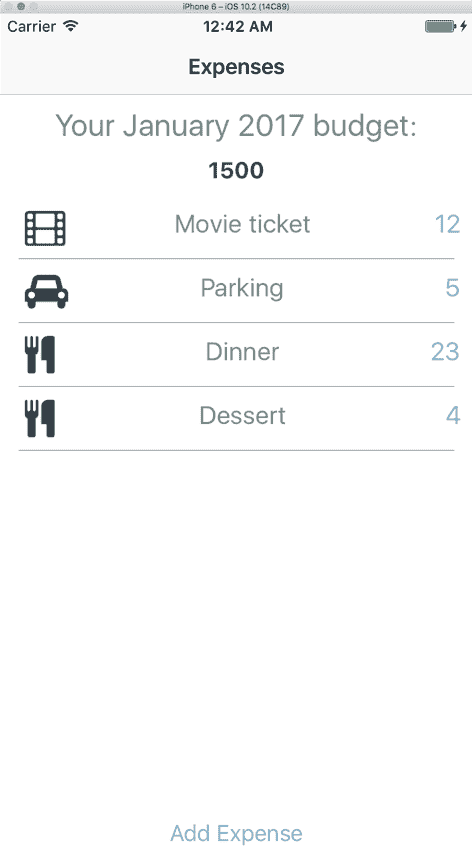

# 第四章：使用支出应用的高级功能

在上一章中，我们开始着手开发一个简单命名为`Expenses`的支出跟踪应用。在为该应用编写了一些基本功能后，我们的下一个目标是继续开发该应用并添加新的功能，使其功能完善。本章将涵盖以下主题：

+   利用`react-native-vector-icons`库在我们的应用中使用图标

+   学习如何使用`Picker`组件来渲染下拉菜单，例如一个可以接受任何项目数组的用户选择界面

+   更新我们的列表视图以显示支出类别图标，并显示当前花费的进度条

+   创建一个第二个视图来渲染之前月份的支出

+   使用`Icon.TabBarIOS`组件在当前月份和之前月份的视图之间切换

+   允许删除当前月份和之前月份添加的支出

由于本章内容广泛，关于将此应用修改为在 Android 设备上运行的章节已移至第九章《额外的 React Native 组件》。

# 使用矢量图标

在第三章《我们的第二个项目 - 预算应用》中，我们提到在点击该按钮后，用户应看到一个模态窗口，允许他们输入他们的支出详情：支出的名称、金额、购买日期以及用于分类的图标。该模态窗口应允许用户取消或保存他们所做的条目。

在我们的第一个练习中，我们应该做以下几件事情：

+   首先编写一个处理图标的工具文件：

    +   此文件应包含一个对象，其中包含类别字符串化名称和我们的矢量图标库中的图标名称。

    +   此文件还应包含一个方法，该方法接受图标的名称、所需大小和颜色，并返回该图标作为组件。将其视为无状态函数组件。

让我们看看我们如何利用上一章中安装的矢量图标库。

我们可以使用以下语句导入`react-native-vector-icons`：

```js
import Icon from '                                                                                                                                                                                                                                                                                                                                   react-native-vector-icons/FontAwesome'; 

```

这将`Icon`的引用映射到使用 Font Awesome 图标集的组件。

要使用它，您可以像这样渲染`Icon`组件：

```js
<Icon name="rocket" size={ 30 } color="#900" /> 

```

`name`属性告诉库从其集合中拉取哪个图标。您可以在[`fontawesome.io`](http://fontawesome.io)找到 Font Awesome 包含的所有图标列表。

我们的应用将包含以下 12 个图标：

+   `家`

+   `购物车`

+   `餐具`

+   `电影`

+   `汽车`

+   `咖啡`

+   `飞机`

+   `购物袋`

+   `书籍`

+   `啤酒`

+   `游戏手柄`

+   `插头`

这些图标所代表的类别将按以下顺序排列：

+   家

+   杂货

+   餐厅

+   娱乐

+   汽车

+   咖啡

+   旅行

+   购物

+   书籍

+   饮料

+   爱好

+   公用事业

考虑到这些，我们应该创建一个辅助文件，使我们能够渲染图标。

# 图标方法

`iconMethods`文件将比我们之前的辅助方法简单得多。使用`iconMethods`，我们的目标是保持一个映射类别名称和图标的对象，然后导出一个函数，帮助我们返回`react-native-vector-icon`组件。

```js
import React from 'react'; 

import Icon from 'react-native-vector-icons/FontAwesome'; 

const expenses = [ 
  { amount: '4', category: 'coffee', description: 'Latte' }, 
  { amount: '1.50', category: 'books', description: 'Sunday Paper' }, 
  { amount: '35', category: 'car', description: 'Gas' }, 
  { amount: '60', category: 'restaurant', description: 'Steak dinner' } 
];  

```

`categories`对象让我们可以快速访问类别和图标名称：

```js
export const getIconComponent = (categoryName, size, color) => { 
  return ( 
    <Icon 
      name={ categories[categoryName].iconName } 
      size={ size || 30 } 
      color={ color || '#3D4A53' }  
    /> 
  ); 
} 

```

这里，我们有一个无状态函数`getIconComponent`，它接受一个类别的`name`以及可选的`size`和`color`，然后返回我们的应用中的`Icon`组件。

现在我们已经构建了`iconMethods`文件，是时候创建一个`Picker`组件来选择一个类别了。

# Picker

到目前为止，在这本书中，我们使用了`DatePickerIOS`和`DatePickerAndroid`让用户选择日期。每个平台也可以访问本地的`Picker`组件，我们可以填充一个选择数组，并允许我们的用户与之交互。

构建`Picker`很简单。我们首先在组件的`render`方法中编写一个`Picker`，并用`Picker.Item`子项填充它：

```js
<Picker> 
  <Picker.Item  
    label='Hello' 
    value='hello' 
  /> 
</Picker>  

```

然后，我们可以给`Picker`一些属性。以下是在这个练习中使用的一些属性：

+   `onValueChange`：这是一个在项目被选中时触发的回调。它传递两个参数：`itemValue`和`itemPosition`

+   `selectedValue`：这是对`Picker`列表当前值的引用

# 选择一个类别

我们将修改现有的`AddExpensesModal`组件，以添加以下功能：

+   在`ExpandableCell`/`DatePickerIOS`组件下方创建一个`Button`，用于选择我们费用的类别。

+   当按钮被按下时，应该渲染一个`Picker`组件供用户交互。这个`Picker`应该具有以下功能：

    +   通过映射数组而不是硬编码每一个十二个类别，我们使用`Picker`项在我们的应用中包含十二个类别的列表。

    +   有一个回调将选定的值设置为我们的费用选定的类别。接下来：

        +   将这个`Picker`作为`AddExpensesModal`组件内的`ExpandableCell`组件的子组件渲染，以便在不使用时可以折叠。

        +   在`AddExpensesModal`中，在日期和保存/取消按钮之间渲染前一个`ExpandableCell`组件。

        +   使用`iconMethods`中的`getIconComponent`函数渲染选定的类别图标（如果适用），并对其样式进行设置，使其在页面上与`Picker`组件的`ExpandableCell`在同一行显示。

        +   修改`AddExpensesModal`，使其提交按钮在没有用户设置类别时也禁用。

自从我们在上一章中查看它们以来，`AddExpensesModal`组件及其样式经历了显著的变化。

```js
// Expenses/app/components/AddExpensesModal/index.js 

...
import { 
  ... 
  Picker, 
  ... 
} from 'react-native'; 
... 
import * as iconMethods from '../../utils/iconMethods'; 
... 
export default class AddExpensesModal extends Component { 
  ... 
  constructor (props) { 
    super (props); 

    this.state = { 
      amount: '', 
      category: undefined, 
      categoryPickerExpanded: false, 
      date: new Date(), 
      description: '', 
      datePickerExpanded: false 
    } 
  } 

```

每个`ExpandableCell`的`expanded`键被替换为两个单独的布尔值。

`expandableCellTitle`被替换为每个`ExpandableCell`的一个字符串：

```js
  render () { 
    const expandableCellDatePickerTitle = ... 
    const expandableCellCategoryPickerTitle = 'Category: ' +
      (this.state.category ? iconMethods.categories
      [this.state.category].name : 'None (tap to change)') 

```

原始 `ExpandableCell` 的渲染已被修改以适应变量和函数名称的变化，使其更具体于其子组件：

```js
    return ( 
      <Modal 
        animationType={ 'slide' } 
        transparent={ false } 
        visible={ this.props.modalVisible } 
      > 
        <ScrollView style={ styles.modalContainer }> 
          ... 
          <View style={ [styles.expandableCellContainer,
          { height: this.state.datePickerExpanded ? this.state.
          datePickerHeight : 40 }]}> 
            <ExpandableCell 
              expanded={ this.state.datePickerExpanded } 
              onPress={ () => this._onDatePickerExpand() } 
              title={ expandableCellDatePickerTitle }> 
              <DatePickerIOS 
                date={ this.state.date } 
                mode={ 'date' } 
                onDateChange={ (date) => this._onDateChange(date) } 
                onLayout={ (event) => this._getDatePickerHeight(event) 
                } 
              /> 
            </ExpandableCell> 
          </View> 
          <View style={ [styles.expandableCellContainer, 
          { height: this.state.categoryPickerExpanded ? 200 : 40 }]}> 
            <View style={ styles.categoryIcon }> 
              { this.state.category && iconMethods.
              getIconComponent(this.state.category) } 
            </View>

```

这是新添加的 `ExpandableCell` 组件，在其下方渲染一个 `Picker`：

```js
            <ExpandableCell 
              expanded={ this.state.categoryPickerExpanded } 
              onPress={ () => this._onCategoryPickerExpand() } 
              title={ expandableCellCategoryPickerTitle }> 
                <Picker 
                onValueChange={ (value, index) =>
                this._setItemCategory(value) } 
                selectedValue={ this.state.category }> 
                { this._renderCategoryPicker() } 
              </Picker> 
            </ExpandableCell> 
          </View> 

```

用于保存费用的 `Button` 组件已被修改以检查类别的存在，以便允许其保存：

```js
          <Button 
            color={ '#86B2CA' } 
            disabled={ !(this.state.amount && 
            this.state.description && this.state.category) } 
            onPress={ () => this._saveItemToBudget() } 
            title={ 'Save Expense' } 
          />  
          ... 
        </ScrollView> 
      </Modal> 
    ) 
  } 

```

`_clearFieldsAndCloseModal` 方法已更新以适应新字段：

```js
  ... 
  _clearFieldsAndCloseModal () { 
    this.setState({ 
      amount: '', 
      category: undefined, 
      categoryPickerExpanded: false, 
      date: new Date(), 
      datePickerExpanded: false, 
      description: '' 
    }); 

    this.props.toggleModal() 
  } 

```

`_onDatePickerExpand` 方法只是将旧 `_onExpand` 方法的重命名，而 `_onCategoryPickerExpand` 是特定于 `Picker` 类别的：

```js
  ... 
  _onCategoryPickerExpand () { 
    this.setState({ 
      categoryPickerExpanded: !this.state.categoryPickerExpanded 
    }) 
  } 

  _onDatePickerExpand () { 
    this.setState({ 
      datePickerExpanded: !this.state.datePickerExpanded 
    }); 
  } 

```

通过将类别名称数组映射到新元素来渲染每个 `Picker.Item`：

```js
  _renderCategoryPicker () { 
    var categoryNames = Object.keys(iconMethods.categories); 

    return categoryNames.map((elem, index) => { 
      return ( 
        <Picker.Item 
          key={ index } 
          label={ iconMethods.categories[elem].name } 
          value={ elem } 
        /> 
      ) 
    }) 
  } 

```

`_setItemCategory` 函数在 `Picker` 类别的 `onValueChange` 回调中触发：

```js
  _setItemCategory (category) { 
    this.setState({ 
      category 
    }); 
  } 

```

将 `_saveItemToBudget` 中的 `category` 属性保存到存储中：

```js
  async _saveItemToBudget () { 
    const expenseObject = { 
      amount: this.state.amount, 
      category: this.state.category, 
      date: moment(this.state.date).format('ll'), 
      description: this.state.description 
    }; 

    await storageMethods.saveItemToBudget(this.props.month, 
    this.props.year, expenseObject); 

    this._clearFieldsAndCloseModal(); 
  } 
} 

```

这就是新的 `Picker` 组件应有的样子：


我为 `categoryIcon` 添加了样式：

```js
// Expenses/app/components/AddExpensesModal/styles.js 

import { Dimensions, Navigator, StyleSheet } from 'react-native'; 

const styles = StyleSheet.create({ 
  ... 
  categoryIcon: { 
    flex: 1, 
    marginLeft: Dimensions.get('window').width - 50, 
    position: 'absolute' 
  }, 

```

上述代码使用 `Dimensions` API 将 `marginLeft` 设置为屏幕宽度减去 `50` 像素。

```js
  ... 
  expandableCellContainer: { 
    flex: 1, 
    flexDirection: 'row' 
  }, 
  ... 
}); 

export default styles; 

```

上述代码已更新样式，包含 `flexDirection` 为 `row`。

# 更新 CurrentMonthExpenses 和 ExpenseRow

到目前为止，我们一直在渲染没有类别的 `CurrentMonthExpenses` 和 `ExpenseRow` 组件，因为没有之前存在。让我们带着以下目标更新它们：

+   `CurrentMonthExpenses` 应该访问每个项目的类别并将其传递给 `ExpenseRow`

+   `ExpenseRow` 应该在费用行中渲染适当的分配图标，以便我们的用户可以快速了解他们花预算的部分是什么

+   我们应该使用在 `StorageMethods` 中创建的 `resetAsyncStorage` 方法在修改 `ExpenseRow` 之前清除任何当前的费用列表，以确保未分配类别的先前费用不会引起任何问题

更新这些组件后，查看我的解决方案，如下所示：

```js
// Expenses/app/App.js 

... 
export default class App extends Component { 
  ... 
  componentWillMount () { 
    storageMethods.resetAsyncStorage(); 
    ... 
  } 
  ... 
}

```

上述代码使用了一次（之后没有保存到文件中）来清除存储。

然后，我将 `CurrentMonthExpenses` 组件更新为将分配给费用的 `category` 作为属性传递给 `ExpenseRow` 组件：

```js
// Expenses/app/components/CurrentMonthExpenses/index.js 

... 
export default class CurrentMonthExpenses extends Component { 
  ... 
  _renderRowData (rowData, rowID) { 
    if (rowData) { 
      return ( 
        <ExpenseRow 
          amount={ rowData.amount } 
          category={ rowData.category } 
          description={ rowData.description } 
        /> 
      ) 
    } 
  } 
  ... 
}; 

```

之后，我创建了一个新的 `View` 来渲染类别图标：

```js
// Expenses/app/components/ExpenseRow/index.js 

... 
import * as iconMethods from '../../utils/iconMethods'; 
... 
export default (props) => { 
  return ( 
    <View style={ styles.expenseRowContainer }> 
      <View style={ styles.icon }> 
        { iconMethods.getIconComponent(props.category) } 
      </View> 
      ... 
    </View> 
  ) 
} 

```

对于样式，添加了以下 `icon` 属性：

```js
// Expenses/app/components/ExpenseRow/styles.js 

const styles = StyleSheet.create({ 
  ... 
  icon: { 
    flex: 1, 
    marginLeft: 10 
  } 
}); 

```

添加图标后，您的应用应如下所示：



更新做得很好！在下一节中，我们应该使用进度指示器给用户展示他们剩余预算的视觉化。

# 使用 ProgressViewIOS 更新 App.js

在上一章规划此应用时，我们写道这个列表还应突出显示用户为该月设定的预算以及一个进度指示器，显示他们离达到预算有多近。

使用 `ProgressViewIOS`，我们可以描绘用户向月度限额的进展。以下属性将用于本项目：

+   `progress`：这是一个介于`0`和`1`之间的数字，用于跟踪进度条的值

+   `progressTintColor`：这是一个设置进度条颜色的字符串

您可以这样渲染一个`ProgressViewIOS`组件：

```js
<View> 
  <ProgressViewIOS 
    progress={ 0.75 } 
    progressTintColor={ '#86B2CA' } 
  /> 
</View> 

```

在本节中，我们应该更新`Expenses`以执行以下操作：

+   首先，我们应该修改`storageMethods`中的`checkCurrentMonthBudget`函数，使其也返回该月的花费金额

+   然后，`App.js`应该更新其`_updateBudget`函数，以考虑`checkCurrentMonthBudget`返回的花费金额

+   最后，将一个`ProgressViewIOS`组件添加到`CurrentMonthExpenses`：

    +   它应该有一个函数来计算其`progress`属性

    +   它还应该显示当前花费的金额作为字符串

# ProgressViewIOS 示例

首先，我们需要向我们的`storageMethods`文件中添加一个条目，以获取当前月份的花费金额，以便我们可以计算`ProgressViewIOS`的`progress`属性。这可以通过修改`checkCurrentMonthBudget`来实现：

```js
// Expenses/app/utils/storageMethods.js 

export const checkCurrentMonthBudget = async () => { 
  let year = dateMethods.getYear(); 
  let month = dateMethods.getMonth(); 

  let response = await getAsyncStorage(); 

  if (response === null || !response.hasOwnProperty(year) ||
  !response[year].hasOwnProperty(month)) { 
    return false; 
  } 

  let details = response[year][month]; 

  return { 
    budget: details.budget, 
    spent: details.spent 
  } 
} 

```

在这里，我们返回一个包含`budget`和`spent`金额的对象，而不是仅仅`budget`。这意味着我们还需要修改`App`组件的`_updateBudget`方法接收我们的响应数据的方式。

以下对`App`组件的添加仅显示了`_updateBudget`异步方法，因为它是我们唯一修改以适应`storageMethods`的`checkCurrentMonthBudget`方法更改的部分：

```js
// Expenses/app/App.js 

... 
  async _updateBudget () { 
    let response = await storageMethods.checkCurrentMonthBudget(); 

    if (response !== false) { 
      this.setState({ 
        budget: response.budget, 
        spent: response.spent 
      }); 

      return; 
    } 

    this._renderEnterBudgetComponent(); 
  } 

```

将预算作为字符串渲染的文本块已被修改，以显示当前花费的金额：

```js
// Expenses/app/components/CurrentMonthExpenses/index.js 

... 
import { 
  ProgressViewIOS, 
  ... 
} from 'react-native'; 
... 
export default class CurrentMonthExpenses extends Component { 
  ... 
  render () { 
    ... 
    return ( 
      <View style={ styles.currentMonthExpensesContainer }> 
        <View style={ styles.currentMonthExpensesHeader }> 
          ... 
          <Text style={ styles.subText }> 
            { this.props.spent } of { this.props.budget } spent 
          </Text> 

```

一个`ProgressViewIOS`组件也紧随前面的文本块之后挂载，将其`progress`属性指向一个名为`_getProgressViewAmount`的函数，该函数为我们计算它：

```js
          <ProgressViewIOS 
            progress={ this._getProgressViewAmount() } 
            progressTintColor={ '#A3E75A' } 
            style={ styles.progressView } 
          /> 
        </View> 
        ... 
      </View> 
    ) 
  } 

```

以下代码是一个简单的除法，用于获取百分比：

```js
  _getProgressViewAmount () { 
    return this.props.spent/this.props.budget; 
  } 
  ... 
}; 

```

将`margin`设置为`10`，以便它不会达到屏幕边缘：

```js
// Expenses/app/components/CurrentMonthExpenses/styles.js 

... 
const styles = StyleSheet.create({ 
  ... 
  progressView: { 
    margin: 10 
  }, 
  ... 
}); 

export default styles; 

```

将两个属性的`fontSize`都减少到`16`，并将`alignSelf`设置为`center`：

```js
// Expenses/app/components/ExpenseRow/styles.js 

... 
const styles = StyleSheet.create({ 
  amountText: { 
    alignSelf: 'center', 
    color: '#86B2CA', 
    flex: 1, 
    fontSize: 16, 
    marginRight: 10, 
    textAlign: 'right' 
  }, 

  descriptionText: { 
    alignSelf: 'center', 
    color: '#7D878D', 
    fontSize: 16, 
    textAlign: 'left' 
  }, 
}); 

export default styles; 

```

由于这些变化，您的应用现在应该有一个进度指示器，显示用户距离达到本月预算还有多远。

多亏了`App.js`中的`_updateCurrentMonthExpenses`函数，保存新的月度花费将导致花费金额和进度指示器相应更新，而无需编写任何新的逻辑：


看起来很棒！我们的下一步是创建一个第二个视图，让我们可以查看所有月份的花费，这反过来又让我们使用 TabBar 在两个视图之间切换。

# 前几个月份花费的视图

我们的前几个月份花费视图应该是一个渲染我们预算中现有月份列表的视图。它应该给出月份、该月的预算分配，并且年份通过某种标题分隔。然后，在点击时，它应该转到每个月份的摘要，显示我们之前输入的月份花费。

我们应该在名为 `mockDataMethods` 的新工具文件中创建一些函数，以帮助我们模拟前几个月的数据并填充我们的应用程序：

```js
// Expenses/app/utils/mockDataMethods.js 

import { setAsyncStorage } from './storageMethods'; 

const years = ['2017', '2016', '2015']; 
const months = ['1', '2', '3', '4', '5', '6', '7', '8', '9', '10', '11', '12']; 

const expenses = [ 
  { amount: '4', category: 'coffee', description: 'Latte' }, 
  { amount: '1.50', category: 'books', description: 'Sunday Paper' }, 
  { amount: '35', category: 'car', description: 'Gas' }, 
  { amount: '60', category: 'restaurant', description: 'Steak dinner' } 
]; 

```

如上所述，已创建并填充了年份、月份和支出数组的数组。

```js
const mockObject = { 
  budget: 500, 
  expenses: expenses, 
  spent: 100.5 
}; 

```

我为每个月创建了一个模拟对象：

```js
export const mockPreviousMonthExpenses = async () => { 
  let mockedPreviousMonthsExpensesObject = {}; 
  years.forEach((year) => { 
    mockedPreviousMonthsExpensesObject[year] = {}; 

    months.forEach((month) => { 
      if (year === '2017' && (parseInt(month) > 1)) { 
        return; 
      } 

      mockedPreviousMonthsExpensesObject[year][month] = 
      Object.assign({}, mockObject); 
    }); 
  }); 

 setAsyncStorage(mockedPreviousMonthsExpensesObject); 
} 

```

此函数遍历 `years` 数组，并在该年份的属性中创建一个空对象。然后，它在其中进行另一个循环，为该 `year` 中的 `month` 创建一个类似的对象，并将 `mockObject` 分配给它。在这个过程中，如果尝试为 2017 年 1 月之后月份创建任何模拟支出，它还会停止函数。

然后，我们使用我们的 `setAsyncStorage` 函数将我们的模拟支出对象分配为应用程序的真实来源：

```js
// Expenses/app/App.js 

import { mockPreviousMonthExpenses } from './utils/mockDataMethods'; 
... 
export default class App extends Component { 
  ... 
  componentWillMount () { 
    mockPreviousMonthExpenses(); 
    storageMethods.logAsyncStorage(); 
    ... 
  } 
  ... 
} 

```

在 `App.js` 的 `componentWillMount` 生命周期中，我们可以调用在 `mockDataMethods` 中创建的 `mockPreviousMonthExpenses` 函数，以用此模拟数据填充我们的本地存储。

此外，我们使用 `storageMethods` 中的 `logAsyncStorage` 方法将信息记录到控制台，以便我们可以看到我们的模拟数据已被保存到存储中以便以后使用。

完成此步骤后，你应该从 `App.js` 中删除 `mockPreviousMonthExpenses` 函数，因为它不需要持续调用。以下是我们的模拟支出将看起来如何。你可以通过在对象上调用 `console.table` 并打开 Chrome 开发者工具来查看你的结果。


完成此步骤后，我们应该创建一个新的组件来显示这些详细信息。由于我们想要一个包含某种标题以分隔年份的列表，我们将渲染一个 `ListView` 并使用 `renderSectionHeader` 属性在我们的应用程序中创建分区。

# 带有分区标题的 `ListView`

为了设置 `ListView` 以适应分区标题，我们需要对我们创建 `ListViews` 的方式做一些修改。

首先，当我们实例化一个新的 `ListView DataSource` 时，我们将传递第二个回调 `sectionHeaderHasChanged`。像 `rowHasChanged` 一样，这个回调检查分区标题是否已更改。在你的代码中，它看起来像这样：

```js
 this.state = { 
   ds: new ListView.DataSource({ 
   rowHasChanged: (r1, r2) => r1 !== r2, 
   sectionHeaderHasChanged: (s1, s2) => s1 !== s2 
    }), 
  } 

```

然后，我们不再调用 `cloneWithRows`，而是调用同名的 `cloneWithRowsAndSections` 函数：

```js
const dataSource = this.state.ds.cloneWithRowsAndSections
(this.state.listOfExpenses); 

```

最后，你的 `ListView` 组件现在应该接受一个函数作为其 `renderSectionHeader` 属性，该函数将渲染应用程序的分区标题：

```js
<ListView 
  ... 
  renderSectionHeader={ (sectionData, sectionID) => 
  this._renderSectionHeader(sectionData, sectionID) } 
/> 

_renderSectionHeader (sectionData, sectionID) { 
  return ( 
    <View> 
      <Text>{ sectionID }</Text> 
    </View> 
  ) 
} 

```

现在你已经了解了如何将分区标题应用到你的 `ListView` 组件上，现在是时候应用这些知识了。让我们创建一个新的组件，`PreviousMonthsList`。此组件应该执行以下操作：

+   目前，将 `App.js` 中 `CurrentMonthExpenses` 的渲染替换为你的 `PreviousMonthsList` 组件，这样你可以在编写组件时查看你的进度。

+   从 `AsyncStorage` 获取支出列表并将其保存到组件状态

+   渲染一个带有部分标题的`ListView`，显示月份名称作为字符串以及该月的预算数字以及我们`mocked`支出提供的每年部分标题。

+   为行和部分标题设置不同的样式，以便彼此区分。

一旦构建了你的组件版本，检查我构建的那个：

```js
// Expenses/app/App.js 

... 
import PreviousMonthsList from './components/PreviousMonthsList'; 

export default class App extends Component { 
  ... 
  render () { 
    return ( 
      <View style={ styles.appContainer }> 
        <PreviousMonthsList /> 
        ... 
      </View> 
    ) 
  } 
  ... 
} 

```

我首先将`PreviousMonthsList`导入到`App.js`中，并用`PreviousMonthsList`替换了`render`方法中`CurrentMonthExpenses`被挂载的位置。这样，我就可以更简单地工作在这个组件上，知道我做的任何更改都会立即显现。

在完成此组件后，我将`App.js`恢复到其原始状态（在创建`PreviousMonthsList`组件之前）：

```js
// Expenses/app/components/PreviousMonthsList/index.js 

import React, { Component } from 'react'; 

import { 
  ListView, 
  Text, 
  View 
} from 'react-native'; 

import styles from './styles'; 
import * as dateMethods from '../../utils/dateMethods'; 
import * as storageMethods from '../../utils/storageMethods'; 

export default class PreviousMonthsList extends Component { 
  constructor (props) { 
    super (props); 

    this.state = { 
      ds: new ListView.DataSource({ 
        rowHasChanged: (r1, r2) => r1 !== r2, 
        sectionHeaderHasChanged: (s1, s2) => s1 !== s2 
      }), 
      listOfExpenses: {} 
    }; 
  } 

```

将新的`sectionHeaderHasChanged`函数传递给保存在组件状态中的`DataSource`实例。

在`componentWillMount`生命周期事件中，我异步调用`storageMethods`中的`getAsyncStorage`函数，并将结果保存到组件状态的`listOfExpenses`属性中：

```js
  async componentWillMount () { 
    let result = await storageMethods.getAsyncStorage(); 

    this.setState({ 
      listOfExpenses: result 
    }); 
  } 

```

将`dataSource`常量分配给保存在组件状态中的`ListView.DataSource`实例的`cloneWithRowsAndSections`方法，以便在应用中提供我们支出列表的部分标题：

```js
   render () { 
    const dataSource = this.state.ds.cloneWithRowsAndSections
    (this.state.listOfExpenses); 

    return ( 
      <View style={ styles.previousMonthsListContainer }> 
        <ListView 
          automaticallyAdjustContentInsets={ false } 
          dataSource={ dataSource } 
          renderRow={ (rowData, sectionID, rowID) => this._
          renderRowData(rowData, rowID) } 
          renderSectionHeader={ (sectionData, sectionID) => this._
          renderSectionHeader(sectionData, sectionID) } 
          renderSeparator={ (sectionID, rowID) => this._
          renderRowSeparator(sectionID, rowID) } 
        /> 
      </View> 
    ) 
  } 

```

处理渲染行数据、部分标题和分隔符的三个无状态函数中没有什么特别之处。

```js
  _renderRowData (rowData, rowID) { 
    return ( 
      <View style={ styles.rowDataContainer }> 
        <Text style={ styles.rowMonth }> 
          { dateMethods.getMonthString(rowID) } 
        </Text> 
        <Text style={ styles.rowBudget }> 
          { rowData.budget } 
        </Text> 
      </View> 
    ) 
  } 

_renderRowSeparator (sectionID, rowID) { 
    return ( 
      <View 
        key={ sectionID + rowID } 
        style={ styles.rowSeparator } 
      /> 
    ) 
  } 

  _renderSectionHeader (sectionData, sectionID) { 
    return ( 
      <View style={ styles.sectionHeader }> 
        <Text style={ styles.sectionText }> 
          { sectionID } 
        </Text> 
      </View> 
    ) 
  } 
} 

```

`rowDataContainer`样式被赋予一个`flexDirection`属性，设置为`row`，以便在它内部渲染的两个字符串位于同一行：

```js
// Expenses/app/components/PreviousMonthsList/styles.js 

import { StyleSheet } from 'react-native'; 

const styles = StyleSheet.create({ 
  previousMonthsListContainer: { 
    flex: 1 
  }, 
  rowBudget: { 
    color: '#86B2CA', 
    flex: 1, 
    fontSize: 20, 
    marginRight: 10, 
    textAlign: 'right' 
  }, 
  rowDataContainer: { 
    flex: 1, 
    flexDirection: 'row', 
    marginTop: 10, 
    height: 30 
  }, 

```

`sectionHeader`有自己的样式，以便可以设置特定的`height`和`backgroundColor`，从而在视觉上将其与`PreviousMonthsList`组件中的数据行区分开来：

```js
  rowMonth: { 
    color: '#7D878D', 
    flex: 1, 
    fontSize: 20, 
    marginLeft: 10, 
    textAlign: 'left' 
  }, 
  rowSeparator: { 
    backgroundColor: '#7D878D', 
    flex: 1, 
    height: StyleSheet.hairlineWidth, 
    marginLeft: 15, 
    marginRight: 15 
  }, 
  sectionHeader: { 
    height: 20, 
    backgroundColor: '#86B2CA' 
  }, 
  sectionText: { 
    color: '#7D878D', 
    marginLeft: 10 
  } 
}); 

export default styles; 

```

在这一点上，通过临时将`PreviousMonthsList`渲染到`CurrentMonthExpenses`之前的位置，我们得到了一个看起来像这样的视图：


# 上个月的支出

我们想要执行的下一步是创建一个视图，显示每个月的支出，然后允许用户通过点击这些月份之一进入该视图。当用户在`PreviousMonthsList`组件中长按月份时，应导航到该视图。

幸运的是，我们已经有了一个可以为我们处理这个的组件。在上一个章节中，我们构建了`CurrentMonthExpenses`组件，用于渲染给定月份的支出。

到目前为止，在我们的应用中，`CurrentMonthExpenses`仅在`App.js`中渲染。它渲染的容器有一个顶部边距偏移，以适应导航栏。

如果我们想要重用`CurrentMonthExpenses`组件来渲染任何月份的支出，我们应该构建一些逻辑，以便在通过`PreviousMonthsList`导航到组件时，选择性地包含等于导航栏高度的顶部边距偏移。

这可以通过让`CurrentMonthExpenses`接受一个可选的布尔值作为属性，然后将其`currentMonthExpensesContainer`样式中的顶部边距设置为导航栏的高度来实现：

```js
// Expenses/app/components/CurrentMonthExpenses/index.js 

... 
import { 
  ... 
  Navigator, 
} from 'react-native'; 
... 
export default class CurrentMonthExpenses extends Component { 
  static propTypes = { 
    ... 
    isPreviousMonth: PropTypes.bool, 
  } 

  ... 
  render () { 
    ... 
    return ( 
      <View style={ [styles.currentMonthExpensesContainer, 
        this.props.isPreviousMonth ? {marginTop: Navigator.
        NavigationBar.Styles.General.TotalNavHeight} : {}] }> 
        ... 
      </View> 
    ) 
  } 
  ... 
}; 

```

导入`Navigator`以便我们能够访问其导航栏的高度。`CurrentMonthExpenses`组件的`propTypes`已更新，以期望一个可选的布尔值，标题为`isPreviousMonth`。

然后，`CurrentMonthExpenses`的`render`方法检查是否已将`isPreviousMonth`布尔值传递给组件。如果是，它将`marginTop`属性添加到`currentMonthExpensesContainer`样式，其值等于导航栏的高度。

现在是时候将`PreviousMonthsList`中的每一行链接到导航到`CurrentMonthExpenses`组件。修改您的`PreviousMonthsList`组件，使其执行以下操作：

+   导入并包装每个正在渲染的行上的`TouchableHighlight`组件。

+   当按下其中一行时，您的应用应导航到`CurrentMonthExpenses`。

+   作为导航到`CurrentMonthExpenses`的一部分，您的应用导航器应传递给它所有它期望的属性（如`CurrentMonthExpenses`的`propTypes`对象中指定的），以及可选的`isPreviousMonth`属性设置为`true`。

当您完成此步骤后，查看我提出的解决方案：

```js
// Expenses/app/components/PreviousMonthsList/index.js 

... 
import { 
  ... 
  TouchableHighlight, 
} from 'react-native'; 

import CurrentMonthExpenses from '../CurrentMonthExpenses'; 
... 

export default class PreviousMonthsList extends Component { 
  ... 
  _renderRowData (rowData, sectionID, rowID) { 
    return ( 
      <View style={ styles.rowDataContainer }> 
        <TouchableHighlight 
          onPress={ () => this._renderSelectedMonth(rowData,
          sectionID, rowID) } 
          style={ styles.rowDataTouchableContainer }> 
          ... 
        </TouchableHighlight> 
      </View> 
    ) 
  } 

```

我修改了`PreviousMonthsList`的`_renderRowData`方法，将其包装在一个`TouchableHighlight`组件周围。由于`TouchableHighlight`只能接受一个直接子组件，我将两个文本元素包装在一个`View`中。

`_renderSelectedMonth`方法将`CurrentMonthExpenses`推送到导航器，并传递给它该组件所有预期的属性。我使用了`Number.toString`原型方法将`rowData.budget`数字转换为字符串，因为`CurrentMonthExpenses`期望其`budget`属性为字符串：

```js
  ... 
  _renderSelectedMonth (rowData, sectionID, rowID) { 
    this.props.navigator.push({ 
      component: CurrentMonthExpenses, 
      title: dateMethods.getMonthString(rowID) + ' ' + sectionID, 
      passProps: { 
        budget: rowData.budget.toString(), 
        expenses: rowData.expenses, 
        isPreviousMonth: true, 
        month: rowID, 
        spent: rowData.spent, 
        year: sectionID 
      } 
    }) 
  } 
} 

```

我将`rowDataTouchableContainer`样式的`height`设置为`30`像素，并将`textRow`的`flexDirection`属性设置为`row`，这样其中的两个`Text`组件就能正确渲染：

```js
// Expenses/app/components/PreviousMonthsList/styles.js 

... 
const styles = StyleSheet.create({ 
  ... 
  rowDataTouchableContainer: { 
    flex: 1, 
    height: 30 
  }, 
  ... 
  textRow: { 
    flex: 1, 
    flexDirection: 'row' 
  } 
}); 
... 

```

当用户按下前一个月的名称时，他们将现在看到以下视图：


现在，我们的用户在应用中有两条不同的路径可以选择：他们可以在`App.js`中查看添加当前月份的费用列表，或者他们可以查看他们之前所有月份的费用存档。在下一节中，我们将学习如何实现标签栏来显示这两个视图。

# 实现`TabBarIOS`

`TabBarIOS`在屏幕底部渲染一个标签导航栏。该栏可以包含多个图标，每个图标负责不同的视图。

`TabBarIOS`渲染的不同标签被认为是标签栏的项目。它们被声明为`TabBarIOS.Item`组件，并且作为`TabBarIOS`的子组件嵌套。

然而，使用我们导入的 `react-native-vector-icons` 库，我们希望使用 Font Awesome 图标进行导航。我们不会将 `TabBarIOS.Item` 组件作为 `TabBarIOS` 组件的子组件渲染，而是用 `Icon.TabBarItemIOS` 替换它们。

`Icon.TabBarItemIOS` 是一个组件，其行为方式与 `TabBarIOS.Item` 完全相同，但它有一些特定的额外属性。在我们的实现中，我们将使用以下属性：

+   `onPress`：这是一个当用户点击标签时触发的回调。这应该至少在您的状态中将选定的组件设置为布尔值。

+   `selected`：这是一个布尔值，用于确定特定的标签是否在应用的前台。

+   `title`：这是一个显示在图标下方的文本的字符串。

+   `iconName`：这是一个映射到你希望显示的图标的字符串。

+   `iconSize`：这是一个指定图标大小的数字。

`iconColor` 和 `selectedIconColor` 需要将 `renderAsOriginal` 设置为 `true`，以便这些子级设置覆盖父 `TabBarIOS` 组件的 `tintColor` 和 `unselectedTintColor` 属性。

下面是一个示例 `TabBarIOS` 组件可能的样子：

```js
<TabBarIOS> 
  <Icon.TabBarItemIOS 
    iconName={ 'home' } 
    iconSize={ 20 } 
    onPress={ () => this._setSelectedTab('home') } 
    selected={ this.state.selectedTab === 'home' } 
    title={ 'home' } 
  > 
    { this._renderHomeView() } 
  </Icon.TabBarItemIOS> 
</TabBarIOS> 

```

如你所见，`TabBarIOS` 包围了 `Icon.TabBarItemIOS` 子组件。这些子组件各自处理自己的图标类型、大小和标题。它们还围绕一个渲染各自视图的函数。

现在，是你尝试的时候了。让我们通过以下步骤将 `TabBarIOS` 组件构建到我们的应用中：

+   使用 `TabBarIOS` 将应用分成 *当前月份* 和 *上个月份* 的支出。为每个选择一个合适的图标！

+   根据需要调整样式，以适应 `TabBarIOS` 的任何尺寸。

+   为每个 `PreviousMonthsList` 提供自己的 `NavigatorIOS` 组件，这样当 `PreviousMonthsList` 导航到上个月份的支出列表时，`TabBarIOS` 组件不会消失。

+   从 `index.ios.js` 中的根级 `NavigatorIOS` 组件中移除导航栏，以便 `PreviousMonthsList` 的导航组件不会渲染第二个导航栏。

一旦你为应用构建了标签导航，请返回并查看我写的版本：

```js
// Expenses/index.ios.js 

... 
export default class Expenses extends Component { 
  render() { 
    return ( 
      <NavigatorIOS 
        ... 
        navigationBarHidden={ true } 
      /> 
    ); 
  } 
} 
... 

```

对 `index.ios.js` 根文件所做的唯一更改是添加了 `navigationBarHidden` 属性，将其设置为 `true` 以确保导航栏不会显示。

```js
// Expenses/app/App.js 

... 
import { 
  NavigatorIOS, 
  ... 
} from 'react-native'; 

...

```

在 `App.js` 组件中，我现在正在显式地将项目设置为默认值，以便依赖于该属性的组件在属性未定义时不会抛出错误。此外，`expenses` 键已被修改为对象——这将是 `StorageMethods` 中的 `getAsyncStorage` 方法返回的完整对象，而不仅仅是当前月份的：

```js
export default class App extends Component { 
  constructor (props) { 
    super(); 

    this.state = { 
      budget: '', 
      expenses: {}, 
      selectedTab: 'currentMonth', 
    } 
  }

```

整个 `expenses` 对象将被传递到 `PreviousMonthsList` 中，允许它渲染所有支出数据，并在通过 `AddExpenses` 组件向前一个月添加新项目时更新。

旧的 `expenses` 数组，它仅引用当前月份，现在被明确标记为 `currentMonthExpenses`。

组件的状态中还有一个新项目--`selectedTab`。它默认为 `currentMonth`，这是我们打算渲染的最左侧标签。

```js
  componentWillMount () { 
    this.setState({ 
      spent: 0, 
      currentMonthExpenses: [], 
      month: dateMethods.getMonth(), 
      year: dateMethods.getYear() 
    }); 

    ... 
  } 

```

`App.js` 的渲染方法已经完全重写。现在它返回一个 `TabBarIOS` 组件和两个 `Icon.TabBarItemIOS` 子组件，每个组件渲染不同的视图：

```js
  render () { 
    return ( 
      <TabBarIOS> 
        <Icon.TabBarItemIOS 
          iconName={ 'usd' } 
          iconSize={ 20 } 
          onPress={ () => this._setSelectedTab('currentMonth') } 
          title={ 'Current Month' } 
          selected={ this.state.selectedTab === 'currentMonth' } 
        > 
          { this._renderCurrentMonthExpenses(this.state.
          currentMonthExpenses) } 
        </Icon.TabBarItemIOS> 
        <Icon.TabBarItemIOS 
          iconName={ 'history' } 
          iconSize={ 20 } 
          onPress={ () => this._setSelectedTab('previousMonths') } 
          title={ 'Previous Months' } 
          selected={ this.state.selectedTab === 'previousMonths' } 
        > 
          { this._renderPreviousMonthsList(this.state.expenses) } 
        </Icon.TabBarItemIOS> 
      </TabBarIOS> 
    ) 
  } 

```

`_renderCurrentMonthExpenses` 方法包含此组件的旧 `render` 方法：

```js
  _renderCurrentMonthExpenses () { 
    return ( 
      <View style={ styles.appContainer }> 
        <CurrentMonthExpenses 
          budget={ this.state.budget } 
          expenses={ this.state.currentMonthExpenses } 
          month={ this.state.month } 
          spent={ this.state.spent } 
          year={ this.state.year } 
        /> 
        <AddExpenses 
          month={ this.state.month } 
          updateExpenses={ () => this._updateExpenses() } 
          year={ this.state.year } 
        /> 
      </View> 
    ) 
  } 

```

`_renderPreviousMonthsList` 方法返回一个初始路由为 `PreviousMonthsList` 的 `NavigatorIOS` 组件。`App.js` 状态中的 `expenses` 键通过 `passProps` 传递给 `PreviousMonthsList`：

```js
  ...  
  _renderPreviousMonthsList () { 
    return ( 
      <NavigatorIOS 
        initialRoute={{ 
          component: PreviousMonthsList, 
          title: 'Previous Months', 
          passProps: { 
            expenses: this.state.expenses 
          } 
        }} 
        style={ styles.previousMonthsContainer } 
      /> 
    ) 
  } 

```

`_setSelectedTab` 函数将 `App.js` 组件状态中的 `selectedTab` 属性更改为传递给它的参数。这是由 `Icon.TabBarItemIOS` 的 `onPress` 属性触发的回调：

```js
  ...  
  _setSelectedTab (selectedTab) { 
    this.setState({ 
      selectedTab 
    }); 
  } 

```

最后的更改是 `_updateCurrentMonthExpenses` 现在调用 `storageMethods.js` 中的 `getAsyncStorge` 而不是 `getMonthObject`，并且已重命名为 `_updateExpenses` 以反映其新功能：

```js
  ... 
  async _updateBudget () { 
      ... 
      this._updateExpenses(); 
      ... 
    } 
    ... 
  } 

  async _updateExpenses () { 
    let response = await storageMethods.getAsyncStorage(); 

    if (response) { 
      let currentMonth = response[this.state.year][this.state.month]; 

      this.setState({ 
        budget: currentMonth.budget, 
        currentMonthExpenses: currentMonth.expenses, 
        expenses: response, 
        spent: currentMonth.spent 
      }); 
    } 
  } 
} 

```

`previousMonthsContainer` 样式应用于渲染 `PreviousMonthsList` 的 `NavigatorIOS` 实例。它不包含等于导航栏高度的顶部边距，因为这会导致导航栏本身具有等于其自身高度的顶部边距：

```js
// Expenses/app/styles.js 

... 
const styles = StyleSheet.create({ 
  ... 
  previousMonthsContainer: { 
    flex: 1, 
    marginBottom: 48 
  } 
}); 

export default styles; 

```

对 `PreviousMonthsList` 的微小更改是我现在正在检查传递给它的 `expenses` 对象，并且在 `render` 方法中的 `cloneWithRowsAndSections` 调用现在已更新以反映这一点。

此外，`componentWillMount` 生命周期方法已被完全移除，因为我们现在作为属性获取所有数据。

```js
// Expenses/app/components/PreviousMonthsList/index.js 

import React, { Component, PropTypes } from 'react'; 
... 
export default class PreviousMonthsList extends Component { 
  static propTypes = { 
    expenses: PropTypes.object.isRequired 
  } 
  ...  
  render () { 
    const dataSource = this.state.ds.cloneWithRowsAndSections
    (this.props.expenses); 
    ... 
  } 
  ...  
} 

```

在此组件中，`previousMonthsListContainer` 的 `marginTop` 属性已设置为导航栏高度：

```js
// Expenses/app/components/PreviousMonthsList/styles.js 

import { Navigator, StyleSheet } from 'react-native'; 

const styles = StyleSheet.create({ 
  previousMonthsListContainer: { 
    ...  
    marginTop: Navigator.NavigationBar.Styles.General.TotalNavHeight, 
  }, 
  ... 
}); 

export default styles; 

```

最后，`AddExpenses` 组件已经调整，以反映将 `_updateCurrentExpenses` 函数名称更改为 `_updateExpenses`：

```js
// Expenses/app/AddExpenses/index.js 

... 
export default class AddExpenses extends Component { 
  static propTypes = { 
    ... 
    updateExpenses: PropTypes.func.isRequired, 
    ... 
  } 
  ... 
  _toggleModal (boolean) { 
    ... 
    this.props.updateExpenses(); 
  } 
} 

```

这是实现 `TabBarIOS` 后你的应用应该看起来的样子：


我们还应该对应用做最后一件事，那就是让用户能够删除支出。

# 删除支出

为了让用户能够从任何月份删除支出，我们需要做以下几件事：

+   在 `storageMethods` 中添加一个方法来更新 `expenses` 对象。它应该接受月份、年份和支出数组。然后，它应该用这个新数组覆盖 `AsyncStorage` 中特定月份和年份组合的支出数组，并重新计算支出金额。

+   将 `TouchabbleHighlight` 组件包裹在每一行周围，当长按时，会弹出一个提示框询问用户是否希望删除该项目。

+   如果用户确认他们想要删除该项目，那么我们应该删除它。应该创建一个新的当前月份支出数组，不包含已删除的项目，并使用我们制作的 `storageMethods` 函数保存。

+   当删除一项支出时，我们应该更新当前视图以反映被删除的项目和更新的支出金额。

+   如果用户取消，则警报应关闭且不应进行任何更改。

花些时间构建这个功能；当你完成时，查看我为这部分编写的代码。

首先，我修改了 `StorageMethods` 文件：

```js
// Expenses/app/utils/StorageMethods.js 

... 
export const saveItemToBudget = async (month, year, expenseObject) => { 
  let response = await getAsyncStorage(); 

  let newExpensesArray = [ 
    ...response[year][month].expenses, 
    expenseObject 
  ]; 

  return updateMonthExpensesArray(month, year, newExpensesArray); 
} 

export const updateMonthExpensesArray = async (month, year, array) => { 
  let response = await getAsyncStorage(); 

  let newTotal = getTotalSpentForMonth(array); 

  response[year][month].expenses = array; 
  response[year][month].spent = newTotal; 

  await setAsyncStorage(response); 
  return true; 
} 

```

我首先编写了 `updateMonthExpensesArray` 方法。当我编写它时，我发现代码的大部分与 `saveItemToBudget` 执行的代码相似，所以我重构了 `saveItemToBudget` 以调用新的 `updateMonthExpensesArray` 方法。这允许我在文件中重用一些代码，而不是写两次。

当 `CurrentMonthExpenses` 组件删除一个项目时，应执行 `App.js` 中的 `_updateExpenses` 方法，以便 `AsyncStorage` 使用不包含已删除支出的新数组更新月份和年份：

```js
// Expenses/app/App.js 

... 
export default class App extends Component { 
  ... 
  _renderCurrentMonthExpenses () { 
    return ( 
      <View style={ styles.appContainer }> 
        <CurrentMonthExpenses 
          ... 
          updateExpenses={ () => this._updateExpenses() } 
        /> 
        ... 
      </View> 
    ) 
  } 

```

`_updateExpenses` 方法也被传递到 `PreviousMonthsList` 组件中，以便它可以将其传播到其自己的 `CurrentMonthExpenses` 的渲染，用于前几个月：

```js
  _renderPreviousMonthsList () { 
    return ( 
      <NavigatorIOS 
        initialRoute={{ 
          ... 
          passProps: { 
            ... 
            updateExpenses: () => this._updateExpenses() 
          } 
        }} 
      /> 
    ) 
  } 
  ... 
} 

```

`PreviousMonthsList` 进行了一些小的调整以支持添加 `updateExpenses` 函数：

```js
// Expenses/app/components/PreviousMonthsList/index.js 

... 
export default class PreviousMonthsList extends Component { 
  static propTypes = { 
    ... 
    updateExpenses: PropTypes.func.isRequired 
  } 
  ... 
  _renderSelectedMonth (rowData, sectionID, rowID) { 
    this.props.navigator.push({ 
      ... 
      passProps: { 
        ... 
        updateExpenses: () => this.props.updateExpenses(), 
      } 
    }); 
  } 
} 

```

`render` 方法已更改，将 `ListView` 的 `dataSource` 常量设置为接受 `CurrentMonthExpenses` 状态中的支出值（如果存在）--这将被用于在发生删除后视觉上更新组件，以排除已删除的项目。

这是因为 `PreviousMonthsList` 是其自己的 `NavigatorIOS` 实例的初始路由，因此不会从 `App.js` 接收更新的属性：

```js
// Expenses/app/components/CurrentMonthExpenses/index.js 

... 
import { 
  Alert, 
  ... 
} from 'react-native'; 
... 
export default class CurrentMonthExpenses extends Component { 
  static propTypes = { 
    ... 
    updateExpenses: PropTypes.func.isRequired, 
  } 
  ... 
  render () { 
    const dataSource = this.state.ds.cloneWithRows
    (this.state.expenses || this.props.expenses || []); 
    ... 
  } 

```

`_cancelAlert` 方法关闭出现的 `Alert` 对话框：

```js
  ... 

  _cancelAlert () { 
    return false; 
  } 

```

以下条件块处理了用户可能想要从列表中删除多个项目的可能性：

```js
  async _deleteItem (rowID) { 
    let newExpensesArray; 

    if (this.state.expenses) { 
      newExpensesArray = [...this.state.expenses]; 
    } 

    if (!this.state.expenses) { 
      newExpensesArray = [...this.props.expenses]; 
    } 

```

`_deleteItem` 方法接收被删除行的 ID，克隆支出数组，使用 `Array` 原型的 `splice` 方法从其中删除该特定索引，然后使用我在 `StorageMethods` 文件中创建的 `updateMonthExpensesArray` 方法从 `AsyncStorage` 中删除它。

然后，我在本地状态中设置了一个 `expenses` 值，使其等于新的支出数组，并从 `App.js` 调用 `updateExpenses` 方法以更新应用中的数据：

```js
    newExpensesArray.splice(rowID, 1); 

    await storageMethods.updateMonthExpensesArray
    (this.props.month, this.props.year, newExpensesArray); 

    this.setState({ 
      expenses: newExpensesArray 
    }); 

    this.props.updateExpenses(); 
  }

```

每个 `ExpenseRow` 组件都会传递这个 `_onLongPress` 方法，该方法接收其 `rowID` 并为用户创建一个警报提示。根据所选选项，它要么取消警报，要么删除所选行：

```js
  ... 
  _onLongPress (rowID) { 
    const alertOptions = [ 
      {text: 'Cancel', onPress: () => this._cancelAlert() }, 
      {text: 'Delete', style: 'destructive', onPress: () => 
      this._deleteItem(rowID)} 
    ]; 

    Alert.alert('Delete Item', 'Do you wish to delete
    this item?', alertOptions) 
  } 

```

`_renderRowData` 方法已更改，以将 `onLongPress` 属性传递给 `ExpenseRow`：

```js
  _renderRowData (rowData, rowID) { 
    if (rowData) { 
      return ( 
        <ExpenseRow 
          ... 
          onLongPress={ () => this._onLongPress(rowID) } 
        /> 
      ) 
    } 
  } 
  ... 
}; 

```

`ExpenseRow`的`TouchableHighlight`组件已被更新，以添加一个`onLongPress`回调，该回调执行从`CurrentMonthExpenses`作为属性传入的`onLongPress`方法。这就是触发警报的方式，给用户提供了删除添加的费用的选项：

```js
// Expenses/app/components/ExpenseRow/index.js 

... 
export default (props) => { 
  return ( 
    <TouchableHighlight 
      onLongPress={ () => props.onLongPress() } 
      ... 
    > 
    ... 
    </TouchableHighlight> 
  ) 
} 

```

这就结束了我们对这个应用 iOS 版本的修改工作！由于这是一个构建起来很大的应用，我不希望在这个章节中带你们详细了解 Android 的修改。相反，我将在这个应用上进行的修改，以便在 Android 设备上构建，可以在第九章的末尾找到，*额外的 React Native 组件*。

在下一章中，我们将开始一个全新的项目。

# 摘要

在本章中，我们通过利用我们之前安装的矢量图标库来直观地显示用户的费用，完成了我们的费用跟踪应用的构建。我们还构建了一个第二个视图来查看前几个月的费用，并编写了一个函数来模拟所需的数据，以直观地验证我们的应用是否按预期工作。然后，我们使用标签导航将这两个视图分开，并允许用户从应用中删除费用。
