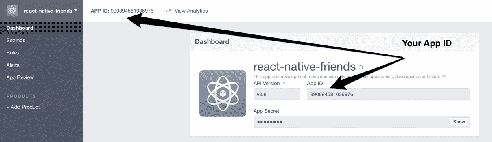
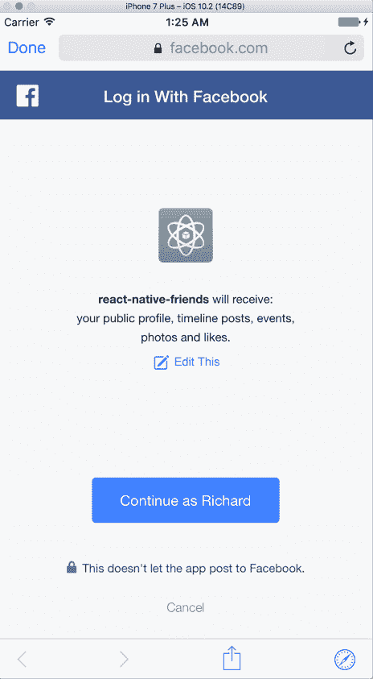
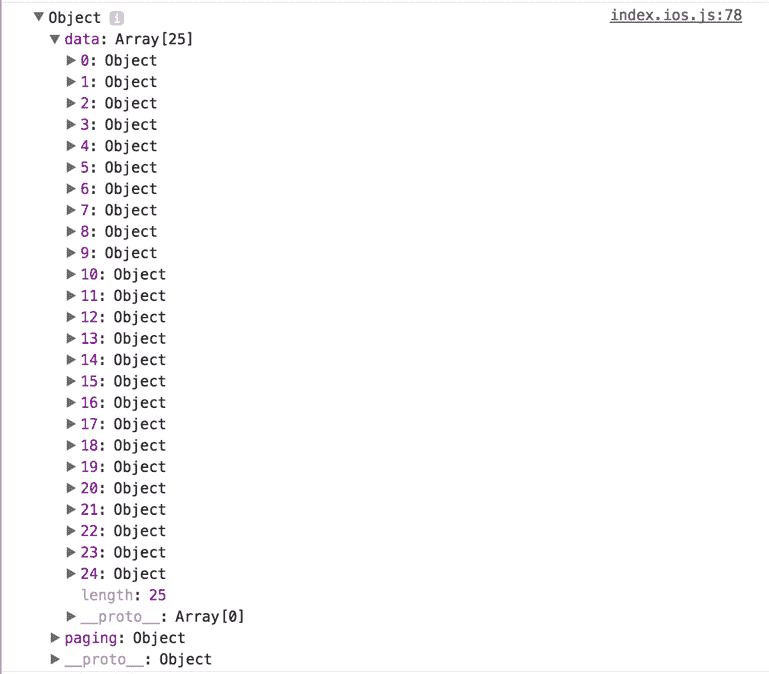
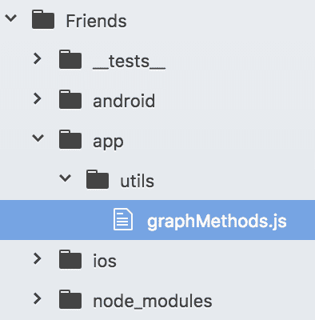
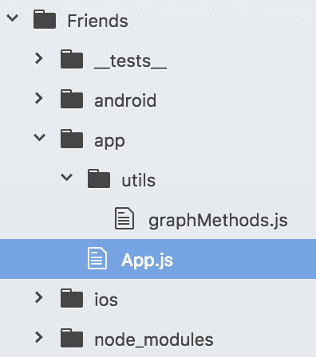
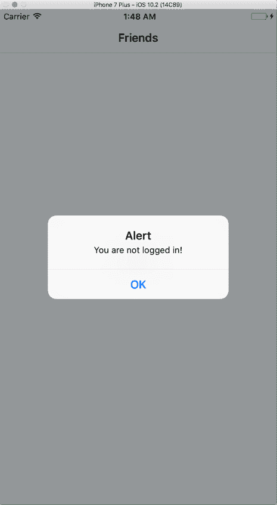
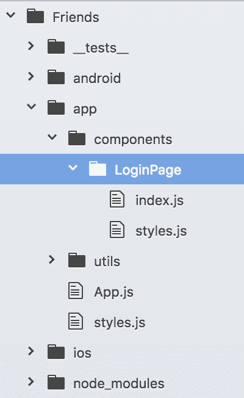

# 第五章：第三项目 - Facebook 客户端

到目前为止，我们主要构建了仅处理用户提供的信息的应用程序。然而，许多应用程序倾向于从网络上的其他来源发送和接收数据。在本书的第三个也是最后一个项目中，我们将构建一个可以访问外部 Facebook API 的应用程序，以便用户可以访问他们的个人资料。

在本章中，您将完成以下任务：

+   计划我们的 Facebook 应用“朋友”，决定它应该具备哪些关键因素

+   获取访问 Facebook API 的权限并安装 iOS 和 Android 的官方 SDK

+   使用 Facebook API 的**登录**SDK 授予应用适当的权限

+   使用`GraphRequest`和`GraphRequestManager`从 Facebook API 获取信息

+   使用`ActivityIndicator`让用户直观地知道数据正在加载

+   开始构建我们 Facebook 应用的基本功能

# 规划应用

“朋友”将是我们将构建的第一个完整的示例，展示 React Native 的强大功能。它将涉及许多动态部分，因此深入规划应用是很好的。在基本层面上，访问 Facebook **Graph** API 给我们以下权限：

+   登录

+   查看您的动态

+   查看您动态上的帖子列表及其评论和点赞

+   在您的动态上添加新的帖子或评论

+   浏览您上传到 Facebook 个人资料的照片及其评论和点赞

+   查看您已确认参加的活动

+   重新发现您喜欢的页面列表

如前几章所述，我们希望将其分解为小规模的成就。到本章结束时，“朋友”应用应实现以下功能：

+   提醒用户（如果尚未登录）登录 Facebook，并使用 SDK 自动保存其身份验证令牌

+   在动态加载时，显示旋转动画以可视化数据正在加载

+   显示用户的动态

+   对于动态上的每篇帖子，显示帖子的内容以及评论和点赞的数量

+   点击时，加载并显示该特定帖子的评论链

+   允许读者对特定帖子的评论进行回复或创建新的帖子

# 关于 Facebook API

在我们继续之前，关于我们可以通过 Facebook API 获得的访问级别做一个说明——您只能获取已登录用户的个人信息。具体用户的好友列表通过 Facebook 的 API 无法访问，但可以访问一小部分也安装了相同应用的好友。由于在我们的项目中这并不很有用，我故意省略了它。

虽然用户的帖子和个人照片肯定会有一个包含发表评论的人的姓名和照片的评论列表，但使用当前版本的 Facebook API 无法访问这些好友的个人资料。

# 获取 Facebook API 凭证

这看起来是一个很好的起点。然而，在我们开始之前，我们需要将我们的应用注册到 Facebook 上。请访问 Facebook 的开发者网站并选择添加新应用。撰写本文时，网址是 [`developers.facebook.com`](https://developers.facebook.com)。

一旦您注册了您的应用，请从 [`developers.facebook.com/docs/ios/`](https://developers.facebook.com/docs/ios/) 下载 iOS 的 Facebook SDK，并将其内容解压缩到您的 `Documents` 文件夹中，命名为 `FacebookSDK`。请保持此文件夹打开；我们很快就会用到它。

之后，前往您应用的仪表板并注意 App ID。您稍后也需要这个信息。您可以在以下位置找到它：



在下一节中，我们将探讨如何安装官方的 React Native Facebook SDK。

# 在 iOS 和 Android 上安装 Facebook SDK

使用以下命令行初始化一个新的 React Native 项目：

```js
react-native init Friends 

```

然后，使用命令行导航到您刚刚创建的新项目。

React Native 的 Facebook SDK 通过 `npm` 在名为 `react-native-fbsdk` 的包中提供。我们将这样安装它：

```js
npm install --save react-native-fbsdk 

```

现在，按照以下步骤链接 SDK：

```js
react-native link react-native-fbsdk 

```

现在，按照 GitHub 上 `react-native-fbsdk` 仓库中的详细说明操作，该仓库位于 [`github.com/facebook/react-native-fbsdk`](https://github.com/facebook/react-native-fbsdk)。由于安装说明可能会随时更改，我强烈建议您使用该仓库中的说明。

之后，使用我们之前看到的流程（如需复习，请参阅第四章，*使用 Expenses 应用的高级功能*）安装 `react-native-vector-icons` 库。

一旦您为该项目初始化了应用并安装了 Facebook SDK 和 `react-native-vector-icons` 库，就到了开始玩耍的时候了。

# 使用 Facebook SDK 登录

我们可以在应用中尝试的第一件事是登录用户。FSBDK 有一个内置的组件称为 `LoginButton`，当按下时，它将使用 `WebView` 在应用内部将用户发送到登录屏幕。如果登录成功，将为您保存一个访问令牌，供您的应用使用，而无需您亲自跟踪它。

首先，将 FBSDK 仓库的 `README` 中的 `LoginButton` 片段添加到您的应用的 `index` 文件中。您将得到类似以下的内容：

```js
// Friends/index.ios.js 

import React, { Component } from 'react'; 
import { 
  AppRegistry, 
  StyleSheet, 
  View 
} from 'react-native'; 

import { 
  AccessToken, 
  LoginButton 
} from 'react-native-fbsdk'; 

```

从 `react-native-fbsdk` 仓库导入 `AccessToken` 和 `LoginButton` 模块，使用解构符号。

```js
export default class Friends extends Component { 
  render() { 
    return ( 
      <View style={ styles.container }> 
        <LoginButton 
          readPermissions={["public_profile", "user_photos", 
          "user_posts", "user_events", "user_likes"]} 

```

`readPermissions` 属性接受一个字符串数组，并请求用户特定的只读权限，这些权限等于传入的数组。

Facebook API 有很多不同的权限可以请求，为了本项目的目的，我们将请求以下权限：

+   `public_profile`：这提供了访问用户公共 Facebook 资料中的一部分内容。这包括他们的 ID、姓名、个人资料图片等。

+   `user_events`：这是一个列表，其中包含一个人正在举办或已响应的事件。

+   `user_likes`：这是用户点击赞的 Facebook 页面的集合。

+   `user_photos`：这是用户上传或标记的照片。

+   `user_posts`：这是用户时间线上的帖子。

`onLoginFinished`方法被编写为异步的：

```js
          async onLoginFinished={        
            async (error, result) => { 
              if (error) { 
              } else if (result.isCancelled) { 
                alert("login is cancelled."); 
              } else { 
                 const data = await AccessToken.getCurrentAccessToken() 
                 alert(data); 
              } 
            } 
          } 
          onLogoutFinished={() => alert("logout.")} 
        /> 
      </View> 
    ); 
  } 
} 

const styles = StyleSheet.create({ 
  container: { 
    flex: 1, 
    justifyContent: 'center', 
    alignItems: 'center', 
    backgroundColor: '#F5FCFF', 
  } 
}); 

AppRegistry.registerComponent('Friends', () => Friends); 

```

尽管`LoginButton`还有一些其他属性可用，但在前面代码中展示的三个是我们需要关注的。以下是每个属性的含义：

+   `publishPermissions`：这表示在按钮按下时请求登录用户的发布权限。

+   `onLoginFinished`：这是一个在登录请求完成或产生错误时被调用的回调。

+   `onLogoutFinished`：这是一个在注销请求完成后调用的回调。

如果一切顺利，你将看到以下带有 Facebook 登录按钮的屏幕--居中的“使用 Facebook 登录”：


通过点击此标志，你将被带到`WebView`组件内的登录页面，该组件处理 Facebook 登录。

登录后，用户将看到一个提示，要求读取权限等于我们通过`LoginButton`组件作为属性传递的`readPermissions`数组中请求的权限：



一旦您的用户获得授权，您将能够从 Facebook 的 Graph API 中获取数据。

# 使用 Facebook Graph API

FBSDK 允许我们使用`GraphRequest`和`GraphRequestManager`类来创建请求并执行这些请求。

`GraphRequest`用于创建对 Graph API 的请求，而`GraphRequestManager`用于执行该请求。

# GraphRequest

要实例化一个新的`GraphRequest`，我们可以传递最多三个参数：

+   `graphPath`：这是一个与 Graph API 端点相关的字符串，表示我们希望触发的端点。例如，要获取登录用户的信息，将使用`graphPath`为`/me`。

+   `config`：这是一个可选的对象，可以配置请求。该对象接受的属性都是可选的：

    +   `httpMethod`：这是一个描述此请求 HTTP 方法的字符串，例如`GET`或`POST`。

    +   `version`：这是一个描述要使用的特定 Graph API 版本的字符串。

    +   `parameters`：这是一个包含请求参数的对象。

    +   `accessToken`：这是请求使用的访问令牌的字符串版本。

+   `callback`：这是一个在请求完成或失败时触发的回调函数。

一个示例`GraphRequest`实例将看起来像这样：

```js
const requestMyPhotos = new GraphRequest('/me/photos/uploaded',  
  null, this._responseInfoCallback); 

_responseInfoCallback (error, result) { 
  if (error) { 
    console.log('Error fetching data: ' + error.toString()) 
  } else { 
    console.log(result); 
  } 
} 

```

为了执行此请求，我们将使用`GraphRequestManager`。

# `GraphRequestManager`

`GraphRequestManager`队列请求 Facebook Graph API，并在被指示时执行它。

它可以访问以下方法：

+   `addRequest`: 这是一个接受`GraphRequest`实例并将请求推入`GraphRequestManager`队列中的函数。它还将回调推入一个单独的`requestCallbacks`队列，以便在请求完成或失败时执行。

+   `addBatchCallback`: 这个方法接受一个可选的回调，在请求批次完成时执行。每个`GraphRequestManager`实例只能接受一个回调，调用该回调并不表示批次中的每个图请求都成功--它唯一表明的是整个批次已完成执行。

+   `start`: 这个方法接受一个可选的数字，其值等于超时时间。如果没有传入，则默认超时时间为 0。当调用`GraphRequestManager.start`时，`GraphRequestManager`将按照先入先出的顺序向 Facebook Graph API 发起一系列请求，并在适用的情况下执行每个请求的回调函数。

在前面的示例中添加，一个`GraphRequestManager`请求看起来像这样：

```js
new GraphRequestManager().addRequest(requestMyPhotos).start(); 

```

此请求创建了一个新的`GraphRequestManager`实例，包括其自己的新批次，将前面的`requestMyPhotos`任务添加到批次中，然后启动它。从这里开始，Facebook Graph API 将返回某种形式的数据。

在`GraphRequest`的`requestMyPhotos`实例中传递的回调将执行，记录错误或请求的结果。

# 创建我们的第一个请求

是时候创建我们的第一个请求来验证我们收到的访问令牌是否有效了。

在`index.ios.js`中的`Friends`组件内，让我们做以下几件事情：

+   创建一个名为`_getFeed`的方法，该方法创建一个针对您的 Facebook 动态的`GraphRequest`。此方法应从`/me/feed`端点获取数据，并引用一个回调函数，当该`GraphRequest`完成时执行。您可以跳过`GraphRequest`可以可选接受的`config`对象。

+   在相同的方法`_getFeed`中，创建一个新的`GraphRequestManager`实例，并将`GraphRequest`实例添加到其中；然后启动`GraphRequestManager`。

+   对于由`_getFeed`引用的回调，当您的`GraphRequest`完成时，记录它接收到的错误或结果。

+   在`LoginButton`的`onLoginFinished`回调中调用`_getFeed`。

当您完成时，结果应该看起来像这样：

```js
// Friends/index.ios.js 

... 
import { 
  ... 
  GraphRequest, 
  GraphRequestManager, 
} from 'react-native-fbsdk'; 

export default class Friends extends Component { 
  render() { 
    return ( 
      <View style={ styles.container }> 
        <LoginButton 
          ... 
          onLoginFinished={ 
            async (error, result) => { 
              ... 
              } else { 
                  await AccessToken.getCurrentAccessToken(); 
                  this._getFeed(); 

```

我不是在提醒访问令牌，而是在调用`_getFeed`。

```js
              } 
            } 
          } 
          ... 
        /> 
      </View> 
    ); 
  }

```

通过传递期望的端点和请求完成后要触发的回调来创建一个新的`GraphRequest`实例：

```js
  _getFeed () { 
    const infoRequest = new GraphRequest('/me/feed', null,
    this._responseInfoCallback); 

```

现在，创建一个新的`GraphRequestManager`实例，将`infoRequest`对象添加到其中，然后启动请求：

```js
    new GraphRequestManager().addRequest(infoRequest).start(); 
  } 

```

请求完成后，它将记录结果或遇到的错误：

```js
  _responseInfoCallback (error, result) { 
    if (error) { 
      console.log('Error fetching data: ', error.toString()); 
      return; 
    } 

    console.log(result); 
  } 
} 
... 

```

在你的 iOS 模拟器和远程调试已打开的情况下，登录时查看浏览器控制台：



这太棒了！这表明我们已经与 Graph API 建立了联系，并且它接受我们给出的访问令牌。现在，让我们创建一个单独的`graphMethods.js`实用文件，我们可以在不同的组件中使用。

# 图形方法

此文件的目标是创建一些与 Facebook Graph API 交互的常用方法，并将它们导出，以便我们可以在应用程序的不同组件中使用。

就像我们为`Expenses`创建的实用文件一样，这个`graphMethods`文件应该位于一个名为`utils`的文件夹中，该文件夹位于项目根目录下的`app`文件夹内：



创建此实用文件，并让它执行以下操作：

+   创建一个名为`makeSingleGraphRequest`的函数，该函数接受一个请求作为参数，创建一个新的`GraphRequestManager`实例，将请求传递给`GraphRequestManager`，然后调用`GraphRequestManager`的`start`方法。

+   创建并导出一个名为`getFeed`的函数，该函数接受一个回调，创建一个新的指向`/me/feed`的`GraphRequest`，并使用该回调，然后调用`makeSingleGraphRequest`。

一旦你的版本完成，请查看下面的我的版本：

```js
// Friends/app/utils/graphMethods.js 

import { 
  GraphRequest, 
  GraphRequestManager 
} from 'react-native-fbsdk'; 

const makeSingleGraphRequest = (request) => { 
  return new GraphRequestManager().addRequest(request).start(); 
} 

export const getFeed = (callback) => { 
  const request = new GraphRequest('/me/feed', null, callback); 

  makeSingleGraphRequest(request) 
} 

```

# NavigatorIOS 和 App 组件

现在，让我们使用`App.js`文件创建一个`App`组件。在项目的`app`文件夹中创建此文件：



此组件应包含与之前我们在`index.ios.js`中拥有的类似逻辑--我们将很快用`NavigatorIOS`组件替换`index.ios.js`文件。

你的新`App`组件应该是本章早期编写的`index.ios.js`文件的反映，除了它应该导入并使用`graphMethods`文件而不是特定组件的`_getFeed`方法。

完成此任务后，请参考我的版本：

```js
// Friends/app/App.js 

import React, { Component } from 'react'; 
import { 
  View 
} from 'react-native'; 

import { 
  AccessToken, 
  LoginButton 
} from 'react-native-fbsdk'; 

```

由于`GraphRequest`和`GraphRequestManager`在`graphMethods`中被导入，我可以在前面的代码中的`import`语句中省略它们。

我正在使用解构符号从`graphMethods`导入`getFeed`方法。这将在未来很有用，因为该文件将填充更多的辅助方法：

```js
import { getFeed } from './utils/graphMethods'; 

```

由于`GraphRequest`的回调包含`error`和`result`参数，我传递它们，这样`_responseInfoCallback`就可以使用它们：

```js
import styles from './styles'; 

export default class App extends Component { 
  render() { 
    return ( 
      <View style={ styles.container }> 
        <LoginButton 
        readPermissions={["public_profile", "user_photos", 
        "user_posts", "user_events", "user_likes"]} 
          onLoginFinished={ 
            async (error, result) => { 
              if (error) { 
              } else if (result.isCancelled) { 
                alert("login is cancelled."); 
              } else { 
                  await AccessToken.getCurrentAccessToken(); 
                  getFeed((error, result) =>
                  this._responseInfoCallback(error, result)) 
              } 
            } 
          } 
          onLogoutFinished={() => alert("logout.")} 
        /> 
      </View> 
    ); 
  } 

  _responseInfoCallback (error, result) { 
    if (error) { 
      console.log('Error fetching data: ', error.toString()); 
      return; 
    } 

    console.log(result); 
  } 
}

```

这里是`App`组件的基本样式：

```js
// Friends/app/styles.js 

import { StyleSheet } from 'react-native'; 

const styles = StyleSheet.create({ 
  container: { 
    flex: 1, 
    justifyContent: 'center', 
    alignItems: 'center', 
    backgroundColor: '#F5FCFF', 
  } 
}); 

export default styles;  

```

干得好！下一步是将项目根目录下的`index.ios.js`进行重构，执行以下操作：

+   从 React Native SDK 导入`NavigatorIOS`以及你刚刚创建的`App`组件

+   渲染根`NavigatorIOS`组件，将其`App`组件作为其初始路由传递

当你完成这部分后，可以查看我的解决方案：

```js
// Friends/index.ios.js 

import React, { Component } from 'react'; 
import { 
  AppRegistry, 
  NavigatorIOS, 
  StyleSheet, 
} from 'react-native'; 

import App from './app/App'; 

export default class Friends extends Component { 
  render() { 
    return ( 
      <NavigatorIOS 
        initialRoute={{ 
          component: App, 
          title: 'Friends' 
        }} 
        style={ styles.container } 
      /> 
    ); 
  } 
} 

const styles = StyleSheet.create({ 
  container: { 
    flex: 1, 
    backgroundColor: '#F5FCFF', 
  } 
}); 

AppRegistry.registerComponent('Friends', () => Friends); 

```

现在是时候为用户创建一个登录提示，这样他们只有在未登录时才能看到`LoginButton`组件。

# 创建登录提示

我们首先应该考虑我们的应用将如何表现。当它启动时，我们应该使用 FBSDK 的`AccessToken` API 检查是否有可用的访问令牌。如果没有，那么我们的用户未登录，我们应该显示登录按钮，就像我们在之前的`Expense`项目中需要预算一样。

如果/当用户登录时，我们应该获取他们的数据源，将其加载到组件状态中，然后将其记录到控制台以显示我们已获取它。

我们首先应该做的是修改`App`组件，使其：

+   在`componentWillMount`事件中，我们使用`AccessToken` API 的`getCurrentAccessToken`方法检查用户是否已登录。

    +   如果用户未登录，我们应该提醒用户他们未登录。在下一节中，我们将用我们创建的登录界面替换这部分内容。

    +   如果用户已登录，我们应该调用`graphMethods`的`getFeed`方法。

+   此外，它应该不再渲染`LoginButton`组件——这部分内容将在稍后放入不同的组件中。相反，让我们让`App`组件暂时渲染一个字符串，显示“已登录”。

需要花费时间进行这些更改，然后检查下面的代码以查看我的工作示例：

```js
// Friends/app/App.js 

... 
import { 
  Text, 
  ... 
} from 'react-native'; 

import { 
  ... 
} from 'react-native-fbsdk'; 

```

我已经移除了`LoginButton`对`App`的导入，因为它将被拆分为不同的组件。

`componentWillMount`逻辑调用`_checkLoginStatus`方法：

```js
... 
export default class App extends Component { 
  componentWillMount () { 
    this._checkLoginStatus(); 
  } 

```

`App`组件的`render`方法中的`LoginButton`组件已被替换为`Text`块。`_responseInfoCallback`函数没有更改也没有被删除：

```js
  render() { 
    return ( 
      <View style={ styles.container }> 
        <Text>Logged In</Text> 
      </View> 
    ); 
  } 

```

`async _checkLoginStatus`函数与之前渲染的`LoginButton`组件的`onLoginFinished`回调类似：

```js
  async _checkLoginStatus ( ){ 
    const result = await AccessToken.getCurrentAccessToken(); 

    if (result === null) { 
      alert('You are not logged in!'); 
      return; 
    } 

    getFeed((error, result) => this._responseInfoCallback(error,
    result)); 
  } 
  ... 
} 

```

如果用户在刷新应用时未登录，他们将看到以下消息：



在你的进步上做得很好！对于下一步，在`app`文件夹中创建一个名为`components`的文件夹，在该文件夹中创建一个包含`index`和`styles`文件的`LoginPage`文件夹：



现在，在我们创建`LoginPage`的同时，让我们再次修改`App`组件。`App`组件应该执行以下操作：

+   导入`LoginPage`组件

+   当用户未登录时，使用导航器的`push`方法推送`LoginPage`组件；用此逻辑替换代码中提醒用户未登录的部分

+   将`_checkLoginStatus`回调传递给`LoginPage`组件，以便当用户登录时，我们可以使用`App`组件检查登录状态，并在`/me/feed`中记录他们的帖子列表。

`LoginPage`组件应该执行以下操作：

+   包含一个视图，该视图围绕我们在本章中之前渲染的`LoginButton`组件。

+   有一个`onLoginFinished`回调，它执行以下操作：

    +   如果登录操作被取消，将错误记录到控制台。

    +   如果登录操作成功，调用传递给它的`getFeed`回调以及导航器的`pop`方法。

当你完成时，你的结果应该看起来像这样：

```js
// Friends/app/App.js 

... 
import LoginPage from './components/LoginPage'; 

export default class App extends Component { 
  ... 
  async _checkLoginStatus ( ){ 
    ... 
    if (result === null) { 
      this.props.navigator.push({ 
        component: LoginPage, 
        title: 'Log In to Facebook', 
        navigationBarHidden: true, 
        passProps: { 
          getFeed: () => getFeed() 
        } 
      }); 
      return; 
    } 
    ... 
  } 
  ... 
} 

```

而不是提醒用户他们未登录，我现在如果用户未登录，将通过应用导航器推送`LoginPage`组件。这是我编写的`LoginPage`组件的方式：

```js
// Friends/app/components/LoginPage/index.js 

import React, { Component } from 'react'; 
import { 
  View 
} from 'react-native'; 

import { 
  LoginButton 
} from 'react-native-fbsdk'; 

import styles from './styles'; 

export default class LoginPage extends Component { 
  render() { 
    return ( 
      <View style={ styles.container }> 
        <LoginButton 
        readPermissions={["public_profile", "user_photos",
        "user_posts", "user_events", "user_likes"]} 
          onLoginFinished={ 
            (error, result) => { 
              if (error) { 
                console.log('Error logging in: ', error.toString()); 
                return; 
              } 

```

前面的部分如果在登录过程中发生错误，将记录错误。

在以下代码中，我们记录了用户取消登录过程的事实：

```js
              if (result.isCancelled) { 
                console.log('login was cancelled'); 
                return; 
              } 

```

然而，如果登录成功，我们调用`getFeed`和`navigator.pop`方法。

```js
              this.props.getFeed(); 
              this.props.navigator.pop(); 

            } 
          } 
          onLogoutFinished={() => alert("logout.")} 
        /> 
      </View> 
    ); 
  } 
} 

```

`LoginPage`的样式表与`Expenses/app/styles.js`中找到的完全相同，因此为了简洁起见，我将其省略。

很大的进步！在下一节中，我们将创建一些存储方法来处理 Facebook 的 Graph API 的速率限制。

# 优化 API

Facebook 的 Graph API 当前的限制是每小时每个用户 200 次调用。这意味着如果你的应用有 100 个用户，你每小时可以调用 20,000 次。这个限制是总体的，这意味着任何单个用户可以在那个小时内消耗掉所有的 20,000 次调用。

为了减少我们对 API 发出的网络调用次数，我们应该调整我们的`App`组件，将 feed 数据保存在`AsyncStorage`中，并且只有在用户手动提示时才刷新其数据。

我们可以开始创建与`Expenses`中相似的`AsyncStorage`方法：

```js
// Friends/app/utils/storageMethods.js 

import { AsyncStorage } from 'react-native'; 

export const getAsyncStorage = async (key) => { 
  let response = await AsyncStorage.getItem(key); 
  let parsedData = JSON.parse(response) || {}; 

  return parsedData; 
} 

export const setAsyncStorage = async (key, value, callback) => { 
  await AsyncStorage.setItem(key, JSON.stringify(value)); 

  if (callback) { 
    return callback(); 
  } 

  return true; 
} 

```

对于这个应用，我们将在`AsyncStorage`中存储不同的键值对；因此，我们希望明确传递`getAsyncStorage`和`setAsyncStorage`方法一个键。

`resetAsyncStorage`和`logAsyncStorage`方法与我们之前在`Expenses`中使用的方法保持相同：

```js
export const resetAsyncStorage = (key) => { 
  return setAsyncStorage(key, {}); 
} 

export const logAsyncStorage = async (key) => { 
  let response = await getAsyncStorage(key); 

  console.log('Logging Async Storage'); 
  console.table(response); 
} 

```

接下来，修改`App.js`中的`_checkLoginStatus`方法，使其执行以下操作：

+   如果用户已登录，调用`storageMethods`中的`getAsyncStorage`方法来检查`feed`属性中是否存在数据。

    +   如果存在`feed`属性，我们应该将其结果保存到`App`组件的状态中，名称相同。在这种情况下，我们不会调用`getFeed`。

    +   如果键不存在，我们应该调用`getFeed`。

现在，让我们修改`App.js`中的`_requestInfoCallback`方法，以便如果它不包含错误，它将执行以下操作：

+   使用`storageMethods`中的`setAsyncStorage`方法保存`response.data`数组，使用`feed`作为传入的键。

+   将相同的数组保存到`App`组件的本地状态中。

我的版本看起来是这样的：

```js
// Friends/app/App.js 

... 
import { getAsyncStorage, setAsyncStorage } from './utils
/storageMethods'; 
... 
export default class App extends Component { 
  ... 
  async _checkLoginStatus () { 
    ... 
    const feed = await getAsyncStorage('feed'); 

    if (feed && feed.length > 0) { 
      this.setState({ 
        feed 
      }); 
      return; 
    } 

```

如果存在`feed`数组，将其设置为本地状态。

否则，调用`getFeed`：

```js
    getFeed((error, result) => this._responseInfoCallback
    (error, result)); 

  } 

  _responseInfoCallback (error, result) { 
    ... 
    setAsyncStorage('feed', result.data); 
    this.setState({ 
      feed: result.data 
    }); 
  } 
} 

```

这个更改首先检查我们在应用中保存的任何 feed 数据，然后再求助于为该数据发出外部 API 调用。在下一章中，我们将探讨一个允许我们按需刷新此数据的组件。

我们下一步应该采取的措施是让用户知道数据正在加载，这样他们就不会长时间看到一个静态屏幕。我们将使用 `ActivityIndicator` 组件来实现这一点。

# 使用 ActivityIndicator

`ActivityIndicator` 组件显示一个圆形加载指示器，可以让用户可视化一个 *加载* 动作。这对于整体用户体验很有帮助，因为用户不应该感觉他们的操作没有达到他们的目的。

我们将在本应用中使用以下两个 `ActivityIndicator` 属性：

+   `animating`：这是一个布尔值，用于显示或隐藏组件。它默认为 `true`。

+   `size`：这是组件的物理大小。在 iOS 上，你的选项是两个字符串之一：`small` 和 `large`。在 Android 上，除了这两个字符串外，你还可以传递一个数字。此属性默认为 `small`。

我们应该修改我们的应用程序，以便在从 Graph API 加载数据时显示这个 `ActivityIndicator`。

让我们修改 `App` 组件，以便在数据尚未保存到 `App` 组件状态的 `feed` 属性时，条件性地渲染 `ActivityIndicator` 组件。

我想出的解决方案如下：

```js
// Friends/app/App.js 

... 
import { 
  ActivityIndicator, 
  ... 
} from 'react-native'; 
... 
export default class App extends Component { 
  constructor (props) { 
    super (props); 

    this.state = { 
      feed: undefined, 
      spinning: true 
    } 
  } 

```

在初始化时设置 `App` 组件状态中的 `feed` 和 `spinning` 值。

调用新的 `_renderView` 方法来条件性地确定要渲染的内容：

```js
  ... 
  render() { 
    return ( 
      <View style={ styles.container }> 
        { this._renderView() } 
      </View> 
    ); 
  } 

```

修改 `_checkLoginStatus` 以在加载数据时将 `spinning` 属性设置为 `false`：

```js
  async _checkLoginStatus () { 
    ... 
    if (feed && feed.length > 0) { 
      this.setState({ 
        feed, 
        spinning: false 
      }); 
      return; 
    } 
    ... 
  } 

```

检查 `ActivityIndicator` 是否仍然需要旋转。如果是，则返回 `ActivityIndicator` 组件。如果不是，则返回原始的 `Text` 组件：

```js
  _renderView () { 
    if (this.state.spinning) { 
      return ( 
        <ActivityIndicator 
          animating={ this.state.spinning } 
          size={ 'large' } 
        /> 
      ); 
    } 

    return ( 
      <Text>Logged In</Text> 
    ) 
  } 

```

与 `_checkLoginStatus` 类似，修改 `_responseInfoCallback` 以将 `spinning` 设置为 `false`：

```js
  _responseInfoCallback (error, result) { 
    ... 
    setAsyncStorage('feed', result.data); 
    this.setState({ 
      feed: result.data, 
      spinning: false 
    }); 
  } 
} 

```

现在，我们应该将我们从 Graph API 收到的数据显示在 `ListView` 中。

# 创建一个标准的 ListView

下一步是获取从 Graph API 收到的数据并将其渲染到视图中。

目前，`App` 组件状态中的 `feed` 数组包含 25 个对象。每个对象包含以下键值对：

+   `created_time`：这是帖子创建的日期和时间

+   `id`：这是一个标识符，它将使我们能够获取帖子的详细信息

+   `story`：这是一个可选的帖子描述，它添加了上下文，例如帖子是否包含基于位置的签到，是否是共享记忆或链接等

+   `message`：这是用户为这个帖子亲自写的可选消息

每个帖子都包含几个边，就像图数据结构中的节点一样。对于 `Friends`，我们将访问以下边：

+   `/likes`：这是喜欢这个特定帖子的用户列表

+   `/comments`：这些是对该帖子的评论

+   `/attachments`：这些是与该帖子关联的媒体附件

在我们可以访问边之前，我们应该渲染一个 `ListView` 组件，以连贯的方式显示这 25 个帖子。花些时间创建一个 `ListView`，使其执行以下操作：

+   以单独的行渲染 25 篇帖子

+   有条件逻辑，仅在故事和消息存在时显示

如果你已经完成了这本书中的前两个项目，`ListView` 对你来说不是什么新鲜事。

在你的 `components` 文件夹内创建一个名为 `FeedList` 的新组件。在这个文件中，创建一个 `ListView` 组件，它从传入的 prop 中获取数组并渲染一个标准的 `ListView`。

然后，创建一个新的辅助文件，称为 `dateMethods`。它应该包含一个接受日期字符串并返回格式化日期的函数。我喜欢用 MomentJS 做这类事情，但你可以随意这样做。

此外，创建另一个名为 `FeedListRow` 的组件，它将负责渲染 `FeedList` 的每一行。

之后，在 `App.js` 中，导入你创建的 `FeedList` 组件，并在 `_renderData` 中当前放置 `Text` 组件的位置渲染它。确保传递 `feed` 数组，以便它有数据可以渲染。用 `FeedList` 替换旧的 `Text` 组件：

```js
// Friends/app/App.js 

... 
import FeedList from './components/FeedList'; 
...

```

`Text` 不再导入：

```js
export default class App extends Component { 
  ... 
  _renderView () { 
    if (this.state.spinning) { 
      ... 
    } 

    return ( 
      <FeedList 
        feed={ this.state.feed } 
        navigator={ this.props.navigator } 
      /> 
    ); 
  } 
  ... 
} 

```

接下来，`FeedList` 组件从 `App` 组件的状态中接收 `feed` 数组，并渲染一个标准的 `ListView`，明确传递每篇帖子的详细信息：

```js
// Friends/app/components/FeedList/index.js 

import React, { Component } from 'react'; 
import { 
  ListView, 
  View 
} from 'react-native'; 

import FeedListRow from '../FeedListRow'; 

import styles from './styles'; 

export default class FeedList extends Component {

```

实例化一个新的 `ListView.DataSource` 对象：

```js
  constructor (props) { 
    super (props); 

    this.state = { 
      ds: new ListView.DataSource({ 
        rowHasChanged: (r1, r2) => r1 !== r2 
      }) 
    } 
  } 

```

使用从 `App` 传入的 `feed` 数组来渲染 `ListView`，如下所示：

```js
   render () { 
    const dataSource = this.state.ds.cloneWithRows
    (this.props.feed || []); 

```

使用 `FeedListRow` 为每个单独的行渲染一个 `ListView` 组件，如下所示：

```js
    return ( 
      <View style={ styles.container }> 
        <ListView 
          automaticallyAdjustContentInsets={ false } 
          dataSource={ dataSource } 
          renderRow={ (rowData, sectionID, rowID) => 
            <FeedListRow 
              createdTime={ rowData.created_time } 
              message={ rowData.message } 
              navigator={ this.props.navigator } 
              postID={ rowData.id } 
              story={ rowData.story } 
            /> 

          } 
          renderSeparator={ (sectionID, rowID) => 
            <View 
              key={ rowID } 
              style={ styles.separator } 
            /> 
          } 
        /> 
      </View> 
    ) 
  } 
}

```

`separator` 获得了自己的样式，用于分隔每一篇帖子，如下所示：

```js
// Friends/app/components/FeedList/styles.js 

import { StyleSheet } from 'react-native'; 

const styles = StyleSheet.create({ 
  container: { 
    flex: 1, 
    marginTop: 65 
  }, 
  separator: { 
    flex: 1, 
    height: StyleSheet.hairlineWidth, 
    marginLeft: 15, 
    marginRight: 15, 
    backgroundColor: '#1d2129' 
  } 
}); 

export default styles; 

```

使用从 Facebook API 获取的日期字符串，然后用 `moment` 格式化它：

```js
// Friends/app/utils/dateMethods.js 

import moment from 'moment'; 

export const getDateTimeString = (date) => { 

  return moment(date).format('lll'); 
} 

```

在 `FeedListRow` 中，从刚刚创建的 `dateMethods` 文件中导入 `getDateTimeString` 方法：

```js
// Friends/app/components/FeedListRow/index.js 

import React, { Component } from 'react'; 
import { 
  Text, 
  TouchableHighlight, 
  View 
} from 'react-native'; 

import { getDateTimeString } from '../../utils/dateMethods'; 

```

为了未来的导航目的，将 `TouchableHighlight` 组件包裹起来，如下所示：

```js
import styles from './styles'; 

export default class FeedListRow extends Component { 
  render () { 
    return ( 
      <View style={ styles.container }> 
        <TouchableHighlight 
          onPress={ () => this._navigateToPostView() } 
          underlayColor={ '#D3D3D3' } 
        > 
          <View> 
            <Text style={ styles.created }> 
              { this._renderCreatedString() } 
            </Text> 
              { this._renderStoryString() } 
            <Text style={ styles.message }> 
              { this._renderMessageString() } 
            </Text> 
          </View> 
        </TouchableHighlight> 
      </View> 
    ) 
  }

```

现在是一个占位函数，我们稍后会修改它。

```js
  _navigateToPostView () { 
    // TODO: Push to navigator 
    console.log('pushed'); 
  } 

```

渲染帖子数据某些部分的方法。

```js
  _renderCreatedString () { 
    return 'Posted ' + getDateTimeString(this.props.createdTime); 
  } 

  _renderMessageString () { 
    return this.props.message 
  } 

  _renderStoryString () { 
    if (this.props.story) { 
      return ( 
        <Text style={ styles.story }> 
          { this.props.story } 
        </Text> 
      ) 
    } 
  } 
} 

```

这是为 `FeedListRow` 构建的样式：

```js
// Friends/app/components/FeedListRow/styles.js 

import { StyleSheet } from 'react-native'; 

const styles = StyleSheet.create({ 
  container: { 
    flex: 1, 
    margin: 10 
  }, 
  created: { 
    color: '#365899', 
    fontWeight: 'bold', 
    marginBottom: 5 
  }, 
  story: { 
    marginBottom: 5, 
    textDecorationLine: 'underline' 
  } 
}); 

export default styles;  

```

你会注意到这个组件的 `_navigateToPostView` 方法有一个注释的任务要处理。这是本练习下一步的基础，我们将在下一章中直接跳到那里。

# 摘要

这是一个很长的章节，感谢你一直陪伴着我！在本章中，我们获得了访问 Facebook Graph API 的权限，为 iOS 和 Android 安装了 Facebook SDK，并开始使用 Facebook SDK 来让用户登录应用，并使用他们的访问令牌获取他们的帖子数据并将其渲染到屏幕上。

在此过程中，你还使用了一个 `ActivityIndicator` 组件来向用户直观地传达我们正在加载数据。

在下一章中，我们将大幅增加内容。那里见。
