# 第八章：部署您的应用

开发者将他们的应用发布到不同的市场，以便将它们分发给最终用户。对于 iOS，是苹果应用商店。在 Android 上，主要选择是谷歌应用商店。

如果您因为 React Native 的力量而涉足移动开发，这对你来说将是一个全新的世界。由于我在 Web 方面有背景，我最初在发布我的第一个移动应用时感到有些迷茫——毕竟，我们习惯于将应用部署到服务器上。

在本章中，您将执行以下操作：

+   了解提交应用到苹果应用商店和谷歌应用商店的要求

+   了解应用标志和截图的重要性

+   为我们的应用编写描述

+   对于 iOS，使用 Xcode 验证我们的应用并将其打包提交到 iTunes Connect

+   将 iOS 应用提交给苹果进行审查

+   使用 TestFlight 为用户创建内部和外部 beta 测试

+   使用开发者控制台添加并提交我们的安卓应用到谷歌应用商店

+   学习如何向测试用户发送我们安卓应用的 alpha 和 beta 版本

# 基本要求

在基本层面上，要将您的应用提交到 App Store 或 Google Play，您将需要您选择平台（s）的开发者会员资格。

对于 iOS，您需要一个苹果开发者会员资格。这个年度的付费会员资格让您能够在苹果的所有平台上发布——iOS、macOS 和 tvOS。它还为您提供了将应用程序的预生产版本首先发送给 beta 测试者的选项。

在安卓设备上进行分发，最受欢迎的渠道是谷歌应用商店。它覆盖了所有官方的、谷歌支持的安卓设备，并需要一个发布者账户。

对于这两个应用，我们还需要提供应用图标，这样我们的用户就不会在设备上安装一个空白图标，并且需要提供截图，以便他们在下载前有一个更好的了解。

在我们继续之前，应该指出的是，我们构建的应用，包括截图，可能不会被任何一家应用商店的编辑委员会接受销售。我们正在使用这个项目作为拥有一个可工作的应用，以便实际提交应用程序的过程。

# 创建开发者会员资格

在这两个商店中注册开发者会员资格的过程是不同的。由于这些先决条件和步骤可能会随时更改，我将省略详细的步骤说明。

# 注册苹果开发者计划

要注册苹果开发者账户，请将您的浏览器指向[`developer.apple.com`](https://developer.apple.com)。

加入苹果开发者计划需要一个苹果 ID。截至本书出版时，会员每年需支付 99 美元的会员费。

# 注册谷歌应用商店发布者账户

要开始您的发布者账户，请将您的浏览器指向[`play.google.com/apps/publish`](https://play.google.com/apps/publish)。

要注册 Google Play Publisher 账户，你需要一个 Google 账户——通常，这是你的 Gmail 地址。截至本书出版时，该计划要求支付 25 美元的单次费用才能加入。

# 使你的应用程序看起来很棒

除了在适当的平台开发者程序中拥有会员资格外，将你的应用程序提交到任一商店还需要你提供应用程序的标志、应用程序的截图和描述。

# 创建图标

图标是进入你应用程序的门户。这是用户将与之交互以访问应用程序的方式。为了将应用程序提交到你选择的适当市场，它必须有一个图标。

因为图标是应用程序的品牌，仅仅创建一个纯色阴影并在上面添加一些文字已经不够了——用户期望更多。

个人来说，我喜欢使用 Sketch ([`www.sketchapp.com/`](https://www.sketchapp.com/)) 来设计我的应用程序图标。虽然我的设计技能不是最好的，但我发现它简单直观。

你可以为你的应用程序获取图标的方式有很多。你可以雇佣某人（无论是本地还是在线）来设计一个，或者使用大量的应用程序自己创建一个。

当我需要为提交到 App Store 和 Google Play 的不同尺寸的应用程序图标生成图标时，我首选的服务是 MakeAppIcon ([`makeappicon.com`](https://makeappicon.com))，它作为一个拖放服务在网络上提供，同时也是一个独立的 Mac 应用程序。

# 拍摄应用截图

屏幕截图可以让你的潜在应用程序客户一窥你的应用程序的外观。

创建截图的一个快速方法是直接在设备或模拟器上运行应用程序时拍摄它们，然后将这些截图上传到 App Store 或 Google Play。

你可以使用各种服务为你的截图添加额外的美学元素。有一个服务会将你的截图置于 iOS 设备的照片中，让你的潜在客户看到应用程序在物理设备上的外观。

要将设备/背景等元素添加到我的屏幕截图上，LaunchKit 提供了一个出色的 Sketch-to-App-Store 插件([`sketchtoappstore.com/`](http://sketchtoappstore.com/))，它可以帮助实现这一功能，尽管可用于将截图应用于其上的设备有些过时——最新的 iOS 设备是 iPhone 6 Plus，唯一可用的 Android 设备是 Nexus 5。

此外，还有一些服务可以帮助去除状态栏，以防你不想在屏幕截图中显示它——特别是如果你在状态栏内容繁多的设备上截图，或者你的截图在状态栏上显示的时间不同，而你希望以一致的方式展示它们。

我喜欢使用来自 Mac App Store 的 Status Barred ([`itunes.apple.com/us/app/status-barred/id413853485?mt=12`](https://itunes.apple.com/us/app/status-barred/id413853485?mt=12)) 来从我的屏幕截图中裁剪状态栏。

# 编写描述

没有一个合适的描述，您的潜在客户将不知道您的应用做什么，或者没有足够的信息来决定是否安装您的应用。无论您的应用是免费还是付费，缺乏合适的描述都将对您的应用产生负面影响。

简单的一行也不行——您想要向您的潜在客户清楚地传达他们为什么要下载您的应用。它做什么？它有哪些功能会让用户感兴趣？

总是抓住机会为您的应用写一个详细的描述。

# 综合所有内容

不管你是否喜欢，一个好的描述，加上一个漂亮的图标和截图，确实会在潜在客户决定是否下载你的应用时起到决定性的作用。

一旦您拥有了开发者会员资格，有了应用图标、截图和描述，您就可以开始提交您的应用，让全世界都能享受它。

接下来，我们将介绍如何将我们的 Facebook 客户端“朋友”提交到 App Store 和 Google Play。

# Apple App Store

我们首先需要为我们的应用提供一个 iOS App ID。在 Apple 开发者门户[`developer.apple.com`](https://developer.apple.com)中，选择证书、标识符和配置文件：

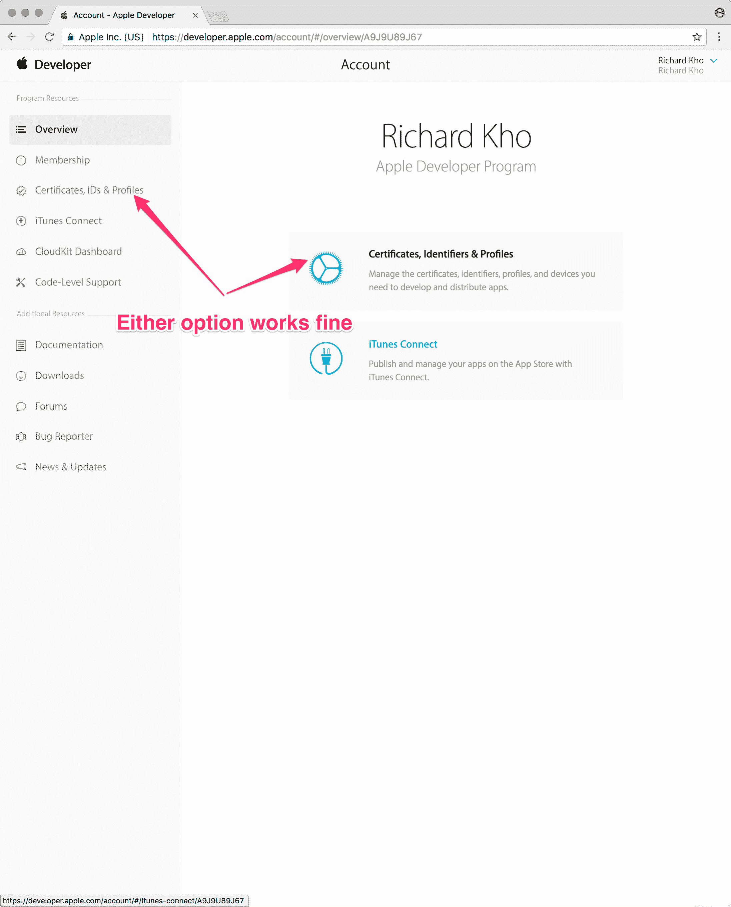

一旦您进入管理您的证书、标识符和配置文件的门户，选择 App IDs 选项，然后点击右上角的添加按钮：

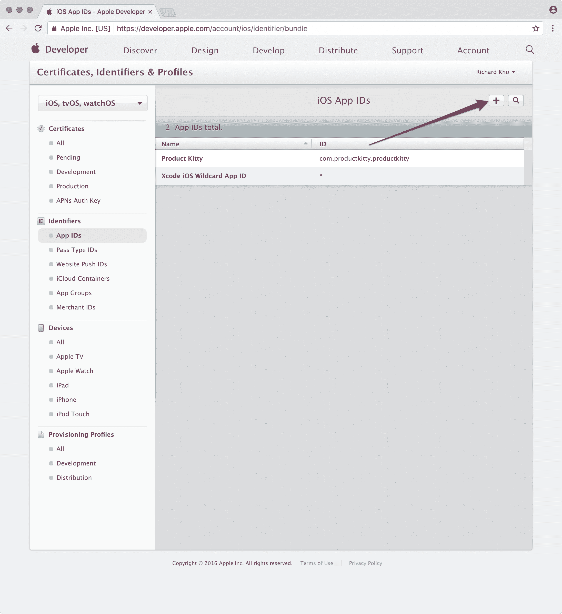

这将带您到一个页面，允许您注册一个 App ID。给它起一个名字（不要使用特殊字符），然后决定您是否会给应用一个显式 App ID 或通配符 App ID，接着宣布您打算在应用中启用哪些服务。

如果您实现了如推送通知、应用内购买和 Apple Pay 等特定于应用的服务，则需要一个显式 App ID。

如果您不打算使用任何特定于应用的服务，Apple 建议您使用通配符 App ID：

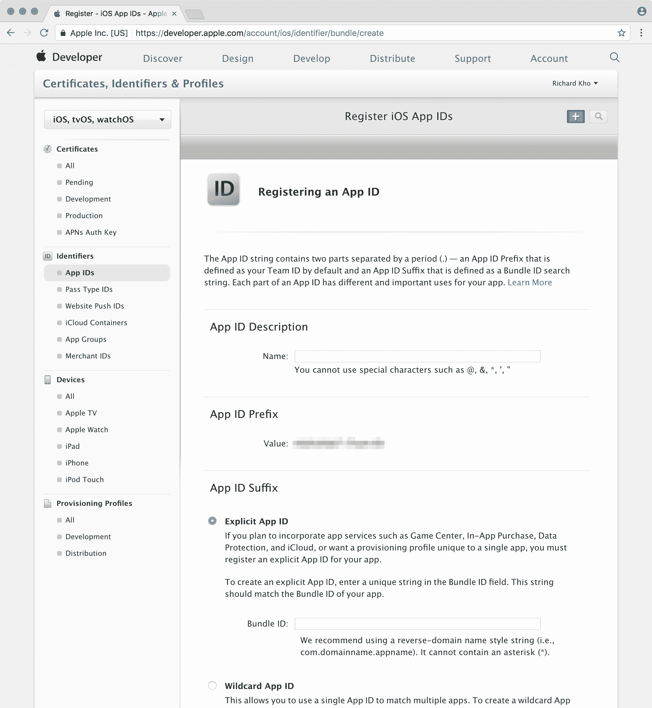

配置完成后，您将被要求确认您的 App ID。如果一切看起来都正确，点击注册按钮完成 App ID 的注册：

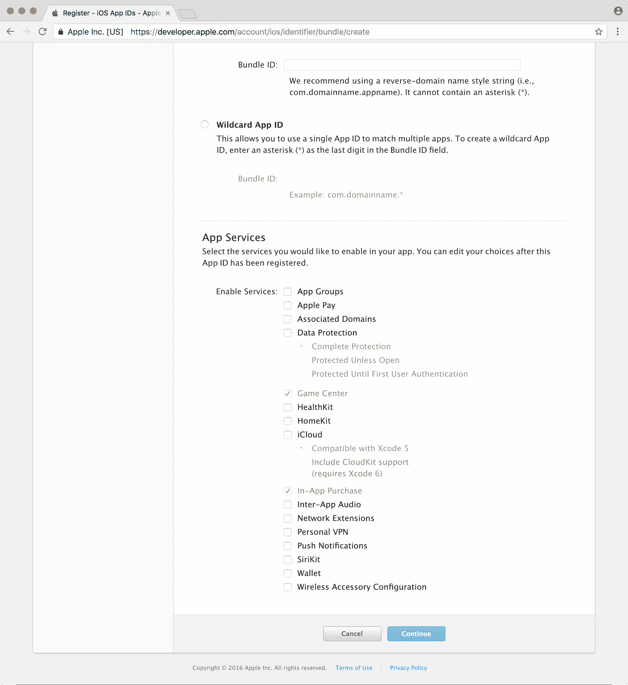

创建了“朋友”的 App ID 后，我们的下一步是打开 Xcode 中的项目，并对我们的项目做一些修改。

# 在 Xcode 中修改 Bundle ID

打开您的“朋友”仓库所在的文件夹，进入`ios`文件夹。打开`Friends.xcodeproj`，它将在 Xcode 中自动打开。

在 Xcode 中，转到您的项目的一般选项卡，然后在签名下选择团队下拉菜单。使用您的 Apple ID 和密码登录。一旦这样做，就会为您自动生成一个签名证书。

然后，在 Identity 下，将您的 Bundle Identifier 设置为您之前在 Apple 开发者门户中添加的应用 ID。之后，我们将为应用程序添加一个图标。我已在此章节所属的存储库中添加了您可以使用此原因的图标。

# 在 Xcode 中添加应用程序图标

在仍然处于 General 选项卡的情况下，选择 App Icons Source 下拉菜单右侧的箭头：

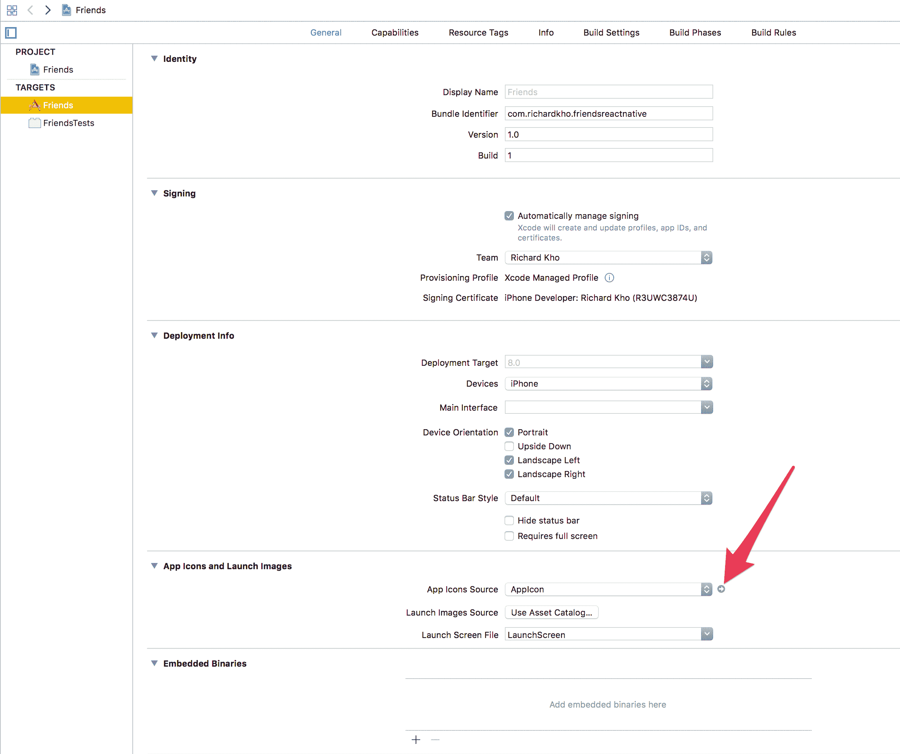

之后，您将被带到屏幕，允许您将图像资源拖放到相应的标志上。如果最终将错误尺寸的图标添加到错误的拖放区域，Xcode 将提供警告：

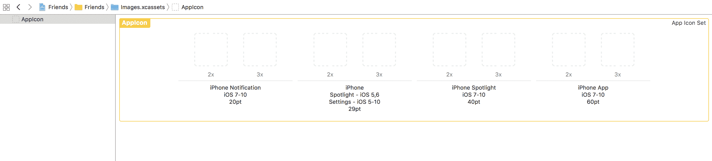

每个拖放区域下方的文本显示了每个图标的目标分辨率。

一旦您设置了应用程序图标，就是时候创建应用程序存档以提交到 iTunes Connect。

# 创建存档

首先，让我们确保在 Xcode 打开时进入 Mac 工具栏，选择 Product | Scheme | Edit Scheme，以确保我们的项目方案设置正确存档了应用程序的发布版本而不是调试版本：

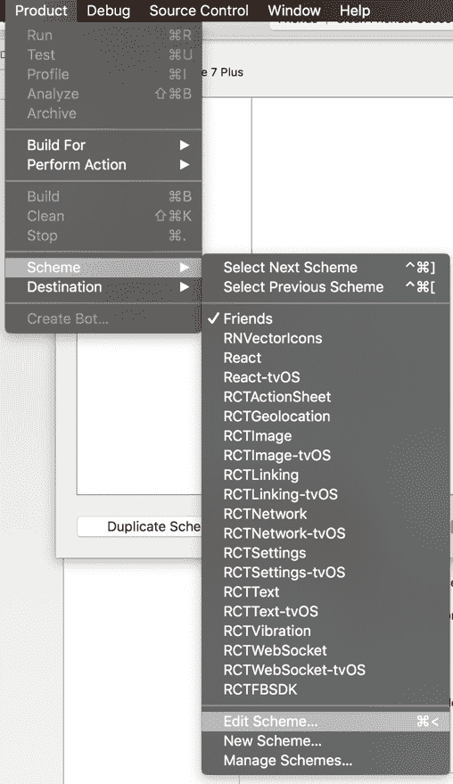

一旦打开此面板，选择左侧的 Archive 选项并确认构建配置设置为 Release：

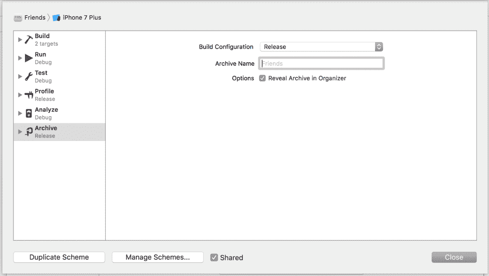

现在，关闭此窗口并转到此下拉菜单，它允许您在 Xcode 中选择构建和运行应用程序的设备：

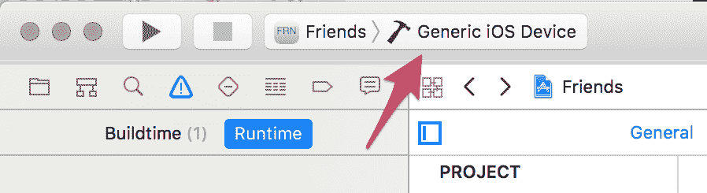

Xcode 不允许您创建目标为 iOS 模拟器设备的应用程序存档。如果您尝试这样做，该选项将在 Product 菜单下简单地变灰。

点击此下拉菜单并选择 Generic iOS Device：

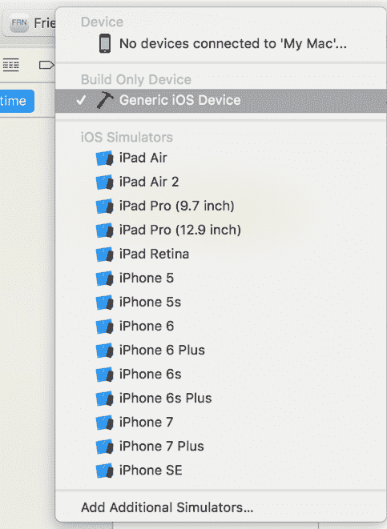

最后，回到 Xcode 的 Product 菜单并选择 Archive：

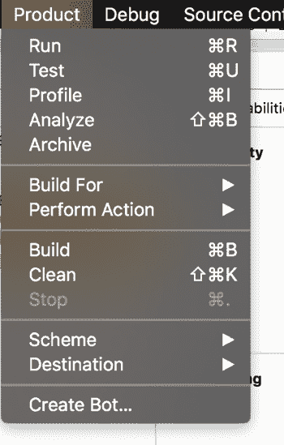

现在，Xcode 将构建和存档您的应用程序，以便将其准备好分发到 iTunes Connect。如果一切顺利，您将看到以下存档列表，右侧有一些选项：

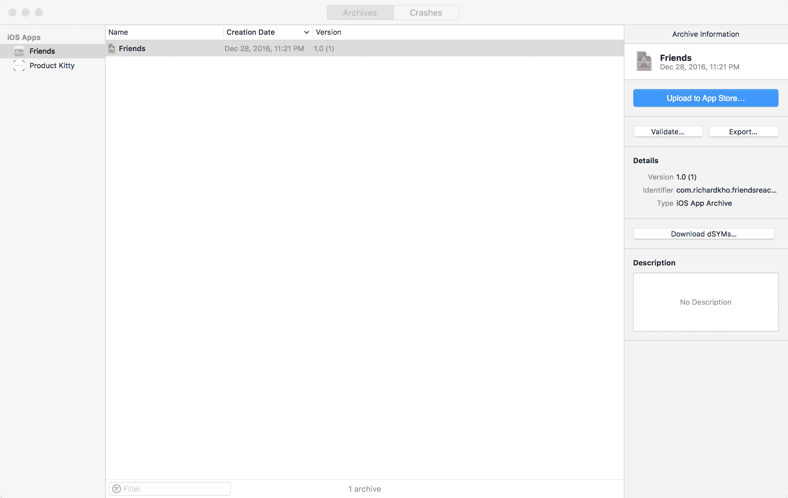

保持此屏幕打开，因为我们很快就会需要它。现在，让我们进入 iTunes Connect 以将应用程序添加到我们的账户中。

# iTunes Connect

iTunes Connect 是苹果开发者提交其应用程序的门户。要进入，请将浏览器指向 [`itunesconnect.apple.com`](https://itunesconnect.apple.com) 并在需要时登录。您将进入 iTunes Connect 仪表板。在仪表板上，选择 My Apps，这是顶部行左侧的第一个应用程序。

选择后，您将到达一个列表，列出了您已提交到 iTunes Connect 的应用程序及其状态。

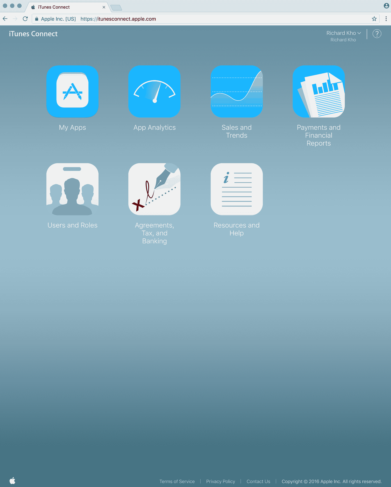

要提交新应用程序，请选择左上角的添加符号并选择 New App：

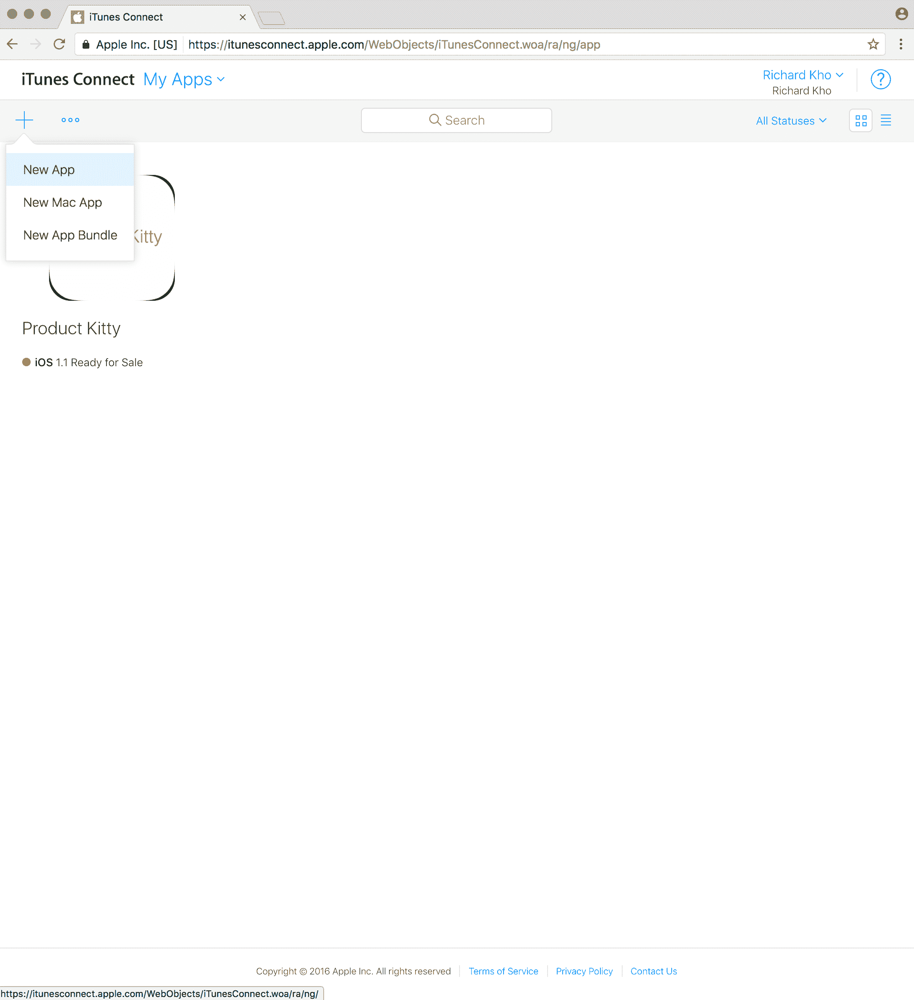

您将被要求在出现的模态窗口中填写有关您应用的详细信息。选择您的平台（iOS），为应用命名，主要语言，Bundle ID（映射到您在开发者门户中创建的应用 ID，这同时也是您在 Xcode 中的应用的 Bundle ID），以及一个唯一的 SKU：

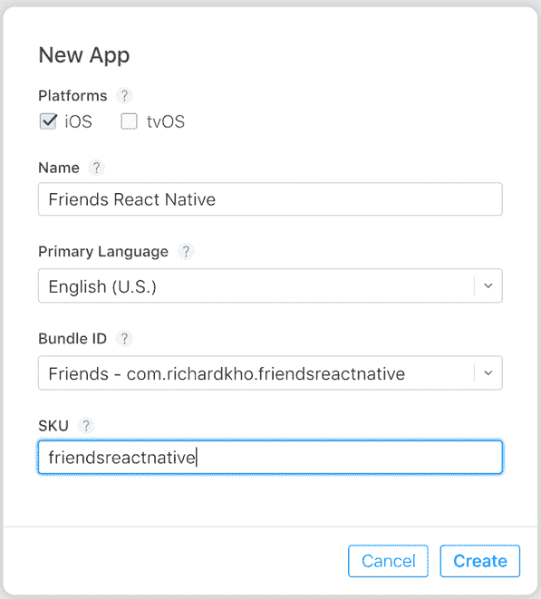

完成此步骤后，您将被带到有关您应用的摘要页面。现在让我们回到 Xcode，完成验证和提交我们的应用到 iTunes Connect 的过程。

# 在 Xcode 中验证我们的应用

在 Xcode 的最后屏幕中选择“验证”，这将导致出现此摘要屏幕：

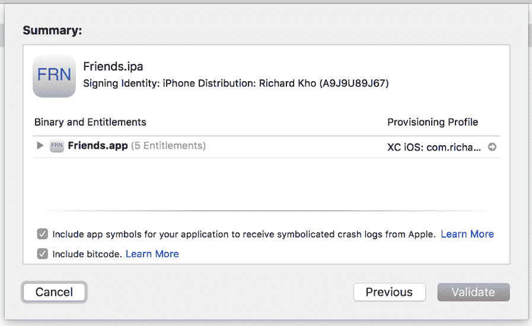

点击“验证”按钮。让它与 iTunes Connect 通信，如果一切检查无误，您将收到“验证成功”提示。如果是这种情况，点击“完成”，然后让我们开始上传我们的应用。

按下“上传到 App Store”按钮，您将收到一个类似请求，要求您选择您的开发团队，然后点击上传：

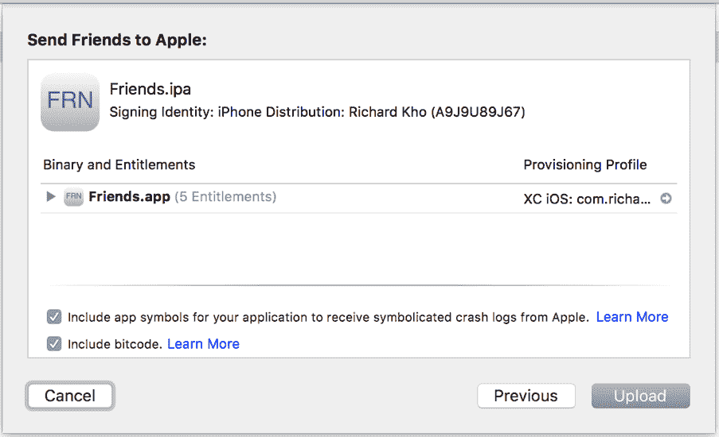

到此为止，您项目的存档将开始上传并验证其资产与 App Store 的过程。请给它一些时间，一旦完成，您将看到“上传成功”提示。一旦完成，让我们立即回到 iTunes Connect。

# 提交我们的应用进行审查

在我们可以提交我们的应用进行审查之前，我们还有一些最终步骤。首先，我们需要向其中添加截图。在本章的文件夹中，我已经添加了一些您可以尝试的截图。

在左侧列标的“1.0 准备提交”标签下选择我们的应用，然后将我们的截图拖到拖放区：

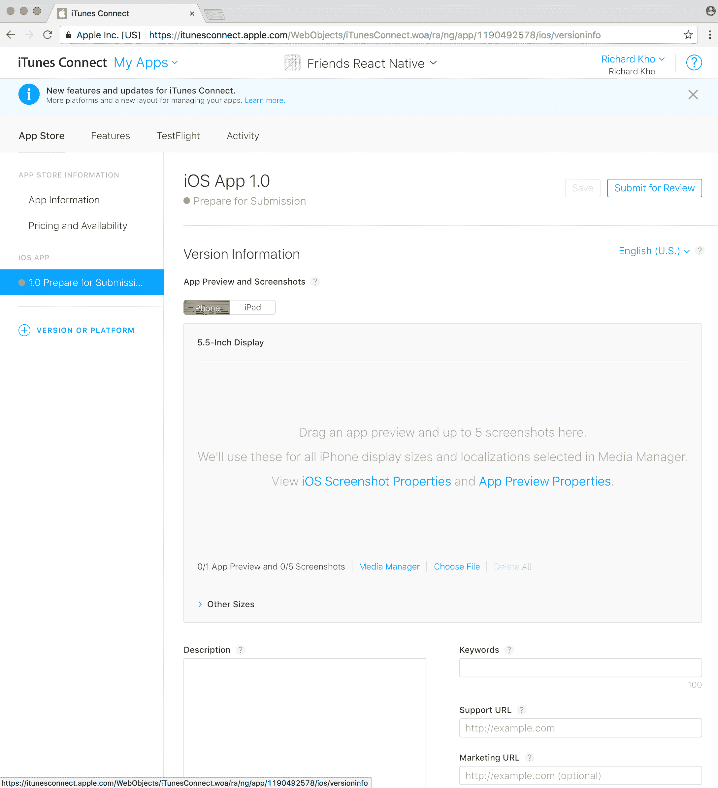

然后，为应用提供描述、一些关键词和支持以及营销 URL。完成这些后，向下滚动并选择要提交的构建--这将是我们在上一节通过 Xcode 上传到 App Store 的构建：

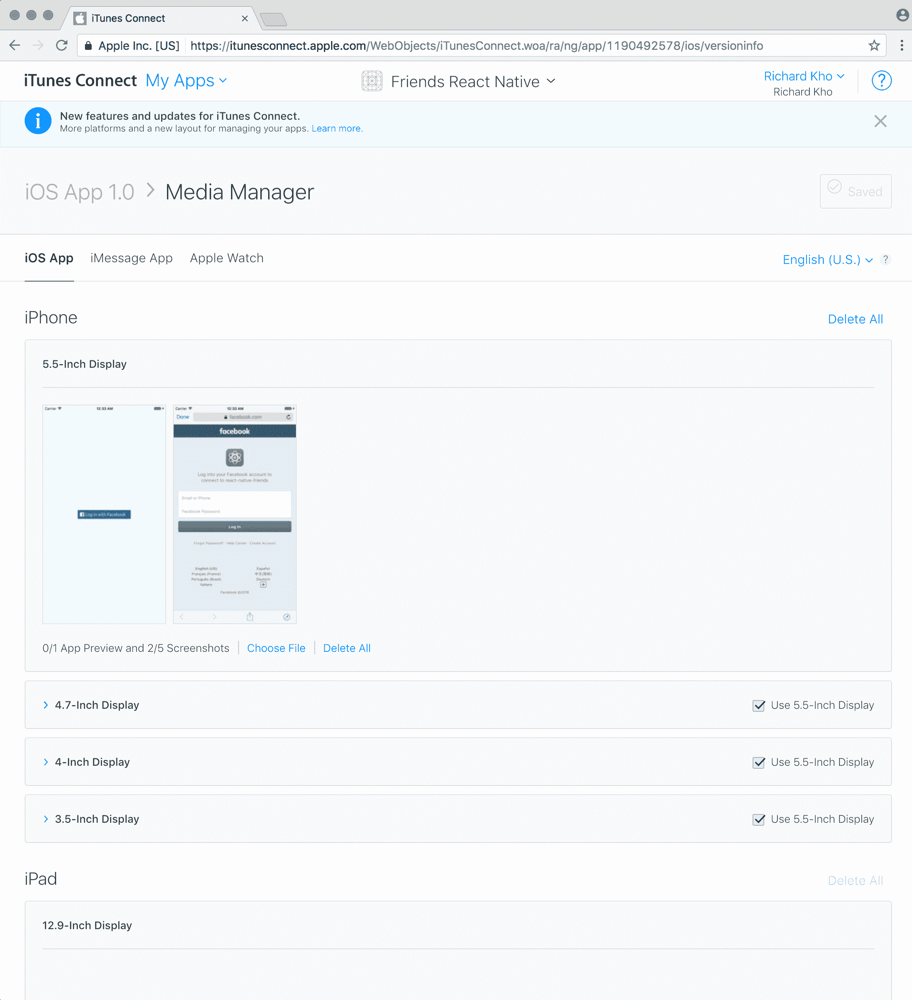

iTunes Connect 会自动调整用于 5.5 英寸显示屏的图片大小，以便较小的显示类型不需要自己的独特图片，除非您希望自行分配。

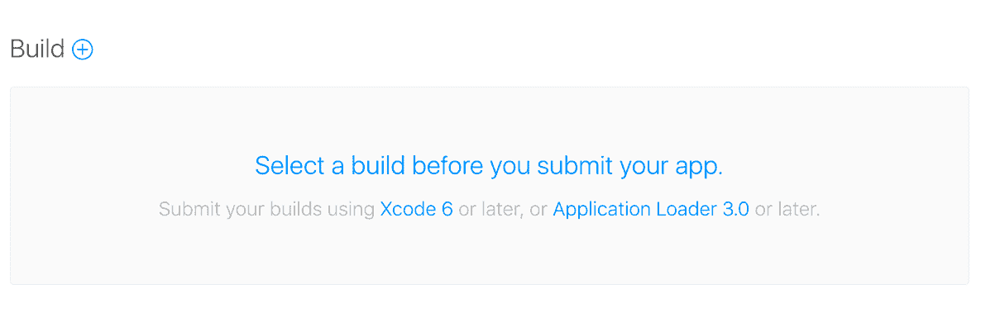

您会发现通过 Xcode 上传的构建会自动填充在出现的模态窗口中，其中包含您在 Xcode 中分配的相应版本和构建号：

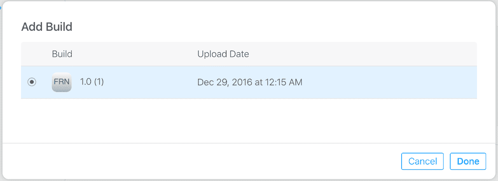

一旦选择，在 iTunes Connect 中的“构建”部分将更新您的应用信息：

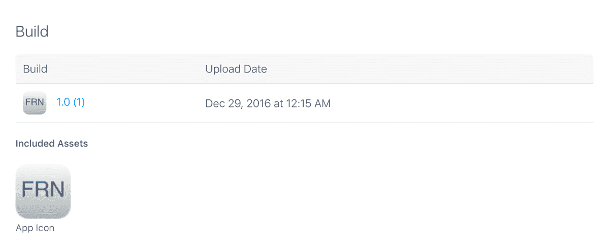

下一步是在“常规应用信息”下包含一个 1024 × 1024 的应用图标，并填写版权信息和您的联系信息：

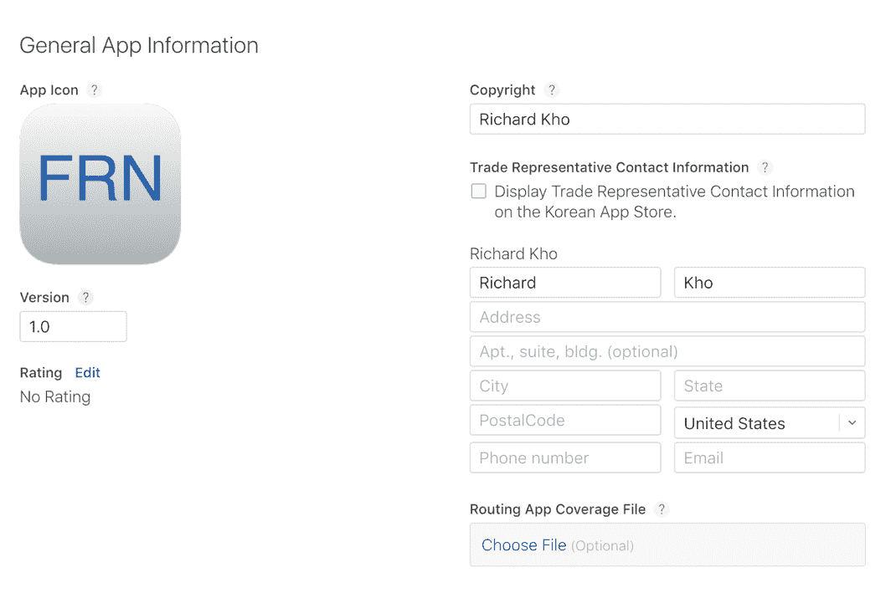

然后，提供您的联系信息，以及您希望 App Store 审阅者阅读的任何注释，以及如果需要使用应用的所有功能，请提供演示账户。

最后，决定您的应用在 App Store 审阅者批准后是否立即发布：

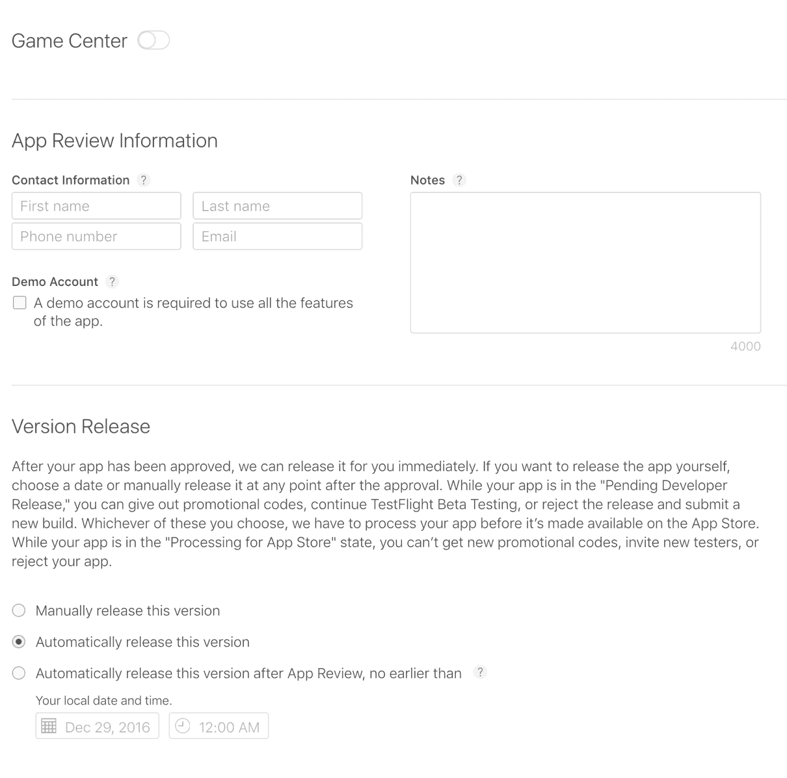

当你填写完所有这些详细信息后，请点击顶部的“提交审查”按钮。这就完成了！给自己鼓掌，并等待苹果的审查团队回复，无论是批准还是拒绝。

# 使用 TestFlight 进行 iOS 应用测试

TestFlight 是苹果几年前收购的一项服务，它与 iTunes Connect 完全集成。它允许你在将 iOS 应用发布到 App Store 之前，通过一组精选的测试者进行测试。

测试是重要的，因为它让开发者能够在实际使用场景中收集关于他们应用的反馈，并发现他们可能没有注意到的错误。

你可以使用 TestFlight 运行两种测试：**内部**和**外部**测试。

在内部测试中，你的团队中分配了开发者或管理员角色的用户可以私下测试应用，让你能够快速从他们那里获得反馈。最多可以有 25 名用户参与内部测试。

对于外部测试，你可以邀请任何组织外的用户来测试你的应用。可供外部测试的应用可以接受多达 2,000 名用户，并且你的应用必须在开始测试之前由苹果进行审查。

根据我的经验，Beta App 审查过程比正式的 App 审查过程要短得多，后者是将你的应用发布给所有用户。

# 输入测试信息

将你的应用通过 TestFlight 发布的第一步是登录到 iTunes Connect，选择你的一个应用，然后选择 TestFlight 选项卡。然后，填写 Test Information 表单以提供一些关于你的应用的详细信息：

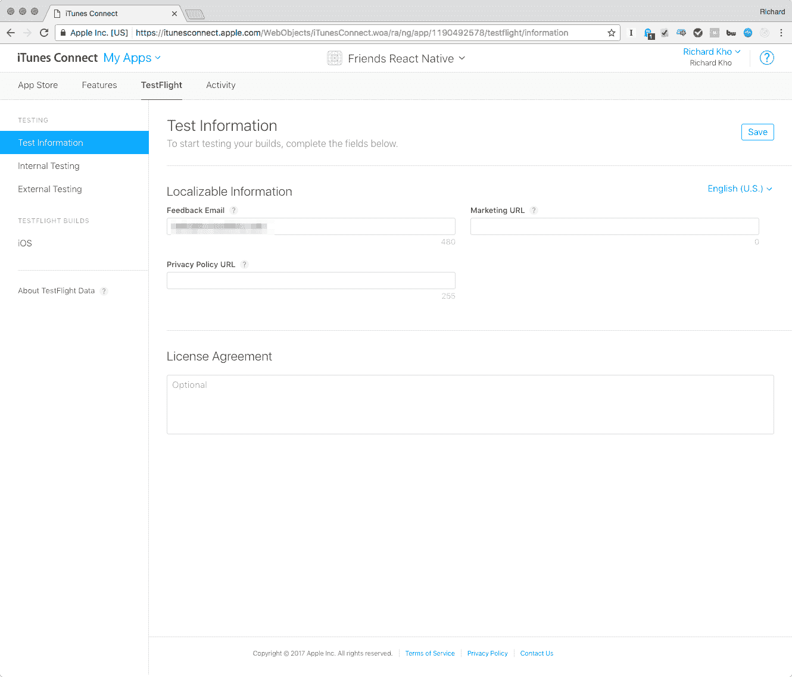

保存这些详细信息后，你可以开始设置内部或外部测试。

# 使用 TestFlight 创建内部测试

要创建内部测试，请在侧边栏中选择“内部测试”选项，然后点击“选择要测试的版本”，这将使以下模态可见：

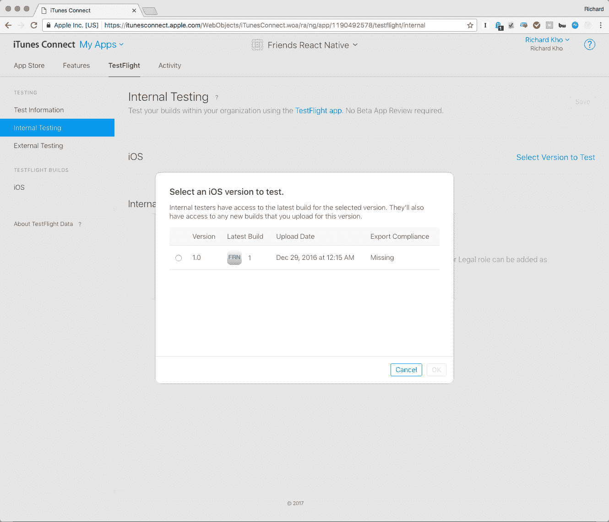

如果你已上传了多个应用版本，你应该会看到它们在这里出现。选择你希望发送给测试者的版本，然后点击“下一步”按钮。如果你的应用尚未配置为声明其出口合规性，你将被带到模态的第二个问题，询问你的应用是否设计用于使用、包含或集成加密。

接下来，你可以点击“内部测试者”框添加至少一个测试者。此列表将显示你通过 iTunes Connect 添加的任何用户。如果你到目前为止还没有添加任何人到你的团队，你将只会看到你自己作为列出的测试者。

要更改这一点，请返回到主 iTunes Connect 门户并选择“用户和角色”：

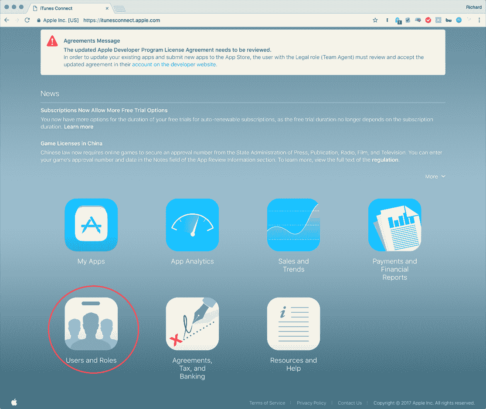

选择 + 图标添加用户，并填写多页表单以继续：

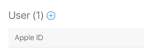

一旦您添加了要发送内部测试的用户，您可以在要测试的 beta 测试应用的 TestFlight 标签页的内部测试部分中选择他们。当您选择了所有人后，点击“开始测试”按钮，您的用户将收到一封电子邮件通知，邀请他们加入测试！

# 使用 TestFlight 创建外部 beta 测试

创建外部测试的过程与内部测试有一些不同之处。首先，在您的应用获得外部 beta 测试批准之前，您必须向苹果提交您的应用进行审查。当您点击外部测试的“添加构建到测试”按钮时，您将看到以下提示，以便填写更多关于应用的详细信息：

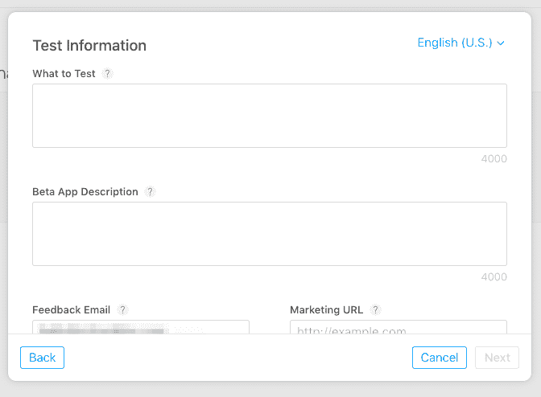

这是为了向您的用户明确说明他们应该测试应用哪些部分，以及为他们提供的阅读描述。您还需要提供一个他们可以发送反馈的电子邮件地址，以及您应用的营销 URL。

然后，您将被带到这个模态框的另外两个部分，您需要为 Beta App Review 团队提供详细信息。第一部分将包括您的联系信息，以防苹果希望就您的应用与您联系，以及添加测试账户供 Beta App Review 团队使用的能力：

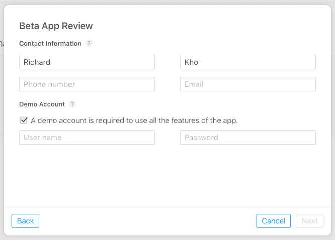

之后，您将被要求提供应用的描述，以及团队在审查您的应用时应注意的事项：

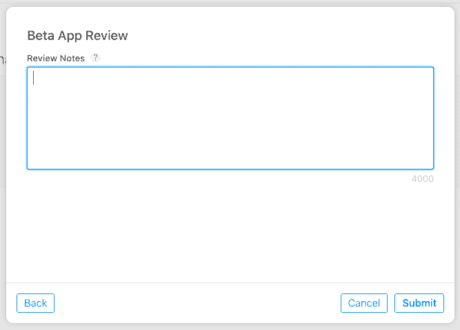

您必须先确保您的应用通过了 Beta App Review，才能开始外部测试：

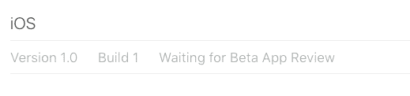

同时，您可以通过以下三种选项之一添加测试用户：

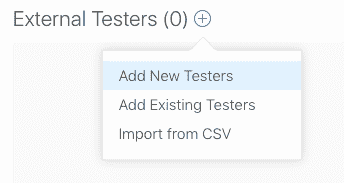

第一个方法是输入测试者的姓名和电子邮件地址来添加新测试者，这将弹出一个模态框，允许您这样做：

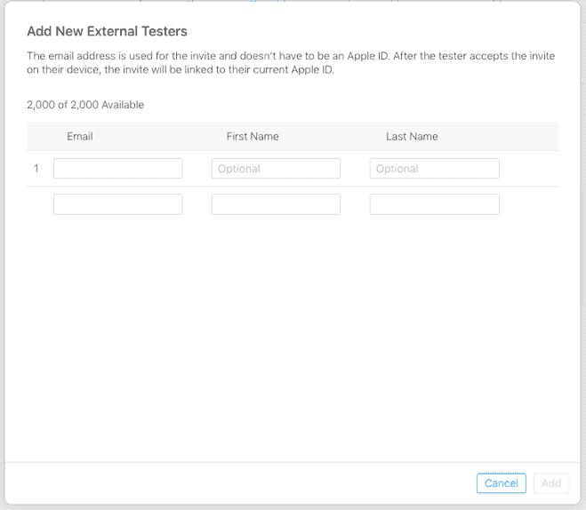

下一个选项允许您添加过去测试过您任何应用的现有外部测试用户。该选项将为您提供一份带有复选框的列表，以便您选择要添加的用户。

最后一个选项是导入外部测试用户的 CSV 文件。

一旦您添加了至少一个用户，并且您的构建已通过 Beta App Review 的批准，您就可以提交应用并开始 beta 测试！

这就是我们要介绍的有关 iOS App Store 和 iTunes Connect 的所有内容。在下一节中，我们将探讨如何将 Friends for Android 上传到 Google Play Store。

# Google Play Store

要将应用提交到 Google Play Store，我们需要执行以下步骤：

+   添加应用图标

+   为我们的应用提供一个独特的包标识符

+   生成已签名的 APK 文件

+   将 APK 文件上传到 Google Play 开发者门户

+   为我们的应用添加截图和描述

# 为 Android 添加应用图标

为了给您的 Android 应用添加图标，我们将导航到以下文件夹：`android/app/src/main/res`。

然后，将重命名为 `ic_launcher.png` 的图标图像添加到每个包含相应尺寸的四个文件夹中：

+   `mipmap-hdpi: 72 × 72`

+   `mipmap-mdpi: 48 × 48`

+   `mipmap-xhdpi: 96 × 96`

+   `mipmap-xxhdpi: 144 × 144`

添加这些图像后，运行 `react-native run-android` 命令来构建你的应用，你应该会在你的 Android 虚拟设备的首页上看到图标已更新。

为了方便起见，本章代码仓库中已经提供了 Friends 安卓版本的图标。

# 创建唯一的包标识符

如果你的 APK 的包名与 Google Play 商店中已存在的另一个应用相同，则不会将其上传到 Google Play 开发者控制台。为了给它一个独特的名字，我们首先打开 Android Studio 并将我们的应用 `Android` 文件夹导入其中。

从 Android Studio 欢迎屏幕中选择“导入项目”（Eclipse ADT、Gradle 等）。然后导航到你的项目仓库，并仅导入其中的 `Android` 文件夹。

之后，打开 `AndroidManifest.xml` 并更改第二行的包名。

然后，右键单击包含包标识符的 `app` 文件夹，选择“重构”|“重命名”。然后，给你的包起一个新的名字：

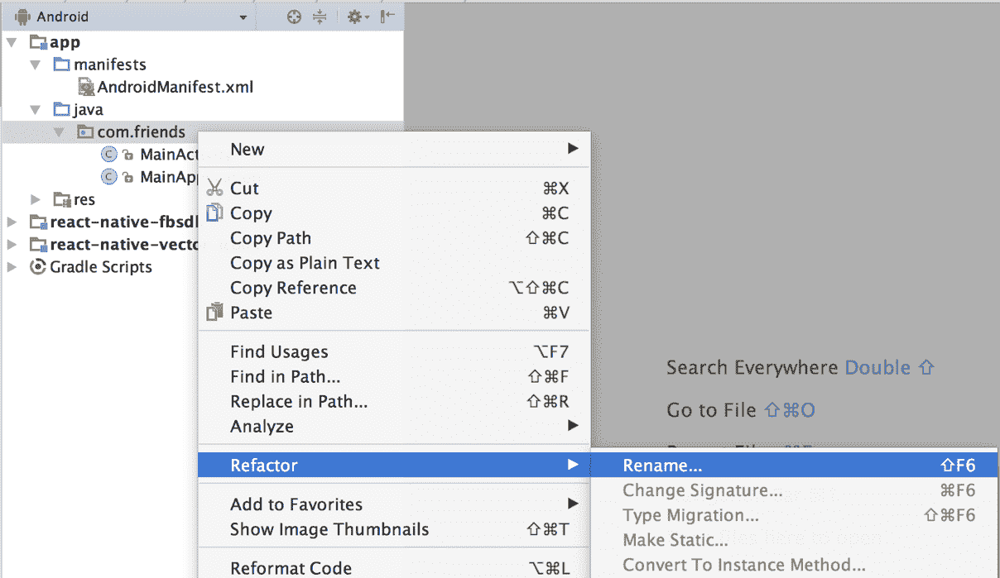

现在打开 `android/app` 文件夹中的 `build.gradle`，并将任何旧包标识符替换为新的。你做的更改将自动应用。

# 生成签名 APK 文件

首先，在你的终端中，我们将生成一个私钥签名：

```js
    $ keytool -genkey -v -keystore friends-release-key.keystore -alias 
    friends -key-alias -keyalg RSA
-keysize 2048 -validity 10000

```

你将为你的 keystore 和密钥设置密码。你的发布密钥将被标记为 `friends-release-key`，除非你选择其他名称。

此命令中的 `validity` 标志设置了密钥的有效期为 `x` 天。在这种情况下，由于我们的命令，它是 `10000`。

此 `keystore` 文件将位于你运行命令时终端提示符所在的目录。将其移动到你的 Friends 应用仓库中的 `android/app` 目录下。

重要！将你的 `keystore` 文件提交到 Git 或任何其他版本控制系统不是一个好主意。确保将其添加到 `.gitignore` 文件中。

然后，打开你的 `gradle.properties` 文件并添加以下信息：

```js
// Friends/android/gradle.properties 
MYAPP_RELEASE_STORE_FILE=friends-release-key.keystore 
MYAPP_RELEASE_KEY_ALIAS=friends-key-alias 
MYAPP_RELEASE_STORE_PASSWORD=YOURPASSWORDHERE 
MYAPP_RELEASE_KEY_PASSWORD=YOURPASSWORDHERE

```

将 `YOURPASSWORDHERE` 替换为你为发布商店和发布密钥创建的密码。

接下来，我们将向你的应用的 `build.gradle` 文件中添加签名配置：

```js
// Friends/android/app/build.gradle 

... 
android { 
    ... 
    signingConfigs { 
      release { 
           storeFile file(MYAPP_RELEASE_STORE_FILE) 
           storePassword MYAPP_RELEASE_STORE_PASSWORD 
        keyAlias MYAPP_RELEASE_KEY_ALIAS 
        keyPassword MYAPP_RELEASE_KEY_PASSWORD 
      } 
    } 
    ... 
    buildTypes { 
        release { 
            ... 
            signingConfig signingConfigs.release 
        } 
    } 
    ... 
} 
...

```

之后，让我们生成 APK。回到终端，切换到 `Android` 目录并运行以下命令：

```js
    ./gradlew assembleRelease

```

构建过程可能需要几分钟。一旦完成，你将在 `android/app/build/outputs/apk/app-release.apk` 下找到生成的签名 APK。

如果你想在 Android 虚拟设备上测试它，只需将你的目录切换回项目的根目录，并运行以下命令：

```js
    react-native run-android --variant=release

```

如果一切看起来都正确，那么让我们提交应用到 Google Play 商店！

# 提交到 Google Play

访问[`play.google.com/apps/publish`](https://play.google.com/apps/publish)的 Google Play 开发者控制台。

使用你的谷歌账户登录后，选择“在 Google Play 上发布安卓应用”选项，这是在可见卡片区域的最左上角：

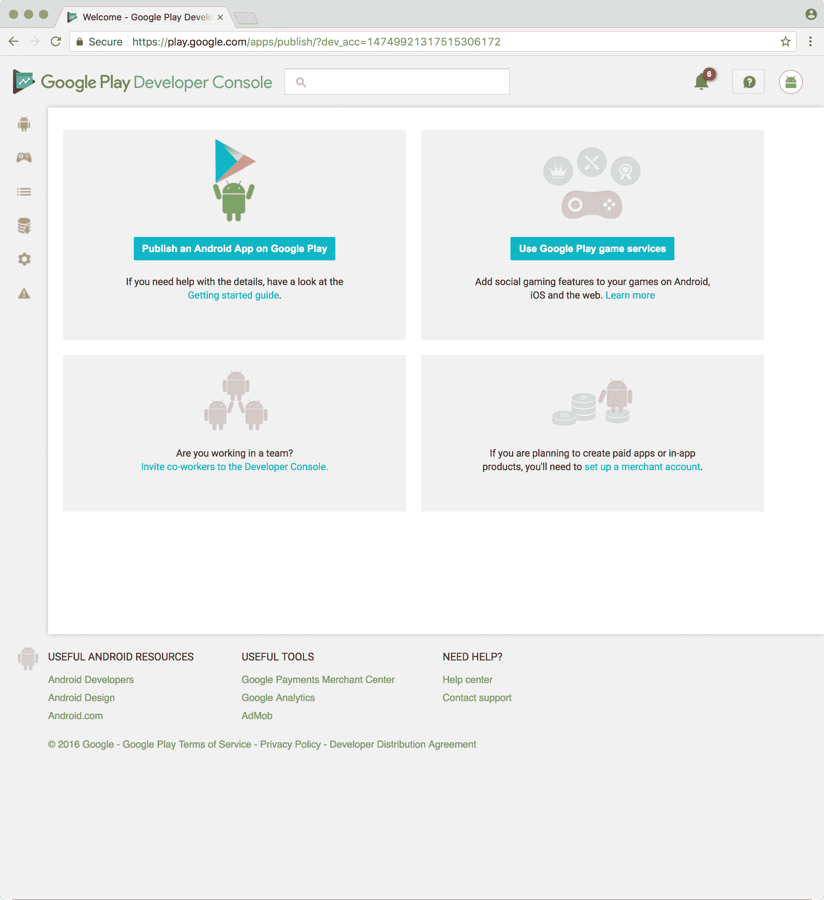

你将被提示为你的应用提供一个默认语言和标题：

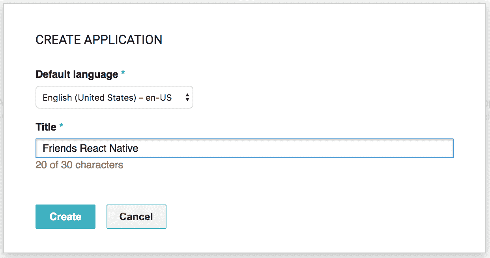

一旦创建了应用，你将被带到允许你编辑应用详细信息的页面。

要提交一个应用，你需要填写以下信息：

+   高分辨率 512 × 512 图标

+   特效图形

+   两个非安卓 TV 的截图

+   类别和内容评级

+   应用简短和完整描述

+   上传我们之前创建的 APK

+   至少针对一个国家进行分发

+   指向应用隐私政策的 URL

+   定价信息

+   声明应用是否包含广告

使用左侧菜单在四个必需标签页之间导航：上传你的 APK、Play 商店上的列表、内容评级和定价信息。

当所有详情都已填写完毕，让我们导航到侧边栏中的“管理发布”部分，开始将你的应用到 Google Play 商店推出的过程：

截至 2017 年 3 月，谷歌计划弃用侧边栏中的 APK 页面，并鼓励大家开始迁移到“管理发布”页面。


选择“生产”并将带你到以下页面：

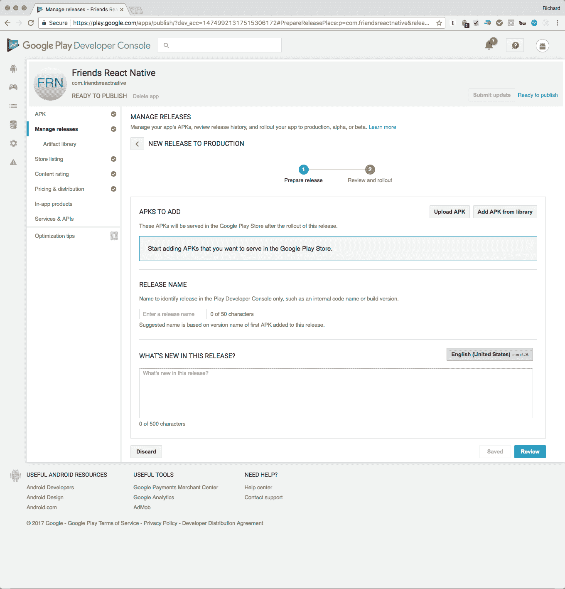

在 Google Play 开发者控制台中，如果你选择了你的应用并进入侧边栏中的“管理发布”选项，你将被要求上传一个新的 APK 或从库中添加一个现有的 APK。在这种情况下，我选择了从库中添加 APK，因为我之前已经上传了`Friends APK`文件。

然后我被要求从我的现有 APK 列表中选择：

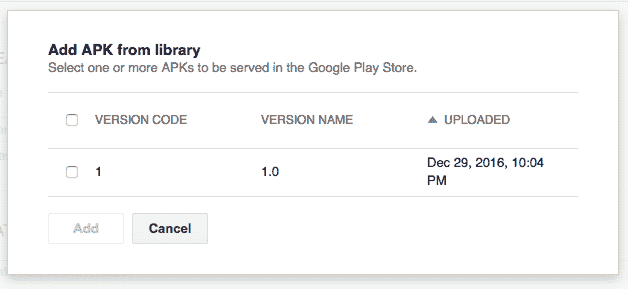

之后，为应用提供一个发布名称和关于这次发布新内容的描述，然后按底部右角的“审查”按钮。

在下一步中，你将需要在你向公众推出之前审查你的发布详情。一旦你确认详情正确，请按底部右角的“开始推出到生产”按钮。你将收到确认提示。

一旦确认，应用将开始推出到 Google Play 商店！

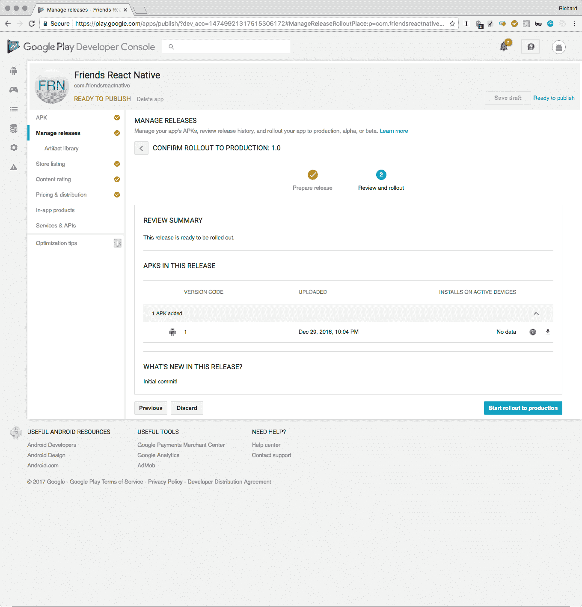

# 安卓应用的 Alpha 和 Beta 测试

在“管理发布”页面，你可能已经注意到有按钮可以管理你的应用的 Alpha 和 Beta 发布。

在功能上，目前 Alpha 测试和 Beta 测试之间没有区别。然而，你可以通过为一个版本运行 Alpha 测试，为另一个版本运行 Beta 测试，同时测试你应用的两个不同版本。

每个测试都可以针对每个轨道可用的三种不同的测试方法之一运行：

+   公开：这允许任何拥有订阅链接的人订阅

+   私密：这里您需要具体邀请人们通过他们的电子邮件地址加入测试

+   使用 Google Groups 或 Google+ 社区进行测试：这里只允许您指定的组或社区中的用户加入测试

您还需要为每个测试轨道创建一个应用发布版本，其工作流程与将应用部署到生产环境相同。

一旦您为测试创建了发布版本，系统将为您生成一个链接，以便您在测试人员之间分发，他们可以在自己的设备上安装应用。

# 摘要

这就是本章的全部内容！您已经迈出了第一步，开始发布您用 React Native 为 iOS 和 Android 设备构建的应用。

在本章中，我们了解了注册开发者账户以将我们的应用到苹果应用商店和谷歌应用商店发布的要求和成本。然后我们探讨了向这些市场提交应用的要求，包括应用图标和截图。

我们还为两个平台构建并上传了应用文件，为我们的 Android 应用生成了一个签名 APK，然后提交了应用以进行分发。最后，我们发现了如何通过 iOS 的 TestFlight 和 Android 的谷歌开发者控制台使我们的应用可用于预发布测试。

在最后一章中，我们将探讨我们无法融入现有三个项目的 React Native SDK 的部分，并了解如何使用它们。
