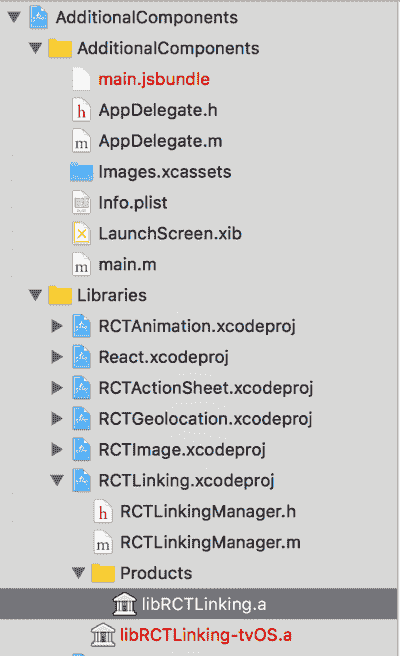
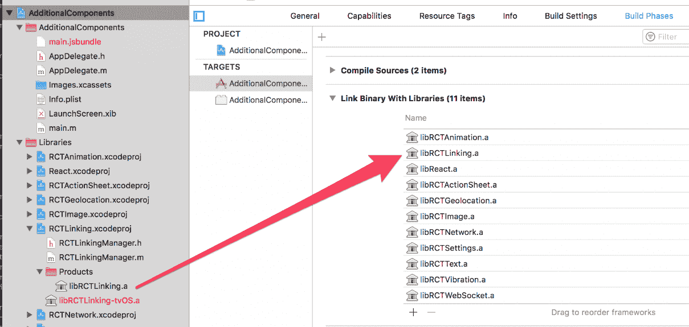
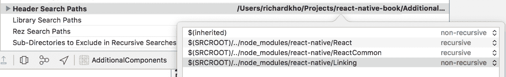
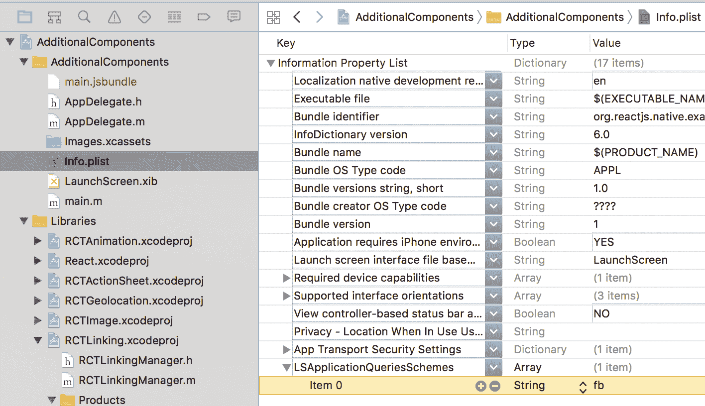
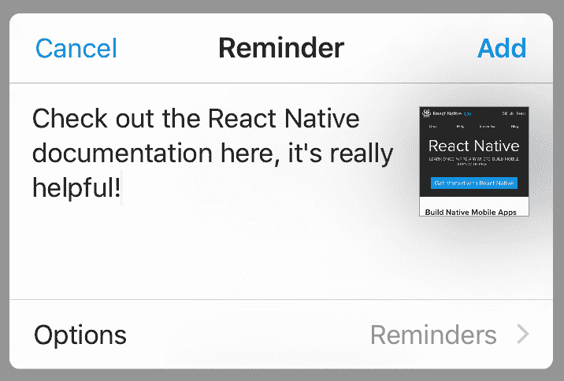
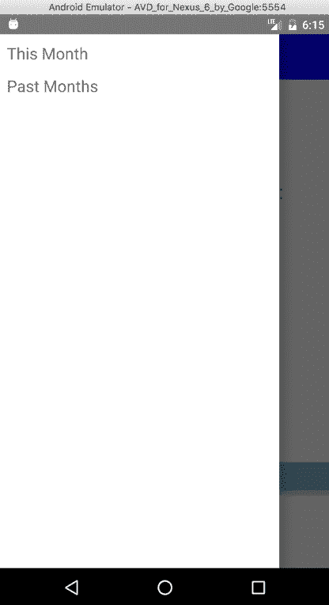

# 第九章：其他 React Native 组件

在整本书中，我们提到了许多 React Native SDK。然而，有些组件的添加并不适合我们构建的应用程序。

在本章中，我们将介绍其中的一些，以便你能够在 React Native 框架中获得一些扩展实践。你将学习以下内容：

+   编写一个游乐场应用程序，我们将添加在先前项目中没有使用过的 React Native API 组件和部分

+   使用 Fetch API 对第三方资源进行网络调用

+   利用 Vibration API 使用户的手机产生物理振动

+   利用 Linking API 让您的应用通过已注册的链接打开第三方应用

+   构建一个可以滑动以在定义的最小值和最大值之间设置值的滑块

+   学习如何在 iOS 中使用 Action sheet 和 Share sheet 来分享应用中的详细信息

+   使用 Geolocation polyfill 获取用户的位置数据

此外，本章末尾还包括一个教程，介绍我们如何在第四章中构建`Expenses`，即使用 Android 的**高级功能**。

# 设置样板项目

使用 React Native 命令行工具，我创建了一个名为`AdditionalComponents`的项目。在其中，结构比我们之前的项目简化得多。

在项目的根目录下的每个特定平台的索引文件中，它从我们的`app`文件夹导入一个`App`组件并将其注册到`AppRegistry`：

```js
// AdditionalComponents/index.ios.js 

import App from './app'; 
import { AppRegistry } from 'react-native'; 
AppRegistry.registerComponent('AdditionalComponents', () => App); 

```

我们将使用位于`app`文件夹中的`index.js`文件来存放我们将要构建的示例代码。

在这一步骤结束时，我们有一个`index.js`文件：

```js
// AdditionalComponents/app/index.js 

import React, { Component } from 'react'; 
 import { 
  Text, 
  View 
} from 'react-native'; 
import styles from './styles'; 
export default class App extends Component { 
  render () { 
    return ( 
      <View style={ styles.container }> 
        <Text style={ styles.text }> 
          Hello from React Native! 
        </Text> 
      </View> 
    ) 
  } 
} 

```

此外，我们还有一个包含我们样式的文件：

```js
// AdditionalComponents/app/styles.js 

import { StyleSheet } from 'react-native'; 
export const styles = StyleSheet.create({ 
  container: { 
    flex: 1, 
    backgroundColor: '#fafafa' 
  }, 
  text: { 
    alignSelf: 'center', 
    color: '#365899', 
    marginTop: 50 
  } 
}); 
export default styles; 

```

# 让 Fetch 发生

我们将要做的第一件事是在`componentDidMount`生命周期中对第三方 API 发起请求。我们的目的是从该 API 获取一组 JSON 数据，并将其用于填充我们将在下一节中创建的`Picker`组件。

我将要使用的第三方 API 是一个很酷的 API，它产生 JSON 占位符数据--[`jsonplaceholder.typicode.com`](https://jsonplaceholder.typicode.com)。

为了从这个第三方 API 获取数据，我们将使用`fetch` API。`fetch`是一个 JavaScript API，不需要特别导入到我们的文件中。它返回一个包含响应的 promise。如果我们想使用 promises，我们可以像这样调用`fetch`：

```js
fetch(endpoint, object) 
  .then((response) => { 
    return response.json(); 
  }) 
  .then((result) => { 
    return result; 
  }) 

```

我们也可以使用`async`/`await`关键字调用`fetch`：

```js
async fetchAndReturnData (endpoint, object) { 
  const response = await fetch(endpoint, object); 
  const data = await response.json(); 
  return data; 
} 

```

`fetch`接受的第一个参数是 API 的`endpoint`。第二个是一个可选的`object`。默认情况下，`fetch`假设你正在发起一个`GET`请求。为了发起一个`POST`请求，你必须传递一个包含`POST`属性作为字符串的`object`到名为`method`的键。此`object`还可以接受你希望包含的任何头信息以及所有其他要发送的请求参数。

例如，一个对象可以看起来像这样：

```js
const obj = { 
  method: 'POST', 
  headers: { 
    'Accept': 'application/json', 
    'Content-Type': 'application/json', 
    'Origin': '', 
    'Host': 'api.test.com' 
  }, 
  body: JSON.stringify({ 
    'client_id': apiKey, 
    'client_secret': apiSecret, 
    'grant_type': grantType 
  }) 
}  

```

在你的 `App` 组件中，让我们创建一个 `componentDidMount` 生命周期事件，使用以下 `endpoint` 从我们的 `JSONPlaceholder` API 获取数据：

```js
https://jsonplaceholder.typicode.com/json

```

当数据被获取时，将其保存到组件的 `state` 中，并在 `console` 中记录以显示它已被填充。你编写的代码可能看起来像以下这样：

```js
// AdditionalComponents/app/index.js 

... 
export default class App extends Component { 
  constructor (props) { 
    super (props); 
    this.state = { 
      data: [] 
    } 
  } 
 async componentDidMount () { 
    const endpoint = 'https://jsonplaceholder.typicode.com/users'; 
    const response = await fetch(endpoint); 
    const data = await response.json(); 

    this.setState({ 
      data 
    }); 
 console.log(this.state.data); 
  } 
  ... 
} 

```

这就是你需要做的所有事情，在 React Native 应用程序中使用 `fetch` 从 `endpoint` 发起 `GET` 请求！接下来，我们将使用 `Vibration` API 在我们的 `fetch` 函数成功解析时向用户的设备发送振动。

# 振动

`Vibration` API 允许我们访问用户移动设备的振动电机并向其发送振动。

这个演示将需要使用实际硬件进行测试，但如果你有可用的硬件进行实验，那么设置过程是值得的。在不支持振动的设备上，包括模拟器，将不会有任何效果。

使用 Vibration API 有一些需要注意的注意事项。

从用户体验的角度来看，在你的应用程序中使用振动应该作为一种反馈机制，让用户知道发生了某种交互。

此外，在用户的手机上长时间使用振动电机会导致设备电池性能承受更大的压力。

很容易滥用这个 API 并在你的应用程序的所有方面都包含振动，但我强烈建议将此功能保留用于确认用户可能与你的应用程序进行的键交互。

它还提供了两种方法：

+   第一种方法是 `Vibration.vibrate()`，它接受两个参数：

    +   第一种是一个数字或者数字数组。这个数字（或数字）被认为是振动发生的模式。

    +   如果传递一个数字，Android 设备将根据这个数字的毫秒数振动。在 iOS 上，它将始终导致 1 次振动。

    +   如果传递一个数字数组给这个函数，振动电机将遵循不同的模式。Android 设备将等待等于第一个索引的毫秒数，然后振动等于第二个索引的毫秒数。这种振动电机在等待和振动之间切换的模式将延续到数组的长度。

    +   例如，一个 `[100, 200, 300, 400]` 的数组意味着 Android 设备将等待 `100` 毫秒，然后振动 `200` 毫秒，然后等待 `300` 毫秒，最后振动 `400` 毫秒。

    +   iOS 上振动电机的行为不同。而不是根据每个索引交替等待和振动，iOS 功能将始终在固定的 1 秒间隔内振动，并在振动之间根据数组中的下一个数字等待。此外，如果数组中的第一个索引设置为 0，iOS 将忽略它。

    +   例如，一个 `[0, 100, 200, 300]` 的数组意味着 iOS 设备将跳过第一个索引，振动 1 秒，然后等待 `100` 毫秒再次振动 1 秒。之后，它等待 `200` 毫秒再次振动 1 秒。最后，在最后一次振动后等待 `300` 毫秒，然后再次振动 1 秒。

    +   `Vibration.vibrate()` 接受的第二个参数是一个布尔值，它告诉电机在完成振动模式后是否重新启动振动（无限期地）或停止一次迭代后停止。

+   第二种方法是 `Vibration.cancel()`，它用于取消当前正在进行的振动。如果你在 `vibrate` 方法中将重复布尔值设置为 `true`，这一点很重要。

此外，对于 Android 设备，你需要在你的 `AndroidManifest.xml` 文件中添加以下行：

```js
<uses-permission android:name="android.permission.VIBRATE"/> 

```

在本节中，让我们创建一个回调，当 `Picker` 可访问数据时触发，并使设备振动几次。这是我想到的代码；你的可能与此类似：

```js
// AdditionalComponents/app/index.js 

... 
import { 
  ... 
  Vibration 
} from 'react-native'; 
... 
export default class App extends Component { 
  ... 
  async componentDidMount () { 
    const endpoint = 'https://jsonplaceholder.typicode.com/users'; 
    const response = await fetch(endpoint); 
    const data = await response.json(); 

    this.setState({ 
      data 
    }); 

    this._onDataAvailable(); 
     } 
  ... 

  _onDataAvailable () { 
    Vibration.vibrate([1000, 2000, 1000, 2000], false); 
  } 
} 

```

这很简单！在下一节中，我们将探讨如何打开设备上另一个已安装应用的链接。

# 使用按钮链接应用

深链接允许我们与其他应用之间的传入和传出链接进行交互。通过为你的应用创建一个深链接，你可以使其他应用能够直接与之通信，并传递参数给它，如果需要的话。

你还可以访问其他应用的深链接，使用自定义参数打开它们。在本章中，我们将学习如何使用深链接访问其他应用。

我们将创建一个 `Button` 组件，当按下时，会检查用户设备上是否安装了 Facebook，如果安装了，则启动应用并告诉它打开通知页面。如果没有安装 Facebook，它将在设备的默认浏览器中打开 React Native 文档。

重要的是要注意，你可以将 Linking 作为任何你希望的回调的一部分来调用。它根本不需要与 `Button` 组件绑定！

这里是我们将与 `Linking` 一起使用的两种方法：

+   `canOpenURL`：这是一个接受 URL 作为参数的函数。它返回一个包含布尔值的承诺，表示提供的 URL 是否可以打开。这个 URL 可以是另一个应用的深链接，或者是一个用于打开网页的基于 Web 的 URL。

+   `openURL`：这是一个也接受 URL 作为参数的方法，并尝试使用已安装的应用打开它。如果用户的设备不知道如何打开传递的 URL，则此方法会失败，这就是为什么最好先使用 `canOpenURL` 检查是否可以打开它的原因。

在 iOS 设备上，我们需要稍微调整 Xcode 项目文件，以便允许`Linking`打开自定义 URL 方案。首先，我们需要将 React Native 的`Linking`二进制文件链接到我们的项目中。在 Xcode 中打开您的项目，然后在左侧导航器中展开`Libraries`文件夹，然后是其中的`RCTLinking.xcodeproj`，接着是那个`Products`文件夹：



返回`AdditionalComponents`的根项目文件，进入构建阶段，并将`libRCTLinking.a`文件拖到`Link Binary With Libraries`下：



之后，转到构建设置选项卡，并将一个条目添加到头文件搜索路径数组中，指向`Linking`库。对于这个特定的项目，路径是`$(SRCROOT)/../node_modules/react-native/Linking`。

您可以保持搜索非递归：



还有最后一步要执行。从 iOS 9 开始，我们必须在应用内注册访问 Facebook URL 方案的意图。

在侧边栏中打开`Info.plist`文件，并创建一个名为`LSApplicationQueriesSchemes`的数组条目。向此数组添加一个字符串，其值为您希望访问的 URL 方案。Facebook 的 URL 方案很简单，就是`fb`：



完成此操作后，您的应用应该已经链接到 iOS！

在 Android 上，不需要采取任何进一步的操作；您应该默认已经可以访问其他 URL 方案。

使用这些知识，让我们创建一个`Button`组件，该组件可以启动已安装的 Facebook 应用，如果没有安装，则链接到用户设备上的 React Native 文档。以下是我如何编写的：

```js
// AdditionalComponents/app/index.js 

... 
import { 
  Button, 
  Linking, 
  ... 
} from 'react-native'; 
... 
export default class App extends Component { 
  ... 
  render () { 
    return ( 
      <View style={ styles.container }> 
        ... 
        <Button 
          color={ '#365899' } 
          onPress={ () => this._onButtonPress() } 
          title={ 'Open Link' } 
        /> 
      </View> 
    ) 
  } 

  async _onButtonPress () { 
    const facebookURL = 'fb://notifications'; 
    const canOpenLink = await Linking.canOpenURL(facebookURL); 

    if (canOpenLink) { 
      Linking.openURL(facebookURL); 
      return; 
    } 

    Linking.openURL('https://facebook.github.io/react-native'); 
  } 
  ... 
} 

```

在我们的`render`方法中的`Button`组件在按下时会触发`_onButtonPress`回调。它检查`Linking` API 以确定设备上是否可以打开 Facebook 应用，如果可以，则打开它。如果不能，它将在设备的默认浏览器中打开一个链接到 React Native 文档网站。

# 滑块

滑块是 Web 上常见的 UI 组件。在本节中，您将看到在 React Native 应用程序中创建一个滑块是多么容易。

虽然`Slider`至少有九个不同的属性，但我们只会使用以下属性：

+   `maximumValue`：这是一个设置`Slider`起始最大值的数字。它默认为`1`。

+   `minimumValue`：这是一个设置`Slider`起始最小值的数字。它默认为`0`。

+   `onSlidingComplete`：这是一个在用户完成与`Slider`交互时触发的回调。

+   `onValueChange`：这是一个在用户拖动`Slider`时连续触发的回调。

+   `step`：这是一个设置滑块步进值的数字。每次`Slider`的点击都会移动这个数字的步数。它默认为`0`，范围在`0`和最大值与最小值之间的差值之间。

花点时间创建一个`Slider`组件。给它任何你喜欢的最小和最大值，任何步数，并创建一些文本，显示当滑动条移动或交互停止时滑动条的当前值。这是我实现它的方法：

```js
// AdditionalComponents/app/index.js 

... 
import { 
  ... 
  Slider, 
} from 'react-native'; 
... 
export default class App extends Component { 
  ... 
  constructor (props) { 
    ... 
    this.state = { 
      ... 
      sliderValue: undefined 
    } 
  } 
  ... 
  render () { 
    return ( 
      <View style={ styles.container }> 
        ... 
        <Text style={ styles.sliderSelectionText } > 
          Your Slider Value is: { this.state.sliderValue } 
        </Text> 
        <Slider 
          maximumValue={ 100 } 
          minimumValue={ 0 } 
          onSlidingComplete={ (value) => 
          this._onSliderValueChange(value) } 
          onValueChange={ (value) => this._onSliderValueChange(value) } 
          step={ 3 }  
        /> 
      </View> 
    ) 
  } 

```

这在页面上渲染了一个新的`Slider`组件，其值范围从`0`到`100`。当用户正在拖动滑动条或完成拖动操作时，它会改变滑动条的价值。每次滑动条的移动都会增加`3`的值。

这个回调处理在状态中设置`sliderValue`属性。`sliderValue`属性的代码如下：

```js
  ... 
  _onSliderValueChange (sliderValue) { 
    this.setState({ 
      sliderValue 
    }); 
  } 
} 

// AdditionalComponents/app/styles.js 

... 
const styles = StyleSheet.create({ 
  sliderSelectionText: { 
    alignSelf: 'center', 
    color: '#365899', 
    marginTop: 20 
  }, 
  ... 
}); 
... 

```

# 使用 ActionSheetIOS

`ActionSheetIOS` API 让我们能够显示一个动作表单或分享表单供用户交互。

动作表单是用户可以在应用中交互的选项覆盖层。

分享表单允许用户使用内置的分享系统几乎在任何地方分享任何内容。这可能意味着以短信、电子邮件或第三方应用的形式发送内容。

# 创建一个动作表单

`ActionSheetIOS`提供的两个方法是`showActionSheetWithOptions`和`showShareActionSheetWithOptions`。

第一个方法`showActionSheetWithOptions`接受两个参数：一个`options`对象和一个`callback`函数。

`options`对象必须包含以下属性之一。在这个例子中，我们使用了所有五个属性：

+   `options`：这是一个字符串数组，映射到覆盖层中出现的多个选项。

+   `cancelButtonIndex`：这是一个指向`options`数组中取消按钮（如果存在）位置的索引的数字。这会将取消按钮发送到覆盖层的底部。

+   `destructiveButtonIndex`：这是一个指向`options`数组中破坏性按钮（如果存在）位置的索引的数字。这会将破坏性选项的文本颜色变为红色。

+   `title`：这是一个显示在动作表单上方的字符串。

+   `message`：这是一个显示在标题下方的字符串。

`showActionSheetWithOptions`方法接受的回调将传递一个参数给它，这个参数是用户在交互动作表单时选择的选项索引。如果用户点击动作表单外部以隐藏它，这具有与选择取消按钮索引完全相同的效果：


尝试创建一个自己的动作表单。有一个某种交互来切换它，然后是当索引被选中时你可以想到的任何类型的交互。确保给你的动作表单一个`title`、`message`、一些`options`、一个`cancel`索引和一个`destructive`索引。

这是我想出来的代码。调用一个函数来渲染`ActionSheetIOS`和`ShareSheetIOS`组件。我在函数名中添加了对`ShareSheetIOS`的引用，以期待下一节：

```js
// AdditionalComponents/app/index.js 

... 
import { 
  ActionSheetIOS, 
  ... 
} from 'react-native'; 
... 
export default class App extends Component { 
  ... 
  render () { 
    return ( 
      <View style={ styles.container }> 
        ... 
        { this._renderActionAndShareSheets() } 
      </View> 
    ) 
  } 

```

将 `ActionSheetIOS` 组件选择的索引通知用户：

```js
  _onActionSheetOptionSelected (index) { 
    alert('The index you selected is: ' + index) 
  } 

```

打开 `ActionSheetIOS` 并添加以下代码：

```js
  ... 
  _openActionSheet () { 
    const options = ['One', 'Two', 'Three', 'Cancel', 'Destroy']; 
    ActionSheetIOS.showActionSheetWithOptions({ 
      options: options, 
      cancelButtonIndex: 3, 
      destructiveButtonIndex: 4, 
      title: 'Action Sheet Options', 
      message: 'Please select from the following options' 
    }, (index) => this._onActionSheetOptionSelected(index)) 
  } 

```

如果用户在 Android 设备上，不要渲染任何内容，因为这些组件是 iOS 独有的：

```js
  _renderActionAndShareSheets () { 
    if (Platform.OS === 'android') { 
      return; 
    } 

```

返回一个在按下时调用 `_openActionSheet` 的 `Button`：

```js
    return ( 
      <View> 
        <Button 
          color={ '#365899' } 
          onPress={ () => this._openActionSheet() } 
          title={ 'Open Action Sheet' }  
        /> 
      </View> 
    ) 
  } 
} 

```

# 使用 ShareSheetIOS 分享内容

另一方面，分享表单是一种不同类型的交互。正如我之前提到的，分享表单允许我们的应用与它共享内容。要打开它，我们调用 `showShareActionSheetWithOptions` 方法。它接受三个参数：一个 `options` 对象、一个 `failureCallback` 函数和一个 `successCallback` 函数。

分享表单的 `options` 对象与动作表单接受的 `options` 对象不同。它可以包含以下属性：

+   `url`：这是一个要分享的字符串化 URL。如果 `message` 属性不可用，则 `url` 属性是必需的。URL 可以指向本地文件或 base-64 编码的 `url`；可以通过这种方式分享图片、视频、PDF 等其他类型的文件。

+   `message`：这是一个包含用户要分享的消息的字符串。如果 `url` 属性不可用，则 `message` 属性是必需的。

+   `subject`：这是一个包含消息主题的字符串。

当分享表单操作失败或被用户取消时，`failureCallback` 被触发，而当用户成功执行分享表单操作时，`successCallback` 被触发。



让我们修改索引文件以执行以下操作：

+   修改 `_renderActionAndShareSheets` 以返回一个位于第一个按钮正下方的第二个按钮，当点击时将打开 ShareSheet

+   创建一个名为 `_openShareSheet` 的函数来处理打开该分享表单的操作

这就是我的版本是如何产生的。调用 `ActionSheetIOS` 的 `showShareActionSheetWithOptions` 方法，给它一个打开的链接和一个要分享的消息，以及一个 `subject` 和 `error`/`success` 回调：

```js
// AdditionalComponents/app/index.js 

... 
export default class App extends Component { 
  ... 
  _openShareSheet () { 
    ActionSheetIOS.showShareActionSheetWithOptions({ 
      url: 'https://facebook.github.io/react-native', 
      message: 'Check out the React Native documentation here,
      it's really helpful!', 
      subject: 'Link to React Native docs' 
    }, (error) => alert(error), 
    (success) => { 
      alert(success); 
    }) 
  } 

```

看看以下代码：

```js
  _renderActionAndShareSheets () { 
    ... 
    return ( 
      <View> 
        ... 
        <Button 
          color={ '#365899' } 
          onPress={ () => this._openShareSheet() } 
          title={ 'Open Share Sheet' } 
        /> 
      </View> 
    ) 
  } 
} 

```

# 获取用户地理位置数据

React Native 的 `Geolocation` API 是 `Web Geolocation` API 的扩展。它可以通过调用 `navigator.geolocation` 来使用，不需要导入。

位置数据是移动体验的重要组成部分，并且作为最佳实践，在用户提供这些信息有明确好处之前，不应从用户那里请求这些数据。

由于位置数据在用户同意与您分享之前是私密的，因此将此信息的共享视为用户与您的应用程序之间的信任纽带。

总是假设当用户被要求分享他们的位置时，他们会选择“否”，并制定一个策略来处理这种不可避免的拒绝。

在 iOS 上，如果您使用 React Native 创建了项目，地理位置将默认启用。如果没有，您需要前往您的 `Info.plist` 文件，并向其中添加 `NSLocationWhenInUsageDescription` 键。

在安卓设备上，您需要在`AndroidManifest.xml`文件中添加以下行：

```js
<uses-permission android:name=
"android.permission.ACCESS_FINE_LOCATION" /> 

```

`Geolocation` API 有四个不同的方法。以下是我们将在示例中介绍的三种方法：

+   `getCurrentPosition`: 这是一个获取设备当前位置的函数。它最多接受三个参数：

    +   第一个，一个`success`回调，是必须的，并带有当前位置信息调用。

    +   第二个，一个`error`回调，是可选的。

    +   第三个是一个可选的选项数组，可以包含以下受支持选项：`timeout`（以毫秒为单位），`maximumAge`（以毫秒为单位），以及`enableHighAccuracy`（一个布尔值）。

+   `watchPosition`: 这是一个监视设备位置并返回一个监视 ID 号的函数。它最多接受三个参数：

    +   第一个是必须的`success`回调，每当位置发生变化时都会触发。

    +   第二个是可选的回调，用于处理错误。

    +   第三个是另一个可选的选项对象，可以包含与`getCurrentPosition`选项对象相同类型的`timeout`、`maximumAge`和`enableHighAccuracy`属性，以及一个接受以米为单位的数字的`distanceFilter`属性。

+   `clearWatch`: 这是一个接受一个手表 ID 号并停止监视该位置的函数。

这里是`Geolocation` API 返回的当前位置对象的示例：

```js
{ 
  coords: { 
    accuracy: 5, 
    altitude: 0, 
    altitudeAccuracy: -1, 
    heading: -1, 
    latitude: 37.785834, 
    longitude: -122.406417, 
    speed: -1 
  }, 
  timestamp: 1483251248689.033 
} 

```

使用`Geolocation` API，让我们修改索引文件，以便我们可以做以下事情：

+   在`componentDidMount`生命周期中获取用户的位置

+   在屏幕上显示它们的纬度和经度

+   此外，创建一个按钮来监视设备的地理位置，并在按下时更新它：

+   然后，创建一个按钮来清除它

这里是我为这一节编写的代码。在`componentDidMount`生命周期中调用`Geolocation` API 的`getCurrentPosition`方法，并将位置保存到状态中：

```js
// AdditionalComponents/app/index.js 

... 
export default class App extends Component { 
  ... 
  async componentDidMount () { 
    ... 
    navigator.geolocation.getCurrentPosition((location) => { 
      this.setState({ 
        location 
      }); 
    }); 
  } 

```

在`Text`组件中渲染用户的纬度和经度：

```js
  render () { 
    return ( 
      <View style={ styles.container }> 
        ... 
        <Text style={ styles.latLongText }> 
          Your Latitude is: { this.state.location ? 
          this.state.location.coords.latitude : 'undefiend' } 
        </Text> 
        <Text style={ styles.latLongText }> 
          Your Longitude is: { this.state.location ? 
          this.state.location.coords.longitude : 'undefined' } 
        </Text> 

```

渲染一个按钮以启动监视过程，另一个按钮以停止监视过程：

```js
        <Button 
          color={ '#80B546' } 
          onPress={ () => this._onBeginWatchPositionButtonPress() } 
          title={ 'Start Watching Position' } 
        /> 
        <Button 
          color={ '#80B546' } 
          disabled={ this.state.watchID !== undefined ? false : true } 
          onPress={ () => this._onCancelWatchPositionButtonPress() } 
          title={ 'Cancel Watching Position' } 
        /> 
      </View> 
    ) 
  } 

```

当用户开始监视他们的位置时设置用户的位置：

```js
  ... 
  _onBeginWatchPositionButtonPress () { 
    const watchID = navigator.geolocation.watchPosition((watchSuccess)   
    => { 
      this.setState({ 
        location: watchSuccess 
      }); 
    }); 

```

将`watchPosition`调用的 ID 保存到状态中：

```js
    this.setState({ 
      watchID 
    }); 
  }

```

当用户按下取消监视位置按钮时调用`clearWatch`，并在状态中擦除`watchID`：

```js
   _onCancelWatchPositionButtonPress () { 
    navigator.geolocation.clearWatch(this.state.watchID); 

    this.setState({ 
      watchID: undefined 
    }); 
  } 
  ... 
} 

```

干得好！你已经完成了本章的游乐场部分。在下一节中，我们将转换方向，重新审视第四章中的`Expenses`应用，*使用 Expenses 应用的扩展功能*。

# 安卓设备费用

在*第四章*，*使用 Expenses 应用的扩展功能*中，我们完成了 Expenses 应用（我们的预算跟踪应用）的 iOS 版本的建设。由于章节的页数，我认为将安卓部分放在本章的末尾会更好。

这一节立即从*第四章*，“使用 Expenses 应用的高级功能”的结尾继续。

在*第四章*，“使用 Expenses 应用的高级功能”的代码库中，仍可以找到 Expenses 的 Android 版本示例代码。

# Android 修改

为了支持 Android，我们想要对我们的代码库做以下事情：

+   通过 Gradle 导入`react-native-vector-icons`库

+   用基于 Android 的解决方案替换`TabBarIOS`组件，使用`DrawerLayoutAndroid`和`ToolbarAndroid`组件创建一个包含可以滑动以在当前月份和上个月份的支出之间切换的抽屉的导航栏

+   用`Navigator`替换任何`NavigatorIOS`实例

+   移除`ProgressViewIOS`

+   在`AddExpensesModal`中移除`ExpandableCell`组件，并用`DatePickerAndroid`替换`DatePickerIOS`

+   将任何需要 Android 特定文件的组件添加到其中

# 安装矢量图标库

对于 Android，您不需要做任何额外的事情来安装`react-native-vector-icons`库，因为 React Native 链接应该已经为您处理了整个过程。

然而，如果您决定手动为 iOS 链接库，`react-native-vector-icons`的 readme 文件有导入 Android 设备库的最新、最新的手动导入说明。由于这些说明可能会随着库的新版本而更改，我强烈建议您直接从`README`文件中遵循它们。

如果您已经在项目的`node_modules`文件夹中安装了该包，您可以直接从那里阅读说明，无需进一步的网络访问。

使用 Gradle 导入的说明非常直接。您还希望遵循用于集成`getImageSource`和`ToolbarAndroid`支持的库的说明。

# ToolbarAndroid

在 Android 上，导航 UI 的首选方式是通过其顶部放置的工具栏。这与 iOS 体验不同，因为不是所有可用的标签都位于屏幕底部，而是导航隐藏在一个用户点击以展开的抽屉中。

`ToolbarAndroid`是一个 React Native，特定于 Android 的组件，它围绕 Android SDK 的本地工具栏小部件包装。像`TabBarIOS`一样，我们可以访问一个通过调用`<Icon.ToolbarAndroid />`渲染的`react-native-vector-icons`特定版本的组件。当我们在应用中使用`Icon.ToolbarAndroid`时，我们将使用以下属性：

+   `title`：这是一个显示在工具栏顶部的字符串，显示应用名称

+   `titleColor`：这设置了`title`字符串的颜色

+   `navIconName`：这是一个设置工具栏中导航菜单图标的字符串

+   `height`：这是一个设置工具栏高度的数字

+   `backgroundColor`：这设置了工具栏的背景颜色

+   `onIconClicked`: 这是一个当用户点击导航图标时执行的回调。

然而，你可能已经注意到，没有足够的空间来放置这个传统上由导航图标打开的实际 `Navigation` 抽屉。这是因为我们将使用 `Icon.ToolbarAndroid` 与 `DrawerLayoutAndroid` 结合使用，该组件负责处理实际的导航抽屉。

# DrawerLayoutAndroid

这个组件通常用于导航。想象一下，这就是 TabBarIOS 中的标签页将可用的地方。

`DrawerLayoutAndroid` 组件可以访问负责其可见性的 `openDrawer` 和 `closeDrawer` 方法。要使用它，传递组件的引用并使用它来调用任一方法。

虽然这个组件有很多属性可用，但我们将只使用以下属性：

+   `drawerLockMode`: 这是三个字符串之一，用于确定抽屉是否响应触摸手势，例如滑动打开/关闭抽屉。这不会禁用工具栏的导航图标打开和关闭抽屉：

    +   `unlocked`: 抽屉响应触摸手势

    +   `locked-closed`: 抽屉保持关闭状态，不响应触摸手势

    +   `locked-open`: 抽屉保持打开状态，不响应触摸手势

+   `ref`: 这是一个引用字符串，用于传递给抽屉。这样我们就可以在其子组件中引用抽屉，这对于打开和关闭它是必要的。

+   `renderNavigationView`: 这是一个负责渲染你抽屉的函数。

# 连接 ToolbarAndroid 和 DrawerLayoutAndroid

我们连接这两个组件的方式是首先编写一个 `Icon.ToolbarAndroid` 组件：

```js
<Icon.ToolbarAndroid 
  title={ 'Expense' } 
  titleColor={ '#7D878D' } 
  navIconName={ 'menu' } 
  height={ 56 } 
  backgroundColor={ '#4E92B5' } 
  onIconClicked={ () => this._openDrawer(); } 
/> 

```

然后，创建一个 `DrawerLayoutAndroid` 组件，并将其包裹在两个子组件中：你刚刚创建的 `Icon.ToolbarAndroid` 组件以及随后的 `Navigator`：

```js
<DrawerLayoutAndroid 
  drawerLockMode={ 'unlocked' } 
  ref={ 'drawer' } 
  renderNavigationView={ () => this._renderDrawerLayout() } 
> 
  // Insert Toolbar here 
  <Navigator 
  initialRoute={{ index: 0 }} 
  ref={ 'navigator' } 
  renderScene={ (routes, navigator) => this._renderScene(routes, navigator) } 
  /> 
</DrawerLayoutAndroid> 

```

当集成这三个组件时，我们想要确保以下始终为真：

+   `DrawerLayoutAndroid` 总是位于其他所有内容之上，这样抽屉就不会被塞在 `Icon.ToolbarAndroid` 下面。

+   当使用 `DrawerLayoutAndroid` 的选项在视图之间导航时，应该存在相同的 `Icon.ToolbarAndroid` 实例，这样我们就不需要在每次都渲染一个新的 `Icon.ToolbarAndroid` 组件，也不会包含一个工具栏从屏幕上 *离开* 并被 *另一个* 替换的动画。

我们在这里要做的是在 `DrawerLayoutAndroid` 内嵌套 `Icon.ToolbarAndroid` 和 `Navigator`，并为 `Navigator` 设置一个 `ref`，这样我们就可以使用该 `Navigator` 在根文件中根据需要推送新的场景。

一旦实现了 `Icon.ToolbarAndroid` 和 `DrawerLayoutAndroid` 组件，你将能够拥有如下所示的内置导航：



下面是这个大图的样子：

```js
// Expenses/index.android.js 

import React, { Component } from 'react'; 
import { 
  AppRegistry, 
  DrawerLayoutAndroid, 
  Navigator, 
  StyleSheet, 
  View 
} from 'react-native'; 

import App from './app/App'; 
import CurrentMonthExpenses from './app/components/CurrentMonthExpenses';
import Drawer from './app/components/Drawer'; 
import EnterBudget from './app/components/EnterBudget'; 
import PreviousMonthsList from './app/components/PreviousMonthsList'; 

```

这些是这个索引文件将与之工作的四个组件。`App`、`EnterBudget`和`PreviousMonthsList`组件将是我们导航路由的一部分。`Drawer`组件用于渲染`DrawerLayoutAndroid`的导航视图。

由于 Android 软件的设计语言与 iOS 应用不同，我选择了导入`MaterialIcons`包而不是`FontAwesome`，因为它是根据谷歌的 Material Design 指南构建的：

```js
import Icon from 'react-native-vector-icons/MaterialIcons'; 

```

设置了一个名为`expenses`的属性为未定义。这是为了传递给`PreviousMonthsList`，因为它期望作为属性传递的支出列表。

可见路由传递给`Drawer`组件。我故意省略了处理输入月度预算的路由，因为这个路由用户不应该能够手动导航到。

在`WillMount`组件生命周期中，我调用`_updateExpenses`方法来设置状态中的`expenses`键为支出对象。查看以下代码以了解这里给出的解释：

```js
class Expense extends Component { 
  constructor (props) { 
    super (props); 
    this.state = { 
      expenses: undefined, 
      visibleRoutes: [ 
        { title: 'This Month', index: 0 }, 
        { title: 'Past Months', index: 2 } 
      ] 
    } 
  } 

  componentWillMount () { 
    this._updateExpenses(); 
  } 

  render() { 
    const routes = [ 
      { title: 'Expense', index: 0 }, 
      { title: 'Enter Your Budget', index: 1 }, 
      { title: 'Previous Month List', index: 2 }, 
      { title: 'Past Expenses', index: 3}
    ]; 
    return ( 
      <View style={ styles.container }> 
        <DrawerLayoutAndroid 
          drawerLockMode={ 'unlocked' } 
          ref={ 'drawer' } 
          renderNavigationView={ () => this._renderDrawerLayout()        
            } 
        > 

```

在`DrawerLayoutAndroid`组件内部，我嵌套了`Icon.ToolbarAndroid`和`Navigator`。正如我之前提到的，这是为了将抽屉物理地放置在应用程序其他部分的上方。查看以下代码：

```js
          <Icon.ToolbarAndroid 

            titleColor="white" 
            navIconName="menu" 
            height={ 56 } 
            backgroundColor="blue" 
            onIconClicked={ () => this._openDrawer() } 
          /> 
          <Navigator 
            initialRoute={{ index: 0 }} 
            ref={ 'navigator' } 
            renderScene={ (routes, navigator) =>  
              this._renderScene(routes, navigator) } 
          /> 
        </DrawerLayoutAndroid> 
      </View> 
    ); 
  } 

  _openDrawer () { 
    this.refs['drawer'].openDrawer(); 
  } 

```

由于之前给`DrawerLayoutAndroid`分配了一个`drawer`引用，我可以在用户点击导航图标时使用它来打开抽屉。我还给`Navigator`分配了一个`navigator`引用，这样我就可以在根`index.android.js`级别上推送它。

`DrawerLayoutAndroid`组件的`render`方法返回我从我编写的自定义组件导入的这个`Drawer`组件。我通过`navigateTo`属性名传递一个回调函数，该函数推送`navigator`的索引并关闭`DrawerLayoutAndroid`：

```js
  _navigateTo (index) { 
    this.refs['navigator'].push({ 
      index: index 
    }); 
    this.refs['drawer'].closeDrawer(); 
  } 

  _renderDrawerLayout () { 
    return ( 
      <Drawer 
        navigateTo={ (index) => this._navigateTo(index) } 
        routes={ this.state.visibleRoutes } 
      /> 
    ) 
  } 

```

使用`_renderScene`配置的`PreviousMonthsList`的渲染将传入`expenses`对象和`updateExpenses`函数。

```js
  _renderScene (route, navigator) { 
    if (route.index === 0) { 
      return ( 
        <App 
          title={ route.title } 
          navigator={ navigator } 
        /> 
      ) 
    } 

    if (route.index === 1) { 
      return ( 
        <EnterBudget 
          title={ route.title } 
          navigator={ navigator } 
          { ...route.passProps } 
        /> 
      ) 
    } 

    if (route.index === 2) { 
      return ( 
        <PreviousMonthsList 
          title={ route.title } 
          navigator={ navigator } 
          expenses={ this.state.expenses } 
          updateExpenses={ () => this._updateExpenses() } 
        /> 
      ) 
    } 
    if (route.index === 3) { 
      return ( 
        <CurrentMonthExpenses 
          title={ route.title } 
          navigator={ navigator } 
          { ...route.passProps } 
        /> 
      ) 
    } 
  }

```

传递给`PreviousMonthsList`作为名为`updateExpenses`的属性的`_updateExpenses`函数是`App`组件中找到的`_updateExpenses`函数的修改版本。我们只关心这个组件中的`expenses`对象，所以我们不会设置任何其他数据：

```js
  async _updateExpenses () { 

    let response = await storageMethods.getAsyncStorage(); 

    if (response) { 
      this.setState({ 
        expenses: response 
      }); 
    } 
  } 
} 

const styles = StyleSheet.create({ 
  container: { 
    flex: 1 
  } 
}) 

AppRegistry.registerComponent('Expense', () => Expense); 

```

然后，我构建了`Drawer`组件：

```js
// Expenses/app/components/Drawer/index.android.js 

import React, { Component, PropTypes } from 'react'; 

import { 
  ListView, 
  Text, 
  TouchableHighlight, 
  View 
} from 'react-native'; 

import DrawerRow from '../DrawerRow'; 
import styles from './styles'; 

```

`Drawer`导入的`DrawerRow`组件负责为`Drawer`的`ListView`组件渲染单个数据行。

```js
export default class Drawer extends Component { 
  static propTypes = { 
    navigateTo: PropTypes.func.isRequired, 
    routes: PropTypes.array.isRequired 
  } 

  constructor (props) { 
    super (props); 
    this.state = { 
      ds: new ListView.DataSource({ 
        rowHasChanged: (r1, r2) => r1 !== r2 
      }) 
    } 
  } 

  render () { 
    const dataSource = this.state.ds.cloneWithRows(this.props.routes); 

    return ( 
      <View style={ styles.container }> 
        <ListView 
          automaticallyAdjustContentInsets={ false } 
          dataSource={ dataSource } 
          enableEmptySections={ true } 
          renderRow={ (rowData, sectionID, rowID) => 
          this._renderDrawerRow(rowData, sectionID, rowID) } 
          renderSeparator={ (sectionID, rowID) => 
            <View 
              key={ rowID } 
              style={ styles.separator } 
            /> 
          } 
        /> 
      </View> 
    ) 
  } 

```

`Drawer`的`render`方法返回一个简单的`ListView`，它使用传递给它的作为属性的 routes 数组来生成每一行数据。

```js
_renderDrawerRow (rowData, sectionID, rowID) { 
    return ( 
      <View> 
        <TouchableHighlight 
          style={ styles.row } 
          onPress={ () => this.props.navigateTo(rowData.index) } 
        > 
          <DrawerRow routeName={ rowData.title } /> 
          </TouchableHighlight> 
      </View> 
    ) 
  } 
} 

```

然后，我为这个组件创建了一个基本的`StyleSheet`：

```js
// Expenses/App/components/Drawer/styles.js 

import { StyleSheet } from 'react-native'; 

const styles = StyleSheet.create({ 
  container: { 
    flex: 1 
  }, 
  separator: { 
    height: StyleSheet.hairlineWidth, 
    marginLeft: 10, 
    marginRight: 10, 
    backgroundColor: '#E5F2FD' 
  } 
}); 

export default styles; 

```

之后，我编写了`DrawerRow`组件：

```js
// Expenses/app/components/DrawerRow/index.android.js  

import React, { Component } from 'react'; 

import { 
  Text, 
  View 
} from 'react-native'; 

import styles from './styles'; 

export default class DrawerRow extends Component { 

  setNativeProps (props) { 
    this._root.setNativeProps(props) 
  } 

```

由于`DrawerRow`是一个自定义组件，并且包裹在`Drawer`组件的`_renderDrawerRow`方法中的`TouchableHighlight`组件没有自动调用`setNativeProps`为用户创建的组件，所以我手动调用了它：

```js
  render () { 
    return ( 
      <View 
        style={ styles.container } 
        ref={ component => this._root = component } 
        { ...this.props } 
      > 
        <Text style={ styles.rowTitle }> 
          { this.props.routeName } 
        </Text> 
      </View> 
    ) 
  } 
} 

```

`DrawerRow`组件也有自己的`StyleSheet`：

```js
// Expenses/app/components/DrawerRow/styles.js 

import { StyleSheet } from 'react-native'; 

const styles = StyleSheet.create({ 
  container: { 
    flex: 1, 
    height: 40, 
    padding: 10 
  }, 
  rowTitle: { 
    fontSize: 20, 
    textAlign: 'left' 
  } 
}); 

export default styles; 

```

# Android 特定的应用组件

接下来，我创建了一个针对 Android 的 `App.js` 的特定版本，将原始的 `App.ios.js` 重命名。`App.android.js` 中只导入了两个组件，因为任何要导航到的组件都在根 `index.android.js` 文件中处理：

```js
// Expenses/app/App.android.js 

import React, { Component } from 'react'; 

import { 
  Text, 
  View 
} from 'react-native'; 

import styles from './styles'; 

import * as dateMethods from './utils/dateMethods'; 
import * as storageMethods from './utils/storageMethods'; 

import AddExpenses from './components/AddExpenses'; 
import CurrentMonthExpenses from './components/CurrentMonthExpenses'; 

```

`App` 组件的状态不需要 `selectedTab` 属性，因为我们没有在 Android 上使用标签导航：

```js
export default class App extends Component { 
  constructor (props) { 
    super(); 

    this.state = { 
      budget: '', 
      expenses: {}, 
    } 
  } 

```

与其 iOS 对应版本相比，`componentWillMount` 没有发生变化：

```js
  componentWillMount () { 
    ... 
  } 

```

由于移除了标签导航，该组件的 `render` 方法已简化为仅渲染 `CurrentMonthExpenses` 和 `AddExpenses` 组件：

```js
  render () { 
    return ( 
      <View style={ styles.androidContainer }> 
        { this._renderCurrentMonthExpenses() } 
      </View> 
    ) 
  } 

```

与 `componentWillMount` 一样，`_renderCurrentMonthExpenses` 保留了 `App` 组件 iOS 版本的完全相同的逻辑：

```js
  _renderCurrentMonthExpenses () { 
    return ( 
      <View style={ styles.androidContainer }> 
        <CurrentMonthExpenses 
          ... 
        /> 
        <AddExpenses 
          ... 
        /> 
      </View> 
    ) 
  } 

```

`_renderEditBudgetComponent` 方法已经更改，以考虑 `Navigator` 如何与 `push` 方法不同，正如以下代码中提到的 `NavigatorIOS` 的 `push` 方法：

```js
  _renderEnterBudgetComponent () { 
    this.props.navigator.push({ 
      index: 1, 
      passProps: { 
        monthString: dateMethods.getMonthString(this.state.month), 
        saveAndUpdateBudget: (budget) => this._saveAndUpdateBudget(budget), 
        updateExpenses: () => this._updateExpenses() 
      } 
    }); 
  } 

```

虽然 iOS 应用组件的 `_renderPreviousMonthsList` 方法在 Android 上已被删除，但 `_saveAndUpdateBudget`、`_updateBudget` 和 `_updateExpenses` 的逻辑保持不变，正如以下代码中提到的：

```js
  async _saveAndUpdateBudget (budget) { 
    ... 
  } 

  async _updateBudget () { 
    ... 
  } 

  async _updateExpenses () { 
    ... 
  } 
} 

```

最后，我为 `App` 组件添加了一个简单的 `flex` 容器样式：

```js
// Expenses/app/styles.js 

... 
const styles = StyleSheet.create({ 
  androidContainer: { 
    flex: 1 
  }, 
  ... 
}); 

export default styles; 

```

# `EnterBudget` 样式更改

由于 Android 文本字段通常不包含边框，我使用了一些条件逻辑与 `Platform` API 来移除它：

```js
// Expenses/app/components/EnterBudget/index.js 

... 
import { 
  Platform, 
  ... 
} from 'react-native'; 
... 
export default class EnterBudget extends Component { 
  ... 
  render () { 
    ... 
    return ( 
      <View style={ styles.enterBudgetContainer }> 
        ... 
        <TextInput 
          style={ Platform.OS === 'ios' ? styles.textInput :
          styles.androidTextInput } 
          ... 
        /> 
        ... 
      </View> 
    ) 
  } 
  ... 
} 

```

在 `EnterBudget` 的 `render` 方法中，`TextInput` 组件的样式现在检查用户的操作系统是否为 iOS 或 Android。如果是 iOS，则保留之前的原始 `textInput` 样式；如果是 Android，则将其设置为新的 `androidTextInput` 样式。

```js
// Expenses/app/components/EnterBudget/styles.js 

... 
const styles = StyleSheet.create({ 
  androidTextInput: { 
    color: '#3D4A53', 
    margin: 10, 
    padding: 10, 
    textAlign: 'center' 
  }, 
  ... 
}); 

export default styles; 

```

接下来，我们将对 `CurrentMonthExpenses` 进行一些更改。

# Android 的 `CurrentMonthExpenses`

在 `CurrentMonthExpenses` 组件中，我渲染了一个 `ProgressViewIOS` 组件，该组件通过一个彩色水平条以视觉方式跟踪用户花费的金额。

Android 的 React Native SDK 有一个类似的组件 `ProgressBarAndroid`，我们将用 `ProgressViewIOS` 交换它。

此外，我们还想为这个组件添加一个返回按钮事件监听器，该监听器仅在用户通过 `PreviousMonthsList` 使用 `BackAndroid` 导航到 `CurrentMonthExpenses` 时触发。

`ProgressBarAndroid` 组件与 `ProgressViewIOS` 类似。我在我的组件中使用了以下属性：

+   `color`：这决定了 `ProgressBarAndroid` 的颜色。

+   `indeterminate`：这是一个布尔值，当设置为 true 时，将无限期地保持进度条动画。

+   `progress`：就像 `ProgressViewIOS` 一样，这决定了进度条应该移动多远。

+   `styleAttr`：这是一个字符串，用于告诉 `ProgressBarAndroid` 应该如何渲染。对于我来说，我使用了 `horizontal`。

`CurrentMonthExpenses` 的 `render` 方法现在调用 `_renderProgressIndicator` 方法来确定要渲染哪个进度指示器：对于 iOS 设备，将渲染 `ProgressViewIOS`，而对于 Android 设备，则渲染 `ProgressBarAndroid`。

现在 `ListView` 被包裹在一个 `View` 中，以便与进度指示器保持一定的距离：

```js
// Expenses/app/components/CurrentMonthExpenses/index.js 

... 
import { 
  ... 
  BackAndroid, 
  Platform, 
  ... 
} from 'react-native'; 
... 
export default class CurrentMonthExpenses extends Component { 
  ... 
  componentWillMount () { 
    BackAndroid.addEventListener('hardwareButtonPress', () =>
    this._backButtonPress()); 
  } 

  componentWillUnmount () { 
    BackAndroid.removeEventListener('hardwareButtonPress', () => 
    this._backButtonPress()) 
  } 

  render () { 
    ... 
    return ( 
      <View style={ ... }> 
        <View style={ styles.currentMonthExpensesHeader }> 
          ... 
          { this._renderProgressIndicator() } 
        </View> 
        <View style={ styles.listViewContainer }> 
          <ListView 
          ... 
          /> 
        </View> 
      </View> 
    ) 
  } 

```

只有当用户查看的是前一个月的数据时，我才会调用 `navigator` 上的 `pop`。否则，在尝试调用 `pop` 而没有访问其他路由时，他们将会遇到错误：

```js
  _backButtonPress () { 
    if (this.props.isPreviousMonth) { 
      this.props.navigator.pop(); 
      return true; 
    } 
  } 

```

iOS 进度指示器逻辑没有发生变化：

```js
  ... 
  _renderProgressIndicator () { 
    if (Platform.OS === 'ios') { 
      return ( 
        <ProgressViewIOS 
          progress={ this._getProgressViewAmount() } 
          progressTintColor={ '#A3E75A' } 
          style={ styles.progressView } 
        /> 
      ) 
    } 

```

Android 进度指示器在函数末尾返回。我在这里重用了 `_getProgressViewAmount` 方法：

```js
    return ( 
      <View style={ styles.progressView }> 
        <ProgressBarAndroid 
          color={ '#A3E75A' } 
          indeterminate={ false } 
          progress={ this._getProgressViewAmount() } 
          styleAttr={ 'Horizontal' } 
        /> 
      </View> 
    ) 
  } 
  ... 
}; 

```

此组件没有其他代码更改，并且由于其更改量最小，因此不需要 Android 特定版本。

`CurrentMonthExpenses` 的样式已更改，以添加 `listViewContainer` 属性：

```js
// Expenses/app/components/CurrentMonthExpenses/styles.js 

... 
const styles = StyleSheet.create({ 
  ... 
  listViewContainer: { 
    flex: 1, 
    marginTop: 20 
  }, 
  ... 
}); 

export default styles; 

```

# 从 `AddExpensesModal` 中移除 ExpandableCell：

由于 `DatePickerAndroid` 和 `Picker` 组件在 Android 设备上渲染为模态，我对 `AddExpensesModal` 组件进行了修改，以移除 `ExpandableCell` 的实例：

这导致了由于大量更改而产生了一个新的 Android 特定文件。我在状态中移除了 `categoryPickerExpanded` 和 `datePickerExpanded` 属性，以及 `DatePickerIOS` 和 `ExpandableCell` 的导入：

```js
// .../app/components/AddExpensesModal/index.android.js  

... 
import { 
  DatePickerAndroid, 
  ... 
} from 'react-native'; 
... 
export default class AddExpensesModal extends Component { 
  ... 
  constructor (props) { 
    super (props); 

    this.state = { 
      amount: '', 
      category: undefined, 
      date: new Date(), 
      description: '', 
    } 
  } 

```

这两个常量之前以 `expandableCell` 为前缀，但由于 `ExpandableCell` 组件在此组件的 Android 版本中不再使用，因此已移除该前缀：

```js
  render () { 
    const datePickerButtonTitle = ... 
    const categoryPickerButtonTitle = ... 

```

`onRequestClose` 回调是 Android 上 `Modal` 组件的必需属性。当用户在模态打开时按下 Android 设备上的返回按钮时，将执行此回调。在这种情况下，我执行的操作与用户按下取消按钮时的操作相同：

```js
    return ( 
      <Modal 
        ... 
        onRequestClose={ () => this._clearFieldsAndCloseModal() }
      > 

```

为适应 Android 和 iOS 应用之间的样式差异，为两个 `TextInput` 组件创建了 Android 特定的样式：

```js
        <ScrollView style={ styles.modalContainer }> 
          <View style={ styles.amountRow }> 
            ... 
            <TextInput 
              ... 
              style={ styles.androidAmountInput } 
            /> 
          </View> 
          <Text style={ styles.descriptionText }> 
            ... 
          </Text> 

```

之前被样式设置为 `expandableCellContainer` 的 `View` 已更改为 `androidPickerContainers`。前面的 `Button` 组件在按下时会调用 `_renderDatePicker`，该函数处理 `DatePickerAndroid` 的渲染：

```js
          <TextInput 
            ... 
            style={ styles.androidDescriptionInput } 
          /> 
          <View style={ styles.androidPickerContainers }> 
            <Button 
              color={ '#86B2CA' } 
              onPress={ () => this._renderDatePicker() } 
              title={ datePickerButtonTitle } 
            /> 
          </View> 

```

由于常规的 `Picker` 组件不是通过异步函数如 `DatePickerAndroid` 打开的，我保留了其逻辑不变：

```js
          <View style={ styles.androidPickerContainers }> 
            <View style={ styles.categoryIcon }> 
              { this.state.category && 
              iconMethods.getIconComponent(this.state.category) } 
            </View> 
              <Picker 
                ... 
                prompt={ categoryPickerButtonTitle } 
              > 
              { this._renderCategoryPicker() } 
            </Picker> 
          </View> 
          ... 
        </ScrollView> 
      </Modal> 
    ) 
  } 

```

`_clearFieldsAndCloseModal` 方法被修改，以移除在状态中设置现在已删除的 `ExpandableCell` 特定属性：

```js
... 
_clearFieldsAndCloseModal () { 
    this.setState({ 
      amount: '', 
      category: undefined, 
      date: new Date(), 
      description: '' 
    }); 

    this.props.toggleModal() 
  } 
... 

```

最后，创建了 `_renderDatePicker` 来处理 `DatePickerAndroid` 组件的异步特性。

在 `AddExpensesModal` 组件的 Android 版本中，没有移除 iOS 版本的任何方法：

```js
  async _renderDatePicker () { 
    const options = { 
      date: this.state.date 
    }; 

    const { action, year, month, day } = await 
    DatePickerAndroid.open(options); 

    if (action === DatePickerAndroid.dismissedAction) { 
      return; 
    } 

    this.setState({ 
      day, 
      month, 
      year 
    }); 

    this._onDateChange(); 
  } 
  ... 
} 

```

# 修改 `PreviousMonthsList` 的导航：

下一步是修改 Android 的 `navigator` 的 `push` 方法：

```js
// Expenses/app/components/PreviousMonthsList/index.js 

... 
import { 
  Platform, 
  ... 
} from 'react-native'; 
... 
export default class PreviousMonthsList extends Component { 
  ... 
  render () { 
   <View style={ Platform.OS === 'ios' ? styles.previousMonthsListContainer : {}    }>
...
   </View> 
  } 
  ... 

```

我对围绕 `PreviousMonthsList` 的 `View` 容器进行了样式调整，以保持 `ListView` 在 Android 设备上紧挨着导航栏。

如果在 iOS 上，原始渲染方法没有发生变化：

```js
  _renderSelectedMonth (rowData, sectionID, rowID) { 
    if (Platform.OS === 'ios') { 
      ... 
    } 

```

Android 方法将内容推送到`index`而不是组件，传递给它的属性完全相同：

```js
    if (Platform.OS === 'android') { 
      this.props.navigator.push({ 
        index: 3, 
        passProps: { 
          ... 
        } 
      }); 
    } 
  } 
} 

```

在本节之后，我们已经成功地将`Expenses`转换为了一个看起来、感觉和表现都像 Android 应用程序的 Android 应用程序！

# 摘要

恭喜！你已经完成了《React Native by Example》的最后一章。在本章中，你通过在组件和 API 上工作，学习了更多 React Native 库的使用，这些组件和 API 我们没有在书中的前几个应用程序中介绍。

具体来说，你构建了一个游乐场应用程序，在那里你学习了如何使用`fetch` API 对外部资源进行数据请求，并掌握了控制用户设备振动马达的`Vibration` API。

之后，你使用了`Linking` API 在 iOS 和 Android 上打开第三方应用程序，这使得你的应用程序能够与其他应用程序通信。然后，你构建了一个`Slider`组件，允许用户在两个预定的值之间选择一个值。

完成游乐场应用程序后，你创建了`Buttons`来打开一个`ActionSheetIOS`覆盖层，向用户提供交互选项，并允许用户通过共享表单从你的应用程序中分享内容。作为最后的润色，你使用了`Geolocation` API 来获取用户的位置数据。

在最后一节中，我们将应用程序转换为 Android 版本。我们首先确保通过 Gradle 导入矢量图标库，用 Android 的抽屉和工具栏组合替换了 iOS 特定的标签导航，用`Navigator`替换了`NavigatorIOS`特定的逻辑，用 Android 特定的进度指示器替换了进度指示器，然后调整了其余组件以具有 Android 应用程序的外观和感觉。
