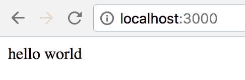

# 第二章：设置开发环境

除了是 OCaml 的新语法之外，Reason 还是一个易于开始的工具链。在本章中，我们将做以下几件事：

+   了解 Reason 工具链

+   配置我们的编辑器

+   使用 `bsb` 启动一个纯 Reason 项目

+   了解 `bsconfig.json`

+   编写一个示例纯 Reason 应用程序，该程序操作 DOM

+   使用 `bsb` 启动一个 ReasonReact 项目

+   在 Reason 项目中熟悉使用 `webpack`

要跟随，请克隆本书的 GitHub 仓库并从本章的目录开始。您也可以从空白项目开始：

```js
git clone https://github.com/PacktPublishing/ReasonML-Quick-Start-Guide.git
cd ReasonML-Quick-Start-Guide
cd Chapter02/pure-reason-start
npm install
```

本章旨在让您熟悉 Reason 工具链。我们将为纯 Reason 项目和 ReasonReact 项目分别设置开发环境。在跟随之后，您将足够熟悉，可以调整开发环境以满足您的喜好。不用担心弄乱任何东西，因为我们将在第三章，*创建 ReasonReact 组件*，从另一个目录开始。

# Reason 工具链

在撰写本文时，Reason 工具链基本上是 BuckleScript（Reason 的合作伙伴项目）和熟悉的 JavaScript 工具链，即 `npm` 和 `webpack`（或另一个 JavaScript 模块打包器）。

由于 BuckleScript 编译到 JavaScript 的 ES5 版本，因此不再需要 `babel`。编译输出可以配置为使用 CommonJS、AMD 或 ES 模块格式。Reason 强大的静态类型系统取代了 Flow 和 ESlint 的需求。此外，Reason 的编辑器插件都包含 `refmt`，这实际上是 Reason 的 `prettier`。

# 安装 BuckleScript

BuckleScript 是一个编译器，它接受 OCaml AST 并生成干净、可读和高效的 JavaScript。它可以通过 `npm` 安装，如下所示：

```js
npm install -g bs-platform
```

安装 `bs-platform` 提供了一个名为 `bsb` 的二进制文件，它是 BuckleScript 的构建系统。

在未来，Reason 工具链将使针对原生平台以及 JavaScript 的目标变得更加容易。目前，Reason 通过使用名为 `bsb-native` 的 `bsb` 分支来编译成原生代码。

# 编辑器配置

Reason 支持各种编辑器，包括 VSCode、Sublime Text、Atom、Vim 和 Emacs。VSCode 是推荐的编辑器。要配置 VSCode，只需安装 `reason-vscode` 扩展即可。就是这样！

查看编辑器特定的说明文档。

Reason 编辑器支持文档可以在[`reasonml.github.io/docs/editor-plugins.`](https://reasonml.github.io/docs/editor-plugins)找到

# 设置纯 Reason 项目

`bsb` 二进制文件包括一个项目生成器。我们将使用它通过 `basic-reason` 主题创建一个纯 Reason 项目。运行 `bsb -themes` 以查看所有可用的项目模板：

```js
Available themes: 
basic
basic-reason
generator
minimal
node
react
react-lite
tea
```

由于 BuckleScript 与 OCaml 和 Reason 都兼容，因此某些主题仅适用于 OCaml 项目。话虽如此，您可以在任何 BuckleScript 项目中自由地将 OCaml 的 `.ml` 文件与 Reason 的 `.re` 文件混合。

在本章中，我们将专注于使用 `basic-reason` 和 `react` 模板。如果您好奇，`react-lite` 主题类似于 `react`，只是将 `webpack` 替换为更简单、更快、更可靠的模块打包器，该打包器仅用于开发目的。

让我们首先创建一个纯 Reason 项目：

```js
bsb -init my-first-app -theme basic-reason
cd my-first-app
```

当我们在编辑器中打开项目时，我们看到以下项目结构：

```js
├── .gitignore
├── README.md
├── bsconfig.json
├── node_modules
│   ├── .bin
│   │   ├── bsb
│   │   ├── bsc
│   │   └── bsrefmt
│   └── bs-platform
├── package.json
└── src
    └── Demo.re
```

总体来说，这里的内容并不多，这对于从 JavaScript 转过来的人来说是一种令人耳目一新的感觉。在 `node_modules` 中，我们看到 `bs-platform` 以及一些二进制文件：

+   `bsb`：构建系统

+   `bsc`：编译器

+   `bsrefmt`：这实际上是 Reason 的 `prettier`，但针对 Reason

正如我们很快就会看到的，`bsb` 二进制文件在 `npm` 脚本中使用。这个 `bsc` 二进制文件很少直接使用。`bsrefmt` 二进制文件由编辑器插件使用。

在 `Demo.re` 中，我们看到一条简单的日志消息：

```js
/* Demo.re */
Js.log("Hello, BuckleScript and Reason!");
```

`package.json` 看起来有些熟悉。`scripts` 字段显示了当前可用的 `npm` 脚本：

```js
/* package.json */
{
  "name": "my-first-app",
  "version": "0.1.0",
  "scripts": {
    "build": "bsb -make-world",
    "start": "bsb -make-world -w",
    "clean": "bsb -clean-world"
  },
  "keywords": [
    "BuckleScript"
  ],
  "author": "",
  "license": "MIT",
  "devDependencies": {
    "bs-platform": "⁴.0.5"
  }
}
```

运行 `npm run build` 将 `Demo.re` 编译成 JavaScript。默认情况下，编译后的输出文件会出现在源文件旁边，作为 `Demo.bs.js`。它是如何知道编译哪些文件以及输出到哪里的呢？这就是 `bsconfig.json` 发挥作用的地方。

# bsconfig.json 文件

`bsconfig.json` 文件是所有 BuckleScript 项目的必需文件。让我们来探索它：

```js
// This is the configuration file used by BuckleScript's build system bsb. Its documentation lives here: http://bucklescript.github.io/bucklescript/docson/#build-schema.json
// BuckleScript comes with its own parser for bsconfig.json, which is normal JSON, with the extra support of comments and trailing commas.
{
  "name": "my-first-app",
  "version": "0.1.0",
  "sources": {
    "dir" : "src",
    "subdirs" : true
  },
  "package-specs": {
    "module": "commonjs",
    "in-source": true
  },
  "suffix": ".bs.js",
  "bs-dependencies": [
      // add your dependencies here. You'd usually install them normally through `npm install my-dependency`. If my-dependency has a bsconfig.json too, then everything will work seamlessly.
  ],
  "warnings": {
    "error" : "+101"
  },
  "namespace": true,
  "refmt": 3
}
```

我们很快就会更改一些默认设置，以便更熟悉 BuckleScript 的配置文件。首先，让我们将以下代码添加到 `Demo.re` 中：

```js
type decision =
  | Yes
  | No
  | Maybe;

let decision = Maybe;

let response =
  switch (decision) {
  | Yes => "Yes!"
  | No => "I'm afraid not."
  };

Js.log(response);
```

如您所见，`switch` 表达式并没有处理 `decision` 的所有可能情况。运行 `npm run build` 会导致以下输出：

```js
ninja: Entering directory `lib/bs'
[3/3] Building src/Demo.mlast.d
[1/1] Building src/Demo-MyFirstApp.cmj

  Warning number 8
  .../Demo.re 9:3-12:3

   7 │ 
   8 │ let response =
   9 │ switch (decision) {
  10 │ | Yes => "Yes!"
  11 │ | No => "I'm afraid not."
  12 │ };
  13 │ 
  14 │ Js.log(response);

  You forgot to handle a possible value here, for example: 
Maybe
```

# 警告字段

```js
warnings field of bsconfig.json to the following:
```

```js
"warnings": {
  "error": "+101+8" // added "+8"
},
```

将所有警告转换为错误，请使用以下代码：

```js
"warnings": {
  "error": "A"
},
```

要查看警告编号的完整列表，请查看 [`caml.inria.fr/pub/docs/manual-ocaml/comp.html#sec281`](https://caml.inria.fr/pub/docs/manual-ocaml/comp.html#sec281)（向下滚动一点）。

# package-specs 字段

`package-specs` 字段包含两个字段：`module` 和 `in-source`。

`module` 字段控制 JavaScript 模块格式。默认是 `commonjs`，其他可用选项包括 `amdjs`、`amdjs-global`、`es6` 和 `es6-global`。`-global` 部分告诉 BuckleScript 将 `node_modules` 解析为浏览器中的相对路径。

`in-source` 字段控制生成的 JavaScript 文件的输出位置；`true` 将导致生成的文件放置在源文件旁边，而 `false` 将导致生成的文件放置在 `lib/js` 中。将 `in-source` 设置为 `false` 在使用 Reason 在现有的 JavaScript 项目中非常有用，这样就可以使用现有的构建管道，而无需进行更改。

现在，让我们使用 `"es6"` 模块格式，并将我们的编译资产放置在 `lib/js` 中：

```js
"package-specs": {
  "module": "es6",
  "in-source": false
},
```

# 后缀字段

`suffix` 字段配置生成的 JavaScript 文件的扩展名。通常最好保持 `".bs.js"` 后缀，因为这有助于 `bsb` 更好地跟踪生成的工件。

# 源字段

BuckleScript 知道要查看 `src` 目录，是因为以下配置：

```js
"sources": {
  "dir" : "src",
  "subdirs" : true
},
```

如果 `subdirs` 是 `false`，则位于 `src` 子目录中的任何 `.re` 和 `.ml` 文件都不会被编译。

关于 `bsconfig.json` 的更多信息，请参阅 BuckleScript 文档的以下部分：[`bucklescript.github.io/docs/build-configuration`](https://bucklescript.github.io/docs/build-configuration)。

# 与 DOM 交互

在跳入 ReasonReact 之前，让我们先尝试使用纯 Reason 与 DOM 进行交互。我们将编写一个模块来完成以下工作：

+   创建一个 DOM 元素

+   设置该元素的 `innerText`

+   将该元素追加到文档的 body 中

在项目的根目录中创建一个 `index.html` 文件，内容如下：

```js
<html>
  <head></head>
  <body>
    <!-- if "in-source": false -->
    <script type="module" src="img/Demo.bs.js"></script>

    <!-- if "in-source": true -->
    <!-- <script type="module" src="img/Demo.bs.js"></script> -->
  </body>
</html>
```

注意 `script` 标签上的 `type="module"` 属性。如果所有模块依赖项都符合 **ES 模块**（**ESM**）规范，并且它们都可以从浏览器内部访问，那么你不需要模块打包器就可以开始（假设你使用的是支持 ES 模块的浏览器）。

在 `Greeting.re` 中添加以下问候函数：

```js
let greeting = name => {j|hello $name|j};
```

在 `Demo.re` 中添加以下代码：

```js
[@bs.val] [@bs.scope "document"]
external createElement : string => Dom.element = "";

[@bs.set] external setInnerText : (Dom.element, string) => unit = "innerText";

[@bs.val] [@bs.scope "document.body"]
external appendChild : Dom.element => Dom.element = "";

let div = createElement("div");
setInnerText(div, Greeting.greeting("world"));
appendChild(div);
```

使用 BuckleScript 强大的互操作性功能（我们将在第四章 BuckleScript, Belt 和互操作性 中详细介绍）将前面的代码绑定到现有的浏览器 API，即 `document.createElement`、`innerText` 和 `document.body.appendChild`，然后使用这些绑定创建一个包含一些文本的 `div`，并将其追加到文档的 body 中。

运行 `npm run build`，在项目根目录启动一个服务器（可能在新的控制台标签中运行 `php -S localhost:3000`），然后导航到 `http://localhost:3000` 来查看我们新创建的 DOM 元素：



总结来说，以这种方式与 DOM 交互真的很繁琐。由于 JavaScript 的动态特性，很难输入 DOM API。例如，`Element.innerText` 既可以用来获取也可以用来设置元素的 `innerText`，具体取决于它的使用方式，因此会产生两种不同的类型签名：

```js
[@bs.get] external getInnerText: Dom.element => string = "innerText";
[@bs.set] external setInnerText : (Dom.element, string) => unit = "innerText";
```

幸运的是，我们已经有 React 了，它很大程度上抽象了 DOM。使用 React，我们不需要担心输入 DOM API。知道当我们想要与各种浏览器 API 交互时，BuckleScript 有我们完成任务所需的工具，这真是太好了。虽然用纯 Reason 编写前端 Web 应用程序是可能的，但使用 ReasonReact 会更加愉快，尤其是在刚开始使用 Reason 时。

# 设置 ReasonReact 项目

要创建一个新的 ReasonReact 项目，运行以下命令：

```js
bsb -init my-reason-react-app -theme react
cd my-reason-react-app

```

打开我们的文本编辑器后，我们会看到一些变化。`package.json` 文件列出了相关的 React 和 webpack 依赖项。让我们来安装它们：

```js
npm install
```

我们还有以下与 webpack 相关的 npm 脚本：

```js
"webpack": "webpack -w",
"webpack:production": "NODE_ENV=production webpack"
```

在 `bsconfig.json` 中，我们有一个新字段，它为 ReasonReact 启用 JSX：

```js
"reason": {
  "react-jsx": 2
},
```

我们有一个简单的 `webpack.config.js` 文件：

```js
const path = require("path");
const outputDir = path.join(__dirname, "build/");

const isProd = process.env.NODE_ENV === "production";

module.exports = {
  entry: "./src/Index.bs.js",
  mode: isProd ? "production" : "development",
  output: {
    path: outputDir,
    publicPath: outputDir,
    filename: "Index.js"
  }
};
```

注意配置的入口点为 `"./src/Index.bs.js"`，这在 `bsconfig.json` 中默认将 `"in-source"` 设置为 `true` 的情况下是有意义的。其余的都是正常的 webpack 东西。

要运行此项目，我们需要同时运行 `bsb` 和 `webpack`：

```js
npm start

/* in another shell */
npm run webpack

/* in another shell */
php -S localhost:3000
```

由于 `index.html` 文件位于 `src` 目录中，我们访问 `http://localhost:3000/src` 来查看默认的应用程序。

# 提升开发者体验

现在我们已经看到了工具链在基本层面的工作方式，让我们提升我们的开发者体验，以便我们可以通过一个命令开始我们的项目。我们需要安装几个依赖项，如下所示：

```js
npm install webpack-dev-server --save-dev
npm install npm-run-all --save-dev
```

现在，我们可以更新我们的 npm 脚本：

```js
"scripts": {
  "start": "npm-run-all --parallel start:*",
  "start:bsb": "bsb -clean-world -make-world -w",
  "start:webpack": "webpack-dev-server --port 3000",
  "build": "npm-run-all build:*",
  "build:bsb": "bsb -clean-world -make-world",
  "build:webpack": "NODE_ENV=production webpack",
  "test": "echo \"Error: no test specified\" && exit 1"
},
```

接下来，为了让 `webpack-dev-server` 在 `http://localhost:3000` 而不是 `http://localhost:3000/src` 上提供 `index.html` 文件，我们需要安装和配置 `HtmlWebpackPlugin`：

```js
npm install html-webpack-plugin --save-dev
```

我们可以移除 `src/index.html` 中的默认 `<script src="img/Index.js"></script>` 标签，因为 `HTMLWebpackPlugin` 会自动插入脚本标签。

我们还移除了 `publicPath` 设置，以便使用默认路径 `"/"`：

```js
const path = require("path");
const HtmlWebpackPlugin = require("html-webpack-plugin");

const isProd = process.env.NODE_ENV === "production";

module.exports = {
  entry: "./src/Index.bs.js",
  mode: isProd ? "production" : "development",
  output: {
    path: path.join(__dirname, "build/"),
    filename: "Index.js"
  },
  plugins: [
    new HtmlWebpackPlugin({
      template: "./src/index.html"
    })
  ]
};
```

现在，我们运行 `npm start` 并访问 `http://localhost:3000` 来查看相同的 ReasonReact 应用程序正在运行。

# 摘要

在本章中，我们看到了如何轻松地开始使用 Reason。在第三章，*创建 ReasonReact 组件*中，我们将开始构建一个将在整本书中使用的 ReasonReact 应用程序。这个应用程序将帮助我们更好地理解 Reason 语义、BuckleScript 互操作性和 ReasonReact 的具体细节。

如果您目前还不理解这些生成项目中的所有内容，请不要担心。到第三章，*创建 ReasonReact 组件*结束时，您会感到更加自在。然而，如果您在途中有任何问题，请不要犹豫，在 Reason 的 Discord 频道寻求实时帮助：[`discord.gg/reasonml`](https://discord.gg/reasonml)。

我希望您会发现 Reason 社区像我所经历的那样欢迎和有帮助。
