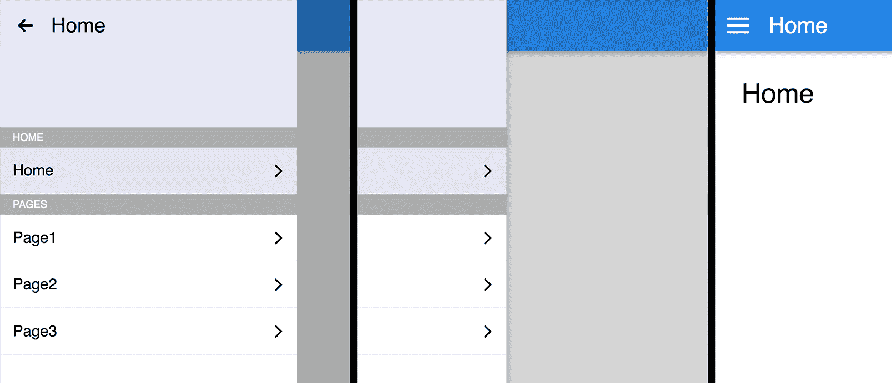

# 创建 ReasonReact 组件

现在我们已经设置了我们的开发环境，我们就可以开始使用 ReasonReact 了——ReactJS 的未来。ReasonML 和 ReasonReact 都是由构建 ReactJS 的同一个人构建的。ReasonReact 就是 Reason，就像 ReactJS 就是 JavaScript 一样。在本书的其余部分，我们将使用一个应用程序，我们将在本章开始构建。以下是本章结束时我们将构建的内容的截图：



要跟上进度，请克隆本书的 GitHub 仓库，并从`Chapter03/start`开始。在本书的其余部分，每个目录都与我们设置的开发环境相同，即在第二章的*设置开发环境*结束时设置的环境。

```js
git clone https://github.com/PacktPublishing/ReasonML-Quick-Start-Guide.git
cd ReasonML-Quick-Start-Guide
cd Chapter03/start
npm install
```

我们首先将探索 ReasonReact，在本章大约一半的时候，我们将转向`Chapter03/app-start`目录，在那里我们将开始使用 ReasonReact 的内置路由构建应用程序。

在本章中，我们将进行以下操作：

+   探索创建无状态和有状态 ReasonReact 组件

+   创建一个包含导航和路由的应用程序

+   看看您已经熟悉的许多 ReactJS 概念如何很好地映射到 ReasonReact

+   学习如何利用 Reason 的类型系统，ReasonReact 可以帮助我们创建更健壮的组件

# 组件创建基础

让我们从分析一个简单的无状态组件开始。在`App.re`中，让我们渲染一个带有文本的`<div />`元素：

```js
let component = ReasonReact.statelessComponent("App");

let make = _children => {
  ...component,
  render: _self => <div> {ReasonReact.string("hello world")} </div>,
};
```

在`Index.re`中，将组件渲染到具有 ID `"root"`的 DOM 元素中：

```js
ReactDOMRe.renderToElementWithId(<App />, "root");
```

由于 Reason 的模块系统，我们不需要在`Index.re`中声明`import`语句，也不需要在`App.re`中声明导出语句。每个 Reason 文件都是一个模块，每个 Reason 模块都是全局可用的。在本书的后面部分，我们将看到如何隐藏模块的实现细节，以便您的组件用户只能访问他们应该访问的内容。

# 组件模板

在 ReasonReact 中，所有组件都是通过以下四个函数之一创建的：

+   `ReasonReact.statelessComponent`

+   `ReasonReact.statelessComponentWithRetainedProps`

+   `ReasonReact.reducerComponent`

+   `ReasonReact.reducerComponentWithRetainedProps`

这四个函数中的每一个都接受一个`string`并返回一个对应不同组件模板的`record`。`string`参数仅用于调试目的。组件从其文件名（`App.re`）中获取其名称（`<App />`）。返回的记录中的字段取决于使用了哪个函数。在我们的上一个例子中，我们有以下字段可以覆盖：

+   `render`

+   `didMount`

+   `willReceiveProps`

+   `shouldUpdate`

+   `willUpdate`

+   `didUpdate`

+   `willUnmount`

除了 `render` 字段外，其余的都是熟悉的 ReactJS 生命周期事件。要覆盖字段，请在 `make` 函数返回的 `record` 中添加该字段。在先前的例子中，组件模板的 `render` 字段被替换为自定义的 `render` 函数。

`make` 函数接受 `props` 作为参数，并返回一个与最初由四个组件创建函数之一创建的形状相同的 `record`。`make` 函数的最后一个参数必须是 `children` 属性。你可能已经注意到，在先前的例子中 `children` 前面有一个下划线 `_`。如果你的组件不需要对 `children` 属性的引用，那么在参数前加上下划线 `_` 可以防止编译器警告未使用的绑定。

可能一开始并不明显，但 `make` 函数的大括号属于返回的 `record` 文字。`...component` 表达式将原始 `record` 的内容扩展到这个新 `record` 中，这样就可以在不显式设置每个字段的情况下覆盖单个字段。

# self

`render` 字段包含一个接受名为 `self` 的参数的回调函数，并返回类型为 `ReasonReact.reactElement` 的值。`self` 记录的三个字段如下：

+   `state`

+   `handle`

+   `send`

出于选择，ReasonReact 没有 JavaScript 的 `this` 的概念。相反，`self` 包含必要的信息，并提供给需要它的回调函数。当使用有状态组件时，我们将看到更多关于 `self` 的内容。

# 事件处理器

在我们的渲染函数中，我们可以像在 ReactJS 中一样将事件监听器附加到 DOM 元素上。例如，为了监听点击事件，我们添加一个 `onClick` 属性并将其值设置为事件处理器：

```js
let component = ReasonReact.statelessComponent("App");

let make = _children => {
  ...component,
  render: _self =>
    <div onClick={_event => Js.log("clicked")}>
      {ReasonReact.string("hello world")}
    </div>,
};
```

然而，这个回调函数必须接受恰好一个参数（对应于一个 JavaScript DOM 事件）并且必须返回一个名为 `unit` 的类型。

# 单元

在 Reason 中，`unit` 是一个表示 "无" 的类型。其返回类型为 `unit` 的函数不能返回除 `unit` 之外的其他任何内容。`unit` 类型的值只有一个：`()`（即一对空括号，也称为 `unit`）。

相比之下，`bool` 类型的值正好有两个：`true` 和 `false`。`int` 类型的值有无限多个。

如 第一章 所述，在 ReasonML 的 *介绍* 中，表示 Reason 中可空值的惯用方法是使用 `option` 类型。`option` 类型与 `unit` 类型的主要区别在于，`option` 类型的值可以是空值，也可以是某个值，而 `unit` 类型的值总是 `()`。

接受和/或返回 `unit` 的函数可能引起副作用。例如，`Js.log` 是一个返回 `unit` 的函数。`onClick` 事件处理器也是一个返回 `unit` 的函数。

`Random.bool` 是一个接受 `unit` 作为参数并返回 `bool` 的函数示例。调用带有 `unit` 的函数的语法相当熟悉：

```js
Random.bool()
```

由于 `onClick` 需要一个返回 `unit` 的函数，以下将导致类型错误：

```js
let component = ReasonReact.statelessComponent("App");

let make = _children => {
  ...component,
  render: _self =>
    <div onClick={_event => 42}> {ReasonReact.string("hello world")} </div>,
};
```

类型错误在这里显示：

```js
Error: This expression has type int but an expression was expected of type
  unit
```

在错误信息中，`This expression` 指的是 `42`。

# JSX

Reason 提供了 JSX 语法。ReasonReact 版本的 JSX 中的一个区别是我们不能在 ReasonReact 中做以下操作：

```js
<div>"hello world"</div>
```

相反，我们需要使用 `ReasonReact.string` 函数将 `string` 转换为 `ReasonReact.reactElement`：

```js
<div>ReasonReact.string("hello world")</div>
```

然而，这仍然不起作用。我们还需要将表达式包裹在 `{ }` 中，以帮助解析器区分多个可能的子元素：

```js
<div> {ReasonReact.string("hello world")} </div>
```

你可以自由地创建一个更简洁的别名来使用：

```js
let str = ReasonReact.string;
<div> {str("hello world")} </div>;
```

当在 JSX 中调用自定义组件时，它的 `make` 函数会被调用。`<App />` 语法会解构为以下形式：

```js
ReasonReact.element(App.make([||]))
```

当一个组件将接收新的属性时，它的 `make` 函数将再次被调用，并将新属性作为参数。`make` 函数类似于 ReactJS 的 `constructor` 和 ReactJS 的 `componentWillReceiveProps` 的组合。

# 属性

让我们在 `<App />` 组件中添加一些属性：

```js
let make = (~greeting, ~name, _children) => {
  ...component,
  render: _self => <div> {ReasonReact.string(greeting ++ " " ++ name)} </div>,
};
```

编译后，我们会得到一个编译错误，因为在 `Index.re` 中我们没有提供所需的 `greeting` 和 `name` 属性：

```js
We've found a bug for you!

1 │ ReactDOMRe.renderToElementWithId(<App />, "root");

This call is missing arguments of type:
(~greeting: string),
(~name: string)
```

`greeting` 和 `name` 是 `make` 函数的 **标记参数**，这意味着它们可以以任何顺序提供。要将一个参数转换为标记参数，在其前加上波浪号 (`~`)。Reason 还支持可选参数以及具有默认值的参数。让我们给 `greeting` 设置一个默认值，并使 `name` 可选：

```js
let make = (~greeting="hello", ~name=?, _children) => {
  ...component,
  render: _self => {
    let name =
      switch (name) {
      | None => ""
      | Some(name) => name
      };
    <div> {ReasonReact.string(greeting ++ " " ++ name)} </div>;
  },
};
```

由于 `name` 是一个可选参数，它被包裹在 `option` 类型中，然后我们可以根据其值进行模式匹配。当然，这仅仅是一种提供 `name` 默认值为 `""` 的冗长方式。

现在，即使 `<App />` 没有提供任何属性，我们的示例也能编译成功：

```js
ReactDOMRe.renderToElementWithId(<App />, "root");
/* hello */

ReactDOMRe.renderToElementWithId(
  <App greeting="welcome," name="reason" />,
  "root",
);
/* welcome, reason */

```

如果我们决定移除 `name` 属性，编译器会告诉我们需要更新 `<App />` 的使用位置。这给了我们自由重构组件而不必担心忘记更新代码库中的某个区域。编译器是我们的后盾！

# 子元素

`make` 函数的最后一个参数总是 `children` 属性——这是强制性的。和其他属性一样，`children` 可以是任何数据结构。只要组件允许，我们就可以使用在 ReactJS 中流行的渲染属性模式。重要的是，ReasonReact 总是会将 `children` 包裹在一个数组中，所以如果我们不想有这种包裹，我们需要使用 `...` 语法来解包数组。

在 `App.re` 中，我们将移除所有属性，除了必需的 `children` 属性。在渲染函数中，我们使用硬编码的问候语调用 `children`：

```js
/* App.re */
let component = ReasonReact.statelessComponent("App");

let make = children => {
  ...component,
  render: _self => children("hello"),
};
```

在 `Index.re` 中，我们添加了一个函数作为 `<App />` 的子代，该函数接受提供的问候语并返回 JSX（类型为 `ReasonReact.reactElement`）。注意使用 `...` 语法来展开所有 ReasonReact 子代都被包裹的数组：

```js
/* Index.re */
ReactDOMRe.renderToElementWithId(
  <App> ...{greeting => <div> {ReasonReact.string(greeting)} </div>} </App>,
  "root",
);
```

如果我们忘记了 `...`，编译器会友好地提醒我们：

```js
We've found a bug for you!

1 │ ReactDOMRe.renderToElementWithId(
2 │ <App> {greeting => <div> {ReasonReact.string(greeting)} </div>} </App>,
3 │ "root",
4 │ );

This has type:
  array('a)
But somewhere wanted:
  string => ReasonReact.reactElement
```

如果我们不包含任何子代（即仅 `<App />`），我们甚至还会得到类似的编译器消息，因为这相当于一个空数组。这意味着我们保证我们的组件用户必须提供一个类型为 `string => ReasonReact.reactElement` 的函数作为 `<App />` 的子代，以便进行类型检查。

我们还可以强制我们的组件接受其他子代类型，例如，两个字符串的元组：

```js
/* App.re */
let component = ReasonReact.statelessComponent("App");

let make = children => {
  ...component,
  render: _self => {
    let (greeting, name) = children;
    <div> {ReasonReact.string(greeting ++ " " ++ name)} </div>;
  },
};
```

```js
/* Index.re */
ReactDOMRe.renderToElementWithId(<App> ...("hello", "tuple") </App>, "root");
```

由于在 `App.re` 中的使用，Reason 能够推断出子代必须是类型为 `(string, string)` 的元组。例如，考虑以下用法：

```js
ReactDOMRe.renderToElementWithId(<App> ("hello") </App>, "root");
```

这将导致友好的编译器错误，因为 `App` 组件要求其子代必须是元组，但 `App` 组件的子代不是元组。

```js
We've found a bug for you!

1 │ ReactDOMRe.renderToElementWithId(<App> ("hello") </App>, "root");

This has type:
  array('a)
But somewhere wanted:
  (string, string)
```

这非常强大。由于我们在编译时获得这些保证，所以我们不必担心组件子代形状的运行时检查。同样，我们保证在编译时进行 props 类型检查。重构组件的压力大大减轻，因为编译器在这个过程中为我们提供指导。更重要的是，多亏了 Reason 强大的类型推断，我们迄今为止还没有需要显式注释任何类型。

# 生命周期

ReasonReact 支持熟悉的 ReactJS 生命周期事件。随着我们构建应用程序，我们将更深入地了解一些生命周期事件，但就目前而言，让我们看看我们如何实现 ReactJS 的 `componentDidMount` 生命周期钩子为 `<App />`：

```js
let make = _children => {
  ...component,
  didMount: _self => Js.log("mounted"),
  render: _self => <div> {ReasonReact.string("hello")} </div>,
};
```

我们不使用 `componentDidMount`，而是使用 `didMount`。再次强调，`didMount` 是组件 `make` 函数返回的记录中的一个字段。`didMount` 的类型是 `self => unit`，这是一个接受 `self` 并返回 `unit` 的函数。由于它返回 `unit`，因此 `didMount` 很可能引起副作用，在我们的例子中确实如此。在浏览器中运行此代码会在控制台输出 `mounted`。

# 订阅助手

为了使编写清理代码更加方便和易于记忆，ReasonReact 提供了 `self.onUnmount`，它可以直接在组件的 `didMount` 生命周期（或任何可以访问 `self` 的地方）中使用。这允许你将清理代码与其对应的代码一起编写，而不是在 `willUnmount` 中单独编写：

```js
didMount: self => {
  let intervalId = Js.Global.setInterval(() => Js.log("hello!"), 1000);
  self.onUnmount(() => Js.Global.clearInterval(intervalId));
},
```

# 有状态组件

到目前为止，我们只使用了 `ReasonReact.statelessComponent` 模板。要创建一个有状态的组件，我们将组件模板切换到 `ReasonReact.reducerComponent` 并覆盖其 `make` 函数返回的记录中的某些附加字段。因为它内置了状态、动作和 reducer 的概念，所以被称为 `reducerComponent`——就像 Redux 一样，只是状态、动作和 reducer 是局部于组件的。

这里展示了一个简单的计数器组件，它带有用于增加和减少当前计数的按钮：

```js
type state = int;

type action =
  | Increment
  | Decrement;

let component = ReasonReact.reducerComponent("App");

let make = _children => {
  ...component,
  initialState: () => 0,
  reducer: (action, state) =>
    switch (action) {
    | Increment => ReasonReact.Update(state + 1)
    | Decrement => ReasonReact.Update(state - 1)
    },
  render: self =>
    <>
      <button onClick={_event => self.send(Decrement)}>
        {ReasonReact.string("-")}
      </button>
      <span> {ReasonReact.string(string_of_int(self.state))} </span>
      <button onClick={_event => self.send(Increment)}>
        {ReasonReact.string("+")}
      </button>
    </>,
};
```

在这里使用 ReactJS 片段语法（`<>` 和 `</>`）来包裹 `<button>` 和 `<span>` 元素，而不添加不必要的 DOM 节点。

# 状态、动作和 reducer

让我们分解一下。在文件顶部，我们看到两个类型声明，一个是状态，另一个是动作。`state` 和 `action` 的名称是一个约定，但你可以使用任何你喜欢的名称：

```js
type state = int;

type action =
  | Increment
  | Decrement;
```

正如在 Redux 中一样，事件触发动作，这些动作被发送到 reducer，然后更新状态。接下来，按钮的点击事件触发一个 `Decrement` 动作，并通过 `self.send` 发送到组件的 reducer。记住，渲染函数将 `self` 作为其参数提供：

```js
<button onClick={_event => self.send(Increment)}>
  {ReasonReact.string("+")}
</button>
```

`state` 类型声明定义了我们的状态形状。在这种情况下，我们的状态只是一个整数，它持有组件的当前计数。组件的初始状态是 `0`：

```js
initialState: () => 0,
```

`initialState` 需要一个类型为 `unit => state` 的函数。

当被某个动作触发时，reducer 函数接受该动作以及当前状态，并返回一个新的状态。在当前动作上使用模式匹配，并使用 `ReasonReact.Update` 来返回一个新的状态：

```js
reducer: (action, state) =>
  switch (action) {
  | Increment => ReasonReact.Update(state + 1)
  | Decrement => ReasonReact.Update(state - 1)
  },
```

为了帮助确保你的 ReasonReact 应用准备好即将到来的 ReactJS Fiber 发布，请确保 `reducer` 中的所有内容都是纯的。在保持 `reducer` 纯的同时间接触发副作用的一种方法是通过使用 `ReasonReact.UpdateWithSideEffects`：

```js
reducer: (action, state) =>
  switch (action) {
  | Increment =>
    ReasonReact.UpdateWithSideEffects(
      state + 1,
      (_self => Js.log("incremented")),
    )
  | Decrement => ReasonReact.Update(state - 1)
  },
```

`reducer` 的返回值必须是以下变体构造函数之一：

+   `ReasonReact.NoUpdate`

+   `ReasonReact.Update(state)`

+   `ReasonReact.SideEffects(self => unit)`

+   `ReasonReact.UpdateWithSideEffects(state, self => unit)`

我们可以在副作用内部触发新的动作，因为我们再次提供了 `self`：

```js
reducer: (action, state) =>
  switch (action) {
  | Increment =>
    ReasonReact.UpdateWithSideEffects(
      state + 1,
      (
        self =>
          Js.Global.setTimeout(() => self.send(Decrement), 1000) |> ignore
      ),
    )
  | Decrement => ReasonReact.Update(state - 1)
  },
```

在增加计数后，`reducer` 触发一个副作用，该副作用在一秒后触发 `Decrement` 动作。

# 重构

让我们假设我们现在需要我们的有状态组件显示一条消息，当用户计数达到 10 时，恭喜用户，一旦消息显示，用户可以通过点击关闭按钮来关闭消息。多亏了我们有帮助的编译器，我们可以遵循以下步骤：

1.  更新 `state` 的形状

1.  更新可用的 `actions`

1.  步骤通过编译器错误

1.  更新 `render` 函数

编译器消息会提醒我们更新组件的初始状态和 reducer。由于我们现在需要跟踪是否显示消息，让我们将 `state` 的形状更改为以下内容：

```js
type state = {
  count: int,
  showMessage: bool
};
```

对于我们的动作，让我们将 `Increment` 和 `Decrement` 合并成一个接受 `int` 的构造函数，我们将有一个新的构造函数来切换消息：

```js
type action =
  | UpdateCount(int)
  | ToggleMessage;
```

现在，我们不再有 `Increment` 和 `Decrement`，而是 `UpdateCount`，它包含一个表示当前计数增加或减少的整数值。

编译后，我们看到一个友好的错误消息，告诉我们之前的动作 `Decrement` 无法找到：

```js
We've found a bug for you!
24 | render: self =>
25 | <>
26 | <button onClick={_event => self.send(Decrement)}>
27 | {ReasonReact.string("-")}
28 | </button>
The variant constructor Decrement can't be found.
- If it's defined in another module or file, bring it into scope by:
- Annotating it with said module name: let food = MyModule.Apple
- Or specifying its type: let food: MyModule.fruit = Apple
- Constructors and modules are both capitalized. Did you want the latter?
Then instead of let foo = Bar, try module Foo = Bar.
```

在 `render` 函数中，将 `Increment` 替换为 `UpdateCount(+1)`，将 `Decrement` 替换为 `UpdateCount(-1)`：

```js
render: self =>
  <>
    <button onClick={_event => self.send(UpdateCount(-1))}>
      {ReasonReact.string("-")}
    </button>
    <span> {ReasonReact.string(string_of_int(self.state))} </span>
    <button onClick={_event => self.send(UpdateCount(1))}>
      {ReasonReact.string("+")}
    </button>
  </>,
```

再次编译，我们被告知在我们的 reducer 中，`Increment` 不属于 `action` 类型。让我们更新我们的 reducer 来处理 `UpdateCount` 和 `ToggleMessage`。如果我们忘记了一个构造函数，编译器会告诉我们 reducer 中的 switch 表达式不是详尽的：

```js
reducer: (action, state) =>
  switch (action) {
  | UpdateCount(delta) =>
    let count = state.count + delta;
    ReasonReact.UpdateWithSideEffects(
      {...state, count},
      (
        self =>
          if (count == 10) {
            self.send(ToggleMessage);
          }
      ),
    );
  | ToggleMessage =>
    ReasonReact.Update({...state, showMessage: !state.showMessage})
  },
```

关于前面的代码片段，有几件事情要说明：

+   在 `UpdateCount` 中，我们声明了一个绑定 `count`，它反映了新的计数。

+   我们使用 `...` 来覆盖状态记录的一部分。

+   由于记录 punning 支持功能，我们可以写 `{...state, count}` 而不是 `{...state, count: count}`。

+   `UpdateCount` 使用 `UpdateWithSideEffects` 在计数达到 10 时触发一个 `ToggleMessage` 动作；我们本可以这样做：

```js
| UpdateCount(delta) =>
  let count = state.count + delta;
  ReasonReact.Update(
    if (count == 10) {
      {count, showMessage: true};
    } else {
      {...state, count};
    },
  );
```

我更喜欢使用 `UpdateWithSideEffects`，这样 `UpdateCount` 只需要关心其计数字段，如果其他字段需要更新，`UpdateCount` 可以触发正确的动作来实现这一点，而无需知道它应该如何实现。

在这里编译后，我们得到了一个有趣的编译器错误：

```js
We've found a bug for you!

16 | switch (action) {
17 | | UpdateCount(delta) =>
18 | let count = state.count + delta;
19 | ReasonReact.UpdateWithSideEffects(
20 | {...state, count},

This has type:
  int
But somewhere wanted:
  state
```

编译器将第 18 行（之前显示）的 `state.count` 中的 `state` 视为 `int` 类型而不是 `state` 类型。这是因为我们的 `render` 函数正在使用 `string_of_int(self.state)` 而不是 `string_of_int(self.state.count)`。在更新我们的 `render` 函数以反映这一点后，我们得到了另一个类似的错误消息，抱怨 `int` 类型与 `state` 类型不兼容。这是因为我们的初始状态仍然返回 `0` 而不是 `state` 类型的记录。

更新初始状态后，代码最终编译成功：

```js
initialState: () => {count: 0, showMessage: false},
```

现在，我们准备更新 `render` 函数以在计数达到 10 时显示消息：

```js
render: self =>
  <>
    <button onClick={_event => self.send(UpdateCount(-1))}>
      {ReasonReact.string("-")}
    </button>
    <span> {ReasonReact.string(string_of_int(self.state.count))} </span>
    <button onClick={_event => self.send(UpdateCount(1))}>
      {ReasonReact.string("+")}
    </button>
    {
      if (self.state.showMessage) {
        <>
          <p>
            {ReasonReact.string("Congratulations! You've reached ten!")}
          </p>
          <button onClick={_event => self.send(ToggleMessage)}>
            {ReasonReact.string("close")}
          </button>
        </>;
      } else {
        ReasonReact.null;
      }
    }
  </>,
```

由于 `if/else` 是 Reason 中的一个表达式，我们可以在 JSX 中使用它来渲染标记或 `ReasonReact.null`（它具有 `ReasonReact.reactElement` 类型）。

# 实例变量

尽管我们的示例在计数器第一次达到 10 时正确显示了消息，但没有任何东西可以阻止我们的`ToggleMessage`操作在`UpdateCount`案例中的 reducer 中再次触发。如果用户达到 10，然后递减再递增，消息会再次切换。为了确保`UpdateCount`只触发一次`ToggleMessage`操作，我们可以在状态中使用一个**实例变量**。

在 ReactJS 中，每当状态中的某个东西发生变化时，组件都会重新渲染。在 ReasonReact 中，实例变量永远不会触发重新渲染，并且可以正确地放置在组件的状态中。

让我们添加一个实例变量来跟踪用户是否已经看到了消息：

```js
type state = {
  count: int,
  showMessage: bool,
  userHasSeenMessage: ref(bool)
};
```

# 引用和可变记录

ReasonReact 实例变量和普通状态变量之间的区别在于`ref`的使用。之前，我们看到`state.userHasSeenMessage`的类型是`ref(bool)`而不是`bool`。这使得`state.userHasSeenMessage`成为一个实例变量。

由于`ref`只是具有可变字段的记录类型的语法糖，让我们首先讨论可变记录字段。

要允许记录字段可变，请在该字段名称前加上`mutable`前缀。然后，可以使用`=`运算符就地更新这些字段：

```js
type ref('a) = {
  mutable contents: 'a
};

let foo = {contents: 5};
Js.log(foo.contents); /* 5 */
foo.contents = 6;
Js.log(foo.contents); /* 6 */
```

然而，类型声明已经包含在 Reason 的标准库中，因此我们可以省略它，前面的其余代码仍然可以工作，声明它覆盖了原始类型声明。我们可以通过用一个不可变记录覆盖`ref`类型来证明这一点：

```js
type ref('a) = {contents: 'a};

let foo = {contents: 5};
Js.log(foo.contents); /* 5 */
foo.contents = 6;
Js.log(foo.contents); /* 6 */
```

编译器失败，出现以下错误：

```js
We've found a bug for you!

The record field contents is not mutable
```

除了具有内置的类型定义外，`ref`还有一些内置函数。具体来说，`ref`用于创建类型为`ref`的记录，`^`用于获取`ref`的内容，而`:=`用于设置`ref`的内容：

```js
type foo = ref(int);

let foo = ref(5);
Js.log(foo^); /* 5 */
foo := 6;
Js.log(foo^); /* 6 */
```

让我们回到我们的 ReasonReact 示例，并使用我们新的`userHasSeenMessage`实例变量。在更新状态的形状后，我们还需要更新组件的初始状态：

```js
initialState: () => {
  count: 0,
  showMessage: false,
  userHasSeenMessage: ref(false),
},
```

现在，我们的代码再次编译成功，我们可以更新`reducer`以使用这个实例变量：

```js
reducer: (action, state) =>
  switch (action) {
  | UpdateCount(delta) =>
    let count = state.count + delta;
    if (! state.userHasSeenMessage^ && count == 10) {
      state.userHasSeenMessage := true;
      ReasonReact.UpdateWithSideEffects(
        {...state, count},
        (self => self.send(ToggleMessage)),
      );
    } else {
      ReasonReact.Update({...state, count});
    };
  | ToggleMessage =>
    ReasonReact.Update({...state, showMessage: !state.showMessage})
  },
```

现在，消息正确显示了一次，而且只显示了一次。

# 导航菜单

让我们利用到目前为止所学的内容作为基础，在创建一个带有导航菜单和客户端路由的应用程序时进行构建。在触摸设备上，用户将能够滑动来关闭菜单，并且菜单将实时响应用户的触摸。如果用户在菜单超过 50%关闭时滑动并释放，菜单将关闭；否则，它将保持打开。唯一的例外是如果用户以足够高的速度滑动关闭菜单，它总是会关闭。

我们将在本书的其余部分使用这个应用程序。要跟上，请克隆 GitHub 仓库并导航到代表本章开始的目录：

```js
git clone https://github.com/PacktPublishing/ReasonML-Quick-Start-Guide.git
cd ReasonML-Quick-Start-Guide
cd Chapter03/app-start
npm install
```

让我们花点时间看看我们有什么可以工作的。您将看到以下目录结构：

```js
├── bsconfig.json
├── package-lock.json
├── package.json
├── src
│   ├── App.re
│   ├── App.scss
│   ├── Index.re
│   ├── Index.scss
│   ├── img
│   │   └── icon
│   │   ├── arrow.svg
│   │   ├── chevron.svg
│   │   └── hamburger.svg
│   └── index.html
└── webpack.config.js
```

我们的 `bsconfig.json` 已配置为将编译的 `.bs.js` 文件放置在 `lib/es6/src` 中，并且我们已经配置了 webpack 以查找 `lib/es6/src/Index.bs.js` 作为入口点。

运行 `npm install` 然后运行 `npm start` 以在 `http://localhost:3000` 上以 bsb 和 webpack 的监视模式提供我们的应用。

目前，我们的应用显示一个带有汉堡图标的天蓝色导航栏。点击图标会打开菜单，点击菜单外部会关闭它。

在 `App.re` 中，我们的状态目前是一个单字段记录，用于跟踪菜单的状态：

```js
type state = {isOpen: bool};
```

我们有一个动作：

```js
type action =
  | ToggleMenu(bool);
```

我们的 reducer 负责更新菜单的状态：

```js
reducer: (action, _state) =>
  switch (action) {
  | ToggleMenu(isOpen) => ReasonReact.Update({isOpen: isOpen})
  },
```

虽然 Reason 支持记录欺骗，但它不适用于单字段记录，因为 Reason 将 `{isOpen}` 视为一个块而不是一个记录。

我们的渲染函数根据当前状态渲染一个带有条件类名的 `<div />` 元素：

```js
<div
  className={"App" ++ (self.state.isOpen ? " overlay" : "")}
  onClick={
    _event =>
      if (self.state.isOpen) {
        self.send(ToggleMenu(false));
      }
  }>
```

`App.scss` 使用 `overlay` 类在导航菜单打开时在其后面显示一个深色覆盖层：

```js
.App {
  min-height: 100vh;

  &:after {
    content: "";
    transition: opacity 450ms cubic-bezier(0.23, 1, 0.32, 1),
      transform 0ms cubic-bezier(0.23, 1, 0.32, 1) 450ms;
    position: fixed;
    top: 0;
    right: 0;
    bottom: 0;
    left: 0;
    background-color: rgba(0, 0, 0, 0.33);
    transform: translateX(-100%);
    opacity: 0;
    z-index: 1;
  }

  &.overlay {
    &:after {
      transition: opacity 450ms cubic-bezier(0.23, 1, 0.32, 1);
      transform: translateX(0%);
      opacity: 1;
    }
  }
  ...
}
```

注意 `transition` 属性是如何在 `.App:after` 和 `.App.overlay:after` 上定义的，前者在 `transform` 属性上包含一个 `450ms` 的延迟过渡，而后者则移除了这个过渡。这允许在菜单关闭时也能实现平滑过渡。

# 绑定

让我们检查 `App.re` 顶部对 JavaScript 的 `require` 函数的绑定。由于我们将在第四章 BuckleScript, Belt, and Interoperability 中更深入地探讨 BuckleScript，让我们先暂时不讨论细节，只简要看看这个绑定做了什么：

```js
[@bs.val] external require: string => string = "";

require("../../../src/App.scss");
```

`external` 关键字创建了一个新的绑定，类似于 `let` 关键字。绑定到 JavaScript 的 `require` 函数后，只要我们使用 BuckleScript 编译器，我们就可以在 Reason 中使用它。我们用它来引入 `App.scss` 以及一些图片。检查 `lib/es6/src/App.bs.js` 中的编译输出显示，前面的 Reason 代码编译成了以下内容：

```js
require("../../../src/App.scss");
```

Webpack 从那里处理其余部分。

# 事件

由于顶级 `<div />` 元素有一个始终关闭菜单的点击事件处理器，因此对其子元素的任何点击也会触发该顶级点击事件处理器。为了允许菜单打开（或保持打开），我们需要在部分子元素的点击事件上调用 `event.stopPropagation()`。

在 ReasonReact 中，我们可以使用 `ReactEvent` 模块来做这件事：

```js
onClick=(event => ReactEvent.Mouse.stopPropagation(event))
```

`ReactEvent` 模块有与 ReactJS 的每个合成事件对应的子模块：

+   剪贴板事件

+   组合事件

+   键盘事件

+   焦点事件

+   表单事件

+   鼠标事件

+   指针事件

+   选择事件

+   触摸事件

+   UI 事件

+   滚轮事件

+   媒体事件

+   图片事件

+   动画事件

+   过渡事件

想了解更多关于 ReactJS 的合成事件的信息，请访问 [`reactjs.org/docs/events.html`](https://reactjs.org/docs/events.html)。

要从触摸事件中获取 `event.changedTouches.item(0).clientX` 这样的值，我们使用 ReasonReact 和 BuckleScript 的组合。

# Js.t 对象

BuckleScript 允许我们使用 `##` 语法访问任意 JavaScript 对象字段。我们可以使用任何 `Js.t` 类型，这是一个表示任意 JavaScript 对象的 Reason 类型。我们将在 第四章，*BuckleScript, Belt, 和互操作性* 中了解更多关于这一点和其他互操作性功能。

由于 `ReactEvent.Touch.changedTouches(event)` 返回一个普通的 JavaScript 对象，我们可以使用以下方式访问其字段：

```js
/* App.re */
ReactEvent.Touch.changedTouches(event)##item(0)##clientX
```

在编译输出中查看，我们看到这正是我们想要的：

```js
/* App.bs.js */
event.changedTouches.item(0).clientX
```

我们将使用这个功能将触摸功能添加到我们的菜单中，以便用户可以滑动菜单关闭，并看到菜单在滑动时移动。

# 添加动作

让我们从添加 `TouchStart`、`TouchMove` 和 `TouchEnd` 的动作开始：

```js
type action =
  | ToggleMenu(bool)
  | TouchStart(float)
  | TouchMove(float)
  | TouchEnd;
```

我们只需要在 `TouchStart` 和 `TouchMove` 中使用触摸事件的 `clientX` 属性。

让我们在顶层 `<div />` 组件上添加事件监听器：

```js
render: self =>
  <div
    className={"App" ++ (self.state.isOpen ? " overlay" : "")}
    onClick={
      _event =>
        if (self.state.isOpen) {
          self.send(ToggleMenu(false));
        }
    }
    onTouchStart={
      event =>
        self.send(
          TouchStart(
            ReactEvent.Touch.changedTouches(event)##item(0)##clientX,
          ),
        )
    }
    onTouchMove={
      event =>
        self.send(
          TouchMove(
            ReactEvent.Touch.changedTouches(event)##item(0)##clientX,
          ),
        )
    }
    onTouchEnd={_event => self.send(TouchEnd)}>
```

在我们的 reducer 中，现在我们只记录那些 `clientX` 值：

```js
reducer: (action, state) =>
  switch (action) {
  | ToggleMenu(isOpen) => ReasonReact.Update({isOpen: isOpen})
  | TouchStart(clientX) =>
    Js.log2("Start", clientX);
    ReasonReact.NoUpdate;
  | TouchMove(clientX) =>
    Js.log2("Move", clientX);
    ReasonReact.NoUpdate;
  | TouchEnd =>
    Js.log("End");
    ReasonReact.NoUpdate;
  },
```

为了确定用户滑动的整体方向，我们需要该滑动的第一个和最后一个 `clientX` 值。菜单应该按照第一个和最后一个 `clientX` 值的差值成比例移动，但只有当用户向关闭菜单的方向滑动时。

我们的状态现在包含一个 `touches` 记录，它保存了第一个和最后一个 `clientX` 值：

```js
type touches = {
  first: option(float),
  last: option(float),
};

type state = {
  isOpen: bool,
  touches,
};
```

由于我们无法嵌套记录类型定义，我们单独定义了 `touches` 类型并将其包含在 `state` 中。你会注意到 `state.touches.first` 是 `option(float)` 类型，因为用户可能没有使用触摸设备，或者用户还没有进行交互。

改变我们状态的结构需要我们同时改变初始状态：

```js
initialState: () => {
  isOpen: false,
  touches: {
    first: None,
    last: None,
  },
},
```

在 reducer 中，如果菜单是打开的，我们在 `TouchStart` 情况下使用一个新的记录更新 `state.touches`，但在 `TouchMove` 情况下，我们只更新 `state.touches.last`。如果菜单当前没有打开，则返回 `ReasonReact.NoUpdate`：

```js
reducer: (action, state) =>
  switch (action) {
  | ToggleMenu(isOpen) => ReasonReact.Update({...state, isOpen})
  | TouchStart(clientX) =>
    if (state.isOpen) {
      ReasonReact.Update({
        ...state,
        touches: {
          first: Some(clientX),
          last: None,
        },
      });
    } else {
      ReasonReact.NoUpdate;
    }
  | TouchMove(clientX) =>
    if (state.isOpen) {
      ReasonReact.Update({
        ...state,
        touches: {
          ...state.touches,
          last: Some(clientX),
        },
      });
    } else {
      ReasonReact.NoUpdate;
    }
  | TouchEnd => ReasonReact.NoUpdate
  },
```

我们很快将使用这个状态来有条件地设置 `<nav />` 元素的内联样式。

# 内联样式

在 ReasonReact 中，我们可以通过 `ReactDOMRe.Style.make` 添加内联样式，它接受 CSS 属性作为可选的标签化参数。由于它们都是可选的，传递 `unit` 是必要的来调用该函数：

```js
style={ReactDOMRe.Style.make(~backgroundColor="yellow", ())}
```

将此应用于我们的 `<nav />` 元素，如果我们有状态中的第一个和最后一个触摸，我们可以有条件地添加一个样式：

```js
style={
  switch (self.state.touches) {
  | {first: Some(x), last: Some(x')} =>
    ReactDOMRe.Style.make(
      ~transform=
        "translateX("
        ++ string_of_float(x' -. x > 0.0 ? 0.0 : x' -. x)
        ++ "0px)",
      ~transition="none",
      (),
    )
  | _ => ReactDOMRe.Style.make()
  }
}
```

在 `transform` 属性中，我们使用 `"0px"` 而不是仅仅 `"px"` 进行拼接，因为 `float` 类型总是包含小数点，但用户可能滑动了一个正好为一百像素的距离，`transform: translateX(100.px)` 不是一个有效的 CSS，但 `transform: translateX(100.0px)` 是。

在触摸设备上运行此代码显示，我们能够根据用户的滑动改变菜单的位置。现在，让我们专注于 reducer 中的 `TouchEnd` 情况。目前，让我们设置如果用户将菜单滑动不到一半就保持打开，否则关闭它。如果 `state.touches.last` 是 `None`，则用户没有滑动，我们不更新 `state`：

```js
| TouchEnd =>
  if (state.isOpen) {
    let x = Belt.Option.getWithDefault(state.touches.last, 0.0);
    if (x < 300.0 /. 2.0) {
      ReasonReact.UpdateWithSideEffects(
        {
          ...state,
          touches: {
            first: None,
            last: None,
          },
        },
        (self => self.send(ToggleMenu(false))),
      );
    } else {
      ReasonReact.Update({
        ...state,
        touches: {
          first: None,
          last: None,
        },
      });
    };
  } else {
    ReasonReact.NoUpdate;
  }
```

注意我们将 `state.touches` 重置为一个新的记录 `{first: None, last: None}`，这导致 `<nav />` 元素上的样式属性为空。

当前实现假设导航的宽度为 `300px`。而不是假设，我们可以使用 React 引用来获取 DOM 节点的引用，然后获取它的 `clientWidth`。

# React 引用

React 引用只是 `state` 的一个实例变量：

```js
type state = {
  isOpen: bool,
  touches,
  width: ref(float),
};
```

我们通过将 `ref` 属性设置为 `self.handle((ref, self) => ...)` 的结果，在 `<nav />` 元素上附加 React 引用：

```js
ref={
  self.handle((ref, self) =>
    self.state.width :=
      (
        switch (Js.Nullable.toOption(ref)) {
        | None => 0.0
        | Some(r) => ReactDOMRe.domElementToObj(r)##clientWidth
        }
      )
  )
}
```

由于 React 引用在 JavaScript 中可能是 `null`，我们将它转换为选项并对它的值进行模式匹配。

React 引用的类型取决于它是一个 DOM 元素还是一个 React 组件。前者的类型是 `Dom.element`，后者的类型是 `ReasonReact.reactRef`。要将 `ReasonReact.reactRef` 转换为 JavaScript 对象，请使用 `ReasonReact.refToJsObj` 而不是 `ReactDOMRe.domElementToObj`。

然后，在 reducer 中，我们可以使用 `state.width` 而不是 `300.0` 作为菜单的宽度。由于 `TouchStart` 和 `TouchMove` 动作在菜单打开时总是更新状态，因此 `<App />` 组件总是重新渲染，这导致我们的 React 引用函数重新运行，我们可以合理地确信菜单的宽度始终是正确的。

# 速度

要获取用户滑动速度，我们需要存储当前时间以及触摸事件的 `clientX`。让我们绑定到浏览器的 `performance.now()` 方法：

```js
[@bs.val] [@bs.scope "performance"] external now: unit => float = "";
```

我们在 `touches` 类型中为触摸的当前时间留出一些空间：

```js
type touches = {
  first: option((float, float)),
  last: option((float, float)),
};
```

在 reducer 中，我们将 `Some(clientX)` 更改为 `Some((clientX, now()))`。

现在，我们可以在 `TouchEnd` 情况下计算用户滑动的速度：

```js
| TouchEnd =>
  if (state.isOpen) {
    let (x, t) =
      Belt.Option.getWithDefault(state.touches.first, (0.0, 0.0));
    let (x', t') =
      Belt.Option.getWithDefault(state.touches.last, (0.0, 0.0));
    let velocity = (x' -. x) /. (t' -. t);
    let state = {
      ...state,
      touches: {
        first: None,
        last: None,
      },
    };
    if (velocity < (-0.3) || x' < state.width^ /. 2.0) {
      ReasonReact.UpdateWithSideEffects(
        state,
        (self => self.send(ToggleMenu(false))),
      );
    } else {
      ReasonReact.Update(state);
    };
  } else {
    ReasonReact.NoUpdate;
  }
```

`-0.3` 像素每毫秒的速度对我来说感觉是正确的，但请随意使用您觉得合适的感觉。

注意我们如何可以使用模式匹配来解构 `(x, t)`，这会在作用域中创建两个绑定。此外，`x'` 是 Reason 中一个绑定的有效名称，通常读作 *x prime*。最后，注意我们的状态是如何被阴影覆盖以防止编写重复代码的。

要完成速度功能，我们在渲染函数中更新 `style` 属性，将 `state.touches.first` 和 `state.touches.last` 都视为元组：

```js
style=(
  switch (self.state.touches) {
  | {first: Some((x, _)), last: Some((x', _))} =>
    ReactDOMRe.Style.make(
      ~transform=
        "translateX("
        ++ string_of_float(x' -. x > 0.0 ? 0.0 : x' -. x)
        ++ "0px)",
      ~transition="none",
      (),
    )
  | _ => ReactDOMRe.Style.make()
  }
)
```

现在，当打开时，菜单对触摸反应良好——超级酷！

# 客户端路由

ReasonReact 包含一个内置的路由器，位于 `ReasonReact.Router` 模块中。它相当无偏见，因此很灵活。公共 API 只包含四个函数：

+   `ReasonReact.Router.watchUrl: (url => unit) => watcherID`

+   `ReasonReact.Router.unwatchUrl: watcherID => unit`

+   `ReasonReact.Router.push: string => unit`

+   `ReasonReact.Router.dangerouslyGetInitialUrl: unit => url`

`watchUrl`函数开始监视 URL 的变化。当 URL 发生变化时，会调用`url => unit`回调。`unwatchUrl`函数停止监视 URL。

`push`函数设置 URL，`dangerouslyGetInitialUrl`函数获取类型为`url`的记录。`dangerouslyGetInitialUrl`函数仅应在`didMount`生命周期钩子内与`watchUrl`一起使用，以防止与过时信息相关的问题。

`url`类型的定义如下：

```js
type url = {
  path: list(string),
  hash: string,
  search: string,
};
```

我们将在第四章中了解更多关于`list`类型构造函数的内容，*BuckleScript, Belt, and Interoperability*。在`url`记录中的`path`字段是`list(string)`类型。如果`window.location.pathname`的值为`"/book/title/edit"`，则`url.path`的值将是`["book", "title", "edit"]`，这是一个字符串列表。语法看起来像 JavaScript 数组，但有一些区别。简而言之，Reason 列表是单链表，不可变且同构，这意味着所有元素必须是同一类型。

`watcherID`类型的定义是一个**抽象类型**。我们将在第六章中了解更多关于抽象类型的内容，*CSS-in-JS (in Reason)*。获取`watcherID`类型值的唯一方式是作为`ReasonReact.Router.watchUrl`的返回值。

让我们创建一个 router 组件，它包裹我们的`<App />`组件，并为其提供一个`currentRoute`属性。以下内容受到了 Khoa Nguyen（`@thangngoc89`）的一个示例的启发。

首先，让我们为`<Home />`、`<Page1 />`、`<Page2 />`和`<Page3 />`创建占位组件。然后，在`Router.re`中，让我们创建一个表示路由及其路由列表的类型：

```js
type route = {
  href: string,
  title: string,
  component: ReasonReact.reactElement,
};

let routes = [
  {href: "/", title: "Home", component: <Home />},
  {href: "/page1", title: "Page1", component: <Page1 />},
  {href: "/page2", title: "Page2", component: <Page2 />},
  {href: "/page3", title: "Page3", component: <Page3 />},
];
```

每个路由都有一个`href`、`title`以及一个相关的`component`，如果该路由是当前路由，它将被渲染在`<App />`中。

# 当前路由

在`Index.re`中，让我们将`<App />`包裹在一个提供`currentRoute`属性的 router 组件中：

```js
ReactDOMRe.renderToElementWithId(
  <Router.WithRouter>
    ...((~currentRoute) => <App currentRoute />)
  </Router.WithRouter>,
  "root",
);
```

在`Router.re`中，我们使用`module`语法定义了三个组件——`<WithRouter />`、`<Link />`和`<NavLink />`。由于每个文件也是一个模块，这三个组件嵌套在`Router`模块下，在`Index.re`中我们需要告诉编译器在`Router`模块中查找`<WithRouter />`：

```js
module WithRouter = {
  type state = route;
  type action =
    | ChangeRoute(route);
  let component = ReasonReact.reducerComponent("WithRouter");
  let make = children => {
    ...component,
    didMount: self => {
      let watcherID =
        ReasonReact.Router.watchUrl(url =>
          self.send(ChangeRoute(urlToRoute(url)))
        );
      ();
      self.onUnmount(() => ReasonReact.Router.unwatchUrl(watcherID));
    },
    initialState: () =>
      urlToRoute(ReasonReact.Router.dangerouslyGetInitialUrl()),
    reducer: (action, _state) =>
      switch (action) {
      | ChangeRoute(route) => ReasonReact.Update(route)
      },
    render: self => children(~currentRoute=self.state),
  };
};
```

我们之前已经见过所有这些概念。《WithRouter />》只是一个 reducer 组件。组件的状态是之前定义的相同路由类型，并且只有一个动作可以更改路由。一旦`<WithRouter />`被挂载，`ReasonReact.Router`开始监视 URL，每当它发生变化时，就会触发`ChangeRoute`动作，这会调用 reducer，然后更新状态，然后使用更新的`currentRoute`属性重新渲染`<App />`。

为了确保每次 `<App />` 接收到新的 `currentRoute` 属性时，我们的菜单都会关闭，我们为 `<App />` 添加了一个 `willReceiveProps` 生命周期钩子：

```js
willReceiveProps: self => {...self.state, isOpen: false},
```

# 辅助函数

由于 `ReasonReact.Router` 的 `url.path` 是一个字符串列表，而我们的 `Router.route.href` 是一个字符串，我们需要一种方法将字符串转换为字符串列表：

```js
let hrefToPath = href =>
  Js.String.replaceByRe([%bs.re "/(^\\/)|(\\/$)/"], "", href)
  |> Js.String.split("/")
  |> Belt.List.fromArray;
```

我们将在第四章 BuckleScript、Belt 和互操作性 中讨论 Reason 的管道操作符 (`|>`) 和 JavaScript 互操作性。

我们还需要一种方法将 `url` 转换为 `route`，用于初始状态以及 `watchUrl` 的回调函数中：

```js
let urlToRoute = (url: ReasonReact.Router.url) =>
  switch (
    Belt.List.getBy(routes, route => url.path == hrefToPath(route.href))
  ) {
  | None => Belt.List.headExn(routes)
  | Some(route) => route
  };
```

在第四章 BuckleScript、Belt 和互操作性 中，我们将更深入地探讨 BuckleScript、Belt 和 JavaScript 互操作性。`urlToRoute` 函数尝试在 `routes` 列表中找到一个 `route`，其 `url.path` 在转换为字符串列表后与 `route.href` 结构上相等。

如果不存在这样的 `route`，它将返回 `routes` 列表中的第一个 `route`，这是与 `<Home />` 组件关联的。否则，返回匹配的 `route`。

`<Link />` 组件是一个简单的无状态组件，用于渲染锚点链接。注意点击处理程序如何阻止默认的浏览器行为并更新 URL：

```js
module Link = {
  let component = ReasonReact.statelessComponent("Link");
  let make = (~href, ~className="", children) => {
    ...component,
    render: self =>
      <a
        href
        className
        onClick=(
          self.handle((event, _self) => {
            ReactEvent.Mouse.preventDefault(event);
            ReasonReact.Router.push(href);
          })
        )>
        ...children
      </a>,
  };
};
```

`<NavLink />` 组件包装了 `<Link />` 组件，并提供了当前路由作为属性，它使用该属性有条件地设置一个 `active` 类：

```js
module NavLink = {
  let component = ReasonReact.statelessComponent("NavLink");
  let make = (~href, children) => {
   ...component,
   render: _self =>
    <WithRouter>
      ...(
          (~currentRoute) =>
            <Link
              href className=(currentRoute.href == href ? "active" : "")>
              ...children
            </Link>
          )
    </WithRouter>,
  };
};
```

# 使用方法

现在我们已经定义了路由器，我们可以将我们的导航菜单链接重写为使用 `<NavLink />` 组件而不是直接使用原始的锚点链接：

```js
<li>
  <Router.NavLink href="/">
    (ReasonReact.string("Home"))
  </Router.NavLink>
</li>
```

无论我们想在何处显示当前页面的标题，我们都可以简单地访问当前路由上的 `title` 字段：

```js
<h1> (ReasonReact.string(currentRoute.title)) </h1>
```

同样，我们可以以类似的方式渲染与路由关联的组件：

```js
<main> currentRoute.component </main>
```

强调这一点很重要，即 ReasonReact 的路由器并不规定 `watchUrl` 的回调应该做什么。在我们的例子中，我们触发一个更新当前路由的动作，这只是一个任意的记录。路由类型完全不同是完全合理的。也没有法律规定路由器应该是顶级组件。这里有很大的创意空间，我个人很期待看到社区会提出什么。

# 摘要

在本章中，我们看到了 ReasonReact 是构建 React 组件的一种更简单、更安全的方法。Reason 的类型系统在编译时强制执行正确的组件使用，这是一个巨大的胜利。它还使重构更安全、更便宜，并且体验更加愉快。ReasonReact 就是 Reason，就像 ReactJS 就是 JavaScript 一样。我们迄今为止所做的一切都是 Reason 和 ReasonReact，没有任何第三方库，如 Redux 或 React Router。

正如我们在第四章，“BuckleScript、Belt 和互操作性”中所见，我们也有在 Reason 中使用现有的 JavaScript（和 ReactJS）解决方案的选项。在更加熟悉 BuckleScript、Belt 标准库和 JavaScript 互操作性之后，我们将添加路由转换。
