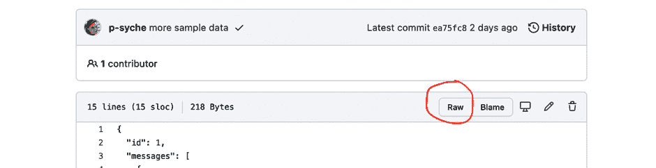

# 4

# 为 Funbook 应用进行样式化和填充

在上一章中，我们根据设计文件规划了我们的应用所需的界面和组件。我们还熟悉了预览和调试应用的过程——至少我希望您已经熟悉了，亲爱的读者！无论您是使用 iPhone 或 Android 模拟器，还是使用带有 Expo Go 应用的实体设备，请确保您以这种方式检查您的应用。使用 Expo 构建的应用预览没有错误答案。在本章中，我们将对我们的界面和组件进行样式化。我们最终将看到一个看起来希望接近设计的应用！之后，我们将添加一些真实数据。

下面是我们计划在本章中实现的一些非常简短的列表：

+   创建和样式化组件

+   为应用拉取数据

到本章结束时，我们将拥有一个看起来不错的应用程序，它可以从外部 API 获取数据。您可以随时密切关注或编写自己的代码。

# 技术要求

为了跟随本章内容，您需要具备一些 JavaScript 和 ReactJS 的知识。如果您已经跟随了本书的前两章，您应该能够无任何问题地继续前进。

您可以自由选择您喜欢的 IDE，因为 React Native 不需要任何特定功能。目前，前端开发者中最受欢迎的 IDE 是微软的 Visual Studio Code、Atom、Sublime Text 和 WebStorm。

本章提供的代码片段旨在说明我们应该如何使用代码。它们并不提供完整的画面。为了更好地跟随代码编写过程，请在您的 IDE 中打开 GitHub 仓库并查看其中的文件。

如果您遇到困难或迷失方向，可以查看 GitHub 仓库中的代码：[`github.com/PacktPublishing/Simplifying-State-Management-in-React-Native/tree/main/chapter-4`](https://github.com/PacktPublishing/Simplifying-State-Management-in-React-Native/tree/main/chapter-4)。

# 创建和样式化组件

是时候创建一些真正的组件了！让我们从主页面开始。

我喜欢从上到下工作，所以我们首先从标题栏开始。我们的免费设计模板包括应用名称（“Socially”）和位于信息流顶部的铃铛图标。在我们的示例应用中，我们不会实现通知功能，所以我们将忽略设计文件中的这部分。标题栏的样式是通过 React Navigation 添加的。我们将向`<Tab.Navigator>`添加以下属性：

```js
// …
  headerTransparent: true,
  headerTitleAlign: "left",
  headerTitleStyle: {
  paddingTop: 140,
  paddingBottom: 40,
  textAlign: "left",
  fontWeight: "bold",
},
// …
```

正如我们在分析主页面前面所分析的，我们知道我们需要创建主页面的两个部分：一个头像列表和一个带有图片的卡片列表。头像列表将使用水平`FlatList`组件。列表上的第一个项目是不同的；它是一个用户用来添加内容的按钮。我们将向`FlatList`添加一个`ListHeaderComponent`属性，我们将在这里添加这个特殊项目。现在让我们创建一个占位符组件：

```js
// src/components/ListHeaderComponent
import React from "react";
import { View, Text } from "react-native";
export const ListHeaderComponent = () => {
  return (
    <View>
      <Text>List Header component placeholder</Text>
    </View>
  );
};
```

在前面的代码中，我们创建了一个名为 `ListHeaderComponent` 的组件，因此我们可以将其导入到 `FlatList` 中。到目前为止，此组件只显示占位文本。

我将设计文件中导出的几个个人头像图片添加到了 `assets` 文件夹中。我们将使用它们来构建头像列表。

这就是 `ListOfAvatars` 组件的样子：

```js
// src/components/ListOfAvatars.js
import React from "react";
import { View, Text, FlatList} from "react-native";
import { ListHeaderComponent } from "./ListHeaderComponent";
const arrayOfAvatars = [
  {
    id: 1,
    url: "",
  },
  {
    id: 2,
    url: "",
  },
  {
    id: 3,
    url: "",
  },
];
export const ListOfAvatars = () => {
  const renderItem = ({ item }) => {
    return <Text>{item.id}</Text>
  };
  return (
    <View style={{ paddingTop: 30 }}>
      <FlatList
        data={arrayOfAvatars}
        renderItem={renderItem}
        keyExtractor={(item) => item.id}
        horizontal
        ListHeaderComponent={<ListHeaderComponent />}
      />
    </View>
  );
};
```

请记住从 `FlatList` 中导入必要的组件。您可能还会注意到我设置了一个非常简单的数据数组，用于填充头像列表。我们将在稍后管理将此组件连接到我们的示例数据。

如果您更喜欢在屏幕上查看此代码而不是在书中，您始终可以在仓库中查看。我们目前正在工作的代码可以在 `chapter-3` 分支中找到：[`github.com/PacktPublishing/Simplifying-State-Management-in-React-Native/tree/main/chapter-3`](https://github.com/PacktPublishing/Simplifying-State-Management-in-React-Native/tree/main/chapter-3)。

一旦我们设置了 `FlatList` 并与实际图像建立了链接，我们就可以将 `<Text>` 组件更改为 `<Image>` 组件，从我们的数组中提供数据，添加一些样式使图像呈圆形，然后我们就完成了！

我们将添加一张卡片列表，它将与头像列表非常相似。我们还将使用一个临时数据的数组并添加一些样式，最终我们应该得到一个看起来像这样的组件：

```js
// src/components/ListOfCards.js
export const ListOfCards = () => {
  const renderItem = ({ item }) => {
    return (
      <Image
        style={{
          width: "100%",
          height: 288,
          borderRadius: 20,
          marginBottom: 32,
        }}
        source={{
          uri: item.url,
        }}
      />
    );
  };
  return (
    <View style={{ paddingVertical: 30 }}>
      <FlatList
        data={arrayOfImages}
        renderItem={renderItem}
        keyExtractor={(item) => item.id}
        showsVerticalScrollIndicator={false}
      />
    </View>
  );
};
```

被称为 `Feed` 的表面组件应该只关注导入正确的子组件和通用样式。它看起来是这样的：

```js
// src/surfaces/Feed.js
export const Feed = () => {
  const headerHeight = useHeaderHeight();
  return (
    <SafeAreaView
        style={{ flex: 1, paddingTop: headerHeight + 20,          paddingHorizontal: 20 }}
    >
      <View>
        <ListOfAvatars />
        <ListOfCards />
      </View>
    </SafeAreaView>
  );
};
```

我们应用中的 **Feed** 表面应该看起来像这样：


图 4.1 – `Feed` 表面的 iPhone 模拟器截图

您可以保持您的应用原样，或者您可以复制我在 GitHub 仓库中添加的一些样式调整。在这本书中，我们不会专注于样式，所以我们将不会详细讨论它们；不过，我鼓励您四处看看。

**Feed** 表面看起来与设计非常相似，因此我们可以继续前进到 **Conversations** 表面。

我们的 `<ConversationsNavigation>`，我们将在这里创建一个 Stack Navigator：

```js
// src/surfaces/ConversationsNavigation.js
import React from "react";
import { Conversations } from "./Conversations";
import { Messages } from "./Messages";
import { createStackNavigator } from "@react-navigation/stack";
const Stack = createStackNavigator();
export const ConversationsNavigation = () => {
  return (
    <Stack.Navigator
      screenOptions={{
        //…
      }}
    >
        <Stack.Screen name='Conversations'          component={Conversations} />
      <Stack.Screen
        name='Messages'
        component={Messages}
        options={({ route }) => ({
          title: route.params.name,
          //…
        })}
      />
    </Stack.Navigator>
  );
};
```

在此组件中，我们设置的最有趣的选项是这一项：

```js
options={({ route }) => ({
          title: route.params.name,
          //…
```

这行代码告诉 `Messages` 表面。如果您现在测试您的应用，您会注意到这还没有发生。我们还需要在用户选择进入 `Messages` 表面时设置此参数，这意味着我们需要在点击 `Conversation` 时设置它。我们将创建一个带有顶部输入框的 `Conversations` 表面，后面跟着 `FlatList` 中的对话列表。列表中的每个项目都将包裹在一个 `<Pressable>` 组件中，它看起来像这样：

```js
<Pressable onPress={() => navigation.navigate("Messages", { name: item.name })} >
```

当我们的用户选择一个对话时，这个对话会将分配的`name`参数传递给`Messages`界面，界面随后将显示这个名称作为标题。现在我们可以添加一个假消息列表和条件样式，这些样式将根据消息是来自用户还是发送给用户而有所不同。对于消息列表来说，记住在消息的`FlatList`组件上使用`inverted`属性是个有用的技巧。毕竟，我们希望最新的条目出现在列表的底部。

你可能会注意到，此时`Conversations`界面和`Messages`界面都没有显示底部标签。实现这种功能最好的方法是，将我们的`<ConversationsNavigation>`从标签导航器移出，并移入主堆栈导航器。主堆栈中列出的界面将显示在标签导航器中的界面之上，此外我们还可以使用 React Navigation 库提供的预配置的返回按钮。以下是`App.js`根组件应该看起来像什么：

```js
// src/App.js
export default function App() {
  //…
  return (
    <SafeAreaProvider>
      <NavigationContainer>
        <Stack.Navigator>
          {!userLoggedIn ? (
            <Stack.Screen name='Login' component={Login} />
          ) : (
            <>
              <Stack.Screen
                name='Home'
                component={Home}
                options={{ headerShown: false }}
              />
              <Stack.Screen
                name='ConversationsNav'
                component={ConversationsNavigation}
                options={{ headerShown: false }}
              />
            </>
          )}
        </Stack.Navigator>
      </NavigationContainer>
    </SafeAreaProvider>
  );
}
```

为了让我们的**Conversations**界面的按钮在标签中显示，我们需要创建一个空的虚拟界面并将其传递给 Tab Navigator：

```js
// src/surfaces/Home.js
<Tab.Screen name='Feed' component={Feed} />
      <Tab.Screen
        name='ConversationsMain'
          component={ConversationsBase} // just a dummy             component which will never be called
        options={{
          tabBarIcon: ({ size }) => (
              <Ionicons name='chatbox-outline' color='#000000'                size={size} />
          ),
        }}
        listeners={({ navigation }) => ({
          tabPress: (e) => {
            e.preventDefault();
            navigation.navigate("ConversationsNav");
          },
        })}
      />
      <Tab.Screen name='AddPost' component={AddPost} />
// …
```

我们将在`Conversations`界面的底部添加一个浮动按钮，这样我们就完成了！

我会很快地浏览这些代码更改，因为我们不希望花太多时间关注样式或 React Navigation 技巧和窍门。我们希望尽快运行一个接近现实世界中的应用程序，这样我们就可以开始玩转状态和数据管理。请随意查看 GitHub 仓库中的所有代码更改，在那里你也可以提问和提出问题。

我们将继续通过向`FlatList`组件添加内容来推进我们的进度，这些组件将显示添加的图片和收藏的图片。

我们将通过向`Tab Navigator`的中央项目添加自定义组件来完成这个界面，这个黑色按钮用于添加帖子。我们可以添加任何我们想要的作为标签栏图标的自定义组件：

```js
// src/surfaces/Home.js
function Home() {
  return (
    <Tab.Navigator>
//…
   <Tab.Screen
        name='AddPost'
        component={AddPost}
        options={{
          tabBarIcon: ({ size }) => (
            <View
              style={{
                marginTop: -30,
              }}
            >
              <View
                style={{
                  position: "absolute",
                  backgroundColor: "#000000",
                  padding: 30,
                  bottom: -10,
                  left: -13,
                  borderRadius: 23,
                  transform: [{ rotate: "-45deg" }],
                  shadowColor: "#000000",
                  shadowOffset: { width: 0, height: 4 },
                  shadowOpacity: 0.2,
                  shadowRadius: 4,
                }}
              />
                <Ionicons name='add-circle-outline'                  color='#ffffff' size={36} />
            </View>
          ),
        }}
      />
//…
```

如果你仔细观察，你会发现这个按钮的样式与`Conversations`界面上浮动的按钮非常相似。在我们需要重复大量代码的情况下，将其抽象到单独的文件中是个好主意。这被称为**不要重复自己**（**DRY**）编程。我们不想走得太远，为每一件小事都做抽象。还有一种编程原则叫做**写两次**（**WET**）编程，它主张编写冗长的代码，尤其是在开始一个新项目时。我个人的偏好是**避免仓促抽象**（**AHA**）编程，这是由*Kent C. Dodds*提出的。这种方法结合了 DRY 和 WET 原则，并鼓励我们程序员在不过度使用它们的同时，找到抽象的最佳用例。

在这个特定的情况下，我们正在重复样式。我们可以轻松创建一个名为`floatingButton`的类并将其应用于我们的两个组件。我们也可以使用`<FloatingButton>`样式组件。还有更多方法可以实现具有可重用样式的目标，但我们不会深入探讨。我将在我们的组件中进行一些清理，并在几分钟后在这里与你见面，这样我们就可以连接到我们的（几乎）真实 API 的一些真实数据。

# 拉取应用数据

欢迎回来！你有没有花点时间看看我们的应用代码？你是否从`chapter-3`分支克隆了仓库，或者你是否根据我之前描述的大致轮廓创建了你的组件？无论如何，我很高兴你在这里！让我们获取一些数据并使用一些状态！

关于我们将使用的数据的一个快速提醒：我在`/docs`文件夹中设置了 GitHub Pages，你可以在这里找到：[`github.com/PacktPublishing/Simplifying-State-Management-in-React-Native/tree/main/docs`](https://github.com/PacktPublishing/Simplifying-State-Management-in-React-Native/tree/main/docs)。

你可以直接在 GitHub UI 中预览每个 JSON 文件。你还可以通过点击**原始**按钮查看任何文件的原始内容：



图 4.2 – GitHub UI，红色圆圈圈出了原始按钮

点击此按钮后可见的文本文件就是你可以看到的 API 响应。

我们将从获取用户列表开始。这个列表包含用户 ID 和用户头像的链接。我们的 API 依赖于我们在整个应用中管理用户头像，并且只通过这个端点传递它们。

那么，让我们检查我们需要用户列表的地方。我们需要它在`App.js`中。

我们首先要做的是在父组件中获取数据：

```js
// src/App.js
export default function App() {
  const [userLoggedIn, setIsUserLoggedIn] = useState(true);
  const [userList, setUserList] = useState(null);
//…
  async function fetchUserData(id) {
    const response = await fetch(requestBase + "/users.json");
    setUserList(await response.json());
  }
  useEffect(() => {
    fetchUserData();
  }, []);
  //…
  if (!userList) {
    return <AppLoading />;
  }
```

一旦我们获取了数据并将其放入`userList`对象中，我们就可以将其作为属性从父组件传递给子组件。根据 React Navigation 文档，你可以在导航器的渲染回调中传递额外的属性。以下是`Home`组件的示例：

```js
<Stack.Screen name='Home' options={{ headerShown: false }}>
    {(props) => <Home {...props} userList={userList} />}
</Stack.Screen>
```

一旦我们在`Home`界面中有了`userList`属性，我们就应该完成了，对吧？不幸的是，不是的。`Home`界面是标签导航器的父组件，因此我们需要为`Feed`界面添加整个渲染回调过程。一旦我们到达`Feed`界面，我们需要将`userList`属性传递给`ListOfAvatars`组件……这开始变得有点多了，不是吗？这是在大应用中被称为属性钻取的一个例子。通过多个界面和组件传递对象不仅繁琐，而且容易出错。这种设置很脆弱——只要链中的任何一个组件发生变化，整个应用可能就无法使用。我们能做些什么来避免这种情况呢？我们可以使用**React Context**。这也是 React Navigation 维护者推荐的战略。

什么是上下文？

上下文用于在组件树中传递数据，而无需手动将 props 传递到每个组件。

我们需要采取的第一个步骤是创建我们的上下文并设置初始值：

```js
const UserListContext = React.createContext(null);
```

然后，我们需要将父组件包裹在一个带有更新值的 Context Provider 中：

```js
// src/App.js
return (
    <SafeAreaProvider>
      <UserListContext.Provider value={{ userList: userList }}>
        <NavigationContainer theme={MyTheme}>
          <Stack.Navigator>
//…
```

上下文拼图的最后一部分是如何使用它，或者说“消费它”。一旦上下文提供给父组件，我们就可以通过`<Context.Consumer>`组件在其任何一个子组件中消费它。我们将把这个消费者添加到我们的头像列表中：

```js
// src/components/ListOfAvatars.js
export const ListOfAvatars = () => {
  const renderItem = ({ item }) => {
   //…
  };
  return (
    <UserListContext.Consumer>
      {({ userList }) => (
          <View
          //…
          >
            <FlatList
              data={userList}
              renderItem={renderItem}
              keyExtractor={(item) => item.id}
              horizontal
              //…
```

好了！我们成功获取了外部数据，将其提供给我们的应用，并借助 React Context 传递数据。使用上下文提供了更好的开发者体验；然而，它也带来了一系列问题。在使用上下文时，你应该始终牢记的最大问题是，上下文中的任何更改都会导致放置`Provider`的组件及其所有子组件的重新渲染。这意味着如果我们有一个 API，用户可以添加或删除他们列表中的其他用户，每次他们这样做时，整个应用都需要重新渲染。有时，我们希望这样；我们希望更新头像列表和`Feed`中的图片列表。我们也希望在这种情况下更新`Conversations`界面。但是关于`Profile`和`Add Post`界面呢？我们现在不会回答这些问题，因为我们正在处理一个示例应用。然而，每次你决定使用 React 的 Context 时，你应该问自己 Provider 应该放在哪里，以及当上下文的数据发生变化时会发生什么。

让我们继续为我们的应用的其他部分获取真实数据。我们希望在`Feed`上显示图片。我们将从使用`useEffect`钩子在`ListOfCards`组件中获取数据开始：

```js
// src/components/ListOfCards.js
import AppLoading from "expo-app-loading";
import { requestBase } from "../utils/constants";
export const ListOfCards = () => {
  const [cardList, setCardList] = useState(null);
  async function fetchCardData() {
    const response = await fetch(requestBase + "/home.json");
    setCardList(await response.json());
  }
  useEffect(() => {
    fetchCardData();
  }, []);
  if (!cardList) {
    return <AppLoading />;
  }
  return (
  //…
      <FlatList
        data={cardList.listOfitems}
        renderItem={renderItem}
        keyExtractor={(item) => item.itemId}
```

一旦我们的卡片项被获取并传递给`Card`组件，我们可以对它们做更多的事情——也就是说，我们可以将作者 ID 与上下文中的用户列表进行比对，并利用这些信息显示正确的用户名和头像。

我们将把与`ListOfAvatars`组件中添加的相同上下文消费者添加到`Card`组件中，但在这个情况下这还不够。一旦我们获取了整个列表，我们还需要找到与卡片作者 ID 匹配的用户 ID。我们将调整传递上下文值的方式，并过滤`userList`数组：

```js
// src/components/Card.js
import { UserListContext } from "../context";
export const Card = ({ item }) => {
  return (
    <UserListContext.Consumer>
      {({ userList }) => {
        const currentUser = userList.filter(
          (user) => user.id === item.authorId
        );
        return (
          <View>
            <Image
            //…
```

我们创建了一个名为`currentUser`的变量，它是一个包含精确一个项目的数组——即发布特定卡片的用户。不幸的是，这个变量只能被`Card`组件访问。如果我们想在例如点击图片时打开的模态框中使用相同的信息，我们不得不将模态组件嵌套在`Card`组件中，或者再次搜索当前用户。您将在我们自己的应用中看到这个问题的例子，在我们接下来与`Conversations`界面工作的时候。

另一方面，我们使用`Card`组件组合了另一个表面——`Favorites`表面。我们只需获取`Favorites`数据即可使其正确工作。其余的都应该会自动就位。

如果你在从 GitHub 页面上的示例 API 加载数据时遇到任何问题，首先确保数据已被获取。您可以通过在代码中使用`console.log`并查看终端来检查对象是否已被获取。然后，您需要检查您是否正确拼写并嵌套了所有的名称和对象键。如果您在任何地方卡住了，请记住您始终可以前往 GitHub 上托管的项目，克隆它，并在您喜欢的任何阶段查看。

让我们继续到下一个需要获取数据的组件——`Conversations`。正如我之前提到的，我们需要调整并重复一些我们之前为`Feed`和`Favorites`表面中使用的`Card`组件编写的代码。在`Conversations`中，我们还将获取用户列表并搜索当前用户。请确保一切拼写正确。那个偷偷摸摸的 API 作者把一切都命名为不同的名称！以下是我的`Conversations`组件的样子：

```js
// src/components/ConversationItem.js
export const ConversationItem = ({ navigation, item }) => {
  return (
    <UserListContext.Consumer>
      {({ userList }) => {
          const currentUser = userList.filter((user) =>            user.id === item.userId);
        return (
          <Pressable
            onPress={() =>
              navigation.navigate("Messages", {
                name: currentUser[0].name,
                avatar: currentUser[0].url,
              })
            }
            style={{
              height: 103,
         //…
```

请注意`currentUser`后面的`[0]`。我们在一个数组上使用了一个过滤器函数，结果是一个数组。省略`[0]`意味着应用程序将不会显示任何数据，因为它会看到一个数组而不是一个对象。

我们已经有了会话列表；现在是时候在用户点击时获取特定的会话了。重定向到消息屏幕的动作发生在`Conversations`表面的`FlatList`中的`<ConversationItem>`组件上。`Messages`表面是同一个栈导航器的一部分，这意味着我们可以从这里选择两个方向：

1.  向`<ConversationsNavigation>`组件添加上下文，在会话被点击时设置其值，并在`Messaging`表面消费它。

1.  将会话 ID 作为路由参数传递，同时传递用户数据。

第二种方法非常有吸引力，因为它很简单。我们只是添加了一块我们已经有权限访问的数据，并通过导航传递到正确的位置。这种方法的本质并没有什么可以立即批评的地方。然而，在现实世界的应用程序中，您可能会编写非常大的或重复的对象，并将它们作为`route`参数传递。根据 React Navigation 文档，尽管使用路由参数很方便，但它们不应作为全局应用程序状态的替代品。手动通过路由参数传递数据可能会导致错误，并使应用程序显示过时的数据。如果您想稍微锻炼一下，您现在就可以在自己的`FunBook`应用程序副本中实现这个解决方案。

当你准备好了，请回到这里，我会带你一步步创建和消费用于会话的新上下文。

我们将像以前一样开始，创建具有初始值的上下文：

```js
export const ConversationContext = React.createContext(null);
```

我决定将创建上下文的函数放在一个单独的文件中，为了简单起见，我们将其命名为`context.js`。一旦上下文被创建，我们需要将其包裹在正确的组件周围。在这种情况下，我们需要在`Conversations`表面的嵌套`Stack``Navigator`周围添加 Provider。让我们在`<ConversationsNavigation>`组件中添加以下代码：

```js
// src/surfaces/ConversationsNavigation.js
import { ConversationContext } from "../context";
//…
export const ConversationsNavigation = () => {
  const [conversationId, setConversationId] = useState(null);
  return (
    <ConversationContext.Provider
      value={{
        conversationId: conversationId,
        setConversationId: setConversationId,
      }}
    >
      <Stack.Navigator
        screenOptions={{
          headerBackTitleVisible: false,
// …
```

你会注意到这次我们传递了值和`setter`函数到上下文中。这是因为我们将在树中更深的地方，在`<ConversationItem>`组件中设置上下文的值。不过不用担心；通过上下文传递函数是完全没问题！

当你注意到`<ConversationItem>`已经被`<UserListContext.Consumer>`包裹时，你可能会问关于多个上下文的问题。这完全没问题。你可以拥有你需要的任何数量的包装器！以下是我们的具有两个上下文的组件的样子：

```js
// src/components/ConversationItem.js
export const ConversationItem = ({ navigation, item }) => {
  const onPressItem = (setConversationId, currentUser) => {
    setConversationId(item.id);
    navigation.navigate("Messages", {
      name: currentUser[0].name,
      avatar: currentUser[0].url,
    });
  };
  return (
    <ConversationContext.Consumer>
      {({ setConversationId }) => (
        <UserListContext.Consumer>
          {({ userList }) => {
            const currentUser = userList.filter(
              (user) => user.id === item.userId
            );
            return (
              <Pressable
                  onPress={() => onPressItem(setConversationId,                    currentUser)}
                //…
```

既然我们已经设置了上下文，让我们在`Messages`表面消费它。我们需要首先从上下文中获取对话 ID，然后获取给定对话的正确`JSON`文件。我们将在`Messages`表面添加`<ConversationContext.Consumer>`作为包装器：

```js
// src/surfaces/Messages.js
export const Messages = ({ route }) => {
  const headerHeight = useHeaderHeight();
  return (
      <SafeAreaView style={{ flex: 1, paddingTop: headerHeight         + 100 }}>
      <ConversationContext.Consumer>
        {({ conversationId }) => (
```

一旦我们获取到对话 ID，我们将在`ListOfMessages`组件中使用它来获取与给定屏幕相关的数据：

```js
// src/components/ListOfMessages.js
import AppLoading from "expo-app-loading";
import { requestBase } from "../utils/constants";
export const ListOfMessages = ({ conversationId }) => {
  const [messages, setMessages] = useState(null);
  async function fetchMessages() {
    const response = await fetch(
      requestBase + "/messages/" + conversationId + ".json"
    );
    setMessages(await response.json());
  }
  useEffect(() => {
    fetchMessages();
  }, []);
  if (!messages) {
    return <AppLoading />;
  }
  const renderItem = ({ item }) => {
    //…
  };
  return (
    //…
      <FlatList
        data={messages.messages}
        renderItem={renderItem}
        keyExtractor={(item) => item.id}
        showsVerticalScrollIndicator={false}
        inverted
      />
    </View>
  //…
```

好的，我们做到了！在这里我们做了一些扎实的工作；现在是时候给自己鼓掌了。我们设置了多个组件来获取数据并在必要时传递它。我们已经设置了`Feed`组件、`Favorites`、`Conversations`和`Messaging`。最后剩下的表面是`Profile`。我将把它留给你，亲爱的读者，来管理这个表面的数据。我相信你已经在本章中学到了足够多的知识，能够独立完成它。

当你访问书籍仓库时，你将在名为`chapter-3`的分支上找到与本章节相关的所有工作。你可以浏览提交记录来查看应用开发的进展，或者你可以简单地查看应用的最终状态。在下一章中，我们将看到我们是否可以用一个更全局的解决方案 Redux 来替换所有的上下文、props 和过滤用户。继续前进，不断进步！

# 摘要

我们在本章中做了很多出色的工作！当你看到一款看起来很棒且运行流畅的应用时，你会有一种非常特别的满足感，对吧？

在这一章之后，我们达到了这样的境地——我们有一个按照设计风格定制的应用。这个应用从 API 中拉取外部数据。我承认我们的应用相当简单。还有很多更多功能可以添加到社交媒体克隆应用中。没有任何东西阻止你这样做。你可以随意添加和删除任何你想要的东西。我还会添加一些更多功能，也许是一个模态框，或者一个功能性的“点赞”按钮，我们将在*第五章*中见面，在那里我们将开始调查我们的第一个状态管理解决方案——Redux。

# 进一步阅读

+   [`www.digitalocean.com/community/tutorials/what-is-dry-development`](https://www.digitalocean.com/community/tutorials/what-is-dry-development): DRY 编程。

+   [`betterprogramming.pub/when-dry-doesnt-work-go-wet-6befda0444bf`](https://betterprogramming.pub/when-dry-doesnt-work-go-wet-6befda0444bf): WET 编程。

+   [`kentcdodds.com/blog/aha-programming`](https://kentcdodds.com/blog/aha-programming): AHA 编程。

+   [`reactnavigation.org/docs/hello-react-navigation/#passing-additional-props`](https://reactnavigation.org/docs/hello-react-navigation/#passing-additional-props): 在 React Navigation 中传递额外的 props。

+   [`reactjs.org/docs/context.html`](https://reactjs.org/docs/context.html): React Context。

+   [`reactnavigation.org/docs/params/#what-should-be-in-params`](https://reactnavigation.org/docs/params/#what-should-be-in-params): React Navigation – params 中应该包含什么？

# 第三部分 – 探索 React Native 中各种状态管理库

在这部分，我们将从 Redux 和其工具包开始；我们将学习它们为什么被创建，如何配置它们，以及如何在示例应用中用它们来管理点赞的图片。接下来，我们将学习关于 MobX 的内容，它想要解决什么问题，以及如何配置和使用它来在 Funbook 应用中管理点赞的图片。然后，我们将学习关于 XState 的内容，这个库的数学基础是什么，如何配置它，以及如何利用其可视化器来可视化数据。最后，我们将将其实现用于在 Funbook 应用中管理点赞的图片。接下来是 Jotai；我们将了解它为什么被创建以及它解决了什么问题。然后，我们将为 Funbook 应用配置它并使用它来管理点赞的图片。最后，我们将学习关于 React Query（或 TanStack Query）。我们将了解为什么这个库在一本关于状态管理的书中被提及。然后，我们将配置它并用于在 Funbook 应用中获取点赞的图片。

本部分包括以下章节：

+   *第五章*，*在我们的 Funbook 应用中实现 Redux*

+   *第六章*，*在 React Native 应用中使用 MobX 作为状态管理器*

+   *第七章*，*使用 XState 在 React Native 应用中解开复杂流程*

+   *第八章*, [*在 React Native 应用程序中集成 Jotai*](https://epic.packtpub.services/index.php?module=oss_Chapters&action=DetailView&record=254c4c24-4e8a-0b72-fab6-61f37807c398)

+   *第九章*, *使用 React Query 进行服务器端驱动状态管理*
