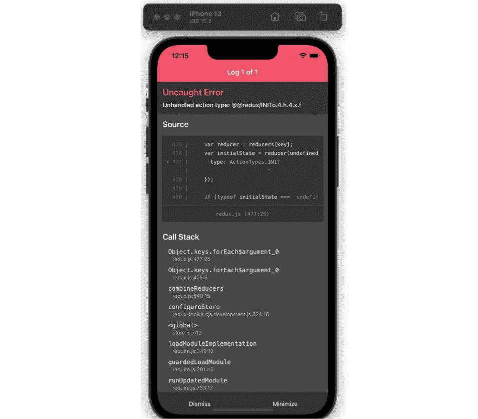
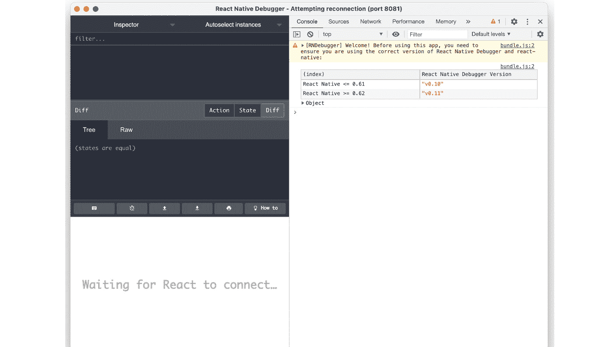

# 第五章：在我们的 Funbook 应用中实现 Redux

在上一章中，我们稍微“沾染”了一些实际操作。我希望你喜欢构建 Funbook 应用！我们成功构建了一个功能应用的客户端。当然，我们创建的功能是有限的。一个现实世界的社交媒体应用将更加健壮，拥有更多的组件和用户流程。然而，更大的应用也会带来自己的一套问题：处理大量数据集、建立风格指南、管理分析以及许多其他我们不希望花费时间解决的问题。我们在这里讨论不同状态管理的解决方案。为了保持专注，我在应用中添加了一些在上一章中没有详细描述的功能。我添加了一个模态，显示 GitHub 上`example-app-full`文件夹中图像的放大版本：

[`github.com/PacktPublishing/Simplifying-State-Management-in-React-Native/tree/main/example-app-full`](https://github.com/PacktPublishing/Simplifying-State-Management-in-React-Native/tree/main/example-app-full).

这个应用将成为我们在这本书中所有状态管理实验的基础。我们将从查看最古老的状态管理库：**Redux**开始。

在本章中，我们将进行以下操作：

+   简要回顾一下**Redux**的历史

+   在 Funbook 应用中安装和配置**Redux**

+   向应用添加**Redux**功能

+   了解如何调试**Redux**

到本章结束时，你应该能够熟练使用**Redux**特定的术语，如 reducer、actions 和 store。你也应该对在真实的**React** **Native**应用中配置和使用**Redux**有很好的理解。

# 技术要求

为了跟上本章的内容，你需要具备一些 JavaScript 和 ReactJS 的知识。如果你已经跟随着本书的前两章，你应该能够没有问题地继续前进。

随意使用你选择的 IDE，因为 React Native 不需要任何特定功能。目前，前端开发者中最受欢迎的 IDE 是微软的 VSCode、Atom、Sublime Text 和 WebStorm。

本章提供的代码片段旨在说明我们应该如何使用代码。它们并不提供完整的画面。为了更容易地编码，请在你选择的 IDE 中打开 GitHub 仓库，查看其中的文件。你可以从名为`example-app-full`或`chapter-5`的文件夹中的文件开始。如果你从`example-app-full`开始，你将负责实现本章中描述的解决方案。如果你选择查看`chapter-5`，你将看到我实现的整个解决方案。

如果你遇到了困难或迷失了方向，你可以在 GitHub 仓库中查看代码：

[`github.com/PacktPublishing/Simplifying-State-Management-in-React-Native/tree/main/chapter-5`](https://github.com/PacktPublishing/Simplifying-State-Management-in-React-Native/tree/main/chapter-5).

# 什么是 Redux？简史

我们在 *第一章* 中简要介绍了 **React** 的历史，*什么是 React 和 React Native？* 如果你跳过了那一章，或者只是不记得了，不用担心。你需要知道的是，**ReactJS** 于 2013 年发布，它为创建美观的单页应用打开了大门。**ReactJS** 是一个令人兴奋的库！很多人抓住了这个机会，开始重新编写他们的网站。随着时间的推移，许多开发者会发现，使用 **ReactJS** 创建和维护大型应用变得乏味。别忘了，在 **ReactJS** 团队引入 hooks 和 context 之前，这种情况就已经发生了。开发者必须从父组件传递 props 到嵌套子组件，经过多个无关组件的层级。这被称为 **prop** 钻孔，因为通过许多祖先到达子组件的感觉就像是在钻孔。

2015 年，发生了一件非常有趣的事情：*丹·阿布拉莫夫* 和 *安德鲁·克拉克* 编写并发布了一个名为 Redux 的新开源库。最初，ReactJS 开发者对此感到困惑，因为 **Redux** 为 **ReactJS** 世界引入了新的概念。我们可以开始思考那些可以从应用中的任何地方访问的全局状态。为了改变全局状态，我们需要使用称为“actions”的特殊函数，还需要使用称为“reducers”的东西... 这需要吸收很多内容！不管怎样，这个新库解决了一个非常实际的问题，所以唯一要做的就是系好安全带，观看丹·阿布拉莫夫的教程，并使用这个新颖而神奇的工具！

多亏了丹·阿布拉莫夫（Dan Abramov）在教学、解释和推广 **Redux** 方面的努力，它成为了 **ReactJS** 开发的基础。随着岁月的流逝，为管理全局状态而创造的新概念不断涌现，有些与 **Redux** 类似，有些则非常不同。与较新的解决方案相比，**Redux** 可能会显得有些笨拙，因为它有大量的样板代码。即使是库的作者也通过推特表达了他的疑虑：


图 5.1 – 丹·阿布拉莫夫（Dan Abramov）的推文，表示他不理解 Redux 示例代码

大约在 2016 年，**Redux** 的维护工作转交给了 *马克·埃里克森* 和 *蒂姆·多尔*。我有机会和马克·埃里克森交换了几条信息。他告诉我，他并没有因为维护 **Redux** 而获得报酬；他是在业余时间做的，尽管这可能会非常耗时。他自己也表示，他成为 **Redux** 的维护者是个意外，但在我阅读了他关于这个主题的优秀博客文章后，我认为他成为 **Redux** 的维护者是因为他在 **Redux** 文档上投入了大量的工作，以及他花费时间帮助使用 **Redux** 的开发者。你可以在他的博客上阅读完整的故事（*进一步阅读* 部分中的链接）。马克补充说，他喜欢维护 **Redux**。他有时会与对他在做决策时感到不满意的开发者发生冲突，但他也收到了来自同行 OSS 维护者以及会议邀请的支持。我询问马克他对 **Redux** 在当前状态管理库领域的看法。他指出，有许多资源（NPM 统计数据、GitHub 统计数据等）证明 **Redux** 仍然是迄今为止在 **React** 应用中最广泛使用的状态管理库。然而，正如马克所说，从 2016 年到 2017 年，**Redux** 被过度使用了。在那段时间里，许多开发者提出了关于 **Redux** 模板大小合理的投诉。这种情况反过来又导致了 Twitter 上的反弹，很多人声称“**Redux** 已死”，因为某个工具或另一个“杀死了它”。

“**RTK** 和 **React-Redux** 钩子改变了这一说法。如果你看看今天的 Reddit 和 Twitter 上的讨论，你会看到很多人表示他们非常喜欢 **RTK** 并推荐它，”马克说。

**Redux** 目前是管理 **React** 和 **React Native** 应用程序全局状态的一个成熟且值得信赖的解决方案。我们在这个部分简要地回顾了其历史。很明显，它有其不足之处。引用马克·埃里克森的话，“这是一个有用的工具，并不适用于所有情况，但是一个非常合理的选择。”它有它的支持者和反对者，但了解它是有价值的——这就是我们在这里的原因！让我们开始吧！

# 安装和配置 Redux

就像我们想要添加到项目中的任何库一样，我们首先会阅读文档。**Redux** 的文档在多年中已经发生了很大的变化。到 2022 年，推荐的安装包括 **Redux Toolkit**。

**Redux Toolkit** 是使用 **Redux** 的官方推荐方法。它包含构建 **Redux** 应用程序常用的包和依赖项。这个工具包还简化了许多使用 **Redux** 必须完成的任务，例如创建存储或减少器。任何用户都可以自由安装和使用核心 **Redux**，但我们将使用推荐的方法并使用 **Redux Toolkit**。

为什么不直接使用 Redux？

Redux 库自 2015 年构思以来已经发生了很大的变化。其生态系统也增长了很多。2022 年推荐的 Redux Toolkit 是为用 Redux 编写的应用程序最实用的补充，尽管它不是必需的。

让我们从完整应用程序的文件开始，这些文件位于 `example-app-full` 文件夹中。您可以直接在您的计算机上修改这些文件。您也可以分叉存储库或从该文件夹复制文件。这些文件包括运行完整应用程序所需的所有内容。如果您想跟随工作代码，您应该查看 `chapter-5` 文件夹。那里放置了本章所有完成的工作。

让我们开始吧。按照以下步骤操作：

1.  一旦您进入 `app` 文件夹，请运行以下命令：

    ```js
    npm install @reduxjs/toolkit
    ```

我们将继续安装 Redux 文档中推荐的补充包。

1.  让我们运行以下命令：

    ```js
    npm install react-redux
    ```

    ```js
    npm install --save-dev @redux-devtools/core
    ```

现在依赖项已安装，我们可以花一分钟时间讨论 **Redux** 的核心概念。

主要概念，也是绝对最重要的一个，就是我们在 **Redux** 中将状态视为一个普通对象。**Redux** 文档使用待办事项应用作为示例，但我们可以继续使用我们的 Funbook 应用程序。

如果我们要用一个单独的对象来表示 Funbook 应用程序的登录用户的状态，它可能看起来像这样：

```js
{
    userLoggedIn: true,
    userData: {
        id: 3,
        name: "John Doe",
        email: "john@doe.com",
        image: "imageURL",
        addedImages: […],
        likedImages: […],
        numberOfPosts: 35,
        numberOfFollowers: 1552,
        numberOfFollows: 128,
        idsOfFollowedUsers: […],
        idsOfConversations: […]
    },
}
```

在这个例子中，我们试图全面了解整个应用程序所需的所有用户数据。这被认为是全局状态。我们不是面向表面；我们想知道与用户相关的所有数据。因此，在 `userData` 对象中，您将找到用于 **Profile** 界面的用户名和电子邮件，我们可以使用 **Feed** 界面中的用户头像的跟随用户 ID 数组，以及用于 **Conversations** 界面的必要对话 ID 数组。

当然，我们应用程序的所有数据并不直接依赖于登录用户。让我们尝试想象 `Feed` 界面上出现的模态的全局状态部分的形状。以下是图像点击打开的模态的状态可能看起来像这样：

```js
{
    imageModalOpen: true,
    imageId: 3,
    authorId: 3,
    imageUrl: "imageUrl",
    numberOfLikes: 28,
    numberOfConversations: 12,
    numberOfFollows: 128
}
```

在应用程序周围走一圈，我们可能想要考虑与 **Conversations** 界面相关的全局状态切片的形状。在我看来，我们从 GitHub Pages 上设置的模拟 API 中获取的数据形状与全局状态的形状非常吻合：

```js
[
  {
    "id": 1,
    "userId": 2,
    "text": "Hey, how's it going?"
  },
  {
    "id": 2,
    "userId": 4,
    "text": "Yo, are you going to the wedding?"
  },
//…
```

通常情况下，全局状态与 API 响应具有相同的形状是受欢迎的。在这些情况下，作为前端开发人员，您将不必重塑数据或记住在何处以及为什么使用哪些键。在一个完美的世界里，API 响应将始终适合显示在 UI 上的数据形状。然而，在现实世界中，这可能意味着前端会不必要地获取可以在多个界面之间共享的数据，或者获取不必要的大数据集或图像。

我觉得我们正在掌握全局状态这个整体概念，对吧？请随意尝试自己思考应用可能需要的其他全局状态片段。也许你可以勾勒出当点击头像时显示的模态所需的全球状态形状——或者也许是什么具体需求对于“收藏”图像的界面，以及“个人资料”界面上的相同数据。当你准备好继续学习第二个 **Redux** 概念：分发动作时，请回到这里。

哦，你好！你回来了！太好了！那么，让我们更深入地讨论 **Redux** 吧！

## 分发动作

假设我们已经设置了全局状态——我们替换了很多不必要的属性，我们很满意——但如果我们想改变某些内容呢？如果用户喜欢一张图片呢？如果用户添加了一张新图片或关注了另一个用户呢？我们需要告诉我们的状态，某些内容已经改变。这就是我们分发动作的时候。一个动作是一个描述正在发生什么的普通 JavaScript 对象。我们可以分发一个类似这样的动作：

```js
{ type: 'LIKE_IMAGE', payload: { Object with data about the liked image } }
```

现在怎么办？全局状态神奇地改变了？不幸的是，并没有。我们仍然需要告诉 **Redux** 根据这个动作来改变状态。将动作与状态联系起来的这个谜题的缺失部分被称为 **reducer**。Reducer 函数是接收旧状态和动作并返回应用新状态的普通 **JavaScript** 函数。以下是一个非常简单的用于收藏图片的 reducer 示例：

```js
function likedImages(state =[], action) {
  if (action.type === 'LIKE_IMAGE') {
    let newLikedImages = state;
    newLikedImages.push(action.payload);
    return newLikedImages
  } else {
    return state
  }
}
```

我们接收旧状态——在这种情况下，收藏图片的数组。然后我们添加新项目并返回新状态。我们还在 `else` 块中获得了非常优雅的错误处理，如果在任何地方出现问题，应用将返回到旧状态。

我在本节中描述了三个概念：

1.  **存储** – 全局状态的唯一真相来源

1.  **Reducer** – 接收旧状态和动作的函数，执行所需操作，并返回新状态

1.  **Action** – 包含存储所需信息的普通 JavaScript 对象

这些基本上就是您需要了解的，以有效地开始使用 **Redux**。如果您想了解更多关于这些概念和这个伟大库的历史，请查看 *进一步阅读* 部分，在那里您可以找到 **Redux** 文档的链接。现在我们已经了解了基础知识，我们准备将这项新知识应用到实际应用中。

# 将 Redux 功能添加到应用中

在上一节中，我们已经使用友好的包管理器安装了 **Redux Toolkit**，但我们在应用中还没有做出任何真正的改变。然而，我们在前面的章节中已经思考了应用中的数据流。我们现在需要做的工作将与之前非常相似。我们将从设计状态结构和动作开始。当我们有了这两者，我们将添加 reducer 来将一切联系起来。

我们面前还有大量的工作要做，所以让我们尝试将其分解成更小的块。我们将从查看用户状态以及如何在**Redux**中使用全局状态管理用户的登录和注销状态开始。然后我们将对应用中的喜欢图片做同样的遍历。当我们成功设置这两个全局状态的片段后，我们将看看如何将它们结合起来并在我们的应用中使用它们。然后我们将创建一些处理应用事件的 actions。一旦我们有了状态和 actions，我们将简要地看看如何在**Redux**应用中获取数据。最后，我们将准备好丢弃之前用于管理我们应用状态的**React**上下文。

## 用户登录状态遍历

让我们从用户状态开始。我们将创建一个名为`store.js`的新文件，我们将在这个文件中存储我们的初始状态片段。我们将向该文件添加以下**JavaScript**对象：

```js
export const user = {
  userLoggedIn: false,
  userData: null,
};
```

当应用首次加载时，我们将假设用户未登录且没有用户数据。

现在，我们需要考虑一个当用户登录时将被分发的 action。它应该看起来像这样：

```js
{type: 'LOGIN', payload: userData}
```

最后的部分是 reducer。让我们为我们的 reducers 创建一个新的文件夹，叫做……好吧，`reducers`。在这个文件夹内，我们将创建我们的 reducer 文件，它应该看起来像这样：

```js
// reducers/user.js
import { user } from "../store";
export const login = (state=user, action) => {
  if (action.type === 'LOGIN') {
    return {
        ...state,
        user: {
          userLoggedIn: true,
          user: action.payload,
        },
    }
  } else {
    return state
  }
}
```

我们将用户对象作为初始状态导入，然后添加一个 switch，它会监听特定的 action。让我们监听`'LOGIN'` action。

但是等等——如果我们的用户想要注销呢？我们需要为这个特定的操作创建另一个 action：

```js
{ type: 'LOGOUT' }
```

在这个情况下，我没有添加任何 action payload，因为我们不会传递任何实际的数据。我们只想清除数据，我们将在 reducer 中这样做。我们可以在 reducer 中添加另一个`if`语句，但大的`if-else`语句变得难以阅读和推理。对于 reducers 来说，使用`switch`语句是个好主意，因为我们实际上是在切换应用的不同状态。这就是我们的 reducer 将看起来像这样：

```js
export const login = (state=user, action) => {
  switch (action.type) {
    case "LOGIN": {
      return {
        ...state,
        user: {
          userLoggedIn: true,
          user: action.payload,
        },
      };
    }
    case "LOGOUT": {
      return {
        ...state,
        user: {
          userLoggedIn: false,
          user: null,
        },
      };
    }
    default:
      return state;
  }
}
```

好的——现在当用户登录时，我们将设置应用的全局状态以反映这一点，对吧？几乎是这样！我们仍然需要找到我们代码中正确的位置来分发这个 action，而这个位置是**登录**界面的登录按钮——但是我们的**登录**界面是基于主组件的本地状态显示的！这意味着在我们看到 Redux 的魔法之前，我们还需要做一点额外的工作。不过别担心，这会值得的！

重要信息

如果你对我们似乎在做的大量额外工作有任何疑问，我邀请你，我亲爱的读者，去阅读一下`useReducer`钩子。在这个时候，`useReducer`听起来可能很熟悉，那是因为它是一个具有与**Redux** reducers 相同功能的**ReactJS**钩子。我希望到现在你已经开始相信，使用像**Redux**这样的状态管理库是 React Native 应用的绝佳解决方案。

你可能想知道为什么我们在状态中使用扩展运算符然后改变了 `userLoggedIn` 的值。理论上，直接在状态中更改值不更简单吗？不是在 **Redux** 中。**Redux** 非常坚决地认为减少器不能修改当前状态。减少器只能复制状态并对复制的值进行更改。这很重要，这样我们的代码才是可预测的。如果有许多减少器更改了相同的状态片段，谁能说结果会是什么？

不可变性

这是一个非常复杂的词，不是吗？它的意思是指某物不可更改，或者不应该更改。在 JavaScript 应用程序的情况下，不可变数据管理可以提高性能并使编程和调试更容易。Redux 减少器接受旧状态和动作，并返回一个新的状态对象；它们永远不应该对“旧”状态对象应用更改。

如果你好奇 **Redux** 的关键概念，我再次邀请你到 *进一步阅读* 部分，在那里你可以找到一个链接到由 **Redux** 的作者 *Dan Abramov* 创建的免费课程 [Egghead.io](http://Egghead.io)。

## 使用 Redux 处理点赞的图片

我们的全局状态到目前为止相当薄弱。将用户数据保留在全局状态中是很好的，但我们当然可以用这个伟大的工具做更多的事情。比如点赞帖子？点赞帖子的减少器看起来像这样：

```js
export const likedImages = (state = [], action) => {
  if (action.type === "LIKE_IMAGE") {
    let newLikedImages = state;
    newLikedImages.push(action.payload);
    return newLikedImages;
  } else {
    return state;
  }
};
```

如果用户决定取消点赞一个帖子呢？让我们为这种情况添加一个动作和一个减少器：

```js
{ type: 'UNLIKE_IMAGE', payload: { Object with data about the unliked image } }
```

现在，让我们调整我们的减少器。由于我们在单个减少器中有多个动作，我们将再次使用 `switch` 语句：

```js
// ./reducers/likedImages.js
export const likedImagesReducer = (state = [], action) => {
  switch (action.type) {
    case "LIKE_IMAGE": {
      const newLikedImage = action.payload;
      return [...state, newLikedImage];
    }
    case "UNLIKE_IMAGE": {
      const stateWithoutLikedImage = state.filter(
        (item) => item !== action.payload
      );
      return stateWithoutLikedImage;
    }
    default: {
      throw new Error(`Unhandled action type: ${action.type}`);
    }
  }
};
```

## 结合各种全局状态

我们有两个减少器，每个减少器都旨在管理两个不同的动作。我们现在需要做的是创建一个表示 Funbook 应用程序全局状态的存储库并将动作传递给减少器。我们可以使用来自核心 `configureStore` 函数的 `createStore` 函数，这将为我们做很多繁重的工作。我们只需要添加这个函数：

```js
// ./store.js
import { configureStore } from "@reduxjs/toolkit";
import usersReducer from "./reducers/users";
import likedImagesReducer from "./reducers/likedImages";
export const store = configureStore({
  reducer: {
    user: usersReducer,
    likedImages: likedImagesReducer,
  },
});
```

`configureStore` 函数为我们合并了两个减少器，创建了 **Redux** 所需的根减少器。这个单一的根减少器是实现应用程序中单一事实来源所必需的。此函数还添加了一些有用的中间件功能，这些功能将检查常见错误并使我们的代码更容易调试。

我们创建了全局状态，并通过 `<Provider>` 组件包装器配置了它（无意中开玩笑），这个命名约定不是偶然的。两个 `<Provider>` 组件都服务于相同的目的，**React** 上下文使用了与 **Redux** 相同的大量高级逻辑。

让我们将必要的元素导入我们的主应用文件，`App.js`：

```js
import { store } from "./store";
import { Provider } from "react-redux";
```

让我们将我们的应用包裹在 Redux `<Provider>` 中：

```js
export default function App() {
//…
  return (
    <SafeAreaProvider>
      <Provider store={store}>
//…
```

这看起来很熟悉，不是吗？`<Provider>` 与 **React** 的上下文有很多相似之处。我无法提供任何来自 Meta 团队的官方博客文章链接，React 维护者正式解释了这一点。然而，我可以提供我的个人观点，即 React 团队看到了 **Redux** 为大型 **React** 应用带来的解决方案，并认为其中的一些原则值得引入到 **React** 仓库本身。显然，还有其他的状态管理解决方案。如果没有，我就无法写这本书！无论如何，**Redux** 在 React 生态系统中占据着一个特殊的位置。

在短暂的休息之后，我们将重新回到我们的代码！我们已经设置了我们的存储和 `Provider`。我们还准备好了两个减法器：用于用户数据和喜欢的图像数据。让我们从替换喜欢的图像开始。我们将进入 `surfaces` 文件夹，在那里我们将找到 Favorited 表面。这将反过来引导我们到名为 `ListOfFavorites` 的组件，该组件显示来自 Favorited 上下文的数据。

我们将移除这个上下文，并使用 Redux 的 `useSelector` 钩子，然后我们将使用这个钩子从 **Redux** 获取实际数据：

```js
// src/components/ListOfFavorites
import { useSelector } from "react-redux";
export const ListOfFavorites = ({ navigation }) => {
    const { likedImages } = useSelector((state) =>      state.likedImages);
//…
```

你在我们的手机或模拟器上运行我们的应用了吗？我希望你已经运行了，因为这样你就会注意到刚刚发生了一些非常错误的事情！



图 5.2 – 带有 Redux 错误的 iPhone 模拟器截图

`likedImages` 减法器中的 `switch` 语句！这并不是我们想要的默认值，所以让我们继续修改，让它默认返回初始状态：

```js
//reducers/likedImages.js
export const likedImagesReducer = (state = [], action) => {
  switch (action.type) {
  //…
    default: {
      return state;
    }
  }
};
```

应用程序正确加载 – 我们又重新开始工作了！我们将初始状态作为默认值传递给 `likedImages` 减法器，这意味着我们传递了一个空数组 – 但我们想要获取图像数据。我们之前在上下文提供者中使用 `fetch` 做过这件事。`FavoritedContextProvided` 使用了 React 的 `useReducer` 钩子，以及当图像成功获取时发出的 `init_likes` 动作。当涉及到 `Provider` 时，我们将在一个动作中创建一个获取函数，然后当 Favorited 表面被渲染时，我们将发出这个动作。这是一个针对简单应用的简单解决方案。如果你正在开发一个更大的应用，你可能需要关注缓存、避免重复请求或缓存有效期。在这种情况下，你应该查看 Redux Toolkit 提供的工具，称为 RTK 查询，它简化了 Redux 应用中的数据获取和缓存。

一个完整的工具包

同时学习这么多工具可能会开始感到有些压倒性。我们开始使用 Redux，然后继续使用 Redux Toolkit，现在我们正在添加 RTK Query。在这个阶段，不必太担心库和工具的名称。我们在这里是为了学习如何有效地使用 Redux 管理状态来编写应用程序，并且我们正在遵循文档和最佳实践来做这件事。一旦你熟悉了建议的解决方案，你可以自由地探索 Redux 生态系统，找到你最喜欢的方法。关于你喜欢和不喜欢的东西，没有错误答案！

## 利用 Redux Toolkit 创建动作

我们的红利器到目前为止非常有限。我们不能直接用它来获取数据，因为根据 reducer 状态规则，reducer 不能用于执行任何异步逻辑。如果我们是在 2018 年或 2019 年左右编写应用程序，我们可能会创建一个单独的`actions`文件，手动配置`createSlice`。在`likedImages`reducer 中，“slice”是一个**Redux Toolkit**切片：

```js
//reducers/likedImages.js
import { createSlice } from "@reduxjs/toolkit";
export const likedImagesSlice = createSlice({
  name: "likedImages",
  initialState: [],
  reducers: {
    likeImage: (state) => {
      const newLikedImage = action.payload;
      return [...state, newLikedImage];
    },
    unLikeImage: (state, action) => {
      const stateWithoutLikedImage = state.filter(
        (item) => item !== action.payload
      );
      return stateWithoutLikedImage;
    },
  },
});
export const { init, likeImage, unLikeImage } = likedImagesSlice.actions;
export default likedImagesSlice.reducer;
```

## 获取数据

由于**Redux Toolkit**中的`createAsyncThunk`函数。

什么是 thunk？

thunk 是一种特殊的函数，由另一个函数返回。这个名字与**Redux**本身无关。

这就是我们的获取数据 thunk 将看起来像：

```js
import { createAsyncThunk } from "@reduxjs/toolkit";
import { requestBase } from "./src/utils/constants";
export const fetchLikedImages = createAsyncThunk(
  "likedImages/initLikedImages",
  async () => {
      const response = await fetch(requestBase + "/john_doe/        likedImages.json");
    return await response.json();
  }
);
```

现在，我们需要告诉由**Redux Toolkit**提供的`extraReducers`函数，以保持我们的 reducer 整洁和可读：

```js
// reducers/likedImages.js
import { createSlice } from "@reduxjs/toolkit";
import { fetchLikedImages } from "../asyncFetches";
export const likedImagesSlice = createSlice({
  name: "likedImages",
  initialState: {
    likedImages: [],
    loading: true,
  },
  reducers: {
   //…
  },
  extraReducers: (builder) => {
    builder.addCase(fetchLikedImages.pending, (state) => {
      state.loading = true;
    });
      builder.addCase(fetchLikedImages.fulfilled,        (state, action) => {
      state.likedImages = action.payload;
      state.loading = false;
    });
    builder.addCase(fetchLikedImages.rejected, (state) => {
      state.loading = false;
    });
  },
});
```

现在我们已经有了一种相当优雅的方式来管理获取数据，包括挂起状态和拒绝状态，让我们实际获取我们的数据。我们不应该在`ListOfFavorited`组件中获取它，因为我们需要在整个应用程序渲染后立即获取图像数据。我们应该在父组件`Home`中获取图像：

```js
//src/surfaces/Home
import { fetchLikedImages } from "../../asyncFetches";
import { useDispatch, useEffect } from "react-redux";
// …
export const Home = () => {
  const dispatch = useDispatch();
  useEffect(() => {
    dispatch(fetchLikedImages());
  }, []);
```

这样，当应用程序渲染并且用户在`ListOfFavorites`组件上时，将获取喜欢的图像数据：

```js
//src/components/ListOfFavorites
import { useSelector, useDispatch } from "react-redux";
export const ListOfFavorites = ({ navigation }) => {
    const { likedImages } = useSelector((state) =>      state.likedImages);
  const dispatch = useDispatch();
  const [imageList, setImageList] = useState([]);
useEffect(() => {
    const reversedImages = [...likedImages].reverse();
    setImageList(reversedImages);
  }, [likedImages]);
if (!imageList) {
    return <AppLoading />;
  }
//…
      <FlatList
        data={imageList}
        renderItem={renderItem}
        keyExtractor={(item) => item.itemId}
       //…
```

你可能已经注意到了获取的数据是如何传递给状态钩子的：

```js
const reversedImages = [...likedImages].reverse();
```

我们使用 ES6 扩展运算符来将`reverse()`函数应用于`likedImages`数组的副本。这是因为`likedImages`数组是只读的，我们无法直接对其操作。

## 替换上下文

抽取一点时间来审视你所取得的成就。你有效地用 Redux 替换了 Favorited 上下文！我们最后需要做的就是替换当图像被喜欢或不喜欢时的动作，然后我们就可以做一些清理工作了！

让我们进入`ImageDetailsModal`界面，并将与上下文相关的代码替换为 Redux 代码：

```js
//src/surfaces/ImageDetailsModal
import { likeImage, unLikeImage } from "../../reducers/  likedImages";
import { useDispatch, useSelector } from "react-redux";
export const ImageDetailsModal = ({ navigation, route }) => {
    const { likedImages } = useSelector((state) =>      state.likedImages);
  const [isCurrentImageLiked, setIsCurrentImageLiked] = useState(false);
  const dispatch = useDispatch();
  useEffect(() => {
    const checkIfLiked =
      likedImages?.filter(
          (favoritedImg) => favoritedImg.itemId ===            route.params.imageItem.itemId
      ).length > 0;
    setIsCurrentImageLiked(checkIfLiked);
  }, [likedImages]);
```

我们最后需要更改的是当点击**喜欢**按钮时调用的函数：

```js
<Pressable
          onPress={() => {
            if (isCurrentImageLiked) {
              dispatch(unLikeImage(route.params.imageItem));
            } else {
              dispatch(likeImage(route.params.imageItem));
            }
          }}
        >
```

我们已经完成了应用`Favorited`上下文**Provider**。

我们的应用程序仅由功能组件组成，因此我们可以使用`mapStateToProps`和`mapDispatchToProps`。尽管如此，现代**React**应用程序可以不使用类组件来构建——正如你在 Funbook 应用程序中看到的那样。

在本节中，你学习了如何创建用于用户状态和喜欢图片的 Redux 存储库。我们为存储库的两个部分添加了 reducer 以及动作。我们利用 Redux Toolkit 提供的一些实用工具使我们的工作更轻松。我们将所有这些整合在一起，最终能够减少一些 React 的上下文。用**Redux**替换所有其他上下文是一个很好的练习，可以帮助你熟悉这个状态管理库。如果你只想看看它看起来会是什么样子，请查看书籍仓库和文件夹：[`github.com/PacktPublishing/Simplifying-State-Management-in-React-Native/tree/main/chapter-5-complete`](https://github.com/PacktPublishing/Simplifying-State-Management-in-React-Native/tree/main/chapter-5-complete)。

现在，我们将探讨在使用 Redux 时可能出现的处理问题和调试问题。

# 调试

我们的 Funbook 应用程序目前相当简单。然而，当与更大的应用程序一起工作时，你会注意到随着每个新功能的添加，状态变得越来越复杂。有时，功能具有重叠的状态或复杂的操作，负责应用程序中发生的许多事情。为了追踪与复杂状态变化相关的错误，我们可以使用专门的调试器。在裸**Redux**应用程序中配置开发工具需要几个步骤，但我们使用的是**Redux Toolkit**！它再次伸出援手。**Redux Toolkit**预先配置为与**Redux** DevTools 扩展一起工作，该扩展在浏览器中运行。由于我们正在开发 React Native 应用程序，我们需要使用另一个工具，称为**React Native**调试器。Mac 用户可以使用 Homebrew 工具安装它：

```js
brew install react-native-debugger
```

如果你不是使用 Mac 电脑，你将在他们的安装说明页面上找到一个预构建的二进制文件：[`github.com/jhen0409/react-native-debugger`](https://github.com/jhen0409/react-native-debugger)。

一旦远程调试器安装完成，你可以在终端中输入以下命令来运行它：

```js
open "rndebugger://set-debugger-loc?host=localhost&port=8081"
```

由于我们使用的是**Expo**，我们需要做一些更改才能实际调试我们的应用程序。到目前为止，默认配置的**React Native**调试工具还没有找到我们的应用程序：



图 5.3 – 安装后的 React Native 调试器

我们需要告诉`19000`。你可能需要停止调试器和应用程序，然后运行以下命令以在正确的端口上打开 React Native 调试器：

```js
open "rndebugger://set-debugger-loc?host=localhost&port=19000"
```

最后，通过在终端中停止服务器并重新运行以下命令来重新启动应用程序：

```js
expo start
```

**React Native**调试器是一个非常有用的工具，不仅用于调试 Redux，还用于检查**React Native**应用程序中的各种错误。

在本节中，我们讲解了如何安装和使用**React Native**调试工具。我鼓励你探索这个非常有用的工具，检查应用，也许可以添加一些错误的代码来看看这个工具中的错误可能是什么样子。

# 摘要

在我们穿越状态管理生态系统的旅途中我们已经走了很长的路。在本章中，我们以`example-app-full`作为起点，讨论了被认为是该应用中最常见的状态管理解决方案，并尝试用**Redux**替换`LikedImages`上下文。

# 进一步阅读

+   [`redux.js.org/introduction/why-rtk-is-redux-today`](https://redux.js.org/introduction/why-rtk-is-redux-today) – 为什么使用 Redux Toolkit？

+   [`redux.js.org/introduction/core-concepts`](https://redux.js.org/introduction/core-concepts) – Redux 核心概念。

+   [`blog.isquaredsoftware.com/2016/09/how-i-got-here-my-journey-into-the-world-of-redux-and-open-source/`](https://blog.isquaredsoftware.com/2016/09/how-i-got-here-my-journey-into-the-world-of-redux-and-open-source/) – Mark Erikson 关于他成为 Redux 维护者的博客。

+   [`blog.isquaredsoftware.com/2018/03/redux-not-dead-yet/`](https://blog.isquaredsoftware.com/2018/03/redux-not-dead-yet/) – Redux 并未死去。

+   [`egghead.io/courses/fundamentals-of-redux-course-from-dan-abramov-bd5cc867`](https://egghead.io/courses/fundamentals-of-redux-course-from-dan-abramov-bd5cc867) – Dan Abramov 的 Egghead 教程。

+   [`stackoverflow.com/a/34582848/8798164`](https://stackoverflow.com/a/34582848/8798164) – 关于状态变更的 Stack Overflow 回答。

+   [`redux.js.org/tutorials/essentials/part-2-app-structure#rules-of-reducers`](https://redux.js.org/tutorials/essentials/part-2-app-structure#rules-of-reducers) – Reducers 的规则。

+   [`daveceddia.com/what-is-a-thunk/`](https://daveceddia.com/what-is-a-thunk/) – 什么是 thunk？
