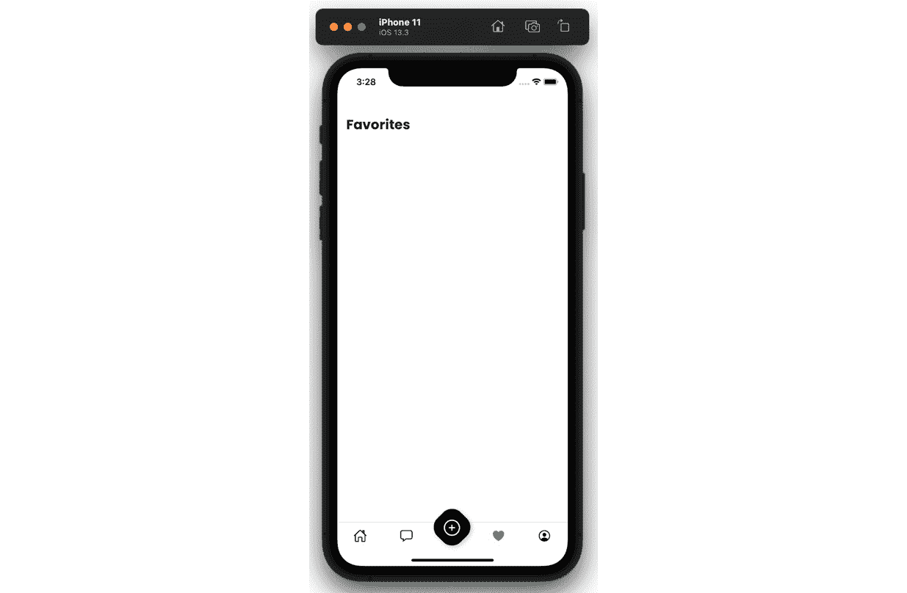

# 第六章：在 React Native 应用中使用 MobX 作为状态管理器

在上一章中，我们有机会尝试在 `FavoritedImages` 上下文中使用最受欢迎的状态管理解决方案 **Redux**。您可以随时返回 GitHub 仓库的文件夹 *第五章* 检查代码中具体发生了哪些变化：[`github.com/PacktPublishing/Simplifying-State-Management-in-React-Native/tree/main/chapter-5`](https://github.com/PacktPublishing/Simplifying-State-Management-in-React-Native/tree/main/chapter-5)。

如果您想看到整个应用完全迁移到 Redux，请访问另一个文件夹：[`github.com/PacktPublishing/Simplifying-State-Management-in-React-Native/tree/main/chapter-5-complete`](https://github.com/PacktPublishing/Simplifying-State-Management-in-React-Native/tree/main/chapter-5-complete)。

到目前为止，我们面临了一个陡峭的学习曲线。我们讨论了使用状态管理库的 `FavoritedImages`。在本章中，我们将讨论使用 MobX 状态、模型和动作的 `FavoritedImages` 上下文。

本章将包括以下内容：

+   复习 **MobX** 概念

+   在 Funbook 应用中配置 **MobX**

+   使用 `FavoritedImages`

到本章结束时，您应该能够熟练使用 **MobX**。您不仅将了解 **MobX** 模型、快照和存储是什么，而且您还将知道您是否更喜欢它们而不是 **Redux**！这正是本书的真正目的：了解不同的解决方案，以便您可以为未来的项目选择您更喜欢的方案。

# 技术要求

为了跟随本章的内容，您需要了解一些 **JavaScript** 和 **ReactJS** 的知识。如果您至少跟完了本书的 *第一章* 到 *第四章*，您应该能够无任何问题地继续前进。

随意使用您选择的 IDE，因为 React Native 不需要任何特定功能。目前，前端开发者中最受欢迎的 IDE 是微软的 VSCode、Atom、Sublime Text 和 WebStorm。

本章提供的代码片段旨在说明我们应该如何使用代码。它们并不提供完整的画面。为了更容易地编码，请打开您 IDE 中的 GitHub 仓库并查看其中的文件。您可以从名为 `example-app-full` 或 `chapter-6` 的文件夹中的文件开始。如果您从 `example-app-full` 开始，您将负责实现本章中描述的解决方案。如果您选择查看 `chapter-6`，您将看到我实现的整个解决方案。

如果您遇到困难或迷失方向，可以检查 GitHub 仓库中的代码：[`github.com/PacktPublishing/Simplifying-State-Management-in-React-Native/tree/main/chapter-6`](https://github.com/PacktPublishing/Simplifying-State-Management-in-React-Native/tree/main/chapter-6)。

# 复习 MobX 概念

正如你可能已经注意到的，亲爱的读者，我喜欢在每个大节开始时，简要介绍一下我们将要检查的软件的历史。碰巧 MobX 在 React 社区中有着非常平静的存在。它的构思或开发过程中并没有真正的戏剧性。它在 2015 年由 Mendix 公司的博客宣布，MobX 的创造者*Michel Weststrate*曾在这里工作。博客文章详细介绍了创建这个库的原因，即 2015 年的纯 ReactJS 应用在管理复杂状态方面并不很好。从那时起，MobX 已经在 GitHub 上作为一个开源库被开发。2016 年，它加入了**MobX-State-Tree**（**MST**），这是 MobX 的状态容器系统。MST 对于 MobX 来说，就像 Redux Toolkit 对于 Redux 一样。它是一个为更好的**开发者体验**（**DX**）而制作的额外工具，但它不是必需的。我个人喜欢让我的生活更简单，所以在这本书中，我们将使用 MST。

我与*Jamon Holmgren*交换了几条信息，他是 Infinite Red 的 CTO，Infinite Red 是一家在 React Native 领域享有盛誉的软件公司，同时也是**MST**的维护者。他说他大约 5 年前得知**MobX**，当时他的队友们在寻找 Redux 的替代品。在完成一个试验项目后，他们非常喜欢它，并且一直在使用它。它甚至已经集成到 Infinite Red 的**React Native**模板**Ignite**中。Jamon 说，“**MST**的主要优势是，你可以在不触及每个更改时需要触摸四个或五个不同文件的情况下，获得 Redux 的中心存储感觉。你还可以获得细粒度的重新渲染，而不需要编写单个选择器，并且感觉非常自然。Infinite Red 的开发者在拥有数百个屏幕和数百万日活跃用户的 App 上使用 MST 时几乎没有问题，因此它是一个经过验证的、与 React 和 React Native 配合得非常好的状态管理系统。”在开发者需要与更不结构化的数据一起工作，并且需要更多控制的情况下，**MobX**可能比**MST**是更好的解决方案。

“**MobX**仍然带来了 MST 所具有的可观察性（细粒度、有针对性的重新渲染）和自然的更新，但重量更轻，”Jamon 补充道。

**MobX**大约 7 年前被创建，但多年来一直保持着相关性。Jamon 说，他希望改进库的**TypeScript**（**TS**）类型，但总体来说，他认为由于作者 Michel Weststrate 出色的工程，这个库表现得非常好。

**MobX** 目前是 **React** 应用程序中最受欢迎的状态管理库之一。文档中提到，它是最受欢迎的 **Redux** 替代方案之一。如果你仔细阅读文档，可能会发现作者暗示 **MobX** 比起 **Redux** 更好。当我问及这种竞争关系时，Jamon 说：“与其他优秀的社区争论总是很有趣。现实是，**MobX** 社区非常尊重 **Redux** 社区。他们的社区推动我们变得更好，并不断进步。他们做出了不同的权衡决策，可能不是你的特定风格，所以有选择权是件好事。”

当然，**MobX** 维护者有完全的权利认为他们正在工作的解决方案更好。现在，让我们看看你，亲爱的读者，是怎么想的！

关于 **MobX** 的概念和高级理念，文档中有一句非常重要的话被加粗了：

应该从应用状态中推导出任何可以推导的东西。自动地。

- **MobX** 口号

这是一个新概念！任何可以推导出的东西都应该自动推导。我们之前是否自动从我们的应用状态中推导出任何东西？实际上并没有。最初，我们创建了 `useState` 和 `useEffect` 钩子，与 **React** 上下文结合使用。每当用户与我们的应用交互时，我们必须手动更新所有必要的状态部分。在 Redux 中，我们编写了动作，并将状态更新的信息传递给 reducer。我们可以说状态更新是自动发生的；在传递动作后，我们不需要执行任何额外的任务。然而，我们确实创建了动作并手动调用它。我们还知道 **Redux** 并不特别提倡从应用状态中推导值。**Redux** 文档更多地集中在不可变性、状态是单一真相来源以及使用纯函数。

**MobX** 文档指出，这个库基于透明的函数式编程——这一概念在由 **Packt Publishing** 出版的《MobX 快速入门指南》一书中得到了进一步解释。**MobX** 的哲学是以下这些：

1.  **简单直接** – 编写简约的代码，反应系统将自动检测所有更改，无需添加特殊工具或样板代码。

1.  **轻松优化** – 数据更改在运行时跟踪，这意味着计算只在需要时运行，我们避免了不必要的组件重新渲染。

1.  **无偏见** – **MobX** 可以与任何 UI 框架一起使用，这使得你的代码解耦、可移植，并且易于测试。

在 **MobX**-land 中还有一个有趣的概念，那就是快照。如果你曾经为 JavaScript 应用程序编写过测试，你可能听说过“快照”这个术语。**MobX** 快照与测试快照类似。它们在特定时间点保存状态树的状态。在调试期间查看 **MobX** 快照或在从服务器获取数据后进行高效的状态更新时，这可能会非常有用。如果你想了解更多关于快照和调试 **MobX** 状态的信息，我邀请你查看由 **MobX** 的创造者 *Michel Westrate* 创建的 [Egghead.io](http://Egghead.io) 课程；你可以在 *进一步阅读* 部分找到链接。至于从服务器获取数据，我们将在本章的最后部分探讨这个问题。

现在，我们对 **MobX** 的主要概念有了非常理论性的了解。我们知道它与 **Redux** 不同，但亲爱的读者，你可能想看到一些代码！让我们继续在 Funbook 应用中配置 **MobX**。

# 在 Funbook 应用中配置 MobX

如 **MobX** 作者所承诺的，这个库的样板代码是最小的。我们需要添加三个依赖项和一些文件，才能使一切正常工作。让我们首先通过在终端运行以下命令来添加必要的依赖项：

```js
npm install mobx mobx-state-tree –save
```

此命令将安装 **MobX** 和 **MobX**-State-Tree。**MobX** 对我们想要与之一起使用的 UI 库没有意见。这意味着当我们决定使用特定的 UI 库时，我们必须找到一种方法让它与 **MobX** 合作。碰巧我们选择了 **React Native** 作为我们的 UI 库，因此我们需要添加一个额外的依赖项，以便 **MobX** 与 React 平滑合作。让我们运行以下命令：

```js
npm install mobx-react-lite –save
```

现在我们有了依赖项，让我们运行以下命令：

```js
expo start
```

经常检查我们的应用是否仍然正常运行是个好主意。像安装依赖项这样无害的事情有时可能会破坏应用，我们希望尽快知道任何问题。

假设一切按预期工作，我们可以继续在 Funbook 应用中实现 **MobX** 而不是 **React** 的上下文。

一个小提醒，亲爱的读者，关于代码：与本章相关的代码可以在这本书的仓库的 `chapter-6` 文件夹中找到：[`github.com/PacktPublishing/Simplifying-State-Management-in-React-Native/tree/main/chapter-6`](https://github.com/PacktPublishing/Simplifying-State-Management-in-React-Native/tree/main/chapter-6)。如果你更喜欢自己跟随，请复制 `example-app-full` 文件夹并从这里开始工作。

# 在 FavoritedImages 中使用 MobX

在本书的开头，我亲爱的读者，我做出了一个选择，那就是用 **JavaScript** 编写所有示例。在用 **MobX** 编写示例时，我对此决定感到后悔。**MobX** 文档使用 **TS**，这是 **JavaScript** 的超集，它带来了许多优势。我鼓励我的亲爱的读者去了解 **TS**。我不会在这个话题上花费更多时间，因为网上和书籍中都有数百种非常有价值的 **TS** 资源，但我想要让你知道，以防你阅读 **MobX** 文档，示例看起来与这本书中的代码略有不同。

现在我们已经把这些都弄清楚了，让我们开始编码！我们将创建一个名为 `models` 的新文件夹，我们将在这个文件夹中存储我们应用程序的数据模型。术语“数据模型”可能听起来非常严肃，但请放心。**MobX** 数据模型不过是带有超级能力的 **JavaScript** 对象——我的意思是，它们看起来像简单的 **JavaScript** 对象，但它们能够做更多的事情！

当我们有几个模型准备就绪时，我们将为我们的全局 `store.js` 创建一个额外的文件，并将获取和管理喜欢图像的所有逻辑放在这个文件中。

让我们先创建最简单的模型：用户的模型。我们不会实现实际的用户状态变更，但我们会快速看一下在现实世界的实现中 **MobX** 模型是什么样的：

```js
// ./models/User.js
import { types } from "mobx-state-tree"
export const User = types.model({
    name: types.string,
    loggedIn: types.boolean,
})
```

我们只需要导入一个项目：来自 `mobx-state-tree` 的 `types`。这些类型是 **MobX** 中非常强大的工具。你可以声明非常简单的类型，就像这里的一样——一个字符串和一个布尔值——但你也可以声明这些值是可选的，如下所示：

```js
name: types.optional(types.string, "")
```

你也可以在先前的示例中 `types.string` 定义后面的 `""` 符号表示），或者一个给定的值可能是未定义的，如下所示：

```js
name: types.maybe(types.string)
```

还有许多其他类型，但我们不会涵盖所有这些。然而，MST 文档有一个关于类型的非常详尽的章节，你可以在 *进一步* *阅读* 部分找到这个链接。

你可能已经注意到 `types.model` 也位于声明的非常开始的位置。这就是告诉 **MobX** 我们正在描述我们数据形状的标志。

我们的 `Users` 模型非常简单。我们用它来初步了解 `LikedImages` 模型。

我们再次开始，通过从 `mobx-state-tree` 导入 `types` 并声明单个 `LikedImage` 项的形状：

```js
// ./models/LikedImages
import { types } from "mobx-state-tree"
const LikedImageItem = types
    .model({
        itemId: types.number,
        authorId: types.number,
        timeStamp: types.string,
        url: types.string,
        likes: types.string,
        conversations: types.string,
    })
```

我们在 `LikedImageItem` 模型中添加了一些属性。我们将在未来使用这些属性在 `Favorited` 表面上显示必要的数据。恰好这些属性存在于从服务器获取的图像项中。

现在已经描述了单个图像模型，我们可以继续设置相同图像的数组以及与此数组相关的操作：

```js
export const LikedImages = types
    .model({
          imageList: types.optional             (types.array(LikedImageItem), []),
    })
    .actions(self => ({
        addLikedImage(newImage) {
            // will add images here
        },
        removeLikedImage(imageToRemove) {
            // will remove images here
        },
    }))
```

从顶部开始，您会注意到我们正在声明一个名为 `imageList` 的对象，它将存储一个 `LikedImageItems` 的数组，并将使用空数组的默认值进行实例化。

`LikedImageItem` 模型并没有做什么有趣的事情，所以我们继续到 `LikedImages` 数组。我们必须添加一个 `types.model`，告诉我们的状态管理器这个状态片段将是一个 `LikedImageItems` 的数组——然后我们添加两个需要创建的函数的占位符：添加和删除喜欢的图片。

我们现在可以继续在我们的应用程序中设置 **MobX**。首先，我们将设置一个存储——类似于 **Redux** 管理的应用程序，这将成为应用程序的真相来源。然后我们将从服务器获取数据并将其传递给应用程序。一旦我们准备好了所有这些，我们将查看 **MobX** 动作——我们的模型需要响应的事件。最后，但同样重要的是，我们将了解从状态中推导数据。

## 创建存储

在添加和删除图片之前，我们还需要采取一个步骤。亲爱的读者，您认为呢？是的，我们需要连接到存储！

让我们转到我们的 `store.js` 文件，并告诉它使用 `User` 和 `LikedImages` 模型。我们将首先导入所有必要的文件并创建一个空的存储：

```js
import { types, flow, applySnapshot } from "mobx-state-tree"
import { LikedImages } from "./src/models/LikedImages";
import { User } from './src/models/User';
const RootStore = types
    .model({
        users: User,
        likedImages: LikedImages
    })
export const store = RootStore.create({
    users: {},
    likedImages: {}
})
```

如您所记，亲爱的读者，**MobX** 和 **MST** 在 UI 方面都是无偏见的。这意味着我们需要寻找如何将 **MST** 与我们的 **React Native** 应用程序最佳集成的详细说明。碰巧的是，文档建议使用 **React** 的上下文在组件之间共享树。我们的例子目前还很小，我们将专注于一个树（收藏的图片）；然而，为我们的应用程序扩展正确设置是很重要的。还有：我们不是从之前的章节中很好地理解了上下文，对吧？所以，这将是一件轻而易举的事情：

```js
const RootStoreContext = React.createContext(null);
export const Provider = RootStoreContext.Provider;
export function useMst() {
    const store = useContext(RootStoreContext);
  if (store === null) {
      throw new Error("Store cannot be null,        please add a context provider");
  }
  return store;
}
```

在前面的代码中，我们创建了一个非常简单的上下文，它将成为 `useMst` 钩子的载体（也就是说，“使用 `null`，当我们向应用程序添加 `<Provider>` 时，我们将传递真实的存储）：

```js
// App.js
//…
Import { Provider, store } from "./store.js"
//…
export default function App() {
//…
  return (
    <SafeAreaProvider>
      //…
          <Provider value={store}>
```

记得将您的应用程序包裹在为 **MobX** 状态创建的 `Provide`r 中。这就是前面代码片段中显示的内容。

现在我们已经声明了存储和我们的模型，将应用程序包裹在 `Provider` 中，并将存储传递给这个 `Provider`，我们需要从 `ListOfFavorited.js` 中拉取数据，并用之前使用的纯 **React** 上下文替换 **MobX** 数据：

```js
import { useMst } from '../../store';
export const ListOfFavorites = ({ navigation }) => {
  const { likedImages } = useMst();
  //…
  return (
    //…
    >
      <FlatList
        data={likedImages.imageList}
        //…
```

这进行得相当顺利，不是吗？我们的 `ListOfFavoritedImages` 组件已经准备好了！是的？让我们检查一下应用程序：



图 6.1 – 没有图片的收藏表面

在 **Favorited** 表面上，我们只看到了一个空白屏幕。发生了什么？我们忘记获取图片了！让我们看看如何在下一节中做到这一点。

## 获取数据

我们在服务器上存储了图像列表。**MobX**-**State**-**Tree**提出了两种获取异步数据的方法，但两者都是操作。让我们在存储中创建一个操作：

```js
// ./store.js
const RootStore = types
    .model({
        users: User,
        likedImages: LikedImages
    })
    .actions(self => ({
        async fetchImages() {
               const response = await fetch(requestBase + "/                 john_doe/likedImages.json");
             const data = await response.json();
             return data;
        }
    }))
```

我们需要一个异步函数来执行获取操作——我们将其命名为`fetchImages`。这个函数使用了 JavaScript 的`fetch`函数，并从服务器返回数据。现在我们有了数据，我们需要将其传递给`LikedImages`模型。让我们添加一个函数来完成这项工作：

```js
// ./store.js
const RootStore = types
    //…
    .actions(self => ({
        setLikedImages(newImages) {
            store.likedImages.imageList.replace(newImages)
        },
        async fetchImages() {
               const response = await fetch(requestBase + "/                 john_doe/likedImages.json");
             const data = await response.json();
             store.setLikedImages(data);
        }
    }))
```

新增的`setLikedImages`函数负责用传递给它的任何内容替换整个图像数组。我们还调整了`fetchImages`函数，以便将获取的结果传递给`setLikedImages`。

现在我们已经告诉我们的应用从哪里获取数据以及将其放在哪里，我们只需要添加“何时”。我们可以在应用渲染时直接从应用中调用`store.fetchImages()`函数。然而，有一个更优雅的解决方案：使用`afterCreate`提供的生命周期钩子，正如你可能预期的，它是在创建给定存储之后调用的。让我们将这个钩子添加到我们存储中的操作列表中：

```js
// ./store.js
const RootStore = types
    //…
    .actions(self => ({
        afterCreate() {
            self.fetchImages();
        },
        //…
    }))
```

哇！我们的应用将知道从哪里获取数据（服务器上的数据），一旦获取到数据后将其放在哪里（在`LikedImages`数组中），以及何时进行操作（当存储创建时）。如果你现在检查应用，你应该能看到正确渲染的图像列表。

我们编写的代码运行良好，但我们可以进一步改进它。**MobX**和**MST**为我们提供了编写异步逻辑的优化解决方案。他们的解决方案被称为生成器函数。一开始这可能听起来有些吓人，但别担心。我们只需要从 MST 导入几个实用工具，并稍微改变一下函数的语法：

```js
// ./store.js
 import { types, flow, applySnapshot } from "mobx-state-tree"
//…
    .actions(self => ({
        afterCreate() {
            self.fetchImages();
        },
        fetchImages: flow(function* fetchImages() {
              const response = yield fetch(requestBase + "/                john_doe/likedImages.json");
              applySnapshot(self.likedImages.imageList,                yield response.json());
        })
```

这个版本的`fetchImages`函数使用了生成器。对于`flow`，使用`*`与`function`关键字一起。然后，我们将`async`/`await`替换为`yield`，这会暂停函数并返回一个`Promise`。

正如你可能已经注意到的，我们在这一版本的代码中移除了`setLikedImages`操作。它不再需要，因为我们正在使用另一个`applySnapshot`。我之前简要地提到了`applySnapshot`实用工具中的快照，我们确保更新是优化的，因为只有必要的数据被更新。

这个代码版本的输出结果与上一个版本相同。然而，它使用了更少的代码行，并且采用了**MobX**作者推荐的最佳实践。按照推荐的方式编写代码是个好主意——这有助于我们避免错误和性能问题。我们关于**MobX**的了解肯定不如其作者和维护者多，所以让我们跟随他们的脚步。

好的——我们在这里取得了很大的进展。我们已经有了数据模型，并将它们连接到了存储中。我们通过`Provider`将存储传递到我们的应用中，并获取了初始数据。现在唯一剩下的事情就是添加操作，让这个应用活跃起来！

## 添加操作

让我们回到`LikedImages`模型，并为`addImages`操作添加一些真正的代码：

```js
.actions(self => ({
        addLikedImage(newImage) {
            self.imageList.unshift(newImage)
        },
```

`actions`函数本身持有整个喜欢图片数组的引用——这就是`self`关键字。在`this`的第一个迭代中，`this`对于许多开发者来说可能很令人困惑，这就是为什么使用`self`。此外，**MobX**意识到如果你在一个模型上执行操作，你可能需要访问该模型，所以它为我们提供了我们需要的东西！

现在我们有了`LikedImages`数组的引用，我们想要向该数组添加一个新项目。我们可以使用`.push()`，但我选择使用`.unshift()`，这将把新项目推送到数组的顶部，并有效地在`Favorites`表面的图片列表顶部显示它。

我们希望调用此操作的地点是`ImageDetailsModal`，因为我们可以在其中“喜欢”图片。这个模态有一个心形按钮。当它被点击时，我们希望将图片添加到我们用户的喜欢图片数组中：

```js
// ./surfaces/ImageDetailsModal.js
export const ImageDetailsModal = ({ navigation, route }) => {
  const { likedImages } = useMst();
//…
<Pressable
        onPress={() => {
            likedImages.addLikedImage(route.params.imageItem)
        }}
      >
```

美妙！现在，当我们从主动态中点击这个可按压的心形图标时，我们应该看到图片被添加到收藏表面，对吧？不幸的是，目前还没有。给`ListOfFavorited`组件添加了`observer`包装器。这个`observer`包装器会在检测到数据模型变化时重新渲染我们的组件：

```js
// ./components/ListOfFavorited
import { useMst } from '../../store';
import { observer } from "mobx-react-lite"
export const ListOfFavorites = observer(({ navigation }) => {
  const { likedImages } = useMst();
```

现在我们几乎完成了！只剩一个小问题。当你喜欢一张图片然后返回收藏表面时，你可能直到开始滚动才会看到新图片。这不是我们想要的功能。我们希望新喜欢的图片能立即显示。这里的问题是`FlatList`组件，它接受简单的数组，但我们正在尝试从我们的**MobX**模型传递一种特殊的数组：一个可观察的数组。

让 FlatList 与 MobX 和谐共存

为了让我们的`FlatList`正确渲染更新后的数据，我们需要使用 MobX 提供的`values`实用工具。

这是`ListOfFavorited`组件中`FlatList`的代码：

```js
Import { values } from "mobx"
<FlatList
        data={values(likedImages.imageList)}
```

`Values`是 MST 库提供的一个集合实用工具，它返回集合中的所有值作为一个数组，这正是`FlatList`所期望的。你可以在**MobX**的文档中了解更多关于集合实用工具的信息，并在*进一步阅读*部分找到链接。

现在，一切应该都按预期工作。请确保经常检查你的手机或手机模拟器。越早发现错误和问题，调试起来就越容易。

## 从状态中推导数据

我提到**MobX**的作者表示，任何可以从状态中推导出的东西都应该推导。我们现在将有机会推导一些数据。

我们想知道哪些图片被喜欢了，哪些没有被喜欢，这样我们才能成功地将它们添加到喜欢图片列表中或避免重复。从状态中推导数据是通过`views`在数据模型中完成的。我决定将以下视图添加到存储中，因为我们在一个受限的环境中工作，我想保持事情简单。这是`RootStore`模型：

```js
const RootStore = types
 //…
    .views(self => ({
        getIsImageLiked(itemId) {
            return values(self.likedImages?.imageList).filter(
                      (favoritedImg) => favoritedImg.itemId ===                        itemId
                  ).length > 0;
        }
    }))
```

就像`actions`一样，你在这里会注意到`self`关键字。它持有对当前数据模型的引用，以便于访问。

我通过传递一个图片 ID 创建了一个`getIsImageLiked`函数。然后我们过滤整个喜欢的图片数组来检查该图片 ID 是否存在。

当然，这不是检查社交媒体应用中用户喜欢的图片的最有效方法，这些图片可能成百上千——但我们确实想看看这些视图的内容，这是一个很好的机会。

让我们回到`ImageDetailsModal`，我们想要检查一个给定的图片是否被喜欢，然后显示相应的图标（未喜欢的图片为空心形，喜欢的图片为实心形），并传递适当的函数（要么添加到喜欢的图片数组中，要么从其中移除）。

如果你从`example-app-full`文件夹复制了你的代码，你会在该组件中找到`useEffect`，它负责检查这个确切的事情。让我们尝试简单地用来自**MobX**存储的新值替换旧的 React 上下文值。代码工作了吗？请继续检查，我就在这里等你。

有什么不对劲的地方吗？代码没有按预期工作。说实话，它根本不起作用。如果你试图一步一步地弄清楚在`useEffect`变化之间发生了什么，以及应该发生什么，你可能发现这并不简单。副作用优先级可能非常复杂，在大型的应用程序中更是如此——这就是为什么我们使用**MobX**的专用工具：视图。

回到我们的代码，我们可以完全移除`useEffect`。我们在`views`中处理过滤，这些`views`被添加到存储中。让我们使用来自上下文钩子的`import`并使用**MobX**提供的值：

```js
  export const ImageDetailsModal = observer(({ navigation,    route }) => {
  const { likedImages, getIsImageLiked } = useMst();
    const isCurrentImageLiked = getIsImageLiked       (route.params.imageItem.itemId)
```

不要忘记为我们的组件添加`observer`包装器以观察数据变化！

现在心形图标按预期工作——当图片在`Favorited`表面被喜欢时，它看起来是填充的，当未喜欢的图片被新喜欢时，它也会被填充。

如果你只想看到完整的应用程序，我们已经在`chapter-6-complete`文件夹中创建了数据模型，设置了存储、操作和视图。

# 摘要

我们刚刚讨论了`observer`包装器的主要思想和实现，这些包装器用于需要知道状态变化的组件，然后我们有一个非常棒的**MobX**管理的应用程序。

了解如何在**React Native**应用程序中管理状态是非常好的。知道几种不同的方法来做这件事就更好了——如果你喜欢不同的选项，你将很高兴地知道，我们将在下一章讨论**XState**！

# 进一步阅读

+   [`mobx.js.org/README.html`](https://mobx.js.org/README.html)：MobX 文档。

+   [`mobx-state-tree.js.org/intro/welcome`](https://mobx-state-tree.js.org/intro/welcome)：MobX-State-Tree。

+   [`egghead.io/courses/manage-application-state-with-mobx-state-tree`](https://egghead.io/courses/manage-application-state-with-mobx-state-tree): 使用 *Mobx-state-tree* *管理应用程序状态*。

+   [`www.packtpub.com/product/mobx-quick-start-guide/9781789344837`](https://www.packtpub.com/product/mobx-quick-start-guide/9781789344837): *MobX 快速入门指南*。

+   [`github.com/infinitered/ignite`](https://github.com/infinitered/ignite): Infinite Red 的 React Native 模板 - Ignite。

+   [`reactnativeradio.com/episodes/rnr-241-redux-toolkit-vs-mobx-state-tree-showdown`](https://reactnativeradio.com/episodes/rnr-241-redux-toolkit-vs-mobx-state-tree-showdown): Redux Toolkit 与 MobX-State-Tree 对比。

+   [`www.loom.com/share/9e3afe0547824e42bada06191e891ae1`](https://www.loom.com/share/9e3afe0547824e42bada06191e891ae1): 由 *Jamon Holmgren* 撰写的 *MobX-State-Tree 和 MobX-React 入门*。

+   [`mobx-state-tree.js.org/overview/types`](https://mobx-state-tree.js.org/overview/types): MST 类型。

+   [`mobx.js.org/collection-utilities.html`](https://mobx.js.org/collection-utilities.html): MobX 集合工具。
