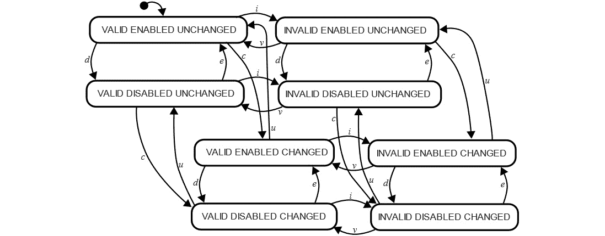
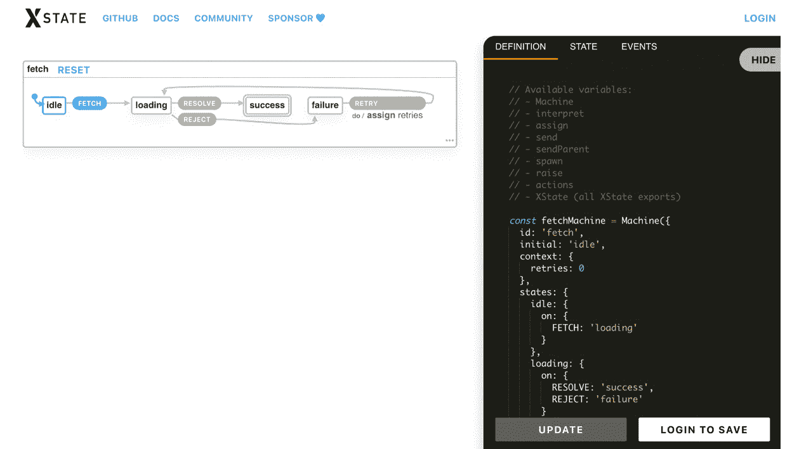
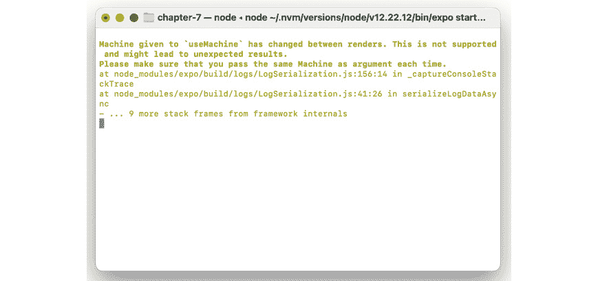
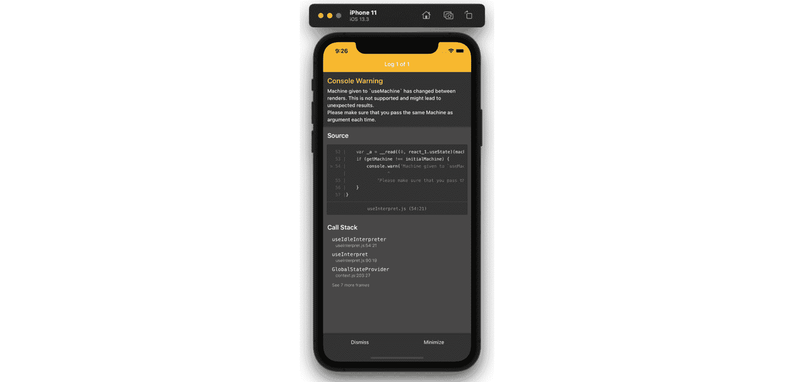

# 7

# 使用 XState 解开 React Native 应用中的复杂流程

在上一章中，我们了解了 **MobX**——React 生态系统中最受欢迎的状态管理库之一。MobX 引入了一些新概念，例如使用状态管理器派生的状态值。其他高级概念与 **Redux** 相似——例如将状态表示为纯 **JavaScript** 对象。现在我们将关注 React 状态管理领域的第一个例外：**XState**。XState 将状态视为一个有限机，而不是一个对象。如果你还没有听说过这个术语，不要担心，我们将在本章的第一节中介绍有限机的话题。

我们将首先探讨 XState 基本理念的理论方面：状态机。然后我们将讨论 XState 的其他高级概念——状态图、动作和 XState 可视化器。当我们对理论感到满意时，我们将在 Funbook 应用中配置 XState，然后我们将实现 XState 以管理应用中的点赞图片。

本章涵盖了以下完整列表：

+   什么是有限状态机？

+   XState 是什么——高级概念

+   在 Funbook 应用中配置 XState

+   使用 XState 为 `FavoritedImages` 界面

到本章结束时，你将能够理解和使用 XState 作为你项目的状态管理解决方案。你将了解什么是状态机以及它与在其他状态管理库中使用的状态对象有何不同。我希望你也会开始看到你更喜欢使用的解决方案。

# 技术要求

为了跟随本章的内容，你需要了解一些 JavaScript 和 **ReactJS** 的知识。如果你至少阅读了本书的 *第一章* 到 *第四章*，你应该能够无任何问题地继续前进。

随意使用你选择的 IDE，因为 React Native 不需要任何特定功能。目前，前端开发者中最受欢迎的 IDE 是微软的 VS Code、Atom、Sublime Text 和 WebStorm。

本章提供的代码片段是为了说明我们应该如何使用代码——它们并不提供整个画面。为了更好地跟随编码，请在你的 IDE 中打开 GitHub 仓库并查看其中的文件。你可以从名为 `example-app-full` 或 `chapter-7` 的文件夹中的文件开始。如果你从 `example-app-full` 开始，你将负责实现本章中描述的解决方案。如果你选择查看 `chapter-7`，你将看到我实现的整个解决方案。

如果你遇到困难或迷失方向，可以检查 GitHub 仓库中的代码：

[`github.com/PacktPublishing/Simplifying-State-Management-in-React-Native/tree/main/chapter-7`](https://github.com/PacktPublishing/Simplifying-State-Management-in-React-Native/tree/main/chapter-7).

# 什么是有限状态机？

如果我亲爱的读者要求你猜测有限状态机是什么，你可能会说它们与在应用程序中管理状态有关。毕竟，整本书都是关于这个主题的！

有趣的是，有限状态机与应用程序无关；它们与 React 或编程本身都无关。有限状态机是一种计算数学模型。它是一个抽象概念，可以应用于现实生活中的对象或问题，并且代表一个在任何给定时间可以处于有限多个状态之一的状态机。预定义的状态可以根据某些用户输入从一种状态改变到另一种状态。交通灯是一个简单的有限状态机示例：交通灯可以是绿色、红色或黄色，但任何时候都不应该显示两种颜色。另一个简单的状态机示例是电梯。电梯的默认状态是门关闭时静止不动。当用户按下召唤电梯的按钮时，电梯转换到运动状态。当它到达正确的楼层时，它会打开和关闭门。然后电梯回到默认的空闲状态，等待下一个用户输入。

如果你希望了解更多关于这个理论概念的信息，你将在“进一步阅读”部分找到一个关于有限状态机的非常详尽的*维基百科*页面链接。至于这本书，现在是时候找出我们为什么要讨论这个概念了。你能猜到吗？我敢打赌你能！有限状态机是我们在本章中分析的状态管理库的基本概念：XState。

# 什么是 XState – 高级概念

现在我们已经掌握了有限状态机的理论概念，我们可以继续讨论 XState 及其主要概念：有限状态机！但这次，我们将从在应用程序中管理全局状态的角度来看待它。

当使用 XState 来管理应用程序的全局状态时，我们应该把我们的状态视为一个有限状态机。这意味着放弃之前将状态表示为普通 JavaScript 对象的概念。在 XState 中，一个组件或一个界面是一个可以处于多个预定义状态之一的机器。让我们考虑用户登录流程。我们的整个应用程序可以处于两种状态之一：用户已登录或用户未登录。我们还需要一个转换机制，让用户可以从一个状态移动到另一个状态。对于**主页**界面上的图片也是如此。每张图片要么处于“喜欢”状态，要么处于“不喜欢”状态。用户可以通过点击图片下方的爱心图标来改变图片的当前状态。

除了有限状态机之外，XState 还使用了两个其他重要概念：**状态图**和**演员模型**。状态图基本上是可以用来表示状态机的绘图。以下是一个表示灯泡状态和转换的状态图示例：


图 7.1 – 简单状态图绘制灯开关

上述图示是一个非常简单的状态机。当在移动应用上工作时，您可能会发现自己正在处理更复杂的状态机。从一个非常简单的事物，比如一个表单开始，您可能会在多个元素上添加多个状态，例如启用/禁用、有效/无效和清洁/脏。没有状态图，您将面临状态爆炸。虽然听起来很有趣，但在应用中面对这种情况并不好。让我们看看使用状态转换绘制出的复杂输入示例：



图 7.2 – 复杂状态图

用户点击一个有效的输入并进入**有效启用未更改**状态。应用会自动过渡到**无效启用未更改**状态。当用户提供一些输入时，应用将处于**无效启用更改**状态。如果用户提供的输入有效，我们将进入**有效启用更改**状态；如果不有效，我们将返回到**无效启用更改**状态。如果用户在表单中点击其他内容——比如说，一个禁用第一个输入的单选框？我们将进入**无效**（或**有效**）**禁用更改**状态。对这个图表进行推理相当困难。这就是状态图特性发挥作用的时候。状态图提供了并行状态、层次结构和守卫的实现。您可以在 XState 文档中推荐的这篇文档中了解更多关于这些概念的信息：[`statecharts.dev/state-machine-state-explosion.html`](https://statecharts.dev/state-machine-state-explosion.html)。

XState 背后的最后一个重要概念是演员模型。这是一个计算数学模型，表明一切都是一个“演员”，并且可以执行三件事情：接收消息、发送消息以及处理接收到的消息。

我非常幸运能够就 XState 库的主题向其作者*大卫·库尔希德*提出几个问题。他告诉我他“*创建 XState 有两个原因：管理和可视化复杂逻辑。状态机和状态图是视觉形式化工具，擅长以直观的方式表示甚至是最复杂的流程和逻辑，并且我希望在 JavaScript 应用中使用它们的方式简单。*”他还补充说，XState 的高级理念受到了**万维网联盟**（**W3C**）**状态图 XML**（**SCXML**）规范的强烈影响。

让我们快速了解一下 SCXML 是什么，以及它为什么有一个 W3C 规范的含义。根据你在编程方面的经验，你可能已经听说过 **可扩展标记语言**（**XML**）的文件格式和标记语言。XML 用于存储、传输和重建数据。当正确缩进和格式化时，XML 文件易于阅读，因为它们只是描述数据。SCXML 是 XML 的一个堂兄弟。它是一种基于 XML 的标记语言，用于提供基于状态机的环境。它有一个 W3C 规范的事实意味着它可以有信心地用于各种与互联网相关的程序。你可以在 *进一步阅读* 部分找到整个 W3C 规范的链接。

回到 XState，它不仅受到了 SCXML 的影响，而且与 SCXML 完全兼容，这意味着你可以编写一个描述状态的 SCXML 文档，并且它将与你的 React Native 应用中的 XState 实现一起工作。你还可以用 JavaScript 编写它。无论什么让你感到兴奋！

我向 David Khourshid 询问了他库的未来。XState 是一个开源项目，就像我们在本书中讨论的所有其他状态管理库一样。David 说维护 XState 和开发与 XState 相关的工具是他的全职工作。他正在为 XState 可视化器开发新的强大协作编辑工具。他说：“*XState 的下一个主要版本（版本 5）将拥有更多功能，更加模块化，并将“演员”作为一等公民。演员是可以发送和接收消息的实体，状态机只是演员可以拥有的许多行为之一。你还可以将演员表示为承诺、可观察对象、reducer 等，这将允许开发者使用 XState 的 API（和可视化工具）来处理所有逻辑，而不仅仅是* *状态机特定的逻辑。”*

你可能在前一段中注意到了对 XState 可视化器的提及。这个工具是使 XState 与其他状态管理库截然不同的东西。多亏了这个可视化器，你可以在应用中看到状态和状态之间转换的图形表示。你可以用它来规划新的应用或调试你正在工作的应用。你可以在 https://xstate.js.org/viz/ 找到这个可视化器。以下是一个示例屏幕截图，展示了它的样子：



图 7.3 – XState 可视化器的屏幕截图

大卫说，可视化器是他工作过的最难的事情之一。它始终处于进行中，已经经历了多次迭代。目前，它是一个“*基于 SVG 的 '画布'，内部包含 HTML。"* 尽管现在它有一定的交互性——你可以点击转换并观察状态如何变化——大卫说，“*使其交互式是另一个难度层，特别是对于拖放交互和修改状态图。"* 我个人对可视化器的最新版本非常兴奋。它已经多次帮助我规划我为应用（使用 XState）设计的最佳状态机。

在本节中，我们讨论了 XState 背后的主要思想。它们与我们之前分析的所有方法都不同。整个库基于有限状态机的数学概念。它还使用了状态图和演员模型背后的理论，以确保在复杂应用中管理状态可以有效地进行。现在，是时候看看这个库的实际应用了。让我们继续在 Funbook 应用中实现 XState。

# 在 Funbook 应用中配置 XState

让我们看看在真实应用中使用 XState 需要什么。如果你想亲自跟随，你可以复制 `example-app-full` 文件夹并将其用作起点。如果你想查看与本章相关的代码，请查看 `chapter-7` 文件夹：https://github.com/PacktPublishing/Simplifying-State-Management-in-React-Native/tree/main/chapter-7。

首先——我们需要将 XState 添加到项目中。你可以通过运行以下两个命令之一来实现：

```js
npm install xstate@latest --save
// or
yarn add xstate@latest --save
```

XState 本身是一个无偏见的库，就像 MobX 一样。这意味着它不是直接与 React 一起工作的。XState 文档有一个名为 *Recipes* 的部分，你可以在这里阅读有关使用 React 或其他 UI 库（如 Vue 或 Svelte）的实现。至于我们，我们需要添加与 React 相关的依赖项，`xstate-react`。让我们通过运行以下两个命令之一来实现：

```js
npm install xstate-react@latest –-save
// or
yarn add xstate-react@latest –-save
```

现在我们有了准备好的依赖项，让我们运行应用以确保一切按预期工作。如果一切正常，我们可以创建我们的第一个状态机。我们将从一个简单的例子开始：用户登录流程。在高层面上，这个流程中涉及的逻辑并不多。用户可以是登录或注销，他们从一个状态过渡到另一个状态，然后再返回：

```js
import { createMachine } from 'xstate';
export const userFlowMachine = createMachine({
  id: 'userFlow',
  initial: 'anonymous',
  states: {
    anonymous,
    authenticated,
  }
});
```

阅读代码相当逻辑。我们首先导入一个 `createMachine` 函数，然后调用它来创建我们的 `userFlowMachine` 实例。在 `userFlowMachine` 中，我们首先定义机器 ID 和初始状态。然后我们继续定义应用的两个可能状态。在我们的应用中，用户可以是匿名或认证的。但用户如何从一种状态过渡到另一种状态呢？让我们将这个功能添加到状态机中：

```js
import { createMachine } from 'xstate';
export const userFlowMachine = createMachine({
  id: 'userFlow',
  initial: 'anonymous',
  states: {
    anonymous: {
      on: {
        LOGIN: { target: 'authenticated' },
      }
    },
    authenticated: {
        on: {
            LOGOUT: { target: 'anonymous' },
          }
    },
  }
});
```

太好了！现在，用户可以处于 `anonymous` 状态，他们可以通过 `LOGIN` 转换来进入这个状态。在这个时候，他们将处于 `authenticated` 状态，他们可以通过 `LOGOUT` 转换来退出这个状态。你可以继续改进这个例子，通过添加一些 `LOGIN` 和 `LOGOUT` 转换的实现细节，或者可能是一个错误状态。但我现在将停止讨论这个特定的状态机，看看它应该如何在 React 应用中使用。

毫不奇怪，XState 文档建议使用 React Context 来管理 XState 的全局状态。幸运的是，我们现在对 React Context 已经有了很好的掌握，对吧？那么，让我们看看 XState 文档中的一个 React Context 示例：

```js
import React, { createContext } from 'react';
import { useInterpret } from '@xstate/react';
import { userFlowMachine } from './machines/userFlowMachine;
export const GlobalStateContext = createContext({});
export const GlobalStateProvider = (props) => {
  const userFlowService = useInterpret(userFlowMachine);
  return (
    <GlobalStateContext.Provider value={{ userFlowService }}>
      {props.children}
    </GlobalStateContext.Provider>
  );
};
```

嗯……这个 `useInterpret()` 函数是什么？它是从 `xstate-react` 导入的，是一个特殊的工具，用来确保在使用 React Context 时不会引起过多的重新渲染。`useInterpret()` 返回一个服务，即状态机的引用。根据 XState 文档：“*这个值永远不会改变，所以我们不需要担心* *浪费的重新渲染*。”

了解你的工具

每个工具都是基于如何使用它的想法而创造的。你可以拿一把锤子用木柄敲钉子，但你已经知道这不是锤子最好的使用方式。同样的规则也适用于 JavaScript 库。没有人天生就知道 JavaScript 库和工具。我们都必须阅读文档并学习我们工具的最佳实践。

我们有创建上下文的方法，现在，让我们看看 XState 使用说明。我们将需要订阅在应用根目录中定义的全局上下文服务。这样的订阅看起来是这样的：

```js
import React, { useContext } from 'react';
import { GlobalStateContext } from './globalState';
import { useActor } from '@xstate/react';
export const SomeComponent = (props) => {
  const globalServices = useContext(GlobalStateContext);
  const [state] = useActor(globalServices. userFlowService);
    return state.matches('loggedIn') ? 'Logged In' :      'Logged Out';
};
```

我们已经在 React Native 应用中完成了 XState 的基本设置。现在有许多路径可以选择：提高性能、分发事件或使用状态选择器。我们将在下一节中介绍必要的步骤，我们将为 `LikedImages` 表面和负责添加喜欢图片的模态设置 XState。

# 使用 XState 处理 FavoritedImages 表面

在上一节中，我们设置了一个基本的机器，可以用来控制应用中的用户流程。现在让我们添加一个新的机器，用于我们的实际应用场景：在一个社交媒体克隆应用中喜欢图片。

我们将首先创建一个**最小可行产品**（**MVP**）的机器：

```js
// src/machines/likeImagesMachine.js
import { createMachine } from "xstate";
export const likeImagesMachine = createMachine({
  id: "likeImagesMachine",
  context: {
    likedImages: [
       { Example Image Object 1},
       { Example Image Object 2}
       …
       ],
  },
  initial: "loading",
  states: {
    loading: {},
    ready: {},
    error: {},
  },
});
```

让我们从代码的顶部开始分析：我们首先导入`createMachine`函数，我们在`likeImagesMachine`函数的第一行使用它。我们设置机器的 ID 和上下文。记住，XState 上下文与 React 上下文不同。我们谈论了很多关于 ReactJS 上下文的内容；我们知道它可以用于在组件之间共享状态。XState 上下文是一个用于定量数据（如字符串、数组或对象）的容器，这些数据可能无限。喜欢的图片数组是这种数据的绝佳例子，这就是为什么我们将保持这个数组在我们的机器上下文中。为了测试目的，我们将向上下文中的默认`likedImages`数组添加一些图片。剩下的只是定义机器的状态和设置默认状态。简单易懂！

我们将首先创建和配置一个用于状态的包装器，借助 React 的上下文。一旦使用模拟数据正确设置好一切，我们将从我们的后端获取真实数据。获取数据后，我们将编写最后一段代码：使用 XState 管理喜欢的图片。

## 配置上下文和组件

现在是时候讨论第一种上下文类型了：React 上下文。我们在上一节中设置了一个巧妙的使用用户流程的上下文。我们将在这个上下文中添加喜欢的图片机器：

```js
// src/context.js
[…]
import { useInterpret } from "@xstate/react";
  import { likeImagesMachine } from "./machines/    likeImagesMachine ";
import { userFlow } from "./machines/userFlowMachine";
export const GlobalStateContext = createContext({});
export const useXStateContext = () => {
  const context = React.useContext(GlobalStateContext);
  if (context === undefined) {
    throw new Error(
        " useXStateContext must be used within a           GlobalStateContextProvider"
    );
  }
  return context;
};
export const GlobalStateProvider = (props) => {
  const likedImagesAppService = useInterpret(likeImagesMachine);
  const userFlowService = useInterpret(userFlow);
  const mergedServices = {
    likedImagesAppService,
    userFlowService,
  };
  return (
    <GlobalStateContext.Provider value={mergedServices}>
      {props.children}
    </GlobalStateContext.Provider>
  );
};
```

这是个很好的时机来改进我们在本章前一部分更理论性的部分中设置的基本上下文。我们将通过添加一个名为`useXStateContext`的新自定义钩子来实现这一点。在之前的章节中，我们讨论了使用自定义钩子和 React 上下文是最佳实践。在`GlobalStateProvider`函数中，我们通过 XState 提供的`useInterpret`自定义钩子添加了`likedImagesMachine`。我们将解释的机器合并并作为上下文值传递。上下文值的最后一部分是将组件包装在上下文中。我们必须将全局状态保持在应用的最顶层，以便`FavoritedImages`界面和`ImageDetailsModal`都能访问它。以下是你`App.js`的大致样子：

```js
// src/App.js
[…]
import {
  […]
    GlobalStateProvider
      } from "./src/context";
[…]
return (
    <SafeAreaProvider>
      <GlobalStateProvider>
        <UserStateContext.Provider value={userLoggedIn}>
[…]
```

让我们使用这个全新的机器，由 React 上下文解释，并在其自己的上下文中持有一些示例图片，在`FavoritedImages`界面中使用。喜欢的图片列表在`ListOfFavorites`组件中渲染，这就是我们将要更改的组件：

```js
// src/components/ListOfFavorties.js
import { useXStateContext } from "../context";
import { useActor } from "@xstate/react";
export const ListOfFavorites = ({ navigation }) => {
  const globalServices = useXStateContext();
    const [state] = useActor(globalServices.      likedImagesAppService);
    const [imageData, updateImageData] = useState       (state.context.likedImages);
//…
  return (
    //…
      <FlatList
        data={imageData}
//…
```

我们首先导入我们创建的用于轻松消费 React 上下文的自定义`useXStateContext`钩子。我们需要导入的第二件事是 XState 的`useActor`钩子。这是一个 React 钩子，它订阅来自给定解释状态机的发出的更改，由 XState 作者命名为“actor”。如果你访问 XState 文档，你将找到其他`useActor`函数的实现，这些实现针对 Svelte、Vue 和其他库进行了定制。这是因为 XState，就像 MobX 一样，在 UI 库方面持中立态度。

最后，我们需要在我们的组件中使用所有这些导入的项目。我们从 React 上下文中拉取数据，并通过`useActor`钩子订阅变化。我们可以直接使用`useActor`钩子返回的状态。然而，React Native 的`FlatList`需要非常清楚地了解数据变化以便更新。因此，我添加了一个`useState`钩子，包括`updateImageData`设置函数，一旦我们尝试动态地向此数组添加图像，它将非常有用。

说到动态性，是时候考虑通过 XState 进行数据获取了。但在我们继续之前，请确保使用当前更改运行您的应用程序，并确保您可以在`FavoritedImages`界面上看到`likeImagesMachine`函数的示例图像。如果您遇到任何错误，您可以查看您的终端窗口，因为许多 XState 错误都会在那里描述。它们也应该在您的手机模拟器或物理设备上可见。以下是在控制台和模拟器中同时可能看到的示例错误：



图 7.4 – 控制台和手机模拟器中的 XState 错误

## 获取图像数据

获取数据并不总是状态管理库的强项。毕竟，这并不是它们的基本职责。然而，在 XState 的情况下，获取数据却非常自然，因为每个 Promise 都可以被建模为一个状态机。从高层次来看，我们需要启动一个将处于默认的“加载”状态的功能。我们将等待它发生某些事情——要么解决要么拒绝——然后进入适当的“已解决”或“已拒绝”状态。以下是我们图像获取机器的构建过程：

```js
// src/machines/fetchMachine.js
import { createMachine, assign } from "xstate";
export const fetchImagesMachine = createMachine({
  id: "fetchImages",
  initial: "loading",
  context: {
    retries: 0,
    images: [],
  },
  states: {
    loading: {
      on: {
        RESOLVE: "success",
        REJECT: "failure",
      },
    },
    success: {
      type: "final",
    },
    failure: {
      on: {
        RETRY: {
          target: "loading",
          actions: assign({
            retries: (context, event) => context.retries+1,
          }),
        },
      },
    },
  },
});
```

您在这里看到的是一个非常简单的机器，准备描述从外部源获取数据的过程。我们有三个状态：初始的“加载”状态，以及“成功”和“失败”状态。您可以看到在“加载”状态中有两个动作，可以用来管理获取机制。在“失败”状态中还有一个“重试”动作。我们可以在应用程序中使用它，让用户在发生错误时手动尝试获取数据。就基本设置而言，这都很好，但我们需要了解如何调用实际的端点。为了做到这一点，我们将改变“加载”状态：

```js
//…
states: {
    loading: {
      invoke: {
        id: 'fetchImagesFunction',
        src: async () => {
          const response = await fetch(
            requestBase + "/john_doe/likedImages.json"
          );
          const imageData = await response.json();
          return imageData;
        },
        onDone: {
          target: "success",
          actions: assign((context, event) => {
            return {
              images: event.data,
            };
          }),
        },
        onError: {
          target: "failure",
          actions: assign({
              error: (context, event) => "Oops!                Something went wrong",
          }),
        },
      },
    },
```

为了代替可能需要手动调用的两个动作，我在`loading`状态中添加了`invoke`属性。这样，当机器被创建时，图片将自动加载，无需用户交互。`invoke`属性的值是一个包含要调用的函数的`id`和`src`属性的对象。可以调用 Promise、回调（可以发送和接收来自父机器的事件）——可以发送事件到父机器——以及整个机器。我们将保持简单，并在源中添加一个异步的`fetch`函数。你还可以在任何机器外部创建一个命名函数，并通过`src`调用它。我们还使用了`invoke`属性的两个可选值：`onDone`和`onError`。这两个转换在处理 Promise 时非常有用。它们像任何其他 XState 转换一样——包括动作和目标状态。两个动作都包含`assign`关键字。`assign`是一个更新机器上下文的函数。我们在这里使用它来将获取到的结果数据传递到上下文，以便我们可以在应用程序的后续操作中使用它。分配器函数有一些注意事项：它们必须是纯函数，并且必须遵循严格的顺序。如果你想了解更多关于它们的信息，请查看*进一步阅读*部分提供的链接。

如果一切顺利，你应该能够通过这个功能获取图片。但我们在`likeImagesMachine`函数中如何使用这些图片呢？记得我们刚才用过的`invoke`属性吗？我们将在`likeImagesMachine`的加载状态下使用相同的属性来调用这个获取机器，并通过`onDone`函数传递获取到的数据：

```js
// src/machines/likeImagesMachine.js
import { fetchImagesMachine } from "./fetchImagesMachine";
export const likeImagesMachine  = createMachine({
  id: "likeImagesMachine ",
  context: {
    likedImages: [],
    currentImage: null,
  },
  initial: "loading",
  states: {
    loading: {
      invoke: {
        id: "fetchImagesMachine",
        src: fetchImagesMachine,
        onDone: {
          target: "ready",
          actions: assign({
            likedImages: (context, event) => {
              return event.data.images;
            },
          }),
        },
      },
    },
//…
```

在这个代码片段中，我们导入了`fetchImagesMachine`函数，并在`likeImagesMachine`函数的加载状态下调用它。让我们更仔细地看看我们用来从`fetchImagesMachine`传递图像数据到这个父机器的分配器函数。它有一个`onDone`函数，当`fetchImagesMachine`达到其最终状态时将被调用。这个函数将调用机器返回的数据分配给`likeImagesMachine`的`context`，并通过`event`传递数据。你会注意到我们正在调用`event.data.images`。这从哪里来的？这是我们需要在`fetchImagesMachine`中添加的东西。到目前为止，该机器只将其获取到的数据传递到其`context`，但我们需要将其公开，以便父机器`likeImagesMachine`可以访问它。我们已经知道在父机器（`likeImagesMachine`）中，当子机器（`fetchImagesMachine`）达到其最终状态时，会调用`onDone`事件。在我们的例子中，最终状态是`success`。这就是我们可以添加`data`属性的地方：

```js
// src/machines/fetchImagesMachine.js
//…
success: {
      type: "final",
      data: {
        images: (context, event) => context.images,
      },
    },
//…
```

这段代码告诉 `fetchImagesMachine` 函数将其最终状态添加一个 `data` 对象。这是我们运行父级 `likeImagesMachine` 中的 `onDone` 时访问的对象。如果一切顺利，你现在应该能在你的应用程序中看到获取到的所有图像数组。这是一个在设备或模拟器上运行应用程序的好时机，如果你还没有这样做的话。

## 管理图像模态中的图像

我们已经有一个很好的设置——我们在获取图像并将它们提供给应用程序。不过，我们的应用程序相当静态。我们需要一种方法来向喜欢的图像数组中添加新图像。我们还希望检查图像是否被点赞，以便在 `ImageDetailsModal` 中显示适当的图标。

如果我们想知道图像是否应该被点赞或取消点赞，我们首先需要知道它是否已被点赞。但即使在我们知道图像是否已被点赞之前，我们还需要知道与该图像相关的所有数据。我们将在 `likeImagesMachine` 机器的上下文中添加一个新项目——`currentImage`：

```js
export const likeImagesMachine  = createMachine({
  id: "likeImagesMachine ",
  context: {
    likedImages: [],
    currentImage: null,
  },
//…
```

这是我们将存储当前查看图像信息的地方。上下文初始化为 `null`，我们需要添加一个将更新此上下文值的动作。我们将在 `likeImagesMachine` 的 `ready` 状态中添加一个名为 `MODAL_OPEN` 的新事件：

```js
// src/machines/likeImagesMachine
ready: {
      on: {
        MODAL_OPEN: {
          actions: assign((context, event) => {
            return {
              currentImage: event.payload,
            };
          }),
        },
        MODAL_CLOSE: {
          actions: assign((context, event) => {
            return {
              currentImage: null,
            };
          }),
        },
      },
//…
```

当 `ImageDetailsModal` 打开时，我们将调用 `MODAL_OPEN` 动作，当模态关闭时调用 `MODAL_CLOSE`——非常直接！您可以在以下链接中看到代码的实际应用：

```js
// src/surfaces/ImageDetailsModal.js
export const ImageDetailsModal = ({ navigation, route }) => {
  const globalServices = useXStateContext();
  const { send } = globalServices.likedImagesAppService;
  useEffect(() => {
    send({
      type: "MODAL_OPEN",
      payload: route.params.imageItem,
    });
    return () => {
      send("MODAL_CLOSE", {});
    };
  }, []);
```

我们首先使用一个名为 `useXStateContext` 的自定义钩子来消费我们之前设置的上下文值。然后，我们使用来自 `likedImagesAppService` 的 `send` 函数。最后，我添加了一个 `useEffect` 钩子，当模态渲染时调用 `MODAL_OPEN` 动作，并将 `MODAL_CLOSE` 作为清理函数。

现在我们已经将当前图像保存在机器上下文中，我们可以检查它是否受欢迎。为此，我们将使用来自 XState 的另一个实用工具：一个名为 `useSelector` 的自定义钩子。**选择器**这个名称可能对你来说很熟悉。在 JavaScript 中，有查询选择器，Redux 推崇使用选择器函数，还有 CSS 选择器。XState 选择器在意识形态上与 Redux 中的选择器最为接近。它们是特殊的函数，接收当前状态并根据某些条件返回一个值。我们的当前状态是图像数组以及当前图像，条件是当前图像是否在图像数组中。代码在下面的代码片段中展示：

```js
const isImageLikedSelector = (state) => {
  if (!state.context.currentImage) {
    return;
  }
  const checkIfInImagesArray = state.context.likedImages.find(
      (image) => image.itemId === state.context.currentImage.        itemId
  );
  return !!checkIfInImagesArray;
};
```

如前所述，这个选择器将接收当前状态作为第一个参数。我们首先检查图片数组不是 `null`。我们在该数组上运行 `find` 函数，如果它是 `null` 或 `undefined`，这会导致应用程序崩溃。一旦我们确定图片数组存在，我们就可以通过当前图片过滤它。你可以把这个函数放在任何你想放的地方（与机器相同的文件中，在名为 `selectors` 或 `utilities` 的文件中，等等），然后将其导入到 `ImageDetailsModal`：

```js
// src/surfaces/ImageDetailsModal.js
export const ImageDetailsModal = ({ navigation, route }) => {
  const globalServices = useXStateContext();
  const { send } = globalServices.globalAppService;
  const isImageLiked = useSelector(
    globalServices.globalAppService,
    isImageLikedSelector
  );
```

`isImageLiked` 常量可以在组件中使用，以检查应该显示哪个图标以及应该调用哪个动作（点赞或取消点赞）。

## 点赞图片

我们的状态机了解我们已获取并显示在 `FavoritedImages` 表面上的图片数组。它们也通过 `MODAL_OPEN` 动作了解到当前查看的图片。现在，我们需要告诉它们如果有人按下“点赞”按钮应该怎么做。让我们向 `likeImagesMachine` 函数添加一个新的动作：

```js
// src/machines/likeImagesMachine.js
//…
ready: {
      on: {
        LIKE: {
          actions: assign((context, event) => {
            const updateImageArray = event.payload.concat(context.likedImages);
            return {
              likedImages: updateImageArray,
            };
          }),
        },
//…
```

我们正在使用之前遇到过的分配器函数。在其内部，我们将只包含当前图片的数组连接到所有图片的完整数组。这样，新添加的图片就会位于数组的顶部，并在 `FlatList` 的顶部。现在，动作已经准备好了，我们可以在模态中调用它，如下所示：

```js
// src/surfaces/ImageDetailsModal
//…
<Pressable
          onPress={() => {
            if (!isImageLiked) {
                send({ type: "LIKE", payload:                  [route.params.imageItem] });
            }
//…
```

我们已经做了很多更改——让我们在我们的应用程序中测试它们。如果你一直跟着做，你应该能看到获取的图片在 `FavoritedImages` 表面上正确加载。`ImageDetails` 模态也正确打开，显示已点赞图片的完整心形，未点赞图片（在 `Feed` 表面上）显示为空心形。我们甚至可以按下空心形，它会变成实心！点赞动作和选择器按预期工作！太棒了！

很不幸，`FlatList` 有点固执。正如之前提到的，`FlatList` 需要显式的数据更改才能重新渲染，而如果我们想看到新添加的图片，我们就需要它重新渲染。我们不得不稍微“扭动它的手”，通过添加这个 `useEffect` 钩子：

```js
// src/components/ListOfFavorites
export const ListOfFavorites = ({ navigation }) => {
  const globalServices = useXStateContext();
  const [state] = useActor(globalServices.globalAppService);
  const [imageData, updateImageData] = useState([]);
  useEffect(() => {
    updateImageData(state.context.likedImages);
  }, [state.context.likedImages]);
//…
```

现在，一切应该都能完美工作！是时候给自己鼓掌了！在本节中，我们涵盖了大量的主题。我们讨论了多个状态机的实际应用，调用获取函数，在机器之间传递上下文值，调用动作和使用选择器。有了这些知识，你应该能够配置任何应用程序以使用 XState 作为状态管理库。

# 摘要

XState 是本书中第一个基于数学原理的基本状态管理库。我们简要地讨论了这些原理，因为理解它们对于理解 XState 非常有用。最重要的概念是状态机。在数学的世界里，它们并不新鲜；然而，当我们谈到移动应用中的全局状态时，它们却相当新颖。一旦我们掌握了理论，并发现了非常有用的 XState 可视化工具，我们就准备好进行实际工作了。我们在 Funbook 应用中设置了 XState，使用了 XState 文档中描述的最佳实践。我们探讨了将 XState 作为全局状态解决方案来管理点赞图片用例的实现。我们研究了使用 XState 获取数据和更改数据。我希望你们喜欢它！现在，是时候继续我们的旅程，探索状态管理库世界中的下一个异常值：**Jotai**。

# 进一步阅读

+   [`brilliant.org/wiki/finite-state-machines/`](https://brilliant.org/wiki/finite-state-machines/): 有限状态机。

+   https://www.w3.org/TR/scxml/: W3C SCXML 规范。

+   https://xstate.js.org/docs/recipes/react.html#local-state: XState 菜谱。

+   https://xstate.js.org/docs/guides/context.html#assign-action: 分配动作。
