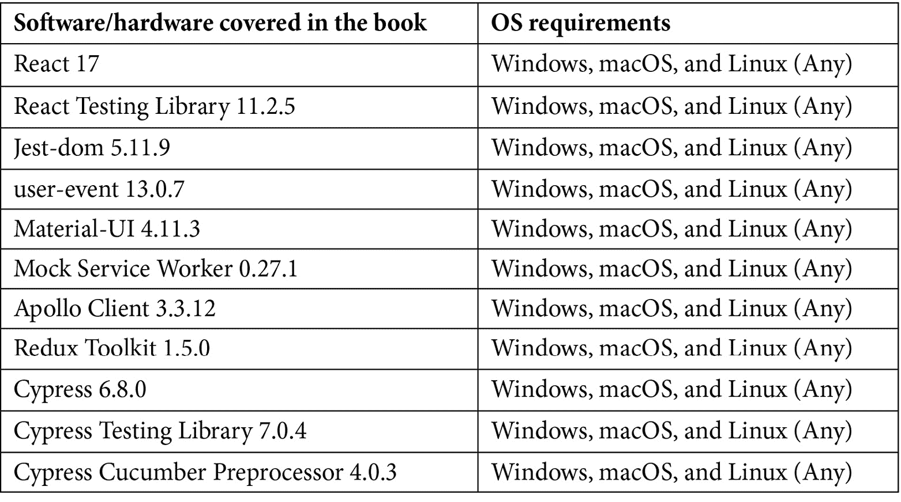

# 前言

**React 测试库**（**RTL**）是一个轻量级且易于使用的工具，用于测试组件的 **文档对象模型**（**DOM**）输出。本书将向您展示如何利用这个现代、用户友好的工具来测试 React 组件，并解释其如何降低 React 应用程序中的风险。

本书展示了代码片段，让您能够轻松实现 RTL，帮助您了解 DOM 测试库的指导原则，从用户的角度编写测试。您将探索从实际使用您组件的个人角度测试组件的优势，并使用 **测试驱动开发**（**TDD**）来驱动编写测试的过程。随着您的进步，您将发现如何将 RTL 添加到 React 项目中，使用 Context API 测试组件，以及如何使用流行的 Cypress 库编写 UI 端到端测试。在整个书中，您将通过实际示例和有用的解释来创建测试，确保在做出更改时测试不会中断。

在完成这本 React 书籍后，您将学会所有测试 React 组件所需的知识，并能轻松地进行测试。

# 这本书面向谁？

这本书是为那些想要了解使用最新测试工具 RTL 测试 React 组件的现代实践的软件工程师、质量工程师和 React 开发者而编写的。为了充分利用本书，需要具备基本的 React 开发知识。

# 这本书涵盖了哪些内容？

*第一章*，*探索 React 测试库*，将帮助您了解 DOM 测试库的指导原则，从用户的角度编写测试。您将学习实施细节导向测试的缺点。最后，您将学习使用 jest-dom 通过 RTL 来增强我们的测试的优势。

*第二章*，*与 React 测试库一起工作*，将教会您如何将 RTL 添加到 React 项目中。您将学习如何使用 API 正确构建测试结构。您将查看呈现组件并编写一些初始测试。最后，我们将学习如何使用调试方法来帮助我们编写测试。

*第三章*，*使用 React 测试库测试复杂组件*，将帮助您了解如何测试更复杂的 React 组件。您将学习如何使用 Fire Event 和用户事件模块来模拟用户交互。您将学习如何使用 TDD 来驱动编写测试的过程。最后，您将单元测试与 API 交互的组件。

*第四章*，*在您的应用程序中集成测试和第三方库*，教您如何在各种 React 应用程序中测试组件。您将学习如何测试集成组件以及如何使用 Context API 测试组件。最后，您将使用如 GraphQL 和 Redux 等流行的第三方库测试组件。

*第五章*，*使用 React Testing Library 重构遗留应用程序*，将教您在重构遗留 React 应用程序时处理破坏性更改的策略。您将学习如何在生产包更新时使用 RTL 测试来引导您解决破坏性更改。您还将学习如何将使用 Enzyme 或 ReactTestUtils 编写的测试转换为 RTL。

*第六章*，*实现用于测试的额外工具和插件*，将帮助您学习额外的工具，以增强使用 RTL 测试 React 应用程序的能力。

*第七章*，*使用 Cypress 进行端到端 UI 测试*，将教您如何使用流行的 Cypress 库编写端到端 UI 测试。您将学习设计模式来构建您的测试。您将学习如何使用 Cypress 测试 API。最后，您将学习如何将 Cucumber 和 React Developer Tools 集成到您的测试套件中。

# 为了充分利用本书

您需要在计算机上安装 NodeJS 和 npm——如果可能的话，安装最新版本。所有代码示例都已使用 macOS Big Sur 版本 11.2.3 上的 RTL 版本 11.2.5 进行测试。然而，它们也应该适用于未来的版本发布。



您可以使用任何代码编辑器来编写章节示例。然而，为了在运行示例时增强您的体验，我们为 VSCode 编辑器提供了建议的扩展。

**如果您正在使用本书的数字版，我们建议您亲自输入代码或通过 GitHub 仓库（下一节中提供链接）访问代码。这样做将帮助您避免与代码复制/粘贴相关的任何潜在错误。**

# 下载示例代码文件

您可以从[www.packt.com](http://www.packt.com)的账户下载本书的示例代码文件。如果您在其他地方购买了本书，您可以访问[www.packtpub.com/support](http://www.packtpub.com/support)并注册，以便将文件直接通过电子邮件发送给您。

您可以通过以下步骤下载代码文件：

1.  在[www.packt.com](http://www.packt.com)登录或注册。

1.  在**支持**选项卡中选择。

1.  点击**代码下载**。

1.  在**搜索**框中输入书籍名称并遵循屏幕上的说明。

文件下载完成后，请确保使用最新版本解压缩或提取文件夹：

+   适用于 Windows 的 WinRAR/7-Zip

+   适用于 Mac 的 Zipeg/iZip/UnRarX

+   适用于 Linux 的 7-Zip/PeaZip

本书代码包也托管在 GitHub 上，网址为 [`github.com/PacktPublishing/Simplify-Testing-with-React-Testing-Library`](https://github.com/PacktPublishing/Simplify-Testing-with-React-Testing-Library)。如果代码有更新，它将在现有的 GitHub 仓库中更新。

我们还有其他来自我们丰富图书和视频目录的代码包可供在 [`github.com/PacktPublishing/`](https://github.com/PacktPublishing/) 上找到。查看它们吧！

# 下载彩色图像

我们还提供了一份包含本书中使用的截图/图表彩色图像的 PDF 文件。您可以从这里下载：[`static.packt-cdn.com/downloads/9781800564459_ColorImages.pdf`](https://static.packt-cdn.com/downloads/9781800564459_ColorImages.pdf)（_ColorImages.pdf）。

# 使用的约定

本书使用了多种文本约定。

`文本中的代码`：表示文本中的代码单词、数据库表名、文件夹名、文件名、文件扩展名、路径名、虚拟 URL、用户输入和 Twitter 昵称。以下是一个示例：“将下载的 `WebStorm-10*.dmg` 磁盘映像文件作为系统中的另一个磁盘挂载。”

代码块设置如下：

```js
html, body, #map {
 height: 100%; 
 margin: 0;
 padding: 0
}
```

当我们希望您注意代码块中的特定部分时，相关的行或项目将被设置为粗体：

```js
[default]
exten => s,1,Dial(Zap/1|30)
exten => s,2,Voicemail(u100)
exten => s,102,Voicemail(b100)
exten => i,1,Voicemail(s0)
```

任何命令行输入或输出都应如下编写：

```js
$ mkdir css
$ cd css
```

**粗体**：表示新术语、重要单词或您在屏幕上看到的单词。例如，菜单或对话框中的单词在文本中显示如下。以下是一个示例：“从 **管理** 面板中选择 **系统信息**。”

小贴士或重要注意事项

看起来像这样。

# 联系我们

我们始终欢迎读者的反馈。

**一般反馈**：如果您对本书的任何方面有疑问，请在邮件主题中提及书名，并将邮件发送至 customercare@packtpub.com。我们在此表示感谢。

**勘误**：尽管我们已经尽最大努力确保内容的准确性，但错误仍然可能发生。如果您在本书中发现错误，我们将不胜感激，如果您能向我们报告，请访问 [www.packtpub.com/support/errata](http://www.packtpub.com/support/errata)，选择您的书，点击勘误提交表单链接，并输入详细信息。

**盗版**：如果您在互联网上发现我们作品的任何非法副本，无论形式如何，如果您能提供位置地址或网站名称，我们将不胜感激。请通过 copyright@packt.com 与我们联系，并提供材料的链接。

**如果您想成为一名作者**：如果您在某个领域有专业知识，并且对撰写或参与一本书感兴趣，请访问 [authors.packtpub.com](http://authors.packtpub.com)。

# 评论

请留下您的评价。一旦您阅读并使用了这本书，为何不在购买它的网站上留下评价呢？潜在读者可以查看并使用您的客观意见来做出购买决定，我们 Packt 可以了解您对我们产品的看法，而我们的作者也可以看到他们对书籍的反馈。谢谢！

如需了解 Packt 的更多信息，请访问[packt.com](http://packt.com)。
