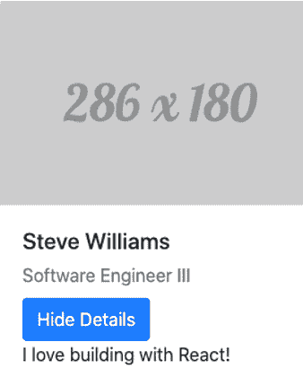
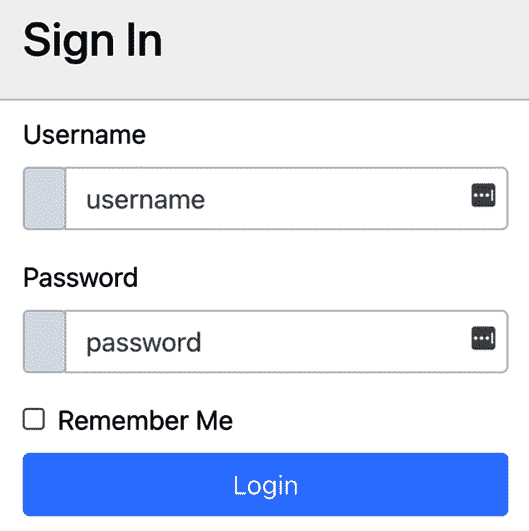
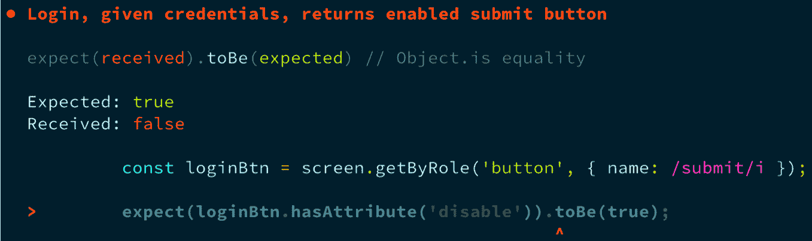
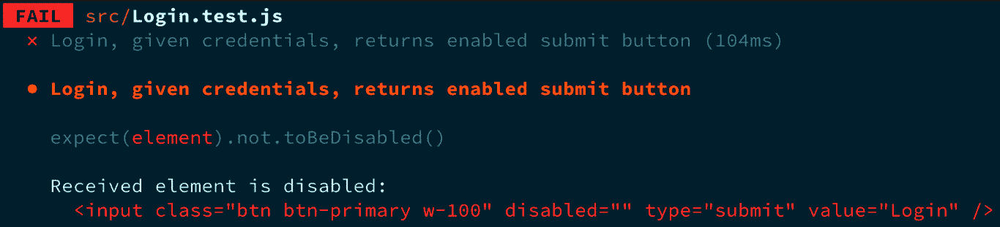
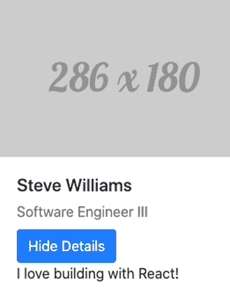

# *第一章*: 探索 React 测试库

**React 测试库** 是一个用于测试 React 组件 UI 输出的现代工具。它抽象了很多样板代码，使你能够编写更易于阅读的代码，并允许你测试代码。该库鼓励你远离测试实现细节，以避免许多错误的否定和错误的肯定测试用例。相反，该库的工具 API 使你能够轻松编写模拟实际用户行为的测试用例，从而对应用程序按预期工作有信心。此外，由于该库敦促你在编写测试时关注用户，因此你不需要在重构代码的实现细节时不断更新失败的测试。React 测试库允许你编写在关键功能意外更改时失败的测试，从而提供更多价值。

到本章结束时，你将了解实现细节是什么以及它们在测试用例的维护和价值方面带来的缺点。多年来，团队通过关注代码的实现细节来测试他们的组件已经成为一种常见的做法。许多团队至今仍在使用这种方法。然而，在本章中，我们将介绍更好的测试组件的方法。你将学习如何通过理解如何从用户的角度转变思维来测试，从而增强你的测试用例规划信心。我们将介绍 **文档对象模型** (**DOM**) 测试库背后的理念，以简化测试任务，在转向主要关注点，即库的 React 版本之前。

接下来，你将学习关于 Jest 测试框架，该框架负责执行和断言我们的测试输出。最后，你将学习如何安装和使用 `jest-dom` 工具来增强测试断言。

本章将涵盖以下主要内容：

+   了解 DOM 测试库

+   理解 Jest 在测试 React 应用程序中的作用

+   了解使用 `jest-dom` 测试 Jest 的 React 应用程序的优点

+   理解以实现细节为重点的测试的缺点

本章的教训将为理解你将如何在本书中使用 React 测试库来编写更好的、关注用户视角的测试奠定基础。本章获得的知识将帮助你在编写 React 应用程序的测试时，无论是新手还是经验丰富的测试人员寻找更好的验证代码按预期工作的方式。

# 技术要求

对于本章的示例，你需要在你的机器上安装 Node.js。你可以在这里找到本章的代码示例：[`github.com/PacktPublishing/Simplify-Testing-with-React-Testing-Library/tree/master/Chapter01`](https://github.com/PacktPublishing/Simplify-Testing-with-React-Testing-Library/tree/master/Chapter01)。

# 介绍 DOM 测试库

**DOM 测试库**是由 Kent C. Dodds 和众多贡献者创建的一系列工具集合，旨在在我们测试应用程序 UI 时从真实用户的视角出发时使我们的工作更加轻松。本节将为您概述该库如何帮助使关注用户视角的测试工作变得更加容易。

## 什么是 DOM 测试库？

DOM 测试库使得像真实用户一样测试应用程序的 UI 变得更加容易，从而增强我们对应用程序按预期为用户工作的信心。没有方法可以获取组件的状态值或直接调用组件方法。

该库鼓励您以所有用户都可以使用的方式选择 DOM 元素。库的 API 包括关注可访问性的查询方法，允许您以需要屏幕阅读器或其他辅助技术来导航应用程序的残疾用户一样与 DOM 交互。例如，假设您想在测试中选择以下元素：

```js
<input
  type="text"
  id="firstname"
  placeholder="first name..."
>
```

在前述代码中，我们有一个类型为 `"text"` 的输入元素。您可以使用 DOM 测试库通过其占位符值 `"First Name..."` 来在屏幕上选择该输入元素：

```js
screen.getByPlaceholderText(/first name/i) 
```

`getByPlaceholderText` 方法用于从屏幕对象中选择 DOM 元素，通过前述代码中的占位符值来选择。屏幕对象允许您选择附加到 DOM 的 body 元素上的元素。注意查询中使用的正则表达式。用户可能不会在意文本是大写还是小写，因此 DOM 测试库允许您通过文本值来搜索元素，而不考虑大小写。

能够根据元素文本值选择元素，而不考虑其大小写，这增加了测试在元素实现细节发生变化时仍能保持通过结果的能力。使用 `getByPlaceholderText` 方法是选择元素的好方法，但我们可以通过重构源代码来更加具体：

```js
<label for="firstname">First name:</label>
<input
  type="text"
  id="firstname"
  name="firstname"
  placeholder="first name..."
>
```

在前述代码中，我们添加了一个 `label` 元素和一个可访问的 `name` 属性到输入元素。现在所有用户，包括使用屏幕阅读器的用户，都可以访问该元素。我们可以在测试中这样选择输入元素：

```js
screen.getByRole('textbox', {
  name: /first name:/i
})
```

在前述代码中，我们使用 `getByRole` 方法通过具有 `first name` 名称的文本框角色来选择元素。当可用时，通过角色选择元素是 DOM 测试库中首选的选择元素方式。

该库非常灵活，您可以使用它与任何提供访问 DOM 的 API 的 JavaScript 测试运行器一起使用，例如 Mocha 或 Jest。本书中我们将使用 Jest 运行我们的测试，并在下一节中了解更多关于它的信息。DOM 测试库有许多针对流行 UI 框架和库的特定版本。

特定版本为 DOM Testing Library 的 API 添加了额外功能，以便更方便地使用。例如，要将待测试的 React 组件放入 DOM 中，我们可以使用 `ReactDOM` 的 `render` 方法将组件放入一个附加到 DOM 的元素中：

```js
const div = document.createElement('div');
ReactDOM.render(<SomeComponent />, div);
document.body.appendChild(div);
screen.getByText('Login');
```

在前面的代码中，首先，我们创建一个 `div` 元素。接下来，我们将 `SomeComponent` 组件附加到 `div` 元素上。然后，我们将 `div` 元素附加到 DOM 的 `body` 元素上。最后，我们使用 DOM Testing Library 的 `screen` 对象的 `getByText` 方法来查找具有文本值 `Login` 的元素。如果我们使用 React Testing Library，我们可以将前面代码中的前三行替换为 `render` 方法：

```js
render(<SomeComponent />);
```

在前面的代码中，我们使用 React Testing Library 的 `render` 方法自动将待测试的组件渲染到 DOM 中。我们将在本书中展示如何使用库的 React 版本。甚至支持许多流行的端到端测试框架，例如 Cypress ([`www.cypress.io/`](https://www.cypress.io/))，我们将在 *第七章*，*使用 Cypress 进行端到端 UI 测试* 中介绍。该库提供了一个用于增强 Jest 测试断言的实用工具，我们将在本章后面介绍。

接下来，我们将介绍 DOM Testing Library 背后的指导原则。

## 指导原则

DOM Testing Library 通过提供易于使用的 API 来驱动，以测试你在 DOM 中渲染的应用程序。这些工具有助于让你有信心，你的测试代表了实际用户可能采取的操作。例如，你可能构建一个允许客户订阅你的时事通讯的电子邮件表单，如下所示：


图 1.1 – 订阅表单组件

因为你想确保表单能正常工作，所以你会考虑潜在订阅者在与表单交互时可能采取的步骤。你心想，*如果我是用户，首先，我可能会寻找一个名为“电子邮件地址”的标签或一个上面写着“输入电子邮件”的占位符*。DOM Testing Library 有一个名为 `getByLabelText` 的方法，可以快速通过屏幕上显示的标签找到电子邮件输入框。DOM Testing Library 还有一个名为 `getByPlaceholderText` 的方法，允许你通过其占位符值定位输入框。

在输入电子邮件后，你心想，*接下来，我会寻找一个上面写着“订阅”的按钮并点击它*。DOM Testing Library 提供了一个名为 `getByText` 的方法，允许你通过文本值来查找按钮。此外，该库还提供了一个名为 `getByRole` 的方法，允许你通过 `subscribe` 文本值来查询具有 `button` 角色的 DOM 元素。

现在你已经了解了 DOM Testing Library 的一般概念，我们将在下一节讨论我们将用于执行测试用例的框架。

# 使用 Jest 执行测试用例

**Jest** 是由 Facebook 团队创建的 JavaScript 测试框架。在本节中，我们将简要介绍 Jest 以及如何使用它来验证 React 组件测试用例的输出。

## 使用 Jest 运行测试

大多数 React 项目都使用 Jest 进行测试，因此在学习 React 测试库的同时介绍这个工具是有意义的。当我们使用 React 测试库编写测试时，我们需要一个测试运行器来执行测试。

使用以下命令在您的项目中安装 Jest：

```js
npm install --save-dev jest
```

我们将使用 Jest 运行我们的 React 测试。从高层次来看，Jest 提供了 `describe`、`it`、`test` 和 `expect` 函数来组织和执行测试。你可以把 `describe` 函数看作是一个测试套件。使用 `describe` 函数来组织特定组件的相关测试。`it` 和 `test` 函数是针对特定测试的。`it` 和 `test` 函数是可以互换的函数，用于存放和运行单个测试用例的代码。使用 `expect` 函数来断言预期的输出。Jest 还提供了模拟函数来处理测试范围之外的代码和覆盖率报告。使用 Jest 编写的测试可以像测试纯函数的输出一样简单。

在以下示例中，我们使用 `test` 和 `expect` 函数来断言提供的名称中的字符总数：

```js
test('should return the total number of characters', () => {
  function totalCharsInName(name) {
    return name.length;
  }
  expect(totalCharsInName('Steve')).toEqual(5);
});
```

让我们看看一个示例测试，该测试将断言使用类式 React 组件创建的 `Profile` 组件的详细信息。`Profile` 组件接受员工信息，并在 DOM 中将其显示为卡片式元素。用户可以点击按钮来在屏幕上隐藏或显示员工的详细信息。以下是组件 DOM 输出的截图：



图 1.2 – 配置组件

让我们看看 `Profile` 组件的代码。我们创建一个带有 `showDetails` 属性的 `state` 对象，初始值设置为 `true`。接下来，我们创建一个 `setDetails` 方法，该方法将更新 `showDetails` 的 `state` 值：

```js
import React, { Component } from 'react';
export default class Profile extends Component {
  state = { showDetails: true };
  setDetails = () => {
    this.setState((prevState) => ({ showDetails: !prevState.      showDetails }));
  };
```

在 `render` 方法内部，我们显示传递给组件的 `name` 和 `title` 属性：

```js
render() {
    return (
      <div className="card" style={{ width: "18rem" }}>
        
        <div className="card-body">
          <h5 className="card-title">{this.props.name}</h5>
          <p className="card-subtitle mb-2 text-muted">{this.             props.title}</p>
```

注意，`src` 图像只是一个占位符图像，但理想情况下应该接受传递的值，例如 `name` 和 `title` 属性值。

最后，我们有一个按钮，当点击时将调用 `setDetails` 方法。按钮的文本设置为 `Hide Details` 或 `Display Details`，这取决于 `state.showDetails` 的值。此外，根据 `state.showDetails` 的值显示员工详细信息：

```js
button onClick={this.setDetails} className="btn btn-primary">
            {this.state.showDetails ? "Hide Details" : "Display                  Details"}
          </button>
          {this.state.showDetails ? (
            <p className="card-text details">{this.props.                  details}</p>
          ) : null}
        </div>
      </div>
    );
  }
}
```

现在，让我们看看一个 `Profile` 组件测试的代码，该测试验证当点击带有文本 `"hide details"` 的按钮时，显示带有文本 `"display details"` 的按钮：

```js
test('Profile, given click "hide details" button, shows "display details" button', () => {
  const div = document.createElement('div');
  ReactDOM.render(
    <Profile
      name='John Doe'
      title='Team Lead'
      details='This is my 5th year and I love helping others'
    />,
    div
  );
document.body.appendChild(div);
```

在前面的代码中，我们创建了一个 `div` 元素，稍后将与测试组件一起使用。然后，我们使用 `ReactDOM` 的 `render` 方法将带有传入属性的 `Profile` 组件渲染到 `div` 中。最后，我们将包含组件的 `div` 添加到 DOM 的 `body` 元素中。接下来，我们对生成的 DOM 输出执行操作：

```js
  const hideDetailsBtn = screen.getByRole('button', { name: /     hide details/i });
  fireEvent.click(hideDetailsBtn);
  const displayDetailsBtn = screen.getByRole('button', {
    name: /display details/i,
  });
```

在前面的代码中，首先我们获取名为 `hide details` 的按钮。然后，我们在 `hide details` 按钮上触发一个点击事件。接下来，我们获取名为 `display details` 的按钮。然后，我们将进行断言：

```js
  expect(displayDetailsBtn).toBeTruthy();
  // Test cleanup
    div.remove();
});
```

在前面的代码中，首先，我们期望 `display details` 按钮为 *truthy*，这意味着元素在 DOM 中被找到。然后，我们通过从 DOM 的 `body` 元素中移除 `div` 来进行一些测试清理，以便后续测试可以从一个干净的状态开始。

让我们再次查看之前的测试，重点关注代码中的 Jest 部分。

特定测试的所有代码都位于 `it` 或 `test` 方法内部：

```js
test(Profile, given click "hide details" button, shows "display   details" button', () => {}
it(Profile, given click "hide details" button, shows "display   details" button', () => {}
```

当使用 `npm test` 运行 Jest 时，此方法和测试文件中的其他方法将执行。Jest 将找到您的测试文件，执行其中的测试，并在控制台显示测试结果：

![Figure 1.3 – 配置测试通过控制台输出]

![Figure 1.3 – B16887.jpg]

![Figure 1.3 – 配置测试通过控制台输出]

如果我们对一个组件有多个测试，我们可以在 `describe` 方法中将它们组织在一起：

```js
describe(<Profile />, () => {
 test(given click "hide details" button, shows "display   details" button', () => {}
 test('another test for the profile component', () => {}
}
```

测试最重要的部分是断言。在 Jest 中，您可以使用 `expect` 方法断言测试的输出：

```js
expect(displayDetailsBtn).toBeTruthy();
```

通过 `expect` 方法链式调用的 `toBeTruthy` 方法是 Jest 提供的许多匹配器方法之一，用于验证传递给 `expect` 的代码的预期结果。

现在，您已经理解了 Jest 在测试 React 应用程序中的作用。您可以为框架安装它，并使用其 API 来组织、编写和执行测试用例。接下来，您将了解 Testing Library 提供的一个实用工具，用于添加增强的 Jest 断言匹配器，以帮助测试 React 组件。

# 使用 jest-dom 增强 Jest 断言

`jest-dom` 是 DOM 测试库的一个实用工具，它为测试提供了额外的 Jest 断言。在本节中，您将学习如何安装 `jest-dom` 并了解使用 `jest-dom` 与 Jest 一起使用的优势。

## 将 jest-dom 添加到项目中

使用以下步骤将 `jest-dom` 添加到包含 Jest 的项目中：

1.  使用 `npm` 安装此包：

    ```js
    npm install –-save-dev @testing-library/jest-dom
    ```

1.  将以下片段添加到您的测试文件顶部：

    ```js
    import '@testing-library/jest-dom/extend-expect';
    ```

在将 `jest-dom` 安装并导入到您的测试文件后，您就可以开始使用额外的断言了，因为它们现在都是通过 `expect` 方法链式调用的。您将在下一节中看到详细的示例用法。

## 使用 jest-dom 与 Jest 一起使用的优势

您可以通过在使用 Jest 的 React 项目中包含 `jest-dom` 来增强以用户为中心的测试目标。`jest-dom` 为 Jest 断言提供了两个重要的增强。首先，`jest-dom` 提供了超过 20 个自定义 DOM 匹配器，可以创建更具描述性的测试代码。其次，`jest-dom` 还提供了更好的上下文特定错误消息。我们将在以下小节中展示这两个优势的示例。

### jest-dom 描述性测试代码示例]

为了说明使用 `jest-dom` 的好处，首先，我们将回顾上一节中提到的 `Profile` 组件测试文件，即 *介绍 DOM 测试库*。请注意，我们只会关注测试中的断言代码。我们断言了一个元素的文本值：

```js
const displayDetailsBtn = screen.getByRole('button', {
    name: /display details/i,
  });  
expect(displayDetailsBtn).toBeTruthy();
```

前面代码的语法可能对一些不熟悉代码库的开发者来说并不清晰。可能不明显的是，我们正在验证元素是否在 DOM 中找到。`jest-dom` 有一个 `toBeInTheDocument()` 方法可以提供更简洁的语法。

接下来，我们将使用 `jest-dom` 的 `toBeInTheDocument()` 方法重构我们的代码，使代码更具描述性：

```js
expect(displayDetailsBtn).toBeInTheDocument();
```

现在，从语法上更明显地看出，我们期望元素在 DOM 中。我们还可以断言当点击时，`hide details` 按钮将从 DOM 中移除：

```js
    const removedHideDetailsBtn = screen.queryByRole('button',       {
    name: /hide details/i,
  });
  expect(removedHideDetailsBtn).toBeFalsy();
```

Jest 的 `toBeFalsy()` 方法被用来返回一个 `null` 值，这在 JavaScript 中评估为 `false`。对于测试来说，这意味着元素没有在 DOM 中找到。然而，语法并不明确表明使用 `toBeFalsy()` 表示元素没有按预期在 DOM 中找到，可能会让一些查看代码的开发者感到困惑。

我们可以再次使用 `toBeInTheDocument()` 方法来提供更简洁的语法：

```js
  expect(removedHideDetailsBtn).not.toBeInTheDocument();
```

现在，从前面代码的语法中可以看出，我们期望元素不在 DOM 中。请注意，在 `jest-dom` 方法之前使用了 Jest 的 `not` 属性。`not` 属性用于返回相反的值。如果我们没有使用 `not` 属性，我们就会断言元素在 DOM 中。

作为另一个例子，假设我们有一个以下登录表单想要测试：



图 1.4 – 登录组件

在前面的屏幕截图中，我们有一个登录表单功能，允许用户输入用户名和密码，并检查 `disabled` 状态，直到用户为 `username` 和 `password` 字段输入值。在这个例子中，登录表单目前仍在开发中，所以目前当用户点击 **登录** 按钮时没有任何操作。然而，我们可以编写一个测试来验证当用户输入凭据时，**登录** 按钮被启用：

```js
test('Login, given credentials, returns enabled submit button', () => {
  const div = document.createElement('div');
  ReactDOM.render(<Login />, div);
  document.body.appendChild(div);
  const username = screen.getByRole('textbox', { name: /     username/i });
  const password = screen.getByLabelText(/password/i);
  const rememberMe = screen.getByRole('checkbox');
  const loginBtn = screen.getByRole('button', { name: /submit/i });
```

在前面的代码中，我们通过将 `Login` 组件渲染到 `div` 标签中并将其附加到 DOM 中的 `body` 元素来设置我们的测试。接下来，我们获取所有表单元素，包括 `username`、`password`、`rememberMe` 和 `login` 按钮，并将它们放入变量中。

接下来，我们将对 DOM 执行用户操作：

```js
  const fakeData = {
    username: 'test user',
    password: '123password',
  };
  fireEvent.change(username, { target: { value: fakeData.     username } });
  fireEvent.change(password, { target: { value: fakeData.     password } });
  fireEvent.click(rememberMe);
```

在前面的代码中，我们创建了一个`fakeData`对象，并赋予其值以用于测试。接下来，我们使用`fireEvent`向`username`和`password`字段添加值，并最终点击`rememberMe`复选框。然后，我们将进行断言：

```js
  expect(loginBtn.hasAttribute('disabled')).toBe(false);
```

在前面的代码中，我们断言`loginBtn`有一个设置为`false`的`disabled`属性。然而，我们可以使用`jest-dom`断言方法来获得更简洁的语法：

```js
  expect(loginBtn).not.toBeDisabled()
```

在前面的代码中，我们使用`toBeDisabled()`方法来验证`jest-dom`方法以验证输入值后表单的预期状态：

```js
  expect(screen.getByTestId('form')).toHaveFormValues({
    username: fakeData.username,
    password: fakeData.password,
    rememberMe: true,
  });
```

在前面的代码中，我们使用`toHaveFormValues()`方法来验证表单输入具有输入的`fakeData`值，使用易于阅读的语法。我们之前的测试的伟大之处在于，只要功能保持不变，我们就可以继续构建登录表单或重构内部代码，而不用担心当前的测试会中断。

现在你已经了解了`jest-dom`方法如何让你编写更具描述性的测试代码。接下来，我们将使用相同的示例来说明`jest-dom`方法如何提供更好的上下文特定错误信息。

### jest-dom 错误信息示例

在上一节中，我们断言了`Login`组件的`username`和`password`凭证。我们还可以断言`jest-dom assertion`方法，我们可能在`hasAttribute`方法中错误地输入了`disable`而不是`disabled`：

```js
expect(loginBtn.hasAttribute('disable')).toBe(true);
fireEvent.change(username, { target: { value: fakeData.username } });
fireEvent.change(password, { target: { value: fakeData.password } });
```

前面代码中的错别字会导致以下测试结果输出：



图 1.5 – 登录组件假阴性测试

在前面的屏幕截图中，结果显示测试在期望为`true`的点接收到了一个假值。结果是假阴性，因为源代码是正确的，但我们的测试代码是错误的。

错误信息并没有明确指出断言代码中存在错别字，导致我们的测试没有收到预期的结果。我们可能会通过错误地使用`not`属性与`jest-dom`的`toBeDisabled`方法进行类似的测试代码错误：

```js
expect(loginBtn).not.toBeDisabled();
fireEvent.change(username, { target: { value: fakeData.username } });
fireEvent.change(password, { target: { value: fakeData.password } });
fireEvent.click(rememberMe);
```

在前面的代码中，我们错误地断言在测试中应该被禁用的**登录**按钮没有被禁用。前面代码中的测试代码错误会导致以下测试结果输出：



图 1.6 – 第二个登录组件假阴性测试

在前面的屏幕截图中，结果显示测试失败，但我们还收到了有助于定位错误并在调试时提供反馈的有用信息。测试输出告诉我们接收到的元素已被禁用，并将元素记录到控制台以查看所有属性。`disabled`属性在`element`输出中显示，这有助于我们理解我们需要调试测试代码以了解为什么我们没有收到预期的结果。

现在你已经知道了`jest-dom`的方法如何提供更好的上下文特定错误消息以更快地解决问题。在下一节中，我们将了解在测试中包含实现细节的缺点。

# 测试实现细节

**实现细节**包括组件状态当前值或显式调用 DOM 中按钮附加的方法。实现细节是当用户使用组件时从用户抽象出来的组件的内部部分。作为一个类比，我们可以想到驾驶汽车的经历。为了移动，你必须使用钥匙启动汽车，将汽车置于驱动状态，并踩下油门。你不需要知道车辆引擎盖下的一切是如何连接的。你可能甚至不关心。你唯一关心的是，当你执行上述行为时，你可以驾驶汽车。

在本节中，你将探索在测试中关注实现细节的缺点。我们将向你展示包含实现细节的测试示例。最后，你将了解如何在测试时将注意力从考虑实现细节中转移开。

## 关注实现细节的测试的问题

当你编写关注代码内部细节的测试时，你会创建一个场景，增加你每次更改这些细节时重构测试的机会。例如，如果你有一个状态对象属性名为`value`，并且编写一个测试来断言`state.value === 3`，那么当将状态属性名称更改为`currentValue`时，该测试将失败。让你的测试代码依赖于状态对象属性名称是一个问题，因为它增加了大量的不必要的额外维护并减慢了你的工作流程。

另一个问题在于执行这个测试用例会产生一个错误的阴性结果，因为其功能并没有改变；只是状态名称发生了变化。你的测试应该让你对与应用程序中与用户行为相关的最有价值部分按预期工作充满信心，并迅速让你知道为什么这不是这种情况。

从最有价值的测试者角度——即实际用户的角度——测试实现细节并不能验证应用程序代码。例如，如果你构建了一个账户创建表单组件并将其部署到生产环境中，与表单通过 UI 交互的最终用户将关注填写表单并点击`onChange`方法或当用户输入新文本时对状态对象属性`usernameVal`的更新。

然而，如果你测试当用户填写表单并点击**提交**按钮时，预期的结果会发生，那么你可以降低用户的风险。用户不会直接与方法和状态对象交互；因此，我们的测试可以通过关注用户如何在 UI 中与表单交互而更有价值。

在另一个示例中，使用相同的组件，一个软件工程师是一个用户，他将在应用程序代码中添加账户创建表单以及所需的依赖项。工程师用户关心当他们尝试使用组件时，组件是否按预期渲染。同样，你可以测试第一个示例中提到的相同实现细节。

然而，如果你测试当工程师使用所需数据渲染表单时数据是存在的，那么你可以更有信心地认为组件将按预期为用户工作。记住，这并不意味着你应该永远不测试代码的实现细节。在大多数情况下，关注用户的测试比关注实现细节的测试更有信心。

接下来，我们将展示一个测试实现细节的示例，以进一步说明这一点。

## 集中于实现细节的测试示例

让我们通过一个示例测试来进一步说明测试组件实现细节的问题。这个测试将断言使用类式 React 组件创建的`Profile`组件的细节。`Profile`组件接受员工信息，并在 DOM 中以卡片式元素的形式显示。用户可以点击按钮来在屏幕上隐藏或显示员工的详细信息。以下是组件 DOM 输出的截图：



图 1.7 – Profile 组件

让我们来看看`Profile`组件的代码。我们创建了一个带有`showDetails`属性的 state 对象，初始值设置为`true`。接下来，我们创建了一个`setDetails`方法，它将更新`showDetails`的状态值：

```js
import React, { Component } from 'react';
export default class Profile extends Component {
  state = { showDetails: true };
  setDetails = () => {
    this.setState((prevState) => ({ showDetails: !prevState.      showDetails }));
  };
```

在`render`方法内部，我们显示传递给组件的`name`和`title`属性：

```js
render() {
    return (
      <div className="card" style={{ width: "18rem" }}>
        
        <div className="card-body">
          <h5 className="card-title">{this.props.name}</h5>
          <p className="card-subtitle mb-2 text-muted">{this.             props.title}</p>
```

注意，`src`图像只是一个占位符图像，但理想情况下应该接受传递的值，例如`name`和`title`属性值。

最后，我们有一个按钮，当点击时会调用`setDetails`方法。按钮的文本根据`state.showDetails`的值设置为`Hide Details`或`Display Details`。此外，根据`state.showDetails`的值显示员工详细信息：

```js
button onClick={this.setDetails} className="btn btn-primary">
            {this.state.showDetails ? "Hide Details" : "Display                 Details"}
          </button>
          {this.state.showDetails ? (
            <p className="card-text details">{this.props.                details}</p>
          ) : null}
        </div>
      </div>
    );
  }
}
```

现在，让我们看看`Profile`组件的测试代码。这个测试是用 Enzyme 创建的，Enzyme 是一个 React 测试工具，它使得避免测试实现细节变得困难，并且使用了 Jest。在测试文件中，我们对`Profile`组件有一个包含四个断言的测试。

我们将`Profile`组件挂载到 DOM 中，并设置了所需的依赖项的值。我们将`name`属性设置为`"John Doe"`，`title`属性设置为`"Team Lead"`，`details`属性设置为`"这是我第 5 年，我喜欢帮助他人"`：

```js
import React from 'react';
import { mount } from 'enzyme';
import Profile from './Profile';
test('setDetails sets the state value', () => {
 const wrapper = mount(
   <Profile
     name="John Doe"
     title="Team Lead"
     details="This is my 5th year and I love helping others"
   />
  );
```

接下来，我们对`Profile`组件的结果 DOM 输出进行断言。我们断言`showDetails`状态属性的值。我们在 DOM 中搜索具有`.card-text.details`类的元素，并断言其文本的值。然后，我们调用组件的`setDetails`方法：

```js
 expect(wrapper.state('showDetails')).toEqual(true);
 expect(wrapper.find('.card-text.details').props().children).    toEqual(
  'This is my 5th year and I love helping others'
 );
wrapper.instance().setDetails();
```

最后，我们断言`showDetails`状态属性已更改，并且具有`.card-text.details`类的元素不再在 DOM 中：

```js
 expect(wrapper.state('showDetails')).toEqual(false);
 expect(wrapper.update().find('.card-text.details').exists()).    toBeFalsy();
});
```

总结来说，测试对以下实现细节进行断言：

+   状态对象

+   `setDetails`方法

+   具有类`.card-text.details`的元素

如果状态对象的某个属性发生变化，我们的测试将失败。如果`setDetails`方法的名字被更改或替换为其他代码（不影响功能），我们的测试将失败。最后，如果测试使用的类名更改以选择元素，我们的测试将失败。

如您所见，如果实现细节与功能变化相比发生变化，测试的断言可能会产生假阴性结果。这增加了需要经常更新测试而不是基于实际用户行为的测试的可能性。

现在您已经了解了测试实现细节的缺点，让我们看看更好的测试方法。

## 如何摆脱实现细节测试

现在您已经了解了以实现细节为重点的测试的缺点，您如何编写测试以确保它们将按预期为用户工作？简单地说，就像正在测试的软件是一个黑盒一样创建您的测试。您的思考过程应该是，*在使用这个软件时，软件工程师或最终用户可能会有哪些期望？*让我们看看以下具有**添加**和**减去**按钮的`Counter`组件，这些按钮显示当前值。根据点击的按钮，值会增加或减少 1：


图 1.8 – 计数器组件

尝试想出尽可能多的软件工程师或最终用户在使用表单时可能执行的黑盒场景。

这里有一些示例场景：

+   当`Counter`组件被渲染时，计数器在 DOM 中显示。

+   当用户点击**添加**按钮时，当前值增加 1。

+   当用户点击**减去**按钮时，当前值减少 1。

这些场景确保与关注状态变化或方法调用等事物相比，我们的应用程序按预期为用户工作。

现在您知道如何摆脱以实现细节为重点的测试用例，而是专注于实际用户。我们已经在本章的前几节中看到了许多应用用户关注测试方法的例子。

# 摘要

在本章中，你了解了 DOM Testing Library 以及它是如何设计来帮助你编写以用户为中心的测试的。你现在理解了 DOM Testing Library 的设计如何帮助你获得信心，确保你的软件按预期为用户工作。你学习了如何安装 Jest，并理解它是一个测试运行器，我们将使用它来测试 React 代码。你了解了 `jest-dom`。你知道它可以为你的测试断言添加更好的错误消息和描述性的 DOM 匹配器。你现在可以在使用 Jest 的项目中安装和使用 `jest-dom`。最后，你对实现细节为中心的测试的缺点有了理解。

在下一章中，我们将学习如何使用 React Testing Library 安装和开始编写 React 组件的测试。

# 问题

1.  安装本章中提到的所有工具，并编写一个简单的测试。

1.  在线搜索关注实现细节的测试示例。识别所有实现细节，并使用 DOM Testing Library 创建测试的重构版本。

1.  在 MDN Web Docs 中搜索关于 ARIA 角色的文章。接下来，练习使用 `getByRole` 查询来选择各种元素编写测试。
