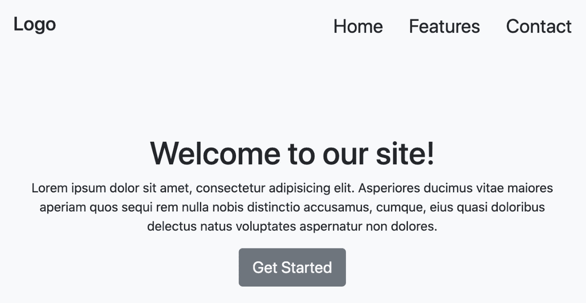
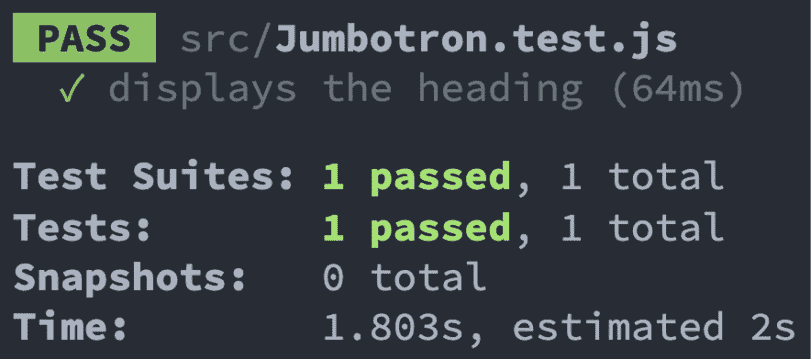
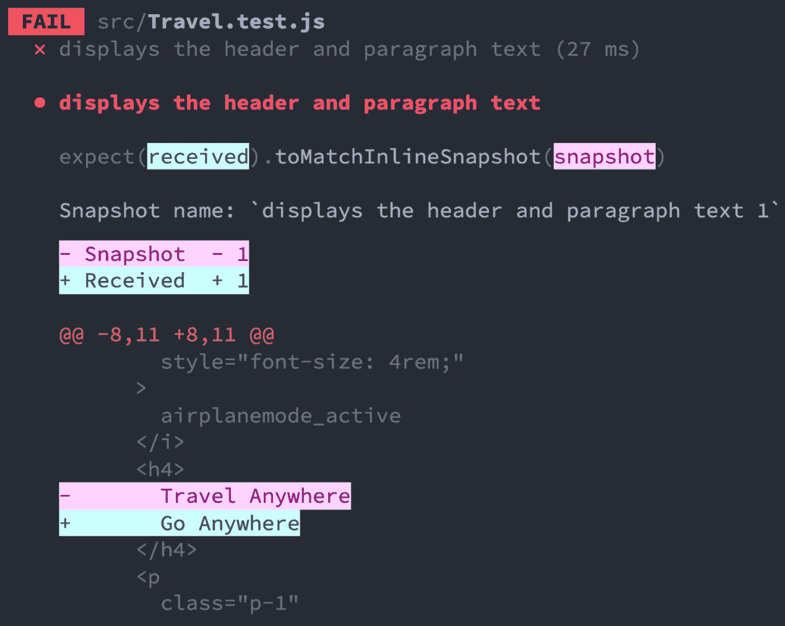
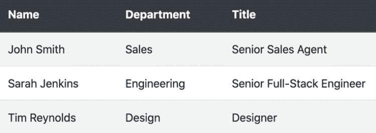
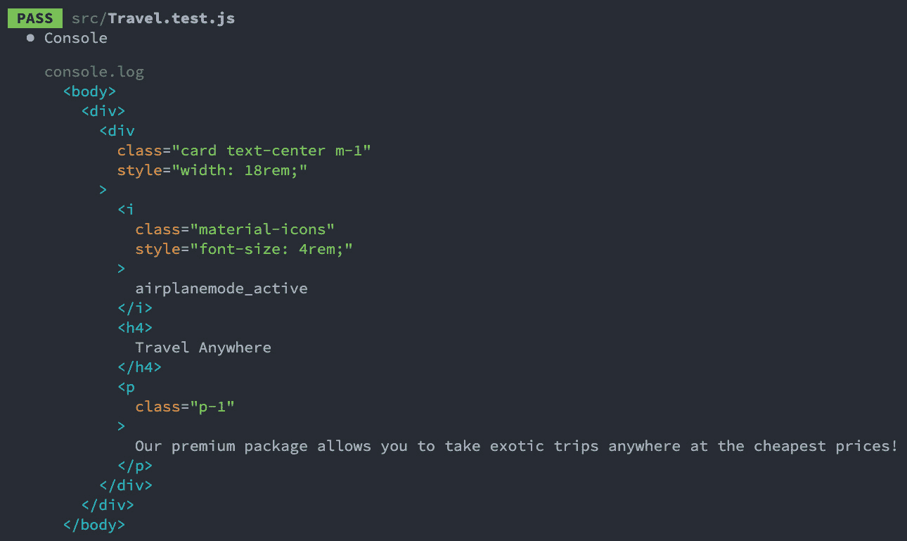
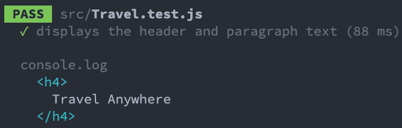

# 第二章：*第二章*: 使用 React 测试库

到本章结束时，你将了解如何将 React 测试库添加到 React 项目中。React 测试库是一个现代工具，用于从最终用户的角度测试 React 组件的 UI 输出。你将学习如何使用 API 中的方法正确构建测试。你将学习如何测试表现性组件。最后，你将学习如何使用 `debug` 方法来协助构建测试。

在本章中，我们将涵盖以下主题：

+   将 React 测试库添加到现有项目中

+   使用 React 测试库构建测试结构

+   测试表现性组件

+   在编写测试时使用 `debug` 方法

本章中你将学习的技能将为后续章节中更复杂的组件场景打下基础。

# 技术要求

对于本章的示例，你需要在你的机器上安装 Node.js。我们将使用 `create-react-app` CLI 工具来展示所有代码示例。如果需要，请在开始本章之前熟悉这个工具。你可以在这里找到本章的代码示例：[`github.com/PacktPublishing/Simplify-Testing-with-React-Testing-Library/tree/master/Chapter02`](https://github.com/PacktPublishing/Simplify-Testing-with-React-Testing-Library/tree/master/Chapter02)。

# 将 React 测试库添加到现有项目中

要开始使用 React 测试库，我们首先需要将工具安装到我们的 React 项目中。我们可以手动安装它，或者使用 `create-react-app`，这是一个特定的 React 工具，它自动为你安装了 React 测试库。

## 手动安装

使用以下命令将 React 测试库添加到你的项目中：

```js
npm install --save-dev @testing-library/react
```

一旦工具安装到你的项目中，你就可以导入可用的 API 方法，在测试文件中使用。

接下来，我们将看到如何在 React 测试库已经为你安装的情况下，如何开始一个 React 项目的构建。

## 使用 create-react-app 自动安装

`create-react-app` 工具允许你快速创建一个单页 React 应用程序。`create-react-app` 工具提供了一个示例应用程序和相关测试，以帮助你入门。React 测试库已经变得如此流行，以至于从版本 3.3.0 开始，`create-react-app` 团队将 React 测试库作为默认测试工具添加。`create-react-app` 工具还包括 `user-event` 和 `jest-dom` 工具。我们之前在 *第一章*，*探索 React 测试库* 中介绍了 `jest-dom`。我们将在 *第三章*，*使用 React 测试库测试复杂组件* 中介绍 `user-event` 工具。

因此，如果你至少使用 `create-react-app` 的 3.3.0 版本，你将获得一个带有 React 测试库、`user-event` 和 `jest-dom` 自动安装和配置的 React 应用程序。

你可以通过两种方式运行 `create-react-app` 工具来创建一个新的 React 应用程序。默认情况下，运行 `create-react-app` 工具的两种方式都会自动安装 `create-react-app` 的最新版本。第一种方式是使用 `npx`，它允许你创建一个 React 项目，而无需在本地机器上全局安装 `create-react-app` 工具：

```js
npx create-react-app your-project-title-here --use-npm
```

当使用前面的命令时，请确保将 `your-project-title-here` 替换为一个描述你独特项目的标题。同时，注意命令末尾的 `--use-npm` 标志。默认情况下，当你使用 `create-react-app` 创建项目时，它使用 Yarn 作为项目的包管理器。在这本书中，我们将使用 `npm` 作为包管理器。我们可以通过使用 `--use-npm` 标志来告诉 `create-react-app` 我们想要使用 `npm` 而不是 Yarn 作为包管理器。

使用 `create-react-app` 创建 React 应用程序的第二种方式是将工具全局安装到本地机器上运行。使用以下命令全局安装该工具：

```js
npm install -g create-react-app
```

在之前的命令中，我们使用了 `-g` 命令在机器上全局安装该工具。一旦工具安装到你的机器上，运行以下命令来创建一个项目：

```js
create-react-app your-project-title-here --use-npm
```

与我们之前使用 `npx` 创建项目时运行的命令一样，我们使用 `npm` 作为包管理器创建一个名为 `your-project-title-here` 的新项目。

现在你已经知道了如何手动安装 React Testing Library 或者使用 `create-react-app` 自动安装它。接下来，我们将学习一些常用的 React Testing Library API 方法，这些方法用于构建测试。

# 使用 React Testing Library 构建测试

为了构建和编写我们的测试代码，我们将使用在编写单元测试中典型的 *安排-行动-断言* 模式。有几种方法可以使用 React Testing Library API 来构建测试，但我们将使用 React Testing Library 团队推荐的方法来渲染 React 元素到 **文档对象模型** (**DOM**) 中，选择生成的 DOM 元素，并对预期的行为进行断言。

## 渲染元素

要测试你的 React 组件的输出，你需要一种方法将它们渲染到 DOM 中。React Testing Library 的 `render` 方法接受一个传入的组件，将其放入一个 `div` 元素中，并将其附加到 DOM 上，正如我们在这里可以看到的：

```js
import { render} from '@testing-library/react'
import Jumbotron from './Jumbotron'
it('displays the heading, () => {
  render(<Jumbotron />)
}
```

在之前的代码中，我们有一个测试文件。首先，我们从 React Testing Library 导入 `render` 方法。然后，我们导入我们想要测试的 Jumbotron 组件。最后，我们通过使用 `render` 方法来渲染要测试的组件，在 `it` 方法中安排我们的测试代码。

在许多测试框架中，编写额外的代码来清理我们的测试是必要的。例如，如果一个组件在一个测试中被渲染到 DOM 中，它需要在执行下一个测试之前被移除。从 DOM 中移除组件允许下一个测试从一个干净的状态开始，并且不受之前测试中的代码的影响。React Testing Library 的`render`方法通过自动处理从 DOM 中移除组件，使得测试清理变得更容易，因此不需要编写额外的代码来清理受之前测试影响的州。

现在你已经知道了如何通过将组件渲染到 DOM 中进行测试来安排测试，我们将在下一节学习如何与组件的 DOM 输出进行交互。

## 选择组件 DOM 输出中的元素

一旦我们将要测试的组件渲染到 DOM 中，下一步就是选择元素。我们将通过模拟用户查询输出来做这件事。DOM Testing Library API 包含在 React Testing Library 中的`screen`对象，允许你查询 DOM：

```js
import { render, screen } from '@testing-library/react'
```

在之前的代码中，我们像导入`render`一样导入了`screen`从 React Testing Library。`screen`对象公开了许多方法，例如`getByText`或`getByRole`，用于查询 DOM 中的元素，类似于我们可以在测试中使用的实际用户。例如，我们可能有一个渲染以下 DOM 输出的组件：



图 2.1 – Jumbotron 组件

如果我们想要在 DOM 中搜索包含文本**欢迎来到我们的网站**的元素，我们可以有两种方式来做。

一种方式是使用`getByText`方法：

```js
it('displays the heading', () => {
  render(<Jumbotron />)
  screen.getByText(/welcome to our site!/i)
})
```

`getByText`方法将查询 DOM，寻找与`getByText`方法匹配的文本的元素。一个寻找元素的普通用户不会关心文本是大写还是小写，所以`getByText`和所有其他`screen`对象方法都遵循相同的方法。

另一种查询 DOM 中包含文本`getByRole`方法：

```js
it('displays the heading, () => {
  render(<Jumbotron />)
  screen.getByRole('heading', { name: /welcome to our 
    site!/i })
})
```

`getByRole`方法允许你以类似于任何人（包括使用屏幕阅读器的人）搜索的方式查询 DOM。屏幕阅读器会寻找具有`heading`角色和文本`欢迎来到我们的网站`的元素。`screen`对象上有许多其他方法，可以根据你决定如何找到它们来查询元素。DOM Testing Library 团队建议在文档中尽可能使用`getByRole`方法来选择元素。

此外，因为我们的测试代码本质上说的是，`搜索一个包含文本'欢迎来到我们的网站'的标题元素`，它比之前的例子更明确，在之前的例子中，我们使用了`getByText`来`搜索任何包含文本'欢迎来到我们的网站'的元素`。

在*第一章*的*《增强 jest 断言的 jest-dom》*部分，*《探索 React Testing Library》*中，我们了解到`jest-dom`的方法提供了上下文特定的错误信息。

`screen`对象上的方法提供了相同的好处。例如，如果你尝试使用`getByRole`来选择 DOM 中不存在的元素，该方法将停止测试执行并提供以下错误信息：

```js
Unable to find an accessible element with the role 
  "heading" and name `/fake/i`
```

在前面的代码中，错误信息明确告诉你查询方法没有找到元素。此外，错误信息通过记录基于渲染 DOM 可选择的元素来帮助：

```js
heading:
      Name "Logo":
      <h3
        class="navbar-brand mb-0"
        style="font-size: 1.5rem;"
      />
      Name "Welcome to our site!":
      <h1 />
```

在前面的代码中，日志记录的元素通过提供 DOM 的视觉表示来帮助理解为什么找不到你搜索的元素。现在你知道如何使用 React Testing Library 选择元素。

我们将在*第三章*中学习更多与组件交互的高级方法，例如点击或输入文本，*《使用 React Testing Library 测试复杂组件》*。

接下来，我们将学习如何断言组件的预期输出。

## 断言预期行为

测试结构中的最后一步是对行为进行断言。在*第一章*的*《增强 jest 断言的 jest-dom》*部分，*《探索 React Testing Library》*中，我们学习了如何安装和使用`jest-dom`工具进行断言。基于我们搜索文本为`welcome to our site!`的标题元素的测试，我们可以使用`jest-dom`中的`toBeInTheDocument`方法来验证元素是否在 DOM 中：

```js
it('displays the heading', () => {
  render(<Jumbotron />)
  expect(
screen.getByRole('heading', { name: /welcome to our 
      site!/i })
  ).toBeInTheDocument()
})
```

如果找不到元素，我们将收到错误信息和视觉反馈，以帮助确定记录到控制台的问题来源，类似于我们在*与组件 DOM 输出交互*部分所看到的。如果我们得到预期的行为，那么我们将在控制台收到反馈，如下面的截图所示：



图 2.2 – Jumbotron 组件测试结果

在上一张截图，结果显示**显示标题**测试通过。现在你知道如何使用 React Testing Library 对组件的输出进行断言。本节学到的技能为下一节奠定了基础，下一节我们将开始测试表现性组件。

# 测试表现性组件

在本节中，我们将利用我们对使用 React Testing Library 安装和构建测试的知识来测试表现性组件。表现性组件是不管理状态的组件。通常，你使用表现性组件来显示从父组件传递下来的作为 props 的数据，或者直接在组件本身中显示硬编码的数据。

## 创建快照测试

快照测试由 Jest 提供，当您只想确保组件的 HTML 输出不会意外更改时非常有用。假设开发者更改了组件的 HTML 结构，例如，通过添加另一个包含静态文本的段落元素。在这种情况下，快照测试将失败，并提供更改的视觉表示，以便您可以相应地做出反应。以下是一个将有关旅行服务的数据硬编码到 DOM 中的表现组件的示例：

```js
const Travel = () => {
  return (
    <div className="card text-center m-1" style={{ width: 
      '18rem' }}>
      <i className="material-icons" style={{ fontSize: 
         '4rem' }}>
        airplanemode_active
      </i>
      <h4>Travel Anywhere</h4>

```

在前面的代码片段中，该组件在 `<i>` 元素中显示飞机图标，并在 `<h4>` 元素中显示标题：

```js
<p className="p-1">
        Our premium package allows you to take exotic trips
          anywhere at the cheapest prices! 
      </p>
    </div>
  )
}
export default Travel
```

在组件的最后部分，前面的代码片段显示了段落元素内的文本。生成的 DOM 输出如下所示：


图 2.3 – 旅行组件

由于该组件仅显示几行静态硬编码的文本，因此它是一个很好的快照测试候选者。在以下示例中，我们使用快照测试来测试 `Travel` 组件：

```js
import { render } from '@testing-library/react'
import Travel from './Travel'
it('displays the header and paragraph text', () => {
  const { container } = render(<Travel />)
```

首先，在我们的测试文件中，我们导入 React Testing Library 的 `render` 方法。接下来，我们导入 `Travel` 组件。然后，我们使用对象解构从渲染的组件中获取 `container`。`container` 代表组件的最终 HTML 输出。最后，我们使用 Jest 的 `toMatchInlineSnapshot` 方法来捕获生成的 HTML 输出。

以下是我们在本节开头看到的 `Travel` 组件输出的快照的一部分：

```js
  expect(container).toMatchInlineSnapshot(`
    <div>
      <div
        class="card text-center m-1"
        style="width: 18rem;"
      >
        <i
          class="material-icons"
          style="font-size: 4rem;"
        >
          airplanemode_active
        </i>
```

现在，如果将来开发者更改了 `Travel` 组件的输出，测试将失败，并通知我们意外的更改。例如，开发者可能将标题从 "Travel Anywhere" 更改为 "Go Anywhere"：




图 2.4 – 失败的旅行快照测试

上一张截图显示测试失败，并显示了哪些行发生了变化。"Travel Anywhere" 是快照预期接收到的文本，与接收到的文本 "Go Anywhere" 不同。此外，还指出了发现差异的行号 **8** 和行中的位置 **11**。如果更改是故意的，我们可以用新的更改更新我们的快照。运行以下命令来更新快照：

```js
npm test -- -u
```

如果您的测试目前正在监视模式下运行，只需按键盘上的 *U* 键即可更新快照。如果更改不是故意的，我们只需将文本改回组件文件中的原始值即可。

现在你已经知道了如何为表现组件创建快照测试，我们将学习如何验证传递给表现组件的属性。

## 测试预期属性

呈现式组件可以接收作为 `props` 传递的数据，而不是直接在组件中硬编码数据。以下是一个期望显示在表格中的员工对象数组的呈现式组件示例：

```js
const Table = props => {
  return (
    <table className="table table-striped">
      <thead className="thead-dark">
        <tr>
          <th scope="col">Name</th>
          <th scope="col">Department</th>
          <th scope="col">Title</th>
        </tr>
      </thead>
```

在前面的代码片段中，该组件有一个包含每个员工 `Name`、`Department` 和 `Title` 标题的表格。以下是表格体：

```js
      <tbody>
        {props.employees.map(employee => {
          return (
            <tr key={employee.id}>
              <td>{employee.name}</td>
              <td>{employee.department}</td>
              <td>{employee.title}</td>
            </tr>
          )
        })}
      </tbody>
    </table>
  )
}
export default Table
```

在前面的代码片段中，我们在表格体内部迭代 `props` 对象中的 `employees` 数组。我们为每个员工创建一个表格行，访问员工的名字、部门和头衔，并将数据渲染到表格单元格元素中。

以下是一个示例，展示了生成的 DOM 输出：



图 2.5 – 表格组件

`Table` 组件显示与预期对象数组形状匹配的员工行，该数组具有 **Name**、**Department** 和 **Title** 属性。我们可以测试该组件是否正确接受并显示 DOM 中的员工数据行：

```js
import { render, screen } from '@testing-library/react'
import fakeEmployees from './mocks/employees'
import Table from './Table'
it('renders with expected values', () => {
  render(<Table employees={fakeEmployees} />)
```

首先，我们从 React Testing Library 中导入 `render` 方法 和 `screen` 对象。接下来，我们传递一个名为 `fakeEmployees` 的虚构员工对象数组，该数组是为了测试目的而创建的，以及 `Table` 组件。`fakeEmployees` 数据看起来如下：

```js
const fakeEmployees = [
  {
    id: 1,
    name: 'John Smith',
    department: 'Sales',
    title: 'Senior Sales Agent'
  },
  {
    id: 2,
    name: 'Sarah Jenkins',
    department: 'Engineering',
    title: 'Senior Full-Stack Engineer'
  },
  { id: 3, name: 'Tim Reynolds', department: 'Design', 
     title: 'Designer' }
]
```

最后，我们创建主要的测试代码来验证 `fakeEmployee` 数据是否存在于 DOM 中：

```js
it('renders with expected values', () => {
  render(<Table employees={fakeEmployees} />)
  expect(screen.getByRole('cell', { name: /john smith/i 
    })).toBeInTheDocument()
  expect(screen.getByRole('cell', { name: /engineering/i 
    })).toBeInTheDocument()
  expect(screen.getByRole('cell', { name: /designer/i 
    })).toBeInTheDocument()
})
```

对于前面代码片段的断言，我们验证了每个对象中至少有一部分存在于 DOM 中。你也可以验证如果与你的测试目标一致，每条数据都存在于 DOM 中。务必验证你的代码测试了你期望测试的内容。例如，尝试通过使用 `screen` 对象查询不应存在的员工数据来使测试失败。如果测试失败，你可以更有信心地认为代码测试了你期望的内容。

尽管大多数时候我们想要避免实现细节并从用户的角度编写测试，但有时测试特定细节对于我们的测试目标可能是重要的。例如，如果验证表格组件渲染版本中是否存在条纹颜色主题对你很重要。在这种情况下，可以使用 `Jest-dom` 的 `toHaveAttribute` 断言方法：

```js
it('has the correct class', () => {
  render(<Table employees={fakeEmployees} />)
  expect(screen.getByRole('table')).toHaveAttribute(
    'class',
    'table table-striped'
  )
})
```

在前面的代码片段中，我们创建了一个测试来验证表格组件具有正确的类属性。首先，我们使用员工渲染 `Table` 组件。接下来，我们使用 `screen` 对象的 `getByRole` 方法选择 `table` 元素。最后，我们断言组件具有值为 `table table-striped` 的 `class` 属性。通过使用 `toHaveAttribute`，我们可以在需要时断言组件属性的值。

现在你已经知道了如何测试接受 `props` 作为数据的呈现式组件。

在下一节中，我们将学习如何使用`debug`方法在构建测试时分析组件的当前状态。

# 使用`debug`方法

`debug`方法可以通过`screen`对象访问，是 React Testing Library API 中的一个有用工具，它允许你在构建测试时查看组件的当前 HTML 输出。在本节中，我们将学习如何显示整个组件或特定元素的 DOM 输出结果。

## 调试整个组件 DOM

当你运行测试时，你可以使用`debug`方法记录组件的整个 DOM 输出：

```js
it('displays the header and paragraph text', () => {
   render(<Travel />)
   screen.debug()
})
```

在前面的代码中，我们首先将`Travel`组件渲染到 DOM 中。接下来，我们调用了`debug`方法。当我们运行测试时，以下内容将被记录到控制台：



图 2.6 – Travel DOM 调试

在前面的屏幕截图中，`Travel`组件的整个 DOM 输出被记录到屏幕上。记录整个输出可以帮助你构建测试，尤其是在与 DOM 中的一个元素交互影响当前 DOM 中其他元素时。现在你已经知道如何将整个组件 DOM 的输出记录到屏幕上。接下来，我们将学习如何记录 DOM 的特定元素到屏幕上。

## 调试特定组件元素

你可以使用`debug`方法将结果组件 DOM 的特定元素记录到屏幕上：

```js
it('displays the header and paragraph text', () => {
  render(<Travel />)
  const header = screen.getByRole('heading', { name: 
    /travel anywhere/i })
  screen.debug(header)
})
```

在前面的代码中，首先，我们将`Travel`组件渲染到 DOM 中。接下来，我们使用`getByRole`方法查询 DOM 以获取名为`travel anywhere`的标题，并将其保存到名为`header`的变量中。然后，我们调用了`debug`方法并将`header`变量传递给该方法。当我们运行测试时，以下内容将被记录到控制台：



图 2.7 – Travel 元素调试

当你传递一个通过可用查询方法找到的特定 DOM 节点时，`debug`方法只会记录该特定节点的 HTML。记录单个元素的输出可以帮助你只关注组件的特定部分。确保在提交之前从测试中移除任何`debug`方法代码，因为你在构建测试时才需要它。

现在，你已经知道了如何使用`debug`方法来渲染组件的 DOM 输出结果。`debug`方法是一个在编写新测试和调试失败的测试时非常有用的视觉工具。

# 概述

在本章中，你已经学会了如何将 React Testing Library 安装到你的 React 项目中。你现在理解了如何使用 API 方法来构建你的测试。你知道如何测试表现性组件，这为在下一章中构建知识奠定了基础。最后，你学会了如何在构建测试时调试组件的 HTML 输出。

在下一章中，我们将学习如何测试更复杂的代码。我们还将学习如何使用**测试驱动开发**（**TDD**）方法来驱动测试的创建。

# 问题

1.  用来将 React 组件放置到 DOM 中的方法是什么？

1.  命名那个附加了查询 DOM 元素方法的对象。

1.  哪些类型的组件适合进行快照测试？

1.  用于记录组件 DOM 输出的方法是什么？

1.  创建并测试一个接受对象数组作为 props 的展示组件。
