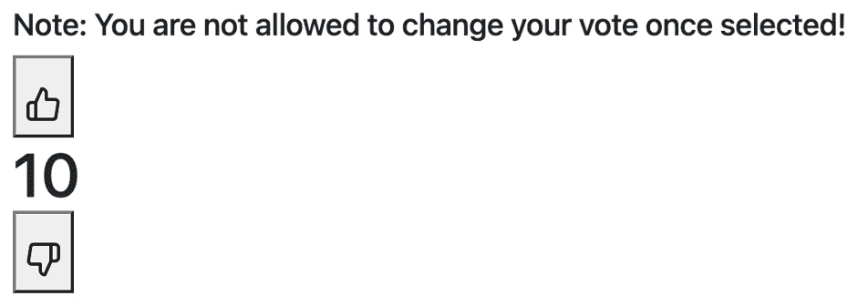

# 第三章：*第三章*：使用 React Testing Library 测试复杂组件

在*第二章* *使用 React Testing Library 工作*中，我们学习了如何测试表现性组件。然而，大多数功能都是设计来允许用户操作，这些操作会导致状态和结果的改变。在将代码发送到生产环境供最终用户使用之前，测试尽可能多的用户操作场景对于降低风险至关重要。在本章结束时，你将学习如何使用`fireEvent`和`user-event`模块来模拟用户操作。你将学习如何测试与 Web 服务 API 交互的组件。最后，你将学习如何将测试驱动开发作为构建特性的工作流程。

在本章中，我们将介绍以下主题：

+   使用`fireEvent`模块在组件上执行操作

+   模拟`user-event`模块

+   测试与 API 交互的组件

+   使用 React Testing Library 实现测试驱动开发

本章中你获得的技术将为你提供对测试用户行为结果的扎实理解。你还将获得一种从零开始构建组件的不同方法。

# 技术要求

对于本章的示例，你需要在你的机器上安装 Node.js。我们将使用`create-react-app` CLI 工具来展示所有代码示例。如果需要，请在开始本章之前熟悉这个工具。虽然这不是必需的，但在开始本章之前回顾前两章的内容可能会有所帮助。

您可以在此处找到本章的代码示例：[`github.com/PacktPublishing/Simplify-Testing-with-React-Testing-Library/tree/master/Chapter03`](https://github.com/PacktPublishing/Simplify-Testing-with-React-Testing-Library/tree/master/Chapter03)。

# 测试用户事件

在本节中，我们将学习如何模拟用户事件并测试生成的输出。为了测试组件交互，类似于用户的情况，我们需要在我们的测试中模拟 DOM 事件的方法。用户在 DOM 上可以引发多种事件。例如，用户可以通过在输入框中输入文本来执行按键事件，通过点击按钮来执行点击事件，或者通过鼠标悬停事件来查看下拉菜单项。DOM Testing Library 提供了两个库来模拟用户操作，即`fireEvent`和`user-event`，我们将在接下来的章节中看到。

## 使用`fireEvent`模块模拟用户操作

我们可以使用`fireEvent`模块来模拟用户在组件生成的 DOM 输出上的操作。例如，我们可以构建一个可重用的`Vote`组件，渲染以下 DOM 输出：



图 3.1 – Vote 组件

在前面的截图上，数字**10**代表点赞评分。我们有两个按钮，用户可以点击它们来投票并更改点赞评分：一个点赞按钮和一个踩按钮。还有一个免责声明告知用户他们只能投票一次。当用户点击点赞按钮时，他们将看到以下输出：


图 3.2 – 点赞按钮投票

在前面的截图上，点赞评分从**10**增加到**11**。当用户点击踩按钮时，他们将看到以下输出：


图 3.3 – 踩按钮投票

在前面的截图上，点赞评分已从`fireEvent`减少。在`Vote`组件的代码实现中，组件内部调用了一个事件处理器，其中包含更新屏幕上显示的点赞逻辑：

```js
  const handleLikeVote = () => dispatch({ type: 'LIKE' })
  const handleDislikeVote = () => dispatch({ type: 
    'DISLIKE' })
  return (
    <div className="h1">
      <h5>Note: You are not allowed to change your vote 
         once selected!</h5>
      <button
        onClick={handleLikeVote}
        disabled={hasVoted}
        style={clickedLike ? { background: 'green' } : 
          null}
      >
        
      </button>
```

在前面的代码块中，按钮有一个`onClick`事件处理器附加。当点赞按钮被点击时，事件处理器调用`handleLikeVote`方法，该方法调用另一个方法`dispatch`来更新点赞评分。

重要提示

请参阅*第三章**Testing Complex Components with React Testing Library*，在*技术要求*部分找到的代码示例，以查看组件的完整内容。

我们可以编写一个测试来断言投票的输出：

```js
import { fireEvent, render, screen } from '@testing-library/react'
import Vote from './Vote'
test('increases total likes by one', () => {
  render(<Vote totalGlobalLikes={10} />)
```

在前面的代码块中，我们从 React Testing Library 中导入`fireEvent`、`render`和`screen`方法。接下来，我们导入`Vote`组件以进行测试。然后，我们在`test`方法中安排我们的测试代码，并使用`render`方法渲染`Vote`组件，将`totalGlobalLikes`属性的值`10`传递给组件。

`totalGlobalLikes`属性是我们组件渲染时在屏幕上最初看到的数字，它代表了应用的点赞状态。在一个完全完成的程序中，我们会通过父组件将`totalGlobalLikes`的值传递给`Vote`组件。接下来，我们将与渲染组件的输出进行交互并断言：

```js
expect(screen.getByText(/10/i)).toBeInTheDocument()
  fireEvent.click(screen.getByRole('button', { name: 
    /thumbs up/i }))
  expect(screen.getByText(11).toBeInTheDocument()
  expect(screen.getByRole('button', { name: /thumbs up/i 
    })).toHaveStyle(
    'background: green'
  )
})
```

在前面的代码块中，首先，我们断言`Vote`组件的本地`totalGlobalLikes`版本在文档中的值等于`10`。接下来，我们使用`fireEvent`的`click`方法点击名为`thumbs up`的按钮。然后，我们断言文档中`totalGlobalLikes`的值更新为`11`。最后，我们断言点赞按钮的背景色已变为绿色。

在许多情况下，使用 `fireEvent` 是完全可行的。然而，它确实有一些限制。例如，当用户执行诸如在输入框中输入文本等操作时，会发生许多事件，例如 `keydown` 和 `keyup`。现在，`fireEvent` 有方法来实现这些单个动作，但它没有一种方法可以按顺序一起处理它们。

接下来，我们将学习如何使用 `user-event` 库来解决 `fireEvent` 模块的局限性。

## 使用 `user-event` 模拟用户操作

`user-event` 库是 `fireEvent` 的增强版本。在上一节中，我们了解到 `fireEvent` 有方法来模拟用户在输入框中输入文本时发生的各种事件。`user-event` 库有许多方法，例如 `click` 或 `type`，可以自动模拟用户在 DOM 上执行操作时发生的所有事件。其优势是 `user-event` 方法比 `fireEvent` 方法提供了更多的价值。

`create-react-app` 已经预装了 `user-event`。对于不使用 `create-react-app` 的项目，请使用以下命令进行安装：

```js
npm install --save-dev @testing-library/user-event
```

我们可以使用 `user-event` 更新上一节的 `Vote` 组件测试：

```js
import { render, screen } from '@testing-library/react'
import user from '@testing-library/user-event'
import Vote from './Vote'
test('increases total likes by one', () => {
  render(<Vote totalGlobalLikes={10} />)
  expect(screen.getByText(/10/i)).toBeInTheDocument()
  user.click(screen.getByRole('button', { name: /thumbs 
     up/i }))
  expect(screen.getByText(/11/i)).toBeInTheDocument()
  expect(screen.getByRole('button', { name: /thumbs up/i 
    })).toHaveStyle(
    'background: green'
  )
})
```

在前面的代码中，我们将 `user-event` 库导入为 `user`。最后，我们使用 `user-event` 的 `click` 方法点击了 `点赞` 按钮。我们的测试提供了更多的价值，因为我们更接近地模拟了用户的 DOM 操作。React 测试库团队建议尽可能多地使用 `user-event`，因此我们将在本书的其余部分不再使用 `fireEvent`。

在上一节中介绍 `Vote` 组件时，我们提到用户只能投票一次。我们可以编写一个测试来处理这种情况：

```js
test('A user can only vote once', () => {
  render(<Vote totalGlobalLikes={10} />)
  const thumbsUpBtn = screen.getByRole('button', { name: 
    /thumbs up/i })
  const thumbsDownBtn = screen.getByRole('button', { name: 
    /thumbs down/i })
  expect(screen.getByText(/10/i)).toBeInTheDocument()
  user.click(thumbsUpBtn)
  user.click(thumbsUpBtn)
  expect(screen.getByText(/11/i)).toBeInTheDocument()
  user.click(thumbsDownBtn)
  expect(screen.getByText(/11/i)).toBeInTheDocument()
})
```

在前面的代码中，首先，我们获取了 `点赞` 和 `踩` 按钮。然后，我们验证当前的总点赞数是 `10`，并点击 `点赞` 按钮两次。接下来，我们验证总点赞数是 `11`。最后，我们点击 `踩` 按钮，并断言总点赞数仍然是 `11`。作为另一个测试用例，我们还可以验证当用户点击 `踩` 按钮时，`totalGlobalLikes` 的本地版本减少一个：

```js
test('decreases total likes by one', () => {
  render(<Vote totalGlobalLikes={10} />)
  expect(screen.getByText(/10/i)).toBeInTheDocument()
  user.click(screen.getByRole('button', { name: /thumbs 
    down/i }))
  expect(screen.getByText(/9/i)).toBeInTheDocument()
  expect(screen.getByRole('button', { name: /thumbs down/i 
    })).toHaveStyle(
    'background: red'
  )
})
```

在前面的代码中，我们点击了 `踩` 按钮，并验证总点赞数从 `10` 减少到 `9`，背景颜色变为 `红色`。

当我们运行 `Vote` 组件的所有测试时，我们得到以下结果，表明所有测试都通过了：


图 3.4 – 投票组件测试结果

上一张截图显示了 `Vote.test.js` 文件。

在另一个例子中，我们可能会为员工创建一个接受他们名字的输入组件：


图 3.5 – 员工电子邮件输入

当员工输入他们的名字时，组件将其追加到公司的网站名称，并将结果显示在屏幕上：


图 3.6 – 完成的员工电子邮件输入

如果员工输入由空格分隔的姓名和姓氏，则姓名会与一个 `.` 连接：


图 3.7 – 连接的员工电子邮件输入

我们可以使用 `user-event` 的 `type` 方法模拟在员工电子邮件组件中输入，并对结果进行断言，如下所示：

```js
import { render, screen } from '@testing-library/react'
import user from '@testing-library/user-event'
import EmployeeEmail from './EmployeeEmail'
test('it accepts a username and displays to the screen', ()
  => {
  render(<EmployeeEmail />)
  const input = screen.getByRole('textbox', { name: /enter 
    your name/i })
  user.type(input, 'jane doe')
  expect(screen.getByText(/jane.doe@software-
    plus.com/i)).toBeInTheDocument()
})
```

在前面的代码中，我们导入了 `render`、`screen` 和 `user-event` 模块。然后，我们导入了 `EmployeeEmail` 组件。我们在屏幕上渲染该组件。然后，我们获取输入元素并将其存储在变量 input 中。接下来，我们使用 `user-event` 中的 `type` 方法将 `jane doe` 输入到输入框中。最后，我们断言文本 `jane.doe@software-plus.com` 在 DOM 中。

当我们运行测试时，我们会得到以下输出，表明场景按预期通过：


图 3.8 – 员工组件测试结果

之前的屏幕截图显示了 `EmployeeEmail.test.js` 文件。现在你知道如何使用 `user-event` 模块模拟用户操作。在本节中学到的技能是必不可少的，因为我们的大多数测试通常都需要涉及某种类型用户操作。

接下来，我们将学习如何测试独立调用事件处理器的组件。

## 测试独立调用事件处理器的组件

创建从父组件传递下来的方法调用的子组件是非常常见的。在前面的一节中，我们有一个 `Vote` 组件，它在一个组件中包含了两个按钮，这可以在以下代码块中看到：

```js
      <button
        onClick={voteLike}
        disabled={hasVoted}
        style={clickedLike ? { background: 'green' } : 
          null}
      >
        
      </button>
      <div>{totalLikes}</div>
      <button
        onClick={voteDislike}
        disabled={hasVoted}
        style={clickedDislike ? { background: 'red' } : 
          null}
      >
        
      </button>
```

我们可以决定将按钮代码提取到自己的文件中，成为一个可重用的组件：

```js
const VoteBtn = props => {
  return (
    <button onClick={props.handleVote} 
      disabled={props.hasVoted}>
      
    </button>
  )
}
```

在前面的代码块中，我们有一个 `VoteBtn` 组件，它接受 `handleVote`、`hasVoted`、`imgSrc` 和 `altText` 属性，这些属性通过 `props` 对象传递。父组件会向下传递这些属性。对于本节的目的，我们的主要关注点是 `handleVote` 属性。当点击按钮时，由于点击事件触发，会调用 `handleVote` 方法。当此方法在 `Vote` 组件内部运行时，结果是更新 `totalGlobalLikes` 的本地版本。按钮的最终屏幕输出如下：


图 3.9 – 投票按钮

在前面的屏幕截图中，我们看到一个带有 `点赞` 图标的 `Vote` 组件。为了独立测试 `VoteBtn` 组件，我们需要向组件提供属性，因为它不再被一个自动提供这些属性的组件所包裹。Jest 提供了作为测试替身的函数，用于替换我们测试中方法的真实版本。

测试替身是一个通用术语，用于表示在测试目的下替换真实对象的某个对象。用作 API 或数据库等依赖项占位符的测试替身被称为`jest.fn`函数，用于替换我们测试中的`handleVote`：

```js
import { render, screen } from '@testing-library/react'
import user from '@testing-library/user-event'
import thumbsUp from './images/thumbs-up.svg'
import VoteBtn from './VoteBtn'
test('invokes handleVote', () => {
  const mockHandleVote = jest.fn()
  render(
    <VoteBtn
      handleVote={mockHandleVote}
      hasVoted={false}
      imgSrc={thumbsUp}
      altText="vote like"
    />
  )
```

在前面的代码块中，首先，我们从 React Testing Library 中导入`render`和`screen`方法。然后，我们导入`user-event`模块。接着，我们导入我们想要测试的`thumbsUp`图像和`VoteBtn`组件。然后，在`test`方法内部，我们创建一个`jest`函数作为模拟，并将其分配给`mockHandleVote`变量。

接下来，我们将`VoteBtn`组件渲染到 DOM 中，并将`mockHandleVote`和其他属性传递给组件。现在我们的测试代码已经安排好了，我们可以执行操作并做出断言：

```js
  user.click(screen.getByRole('button', { name: /vote 
    like/i }))
  expect(mockHandleVote).toHaveBeenCalled()
  expect(mockHandleVote).toHaveBeenCalledTimes(1)
})
```

在之前的代码中，我们点击了名为`mockHandleVote`的按钮，当用户点击按钮时，会调用该方法。第二个断言确认`mockHandleVote`方法被调用了一次。当需要确保函数被正确使用时，`mockHandleVote`断言可能很重要。当我们运行测试时，我们得到以下输出，表明场景按预期通过：


图 3.10 – 投票按钮组件测试结果

上一张截图显示了`VoteBtn.test.js`文件。需要注意的是，尽管我们能够验证事件处理器被调用，但我们无法确认按钮在被点击后状态是否变为禁用。我们需要包含父组件并编写集成测试来验证该行为。我们将在*第四章*中学习如何处理这些场景，*应用程序中的集成测试和第三方库*。

现在你已经知道了如何使用测试替身测试隔离组件中的事件处理器。在本节中，我们学习了如何模拟和测试用户交互。我们学习了如何使用`fireEvent`和`user-event`来模拟动作。我们还学习了如何使用测试替身来测试事件处理器。在本节中学到的技能将有助于你在下一节中学习如何测试与 API 交互的组件。

# 测试与 API 交互的组件

本节将基于我们之前章节中学到的测试事件处理器的知识，通过查看如何测试发送和接收 API 数据的组件来构建。在我们的组件单元测试中，我们可以通过使用充当测试替身的工具来代替真实 API，从而减少应用风险。使用测试替身代替实际 API，我们可以避免缓慢的互联网连接或接收导致不可预测测试结果动态数据。

我们将学习如何安装和使用**模拟服务工作者**（**MSW**）作为测试替身，在测试中捕获组件发起的 API 请求并返回模拟数据。我们将测试一个用于用户从 API 搜索饮料数据的组件。我们还将学习如何将 MSW 用作开发服务器。本节中的概念将帮助我们了解如何验证前端和 API 服务器之间的通信。

## 使用 fetch 请求 API 数据

我们可以创建一个组件，允许用户从 TheCockTailDB ([`www.thecocktaildb.com`](https://www.thecocktaildb.com))搜索饮料，TheCockTailDB 是一个免费的开源服务，将扮演后端 API 的角色。我们的组件将访问该服务并请求数据。当组件首次渲染时，用户会看到一个输入字段和一个**搜索**按钮：


图 3.11 – 饮料搜索组件

当用户搜索饮料时，API 返回类似以下的数据：


图 3.12 – 饮料搜索结果

在前面的屏幕截图中，用户搜索了`gin`并从 API 收到了一系列结果。如果用户搜索的饮料没有返回结果，屏幕上会显示**没有找到饮料**的消息：


图 3.13 – 没有饮料搜索结果

如果用户尝试搜索，但 API 服务器不可访问，则显示**服务不可用**的消息：


图 3.14 – 饮料搜索请求错误

我们的组件将使用一个 HTTP `request`模块，该模块设计用于使用`fetch`方法从 API 请求饮料数据，`fetch`是浏览器中用于发送 HTTP 请求的工具：

```js
const fetchDrinks = async drinkQuery => {
  const response = await fetch(
    `https://www.thecocktaildb.com/api/json/v1/1/search.php?s=$
  {drinkQuery}`
  )
  const data = await response.json()
  return data.drinks
}
export default fetchDrinks
```

在前面的代码块中，`fetchDrinks`接受一个`drinkQuery`参数，代表搜索数据，并通过 API 请求数据。

`饮料搜索`组件有一个表单，当提交时，将调用`handleDrinkQuery`方法，该方法最终调用`request`模块并带上要搜索的饮料：

```js
<form onSubmit={handleDrinkQuery}>
  <input
    placeholder='search for a drink...'
    type='search'
    value={drinkQuery}
    onChange={(event) => setDrinkQuery(event.target.value)}
  />
  <button type='submit'>Search</button>
</form>
```

当`request`模块发送包含饮料数组的响应时，`饮料搜索`组件将调用`drinkResults`方法，该方法在屏幕上渲染`drinks`：

```js
{drinks && <div>{drinkResults()}</div>}
```

如果响应没有返回任何饮料，则渲染`没有找到饮料`的代码：

```js
{!drinks && <h5> No drinks found </h5>}
```

如果与服务器通信出现错误，则渲染`服务不可用`的代码：

```js
{error && <h5> Service unavailable </h5>
```

现在我们已经了解了`饮料搜索`组件根据用户交互的行为。接下来，我们将学习如何创建模拟 API 数据来测试组件。

## 使用 MSW 创建模拟 API 数据

**MSW** 是一个我们可以用来捕获由我们的组件发起的 API 请求并返回模拟响应的工具。当我们的前端 React 应用程序向 API 服务器发出 HTTP 请求时，MSW 将在请求到达网络之前拦截该请求，并使用模拟数据做出响应。使用以下命令将 MSW 安装到您的项目中：

```js
npm install msw --save-dev
```

要开始使用 MSW，首先，我们将创建一个模拟响应路由处理程序来覆盖我们的组件对特定 URL 的匹配调用：

```js
import { rest } from 'msw'
export const handlers = [
  rest.get(
    'https://www.thecocktaildb.com/api/json/v1/1/search.php',
    (req, res, ctx) => {
      return res(
        ctx.status(200),
        ctx.json({
          drinks: [
            {
              idDrink: 1,
              strDrinkThumb: './images/thumbs-down.svg',
              strDrink: 'test drink',
              strInstructions: 'test instructions',
              strIngredient1: 'test ingredient'
            }
          ]
```

在前面的代码块中，我们导入了 `rest` 从 `msw`。`rest` 对象允许我们指定 `request` 类型为 `mock`。在 `get` 方法中，我们指定当发出 *GET* 请求时要覆盖的路线。在 `get` 方法的 `callback` 参数中，接受三个参数 - `req` 参数提供了有关请求的信息，例如请求中发送的数据。`res` 参数是一个函数，用于创建模拟响应。`ctx` 参数为响应函数提供了一个上下文。

在 `ctx` 中，我们创建一个表示成功请求的 `200` 响应状态码，最后，我们创建要返回的 JSON 数据，这将是一个饮料数组。您可能会注意到，*GET* 请求路由并不匹配上一节中 HTTP 请求模块使用的整个 URL。MSW 将进行 URL 匹配，使得使用确切的 URL 字符串变得不必要。

接下来，我们将创建我们的模拟服务器，并传入模拟响应路由处理程序：

```js
import { setupServer } from 'msw/node'
import { handlers } from './handlers'
export const mockServer = setupServer(...handlers)
```

在前面的代码中，首先，我们从 `msw/node` 导入 `setupServer`，它将用于拦截上一代码片段中创建的路由处理程序发出的请求。我们使用 `msw/node` 因为我们的测试代码将在 Node.js 环境中运行。接下来，我们导入路由处理程序。最后，我们将处理程序传递给 `setupServer`，并通过 `mockServer` 变量导出代码。现在我们已经设置了服务器，我们可以为 `DrinkSearch` 组件编写测试。

## 测试 DrinkSearch 组件

要开始测试组件，首先，我们将导入所需的代码并启动我们的模拟服务器：

```js
import { render, screen} from '@testing-library/react'
import user from '@testing-library/user-event'
import DrinkSearch from './DrinkSearch'
import { mockServer } from './mocks/server.js'
```

在前面的代码块中，首先，我们从 React Testing Library 导入 `render` 和 `screen`。然后，我们导入 `user-event` 模块。接着，我们导入我们想要测试的 `DrinkSearch` 组件。最后，我们导入 `mockServer`，我们的模拟服务器。接下来，我们需要启动我们的模拟服务器，并设置它在测试生命周期的不同点执行特定操作：

```js
beforeAll(() => mockServer.listen())
afterEach(() => mockServer.resetHandlers())
afterAll(() => mockServer.close())
```

在前面的代码块中，首先，我们在运行任何测试之前设置我们的模拟服务器以监听 HTTP 请求。接下来，我们在每次测试后重置我们的模拟服务器，以确保测试之间不会相互影响。最后，在所有测试完成后关闭我们的模拟服务器。接下来，我们将创建主要的测试代码：

```js
test('renders mock drink data, async () => {
  render(<DrinkSearch />)
  const searchInput = screen.getByRole('searchbox')
  user.type(searchInput, 'vodka, {enter}')
```

在前面的代码块中，我们渲染了`DrinkSearch`组件。接下来，我们获取搜索输入并输入`vodka`作为要搜索的饮料。在`vodka`后面的`{enter}`模拟了在键盘上按下*Enter*键。接下来，我们将对用户操作的结果进行断言：

```js
  expect(
    await screen.findByRole('img', { name: /test drink/i })
  ).toBeInTheDocument()
  expect(
    screen.getByRole('heading', { name: /test drink/i })
  ).toBeInTheDocument()
  expect(screen.getByText(/test 
    ingredient/i)).toBeInTheDocument()
  expect(screen.getByText(/test 
    instructions/i)).toBeInTheDocument()
})
```

在前面的代码中，我们使用`findByRole`查询方法来获取图像元素。在先前的例子中，我们只使用了`getBy*`查询。`getBy*`查询可以在大多数情况下使用，当你期望元素在当前 DOM 状态中可用时。然而，在之前的代码中，我们使用了一个`findBy*`查询，因为与 API 通信的过程是异步的，所以我们需要给我们的应用程序一些时间来接收响应并更新 DOM，然后再尝试获取元素。

当使用`getBy*`查询来选择元素时，会抛出一个错误，如果元素在当前 DOM 中找不到，我们的测试将失败：


图 3.15 – 无饮料搜索失败的测试结果

前面的截图显示了`DrinkSearch.test.js`文件。测试结果输出还提供了更多上下文，让我们知道它找不到名为`test drink`的图像元素。`findBy*`查询在元素找不到时也会抛出错误，但通常会在几秒钟后，这给了元素出现在屏幕上的时间。

我们还可以编写一个测试来验证当 API 服务器没有返回我们的饮料搜索结果时的输出。我们可以修改我们的 MSW 服务器的响应来设置测试场景：

```js
test('renders no drink results', async () => {
  mockServer.use(
    rest.get(
      'https://www.thecocktaildb.com/api/json/v1/1/search.php',
      (req, res, ctx) => {
        return res(
          ctx.status(200),
          ctx.json({
            drinks: null
          })
        )
      }
    )
  )
```

在前面的代码块中，我们使用`use`方法来覆盖我们的默认模拟值，以返回`null`。正如在*使用 fetch 请求 API 数据*部分中提到的，当服务器没有返回饮料数组时，我们的组件将返回`No drinks found`消息。现在我们已经设置了测试来发送正确的数据，我们可以编写主要的测试代码：

```js
      render(<DrinkSearch />)
  const searchInput = screen.getByRole('searchbox')
  user.type(searchInput, 'vodka, {enter}')
  expect(
    await screen.findByRole('heading', { name: / no 
      drinks found /i })
  ).toBeInTheDocument()
})
```

我们像前面的测试中一样渲染了`DrinkSearch`组件并搜索了`vodka`。然而，这次我们期望看到`No drinks found`消息，而不是饮料数组。

对于我们的下一个测试，我们将验证当 API 服务器不可用时输出。就像我们在上一个测试中所做的那样，我们将修改我们的 MSW 服务器的响应来设置测试场景：

```js
test('renders service unavailable', async () => {
  mockServer.use(
    rest.get(
      'https://www.thecocktaildb.com/api/json/v1/1/search.php',
      (req, res, ctx) => {
        return res(ctx.status(503))
      }
    )
  )
```

我们在之前的代码中覆盖了默认的模拟值，以响应`503`状态码，表示 API 不可用。正如在*使用 fetch 请求 API 数据*部分中提到的，当服务器离线时，我们的组件将返回`Service unavailable`消息。现在我们已经设置了测试来发送正确的响应，我们可以编写主要的测试代码：

```js
render(<DrinkSearch />)
const searchInput = screen.getByRole('searchbox');
user.type(searchInput, 'vodka, {enter}');
expect(
  await screen.findByRole('heading', { name: /Service     unavailable/i })
).toBeInTheDocument()
```

与上一个测试中的代码一样，我们渲染了`DrinkSearch`组件并搜索了`vodka`。然而，现在我们期望文档中包含`Service unavailable`，因为服务器发送了`503`错误代码。

我们要写的最后一个测试将验证当用户尝试提交空白搜索查询时不会发出任何请求：

```js
test('prevents GET request when search input empty', async 
  () => {
  render(<DrinkSearch />)
  const searchInput = screen.getByRole('searchbox')
  user.type(searchInput, '{enter}')
  expect(screen.queryByRole('heading')).not.toBeInTheDocument()
})
```

在之前的代码中，我们按下 *Enter* 键而没有输入搜索字符串。当应用程序首次加载时，我们只能看到输入字段和用于搜索的按钮。应用程序设计为在向 API 提交搜索查询时显示包括标题元素在内的附加内容。我们期望使用 `queryBy*` 查询时屏幕上没有具有 `heading` 角色的元素。当您想验证特定元素不在屏幕上时，`queryBy*` 查询是首选的。

与 `getBy*` 和 `findBy*` 查询不同，`queryBy*` 查询在找不到元素时不会抛出错误并使测试失败。当找不到元素时，`queryBy*` 查询返回 `null`，允许您在没有测试失败的情况下断言 DOM 中预期不存在元素。当我们运行测试时，我们应该收到以下输出，表明我们的测试套件已通过：


图 3.16 – 无饮料搜索通过测试结果

上述截图显示了 `DrinkSearch.test.js` 文件。现在您知道了如何使用 MSW 创建模拟服务器来测试请求 API 数据的组件。

接下来，我们将学习如何在使用 MSW 进行开发。

## 在开发中使用 MSW

除了在我们的测试中使用 MSW 模拟 HTTP 响应外，我们还可以在开发中创建模拟响应。拥有模拟开发服务器的优点是，即使后端 API 不完整，也可以构建和测试前端。我们需要了解前端和后端 API 之间的通信和数据交换将是什么样子，以便创建正确的模拟响应。

首先，我们需要将服务工作者文件添加到拦截前端发出的 HTTP 请求并使用模拟数据响应。MSW 文档指出我们应该将文件安装到项目的公共目录中。从项目根目录运行以下命令以安装：

```js
npx msw init public/
```

之前的命令会自动将服务工作者文件下载到公共文件夹。如果您使用 `create-react-app` 构建项目，则 `public` 目录位于项目根目录。一旦下载，我们不需要在文件中做任何额外操作。接下来，我们需要在 `src/mocks/` 目录中创建一个文件来设置和启动服务工作者，类似于我们在本章的 *使用 MSW 创建模拟 API 数据* 部分所做的那样。

然而，对于模拟开发服务器，我们将对设置服务器的方式做些轻微的调整：

```js
import { rest, setupWorker } from 'msw'
const drinks = [
  {
    idDrink: '11457',
    strDrink: 'Gin Fizz',
    strInstructions:
      'Shake all ingredients with ice cubes, except soda 
       water. Pour into glass. Top with soda water.',
    strDrinkThumb:
         'https://www.thecocktaildb.com/images/media/drink/
           drtihp1606768397.jpg',
    strIngredient1: 'Gin',
    strIngredient2: 'Lemon',
    strIngredient3: 'Powdered sugar',
    strIngredient4: 'Carbonated water'
  },

]
```

在前面的代码中，我们从`msw`中导入了`rest`和`setupWorker`。在本章的“使用 MSW 创建模拟 API 数据”部分，我们由于测试在 Node.js 环境中运行，因此从`msw/node`中导入了模块。模拟开发服务器将在浏览器中运行，因此我们不需要导入 Node.js 版本。接下来，我们创建了一个包含饮料数据的`drinks`数组。然后，我们为服务器设置了路由和响应：

```js
export const worker = setupWorker(
  rest.get(
    'https://www.thecocktaildb.com/api/json/v1/1/search.php',
    (req, res, ctx) => {
      return res(
        ctx.status(200),
        ctx.json({
          drinks
        })
      )
    }
  )
)
```

在前面的代码中，我们创建了一个路由处理程序来处理对尝试访问鸡尾酒 API 的 URL 发出的*GET*请求。我们将饮料数组作为响应数据传入。在本章的“使用 MSW 创建模拟 API 数据”部分，我们将服务器设置代码和路由处理程序拆分到单独的文件中。我们将保持所有服务器设置代码在同一个文件中，以实现模拟开发服务器相同的成果。最后，我们需要做的是设置我们的应用程序，以便在开发环境中运行模拟服务器：

```js
if (process.env.NODE_ENV === 'development') {
  const { worker } = require('./mocks/browser')
  worker.start()
}
ReactDOM.render(
  <React.StrictMode>
    <App />
  </React.StrictMode>,
  document.getElementById('root')
)
```

在前面的代码中，我们设置了服务器，在将`NODE_ENV`环境变量设置为`development`之前启动，然后将`App`组件渲染到 DOM 中。使用`create-react-app`构建的应用程序已经将`NODE_ENV`设置为`development`，所以我们只需要使用`npm`的`start`脚本来启动应用程序，这在构建`create-react-app`应用程序时很典型。

现在你已经知道如何使用 MSW 创建模拟服务器来测试请求 API 数据的组件。你还创建了一个 MSW 服务器，在开发环境中以假响应进行响应。此外，你现在知道何时在`getBy*`查询之外使用`findBy*`和`queryBy*`查询。

在本节中，我们学习了如何安装和使用 MSW。我们测试了一个用于从 API 搜索饮料数据的组件。最后，我们学习了如何将 MSW 用作开发服务器。接下来，我们将学习如何使用测试驱动开发方法编写测试。

# 实施测试驱动开发

**测试驱动开发**（**TDD**）意味着先编写单元测试，然后构建代码以通过测试。TDD 方法允许你思考代码是否适合你想要编写的测试。这个过程提供了一个关注最少代码以使测试通过的角度。TDD 也被称为**红、绿、重构**。*红*代表失败的测试，*绿*代表通过的测试，正如其名，*重构*意味着在保持通过测试的同时重构代码。典型的 TDD 工作流程如下：

1.  编写一个测试。

1.  运行测试，预期它会失败。

1.  编写最少的代码以使测试通过。

1.  重新运行测试以验证它是否通过。

1.  根据需要重构代码。

1.  如有必要，重复步骤 2 到 5。

我们可以使用 React Testing Library 通过 TDD 方法驱动 React 组件的开发。首先，我们将使用 TDD 来构建本章前一个部分中引入的`Vote`组件。然后，我们将使用 TDD 来创建一个`Registration`组件。

## 使用 TDD 构建投票组件

在*独立测试调用事件处理器的组件*部分，我们首先构建了`Vote Button`组件，然后编写了测试。在本节中，我们将使用 TDD 来构建组件。首先，我们规划出组件在渲染到 DOM 时应有的外观以及用户应采取的操作。我们决定组件将是一个图像按钮。父组件应将图像源和图像 alt 文本作为`props`传递给组件。

组件还将接受一个用于`hasVoted`属性的布尔值，以设置按钮的状态为`enabled`或`disabled`。如果`hasVoted`设置为`true`，用户可以点击按钮以调用一个方法来处理更新投票计数。接下来，我们根据我们的设计编写测试。第一个测试将验证组件是否以传入的`props`渲染到屏幕上：

```js
  test('given image and vote status, renders button to 
    screen', () => {
    const stubHandleVote = jest.fn()
    const stubAltText = 'vote like'
    render(
      <VoteBtn
        handleVote={stubHandleVote}
        hasVoted={false}
        imgSrc={stubThumbsUp}
        altText={stubAltText}
      />
    )
    const image = screen.getByRole('img', { name: 
      stubAltText })
    const button = screen.getByRole('button', { name: 
      stubAltText })
```

在前面的代码中，首先，我们创建`jest`函数并将它们分配给`stubHandleVote`和`stubAltText`变量。我们在变量名前加上*stub*，因为我们只是在测试中将它们用作依赖占位符。变量名也提供了更多关于它们在测试中用途的上下文。

接下来，我们使用传入的`props`值渲染组件。然后，我们获取`image`和`button`元素并将它们分配给相关变量。接下来，我们将进行断言：

```js
    expect(image).toBeInTheDocument()
    expect(button).toBeInTheDocument()
    expect(button).toBeEnabled()
  })
```

在前面的代码中，我们断言`image`和`button`元素在 DOM 中。我们还断言按钮状态为`enabled`，这意味着用户可以点击它。我们创建了一个`Vote Button`组件的文件，如下所示：

```js
const VoteBtn = props => {
  return null
}
export default VoteBtn
```

在前面的代码中，我们创建了一个`VoteBtn`组件，该组件目前不返回任何代码以在 DOM 中渲染。我们还导出组件以在其他文件中使用。当我们运行测试时，我们从测试结果中得到了以下输出：


图 3.17 – TDD 投票按钮测试步骤 1

在前面的屏幕截图中，DOM 中的`image`元素名为`vote like`。由于我们知道图像应该是`button`元素的子元素，因此接下来我们将通过在`VoteBtn`组件文件中创建带有子`image`元素的`button`元素并传递所需的属性来解决错误：

```js
const VoteBtn = props => {
  return (
    <button disabled={props.hasVoted}>
      
    </button>
  )
}
export default VoteBtn
```

在之前的代码中，我们创建了一个带有子`image`元素和必需的图像源、alt 文本和禁用属性的`button`元素。现在当我们运行测试时，我们得到了以下输出：


图 3.18 – TDD 投票按钮测试步骤 2

在前面的屏幕截图中，我们将编写允许用户点击按钮以调用一个方法来处理在`hasVoted`设置为`true`时更新投票计数的`Vote Button`代码。首先，我们将创建另一个测试来针对该功能：

```js
  test('given clicked button, invokes handleVote', () => {
    const mockHandleVote = jest.fn()
    render(
      <VoteBtn
        handleVote={mockHandleVote}
        hasVoted={false}
        imgSrc={stubThumbsUp}
        altText="vote like"
      />
    )
```

在前面的代码中，首先，我们创建一个`jest`函数并将其分配给名为`mockHandleVote`的变量。我们在变量名前加上`mock`是因为我们将在测试中对该变量进行断言。接下来，我们将`VoteBtn`组件渲染到 DOM 中并传入所需的属性。请注意，我们将`mockHandleVote`传递给`handleVote`属性。接下来，我们将点击按钮并进行断言：

```js
    user.click(screen.getByRole('button', { name: /vote
      like/i }))
    expect(mockHandleVote).toHaveBeenCalled()
    expect(mockHandleVote).toHaveBeenCalledTimes(1)
  })
```

在前面的代码中，首先，我们在组件内部点击按钮。然后，我们断言`mockHandleVote`被调用且恰好调用了一次。验证`mockHandleVote`是否以及如何被调用是至关重要的。如果`mockHandleVote`没有被调用或者每次点击调用次数超过一次，我们知道组件在与父组件集成时将无法正确通信。当我们运行测试时，我们得到以下输出：


图 3.19 – TDD 投票按钮测试步骤 3

在前面的代码中，传入组件的`jest`函数被要求至少调用一次，但它从未被调用。接下来，我们将通过向组件添加实现来解决这个问题：

```js
    <button onClick={props.handleVote} disabled={props.        hasVoted}>
```

在前面的代码中，我们添加了一个`onClick`事件处理器，当按钮被点击时，它将调用作为属性传递给组件的`handleVote`方法。现在当我们运行测试时，我们得到以下输出：


图 3.20 – TDD 投票按钮测试步骤 4

在前面的屏幕截图中，`投票按钮`已被实现并测试，我们已使用 TDD 方法完成该功能的构建。

在下一节中，我们将使用 TDD 创建一个注册组件。

## 使用 TDD 构建注册表单

在上一节中，我们使用 TDD 构建了一个`Vote`组件。在本节中，我们将使用 TDD 构建用于创建网站用户账户的组件。然后，一旦我们构建了使测试通过的最小功能，我们还将重构组件的实现并验证测试是否继续通过。该组件将包含一个`heading`元素、`email`和`password`字段，并且应该调用`handleSubmit`方法。组件的最终版本应该如下所示：


图 3.21 – 注册表单

在前面的屏幕截图中，我们有一个允许用户提交电子邮件和密码以注册网站账户的表单。现在我们了解了最终版本在屏幕上应该看起来是什么样子，我们将根据我们的设计编写一个测试。为了本节的目的，我们将验证当表单提交时是否调用`handleRegister`方法：

```js
  test('given submitted form, invokes handleRegister', () 
    => {
    const mockHandleRegister = jest.fn()
    const mockValues = {
      email: 'john@mail.com',
      password: '123'
    }
    render(<Register handleRegister={mockHandleRegister} />)
```

在前面的代码中，我们创建 `mockHandleRegister` 和 `mockValues` 变量。这些变量将在测试的后续部分被断言。然后，我们将测试组件渲染到 DOM 中，并传入 `mockHandleRegister`。现在，`mockHandleRegister` 将允许我们独立于 `handleRegister` 依赖项测试 `Register` 组件。接下来，我们将输入表单字段中的值：

```js
user.type(screen.getByLabelText('Email Address'), 
  mockValues.email)
user.type(screen.getByLabelText('Create Password'), 
  mockValues.password)
user.click(screen.getByRole('button', { name: /submit/i }))
```

在前面的代码中，我们将 `mockValues` 对象中的值输入到 `email` 和 `password` 字段中。注意 `getByLabelText` 查询中使用的字符串值。当您不想使用正则表达式时，字符串值是查询的另一种选项。接下来，我们将进行断言：

```js
    expect(mockHandleRegister).toHaveBeenCalledTimes(1)
    expect(mockHandleRegister).toHaveBeenCalledWith({
      email: mockValues.email,
      password: mockValues.password
    })
  })
```

在前面的代码中，我们期望 `mockHandleRegister` 被调用一次。最后，我们期望在调用 `mockHandleRegister` 时，`mockValues` 对象的值被作为参数包含在内。验证传递给 `mockHandleRegister` 的参数很重要，因为它有助于降低表单值未传递给 `handleRegister` 的风险。

接下来，我们将创建一个 `Register` 组件的文件，如下所示：

```js
export default class Register extends React.Component {
  render() {
    return null
  }
}
```

在前面的代码中，我们创建并导出 `Register` 组件，该组件目前不返回任何要在 DOM 中渲染的代码。当我们运行测试时，我们从测试结果中得到以下输出：


图 3.22 – TDD 注册测试步骤 1

在前面的屏幕截图中，DOM 中的 `email` 字段元素。接下来，我们将通过创建 `email` 字段来解决错误。我们还将创建 `password` 字段和 **提交** 按钮：

```js
  state = {
    email: '',
    password: ''
  }
  handleChange = event => {
    const { id, value } = event.target
    this.setState(prevState => {
      return {
        ...prevState,
        [id]: value
      }
    })
  }
```

在前面的代码中，首先，我们创建一个 `state` 对象来存储 `email` 和 `password` 字段输入的值。接下来，我们创建一个 `handleChange` 方法，该方法将在用户在任何表单字段中输入值时被调用。`handleChange` 方法将根据更改的 `form` 字段更新 `state` 值。然后，我们创建 `heading` 元素和一个 `email` 字段：

```js
      <main>
        <h1>Register here</h1>
        <form>
          <div>
            <label htmlFor='email'>Email Address</label>
            <input
              value={this.state.email}
              onChange={this.handleChange}
              type='email'
              id='email'
            />
          </div>
```

在前面的代码中，首先，我们创建一个 `main` 元素来包裹 `heading` 和 `form` 元素。在 `main` 内部，我们创建 `form` 元素并为用户添加一个输入电子邮件地址的字段。当用户在字段中输入值时，将调用 `onChange` 事件处理器来调用 `handleChange` 以更新状态对象的相关值。字段的 `value` 属性始终显示状态对象相关键中存储的当前值。接下来，我们将为用户创建一个输入密码的字段和一个用于提交表单的 `button` 元素：

```js
          <div>
            <label htmlFor='password'>Create Password
              </label>
            <input
              value={this.state.password}
              onChange={this.handleChange}
              type='password'
              id='password'
            />
          </div>
          <button type='submit'>Submit</button>
        </form>
      </main>
```

在前面的代码中，首先，我们创建一个 `password` 字段。该字段具有与 `email` 字段相同的处理程序方法。最后，我们创建一个 **提交** 按钮以允许用户提交表单中的输入值。现在当我们运行测试时，我们得到以下输出：


图 3.23 – TDD 注册测试步骤 2

在前面的代码中，我们的测试仍然失败，但原因不同。现在测试可以输入值并提交表单，但 `mockHandleRegister` 没有被调用以提交的值。失败发生因为我们还没有实现一个 `onSubmit` 事件处理器来调用我们的 `mockHandleRegister` 方法以及表单提交时任何其他期望的行为。

接下来，我们将通过向表单添加 `onSubmit` 处理器并调用我们创建的 `handleSubmit` 方法来解决错误：

```js
  handleSubmit = event => {
    event.preventDefault()
    this.props.handleRegister(this.state)
  }
```

在前面的代码中，我们创建了 `handleSubmit` 方法。当 `handleSubmit` 被调用时，触发该方法的浏览器 `event` 会被传递给它。接下来，我们使用 `preventDefault` 方法防止浏览器在提交表单后刷新页面。最后，我们调用作为 `props` 提供给组件的 `handleRegister`，并传递存储在 `state` 对象中的表单值。接下来，我们将 `handleSubmit` 附接到表单上：

```js
        <form onSubmit={this.handleSubmit}>
```

在前面的代码中，我们添加了一个 `onSubmit` 事件处理器，并传递了 `handleSubmit`。当表单提交时，`handleSubmit` 会被调用，导致 `handleRegister` 被调用，表单值作为参数。现在当我们运行测试时，我们得到以下输出：


图 3.24 – TDD 注册测试步骤 3

前面的截图显示，我们的测试最终通过了。技术上，我们可以在这里停止，因为我们的代码使测试通过。然而，我们可以通过将组件代码从类组件转换为函数组件来使代码更简洁。只要行为保持不变，我们的测试应该继续通过。我们可以像这样重构组件：

```js
const Register = props => {
  const [values, setValues] = React.useState({
    email: '',
    password: ''
  })
```

在前面的代码中，首先，我们将类转换为函数。然后，我们使用 `useState` 钩子来管理表单值状态。接下来，我们将重构我们的 `handleChange` 和 `handleSubmit` 方法：

```js
 const handleChange = event => {
   const { id, value } = event.target
   setValues({ ...values, [id]: value })
 }
 const handleSubmit = event => {
   event.preventDefault()
   props.handleRegister(values)
 }
```

在前面的代码中，`handleChange` 类和 `handleSubmit` 方法被转换为函数表达式。`handleChange` 方法调用 `setValues` 来更新每个输入表单值的州。`handleSubmit` 的实现几乎与类版本相同。接下来，我们将重构返回的代码，该代码在浏览器中以 HTML 的形式渲染：

```js
<main className="m-3 d-flex flex-column">
      <h1>Register here</h1>
      <form onSubmit={handleSubmit}>
        <div>
          <label htmlFor="email">Email Address</label>
          <input
            value={values.email}
            onChange={handleChange}
// the rest of the component code ...   
```

在前面的代码中，首先，我们移除了 `class` 组件中所需的 `render` 方法。其余的代码与类版本非常相似。然而，`value` 属性使用 `values` 对象，并且传递给 `onChange` 事件处理器的 `handleChange` 方法不需要包含 `this` 关键字。当我们重新运行我们的测试时，我们得到以下结果：


图 3.25 – TDD 注册测试步骤 4

在前面的截图中，经过重构后我们的测试仍然通过。`refactor`组件使我们的代码变得更加整洁。现在你了解了如何使用 React Testing Library 通过 TDD 来构建组件。在本节中，我们使用 TDD 来驱动投票和注册功能的创建。React Testing Library 提供的测试结果反馈使得开发过程更加愉快。

# 摘要

在本章中，你学习了如何安装和使用模块来模拟组件在最终 DOM 输出上的用户操作。你现在可以使用一个用户友好的工具安装和测试与 API 交互的功能。你理解了如何使用模拟函数将组件与事件处理程序依赖项隔离来测试组件。最后，你学习了如何结合 React Testing Library 实现构建功能的 TDD 方法。

在下一章中，我们将通过学习集成测试的好处来深入探讨。我们还将学习如何测试使用流行第三方库的 React 组件。

# 问题

1.  为什么你应该在测试中优先选择`user-event`而不是`fireEvent`来模拟用户操作？

1.  解释 MSW 如何允许你测试向 API 发起请求的组件。

1.  模拟函数是什么？

1.  解释使用模拟函数单独测试组件的应用风险。

1.  用你自己的话描述 TDD 工作流程。

1.  解释何时使用 `getBy*`、`findBy*` 或 `queryBy*` 查询来选择元素。
