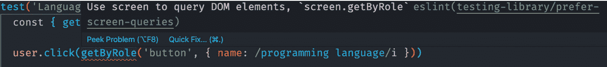

# *第六章*：实现测试的额外工具和插件

在前面的章节中，我们学习了 React Testing Library 的基础知识以及如何使用该工具测试从简单到复杂的组件。在本章中，我们将学习如何通过使用额外的工具来提高我们的生产力。我们将安装并使用一些插件，以帮助我们避免常见错误并遵循 React Testing Library 的最佳实践。

我们将添加一个库来审计并提高应用程序的可访问性。我们将确保我们使用 Testing Playground 选择最佳的 React Testing Library 查询方法。最后，我们将通过使用 Wallaby.js 从代码编辑器快速获取测试状态反馈来提高我们的生产力。

在本章中，我们将涵盖以下主要主题：

+   使用`eslint-plugin-testing-library`来遵循最佳实践，避免在使用 React Testing Library 时犯常见错误

+   使用`eslint-plugin-jest-dom`来遵循最佳实践，避免在使用`jest-dom`时犯常见错误

+   使用`jest-axe`来提高应用程序的可访问性

+   使用 Testing Playground 选择 Testing Library 推荐的查询

+   使用 Wallaby.js 提高我们的测试生产力

本章中的技能将提高你的生产力，并增强你使用 Testing Library 最佳实践测试 React 应用程序的能力。

# 技术要求

对于本章的示例，你需要在你的机器上安装 Node.js。我们将使用`create-react-app` CLI 工具来展示所有代码示例。如果需要，请在开始本章之前熟悉这个工具。本章将提供代码片段来理解要测试的代码，但目标是理解如何测试代码。

你可以在[`github.com/PacktPublishing/Simplify-Testing-with-React-Testing-Library/tree/master/Chapter06`](https://github.com/PacktPublishing/Simplify-Testing-with-React-Testing-Library/tree/master/Chapter06)找到本章的代码示例。

# 使用 Testing Library ESLint 插件实现最佳实践

在本节中，你将学习如何安装和使用`eslint-plugin-testing-library`和`eslint-plugin-jest-dom`。这些插件的目的是对你的测试代码进行审计，并帮助你编写遵循`jest-dom`最佳实践的测试。插件通过突出可以改进的区域并提供重构代码的建议来工作。

在安装插件之前，我们需要在我们的项目中安装**ESLint**。ESLint 是一个统计分析并通知你代码中问题的工具。你可以把 ESLint 想象成有人在你的肩膀上查看，指出你可能需要更长的时间自己调试的问题。例如，你可以创建以下函数：

```js
const reverseWord = str => str.split('').reverse().join('')
```

在前面的代码中，我们有一个`reverseWord`函数，该函数反转传入的字符串。如果我们用单词`packt`调用该函数，我们得到以下结果：

```js
reverseWord('packt') // tkcap
```

在前面的代码中，当我们将 `packt` 作为参数传递给函数时，我们得到的结果是 `tkcap`。然而，如果我们错误地拼写函数名称并运行代码，我们会得到以下结果：


图 6.1 – reverseWord 函数名称拼写错误

在之前的代码中，控制台输出指示 `ReferenceError`。错误指的是解释器没有在文件中找到定义的函数，名为 `reverseeWord`。问题在于用户错误地多加了一个 `e` 在函数名称中。我们可以通过在我们的项目中安装和配置 ESLint 来创建一个更好的工作流程，以帮助调试问题。

如果你正在使用 `create-react-app` 为你的项目，那么 ESLint 应该会自动为你安装。对于尚未安装 ESLint 的项目，请使用以下命令：

```js
npm install eslint --save-dev
```

之前的命令将 ESLint 作为开发依赖项安装到你的项目中。

接下来，我们可以创建一个配置文件来告诉 ESLint 我们希望它如何检查我们的文件：

```js
{
  "extends": "eslint:recommended",
  "parserOptions": {
    "ecmaVersion": 2021,
    "sourceType": "module"
  }
}
```

在之前的代码中创建的以 `json` 格式的配置文件包含一些设置，告诉 ESLint 如何检查我们的文件。`"extends"` 键设置为 `"eslint:recommended"`。这意味着我们希望使用 ESLint 推荐的检查规则。`"parserOptions"` 键设置为包含两个键的对象。`"ecmaVersion"` 键设置为 `"sourceType"`，`"module"` 键设置为 `"module"`，这意味着我们的代码将支持 ES 模块。ESLint 可以以多种方式配置来检查你的项目文件。

注意

请参阅 *配置 ESLint* ([`eslint.org/docs/user-guide/configuring/`](https://eslint.org/docs/user-guide/configuring/)) 获取更多详细信息。

使用以下命令来运行 ESLint 检查你的项目文件：

```js
npx eslint .
```

在之前的命令中，我们使用 `npx` 命令来运行 ESLint 检查所有项目文件。请注意，`npx` 允许你快速执行 `npm` 包，无论该包是否已在本地的机器上本地或全局安装，或者根本未安装。在运行命令后，我们在控制台中收到以下输出：


图 6.2 – ESLint 输出

在之前的命令中，ESLint 通知我们代码中有两个错误。第一个错误说 `reverseWord` 函数从未在行 `1` 上使用，引用了 ESLint 的 `no-unused-vars` 规则。第二个错误说行 `3` 上的 `reverseeWord` 在文件中任何地方都没有定义，引用了 ESLint 的 `no-undef` 规则。我们还可以通过在代码编辑器中直接显示输出来增强我们的 ESLint 工作流程，以在学习代码运行之前了解任何潜在的问题。例如，VSCode 和 Atom 代码编辑器都有第三方工具，我们可以安装这些工具以在编辑器中直接显示问题。

注意

请参阅*ESLint*([`marketplace.visualstudio.com/items?itemName=dbaeumer.vscode-eslint`](https://marketplace.visualstudio.com/items?itemName=dbaeumer.vscode-eslint))以获取 VSCode 编辑器扩展的详细信息。或者，你可以查阅*linter-eslint*([`atom.io/packages/linter-eslint`](https://atom.io/packages/linter-eslint))以获取 Atom 编辑器插件的安装和配置细节。

将 lint 输出直接显示在代码编辑器中比手动通过命令行运行 ESLint 提供更快的反馈。现在你已经了解了如何启动 ESLint，我们将在下一节中安装和配置`eslint-plugin-testing-library`。

## 安装和配置 eslint-plugin-testing-library

在本节中，我们将学习如何在我们的应用程序中安装和配置`eslint-plugin-testing-library`。使用以下命令安装插件：

```js
npm install --save-dev eslint-plugin-testing-library
```

上述命令将`eslint-plugin-testing-library`作为开发依赖项安装到你的项目中。现在插件已安装，我们可以将其添加到我们的 ESLint 配置文件中：

```js
    "overrides": [
    {
      "files": ["*.test.js"],
      "extends": [
        "plugin:testing-library/react"
      ]
```

在前面的代码中，我们在 ESLint 配置中创建了一个`"overrides"`部分，以针对以`.test.js`结尾的任何文件。然后，我们在配置文件中的`extends`数组中添加了`plugin:testing-library/react`。我们添加了插件的 React 版本以获得 React 特定的规则和来自 DOM Testing Library 的基本规则。该插件应用了一组特定的 linting 规则，这些规则专门针对 React 应用程序。例如，`no-dom-import`规则不允许直接从 DOM Testing Library 导入，这很有用，因为 React Testing Library 重新导出 DOM Testing Library 的所有内容，消除了直接导入的需要。

注意

请参阅*支持规则*([`github.com/testing-library/eslint-plugin-testing-library#supported-rules`](https://github.com/testing-library/eslint-plugin-testing-library#supported-rules))以获取 React 特定应用的规则完整列表。

注意`react-app`入口也被包含在数组中。`react-app`入口添加了由`create-react-app`设置的 ESLint 规则。现在我们在项目中设置了插件，我们可以编写测试。我们将测试一个允许用户选择编程语言的下拉组件：


图 6.3 – 下拉组件

在前面的屏幕截图中，你可以看到一个下拉列表，列出了用户可以点击以选择四种编程语言。当用户选择一种语言时，我们会得到以下内容：


图 6.4 – 选定的下拉选项

在这里，你可以查看文本**你选择了：JavaScript**，这是当用户选择**JavaScript**选项时出现的。我们可以编写一个测试来验证所选语言是否显示在屏幕上：

```js
test('LanguageDropdown, given selected menu item, displays   selection', async () => {
  render(<LanguageDropdown />)
  user.click(screen.getByRole('button', { name: /programming language/I }))
  user.click(screen.getByRole''menuite'', { name: /javascript/i }))
  user.click(screen.getByRole''menuite'', { name: /javascript/i }))
```

在前面的代码中，首先，我们在 DOM 中渲染了`LanguageDropdown`组件。接下来，我们点击了**编程语言**按钮。然后，我们从菜单选项中选择**JavaScript**。接下来，我们将验证所选选项是否显示在屏幕上：

```js
  const selection = await waitFor(() =>
    screen.getByRole('heading', { name: /you selected:       javascript/i })
  )
```

在前面的代码中，我们使用 React Testing Library 的`waitFor`方法来获取包含所选选项的文本的元素。当需要等待 DOM 中的元素时，可以使用`waitFor`方法。然而，根据`eslint-plugin-testing-library`，在这种情况下使用`waitFor`并不是选择元素的最佳方式：


图 6.5 – findByRole 代码检查建议

在之前的屏幕截图中，包含`waitFor`方法的代码被 ESLint 下划线标注，引起了我们的注意。当我们悬停在`waitFor`方法代码上时，我们得到反馈，表明首选的查询是`findByRole`，这是通过`eslint-plugin-testing-library`的`prefer-find-by`规则实现的。

在*第五章*，“使用 React Testing Library 重构遗留应用程序”，我们学习了如何使用`findByRole`查询来选择需要时间出现在屏幕上的元素。`prefer-find-by`规则是一个可修复的规则；这意味着我们可以选择让问题代码自动为我们修复。

自动修复问题的简单方法是将代码编辑器设置为在保存文件时自动解决任何可修复的问题。请参阅您各自代码编辑器的文档以获取说明。如果由于某种原因，您的编辑器没有“保存时修复”功能，您可以在命令行中运行`eslint --fix`或通过`git`使用预提交钩子。作为最后的手段，您始终可以选择参考与`eslint-plugin-testing-library`相关的文档，其中包括`prefer-find-by`规则和其他规则的建议。一旦我们重构了问题代码，我们得到以下输出：

```js
  const selection = await screen.findByRole('heading', {
    name: /you selected: javascript/i
  })
  expect(selection).toBeInTheDocument()
})
```

在前面的代码中，将`waitFor`代码替换为`findByRole`查询方法。该代码具有更简洁的语法，其行为类似于`waitFor`代码，并满足代码检查规则。最后，我们断言所选代码在文档中。

一些规则在`eslint-plugin-testing-library`的 React 版本中不是自动启用的。例如，在 React Testing Library 的先前版本中，常见的选择器编写方式如下：

```js
  const { getByRole } = render(<LanguageDropdown />)
  user.click(getByRole('button', { name: /programming     language/i }))
  user.click(getByRole('menuitem', { name: /javascript/i }))
```

在前面的代码中，我们通过解构渲染的组件来访问查询方法。最新的 React Testing Library 版本建议使用 `screen` 对象来访问查询方法，以获得更好的用户体验。`screen` 对象允许您使用编辑器的自动完成功能来访问查询方法，而不是通过渲染组件进行显式的解构。我们可以将 `prefer-screen-queries` 规则添加到我们的 ESLint 配置文件中，以强制执行这种选择查询方法的方式：

```js
  "rules": {
    "testing-library/prefer-screen-queries": "error"
  }
```

在前面的代码中，我们在配置文件中添加了一个 `"rules"` 键。当我们要添加特定的规则来强制执行我们的代码时，会使用 `"rules"` 键。在 `"rules"` 键内部，我们添加了 `"testing-library/prefer-screen-queries"` 键，并将其设置为 `"error"`。如果我们有一个项目设置了一个运行 ESLint 的 linting 脚本来跨文件运行，错误将触发一个退出代码来停止文件执行，从而清楚地表明当前代码不适合使用。

现在，有了这个规则，使用解构的先前代码将被 ESLint 标记：



图 6.6 – prefer-screen-queries 检查器建议

在前面的屏幕截图中，`getByRole` 被 ESLint 下划线标记，以引起我们对查询问题的注意。当我们悬停在查询上时，我们会得到反馈，表明首选的方法使用 `screen` 通过 `eslint-plugin-testing-library` 的 `prefer-screen-queries` 规则来查询 DOM 元素。

与前一个示例中的 `prefer-find-by` 规则不同，`prefer-screen-queries` 不是一个可修复的规则。这意味着我们需要手动修复代码。当我们重构代码时，我们会得到以下结果：

```js
render(<LanguageDropdown />)
user.click(screen.getByRole('button', { name: /programming   language/i }))
user.click(screen.getByRole('menuitem', { name: /javascript/i }))
```

在前面的代码中，DOM 选择器已经被重构为使用 `screen` 对象，满足了 `prefer-screen-queries` 规则。与使用解构查询方法的版本相比，代码看起来也更简洁。

在某些情况下，我们可能希望规则在 ESLint 在项目文件中运行时提供警告而不是错误。警告不会停止代码执行；然而，它将作为对用户的一个提醒，在提交代码之前移除文件中突出显示的代码。例如，在构建测试时，使用 `debug` 方法查看当前 DOM 的状态是很常见的：

```js
  render(<LanguageDropdown />)
  screen.debug()
```

在前面的代码中，`debug` 方法用于在渲染 `LanguageDropdown` 组件后，将当前 DOM 输出记录到控制台。`debug` 方法将在编辑器中突出显示，如下所示：


图 6.7 – no-debug 检查器建议

在前面的截图上，ESLint 用下划线标记了 `debug`，以引起我们对查询问题的注意。当我们悬停在查询上时，我们得到反馈，表明应该通过 `eslint-plugin-testing-library` 的 `no-debug` 规则来移除该方法。我们常常忘记在提交工作之前移除控制台的日志代码，因此 `no-debug` 规则作为一个有用的提醒来移除它。

现在，你知道如何安装和配置 ESLint 与 `eslint-plugin-testing-library`，以帮助避免问题并在编写测试时遵循最佳实践。

在下一节中，我们将通过安装另一个针对 `jest-dom` 特定的插件来更进一步。

## 安装和配置 eslint-plugin-jest-dom

在上一节中，我们安装并配置了 ESLint 和 `eslint-plugin-testing-library`。在本节中，我们将教你如何安装和配置 `eslint-plugin-jest-dom`，确保我们使用 `jest-dom` 遵循最佳实践。使用以下命令安装插件：

```js
npm install --save-dev eslint-plugin-jest-dom
```

之前的命令将 `eslint-plugin-jest-dom` 作为项目中的开发依赖项安装。现在插件已安装，我们可以将其添加到我们的 ESLint 配置文件中：

```js
{
  "extends": ["react-app", "plugin:jest-dom/recommended"]
}
```

在前面的代码中，我们在配置文件中的 `extends` 数组中添加了 `plugin:jest-dom/recommended`。该插件的 `recommended` 配置用于自动包含一组标准规则，以强制执行 `jest-dom` 的最佳实践。我们将测试一个允许用户选择他们首选编程语言的 `checkbox` 组件：


图 6.8 – 语言复选框组件

在前面的截图上，你可以看到有四个编程语言的复选框，用户可以从中选择。当用户选择一种语言时，我们得到以下信息：


图 6.9 – 已选语言复选框

在前面的截图上，用户选择了 **JavaScript**，这导致相关的复选框被选中，文本颜色变为 *绿色*，字体粗细变为 *粗体*。我们可以编写一个测试来验证所选语言的复选框被选中，并且具有与用户在屏幕上看到的文本颜色和字体粗细相匹配的预期类：

```js
test('LanguageCheckbox, given selected item, item is checked',   () => {
  render(<LanguageCheckBox />)
  const jsCheckbox = screen.getByRole('checkbox', { name: /    javascript/i })
  user.click(jsCheckbox)
```

在前面的代码中，我们将 `LanguageCheckBox` 组件渲染到 DOM 中。接下来，我们获取 `jsCheckbox` 变量，并点击它。接下来，我们将对预期的输出进行断言。首先，我们尝试使用 `toHaveAttribute` Jest 匹配器：

```js
  expect(jsCheckbox).toHaveAttribute("checked");
```

在前面的代码中，我们使用 `toHaveAttribute` 来验证在点击后复选框是否有 `checked` 属性。然而，我们的测试将因为这个匹配器而失败，因为它只寻找添加到元素中的显式 `checked` 属性，这些元素通常用于我们想要预选中复选框的情况。在我们的情况下，我们正在测试用户点击结果 DOM 中复选框的结果，因此我们需要一个不同的匹配器。接下来，我们尝试使用 `toHaveProperty` Jest 匹配器：

```js
  expect(jsCheckbox).toHaveProperty("checked", true);
```

在前面的代码中，我们使用 `toHaveProperty` Jest 匹配器来验证复选框的 `checked` 属性被设置为 `true`。这个匹配器在技术上是可行的，但它读起来不是很清楚。此外，当我们悬停在匹配器上时，我们得到以下输出：


图 6.10 – prefer-checked 检查器建议

在前面的截图上，`toHaveProperty` 匹配器被 ESLint 下划线标注以引起我们对匹配器问题的注意。当我们悬停在匹配器上时，我们得到反馈表明应该通过 `eslint-plugin-jest-dom` 的 `prefer-checked` 规则将其替换为 `jest-dom` 的 `toBeChecked` 匹配器。该规则可以自动修复，并且如果我们的代码编辑器设置正确，它将为我们重构匹配器。当我们重构我们的匹配器时，我们得到以下输出：

```js
  expect(jsCheckbox).toBeChecked()
```

在前面的代码中，我们使用 `toBeChecked` `jest-dom` 匹配器来验证复选框是否被选中。现在我们有一个匹配器，它消除了先前匹配器版本中的任何问题，并且读起来要好得多。接下来，我们将断言预期的类：

```js
expect(screen.getByText(/javascript/i).className).  toContain('text-success font-weight-bold')
```

在前面的代码中，我们通过 `javascript` 文本访问元素内部的 `className` 属性以验证它是否包含 `text-success` 和 `font-weight-bold` 类。然而，当我们悬停在 `toContain` 上时，我们得到以下反馈：


图 6.11 – prefer-to-have-class 检查器建议

在前面的截图上，`toContain` 匹配器被 ESLint 下划线标注以引起我们对匹配器问题的注意。当我们悬停在匹配器上时，我们得到反馈表明应该通过 `jest-dom` 的 `toHaveClass` 匹配器替换它，这是通过 `eslint-plugin-jest-dom` 的 `prefer-to-have-class` 规则实现的。与前面的例子类似，`prefer-to-have-class` 规则可以自动修复，并且如果我们的代码编辑器设置正确，它将为我们重构匹配器。当我们重构代码时，我们得到以下输出：

```js
  expect(screen.getByText(/javascript/i)).toHaveClass(
    'text-success font-weight-bold'
  )
```

在前面的代码中，我们将代码重构为使用 `jest-dom` 的 `toHaveClass` 匹配器。现在我们有一个比原始示例更容易实现和阅读的匹配器。

现在你已经了解了如何安装和使用 `eslint-plugin-jest-dom` 插件来使用遵循 `jest-dom` 最佳实践的断言匹配器。在下一节中，我们将学习如何安装和使用一个包来提高我们组件源代码的易访问性。

# 使用 jest-axe 测试易访问性

在本节中，我们将学习如何使用一个旨在帮助我们改进功能易访问性的工具。有许多工具可以帮助通过自动化审计和报告问题的过程来提高易访问性，例如 Wave ([`wave.webaim.org/`](https://wave.webaim.org/)) 和 Lighthouse ([`developers.google.com/web/tools/lighthouse`](https://developers.google.com/web/tools/lighthouse))。然而，没有单个工具可以保证整个应用程序的易访问性。易访问性审计工具是有帮助的，但它们不能取代由人类进行的手动易访问性审计的需求。例如，当在文本行中首次使用缩写时，应包括相关的扩展版本：

```js
Structured Query Language (SQL) is used to manage data in relational databases.
```

在前面的句子中，扩展版本 `结构化查询语言` 与其缩写形式 `SQL` 一起包含。该句子需要手动检查以验证易访问性。我们将学习如何使用 `jest-axe`，这是一个为 Jest 添加自定义匹配器并具有与 ESLint 类似行为的工具。该工具有助于在您的代码中查找和报告常见的易访问性问题，例如没有替代文本的图像按钮或没有相关标签的 `inputs`。使用以下命令安装此工具：

```js
npm install --save-dev jest-axe
```

之前的命令在项目中安装了 `jest-axe` 作为开发依赖。现在工具已安装，我们可以在测试中使用它。首先，我们将测试图像按钮的易访问性：


图 6.12 – 一个不可访问的图像按钮

在前面的屏幕截图中，我们有一个作为 **提交** 按钮行为的图像。以下是该图像按钮的源代码：

```js
import loginImg from './image/login.png'
<input src={loginImg} type="image" />
```

在前面的代码中，我们将导入一个图像并将其作为 `image` 类型的输入的 `source`。现在我们将编写一个测试来验证该元素对用户是可访问的：

```js
import { render } from '@testing-library/react'
import { axe } from 'jest-axe'
import 'jest-axe/extend-expect'
import NoAccessibility from './NoAccessibility'
```

在前面的代码中，首先，我们从 React Testing Library 中导入 `render` 方法。然后，我们从 `jest-axe` 中导入 `axe` 方法。`axe` 方法是我们将用来审计我们组件的易访问性的方法。接下来，我们导入 `jest-axe/extend-expect`，它为 Jest 添加了一个特殊的匹配器，以便以可读的格式报告审计结果。最后，我们导入 `NoAccessibility` 组件进行测试。接下来，我们将编写主要的测试代码：

```js
  const { container } = render(<NoAccessibility />)
  const results = await axe(container)
  expect(results).toHaveNoViolations()
```

在前面的代码中，首先，我们从渲染的组件中解构 `container`。与查询方法不同，我们可以在不违反 DOM 测试库的最佳实践的情况下从渲染的组件中解构 `container`，因为它不在 `screen` 对象上。`container` 是包裹你的待测试 React 组件的 `div` 元素。

接下来，我们将 `container` 作为参数传递给 `axe` 方法，并将其存储在 `results` 变量中。`axe` 方法将在我们的待测试组件上运行可访问性审计。最后，我们使用 `toHaveNoViolations` 匹配器断言结果没有可访问性问题。如果没有发现违规，测试将通过。

然而，如果发现违规，测试将失败并提供反馈以解决这些问题。当我们运行测试时，我们得到以下输出：


图 6.13 – 不可访问图像按钮测试输出

前面的屏幕截图显示，在 `NoAccessibility` 组件中发现了可访问性违规，导致测试失败并提供反馈。首先，反馈表明 `input` 元素是问题的来源。接下来，我们看到整个元素打印在屏幕上。然后，我们得到 `"Image buttons must have alternate text (input-image-alt)"` 消息，告知我们为什么该元素未能通过审计。接下来，我们得到一些可以实施的建议来解决该问题。最后，我们得到一个超链接，我们可以通过它来深入了解问题。我们将通过提供 `alt` 属性来解决该问题：

```js
<input src={loginImg} type="image" alt="login" />
```

在前面的代码中，我们添加了一个值为 `login` 的 `alt` 属性。现在，当我们重新运行我们的测试时，我们得到以下结果：


图 6.14 – 可访问图像按钮测试输出

在前面的屏幕截图中，测试结果显示，在可访问性审计中，`NoAccessibility` 没有违反规则，测试通过且没有违反规则。接下来，我们将测试包含图像的列表的可访问性：


图 6.15 – 不可访问列表

在前面的屏幕截图中，我们有一个包含 `image` 元素的未有序列表。以下是列表的源代码：

```js
      <ul>
        <li>Building with React</li>
        <li>Testing with React Testing Library</li>
        
      </ul>
```

在前面的代码中，我们有一个包含两个 `list item` 子元素和一个 `image` 子元素的未有序列表元素。我们的测试代码将与之前图像按钮的测试代码相同。这里唯一的区别是我们传递给 `render` 方法的组件。因此，对于这个例子，我们只关注测试结果：


图 6.16 – 不可访问列表测试结果

上一张截图显示，在无序列表组件中发现了可访问性违规，这导致测试失败并给出反馈。首先，反馈表明问题源是一个 `ul` 元素。接下来，我们看到整个元素在屏幕上打印出来。然后，我们得到 `"<ul> 和 <ol> 必须仅直接包含 <li>、<script> 或 <template> 元素（列表）"` 的消息，这有助于我们理解为什么该元素未能通过审核。

接下来，我们得到有关如何解决问题的建议。最后，我们得到一个超链接，我们可以点击以深入了解问题。我们将通过将图像移动到 `li` 元素内来解决问题：

```js
      <ul>
        <li>Building with React</li>
        <li>Testing with React Testing Library</li>
        <li>
          
        </li>
      </ul>
```

在之前的代码中，我们将 `image` 元素包裹在一个 `li` 元素内。当我们重新运行测试时，测试将通过并返回与我们在图像按钮之前测试中看到的结果相似的结果。现在你知道如何使用 `jest-axe` 来提高使用 Jest 的 React 应用的可访问性。重要的是要重申，自动化可访问性工具有助于提高我们应用程序为各种最终用户工作的能力。然而，它们不能捕捉到所有问题，也不能替代人工审核。

接下来，我们将学习如何使用工具来通过 React Testing Library 加速我们的元素选择。

# 使用 Testing Playground 选择最佳查询

在本节中，我们将学习如何使用 **Testing Playground**。这是一个使你更容易确定正确的 DOM Testing Library 查询选择器的工具。Testing Playground 允许你将 HTML 粘贴到一个交互式网站上，这样你就可以在浏览器中渲染元素时点击它们。这使得你可以了解哪些 DOM Testing Library 查询可以用来选择特定的元素。

工具总是根据 DOM Testing Library 对具有多种选择方式的元素的查询推荐顺序建议查询。此外，该工具允许你将选择器复制到测试代码中使用。我们将探讨两种使用 Testing Playground 的方法：首先是通过网站，其次是通过 Chrome 扩展程序。

## 使用 Testing Playground 网站选择查询

在本节中，我们将学习如何通过其网站使用 Testing Playground。在本书前面的示例中，我们使用了 `debug` 方法在编写测试时将组件的结果 HTML 记录到控制台。`debug` 方法的局限性之一是它没有功能可以让你将输出记录到浏览器并测试不同的查询方法来选择元素。

我们可以在测试文件中使用 `logTestingPlaygroundURL` 方法将结果 HTML 记录到浏览器中的 *Testing Playground* ([`testing-playground.com/`](https://testing-playground.com/))，并利用该网站的查询选择器功能。例如，我们可能正在为以下 `MoreInfoPopover` 组件选择元素进行测试：


图 6.17 – 弹出组件

在前面的截图上，我们有一个带有文本`button`元素的`button`元素，使用 DOM 测试库查询，因此我们开始测试如下：

```js
import { render, screen } from '@testing-library/react'
import MoreInfoPopover from './MoreInfoPopover'
it('logs output to Testing Playground', () => {
  render(<MoreInfoPopover />)
  screen.logTestingPlaygroundURL()
})
```

在前面的代码中，我们导入了 React 测试库的`render`和`screen`方法以及待测试的组件。在主测试代码内部，首先，我们在 DOM 中渲染组件。接下来，我们调用`logTestingPlaygroundURL`方法。当我们运行测试时，我们得到以下输出：


图 6.18 – 测试游乐场链接

在前面的截图上，我们有一个唯一的链接，可以访问测试游乐场网站并查看我们的组件渲染的 HTML。当我们点击链接时，我们应该看到以下类似的内容：


图 6.19 – 测试游乐场 HTML 结构

在前面的截图上，链接将我们导航到测试游乐场网站。首先，我们看到一个包含我们组件 HTML 结构的部分。接下来，我们看到渲染的浏览器输出，如下所示：


图 6.20 – 测试游乐场浏览器输出

在前面的截图上，我们可以看到一个包含我们组件浏览器输出的部分。注意，我们没有看到包含相关样式的完整结果。测试游乐场网站仅显示 HTML 内容。接下来，我们看到一个**建议查询**部分，如下所示：


图 6.21 – 测试游乐场建议查询

在前面的截图上，我们在浏览器输出部分点击了一个`button`元素。`getByRole`查询是根据 HTML 结构选择按钮的最佳方式。此外，我们还可以看到**这太棒了。发货**的消息，这表明我们应该进一步使用此查询。

以下截图显示了其他可选的选项，用于选择元素：


图 6.22 – 测试游乐场查询优先级选项

在前面的代码中，我们可以看到多个选项，按照优先级顺序选择元素。根据`button`元素的 HTML 结构，我们可以选择两种方式来选择元素 – *通过其角色* 和 *通过其文本值*。其他列出的查询对于按钮不可用，因此显示**不可用**。如果我们决定选择**文本**查询选项，我们应该看到以下截图类似的内容：


图 6.23 – 测试游乐场文本查询选项

在前面的屏幕截图中，我们可以看到用于选择按钮的文本`getByText`，它不是选择所选元素的最佳查询。一旦我们决定要抓取的查询，我们就可以点击**建议查询**框最右侧的图标来复制选择测试中元素的所需代码。

现在你已经知道了如何使用`logTestingPlaygroundURL`方法通过 Testing Playground 网站选择元素。使用 Testing Playground 网站有一个显著的限制。当我们点击**更多信息**按钮时，我们应该看到一个弹出窗口出现在按钮下方。由于它只复制 HTML 而不是相关的 JavaScript 来渲染按钮点击的结果，我们无法使用 Testing Playground 网站执行此操作。

在下一节中，我们将学习如何使用 Testing Playground Chrome 扩展程序来克服这个限制。

## 使用 Testing Playground Chrome 扩展程序选择查询

在本节中，我们将安装和使用 Testing Playground Chrome 扩展程序来克服使用 Testing Playground 网站的限制。此扩展程序的好处是允许你在运行应用程序的同一浏览器中本地使用 Testing Playground 功能。该扩展程序目前仅适用于 Google Chrome 浏览器，所以如果需要，请确保安装它。

通过 Chrome Web Store 安装*Testing Playground Chrome 扩展程序*([`chrome.google.com/webstore/detail/testing-playground/hejbmebodbijjdhflfknehhcgaklhano`](https://chrome.google.com/webstore/detail/testing-playground/hejbmebodbijjdhflfknehhcgaklhano))。一旦扩展程序安装完成，就会在你的**Chrome 开发者工具**中添加一个新的**Testing Playground**标签页。

返回到上一节中的`MoreInfoPopover`组件，我们可以编写一个测试来验证当用户点击**更多信息**按钮时，弹出窗口是否显示：

```js
test('MoreInfoPopover, given clicked button, displays popover',   () => {
  render(<MoreInfoPopover />)
```

在前面的代码中，我们在 DOM 中渲染了`MoreInfoPopover`。接下来，我们将使用 Testing Playground 扩展程序来找到按钮的首选查询选择器：

![Figure 6.24 – The Testing Playground Chrome extension]

![img/Figure_6.24_B16887.jpg]

图 6.24 – Testing Playground Chrome 扩展程序

在前面的屏幕截图中，我们可以看到一个为`getByRole`查询选择器添加的标签页。当我们复制选择器时，我们得到要添加到我们的测试中的查询代码：

```js
  screen.getByRole('button', {  name: /more info/i})
```

在前面的代码中，我们复制了`getByRole`选择器以访问**更多信息**按钮。接下来，我们将使用扩展程序来帮助选择弹出窗口，该弹出窗口在点击按钮后显示：


图 6.25 – 弹出查询选择器

在前面的屏幕截图中，`getByRole`是在浏览器中选择`popover`元素后建议的查询。现在我们有了编写剩余测试代码所需的所有选择器：

```js
  user.click(screen.getByRole('button', { name: /more info/i     }))
  const popover = await screen.findByRole('heading', { name: /     lorem ipsum/i })
  expect(popover).toBeInTheDocument()
```

在前面的代码中，首先，我们通过其标题点击 `popover` 元素并将其存储在一个变量中。请注意，我们使用了 `findByRole` 而不是 `getByRole` 查询。Testing Playground 只提供 `getBy*` 查询，因此可能需要根据情况修改复制的查询。最后，我们断言 `popover` 元素在 DOM 中。当我们运行测试时，我们得到以下结果：


图 6.26 – 弹出测试结果

在前面的屏幕截图中，结果显示 `MoreInfoPopover, given clicked button, displays popover` 测试按预期通过。现在您知道了如何安装和使用 Testing Playground Chrome 扩展来增强编写测试时的工作流程。Testing Playground 网站和扩展是处理 DOM 测试库时的优秀辅助工具。

在下一节中，我们将学习如何使用一个工具，该工具将加快编写测试时从开始到完成的结果反馈。

# 使用 Wallaby.js 提高我们的测试生产力

在本节中，我们将学习如何通过使用 Wallaby.js 生产力工具来提高我们的生产力。Wallaby.js 通过在后台通过无头 Chrome 浏览器自动运行您的测试来实现。还有在 Node.js 或 Phantom.js 等其他环境中运行测试的选项，并带有自定义配置文件。Wallaby.js 通过在代码编辑器内提供即时测试结果来帮助加快您的工作流程，因此您可以在无需保存和运行测试脚本查看结果的情况下进行输入。

Wallaby.js 提供了许多功能，例如以下内容：

+   **时间旅行调试**：这允许您轻松地导航代码以定位错误源。

+   **测试故事查看器**：这提供了在单个紧凑屏幕上查看与您的测试相关联的代码的能力。

+   **内联代码覆盖率**：这会告知您代码编辑器内每行代码的测试覆盖率。

    注意

    请参考 Wallaby.js 文档网站上的 *功能* 部分 ([`wallabyjs.com/#features`](https://wallabyjs.com/#features)) 以获取功能列表的完整列表。

## 安装和配置 Wallaby.js

在本节中，我们将学习如何为 Visual Studio Code 编辑器安装和设置 Wallaby.js。请参考 Wallaby.js 文档网站上的 *安装* 部分 ([`wallabyjs.com/download/`](https://wallabyjs.com/download/)) 以获取完整的安装选项列表。要开始，请通过 *VSCode 市场 place* ([`marketplace.visualstudio.com/items?itemName=WallabyJs.wallaby-vscode`](https://marketplace.visualstudio.com/items?itemName=WallabyJs.wallaby-vscode)) 将 Wallaby.js VSCode 扩展添加到您的编辑器中。一旦扩展被安装，我们就可以配置它以在我们的项目中工作。

配置 Wallaby.js 最快最简单的方法是使用自动配置。使用特定版本的工具（如`create-react-app 版本 3`或更高版本，或`Jest 版本 24`或更高版本）的项目符合自动配置条件。

对于不符合自动配置的项目，请参考 Wallaby.js 文档中的“配置文件”部分（[`wallabyjs.com/docs/intro/config.html?editor=vsc#configuration-file`](https://wallabyjs.com/docs/intro/config.html?editor=vsc#configuration-file)），根据您的项目设置获取具体的配置信息。

使用命令面板在 VSCode 中启动 Wallaby.js 并使用自动配置：


图 6.27 – 选择配置

在前面的屏幕截图中，我们在命令面板中输入`wallaby`以显示可用的 Wallaby.js 命令。我们将点击**Wallaby.js: 选择配置**选项：


图 6.28 – 自动配置选项

在前面的屏幕截图中，我们已选择**自动配置 <项目目录>**和**自动配置 <自定义目录>**选项。我们将选择**<项目目录>**以使用当前项目的目录。一旦选择配置，Wallaby.js 将启动并运行我们的测试，直接在代码编辑器的测试文件中提供反馈，如下面的屏幕截图所示：


图 6.29 – Wallaby.js 增强测试输出

在前面的屏幕截图中，我们可以看到一个在“使用测试游乐场选择最佳查询”部分创建的测试，并增强了 Wallaby.js 的功能。首先，我们看到行号左侧有绿色的方块形状，表示所有测试行都已通过。接下来，我们看到 Wallaby.js 的**调试**、**查看故事**、**分析**和**聚焦**功能的链接，我们可以点击它们来从特定功能的视角分析测试。

最后，我们看到测试运行时间`45ms`记录在测试旁边。现在您已经了解了如何安装和配置 Wallaby.js。您也应该了解 Wallaby.js 直接在测试文件中添加的基本增强功能。

在下一节中，我们将介绍如何使用 Wallaby.js 的交互式测试输出功能编写测试。

## 使用交互式测试输出编写测试

在本章的“使用测试游乐场选择最佳查询”部分，我们为`MoreInfoPopover`组件编写了`MoreInfoPopover, given clicked button, displays popover`测试。现在让我们来了解一下如何使用 Wallaby.js 创建相同的测试。

首先，我们将测试组件渲染到 DOM 中，并使用`debug`方法记录当前 HTML 输出的状态：


图 6.30 – Wallaby.js 内联调试输出

在前面的屏幕截图中，我们使用了 Wallaby.js 的 `//?` 命令将 `debug` 的结果直接记录在代码编辑器中。当我们将鼠标悬停在方法上时，输出会自动显示在 `debug` 的右侧。此功能加快了我们的工作流程，因为通常情况下，我们不得不从命令行执行测试运行器来查看输出。

接下来，我们将添加查询以选择 DOM 元素：

![图 6.31 – 查询错误]


图 6.31 – 查询错误

在前面的屏幕截图中，我们有一个测试失败，这是由于 React Testing Library 没有找到名为 `lorem ipsum` 的 `heading` 元素。Wallaby.js 以两种方式提高了我们发现错误的能力。首先，我们在测试名称左侧和具体错误发生的行号处看到一个红色的方块形状。内联代码通知帮助我们快速确定我们应该关注的位置以定位错误的根源。其次，当我们悬停在 `test` 方法上时，React Testing Library 的测试结果输出会直接在代码编辑器中显示。

此功能加快了我们的工作流程，因为 Wallaby.js 在我们向测试添加新代码时重新运行我们的测试并提供反馈。此外，我们甚至不必保存测试文件就能获得反馈。我们还可以在 **Wallaby.js 测试** 控制台中查看测试反馈：


图 6.32 – Wallaby.js 测试控制台

在前面的屏幕截图中，我们可以看到与在测试文件中更新代码时直接在编辑器中看到的类似的 React Testing Library 反馈，但现在它是一个扩展视图。此外，我们还可以看到失败测试与通过测试的数量对比，以及可点击的链接“启动覆盖率 & 测试资源管理器”，这是一个允许您查看每个文件的视觉测试覆盖率的特性，以及“搜索测试”，这是一个允许您快速在项目中搜索任何测试的特性。

在 Wallaby.js 的编辑器功能帮助下调试失败后，我们了解到名为 `lorem ipsum` 的 `heading` 元素并未立即显示。利用我们对 Testing Library 查询的了解，我们可以确定该元素应该使用异步的 `findBy*` 查询来选择：

```js
  const popover = await screen.findByRole('heading', { name: /     lorem ipsum/i })
```

在前面的代码中，我们将选择器更新为 `findByRole`。在更新选择器后，我们立即在编辑器中获得了反馈：

![图 6.33 – 查询重构]


图 6.33 – 查询重构

在前面的屏幕截图中，我们看到所有行号左侧都有绿色的正方形形状。这表明我们已经成功重构了测试代码到工作状态。我们还编写了一个断言来验证测试是否按预期通过。现在您知道了如何使用 Wallaby.js 获取即时编辑反馈和测试调试功能。当您需要节省运行和调试测试的时间时，Wallaby.js 是一个非常有用的工具。

# 摘要

本章向您介绍了使用 ESLint 插件遵循 DOM 测试库和 `jest-dom` 最佳实践的益处。您已经了解了可访问代码的概念，并使用 `jest-axe` 提高了您应用程序的可访问性。您还学习了如何通过测试游乐场加速确定最佳查询方法的过程。最后，您学习了如何通过 Wallaby.js 提高测试编写效率。

在下一章中，您将学习如何使用流行的 Cypress 框架进行端到端 UI 测试。

# 问题

1.  将 React 特定的 `eslint-plugin-testing-library` 版本安装到项目中，并添加额外的规则。

1.  创建使用不遵循 `jest-dom` 最佳实践的匹配器的 `jest` 断言示例。然后，在项目中安装并配置 `eslint-plugin-jest-dom`，并使用它作为指导来纠正突出显示的问题。

1.  创建一些存在可访问性问题的组件，安装并运行 `jest-axe` 对这些组件进行测试，并使用反馈来修复它们。

1.  访问您最喜欢的三个网站，并使用测试游乐场查看您可以使用 DOM 测试库首选的 `byRole*` 查询选择多少个元素。

1.  安装 Wallaby.js 并记录使用其编辑器功能编写测试的速度有多快。
