# *第七章*：使用 Cypress 进行端到端 UI 测试

在前面的章节中，我们学习了如何使用 React Testing Library 在组件级别测试应用程序。在本章中，我们将学习如何通过使用 Cypress 执行端到端测试来在系统级别测试应用程序。端到端测试在帮助团队获得信心，确保应用程序在生产环境中按预期为最终用户工作方面发挥着至关重要的作用。通过在测试策略中包含端到端测试，团队可以了解应用程序在所有依赖项协同工作时如何表现。Cypress 是一个现代的 JavaScript 端到端测试框架，可以处理在浏览器中运行的任何内容，包括使用 React、Angular 和 Vue 等流行框架构建的应用程序。Cypress 的功能允许团队在几分钟内安装、编写、运行和调试测试。

除了系统级测试外，它还提供了编写单元和集成测试的能力，这使得框架非常适合开发人员和质量工程师。此外，Cypress 与 Selenium 等工具不同，它直接在浏览器中运行测试，而不是需要浏览器驱动程序，在执行命令和断言之前自动等待，在运行时为每个测试命令提供视觉反馈，并通过 Cypress Dashboard 访问记录的测试运行。

本章我们将涵盖以下主要内容：

+   在现有项目中安装 Cypress

+   使用 `cypress-testing-library` 增强 Cypress DOM 查询

+   使用 Cypress 实现测试驱动开发

+   复习 Cypress 设计模式

+   使用 Cypress 执行 API 测试

+   使用 Cucumber 实现的 Gherkin 风格测试

本章中获得的知识将为您的测试策略添加额外的策略，以补充与 React Testing Library 学习的技能。

# 技术要求

对于本章的示例，您需要在您的机器上安装 Node.js。我们将使用 `create-react-app` CLI 工具和 Next.js React 框架 ([`nextjs.org/`](https://nextjs.org/)) 来展示所有代码示例。如果需要，请在开始本章之前熟悉 Next.js。本章将提供代码片段以帮助您理解待测试的代码，但目标是理解如何测试代码。

您可以在此处找到本章的代码示例：[`github.com/PacktPublishing/Simplify-Testing-with-React-Testing-Library/tree/master/Chapter07`](https://github.com/PacktPublishing/Simplify-Testing-with-React-Testing-Library/tree/master/Chapter07)。

# 开始使用 Cypress

在本节中，您将学习如何在现有项目中安装和设置 **Cypress**。我们还将编写一个用户流程的测试。在命令行中使用以下命令来安装 Cypress：

```js
npm install cypress --save-dev
```

上述命令将在您的项目中将 Cypress 安装为开发依赖项。Cypress 安装完成后，运行以下命令：

```js
npx cypress open
```

前面的命令运行 Cypress 交互式测试运行器。测试运行器允许我们手动执行诸如选择要运行的特定测试、选择用于测试执行的浏览器以及查看与每个相关 Cypress 命令一起的浏览器输出。当我们第一次以交互模式运行 Cypress 时，它为 Cypress 项目创建了一个建议的文件夹结构：

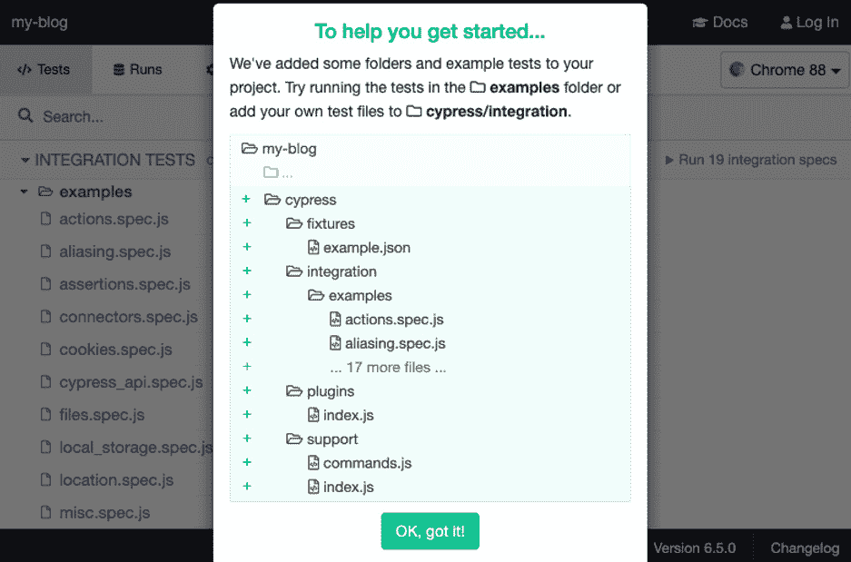

图 7.1 – 第一次 Cypress 运行

在前面的屏幕截图中，Cypress 通知我们它已自动在我们项目的根目录中为我们创建了一个 `cypress` 文件夹结构，包括以下子文件夹 - `fixtures`、`integration`、`plugins` 和 `support`。这些子文件夹使我们能够快速启动并运行，而无需进行任何手动配置。`fixtures` 文件夹用于创建在测试中通常用于模拟网络数据的静态数据。`integration` 文件夹用于创建测试文件。在 `integration` 文件夹内部，Cypress 提供了一个 `examples` 文件夹，其中包含使用 Cypress 测试应用程序的多个示例。

`plugins` 文件夹用于以多种方式扩展 Cypress 的行为，例如通过编程方式更改配置文件，在测试运行后生成 HTML 格式的报告，或添加对自动化视觉测试的支持，仅举几例。Cypress 提供了许多开箱即用的命令，如 `click`、`type` 和来自第三方工具（如 **Mocha** ([`mochajs.org/`](https://mochajs.org/))）、**Chai** ([`www.chaijs.com/`](https://www.chaijs.com/)) 和 **jQuery** ([`jquery.com/`](https://jquery.com/))) 的断言。

`support` 文件夹用于创建自定义命令或使用如项目文件夹根目录中的 `cypress.json` 文件等工具添加第三方命令。`cypress.json` 文件用于设置全局设置，例如 Cypress 在测试中使用的全局基础 URL，为元素在 DOM 中出现设置自定义超时，或者甚至将我们的测试文件文件夹位置从 `integration` 更改为 `e2e`，例如。我们可以在 `cypress.json` 文件中配置许多设置。

Cypress 测试运行器的右上角有一个下拉列表，允许您选择用于测试运行的浏览器：

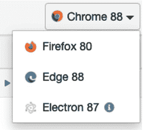

图 7.2 – Cypress 浏览器下拉菜单

在前面的屏幕截图中，可供使用的浏览器版本有 **Chrome 88**、**Firefox 80**、**Edge 88** 和 **Electron 87**，可用于测试运行。可用的浏览器基于用户机器上安装的与 Cypress 兼容的浏览器。Cypress 支持的浏览器是 Firefox 和 Chrome 家族的浏览器，如 Edge 和 Electron。Electron 浏览器在 Cypress 中默认可用，也用于在无头模式下运行测试，这意味着没有浏览器 UI。

要执行测试，只需从可用测试列表中单击测试名称：

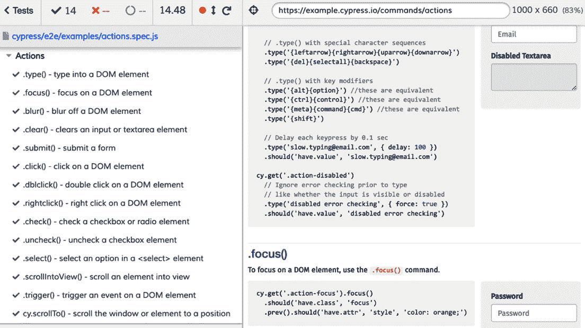

图 7.3 – 示例测试运行

在前面的屏幕截图中，运行了位于 `examples` 文件夹中的 `actions.spec.js` 测试文件。屏幕的右侧显示了在测试的每个步骤中浏览器中应用程序的状态。屏幕的左侧显示了测试文件中每个测试的结果。如果我们想的话，我们可以点击每个测试，悬停在每个 Cypress 命令上，并查看在命令执行前后产生的 DOM 状态。能够悬停在每个命令上查看产生的 DOM 输出是一个很棒的功能。

与其他端到端测试框架相比，Cypress 使得调试更加容易。例如，如果 Cypress 在我们的测试中找不到浏览器指定的元素，它会提供有用的错误信息：

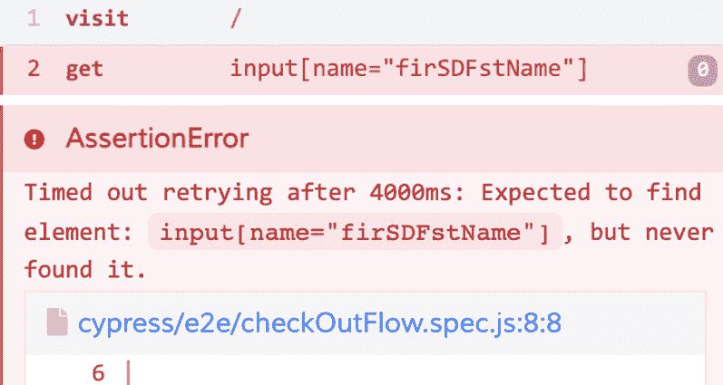

图 7.4 – Cypress 错误输出

在前面的屏幕截图中，Cypress 通过告知我们在测试运行器内部 4 秒后找不到名为 `firSDFstName` 的输入元素来提供反馈。Cypress 还允许我们点击一个链接，在错误发生的行打开我们的代码编辑器。

现在我们已经了解了使用 Cypress 测试运行器安装、运行和执行测试的基本知识，我们将编写一个结账流程测试。当用户结账时，应用程序会经过四个屏幕。第一个屏幕是送货地址：

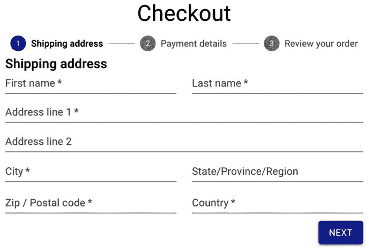

图 7.5 – 送货地址结账屏幕

在前面的屏幕截图中，显示了一个用户可以输入他们的送货地址信息的表单。第二个屏幕是支付详情：

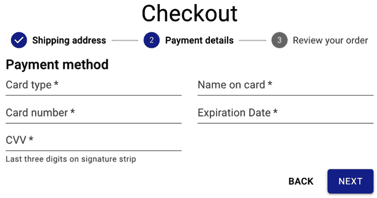

图 7.6 – 支付详情结账屏幕

在前面的屏幕截图中，显示了一个用户可以输入他们的支付信息的表单。第三个屏幕是查看订单：

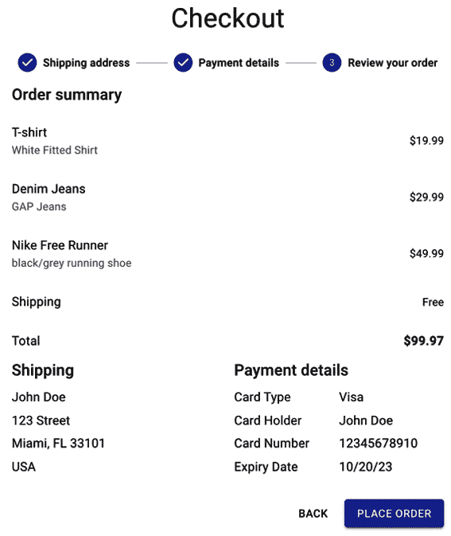

图 7.7 – 查看您的订单结账屏幕

在前面的屏幕截图中，显示了一个总结，显示了在之前的屏幕上输入的所有表单值。注意，为了演示目的，购买的物品**T 恤衫**、**牛仔布牛仔裤**和**耐克自由跑鞋**在应用程序中是硬编码的，不会是我们将要编写的测试的重点。最后一个屏幕是订单提交屏幕：

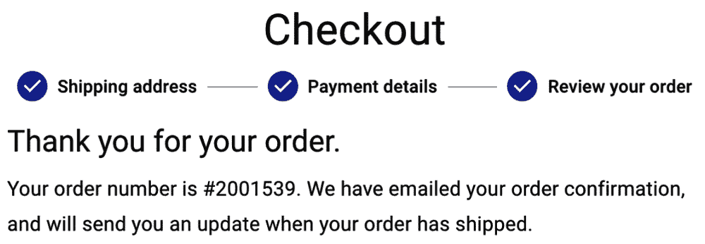

图 7.8 – 订单提交结账屏幕

在前面的屏幕截图中，显示了一个确认信息，显示了一条**感谢**信息、一个订单号以及通知客户有关订单更新的电子邮件通信信息。

为了演示目的，订单号是硬编码的，不会是我们测试的重点。现在我们了解了用户流程，我们可以编写测试代码：

```js
import user from '../support/user'
describe('Checkout Flow', () => {
  it('allows a user to enter address and payment info and place         an order', () => {
    cy.visit('/')
```

在前面的代码中，我们首先导入一个`user`对象用于测试。`user`对象简单地提供了一些假值，以便输入到每个`form`输入中，这样我们就不必为每个值硬编码。接下来，我们通过全局`cy`变量使用`visit`命令来访问应用程序。

所有的 Cypress 方法都是通过`cy`变量链式调用的。请注意，在`visit`方法中使用的`'/'`代表相对于我们测试的基础 URL 的 URL。通过使用相对 URL，我们不必在我们的测试中输入完整的 URL。我们可以通过`cypress.json`文件设置`baseURL`属性：

```js
{
  "baseUrl": "http://localhost:3000"
}
```

在前面的代码中，我们将`baseUrl`设置为`http://localhost:3000`，这样当我们想要访问索引页或其他相对于索引页的页面时，可以使用`'/'`。

接下来，我们将编写代码来完成**运输地址**屏幕：

```js
    cy.get('input[name="firstName"]').type(user.firstName)
    cy.get('input[name="lastName"]').type(user.lastName)
    cy.get('input[name="address1"]').type(user.address1)
    cy.get('input[name="city"]').type(user.city)
    cy.get('input[name="state"]').type(user.state)
    cy.get('input[name="zipCode"]').type(user.zipCode)
    cy.get('input[name="country"]').type(user.country)
    cy.contains(/next/i).click()
```

在前面的代码中，我们使用`get`命令通过其`name`属性选择每个输入元素。我们还使用`type`命令为每个输入输入一个值。接下来，我们使用`contains`命令选择带有文本`next`的按钮元素，并使用`click`命令点击它。

接下来，我们将为**支付详细信息**屏幕输入值：

```js
    cy.get('input[name="cardType"]').type(user.cardType)
    cy.get('input[name="cardHolder"]').type(user.cardHolder)
    cy.get('input[name="cardNumber"]').type(user.cardNumber)
    cy.get('input[name="expiryDate"]').type(user.expiryDate)
    cy.get('input[name="cardCvv"]').type(user.cardCvv)
    cy.contains(/next/i).click()
```

在前面的代码中，我们使用`get`和`type`命令选择和输入每个输入的值。然后，我们使用`contains`命令点击**下一个**按钮。

接下来，我们将在**查看您的订单**屏幕上验证输入的运输和支付详细信息：

```js
    cy.contains(`${user.firstName} 
      ${user.lastName}`).should('be.visible')
    cy.contains(user.address1).should('be.visible')
    cy.contains(`${user.city}, ${user.state} 
     ${user.zipCode}`).should(
      'be.visible'
    )
    cy.contains(user.country).should('be.visible')
    cy.contains(user.cardType).should('be.visible')
    cy.contains(user.cardHolder).should('be.visible')
    cy.contains(user.cardNumber).should('be.visible')
    cy.contains(user.expiryDate).should('be.visible')
    cy.contains(/place order/i).click()
```

在前面的代码中，我们使用`contains`命令通过之前屏幕上输入的表单值选择每个元素。我们还使用`should`命令断言每个元素在屏幕上是可见的。然后，我们使用`contains`命令选择带有文本`place order`的按钮，并使用`click`命令点击它。

最后，我们验证应用程序是否成功跳转到了订单提交屏幕：

```js
     cy.contains(/thank you for your 
       order/i).should('be.visible')
```

在前面的代码中，我们使用`contains`和`should`命令来验证带有文本`npx cypress open command`的元素，直接在命令行中，正如在本节开头所学的，但我们也可以创建一个`npm`脚本：

```js
    "cy:open": "cypress open",
```

在前面的代码中，我们创建了一个`cy:open`脚本来运行 Cypress 测试运行器。我们也可以创建另一个脚本来在无头模式下运行测试：

```js
    "cy:run": "cypress run",
```

我们创建了一个`cy:run`脚本来通过前面的代码中的`cypress run`命令在无头模式下运行 Cypress。在不需要使用交互模式的情况下，例如通过`cy:open`交互模式运行，我们会得到以下输出：

![图 7.9 – 结账流程测试结果]

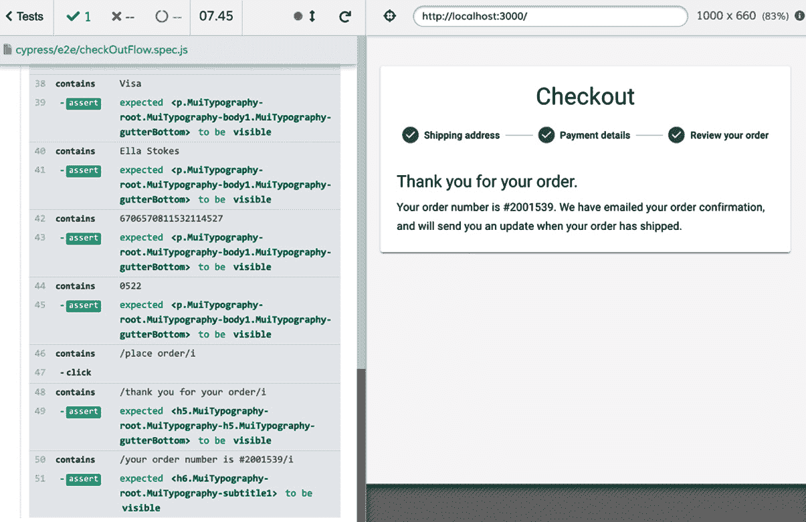

图 7.9 – 结账流程测试结果

在前面的屏幕截图中，测试运行指示`checkOutFlow`测试按预期通过。现在你知道了如何安装和使用 Cypress 来测试用户流程。在下一节中，我们将安装一个插件来增强我们的元素选择器命令。

# 使用 Cypress 测试库增强 Cypress 命令

在上一节中，我们学习了如何使用 Cypress 安装和编写用户流程测试。在本节中，我们将学习如何安装和配置 **Cypress 测试库**以添加增强的查询选择器。Cypress 测试库将允许我们在 Cypress 中使用 DOM 测试库查询方法。使用以下命令安装库：

```js
npm install --save-dev @testing-library/cypress
```

上述代码将 `@testing-library/cypress` 作为开发依赖项安装到你的项目中。在库安装完成后，我们可以将其添加到 Cypress 的 `commands` 文件中：

```js
import '@testing-library/cypress/add-commands'
```

在上述代码中，我们通过 Cypress 测试库扩展了 Cypress 命令。现在我们已经安装了 Cypress 测试库，我们可以在测试中使用它。需要注意的是，仅包含 DOM 测试库中的 `findBy*` 方法以支持 Cypress 的重试功能，该功能在超时之前会重试命令多次。

在本章的 *Cypress 入门* 部分，我们为结账流程编写了一个测试。我们可以使用 Cypress 测试库中的代码重构该测试中的元素查询。例如，我们可以这样重构 **收货地址** 屏幕的代码：

```js
    cy.findByRole('textbox', { name: /first name/i 
      }).type(user.firstName)
    cy.findByRole('textbox', { name: /last name/i 
      }).type(user.lastName)
    cy.findByRole('textbox', { name: /address line 1/i 
      }).type(user.address1)
    cy.findByRole('textbox', { name: /city/i 
      }).type(user.city)
    cy.findByRole('textbox', { name: /state/i 
      }).type(user.state)
    cy.findByRole('textbox', { name: /postal code/i 
      }).type(user.zipCode)
    cy.findByRole('textbox', { name: /country/i 
      }).type(user.country)
    cy.findByText(/next/i).click()
```

在前面的代码中，我们将所有选择器更新为通过 `findByRole` 查询查找 `input` 元素。ARIA 属性被辅助技术使用人员用来定位元素。我们还更新了 `findByText` 查询的选择器。相同的重构模式也用于 **支付详情** 和 **查看您的订单** 屏幕。最后，我们可以这样重构订单提交屏幕的代码：

```js
        cy.findByRole('heading', { name: /thank you for 
          your order/i }).should(
      'be.visible'
    )
    cy.findByRole('heading', { name: /your order number is 
      #2001539/i }).should(
      'be.visible'
    )
```

在前面的代码中，我们将两个选择器更新为通过 `findByRole` 查询使用标题角色查找元素。我们的测试代码现在以更可访问的方式查询元素，这增加了我们确信应用程序将为所有用户工作的信心，包括使用屏幕阅读器等辅助技术的用户。此外，当在测试运行器屏幕中查看每一行时，测试代码的阅读性也更好。

现在你已经知道了如何安装 Cypress 测试库并使用避免使用实现细节的查询来重构现有测试。在下一节中，我们将学习如何使用 Cypress 进行测试驱动开发来向博客应用添加功能。

# Cypress 驱动的开发

在上一节中，我们安装了 Cypress 测试库并对一个现有的结账流程测试进行了重构。在本节中，我们将使用 Cypress 驱动一个使用 **Next.js** 创建的现有博客应用的新功能开发。Next.js 是一个流行的框架，它为团队构建静态或服务器端渲染的 React 应用提供了愉悦的体验。

Next.js 提供的示例功能包括**开箱即用**的路由、内置的 CSS 支持和 API 路由。请参阅 Next.js 文档（[`nextjs.org/`](https://nextjs.org/)）以获取更多详细信息。**MY BLOG**应用程序目前有两个页面，一个**主页**显示所有博客帖子，一个页面用于显示博客详情。显示帖子列表的页面如下所示：

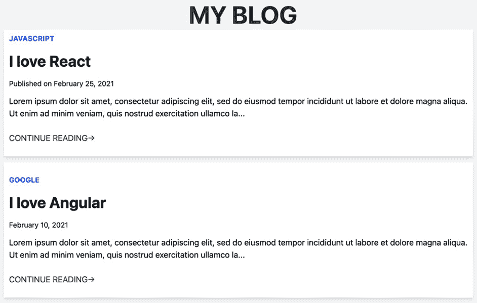

图 7.10 – 博客主页

在前面的屏幕截图中，**主页**显示了两个博客帖子，**我爱 React**和**我爱 Angular**。博客数据存储在 MongoDB 数据库中，并在应用程序加载后通过 API 发送到前端。每个博客帖子从上到下显示一个类别、标题、发布日期、摘要和一个**继续阅读**链接。

要查看博客的详细信息，用户可以点击博客标题或**继续阅读**链接。例如，点击**我爱 React**标题后，我们看到以下内容：

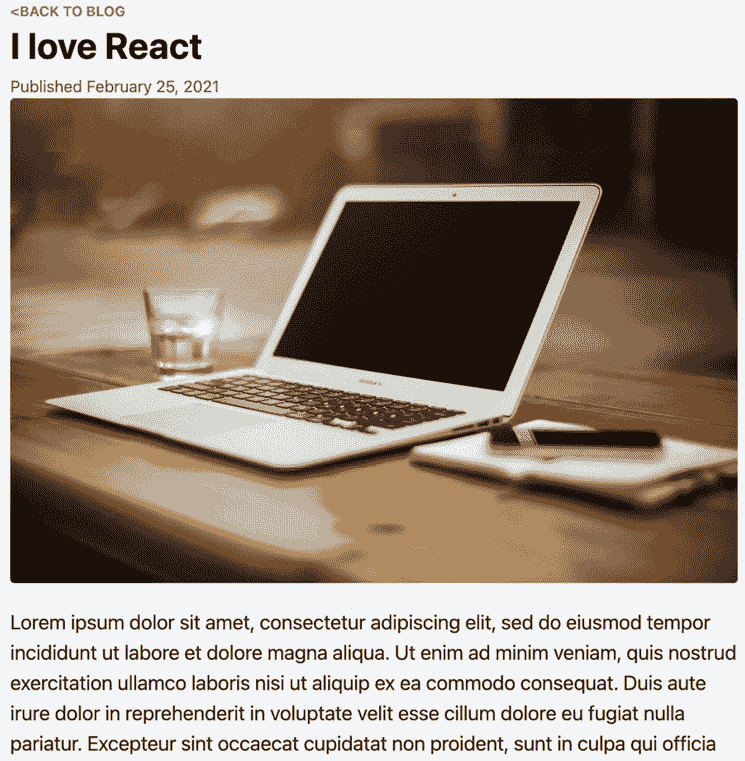

图 7.11 – 博客详情页面

我们可以看到发送到 API 的`POST`请求的完整内容或直接添加新帖子到数据库。

我们需要添加一个功能，允许用户通过 UI 添加新帖子。我们可以使用 Cypress 编写测试以验证预期行为，并逐步构建 UI，直到功能完成且测试通过。以下测试显示了最终的预期行为：

```js
import fakePost from '../support/generateBlogPost'

describe('Blog Flow', () => {
    let post = {}
  beforeEach(()=> (post = fakePost()))
  it('allows a user to create a new blog post', () => {
    cy.visit('/')
    cy.findByRole('link', { name: /new post/i }).click()
```

在前面的代码中，首先，我们导入`fakePost`，这是一个自定义方法，将为每次测试运行生成唯一的测试数据，并将其设置为变量`post`的值。我们不希望创建相同的博客帖子，所以自定义方法通过始终创建唯一数据来帮助。接下来，我们访问**主页**并点击名为**新建帖子**的链接。**新建帖子**链接应该将我们导航到一个可以输入新帖子值的页面。

接下来，我们测试为新帖子输入值的代码：

```js
    cy.findByRole('textbox', { name: /title/i 
      }).type(post.title)
    cy.findByRole('textbox', { name: /category/i 
      }).type(post.category)
    cy.findByRole('textbox', { name: /image link/i 
      }).type(post.image_url)
    cy.findByRole('textbox', { name: /content/i 
      }).type(post.content)
```

在前面的代码中，我们通过其唯一的名称找到每个`textbox`元素，并通过自定义的`post`方法输入相关值。最后，我们创建测试的最后部分：

```js
    cy.findByRole('button', { name: /submit/i }).click()
    cy.findByRole('link', { name: post.title 
     }).should('be.visible')
  })
})
```

在前面的代码中，我们点击**提交**按钮。一旦我们点击**提交**按钮，数据应该被发送到 API，保存到数据库，然后应用程序应该将我们导航回**主页**。最后，一旦在**主页**上，我们验证我们创建的帖子的标题是否可见在屏幕上。

我们将使用 Cypress 测试运行器来运行测试，以利用其交互功能，并在构建功能的过程中保持其开启状态。当运行测试时，我们的测试将如预期那样失败：

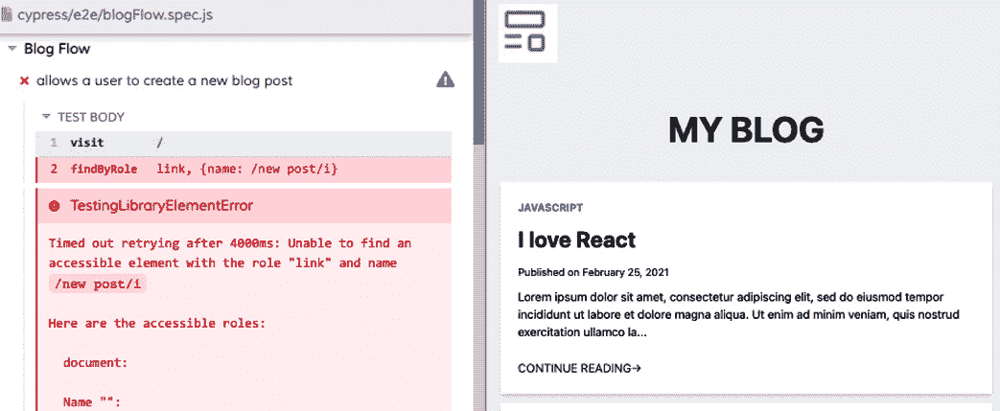

图 7.12 – 博客流程测试失败

在之前的屏幕截图中，第一步成功导航到具有名称 `New Post` 的 `link` 元素，但在第二个测试步骤中 4 秒后未找到。4 秒是 Cypress 在超时前继续查询元素默认的时间。

我们还看到了 DOM 测试库提供的有用信息，告知我们哪些可访问元素在 DOM 中可见。此外，我们可以在测试失败的点查看浏览器，并看到 `New Post` 链接不可见。现在我们可以更新 UI 以使第二个测试步骤通过：

```js
<Link href="/add">
<a className="font-bold inline-block px-4 py-2 text-3xl">
  New Post
</a>
</Link>
```

在之前的代码中，我们添加了一个链接，该链接将用户导航到一个被 `Link` 组件包裹的 `hyperlink` 元素。`Link` 组件允许客户端路由导航。测试运行器在保存测试文件时自动重新运行。由于我们已经编写了所有必要的测试代码，我们可以通过保存文件来触发测试运行。

我们需要在每次 UI 更改后执行此操作。现在，当测试运行时，我们得到以下输出：

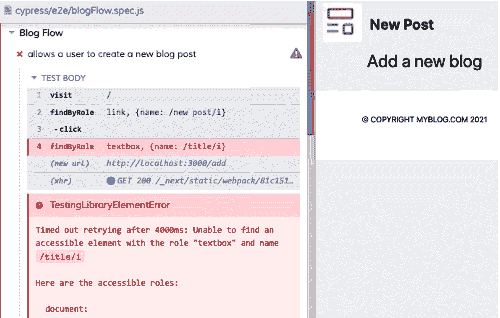

图 7.13 – 博客流程添加页面失败

在之前的屏幕截图中，我们的测试代码现在可以成功打开 `title`，但在 `input` 元素名称为 `title` 且具有 `textbox` 角色的步骤中未找到 `role`：

```js
<label htmlFor="title">Title</label>
 <input
   type="text"
   autoFocus
   id="title"
   name="title"
   placeholder="Blog Title"
   value={newBlog.title}
   onChange={handleChange}
 />
```

在之前的代码中，我们添加了一个 `Title 标签` 元素和一个关联的 `text` 类型的 `input` 元素。尽管在上次代码中没有演示，我们也继续添加了与 `Title input` 元素结构相似的 `Category`、`Image link` 和 `Content` 输入元素。现在，当我们触发测试运行时，我们得到以下输出：

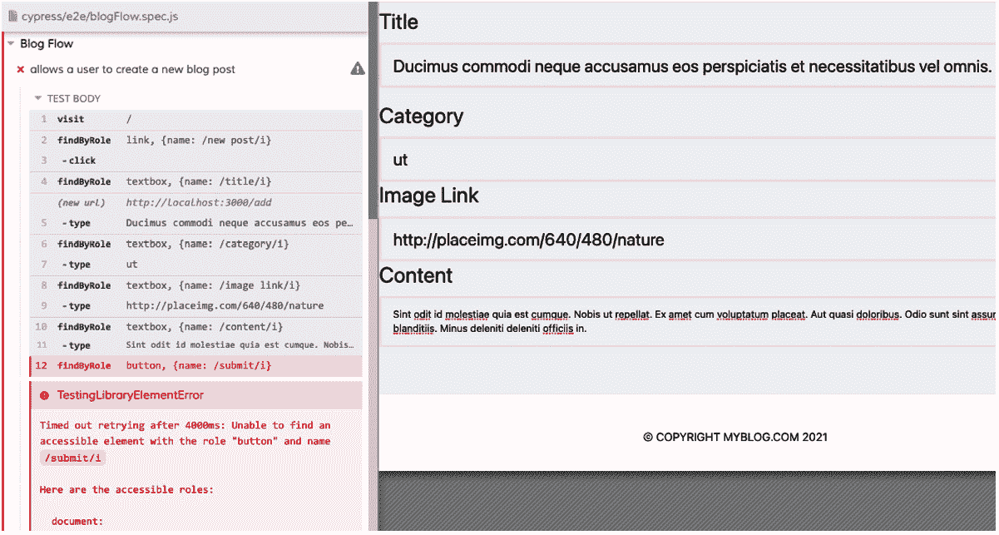

图 7.14 – 博客流程添加页面输入元素重构

在之前的屏幕截图中，我们的测试代码现在可以成功打开 `Title`、`Category`、`Image link` 和 `Content` 的 `input` 元素，但在 `Submit` 按钮步骤中未找到 `Submit` 按钮：

```js
<button>Submit</button>
```

我们创建并添加了一个 `Submit` 按钮，该按钮是 `form` 元素的一部分，当点击时，会调用一个方法将表单数据发送到 API，最终发送到数据库。尽管这不是我们测试的重点，但我们还在 UI 中添加了一个 `cancel` 按钮。现在，当我们触发测试运行时，我们得到以下输出：

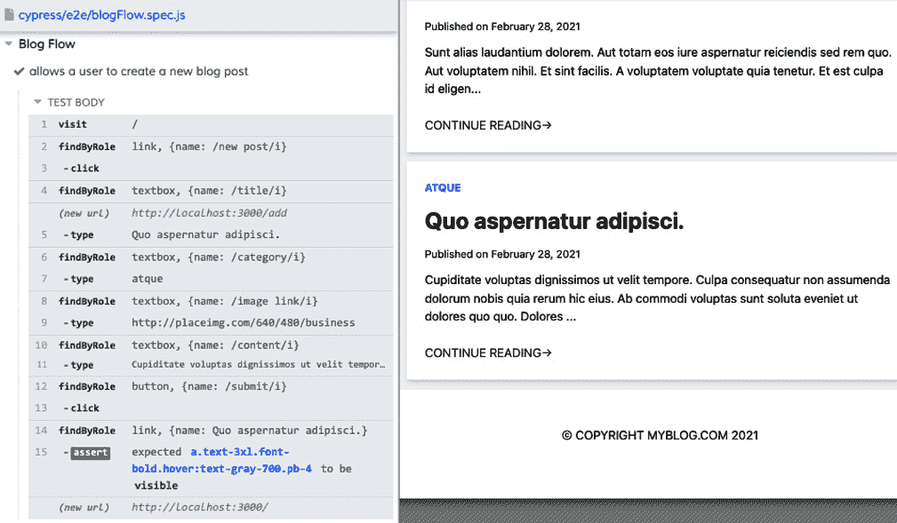

图 7.15 – 博客流程添加页面完成重构

在之前的屏幕截图中，输出指示测试最终通过。我们可以在屏幕右侧看到由我们的测试创建的新博客文章。通过最后的重构，我们已经完成了所有允许用户通过 UI 添加新帖子的功能步骤。

对于我们的下一个功能，我们希望用户能够通过 UI 删除博客帖子。我们将向博客详情页添加一个 `delete` 链接，当点击时会对 API 发送 `DELETE` 请求。应用程序的当前状态仅允许通过向 API 发送 `DELETE` 请求或直接在数据库中直接删除博客帖子。我们可以更新之前的测试以在创建后执行删除新博客帖子的操作，如下所示：

```js
    cy.findByRole('link', { name: post.title }).click()
    cy.findByText(/delete post>/i).click()
    cy.findByRole('link', { name: post.title 
     }).should('not.exist')
```

在前面的代码中，首先，我们点击要删除的博客帖子的标题以导航到其详情页。接下来，我们找到并点击带有文本 `delete post` 的链接。最后，我们验证帖子不再在 **主页** 上的博客帖子列表中。当我们通过保存文件来触发测试运行时，我们得到以下输出：

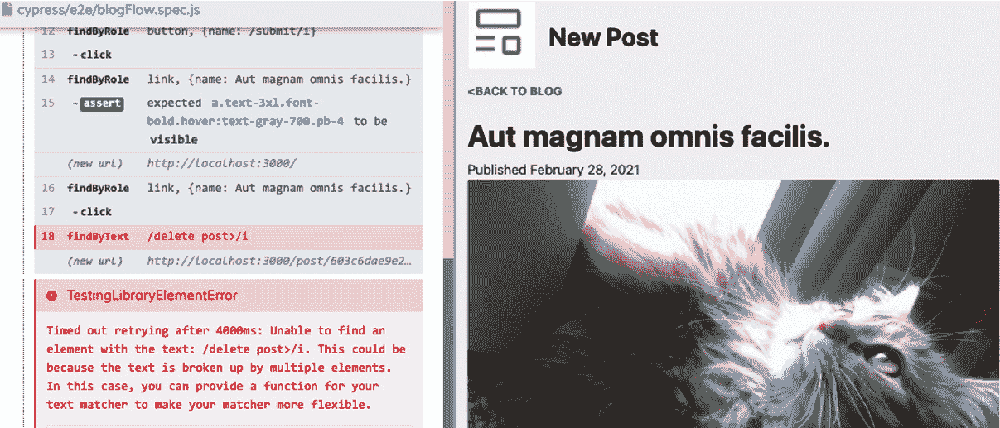

图 7.16 – 博客流程删除帖子测试失败

在上一张截图，输出指示测试在步骤 `delete post` 找不到时失败。我们可以通过创建缺失的元素来更新 UI：

```js
<a onClick={handleDelete}>Delete post&#62;</a>;
```

在前面的代码中，我们添加了一个带有文本 `Delete post` 的 `hyperlink` 元素。当点击超链接时，它会调用 `handleDelete` 方法向 API 发送 `DELETE` 请求，并最终从数据库中删除博客帖子。当我们保存测试文件以触发测试运行时，我们得到以下输出：

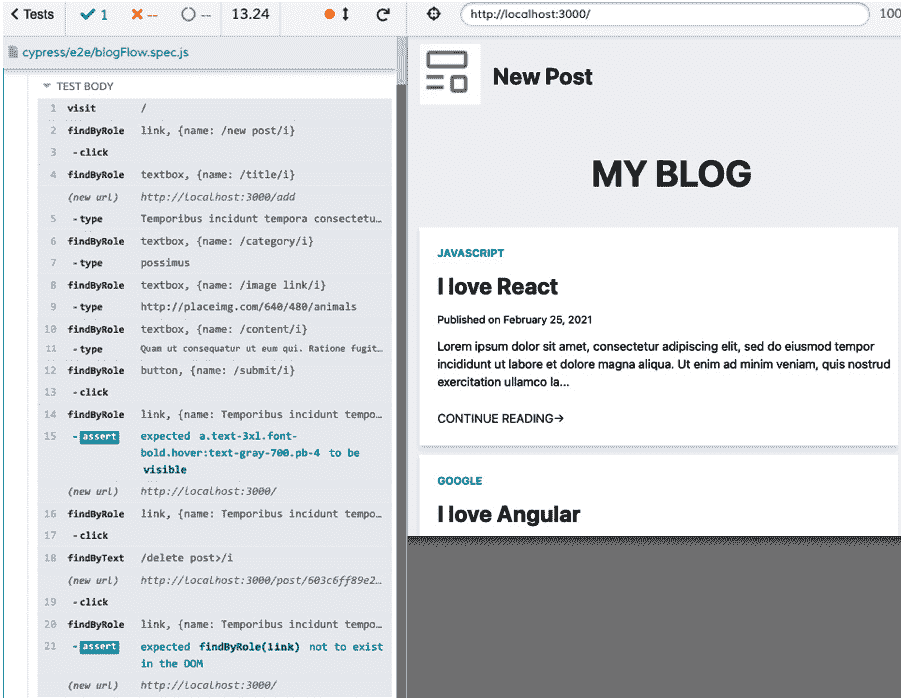

图 7.17 – 博客流程删除帖子完成重构

在上一张截图，输出指示测试最终通过，博客帖子已被删除。通过添加 `delete` 链接，我们已经完成了所有允许用户通过 UI 删除博客帖子的功能步骤。现在你知道如何使用 Cypress 驱动的开发来开发功能。

当你希望在构建功能时看到应用程序的特定状态时，这种方法可能是有益的。在下一节中，我们将介绍 Cypress 设计模式。

# 使用 Cypress 设计模式编写测试

在上一节中，我们学习了如何使用 Cypress 驱动博客应用程序新功能的开发。在本节中，我们将探讨两种设计模式来结构我们的 Cypress 代码。设计模式通过提供解决方案来帮助团队解决诸如编写可维护的代码或设计响应式网站等问题。首先，我们将查看页面对象模型（Page Object Model），然后是自定义命令。

## 在 Cypress 中创建页面对象

应用程序中每个页面的 `class` 表示，包括用于选择和与各种页面元素交互的自定义方法。使用 POM 模型的优势在于将多行测试代码抽象到单个方法中。

此外，页面对象作为在特定页面上执行操作的单一真相来源。在 *Cypress 驱动的开发* 部分，我们添加了一个功能，允许用户通过 UI 创建新的博客文章。我们可以使用 POM 模式重构测试代码。首先，我们将为 **主页** 创建一个页面对象：

```js
class HomePage {
  navigateToHomePage() {
    cy.visit('/')
  }
  navigateToAddPage() {
    cy.findByRole('link', { name: /new post/i }).click()
  }
  getBlogPost(post) {
    return cy.findByRole('link', { name: post.title })
  }
}
export const homePage = new HomePage()
```

在前面的代码中，首先，我们创建了 `navigateToHomePage`、`navigateToAddPage` 和 `getBlogPost` 方法的页面对象。然后，我们导出了一个新实例以供测试文件使用。接下来，我们将为 **添加** 页创建一个页面对象：

```js
class AddPage {
  createNewPost(newPost) {
    cy.findByRole('textbox', { name: /title/i 
     }).type(newPost.title)
    cy.findByRole('textbox', { name: /category/i 
     }).type(newPost.category)
    cy.findByRole('textbox', { name: /image link/i 
     }).type(newPost.image_url)
    cy.findByRole('textbox', { name: /content/i 
     }).type(newPost.content)
    cy.findByRole('button', { name: /submit/i }).click()
  }
}
export const addPage = new AddPage()
```

在前面的代码中，我们为 `createNewPost` 方法创建了一个页面对象，该方法接受一个包含要输入的新文章数据的 `newPost` 对象。页面对象被导出以供测试文件使用。现在，我们有了代表 **主页** 和 **添加** 页面的页面对象，我们可以在测试中使用它们：

```js
import post from '../support/generateBlogPost'
import { addPage } from './pages/AddPage'
import { homePage } from './pages/HomePage'
```

在前面的代码中，首先，我们导入了模拟的 `post` 方法以在测试中生成唯一的文章数据。接下来，我们导入了 `addPage` 和 `homePage` 页面对象。接下来，我们将编写主要的测试代码：

```js
      it('POM: allows a user to create a new blog post', ()
       => {
    homePage.navigateToHomePage()
    homePage.navigateToAddPage()
    addPage.createNewPost(post)
    homePage.getBlogPost(post).should('be.visible')
  })
```

在前面的代码中，首先，我们导航到 `post` 方法。最后，我们在 **主页** 上获取新的文章并验证它在屏幕上可见。

在 *Cypress 驱动的开发* 部分，我们添加了另一个功能，允许通过 UI 删除博客文章。我们可以在页面对象中添加一个用于此功能的方法，并验证测试的行为。首先，我们将向 `homePage` 页面对象添加一个新方法：

```js
navigateToPostDetail(post) {
 cy.findByRole('link', { name: post.title }).click()
}
```

在前面的代码中，我们添加了一个 `navigateToPostDetail` 方法，该方法在调用时接受一个 `post` 参数。接下来，我们将为 **文章详情** 页创建一个页面对象：

```js
class PostDetailPage {
  deletePost() {
    cy.findByText(/delete post>/i).click()
  }
}
export const postDetailPage = new PostDetailPage()
```

在前面的代码中，我们为 `deletePost` 方法创建了一个页面对象。我们还导出了一个页面对象的实例以供测试使用。现在，我们可以在现有的测试中使用新的页面对象方法：

```js
import { postDetailPage } from './pages/PostDetailPage'
```

在前面的代码中，首先，我们以与其他页面对象类似的方式导入了 `postDetailPage` 页面对象。接下来，我们将添加删除文章的相关方法：

```js
    homePage.navigateToPostDetail(post)
    postDetailPage.deletePost()
    homePage.getBlogPost(post).should('not.exist')
```

在前面的代码中，我们调用了 `navigateToPostDetail` 和 `deletePost` 方法，并验证该文章不再出现在 **主页** 上。现在，我们将测试代码重构为页面对象的任务已经完成。我们的测试代码更短，并且抽象了许多测试步骤的细节。

然而，如果我们把 *添加博客文章* 和 *删除博客文章* 功能拆分成两个不同的测试，我们的页面对象设计就会存在一个问题。第一个测试将创建一个博客文章：

```js
  it('POM: allows a user to create a new blog post', () => {
    homePage.navigateToHomePage()
    homePage.navigateToAddPage()
    addPage.createNewPost(post)
    homePage.getBlogPost(post).should('be.visible')
  })
```

在前面的代码中，测试 `'POM: 允许用户创建新的博客文章'` 创建了一个博客文章。接下来，我们将创建删除博客文章的测试：

```js
  it('POM: allows a user to delete a new blog post', () => {
    homePage.navigateToHomePage()
    homePage.navigateToAddPage()
    addPage.createNewPost(post)
    homePage.navigateToPostDetail(post)
    postDetailPage.deletePost()
    homePage.getBlogPost(post).should('not.exist')
  })
```

在前面的代码中，测试 `'POM: 允许用户删除一篇新的博客文章'` 用于删除博客文章。**删除** 测试的问题是我们必须从上一个测试中复制许多相同的测试步骤以及最重要的测试动作来删除文章。作为测试的最佳实践，我们希望避免在多个测试中重复编写相同的测试步骤。

在下一节中，我们将学习如何通过自定义 Cypress 命令来解决此问题。

## 在 Cypress 中创建自定义命令

在前一节中，我们学习了如何使用 POM 模式编写测试。然而，我们遇到了一个问题，即我们必须在不同的测试中编写相同的测试步骤。Cypress 提供了一个自定义命令功能来解决此问题。自定义命令允许我们向 Cypress 添加额外的命令。在 *使用 Cypress 测试库增强 Cypress 命令* 部分，我们添加了第三方自定义命令。现在我们将学习如何编写我们自己的自定义命令。首先，我们将创建一个自定义方法来创建新的博客文章：

```js
Cypress.Commands.add('createBlogPost', post => {
  cy.visit('/')
  cy.findByRole('link', { name: /new post/i }).click()
  cy.findByRole('textbox', { name: /title/i 
   }).type(post.title)
  cy.findByRole('textbox', { name: /category/i 
   }).type(post.category)
  cy.findByRole('textbox', { name: /image link/i 
   }).type(post.image_url)
  cy.findByRole('textbox', { name: /content/i 
   }).type(post.content)
  cy.findByRole('button', { name: /submit/i }).click()
   })
```

在前面的代码中，我们通过 `commands.js` 文件内的 `Commands.add` 方法向 Cypress 添加了一个自定义的 `createBlogPost` 命令。接下来，我们将在我们的测试中使用这个自定义方法：

```js
  it('Custom Command: allows a user to delete a new blog 
    post', () => {
    cy.createBlogPost(post)
    homePage.navigateToPostDetail(post)
    postDetailPage.deletePost()
    homePage.getBlogPost(post).should('not.exist')
  })
```

在前面的代码中，我们用我们创建的自定义 `createBlogPost` 方法替换了创建新博客文章的先前代码。自定义方法消除了显式编写相同的代码行来创建博客文章的需要。我们可以在需要时在未来的任何测试中使用自定义方法。然而，对于我们的特定测试，即删除博客文章，我们可以更进一步。

尽管我们的自定义 `createBlogPost` 方法消除了编写重复代码行的需要，但我们仍然在通过 UI 执行相同的步骤来创建新的博客文章。在多个测试中执行相同的步骤是糟糕的测试实践，因为我们正在重复已经测试过的步骤。如果我们能够控制访问我们应用程序的 API，我们可以通过 UI 减少重复步骤。

Cypress 提供了一个 HTTP `客户端`，我们可以用它直接与 API 通信。使用 `客户端`，我们可以绕过 UI 以避免重复已测试的步骤并加快我们的测试速度。我们可以这样重构我们的自定义 `createBlogPost` 方法：

```js
  cy.request('POST', '/api/add', post).then(response => {
    expect(response.body.message).to.equal(
      `The blog "${post.title}" was successfully added`
    )
  })
```

在前面的代码中，我们使用 `request` 方法向 `/api/add` API 发送一个 `POST` 请求，并发送一个包含新文章值的 `post` 对象。然后我们断言服务器返回消息 `The blog "blog title here" was successfully added`，表示新文章已添加到数据库中。注意，消息中的 `"blog title here"` 将在请求时被替换为实际的博客文章标题。现在我们可以更新我们的测试代码：

```js
    cy.createBlogPost(post)
    homePage.navigateToHomePage()
    homePage.navigateToPostDetail(post)
    postDetailPage.deletePost()
    homePage.getBlogPost(post).should('not.exist')
```

在前面的代码中，我们的测试看起来几乎与上一个版本相同。唯一的区别是实现了`createBlogPost`方法，并添加了`navigateToHomePage`方法。然而，现在测试将运行得更快，因为我们跳过了通过 UI 创建新的博客帖子。尽管我们在本节中使用了 POM 模式以及自定义命令，但应注意的是，我们完全可以仅使用自定义命令。

我们只需要在一个独特的测试中测试`添加博客帖子`和`删除博客帖子`功能，以增加它们按预期为用户工作的信心。如果标记为关键用户流程，这些测试可以在回归测试套件中再次运行，以确保在添加新功能时这些功能仍然正常工作。我们可以编写 Cypress 命令直接与应用程序交互，而不使用 POM 模式，并在需要重新执行相同步骤的情况下使用自定义命令。

现在你已经知道了如何通过实现 POM 模式（Page Object Model）和自定义 Cypress 命令来构建可维护的测试代码，并减少重复步骤。

在下一节中，我们将通过测试我们的应用程序的 API 路由来加深我们对 Cypress `request client`的了解。

# 使用 Cypress 测试 API

在前面的章节中，我们学习了如何使用 POM 和自定义命令设计模式来构建测试代码。我们还了解到可以使用 Cypress 直接与我们的应用程序 API 交互。在本节中，我们将基于前一节的所学知识，测试在“Cypress 驱动开发”部分中先前引入的博客应用程序的 API。

博客应用程序接受四个 API 请求：一个用于获取所有帖子的`GET`请求，一个用于添加帖子的`POST`请求，一个用于获取单个帖子的`POST`请求，以及一个用于删除帖子的`DELETE`请求。首先，我们将测试获取所有帖子的`GET`请求：

```js
import fakePost from '../support/generateBlogPost';
  const post = fakePost()

const getAllPosts = () => cy.request('/api/posts').its('body.
posts');
const deletePost = (post) =>
  cy.request('DELETE', `/api/delete/${post.id}`, {
    id: post.id,
    name: post.title,
  });

const deleteAllPosts = () => getAllPosts().each(deletePost);
beforeEach(deleteAllPosts);
```

在前面的代码中，首先，我们导入用于为每个测试运行生成动态帖子数据的`fakePost`方法，并将其分配给变量`post`。接下来，我们创建了三个测试设置方法：`getAllPosts`、`deletePost`和`deleteAllPosts`。在每个测试运行之前，我们希望从一个空数据库开始。

`deleteAllPosts`方法将通过`getAllPosts`从数据库获取所有当前帖子，`getAllPosts`调用`deletePost`来删除每个帖子。最后，我们将`deleteAllPosts`传递给`beforeEach`，这样在每个测试运行之前都会调用`deleteAllPosts`。接下来，我们将编写`获取所有帖子`请求的主要代码：

```js
    cy.request('POST', '/api/add', {
      title: post.title,
      category: post.category,
      image_url: post.image_url,
      content: post.content
    })
    cy.request('/api/posts').as('posts')
    cy.get('@posts').its('status').should('equal', 200)
    cy.get('@posts').its('body.posts.length').should('equal', 
  1)
```

在前面的代码中，我们首先使用`request`方法向 API 添加一个新的博客帖子以保存到数据库中。接下来，我们使用`request`从数据库中获取所有帖子。由于我们在测试之前清空了数据库，我们应该从数据库中接收到我们刚刚创建的那个博客帖子。

我们使用 `as` 方法，这是一个 Cypress 功能，允许我们将代码行保存为别名。然后，我们使用 `get` 方法通过在别名名称前使用所需的 `@` 符号来访问别名，以验证 API 服务器响应的状态码是 `200`。最后，我们断言 `posts` 体的长度为 `1`。接下来，我们将测试 *创建新博客帖子* 请求：

```js
    cy.request('POST', '/api/add', post).as('newPost')
    cy.get('@newPost').its('status').should('equal', 200)
    cy.get('@newPost')
      .its('body.message')
      .should('be.equal', `The blog "${post.title}" was 
        successfully added`)
```

在前面的代码中，首先，我们创建了一个新的博客帖子并将其结果保存为名为 `newPost` 的别名。然后，我们验证 API 响应状态码为 `200`，并且响应消息是 `"The blog "title here" was successfully added"`，其中 `"title here"` 将等于测试中的实际标题。接下来，我们将测试 *删除帖子* 请求：

```js
    cy.request('POST', '/api/add', post)
getAllPosts().each(post =>
  cy
    .request('DELETE', `/api/delete/${post.id}`, {
      id: post.id,
      title: post.title
    })
    .then(response => {
      expect(response.status).equal(200)
      expect(response.body.message).equal(
        `post "${post.title}" successfully deleted`
      )
    })
)
```

在前面的代码中，我们添加了一个新的帖子，类似于我们在之前的测试中所做的。然后，我们使用 `getAllPosts` 请求所有当前帖子，这里只有一个，并对每个帖子发送一个 `DELETE` 请求从应用程序中删除。然后，我们验证 API 发送的状态码为 200，表示删除成功。

最后，我们验证 API 发送了一个提供文本确认帖子已被删除的响应消息。对于最后的测试，我们将验证 *获取单个帖子* 请求：

```js
    cy.request('POST', '/api/add', post)
    getAllPosts().each(post =>
      cy
        .request(`/api/post/${post.id}`)
        .its('body.post.title')
        .should('equal', post.title)
    )
  })
```

在前面的代码中，首先，我们创建了一个与之前测试类似的新帖子。然后，我们获取所有帖子并验证从 API 返回的 `title` 与创建的帖子的 `title` 匹配。现在你知道如何使用 Cypress 测试 API 了。了解到 Cypress 提供了在同一个框架中执行 API 和 UI 的端到端测试功能，真是太好了。

在下一节中，我们将学习如何使用 Cucumber 创建 Gherkin 风格的测试场景。

# 使用 Cucumber 编写 Gherkin 风格的测试

在上一节中，我们学习了如何使用 Cypress 测试 API 响应。在本节中，我们将学习如何使用 Cucumber 创建 Gherkin 风格的测试。**Gherkin** 是一种行为驱动开发语言，由 Cucumber 使用，以纯英文格式描述测试场景的行为。用 Gherkin 编写的测试也使得软件团队更容易与业务领导沟通，并为测试案例提供上下文。

Gherkin 使用以下关键字：`Feature`、`Scenario`、`Given`、`When` 和 `Then`。`Feature` 用于描述要构建的事物，例如登录页面。`Scenario` 描述了该功能的用户流程。例如，用户可以输入用户名、密码并点击 **登录** 以导航到其个人资料页面。

`Given`、`When` 和 `Then` 关键字描述了不同阶段的场景。我们可以这样为登录功能编写一个完整的 Gherkin 测试：

```js
Feature: Login
  Scenario: A user can enter a username, password, and 
    click login to navigate to their profile page.
    Given I am on the login page
    When I enter a username
    When I enter a password
    When I click "login"
    Then I am navigated to my profile page
```

在前面的代码中，我们为登录功能创建了一个 Gherkin 测试。我们可以使用 `cypress-cucumber-preprocessor` 插件使用 Cypress 编写 Gherkin 风格的测试。使用以下命令安装插件：

```js
npm install --save-dev cypress-cucumber-preprocessor
```

之前的命令将 `cucumber` 插件作为开发依赖项安装到您的项目中。一旦插件安装完成，我们就可以为我们的 Cypress 项目配置它：

```js
const cucumber = require('cypress-cucumber-
  preprocessor').default
module.exports = (on, config) => {
  on('file:preprocessor', cucumber())
}
```

在前面的代码中，我们将 `cucumber` 插件添加到 Cypress 插件文件中。现在，我们可以在测试中使用 `cucumber` 插件的功能。接下来，我们将添加插件的 `feature` 文件类型到我们的全局配置文件：

```js
{
  "testFiles": "**/*.feature"
}
```

在前面的代码中，我们配置 Cypress 使用具有 `feature` 扩展名的文件作为测试文件。接下来，我们将向 `package.json` 文件中添加一个部分，专门用于加载项目中 `cucumber` 插件的配置，并告诉插件在哪里找到我们的功能文件：

```js
  "cypress-cucumber-preprocessor": {
    "nonGlobalStepDefinitions": true,
    "stepDefinitions": "./cypress/e2e"
  }
```

在前面的代码中，我们在 `package.json` 文件中添加了必要的配置代码。现在 Cucumber 已在我们的项目中配置，我们将使用它来编写针对之前在 *Cypress 驱动的开发* 部分中介绍的博客应用程序创建和删除博客文章的用户流程的测试。首先，我们将创建一个功能文件：

```js
Feature: Blog Application
  Scenario: A user can create a blog post. 
    Given I am on the home page
    When I click the "New Post" link
    When I fill out the new blog form
    When I click "Submit"
    Then I see the new post on the home page
```

在前面的代码中，我们为用户创建博客文章的场景创建了一个功能文件。接下来，我们将编写与 Gherkin 步骤相关的代码：

```js
import { Given, Then, When } from 'cypress-cucumber-
  preprocessor/steps'
import post from '../../support/generateBlogPost'
const currentPost = post
Given('I am on the home page', () => {
  cy.visit('/')
})
When('I click the "New Post" link', () => {
  cy.findByRole('link', { name: /new post/i }).click()
})
```

在前面的代码中，首先，我们从 Cypress Cucumber 库中导入 `Given`、`Then` 和 `When` 方法。接下来，我们导入假的 `post` 方法以生成测试数据。由于每个测试步骤都将存在于它自己的方法中，我们将 `fake post` 数据存储起来以保持测试过程中相同的帖子。然后，我们使用 `Given` 方法创建第一个测试步骤。步骤名称：`我在主页上` 必须与功能文件中的相同单词匹配。在 `Given` 方法内部，我们编写与步骤相关的 Cypress 代码。接下来，使用 `When` 方法创建下一个步骤。接下来，我们将添加以下步骤定义：

```js
When('I fill out the new blog form', () => {
  cy.findByRole('textbox', { name: /title/i 
   }).type(currentPost.title)
  cy.findByRole('textbox', { name: /category/i 
   }).type(currentPost.category)
  cy.findByRole('textbox', { name: /image link/i 
   }).type(currentPost.image_url)
  cy.findByRole('textbox', { name: /content/i 
   }).type(currentPost.content)
})
When('I click "Submit"', () => {
  cy.findByRole('button', { name: /submit/i }).click()
})
```

在前面的代码中，我们使用 `When` 方法编写了与 `我填写新博客表单` 和 `我点击 "提交"` 步骤相关的代码。最后，我们使用 `Then` 方法创建最终的步骤定义：

```js
Then('I see the new post on the home page', () => {
  cy.findByRole('link', { name: currentPost.title 
   }).should('be.visible')
})
```

在前面的代码中，我们使用 `Then` 方法为 `我在主页上看到新帖子` 步骤创建相关的代码。我们将为下一个测试的 *删除博客文章* 用户流程创建一个 Cucumber 测试。

首先，我们创建 Gherkin 功能场景：

```js
  Scenario: A user can delete a blog post. 
    Given I am on the home page
    When I click the blog post name link
    When I click the delete link
    Then the post is removed from the home page
```

在前面的代码中，我们创建了一个删除博客文章的场景。接下来，我们将编写相关的步骤定义：

```js
When('I click the blog post name link', () => {
  cy.findByRole('link', { name: currentPost.title 
   }).click()
})
When('I click the delete link', () => {
  cy.findByText(/delete post>/i).click()
})
```

在前面的代码中，我们使用 `When` 方法为 `我点击博客文章名称链接` 和 `我点击删除链接` 步骤添加相关的测试代码。最后，我们使用 `Then` 方法创建 `帖子已从主页上移除` 步骤：

```js
Then('the post is removed from the home page', () => {
  cy.findByRole('link', { name: currentPost.title 
   }).should('not.exist')
})
```

在前面的代码中，我们将与最后一个步骤相关的测试代码添加到验证已删除的帖子是否从 `我在主页上` 步骤中移除。Cucumber 足够智能，可以使用与功能文件中文本字符串匹配的任何步骤定义。

现在，你已经知道了如何在 Cypress 中使用 Cucumber 编写 Gherkin 风格的测试。你可以用 Cucumber 做其他事情，比如添加标签来运行特定的测试，以及创建数据表，允许你为类似的 Gherkin 步骤测试多个参数。

# 使用 React Developer Tools 与 Cypress

在上一节中，我们学习了如何使用 Cucumber 编写测试。在本节中，我们将学习如何为开发安装 **React Developer Tools**。React Developer Tools 是开发 React 应用程序时非常有用的工具。它允许你检查 DOM 中渲染的组件层次结构，并执行诸如查看和编辑组件属性和状态等操作。有可用的 Chrome 和 Firefox 扩展程序来安装 React Developer Tools。还有一个独立的 Electron 应用程序版本，这在需要调试 Safari 或移动浏览器中的 React 应用程序时非常有用。我们还将学习如何使用 Cypress 与独立版本一起使用。

使用以下命令通过命令行安装：

```js
npm install --save-dev react-devtools
```

前面的命令将在你的项目中将 `react-devtools` 安装为开发依赖项。接下来，我们需要添加一个将 `react-devtools` 连接到应用程序的脚本。如果你正在构建 Next.js 应用程序，请将特殊 `<script src="img/localhost:8097">` 脚本安装到 `_document.js` 文件中的 `Head` 组件中：

```js
<Head>
  <script src="img/localhost:8097"></script>
</Head>
```

在前面的代码中，我们将脚本添加到 `Head` 组件内部。该脚本确保 React Developer Tools 连接到你的 Next.js 应用程序。如果你正在使用 `create-react-app` 构建应用程序，请将特殊脚本 `<script src="img/localhost:8097">` 安装在 `public` 文件夹中 `index.html` 文件的 `head` 元素中：

```js
<!DOCTYPE html>
<html lang="en">
  <head>
    <script src="img/localhost:8097"></script>
```

在前面的代码中，我们将脚本作为 `head` 元素内的第一件事添加。我们需要记住在将应用程序部署到生产环境之前删除特殊的 `react-devtools` 脚本，因为它是一个开发工具，会给我们的生产版本应用程序添加不必要的代码。

在脚本添加后，接下来我们将创建一个 `npm` 脚本在 `package.json` 文件中，以启动工具：

```js
"scripts": {
  "devtools": "react-devtools"
```

在前面的代码中，我们添加了一个 `devtools` 脚本来运行 `react-devtools`。现在我们有了运行工具的脚本，我们需要做的最后一件事是启动我们的应用程序、Cypress 交互工具和 `react-devtools`：每个都在命令行中的单独标签页。

对于 Next.js 应用程序，请使用以下命令：

```js
npm run dev
```

我们运行了前面的命令来启动 Next.js 应用程序的开发模式。对于 `create-react-app` 应用程序，请使用以下命令：

```js
npm start
```

我们运行了前面的命令来启动 `create-react-app` 应用程序的开发模式。在 *使用 Cypress 入门* 部分，我们创建了一个 `"cy:open"` 脚本来以交互模式启动 Cypress。我们可以这样运行脚本：

```js
npm run cy:open
```

在前面的命令中，我们运行了脚本以启动 Cypress。接下来我们需要做的是运行 `react-devtools` 脚本：

```js
npm run devtools
```

在前面的命令中，我们运行了脚本以启动 `react-devtools`。当运行时，`react-devtools` 在我们的电脑上打开其应用程序：

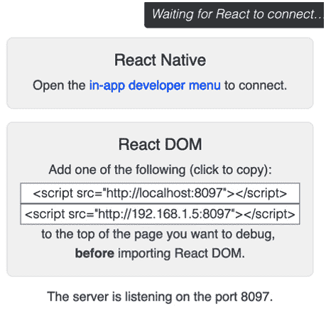

图 7.18 – React Developer Tools 应用程序

在前面的屏幕截图中，`react-devtools` 打开并监听我们的应用程序运行以连接到它。一旦我们通过交互模式运行任何 Cypress 测试，应用程序的组件树就会在 `react-devtools` 应用程序内部填充：

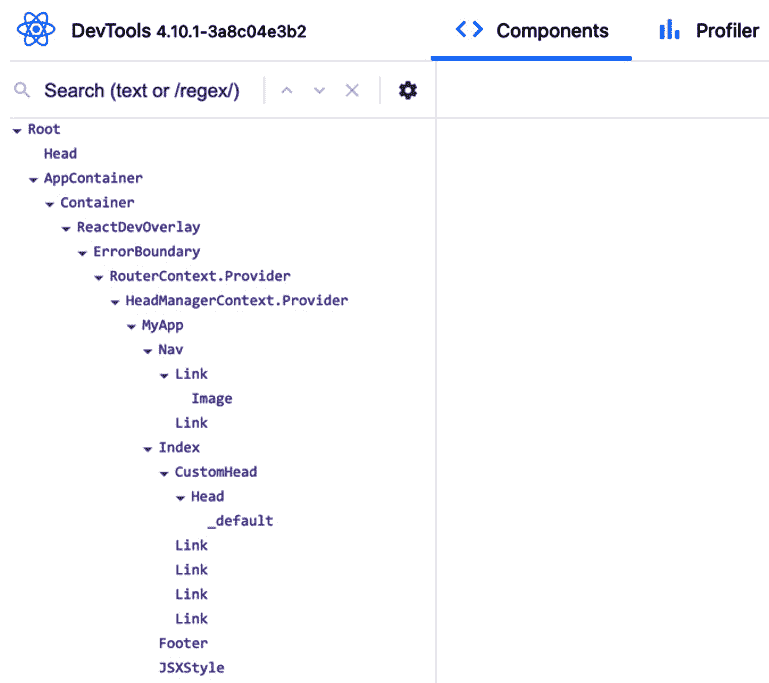

图 7.19 – React Developer Tools 组件树视图

在前面的屏幕截图中，`react-devtools` 应用程序显示了正在运行的测试的结果组件树。随着应用程序的运行，我们有许多可用的工具，例如点击组件名称来查看相关信息：

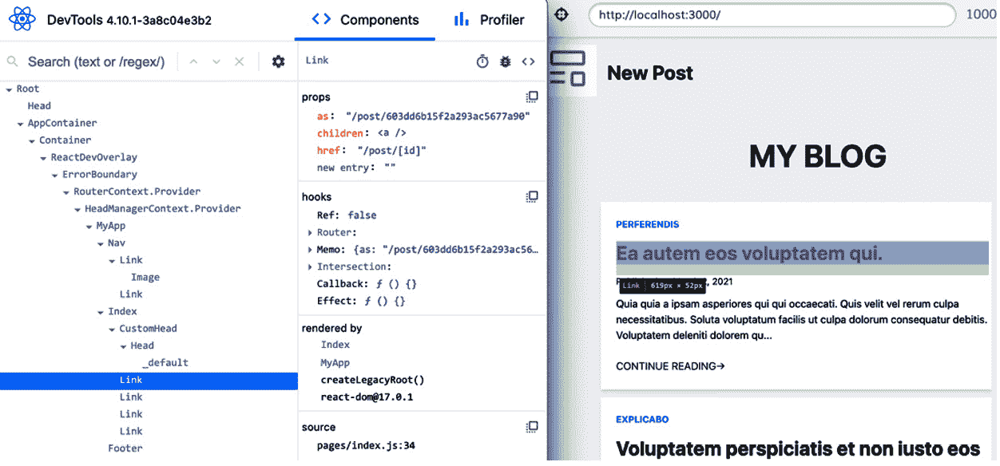

图 7.20 – React Developer Tools 组件详情

在前面的屏幕截图中，我们在 `react-devtools` 屏幕的左侧选择了一个 `Link` 组件。当我们点击该组件时，它会在 `react-devtools` 屏幕的右侧显示相关信息，例如 `props` 和 `hooks`。我们还在屏幕的右侧看到了 Cypress 交互模式屏幕。

现在，你知道如何使用 Cypress 与 React Developer Tools。除了 Cypress 提供的调试工具外，你现在还有一个额外的工具来调试运行 Cypress 的 React 应用程序。

# 摘要

在本章中，你学习了使用 Cypress 测试应用程序的新策略。你可以编写端到端测试来验证应用程序的关键用户流程。你学习了如何实现 API 测试。你现在知道使用 Cypress 驱动的开发来创建新特性的好处。你理解了 POM 和自定义命令设计模式来构建和组织测试代码。

最后，你学会了如何使用 Cucumber 编写 Gherkin 风格的测试，以增强与非技术团队成员的沟通。

恭喜你，你已经到达了我们的旅程的终点，现在你了解了许多简化测试 React 应用程序的策略和工具！在这本书中学到的概念和技能将帮助你在未来处理任何 JavaScript 项目时编写高质量的代码。

祝你好运，并且始终记住，没有伟大的软件是建立在伟大的测试基础之上的。

# 问题

1.  找到一个以前的项目，并使用 Cypress 安装并编写一系列端到端测试。

1.  创建一个 CRUD API 并使用 Cypress 测试它。

1.  构建一个全栈 React 应用程序，并尽可能多地使用本书中学到的不同策略编写测试。
