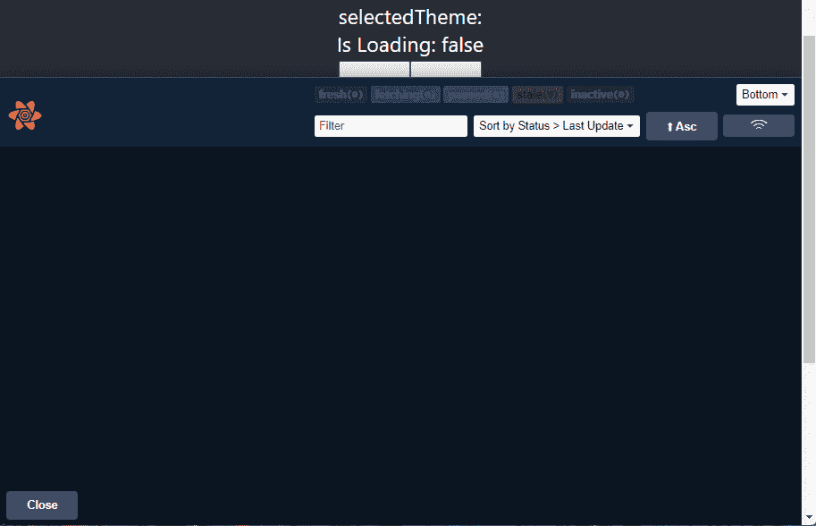
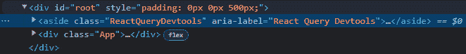
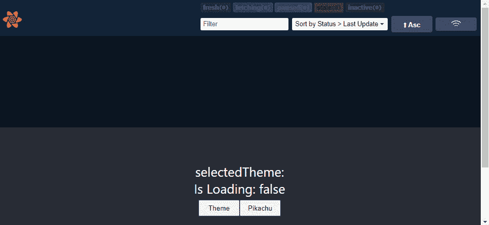
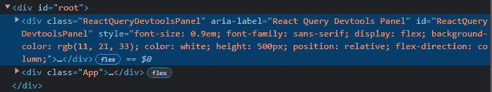

# 3

# React Query – 介绍、安装和配置

React Query 是一个库，旨在让 React 开发者更容易地管理他们的服务器状态。它使得开发者能够克服与服务器状态相关的所有挑战，同时使他们的应用程序更快、更容易维护，并减少代码中的许多行。

在本章中，你将了解 React Query 并了解为什么它被创建。

你还将了解 React Query 的主要概念——**查询**和**突变**。

一旦你了解了 React Query，我们将在我们的应用程序中安装它，并确定我们需要在代码中进行的初始配置，以便完全使用它。

在本章结束时，你将了解所有关于 React Query Devtools 的内容，以便在使用 React Query 时拥有更好的开发者体验。

在本章中，我们将涵盖以下主题：

+   什么是 React Query？

+   安装 React Query

+   配置 React Query

+   将 React Query Devtools 添加到你的应用程序

# 技术要求

在本章中，我们将向我们的应用程序添加 React Query v4。为此，我们需要做几件事情：

+   你的浏览器需要与以下配置兼容：

    +   Google Chrome 版本需要至少为 73

    +   Mozilla Firefox 版本需要至少为 78

    +   Microsoft Edge 版本需要至少为 79

    +   Safari 版本需要至少为 12.0

    +   Opera 版本需要至少为 53

+   版本 16.8 之后的 React 项目

本章的所有代码示例都可以在 GitHub 上找到：[`github.com/PacktPublishing/State-management-with-React-Query/tree/feat/chapter_3`](https://github.com/PacktPublishing/State-management-with-React-Query/tree/feat/chapter_3%0D)

# 什么是 React Query？

React Query 是一个协议无关的钩子集合，用于在 React 中获取、缓存和更新服务器状态。

它是由 Tanner Linsley 创建的，是名为 TanStack 的一系列开源库的一部分。

默认情况下，React Query 也可以与 React Native 无缝协作，并且它是用 TypeScript 编写的，这样你可以从所有其优势中受益，例如类型缩小和类型推断。

自版本 4 以来，React Query 已嵌入到名为 TanStack Query 的一系列库中。TanStack Query 使得将 React Query 的所有惊人功能传播到其他框架和库（如 Vue、Solid 和 Svelte）成为可能。

React Query 利用查询和突变来处理你的服务器状态。在阅读最后一句话后，你可能会想知道查询和突变是什么。我将在后续章节中展示一些代码，以便你可以看到 React Query 如何处理它们，但首先，让我们了解查询和突变。

## 查询

查询是你向异步源发出的请求，以获取你的数据。只要你有触发数据获取请求的函数，你就可以在 React Query 中执行查询。

通过允许我们将请求包裹在返回 promise 的函数中，React Query 支持 REST、GraphQL 以及任何其他异步数据获取客户端。

在 React Query 中，`useQuery` 自定义钩子允许你订阅查询。

## **突变**

突变是一种操作，允许你创建、更新或删除你的服务器状态。

与查询一样，只要你有触发突变的函数，React Query 就支持 REST、GraphQL 以及任何其他异步数据获取客户端。

在 React Query 中，`useMutation` 自定义钩子允许你执行突变。

## React Query 如何解决我的服务器状态挑战？

*如果我告诉你，前一章中提出的所有挑战都可以通过 React Query 解决，你会怎么想？*

无需配置，React Query 支持以下所有令人惊叹的功能：

+   **缓存**：在每次查询之后，数据将在可配置的时间内被缓存，并且可以在整个应用程序中重复使用。

+   **查询取消**：你的查询可以被取消，你可以在取消后执行一个操作。

+   **乐观更新**：在突变过程中，你可以轻松地更新你的状态，以便为用户提供更好的用户体验。如果突变失败，你还可以轻松地回滚到之前的状态。

+   **并行查询**：如果你需要同时执行一个或多个查询，你可以轻松地做到这一点，而不会对你的缓存造成任何影响。

+   **依赖查询**：有时，我们需要在另一个查询完成后执行一个查询。React Query 使这变得简单，并避免了链式 promise。

+   **分页查询**：使用 React Query 可以使这种 UI 模式变得更加简单。你会发现使用分页 API、切换页面和渲染获取的数据非常简单。

+   **无限查询**：React Query 使这种 UI 模式变得更加简单。你可以将无限滚动实现到你的 UI 中，并且可以信任 React Query 在获取数据时使你的生活变得更简单。

+   **滚动恢复**：你是否曾经从一个页面导航出去，然后当你导航回来时，发现页面滚动到了你离开时的确切位置？这是滚动恢复，只要你的查询结果被缓存，它就会自动工作。

+   **数据重新获取**：需要触发数据重新获取吗？React Query 允许你通过几乎一行代码就能做到这一点。

+   **数据预获取**：有时，你可以提前识别出用户的需求和后续操作。当这种情况发生时，你可以信任 React Query 在此之前帮助你预获取那些数据并为你缓存它们。这样，你的用户体验将得到改善，并且用户会感到更加满意。

+   **跟踪网络模式和离线支持**：你是否曾经遇到过用户在使用你的应用程序时丢失互联网连接的情况？别担心，因为 React Query 可以跟踪你的网络当前状态，如果查询失败是因为用户失去了连接，那么一旦网络恢复，它将重试。

看着这个列表真是太棒了，对吧？

只要有开箱即用的缓存，这绝对是一个节省时间的超级好方法，因为当处理服务器状态时，这绝对是最难实现的事情之一。

在 React Query 之前，处理我们应用程序中的服务器状态要困难得多。我们尝试过，但我们的解决方案最终变得更加复杂，代码的可维护性更低。通常，这些实现甚至会影响用户体验，因为我们的应用程序会变得不那么响应。

使用 React Query，你现在能够大大减少代码中的行数，使你的应用程序更容易阅读和简单，同时，使你的应用程序更快、更响应。

我现在不会深入更多技术细节，因为，希望在下章中，你会看到所有这些功能的工作，并开始理解为什么 React Query 使你的生活变得如此简单。

现在，让我们先在我们的应用程序中安装 React Query。

# 安装 React Query

现在你已经了解了 React Query，你可能正在想，“哇，我真的很需要把这个添加到我的项目中。”别再等了——这就是你需要做的来安装 React Query。

根据你的项目类型，你可以以几种方式安装 React Query。

## npm

如果你正在你的项目中运行 npm，那么这是你需要做的来安装 React Query。

在你的终端中，运行以下命令：

```js
npm i @tanstack/react-query
```

## Yarn

如果你更喜欢 Yarn，那么这是你需要做的来安装 React Query。

在你的终端中，运行以下命令：

```js
yarn add @tanstack/react-query
```

## pnpm

如果你是一位新包管理器的粉丝，比如 pnpm，并且正在你的项目中使用它，那么你需要这样做来安装 React Query。

在你的终端中，运行以下命令：

```js
pnpm add @tanstack/react-query
```

## 脚本标签

没有使用包管理器？别担心，因为你可以通过使用托管在 **内容** **分发网络** 上的全局构建来将 React Query 添加到你的应用程序中。

内容分发网络 (CDN)

CDN 是一组地理上分布的服务器集合，它们协同工作以允许在互联网上更快地交付内容。

要将 React Query 添加到你的应用程序中，在你的 HTML 文件末尾添加以下 `script` 标签：

```js
<script src="img/index.production.js"></script>
```

现在你应该在项目中安装了 React Query。

现在，我们需要在我们的项目中进行初始配置，以便能够使用 React Query 的所有核心功能。

# 配置 React Query

React Query 具有非常快速和简单的配置。这提高了开发者的体验，并可以让你尽快开始将你的服务器状态迁移到 React Query。

要将 React Query 添加到您的应用程序中，您只需要了解两件事：

+   **QueryClient**

+   **QueryClientProvider**

## QueryClient

如您现在所应知道的，缓存是 React Query 为开发者简化的重要事情之一。在 React Query 中，有两种机制用于处理此缓存，称为 **QueryCache** 和 **MutationCache**。

`QueryCache` 负责存储与您的查询相关的所有数据。这可以是您的查询数据以及其当前状态。

`MutationCache` 负责存储与您的突变相关的所有数据。这可以是您的突变数据以及其当前状态。

为了让开发者更容易从这两个缓存中抽象出来，React Query 创建了 `QueryClient`。这是开发者与缓存之间的接口。

当您使用 React Query 设置应用程序时，您应该做的第一件事是创建一个 `QueryClient` 实例。为此，您需要从 `@tanstack/react-query` 包中导入它并实例化它：

```js
import {
 QueryClient,
} from '@tanstack/react-query'
const queryClient = new QueryClient()
```

在前面的代码片段中，我们创建了一个新的 `QueryClient` 对象。由于我们在实例化对象时没有传递任何参数，因此 `QueryClient` 将假定所有默认值。

在创建我们的 `QueryClient` 时，我们可以作为参数发送四个选项。它们如下所示：

+   `queryCache`：此客户端将在整个应用程序中使用查询缓存。

+   `mutationCache`：此客户端将在整个应用程序中使用突变缓存。

+   `logger`：此客户端将使用它来显示错误、警告以及调试时有用的信息。如果没有指定任何内容，React Query 将使用控制台对象。

+   `defaultOptions`：所有查询和突变将在整个应用程序中使用的默认选项。

现在，您可能想知道何时应该手动设置这些参数而不是使用默认值。以下的小节将告诉您何时这样做。

### QueryCache 和 MutationCache

这里有一个小小的预告，希望您在接下来的章节中能够复习并更好地理解，但了解何时手动配置 `QueryCache` 或 `MutationCache` 是非常重要的——所有查询和突变都可以在出现错误或执行成功时执行一些代码。这些代码由 `onSuccess` 和 `onError` 函数表示。此外，在突变的情况下，您还可以在突变执行之前执行一些代码。在这种情况下，表示这个功能的函数被称为 `onMutate`。

在 `QueryCache` 的情况下，它看起来是这样的：

```js
import { QueryCache } from '@tanstack/react-query'
const queryCache = new QueryCache({
 onError: error => {
  // do something on error
 },
 onSuccess: data => {
  // do something on success
 }
})
```

在解释前面的代码片段之前，让我们先看看与之非常相似的 `MutationCache`：

```js
import { MutationCache } from '@tanstack/react-query'
const mutationCache = new MutationCache({
 onError: error => {
  // do something on error
 },
 onSuccess: data => {
  // do something on success
 },
 onMutate: newData => {
  // do something before the mutation
 },
})
```

如您所见，这两个代码片段非常相似，只是在 `MutationCache` 上的 `onMutate` 函数有所不同。

默认情况下，这些函数没有任何行为，但如果出于某种原因，你打算在执行突变或查询时始终执行某些操作，那么你可以在实例化缓存对象时，在相应对象的相应函数中进行此配置。

然后，你可以在实例化`QueryClient`时将此对象发送给它：

```js
const queryClient = new QueryClient({
 mutationCache,
 queryCache
})
```

在前面的代码片段中，我们使用我们的自定义`MutationCache`和`QueryCache`函数实例化了一个新的`QueryClient`。

### Logger

你在你的项目中是否在`console`对象之外使用`logger`？那么，你可能想在`QueryClient`中配置它。

这里你需要做的是：

```js
const logger = {
   log: (...args) => {
     // here you call your custom log function
   },
   warn: (...args) => {
     // here you call your custom warn function
   },
   error: (...args) => {
     // here you call your custom error function
   },
 };
```

在前面的代码片段中，我们创建了一个`logger`对象。这个对象有三个函数，React Query 将在需要`记录`错误、`警告`错误或显示`错误`时调用这些函数。你可以覆盖这些函数并添加你自己的自定义记录器。

然后，你所需要做的就是在你实例化`QueryClient`时传递这个`logger`对象：

```js
const queryClient = new QueryClient({
 logger
})
```

在前面的代码片段中，我们使用我们的自定义记录器实例化了一个新的`QueryClient`。

### defaultOptions

有一些选项被用作你在整个应用程序中执行的所有突变或查询的默认值。`defaultOptions`允许你覆盖这些默认值。有很多默认值，我会避免展示所有这些，以免泄露下一章的内容，但请放心——在适当的时候，我会对这些选项进行回调。

这里是如何覆盖你的`defaultOptions`：

```js
const defaultOptions = {
   queries: {
     staleTime: Infinity,
   },
 };
```

在前面的代码片段中，我们创建了一个`defaultOptions`对象，并在其中创建了一个`queries`对象。在这个`queries`对象内部，我们指定了所有查询的`staleTime`都将设置为`Infinity`。再次提醒，不要担心现在还没有对这个定义，你将在下一章中理解它。

一旦完成这个设置，你所需要做的就是在你实例化`QueryClient`时传递这个`defaultOptions`对象，这样所有的查询都将具有`staleTime`属性并设置为`Infinity`。

这里是如何操作的：

```js
const queryClient = new QueryClient({
 defaultOptions
})
```

在前面的代码片段中，我们使用我们的自定义`defaultOptions`对象实例化了一个新的`QueryClient`。

好的，所以现在你应该已经了解了`QueryClient`及其在 React Query 中作为大脑的角色。

所以，你可能正在想，考虑到 React Query 是基于钩子进行查询和突变的，我们是否需要始终将我们的`QueryClient`传递给所有的钩子？

想象一下如果是这种情况！在我们使用第二个或第三个钩子之前，我们都会对应用程序中的所有属性钻探感到厌烦。

让我们看看 React Query 通过引入`QueryClientProvider`如何帮助我们节省时间。

## QueryClientProvider

为了让每个开发者更容易地共享我们的 `QueryClient`，React Query 采用了我们在 *第一章* 中学到的某种方法，那就是 React Context。通过创建其自定义提供者 `QueryClientProvider`，React Query 允许您与它自动提供的所有自定义钩子共享 `QueryClient`。

下面的代码片段展示了如何使用 React Query 的 `QueryClientProvider`：

```js
import {
 QueryClient,
 QueryClientProvider,
} from '@tanstack/react-query'
// Create a client
const queryClient = new QueryClient()
const App = () => {
 return (
   <QueryClientProvider client={queryClient}>
     <Counter />
   </QueryClientProvider>
 )
}
```

正如您在前面的代码片段中所看到的，您需要做的就是从 `@tanstack/react-query` 包中导入您的 `QueryClientProvider`，用它包裹您的主体组件，并将其作为属性传递给 `queryClient`。

您的应用程序现在已准备好开始使用 React Query。

现在，让我们看看如何添加和使用 React Query 专用的开发者工具。

# 添加 React Query Devtools

在调试我们的应用程序时，我们经常发现自己在想，如果有一种方法可以可视化应用程序内部发生的事情，那会多么美妙。好吧，有了 React Query，您不必担心，因为它有自己的开发者工具，或者称为 devtools。

React Query Devtools 允许您查看和理解所有查询和突变当前的状态。这将为您节省大量调试时间，并避免在所有代码中污染不必要的日志函数，即使只是暂时性的。

根据项目类型，您可以通过几种方式安装 React Query Devtools：

+   如果您在项目中运行 npm，请运行以下命令：

    ```js
    npm i @tanstack/react-query-devtools
    ```

+   如果您正在使用 Yarn，请运行以下命令：

    ```js
    yarn add @tanstack/react-query-devtools
    ```

+   如果您正在使用 pnpm，请运行以下命令：

    ```js
    pnpm add @tanstack/react-query-devtools
    ```

现在，您应该在您的应用程序中安装了 React Query Devtools。现在，让我们看看如何将它们添加到我们的代码中。

使用 Devtools 有两种方式。它们是浮动模式和嵌入式模式。

## 浮动模式

浮动模式将在屏幕角落浮动显示 React Query 标志。通过点击它，您可以切换 Devtools 的开启或关闭。

将显示在您屏幕角落的标志如下：


图 3.1 – React Query Devtools 的标志

一旦切换，您将看到 Devtools：



图 3.2 – React Query Devtools 的浮动模式

Devtools 将在您的 **DOM 树**中作为单独的 HTML 元素渲染。



图 3.3 – React Query Devtools 的浮动模式在 DOM 上的显示

要将 Devtools 以浮动模式添加到您的应用程序中，您需要导入它：

```js
import { ReactQueryDevtools } from '@tanstack/
  react-query-devtools'
```

导入后，只需将其添加到尽可能靠近您的 `QueryClientProvider` 的位置：

```js
   <QueryClientProvider client={queryClient}>
     <ReactQueryDevtools initialIsOpen={false} />
     <Counter />
   </QueryClientProvider>
```

## 嵌入式模式

嵌入式模式会将 Devtools 嵌入为应用程序中的常规组件。

这是它在您的应用程序中的样子：



图 3.4 – React Query Devtools 的嵌入式模式

如果您查看您的 DOM 树，您将看到 Devtools 被像常规组件一样渲染。



图 3.5 – React Query Devtools 的嵌入式模式在 DOM 上的显示

要在你的应用程序中使用嵌入式模式的 Devtools，你需要导入它：

```js
import { ReactQueryDevtoolsPanel } from '@tanstack/
  react-query-devtools'
```

一旦它们被导入，只需将它们添加到尽可能靠近你的 `QueryClientProvider` 的位置：

```js
   <QueryClientProvider client={queryClient}>
     <ReactQueryDevtoolsPanel />
     <Counter />
   </QueryClientProvider>
```

默认情况下，Devtools 不包含在生产构建中。尽管如此，你可能会想在生产环境中加载它们以帮助调试某些问题。在下一节中，我们将看到如何做到这一点。

## 启用生产构建中的 Devtools

如果你决定在生产环境中加载 Devtools，你必须延迟加载它，而不是动态加载。这很重要，可以帮助减少你的应用程序包大小。同样重要的是懒加载 Devtools，因为当我们在生产环境中使用我们的应用程序时，我们可能永远不想使用它，所以我们想避免在我们的构建中添加最终根本不会使用的东西。在 React 中，我们可以使用 `React.lazy` 来懒加载组件。

这是我们可以使用 `React.lazy` 导入 Devtools 的方法：

```js
const ReactQueryDevtoolsProduction = React.lazy(() =>
  import('@tanstack/react-query-devtools/build/lib/
    index.prod.js').then(
    (d) => ({
      default: d.ReactQueryDevtools,
    }),
  ),
)
```

前面的代码片段包裹了一个 `React.lazy` 并将承诺的返回值赋给 `ReactQueryDevtoolsProduction`，这样我们就可以在我们的生产环境中懒加载它，而不会增加我们的包大小。

什么是动态导入？

动态导入允许你从代码中的任何位置异步加载一个模块。此导入将返回一个承诺，当承诺被满足时，返回一个包含模块导出的对象。

前面的代码片段应该适用于所有打包器。如果你使用的是一个支持包导出的更现代的打包器，那么你可以像这样动态导入你的模块：

```js
const ReactQueryDevtoolsProduction = React.lazy(() =>
  import('@tanstack/react-query-devtools/production').then(
    (d) => ({
      default: d.ReactQueryDevtools,
    }),
  ),
)
```

在这个代码片段中，我们将导入模块的路径从我们将要导入的路径更改为一个可以与更现代的打包器一起工作的路径。

当使用 `React.lazy` 并尝试渲染我们刚刚懒加载的组件时，React 要求该组件应该被一个 **Suspense** 组件包裹。这在我们要在懒加载的组件待定期间显示回退内容的情况下非常重要。

什么是悬念？

`Suspense` 允许你在组件内部尚未准备好渲染时，在你的 UI 中显示加载指示。

让我们看看我们需要做什么来加载我们的 `ReactQueryDevtoolsProduction` 组件：

```js
<React.Suspense fallback={null}>
  <ReactQueryDevtoolsProduction />
</React.Suspense>
```

如代码片段所示，我们用 `Suspense` 包裹了 `ReactQueryDevtoolsProduction` 组件，以便它可以被懒加载。你还可以看到我们没有提供任何回退，因为我们正在尝试加载的是 Devtools，我们不需要在模块加载期间添加任何待定状态。

现在，我们不想在渲染我们的组件时自动加载 Devtools。我们想要的只是在我们的应用程序中切换它们的方式。

由于这是一个生产构建，我们不希望在其中有可能会让用户困惑的按钮。因此，一种潜在的处理方式是在我们的 `window` 对象内部创建一个名为 `toggleDevtools` 的函数。

这是 React Query 文档建议我们这样做的方式：

```js
  const [showDevtools, setShowDevtools] = React.useState
    (false)
  React.useEffect(() => {
    window.toggleDevtools = () => setShowDevtools
      ((previousState) => !previousState)
  }, [])
  return (
    …
      {showDevtools && (
        <React.Suspense fallback={null}>
          <ReactQueryDevtoolsProduction />
        </React.Suspense>
      )}
    …
  );
```

在前面的代码片段中，我们做了以下操作：

1.  创建一个状态变量来保存 Devtools 的当前状态。这个状态变量在用户打开或关闭 Devtools 时更新。

1.  在`window`上运行一个效果，将切换函数分配给我们的`window`。

1.  在我们的返回中，当我们的`showDevtools`被切换为开启时，由于我们正在懒加载我们的`ReactQueryDevtoolsProduction`组件，我们需要用`Suspense`包裹它，以便能够渲染它。

到目前为止，你已经拥有了在应用程序中使用 React Query 所需的一切。

# 摘要

在本章中，我们学习了 TanStack Query 以及 React Query 如何融入其中。到现在，你应该能够识别 React Query 使服务器状态管理变得更容易的主要方式，以及它是如何使用查询和突变的。

你学习了`QueryClient`和`QueryClientProvider`，并了解了它们对于在应用程序中运行 React Query 是基本性的。你还学习了如果你需要，你可以如何自定义自己的`QueryClient`。

最后，你将遇到 React Query Devtools，并学习如何在你的项目中配置它。现在，你也能够在需要做额外调试的特殊场景中将它加载到生产环境中。

在*第四章*，*使用 React Query 获取数据*中，你将了解你的最佳查询助手——`useQuery`自定义钩子。你将理解它是如何工作的，如何使用它，以及它如何缓存数据。你还将了解你可以触发查询重新获取查询的方式，以及如何构建依赖查询。

# 第二部分：使用 React Query 管理服务器状态

当处理服务器状态时，许多挑战都与我们从其中读取的方式有关。从缓存到分页，我们将了解 React Query 的自定义钩子`useQuery`是如何使这项工作变得容易，同时提供令人惊叹的开发者和用户体验。

以及我们读取服务器状态时的挑战，创建、更新和删除它又带来了一组新的挑战。幸运的是，React Query 还有一个名为`useMutation`的自定义钩子来提供帮助。

在理解了 React Query 的支柱之后，你可能想知道流行的服务器端框架如 Next.js 和 Remix 是否允许你使用 React Query。剧透一下——它们确实可以，你在这里将学习如何使用。

为了总结并确保你晚上能睡得香，你将学习一套你可以用来测试 React Query 的食谱，通过利用 Mock Service Worker 和 React Testing Library 来使用组件和自定义钩子。

这一部分包括以下章节：

+   *第四章*, *使用 React Query 获取数据*

+   *第五章*, *更多数据获取挑战*

+   *第六章*, *使用 React Query 执行数据突变*

+   *第七章*, *使用 Next.js 或 Remix 进行服务器端渲染*

+   *第八章*, *测试 React Query 钩子和组件*
