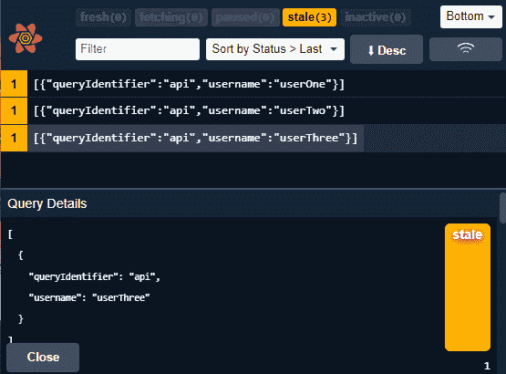
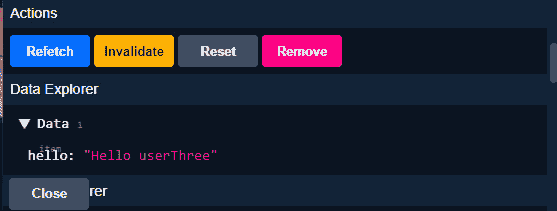
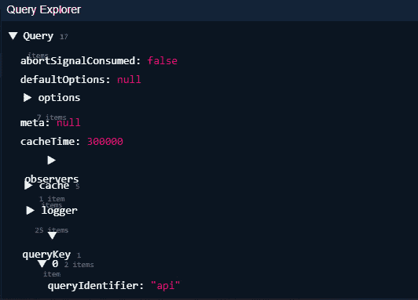
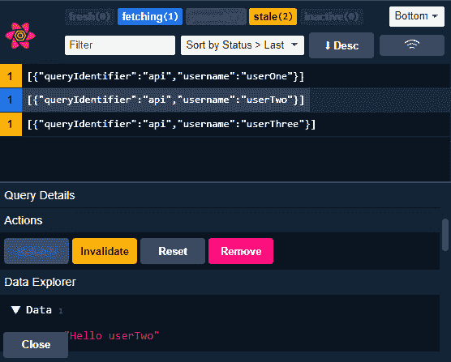

# 5

# 更多数据获取挑战

到现在为止，你必须熟悉 React Query 如何通过 `useQuery` 帮助你获取数据。你甚至学习了如何处理服务器状态带来的某些常见挑战。

在本章中，你将学习如何处理一些更多的服务器状态挑战。你将了解你如何执行并行查询，在这个过程中，你将了解一个使 `useQuery` 钩子更容易使用的变体，称为 `useQueries`。

你将再次利用 `QueryClient` 来处理数据预取、查询无效化和查询取消。你甚至将学习如何通过使用一些过滤器来自定义你用来做这些事情的方法。

`useQuery` 以及甚至另一个名为 `useInfiniteQuery` 的变体。

到本章结束时，你将再次使用 Devtools 来查看你的查询，并增强对其的调试。

在本章中，我们将涵盖以下主题：

+   构建并行查询

+   利用 `QueryClient`

+   创建分页查询

+   创建无限查询

+   使用 Devtools 调试你的查询

# 技术要求

本章的所有代码示例都可以在 GitHub 上找到，链接为 [`github.com/PacktPublishing/State-management-with-React-Query/tree/feat/chapter_5`](https://github.com/PacktPublishing/State-management-with-React-Query/tree/feat/chapter_5)。

# 构建并行查询

我们经常发现需要使用的一个典型模式是并行查询。并行查询是指同时执行的查询，以避免有顺序的网络请求，通常称为网络瀑布。

并行查询可以帮助你通过同时发送所有请求来避免网络瀑布。

React Query 允许我们以两种方式执行并行查询：

+   手动

+   动态地

## 手动并行查询

如果我现在要求你正确地执行并行查询，这可能是你可能会这样做的方式。它只涉及并排编写任意数量的 `useQuery` 钩子。

当你需要执行固定数量的并行查询时，这种模式非常出色。这意味着你将执行查询的数量始终相同，不会改变。

这就是你可以按照这种方法编写并行查询的方式：

```js
const ExampleOne = () => {
  const { data: queryOneData  } = useQuery({
    queryKey: [{ queryIdentifier: "api", username:
      "userOne" }],
    queryFn: fetchData,
  });
  const { data: queryTwoData } = useQuery({
    queryKey: [{ queryIdentifier: "api", username:
      "userTwo" }],
    queryFn: fetchData,
  });
  const { data: queryThreeData } = useQuery({
    queryKey: [{ queryIdentifier: "api", username:
      "userThree" }],
    queryFn: fetchData,
  });
  return (
    <div>
      <p>{queryOneData?.hello}</p>
      <p>{queryTwoData?.hello}</p>
      <p>{queryThreeData?.hello}</p>
    </div>
  );
};
```

在前面的代码片段中，我们通过向所有这些查询添加不同的查询键来创建三个不同的查询。这些查询将并行获取，一旦查询函数解决，我们将能够访问它们的数据。然后我们使用这些数据在 `p` 标签内渲染它们的 `hello` 属性。

## 动态并行查询

虽然手动并行查询适用于大多数场景，但如果你的查询数量变化，你将无法在不违反钩子规则的情况下使用它。为了处理这个问题，React Query 创建了一个名为 **useQueries** 的自定义钩子。

`useQueries` 允许你动态地调用你想要的任意数量的查询。以下是它的语法：

```js
const queryResults = useQueries({
  queries: [
    { queryKey: ["api", "queryOne"], queryFn: fetchData },
    { queryKey: ["api", "queryTwo"], queryFn: fetchData }
  ]
})
```

如前所述的代码片段所示，`useQueries`钩子在它的`queries`属性中接收一个查询数组。这些查询甚至可以接收选项，所以你应该有这样的心理模型：这些查询可以像`useQuery`钩子一样进行定制。

`useQueries`钩子将返回一个包含所有查询结果的数组。

既然你已经了解了`useQueries`的工作原理，让我们在下面的代码片段中将其付诸实践：

```js
const usernameList = ["userOne", "userTwo", "userThree"];
const ExampleTwo = () => {
  const multipleQueries = useQueries({
    queries: usernameList.map((username) => {
      return {
        queryKey: [{ queryIdentifier: "api", username }],
        queryFn: fetchData,
      };
    }),
  });
  return (
    <div>
      {multipleQueries.map(({ data, isFetching }) => (
        <p>{isFetching ? "Fetching data..." : data.hello}
          </p>
      ))}
    </div>
  );
};
```

在前面的代码片段中，我们做了以下操作：

1.  我们创建一个`usernameList`字符串数组来帮助我们创建一些动态查询。

1.  在我们的`useQueries`钩子内部，对于`usernameList`中的每个实例，我们创建一个相应的查询，包括其查询键和查询函数。

1.  我们使用`useQueries`钩子的结果；对于它内部的每个项目，我们利用`isFetching`向用户显示我们正在获取数据。如果它没有获取数据，那么我们假设我们已经完成了我们的请求，并显示获取到的数据。

现在你已经知道如何利用`useQuery`和`useQueries`来执行并行查询，让我们看看你如何利用`QueryClient`来解决一些更多的服务器状态挑战。

# 利用 QueryClient

正如你所知，`QueryClient`允许你与你的缓存进行交互。

在上一章中，我们看到了如何利用`QueryClient`来触发查询的重新获取。我们还没有看到的是`QueryClient`可以用于更多的事情。

要在你的组件中使用`QueryClient`，你可以利用`useQueryClient`钩子来访问它。然后，你所要做的就是调用你需要的那个方法。

在本节中，我们将看到如何使用`QueryClient`来解决更多服务器状态挑战，例如以下内容：

+   查询无效化

+   预取

+   查询取消

在我们开始查询无效化之前，有一件事需要注意，那就是其中一些方法，即我们即将看到的方法，可以接收某些查询过滤器来帮助你匹配正确的查询。

在上一章中，我们看到了查询重新获取的以下示例：

```js
queryClient.refetchQueries({ queryKey: ["api"] })
```

前面的代码片段是一个示例，说明我们可以在`refetchQueries`方法中提供一个过滤器。在这种情况下，我们正在尝试重新获取所有匹配或以查询键`["api"]`开头的查询。

现在，你可以使用除了查询键之外的更多过滤器。在`QueryClient`方法中使用的过滤器，通常称为`QueryFilters`，支持以下类型的过滤：

+   查询键

+   查询类型

+   查询是否过时或新鲜

+   `fetchStatus`

+   一个谓词函数

这里有一些使用`QueryFilters`的示例。

在下面的示例中，我们使用`type`过滤器与`active`值一起重新获取所有当前处于活动状态的查询：

```js
queryClient.refetchQueries({ type: "active" })
```

在下面的示例中，我们使用`stale`过滤器与`true`值一起重新获取所有`staleTime`已过期的查询，现在被认为是过时的：

```js
queryClient.refetchQueries({ stale: true })
```

在以下示例中，我们使用`fetchStatus`过滤器与`idle`值一起重新获取所有当前未获取任何内容的查询：

```js
queryClient.refetchQueries({ fetchStatus: "idle"})
```

在以下示例中，我们使用`predicate`属性并向其传递一个匿名函数。此函数将接收正在验证的查询并访问其当前状态；如果此状态是错误，则函数将返回`true`。这意味着所有当前状态为错误的查询都将重新获取。

```js
queryClient.refetchQueries({
            predicate: (query) => query.state.status ===
              "error",
})
```

现在，您不需要只传递一个过滤器。您可以发送以下组合的过滤器：

```js
queryClient.refetchQueries({ queryKey: ["api"], stale: true
  })
```

在前面的示例中，我们重新获取了所有以`["api"]`开头的过时查询。

如果您不想传递任何过滤器并希望方法应用于所有查询，您可以选择不传递任何过滤器，如下所示：

```js
queryClient.refetchQueries()
```

此示例将重新获取所有查询。

您现在熟悉了`QueryFilters`，并可以看到其中涉及的一些服务器状态挑战。让我们从查询无效化开始。

## 查询无效化

有时，独立于您配置的`staleTime`，您的数据可能会变得过时。为什么，您可能会问？好吧，有时可能是因为您执行的突变；有时可能是因为其他用户在某个地方与您的服务器状态进行了交互。

当这种情况发生时，您可以使用您的`QueryClient` **invalidateQueries**方法将查询标记为过时。

这里是`invalidateQueries`方法的语法：

```js
queryClient.invalidateQueries({ queryKey: ["api"] })
```

通过调用`invalidateQueries`，所有匹配或以`["api"]`开头的查询都将被标记为`stale`，如果已配置，则覆盖其`staleTime`。如果您的查询是活动状态，因为`useQuery`钩子渲染正在使用它，那么 React Query 将负责重新获取该查询。

让我们现在通过以下示例将其付诸实践：

```js
const QueryInvalidation = () => {
  const { data } = useQuery({
    queryKey: [{ queryIdentifier: "api", username:
      "userOne" }],
    queryFn: fetchData,
  });
  const queryClient = useQueryClient();
  return (
    <div>
      <p>{data?.hello}</p>
      <button
        onClick={() =>
          queryClient.invalidateQueries({
            queryKey: [{ queryIdentifier: "api" }],
          })
        }
      >
        Invalidate Query
      </button>
    </div>
  );
};
```

在前面的代码片段中，我们有一个无效化查询的示例。这就是我们正在做的事情：

1.  创建一个由`[{ queryIdentifier: "api", username: "userOne" }]`查询键标识的查询

1.  获取`queryClient`访问权限

1.  渲染我们的查询数据和按钮，其中`onClick`将使所有匹配或包含查询键的一部分`[{ queryIdentifier: "api" }]`的查询无效

当用户点击查询键的一部分`[{ queryIdentifier: "api" }]`时，该查询数据将立即被标记为`stale`。由于此查询正在渲染中，它将自动在后台重新获取。

## 预取

您希望用户获得最佳的用户体验。这有时意味着在用户意识到之前就了解他们的需求。这正是预取可以帮助您的地方。

当您可以预测用户可能想要执行的操作，这不可避免地触发查询时，您可以利用这些知识并预取查询以节省用户未来的时间。

`QueryClient`允许您访问一个名为**prefetchQuery**的方法来预取您的数据。

这里是`prefetchQuery`方法的语法：

```js
queryClient.prefetchQuery({
      queryKey: ["api"],
      queryFn: fetchData
  });
```

`prefetchQuery`需要一个查询键和一个查询函数。这个方法将尝试获取你的数据并将其缓存到给定的查询键下。*这是一个异步方法*；因此，你需要等待它完成。

现在我们来看一个使用我们的`ExamplePrefetching`组件进行数据预取的实际例子：

```js
const ExamplePrefetching = () => {
  const [renderComponent, setRenderComponent] =
    useState(false);
  const queryClient = useQueryClient();
  const prefetchData = async () => {
    await queryClient.prefetchQuery({
      queryKey: [{ queryIdentifier: "api", username:
        "userOne" }],
      queryFn: fetchData,
      staleTime: 60000
    });
  };
  return (
    <div>
      <button onMouseEnter={prefetchData} onClick={() =>
      setRenderComponent(true)}> Render Component </button>
      {renderComponent ? <PrefetchedDataComponent /> : null
        }
    </div>
  );
};
```

在前面的代码片段中，我们创建了我们的`ExamplePrefetching`组件。以下是它的作用：

1.  它创建了一个状态变量，我们将使用它来允许我们渲染`PrefetchedDataComponent`。

1.  它可以访问`queryClient`。

1.  它创建了一个名为`prefetchData`的函数，我们在其中调用`prefetchQuery`方法并将返回的数据缓存到`[{ queryIdentifier: "api", username: "userOne" }]`查询键下。我们还给它一个`staleTime`为 1 分钟，所以调用这个查询后，数据将被认为在 1 分钟内是新鲜的。

1.  创建一个按钮，当点击时，将改变我们的状态变量以允许我们渲染`PrefetchedDataComponent`。此按钮还有一个`onMouseEnter`事件，它将触发我们的数据预取。

现在我们来看一下我们的`PrefetchedDataComponent`组件：

```js
const PrefetchedDataComponent = () => {
  const { data } = useQuery({
    queryKey: [{ queryIdentifier: "api", username:
      "userOne" }],
    queryFn: fetchData,
  });
  return <div>{data?.hello}</div>;
};
```

在前面的代码片段中，我们可以看到`PrefetchedDataComponent`。这个组件有一个由`[{ queryIdentifier: "api", username: "userOne" }]`查询键标识的查询。当这些数据存在时，它将被渲染在`div`内部。

因此，让我们回顾一下这两个组件的用户流程：

1.  `ExamplePrefetching`被渲染。

1.  用户将看到一个写着**渲染组件**的按钮。

1.  用户将鼠标放在按钮上准备点击。此时，我们预测用户将点击按钮，因此我们触发数据预取。一旦数据被预取，它就会被缓存到`[{ queryIdentifier: "api", username: "userOne" }]`查询键下。

1.  用户点击按钮。

1.  `PrefetchedDataComponent`被渲染。

1.  由`[{ queryIdentifier: "api", username: "userOne" }]`查询键标识的`useQuery`钩子已经将数据缓存并标记为在一分钟内是新鲜的，因此不需要触发数据获取。

1.  用户看到预取的数据被渲染。

## 查询取消

有时候，当你的`useQuery`钩子在查询过程中卸载时，你的查询可能会被卸载。默认情况下，一旦你的承诺被解决，这个查询数据仍然会被接收并缓存。但是，出于某种原因，你可能希望在数据获取请求进行到一半时取消你的查询。React Query 可以通过自动取消你的查询来处理这个问题。你也可以手动取消你的查询。

为了允许你取消你的查询，React Query 使用一个可以与 DOM 请求通信并中止它们的信号。这个信号是**AbortSignal**对象，它属于**AbortController** Web API。

`AbortSignal`信号通过`QueryFunctionContext`注入到我们的查询函数中，然后它应该被我们的数据获取客户端消耗。

这是我们可以如何利用 `AbortSignal` 与 `axios`：

```js
const fetchData = async ({ queryKey, signal }) => {
  const { username } = queryKey[0];
  const { data } = await axios.get(
    `https://danieljcafonso.builtwithdark.com/
      react-query-api/${username}`,
    { signal }
  );
  return data;
};
```

在前面的段中，我们从 `QueryFunctionContext` 接收 `signal` 并将其作为选项在我们的 `axios` 客户端进行 `get` 请求时传递。

如果你在一个使用 GraphQL 的场景中使用 `axios` 的替代品，例如 `fetch` 或 `graphql-request`，你也需要将 `AbortSignal` 传递给你的客户端。

这就是你可以使用 `fetch` 来做到这一点的方式：

```js
const fetchDataWithFetch = async ({ queryKey, signal }) => {
  const { username } = queryKey[0];
  const response = await fetch(
    `https://danieljcafonso.builtwithdark.com/
      react-query-api/${username}`,
    { signal }
  );
  if (!response.ok) throw new Error("Something failed in
    your request");
  return response.json();
};
```

在前面的段中，我们从 `QueryFunctionContext` 接收 `signal` 并将其作为选项传递给我们的 `fetch` 调用。

如果你使用 `graphql-request` 这样的 GraphQL 客户端，这是你可以做到这一点的方式：

```js
const fetchGQL = async ({signal}) => {
  const endpoint = <Add_Endpoint_here>;
  const client = new GraphQLClient(endpoint)
  const {
    posts: { data },
  } = await client.request({document: customQuery,
    signal});
  return data;
};
```

在前面的段中，我们也从 `QueryFunctionContext` 接收 `signal` 并将其作为选项传递给我们的客户端请求。

将信号传递给我们的客户端只是允许他们取消查询的第一步。你需要触发自动查询取消或手动取消。

### 手动取消

对于手动取消查询，`QueryClient` 提供了访问 `**cancelQueries**` 方法的权限。

这是 `cancelQueries` 方法的语法：

```js
queryClient.cancelQueries({ queryKey: ["api"] })
```

通过调用 `cancelQueries`，所有匹配或以 `["api"]` 开头的当前正在获取且已接收 `AbortSignal` 的查询都将被中止。

### 自动取消

当使用你的钩子的组件卸载且你的查询正在获取数据时，如果你向客户端传递 `AbortSignal`，React Query 将通过取消承诺来中止你的查询。

让我们看看 React Query 如何通过以下示例利用 `AbortSignal` 来取消你的查询。首先，我们开始配置我们的查询函数：

```js
const fetchData = async ({ queryKey, signal }) => {
  const { username } = queryKey[0];
  const { data } = await axios.get(
    `https://danieljcafonso.builtwithdark.com/
      react-query-api/${username}`,
    { signal }
  );
  return data;
};
```

在前面的段中，我们创建了一个 `fetchData` 函数，该函数将接收 `QueryContextObject`。从中，我们获取对 `signal` 的访问权限并将其传递给我们的 `axios` 客户端。

现在，让我们看看我们的组件：

```js
const ExampleQueryCancelation = () => {
  const [renderComponent, setRenderComponent] =
    useState(false);
  return (
    <div>
      <button onClick={() => setRenderComponent
        (!renderComponent)}>
        Render Component
      </button>
      {renderComponent ? <QueryCancelation /> : null}
    </div>
  );
};
```

在前面的段中，我们有一个名为 `ExampleQueryCancelation` 的组件。这个组件将在用户点击按钮的任何地方渲染和卸载一个名为 `QueryCancelation` 的组件。

让我们现在看看 `QueryCancelation` 组件：

```js
const QueryCancelation = () => {
  const { data } = useQuery({
    queryKey: [{ queryIdentifier: "api", username:
      "userOne" }],
    queryFn: fetchData,
  });
  const queryClient = useQueryClient();
  return (
    <div>
      <p>{data?.hello}</p>
      <button
        onClick={() =>
          queryClient.cancelQueries({
            queryKey: [{ queryIdentifier: "api" }],
          })
        }
      >
        Cancel Query
      </button>
    </div>
  );
};
```

段落显示了 `QueryCancelation` 组件。在这个组件中，我们做以下操作：

1.  我们创建了一个由 `[{ queryIdentifier: "api", username: "userOne" }]` 查询键标识的查询。

1.  我们获取对 `QueryClient` 的访问权限。

1.  我们从查询中渲染我们的 `data`。

1.  我们渲染一个按钮，当点击时，将使用 `QueryClient` 取消所有匹配或包含其键中的 `[{"queryIdentifier": "api"}]` 的查询。

让我们现在回顾这些组件的生命周期以及查询取消如何运作：

1.  我们渲染 `ExampleQueryCancelation` 组件。

1.  我们点击按钮以渲染 `QueryCancelation` 组件。

1.  `QueryCancelation` 被渲染，其 `useQuery` 钩子将触发一个请求以获取其数据。

1.  在这个请求期间，我们再次点击按钮以渲染 `QueryCancelation`。

1.  由于我们的请求尚未解决且我们的组件已卸载，React Query 将中止我们的信号，这将取消我们的请求。

1.  我们点击按钮再次渲染`QueryCancelation`组件。

1.  `QueryCancelation`被渲染，其`useQuery`钩子将触发一个请求来获取其数据。

1.  在这次请求过程中，我们点击按钮取消我们的查询。这将强制 React Query 终止我们的信号并再次取消我们的请求。

因此，我们已经看到了`QueryClient`及其一些方法如何帮助我们解决一些常见的服务器状态挑战。

在下一节中，我们将看到 React Query 如何允许我们构建一个常见的 UI 模式，即分页查询。

# 创建分页查询

当构建一个处理大量数据的 API 时，为了避免你的前端一次性处理所有内容，你不想在一个请求中发送所有可用的数据。一种常用的模式是 API 分页。

如果你的 API 是分页的，你希望将相同的模式应用到你的应用程序中。

好处在于，你只需要使用`useQuery`及其一个选项，`keepPreviousData`。

让我们看看接下来的示例，然后了解分页和 React Query 是如何工作的。首先，我们从我们的查询函数开始：

```js
const fetchData = async ({ queryKey }) => {
  const { page } = queryKey[0];
  const { data } = await axios.get(
    `https://danieljcafonso.builtwithdark.com/
      react-query-paginated?page=${page}&results=10`
  );
  return data;
};
```

在前面的代码片段中，我们创建了一个将用作查询函数的函数。由于这是一个分页 API，我们需要`page`来获取我们的数据。正如我们在上一章中建立的，如果变量是查询的依赖项，则需要将其添加到查询键中。然后，我们在查询函数中从查询键中解构`page`。然后，我们只需要获取我们的数据，并在承诺解决时返回它。

现在，让我们看看我们如何构建一个用于显示和获取分页数据的组件：

```js
const PaginatedQuery = () => {
  const [page, setPage] = useState(0);
  const { isLoading, isError, error, data, isFetching,
    isPreviousData } =
    useQuery({
      queryKey: [{ queryIdentifier: "api", page }],
      queryFn: fetchData,
      keepPreviousData: true,
    });
  if (isLoading) {
    return <h2>Loading initial data...</h2>;
  }
  if (isError) {
    return <h2>{error.message}</h2>;
  }
  return (
    <>
      <div>
        {data.results.map((user) => (
          <div key={user.email}>
            {user.name.first}
            {user.name.last}
          </div>
        ))}
      </div>
      <div>
      <button
        onClick={() => setPage((oldValue) => oldValue === 0
          ? 0 : oldValue - 1)}
        disabled={page === 0}
      >
        Previous Page
      </button>
      <button
        disabled={isPreviousData}
        onClick={() => {
          if (!isPreviousData) setPage((old) => old + 1);
        }}
      >
        Next Page
      </button>
      </div>
      {isFetching ? <span> Loading...</span> : null}
    </>
  );
};
```

让我们回顾一下前面代码块中发生的事情：

1.  我们创建一个状态变量来保存我们当前选中的`page`。

1.  我们创建我们的查询，它具有`[{ queryIdentifier: "api", page }]`查询键，我们的`fetchData`函数作为查询函数，并将`keepPreviousData`设置为`true`。我们将此选项设置为`true`是因为，默认情况下，每当我们的查询键更改时，查询数据也会更改；现在，由于我们有一个分页 API，我们希望即使在更改页面时也能继续显示我们的数据。

1.  然后，我们解构`isLoading`、`isError`、`error`、`data`、`isFetching`和`isPreviousData`。`isPreviousData`用于指示当前显示的数据是否是上一个版本。

1.  我们有两个`if`语句来显示我们的查询何时正在加载，或者何时出现错误。

1.  如果我们有数据，我们显示它，并有两个按钮用于移动到下一页和上一页。用于移动到下一页的按钮利用`isPreviousData`确保我们在点击并移动到后续查询后将其禁用。我们还显示一个获取指示器。

现在我们已经看到了代码的结构，让我们看看当与之交互时的行为：

1.  我们的组件被渲染，第一页开始被获取。

`isLoading`属性被设置为`true`，因此我们渲染`Loading`和`initial data`。

1.  第一页的数据已解析，因此我们显示它。

1.  我们点击 `page` 值会增加。

1.  查询键发生变化，因此接下来的查询开始获取。

1.  由于我们将 `keepPreviousData` 设置为 `true`，我们仍然会显示旧数据。

1.  由于我们正在显示旧数据，`isPreviousData` 被设置为 `true`，并且显示 `Loading`。

+   我们获取新数据并显示它。*   我们点击 `Loading`。*   新数据被接收并显示。

如您所见，您只需要一个新的选项和相同的旧 `useQuery` 钩子，就可以构建一个使用分页的应用程序。

在下一节中，让我们看看如何构建无限查询。

# 创建无限查询

另一个非常常见的 UI 模式是构建无限滚动组件。在这个模式中，我们看到一个列表，允许我们在向下滚动时加载更多数据。

为了处理这些类型的列表，React Query 提供了 `useQuery` 钩子的一个替代品，这是一个名为 **useInfiniteQuery** 的自定义钩子。

使用 `useInfiniteQuery` 钩子与 `useQuery` 钩子有很多相似之处，但也有一些不同之处，我们需要注意：

+   您的数据现在是一个包含以下内容的对象：

    +   获取的页面

    +   用于获取页面的 `page` 参数

+   一个名为 `fetchNextPage` 的函数，用来获取下一页

+   一个名为 `fetchPreviousPage` 的函数，用来获取上一页

+   一个名为 `isFetchingNextPage` 的布尔状态，用来指示下一页正在被获取

+   一个名为 `isFetchingPreviousPage` 的布尔状态，用来指示下一页正在被获取

+   一个名为 `hasNextPage` 的布尔状态，用来指示列表是否有下一页

+   一个名为 `hasPreviousPage` 的布尔状态，用来指示列表是否有上一页

这最后两个布尔值取决于可以传递给钩子的两个选项。分别是 `getNextPageParam` 和 `getPreviousPageParam`。这些函数将负责选择缓存中的最后一页或第一页，并检查其数据是否指示要获取下一页或上一页。如果这些值存在，则相应的布尔值将为 `true`。如果它们返回 `undefined`，则布尔值将为 `false`。

要使用 `useInfiniteQuery` 钩子，您需要以这种方式导入它：

```js
import { useInfiniteQuery } from "@tanstack/react-query"
```

现在让我们看看如何使用 `useInfiniteQuery` 钩子构建一个无限列表的示例：

```js
const fetchData = async ({ pageParam = 1 }) => {
    const { data } = await axios.get(
        `https://danieljcafonso.builtwithdark.com/
         react-query-infinite?page=${pageParam}&results=10`
    );
    return data;
  };
```

在前面的代码片段中，我们设置了用作无限查询函数的函数。钩子将传递 `pageParam` 到 `QueryFunctionContext`，这样我们就可以利用它来获取我们的数据。像 `useQuery` 钩子中的查询函数一样，这个查询函数需要解决数据或抛出错误，因此所有之前学到的原则都适用。

下一个代码片段将展示我们的 `InfiniteScroll` 组件：

```js
const InfiniteScroll = () => {
  const {
    isLoading,
    isError,
    error,
    data,
    fetchNextPage,
    isFetchingNextPage,
    hasNextPage,
  } = useInfiniteQuery({
    queryKey: ["api"],
    queryFn: fetchData,
    getNextPageParam: (lastPage, pages) => {
      return lastPage.info.nextPage;
    },
  });
  if (isLoading) {
    return <h2>Loading initial data...</h2>;
  }
  if (isError) {
    return <h2>{error.message}</h2>;
  }
  return (
    <>
      <div>
        {data.pages.map((page) =>
          page.results.map((user) => (
            <div key={user.email}>
              {user.name.first}
              {user.name.last}
            </div>
          ))
        )}
      </div>
      <button
        disabled={!hasNextPage || isFetchingNextPage}
        onClick={fetchNextPage}
      >
        {isFetchingNextPage
          ? «Loading...»
          : hasNextPage
          ? «Load More»
          : «You have no more data»}
      </button>
    </>
  );
};
```

在前面的代码片段中，我们有一个渲染无限列表的组件。这就是我们在组件中做的事情：

1.  我们创建`useInfiniteQuery`，它以`["api"]`作为查询键和`fetchData`作为查询函数。它还接收一个匿名函数在`getNextPageParam`选项中，以检查下一页是否还有更多数据要加载。

1.  我们还从钩子中解构出构建我们的应用程序所需的某些变量。

1.  然后我们有两个`if`语句来显示我们的查询正在加载或存在错误时的情况。

1.  当我们有数据时，我们将其`page`属性内的内容映射以渲染我们的列表。

1.  我们还渲染了一个按钮，如果我们没有下一页或我们正在获取下一页时，该按钮将被禁用。当点击时，此按钮将获取更多数据。此按钮消息也将取决于一些约束：

    +   如果我们在获取数据，下一页将显示一个`加载`消息

    +   如果我们有下一页，它将显示`加载更多`，以便用户可以点击它开始获取

    +   如果没有更多数据可以获取，它将显示一条消息，告知用户没有更多数据

正如我们刚刚回顾了组件的构建方式，让我们看看它与交互时的表现：

1.  我们的组件渲染，列表的第一页将自动获取：

    +   `isLoading`属性设置为`true`，所以我们渲染`加载` `初始数据`

1.  列表的第一页数据已解析，所以我们显示它。

1.  同时，`getNextPageParam`函数检查列表中是否有更多数据。

1.  如果没有更多数据，`hasNextPage`属性设置为`false`，获取更多数据的按钮被禁用并显示**您没有** **更多数据**。

1.  如果有更多数据，`hasNextPage`属性设置为`true`，用户可以点击按钮来获取更多数据。

1.  如果用户点击按钮，我们将看到以下内容：

    1.  下一页开始获取。

    1.  `isFetchingNextPage`的值变为`true`。

    1.  按钮被禁用并显示加载消息。

    1.  数据已解析，并且我们的数据`pages`属性长度增加，因为它包含了新页面的数据。*步骤 3、4、*和*5*被重复。

通过这种方式，我们刚刚看到了`useQuery`变体`useInfiniteQuery`如何让我们直接构建无限列表。

在我们结束这一章之前，让我们最后看看我们如何使用 React Query Devtools 来帮助我们调试代码并查看我们的查询行为。

# 使用 Devtools 调试查询

在*第三章*中，你学习了关于 React Query Devtools 的内容。在那个阶段，你还不知道如何使用查询，所以我们无法看到它的工作情况。现在我们可以了。

对于你接下来要看到的图像，我们将利用我们在*动态并行* *查询*部分向你展示`useQueries`钩子示例时编写的代码。

为了让您记住，这里是有代码：

```js
const usernameList = ["userOne", "userTwo", "userThree"];
const ExampleTwo = () => {
  const multipleQueries = useQueries({
    queries: usernameList.map((username) => {
      return {
        queryKey: [{ queryIdentifier: "api", username }],
        queryFn: fetchData,
      };
    }),
  });
  return (
    <div>
      {multipleQueries.map(({ data, isFetching }) => (
        <p>{isFetching ? "Fetching data..." : data.hello}
          </p>
      ))}
    </div>
  );
};
```

当使用该代码并检查我们的页面时，Devtools 将向我们展示以下内容：



图 5.1 – 执行并行查询后的 React Query Devtools

在前面的图中，我们可以看到以下内容：

+   我们有三个查询

+   每个查询都通过各自的查询键来标识

+   所有查询目前都是过时的

+   我们已选择了以`[{ queryIdentifier: "api", username: "userThree" }]`查询键标识的查询

当我们选择一个查询时，我们可以在我们的**查询详情**标签页中看到查询详情。

在前面的图中，我们可以看到这个查询通过其查询键和状态来标识。

在**查询详情**标签页向下滚动，我们还能看到以下内容：



图 5.2 – React Query Devtools 查询详情标签页显示操作和数据探索器

在前面的图中，我们可以看到我们可以为选定的查询执行几个操作，例如重新获取、使无效、重置和删除它。

我们也能看到这个查询的当前数据。

在我们的**查询详情**标签页进一步向下滚动，我们还可以检查**查询探索器**：



图 5.3 – React Query Devtools 查询详情标签页显示查询探索器

在前面的图中，我们可以看到`cacheTime`为`300000`。

您现在已经了解在 Devtools 中为每个选定的查询可以看到什么。

在结束本节之前，让我们看看点击**查询详情**操作中可用的按钮之一会发生什么：



图 5.4 – React Query Devtools 当前正在获取查询

在前面的图中，我们点击了`[{ queryIdentifier: "api", username: "userTwo" }]`查询键。

如您在学习查询无效化时记得的那样，当我们使查询无效时，它会自动标记为`过时`，如果查询当前正在渲染，它将自动重新获取。从图中可以看出，这就是发生的情况。我们的查询已经过时，因此没有必要再次将其标记为`过时`，但由于它目前正在我们的页面上渲染，React Query 负责重新获取它，我们可以在图中看到这一点。

如您在本节中看到的那样，Devtools 可以为您节省大量调试查询的时间。通过查看您的查询，如果您已配置了正确的选项，您可以检查其数据看起来如何，甚至可以触发一些操作。

# 摘要

在本章中，我们学习了更多关于使用`useQuery`钩子来解决我们在处理服务器状态时遇到的一些常见挑战。到现在为止，您可以轻松处理所有数据获取需求。

你学习了并行查询，并了解到你可以使用`useQuery`手动构建这些查询。你还被介绍到`useQuery`钩子的一种替代方案：`useQueries`。通过它，你学习了如何构建动态并行查询。

你需要更多地了解一些`QueryClient`的方法，这些方法允许你预取、取消和使查询无效，并且你也理解了如何利用`QueryFilters`来自定义这些方法中使用的查询匹配。

分页是一个典型的 UI 模式，现在你知道你可以借助`useQuery`及其一个选项轻松构建分页组件。

另一个典型的 UI 模式是无限滚动。借助另一个名为`useInfiniteQuery`的`useQuery`变体，你学习了 React Query 如何让你构建一个具有无限列表的应用程序。

最后，你使用 React Query Devtools 检查了你的查询，并理解了它如何允许你调试它们并改进你的开发过程。

在*第六章*，*使用 React Query 执行数据突变*中，我们将放下数据获取，转向突变。你将理解 React Query 如何通过其名为`useMutation`的自定义钩子帮助你执行突变。你还将利用这个钩子来处理你在应用程序中遇到的更常见的服务器状态挑战，并通过使用乐观更新来开始构建更好的用户体验。
