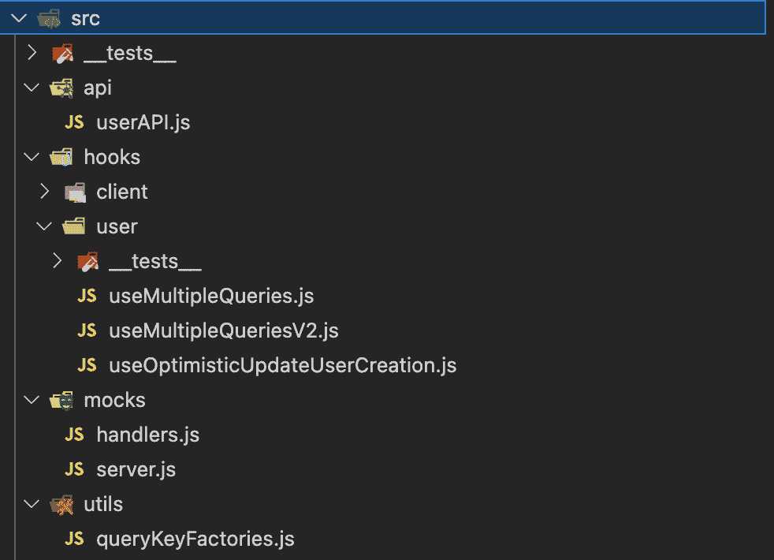

# 8

# 测试 React Query 钩子和组件

你几乎已经掌握了 React Query！到目前为止，你已经非常清楚查询和突变是如何工作的，并且准备好在服务器端渲染的项目中利用 React Query。现在，我们将探讨你需要成为真正的 React Query 英雄的最后一种技能——使用代码测试 React Query。

本章将教你如何使用组件和钩子测试`useQuery`和`useMutation`。但在那之前，你将了解一个非常有用的库，它可以帮助你测试 React Query 代码，称为 Mock Service Worker。

然后，你将学习一些重构技巧和窍门，你可以利用它们使你的 React Query 代码更易于阅读和重用。

在掌握了这些知识之后，你就可以开始测试你的代码了。你将从测试利用 React Query 的组件开始，看看从以用户为中心的角度进行查询和突变测试是什么样的。

最后，我们将深入了解实现细节，看看我们应该何时以及如何测试使用 React Query 的钩子。

本章我们将涵盖以下主题：

+   配置 Mock Service Worker

+   代码组织

+   测试使用 React Query 的组件

+   测试使用 React Query 的自定义钩子

# 技术要求

本章的所有代码示例都可以在 GitHub 上找到，地址为[`github.com/PacktPublishing/State-management-with-React-Query/tree/feat/chapter_8`](https://github.com/PacktPublishing/State-management-with-React-Query/tree/feat/chapter_8)。

# 配置 Mock Service Worker

在测试 React 应用程序时，人们经常问的一个问题是如何测试 API 调用。这个问题通常会导致一个后续问题：“*我如何确保我的网络请求返回我期望的数据，以便我的测试总是接收到相同的数据，不会变得不可靠？*”有许多方法可以回答这些问题，我们可以遵循许多实现。最常用的实现通常是模拟你的数据获取客户端。

虽然这种方法可行，但我在我所参与的所有采用这种方法的项目中经常看到的一个问题是：你写的测试越多，它们就越难以维护。这是因为模拟像`fetch`或`axios`这样的东西需要大量的样板代码来处理不同路由被击中、同一路由的不同响应以及清理客户端模拟以避免测试相互泄漏等问题。我们不要忘记，如果我们在一个应用程序中使用 GraphQL 和 REST，我们必须根据你正在测试的组件模拟额外的客户端。

如果我告诉你有一个可以用来拦截你的网络请求并返回预定义数据而无需模拟任何客户端的替代方案，你会怎么想？如果我说这个替代方案支持 REST 和 GraphQL，你会怎么想？如果我说这个替代方案还可以用于你的应用程序，为你的后端团队尚未实现的某个路由提供一些模拟数据，你会怎么想？你可以用 **Mock Service** **Worker** (**MSW**) 做到所有这些。

如 MSW 文档所述：“*Mock Service Worker 是一个使用 Service Worker API 来拦截实际* *请求* 的 API 模拟库” ([`mswjs.io/docs/`](https://mswjs.io/docs/))。

MSW 利用服务工作者在网络级别拦截请求，并为该特定请求返回一些预定义数据。这意味着，只要有一个定义好的 API 合同，你就可以在端点存在之前返回模拟数据。此外，利用这些预定义数据在你的测试中意味着你不再需要模拟 `axios` 或 `fetch`。重要的是要提到，服务工作者仅在浏览器中工作。在你的测试中，MSW 使用请求拦截器库，允许你重用你在浏览器中已有的相同模拟定义。

虽然 MSW 在浏览器中使用非常有帮助，但它超出了本章的范围。在本章中，我们只会使用 MSW 在我们的测试中。

这是将 MSW 添加到你的项目的方法：

+   如果你正在你的项目中运行 npm，请运行以下命令：

    ```js
    npm install msw --save-dev
    ```

+   如果你使用的是 Yarn，请运行以下命令：

    ```js
    yarn add msw --dev
    ```

+   如果你使用的是 pnpm，请运行以下命令：

    ```js
    pnpm add msw --save-dev
    ```

一旦 MSW 安装完成，我们必须创建我们的请求处理器和响应解析器。

请求处理器允许你在处理请求时指定方法、路径和响应。它们通常与响应解析器配对。响应解析器是一个传递给请求处理器的函数，它允许你在拦截请求时指定模拟的响应。

让我们现在创建一些处理器来处理一些路由。以下是我们要做的事情。

在 `src/mocks` 文件夹中，创建一个 `handlers.js` 文件。

在 `handlers.js` 文件中，添加以下代码：

```js
import { rest } from "msw";
export const handlers = [
  rest.get("*/api/*", (req, res, ctx) => {
    return res(
      ctx.status(200),
      ctx.json({
        data: "value"
      })
    );
  }),
];
```

在前面的代码片段中，我们做了以下操作：

1.  我们导入包含一组请求处理器的 `rest` 命名空间，用于处理 `REST` 请求。

1.  我们创建一个 `handlers` 数组，它将包含我们所有的请求处理器。

我们创建的第一个模拟是一个针对包含 `/api/` 的任何路由的 `GET` 请求。

当请求击中这个请求处理器时，它将返回一个响应，该响应将返回一个包含 `"value"` 字符串的 `200 OK` 响应代码的对象。

现在我们已经创建了我们的 `handlers`，我们需要确保 MSW 将使用我们之前创建的 `handlers` 来拦截我们的请求。

这是我们需要做的事情。

在 `src/mocks` 文件夹中，创建一个 `server.js` 文件。

在 `server.js` 文件中，添加以下代码：

```js
import { setupServer } from "msw/node";
import { handlers } from "./handlers";
export const server = setupServer(...handlers);
```

在前面的片段中，我们利用 `setupServer` 函数和我们的创建的 `handlers` 数组来创建一个对象，该对象负责拦截我们的请求并使用我们提供的 `handlers`。

现在我们已经创建了我们的服务器文件，我们需要确保 `Jest` 使用它们。为此，在我们的 `setupTests.js` 文件中，添加以下代码：

```js
import { server } from "./mocks/server.js";
beforeAll(() => server.listen());
afterEach(() => server.resetHandlers());
afterAll(() => server.close());
```

这就是我们前面片段中所做的：

1.  我们导入我们创建的 `server` 对象。

1.  我们利用 `beforeAll` 全局钩子来确保 MSW 在我们的任何测试执行之前拦截我们的请求。

1.  我们随后利用 `afterEach` 全局钩子，确保在每次测试之后重置我们的处理程序。这考虑了一种场景，即我们为我们的某个测试添加一个自定义处理程序，以防止它们泄漏到另一个测试中。

1.  最后，我们利用 `afterAll` 全局钩子，以确保在我们所有的测试运行之后，我们清理并停止拦截请求。

现在，我们的测试所做的任何 API 请求都将被 MSW 拦截。

在看到我们如何使用挂钩测试我们的组件和 React Query 之前，让我们看看我们可以应用的一些模式，以使我们的代码更加结构化和易于测试。

# 组织代码

你可以以许多方式组织你的代码。现在，我们需要注意的一件事是选择可以节省你时间并使你的代码在长期内更好的模式。本节将讨论三种我们可以共同或独立利用的模式，以使我们的代码更加结构化、可读和组织。以下是本节我们将讨论的内容：

+   创建一个 API 文件

+   利用查询键工厂

+   创建一个 hooks 文件夹

## 创建一个 API 文件

创建一个 API 文件来包含我对特定域的所有请求，这是我遵循的模式。

在这个文件中，我利用我的 API 客户端创建负责向给定路由发送请求并返回请求数据的函数。

这特别有用，因为它避免了在代码中重复相同的请求逻辑，并将所有特定域的请求集中在同一个文件中。

对于本书范围内所做的所有请求，我更愿意为我的用户域创建一个文件，因为范围似乎集中在用户上。所以，在我们的 `api` 文件夹中，我们将创建一个 `userAPI.js` 文件。


图 8.1 – 将 userAPI.js 添加到我们的 API 文件夹

在那个文件中，我们现在可以将所有请求移动到我们的代码中。这可能看起来是这样的：

```js
import axios from "axios";
export const axiosInstance = axios.create({
  baseURL: "https://danieljcafonso.builtwithdark.com",
});
export const getUser = async (username, signal) => {
  const { data } = await axiosInstance.get
    (`/react-query-api/${username}`, {
    signal,
  });
  return data;
};
export const createUser = async (user) => {
  return axiosInstance.post(`/name-api`, user);
};
```

在前面的片段中，我们可以看到一个 `userAPI` 文件的例子，其中包含我们的 `axios` 客户端实例、一个 `getUser` 函数（用于从给定用户获取数据）和一个 `createUser` 函数（用于创建用户）。

如您所见，这种模式提高了最终使用我们 API 文件中函数的组件的代码可重用性和可读性。

你可以做的另一件事是我们之前片段中没有做的，那就是添加来自你的查询函数的特定逻辑。如果你只使用 React Query，这将使这些函数在你的应用程序中更容易访问。我更喜欢将我的查询函数和这些 API 函数分开，因为我经常使用不同的查询函数与相同的 API 函数。不过，如果你选择使用它，这也会提高你的代码可读性。

## 利用查询键工厂

管理查询键通常是一件麻烦事。我们忘记了我们已经使用了哪些，需要浏览我们的大部分查询来记住它们。这就是查询键工厂大放异彩的地方。

查询键工厂可以是一个包含函数的对象，每个属性中都有一个负责生成查询键的函数。这样，你就可以将所有的查询键放在同一个地方，并停止浪费时间试图记住它们。

这就是你的查询键工厂可能的样子：

```js
export const userKeys = {
    all: () => ["allUsers"],
    api: () => [{queryIdentifier: "api"}],
    withUsername: (username = "username") =>
      [{ ...userKeys.api[0], username }],
    paginated: (page) => [{ ...userKeys.api, page }]
}
```

如前文片段所示，我们创建了一个`userKey`对象，它将成为我们的查询键工厂。在每一个属性中，我们都有一个负责返回我们的查询键的函数。

## 创建一个钩子文件夹

这里的名字也足以说明一切。我喜欢的代码组织建议之一是创建一个钩子文件夹。

我喜欢在这个文件夹中创建自定义钩子，其中包含一些我经常重复的查询和突变，或者那些最终包含太多逻辑并影响我的代码可读性的钩子。这使得我可以更容易地在隔离状态下测试特定的钩子，并使使用它们的组件更具可读性。

例如，还记得我们在*第六章*中执行乐观更新吗？我们创建的`useMutation`钩子是一个很好的候选者，可以移动到自定义钩子。我将创建一个`useOptimisticUpdateUserCreation`自定义钩子，并将我的代码移到那里。这个钩子看起来是这样的：

```js
import { useMutation, useQueryClient } from
  "@tanstack/react-query";
import { userKeys } from "../utils/queryKeyFactories";
import { createUser } from "../api/userAPI";
const useOptimisticUpdateUserCreation = () => {
  const queryClient = useQueryClient();
  return useMutation({
    mutationFn: createUser,
    retry: 0,
    onSettled: () => queryClient.invalidateQueries
      (userKeys.all()),
    onMutate: async (user) => {
      await queryClient.cancelQueries(userKeys.all());
      const previousUsers = queryClient.getQueryData
        (userKeys.all());
      queryClient.setQueryData(userKeys.all(), (prevData)
        => [
        user,
        ...prevData,
      ]);
      return { previousUsers };
    },
    onError: (error, user, context) => {
      queryClient.setQueryData(userKeys.all(),
        context.previousUsers);
    },
  });
};
export default useOptimisticUpdateUserCreation;
```

在前文片段中，我们创建了`useOptimisticUpdateUserCreation`钩子，并将`OptimisticMutation`组件中的代码移到那里。从代码中，你也可以看到，我们已经应用了我们的 API 文件和查询工厂模式。

在使用我们的钩子的组件中，我们现在只需要导入钩子并像这样使用它：

```js
const mutation = useOptimisticUpdateUserCreation();
```

应用本节的所有模式，你的项目结构最终可能看起来是这样的：



图 8.2 – 遵循这三个模式后项目结构可能的样子

现在我们已经看到了这些模式，让我们最终开始测试我们的代码。我们将从一个最推荐的方法开始——使用 React Query 钩子测试组件。

# 测试使用 React Query 的组件

当 React Testing Library 首次推出时，它遵循一个主要指导原则，这个原则改变了我们编写测试的方式。这个指导原则是，“*你的测试越接近你的软件的使用方式，它们就能给你带来越多的信心*” ([`testing-library.com/docs/guiding-principles/`](https://testing-library.com/docs/guiding-principles/))。

从那个点开始，我们的测试中发生了许多变化。专注于以用户为中心的方法意味着不惜一切代价避免在我们的测试中包含实现细节。这意味着不再有浅渲染，不再有状态和属性引用，以及更以用户为中心的查询 DOM 的方式。

阅读最后一部分，你可能想知道如何采用以用户为中心的方法来测试你的组件。嗯，答案很简单——用户不需要知道他们正在使用的页面是否使用了 React Query。如果你像使用页面一样编写测试，这意味着你可能会意外地发现用户可能会遇到的问题，并且如果由于某种原因你更改了实现，你的测试不会中断。

在某些场景中，你可能需要将你的测试与某些实现细节绑定，以帮助你进行断言，但我们将不惜一切代价避免在本节中这样做。

在我们开始编写测试之前，我们需要做一些设置。

## 设置测试工具

当测试利用 React Query 的组件时，我们必须确保我们用 `QueryClientProvider` 包裹这些组件。现在，我们可以在每个测试中创建一个自定义包装器，并在渲染时用它来包裹我们的组件，但请记住，你很可能会得到许多以某种方式使用 React Query 的组件。

这就是设置一些测试工具可以帮助你的地方。我非常喜欢遵循的一个模式是覆盖测试库中的 `render` 函数，并使用这个函数自动包裹渲染的每个组件，使用我们的 React Query `QueryClientProvider`。为此，我在 `utils` 文件夹中创建了一个 `test-utils.js` 文件。

这是我们可以在 `test-utils.js` 文件中添加的内容：

```js
import { render } from "@testing-library/react";
import { QueryClient, QueryClientProvider } from
  "@tanstack/react-query";
const customRender = (ui, { ...options } = {}) => {
  const queryClient = new QueryClient({
    logger: {
      log: console.log,
      warn: console.warn,
      error: () => {},
    },
    defaultOptions: {
      queries: {
        retry: 0,
        cacheTime: Infinity,
      },
    },
  });
  const CombinedProviders = ({ children }) => {
    return (
      <QueryClientProvider client={queryClient}>
        {children}</QueryClientProvider>
    );
  };
  return render(ui, { wrapper: CombinedProviders,
     ...options });
};
export * from "@testing-library/react";
export { customRender as render };
```

这是我们前面片段中做的事情：

1.  我们从 React Testing Library 导入 `render` 函数。

1.  我们从 React Query 导入我们的 `QueryClient` 和 `QueryClientProvider`。

1.  我们创建了一个自定义的 `render` 函数 (`customRender`)：

    1.  这个函数将接收一个 `ui` 参数，它将是我们要渲染的组件。它还将接收一个 `options` 对象，我们可以将其转发给 `render` 函数。

    1.  我们创建我们的 `queryClient` 实例。在这里，我们覆盖了我们的 `logger` 的 `error` 属性，以避免显示来自 React Query 的错误。这是因为我们可能想要测试错误场景，并且我们不希望 React Query 用我们预期的错误污染我们的 `console`。我们还定义我们的查询，在查询失败后永远不尝试重试查询，并将我们的 `cacheTime` 设置为 `Infinity` 以避免在手动设置 `cacheTime` 值的场景中产生 `Jest` 错误信息。

    1.  我们创建一个 `CombinedProviders` 包装器，它将负责用 `QueryClientProvider` 包裹我们的组件。

    1.  我们调用 React Testing Library 的 `render` 函数，传递给它 `ui` 参数，并用我们的 `CombinedProviders` 包裹它，然后发送我们接收到的 `options`。

1.  我们导出所有的 React Testing Library 和我们的 `customRender` 函数，这将是现在的主 `render` 函数。这意味着我们现在在测试中导入这个文件而不是 React Testing Library。

注意在代码片段中，我们是在 `customRender` 函数内部创建我们的 `queryClient` 而不是外部。如果您想避免在测试之间清理查询缓存，可以采用这种方法。如果您想在测试之间使用相同的 `QueryClient`，可以在函数外部创建 `queryClient` 实例。

现在既然我们的 `render` 函数已经准备好使用组件渲染 React Query，我们可以开始编写测试了。

## 测试查询

在以下小节中，我们将看到一些在您日常使用 React Query 时可能会遇到的一些常见测试场景。

### 检查数据是否已获取

我们必须编写的最常见的测试之一是确保我们的数据已被正确获取。让我们从这个场景开始，并重新审视我们来自 *第五章* 的并行查询示例。我们还将重写代码以适应本章中提到的一些实践。让我们先看看我们的 `ParallelQueries` 组件：

```js
export const ParallelQueries = () => {
  const { multipleQueries } = useMultipleQueriesV2();
  return (
    <div>
      {multipleQueries.map(({ data, isFetching }, index) => (
        <p key={index}>{isFetching ? "Fetching data..." :
          data.hello}</p>
      ))}
    </div>
  );
};
```

如您从前面的代码片段中看到的，代码基本上与第 *5 章* 中展示的相同，除了我们获取数据的那部分。在这里，我们应用了本章中提到的模式之一，并将这个逻辑移动到自定义钩子文件夹内的自定义钩子中。

让我们现在看看 `useMultipleQueriesV2` 钩子文件内部的内容：

```js
import { useQueries } from "@tanstack/react-query";
import { userKeys } from "../utils/queryKeyFactories";
import { getUser } from "../api/userAPI";
const fetchData = async ({ queryKey }) => {
  const { username } = queryKey[0];
  return await getUser(username);
};
const usernameList = ["userOne", "userTwo", "userThree"];
const useMultipleQueriesV2 = () => {
  const multipleQueries = useQueries({
    queries: usernameList.map((username) => {
      return {
        queryKey: userKeys.withUsername(username),
        queryFn: fetchData,
      };
    }),
  });
  return { multipleQueries }
};
export default useMultipleQueriesV2
```

如您从前面的代码片段中看到的，我们基本上只是将组件中的内容移动到我们的 `useMultipleQueriesV2` 钩子中。注意，我们还利用了本章中提到的其他两个模式：

+   我们在 `userKeys` 工厂中创建一个条目，并利用它来设置我们的 `useQueries` 钩子，`queryKey`

+   我们创建一个 API 文件来收集我们的用户 API 函数，并添加我们的 `getUser` 函数

这就是我们的 `getUser` 函数的样子：

```js
export const getUser = async (username, signal) => {
  const { data } = await axiosInstance.get
    (`/react-query-api/${username}`, {
    signal,
  });
  return data;
};
```

在此代码片段中显示的`getUser`函数负责对我们的给定端点发起`GET`请求，并在我们的`signal`告诉`axios`这样做时取消该请求。

现在你已经重新熟悉了这个组件及其工作方式，让我们开始测试它。

在我们编写测试之前，首先需要确保 MSW 正在拦截`GET`请求并返回我们想要的数据：

```js
  rest.get("*/react-query-api/*", (req, res, ctx) => {
    return res(
      ctx.delay(500),
      ctx.status(200),
      ctx.json({
        hello: req.params[1],
      })
    );
  })
```

在前面的代码片段中，我们创建了一个请求处理器并将其添加到我们的`handlers`数组中，该处理器执行以下操作。

每当我们拦截到包含`/react-query-api/`路径的端点的`GET`请求时，我们返回一个将被延迟 500 毫秒的`200 OK`响应，其体中将包含一个具有`hello`属性的对象，该属性将包含请求参数的第二位参数。

这意味着对[`danieljcafonso.builtwithdark.com/react-query-api/userOne`](https://danieljcafonso.builtwithdark.com/react-query-api/userOne)端点的`GET`请求将返回一个包含以下对象的`200 OK`响应：

```js
{
  hello: "Hello userOne"
}
```

现在我们确信我们的组件在请求后总是会接收到相同的数据，我们可以编写我们的测试。

现在，我建议你从一个用户的角度来看`ParallelQueries`组件，并考虑你可能想要测试的场景。这里的经验法则是思考，“*如果我是与这段代码交互的用户，我会与什么交互或期望发生什么*？”

根据前面的分析，我想出了两个测试场景：

+   `userOne`、`userTwo`和`userThree`。

+   为我们每个请求显示`"Fetching data…"`消息。

考虑到这些场景，我们可以编写我们的测试。让我们看看我们的测试文件会是什么样子：

```js
import { ParallelQueries } from "../MultipleQueries";
import { render, screen } from "../utils/test-utils";
describe("Parallel Queries Tests", () => {
  test("component should fetch and render multiple data",
    async () => {
    render(<ParallelQueries />);
    const text = await screen.findByText("userOne");
    expect(text).toBeInTheDocument();
    expect(screen.getByText("userTwo")).toBeInTheDocument();
    expect(screen.getByText("userThree")).toBeInTheDocument();
  });
  test("component should show loading indicator for each
    query", () => {
    render(<ParallelQueries />);
    const isFetching = screen.getAllByText("Fetching data...");
    expect(isFetching).toHaveLength(3);
  });
});
```

让我们现在回顾一下前面代码片段中我们做了什么：

1.  我们导入我们的`ParallelQueries`组件，以及从我们的`test-utils`中的自定义`render`函数和`screen`对象。

1.  我们创建我们的测试套件，并在其中创建我们的测试：

    1.  对于`"component should fetch and render multiple data"`测试，我们执行以下操作：

        1.  渲染我们的`ParallelQueries`组件。

        1.  由于我们需要等待数据被获取，我们利用 React Testing Library 中的`async`查询变体（`findBy`）和`await`，直到`userOne`文本出现在 DOM 上。

        1.  一旦我们的查询找到`userOne`文本，我们断言它在 DOM 中，并对`userTwo`和`userThree`重复相同的断言。在这些最后两个例子（`userTwo`和`userThree`）中，我们不需要利用`findBy`变体，因为数据已经存在于 DOM 上，所以我们使用`getBy`变体。

    1.  对于`"component should show loading indicator for each query"`测试，我们执行以下操作：

        1.  渲染我们的`ParallelQueries`组件。

        1.  由于我们在模拟响应中添加了 500 毫秒的延迟，我们的数据不会立即可用以进行渲染，因此我们应该显示加载指示器。由于我们将有多个指示器，我们利用`getAllBy`变体来获取与我们的查询匹配的元素数组。

        1.  我们随后断言我们的元素数组长度为`3`，以确保每个查询都有一个`"Fetching data…"`消息。

通过这些测试，我们遵循了一种反映我们与组件交互时用户行为的方法，同时也在我们的`ParallelQueries`组件和`useMultipleQueriesV2`自定义钩子上实现了 100%的覆盖率。

在大多数情况下，为了处理数据获取场景，你只需要等待你获取的数据在 DOM 上被渲染。只有一个查询？等待数据在 DOM 上显示。有多个并行查询？等待数据在 DOM 上显示。有依赖查询？等待第一个查询的数据在 DOM 上显示。然后，为后续查询重复此步骤。

现在，在某些场景中，您将不得不执行一些操作以到达您的测试断言。其中一些场景甚至可能涉及查询无效化或查询取消。由于这些场景的相似性，让我们现在看看我们可以使用查询无效化进行哪些测试。

### 检查查询是否被无效化

正如您应该从*第五章*中记住的，查询无效化是指您手动标记您的查询为过时，以便 React Query 可以在渲染时重新获取它。

让我们回顾一下在*第五章*中看到的`QueryInvalidation`组件：

```js
const fetchData = async ({ queryKey}) => {
  const { username } = queryKey[0];
  return await getUser(username);
};
const QueryInvalidation = () => {
  const { data, isFetching } = useQuery({
    queryKey: userKeys.withUsername("userOne"),
    queryFn: fetchData,
  });
  const queryClient = useQueryClient();
  return (
    <div>
      <p>{isFetching ? "Loading..." : data?.hello}</p>
      <button onClick={() => queryClient.invalidateQueries
        (userKeys.api())}>
        Invalidate Query
      </button>
    </div>
  );
};
```

如您从前面的代码片段中看到的，代码仍然非常类似于*第五章*中的代码。我们在这里所做的唯一改变是应用 API 文件模式，并利用本章之前看到的`getUser`函数，以及将我们的查询键更改为利用查询键工厂模式。

现在您已经重新熟悉了这个组件及其工作方式，让我们开始对其进行测试。

由于我们正在利用`getUser`函数，我们不需要在 MSW 中创建一个新的请求处理器，因为我们正在使用相同的端点。

现在，从以用户为中心的角度来看`QueryInvalidation`组件，以下是您可能识别出的三个测试场景：

+   `userOne`。

+   `"``Loading…"`消息。

+   **作为用户，我希望点击无效查询按钮时重新获取我的查询**：在这种情况下，我们希望我们的组件被渲染，并等待它渲染一个问候消息，点击**无效查询**按钮，等待问候消息消失，等待加载指示器消失，并等待问候消息再次出现。这样，我们就能确保我们的查询已被无效化。

考虑到这些场景，我们可以为我们的`QueryInvalidation`组件编写测试。让我们看看我们的测试文件会是什么样子：

```js
import { QueryInvalidation } from "../QueryClientExamples";
import { fireEvent, render, screen, waitFor } from "../utils/test-utils";
describe("QueryInvalidation Tests", () => {
  test("component should display fetched data", async () => {
    render(<QueryInvalidation />);
    const text = await screen.findByText("userOne");
    expect(text).toBeInTheDocument();
  });
  test("component should show a loading indicator", () => {
    render(<QueryInvalidation />);
    expect(screen.getByText("Loading...")).toBeInTheDocument();
  });
  test("component should invalidate query", async () => {
    render(<QueryInvalidation />);
    const text = await screen.findByText("userOne");
    expect(text).toBeInTheDocument();
    const invalidateButton = screen.getByRole("button", {
      text: "Invalidate Query",
    });
    fireEvent.click(invalidateButton);
    await waitFor(() =>
      expect(screen.queryByText("userOne")).not.
        toBeInTheDocument()
    );
    await waitFor(() =>
      expect(screen.queryByText("Loading"…")).not.
        toBeInTheDocument()
    );
    expect(screen.getByText("userOne")).
      toBeInTheDocument();
  });
});
```

现在，让我们回顾一下前面代码片段中我们在做什么：

1.  我们导入我们的`QueryInvalidation`组件，并从我们的`test-utils`中导入我们的自定义`render`函数、`screen`对象、`fireEvent`实用工具和`waitFor`函数。

1.  我们创建我们的测试套件，并在其中编写我们的测试：

    1.  对于`"component should display fetched data"`测试，我们做以下操作：

        1.  渲染我们的`QueryInvalidation`组件。

        1.  由于我们需要等待数据被获取，我们利用 React Testing Library 中的`async`查询变体（`findBy`）和`await`，直到`userOne`文本出现在 DOM 上。

        1.  一旦我们的查询找到`userOne`文本，我们断言它出现在 DOM 中。

    1.  对于`"component should show a loading indicator"`测试，我们做以下操作：

        1.  渲染我们的`QueryInvalidation`组件。

        1.  由于我们添加了 500 毫秒的延迟到模拟响应中，我们的数据不会立即可用以进行渲染，因此我们应该看到加载指示器出现。然后我们利用`getBy`查询变体来帮助断言`"Loading…"`文本出现在 DOM 中。

    1.  对于`"component should invalidate query"`测试，我们做以下操作：

        1.  渲染我们的`QueryInvalidation`组件。

        1.  我们等待数据被获取，并相应地断言它出现在 DOM 上。

        1.  我们找到了我们的`getByRole`查询，这将帮助我们找到带有`Invalidate` `Query`文本的按钮。

        1.  然后，我们利用`fireEvent`实用工具在按钮上触发一个`click`事件。

        1.  然后，我们利用`waitFor`函数等待断言评估为`true`。在这种情况下，我们等待我们的查询数据从 DOM 中消失。

        1.  然后，我们再次利用`waitFor`函数，这次是为了等待加载指示器从 DOM 中消失。

        1.  最后，我们通过检查数据是否再次出现在 DOM 上来断言我们的查询已完成重新获取。

现在，我们已经检查了如何测试查询无效化。你可能想知道查询取消与查询无效化有何不同。最终，测试查询取消会在以下方面有所不同：

+   我们的查询函数需要接收`AbortController`信号并将其转发到我们的`getUser`函数。

+   与从`queryClient`调用`invalidateQuery`函数不同，我们调用`cancelQueries`。

+   在我们的测试中，前两个场景完全相同。在第三个场景中，我们在渲染组件后立即点击**取消**按钮。完成此操作后，DOM 不应显示数据或加载指示器。

现在你已经知道了如何以用户为中心的方法测试大多数场景，让我们将这个知识付诸实践，看看我们如何测试一个分页场景。

### 测试分页查询

在 *第五章* 中，我们学习了 `useQuery` 如何允许我们创建分页查询，并随后用它来构建分页 UI 组件。

让我们回顾一下在 *第五章* 中看到的 `PaginatedQuery` 组件：

```js
import { useQuery } from "@tanstack/react-query";
import { useState } from "react";
import { getPaginatedData } from "./api/userAPI";
import { userKeys } from "./utils/queryKeyFactories";
const fetchData = async ({ queryKey }) => {
  const { page } = queryKey[0];
  return await getPaginatedData(page);
};
const PaginatedQuery = () => {
  const [page, setPage] = useState(0);
  const { isLoading, isError, error, data, isFetching,
    isPreviousData } =
    useQuery({
      queryKey: userKeys.paginated(page),
      queryFn: fetchData,
      keepPreviousData: true,
    });
  if (isLoading) {
    return <h2>Loading initial data...</h2>;
  }
  if (isError) {
    return <h2>{error.message}</h2>;
  }
  return (
    <>
      <div>
        {data.results.map((user) => (
          <div key={user.email}>
            {user.name.first}
            {user.name.last}
          </div>
        ))}
      </div>
      <div>
        <button
          onClick={() => setPage((oldValue) =>
            Math.max(oldValue - 1, 0))}
          disabled={page === 0}
        >
          Previous Page
        </button>
        <button
          disabled={isPreviousData}
          onClick={() => setPage((old) => old + 1)}
        >
          Next Page
        </button>
      </div>
      {isFetching ? <span> Loading...</span> : null}
    </>
  );
};
export default PaginatedQuery;
```

如前文片段所示，它与我们在 *第五章* 中看到的内容几乎相同。注意，我们还利用了本章中提到的两种模式：

+   我们在 `userKeys` 工厂中创建了一个条目，并利用它来设置我们的 `useQuery` 钩子，`queryKey`

+   我们创建了一个 API 文件来收集我们的用户 API 函数，并添加了我们的 `getPaginatedData` 函数

这就是我们的 `getPaginatedData` 函数的样子：

```js
export const getPaginatedData = async (page) => {
  const { data } = await axiosInstance.get(
    `/react-query-paginated?page=${page}&results=10`
  );
  return data;
};
```

前文片段中显示的 `getPaginatedData` 函数负责为给定页面向我们的指定端点发起 `GET` 请求。

既然你已经重新熟悉了这个组件及其工作原理，让我们来测试它。

我们将首先创建我们的 MSW 请求处理器：

```js
rest.get("*/react-query-paginated", (req, res, ctx) => {
    const page = req.url.searchParams.get("page");
    const pageOneData = {
      email: "email1",
      name: {
        first: "first1",
        last: "last1",
      },
    };
    const pageTwoData = {
      email: "email2",
      name: {
        first: "first2",
        last: "last2",
      },
    };
    const data = {
      results: [page > 0 ? pageTwoData : pageOneData],
    };
    return res(ctx.status(200), ctx.json(data));
  })
```

在前文片段中，我们创建了一个请求处理器并将其添加到我们的 `handlers` 数组中，它执行以下操作。

每当我们拦截到包含 `/react-query-paginated` 路径的端点的 `GET` 请求时，我们得到 `page` 查询参数以帮助我们定义我们将返回哪些数据。

我们返回一个包含第一页或第二页数据的 `200 OK` 响应，具体取决于接收到的页面查询参数。

这意味着对 [`danieljcafonso.builtwithdark.com/react-query-paginated?page=0&results=10`](https://danieljcafonso.builtwithdark.com/react-query-paginated?page=0&results=10) 端点的 `GET` 请求将返回一个包含 `pageOneData` 对象的 `200 OK` 响应，而对 [`danieljcafonso.builtwithdark.com/react-query-paginated?page=1&results=10`](https://danieljcafonso.builtwithdark.com/react-query-paginated?page=1&results=10) 端点的 `GET` 请求将返回一个包含 `pageTwoData` 对象的 `200 OK` 响应。

既然我们确信我们的组件在请求后总是会接收到相同的数据，我们可以编写我们的测试，并从以用户为中心的角度查看 `PaginatedQuery` 组件；以下是你可能识别出的测试场景：

+   **作为用户，我希望在打开页面后看到我的数据已加载**：在这种情况下，我们希望我们的组件被渲染并检查是否显示了初始加载数据消息。

+   **作为用户，我希望在数据加载失败时看到错误消息**：在这种情况下，我们希望我们的组件渲染并查看请求失败时是否显示了错误消息。

+   **作为用户，我希望看到最初获取的数据**：在这种情况下，我们希望我们的组件渲染并等待第一页的数据被获取。

+   **作为用户，我希望点击** **下一页** **按钮并看到下一页的数据**：在这种情况下，我们希望组件被渲染，确保我们有初始数据，并在点击 **下一页** 按钮后，等待直到获取第二页的数据。

+   **作为用户，我希望在获取新数据时看到获取指示器**：在这种情况下，我们希望组件被渲染，确保我们有初始数据，并在点击 **下一页** 按钮后，确保获取指示器被渲染。

+   **作为用户，我希望在点击** **下一页** **和** **上一页** **时看到数据**：在这种情况下，我们希望组件被渲染，确保我们有初始数据，并在点击 **下一页** 按钮后，确保第二页显示出来。然后我们点击 **上一页** 按钮并确保第一页的数据再次被渲染。

+   **作为用户，我希望在第一页时我的** **上一页** **按钮被禁用**：在这种情况下，我们希望组件被渲染并确保我们有初始数据。由于我们处于第一页，我们希望 **上一页** 按钮被禁用。

+   **作为用户，我希望我的** **下一页** **按钮在等待新数据出现时被禁用**：在这种情况下，我们希望组件渲染并确保我们有初始数据。在点击 **下一页** 按钮后，我们需要确保此按钮被禁用。

考虑到这些场景，这是我们将编写的测试 `PaginatedQuery` 组件的代码：

```js
import PaginatedQuery from "../PaginatedQuery";
import { render, screen } from "../utils/test-utils";
import userEvent from "@testing-library/user-event";
import { server } from "../mocks/server";
import { rest } from "msw";
describe("PaginatedQuery tests", () => {
  test("should render loading indicator on start", () => {
    render(<PaginatedQuery />);
    expect(screen.getByText("Loading initial data...")).
      toBeInTheDocument();
  });
  test("should render error on failed fetching", async () => {
    server.use(rest.get("*", (req, res, ctx) =>
      res(ctx.status(403))));
    render(<PaginatedQuery />);
    expect(
      await screen.findByText("Request failed with status
        code 403")
    ).toBeInTheDocument();
  });
  test("should render first page data", async () => {
    render(<PaginatedQuery />);
    const firstName = await screen.findByText(/first1/i);
    expect(firstName).toBeInTheDocument();
    expect(screen.getByText(/last1/i)).toBeInTheDocument();
  });
  test("should render second page data", async () => {
    render(<PaginatedQuery />);
    const firstName = await screen.findByText(/first1/i);
    expect(firstName).toBeInTheDocument();
    const nextPageButton = screen.getByRole("button", {
      name: "Next Page" });
    userEvent.click(nextPageButton);
    const secondPageFirstName = await screen.findByText
      (/first2/i);
    expect(secondPageFirstName).toBeInTheDocument();
    expect(screen.getByText(/last2/i)).toBeInTheDocument();
  });
  test("should show fetching indicator while fetching
    data", async () => {
    render(<PaginatedQuery />);
    const firstName = await screen.findByText(/first1/i);
    expect(firstName).toBeInTheDocument();
    const nextPageButton = screen.getByRole("button", {
      name: "Next Page" });
    userEvent.click(nextPageButton);
    expect(screen.getByText("Loading...")).
      toBeInTheDocument();
  });
  test("should change pages back and forth and render
    expected data", async () => {
    render(<PaginatedQuery />);
    expect(await screen.findByText(/first1/i)).
      toBeInTheDocument();
    expect(screen.getByText(/last1/i)).toBeInTheDocument();
    const nextPageButton = screen.getByRole("button", {
      name: "Next Page" });
    userEvent.click(nextPageButton);
    expect(await screen.findByText(/first2/i)).
      toBeInTheDocument();
    expect(screen.getByText(/last2/i)).toBeInTheDocument();
    const previousPageButton = screen.getByRole("button", {
      name: "Previous Page",
    });
    userEvent.click(previousPageButton);
    expect(await screen.findByText(/first1/i)).
      toBeInTheDocument();
    expect(screen.getByText(/last1/i)).toBeInTheDocument();
  });
  test("should have previous page button disabled on first
    page", async () => {
    render(<PaginatedQuery />);
    const previousPageButton = await screen.findByRole
      ("button", {
      name: "Previous Page",
    });
    expect(previousPageButton).toBeDisabled();
  });
  test("should have next page button disabled while
    changing pages", async () => {
    render(<PaginatedQuery />);
    const nextPageButton = await screen.findByRole
      ("button", {
      name: "Next Page",
    });
    userEvent.click(nextPageButton);
    expect(nextPageButton).toBeDisabled();
  });
});
```

1.  我们首先进行必要的导入：

    1.  我们的 `PaginatedQuery` 组件。

    1.  我们的 `render` 和 `screen` 工具来自 `test-utils`。

    1.  来自测试库的 `user-event` 伴侣的 `userEvent` 工具。在这里需要注意的一点是我们使用的是 v14 之前的用户事件版本。

    1.  我们的 MSW `server`，以便我们可以为我们的测试场景之一创建自定义响应模拟。

    1.  MSW `rest` 命名空间，为我们的测试场景之一创建相关的请求处理器。

1.  我们创建我们的测试套件，并在其中创建我们的测试：

    1.  对于 `"should render loading indicator on start"` 测试，我们执行以下操作：

        1.  渲染我们的 `PaginatedQuery` 组件。

        1.  利用 `getByText` 查询断言 `"Loading initial data…"` 消息在 DOM 上。

    1.  对于 `"should render error on failed fetching"` 测试，我们执行以下操作：

        1.  利用我们的 `server` `use` 函数向当前的服务器实例添加一个请求处理器。在这种情况下，我们添加一个处理器来捕获每个 `GET` 请求（`"*"` 表示此处理器将匹配每个路由）并返回 `403 Forbidden`，以便我们的请求失败。不用担心这会影响到其他测试，因为我们确保在 `setupTests` 文件中调用了 `resetHandlers` 函数。这将确保此自定义请求处理器只会用于此测试。

        1.  渲染我们的 `PaginatedQuery` 组件。

        1.  利用`findByText`查询`await`直到错误消息出现在 DOM 上。

    1.  对于“应渲染第一页数据”测试，我们执行以下操作：

        1.  渲染我们的`PaginatedQuery`组件。

        1.  等待直到第一页的姓名属性数据出现在 DOM 上。

        1.  断言姓氏属性也出现在 DOM 上。

    1.  对于“应渲染第二页数据”测试，我们执行以下操作：

        1.  渲染我们的`PaginatedQuery`组件。

        1.  等待直到第一页的数据出现在 DOM 上。

        1.  利用`getByRole`查询获取带有文本“应在加载数据时显示获取指示器”测试，我们执行以下操作：

            1.  渲染我们的`PaginatedQuery`组件。

            1.  等待直到第一页的数据出现在 DOM 上。

            1.  利用`getByRole`查询获取带有文本`getByText`的按钮，使用`getByText`查询来检查“加载中…”指示器是否出现在 DOM 上。

        1.  对于“应来回切换页面并渲染预期数据”测试，我们执行以下操作：

            1.  渲染我们的`PaginatedQuery`组件。

            1.  等待直到第一页的数据出现在 DOM 上，并断言它在那里。

            1.  利用`getByRole`查询获取带有文本`getByRole`的按钮，用于获取带有文本“在第一页应禁用上一页按钮”测试，我们执行以下操作：

                1.  渲染我们的`PaginatedQuery`组件。

                1.  利用`findByRole`查询等待直到“在切换页面时应禁用下一页按钮”测试，我们执行以下操作：

                    1.  渲染我们的`PaginatedQuery`组件。

                    1.  利用`findByRole`查询等待直到“下一页”按钮出现在 DOM 上，并点击它。

                    1.  断言“下一页”按钮现在是禁用的。

            如您所见，我们可以以完全以用户为中心的方法测试我们的查询，并忘记实现细节。现在，让我们进入突变部分，看看它如何变得稍微难以采用以用户为中心的方法。

            ## 测试突变

            你当然可以采用以用户为中心的方法进行突变，尽管在某些场景中这可能更困难。让我们回顾一下我们在*第六章*中编写的组件，看看它可能为什么以用户为中心的方法测试更困难：

            ```js
            export const SimpleMutation = () => {
              const [name, setName] = useState("");
              const { mutate, isPaused } = useMutation({
                mutationFn: createUser,
              });
              const submitForm = (e) => {
                e.preventDefault();
                mutate({ name, age: 0 });
              };
              return (
                <div>
                  {isPaused && <p> Waiting for network to come back </p>}
                  <form>
                    <input
                      name="name"
                      type={"text"}
                      onChange={(e) => setName(e.target.value)}
                      value={name}
                    />
                    <button disabled={isPaused} onClick={submitForm}>
                      Add
                    </button>
                  </form>
                </div>
              );
            };
            ```

            在前面的代码片段中，我们可以看到我们的`SimpleMutation`组件。现在，让我们尝试进行以用户为中心的方法练习，并了解我们可以编写哪些测试场景：

            +   **作为用户，我想在突变进入暂停状态时看到暂停指示器**：在这个场景中，我们想要渲染我们的组件，当我们尝试执行我们的突变时，暂停指示器消息应该出现。

            +   **作为用户，我想在服务器上创建数据**：在这个场景中，我们想要渲染我们的组件，填写表单，然后执行我们的突变。但是等等——我们的用户如何断言这一点？

            如您所见，最后一个场景有一个问题——UI 中缺乏我们的突变已成功执行的信息。

            通常，这类问题可以通过添加一个通知来解决，通知用户突变已成功执行。让用户知道突变成功始终是一个好的做法。按照这种方法，我们的测试将类似于以下内容：

            +   **作为用户，我想在服务器上成功创建数据**：在这个场景中，我们想要渲染我们的组件，填写表单，按下 **添加** 按钮，并等待成功消息出现

            正如你所见，我们现在有一种以用户为中心的方式来测试我们的突变。然而，出于某种原因，让我们假设我们无法对我们的 `SimpleMutation` 组件进行更改。我们如何确保我们的突变被执行？我们不得不求助于实现细节。我们的测试场景将类似于以下内容：

            +   **作为用户，我想执行一个突变**：在这个场景中，我们想要渲染我们的组件，填写表单，按下 **添加** 按钮，并断言我们的突变已被触发

            在本节中，我们将向您展示如何编写在理想（以用户为中心）的方法不可行时的测试。

            在我们编写测试之前，我们首先需要确保 MSW 请求被拦截并且成功：

            ```js
            rest.post("*/name-api/*", (req, res, ctx) => {
                return res(
                  ctx.status(201),
                  ctx.json({
                    hello: "user",
                  })
                );
              })
            ```

            在前面的代码片段中，我们创建了一个请求处理器，并将其添加到我们的 `handlers` 数组中，该处理器执行以下操作。

            每当我们拦截到包含 `/name-api/` 路径的端点的 `POST` 请求时，我们返回一个包含在主体中的 `201 Created` 响应，该响应包含一个具有 `hello` 属性的字符串对象。

            我们现在可以为我们 `SimpleMutation` 组件编写测试。为了回顾，以下是我们将要执行的测试：

            +   作为用户，我想在我突变进入暂停状态时看到暂停指示器

            +   作为用户，我想执行一个突变

            让我们看看我们创建的测试文件：

            ```js
            import { axiosInstance } from "../api/userAPI";
            import { SimpleMutation } from "../Mutation";
            import { render, screen, waitFor } from
              "../utils/test-utils";
            import userEvent from "@testing-library/user-event";
            const postSpy = jest.spyOn(axiosInstance, "post");
            describe("SimpleMutation Tests", () => {
              test("data should be sent to the server", async () => {
                const name = "Daniel";
                render(<SimpleMutation />);
                const input = screen.getByRole("textbox");
                userEvent.type(input, name);
                userEvent.click(
                  screen.getByRole("button", {
                    name: /add/i,
                  })
                );
                await waitFor(() =>
                  expect(postSpy.mock.calls[0][1]).toEqual
                    ({ name, age: 0 })
                );
              });
              test("on no network should display paused information", async () => {
                jest.spyOn(navigator, "onLine", "get").mockReturnValue
                  (false);
                render(<SimpleMutation />);
                userEvent.click(
                  screen.getByRole("button", {
                    name: /add/i,
                  })
                );
                const text = await screen.findByText("Waiting for
                  network to come back");
                expect(text).toBeInTheDocument();
              });
            });
            ```

            让我们现在回顾一下前面代码片段中我们在做什么：

            1.  我们从我们的 API 文件中导入 `axiosInstance`，以及我们在 *第六章* 中看到的 `SimpleMutation` 组件，我们的自定义 `render` 函数，`screen` 对象，以及来自 `test-utils` 的 `waitFor` 函数。最后，我们从测试库的 `user-event` 伴侣中导入 `userEvent` 工具。

            这里需要注意的一点是我们使用的是 v14 之前的用户事件版本。

            1.  由于我们将其中一个测试与实现细节绑定，我们在 `axiosInstance` 的 `post` 函数上创建了一个 `jest` `spy`。这意味着我们可以检查 `post` 函数是否被调用，而不替换其实现。

            1.  我们创建我们的测试套件，并在其中创建我们的测试：

                1.  对于 `"数据应该发送到服务器"` 测试，我们执行以下操作：

                    1.  创建一个变量来保存我们将要在突变中使用的名称。

                    1.  渲染我们的 `SimpleMutation` 组件。

                    1.  利用 `getByRole` 查询来获取我们的名称输入。

                    1.  利用 `userEvent` 的 `type` 事件并在我们的输入中键入我们的名称。

                    1.  利用来自 `userEvent` 的 `click` 事件并点击我们的 `axiosInstance` 的 `post` 函数，该函数使用我们的突变数据被调用。

                1.  对于 `"on no network should display paused information"` 测试，我们做以下操作：

                    1.  由于我们想确保模拟离线状态，我们利用 `spyOn` 函数中的 `mockReturnValue` 函数来确保我们的 `navigator` `onLine` 属性返回 `false`。这将确保我们的代码知道它处于离线状态。

                    1.  渲染我们的 `SimpleMutation` 组件。

                    1.  利用来自 `userEvent` 的 `click` 事件并点击 `isPaused` 属性为 `true`。因此，我们等待直到出现 `"Waiting for network to come back"` 消息。然后我们断言它已经在 DOM 上。

            从之前的测试中，我们了解到我们可以利用 `Jest` 间谍来检查我们的函数是否被调用，并确保我们的突变被执行。但这并不保证我们的组件在突变成功时的行为，因为我们没有渲染任何内容来让我们知道。在第一种情况下，始终确保你有用户所需的所有信息，这样他们就可以知道你的突变是成功的。如果你这样做，你可以从用户中心的角度进行测试，并避免实现细节。

            一个可能与测试相关的突变案例是在我们执行乐观更新时。然而，由于我们在本章中应用了上述模式之一，我们将在下一节中使用 **React Hooks Testing Library** 来测试它。

            # 测试使用 React Query 的自定义钩子

            在开发过程中，有时你的自定义钩子可能太复杂，无法与使用它们的组件一起测试。这可能是由于钩子的大小、复杂的逻辑，或者太多的场景，如果专注于用户中心的方法，会增加你的测试复杂性。为了解决这个问题，创建了 React Hooks Testing Library。

            现在，可能会非常诱人去到处使用这个，但别忘了，以用户为中心的方法最终会帮助你更快地找到问题并节省时间，如果你决定重构你的钩子工作方式。无论如何，如果你的钩子没有与组件一起使用或太复杂，React Hooks Testing Library 确实是值得考虑的。

            这是将 React Hooks Testing Library 添加到你的项目的步骤：

            +   如果你正在你的项目中运行 npm，请运行以下命令：

                ```js
                npm install @testing-library/react-hooks react-test-renderer --save-dev
                ```

            +   如果你正在使用 Yarn，请运行以下命令：

                ```js
                yarn add @testing-library/react-hooks react-test-renderer --dev
                ```

            +   如果你正在使用 pnpm，请运行以下命令：

                ```js
                pnpm add @testing-library/react-hooks react-test-renderer --save-dev
                ```

            如果你正在使用 React 18 版本及以上，这里有一些需要注意的事情。你不需要安装 React Hooks Testing Library，因为从 13.1.0 版本开始，React Testing Library 包含 `renderHook`，它的工作方式与 React Hooks Testing Library 类似。

            如上一节末所述，我们将看到如何测试乐观更新。在我们编写测试之前，让我们看看应用本章中提到的模式后我们的代码看起来如何。

            要做到这一点，我们将利用之前显示的`useOptimisticUpdateUserCreation`钩子：

            ```js
            import { useMutation, useQueryClient } from
              "@tanstack/react-query";
            import { userKeys } from "../../utils/queryKeyFactories";
            import { createUser } from "../../api/userAPI";
            const useOptimisticUpdateUserCreation = () => {
              const queryClient = useQueryClient();
              return useMutation({
                mutationFn: createUser,
                retry: 0,
                onSettled: () => queryClient.invalidateQueries
                  (userKeys.all()),
                onMutate: async (user) => {
                  await queryClient.cancelQueries(userKeys.all());
                  const previousUsers = queryClient.getQueryData
                    (userKeys.all());
                  queryClient.setQueryData(userKeys.all(), (prevData) => [
                    user,
                    ...prevData,
                  ]);
                  return { previousUsers };
                },
                onError: (error, user, context) => {
                  queryClient.setQueryData(userKeys.all(),
                    context.previousUsers);
                },
              });
            };
            export default useOptimisticUpdateUserCreation;
            ```

            考虑到我们已经在 MSW 中处理了此钩子中的路由，我们可以开始考虑我们的测试。

            这些是我们将考虑的场景：

            +   **我想在触发我的变更后立即执行乐观更新**：在这种情况下，我们渲染我们的钩子，触发我们的变更，并等待直到受我们的变更影响的查询数据已更新。

            +   **我想在我变更失败后撤销我的乐观更新数据**：在这种情况下，我们渲染我们的钩子并触发我们的变更，当我们的变更失败时，我们的查询数据必须与触发变更之前保持相同。

            +   **我想在我变更稳定后使我的查询失效**：在这种情况下，我们渲染我们的钩子并触发我们的变更。一旦我们的变更稳定，我们检查查询是否已失效。

            考虑到这些场景，我们可以创建我们的测试。这是我们的测试文件可能的样子：

            ```js
            import useOptimisticUpdateUserCreation from
              "../useOptimisticUpdateUserCreation";
            import { QueryClient, QueryClientProvider } from
              "@tanstack/react-query";
            import { renderHook } from "@testing-library/react-hooks";
            import { userKeys } from "../../../utils/
              queryKeyFactories";
            import { server } from "../../../mocks/server";
            import { rest } from "msw";
            const queryClient = new QueryClient({
              logger: {
                log: console.log,
                warn: console.warn,
                error: jest.fn(),
              },
            });
            const wrapper = ({ children }) => (
              <QueryClientProvider client={queryClient}>{children}
                </QueryClientProvider>
            );
            describe("useOptimisticUpdateUserCreation", () => {
              test("should perform optimistic update", async () => {
                queryClient.setQueryData(userKeys.all(), []);
                const name = "user";
                const age = 20;
                const { result, waitFor } = renderHook(
                  () => useOptimisticUpdateUserCreation(),
                  {
                    wrapper,
                  }
                );
                result.current.mutate({ name, age });
                await waitFor(() =>
                  expect(queryClient.getQueryData(userKeys.all())).
                    toEqual([{ name, age }])
                );
              });
              test("should revert optimistic update", async () => {
                queryClient.setQueryData(userKeys.all(), []);
                server.use(rest.post("*", (req, res, ctx) =>
                  res(ctx.status(403))));
                const name = "user";
                const age = 20;
                const { result, waitFor } = renderHook(() =>
                  useOptimisticUpdateUserCreation(), {
                  wrapper,
                });
                result.current.mutate({ name, age });
                await waitFor(() => expect(result.current.isError).
                  toBe(true));
                await waitFor(() =>
                  expect(queryClient.getQueryData(userKeys.all())).
                    toEqual([])
                );
              });
              test("should invalidate query on settled", async () => {
                queryClient.setQueryData(userKeys.all(), []);
                const invalidateQueriesSpy = jest.spyOn(queryClient,
                  "invalidateQueries");
                const name = "user";
                const age = 20;
                const { result, waitFor } = renderHook(
                  () => useOptimisticUpdateUserCreation(),
                  {
                    wrapper,
                  }
                );
                result.current.mutate({ name, age });
                await waitFor(() => expect(result.current.isSuccess).
                  toBe(true));
                expect(invalidateQueriesSpy).toHaveBeenCalledWith
                  (userKeys.all());
              });
            });
            ```

            让我们现在回顾一下我们在前面的代码片段中做了什么：

            1.  我们首先进行必要的导入：

                1.  我们的`useOptimisticUpdateUserCreation`自定义钩子。

                1.  我们的`QueryClient`和`QueryClientProvider`。记住，我们不会使用之前创建的`customRender`，所以我们必须在这里创建一个新的包装器。

                1.  从 React Hooks Testing Library 导入`renderHook`。如果您使用 React Testing Library 中的`renderHook`，请在那里导入它。

                1.  我们的`userKeys`工厂。

                1.  我们的 MSW `server`，这样我们就可以为我们的测试场景之一创建一个自定义响应模拟。

                1.  MSW 的`rest`命名空间来为我们的测试场景之一创建相关的请求处理器。

            1.  我们创建我们的`QueryClient`实例并将其传递给我们的`wrapper`。这将用于包装我们的钩子以使用 React Query。

            1.  我们创建我们的测试套件，并在其中创建我们的测试：

                1.  对于`"should perform optimistic update"`测试，我们做以下操作：

                    1.  确保在`userKeys.all()`键下的查询键的缓存查询数据是一个空数组。

                    1.  创建`name`和`age`变量以避免在测试中使用魔法数字。

                    1.  渲染我们的钩子，并从其中解构`waitFor`函数和`result`对象。

                    1.  我们利用我们的`result`对象来访问我们的`mutate`函数并执行我们的变更操作。

                    1.  我们使用`waitFor`函数循环我们的断言，直到它评估为`true`。在这种情况下，我们等待直到查询缓存已经根据`userKeys.all()`查询键缓存了乐观更新的数据。

                1.  对于`"should revert optimistic update"`测试，我们做以下操作：

                    1.  确保在`userKeys.all()`键下的查询键的缓存查询数据是一个空数组。

                    1.  利用我们的`server use`函数向我们的当前服务器实例添加一个请求处理器。在这种情况下，我们添加一个将捕获每个`POST`请求（`"*"`表示此处理器将匹配每个路由）并返回`403 Forbidden`以使请求失败的处理程序。不用担心这会泄漏到其他测试中，因为我们确保在`setupTests`文件中调用了`resetHandlers`函数。这将确保此自定义请求处理器只会用于此测试。

                    1.  再次创建`name`和`age`变量以避免测试中的魔法数字。

                    1.  渲染我们的钩子并从其中解构`waitFor`函数和`result`对象。

                    1.  利用我们的`result`对象来访问我们的`mutate`函数并执行我们的变异。

                    1.  使用`waitFor`函数等待直到我们的钩子的`isError`属性为`true`。

                    1.  一旦我们确认我们的变异失败，我们再次利用`waitFor`函数等待，直到在`userKeys.all()`键下缓存的查询数据是我们变异之前的空数组。

                1.  对于`"should invalidate query on settled"`测试，我们做以下操作：

                    1.  确保在`userKeys.all()`键下的查询键的缓存查询数据是一个空数组。

                    1.  由于我们没有渲染查询以确保它在变异后更新，我们在`queryClient`的`invalidateQueries`方法上创建`invalidateQueriesSpy`。

                    1.  创建`name`和`age`变量以避免测试中的魔法数字。

                    1.  渲染我们的钩子并从其中解构`waitFor`函数和`result`对象。

                    1.  利用我们的`result`对象来访问我们的`mutate`函数并执行我们的变异。

                    1.  等待直到我们的`isSuccess`为`true`。这意味着我们的变异是成功的。

                    1.  如果我们的变异成功，我们可以断言`invalidateQueriesSpy`被调用时带有`userKeys.all()`。这意味着我们的`onSettled`函数被调用，并且查询将在之后被无效化。

            现在我们已经处理了如何使用 React Hooks Testing Library 测试自定义钩子的方法。这全部关于渲染你的钩子并利用其结果来访问你的钩子返回的内容以执行你的操作和断言。

            只为了方便，并且让你看到我们测试查询的场景，让我们看看我们如何测试在*检查数据是否* *已获取*部分中看到的`useMultipleQueriesV2`钩子。

            对于这个钩子，我们只需要一个测试场景：

            +   **我希望我的并行查询能够获取数据**：在这种情况下，我们渲染我们的钩子并等待它返回它获取的三个查询的数据。

            像之前的钩子一样，我们之前已经设置了我们的 MSW 请求处理器，所以我们不需要担心它们。

            让我们看看我们的`useMultipleQueriesV2`钩子的测试文件：

            ```js
            import useMultipleQueriesV2 from "../useMultipleQueriesV2";
            import { QueryClient, QueryClientProvider } from
              "@tanstack/react-query";
            import { renderHook } from "@testing-library/react-hooks";
            const queryClient = new QueryClient();
            const wrapper = ({ children }) => (
              <QueryClientProvider client={queryClient}>{children}
                </QueryClientProvider>
            );
            describe("useMultipleQueriesV2", () => {
              test("should fetch all data", async () => {
                const { result, waitFor } = renderHook(() =>
                  useMultipleQueriesV2(), {
                  wrapper,
                });
                await waitFor(() =>
                  expect(result.current.multipleQueries[0].data.hello).
                    toBeDefined()
                );
                expect(result.current.multipleQueries[0].data.hello).
                  toBe("userOne");
                expect(result.current.multipleQueries[1].data.hello).
                  toBe("userTwo");
                expect(result.current.multipleQueries[2].data.hello).
                  toBe("userThree");
              });
            });
            ```

            让我们现在回顾一下前面片段中我们在做什么：

            1.  我们首先进行必要的导入：

                1.  我们的`useMultipleQueriesV2`自定义钩子。

                1.  我们的`QueryClient`和`QueryClientProvider`。

                1.  来自 React Hooks Testing Library 的`renderHook`。如果您正在使用 React Testing Library 中的`renderHook`，请从那里导入。

            1.  我们创建我们的`QueryClient`实例，并将其传递给我们的`wrapper`。这将用于包装我们的钩子以使用 React Query。

            1.  我们创建我们的测试套件，并在其中创建我们的测试：

                +   对于`"should fetch all data"`测试，我们做以下操作：

                    1.  使用`renderHook`函数渲染我们的钩子，并从其中解构`result`对象和`waitFor`函数。

                    1.  等待第一个查询的数据定义。

                    1.  由于数据现在已定义，我们断言第一个查询返回的对象上的`hello`属性具有`userOne`。

                    1.  我们还断言第二个查询返回的对象上的`hello`属性具有`userTwo`。

                    1.  我们还断言第三个查询返回的对象上的`hello`属性具有`userThree`。

            如您所见，测试钩子和利用查询要简单得多，因为它主要只涉及渲染和断言。这是一个测试示例，我没有测试这个钩子，因为使用该组件进行测试要容易得多。只需检查我们在*检查数据是否* *已获取*部分所做的测试即可。

            在考虑到所有这些知识后，您应该能够编写代码，然后在夜间睡得非常香，因为您还编写了有价值的测试，确保没有任何东西会出错。

            # 摘要

            在本章中，我们学习了如何测试利用 React Query 的组件和钩子。恭喜！感谢本章，您已经成为了一名全栈的 React Query 大师！

            您了解到 MSW 可以通过拥有几个请求处理程序来节省您在开发和测试 React Query 代码时的大量时间。

            您遇到了三种可以使您的代码更易于阅读和重用的模式（创建 API 文件、利用查询键工厂和创建钩子文件夹），并看到了它们在适应我们之前章节中看到的代码时的价值。

            最后，您学习了何时使用 React Testing Library 和 React Hooks Testing Library 来测试您的查询和突变，并且您将在编写测试时始终将以用户为中心的方法放在首位。

            再次恭喜！现在您应该能够在任何场景下利用 React Query，并在夜间睡得更好，因为您可以为它编写有价值的测试。现在，运用这些知识，去说服您的队友关于惊人的 TanStack Query 的价值，以及其 React 适配器，即 React Query，将使他们的服务器状态管理变得容易得多。
