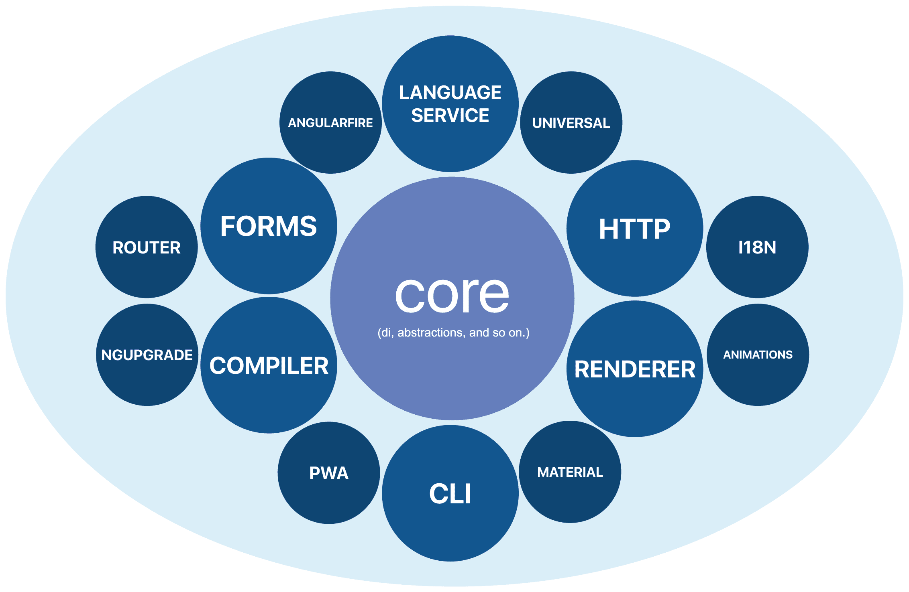

# 转向 One Angular

虽然这本书的内容可以在没有任何先前的 AngularJS 或 Angular 经验的情况下被正确消化，但如果你熟悉 AngularJS 的基础知识并且愿意 *转向 Angular*，你将获得这本书的大部分内容。

在互联网上，经常将 **AngularJS** 和 **Angular 1** 互换使用来指代 **AngularJS** 框架。这种误解让 AngularJS 专家对 Angular 版本感到困惑。在许多社区活动中，我经常收到类似的问题：

我刚刚学习了 Angular X，但听说 Angular X+1 将在 6 个月后推出。这意味着我需要学习一个新的框架吗？

在这里，你可以将 *X* 替换为大于 2 的任何数字。

对这个问题的简短回答是：**当发布新主要版本时，你不需要学习一个新的框架。** 事实上，**Angular 2 和 Angular 5 之间的 API 废弃可以列在几行之内**。

这种混淆主要是由错误地将 AngularJS 称为 Angular 1 所引起，这使得开发者认为每个新的 Angular 版本都将与旧版本有如 Angular 与 AngularJS 之间的不同。

在本章剩余部分和 第二章*，开始使用 Angular* 中，我们将解释 Angular 与 AngularJS 的不同之处以及为什么需要开发一个新的框架。

# 介绍 One Angular

Angular 是一个用于应用开发的框架。它的主要关注点是为我们应用的用户界面开发提供一个坚实的基础。

框架提供的核心原语之一是其强大的依赖注入机制，这使得我们能够轻松控制代码各个构建块之间的关系。Angular 的 *显然快速* 的变更检测提供了一种将应用视图与数据模型的当前状态同步的方法。对开发者完全透明，变更检测能够精确地知道模型何时发生变化，并执行最小化操作以在视图中反映更新。

能够扩展有效的 HTML，Angular 的模板通过自定义元素允许我们使用声明式的 **领域特定语言**（**DSL**）来表示我们应用用户界面的结构及其与模型的绑定。

Angular 吸收了所有这些想法以及许多其他想法，灵感来源于其前身 AngularJS。

# 从 AngularJS 到 Angular

AngularJS 的最初发布是在 2010 年 10 月 20 日。如今，这个框架被全球数百万个应用所使用。AngularJS 的流行程度非常高，以至于许多技术都受到了它的启发，甚至开始将其作为基础。

这样一个用于开发移动应用的平台是 Ionic。随着时间的推移，该框架不断进化，试图提供一个尽可能人体工程学化和简化的 API，同时仍然足够强大和表达力丰富，以便我们能够轻松地开发复杂的 Web 应用。API 在不同版本之间的变化很小，通常通过弃用过程引入。这样，我们：作为开发者：有足够的时间通过过渡过程并适应最新的变化。

然而，与此同时，Web 也在进化，出现了数十种新技术，其中一些直接影响了 AngularJS 本身，或者为框架提供了在性能或人体工程学方面实现大跳跃的机会。例如，通过 Web Worker 标准或甚至新的语言如 TypeScript 引入了这些新的 API。

这样，尽管 AngularJS 在 2010 年是应用开发的最佳技术，但由于 Web 的不断变化，它难以保持竞争力和完美无缺。这就是一个新框架想法的诞生，这个框架受 AngularJS 的启发，但具有更强大的 API 和更好的性能！**由于与 AngularJS 的概念相似性，谷歌将其称为 Angular。**

# 新的开始

谷歌团队，愿意利用 Angular 中最先进的技术，决定从 TypeScript 的坚实、静态类型基础开始。在此基础上，他们考虑了多种不同的方法来提高 Angular 的性能，以帮助开发者向我们的应用程序用户提供闪电般的体验。

鉴于从 AngularJS 中学到的关于浏览器 API 不断进化的经验教训，Angular 团队开发了一个以小型核心和大量围绕它的不同库为特点的框架，提供了额外的功能。这样，框架的基础 API 将能够尽可能保持不变，Angular 核心周围的整个基础设施将遵循语义版本控制的明确发布流程进行进化。您可以在以下图中看到围绕 Angular 核心开发的某些模块：

图 1

我们将在接下来的章节中描述一些这些模块。

在继续前进之前，让我们先概述一下语义版本控制实际上意味着什么。

# Angular 和 SemVer

AngularJS 是从头开始重写的，并替换为其继任者 Angular 2。我们中的许多人对此大步前进感到困扰，因为它不允许我们在这两个框架版本之间实现平滑过渡。Angular 2 稳定后不久，谷歌宣布他们希望遵循所谓的**语义版本控制规范**（也称为**SemVer**）。

SemVer 定义了一个给定软件项目的版本为**X.Y.Z**的三元组，其中*Z*称为**补丁版本**，*Y*称为**次要版本**，*X*称为**主版本**。补丁版本的变化意味着在同一个项目的两个版本之间，没有影响公共 API 表面的有意破坏性变更，只有错误修复。当引入新功能且没有破坏性变更时，项目的次要版本将增加。最后，当 API 中引入不兼容的变更时，主版本将增加。

这意味着在 2.3.1 和 2.10.4 版本之间，没有引入破坏性变更，只有一些新增功能和错误修复。然而，如果我们有 2.10.4 版本，并且想要以向后不兼容的方式更改任何现有的公共 API（例如，更改方法接受的参数顺序），我们需要增加主版本号，并将补丁和次要版本号重置；因此我们将得到 3.0.0 版本。

Angular 团队还遵循一个严格、可预测的时间表。根据它，*每周需要引入一个新的补丁版本；每个主要版本发布后，应有三个月度次要版本发布*，最后，*每 6 个月发布一个主要版本*。这意味着到 2018 年底，将会有 Angular 7。然而，这并不意味着每 6 个月我们都要经历像 AngularJS 和 Angular 2 之间的相同迁移路径。*并非每个主要版本都会引入影响我们项目的破坏性变更*。例如，对 TypeScript 新版本的支持或方法最后一个可选参数的改变将被视为破坏性变更。我们可以将这些破坏性变更视为类似于 AngularJS 1.2 和 AngularJS 1.3 之间发生的情况。

由于本书中您将阅读的内容将主要适用于不同的 Angular 版本，*我们将仅将框架称为 Angular*。如果我们在某处明确提到一个版本，这并不意味着给定的段落对 Angular 4 或 Angular 5 无效；很可能有效。如果某个 API 仅适用于特定的 Angular 版本，这将明确指出。如果您想了解框架不同版本之间的变化，您可以查看变更日志[`github.com/angular/angular/blob/master/CHANGELOG.md`](https://github.com/angular/angular/blob/master/CHANGELOG.md)。

现在我们已经介绍了 Angular 的语义版本和引用框架不同版本的约定，我们可以正式开始我们的旅程了！

# 摘要

在本章中，我们介绍了 Angular 是什么。我们解释了 Angular 和 AngularJS 是完全不同的框架。

之后，我们探讨了框架结构的基础：拥有一个核心，该核心具有最小化和不可变的 API，并在其之上构建不同的模块，以提供尽可能最佳的开发体验。

最后，我们解释了 Angular 如何遵循语义化版本控制，这有助于我们理解为什么以及何时我们应该期待在 Angular 中发生不兼容的 API 变更。

在下一章中，我们将关注 AngularJS 为何无法跟上网络的持续发展，Angular 如何利用新的、强大的浏览器 API，以及它是如何使大规模应用程序的开发变得更加容易的。
