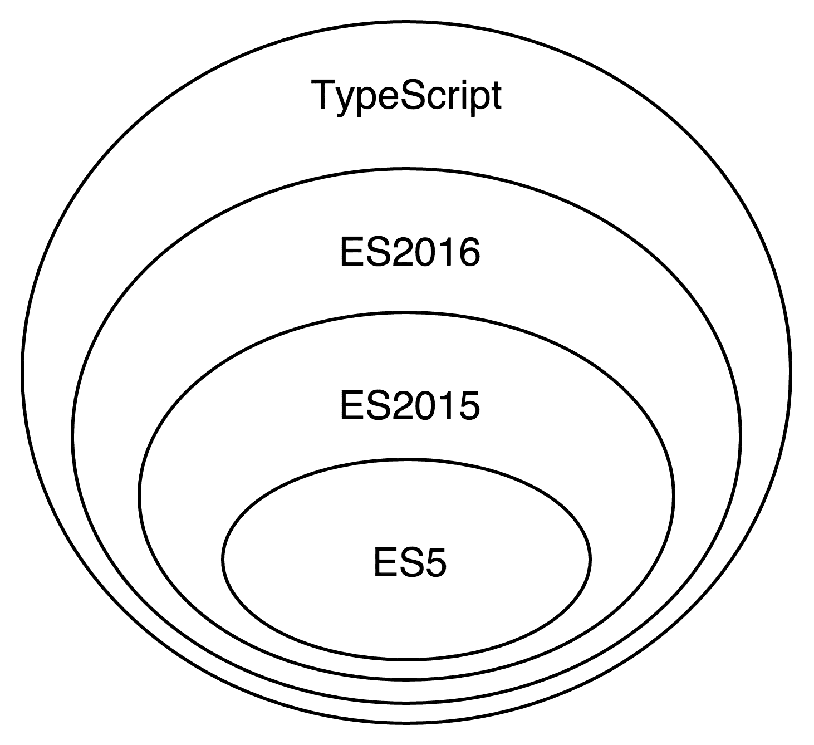
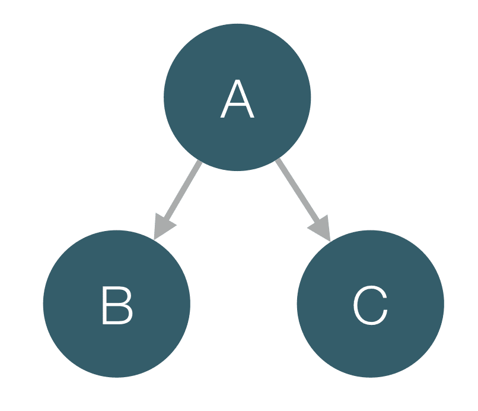

# 第四章：TypeScript 快速入门

在本章中，我们将开始使用 TypeScript：Angular 所使用的语言。所有 ECMAScript 2015 和 ECMAScript 2016 提供的功能，如函数、类、模块和装饰器，都已经实现或添加到 TypeScript 的路线图中。由于额外的类型注解，与 JavaScript 相比，有一些语法上的添加。

由于已经熟悉 AngularJS 和随后的 ES5，我们将经历一个平滑过渡到 TypeScript 的过程。我们将从介绍 ES2015 和 ES2016 开始。正如我们之前提到的，TypeScript 是这些新 ECMAScript 标准的超集，这意味着通过学习 JavaScript 的新版本，你也将学习到 TypeScript 非常重要的部分。在本章的后半部分，我们将添加显式类型注解的额外语法。

在本章的后面部分，我们将解释 TypeScript 提供的额外功能，例如静态类型和额外语法。我们将讨论基于这些功能的不同后果，这将帮助我们提高生产力并减少错误。让我们开始吧！

# TypeScript 简介

TypeScript 是由微软开发和维护的开源编程语言。它的首次公开发布是在 2012 年 10 月。TypeScript 是 ECMAScript 的超集，支持 JavaScript 的所有语法和语义，并在其之上提供了一些额外功能，如静态类型和更丰富的语法。

*图 1* 展示了 ES5、ES2015、ES2016 和 TypeScript 之间的关系：



图 1

由于 TypeScript 是静态类型的，它可以为 JavaScript 开发者提供许多好处。现在让我们快速看一下这些好处。

# 编译时类型检查

我们在编写 JavaScript 代码时犯的最常见的错误之一是拼写属性或方法名错误。通常，我们在运行时错误中意识到这个错误。这可能在开发过程中发生，也可能在生产过程中发生。希望我们在将代码部署到生产环境之前知道这个错误并不是一个令人舒服的感觉！然而，这并不是 JavaScript 特有的问题；这是所有动态语言的共同问题。即使有很多单元测试，这些错误也可能被忽略。

TypeScript 提供了一个编译器，它通过静态代码分析为我们处理这些错误。如果我们利用静态类型，TypeScript 将知道给定对象具有的现有属性，如果我们拼写错误，编译器将以编译时错误的形式警告我们。

TypeScript 的另一个巨大好处是它允许大型团队协作，因为它提供了正式、可验证的命名。这样，它允许我们编写易于理解的代码。

# 文本编辑器和 IDE 的支持更好

有许多工具，如 Tern，试图在文本编辑器和 IDE 中为 JavaScript 提供更好的自动完成支持。然而，由于 JavaScript 是一种动态语言，没有元数据，IDE 和文本编辑器无法做出复杂的建议。例如，Google Closure Compiler 就使用 JSDoc 中提供的类型注解来为语言提供静态类型。

使用这样的元数据注释代码是 TypeScript 的一个内置功能，称为类型注解。基于这些注解，文本编辑器和 IDE 可以对我们的代码进行更好的静态分析。这提供了更好的重构工具和自动完成功能，提高了我们的生产力，并允许我们在编写应用程序的源代码时犯更少的错误。

# TypeScript 还有更多内容

TypeScript 本身还有许多其他好处：

+   **它是 JavaScript 的超集**：所有 JavaScript 程序（例如，ES5 和 ES2015）已经是有效的 TypeScript 程序。本质上，你已经在编写 TypeScript 代码了。由于它基于 ECMAScript 标准的最新版本，它使我们能够利用语言提供的最新尖端语法。

+   **它支持可选的类型检查**：如果我们出于任何原因决定不想显式地定义变量或方法的类型，我们只需跳过类型定义即可。然而，我们应该意识到这意味着我们不再利用静态类型的好处，因此我们放弃了之前提到的所有好处。

+   **它由微软开发和维护**：语言的实现质量非常高，不太可能意外地放弃支持。TypeScript 基于世界上一些最好的编程语言开发专家的工作。

+   **它是开源的**：这使得社区可以自由地为语言做出贡献并建议功能，这些功能以开放的方式进行讨论。TypeScript 是开源的事实使得第三方扩展和工具的开发更加容易，这进一步扩大了其使用范围。

由于现代浏览器不支持 TypeScript，因此有一个编译器可以将我们编写的 TypeScript 代码转换成预定义的 ECMAScript 目标版本的可读 JavaScript。一旦代码编译完成，所有类型注解都会被移除。

# 使用 TypeScript

让我们开始编写一些 TypeScript 代码吧！

在接下来的章节中，我们将查看不同的代码片段，展示 TypeScript 的一些功能。为了能够运行这些代码片段并自己尝试，你需要在你的计算机上安装 TypeScript 编译器。让我们看看如何做这件事。

安装 TypeScript 最简单的方法是使用 **Node 包管理器**（**npm**）。我建议你使用 5.0.0 或更高版本的 `npm`。如果你还没有安装 node.js 和 `npm`，你可以访问 [`nodejs.org`](https://nodejs.org) 并按照那里的说明操作。

# 使用 npm 安装 TypeScript

一旦安装并运行了 `npm`，你可以通过打开终端窗口并运行以下命令来验证你是否拥有最新版本：

```js
$ npm -v 
```

使用以下命令来安装 TypeScript 2.5.0 或更高版本：

```js
$ npm install -g typescript@².5.0 
```

前面的命令将安装 TypeScript 编译器并将其可执行文件（`tsc`）添加为全局。

为了验证一切是否正常工作，你可以使用以下命令：

```js
$ tsc -v
Version 2.5.2 
```

输出应该类似于前面的示例，尽管可能包含不同的次要或补丁版本。

注意，我们通过在版本号前加 caret 来安装 TypeScript。这意味着 `npm` 将下载 2.y.z 范围内的任何版本，但低于 3.0.0。

# 运行我们的第一个 TypeScript 程序

现在，让我们编译我们的第一个 TypeScript 程序！创建一个名为 `hello-world.ts` 的文件，并输入以下内容：

```js
// ch4/hello-world/hello-world.ts

console.log('Hello world!');
```

由于我们已经安装了 TypeScript 编译器，我们应该有一个名为 `tsc` 的全局可执行命令。你可以用它来编译文件：

```js
$ tsc hello-world.ts 
```

现在，你应该在 `hello-world.ts` 所在的目录中看到 `hello-world.js` 文件。`hello-world.js` 文件是 TypeScript 编译器的输出；它包含与我们编写的 TypeScript 相等的 JavaScript 代码。我们可以使用以下命令运行此文件：

```js
$ node hello-world.js 
```

现在，你会在屏幕上看到打印的 `Hello world!` 字符串。为了结合编译和运行程序的过程，你可以使用 `ts-node` 包：

```js
$ npm install -g ts-node 
```

现在，你可以运行以下命令：

```js
$ ts-node hello-world.ts 
```

你应该看到相同的结果，但不需要在磁盘上存储 `hello-world.js` 文件。

你可以在 [`github.com/mgechev/switching-to-angular`](https://github.com/mgechev/switching-to-angular) 找到这本书的代码。书中大部分代码片段的第一行都有一个注释，显示你可以在样本存储库的目录结构中找到完整的示例。请注意，路径是相对于 `app` 目录的。

# 由 ES2015 和 ES2016 引入的 TypeScript 语法和功能

由于 TypeScript 是 JavaScript 的超集，在我们开始学习其语法之前，先介绍一些 ES2015 和 ES2016 中的较大变化会更容易；为了理解 TypeScript，我们首先必须理解 ES2015 和 ES2016。在深入 TypeScript 之前，我们将对这些变化进行快速浏览。

对 ES2015 和 ES2016 的详细解释超出了本书的范围。为了熟悉所有新特性和语法，我强烈建议你阅读 *Exploring ES6: Upgrade to the next version of JavaScript*，作者是 *Dr. Axel Rauschmayer*。

接下来的几页将介绍新的标准，并使我们能够在开发 Angular 应用程序的过程中充分利用我们所需的大部分功能。

# ES2015 箭头函数

JavaScript 有第一类函数，这意味着它们可以像任何其他值一样传递：

```js
// ch4/arrow-functions/simple-reduce.ts

var result = [1, 2, 3].reduce(function (total, current) { 
  return total + current; 
}, 0); // 6 
```

这种语法很棒；然而，它有点过于冗长。ES2015 引入了一种新的语法来定义匿名函数，称为箭头函数语法。使用它，我们可以创建匿名函数，如下面的例子所示：

```js
// ch4/arrow-functions/arrow-functions.ts 

// example 1 
var result = [1, 2, 3] 
  .reduce((total, current) => total + current, 0); 

console.log(result); // 6

// example 2 
var even = [3, 1, 56, 7].filter(el => !(el % 2)); 

console.log(even); // [56]

// example 3 
var sorted = data.sort((a, b) => { 
  var diff = a.price - b.price; 
  if (diff !== 0) { 
    return diff; 
  } 
  return a.total - b.total; 
}); 
```

在这里的第一例中，我们得到了 `[1, 2, 3]` 数组中所有元素的总和。在第二个例子中，我们从 `[3, 1, 56, 7]` 数组中得到了所有偶数。在第三个例子中，我们按 `price` 和 `total` 属性的升序对数组进行了排序。

箭头函数有几个我们需要了解的额外功能。最重要的功能是它们保留了周围代码的上下文（`this`）：

```js
// ch4/arrow-functions/context-demo.ts

function MyComponent() { 
  this.age = 42; 
  setTimeout(() => { 
    this.age += 1; 
    console.log(this.age); 
  }, 100); 
}

new MyComponent(); // 43 in 100ms. 
```

例如，当我们使用 `new` 操作符调用 `MyComponent` 函数时，`this` 将指向由调用实例化的新对象。箭头函数将保持上下文（`this`），在 `setTimeout` 的回调中，并在屏幕上打印 `43`。

在 Angular 中，这非常有用，因为给定组件的绑定上下文是其实例（即其 `this` 引用）。如果我们定义 `MyComponent` 为 Angular 组件，并且有一个绑定到 `age` 属性，前面的代码将是有效的，并且所有绑定都将工作（注意，我们没有作用域，我们也没有对 `$digest` 循环的显式调用，尽管我们直接调用了 `setTimeout`）。

# 使用 ES2015 和 ES2016 类

当 JavaScript 新手听说该语言赋予 **面向对象**（**OO**）范式时，他们通常会在发现没有用于定义类的语法时感到困惑。这种观念源于一些最受欢迎的编程语言，如 Java、C# 和 C++，它们都有用于构建对象的类的概念。然而，JavaScript 以不同的方式实现了面向对象范式。JavaScript 有一个基于原型的面向对象编程模型，我们可以使用对象字面量语法或函数（也称为构造函数）来实例化对象，并且我们可以利用所谓的原型链来利用继承。

虽然这是一种实现面向对象范式的有效方式，并且语义与经典面向对象模型相似，但对于不确定如何正确处理此问题的经验不足的 JavaScript 开发者来说，这可能会令人困惑。这就是 TC39 决定提供一种替代语法来在语言中使用面向对象范式的原因之一。幕后，新语法具有与我们熟悉的相同的语义，例如使用构造函数和基于原型的继承。然而，它提供了一个更方便的语法，以更少的样板代码来启用面向对象范式的功能。

ES2016 为 ES2015 类添加了一些额外的语法，例如静态和实例属性声明。

这里有一个示例，演示了在 ES2016 中定义类的语法：

```js
// ch4/es6-classes/sample-classes.ts 

class Human { 
  static totalPeople = 0; 
  _name; // ES2016 property declaration syntax

  constructor(name) { 
    this._name = name; 
    Human.totalPeople += 1; 
  }

  get name() { 
    return this._name; 
  }

  set name(val) { 
    this._name = val; 
  }

  talk() { 
    return `Hi, I'm ${this.name}!`; 
  } 
} 

class Developer extends Human { 
  _languages; // ES2016 property declaration syntax

  constructor(name, languages) { 
    super(name); 
    this._languages = languages; 
  }

  get languages() { 
    return this._languages; 
  }

  talk() { 
    return `${super.talk()} And I know ${this.languages.join(',')}.`; 
  } 
} 
```

在 ES2015 中，不需要显式声明 `_name` 属性；然而，由于 TypeScript 编译器应该在编译时知道给定类的实例的现有属性，我们需要将属性的声明添加到类定义本身中。

前面的代码片段既是有效的 TypeScript 也是 JavaScript 代码。在其中，我们定义了一个名为 `Human` 的类，它为其实例化的对象添加了一个属性。它是通过将属性的值设置为传递给其构造函数的参数 `name` 的值来实现的。

后来，`Developer` 类通过在 `extends` 子句中指定对它的引用来扩展 `Human` 类。这样，`Developer` 类的实例将拥有 `Human` 类提供的全部功能，以及 `Developer` 类引入的额外功能。

现在，打开 `ch4/es6-classes/sample-classes.ts` 文件并尝试一下！你可以以创建构造函数对象的方式创建类的不同实例：

```js
var human = new Human('foobar'); 
var dev = new Developer('bar', ['JavaScript']); 
console.log(dev.talk()); 
```

为了执行代码，请运行以下命令：

```js
$ ts-node sample-classes.ts 
```

类在 Angular 中被广泛使用。你可以使用它们来定义你的组件、指令、服务和管道。

# 定义具有块作用域的变量

对于具有不同背景的开发者来说，JavaScript 的变量作用域是一个令人困惑的点。例如，在 Java 和 C++ 中，我们习惯于块词法作用域。这意味着在特定块内部定义的变量将仅在块内部及其嵌套的所有块内部可见。

然而，在 JavaScript 中，情况略有不同。ECMAScript 定义了一个具有类似语义的功能词法作用域，但它使用函数而不是代码块。让我们看看下面的代码片段：

```js
// ch4/let/var.ts 

var fns = []; 
for (var i = 0; i < 5; i += 1) { 
  fns.push(function() { 
    console.log(i); 
  });
} 
fns.forEach(fn => fn()); 
```

这有一些奇怪的影响。一旦代码执行，它将输出数字 `5` 的五倍。

ES2015 添加了一种新的语法来定义具有块作用域可见性的变量。语法与当前语法类似，然而，它使用的是 `let` 关键字而不是 `var`：

```js
// ch4/let/let.ts 

var fns = []; 
for (let i = 0; i < 5; i += 1) { 
  fns.push(function() { 
    console.log(i); 
  });
} 
fns.forEach(fn => fn()); 
```

现在的语义将如预期的那样：我们将在控制台中看到从`0`到`4`的数字。

# 使用 ES2016 装饰器进行元编程

JavaScript 是一种动态语言，它允许我们轻松地修改和/或改变行为以适应我们编写的程序。装饰器是 ES2016 的一个提议，设计文档在[`github.com/wycats/javascript-decorators`](https://github.com/wycats/javascript-decorators)中描述了它们的工作如下： 

"...使设计时对类和属性进行注释和修改成为可能。"

它们的语法与 Java 中的注解非常相似，甚至比 Python 中的装饰器更接近。ES2016 装饰器在 Angular 中常用以定义组件、指令和管道，并利用框架的依赖注入机制。装饰器的多数用例涉及改变行为以符合预定义逻辑或向不同的结构添加一些元数据。

ES2016 装饰器通过改变程序的行为，使我们能够执行许多复杂操作。典型的用例可以是注释给定的方法或属性为已弃用或只读。可以在名为`core-decorators.js`的项目中找到一组预定义的装饰器，这些装饰器可以提高我们生成的代码的可读性。另一个用例是利用基于代理的面向方面编程，使用声明性语法。提供此功能的库是`aspect.js`。

通常，ES2016 装饰器只是新的语法糖，它转换为我们从语言的前几个版本中已经熟悉的 JavaScript 代码。让我们看看提议草案中的一个简单示例：

```js
// ch4/decorators/nonenumerable.ts 

class Person { 
  @nonenumerable 
  get kidCount() { 
    return 42; 
  } 
} 

function nonenumerable(target, name, descriptor) { 
  descriptor.enumerable = false; 
  return descriptor; 
} 

var person = new Person(); 

for (let prop in person) { 
  console.log(prop); 
} 
```

在这种情况下，我们有一个名为`Person`的 ES2015 类，它有一个名为`kidCount`的单个 getter。在`kidCount` getter 上，我们应用了`@nonenumerable`装饰器。装饰器是一个接受目标（`Person`类）、我们打算装饰的目标属性名称（`kidCount`）以及目标属性描述符的函数。在更改描述符后，我们需要返回它以应用修改。基本上，装饰器的应用可以按以下方式转换为 ECMAScript 5：

```js
descriptor = nonenumerable(Person.prototype, 'kidCount', descriptor) || descriptor; 
Object.defineProperty(Person.prototype, 'kidCount', descriptor); 
```

# 使用可配置的装饰器

这里是一个使用 Angular 定义的装饰器的示例：

```js
@Component({ 
  selector: 'app', 
  providers: [NamesList], 
  templateUrl: './app.html', 
}) 
export class App {} 
```

当装饰器接受参数（就像前面的示例中的`Component`一样），它们需要定义为接受参数并返回实际装饰器的函数：

```js
function Component(config) { 
  // validate properties 
  return (componentCtrl) => { 
    // apply decorator 
  }; 
} 
```

在这个例子中，我们定义了一个名为`Component`的函数，它接受一个名为`config`的单个参数并返回一个装饰器。另一方面，装饰器接受构造函数作为参数，这是类的去糖版本。

# 使用 ES2015 编写模块化代码

多年来，JavaScript 专业人士遇到的一个问题是语言中缺乏模块系统。最初，社区开发了不同的模式，旨在强制执行我们生产的软件的模块化和封装。这些模式包括模块模式，它利用了函数词法作用域和闭包的优势。另一个例子是命名空间模式，它将不同的命名空间表示为嵌套对象。AngularJS 引入了自己的模块系统，但遗憾的是，它不提供诸如懒加载模块等特性。然而，这些模式更像是一种权宜之计，而不是真正的解决方案。

**CommonJS**（在 node.js 中使用）和**AMD**（异步模块定义的缩写）后来被发明。它们至今仍被广泛使用，并提供处理循环依赖和异步模块加载（在 AMD 中）等功能。

TC39 取了现有模块系统的最佳之处，并在语言级别上引入了这个概念。ES2015 提供了两个 API 来定义和消费模块。它们如下所示：

+   声明式 API

+   使用模块加载器的命令式 API

Angular 充分利用了 ES2015 模块系统，所以让我们深入探讨！在本节中，我们将查看用于声明式定义和消费模块的语法。我们还将窥视模块加载器的 API，以了解我们如何以显式异步的方式编程加载模块。

# 使用 ES2015 模块语法

让我们看看一个例子：

```js
// ch4/modules/math.ts 

export function square(x) { 
  return Math.pow(x, 2); 
};

export function log(x) { 
  return Math.log(x); 
};

export const PI = Math.PI; 
export const E = Math.E;
```

在前面的代码片段中，我们在`math.ts`文件中定义了一个简单的 ES2015 模块。我们可以将其视为一个示例数学 Angular 实用模块。在其中，我们定义并导出`square`和`log`函数以及常量`E`和`PI`。`const`关键字是 ES2015 带来的另一个关键字，用于定义常量。正如你所见，我们所做的一切不过是给函数的定义前加上`export`关键字。如果我们想最终导出整个功能并跳过重复的显式`export`使用，我们可以使用以下方法：

```js
// ch4/modules/math2.ts 

function square(x) { 
  return Math.pow(x, 2); 
};

function log(x) { 
  return Math.log(x); 
};

const PI = Math.PI;
const E = Math.E;

export { square, log, PI, E }; 
```

最后一行的语法是增强的对象字面量语法，由 ES2015 引入。现在，让我们看看我们如何消费这个模块：

```js
// ch4/modules/app.ts 

import {square, log, E} from './math';

console.log(square(2)); // 4 
console.log(log(E)); // 1 
```

作为模块的标识符，我们使用其相对于当前文件的相对路径。使用解构，我们导入所需的符号：在这种情况下，`square`、`log`和`E`。现在使用`ts-node`运行`app.ts`文件：`ts-node app.ts`。屏幕上的输出应该是：

```js
4
1
```

# 利用模块的隐式异步行为

需要注意的一个重要问题是，ES2015 模块语法具有隐式的异步行为。



图 2

在前面的图（*图 2*）中，我们有`A`、`B`和`C`模块。`A`模块使用`B`和`C`模块，因此它依赖于它们。一旦用户需要`A`模块，JavaScript 模块加载器需要先加载`B`和`C`模块，然后才能调用`A`模块中驻留的任何逻辑，因为这些依赖项。`B`和`C`模块将异步加载。一旦它们完全加载，JavaScript 虚拟机将能够执行`A`模块。

通常，现代打包器会将`A`、`B`和`C`合并到一个文件中，以减少浏览器在解析`A`的依赖项时需要执行的额外 HTTP 请求的开销。

# 使用别名

另一个典型的情况是我们想为给定的导出使用别名。例如，如果我们使用第三方库，我们可能想重命名其中的一些导出，以避免名称冲突或仅仅为了更方便的命名：

```js
import {
  platformBrowserDynamic as platform
} from '@angular/platform-browser-dynamic';
```

# 导入所有模块导出

我们可以使用以下语法导入整个`math`模块：

```js
// ch4/modules/app2.ts 

import * as math from './math';

console.log(math.square(2)); // 4 
console.log(math.log(math.E)); // 1 
console.log(math.PI); // 3.141592653589793 
```

这种语法的语义与 CommonJS 非常相似，尽管在浏览器中，我们具有隐式的异步行为。

请记住，`import *`语法通常不推荐使用，因为它将从目标模块获取所有导出的符号，即使我们不需要它们。这可能导致我们应用程序的生产构建大小的无谓增加。

# 默认导出

如果一个模块定义了一个`export`，这很可能被其任何消费者模块使用，我们可以利用默认的`export`语法：

```js
// ch4/modules/math3.ts 

export default function cube(x) { 
  return Math.pow(x, 3); 
};

export function square(x) { 
  return Math.pow(x, 2); 
};
```

为了消费此模块，我们可以使用以下`app.ts`文件：

```js
// ch4/modules/app3.ts 

import cube from './math3';

console.log(cube(3)); // 27 
```

或者，如果我们想导入默认导出以及额外的导出，我们可以使用以下方法：

```js
// ch4/modules/app4.ts 

import cube, { square } from './math3';

console.log(square(2)); // 4 
console.log(cube(3)); // 27 
```

通常，默认导出不过是一个用`default`保留字命名的命名导出：

```js
// ch4/modules/app5.ts 

import { default as cube } from './math3';

console.log(cube(3)); // 27 
```

# ES2015 模块加载器

标准的新版本定义了一个用于处理模块的程序化 API。这就是所谓的模块加载器 API。它允许我们定义和导入模块，或配置模块加载。

假设我们在`app.js`文件中有以下模块定义：

```js
import { square } from './math';

export function main() { 
  console.log(square(2)); // 4 
} 
```

从`init.js`文件中，我们可以程序化地加载`app`模块并调用其`main`函数：

```js
System.import('./app') 
  .then(app => { 
    app.main(); 
  }) 
  .catch(error => { 
    console.log('Terrible error happened', error); 
  }); 
```

全局对象`System`有一个名为`import`的方法，允许我们使用它们的标识符导入模块。在前面的代码片段中，我们导入了在`app.js`中定义的`app`模块。此外，`System.import`返回一个 promise，可以在成功时解析或在出错时拒绝。一旦 promise 作为传递给`then`的回调函数的第一个参数解析，我们将得到模块实例。在拒绝的情况下注册的回调函数的第一个参数是一个表示发生错误的对象。

上一段代码中的代码在 GitHub 仓库中不存在，因为它需要额外的配置，并且对我们来说不是至关重要的。

# ES2015 和 ES2016 回顾

恭喜！我们学习 TypeScript 已经超过了一半。我们刚刚看到的所有功能都是 TypeScript 的一部分，因为 TypeScript 实现了 JavaScript 的超集；由于所有这些功能都是在当前语法之上进行的升级，所以对于经验丰富的 JavaScript 开发者来说很容易掌握。

在接下来的章节中，我们将描述 TypeScript 的所有令人惊叹的功能，这些功能超出了与 ECMAScript 的交集。

# 利用静态类型

静态类型是能够为我们提供更好的开发过程工具的东西。在编写 JavaScript 时，IDE 和文本编辑器能做的最多就是突出显示语法，并根据我们代码的复杂类型推断提供一些基本的自动完成建议。这意味着我们只能通过运行代码来验证我们没有犯任何错误。

在前面的章节中，我们描述了 ECMAScript 预期在不久的将来由浏览器实现的新功能。在本节中，我们将探讨 TypeScript 提供了哪些功能，以帮助我们减少错误并提高生产力。在撰写本书时，没有计划在浏览器中实现内置的静态类型支持。

TypeScript 代码会经过中间预处理，执行类型检查并丢弃所有类型注解，以便提供现代浏览器支持的有效的 JavaScript。

# 使用显式类型声明

就像 Java 和 C++一样，TypeScript 允许我们显式声明给定变量的类型：

```js
let foo: number = 42; 
```

前一行使用`let`语法在当前块中定义了`foo`变量。我们明确声明我们希望`foo`是`number`类型，并将`foo`的值设置为`42`。

现在，让我们尝试更改`foo`的值：

```js
let foo: number = 42; 
foo = '42'; 
```

在这里，在声明`foo`之后，我们将将其值设置为`'42'`字符串。这是一段完全有效的 JavaScript 代码；然而，如果我们使用 TypeScript 的编译器来编译它，我们会得到以下结果：

```js
$ tsc basic.ts 
basic.ts(2,1): error TS2322: Type 'string' is not assignable to type 'number'.
```

一旦`foo`与给定的类型相关联，我们就不能将其分配给属于不同类型的值。这是我们可以在给定的变量赋值时跳过显式类型定义的原因之一：

```js
let foo = 42; 
foo = '42'; 
```

由于 TypeScript 的类型推断，此代码的语义将与具有显式类型定义的代码相同。我们将在本章末尾进一步探讨它。

# 任何类型

TypeScript 中的所有类型都是称为`any`的类型的一个子类型。我们可以使用`any`关键字声明属于`any`类型的变量。这样的变量可以持有任何类型的值：

```js
let foo: any; 
foo = {}; 
foo = 'bar '; 
foo += 42; 
console.log(foo); // "bar 42" 
```

上述代码是有效的 TypeScript 代码，在编译或运行时不会抛出任何错误。如果我们为所有变量使用 `any` 类型，我们基本上就是在使用动态类型编写代码，这将丢失 TypeScript 编译器的所有好处。这就是为什么我们必须小心使用 `any`，并且只在必要时使用它。

TypeScript 中我们将要探讨的其他类型如下：

+   **原始类型**：这些包括 Number、String、Boolean、Void、Null、Undefined 和 Enum 类型

+   **对象类型**：这些包括函数类型、类和接口类型引用、数组类型、元组类型、函数类型和构造函数类型

+   **类型参数**：这些包括将在 *使用类型参数编写泛型代码* 部分中描述的泛型

# 理解原始类型

TypeScript 中的大多数原始类型是我们已经在 JavaScript 中熟悉的：Number、String、Boolean、Null 和 Undefined。因此，我们在这里将跳过它们的正式解释。另一组在开发 Angular 应用程序时很有用的类型是由用户定义的 `enum` 类型。

# 枚举类型

枚举类型是原始用户定义类型，根据规范，它们是 Number 的子类。枚举的概念存在于 Java、C++ 和 C# 语言中，在 TypeScript 中具有相同的语义：由称为元素的一组命名值组成的用户定义类型。在 TypeScript 中，我们可以使用以下语法定义一个 `enum`：

```js
enum STATES { 
  CONNECTING, 
  CONNECTED, 
  DISCONNECTING, 
  WAITING, 
  DISCONNECTED  
}; 
```

这将被翻译成以下 JavaScript：

```js
var STATES; 
(function (STATES) { 
    STATES[STATES["CONNECTING"] = 0] = "CONNECTING"; 
    STATES[STATES["CONNECTED"] = 1] = "CONNECTED"; 
    STATES[STATES["DISCONNECTING"] = 2] = "DISCONNECTING"; 
    STATES[STATES["WAITING"] = 3] = "WAITING"; 
    STATES[STATES["DISCONNECTED"] = 4] = "DISCONNECTED"; 
})(STATES || (STATES = {})); 
```

我们可以使用 `enum` 类型如下：

```js
if (this.state === STATES.CONNECTING) { 
  console.log('The system is connecting'); 
} 
```

# 理解对象类型

在本节中，我们将探讨数组类型和函数类型，它们属于更通用的对象类型类别。我们还将探讨如何定义类和接口。元组类型是在 TypeScript 1.3 中引入的，其主要目的是允许语言开始对 ES2015 引入的新功能进行类型化，例如解构。我们不会在本书中描述它们。有关进一步阅读，您可以查看语言规范[`www.typescriptlang.org`](http://www.typescriptlang.org)。

# 数组类型

在 TypeScript 中，数组是具有公共元素类型的 JavaScript 数组。这意味着在给定的数组中我们不能有来自不同类型的元素。我们为 TypeScript 中的所有内置类型以及我们定义的所有自定义类型提供了不同的数组类型。

我们可以这样定义一个数字数组：

```js
let primes: number[] = []; 
primes.push(2); 
primes.push(3); 
```

如果我们想要一个类似 JavaScript 数组的异构数组，我们可以使用 `any[]` 类型：

```js
let randomItems: any[] = []; 
randomItems.push(1); 
randomItems.push('foo'); 
randomItems.push([]); 
randomItems.push({}); 
```

这是因为我们推送到数组中的所有值的类型都是 `any` 类型的子类型，并且我们声明的数组包含 `any` 类型的值。

我们可以使用在 JavaScript 中熟悉的数组方法与所有 TypeScript 数组类型一起使用：

```js
let randomItems: any[] = []; 
randomItems.push('foo'); 
randomItems.push('bar'); 
randomItems.join(''); // foobar 
randomItems.splice(1, 0, 'baz'); 
randomItems.join(''); // foobazbar 
```

我们还有一个方括号运算符，它允许我们随机访问数组中的元素：

```js
let randomItems: any[] = []; 
randomItems.push('foo'); 
randomItems.push('bar'); 
randomItems[0] === 'foo' 
randomItems[1] === 'bar' 
```

# 函数类型

我们已经熟悉了如何在 JavaScript 中定义一个新函数。我们可以使用函数表达式或函数声明：

```js
// function expression 
var isPrime = function (n) { 
  // body 
};

// function declaration 
function isPrime(n) { 
  // body 
}; 
```

或者，我们可以使用新的箭头函数语法：

```js
var isPrime = n => { 
  // body 
}; 
```

TypeScript 改变的只是定义函数参数类型和返回结果类型（即函数的签名）的功能。在语言的编译器执行类型检查和转译之后，所有的类型注解都将被移除。如果我们使用函数表达式并将函数赋给一个变量，我们可以以下这种方式定义变量的类型：

```js
let variable: (arg1: type1, arg2: type2, ..., argn: typen) => returnType 
```

考虑以下示例：

```js
let isPrime: (n: number) => boolean = n => { 
  // body 
}; 
```

如果我们想在对象字面量中定义一个方法，我们可以这样做：

```js
let math = { 
  squareRoot(n: number): number { 
    // ... 
  } 
}; 
```

在前面的例子中，我们使用 ES2015 语法定义了一个带有 `squareRoot` 方法的对象字面量。

如果我们想定义一个产生一些副作用而不是返回结果的函数，我们可以将其返回类型声明为 `void`：

```js
let person = { 
  _name: null, 
  setName(name: string): void { 
    this._name = name; 
  } 
}; 
```

# 定义类

TypeScript 类与 ES2015 提供的类似。然而，TypeScript 改变了类型声明并添加了更多的语法糖。例如，让我们看看我们之前定义的 `Human` 类：

```js
class Human { 
  static totalPeople = 0; 
  _name: string;

  constructor(name) { 
    this._name = name; 
    Human.totalPeople += 1; 
  }

  get name() { 
    return this._name; 
  }

  set name(val) { 
    this._name = val; 
  }

  talk() { 
    return `Hi, I'm ${this.name}!`; 
  } 
} 
```

当前的 TypeScript 定义与我们之前介绍的定义之间没有区别；然而，在这种情况下，`_name` 属性的声明是强制性的。以下是我们可以如何使用这个类的方式：

```js
let human = new Human('foo'); 
console.log(human._name); 
```

# 使用访问修饰符

类似地，对于大多数支持类的传统面向对象语言，TypeScript 允许定义访问修饰符。为了防止在定义它的类外部直接访问 `_name` 属性，我们可以将其声明为私有：

```js
class Human { 
  static totalPeople = 0; 
  private _name: string; 
  // ... 
} 
```

TypeScript 支持的访问修饰符如下：

+   **公共**：所有声明为公共的属性和方法都可以从任何地方访问

+   **私有**：所有声明为私有的属性和方法只能从类的定义内部访问

+   **受保护**：所有声明为受保护的属性和方法都可以从类的定义内部或任何扩展拥有该属性或方法的类的定义内部访问

访问修饰符是实现具有良好封装和明确接口的 Angular 服务的绝佳方式。为了更好地理解这个概念，让我们看看一个使用之前定义的类层次结构的例子，该结构已转换为 TypeScript：

```js
class Human { 
  static totalPeople = 0;

  constructor(protected name: string, private age: number) { 
    Human.totalPeople += 1; 
  }

  talk() { 
    return `Hi, I'm ${this.name}!`; 
  } 
} 

class Developer extends Human { 
  constructor(name: string, private languages: string[], age: number) { 
    super(name, age); 
  }

  talk() { 
    return `${super.talk()} And I know ${this.languages.join(', ')}.`; 
  } 
} 
```

就像 ES2015 一样，TypeScript 支持使用 `extends` 关键字，并将其转换为原型 JavaScript 继承。

在前面的例子中，我们直接在构造函数内部设置了`name`和`age`属性的访问修饰符。这个语法背后的语义与上一个例子中使用的不同。它的含义如下：定义一个名为`name`的受保护属性，其类型为`string`，并将构造函数调用传递的第一个值分配给它。对于私有的`age`属性也是一样。这使我们免去了在构造函数中显式设置值的麻烦。如果我们查看`Developer`类的构造函数，我们可以看到我们可以使用这些语法的混合。我们可以在构造函数的签名中显式定义属性，或者我们只定义构造函数接受给定类型的参数。

现在，让我们创建`Developer`类的一个新实例：

```js
let dev = new Developer('foo', ['JavaScript', 'Go'], 42); 
dev.languages = ['Java']; 
```

在编译过程中，TypeScript 会抛出一个错误告诉我们：

`属性 languages 是私有的，并且只能在类"Developer"内部访问`。现在，让我们看看如果我们创建一个新的`Human`类并尝试从其定义外部访问其属性会发生什么：

```js
let human = new Human('foo', 42); 
human.age = 42; 
human.name = 'bar'; 
```

在这种情况下，我们会得到以下两个错误：

`属性 age 是私有的，并且只能在类"Human"内部访问`，而`属性 name 是受保护的，并且只能在类"Human"及其子类内部访问`。

然而，如果我们尝试在`Developer`的定义内部访问`_name`属性，编译器不会抛出任何错误。

为了更好地了解 TypeScript 编译器将从一个类型注解的类中生成什么，让我们看看以下定义生成的 JavaScript 代码：

```js
class Human { 
  constructor(private name: string) {} 
} 
```

生成的 ECMAScript 5 将如下所示：

```js
var Human = (function () { 
    function Human(name) { 
        this.name = name; 
    } 
    return Human; 
})(); 
```

定义好的属性将会直接添加到使用`new`操作符调用构造函数所实例化的对象中。这意味着一旦代码编译完成，我们就可以直接访问创建的对象的私有成员。

为了总结，访问修饰符被添加到语言中是为了帮助我们强制更好的封装，并在我们违反它时在编译时得到错误。

# 定义接口

在编程语言中的**子类型化**允许我们根据观察它们是通用对象的特殊版本，以相同的方式处理对象。这并不意味着它们必须是同一类对象的实例，或者它们在接口之间有完全的交集。这些对象可能只有少数共同属性，但在特定上下文中仍然可以以相同的方式处理。在 JavaScript 中，我们通常使用鸭子类型。我们可以根据假设这些方法存在，为传递给函数的所有对象调用特定的方法。然而，我们所有人都经历过 JavaScript 解释器抛出的`undefined is not a function`错误。

面向对象编程和 TypeScript 提供了解决方案。它们允许我们确保我们的对象在实现声明了它们拥有的属性子集的接口时具有相似的行为。

例如，我们可以定义一个接口为`Accountable`：

```js
interface Accountable { 
  getIncome(): number; 
} 
```

现在，我们可以通过执行以下操作来确保`Individual`和`Firm`都实现了这个接口：

```js
class Firm implements Accountable { 
  getIncome(): number { 
    // ... 
  } 
}

class Individual implements Accountable { 
  getIncome(): number { 
    // ... 
  } 
} 
```

如果我们实现了一个特定的接口，我们需要为其中定义的所有方法提供实现，否则 TypeScript 编译器将抛出一个错误。我们实现的方法必须与接口定义中声明的签名相同。

TypeScript 接口也支持属性。在`Accountable`接口中，我们可以包含一个名为`accountNumber`的字段，其类型为字符串：

```js
interface Accountable { 
  accountNumber: string; 
  getIncome(): number; 
} 
```

我们可以在类中将其定义为字段或 getter。

# 接口继承

接口也可以相互扩展。例如，我们可以将我们的`Individual`类转换为一个包含社会保险号的接口：

```js
interface Accountable { 
  accountNumber: string; 
  getIncome(): number; 
}

interface Individual extends Accountable { 
  ssn: string; 
} 
```

由于接口支持多重继承，`Individual`也可以扩展具有`name`和`age`属性的`Human`接口：

```js
interface Accountable { 
  accountNumber: string; 
  getIncome(): number; 
}

interface Human { 
  age: number; 
  name: number; 
}

interface Individual extends Accountable, Human { 
  ssn: string; 
} 
```

# 实现多个接口

如果类的行为是几个接口中定义的属性的并集，它可以实现所有这些接口：

```js
class Person implements Human, Accountable { 
  age: number; 
  name: string; 
  accountNumber: string;

  getIncome(): number { 
    // ... 
  } 
} 
```

在这种情况下，我们需要为类实现的接口中声明的所有方法和属性提供实现，否则编译器将抛出一个编译时错误。

# 使用 TypeScript 装饰器进一步增强表达力

在 ES2015 中，我们只能装饰类、属性、方法、getter 和 setter。TypeScript 进一步允许我们装饰函数或方法参数：

```js
class Http { 
  // ... 
}

class GitHubApi { 
  constructor(@Inject(Http) http) { 
    // ... 
  } 
} 
```

请记住，参数装饰器不应改变任何额外的行为。相反，它们用于生成元数据。这些装饰器的最典型用例是 Angular 的依赖注入机制。

# 使用类型参数编写泛型代码

在使用静态类型的部分的开头，我们提到了类型参数。为了更好地理解它们，让我们从一个例子开始。假设我们想要实现经典的数据结构`BinarySearchTree`。让我们使用一个没有应用任何方法实现的类来定义它的接口：

```js
class Node { 
  value: any; 
  left: Node; 
  right: Node; 
} 

class BinarySearchTree { 
  private root: Node; 
  insert(any: value): void { /* ... */ } 
  remove(any: value): void { /* ... */ } 
  exists(any: value): boolean { /* ... */ } 
  inorder(callback: {(value: any): void}): void { /* ... */ } 
} 
```

在前面的代码片段中，我们定义了一个名为`Node`的类。这个类的实例代表我们树中的单个节点。每个节点都有一个`left`和`right`子节点以及一个`any`类型的值；我们使用`any`是为了能够在节点和随后的`BinarySearchTree`中存储任何类型的数据。

虽然早期的实现看起来合理，但我们放弃了 TypeScript 提供的最重要功能之一，即静态类型。在`Node`类中，使用`any`作为值字段的类型，我们无法充分利用编译时类型检查。这也限制了 IDE 和文本编辑器在我们访问`Node`类实例的`value`属性时提供的自动完成和重构功能。

TypeScript 提供了一个优雅的解决方案，这在静态类型的世界中已经非常流行：类型参数。使用泛型，我们可以使用类型参数来参数化我们创建的类。例如，我们可以将我们的`Node`类转换为以下形式：

```js
class Node<T> { 
  value: T; 
  left: Node<T>; 
  right: Node<T>; 
} 
```

这里，`Node<T>`表示这个类有一个名为`T`的单个类型参数，它在类的定义中某处被使用。我们可以通过以下方式使用`Node`：

```js
let numberNode = new Node<number>(); 
let stringNode = new Node<string>(); 
numberNode.right = new Node<number>(); 
numberNode.value = 42; 
numberNode.value = '42'; // Type "string" is not assignable to type "number" 
numberNode.left = stringNode; // Type Node<string> is not assignable to type Node<number> 
```

在前面的代码片段中，我们创建了三个节点：`numberNode`、`stringNode`以及另一个`Node<number>`类型的节点，将其值赋给`numberNode`的右子节点。请注意，由于`numberNode`是`Node<number>`类型，我们可以将其值设置为`42`，但不能使用`'42'`字符串。同样的规则适用于其左子节点。在定义中，我们明确声明我们希望左右子节点为`Node<number>`类型。这意味着我们不能将`Node<string>`类型的值赋给它们；这就是为什么我们得到第二个编译时错误的原因。

# 使用泛型函数

泛型的一个典型用途是定义在一系列类型上操作的功能。例如，我们可能定义一个`identity`函数，它接受类型为`T`的参数并返回它：

```js
function identity<T>(arg: T) { 
  return arg; 
} 
```

然而，在某些情况下，我们可能只想使用具有某些特定属性的类型的实例。为了实现这一点，我们可以使用一个扩展语法，允许我们声明我们希望用作类型参数的类型是给定类型的子类型：

```js
interface Comparable { 
  compare(a: Comparable): number; 
}

function sort<T extends Comparable>(arr: Comparable[]): Comparable[] { 
  // ... 
} 
```

例如，在这里，我们定义了一个名为`Comparable`的接口。它有一个名为`compare`的操作。实现`Comparable`接口的类需要实现`compare`操作。当`compare`与给定的参数一起调用时，如果目标对象大于传递的参数，则返回`1`；如果它们相等，则返回`0`；如果目标对象小于传递的参数，则返回`-1`。

# 具有多个类型参数

TypeScript 允许我们使用多个类型参数：

```js
class Pair<K, V> { 
  key: K; 
  value: V; 
} 
```

在这种情况下，我们可以使用以下语法创建`Pair<K, V>`类的实例：

```js
let pair = new Pair<string, number>(); 
pair.key = 'foo'; 
pair.value = 42; 
```

# 使用 TypeScript 的类型推断编写更简洁的代码

静态类型有许多优点；然而，它通过添加所有类型注解，使我们编写的代码更加冗长。

在某些情况下，TypeScript 的编译器能够猜测我们代码中表达式的类型；让我们考虑这个例子：

```js
let answer = 42; 
answer = '42'; // Type "string" is not assignable to type "number" 
```

在上述代码片段中，我们定义了一个名为`answer`的变量并将其赋值为`42`。由于 TypeScript 是静态类型的，变量的类型一旦声明就不能改变，因此编译器足够智能，可以猜测`answer`的类型是`number`。

如果我们不在其定义中为变量赋值，编译器将将其类型设置为`any`：

```js
let answer; 
answer = 42; 
answer = '42'
```

上述代码片段将编译而不会出现任何编译时错误。

# 最佳公共类型

有时，类型推断可能是几个表达式的结果。这种情况发生在我们将异构数组赋值给变量时：

```js
let x = ['42', 42]; 
```

在这种情况下，`x`的类型将是`any[]`。然而，假设我们有以下情况：

```js
let x = [42, null, 32]; 
```

由于`Number`类型是`Null`的子类型，因此`x`的类型将是`number[]`。

# 上下文类型推断

上下文类型发生在表达式的类型从其位置隐含时；让我们看看这个例子：

```js
document.body.addEventListener('mousedown', e => { 
  e.foo(); // Property "foo" does not exists on a type "MouseEvent" 
}, false); 
```

在这种情况下，`e`回调函数的参数类型是由编译器根据其使用的上下文来猜测的。编译器理解`e`的类型是基于`addEventListener`的调用和传递给方法的参数。如果我们使用键盘事件（例如`keydown`），TypeScript 就会知道`e`是`KeyboardEvent`类型。

类型推断是一种机制，通过利用 TypeScript 执行的静态分析，我们可以编写更简洁的代码。根据上下文，TypeScript 的编译器能够根据给定的表达式推断其类型，而无需显式定义。

# 引入结构化类型

TypeScript 的类型系统的一个重要特性是它是**结构化类型**。形式上这意味着类型的等价性和兼容性是由类型的结构决定的，而不是由名称或其他特征（如继承层次结构）决定的。

这可能一开始听起来相当抽象，所以让我们看看一个具体的例子：

```js
// ch4/structural-typing/example.ts

interface Namable {
  name: string;
}

class Cat {
  name: string;
}

class Castle {
  name: string;
  capacity: string;
}

const formatName = (obj: Namable) => `The name is ${obj.name}`;
```

上述代码片段定义了一个名为`Namable`的接口，它有一个名为`name`的单个属性声明。我们还定义了`Cat`和`Castle`类：它们都有`name`属性，但都没有实现`Namable`接口。

如果我们用`Cat`或`Castle`的新实例调用`formatName`，代码将正常编译：

```js
const cat = new Cat();
cat.name = 'Kitty';
formatName(cat);

const castle = new Castle();
castle.name = 'Hogwarts';
formatName(castle);
```

在这种情况下，我们不会得到任何编译类型错误，因为`Namable`接口声明的属性是`Cat`和`Castle`声明的属性的子集。尽管在这种情况下，显式接口实现可能看起来是不必要的，但它更加方便，因为在开发特定类时，如果接口实现不正确，我们将在文本编辑器或 IDE 中得到内联错误。对于一些读者来说，这可能会让人联想到 Go 中的*隐式接口实现*，然而，我们可以更进一步。

现在让我们看看`formatName`的签名如下：

```js
const formatName = (obj: Cat) => `The name is ${obj.name}`;
```

现在我们可以执行以下操作：

```js
formatName(new Castle());
```

如果我们使用 `Castle` 实例调用 `formatName`，代码将再次编译无误！这是由于 `Cat` 和 `Castle` 类的兼容性：`Cat` 类具有由 `Castle` 声明的属性子集。对于习惯于命名类型开发的开发者来说，这可能会显得不自然，因为在这种情况下，`Cat` 和 `Castle` 不在同一个继承链中。

现在，让我们将 `Cat` 类定义的说明改为以下内容：

```js
class Cat {
  name: string;
  breed: string;
}
```

如果我们保持 `formatName` 函数相同的签名，那么使用 `Castle` 实例调用 `formatName` 将会产生错误：

```js
const formatName = (obj: Cat) => `The name is ${obj.name}`;

formatName(new Castle());
// Argument of type 'Castle' is not assignable to parameter of type 'Cat'.
//  Property 'breed' is missing in type 'Castle'.
```

正如编译错误所说，我们不能传递缺少某些属性或方法的对象实例，这些属性或方法是给定函数或方法签名参数的类型。

既然我们已经熟悉了结构化类型，让我们继续我们的下一站：环境类型定义。

# 使用环境类型定义

虽然静态类型很神奇，但我们使用的许多前端库都是用 JavaScript 构建的，它是动态类型的。由于我们想与 Angular 一起使用 TypeScript，因此使用外部 JavaScript 库的代码中没有类型定义是一个大问题；它阻止了我们利用编译时类型检查的优势。

TypeScript 的构建考虑到了这些要点。为了使 TypeScript 编译器负责其最擅长的事情，我们可以使用所谓的环境类型定义。它们允许我们为现有的 JavaScript 库提供外部类型定义。这样，它们为编译器提供提示。

# 使用预定义的环境类型定义

幸运的是，我们不需要为我们使用的所有 JavaScript 库和框架创建环境类型定义。这些库的社区和/或作者已经在线上发布了此类定义；最大的存储库位于 [`github.com/DefinitelyTyped/DefinitelyTyped`](https://github.com/DefinitelyTyped/DefinitelyTyped)。在过去的几个月里，社区开发了一些用于管理环境类型定义的工具，例如 `tsd` 和 `typings`。

后来，微软引入了一种官方的方式来管理它们：通过在 `tsconfig.json` 中提供额外的配置来使用 **`npm`**。现在，类型定义作为带有 `@types` 命名空间的范围包分发，并安装到 `node_modules` 中。

让我们创建一个目录并向其中添加一个 `package.json` 文件：

```js
$ mkdir types-test && cd types-test && npm init
```

在我们为 `npm` 请求的属性提供默认值后，`types-test` 目录中的 `package.json` 文件应该看起来像这样：

```js
{
  "name": "types-test",
  "version": "1.0.0",
  "description": "",
  "main": "index.js",
  "scripts": {
    "test": "echo "Error: no test specified" && exit 1"
  },
  "author": "",
  "license": "ISC"
}
```

我们可以使用此命令安装新的类型定义：

```js
$ npm install @types/angular --save-dev
```

之前的命令将下载 AngularJS 的类型定义并将它们保存到 `node_modules/@types/angular` 中。请注意，我们向 `npm` 提供了 `--save-dev` 标志，以便将类型定义保存到 `package.json` 的 `devDependencies` 下。

在安装环境类型定义时，我们通常会使用`--save-dev`而不是`--save`，因为定义主要用于开发。

运行前面的命令后，你的`package.json`文件应该看起来像这样：

```js
{
  "name": "types-test",
  "version": "1.0.0",
  "description": "",
  "main": "index.js",
  "scripts": {
    "test": "echo "Error: no test specified" && exit 1"
  },
  "author": "",
  "license": "ISC",
  "devDependencies": {
    "@types/angular": "¹.5.20"
  }
}
```

现在，为了使用 TypeScript 与 AngularJS，创建`app.ts`文件并输入以下内容：

```js
/// <reference path="./node_modules/@types/angular/index.d.ts"/> 

var module = angular.module('module', []); 
module.controller('MainCtrl', 
  function MainCtrl($scope: angular.IScope) { 

  }); 
```

要编译`app.ts`，使用以下命令：

```js
$ tsc app.ts
```

TypeScript 编译器会将编译内容输出到`app.js`文件中。为了添加额外的自动化并每次我们更改项目中的任何文件时都调用 TypeScript 编译器，我们可以使用任务运行器，如 gulp 或 grunt，或者将`-w`选项传递给`tsc`。

由于使用`reference`元素来包含类型定义被认为是不良实践，我们可以使用`tsconfig.json`文件代替。在那里，我们可以通过`tsc`配置需要包含在编译过程中的目录。更多信息，请访问[`www.typescriptlang.org/docs/handbook/tsconfig-json.html`](http://www.typescriptlang.org/docs/handbook/tsconfig-json.html)。

现在，让我们在同一目录下创建一个名为`tsconfig.json`的文件，内容如下：

```js
{
  "compilerOptions": {
    "target": "es5",
    "module": "commonjs",
    "experimentalDecorators": true,
    "outDir": "./dist"
  },
  "files": [
    "./app.ts"
  ]
}
```

在此配置文件中，我们提供了`compilerOptions`属性，这样我们就不需要将`outDir`和`module`格式等参数作为标志传递给`tsc`。注意，在`files`属性中，我们还列出了我们想要编译的文件。TypeScript 将编译所有这些文件以及它们的传递依赖项！

现在，让我们修改我们之前简单的代码片段：

```js
var module = angular.module('module', []); 
module.controller('MainCtrl', 
  function MainCtrl($scope: angular.IScope) { 
    const set = new Set<any>();
  });
```

我们所做的唯一更改是在声明和初始化一个新常量时，使用`Set`构造函数的返回结果，并将`any`作为类型参数。由于`tsconfig.json`文件位于我们的`app.ts`文件和`node_modules`目录中，我们可以通过运行以下命令来编译项目：

```js
$ tsc
```

然而，我们会遇到以下错误：

`demo.ts(4,22): error TS2304: Cannot find name 'Set'`。

在这里，`Set`实现了集合数据结构，并作为 ES2015 标准的一部分。由于在所有 TypeScript 项目中使用 ES2015 的环境类型定义是一种非常常见的做法，Microsoft 将其作为 TypeScript 本身的一部分添加。在`tsconfig.json`中的`compilerOptions`属性中，添加以下`lib`属性：

```js
{
  "compilerOptions": {
    "target": "es5",
    "module": "commonjs",
    "experimentalDecorators": true,
    "outDir": "./dist",
    "lib": ["es2015", "dom"]
  },
  "files": [
    "./demo.ts"
  ]
}
```

在这里，`lib`的值为一个数组，它包含`"es2015"`和`"dom"`，因为我们需要 ES2015 Set，并且 Angular 的类型定义需要**文档对象模型**（**DOM**）的类型定义。现在，当我们在包含`tsconfig.json`文件的目录中运行`tsc`时，编译过程应该成功通过，输出文件应位于`./dist/demo.js`。

# 自定义环境类型定义

为了理解所有这些是如何协同工作的，让我们看一个例子。假设，我们有一个 JavaScript 库的以下接口：

```js
var DOM = { 
  // Returns a set of elements which match the passed selector 
  selectElements: function (selector) { 
    // ... 
  }, 
  hide: function (element) { 
    // ... 
  }, 
  show: function (element) { 
    // ... 
  } 
}; 
```

我们将一个对象字面量赋值给一个名为`DOM`的变量。该对象具有以下方法：

+   `selectElements`：这个函数接受一个字符串类型的单个参数，并返回一组`DOM`元素

+   `hide`：这个函数接受一个`DOM`节点作为参数，并返回空值

+   `show`：这个函数接受一个`DOM`节点作为参数，并返回空值

在 TypeScript 中，前面的定义如下所示：

```js
var DOM = { 
  // Returns a set of elements which match the passed selector 
  selectElements: function (selector: string): HTMLElement[] { 
    //...
    return []; 
  }, 
  hide: function (element: HTMLElement): void { 
    element.hidden = true; 
  }, 
  show: function (element: HTMLElement): void { 
    element.hidden = false; 
  } 
}; 
```

这意味着我们可以按照以下方式定义我们库的接口：

```js
interface LibraryInterface { 
  selectElements(selector: string): HTMLElement[] 
  hide(element: HTMLElement): void 
  show(element: HTMLElement): void 
} 
```

在我们有了我们库的界面之后，创建环境类型定义将会变得简单；我们只需创建一个扩展名为`d.ts`的名为`dom`的文件，并输入以下内容：

```js
// inside "dom.d.ts" 

interface DOMLibraryInterface { 
  selectElements(selector: string): HTMLElement[] 
  hide(element: HTMLElement): void 
  show(element: HTMLElement): void 
} 

declare var DOM: DOMLibraryInterface; 
```

在前面的代码片段中，我们定义了一个名为`DOMLibraryInterface`的接口，并声明了`DOM`变量为`DOMLibraryInterface`类型。

在能够使用静态类型与我们的 JavaScript 库一起使用之前，我们唯一剩下的事情是将外部类型定义包含到我们想要使用库的脚本文件中。我们可以这样做：

```js
/// <reference path="dom.d.ts"/> 
```

前面的代码片段提示编译器在哪里可以找到环境类型定义。一种替代的、更好的方法是通过使用前面描述的`tsconfig.json`来提供对`d.ts`文件的引用。

# 摘要

在本章中，我们介绍了用于 Angular 实现的 TypeScript 语言。

在探索语言的过程中，我们查看了一些 ES2015 和 ES2016 的核心特性。我们解释了 ES2015 和 ES2016 的类、箭头函数、块作用域变量定义、解构和模块。由于 Angular 利用了 ES2016 装饰器，以及更准确地说，TypeScript 中对它们的扩展，因此我们专门用一节来介绍它们。

在此之后，我们查看了我们如何利用显式类型定义来利用静态类型。我们描述了 TypeScript 中的一些内置类型以及我们如何通过指定成员的访问修饰符来在语言中定义类。我们的下一个目的地是接口。我们通过解释类型参数、结构化类型和环境类型定义来结束我们在 TypeScript 中的冒险。

在接下来的章节中，我们将深入探讨 Angular，从框架的组件和指令开始。
