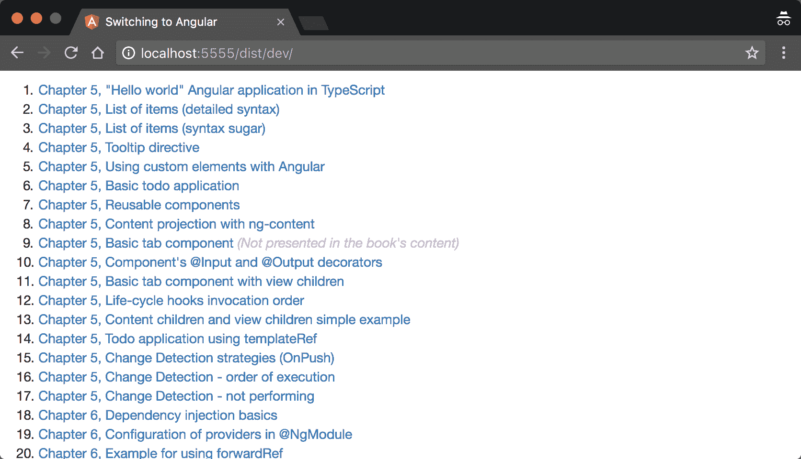
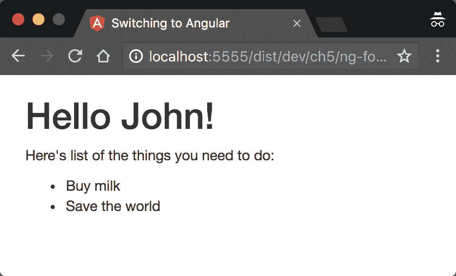
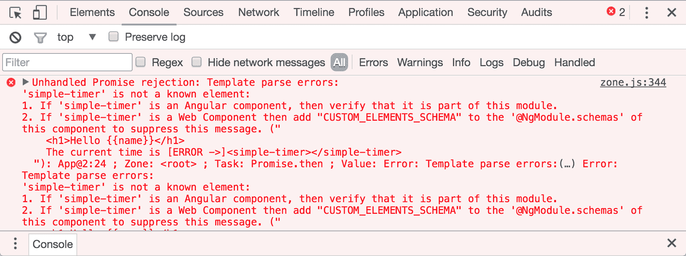
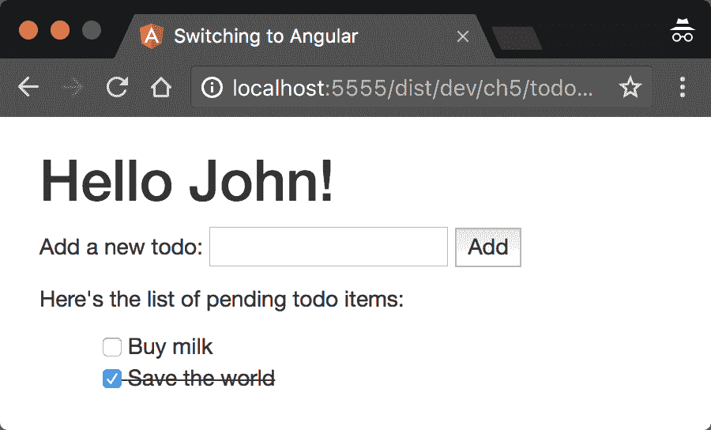
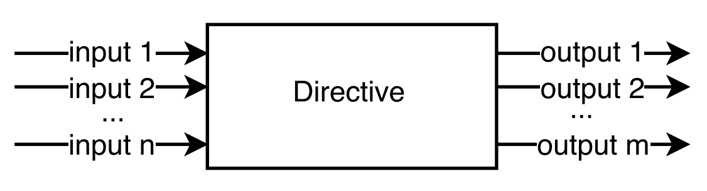
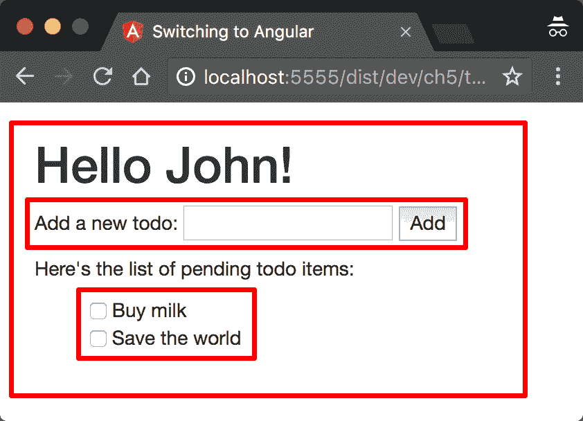
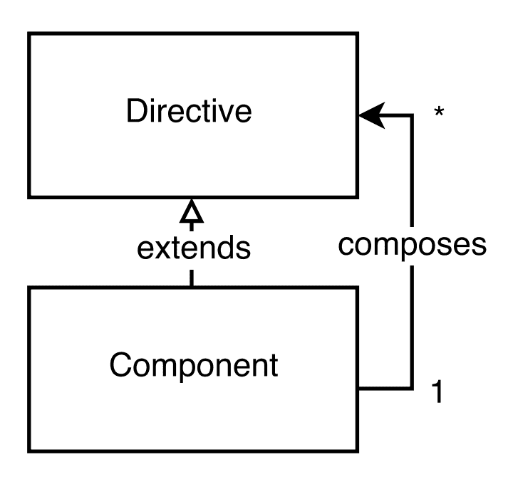
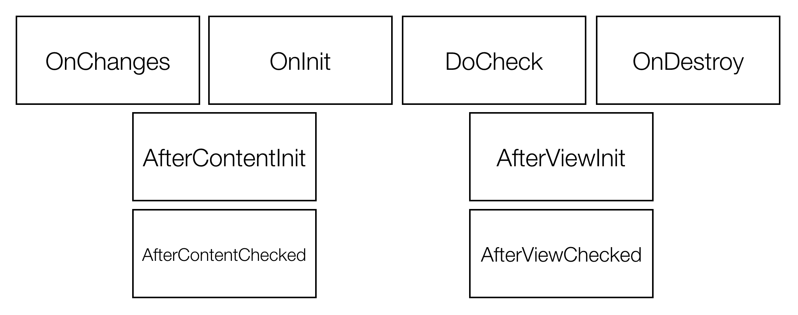

# Angular 组件和指令入门

到目前为止，我们已经熟悉了 Angular 为单页应用开发提供的核心构建块及其之间的关系。然而，我们只是触及了表面，通过介绍 Angular 概念背后的基本思想和它们定义的基本语法。在本章中，我们将深入探讨 Angular 的组件和指令。

在以下章节中，我们将涵盖以下主题：

+   使用 Angular 提供的构建块强制执行关注点分离

+   与 DOM 交互时适当使用指令或组件

+   探索内置指令并开发自定义指令

+   深入了解组件及其模板

+   内容投影

+   视图子元素与内容子元素

+   组件的生命周期

+   使用模板引用

+   配置 Angular 的变更检测

# Angular 中的 `"Hello world!"` 应用程序

现在，让我们在 Angular 和 TypeScript 中构建我们的第一个 `"Hello world!"` 应用程序。在我们开始之前，让我们设置我们的环境！

# 设置我们的环境

Angular 的核心团队为 Angular 开发了一个全新的 CLI 工具，它允许我们通过几个命令启动我们的应用程序。尽管我们将在最后一章介绍它，但在那之前，为了增强我们的学习体验，我们将使用位于 [`github.com/mgechev/switching-to-angular`](https://github.com/mgechev/switching-to-angular) 的代码。这个仓库包含本书中的所有示例，在一个大应用中。它声明了所有必需的依赖项在 `package.json` 中，定义了基本的 gulp 任务，如开发服务器、将我们的 TypeScript 代码转换为 ECMAScript 5 的转换，以及实时重新加载。

本书中的代码基于 Angular Seed ([`github.com/mgechev/angular-seed`](https://github.com/mgechev/angular-seed))。尽管该项目提供了一个坚实的基础，但它可能为 Angular 和 TypeScript 初学者引入了工具开销。一旦我们熟悉了 Angular 的基础知识，我强烈建议您使用官方的 Angular CLI 作为您第一个项目的起点，可在 [`github.com/angular/angular-cli`](https://github.com/angular/angular-cli) 找到。

为了设置 `switching-to-angular` 项目，您需要在您的计算机上安装 Git、Node.js v6.x.x 或更高版本，以及 `npm`。如果您安装了较旧的 Node.js 版本，我建议您查看 nvm（Node.js 版本管理器，可在 [`github.com/creationix/nvm`](https://github.com/creationix/nvm) 找到）或 n ([`www.npmjs.com/package/n`](https://www.npmjs.com/package/n))。使用这些工具，您将能够在您的计算机上拥有多个 Node.js 版本，并通过命令行使用单个命令在它们之间切换。

# 安装示例项目仓库

让我们先设置`switching-to-angular`项目。打开你的终端并输入以下命令：

```js
# Will clone the repository and save it to directory called
# switching-to-angular
$ git clone https://github.com/mgechev/switching-to-angular.git
$ cd switching-to-angular
$ npm install
```

第一行将`switching-to-angular`项目克隆到名为`switching-to-angular`的目录中；之后，我们进入该目录。

在能够运行种子项目之前，最后一步是使用`npm`安装所有必需的依赖项。这一步可能需要一段时间，这取决于你的网络连接，所以请耐心等待，不要中断它。如果你遇到任何问题，请不要犹豫，在[`github.com/mgechev/switching-to-angular/issues`](https://github.com/mgechev/switching-to-angular/issues)提出问题。

最后一步是启动开发服务器。为此，运行以下命令：

```js
$ npm start 
```

当转换过程完成后，你的浏览器将自动打开`http://localhost:5555/dist/dev` URL。你现在应该看到一个类似于以下截图的视图：



图 1

# 使用 Angular 和 TypeScript

现在，让我们玩一玩我们已有的文件。导航到`switching-to-angular`中的`app/ch5/hello-world`目录。然后，打开`app.ts`并将它的内容替换为以下片段：

```js
// ch5/hello-world/app.ts 

import {Component, NgModule} from '@angular/core';
import {BrowserModule} from '@angular/platform-browser';
import {platformBrowserDynamic} from '@angular/platform-browser-dynamic';

@Component({
  selector: 'my-app',
  templateUrl: './app.html'
})
class App {
  target: string;
  constructor() {
    this.target = 'world';
  }
}

@NgModule({
  declarations: [App],
  imports: [BrowserModule],
  bootstrap: [App],
})
class AppModule {}

platformBrowserDynamic().bootstrapModule(AppModule);
```

让我们逐行查看代码：

```js
import {Component, NgModule} from '@angular/core';
import {BrowserModule} from '@angular/platform-browser';
import {platformBrowserDynamic} from '@angular/platform-browser-dynamic';
```

最初，我们从`@angular/core`模块导入`@Component`和`@NgModule`装饰器，从`@angular/platform-browser`导入`BrowserModule`，以及从`@angular/platform-browser-dynamic`导入`platformBrowserDynamic`对象。稍后，我们使用`@Component`装饰`App`类。我们将一个对象字面量传递给`@Component`装饰器，其中引用了一个外部模板。

作为下一步，我们定义组件的视图。然而，请注意，在这种情况下，我们使用`templateUrl`而不是简单地内联组件的模板。

打开`app.html`并将文件的内容替换为`<h1>Hello {{target}}!</h1>`。由于我们可以通过内联（使用`template`）和设置其 URL（`templateUrl`）两种方式使用模板，从某种意义上说，组件的 API 与 AngularJS 指令的 API 相似。

在代码片段的最后一行，我们通过提供根模块来启动应用程序。

现在，让我们来看看`index.html`，以便了解当我们启动应用程序时会发生什么：

```js
<!-- ch5/hello-world/index.html --> 
<!DOCTYPE html> 
<html lang="en"> 
<head> 
  <meta charset="utf-8"> 
  <meta http-equiv="X-UA-Compatible" content="IE=edge"> 
  <title><%= TITLE %></title> 
  <meta name="description" content=""> 
  <meta name="viewport" content="width=device-width, initial-scale=1"> 
  <!-- inject:css --> 
  <!-- endinject --> 
</head> 
<body> 
  <my-app>Loading...</my-app> 
  <!-- inject:js --> 
  <!-- endinject --> 
  <%= INIT %> 
</body> 
</html> 
```

注意，在页面的主体中，我们使用带有内容和值为`"Loading..."`的文本节点的`my-app`元素。在应用程序初始化并渲染主组件之前，`"Loading..."`标签将是可见的。

`<%= INIT %>`和`<-- inject:js...`模板占位符注入针对个别演示的内容。它们不是 Angular 特定的，而是旨在防止由于它们之间的共享结构而在书籍附带的代码示例中重复代码。为了了解这个特定的 HTML 文件是如何被转换的，请打开`/dist/dev/ch5/hello-world/index.html`。

# 使用 Angular 指令

我们已经构建了简单的`"Hello world!"`应用。现在，让我们开始构建更接近真实应用的东西。在本节结束时，我们将拥有一个简单的应用，列出我们需要完成的任务，并在页面标题处向我们问候。

首先，让我们开发根组件。与前一个示例相比，我们需要进行的两个修改是将`target`属性重命名为`name`，并将`todos`列表添加到组件的控制定义中：

```js
// ch5/ng-for/detailed-syntax/app.ts 

import {Component, NgModule} from '@angular/core';
import {BrowserModule} from '@angular/platform-browser';
import {platformBrowserDynamic} from '@angular/platform-browser-dynamic';

@Component({
  selector: 'app',
  templateUrl: './app.html',
})
class App {
  todos: string[];
  name: string;
  constructor() {
    this.name = 'John';
    this.todos = ['Buy milk', 'Save the world'];
  }
}

@NgModule({
  declarations: [App],
  imports: [BrowserModule],
  bootstrap: [App],
})
class AppModule {}

platformBrowserDynamic().bootstrapModule(AppModule);
```

唯一剩下的事情是更新模板以消费提供的数据。我们已经熟悉了 AngularJS 中的`ng-repeat`指令。它允许我们使用微语法遍历一个项目列表，该微语法随后被 AngularJS 解释。

然而，这个指令的语义还不够充分，因此很难构建执行静态代码分析并帮助我们改进开发体验的工具。由于`ng-repeat`指令非常有用，Angular 保留了这一想法，并通过在其之上引入更多的语义来进一步改进它，以允许更复杂的工具。它允许 IDE 和文本编辑器执行更好的静态代码分析。这种支持将防止我们在编写的代码中犯拼写错误，并允许我们拥有更流畅的开发体验。

在`app.html`中添加以下内容：

```js
<!-- ch5/ng-for/detailed-syntax/app.html --> 

<h1>Hello {{name}}!</h1> 
<p> 
  Here's a list of the things you need to do: 
</p> 
<ul> 
  <ng-template ngFor let-todo [ngForOf]="todos"> 
    <li>{{todo}}</li> 
  </ng-template> 
</ul> 
```

注意，在 Angular 2.x.y 版本中，框架使用的是`template`而不是`ng-template`。由于`template`元素在 Angular 的上下文中的语义与其在 HTML 标准上下文中的语义不同，在 Angular 的第四版中，`template`元素被弃用并重命名为`ng-template`。

现在，当你刷新浏览器后，你应该看到以下结果：



图 2

到目前为止，一切顺利！在最后的代码片段中，唯一剩下要解释的新特性是`ng-template`元素的一些我们不熟悉的属性，例如`ngFor`、`let-todo`和`[ngForOf]`。让我们来看看它们。

# ngFor 指令

`ngFor`指令允许我们遍历一个项目集合，不仅完全实现了 AngularJS 中的`ng-repeat`的功能，还带来了一些额外的语义。请注意，`ngForOf`属性被括号包围。起初，这些括号可能看起来像是无效的 HTML。然而，根据 HTML 规范，它们在属性名称中使用是允许的。W3C 验证器唯一会抱怨的是，`ng-template`元素并不拥有这样的属性；然而，浏览器在处理标记时不会有问题。

这些括号背后的语义是，它们包围的属性的值是一个表达式，需要被评估。

# 指令语法语义的改进

在第二章“开始使用 Angular”中，我们提到了在 Angular 中改进工具的机会。AngularJS 的一个大问题是我们可以使用指令的不同方式。这需要理解属性值，这些值可以是字面量、表达式、回调或微语法。在 Angular 中，通过引入一些简单且内置于框架中的约定来解决这个问题：

+   `propertyName="value"`

+   `[propertyName]="expression"`

+   `(eventName)="handler()"`

在第一行中，`propertyName`属性接受一个字符串字面量作为值。Angular 不会进一步处理属性值；它将以模板中设置的方式使用它。

第二种语法`[propertyName]="expression"`向 Angular 提供了一个提示，即属性的值应该被处理为一个表达式。当 Angular 发现被括号包围的属性时，它将在与模板关联的组件的上下文中解释该表达式。简而言之，如果我们想要设置一个非字符串值或表达式的结果作为给定属性的值，我们需要使用这种语法。

之前的例子展示了我们如何绑定到事件。`(eventName)="handler()"`后面的语义是，每当触发具有`eventName`名称的事件时，我们希望调用`handler()`表达式。

我们将在本章后面讨论更多示例。

Angular 提供了一个替代的规范语法，允许我们定义元素的绑定而不使用括号。例如，属性绑定可以使用以下代码表示：`<input [value]="foo">`。它也可以用以下方式表示：`<input bind-value="foo">`。同样，我们可以使用以下代码表示事件绑定：`<button (click)="handle()">Click me</button>`。它们也可以用以下方式表示：`<button on-click="handle()">Click me</button>`。

# 在模板内部声明变量

前一个模板留下的最后一件事是`let-todo`属性。使用这种语法，我们告诉 Angular 我们想要声明一个名为`todo`的新变量，并将其绑定到从评估设置为`[ngForOf]`值的表达式所得到的集合中的各个项。

# 在模板中使用语法糖

虽然模板语法给我们所使用的 IDE 或文本编辑器提供了代码的意义，但它相当冗长。Angular 提供了一个替代语法，它将被转换为前面片段中显示的语法。

有一些 Angular 指令需要`ng-template`元素，例如`ngForOf`、`ngIf`和`ngSwitch`。由于这些指令经常使用，因此存在它们的替代语法。我们不需要显式地键入整个`ng-template`元素，只需在指令前加上`*`前缀即可。这将允许我们更改`ngForOf`指令的语法使用，如下所示：

```js
<!-- ch5/ng-for/syntax-sugar/app.html --> 

<ul> 
  <li *ngFor="let todo of todos">{{todo}}</li> 
</ul> 
```

之后，Angular 将这个模板转换为前面描述的更冗长的语法。由于更简洁的语法更容易阅读和编写，其使用被认为是最佳实践。

`*` 字符允许我们移除 `ng-template` 元素，并将指令直接放在 `ng-template` 元素的顶级子元素上（在先前的示例中，是 `li` 列表项）。

# 定义 Angular 指令

现在我们已经构建了一个简单的 Angular 组件，让我们继续我们的旅程，通过理解 Angular 指令来继续前进。

使用 Angular 指令，我们可以在 DOM 上应用不同的行为或结构变化。在这个例子中，我们将构建一个简单的提示指令。

与组件相比，指令没有模板。这两个概念之间的另一个核心区别是，给定的 HTML 元素可能只有一个组件，但可以有多个指令。换句话说，与实际元素相比，指令增强了元素。

Angular 的官方风格指南建议使用带有命名空间的指令作为属性。考虑到这一点，我们将在以下方式中使用提示指令：

```js
<div saTooltip="Hello world!"></div> 
```

在先前的片段中，我们在 `div` 元素上使用了提示指令。作为一个命名空间，其选择器使用 `sa` 字符串。

由于本书的重点是高效直观地学习 Angular 的概念，代码片段可能不完全符合 Angular 风格指南。然而，对于生产应用程序，遵循最佳实践是至关重要的。您可以在 [`angular.io/styleguide`](https://angular.io/styleguide) 找到官方 Angular 风格指南。

现在，让我们开发一个提示指令！在实现它之前，我们需要从 `@angular/core` 中导入几个符号。打开一个名为 `app.ts` 的新 TypeScript 文件，并输入以下内容；我们稍后会填充占位符：

```js
import {Directive, ElementRef, HostListener...} from '@angular/core'; 
```

在上一行中，我们导入了以下定义：

+   `ElementRef`: 这允许我们将元素引用（我们不仅限于 DOM）注入到指令的宿主元素中。在先前的示例用法中，作为 `ElementRef`，我们将得到一个 Angular 包装的 `div` 元素，它包含 `saTooltip` 属性。

+   `Directive`: 这个装饰器允许我们添加我们定义的新指令所需的元数据。

+   `HostListener(eventname)`: 这是一个方法装饰器，它接受一个事件名称作为参数。在指令初始化期间，Angular 会将装饰的方法添加为对宿主元素发出的 `eventname` 事件的处理器。

让我们看看指令的实现：

```js
// ch5/tooltip/app.ts 

@Directive({
  selector: '[saTooltip]'
})
export class Tooltip {
  @Input() saTooltip:string;

  constructor(private el: ElementRef, private overlay: Overlay) {
    this.overlay.attach(el.nativeElement);
  }

  @HostListener('mouseenter')
  onMouseEnter() {
    this.overlay.open(this.el, this.saTooltip);
  }

  @HostListener('mouseleave')
  onMouseLeave() {
    this.overlay.close();
  }
}
```

# 设置指令的输入

在前面的代码示例中，我们使用 `saTooltip` 选择器声明了一个指令。请注意，Angular 的 HTML 编译器是区分大小写的，这意味着它会将 `[satooltip]` 和 `[saTooltip]` 作为不同的选择器区分开来。之后，我们通过在 `saTooltip` 属性上使用 `@Input` 装饰器来声明指令的输入。此代码背后的语义是，我们声明了一个名为 `saTooltip` 的属性，并将其绑定到传递给 `saTooltip` 属性的表达式评估结果值。

`@Input` 装饰器接受一个单一参数，即我们想要绑定的属性的名称。如果我们没有传递参数，Angular 将在属性本身具有相同名称的属性之间创建绑定。我们将在本章的后面详细解释输入和输出概念。

# 理解指令的构造函数

构造函数声明了两个私有属性：`el` 是 `ElementRef` 类型，`overlay` 是 `Overlay` 类型。`Overlay` 类实现了管理提示框覆盖的逻辑，并将通过 Angular 的 DI 机制进行注入。为了将其声明为可注入的，我们需要以下方式声明顶级组件：

```js
@Component({ 
  selector: 'app', 
  templateUrl: './app.html', 
  providers: [Overlay], 
  // ... 
}) 
class App {} 
```

我们将在下一章中探讨 Angular 的依赖注入机制，我们将解释如何声明我们的服务、指令和组件的依赖关系。对于本章的目的而言，`Overlay` 类的实现并不重要。然而，如果你对此感兴趣，可以在 `ch5/tooltip/app.ts` 中找到它。

# 使用 NgModules 更好地封装指令

为了使提示指令对 Angular 编译器可用，我们需要显式声明我们打算在哪里使用它。例如，查看 `AppModule` 类在 `ch5/tooltip/app.ts` 中的情况：

```js
@NgModule({
  declarations: [Tooltip, App],
  providers: [Overlay],
  imports: [BrowserModule],
  bootstrap: [App],
})
class AppModule {}
```

我们将一个对象字面量传递给 `@NgModule` 装饰器，该对象字面量具有 `declarations` 属性。此属性包含了一个列表，其中包含了所有将在 `bootstrap` 数组中列出的任何组件的根组件的所有子组件中可用的指令。另一种扩展可用指令列表的方法是导入一个模块。例如，`BrowserModule` 模块包含了一些在浏览器环境中非常常用的指令。

起初，你可能觉得必须显式声明模块中使用的所有指令可能会很烦人；然而，这强制了更好的封装。在 AngularJS 中，所有指令都在一个全局命名空间中。这意味着在应用程序中定义的所有指令都可以在所有模板中访问。这带来了一些问题，例如名称冲突。为了处理这个问题，我们经常引入命名约定，例如，AngularJS 定义的指令都使用 `"ng-"` 前缀，而所有随 Angular UI 一起提供的指令都使用 `"ui-"`。

目前，通过显式声明给定模块中使用的所有指令，我们为各个组件的子树创建一个特定的命名空间（即，指令将对给定的根组件及其所有后续组件可见）。防止名称冲突不是我们得到的唯一好处；它还帮助我们提高我们产生的代码的语义性，因为我们总是知道给定组件在哪个模块中声明时可以访问哪些指令。我们可以通过从组件到顶级模块的路径找到给定组件的所有可访问指令，并取所有`declarations`和模块的`imports`声明的并集。鉴于组件是从指令扩展的，我们需要显式声明所有使用的组件。

`BrowserModule`模块通过导出包含它们的`CommonModule`模块来导出 Angular 提供的内置指令。这个预定义指令列表包括`NgClass`、`NgFor`、`NgIf`、`NgStyle`、`NgSwitch`、`NgSwitchWhen`和`NgSwitchDefault`。它们的名字相当直观；我们将在本章后面看看我们如何使用其中的一些。

# 使用 NgModules 声明可重用组件

使用 NgModules，我们可以实现良好的封装度。通过显式导出公共组件、指令、管道和服务，我们可以隐藏我们模块的一些实现细节。这样，我们可以实现可重用模块，仅暴露它们的公共接口，并且不对模块用户透露任何底层组件。

为了更好地理解，让我们看一下以下示例：

```js
@Component(...)
class ZippyHeader {
  @Input() header: string;
}

@Component(...)
class Zippy {
  @Input() header: string;
  visible = true;
}

@Component(...)
class App {}
```

在前面的代码片段中，我们声明了`Zippy`、`ZippyHeader`和`App`组件。`Zippy`是一个具有标题和内容的组件；我们可以通过点击标题来切换内容的可见性。在`ZippyHeader`组件中，我们可以实现一些逻辑来处理点击事件和/或可视化标题。在`App`组件中，我们通过传递文本作为其标题和内容来使用`Zippy`组件，如下所示：

```js
<zippy header="Header">
  <content>Lorem Ipsum</content>
</zippy>
```

为了创建一个可工作的 Angular 应用程序，我们需要声明一个`NgModule`装饰器，它以某种方式引用所有三个组件。我们可以通过两种主要方式来处理这个问题：

1.  声明一个单独的`NgModule`装饰器，并将所有三个组件包含在其声明列表中。

1.  声明两个 NgModules：

+   声明`Zippy`和`ZippyHeader`组件，称为`ZippyModule`

+   另一个声明`App`组件并导入`ZippyModule`模块的例子

第二种方法有几个优点：在`ZippyModule`中，我们可以声明`Zippy`和`ZippyHeader`，但只能导出`Zippy`，因为`ZippyHeader`是在`Zippy`内部使用的，我们不需要将其暴露给用户。通过声明`ZippyModule`模块，我们可以将其导入到我们的应用程序中的其他模块，以便重用`Zippy`组件，或者甚至将其提取为单独的`npm`模块，在多个应用程序中重用。

第二种方法看起来是这样的：

```js
// ch5/zippy/app.ts

@Component(...)
class ZippyHeader {...}

@Component(...)
class Zippy {...}

@NgModule({
  declarations: [Zippy, ZippyHeader],
  exports: [Zippy]
  imports: [CommonModule],
})
class ZippyModule {}

@Component(...)
class App {...}

@NgModule({
  imports: [BrowserModule, ZippyModule],
  declarations: [App],
  bootstrap: [App]
})
class AppModule {}

platformBrowserDynamic().bootstrapModule(AppModule);
```

在示例中，在`ZippyModule`模块中，我们声明了`Zippy`和`ZippyHeader`，但只导出`Zippy`。我们还从`@angular/common`中导入`CommonModule`模块，以便重用 Angular 的内置指令（例如，`NgIf`由`CommonModule`导出）。

在`AppModule`类中，我们只需要导入`ZippyModule`，这样我们就能使用其所有导出和提供者。我们将在下一章进一步讨论提供者。

注意，良好的实践建议我们应该将每个单独的组件实现到单独的文件中。为了简化本书的示例，我们违反了这一实践。有关最佳实践的列表，请访问[`angular.io/styleguide`](https://angular.io/styleguide)。

# 使用自定义元素模式

现在，假设我们想在页面上添加一个计时器并重用我们已构建的 Web 组件。在这种情况下，我们的应用程序可能看起来像这样：

```js
//  ch5/custom-element/app.ts

import {Component, NgModule} from '@angular/core';
import {BrowserModule} from '@angular/platform-browser';
import {platformBrowserDynamic} from '@angular/platform-browser-dynamic';

@Component({
  selector: 'my-app',
  template: `
    <h1>Hello {{name}}</h1>
    The current timeout is <simple-timer></simple-timer>
  `
})
class App {
  name: string = 'John Doe';
}

@NgModule({
  imports: [BrowserModule],
  declarations: [App],
  bootstrap: [App]
})
class AppModule {}

platformBrowserDynamic().bootstrapModule(AppModule);
```

现在，如果我们运行我们的应用程序，我们会得到以下错误：



图 3

当 Angular 解析`App`组件的模板时，它会找到`<simple-timer></simple-timer>`。它不是由 HTML 规范定义的元素，也不匹配`AppModule`类中声明或导入的任何指令的选择器，因此框架将抛出错误。

那么，我们如何使用 Angular 与自定义组件呢？解决方案是使用我们传递给`@NgModule`的对象字面量的`schemas`属性：

```js
import {..., CUSTOM_ELEMENTS_SCHEMA} from '@angular/core';

//...

@NgModule({
  imports: [BrowserModule],
  declarations: [App],
  schemas: [CUSTOM_ELEMENTS_SCHEMA],
  bootstrap: [App]
})
class AppModule {}
```

这样，我们改变了 Angular 在解析元素及其属性时用于验证的默认模式。

默认情况下，如果框架发现一个不匹配任何导入或声明的指令元素选择器，或者由 HTML5 规范定义的元素的元素，它将抛出错误。

# 创建自定义 Angular 组件

现在，让我们构建一个简单的待办事项应用程序，以演示定义组件的语法。

我们的任务项将具有以下格式：

```js
interface Todo { 
  completed: boolean; 
  label: string; 
} 
```

让我们先导入我们将需要的所有内容：

```js
import {Component, NgModule, ViewEncapsulation} from '@angular/core'; 
//...
```

现在，让我们声明组件及其相关的元数据：

```js
@Component({ 
  selector: 'todo-app', 
  templateUrl: './app.html', 
  styles: [ 
    `ul li { 
      list-style: none; 
    } 
    .completed { 
      text-decoration: line-through; 
    }` 
  ], 
  encapsulation: ViewEncapsulation.Emulated 
}) 
```

在这里，我们指定 `Todo` 组件的选择器将是 `todo-app` 元素。稍后，我们添加模板 URL，它指向 `app.html` 文件。之后，我们使用 `styles` 属性；这是我们第一次遇到它。从其名称可以猜测，它用于设置组件的样式。最后，我们添加 `encapsulation`。这是 Angular 的一项功能，它允许我们控制定义的样式的范围。

# 介绍组件的视图封装

如我们所知，Angular 受到 Web 组件的启发，其核心特性是 Shadow DOM。Shadow DOM 允许我们在不使其泄漏到组件范围之外的情况下封装我们的 Web 组件的样式；Angular 提供了这一功能。如果我们希望 Angular 使用 Shadow DOM，我们可以使用 `ViewEncapsulation.Native`。然而，在撰写本书时，并非所有浏览器都支持 Shadow DOM；如果我们想在不使用 Shadow DOM 的情况下达到相同的封装级别，我们可以将封装属性的值设置为 `ViewEncapsulation.Emulated`。

如果我们不想有任何封装，我们可以使用 `ViewEncapsulation.None`。默认情况下，渲染器使用 `Emulated` 类型的封装。

# 实现组件的控制器

现在，让我们继续实现应用程序：

```js
// ch5/todo-app/app.ts 
class TodoCtrl { 
  todos: Todo[] = [{ 
    label: 'Buy milk', 
    completed: false 
  }, { 
    label: 'Save the world', 
    completed: false 
  }];
  name: string = 'John'; 

  addTodo(label) { ... }

  removeTodo(idx) { ... } 

  toggleCompletion(idx) { ... } 
} 
```

这是与 `Todo` 应用程序模板关联的控制器实现的一部分。在类声明中，我们将 `todos` 属性初始化为一个包含两个 `todo` 项的数组。

现在，让我们更新模板并渲染这些项。这是如何完成的：

```js
<ul> 
  <li *ngFor="let todo of todos; let index = index" [class.completed]="todo.completed"> 
    <input type="checkbox" [checked]="todo.completed" 
      (change)="toggleCompletion(index)"> 
    {{todo.label}} 
  </li> 
</ul> 
```

在模板中，我们遍历控制器中 `todos` 属性内的所有 `todo` 项。对于每个 `todo` 项，我们创建一个可以切换项完成状态的复选框；我们还使用插值指令渲染 `todo` 项的标签。在这里，我们可以注意到之前解释过的语法：

+   我们使用 `(change)="statement"` 绑定到复选框的更改事件。

+   我们使用 `[checked]="expr"` 绑定到 `todo` 项的属性。

为了在完成的 `todo` 项上有一条横线，我们绑定到元素的 `class.completed` 属性。由于我们希望将 `completed` 类应用到所有完成的待办事项上，我们使用 `[class.completed]="todo.completed"`。这样，我们声明我们希望根据 `todo.completed` 表达式的值来应用 `completed` 类。现在，我们的应用程序看起来是这样的：



图 4

与类绑定语法类似，Angular 允许我们绑定到元素的样式和属性。例如，我们可以使用以下代码行绑定到 `td` 元素的 `colspan` 属性：`<td [attr.colspan]="colspanCount"></td>`。同样，我们可以使用 `<div [style.backgroundImage]="expression"></td>` 绑定到任何 `style` 属性。

# 处理用户操作

到目前为止，一切顺利！现在，让我们实现 `toggleCompletion` 方法。该方法接受待办事项的索引作为参数：

```js
toggleCompletion(idx) { 
  let todo = this.todos[idx]; 
  todo.completed = !todo.completed; 
} 
```

在 `toggleCompletion` 中，我们只是简单地切换与当前待办事项关联的 `completed` 布尔值，该值由传递给方法的方法参数指定的索引指定。

现在，让我们添加一个文本输入来添加新的待办事项：

```js
<p> 
  Add a new todo: 
  <input #newtodo type="text"> 
  <button (click)="addTodo(newtodo.value); newtodo.value = ''"> 
    Add 
  </button> 
</p> 
```

在这里定义的新变量名为 `newtodo`。现在，我们可以在模板内部使用 `newtodo` 标识符来引用输入元素。一旦用户点击按钮，控制器中定义的 `addTodo` 方法将被调用，并将 `newtodo` 输入的值作为参数。在传递给 `(click)` 属性的语句中，我们还将 `newtodo` 输入的值重置为空字符串。

注意，直接操作 DOM 元素不被认为是最佳实践，因为它将阻止我们的组件在浏览器环境之外正确运行。我们将在第九章中解释如何将此应用程序迁移到 web workers，*工具和开发经验*。

现在，让我们定义 `addTodo` 方法：

```js
addTodo(label) { 
  this.todos.push({ 
    label, 
    completed: false 
  }); 
} 
```

在其中，我们使用对象字面量语法创建一个新的待办事项。

在我们的应用程序中，剩下要做的就是实现现有待办事项的删除。由于它与切换待办事项完成状态的功能非常相似，我将将其实现留给读者作为一个简单的练习。

# 使用输入和输出

通过重构我们的 `todo` 应用程序，我们将展示如何利用指令的输入和输出：



图 5

我们可以将输入视为给定指令接受的属性（甚至参数）。输出可以被视为它触发的事件。当我们使用第三方库提供的指令时，我们主要关心其输入和输出，因为它们定义了其 API。

输入指的是参数化指令行为和/或视图的值。另一方面，输出指的是当发生特殊事件时指令触发的事件。

# 确定输入和输出

现在，让我们将我们的单体待办事项应用程序分解成相互通信的单独组件。在下面的屏幕截图中，您可以查看各个组件，当它们组合在一起时，实现了应用程序的功能：



图 6

外部矩形表示整个 `Todo` 应用程序。第一个嵌套矩形包含负责输入新待办事项标签的组件，下面的矩形列出了存储在根组件中的单个项目。

说了这么多，我们可以将这些三个组件定义为以下内容：

+   `TodoApp`：负责维护待办事项列表（添加新项目和切换完成状态）。

+   `InputBox`：这个组件负责输入新的待办事项的标签。它有以下输入和输出：

    +   输入：文本框的占位符和提交按钮的标签

    +   输出：提交按钮点击后文本框的内容

+   `TodoList`：这个组件负责渲染单个待办事项。它有以下输入和输出：

    +   输入：这是一个待办事项列表

    +   输出：这是待办事项的完成状态

现在，让我们开始实现！

# 定义输入和输出

让我们采用自下而上的方法，从`InputBox`组件开始。在此之前，我们需要从 Angular 的`@angular/core`包中导入几个组件：

```js
import { 
  Component, 
  Input, 
  Output, 
  EventEmitter 
} from '@angular/core'; 
```

在这个片段中，我们导入了`@Component`、`@Input`、`@Output`装饰器和`EventEmitter`类。正如它们的名称所表明的，`@Input`和`@Output`用于声明指令的输入和输出。`EventEmitter`是一个泛型类（即接受类型参数），当与用`@Output`装饰的属性结合使用时，允许它们`emit`值。

作为下一步，让我们看看`InputBox`组件的声明：

```js
// ch5/inputs-outputs/app.ts 

@Component({ 
  selector: 'text-input', 
  template: ` 
    <input #todoInput [placeholder]="inputPlaceholder"> 
    <button (click)="emitText(todoInput.value); 
                     todoInput.value = '';"> 
      {{buttonLabel}} 
    </button> 
  ` 
}) 
class InputBox {...} 
```

注意，在模板中，我们声明一个文本输入，并使用`todoInput`标识符保持对其的引用，并将其占位符属性设置为从`inputPlaceholder`标识符评估得到的值。这是我们需要声明的第一个输入：

```js
class InputBox { 
  @Input() inputPlaceholder: string; 
  ... 
} 
```

同样，我们声明`buttonLabel`组件的其他输入，我们将其用作按钮标签的值：

```js
class InputBox { 
  @Input() inputPlaceholder: string; 
  @Input() buttonLabel: string; 
  ... 
} 
```

在前面的模板中，我们将按钮的点击事件绑定到`emitText(todoInput.value); todoInput.value = '';`语句。`emitText`方法应该在组件的控制器中定义；一旦调用，它应该`emit`文本输入的值。以下是实现此行为的方法：

```js
class InputBox { 
  ... 
  @Output() inputText = new EventEmitter<string>();

  emitText(text: string) { 
    this.inputText.emit(text); 
  } 
} 
```

初始时，我们声明一个名为`inputText`的输出。作为其值，我们设置一个我们创建的`EventEmitter<string>`类型的新实例。

注意，所有组件的所有输出都需要是`EventEmitter`的实例。

在`emitText`方法内部，我们调用`inputText`的`emit`方法，并将其作为参数传递文本输入的值。

现在，让我们以同样的方式定义`TodoList`组件：

```js
@Component(...) 
class TodoList { 
  @Input() todos: Todo[]; 
  @Output() toggle = new EventEmitter<Todo>();
  toggleCompletion(index: number) { 
    let todo = this.todos[index]; 
    this.toggle.emit(todo); 
  } 
} 
```

由于传递给`@Component`装饰器的对象字面量的值对于本节的目的不是必需的，所以我们省略了它。这个示例的完整实现可以在`ch5/inputs-outputs/app.ts`中找到。让我们看看`TodoList`类的主体。同样，与`InputBox`组件一样，我们定义了`todos`输入。我们还通过声明`toggle`属性，将其值设置为`EventEmitter<Todo>`类型的新实例，并用`@Output`装饰器装饰它来定义`toggle`输出。

# 传递输入和消费输出

现在，让我们将上一节中定义的组件组合起来，实现完整的应用程序。

我们需要查看的最后一个组件是`TodoApp`：

```js
@Component({ 
  selector: 'todo-app',
  template: ` 
    <h1>Hello {{name}}!</h1> 

    <p> 
      Add a new todo: 
      <input-box inputPlaceholder="New todo..." 
        buttonLabel="Add" 
        (inputText)="addTodo($event)"> 
      </input-box> 
    </p> 

    <p>Here's the list of pending todo items:</p> 
    <todo-list [todos]="todos" (toggle)="toggleCompletion($event)"></todo-list> 
  ` 
}) 
class TodoApp {...} 
```

初始时，我们定义`TodoApp`类并用`@Component`装饰器装饰它。注意，为了使用`InputBox`和`TodoList`组件，我们需要将它们包含在声明`TodoApp`的模块的`declarations`属性中。这些组件如何协作的魔法发生在模板中：

```js
<input-box inputPlaceholder="New todo..." 
  buttonLabel="Add" 
  (inputText)="addTodo($event)"> 
</input-box> 
```

首先，我们使用`InputBox`组件并将值传递给`inputPlaceholder`和`buttonLabel`输入。注意，就像我们之前看到的，如果我们想将这些值作为表达式传递给任何这些输入，我们需要用括号包围它们（即`[inputPlaceholder]="expression"`）。在这种情况下，表达式将在拥有模板的组件的上下文中进行评估，并将结果作为输入传递给拥有给定属性的组件。

在传递`buttonLabel`输入的值之后，我们通过将`(inputText)`属性的值设置为`addTodo($event)`表达式来消费`inputText`输出。`$event`的值将等于我们在`InputBox`的`emitText`方法内部传递给`emit`方法的`inputText`对象的值（如果我们绑定到原生事件，事件对象的值将是原生事件对象本身）。

同样地，我们传递`TodoList`组件的输入并处理其切换输出。现在，让我们定义`TodoApp`组件背后的逻辑：

```js
class TodoApp { 
  todos: Todo[] = []; 
  name: string = 'John';

  addTodo(label: string) { 
    this.todos.push({ 
      label, 
      completed: false 
    }); 
  }

  toggleCompletion(todo: Todo) { 
    todo.completed = !todo.completed; 
  } 
} 
```

在`addTodo`方法中，我们只是简单地将一个新的待办事项推送到`todos`数组。`toggleCompletion`的实现甚至更简单：我们切换作为待办事项参数传递的完成标志的值。现在，我们已经熟悉了组件的输入和输出的基础知识。

# 事件冒泡

在 Angular 中，我们有与 DOM 中相同的冒泡行为。例如，假设我们有以下模板：

```js
<input-box inputPlaceholder="New todo..." 
  buttonLabel="Add" 
  (click)="handleClick($event)" 
  (inputText)="addTodo($event)"> 
</input-box> 
```

`input-box`组件的模板声明看起来是这样的：

```js
<input #todoInput [placeholder]="inputPlaceholder"> 
<button (click)="emitText(todoInput.value); 
                 todoInput.value = '';"> 
  {{buttonLabel}} 
</button> 
```

当用户点击`input-box`组件模板中定义的按钮时，将评估`handleClick($event)`表达式。

此外，`handleClick`的第一个参数的`target`属性将是按钮本身，但`currentTarget`属性将是`input-box`元素。如果不使用 Angular，事件将以相同的方式冒泡。在某个时刻，它将到达文档，除非在传播过程中某个处理程序没有停止其传播。

相反，如果我们有一个自定义的`@Output`装饰器，事件将不会冒泡，并且`$event`变量的值将是我们传递给输出`emit`方法的值，而不是 DOM 事件对象。

# 重命名输入和输出

现在，我们将探讨如何重命名指令的输入和输出。假设我们有以下`TodoList`组件的定义：

```js
class TodoList { 
  ... 
  @Output() toggle = new EventEmitter<Todo>();

  toggle(index: number) { 
    ... 
  } 
} 
```

组件的输出称为 `toggle`；处理切换复选框以切换单个待办事项完成状态的方法也称为 `toggle`。由于在 `TodoList` 控制器中我们有两个相同命名的标识符，这段代码将无法编译。我们有两个选择：

+   我们可以重命名方法

+   我们可以重命名属性

如果我们重命名属性，这将同时改变组件输出的名称。因此，以下代码行将不再工作：

```js
<todo-list [toggle]="foobar($event)"...></todo-list> 
```

我们可以做的替代方法是重命名 `toggle` 属性，并使用 `@Output` 装饰器显式设置输出的名称：

```js
class TodoList { 
  ... 
  @Output('toggle') toggleEvent = new EventEmitter<Todo>();

  toggle(index: number) { 
    ... 
  } 
} 
```

这样，我们将能够通过 `toggleEvent` 属性触发 `toggle` 输出。

注意，这样的重命名可能会造成混淆，并且不被视为最佳实践。有关最佳实践的完整集合，请访问 [`angular.io/styleguide`](https://angular.io/styleguide)。

类似地，我们可以使用以下代码片段重命名组件的输入：

```js
class TodoList { 
  @Input('todos') todoList: Todo[]; 
  @Output('toggle') toggleEvent = new EventEmitter<Todo>();

  toggle(index: number) { 
    ... 
  } 
} 
```

现在，我们重命名了 `TodoList` 的输入和输出属性并不重要；它仍然具有相同的公共接口：

```js
<todo-list [todos]="todos" 
  (toggle)="toggleCompletion($event)"> 
</todo-list> 
```

# 定义输入和输出的替代语法

`@Input` 和 `@Output` 装饰器是为了更方便地声明指令的 `inputs` 和 `outputs` 而提供的语法糖。用于此目的的原生语法如下：

```js
@Directive({ 
  outputs: ['outputName: outputAlias'], 
  inputs: ['inputName: inputAlias'] 
}) 
class Dir { 
  outputName = new EventEmitter(); 
}
```

使用 `@Input` 和 `@Output`，前面的语法等同于以下语法：

```js
@Directive(...) 
class Dir { 
  @Output('outputAlias') outputName = new EventEmitter<any>(); 
  @Input('inputAlias') inputName: any;
} 
```

虽然两者具有相同的语义，但根据最佳实践，我们应该使用后者，因为它更容易阅读和理解。

# 解释 Angular 的内容投影

内容投影是开发用户界面时的重要概念。它允许我们将内容片段投影到我们应用程序用户界面的不同位置。网络组件通过 `content` 元素解决这个问题。在 AngularJS 中，它通过臭名昭著的转包含实现。

Angular 受到现代网络标准的启发，特别是网络组件，这导致了那里使用的一些内容投影方法的采用。在本节中，我们将使用 `ng-content` 指令在 Angular 的上下文中查看它们。

# Angular 中的基本内容投影

假设我们正在构建一个名为 `fancy-button` 的组件。此组件将使用标准的 HTML 按钮元素并添加一些额外的行为。以下是 `fancy-button` 组件的定义：

```js
@Component({ 
  selector: 'fancy-button', 
  template: '<button>Click me</button>' 
}) 
class FancyButton { ... } 
```

在 `@Component` 装饰器内部，我们设置组件的内联模板及其选择器。现在，我们可以使用以下标记来使用该组件：

```js
<fancy-button></fancy-button> 
```

在屏幕上，我们将看到一个带有 `Click me` 内容标签的标准 HTML 按钮。这不是定义可重用 UI 组件的非常灵活的方式。很可能会看到，fancy 按钮的用户需要根据他们的应用程序更改标签的内容。

在 AngularJS 中，我们能够通过 `ng-transclude` 实现此结果：

```js
// AngularJS example 
app.directive('fancyButton', function () { 
  return { 
    restrict: 'E', 
    transclude: true, 
    template: '<button><ng-transclude></ng-transclude></button>' 
  }; 
}); 
```

在 Angular 中，我们有`ng-content`元素：

```js
// ch5/ng-content/app.ts 
@Component({ 
  selector: 'fancy-button', 
  template: '<button><ng-content></ng-content></button>' 
}) 
class FancyButton { /* Extra behavior */ } 
```

现在，我们可以通过执行以下操作将自定义内容传递给花哨的按钮：

```js
<fancy-button>Click <i>me</i> now!</fancy-button> 
```

因此，在`fancy-button`标签的开启和关闭标签之间的内容将被放置在`ng-content`指令所在的位置。

# 投影多个内容块

内容投影的另一个典型用例是我们将内容传递给自定义 Angular 组件或 AngularJS 指令，并且我们希望将内容的不同部分投影到模板的不同位置。

例如，假设我们有一个具有标题和主体的`panel`组件，我们可以按以下方式使用它：

```js
<panel>
  <section class="panel-title">Sample title</section>
  <section class="panel-content">Content</section>
</panel>
```

我们`panel`组件的模板看起来像这样：

```js
<div class="panel"> 
  <div class="panel-title"> 
    <!-- Project the content of panel-title here --> 
  </div> 
  <div class="panel-content"> 
    <!-- Project the content of panel-content here --> 
  </div> 
</div>` 
```

在 AngularJS 1.5 中，我们可以通过使用多插槽转义来实现这一点，这是为了使我们能够更平滑地过渡到 Angular。让我们看看我们如何在 Angular 中定义这样的`panel`组件：

```js
// ch5/ng-content/app.ts 
@Component({ 
  selector: 'panel', 
  styles: [ ... ], 
  template: ` 
    <div class="panel"> 
      <div class="panel-title"> 
        <ng-content select=".panel-title"></ng-content> 
      </div> 
      <div class="panel-content"> 
        <ng-content select=".panel-content"></ng-content> 
      </div> 
    </div>` 
}) 
class Panel { } 
```

在模板中，我们有一个具有`panel`类的`div`元素，它分别包裹着两个嵌套的`div`元素——一个用于`panel`的标题，一个用于`panel`的内容。

为了将具有`panel-title`类名的`section`元素的内容投影到标题应该出现的位置，我们需要使用`ng-content`元素。作为其`selector`属性，我们需要使用一个 CSS 选择器，该选择器匹配我们想要投影内容的元素（在这种情况下，选择器应该是`.panel-title`或`section.panel-title`）。

如果我们将`selector`属性的值设置为`.panel-title`，它将匹配所有位于目标`panel`元素内部的具有`.panel-title`类的元素。之后，`ng-content`将获取它们的内容并将它们设置为它自己的内容。

# 嵌套组件

我们已经构建了一些简单的应用程序，这些应用程序是由组件和指令组成的。我们了解到组件基本上是带有视图的指令，因此我们可以通过嵌套或组合其他指令和组件来实现它们。

下图通过结构图说明了这一点：



图 7

通过在组件模板内嵌套指令和组件，利用所使用的标记的嵌套特性，我们可以实现组合。例如，假设我们有一个具有`sample-component`选择器的组件，其定义如下：

```js
@Component({ 
  selector: 'sample-component', 
  template: '<view-child></view-child>' 
}) 
class Sample {} 
```

`Sample`组件的模板具有一个带有`view-child`标签名的单子元素。

另一方面，我们可以在另一个组件的模板中使用`Sample`组件，并且由于它可以作为一个元素使用，我们也可以在其内部嵌套其他组件或指令：

```js
<sample-component> 
  <content-child1></content-child1> 
  <content-child2></content-child2> 
</sample-component> 
```

这样，`sample-component`组件有两种不同类型的后继者：

+   在其模板内定义的后继者

+   在其开启和关闭标签之间传递的嵌套元素作为后继者

在 Angular 的上下文中，组件模板内定义的直接子元素被称为 **视图子元素**，而嵌套在其开闭标签之间的元素被称为 **内容子元素**。

# 使用视图子元素和内容子元素

让我们看看一个示例 `Tabs` 组件的实现，它使用以下结构：

```js
<tabs (changed)="tabChanged($event)"> 
  <tab-title>Tab 1</tab-title> 
  <tab-content>Content 1</tab-content> 
  <tab-title>Tab 2</tab-title> 
  <tab-content>Content 2</tab-content> 
</tabs> 
```

上述结构由三个组件组成：

+   `Tab` 组件

+   `TabTitle` 组件

+   `TabContent` 组件

让我们看看 `TabTitle` 组件的实现：

```js
@Component({ 
  selector: 'tab-title', 
  styles: [...], 
  template: ` 
    <div class="tab-title" (click)="handleClick()"> 
      <ng-content></ng-content> 
    </div> 
  ` 
}) 
class TabTitle { 
  @Output() tabSelected: EventEmitter<TabTitle> = 
    new EventEmitter<TabTitle>();

  handleClick() { 
    this.tabSelected.emit(this); 
  } 
} 
```

在这个实现中没有什么新的内容。我们定义了一个 `TabTitle` 组件，它有一个名为 `tabSelected` 的单个属性。它属于 `EventEmitter` 类型，当用户点击标签标题时将被触发。

现在，让我们看看 `TabContent` 组件：

```js
@Component({ 
  selector: 'tab-content', 
  styles: [...], 
  template: ` 
    <div class="tab-content" [hidden]="!isActive"> 
      <ng-content></ng-content> 
    </div> 
  ` 
}) 
class TabContent { 
  isActive: boolean = false; 
} 
```

这有一个更简单的实现——我们只是将传递给 `tab-content` 元素的 DOM 在 `ng-content` 内部投影，一旦 `isActive` 属性的值变为 `false`，就隐藏它。

实现中的有趣部分是 `Tabs` 组件本身：

```js
// ch5/basic-tab-content-children/app.ts 
@Component({ 
  selector: 'tabs', 
  styles: [...], 
  template: ` 
    <div class="tab"> 
      <div class="tab-nav"> 
        <ng-content select="tab-title"></ng-content> 
      </div> 
      <ng-content select="tab-content"></ng-content> 
    </div> 
  ` 
}) 
class Tabs { 
  @Output('changed') 
  tabChanged: EventEmitter<number> = new EventEmitter<number>(); 

  @ContentChildren(TabTitle) 
  tabTitles: QueryList<TabTitle>; 

  @ContentChildren(TabContent) 
  tabContents: QueryList<TabContent>; 

  active: number;
  select(index: number) {...} 
  ngAfterViewInit() {...} 
} 
```

在这个片段中，我们有一个我们还没有使用过的装饰器：`@ContentChildren` 装饰器。`@ContentChildren` 属性装饰器获取给定组件的内容子元素。这意味着我们可以从 `Tabs` 组件的实例中获取所有 `TabTitle` 和 `TabContent` 实例的引用，并按它们在标记中声明的顺序获取它们。还有一个名为 `@ViewChildren` 的替代装饰器，它获取给定元素的所有视图子元素。在我们进一步解释实现之前，让我们看看视图子元素和内容子元素之间的区别。

# 视图子元素与内容子元素

虽然这两个概念听起来很相似，但它们的语义却相当不同。为了更好地理解它们，让我们看看以下示例：

```js
// ch5/view-child-content-child/app.ts 
@Component({ 
  selector: 'user-badge', 
  template: '...' 
}) 
class UserBadge {} 

@Component({ 
  selector: 'user-rating', 
  template: '...' 
}) 
class UserRating {} 
```

在这里，我们定义了两个组件：`UserBadge` 和 `UserRating`。让我们定义一个父组件，它包含这两个组件：

```js
@Component({ 
  selector: 'user-panel', 
  template: '<user-badge></user-badge>'
}) 
class UserPanel {...} 
```

注意，`UserPanel` 视图的模板中只包含 `UserBadge` 组件的选择器。现在，让我们在我们的应用程序中使用 `UserPanel` 组件：

```js
// ch5/view-child-content-child/app.ts

@Component({ 
  selector: 'app', 
  template: `<user-panel> 
    <user-rating></user-rating> 
  </user-panel>`
}) 
class App {} 
```

我们主 `App` 组件的模板使用了 `UserPanel` 组件，并在其中嵌套了 `UserRating` 组件。现在，假设我们想要获取在 `App` 组件模板的 `user-panel` 元素中使用的 `UserRating` 组件实例的引用，以及用于 `UserPanel` 组件模板中的 `UserBadge` 组件的引用。为了做到这一点，我们可以在 `UserPanel` 控制器中添加两个额外的属性，并将 `@ContentChild` 和 `@ViewChild` 装饰器添加到它们上，并使用适当的参数：

```js
// ch5/view-child-content-child/app.ts

class UserPanel { 
  @ViewChild(UserBadge) 
  badge: UserBadge; 

  @ContentChild(UserRating) 
  rating: UserRating;

  constructor() { 
    // 
  } 
} 
```

`badge`属性声明的语义是*获取`UserBadge`类型的第一个子组件的实例，该类型在`UserPanel`* *模板中使用。相应地，`rating`属性声明的语义是*获取嵌套在`UserPanel`* *宿主元素中的`**UserRating**`类型的第一个子组件的实例。

现在，如果你运行这段代码，你会注意到`badge`和`rating`属性的值在控制器构造函数内仍然是`undefined`值。这是因为在这个组件生命周期的这个阶段，它们还没有被初始化。我们可以用来获取这些子组件引用的生命周期钩子是`ngAfterViewInit`和`ngAfterContentInit`。我们可以通过在组件控制器中添加`ngAfterViewInit`和`ngAfterContentInit`方法的定义来使用这些钩子。我们将在不久的将来对 Angular 提供的生命周期钩子做一个全面的概述。

为了回顾，我们可以这样说，给定组件的内容子元素是嵌套在组件宿主元素内的子元素。相比之下，给定组件的视图子元素指令是其模板中使用的元素。

为了获取一个平台无关的 DOM 元素的引用，同样，我们可以使用`@ContentChild`和`@ViewChild`。例如，如果我们有以下模板：`<input #todo>`，我们可以使用`@ViewChild('todo')`来获取`input`的引用。

由于我们已经熟悉了视图子元素和内容子元素之间的核心区别，现在我们可以继续我们的标签实现。

在`tabs`组件中，我们不是使用`@ContentChild`装饰器，而是使用`@ContentChildren`。我们这样做是因为我们有多个子内容，我们想要获取它们全部：

```js
@ContentChildren(TabTitle) 
tabTitles: QueryList<TabTitle>; 

@ContentChildren(TabContent) 
tabContents: QueryList<TabContent>; 
```

我们将注意到的另一个主要区别是`tabTitles`和`tabContents`属性的类型是带有相应类型参数的`QueryList`，而不是组件本身的类型。我们可以将`QueryList`数据结构视为一个 JavaScript 数组——我们可以对其应用相同的高阶函数（`map`、`filter`、`reduce`等）并遍历其元素；然而，`QueryList`也是可观察的，也就是说，我们可以观察其变化。

作为我们`Tabs`定义的最后一步，让我们看看`ngAfterContentInit`和`select`方法的实现：

```js
ngAfterContentInit() { 
  this.tabTitles 
    .map(t => t.tabSelected) 
    .forEach((t, i) => { 
      t.subscribe(_ => { 
        this.select(i) 
      }); 
    }); 
  this.active = 0; 
  this.select(0); 
}
```

在方法实现的第 一行，我们遍历所有`tabTitles`属性并获取可观察对象的引用。这些对象有一个名为`subscribe`的方法，它接受一个回调作为参数。一旦调用`EventEmitter`实例的`.emit()`方法（即任何标签的`tabSelected`属性），传递给`subscribe`方法的回调将被调用。

现在，让我们看看`select`方法的实现：

```js
select(index: number) { 
  let contents: TabContent[] = this.tabContents.toArray(); 
  contents[this.active].isActive = false; 
  this.active = index; 
  contents[this.active].isActive = true; 
  this.tabChanged.emit(index); 
} 
```

在这里的第一行，由于`tabContents`是`QueryList<TabContent>`类型，我们得到其数组表示。之后，我们将当前活动标签的`isActive`标志设置为`false`并选择下一个活动标签。在`select`方法的实现中的最后一行，我们通过调用`this.tabChanged.emit`并传递当前选中标签的索引来触发`Tabs`组件的选中事件。

# 挂钩到组件的生命周期

Angular 中的组件具有明确的生命周期，这允许我们挂钩到其不同阶段，并进一步控制我们的应用程序。我们可以通过在组件控制器中实现特定方法来实现这一点。为了更加明确，多亏了 TypeScript 的表达性，我们可以实现与生命周期阶段相关的不同接口。每个接口都有一个与阶段本身相关联的单个方法。

以下图表显示了我们可以挂钩的所有阶段：



图 8

让我们看看不同的生命周期挂钩：

+   `OnChanges`：此挂钩将在检测到给定组件的输入属性发生变化时被调用。例如，让我们看看以下组件：

```js
      @Component({ 
        selector: 'panel', 
        inputs: ['title'] 
      }) 
      class Panel {...} 
```

我们可以这样使用它：

```js
<panel [title]="expression"></panel> 
```

一旦与`[title]`属性关联的表达式的值发生变化，`ngOnChanges`挂钩将被调用。我们可以使用以下代码片段来实现它：

```js
@Component(...) 
class Panel { 
  ngOnChanges(changes) { 
    Object.keys(changes).forEach(prop => { 
      console.log(prop, 'changed. Previous value', changes[prop].previousValue); 
    }); 
  } 
} 
```

前面的代码片段将显示所有更改的绑定及其旧值。为了在挂钩的实现中更加明确，我们可以使用接口：

```js
import {Component, OnChanges} from '@angular/core'; 
@Component(...) 
class Panel implements OnChanges { 
  ngOnChanges(changes) {...} 
} 
```

表示单个生命周期挂钩的所有接口声明了一个以接口本身名称前缀为`ng`的单个方法。

在即将到来的列表中，我们将使用术语生命周期挂钩，无论是接口还是/或方法，除非我们不会对其中任何一个具体说明。

+   `OnInit`：此挂钩将在给定组件初始化时被调用。我们可以使用`OnInit`接口及其`ngOnInit`方法来实现它。

+   `DoCheck`：这将在被调用时触发给定组件的更改检测器。它允许我们为给定组件实现自己的更改检测算法。请注意，`DoCheck`和`OnChanges`不应在同一指令上一起实现。

+   `OnDestroy`：如果我们实现了`OnDestroy`接口及其`ngOnDestroy`方法，我们就可以挂钩到组件的销毁生命周期阶段。该方法将在组件从组件树中分离时被调用。

现在，让我们看看与组件的内容和视图子组件相关的生命周期挂钩：

+   `AfterContentInit`：如果我们实现了`ngAfterContentInit`生命周期挂钩，我们将被通知组件的内容已完全初始化。这是当带有`ContentChild`或`ContentChildren`装饰的属性被初始化的阶段。

+   `AfterContentChecked`：通过实现此钩子，每当给定组件的内容被 Angular 的变更检测机制检查时，我们都会收到通知。

+   `AfterViewInit`：如果我们通过 `ngAfterViewInit` 方法实现此生命周期钩子，我们将在组件的视图初始化时收到通知。这是装饰了 `ViewChild` 或 `ViewChildren` 的属性初始化的阶段。

+   `AfterViewChecked`：这与 `AfterContentChecked` 类似。当我们的组件视图被检查后，`AfterViewChecked` 钩子将被调用。

# 生命周期钩子的执行顺序

为了追踪与每个钩子关联的回调的执行顺序，让我们看一下 `ch5/life-cycle/app.ts` 示例：

```js
// ch5/life-cycle/app.ts

@Component({ 
  selector: 'panel', 
  template: '<ng-content></ng-content>' 
}) 
class Panel { 
  @Input() title: string;
  @Input() caption: string;
  ngOnChanges(changes) {...} 
  ngOnInit() {...} 
  ngDoCheck() {...} 
  ngOnDestroy() {...} 
  ngAfterContentInit() {...} 
  ngAfterContentChecked() {...} 
  ngAfterViewInit() {...} 
  ngAfterViewChecked() {...} 
} 
```

为了简化，`Panel` 组件实现了所有钩子，而没有明确实现与之相关的接口。请记住，实现我们使用的各个生命周期钩子的接口被认为是最佳实践。

我们可以在以下模板中使用组件：

```js
<button (click)="toggle()">Toggle</button> 
<div *ngIf="counter % 2 == 0"> 
  <panel caption="Sample caption" >Hello world!</panel> 
</div> 
```

在前面的示例中，我们有一个面板和一个按钮。每当按钮被点击时，`ngIf` 指令将根据需要将面板从视图中移除或添加到视图中。

在应用程序初始化期间，如果 `"counter % 2 == 0"` 表达式的结果评估为 `true`，则将调用 `ngOnChanges` 方法。这是因为标题和标题属性值将首次被设置。

在此之后，将调用 `ngOnInit` 方法，因为组件已经被初始化。一旦组件的初始化完成，变更检测将被触发，这将导致调用允许我们挂钩自定义逻辑以检测状态变化的 `ngDoCheck` 方法。

在 `ngDoCheck` 方法之后，变更检测器将对组件的内容进行检查（将按顺序调用 `ngAfterContentInit` 和 `ngAfterContentChecked`）。紧接着，同样的事情也会发生在组件的视图中（`ngAfterViewInit` 后跟 `ngAfterViewChecked`）。

一旦 `ngIf` 指令的表达式评估为 `false`，整个组件将从视图中分离，这将导致调用 `ngOnDestroy` 钩子。

在下一次点击时，如果 `ngIf` 表达式的值为 `true`，则将执行与初始化阶段相同的生命周期钩子调用序列。

# 使用 TemplateRef 定义通用视图

我们已经熟悉了输入、内容子项和视图子项的概念，也知道在组件的生命周期中何时可以获取它们的引用。现在，我们将它们结合起来，并介绍一个新概念：`TemplateRef`。

让我们退后一步，回顾一下本章前面开发的最后一个待办事项应用程序。在下面的屏幕截图中，您可以查看其 UI 的外观：


图 9

如果我们查看其在`ch5/inputs-outputs/app.ts`中的实现，我们会看到用于渲染单个待办事项的模板是在整个待办应用模板内部定义的。

如果我们想要使用不同的布局来渲染待办事项，我们可以通过创建另一个名为`Todo`的组件来实现，该组件封装了渲染它们的职责。然后，我们可以为想要支持的每个布局定义单独的`Todo`组件。这样，我们只需要为每个布局定义不同的组件，尽管我们只需要更改它们的模板。

Angular 提供了一个更优雅的解决方案。在本章的早期，我们已经讨论了`ng-template`元素。Angular 允许我们引用这样的`ng-template`元素，并通过将它们作为内容子元素传递来使用它们。

这里是如何将自定义布局传递给我们的重构`TodoApp`组件的：

```js
// ch5/template-ref/app.ts 
<todo-app> 
  <ng-template let-todo> 
    <input type="checkbox" [checked]="todo.completed" 
      (change)="todo.completed = !todo.completed;"> 
    <span [class.completed]="todo.completed"> 
      {{todo.label}} 
    </span><br> 
  </ng-template> 
</todo-app> 
```

在模板中，我们声明了一个名为`todo`的变量；在模板的后面部分，我们可以用它来引用当前的待办事项对象。

现在，让我们看看如何在`TodoApp`组件的控制器中获取这个模板的引用：

```js
// ch5/template-ref/app.ts 
class TodoApp { 
  @ContentChild(TemplateRef) itemsTemplate: TemplateRef; 
  // ... 
} 
```

我们在这里所做的只是定义一个名为`itemsTemplate`的属性，并用`@ContentChild`装饰器装饰它。在组件的生命周期中（更准确地说，在`ngAfterContentInit`中），`itemsTemplate`的值将被设置为传递给`todo-app`元素内容的模板的引用。

但是还有一个问题：我们需要在`TodoList`组件中使用模板，因为那是渲染单个待办事项的地方。我们可以做的是定义`TodoList`组件的另一个输入，并直接从`TodoApp`传递模板：

```js
// ch5/template-ref/app.ts 
class TodoList { 
  @Input() todos: Todo[]; 
  @Input() itemsTemplate: TemplateRef; 
  @Output() toggle = new EventEmitter<Todo>(); 
} 
```

我们需要从`TodoApp`的模板中传递它：

```js
... 
<todo-list [todos]="todos" 
  [itemsTemplate]="itemsTemplate"> 
</todo-list> 
```

剩下的就是要在`TodoList`应用的模板中使用这个模板引用：

```js
<!-- ... --> 
<ng-template *ngFor="let todo of todos; template: itemsTemplate"></ng-template> 
```

我们在本章的前几节中已经解释了`ngForOf`指令的扩展语法。前面的代码片段展示了这个指令的一个更多属性，我们可以设置：`template`属性。默认情况下，`ngForOf`指令的模板是它所使用的元素。通过指定一个模板引用，我们可以使用传递的`TemplateRef`类。

让我们进一步简化前面的语法：

```js
<ng-template ngFor let-todo [ngForOf]="todos" [ngForTemplate]="itemsTemplate">
</ng-template>
```

我们通过设置`NgForOf`指令的`[ngForTemplate]`输入来传递我们想要使用的模板，我们将它放置在`ng-template`元素之上。

另一方面，模板声明看起来是这样的：

```js
<ng-template let-todo>
  ...
</ng-template>
```

有一些看起来相似的东西——我们在这两个地方都有 `ng-template`，以及 `let-todo` 绑定。正如我们所期望的，`let-todo` 属性将当前待办事项绑定到 `todo` 变量。请注意，我们没有为 `let-todo` 属性设置任何值；这将隐式地将 `todo` 变量绑定到 `NgForOf` 指令上下文的 `$implicit` 属性（即 `NgForOfContext`）。实际上，我们不需要保持属性名称相同，例如，在传递给 `NgForOf` 的外部模板中，我们可以使用 `let-current`，我们将得到完全相同的行为。一旦我们不设置此属性的值，Angular 将将其分配给上下文的 `$implicit` 属性。

然而，上下文还提供了更多属性：`index`（正在迭代的当前元素的索引）、`even`（如果当前索引是偶数）、`odd`（如果当前索引是奇数）以及其他属性。如果我们想在 `TemplateRef` 类中访问它们，我们需要将其声明更改为以下内容：

```js
... 
 <ng-template let-todo let-i="index"> 
    Index: {{i}}
    <input type="checkbox" [checked]="todo.completed" 
      (change)="todo.completed = !todo.completed;"> 
    <span [class.completed]="todo.completed"> 
      {{todo.label}} 
    </span><br> 
  </ng-template> 
...
```

这样，我们就可以将 `NgForOfContext` 提供的 `index` 属性关联到我们的 `TemplateRef` 中的 `i` 变量。

现在，让我们继续我们的旅程，通过探索 Angular 的变更检测机制来继续前进！

# 理解和增强变更检测

我们已经简要描述了框架的变更检测机制。我们说，与在 *scope* 上下文中运行的 AngularJS 相比，在 Angular 中，它是运行在单个组件的上下文中的。我们提到的另一个概念是区域，它基本上拦截我们使用浏览器 API 所做的所有异步调用，并为框架的变更检测机制提供执行上下文。区域解决了 AngularJS 中令人烦恼的问题，即当我们使用 Angular 之外的 API 时，我们需要显式调用 `digest` 循环。

在第二章《开始使用 Angular》和第三章《Angular 应用程序的构建块》中，我们讨论了执行组件变更检测的代码是在运行时（**即时**）还是作为我们的构建过程（**提前**）的一部分被生成的。AOT 编译在具有严格 **CSP**（即 **内容安全策略**）的环境下表现良好，因为禁用了 JavaScript 的动态评估；它还提供了更好的性能，因为 Angular 不必编译组件的模板。我们将在第九章《工具和开发体验》中详细解释。

在本节中，我们将探讨`@Component`装饰器的配置对象另一个属性，它通过更改策略提供进一步的控制，从而对框架的变更检测机制进行控制。通过显式设置策略，我们能够防止变更检测机制在组件的子树中运行，在某些情况下可以带来极大的性能提升。

# 变更检测器的执行顺序

现在，让我们简要描述在给定组件树中调用变更检测器的顺序。

为了这个目的，我们将使用我们已有的待办应用最后的一个实现，但这次，我们将渲染单个待办事项的逻辑提取到一个名为`TodoItem`的单独组件中。在下面的图中，我们可以看到应用程序的结构，也称为组件树：


图 10

在顶层是`TodoApp`组件，它有两个子组件：`InputBox`和`TodoList`。`TodoList`组件使用`TodoItem`组件渲染单个待办事项。对于我们的目的，实现细节并不重要，所以我们将其忽略。

现在，我们需要认识到父组件的状态与其子组件之间存在隐式依赖关系。例如，`TodoList`组件的状态完全依赖于其父组件`TodoApp`中定位的待办事项。`TodoItem`和`TodoList`之间也存在类似的依赖关系，因为`TodoList`组件将单个待办事项传递给`TodoItem`组件的单独实例。这意味着如果`TodoList`中的待办事项列表发生变化，这将自动反映一些`TodoItem`组件：


图 11

由于我们之前的观察，附加到各个组件上的变更检测器的执行顺序类似于前面图示中的顺序。一旦变更检测机制运行，最初它将对`TodoApp`组件进行检查。紧接着，将检查`InputBox`组件的变更，然后是`TodoList`组件。最后，Angular 将调用`TodoItem`组件的变更检测器。

您可以在`ch5/change_detection_strategy_order/app.ts`示例中追踪执行顺序，其中每个组件在其`ngDoCheck`方法被调用时都会记录一条消息。

注意，只有组件才有附加变更检测器的实例；指令使用其父组件的变更检测器。

# 理解 Angular 的变更检测策略

Angular 提供的变更检测策略有`Default`和`OnPush`。我们将详细描述如何利用`OnPush`，因为它在处理不可变数据时非常强大。

现在，让我们导入 TypeScript 枚举，它可以用来配置用于单个组件的策略：

```js
// ch5/change_detection_strategy_broken/app.ts 

import {ChangeDetectionStrategy} from '@angular/core'; 
```

现在，我们可以配置`TodoList`组件使用`OnPush`策略：

```js
@Component({ 
  selector: 'todo-list', 
  changeDetection: ChangeDetectionStrategy.OnPush, 
  template: `...`, 
  styles: [...] 
}) 
class TodoList { ... } 
```

这样，变更检测将跳过，直到组件接收到具有不同值的输入。请注意，比较使用的是相等检查，这意味着它将通过值比较基本类型，通过引用比较对象。您可以访问[`localhost:5555/dist/dev/ch5/change_detection_strategy_broken/`](http://localhost:5555/dist/dev/ch5/change_detection_strategy_broken/)并查看`TodoList`组件的不一致行为。当您在输入中添加一个新的待办事项并在添加按钮上点击时，它不会立即出现在列表中。

默认情况下，变更检测将始终检查变更。

# 介绍不可变数据结构和 OnPush

现在，我们将描述`OnPush`变更检测策略。当给定组件产生的结果仅依赖于其输入时，它非常有用。在这种情况下，我们可以向其输入传递不可变数据，以确保它不会被任何组件修改。这样，通过拥有仅依赖于其不可变输入且不产生任何副作用组件，我们可以确保它仅在接收到不同的输入（即不同的引用）时才产生不同的用户界面。

在本节中，我们将`OnPush`策略应用于`TodoList`组件。由于它仅依赖于其输入（`todos`输入），我们想要确保其变更检测仅在接收到`todos`集合的新引用时执行。

不可变数据的核心是它不能改变。这意味着一旦我们创建了`todos`集合，我们就不能改变它；相反，`add`（或在我们的情况下，`push`）方法将返回一个新的集合——包含新项目的初始集合的副本。

这可能看起来在每个变更时复制整个集合是一个巨大的开销。在大应用中，这可能会对性能产生重大影响。然而，我们不需要复制整个集合。有一些库使用更智能的算法实现不可变数据结构，例如持久数据结构。持久数据结构超出了当前内容的范围。关于它们的信息可以在大多数计算机科学教科书中找到，特别是关于高级数据结构的部分。好事是，我们不需要深入理解它们的实现就可以使用它们。有一个名为`Immutable.js`的库实现了几个常用的不可变数据结构。在我们的情况下，我们将使用不可变列表。通常，不可变列表的行为就像一个普通列表，但在每个应该修改它的操作中，它都会返回一个新的不可变列表。

这意味着如果我们有一个名为 `foo` 的不可变列表，并向列表中添加一个新项目，我们将得到一个新的引用：

```js
let foo = List.of(1, 2, 3); 
let changed = foo.push(4); 
foo === changed // false 
console.log(foo.toJS()); // [ 1, 2, 3 ] 
console.log(changed.toJS()); // [ 1, 2, 3, 4 ] 
```

为了利用不可变性，我们需要使用 `npm` 安装 `Immutable.js`。

该库已经是包含书籍代码的项目的一部分。你可以在项目的根目录下的 `package.json` 中找到 `Immutable.js` 的引用。你可以查看 `ch5/change_detection_strategy/app.ts` 来了解我们如何在 TypeScript 应用程序中包含不可变集合。

现在，是时候重构我们的待办事项应用程序并使其使用不可变数据了。

# 在 Angular 中使用不可变数据

让我们看看我们目前如何在 `TodoApp` 组件中保持待办事项：

```js
class TodoApp { 
  todos: Todo[] = [...]; 
  ... 
} 
```

我们使用 `Todo` 项的数组。JavaScript 数组是可变的，这意味着如果我们将其传递给使用 `OnPush` 策略的组件，在得到相同的输入引用时跳过更改检测是不安全的。例如，我们可能有使用相同待办事项列表的两个组件。由于列表是可变的，这两个组件都可以修改列表。这将在不执行更改检测的情况下导致任何组件的不一致状态。这就是为什么我们需要确保包含项目的列表是不可变的。为了确保 `TodoApp` 组件以不可变数据结构持有其数据，我们只需在 `TodoApp` 组件中做以下操作：

```js
// ch5/change_detection_strategy/app.ts 

class TodoApp { 
  todos: Immutable.fromJS([{ 
    label: 'Buy milk', 
    completed: false 
  }, { 
    label: 'Save the world', 
    completed: false 
  }]);
  ... 
} 
```

以这种方式，我们将 `todos` 属性构建为一个包含不可变对象的不可变列表；我们所需做的只是调用由 `Immutable.js` 导出的函数 `fromJS`。它将递归地将任何 JavaScript 对象转换为不可变对象。

接下来，由于不可变列表的变异操作返回一个新的列表，我们需要在 `addTodo` 和 `toggleTodoCompletion` 方法中做一点修改：

```js
... 
addTodo(label: string) { 
  this.todos = this.todos.push(Immutable.fromJS({ 
    label, 
    completed: false 
  })); 
}

toggleCompletion(index: number) { 
  this.todos = this.todos.update(index, todo => { 
    return Immutable.fromJS({ 
      label: todo.label, 
      completed: !todo.completed 
    });
  }); 
} 
... 
```

`addTodo` 函数看起来与之前完全相同，只是我们将 `push` 方法的返回结果设置为 `todos` 属性的值。

在 `toggleTodoCompletion` 中，我们使用不可变列表的 `update` 方法。作为第一个参数，我们传递要修改的待办事项的索引，第二个参数是一个执行实际修改的回调函数。请注意，由于在这种情况下我们使用不可变数据，我们复制了修改后的待办事项。这是必需的，因为它告诉 `update` 方法，给定索引的项目已被更改（由于它是不可变的，只有当它有一个新的引用时才被认为是更改），这意味着整个列表已更改。

这部分很复杂！现在，让我们看看 `TodoList` 组件的定义：

```js
@Component({ 
  selector: 'todo-list', 
  changeDetection: ChangeDetectionStrategy.OnPush, 
  template: `...`, 
  styles: [...] 
}) 
class TodoList { 
  @Input() todos: ImmutableList<Todo>; 
  @Output() toggle = new EventEmitter<number>();

  toggleCompletion(index: number) { 
    this.toggle.emit(index); 
  } 
} 
```

最后，我们需要修改我们在模板中访问不可变待办事项属性的方式：

```js
<ul>
  <li *ngFor="let todo of todos; let index = index"
      [class.completed]="todo.get('completed')">
     <input type="checkbox" [checked]="todo.get('completed')"
       (change)="toggleCompletion(index)">
    {{todo.get('label')}}
  </li>
</ul>
```

我们在这里做的修改是，而不是使用直接属性访问，例如 `todo.completed`，我们通过传递与我们要获取的值相关的属性名来调用对象的 `get` 方法，在这种情况下是 `"completed"`。

在`@Component`装饰器内部，我们将`changeDetection`属性设置为`OnPush`策略的值。这意味着组件只有在任何输入获得新引用时才会运行其变更检测器。由于`ngForOf`内部使用 ES2015 迭代器遍历提供的集合中的项，并且由`Immutable.js`支持，因此组件模板内的其他一切（除了属性访问）都保持完全相同，无需对模板进行任何更改。

由于我们需要更改项的索引而不是其引用（我们在`TodoApp`的`todos`集合的`update`方法中使用的那种），我们将组件输出的类型更改为`EventEmitter<number>`。在`toggleCompletion`中，我们发出更改的待办事项项的索引。

这就是通过防止在父组件未推送带有新引用的输入时，在整个右侧子树中运行变更检测机制，我们优化了我们的简单待办事项应用的方式。

# 摘要

在本章中，我们了解了 Angular 应用程序的核心构建块：指令和组件。我们构建了一些示例组件，这展示了定义这些基本概念所使用的语法。我们还描述了每个指令的生命周期以及给定指令和组件的核心功能集。作为下一步，我们看到了如何使用不可变数据通过`OnPush`变更检测策略来提高我们应用程序的性能。

下一章完全致力于 Angular 服务和框架的依赖注入机制。我们将探讨如何定义和实例化自定义注入器，以及我们如何在我们的指令和组件中利用依赖注入机制。
