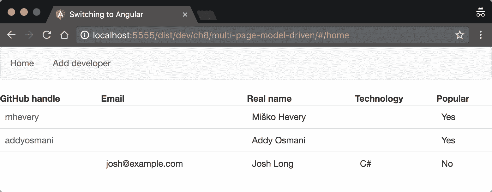
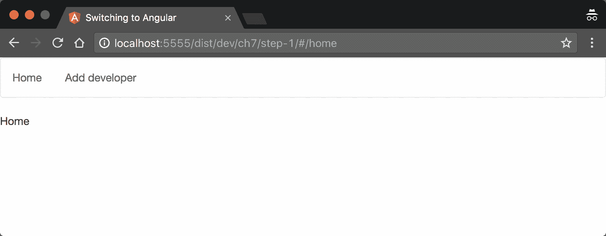
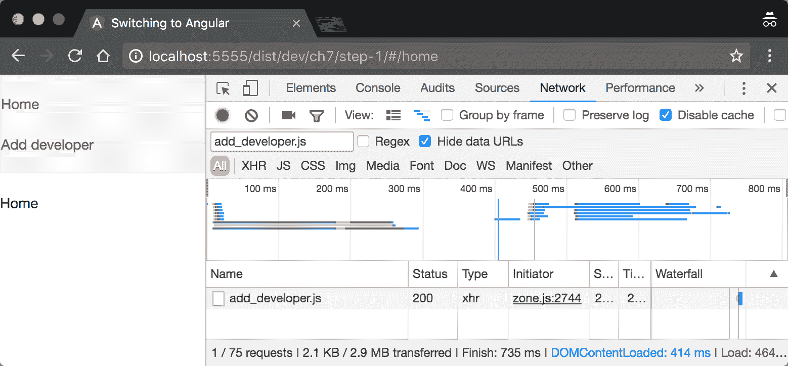
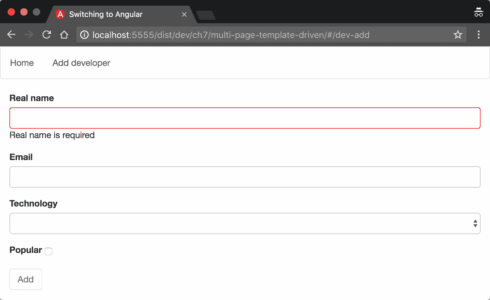
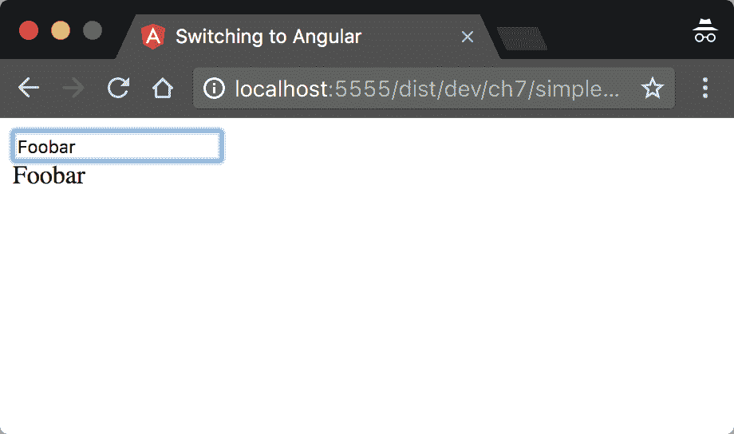

# 使用 Angular 路由和表单进行工作

到目前为止，我们已经熟悉了框架的核心。我们知道如何定义组件和指令来开发我们应用程序的视图。我们还知道如何将业务逻辑封装到服务中，并使用 Angular 的 DI 机制将一切连接起来。

在本章中，我们将解释一些将帮助我们构建真实 Angular 应用程序的概念。它们如下：

+   框架的基于组件的路由

+   使用 Angular 的表单模块

+   开发自定义表单验证器

+   开发模板驱动表单

让我们开始吧！

# 开发 "Coders repository" 应用程序

在解释列出的概念的过程中，我们将开发一个包含开发者库的示例应用程序。在我们开始编码之前，让我们讨论应用程序的结构。

"Coders repository" 将允许其用户通过填写包含他们详细信息的表单或提供开发者的 GitHub 处理程序并从 GitHub 导入他们的资料来添加开发者。

为了本章的目的，我们将把开发者的信息存储在内存中，这意味着在页面刷新后，我们将丢失会话期间存储的所有数据。

应用程序将具有以下视图：

+   所有开发者的列表

+   用于添加或导入新开发者的视图

一个显示给定开发者详细信息的视图。这个视图有两个子视图：

+   **基本详情**：显示开发者的姓名以及如果有的话他们的 GitHub 头像

+   **高级资料**：显示开发者所知的所有详细信息

应用程序主页的最终结果将如下所示：



图 1

在本章中，我们将只构建列出的几个视图。应用程序的其余部分将在 第八章 中解释，*解释管道和与 RESTful 服务通信*。

每个开发者都将是一个以下类的实例：

```js
// ch7/multi-page-template-driven/developer.ts

export class Developer { 
  public id: number; 
  public githubHandle: string; 
  public avatarUrl: string; 
  public realName: string; 
  public email: string; 
  public technology: string; 
  public popular: boolean; 
} 
```

所有开发者都将位于 `DeveloperCollection` 类中：

```js
// ch7/multi-page-template-driven/developer_collection.ts 

class DeveloperCollection { 
  private developers: Developer[] = [];

  getUserByGitHubHandle(username: string) { 
    return this.developers 
            .filter(u => u.githubHandle === username) 
            .pop(); 
  }

  getUserById(id: number) { 
    return this.developers 
             .filter(u => u.id === id) 
             .pop(); 
  }

  addDeveloper(dev: Developer) { 
    this.developers.push(dev); 
  }

  getAll() { 
    return this.developers; 
  } 
} 
```

这里提到的类封装了简单的业务逻辑，没有 Angular 特定的内容，所以我们不会深入细节。

现在，让我们继续通过探索新的路由来继续实现。

# 探索 Angular 路由

正如我们所知，为了启动任何 Angular 应用程序，我们需要开发一个根 NgModule 和一个启动组件。 "Coders repository" 应用程序并没有什么不同；在这个特定情况下，唯一的增加是我们将有多页需要通过 Angular 路由连接在一起。

让我们从路由配置所需的导入开始，并在下面定义根组件：

```js
// ch7/step-0/app.ts

import {
  APP_BASE_HREF,
  LocationStrategy,
  HashLocationStrategy
} from '@angular/common';

import {RouterModule} from '@angular/router';
```

在前面的代码片段中，我们直接从 `@angular/router` 导入 `RouterModule`；正如我们所见，路由器被外部化到框架的核心之外。此模块声明了所有与路由相关的指令，以及所有路由相关的提供者，这意味着如果我们导入它，我们将能够访问所有这些。

`LocationStrategy` 类是一个抽象类，它定义了 `HashLocationStrategy`（用于基于哈希的路由）和 `PathLocationStrategy`（通过利用历史 API 用于基于 HTML5 的路由）之间的共同逻辑。

`HashLocationStrategy` 不支持服务器端渲染，因为页面的哈希值不会发送到服务器。由于哈希是应用程序的视图标识符，服务器将不会知道需要渲染的页面。幸运的是，除了 IE9 之外的所有现代浏览器都支持 HTML5 历史 API。你可以在本书的最后一章中找到更多关于服务器端渲染的信息。

现在，让我们定义一个启动组件并配置应用程序的根模块：

```js
// ch7/step-0/app.ts

@Component({
  selector: 'app',
  template: `...`,
  providers: [DeveloperCollection]
})
class App {}

const routeModule = RouterModule.forRoot([...]);

@NgModule({
  declarations: [App],
  bootstrap: [App],
  imports: [BrowserModule],

  providers: [{
    provide: LocationStrategy,
    useClass: HashLocationStrategy
  }]
})
class AppModule {}

platformBrowserDynamic().bootstrapModule(AppModule);
```

在前面的代码片段中，我们可以注意到一个我们已熟悉的语法，来自第五章 入门 Angular 组件和指令和第六章 Angular 中的依赖注入。我们定义了一个具有 `app` 选择器的组件，`template`，我们将在稍后查看它，以及提供者和指令的集合。

`App` 组件声明了一个与 `DeveloperCollection` 标记关联的单个提供者。这是包含所有由应用程序存储的开发者的类。稍后，我们将调用 `RouterModule` 的 `forRoot` 方法；此方法允许我们通过声明应用程序的根路由来配置路由器。

一旦我们导入了模块，它作为 `forRoot` 方法调用的结果返回，我们就已经可以访问一组指令。这些指令可以帮助我们将链接到路由器配置中定义的其他路由（`routerLink` 指令）以及声明与不同路由关联的组件应该渲染的位置（`router-outlet`）。我们将在本节稍后解释如何使用它们。

现在，让我们看看我们的 `AppModule` 类的配置：

```js
@NgModule({
  declarations: [App],
  bootstrap: [App],
  imports: [BrowserModule, routeModule],
  providers: [{
    provide: LocationStrategy,
    useClass: HashLocationStrategy
  }]
})
class AppModule {}
```

我们添加了一个单独的声明——用于启动应用的 `App` 组件。注意，在这里，我们不仅导入了 `BrowserModule`，还导入了 `RouterModule` 的 `forRoot` 方法的返回结果。在 `providers` 数组中，我们配置了 `LocationStrategy` 的提供者。Angular 使用的默认 `LocationStrategy` 实现是 `PathLocationStrategy`（即基于 HTML5 的一个）；然而，在这种情况下，我们将使用基于哈希的。

当我们不得不在两种位置策略之间进行选择时，我们应该记住，默认的位置策略（`PathLocationStrategy`）由 Angular 的服务器端渲染模块支持，并且应用程序的 URL 对最终用户来说看起来更自然（没有使用`#`）。另一方面，如果我们使用`PathLocationStrategy`，我们可能需要配置我们的应用程序服务器以与 HTML5 历史 API 一起工作，这对于`HashLocationStrategy`是不必要的。

# 使用 PathLocationStrategy

`PathLocationStrategy`类使用`APP_BASE_HREF`，默认情况下其值为`"/"`。这意味着，如果我们的应用程序的基本路径名不同，我们必须明确设置它，以便正确地实现路由功能。例如，在我们的情况下，配置应如下所示：

```js
import {APP_BASE_HREF} from '@angular/common'; 

//... 
@NgModule({
  ...
  providers: [{
      provide: APP_BASE_HREF,
      useValue: '/dist/dev/ch7/multi-page-template-driven/'
    },
    { provide: LocationStrategy, useClass: HashLocationStrategy }
  ]
})
class AppModule {}
```

在这里，`APP_BASE_HREF`代表应用程序的基本路径。例如，在我们的情况下，“Coders repository”将位于`/dist/dev/ch7/multi-page-template-driven/`目录下（或者，如果我们包括方案和主机，`http://localhost:5555/dist/dev/ch7/multi-page-template-driven/`）。

我们需要提供`APP_BASE_HREF`的值，以便向 Angular 提示路径的哪一部分是应用程序路由（即对路由器有意义的）。例如，对于`http://localhost:5555/dist/dev/ch7/multi-page-template-driven/home` URL，如果`APP_BASE_HREF`等于`/dist/dev/ch7/multi-page-template-driven/`，Angular 将知道它需要提供与`home`路径关联的组件，因为 URL 的其余部分与应用程序中声明的路由无关。

# 配置路由

作为下一步，让我们更新路由的声明。打开`ch7/step-0/app.ts`并更新`RouteModule`的`forRoot`方法的调用：

```js
// ch7/step-1/app.ts 

const routingModule = RouterModule.forRoot([
  {
    path: '',
    redirectTo: 'home',
    pathMatch: 'full'
  },
  {
    path: 'home',
    component: Home
  },
  {
    path: 'dev-add',
    component: AddDeveloper
  },
  {
    path: 'add-dev',
    redirectTo: 'dev-add'
  }
]);
```

如前述代码片段所示，`forRoot`方法接受一个路由声明数组作为参数。我们定义了两个重定向和两个与组件关联的路由。

每个非懒加载的路由都必须定义以下属性：

+   `component`：与给定路由关联的组件

+   `path`：用于路由的路径——它将在浏览器的地址栏中可见

另一方面，重定向的定义应包含以下属性：

+   `path`：用于重定向的路径

+   `redirectTo`：用户将被重定向到的路径

+   `pathMatch`：这定义了匹配策略

在上一个示例中，我们声明当用户导航到`/add-dev`时，我们希望他们被重定向到`/dev-add`。正如我们提到的，`pathMatch`定义了路径匹配策略。默认情况下，它具有`"prefix"`值，这意味着路由器将尝试将当前路由的开始部分与重定向中声明的`path`属性匹配。相比之下，当我们将`pathMatch`属性设置为`"full"`值时，只有当整个路径匹配时，路由器才会重定向到`redirectTo`路径。在第一个重定向中显式设置`pathMatch`为`"full"`是很重要的，否则，在以前缀匹配的情况下，每个路由都将匹配到`""`路径。

现在，为了使一切正常工作，我们需要定义`AddDeveloper`和`Home`组件，这些组件在路由器的配置中被引用。首先，我们将提供一个基本的实现，我们将在本章的进程中逐步扩展它。在`ch7/step-0`中，让我们创建一个名为`home.ts`的文件，并输入以下内容：

```js
import {Component} from '@angular/core';

@Component({ 
  selector: 'home', 
  template: `Home` 
}) 
export class Home {} 
```

现在，打开名为`add_developer.ts`的文件，并在其中输入以下内容：

```js
import {Component} from '@angular/core'; 

@Component({ 
  selector: 'dev-add', 
  template: `Add developer` 
}) 
export class AddDeveloper {} 
```

不要忘记在`app.ts`中导入`Home`和`AddDeveloper`组件。

# 使用 routerLink 和 router-outlet

我们有路由和所有与之相关的组件的声明。唯一剩下的事情就是定义根`App`组件的模板，以便将一切连接起来。

将以下内容添加到`ch7/step-0/app.ts`中`@Component`装饰器的`template`属性内：

```js
@Component({ 
  //... 
  template: ` 
    <nav class="navbar navbar-default"> 
      <ul class="nav navbar-nav"> 
        <li><a [routerLink]="['home']">Home</a></li> 
        <li><a [routerLink]="['dev-add']">Add developer</a></li> 
      </ul> 
    </nav> 
    <router-outlet></router-outlet> 
  `, 
  //... 
}) 
```

在模板中，有两个 Angular 特定的指令：

+   `routerLink`：这允许我们向特定路由添加链接

+   `router-outlet`：这定义了当前选中路由相关组件应该渲染的容器

让我们看看`routerLink`指令。作为值，它接受一个路由路径和参数的数组。在我们的情况下，我们只提供了一个路由路径。请注意，`routerLink`使用的路由名称是由`forRoot`内部的路由声明中的`path`属性声明的。在本书的后面部分，我们将看到如何链接到嵌套路由并传递路由参数。

这个指令允许我们独立于我们配置的`LocationStrategy`声明链接。例如，假设我们正在使用`HashLocationStrategy`；这意味着我们需要在我们的模板中为所有路由添加前缀`#`。如果我们切换到`PathLocationStrategy`，我们需要删除所有的哈希前缀。这仅仅是`routerLink`在路径引用之上创建的整洁抽象的部分好处。

从上一个模板中引入的下一个新指令是`router-outlet`。它具有与 AngularJS 中的`ng-view`指令相似的责任。基本上，它们都扮演着相同的角色：指出目标组件应该渲染的位置。这意味着根据定义，当用户导航到`/`时，`Home`组件将在`router-outlet`指出的位置渲染，同样，当用户导航到`dev-add`时，`AddDeveloper`组件也会在相同的位置渲染。

现在，我们已经启动了这两个路由！打开`http://localhost:5555/dist/dev/ch7/step-0/`，你应该会看到一个类似于以下截图的页面：



图 2

如果不这样做，只需查看包含结果的`ch7/step-1`。

# 使用 loadChildren 进行懒加载

AngularJS 模块允许我们将应用中逻辑相关的构建单元组合在一起。然而，默认情况下，它们需要在应用的初始引导阶段可用，并且不允许延迟加载。这意味着在初始页面加载时需要下载整个应用代码库，这在大型单页应用的情况下可能会导致不可接受的性能影响。

在一个完美的场景中，我们希望只加载用户当前查看的页面的代码，或者根据与用户行为相关的启发式方法预取捆绑模块，但这超出了本书的范围。例如，从我们的示例的第一个步骤打开应用，`http://localhost:5555/dist/dev/ch7/step-1/`。一旦用户到达`/`，我们只需要`Home`组件可用，一旦他们导航到`dev-add`，我们希望加载`AddDeveloper`组件。

让我们在 Chrome DevTools 中检查实际发生的情况：



图 3

我们可以注意到，在初始页面加载期间，Angular 下载了与所有路由关联的组件，甚至包括不需要的`AddDeveloper`组件。这是因为，在`app.ts`中，我们明确地要求了`Home`和`AddDeveloper`组件，并在路由的声明中使用它们。

在这个特定情况下，加载这两个组件可能看起来不是什么大问题，因为在这个阶段，它们非常精简，没有任何依赖。然而，在实际应用中，它们将导入其他指令、组件、管道、服务，甚至第三方库。一旦任何组件被要求，它的整个依赖图都将被下载，即使此时该组件并不需要。

Angular 的路由器提供了一个解决方案来解决这个问题：

```js
// ch7/step-1-async/app.ts 

const routingModule = RouterModule.forRoot([
  {
    path: '',
    redirectTo: 'home',
    pathMatch: 'full'
  },
  {
    path: 'home',
    loadChildren: './home#HomeModule'
  },
  {
    path: 'dev-add',
    loadChildren: './add_developer#AddDeveloperModule'
  }
]);
```

懒加载路由的声明是一个具有以下属性的对象：

+   `loadChildren`: 一个指向懒加载模块路径的字符串

+   `path`: 路由的路径

一旦用户导航到与任何懒加载路由定义匹配的路由，模块加载器（默认为 SystemJS）将从 `loadChildren` 提供的位置下载模块。当加载器返回的承诺解析为目标模块的值时，模块将被缓存，其引导组件将被渲染。下次用户导航到相同的路由时，将使用缓存的模块，因此路由模块不会下载相同的组件两次。

注意 `loadChildren` 属性值中的 `#` 符号。如果我们通过 `#` 符号拆分字符串，其第一部分将是模块的 URL，其第二部分将是代表路由器将用于路由的 Angular 模块的导出名称。如果我们不提供模块名称，Angular 将使用默认导出。

之前的示例使用 `loadChildren`，默认情况下，使用 SystemJS 加载模块。您可以使用更高级的配置和自定义模块加载器。有关更多信息，请参阅 Angular 文档[`angular.io`](http://angular.io)。

# 懒加载路由的预取

正如我们已经提到的，在理想情况下，我们希望下载用户在特定时间需要的最小资源集。例如，如果用户访问主页，我们只想下载对应于主页模块（即 `HomeModule`）的包。

之后，当用户导航到 `dev-add` 时，路由器将需要下载 `AddDeveloperModule`。尽管如此，由于导航到尚未访问的页面时发生的减速，用户将只消耗他们使用的网络带宽，用户体验将远非完美。

为了处理这个问题，我们可以添加一个路由预加载策略：

```js
import {RouterModule, PreloadAllModules, ... } from '@angular/router';

...

export const appRoutes = RouterModule.forRoot(routes, {
  preloadingStrategy: PreloadAllModules
});
```

在前面的代码片段中，我们声明我们想要使用 Angular 提供的默认 `preloadingStrategy` 抽象类。因此，当用户打开 `home` 并且 `HomeModule` 成功下载后，路由器将自动开始预取所有其他路由。所以，下次用户导航到不同的页面时，它很可能已经在内存中可用。这将几乎不花费任何成本地提高用户体验。

通过提供 `PreloadingStrategy` 抽象类（位于 `@angular/router` 包中）的自定义实现，我们可以为懒加载模块的预取引入自定义机制。

# RouterModule.forRoot 与 RouterModule.forChild

我们可以使用 `RouterModule` 调用两种方法来注册路由。

如果我们声明应用程序的顶级路由，我们需要使用 `RouterModule.forRoot`。此方法将注册顶级路由，并返回应该由应用程序的根模块导入的路由模块。

如果我们想在懒加载模块中定义路由并导入 `forRoot` 方法调用的模块，我们将得到一个运行时错误。这是因为 `forRoot` 方法将返回一个包含提供者的模块，这些提供者应该只由顶级模块导入一次。为了在懒加载模块中注册嵌套路由，我们需要使用 `forChild` 方法。

我们将在第八章 解释管道和与 RESTful 服务通信中进一步探讨如何定义嵌套路由。

作为一项经验法则，我们可以记住 `RouterModule.forRoot` 是用于注册顶级路由的，而 `RouterModule.forChild` 应仅用于在懒加载模块中注册嵌套路由。

# 使用 Angular 的表单模块

现在，让我们继续应用程序的实现。对于下一步，我们将处理 `AddDeveloper` 和 `Home` 组件。你可以通过扩展当前在 `ch7/step-0` 中的内容来继续你的实现，或者如果你还没有达到步骤 1，你可以继续在 `ch7/step-1` 中的文件上工作。

Angular 提供了两种带有验证的开发表单的方式：

+   **模板驱动方法**：这提供了一个声明式 API，其中我们将验证声明到组件的模板中

+   **模型驱动方法（也称为响应式表单）**：这提供了一个命令式、响应式的 API

让我们先从模板驱动方法开始，并在下一章中探索模型驱动方法。

# 开发模板驱动表单

表单对于每个 **创建、检索、更新和删除**（**CRUD**）应用程序都是必不可少的。在我们的案例中，我们想要构建一个表单来输入我们想要存储的开发者的详细信息。

到本节结束时，我们将有一个表单，允许我们输入指定开发者的真实姓名，添加他们偏好的技术，输入他们的电子邮件，并声明他们是否在社区中受欢迎或尚未。最终结果如下所示：


图 4

将以下导入添加到 `app.ts` 文件中：

```js
import {FormsModule} from '@angular/forms';
```

我们接下来需要做的是在 `AppModule` 类中导入 `FormsModule`。`FormsModule` 类包含一组用于管理 Angular 表单的预定义指令，例如 `form` 和 `ngModel` 指令。`FormsModule` 类还声明了一个数组，其中包含一组预定义的与表单相关的提供者，我们可以在应用程序中使用这些提供者。

在导入 `FormsModule` 类之后，我们的 `app.ts` 文件将看起来像这样：

```js
// ch7/step-2/app.ts

@NgModule({
  imports: [BrowserModule, FormsModule, routingModule],
  declarations: [App, Home, AddDeveloper, ControlErrors],
  providers: [{
    provide: LocationStrategy,
    useClass: HashLocationStrategy
  }],
  bootstrap: [App]
})
class AppModule {}
```

现在，更新 `AddDeveloper` 的实现如下：

```js
// ch7/step-2/add_developer.ts

@Component({ 
  selector: 'dev-add', 
  templateUrl: './add_developer.html', 
  styles: [...]
}) 
export class AddDeveloper { 
  developer = new Developer(); 
  errorMessage: string; 
  successMessage: string; 
  submitted = false; 
  // ...
  constructor(private developers: DeveloperCollection) {} 
  addDeveloper() {} 
} 
```

`developer`属性包含与我们通过表单添加的当前开发者的相关信息。最后两个属性，`errorMessage`和`successMessage`，将用于在开发者成功添加到开发者集合或发生错误时显示当前表单的错误或成功消息。

# 深入了解模板驱动的表单的标记

作为下一步，让我们为`AddDeveloper`组件创建模板（`step-1/add_developer.html`）。将以下内容添加到文件中：

```js
<span *ngIf="errorMessage" 
       class="alert alert-danger">{{errorMessage}}</span> 
<span *ngIf="successMessage" 
       class="alert alert-success">{{successMessage}}</span> 
```

这两个元素旨在在我们添加新开发者时显示错误和成功消息。当`errorMessage`或`successMessage`具有非空值（即，不同于空字符串、`false`、`undefined`、`0`、`NaN`或`null`）时，它们将是可见的。

现在，让我们来开发实际的形式：

```js
<form #f="ngForm" class="form col-md-4" [hidden]="submitted"
   (ngSubmit)="addDeveloper()">
  <div class="form-group">
    <label class="control-label" for="realNameInput">Real name</label>
    <div>
      <input id="realNameInput" class="form-control" 
          type="text" name="realName"
          [(ngModel)]="developer.realName" required>
    </div>
  </div>
  <!-- MORE CODE TO BE ADDED --> 
  <button class="btn btn-default" type="submit">Add</button> 
</form>  
```

我们使用 HTML `form`标签声明一个新的表单。一旦 Angular 在模板中找到这样的标签，并且父组件中包含了一个表单指令，它将自动增强其功能，以便用作 Angular 表单。一旦表单被 Angular 处理，我们就可以应用表单验证和数据绑定。之后，使用`#f="ngForm"`，我们在模板中定义一个局部变量，这允许我们使用`f`标识符引用表单。表单元素最后剩下的就是提交事件处理器。我们使用我们已熟悉的语法，`(ngSubmit)="expr"`；在这种情况下，表达式的值是调用组件控制器中定义的`addDeveloper`方法。

现在，让我们看看具有`control-group`类名的`div`元素。

注意，这并不是一个 Angular 特定的类；这是一个由 Bootstrap 定义的 CSS 类，我们使用它来为表单提供更好的外观和感觉。

在`div`元素内部，我们可以找到一个没有 Angular 特定标记的`label`元素和一个允许我们设置当前开发者的真实姓名的输入元素。我们将控件设置为文本类型，并声明其标识符和名称等于`realNameInput`。`required`属性由 HTML5 规范定义，用于验证。在元素上使用它，我们声明此元素必须有值。尽管`required`属性不是 Angular 特定的，但 Angular 将通过包括 Angular 特定的验证行为来扩展其语义。这种行为包括在控件状态改变时设置特定的 CSS 类，并管理其状态，这些状态框架内部保持。

当表单控件值发生变化时，通过运行验证来增强其行为，并在控件的生命周期中应用特定的类。您可能已经从 AngularJS 中熟悉了这一点，其中表单控件被装饰了`ng-pristine`、`ng-invalid`和`ng-valid`等类。

以下表格总结了框架在其生命周期中添加到表单控件的 CSS 类：

| **类** | **描述** |
| --- | --- |
| `ng-untouched` | 控件尚未被访问 |
| `ng-touched` | 控件已被访问 |
| `ng-pristine` | 控件的值尚未更改 |
| `ng-dirty` | 控件的值已更改 |
| `ng-valid` | 控件上附加的所有验证器都检测到值是有效的 |
| `ng-invalid` | 控件上附加的任何验证器都检测到值是无效的 |

根据此表，我们可以定义我们希望所有具有无效值的输入控件在以下方式下具有红色边框：

```js
input.ng-dirty.ng-invalid { 
  border: 1px solid red; 
} 
```

在 Angular 的上下文中，上述 CSS 的确切语义是，我们使用红色边框表示所有值已更改且根据附加的验证器无效的输入元素。

现在，让我们探索如何将验证行为附加到我们的控件上。

# 使用内置验证器

我们已经看到，我们可以使用`required`属性更改任何控件的验证行为。Angular 提供了两个更多内置验证器，如下所示：

+   `minlength`：这允许我们指定给定控件应具有的最小值长度

+   `maxlength`：这允许我们指定给定控件应具有的最大值长度

这些验证器是用 Angular 指令定义的，可以按以下方式使用：

```js
<input id="realNameInput" class="form-control" 
       type="text" minlength="2" maxlength="30"> 
```

这样，我们指定输入的值应在`2`到`30`个字符之间。

# 定义自定义验证器

在`Developer`类中定义的另一个数据属性是`email`。让我们为它添加一个输入字段。在上一个表单的添加按钮上方，添加以下标记：

```js
<div class="form-group"> 
  <label class="control-label" for="emailInput">Email</label> 
  <div> 
    <input type="text" id="emailInput" class="form-control" name="emailInput"
           [(ngModel)]="developer.email"> 
  </div> 
</div> 
```

我们可以将`[(ngModel)]`属性视为 AngularJS 中`ng-model`指令的替代。我们将在*使用 Angular 进行双向数据绑定*部分中详细解释它。

虽然 Angular 提供了一套预定义的验证器，但它们不足以满足我们数据可能存在的所有各种格式。有时，我们需要为特定于应用程序的数据定义自定义验证逻辑。例如，在这种情况下，我们想要定义一个电子邮件验证器。一个典型的正则表达式，在一般情况下有效（但并不涵盖定义电子邮件地址格式的整个规范），如下所示：`/^[a-zA-Z0-9_.+-]+@[a-zA-Z0-9-]+\.[a-zA-Z0-9-.]+$/`。

在`ch7/step-1/email_validator.ts`中，定义一个函数，该函数接受 Angular 控件实例作为参数，如果控件值是空的或与前面提到的正则表达式匹配，则返回`null`，否则返回`{ 'invalidEmail': true }`：

```js
function validateEmail(emailControl) { 
  if (!emailControl.value || 
    /^[a-zA-Z0-9_.+-]+@[a-zA-Z0-9-]+\.[a-zA-Z0-9-.]+$/.test(emailControl.value)) { 
    return null; 
  } else { 
    return { 'invalidEmail': true }; 
  } 
} 
```

现在，从`@angular/common`和`@angular/core`模块中导入`NG_VALIDATORS`和`Directive`，并将此验证函数包裹在以下指令中：

```js
@Directive({ 
  selector: '[email-input]', 
  providers: [{
    provide: NG_VALIDATORS,
    multi: true,
    useValue: validateEmail
  }]
}) 
class EmailValidator {} 
```

在前面的代码中，我们为 `NG_VALIDATORS` 令牌定义了一个多提供者。一旦我们注入与该令牌关联的值，我们将得到一个包含所有附加到给定控件（作为参考，请参阅第六章[3ad730a8-f797-4fc1-b908-5a20eeffac23.xhtml]，*Angular 中的依赖注入*）的验证器的数组。

使我们的自定义验证生效只剩两个步骤。首先，将 `email-input` 属性添加到电子邮件控件：

```js
<input type="text" id="emailInput" class="form-control" email-input
       [(ngModel)]="developer.email"> 
```

接下来，将指令添加到 `AppModule` 类的声明中：

```js
// ...
import {EmailValidator} from './email_validator';
// ...

@NgModule({
  // ...
  declarations: [..., EmailValidator],
  // ...
})
class AppModule {}
```

我们正在使用一个外部模板来定义 `AddDeveloper` 控件。关于一个给定的模板是否应该外部化或内联，没有最终的答案。最佳实践表明，我们应该内联短模板，并将长模板外部化。然而，没有具体的定义来说明哪些模板被认为是短的，哪些被认为是长的。模板是否应该内联使用或放入外部文件，取决于开发者的个人偏好或组织内的通用惯例。

# 使用 Angular 选择输入

作为下一步，我们应该允许应用程序的用户输入输入开发者最擅长的技术。我们可以定义一个技术列表，并在表单中以选择输入的形式显示它们。

在 `AddDeveloper` 类中，添加 `technologies` 属性：

```js
class AddDeveloper { 
  ... 
  technologies: string[] = [ 
    'JavaScript', 
    'C', 
    'C#', 
    'Clojure' 
  ]; 
  ... 
} 
```

现在，在模板中，在添加按钮上方，添加以下标记：

```js
<div class="form-group"> 
  <label class="control-label" 
         for="technologyInput">Technology</label> 
  <div> 
    <select class="form-control" name="technology" required 
            [(ngModel)]="developer.technology"> 
        <option *ngFor="let technology of technologies" [value]="technology">
          {{technology}}
        </option> 
    </select> 
  </div> 
</div> 
```

就像我们之前声明的输入元素一样，Angular 会根据选择输入的状态添加相同的类。为了在选择元素值无效时显示红色边框，我们需要修改 CSS 规则：

```js
@Component({ 
  ... 
  styles: [ 
    `input.ng-touched.ng-invalid, 
     select.ng-touched.ng-invalid { 
      border: 1px solid red; 
    }` 
  ], 
  ... 
}) 
class AddDeveloper {...} 
```

注意，将所有样式内联到我们的组件声明中可能是一种不良做法，因为这样它们就不会是可重用的。我们可以做的是将我们组件之间的所有通用样式提取到单独的文件中。`@Component` 装饰器有一个名为 `styleUrls` 的属性，其类型为 `string[]`，我们可以添加一个引用，指向给定组件使用的提取样式。这样，如果需要，我们只可以内联组件特定的样式。

在此之后，我们使用 `name="technology"` 声明控件的名称等于 `"technology"`。使用 `required` 属性，我们声明应用程序的用户必须指定当前开发者擅长的技术。现在让我们跳过 `[(ngModel)]` 属性，看看我们如何定义 `select` 元素的选项。

在 `select` 元素内部，我们使用以下方式定义不同的选项：

```js
<option *ngFor="let technology of technologies" [value]="technology">
  {{technology}}
</option> 
```

这是一个我们已经很熟悉的语法。我们只是遍历 `AddDeveloper` 类中定义的所有技术，并为每个技术显示一个具有技术名称值的 `option` 元素。

# 使用 NgForm 指令

我们已经提到，表单指令通过添加一些额外的 Angular 特定逻辑来增强 HTML5 表单的行为。现在，让我们退一步，看看围绕输入元素的表单：

```js
<form #f="ngForm" (ngSubmit)="addDeveloper()" 
      class="form col-md-4" [hidden]="submitted"> 
  ... 
</form> 
```

在这个代码片段中，我们定义了一个新的标识符 `f`，它引用了表单。我们可以将表单视为控制的一个组合；我们可以通过表单的 `controls` 属性访问单个控制。在此基础上，表单还具有 **touched**、**untouched**、**pristine**、**dirty**、**invalid** 和 **valid** 属性，这些属性取决于表单内定义的各个控制。例如，如果表单内的控制都没有被 `touched`，那么表单本身将显示为 `untouched` 状态。然而，如果表单中的任何控制至少被 `touched` 一次，表单将显示其状态为 `touched`。同样，只有当表单的所有控制都有效时，表单才是有效的。

为了说明 `form` 元素的用法，让我们定义一个具有 `control-errors` 选择器的组件，该组件显示给定控制的当前错误。我们可以按以下方式使用它：

```js
<label class="control-label" for="realNameInput">Real name</label> 
<div> 
  <input id="realNameInput" class="form-control" type="text" 
         [(ngModel)]="developer.realName" 
         required maxlength="50"> 
  <control-errors control="realName" 
    [errors]="{ 
      'required': 'Real name is required', 
      'maxlength': 'The maximum length of the real name is 50 characters' 
    }" 
   /> 
</div> 
```

注意，我们还向 `realName` 控制添加了 `maxlength` 验证器。

`control-errors` 元素具有以下属性：

+   `control`：这声明了我们想要显示错误的控制的名称

+   `errors`：这创建了一个控制错误与错误消息之间的映射

现在，创建一个名为 `control_errors.ts` 的新文件，并将以下导入添加到其中：

```js
import {Component, Host, Input} from '@angular/core';
import {NgForm} from '@angular/forms';
```

在这些导入中，`NgForm` 代表 Angular 表单，而 `Host` 是与 DI 机制相关的参数装饰器，我们已经在 第六章 中介绍过，即 *Angular 中的依赖注入*。

这里是组件定义的一部分：

```js
@Component({ 
  template: '<div>{{currentError}}</div>', 
  selector: 'control-errors',
}) 
class ControlErrors { 
  @Input() errors: Object; 
  @Input() control: string; 
  constructor(@Host() private formDir: NgForm) {} 
  get currentError() {...} 
} 
```

`ControlErrors` 组件定义了两个输入：`control`，控制的名称（`name` 属性的值）和 `errors`，错误标识符与错误消息之间的映射；它们分别可以通过 `control-errors` 元素的 `control` 和 `errors` 属性指定。

例如，假设我们有以下输入：

```js
<input type="text" name="foobar" required> 
```

我们可以使用以下标记来声明其关联的 `control-errors` 组件：

```js
<control-errors control="foobar" 
      [errors]="{ 
       'required': 'The value of foobar is required' 
      }"></control-errors> 
```

在 `currentError` 访问器中，在前面 `ControlErrors` 类的声明中，我们需要做以下两件事：

+   找到具有 `control` 属性声明的组件引用

+   返回与任何使当前控制无效的错误相关的错误消息

这里是一个实现此行为的代码片段：

```js
@Component(...) 
class ControlErrors { 
  ... 
  get currentError() {
    let control = this.formDir.controls[this.control];
    let errorMessages = [];
    if (control && control.touched) {
      errorMessages = Object.keys(this.errors)
        .map(k => control.hasError(k) ? this.errors[k] : null)
        .filter(error => !!error);
    }
    return errorMessages.pop();
  }
} 
```

在`currentError`实现的第 一行，我们使用注入表单的`controls`属性获取目标控件。`controls`属性是`{[key: string]: AbstractControl}`类型，其中`key`是我们使用`name`属性声明的控件的名称。一旦我们有了目标控件实例的引用，我们可以检查其状态是否为`touched`（即是否已被聚焦），如果是，我们可以遍历`ControlErrors`实例的`errors`属性中的所有错误。`map`函数将返回一个包含错误消息或`null`值的数组。剩下要做的就是过滤掉所有的`null`值，只获取错误消息。一旦我们获取了每个错误的错误消息，我们将通过从`errorMessages`数组中弹出最后一个来返回它。

最终结果应该如下所示：



图 5

如果你在实现`ControlErrors`组件的过程中遇到任何问题，你可以查看其实现，位置在`ch7/step-2/control_errors.ts`。

每个控件的`hasError`方法接受一个错误消息标识符作为参数，该标识符由相应的验证器定义。例如，在我们的例子中，我们定义了自定义的电子邮件验证器，当输入控件具有无效值时，我们返回`{ 'invalidEmail': true }`对象字面量。如果我们将`ControlErrors`组件应用于电子邮件控件，其声明应该如下所示：

```js
  <control-errors control="email" 
    [errors]="{
      'invalidEmail': 'Invalid email address'
    }"></control-errors> 
```

# Angular 的双向数据绑定

关于 Angular 最著名的谣言之一是双向数据绑定功能被移除，因为强制单向数据流。这并不完全正确；Angular 的表单模块实现了一个带有`[(ngModel)]`选择器的指令（我们也将这个指令称为`NgModel`，因为它控制器的名字），这使我们能够轻松实现双向数据绑定：从视图到模型，以及从模型到视图。

让我们看看以下简单的组件：

```js
// ch7/simple-two-way-data-binding/app.ts 

import {Component, NgModule} from '@angular/core';
import {BrowserModule} from '@angular/platform-browser';
import {FormsModule} from '@angular/forms';
import {platformBrowserDynamic} from '@angular/platform-browser-dynamic';

@Component({
 selector: 'app',
 template: `
  <input type="text" [(ngModel)]="name">
  <div>{{name}}</div>
 `
})
class App {
  name: string;
}

@NgModule({
  imports: [BrowserModule, FormsModule],
  declarations: [App],
  bootstrap: [App]
})
class AppModule {}

platformBrowserDynamic().bootstrapModule(AppModule);
```

在前面的例子中，我们从`@angular/common`包中导入`FormsModule`。稍后，在模板中，我们将`[(ngModel)]`属性设置为`name`。

首先，`[(ngModel)]`语法可能看起来有点不寻常。从第五章，《Angular 组件和指令入门》，我们知道`(eventName)`语法用于绑定由给定组件触发的事件（或输出）。另一方面，我们使用`[propertyName]="foobar"`语法通过将`propertyName`名称与`foobar`表达式的评估结果设置到属性（或，在 Angular 组件的术语中，输入）的值来实现单向数据绑定。`[(ngModel)]`语法结合了两者，以实现双向数据绑定。这就是为什么我们可以将其视为一种语法糖，而不是一个新概念。与 AngularJS 相比，这种语法的主要优势之一是，我们只需查看模板就可以知道哪些绑定是单向的，哪些是双向的。

`[(foo)]`语法的另一个名称是“盒子里的香蕉”或“香蕉括号”语法。这个名称的灵感来源于这篇论文：Erik Meijer、Maarten Fokkinga 和 Ross Paterson 的《Bananas, Lenses, Envelopes and Barbed Wire：Functional Programming》（[`eprints.eemcs.utwente.nl/7281/01/db-utwente-40501F46.pdf`](http://eprints.eemcs.utwente.nl/7281/01/db-utwente-40501F46.pdf)）。就像`(click)`有它的规范语法`on-click`，`[propertyName]`有自己的`bind-propertyName`，`[(ngModel)]`的替代语法是`bindon-ngModel`。

如果你打开`http://localhost:5555/dist/dev/ch7/simple-two-way-data-binding/`，你会看到以下结果：



图 6

一旦输入框的值发生变化，其下方的标签将自动更新。

我们已经在之前的代码片段中使用了`[(ngModel)]`指令。例如，我们使用以下方式将开发者的电子邮件绑定：

```js
<input id="emailInput" class="form-control" type="text" 
       [(ngModel)]="developer.email" email-input> 
```

这样，一旦我们更改文本输入的值，定义在`AddDeveloper`组件实例中的开发者对象的电子邮件属性值就会更新。

# 存储表单数据

让我们再次浏览一下`AddDeveloper`组件控制器的界面：

```js
export class AddDeveloper { 
  submitted: false; 
  successMessage: string; 
  developer = new Developer(); 
  //... 
  constructor(private developers: DeveloperCollection) {} 
  addDeveloper(form) {...} 
} 
```

此界面有一个`Developer`类型的字段，我们使用`NgModel`指令将其表单控件绑定到其属性。该类还有一个名为`addDeveloper`的方法，该方法在表单提交时被调用。我们通过以下方式绑定到`ngSubmit`事件来声明它：

```js
<!-- ch7/multi-page-template-driven/add_developer.html --> 
<form #f="form" (ngSubmit)="addDeveloper()" 
      class="form col-md-4" [hidden]="submitted"> 
  ... 
  <button class="btn btn-default" 
      type="submit" [disabled]="!f.form.valid">Add</button> 
</form> 
```

在前面的代码片段中，我们应该注意两个额外的事项。我们通过`#f="ngForm"`获取表单的引用，并将按钮的禁用属性绑定到`!f.form.valid`表达式。我们已经在上一节中描述了`NgForm`控制；一旦表单中的所有控件都具有有效的值，其`valid`属性将具有`true`值。

现在，假设我们已经为表单中的所有输入控件输入了有效的值。这意味着其`submit`按钮将被启用。一旦我们按下*Enter*或点击`submit`按钮，`addDeveloper`方法将被调用。以下是这个方法的示例实现：

```js
class AddDeveloper { 
  //... 
  addDeveloper() {
    // We can't remove developers so setting the id this way is safe 
    this.developer.id = this.developers.getAll().length + 1; 
    this.developers.addDeveloper(this.developer); 
    this.successMessage = `Developer ${this.developer.realName} was successfully added`; 
    this.submitted = true; 
  } 
```

初始时，我们将当前开发者的`id`属性设置为`DeveloperCollection`中开发者的总数加一。稍后，我们将开发者添加到集合中并设置`successMessage`属性的值。紧接着，我们将`submitted`属性设置为`true`，这将导致隐藏表单。

# 列出所有存储的数据

既然我们可以向开发者集合中添加新条目，那么让我们在“Coders repository”的前页上展示所有开发者的列表。

打开`ch7/step-1/home.ts`文件（或根据上一节中的进度，可能是 step-2），并输入以下内容：

```js
import {Component} from '@angular/core'; 
import {DeveloperCollection} from './developer_collection'; 

@Component({ 
  selector: 'home', 
  templateUrl: './home.html' 
}) 
export class Home { 
  constructor(private developers: DeveloperCollection) {}

  getDevelopers() { 
    return this.developers.getAll(); 
  } 
} 
```

这里对我们来说没有什么新东西。我们通过提供一个外部模板并实现`getDevelopers`方法来扩展`Home`组件的功能，该方法将调用委托给在构造函数中注入的`DeveloperCollection`实例。

模板本身使用我们已经熟悉的指令：

```js
<table class="table" *ngIf="getDevelopers().length > 0"> 
  <thead> 
    <th>Email</th> 
    <th>Real name</th> 
    <th>Technology</th> 
    <th>Popular</th> 
  </thead> 
  <tr *ngFor="let dev of getDevelopers()"> 
    <td>{{dev.email}}</td> 
    <td>{{dev.realName}}</td> 
    <td>{{dev.technology}}</td> 
    <td [ngSwitch]="dev.popular"> 
      <span *ngSwitchCase="true">Yes</span> 
      <span *ngSwitchCase="false">Not yet</span> 
    </td> 
  </tr> 
</table> 
<div *ngIf="getDevelopers().length == 0"> 
  There are no any developers yet 
</div> 
```

我们将所有开发者作为 HTML 表格中的行列出。对于每个开发者，我们检查其`popular`标志的状态。如果其值为`true`，则在“热门”列中显示带有文本`Yes`的 span，否则将文本设置为`No`。

当你在“添加开发者”页面中输入一些开发者并导航到主页时，你应该看到以下截图类似的结果：


图 7

你可以在`ch7/multi-page-template-driven`中找到应用程序的完整实现。

# 摘要

到目前为止，我们已经解释了 Angular 中路由的基础。我们查看如何定义不同的路由并实现与之关联的组件，这些组件在路由更改时显示。为了链接到不同的路由，我们引入了`routerLink`，我们还使用了`router-outlet`指令来指出与单个路由关联的组件应该在哪里渲染。

我们还查看了一下 Angular 表单的内置和自定义验证功能。在此之后，我们解释了`NgModel`指令，它为我们提供了双向数据绑定。

在下一章中，我们将介绍如何开发模型驱动的表单和子以及参数化路由，使用`Http`模块，以及使用自定义管道转换数据。
