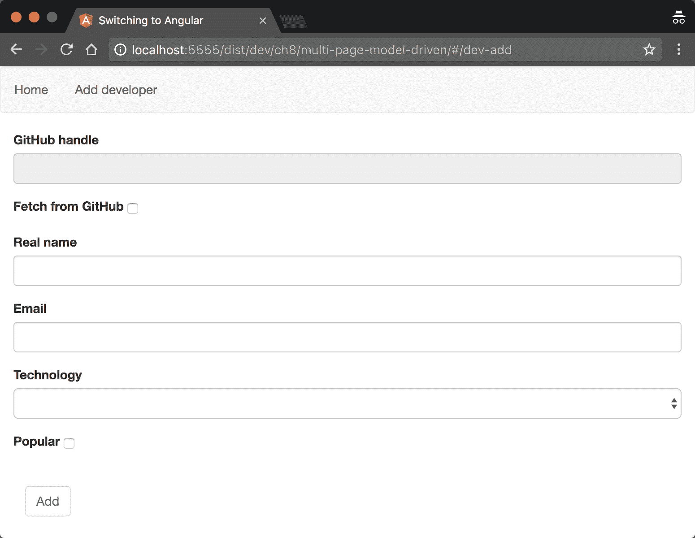
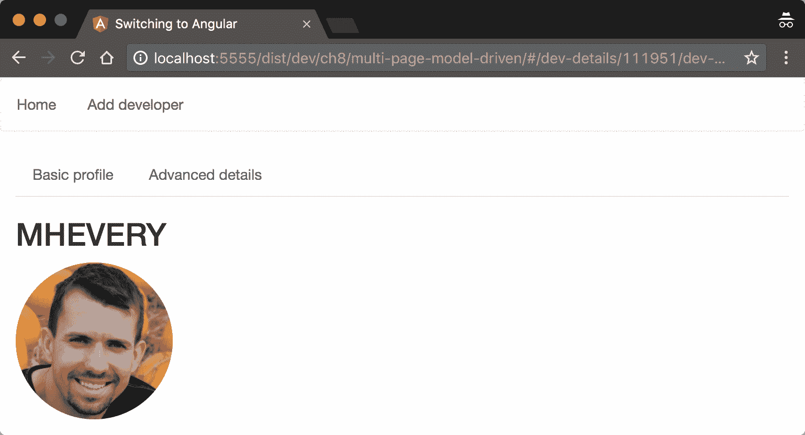
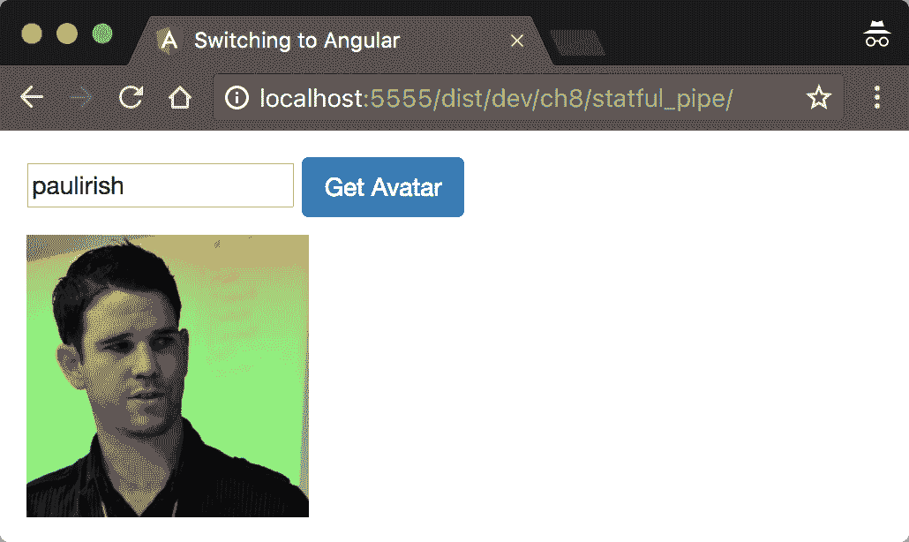

# 第八章：解释管道和与 RESTful 服务通信

在前一章中，我们介绍了框架的一些非常强大的功能。然而，我们可以进一步深入到 Angular 表单模块和路由的功能。在本章中，我们将解释我们如何执行以下操作：

+   开发模型驱动表单

+   定义参数化路由

+   定义子路由

+   使用 HTTP 模块与 RESTful API 通信

+   使用自定义管道转换数据

我们将在扩展“Coders repository”应用程序功能的过程中探讨所有这些概念。在前一章的开始，我们提到我们将允许从 GitHub 导入开发者。然而，在我们实现这个功能之前，让我们扩展表单的功能。

# 在 Angular 中开发模型驱动表单

这些将是完成“Coders repository”的最后几步。您可以在`ch7/step-1/`（或`ch7/step-2`，取决于您之前的工作）提供的代码基础上构建，以扩展应用程序的功能，我们将介绍新的概念。完整的示例位于`ch8/multi-page-model-driven`。

这就是我们将在本节结束时实现的结果：



图 1

在前面的屏幕截图中，有两个表单：

+   该表单包含以下控件：

    +   用于 GitHub 处理的文本输入

    +   一个复选框，指出我们是否想从 GitHub 导入开发者或手动输入他们

+   用于手动输入新用户的表单

第二个表单看起来与我们之前章节中留下的完全一样。然而，这次，其定义看起来略有不同：

```js
<form class="form col-md-4" [formGroup]="addDevForm" [hidden]="submitted">
  <!-- TODO --> 
</form> 
```

注意，这次我们没有`submit`处理程序或`#f="ngForm"`属性。相反，我们将`[formGroup]`输入绑定到组件控制器内部的`addDevForm`属性。使用这个输入，我们可以绑定到称为`FormGroup`的东西。正如其名称所示，`FormGroup`类由一组与它们关联的验证规则组合在一起的控件列表组成。

我们需要在用于导入开发者的表单中使用类似的声明。然而，这次，我们将提供不同的`[formGroup]`属性值，因为我们将在组件控制器中定义不同的表单组。将以下片段放置在我们之前引入的表单之上：

```js
<form class="form col-md-4" [formGroup]="importDevForm" [hidden]="submitted">
<!-- TODO --> 
</form> 
```

现在，让我们在组件控制器中声明`importDevForm`和`addDevForm`属性：

```js
import {FormGroup} from '@angular/forms';

@Component(...) 
export class AddDeveloper { 
  importDevForm: FormGroup; 
  addDevForm: FormGroup; 
  ... 
  constructor(private developers: DeveloperCollection, 
    fb: FormBuilder) {...} 
  addDeveloper() {...} 
} 
```

初始时，我们从`@angular/forms`模块导入`FormGroup`类，稍后，在控制器中声明所需的属性。注意，我们在`AddDeveloper`的`constructor`中有一个额外的参数，名为`fb`，其类型为`FormBuilder`。

`FormBuilder` 类型提供了一个可编程 API，用于定义 `FormGroup`，我们可以将验证行为附加到组中的每个控件。让我们使用 `FormBuilder` 实例初始化 `importDevForm` 和 `addDevForm` 属性：

```js
... 
constructor(private developers: DeveloperCollection, 
  fb: FormBuilder) {
  this.importDevForm = fb.group({
    githubHandle: ['', Validators.required],
    fetchFromGitHub: [false]
  });
  this.addDevForm = fb.group({
    realName: ['', Validators.required],
    email: ['', validateEmail],
    technology: ['', Validators.required],
    popular: [false]
  });
} 
... 
```

`FormBuilder` 实例有一个名为 `group` 的方法，它允许我们定义控件并设置它们的属性，例如它们的默认值和验证器。

根据前面的代码片段，`importDevForm` 有两个字段：`githubHandle` 和 `fetchFromGitHub`。我们声明 `githubHandle` 控件的默认值为空字符串，其值是必需的，并将 `fetchFromGitHub` 控件的默认值设置为 `false`。

在第二个表单 `addDevForm` 中，我们声明了四个控件。对于 `realName` 控件，我们将默认值设置为空字符串，并使用 `Validators.requred` 来引入验证行为（这正是我们对 `githubHandle` 控件所做的那样）。作为电子邮件输入的验证器，我们将使用 `validateEmail` 函数，并将控件初始值设置为空字符串。`validateEmail` 函数是我们之前章节中定义的：

```js
function validateEmail(emailControl) { 
  if (!emailControl.value || 
     /^[a-zA-Z0-9_.+-]+@[a-zA-Z0-9-]+\.[a-zA-Z0-9-.]+$/.test(emailControl.value)) { 
    return null; 
  } else { 
    return { 'invalidEmail': true }; 
  } 
} 
```

在这里定义的最后两个控制是 `technology` 控制器，它有一个必需的值验证器，其初始值为空字符串，以及 `popular` 控制器，其初始值设置为 `false`。

# 使用控制验证器的组合

我们查看了一下如何将单个验证器应用于表单控件。使用模型驱动方法，我们以与上一章中使用的模板驱动表单和添加 `required` 属性相同的方式应用了 `Validators.required` 验证器。然而，在某些应用程序中，领域可能需要更复杂的验证逻辑。例如，如果我们想将 `required` 和 `validateEmail` 验证器都应用于电子邮件控件，我们应该做以下操作：

```js
this.addDevForm = fb.group({ 
  ... 
  email: ['', Validators.compose([ 
      Validators.required, 
      validateEmail
    ])
  ], 
  ... 
}); 
```

`Validators` 对象的 `compose` 方法接受一个验证器数组作为参数，并返回一个新的验证器。新验证器的行为将是作为参数传递的各个验证器中定义的逻辑的组合，并且它们将按照在数组中引入的顺序应用。

传递给 `FormBuilder` 的 `group` 方法的对象字面量中的属性名应该与我们在模板中为输入的 `formControlName` 属性设置的值相匹配。这是 `importDevForm` 的完整模板：

```js
<form class="form col-md-4" [formGroup]="importDevForm" [hidden]="submitted">
  <div class="form-group">
  <label class="control-label" for="githubHandleInput">GitHub handle</label>
  <div>
    <input id="githubHandleInput" class="form-control"
           type="text" formControlName="githubHandle">
    <control-errors control="githubHandle"
      [errors]="{
        'required': 'The GitHub handle is required'
      }"></control-errors>
   </div>
  </div>
  <div class="form-group">
    <label class="control-label" for="fetchFromGitHubCheckbox">
      Fetch from GitHub
    </label>
    <input class="checkbox-inline" id="fetchFromGitHubCheckbox"
      type="checkbox" formControlName="fetchFromGitHub">
  </div>
</form>
```

在前面的模板中，我们可以看到，一旦 `submitted` 标志具有 `true` 值，表单将隐藏给用户。在第一个输入元素旁边，我们将 `formControlName` 属性的值设置为 `githubHandle`。`formControlName` 属性将模板中现有的表单输入与在 `FormGroup` 类中声明的输入关联起来，对应于 HTML 输入所在的表单元素。这意味着我们传递给 `FormBuilder` 的 `group` 方法的对象字面量内部的控件定义所关联的键必须与模板中设置 `formControlName` 的相应控件名称匹配。

现在我们想要实现以下行为：

+   当“从 GitHub 获取”复选框被勾选时，禁用输入新开发者的表单，并启用从 GitHub 导入开发者的表单

+   当当前活动（或启用）的表单无效时，禁用 `submit` 按钮

我们将探讨如何使用 Angular 的响应式表单 API（也称为模型驱动表单）来实现此功能。

在 `AddDeveloper` 类中，添加以下方法定义：

```js
...
export class AddDeveloper {
  //...
  ngOnInit() {
    this.toggleControls(this.importDevForm.controls['fetchFromGitHub'].value);
    this.subscription = this.importDevForm.controls['fetchFromGitHub']
      .valueChanges.subscribe(this.toggleControls.bind(this));
  }

  ngOnDestroy() {
    this.subscription.unsubscribe();
  }

  private toggleControls(importEnabled: boolean) {
    const addDevControls = this.addDevForm.controls;
    if (importEnabled) {
      this.importDevForm.controls['githubHandle'].enable();
      Object.keys(addDevControls).forEach((c: string) =>
        addDevControls[c].disable());
    } else {
      this.importDevForm.controls['githubHandle'].disable();
      Object.keys(addDevControls).forEach((c: string) =>
        addDevControls[c].enable());
    }
  }
}
...
```

注意，在 `ngOnInit` 中，我们使用当前 `fetchFromGitHub` 复选框的值调用 `toggleControls` 方法。我们可以通过获取 `importDevForm` 中 `controls` 的 `fetchFromGitHub` 属性来获取表示复选框的 `AbstractControl` 的引用。

之后，我们通过传递一个回调给其 `subscribe` 方法来订阅复选框的 `valueChange` 事件。每次复选框的值发生变化时，我们传递给 `subscribe` 的回调将被调用。

之后，在 `ngOnDestroy` 中，我们取消订阅 `valueChange` 订阅，以防止我们的代码出现内存泄漏。

最后，最有趣的事情发生在 `toggleControls` 方法中。我们将一个标志传递给此方法，该标志指示我们是否希望 `importDevForm` 被启用。如果我们希望表单被启用，我们只需要调用 `githubHandle` 控件的 `enable` 方法，并禁用 `addDevForm` 中的所有 `controls`。我们可以通过遍历控制名称（即 `addDevForm` 的 `controls` 属性的键）来禁用 `addDevForm` 中的所有 `controls`，获取每个单独名称的相应控件实例，并调用其 `disable` 方法。如果 `importEnabled` 标志的值为 `false`，我们将执行完全相反的操作，通过调用 `addDevForm` 中的 `controls` 的 `enable` 方法和 `importDevForm` 中控件的 `disable` 方法。

# 探索 Angular 的 HTTP 模块

现在，在我们开发了两个表单——导入现有开发者和添加新开发者之后，是时候在组件的控制器中实现它们背后的逻辑了。

为了这个目的，我们需要与 GitHub API 进行通信。虽然我们可以直接从组件的控制器中这样做，但通过这种方式解决问题，我们会将视图与 GitHub 的 RESTful API 耦合起来。为了强制更好的关注点分离，我们可以将用于与 GitHub 通信的逻辑提取到一个单独的服务中，称为`GitHubGateway`。打开名为`github_gateway.ts`的文件，并输入以下内容：

```js
import { Injectable } from '@angular/core';
import { HttpClient } from '@angular/common/http';
import { Observable } from 'rxjs/Observable';

export interface GitHubUser {
  id: number;
  login: string;
  email: string;
  followers: number;
  name: string;
  avatar_url: string;
}

@Injectable()
export class GitHubGateway {
  constructor(private http: HttpClient) { }
  getUser(username: string): Observable<GitHubUser> {
    return this.http.get<GitHubUser>(`https://api.github.com/users/${username}`);
  }
}
```

初始时，我们从`@angular/common/http`模块导入`HttpClient`类。所有与 HTTP 相关的功能都被外部化到 Angular 的核心之外。

在此之后，我们声明`GitHubUser`接口。我们使用它来描述 GitHub 返回的预期响应类型。在这种情况下，我们手动创建接口声明；然而，通常这样的接口是通过 API 模式（例如 OpenAPI）生成的，这些模式在前端和后端之间共享。

在接受`GitHubGateway`依赖后，需要通过框架的 DI 机制注入，我们将使用`@Injectable`装饰器装饰类。

我们使用的 GitHub API 的唯一功能是用于获取用户的功能，因此我们定义了一个名为`getUser`的单个方法。它接受开发者的 GitHub 处理程序作为参数。

注意，如果你每天向 GitHub 的 API 发送超过 60 个请求，你可能会遇到这个错误：GitHub API 速率限制超出。这是由于没有 GitHub API 令牌的请求速率限制。有关更多信息，请访问[`github.com/blog/1509-personal-api-tokens`](https://github.com/blog/1509-personal-api-tokens)。

在`getUser`方法内部，我们使用在`constructor`中接收到的`HttpClient`服务实例。请注意，客户端的`get`方法有一个类型参数，并返回`Observable`。类型参数的目的是指示响应的类型，该响应被包裹在`Observable`中。作为预期类型，我们设置了`GitHubUser`接口。使用可观察对象而不是承诺来为`HttpClient`提供一些好处；例如，考虑以下好处：

+   可观察对象按设计是可取消的

+   可观察对象可以轻松重试

+   我们可以映射和过滤从给定请求接收到的响应

`HttpClient`服务的完整 API 可以在[`angular.io/api/common/http/HttpClient`](https://angular.io/api/common/http/HttpClient)找到。

# 使用 Angular 的 HTTP 模块

现在，让我们实现从 GitHub 导入现有开发者的逻辑。首先，我们需要在我们的`AppModule`类中导入`HttpClientModule`：

```js
import {HttpClientModule} from '@angular/common/http';
...

@NgModule({
  imports: [..., HttpClientModule],
  declarations: [...],
  providers: [...],
  bootstrap: [...]
})
class AppModule {}
...
```

然后，打开`ch7/step-2/add_developer.ts`文件，并输入以下导入：

```js
import {GitHubGateway} from './github_gateway'; 
```

将`GitHubGateway`添加到`AddDeveloper`组件提供者的列表中：

```js
@Component({ 
  ... 
  providers: [GitHubGateway] 
}) 
class AddDeveloper {...} 
```

作为下一步，我们必须在类的`constructor`中包含以下参数：

```js
constructor(private githubAPI: GitHubGateway, 
  private developers: DeveloperCollection, 
  fb: FormBuilder) { 
  //... 
} 
```

这样，`AddDeveloper`类实例将有一个名为`githubAPI`的私有属性。

剩下的工作就是实现`addDeveloper`方法，并允许用户使用`GitHubGateway`实例导入现有的开发者。

一旦用户点击添加按钮，我们需要检查是否需要导入现有的 GitHub 用户或添加新的开发者。为此，我们可以使用`fetchFromGitHub`控制器的值：

```js
if (this.importDevForm.controls['fetchFromGitHub'].value) { 
  // Import developer 
} else { 
  // Add new developer 
} 
```

如果它有一个真值，那么我们可以调用`githubAPI`属性的`getUser`方法，并将`githubHandle`控制器的值作为参数传递：

```js
this.githubAPI.getUser(model.githubHandle) 
```

在`GitHubGateway`实例的`getUser`方法中，我们将调用委托给`HttpClient`服务的`get`方法，该方法返回`Observable`。为了获取`Observable`将要推送的结果，我们需要将其`subscribe`方法传递一个回调函数：

```js
this.githubAPI.getUser(model.githubHandle) 
  .subscribe((res: GitHubUser) => { 
    // "res" contains the response of the GitHub's API.
  }); 
```

在前面的代码片段中，我们首先执行一个 HTTP `GET`请求。之后，我们得到相应的`Observable`实例，在一般情况下，将发出一系列值；在这种情况下，只有一个——响应的主体，解析为 JSON。如果请求失败，那么我们将得到一个错误。

注意，为了减少 Angular 的包大小，谷歌团队只在框架中包含了 RxJS 的核心。为了使用`map`和`catch`方法，你需要在`add_developer.ts`中添加以下导入：`import 'rxjs/add/operator/map';` 和 `import 'rxjs/add/operator/catch';`。

请记住，RxJS 版本 5.5 引入了所谓的*可订阅操作符*，这允许我们使用命名导入导入操作符，与前面的示例相比，它使用具有副作用导入。这是一个向前的重大步骤，提高了类型安全性。更多关于可订阅操作符的信息可以在这里找到：

[`github.com/ReactiveX/rxjs/blob/master/doc/lettable-operators.md`](https://github.com/ReactiveX/rxjs/blob/master/doc/lettable-operators.md)

现在，让我们实现传递给`subscribe`的回调函数的主体：

```js
let dev = new Developer(); 
dev.githubHandle = res.login; 
dev.email = res.email; 
dev.popular = res.followers >= 1000; 
dev.realName = res.name; 
dev.id = res.id; 
dev.avatarUrl = res.avatar_url; 
this.developers.addDeveloper(dev); 
this.successMessage = `Developer ${dev.githubHandle} successfully imported from GitHub`; 
```

在前面的示例中，我们设置了一个新的`Developer`实例的属性。在这里，我们建立了 GitHub API 返回的对象与我们在应用程序中代表开发者的映射。我们认为如果一个开发者拥有超过`1000`个关注者，那么他就是受欢迎的。

`addDeveloper`方法的整个实现可以在`ch8/multi-page-model-driven/add_developer.ts`中找到。

为了处理失败的请求，我们可以使用 Observable 实例的`catch`方法：`this.githubAPI.getUser(model.githubHandle)`

`.catch((error, source, caught) => {`

`console.log(error);`

`return error;`

`});`

# 定义参数化视图

作为下一步，一旦用户点击了应用程序主页上任何开发者的名字，他们应该被重定向到一个包含所选开发者详细资料的视图。最终结果将如下所示：



图 2

为了做到这一点，我们需要将开发者的标识符传递给显示开发者详细资料的组件。打开`app.ts`，并添加以下导入：

```js
import {DeveloperDetails} from './developer_details'; 
```

我们尚未开发`DeveloperDetails`组件，因此，如果您运行应用程序，您将得到一个错误。我们将在下一段定义该组件，但在那之前，让我们修改`app.ts`的路线定义：

```js
const routingModule = RouterModule.forRoot([
  ...
  {
    component: DeveloperDetails,
    path: 'dev-details/:id',
    children: devDetailsRoutes
  }
]);
```

在这里，我们添加一个具有`dev-details/:id`路径的单个路由，并将其与`DeveloperDetails`组件关联。

注意，在`path`属性中，我们声明该路由有一个名为`id`的单个参数，并将`children`属性设置为`devDetailsRoutes`。`devDetailsRoutes`子路由应位于`DeveloperDetails`组件中的`router-outlet`内。

现在，让我们将当前开发者的`id`作为参数传递给`routerLink`指令。打开您的工作目录中的`home.html`，并将显示开发者`realName`属性的表格单元格替换为以下内容：

```js
<td> 
  <a [routerLink]="['/dev-details', dev.id, 'dev-basic-info']"> 
    {{dev.realName}} 
  </a> 
</td> 
```

`routerLink`指令的值是一个包含以下三个元素的数组：

+   `'/dev-details'`：显示根路由的字符串

+   `dev.id`：我们想要查看详细信息的开发者的 ID

+   `'dev-basic-info'`：显示嵌套路由中应渲染哪个组件的路由路径

# 定义嵌套路由

现在，让我们转到`DeveloperDetails`的定义。在您的工作目录中，创建一个名为`developer_details.ts`的文件，并输入以下内容：

```js
import {Component} from '@angular/core';
import {ActivatedRoute} from '@angular/router';
import {Developer} from './developer';
import {DeveloperCollection} from './developer_collection';
import {DeveloperBasicInfo} from './developer_basic_info';
import {DeveloperAdvancedInfo} from './developer_advanced_info';

import 'rxjs/add/operator/take';

@Component({
  selector: 'dev-details',
  template: `...`,
})
export class DeveloperDetails {
  public dev: Developer;

  constructor(private route: ActivatedRoute,
    private developers: DeveloperCollection) {}

  ngOnInit() {
    this.route.params.take(1)
     .subscribe((params: any) => {
       this.dev = this.developers.getUserById(parseInt(params['id']));
    });
  }
}

export const devDetailsRoutes = [...];
```

为了简化起见，为了避免在本书的示例中引入复杂的目录/文件结构，我们在单个文件中包含了一些组件和路线声明。请记住，根据最佳实践，单个声明应放置在单独的文件中。有关更多信息，请访问[`angular.io/styleguide`](https://angular.io/styleguide)。

在前面的片段中，我们定义了一个名为`DeveloperDetails`的组件，并在控制器中调用。注意，在控制器的`constructor`函数中，通过 Angular 的依赖注入机制，我们注入了一个与`ActivatedRoute`令牌关联的参数。注入的参数为我们提供了访问当前路由可见参数的能力。在`ngOnInit`中，我们采用命令式方法，订阅`params`属性值的变化，获取第一组参数，并将`dev`属性赋值为调用`this.developers.getUserById`的结果，其中所选开发者的标识符作为参数。

注意，利用 RxJS 提供的更高阶函数采取更声明性和响应式的方法会更好，我们可以通过类似以下代码的方式获取所选开发者：

`...`

`get dev$() {`

`return this.route.params.map((params: any) =>`

`this.developers.getUserById(parseInt(params['id']));`

`}`

`...`

之后，我们可以使用 Angular 的异步管道绑定到调用结果，我们将在本章后面解释该管道。

由于我们从`routeParams.params['id']`获取的参数是一个字符串，我们需要将其解析为数字，以便获取与给定路由关联的开发者。

现在，让我们定义子路由，这些路由将在`DeveloperDetails`的模板中渲染：

```js
export const devDetailsRoutes = [
  { path: '', redirectTo: 'dev-basic-info', pathMatch: 'full' },
  { component: DeveloperBasicInfo, path: 'dev-basic-info' },
  { component: DeveloperAdvancedInfo, path: 'dev-details-advanced' }
];
```

在前面的声明中，对我们来说没有什么新的。路由定义遵循我们已熟悉的完全相同的规则。

现在，让我们为组件的模板添加与单个嵌套路由关联的链接：

```js
@Component({
 selector: 'dev-details',
 template: `
   <section class="col-md-4">
   <ul class="nav nav-tabs">
     <li><a [routerLink]="['./dev-basic-info']">Basic profile</a></li>
     <li><a [routerLink]="['./dev-details-advanced']">Advanced details</a></li>
   </ul>
   <router-outlet></router-outlet>
   </section>
 `
})
export class DeveloperDetails {...}
```

在模板中，我们声明了两个相对于当前路径的链接。第一个链接指向`dev-basic-info`，这是在`devDetailsRoutes`中定义的第一个路由的路径，第二个链接指向`dev-details-advanced`。

由于与两个路由关联的组件的实现相当相似，让我们只看看`DeveloperBasicInfo`的实现。第二个组件的实现可以在`ch8/multi-page-model-driven/developer_advanced_info.ts`中找到：

```js
import {Component, Inject, OnInit, forwardRef, Host} from '@angular/core';
import {DeveloperDetails} from './developer_details';
import {Developer} from './developer';

@Component({
  selector: 'dev-details-basic',
  styles: [`
    .avatar {
      border-radius: 150px;
    }`
  ],
  template: `
    <h2>{{dev.githubHandle | uppercase}}</h2>
    
    
 `
})
export class DeveloperBasicInfo implements OnInit {
  dev: Developer;

  constructor(@Inject(forwardRef(() => DeveloperDetails))
     @Host() private parent: DeveloperDetails) {
  }

  ngOnInit() {
    this.dev = this.parent.dev;
  }
}
```

在前面的代码片段中，我们使用`@Inject`参数装饰器注入父组件。在`@Inject`内部，我们使用`forwardRef`，因为我们有`developer_basic_info`和`developer_details`包之间的循环依赖（在`developer_basic_info`中，我们导入`developer_details`，在`developer_details`中，我们导入`developer_basic_info`）。

我们需要一个对父组件实例的引用，以便获取与所选路由对应的当前开发者的实例。我们在`ngOnInit`生命周期钩子中获取这个引用。

# 使用管道转换数据

现在是时候看看 Angular 为我们开发应用程序提供的最后一个构建块——管道了，我们还没有详细讨论过。

就像 AngularJS 中的过滤器一样，管道旨在封装所有的数据转换逻辑。让我们看看我们刚刚开发的应用程序的主页模板：

```js
... 
<td [ngSwitch]="dev.popular"> 
  <span *ngSwitchCase="true">Yes</span> 
  <span *ngSwitchCase="false">Not yet</span> 
</td> 
... 
```

在前面的代码片段中，根据`popular`属性的值，我们使用`NgSwitch`和`NgSwitchCase`指令显示不同的数据。虽然这可行，但它是多余的。

# 开发无状态管道

让我们开发一个管道，它将`popular`属性的值进行转换，并用它来代替`NgSwitch`和`NgSwitchCase`。该管道将接受三个参数：一个需要转换的值，一个当值为真时应该显示的字符串，以及一个在值为假时应该显示的另一个字符串。

使用 Angular 自定义管道，我们可以将模板简化为以下形式：

```js
<td>{{dev.popular | boolean: 'Yes': 'No'}}</td> 
```

我们甚至可以使用表情符号，如下所示：

```js
<td>{{dev.popular | boolean: '': ''}}</td> 
```

我们将管道应用于值的方式与在 AngularJS 中做的一样。传递给管道的参数应该由冒号（`:`）符号分隔。

为了开发 Angular 管道，我们需要以下导入：

```js
import {Pipe, PipeTransform} from '@angular/core'; 
```

`Pipe` 装饰器可以用于向实现数据转换逻辑的类添加元数据。`PipeTransform` 接口是一个只有一个方法的接口，称为 `transform`：

```js
import {Pipe, PipeTransform} from '@angular/core'; 

@Pipe({ name: 'boolean' })
export class BooleanPipe implements PipeTransform {
  transform(flag: boolean, trueValue: any, falseValue: any): string {
    return flag ? trueValue : falseValue;
  }
}
```

前面的代码片段是 `BooleanPipe` 的完整实现。我们传递给 `@Pipe` 装饰器的 `name` 类型决定了我们在模板中如何引用它。

在能够使用 `BooleanPipe` 之前，我们需要做的最后一件事是将它添加到我们的 `AppModule` 类的声明列表中：

```js
@NgModule({
  ...
  declarations: [..., BooleanPipe, ...],
  ...
})
class AppModule {}
```

# 使用 Angular 的内置管道

Angular 提供以下内置管道集：

+   `CurrencyPipe`：这个管道用于格式化货币数据。作为参数，它接受货币类型的缩写（即 `"EUR"`、`"USD"` 等）。它可以按以下方式使用：

```js
      {{ currencyValue | currency: 'USD' }} <!-- USD42 --> 
```

+   `DatePipe`：这个管道用于日期的转换。它可以按以下方式使用：

```js
      {{ dateValue | date: 'shortTime'  }} <!-- 12:00 AM --> 
```

+   `DecimalPipe`：这个管道用于十进制数字的转换。它接受的参数格式如下：`"{minIntegerDigits}.{minFractionDigits}-{maxFractionDigits}"`。它可以按以下方式使用：

```js
      {{ 42.1618 | number: '3.1-2' }} <!-- 042.16 --> 
```

+   `JsonPipe`：这个管道将 JavaScript 对象转换为 JSON 字符串。它可以按以下方式使用：

```js
      {{ { foo: 42 } | json }} <!-- { "foo": 42 } --> 
```

+   `LowerCasePipe`：这个管道将字符串转换为小写。它可以按以下方式使用：

```js
      {{ FOO | lowercase }} <!-- foo --> 
```

+   `UpperCasePipe`：这个管道将字符串转换为大写。它可以按以下方式使用：

```js
      {{ 'foo' | uppercase }} <!-- FOO --> 
```

+   `PercentPipe`：这个管道将数字转换为百分比。它可以按以下方式使用：

```js
      {{ 42 | percent: '2.1-2' }}  <!-- 4,200.0% --> 
```

+   `SlicePipe`：这个管道返回数组的切片。管道接受切片的起始和结束索引。它可以按以下方式使用：

```js
      {{ [1, 2, 3] | slice: 1: 2 }} <!-- 2 --> 
```

+   `AsyncPipe`：这是一个具有状态的管道，它接受一个 `Observable` 对象或一个承诺；我们将在本章末尾探讨它。

# 开发具有状态的管道

所提到的所有管道中有一个共同点——每次我们将它们应用于相同的值并传递相同的参数集时，它们都返回完全相同的结果。这样的管道，具有引用透明性属性，被称为 **纯管道**。

`@Pipe` 装饰器接受一个 `{ name: string, pure?: boolean }` 类型的对象字面量，其中 `pure` 属性的默认值是 `true`。这意味着当我们定义任何给定的管道时，我们可以声明它是具有状态的还是无状态的。纯属性很重要，因为如果管道不产生副作用并且在应用相同的参数集时返回相同的结果，则可以优化变更检测。

现在，让我们构建一个具有状态的管道。我们的管道将向一个 JSON API 发送 HTTP `get` 请求。为此，我们将使用 `@angular/common/http` 模块。

注意，在管道中包含业务逻辑不被认为是最佳实践。这种类型的逻辑应该提取到服务中。这里的例子仅用于学习目的。

在这种情况下，管道需要根据请求的状态（即它是否挂起或完成）保持一个状态。我们将以下这种方式使用管道：

```js
{{ "http://example.com/user.json" | fetchJson | json }} 
```

这样，我们在 URL 上应用了`fetchJson`管道。一旦我们有了响应体，我们就可以在它上面应用`json`管道。这个例子还展示了我们如何使用 Angular 链式管道。

与无状态管道类似，对于有状态管道的开发，我们必须用`@Pipe`装饰实现管道逻辑的类，并实现`PipeTransform`接口。这次，由于 HTTP 请求功能，我们还需要从`@angular/common/http`模块导入`HttpClient`类：

```js
import {Pipe, PipeTransform} from '@angular/core'; 
import {HttpClient} from '@angular/common/http'; 
import 'rxjs/add/operator/toPromise'; 
```

每次将`fetchJson`管道应用于具有不同值的参数时，我们都需要发起一个新的 HTTP`get`请求。这意味着作为管道的状态，我们需要至少保留远程服务的响应值和最后一个 URL 的值：

```js
@Pipe({ 
  name: 'fetchJson', 
  pure: false 
}) 
export class FetchJsonPipe implements PipeTransform { 
  private data: any; 
  private prevUrl: string = null; 
  constructor(private http: HttpClient) {} 
  transform(url: string): any {...} 
} 
```

我们需要实现的唯一逻辑是`transform`方法：

```js
... 
transform(url: string): any { 
  if (this.prevUrl !== url) { 
    this.http.get(url).toPromise(Promise) 
      .then(result => this.data = result); 
    this.prevUrl = url; 
  } 
  return this.data || {}; 
} 
... 
```

在其中，我们最初比较作为参数传递的 URL 与我们已有的一个（默认情况下，其值将为`null`）。如果它们不同，我们将使用传递给`constructor`函数的本地`HttpClient`类的实例发起一个新的 HTTP`get`请求。一旦请求完成，我们将`data`属性设置为结果。

现在，假设管道已经开始了一个`get`请求，并且在它完成之前，变更检测机制再次调用了管道。在这种情况下，我们将比较`prevUrl`属性和`url`参数。如果它们相同，我们不会执行新的请求，并将立即返回`data`属性的值。如果`prevUrl`的值与`url`不同，我们将发起一个新的请求。

# 使用有状态管道

现在，让我们使用我们开发的管道。我们将实现的程序提供了一个文本输入和一个带有“获取头像”标签的按钮。一旦用户在文本输入中输入值并点击按钮，GitHub 用户的头像将出现在文本输入下方，如下面的截图所示：



图 3

现在，让我们开发一个示例组件，它将允许我们输入 GitHub 用户的 handle：

```js
// ch8/statful_pipe/app.ts 

@Component({ 
  selector: 'app',
  template: ` 
    <input type="text" #input> 
    <button (click)="setUsername(input.value)">Get Avatar</button> 
  ` 
}) 
class App { 
  username: string; 
  setUsername(user: string) { 
    this.username = user; 
  } 
} 
```

剩下的唯一事情就是显示用户的 GitHub 头像。我们可以通过以下`img`声明轻松地通过更改组件的模板来实现这一点：

```js
 
```

初始时，我们将 GitHub handle 附加到用于从 API 获取用户的基 URL。稍后，我们将对它应用`fetchJson`过滤器，并从返回的结果中获取`avatar_url`属性。

# 使用 Angular 的 AsyncPipe

Angular 的 `AsyncPipe` `transform` 方法接受一个 `Observable` 对象或一个 promise 作为参数。一旦参数推送一个值（即，promise 已解决或 `Observable` 的 `subscribe` 回调被调用），`AsyncPipe` 将将其作为结果返回。让我们看看以下示例：

```js
// ch8/async-pipe/app.ts 

@Component({ 
  selector: 'greeting', 
  template: 'Hello {{ greetingPromise | async }}' 
}) 
class Greeting { 
  greetingPromise = new Promise<string>(resolve => this.resolve = resolve); 
  resolve: Function;

  constructor() { 
    setTimeout(_ => { 
      this.resolve('Foobar!'); 
    }, 3000); 
  } 
} 
```

在这里，我们定义了一个具有两个属性的 Angular 组件，即 `Promise<string>` 类型的 `greetingPromise` 和 `Function` 类型的 `resolve`。我们使用一个新的 `Promise<string>` 实例初始化了 `greetingPromise` 属性，并将 `resolve` 属性的值设置为 `promise` 的 `resolve` 回调函数。

在类的 `constructor` 中，我们开始一个持续 `3000` 毫秒的定时器，并在其回调函数中解决 promise。一旦 promise 被解决，`{{ greetingPromise | async }}` 表达式的值将被评估为 `Foobar!` 字符串。用户最终在屏幕上看到的文本是“Hello Foobar!”。

当我们将 `async` 管道与推送一系列值的 `Observable` 结合使用时，`async` 管道非常强大。当它所使用的视图被销毁时，它会自动取消订阅 `Observable`。

# 使用 AsyncPipe 与 observables

我们已经从前面的章节中熟悉了可观察对象的概念。我们可以这样说，一个 `Observable` 对象允许我们订阅一系列值的发射，例如：

```js
let observer = Observable.create(observer => { 
  setInterval(() => { 
    observer.next(new Date().getTime()); 
  }, 1000); 
}); 
observer.subscribe(date => console.log(date)); 
```

一旦我们订阅了 `Observable`，它将每秒发射一个值，这些值将在控制台中打印出来。让我们将这个片段与组件定义结合起来，实现一个简单的计时器：

```js
// ch8/async_pipe/app.ts

@Component({  selector: 'timer' }) 
class Timer { 
  username: string; 
  timer: Observable<number>;

  constructor() { 
    let counter = 0; 
    this.timer = new Observable<number>(observer => { 
      setInterval(() => { 
        observer.next(new Date().getTime()); 
      }, 1000); 
    }); 
  } 
} 
```

为了能够使用 `timer` 组件，我们只需添加一个模板声明。我们可以在模板中使用 `async` 管道直接订阅 `Observable`：

```js
{{ timer | async | date: "medium" }} 
```

这样，我们每秒都会接收到 `Observable` 推出的新值，`date` 管道将其转换为可读形式。

# 摘要

在本章中，我们通过开发一个基于模型的（响应式）表单，结合 HTTP 模块，深入研究了 Angular 的表单模块。我们查看了一些新组件路由的高级功能，并了解了如何使用和开发自定义的有状态和无状态管道。

下一章将专门介绍如何利用模块 Universal 提供的服务端渲染功能，使我们的 Angular 应用程序更易于搜索引擎优化（SEO）。我们还将探讨 Angular CLI 和其他使开发者体验更好的工具。最后，我们将解释在 Angular 的背景下，什么是预编译（ahead-of-time compilation），以及为什么我们应该在我们的应用程序中利用它。
