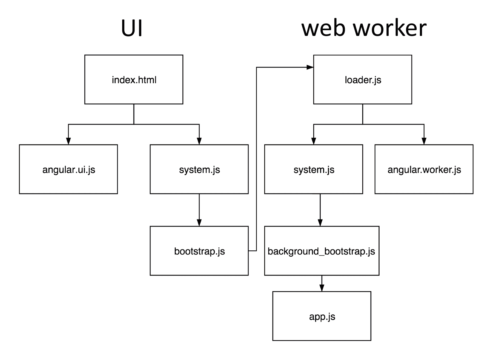
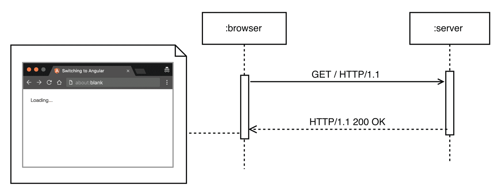
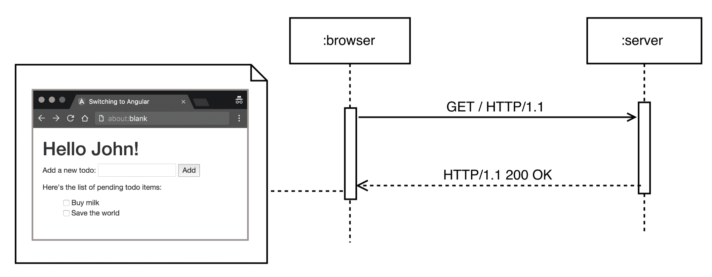

# 工具和开发体验

您已经熟悉 Angular 的所有核心概念。您知道如何开发基于组件的用户界面，利用框架提供的所有构建块——指令、组件、依赖注入、管道、表单以及全新的路由器。

本章更进一步，描述了以下内容：

+   为性能敏感的应用程序使用 Web Workers

+   使用服务器端渲染构建 SEO 友好的应用程序

+   尽快启动项目

+   提升我们作为开发者的体验

+   理解**即时编译**（**AOT**）是什么以及如何使用它

那么，让我们开始吧！

# 在 Web Worker 中运行应用程序

当在前端 Web 开发的上下文中谈论性能时，我们可以指的是网络、计算或渲染性能。在本节中，我们将专注于渲染和计算性能，它们非常紧密相关。

首先，让我们将网络应用与视频文件、浏览器与视频播放器之间的相似之处进行比较。在浏览器中运行的网络应用与在视频播放器中播放的视频文件之间最大的区别在于，网页需要动态生成，而视频则是已经录制、编码和分发的。然而，在这两种情况下，应用程序的用户都会看到一系列的帧；核心区别在于这些帧是如何生成的。在视频处理的世界里，当我们播放视频时，它已经记录好了；视频解码器的责任是根据使用的压缩算法提取单个帧。相比之下，在网络上，JavaScript、HTML 和 CSS 负责生成随后由浏览器渲染引擎渲染的帧。

在浏览器上下文中，我们可以将每一帧视为给定时刻网页的快照。不同的帧快速渲染，一个接一个；因此，在实际操作中，应用程序的最终用户应该看到它们平滑地结合在一起，就像在视频播放器中播放的视频一样。

在 Web 上，我们试图达到每秒 60 帧（**fps**），这意味着每一帧大约有 16 毫秒的时间来计算和渲染到屏幕上。这个时间段包括浏览器进行所有必要的布局和页面渲染计算（浏览器的内部计算）的时间，以及我们的 JavaScript 需要执行的时间。

最后，我们的 JavaScript 执行时间不到 16 毫秒（因为浏览器的内部计算）。如果它不能在这个时间段内完成，帧率将减半。由于 JavaScript 是单线程语言，所有计算都需要在主 UI 线程中发生，这可能导致由于帧率下降而造成非常差的用户体验。

HTML5 引入了一个名为**web workers**的 API，它允许客户端代码在多个线程中执行。为了简化，标准不允许各个线程之间共享内存，而是使用消息传递进行通信。Web Worker 和主 UI 线程之间交换的消息必须是字符串，这通常需要 JSON 字符串的序列化和反序列化。

在撰写本文时，TC39 正在制定独立计算单元之间共享内存的规范。有关更多信息，您可以访问[`github.com/tc39/ecmascript_sharedmem`](https://github.com/tc39/ecmascript_sharedmem)。

由于各个工作线程之间以及工作线程和主 UI 线程之间缺乏共享内存，这带来了一些限制，包括以下内容：

+   禁止工作线程访问 DOM

+   全局变量不能在各个计算单元（即工作线程和主 UI 线程以及反之）之间共享

# Web Worker 和 Angular

由于 Angular 的平台无关设计，核心团队决定利用这个 API；在 2015 年夏天，Google 将 Web Worker 支持嵌入到框架中。这个特性允许大多数 Angular 应用程序在单独的线程上运行，使得主 UI 线程只负责渲染。这比在单个线程中运行整个应用程序更容易实现 60 fps 的目标。

默认情况下，Web Worker 的支持没有被启用。当启用它时，我们需要记住一点——在一个准备好的 Web Worker 应用程序中，组件将不会在主 UI 线程中运行，这不允许我们直接操作 DOM。在这种情况下，我们需要使用 Angular 提供的更高层次的抽象 API 来建立数据绑定或操作元素属性。

# 在 Web Worker 中引导应用程序

让我们将我们在第五章，*入门 Angular 组件和指令*中开发的待办事项应用程序在 Web Worker 中运行。您可以在`ch9/todo_webworkers/`找到我们将要探索的示例。

注意，Web Worker 模块尚未最终确定，因此其 API 可能在 Angular 的未来版本中发生变化，甚至可能被弃用。概念思想和架构已经足够成熟，所以很可能不会有任何根本性的差异。

首先，让我们讨论我们需要做出的更改。查看`ch5/inputs-outputs/app.ts`。注意在`app.ts`内部，我们包含了来自`@angular/platform-browser-dynamic`模块的`platformBrowserDynamic`函数。这是我们首先需要修改的地方。在 Web Worker 中运行的应用程序的引导过程是不同的。

在重构我们的代码之前，让我们看一下一个图解，它展示了在 Web Worker 中运行的典型 Angular 应用程序的引导过程：



图 1

此图分为两部分：**UI**和**web worker**。**UI**显示了在主 UI 线程中初始化期间执行的操作；图中的**web worker**部分显示了应用程序如何在后台线程中启动。现在，让我们一步一步地解释启动过程。

首先，用户打开`index.html`页面，这将触发以下两个文件的下载：

+   用于在 Web Worker 中运行的应用程序的 Angular UI 包

+   `system.js`包（我们在第四章，*TypeScript 入门课程*中讨论了全局对象`System`。我们可以将`system.js`包视为模块加载器的 polyfill。）

使用`system.js`，我们下载了用于在主 UI 线程中运行的应用程序部分初始化的脚本（`bootstrap.js`）。此脚本在 Web Worker 中启动`loader.js`。这是在后台线程中运行的第一个脚本。一旦启动了工作者，`loader.js`将下载`system.js`和 Angular 的包，这些包旨在在后台线程中运行。第一次请求通常会命中缓存，因为`system.js`已经被主线程请求。使用模块加载器，我们下载了负责启动后台应用程序的脚本，即`background_bootstrap.js`，它最终将在 Web Worker 中启动我们应用程序的功能。

从现在开始，我们构建的整个应用程序将在 Web Worker 中运行，并与主 UI 线程交换消息以响应用户事件和渲染指令。

现在我们已经了解了使用工作者时初始化期间的基本事件流，让我们重构我们的待办事项应用程序以利用它们。

# 将应用程序迁移到 Web Workers

让我们看看我们如何使应用程序与 Web Workers 兼容。这样，我们可以在计算密集型应用程序中减少帧率下降，因为我们将释放主 UI 线程，让它只负责渲染。

在`index.html`内部，我们需要添加以下脚本：

```js
  <!-- ch9/todo_webworkers/index.html --> 
  ... 
  <script src="img/system.src.js"> 
  </script> 
  <script src="img/Reflect.js"></script> 
  <script src="img/zone.js"> 
  </script> 
  <!- 
    Contains some basic SystemJS configuration in order to 
    allow us to load Angular 
  --> 
  <script src="img/config.js"></script> 
  <script> 
  System.import('./bootstrap.js') 
    .catch(function () { 
      console.log('Report this error to https://github.com/mgechev/switching-to-angular/issues', e); 
    }); 
  </script> 
  ... 
```

在前面的代码片段中，我们包含了`system.js`、`zone.js`和`reflect-metadata`的引用。`zone.js`是 Angular 独家使用的区域的 polyfill，我们在本书中之前提到过。此外，`reflect-metadata`包含了对 Metadata Reflection API 的另一个 polyfill，在撰写本文时，该 API 在浏览器中尚不可用。

在下一步中，我们将显式导入`bootstrap.js`文件，该文件包含用于在 Web Worker 中启动`loader.js`脚本的逻辑。

让我们探索`bootstrap.ts`，这是已转换的`bootstrap.js`文件的原始 TypeScript 版本：

```js
// ch9/todo_webworkers/bootstrap.ts 

// main entry point
import {bootstrapWorkerUi} from '@angular/platform-webworker';

bootstrapWorkerUi('loader.js');
```

在这里，我们将`'loader.js'`传递给`bootstrapWorkerUi`的调用。这样，Angular 就知道`loader.js`将在后台线程中运行。该脚本位于应用程序的根目录。

现在，我们可以转向*在 Web Worker 中启动应用程序*部分中显示的图表的右侧。`loader.ts`（`loader.js`的原始 TypeScript 版本）中的逻辑非常简单：

```js
// ch9/todo_webworkers/loader.ts

importScripts('/node_modules/systemjs/dist/system.src.js', 
      '/node_modules/reflect-metadata/Reflect.js', 
      '/node_modules/zone.js/dist/zone.js', 
      './config.js'); 

System.import('./background_app.js') 
.then(() => console.log('The application has started successfully'), 
  error => console.error('error loading background', error)); 
```

作为第一步，我们导入`SystemJS`、`ReflectMetadata` polyfills、`zone.js`以及`SystemJS`的配置。由于这个脚本已经在 Web Worker 中运行，我们有`importScripts`函数，它允许我们同步加载列出的文件。作为最后一步，使用`System`导入包含我们应用程序的脚本。

现在，让我们探索如何在 Web Worker 内部启动应用程序：

```js
// ch9/todo_webworkers/background_app.ts

import {platformWorkerAppDynamic} from '@angular/platform-webworker-dynamic';

// Logic for the application... 

platformWorkerAppDynamic().bootstrapModule(AppModule)
  .catch(err => console.error(err));
```

这个过程与我们启动在主 UI 线程中运行的 Angular 应用程序时所做的非常相似。我们导入`platformWorkerAppDynamic`函数，并调用其调用的结果中的`bootstrapModule`方法。我们将应用程序的根模块作为参数传递给`bootstrapModule`。

# 使应用程序与 Web Worker 兼容

正如我们所说的，在 Web Worker 上下文中运行的代码无法访问 DOM。让我们看看我们需要做出哪些更改来解决这个问题。

这是`InputBox`组件的原始实现：

```js
// ch5/inputs-outputs/app.ts

@Component({ 
  selector: 'input-box', 
  template: ` 
    <input #todoInput [placeholder]="inputPlaceholder"> 
    <button (click)="emitText(todoInput.value); todoInput.value = '';"> 
      {{buttonLabel}} 
    </button> 
  ` 
}) 
class InputBox { 
  @Input() inputPlaceholder: string; 
  @Input() buttonLabel: string; 
  @Output() inputText = new EventEmitter<string>();

  emitText(text: string) { 
    this.inputText.emit(text); 
  } 
} 
```

注意，在模板内部，我们使用`todoInput`标识符引用输入元素，并在表达式集中使用该引用作为点击事件的处理器。这段代码无法在 Web Worker 中运行，因为我们直接在模板内部访问 DOM 元素。为了解决这个问题，我们需要重构代码片段，使其使用 Angular 数据绑定而不是直接触摸任何元素。我们可以使用 Angular 输入，当单方向绑定有意义时，或者使用`NgModel`来实现双向数据绑定，这会稍微消耗更多的计算资源。

让我们使用`NgModel`：

```js
// ch9/todo_webworkers/background_app.ts 
import {NgModel} from '@angular/common'; 

@Component({ 
  selector: 'input-box', 
  template: ` 
    <input [placeholder]="inputPlaceholder" [(ngModel)]="input"> 
    <button (click)="emitText()"> 
      {{buttonLabel}} 
    </button> 
  ` 
}) 
class InputBox { 
  @Input() inputPlaceholder: string; 
  @Input() buttonLabel: string; 
  @Output() inputText = new EventEmitter<string>(); 
  input: string;

  emitText() { 
    this.inputText.emit(this.input); 
    this.input = ''; 
  } 
} 
```

在这个版本的`InputBox`组件中，我们在输入元素和`InputBox`组件的`input`属性之间创建了一个双向数据绑定。一旦用户点击按钮，`emitText`方法将被调用，这将触发由`inputText`（`EventEmitter`的一个实例）发出的新事件。为了重置输入元素的值，我们利用 Angular 的双向数据绑定机制，将`input`属性的值设置为空字符串；这将自动更新 UI。

将整个逻辑从组件的模板移动到它们的控制器中带来了很多好处，例如提高了可测试性、可维护性、代码重用和清晰度。

前面的代码与 Web Worker 环境兼容，因为`NgModel`指令基于一个不直接操作 DOM 的抽象。相反，它将这个责任委托给另一个名为`Renderer`的抽象，其 Web Worker 实现通过与主 UI 线程异步交换消息来处理。

回顾一下，我们可以这样说，在 web worker 的上下文中运行应用程序时，我们需要记住以下两点：

+   我们需要使用不同的引导过程

+   我们不应该直接访问 DOM

违反第二点的典型场景如下：

+   通过选择一个元素并直接使用浏览器的原生 API 或第三方库来操作它，改变页面的 DOM

+   使用 `ElementRef` 注入的本地元素进行访问

+   在模板中创建一个元素的引用并将其作为参数传递给方法

+   直接操作模板中引用的元素

在所有这些场景中，我们都需要使用 Angular 提供的高级 API。如果我们根据这种做法构建我们的应用程序，我们不仅能从中受益于能够在 web workers 中运行它们，还能在想要在不同平台上使用它们时，增加代码的重用性。

记住这一点并遵循最佳实践也将使我们能够利用服务器端渲染。

# 单页应用程序的初始加载

在本节中，我们将探讨服务器端渲染的概念，为什么我们需要在我们的应用程序中使用它，以及我们如何使用 Angular 来实现它。

对于我们的目的，我们将解释当用户打开一个使用 Angular 实现的单页应用程序时的典型事件流程。首先，我们将跟踪服务器端渲染禁用时的事件，然后我们将看到如何通过启用此功能来从中受益。我们的示例将在 HTTP 1.1 的上下文中进行说明：



图 2

*图 2* 展示了浏览器在加载典型 SPA 时的第一次请求以及相应服务器的响应。客户端最初将看到的是 HTML 页面的内容，没有任何渲染的组件。

假设我们将第五章《使用 Angular 组件和指令入门》中构建的待办事项应用程序部署到一个与 `example.com` 域关联的 Web 服务器上。

一旦用户导航到 `https://example.com/`，浏览器将发起一个新的 HTTP GET 请求，获取根资源（`/`）。当服务器收到请求时，它将响应一个 HTML 文件，在我们的例子中，它看起来可能像这样：

```js
<!DOCTYPE html> 
<html lang="en"> 
<head> 
  <title>...</title> 
  <link rel="stylesheet" href="bootstrap.min.css"> 
</head> 
<body> 
  <app>Loading...</app> 
  <script src="img/es6-shim.min.js"></script> 
  <script src="img/Reflect.js"></script> 
  <script src="img/system.src.js"></script> 
  <script src="img/angular-polyfills.js"></script> 
  <script src="img/Rx.min.js"></script> 
  <script src="img/angular.js"></script> 
  <script>...</script> 
</body> 
</html> 
```

浏览器将把此内容作为响应的主体。当标记渲染到屏幕上时，用户将看到的只是 Loading... 标签。

在下一步中，浏览器将找到 HTML 文件中所有外部资源的引用，例如样式和脚本，并开始下载它们。在我们的例子中，其中一些是 `bootstrap.css`、`es6-shim.min.js`、`Reflect.js`、`system.src.js` 和 `angular-polyfills.js`。

一旦所有引用的资源都可用，用户仍然不会看到任何显著的视觉进展（除非下载的 CSS 文件中的样式应用到页面上）。这不会改变，直到 JavaScript 虚拟机处理完与应用程序实现相关的所有引用脚本。到这时，Angular 将知道根据当前 URL 和配置需要渲染哪个组件。

如果与页面关联的组件定义在我们的主应用程序包之外的其他文件中，框架将需要下载它以及它的整个依赖图。

如果我们使用 JIT 编译，在组件的模板和样式外部化时，Angular 需要在能够渲染请求的页面之前下载它们。在这之后，框架将能够编译与目标组件相关的模板并渲染页面。

在这个场景中，有两个主要的陷阱：

+   在大型应用程序和/或慢速互联网连接的情况下，用户体验将会很差

+   搜索引擎在索引由 JavaScript 生成的动态内容方面并不出色；这意味着我们的 SPA 的 SEO 将会受到影响

在过去，我们使用 AngularJS 构建的应用程序中，通过不同的解决方案解决了 SEO 问题，例如使用无头浏览器渲染请求的页面，将其缓存到磁盘上，然后提供给搜索引擎。然而，有一个更优雅的解决方案。

# 使用服务器端渲染的单页应用程序的初始加载

几年前，像*Rendr*、*Derby*和*Meteor*这样的库引入了**同构**JavaScript 应用程序的概念，后来被更名为**通用**。本质上，通用应用程序可以在客户端和服务器上运行。这种可移植性只有在 SPA 和浏览器 API 之间耦合度低的情况下才可能实现。这种范例的巨大好处是代码重用，能够在发送到客户端之前在服务器上渲染应用程序。

通用应用程序不是框架特定的；我们可以在任何可以在浏览器环境之外运行的框架中利用它们。从概念上讲，服务器端渲染的实践在各个平台和库之间非常相似；只有其实现细节可能不同。例如，实现服务器端渲染的 Angular Universal 模块支持 node.js 以及 ASP.NET。



图 3

*图 3* 显示了服务器对初始浏览器 GET 请求的响应。这次，与典型的 SPA 加载场景相反，浏览器将接收到渲染页面的 HTML。

让我们跟踪在服务器端渲染功能启用的情况下，同一应用程序中事件流的流程。在这种情况下，一旦服务器接收到浏览器发出的 HTTP GET 请求，它将在 node.js 环境中运行 SPA。所有的 DOM 调用都将被重定向到服务器端 DOM 实现，并在使用平台的上下文中执行。同样，所有使用 Angular HTTP 模块的 AJAX 调用都将由模块的服务器端实现处理。这样，应用程序在浏览器或服务器上下文中运行时不会有任何区别。

一旦 SPA 的渲染版本可用，它可以序列化为 HTML 并发送到浏览器。这次，在应用程序初始化期间，而不是显示“加载中...”标签，用户将立即看到他们请求的页面。

注意，此时，客户端将拥有应用程序的渲染版本，但所有引用的外部资源，如脚本和样式，仍然需要可用。这意味着，最初，外部文件中声明的所有 CSS 样式都不会应用，并且应用程序不会对任何与用户相关的交互做出响应，例如鼠标和键盘事件。

如果脚本在服务器端渲染的页面上内联，应用程序将响应用户事件。然而，通常认为在内联大量 JavaScript 是一种不良做法，因为它会极大地增加页面大小，并阻止脚本缓存，这会影响网络性能。

当 JavaScript 虚拟机处理与页面关联的 JavaScript 时，我们的 SPA 将准备好使用。

# 使用 Angular 进行服务器端渲染

在 2015 年上半年，Angular 社区成员宣布他们已经开始开发模块，**Universal**。Universal 是一个库，允许我们使用 Angular 构建通用（也称为同构）JavaScript 应用程序；换句话说，它提供了服务器端渲染支持。后来，该项目被转移到 Angular 核心仓库，目前由 Google 维护。

使用 Angular Universal 并服务器端渲染的应用程序，在请求页面的所有 JavaScript 处理完毕之前，不会响应用户交互。这是我们之前提到的一个缺点，适用于所有服务器端渲染的应用程序。为了处理这个问题，Angular Universal 引入了**preboot.js**，这是一个轻量级的库，它将被内联在服务器渲染的页面上，并在初始响应中可用。

Preboot.js 在应用程序完全初始化之前对接收到的客户端事件有几种管理策略；如下所示：

+   记录和回放事件

+   立即响应用件

+   在页面重新渲染时保持焦点

+   缓存客户端重新渲染以实现更平滑的过渡

+   在引导完成前冻结页面

在撰写本书时，Universal 模块仍在积极开发中。您可以使用 Angular Universal Starter 在 [`github.com/angular/universal-starter`](https://github.com/angular/universal-starter) 尝试它。

# 提升我们的开发体验

我们作为开发者的经验可以通过提高生产力或使我们的开发体验更加愉快来提升。这可以通过我们每天使用的所有工具、IDE、文本编辑器等实现。在本节中，我们将简要介绍一些流行的 IDE 和文本编辑器，它们利用了 Angular 提供的可静态分析的语法。我们还将提到 Angular 团队开发的语言服务。

# 文本编辑器和 IDE

正如我们在本书开头所说，核心团队在 Angular 中投入了大量精力来增强工具支持。首先，该框架是用 TypeScript 编写的，这自然允许我们在开发过程中使用静态类型。以下是一些具有出色 TypeScript 支持的文本编辑器和 IDE：

+   **IntelliJ IDEA**：JetBrains 开发的一款通用 IDE

+   **WebStorm**：JetBrains 开发的一款专注于 Web 开发的 IDE

+   **VSCode**：由微软开发的一款跨平台文本编辑器，使用 TypeScript 编写

+   **Sublime Text**：一款跨平台文本编辑器

+   **Atom**：一款基于 Electron 的跨平台文本编辑器，使用 JavaScript 编写

尽管在撰写本书时，并非所有提到的 IDE 和文本编辑器都具有 Angular 特定功能，但该框架在设计时就考虑了工具支持。它允许对应用程序的代码进行高级静态代码分析，这可以提供复杂的重构和生产率功能。一个能够启用 Angular 这一功能并为 IDE 和文本编辑器开发者提供通用接口的工具是语言服务。

# Angular 语言服务

利用 Angular 的可分析特性，Google 为该框架开发了一个 **语言服务**。我们可以将此服务视为一个服务器，它索引我们的项目，并根据客户端请求提供自动完成建议、模板中的类型检查和其他功能。这个客户端可以是我们的文本编辑器或 IDE 的插件。

语言服务可以跟踪文本编辑器中当前聚焦的组件的上下文，并提供上下文相关的建议。例如，它可以基于组件树中给定部分的可用指令集提供自动完成建议。

语言服务的最好之处在于它不依赖于任何特定的文本编辑器或 IDE，这意味着，通过一个轻量级的插件，它可以在任何开发环境中重用。

# 使用 angular-cli 引导项目

在 AngularConnect 2015 期间，Angular 团队的部分成员 Brad Green 和 Igor Minar 宣布了`angular-cli`——一个**CLI**（**命令行界面**）工具，用于简化 Angular 应用程序的启动和管理。对于那些使用过 Ruby on Rails 的人来说，CLI 工具背后的理念可能很熟悉。该工具的基本目的是允许快速设置新项目和构建新的指令、组件、管道和服务。

在撰写本文时，该工具基于 webpack。让我们展示其基本用法。

# 使用 angular-cli

为了安装 CLI 工具，请在您的终端中运行以下命令：

```js
$ npm install -g angular-cli
```

在此之后，`ng`命令将出现在您的系统中的全局可执行文件中。要创建一个新的 Angular 项目，请使用以下命令：

```js
# May take a while, depending on your internet connection 
$ ng new angular-cli-project 
$ cd angular-cli-project 
$ ng serve 
```

以下命令将执行以下操作：

+   创建一个新的 Angular 项目并安装其所有的`npm`依赖项

+   进入项目目录

+   启动一个开发 Web 服务器，该服务器将监视项目目录中的更改，并在我们更改其中的任何文件时向浏览器发送刷新命令

对于进一步阅读，请查看位于[`github.com/angular/angular-cli`](https://github.com/angular/angular-cli)的项目仓库。

Angular CLI 提供了一个高度封装的构建，因此默认情况下，它不会暴露任何底层的工具。对于更高级的情况，当我们想在构建中引入自定义逻辑时，我们可以使用以下方法从 CLI 项目中退出：

```js
$ ng eject
```

此命令将导出内部 webpack 配置，并允许我们手动更新它。

除非组织设置了限制或我们有不同的偏好，否则使用 Angular CLI 为新项目是一个好主意。虽然 Angular CLI 提供的构建可以被视为一个黑盒，修改起来并不简单，但通常不需要修改，因为它涵盖了小型和中型项目的大部分用例。

# Angular 快速入门

如果您更喜欢不那么封装的构建，社区已经开发了许多入门项目，可以为您的下一个 Angular 项目提供一个良好的起点。

# Angular 种子

如果您喜欢静态类型，您可以尝试**Angular Seed**项目。该项目托管在 GitHub 上，网址为[`github.com/mgechev/angular-seed`](https://github.com/mgechev/angular-seed)。

Angular Seed 提供了以下关键特性：

+   易于扩展、模块化和静态类型化的构建系统

+   AOT 编译支持

+   在单个种子实例中支持多个 Angular 应用程序，具有共享的代码库

+   生产环境和开发构建

+   使用 Jasmine 和 Karma 的示例单元测试

+   使用 Protractor 进行端到端测试

+   带有 LiveReload 的开发服务器

+   使用 codelyzer 进行静态代码分析，这验证了项目遵循 Angular 风格指南中的实践

+   遵循应用程序和文件组织的最佳实践

+   为开发和生产环境提供完整的 Docker 支持

书籍中分发的代码基于此种子项目。

对于 Angular Seed，您需要在您的计算机上安装`node.js`、`npm`和`git`。为了获取启动器项目，请运行以下命令列表：

```js
$ git clone --depth 1 https://github.com/mgechev/angular-seed.git 
$ cd angular-seed 
$ npm install 
$ npm start 
```

一旦命令执行完成，您的浏览器将自动打开种子项目的首页。当您的项目中的任何文件发生变化时，应用程序将自动重新构建，并且您的浏览器将被刷新。

默认情况下，生产构建生成一个包含应用程序和所有引用库的压缩版本的单一包。Angular Seed 还支持 AOT 编译和可扩展的构建系统。

# Angular webpack 启动器

如果您更喜欢 webpack，可以使用*angular-starter*。这是一个由*AngularClass*开发的启动器项目，托管在 GitHub 上。您可以在[`github.com/AngularClass/angular-starter`](https://github.com/AngularClass/angular-starter)找到它。

此启动器提供了以下功能：

+   Angular 在文件和应用程序组织方面的最佳实践

+   使用 webpack 的现成构建系统来处理 TypeScript

+   使用 Jasmine 和 Karma 测试 Angular 代码

+   使用 Istanbul 和 Karma 进行覆盖率测试

+   使用 Protractor 进行端到端 Angular 代码

为了尝试它，您需要在您的计算机上安装`node.js`、`npm`和`git`，并运行以下命令：

```js
$ git clone --depth 1 https://github.com/angularclass/angular-starter.git 
$ cd angular-starter 
# WINDOWS only. In terminal as administrator
$ npm install -g node-pre-gyp
$ npm install 
$ npm start 
```

# Angular 的预编译

在本节中，我们将简要解释在 Angular 的上下文中 AOT 编译是什么，以及它可能对我们的项目产生什么影响。

Angular 的关键焦点是其极快的变更检测机制。在探索了在视图模型中检测变更的不同选项之后，Angular 团队发现，AngularJS 中使用的变更检测机制可以通过**代码生成**进行显著改进。结果是，可以为 JavaScript 虚拟机生成优化的代码，该虚拟机执行变更检测和高效渲染。经过大量的基准测试，谷歌发现这种策略比传统的（也称为动态的）变更检测机制性能要好得多。

# 代码生成是如何工作的

Angular 代码生成器被称为 Angular 编译器。它将 Angular 组件的模板编译成 JavaScript 或 TypeScript（取决于编译目标）。当我们把模板编译成 TypeScript 时，我们允许 TypeScript 编译器执行类型检查，不仅在我们的组件、指令、服务和管道的命令式逻辑中，而且在组件的模板中！在模板中执行类型检查有助于我们在应用程序中找到更多潜在的问题。

除了为模板生成代码之外，Angular 编译器还为我们应用程序中的注入器生成代码。这进一步提高了依赖注入机制的效率。

基于对模板中绑定进行的静态分析，生成的模板代码执行了最有效的变更检测和最优化更新 DOM 树的操作，这取决于变化值。除此之外，生成的代码还利用了 JavaScript 虚拟机的内联缓存机制，这带来了额外的性能提升。

关于内联缓存的进一步阅读，请参阅这篇文章：*在 JavaScript 中解释 JavaScript 虚拟机 - 内联缓存*，位于[`mrale.ph/blog/2012/06/03/explaining-js-vms-in-js-inline-caches.html`](http://mrale.ph/blog/2012/06/03/explaining-js-vms-in-js-inline-caches.html)。

代码生成可以是运行时执行，称为**即时**（**JIT**）编译，或者构建时执行，称为 AOT 编译。由于 JIT 编译涉及在运行时评估代码，因此建议你在具有严格**内容安全策略**（**CSP**）且`eval`不可用的环境中使用 AOT。

# 介绍**提前编译**的概念

从 AOT 中，我们获得了一些改进。首先，如果我们将 Angular 应用程序作为构建过程的一部分进行编译，我们就不需要在运行时编译它。这意味着我们不会遇到使用 JIT 时遇到的运行时性能下降。这样，AOT 提供了更快的应用程序初始渲染，因为 Angular 在初始化期间需要做的工作更少。

此外，由于我们不再需要在运行时执行编译，我们可以将整个`@angular/compiler`模块从最终的应用程序包中删除，从而减小包的大小。

最后，我们可以通过**树摇**进行更高效的无效代码消除。树摇意味着删除未使用的导出，这是 ES2015 模块静态性质的一个伟大特性。当我们依赖于 JIT 编译时，我们可以在模板内部通过选择器引用不同的组件。然而，模板是类似 HTML 的格式，现代的压缩器（如 UglifyJS 和 Google Closure Compiler）并不理解。这意味着它们不能消除所有未使用的导出（例如，未使用的组件），因为它们不确定模板中确切使用了什么。一旦在构建时，Angular 编译器将模板转换为 TypeScript 或 JavaScript；使用静态 ES2015 导入，打包器可以应用传统的无效代码消除技术，从而进一步减小包的大小！

如果你对进一步阅读感兴趣，可以查看位于[`goo.gl/eXieJl`](https://goo.gl/eXieJl)的 Angular 的*提前编译*文章。

# 提前编译的限制

请记住，Angular 编译器需要类型元数据才能执行编译过程。这意味着如果你不使用 TypeScript，你将无法执行 AOT 编译。

AOT 编译是在构建时收集元数据来执行的。这意味着在某些情况下，我们的代码可能与 JIT 一起工作，但如果我们在构建时无法解析动态结构，则可能无法在 AOT 中工作。

关于哪些语法结构可能不适用于 AOT 编译的更多详细信息，请查看以下存储库[`goo.gl/F7cV1s`](https://goo.gl/F7cV1s)。

最后，模板生成的代码不是组件控制器本身的一部分。这意味着我们无法绑定到非公共字段，因为在编译过程中，TypeScript 会抛出一个错误。

# 如何使用 Angular 的即时编译

Angular 的 AOT 编译已经在最受欢迎的入门项目中得到支持。

在撰写本文时，Angular CLI 默认在生产构建中执行 AOT 编译。要获取优化的生产资源，请运行以下命令：

```js
$ ng build --prod
```

当 Angular 2.0.0-rc.5 发布时，Angular Seed 引入了 AOT 编译。通过种子，您可以通过运行以下命令来利用它带来的所有好处：

```js
$ npm run build.prod.aot
```

通过执行前面的命令，您将获得一个优化良好的生产构建。

由于网络工具频繁变化，我们没有深入探讨 Angular Seed 或 Angular CLI 如何生成生产构建。如果您对底层发生的事情感兴趣，可以查看以下文章[`goo.gl/kAiJUJ`](https://goo.gl/kAiJUJ)。

# 摘要

我们通过介绍 Angular 重写的背后原因开始了我们的旅程，随后是一个概念概述，它让我们对框架的构建块有了大致的了解。在下一步中，我们学习了第四章*TypeScript 快速入门*课程，为第五章*Angular 组件和指令入门*做好了准备，在那里我们深入探讨了 Angular 的指令、组件和变更检测。

在第六章*Angular 中的依赖注入*中，我们解释了依赖注入机制，并看到了它与组件层次结构的关系。在接下来的章节中，我们看到了如何开发表单和管道，并利用 Angular 的路由器。

通过完成本章，我们完成了对框架的探索之旅。在撰写本文时，Angular 核心的设计决策和理念已经稳固并最终确定。尽管框架仍然非常新，但在过去一年中，其生态系统已经达到我们可以开发生产就绪、高性能和 SEO 友好的应用程序的水平，并且在此基础上，我们还可以享受到静态类型和 IDE 支持的出色开发体验。
