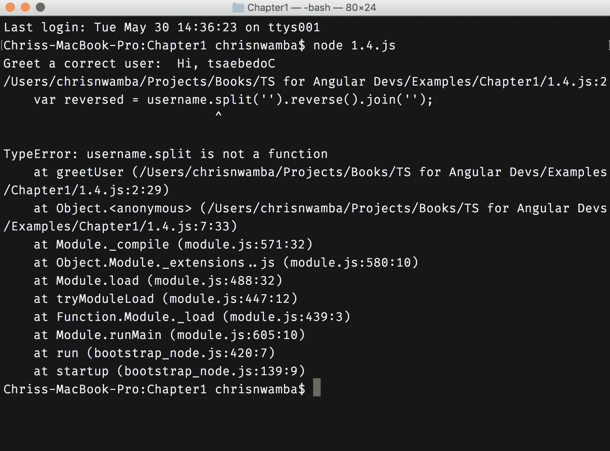
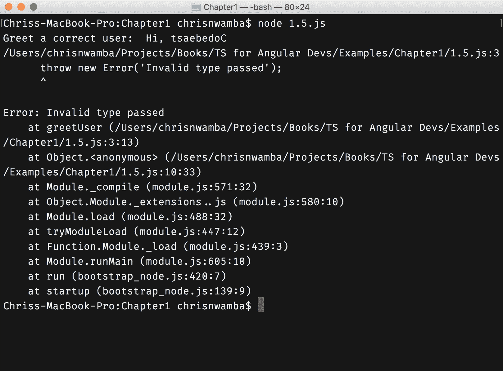

# 从松散类型到严格类型

*JavaScript 是松散类型的*。这是值得重复的，*JavaScript 是松散类型的*。注意句子是如何被动的——我们不能明确地责怪某人对 JavaScript 松散类型特性的贡献，就像我们不能对 JavaScript 的其他著名缺陷这样做一样。

对松散类型和松散类型语言进行详细讨论将有助于你理解我们计划用这本书解决的问题。

当一种编程语言是松散类型的，这意味着使用变量、函数或适用于该语言的任何成员传递的数据没有定义的类型。变量 `x` 可以被声明，但它所持有的数据类型永远是不确定的。松散类型语言与严格类型语言相反，后者强制要求每个声明的成员必须严格定义它可以存储的数据类型。

这些类型被分为：

+   字符串

+   数字（int、float 等。）

+   数据结构（数组、列表、对象、映射等。）

+   布尔值（true 和 false）

JavaScript、PHP、Perl、Ruby 等，都是松散类型语言的例子。Java、C、C# 是严格类型语言的例子。

在松散类型语言中，一个成员最初可能被定义为字符串。随后，这个成员可能最终存储数字、布尔值，甚至数据结构。这种不稳定性导致了松散类型语言的含义。

# 术语定义

在我们继续前进之前，定义一下你在理解松散和严格类型的过程中可能遇到或将会遇到的常见术语会很好：

+   **成员**：这些是描述数据存储和操作方式的编程语言特性。变量、函数、属性、类、接口等，都是语言可能拥有的可能成员的例子。

+   **声明、定义与赋值**：当一个变量没有初始化值时，它被称为*声明*。当它被声明并具有类型时，它被称为*定义*。当变量有值，无论是有意还是无意，它被称为*赋值*。

+   **类型**：这些用于根据数据的解析和操作方式对数据进行分类。例如，数字、字符串、布尔值、数组等。

+   **值**：分配给特定成员的数据称为该成员的值。

# 松散类型的含义

让我们用一个例子来展示松散类型语言的行为：

```js
// Code 1.1

// Declare a variable and assign a value
var x = "Hello";

// Down the line
// you might have forgotten 
// about the original value of x
//
//
// Re-assign the value
x = 1;

// Log value
console.log(x); // 1
```

变量 `x`最初被声明并分配了一个字符串值，`Hello`。相同的`x`被重新分配为一个数值，`1`。没有出错；代码被解释，当我们将其值记录到控制台时，记录的是`x`的最新值，即`1`。

这不仅仅是字符串和数字的事情；同样的事情适用于其他所有类型，包括复杂的数据结构：

```js
// Code 1.2

var isCompleted;

// Assign null
isCompleted = null;
console.log('When null:', isCompleted);

// Re-assign a boolean
isCompleted = false;
console.log('When boolean:', isCompleted);

// Re-assign a string
isCompleted = 'Not Yet!';
console.log('When string:', isCompleted);

// Re-assign a number
isCompleted = 0;
console.log('When number:', isCompleted);

// Re-assign an array
isCompleted = [false, true, 0];
console.log('When array:', isCompleted);

// Re-assign an object
isCompleted = {status: true, done: "no"};
console.log('When object:', isCompleted);

/**
* CONSOLE:
*
* When null: null
* When boolean: false
* When string: Not Yet!
* When number: 0
* When array: [ false, true, 0 ]
* When object: { status: true, done: 'no' }
*/
```

这里需要注意的重要事情不是*值*在变化。而是*值和类型*都在变化。类型的变化不会影响执行。一切正常，我们在控制台中得到了预期的结果。

函数的参数和返回类型也不会被忽略。你可以有一个接受字符串参数的函数签名，但当你或任何其他开发者调用函数时传入一个数字，JavaScript 会保持沉默：

```js
function greetUser( username ) {
 return `Hi, ${username}`
}

console.log('Greet a user string: ', greetUser('Codebeast'))
console.log('Greet a boolean: ', greetUser(true))
console.log('Greet a number: ', greetUser(1))

/**
 * CONSOLE:
 *
 * Greet a user string: Hi, Codebeast
 * Greet a boolean: Hi, true
 * Greet a number: Hi, 1
 */
```

如果你来自强类型背景，并且没有使用弱类型语言的先前经验，前面的例子可能感觉很不寻常。这是因为，在强类型语言中，改变特定成员（变量、函数等）的类型是很困难的。

那么，我们应该注意什么含义呢？明显的含义是，那些弱类型的成员是不一致的。因此，它们的值类型可能会变化，这是你需要作为开发者留意的。这样做会带来挑战；让我们来谈谈这些挑战。

# 问题

弱类型很棘手。乍一看，它们看起来都很不错，很灵活，易于处理——灵活性，意味着你可以随时随地方便地更改类型，而不会像其他强类型语言那样让解释器发出错误。就像任何其他形式的自由一样，这种自由也有代价。

主要问题是缺乏一致性。很容易忘记成员的原始类型。这可能会导致你错误地处理字符串，就像它仍然是字符串一样，而它的值现在是布尔值。让我们看看一个例子：

```js
function greetUser( username ) {
 // Reverse the username
 var reversed = username.split('').reverse().join('');
 return `Hi, ${reversed}`
}

console.log('Greet a correct user: ', greetUser('Codebeast'))

 * CONSOLE:
 *
 * Greet a correct user: Hi, tsaebedoC
 */
```

在前面的例子中，我们有一个根据用户名问候用户的函数。在它进行问候之前，它首先反转用户名。我们可以通过传入一个用户名字符串来调用这个函数。

当我们传入布尔值或其他没有`split`方法的类型时，会发生什么？让我们来看看：

```js
// Code 1.4

function greetUser( username ) {
 var reversed = username.split('').reverse().join('');
 return `Hi, ${reversed}`
}

console.log('Greet a correct user: ', greetUser('Codebeast'))

// Pass in a value that doesn't support
// the split method
console.log('Greet a boolean: ',greetUser(true))

 * CONSOLE:
 *
 * Greet a correct user: Hi, tsaebedoC
 * /$Path/Examples/chapter1/1.4.js:2
 * var reversed = username.split('').reverse().join('');
                          ^
 * TypeError: username.split is not a function
 */
```

第一个日志输出，打印带有字符串的问候语，输出正常。但第二次尝试失败了，因为我们传入了一个布尔值。在 JavaScript 中，*一切*都是对象，布尔值没有`split`方法。前面的图片显示了前面例子的清晰输出：



是的，你可能正在想，你是这段代码的作者；当你设计函数接收字符串时，为什么你会传入一个布尔值？记住，我们一生中写的绝大多数代码不是由我们自己维护，而是由我们的同事来维护。

当另一位开发者接手`greetUser`函数并决定将其作为 API 使用，而没有深入查看代码的源代码或文档时，他/她很可能不会传入正确的值类型。这是因为*他/她处于盲目状态*。没有任何东西告诉他/她什么是正确的，什么是不正确的。甚至函数的名字也不够明显，以至于她无法传入一个字符串。

JavaScript 经历了演变。这种演变不仅体现在其内部，也体现在其庞大的社区中。社区提出了应对 JavaScript 松散类型特性的挑战的最佳实践。

# 缓解松散类型问题

JavaScript 没有针对松散类型带来的问题的原生明显解决方案。相反，我们可以使用 JavaScript 的所有形式的条件检查来查看所讨论的值是否仍然是预期的类型。

我们将查看一些示例，在这些示例中，手动检查被应用以保持值类型的完整性。

流行说法“在 JavaScript 中，*一切都是对象*”并不完全正确([`blog.simpleblend.net/is-everything-in-javascript-an-object/`](https://blog.simpleblend.net/is-everything-in-javascript-an-object/))。有*对象*和*原始值*。字符串、数字、布尔值、null、undefined 是原始值，但在计算过程中被当作对象处理。这就是为什么你可以在字符串上调用像`.trim()`这样的方法。对象、数组、日期和正则表达式是有效的对象。说一个对象是对象，但那是 JavaScript 的特点。

# `typeof`运算符

`typeof`运算符用于检查给定操作数的类型。你可以使用这个运算符来控制松散类型的危害。让我们看看一些例子：

```js
// Code 1.5
function greetUser( username ) {
 if(typeof username !== 'string') {
   throw new Error('Invalid type passed');
 };
 var reversed = username.split('').reverse().join('');
 return `Hi, ${reversed}`
}

console.log('Greet a correct user: ', greetUser('Codebeast'))
console.log('Greet a boolean: ',greetUser(true))
```

而不是等待系统告诉我们传入无效类型时我们错了，我们尽早捕获错误并抛出一个自定义且更友好的错误，如下面的截图所示：



`typeof`运算符返回一个字符串，表示值的类型。`typeof`运算符并不完全完美，并且只有在你知道它如何工作的情况下才应该使用。请看以下问题：

```js
function greetUser( user ) {
 if ( typeof user !== 'object' ) {
   throw new Error('Type is not an object');
 }
 return `Hi, ${user.name}`;
}

console.log('Greet a correct user: ', greetUser( {name: 'Codebeast', age: 24 } ))
// Greet a correct user: Hi, Codebeast

console.log('Greet a boolean: ', greetUser( [1, 2, 3] ))
// Greet a boolean: Hi, undefined
```

你可能预期当函数第二次用数组作为参数调用时会抛出错误。相反，程序通过了检查并在意识到`user.name`是未定义之前执行了`user.name`。为什么它通过了这个检查？记住，数组是一个对象。因此，我们需要更具体的东西来捕获这个检查。日期和正则表达式也可以通过这个检查，尽管这可能不是预期的意图。

# `toString`方法

`toString`方法被所有对象和包装对象（原始值）原型继承。当你调用此方法时，它返回一个表示类型的字符串标记。请看以下示例：

```js
Object.prototype.toString.call([]); // [object Array] Object.prototype.toString.call({}); // [object Object] Object.prototype.toString.call(''); // [object String] Object.prototype.toString.call(new Date()); // [object Date]
// etc
```

现在，你可以使用这个方法来检查类型，如 Todd Motto([`toddmotto.com/understanding-javascript-types-and-reliable-type-checking/#true-object-types`](https://toddmotto.com/understanding-javascript-types-and-reliable-type-checking/#true-object-types))所示：

```js
var getType = function (elem) {
 return Object.prototype.toString.call(elem).slice(8, -1);
};
var isObject = function (elem) {
 return getType(elem) === 'Object';
};

// You can use the function
// to check types
if (isObject(person)) {
 person.getName();
}
```

前面的示例所做的检查是检查由`toString`方法返回的字符串部分以确定其类型。

# 最后的注意事项

我们之前看到的例子对于一个简单的类型检查来说已经过度了。如果 JavaScript 有严格的类型特性，我们就不会经历这样的压力。实际上，这一章可能根本就不会存在。

想象一下 JavaScript 可以这样做：

```js
function greet( username: string ) {
 return `Hi, ${username}`;
}
```

我们不会经历所有那些类型检查的痛苦，因为编译器（以及编辑器）在遇到类型不一致时都会抛出错误。

这就是 TypeScript 发挥作用的地方。幸运的是，有了 TypeScript，我们可以编写看起来像前面那样的代码，并且我们可以将其转换为 JavaScript。

# 摘要

在整本书中，我们将讨论 TypeScript，不仅用于构建 JavaScript 应用程序，也用于构建 Angular 应用程序。Angular 是一个 JavaScript 框架；因此，除非通过 TypeScript 缓解，否则它将具有讨论的限制。

既然你已经知道了当前的问题，那么在我们深入探讨 Angular 以及 TypeScript 提供的可能解决方案时，请系好安全带。

到目前为止，一切顺利！我们已经能够讨论以下问题，以帮助我们前进：

+   理解弱类型

+   弱类型和严格类型之间的区别

+   弱类型编程语言的挑战，包括 JavaScript

+   缓解弱类型的影响
