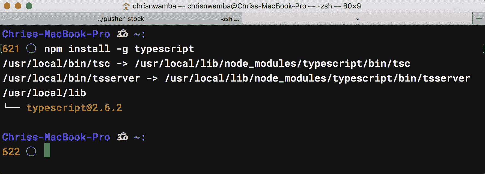
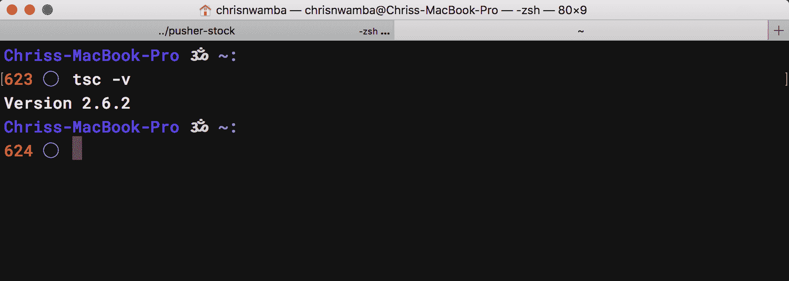
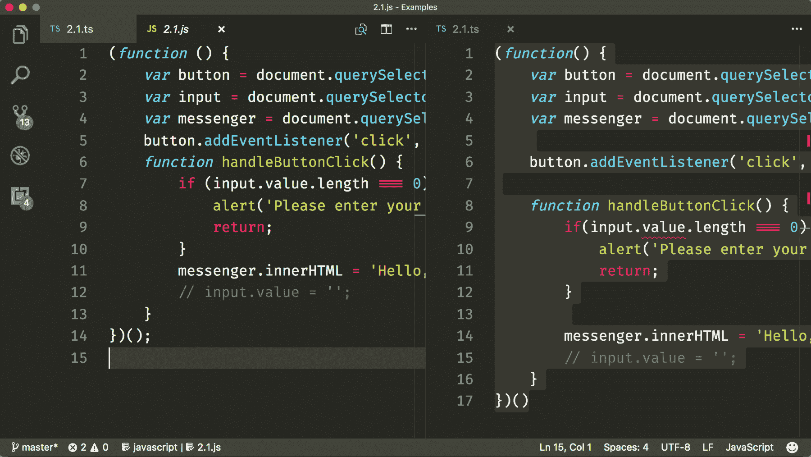
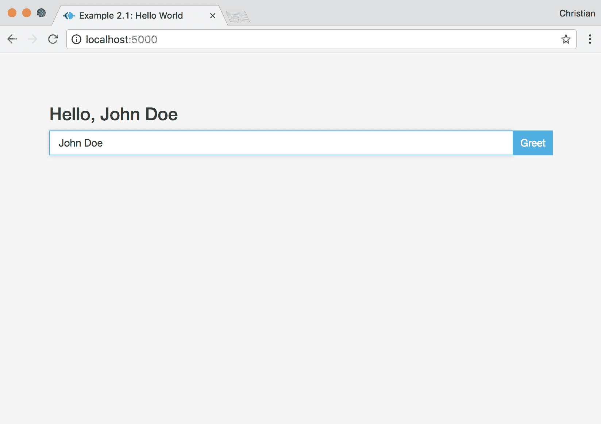
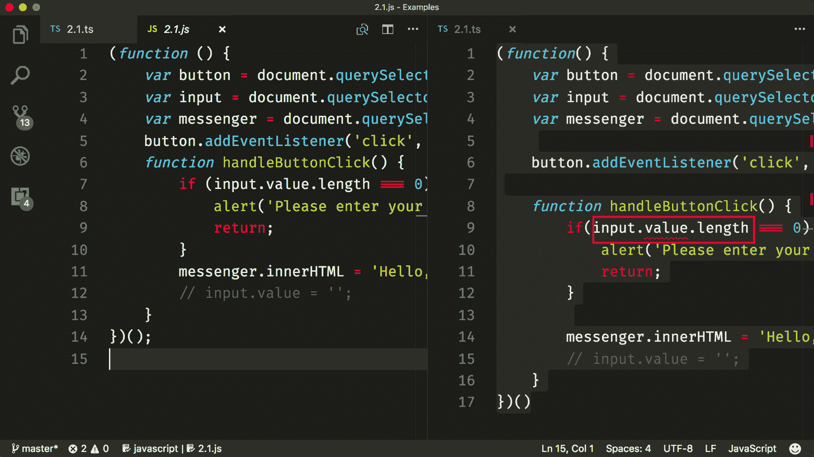
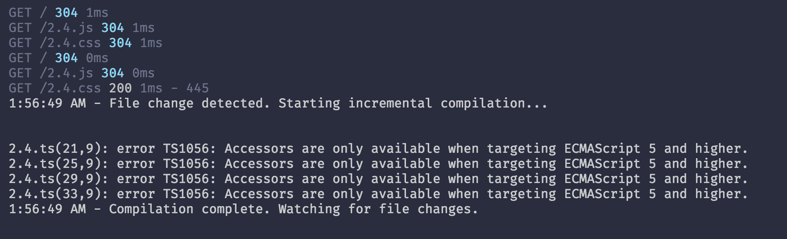
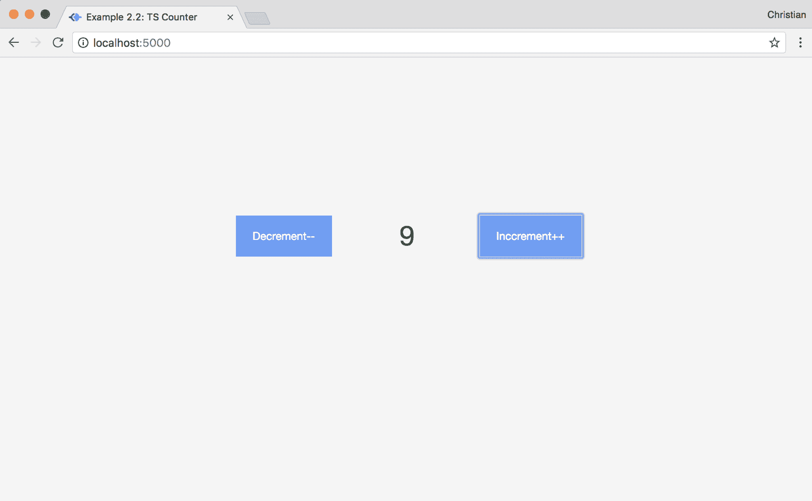

# 第二章：TypeScript 入门

在上一章中，我们讨论了由于 JavaScript 语言的松散类型特性，我们可能会遇到的一些挑战。我们也看到了各种尝试减轻这些挑战的方法，但没有任何一种方法感觉是自然的。我们还介绍了 TypeScript 作为一种可以帮助的工具；TypeScript 如何帮助，我们将在本章中讨论。

TypeScript 的构建块及其核心概念是心灵的问题，我们需要像对待这些问题一样对待它们。因此，通过实际示例，我们将讨论这些构建块，它们是如何协同工作的，以及您如何作为 JavaScript 开发者将它们集成到您的开发流程中。但首先，我们需要学习如何设置 TypeScript。

在本章中，我们将涵盖以下主题：

+   创建 TypeScript 环境

+   使用 TypeScript 构建工作示例

+   类型注解

+   ES6 和 TypeScript

# 设置 TypeScript

TypeScript 的设置取决于它将被使用的上下文。这是因为只要它为环境正确配置，您就可以将其集成到任何 JavaScript 工具、库和框架中。现在，我们将关注最简单和最基础的设置。

要开始使用 TypeScript，您需要具备 Node 及其包管理器 npm 的基本知识。您还需要从 Node 网站安装它们（[`nodejs.org/en/`](https://nodejs.org/en/)）。

在安装了 Node 和 npm 之后，您可以通过命令行工具使用 `npm` 全局安装 TypeScript：

```js
npm install -g typescript
```

如果在尝试安装时收到权限警告，您可以使用 `sudo` 命令：

```js
sudo npm install -g typescript
```

如果安装顺利，您将看到以下输出：



要确认 TypeScript 安装是否成功，您可以检查安装的版本。如果显示了版本，则表示安装成功：

```js
tsc -v
```

因此，您机器上的 TypeScript 实例将按以下方式工作：



# Hello World

TypeScript 文件具有 `.ts` 扩展名。该扩展名支持 JavaScript 和 TypeScript。这意味着在 `.ts` 文件中编写 JavaScript 代码是正确的，无需 TypeScript。让我们看一个例子。

首先，创建一个包含以下最小引导标记的 `index.html` 文件：

```js
<!-- Code 2.1.html -->
<html>
 <head>
   <title>Example 2.1: Hello World</title>
   <!-- Include Bootstrap and custom style -->
   <link rel="stylesheet" href="https://maxcdn.bootstrapcdn.com/bootstrap/3.3.7/css/bootstrap.min.css">
   <link rel="stylesheet" href="2.1.css">
 </head>
 <body>
   <div class="container">
     <div class="col-md-4 col-md-offset-4 main">
       <h3 class="messenger"></h3>
     </div>
     <div class="col-md-4 col-md-offset-4 main">
       <input type="text" class="form-control">
       <button class="button">Greet</button>
     </div>
   </div>
   <!-- Include JavaScript file -->
   <script src="img/2.1.js"></script>
 </body>
</html>
```

注意，在关闭标签之前添加的 JavaScript 文件**不是**`.ts`文件；而是一个具有`.js`扩展名的熟悉的 JavaScript 文件。这并不意味着我们的逻辑将用 JavaScript 编写；实际上，它是一个名为 `2.1.ts` 的 TypeScript 文件：

```js
// Code 2.1.ts
(function() {
 var button = document.querySelector('.button');
 var input = document.querySelector('.form-control');
 var messenger = document.querySelector('.messenger');

 button.addEventListener('click', handleButtonClick);

 function handleButtonClick() {
   if(input.value.length === 0) {
     alert('Please enter your name');
     return;
   }
   // Update messanger 
   messenger.innerHTML = 'Hello, ' + input.value;
 }
})();
```

任何东西看起来奇怪吗？不，我不这么认为。我们仍在谈论纯 JavaScript，但只是它存在于 TypeScript 文件中。这显示了 TypeScript 如何支持纯 JavaScript。

记住我们在 `index.html` 文件中导入的是 `2.1.js` 而不是 `2.1.ts`。因此，现在是时候生成浏览器可以理解的输出。这正是我们通过 `npm` 安装的 TypeScript 编译器派上用场的时候。要编译，进入你的工作目录，并在命令行中运行以下命令：

```js
tsc 2.1.ts
```

*忽略关于值属性的警告。我们很快就会修复它。*

这将生成一个编译后的 `2.1.js` 文件。正如你可能已经猜到的，查看两者没有语法差异：



你可以使用生成的资源通过一个网络服务器来提供你的网页。有很多选项可以帮助你完成这个任务，但 `serve` 是相当流行且稳定的 ([`github.com/zeit/serve`](https://github.com/zeit/serve))。要安装 `serve`，运行以下命令：

```js
npm install -g serve
```

现在，你可以直接使用以下命令托管你的 `index` 文件：

```js
serve --port 5000
```

使用 `npm` 脚本，你可以同时运行这两个命令。首先，初始化 `package.json`：

```js
npm init -y
```

现在，在 JSON 中添加以下脚本：

```js
"scripts": {"start": "tsc 2.1.ts -w & serve --port 5000"},
```

我们传递了监视选项（`-w`），所以 TypeScript 会在`.ts`文件检测到变化时重新编译。

这就是我们的示例看起来像什么：



# TypeScript 中的类型注解

值得再次提到的是，我们在刚才看到的 `Hello World` 示例中并没有看到任何不同。让我们使用一些 TypeScript 特有的功能，其中之一就是类型。类型是 TypeScript 存在的原因，除了类型之外的所有功能都只是语法糖。

我们不会深入讲解类型，因为第三章，*TypeScript 本地类型和访问器*，已经涵盖了这一点。我们可以讨论的是类型注解，这是 TypeScript 用来对成员应用严格类型的机制。注解是通过在成员初始化后跟一个冒号（`:`）和类型（例如，`string`）来实现的，如下所示：

```js
var firstName: string;
```

让我们看看一些注解示例：

```js
var name: string = 'John';
console.log(name); // John

var age: number = 18;
console.log(age); // 18

var siblings: string[] = ['Lisa', 'Anna', 'Wili'];
console.log(siblings); // ['Lisa', 'Anna', 'Wili']

// OR

var siblings: Array<string> = ['Lisa', 'Anna', 'Wili'];
console.log(siblings); // ['Lisa', 'Anna', 'Wili']

// any type supports all other types
// and useful for objects when we are lazy
// to make types with interfaces/class for them

var attributes: any = {legs: 2, hands: 2, happy: true}
```

不仅原始数据类型可以注解，对象、数组和函数也可以。我们很快就会看到。

我们能做的是重写我们之前的 `Hello World` 示例，以便用类型注解变量和函数。

再看看这张图片：



在 TypeScript 部分（右），`value` 似乎没有被编辑器识别为 DOM 的属性，因此出现了错误行。但是等等，这仍然是你们一直写的老式 JavaScript。这里有什么问题？

TypeScript 为 DOM 提供了定义好的类型。这意味着当我们尝试访问在相应的 DOM 接口中未定义的属性时，它将抛出一个错误（关于接口的更多内容稍后讨论）。从本质上讲，DOM 查询方法 `querySelector` 以及其他查询方法返回的是 `Element` 类型（如果没有注解则推断）。`Element` 类型是基本的，它包含了关于 DOM 的通用信息，这意味着特定于从 `Element` 派生出的属性和方法将不会被看到。

这不仅在 TypeScript 中有意义，在其他面向对象编程语言中也是如此：

```js
class Base {
  name: string = 'John'
}

class Derived extends Base {
  gender: string = 'male'
}

(new Base()).name // John
(new Base()).gender // throws an error
```

回到我们的例子，让我们看看我们如何可以使用注解和转换来解决这个问题：

```js
// Code 2.2.ts
(function() {
   // 1\. Button type is Element
   var button: Element = document.querySelector('.button');
   // 2\. Input type is HTMLInputElement and we cast accordingly
   var input: HTMLInputElement = <HTMLInputElement>document.querySelector('.form-control');
   // 3\. Messanger is HTMLElement and we cast accordingly
   var messenger: HTMLElement = document.querySelector('.messenger') as HTMLElement;

   // 4\. The handler now takes a function and returns another function (callback)
   button.addEventListener('click', handleButtonClick('Hello,', 'Please enter your name'));

   function handleButtonClick(prefix, noNameErrMsg) {
     // Logic here
     // Should return a function 
   }
})()
```

没有行为上的变化，只是提高了生产力。让我们来讨论一下正在发生的事情：

1.  按钮元素是 `Element` 类型。这里没有什么特别的，因为 TypeScript 已经内部推断出这一点。

1.  输入元素是 `HTMLInputElement` 类型。由于 TypeScript 推断返回值为 `Element` 类型，我们不得不将其转换为正确的类型，即 `HTMLInputElement`。这是通过在返回值前加上 `<>` 并传递我们想要转换到的接口来实现的。

1.  消息元素是 `HTMLElement` 类型。我们仍然需要使用与 *步骤 2* 中相同的原因进行转换，但使用了不同的支持语法（`as`）。`HTMLElement` 是 `Element` 的子类型，并包含更多特定的 DOM 属性和方法（如 `innerText`）。

1.  我们不是直接传递回调函数，而是将其包装在一个函数中，这样我们就可以接收参数。

让我们来看看传递给 `addEventListener` 的方法：

```js
// Code 2.2.ts
function handleButtonClick(prefix, noNameErrMsg) {
   return function() {
     if(input.value.length === 0) {
       if(typeof noNameErrMsg !== 'string') {
         alert('Something went wrong, and no valid error msg was provided')
         return;
       }
       alert(noNameErrMsg);
       return;
   }

   if(typeof prefix !== 'string') {
     alert('Improper types for prefix or error msg')
   }

   messenger.innerHTML = prefix + input.value;

 }
```

我们添加了很多验证逻辑，只是为了确保我们从参数中获取正确的类型。我们可以通过使用 TypeScript 注解来简化这一点：

```js
// Code 2.3.ts
function handleButtonClick(prefix: string, noNameErrMsg: string) {
  return function(e: MouseEvent) {
    if(input.value.length === 0) {
      alert(noNameErrMsg);
      return;
    }

    messenger.innerHTML = prefix + input.value;

  }
}
```

这不是更好吗？不必要的检查通过类型得到了处理。实际上，在它到达浏览器之前，如果你的编辑器（例如 VS Code）支持 TypeScript，当方法使用无效类型调用时，你将得到语法错误。

类型注解帮助我们编写更简洁、更易于理解且无错误的程序。TypeScript 使得注解更加灵活；因此，你不必严格为逻辑中的每个成员提供类型。你可以自由地注解你认为必要的部分，从无到全；只需记住，你的注解越严格，在浏览器中需要进行的调试就越少。

# ES6 及以后

除了类型注解外，TypeScript 还支持 EcamaScript 6（ES6/ES2015）以及其他一些有用的功能，如枚举、装饰器、访问级别（私有、公共和受保护）、接口、泛型等。

在下一章中，我们将深入探讨一些功能。在那之前，让我们通过尝试另一个示例来湿脚和弄脏双手，这个示例包含了一些 ES6 和 TypeScript 特定的功能。我们将构建一个计数器应用程序。这只是为了让您对这些功能感到兴奋，您将看到 TypeScript 如何带来您一直希望在 JavaScript 中存在的功能。

让我们从基本的 HTML 模板开始：

```js
<!-- Code 2.4.html -->
<div class="container">
  <div class="col-md-6 col-md-offset-3 main">
    <div class="row">
      <div class="col-md-4">
        <button id="decBtn">Decrement--</button>
      </div>
      <div class="col-md-4 text-center" id="counter">0</div>
      <div class="col-md-4">
        <button id="incBtn">Inccrement++</button>
      </div>
    </div>
 </div>
</div>
```

# 用户故事

*用户预计会通过点击按钮来增加或减少计数器，* 基本上，这是一个初始化为 `0` 的计数器，一个增加按钮用于增加 `1`，一个减少按钮用于减少 `1`。

而不是在我们的代码中充斥着 DOM 操作和事件逻辑，我们可以将它们组织到类中。毕竟，这就是类存在的原因：

```js
// Code 2.4.ts
class DOM {
  private _incBtn: HTMLElement;
  private _decBtn: HTMLElement;
  private _counter: HTMLElement;

  constructor() {
    this._incBtn = this._getDOMElement('#incBtn');
    this._decBtn = this._getDOMElement('#decBtn');
    this._counter = this._getDOMElement('#counter');
  }

  public _getDOMElement (selector: string) : HTMLElement {
    return document.querySelector(selector) as HTMLElement;
  }

  get incBtn(): HTMLElement {
    return this._incBtn;
  }

  get decBtn(): HTMLElement {
    return this._decBtn;
  }

  get counter(): number {
    return parseInt(this._counter.innerText);
  }

  set counter(value: number) {
    this._counter.innerText = value.toString();
  }
}
```

这看起来像是结构化语言的 JavaScript。让我们花点时间解释一下正在发生的事情：

+   首先，我们创建一个类并声明一些私有属性来保存 HTML DOM 元素的临时状态。例如，`private` 这样的可见性功能仅适用于 TypeScript，但类在 ES6 中已经存在。

+   构造函数使用这个 `_getDOMElement` 私有实用方法来查询 DOM 并初始化私有属性的值。

+   `incBtn` 和 `decBtn` 获取器用于将这些私有属性的值公开。这是面向对象编程中的一种常见模式。获取器被归类为访问器，并在 ES6 中可用。

+   计数器访问器用于通过将它们转换为整数和字符串来设置和检索计数器文本的值。

您第一次尝试运行此代码时应该会抛出错误，如下面的图像所示：



这是预期的，因为 TypeScript 默认编译为 ES3，但获取器和设置器（访问器）在 ES3 中不可用。为了消除这个错误，您可以告诉 TypeScript 编译器您更喜欢 ES5 而不是 ES3：

```js
"start": "tsc 2.4.ts -w -t es5 & serve --port 5000"
```

`-t` 标志，即 `--target` 的别名，告诉 TypeScript 编译到哪个版本。

`DOMEvent` 类要简单得多--只需一个方法，当被调用时可以注册所有类型的事件：

```js
// Code 2.4.ts
class DOMEvents {
  private register(htmlElement: HTMLElement, type:string, callback: (e: Event) => void): void {
    htmlElement.addEventListener(type, callback)
  }
}
```

该方法包含以下内容：

+   一个用于监听事件的元素

+   事件类型（例如，`click`、`mouseover` 和 `dblclick`）作为字符串

+   一个返回无值（`void`）但传递给事件负载的回调方法

然后，该方法使用 `addEventListener` 注册事件。

最后，我们需要一个示例的入口点。这将是一个类，并且该类将依赖于 `DOM` 和 `DOMEvent` 类的实例：

```js
// Code 2.4.ts
class App {
  constructor(public dom:DOM, public domEvents: DOMEvents) {
    this.setupEvents()
  }
  private setupEvents() {
    const buttons = [this.dom.incBtn, this.dom.decBtn];
    buttons.forEach(button => {
      this.domEvents.register(button, 'click', this.handleClicks.bind(this))
    })
  }
  private handleClicks(e: MouseEvent): void {
    const {id} = <HTMLElement>e.target;
    if(id === 'incBtn') {
      this.incrementCounter();
    } else {
      this.decrementCounter();
    }
  }

  private incrementCounter() {
    this.dom.counter++
  }

  private decrementCounter () {
    this.dom.counter--
  }
}
```

让我们讨论一下前面的代码片段是如何工作的：

+   当类初始化时调用的构造函数尝试使用 `setupEvents` 方法设置事件。

+   `setupEvents` 方法遍历 DOM 上的按钮列表，并对每个按钮调用 `DOMEvents register` 方法

+   注册方法以`HTMLElement`类型传递给按钮，以`click`作为事件类型，以`handleClicks`作为事件处理器。处理器与正确的上下文`this`绑定。这在 JavaScript 中总是让人困惑；耶胡达·卡茨以简单的方式解释了它是如何工作的，请参阅[`yehudakatz.com/2011/08/11/understanding-javascript-function-invocation-and-this/`](http://yehudakatz.com/2011/08/11/understanding-javascript-function-invocation-and-this/)。

+   回调方法根据被点击按钮的 ID 调用`incrementCounter`或`decrementCounter`。这些方法分别将`1`加到或从计数器中减去。

你可以通过创建`App`实例来初始化应用：

```js
// Code 2.4.ts
(new App(new DOM, new DOMEvents))
```

图像展示了我们新构建的流畅计数器应用：



# 最后的注意事项

重要的是再次指出我们在这些示例中使用的一些酷炫功能：

+   类

+   访问器

+   可见性

+   箭头函数（回调）：

```js
var fooFunc = (arg1) => {
    return arg1
}
```

+   使用`const`关键字进行变量声明而不是`var`

+   解构赋值：

```js
const {id} = <HTMLElement>e.target;
```

# 摘要

其中一些功能在 JavaScript 环境中是原生支持的；TypeScript 基于这些功能，为开发者提供更好的体验，这就是为什么它被称为 JavaScript 的超集。

在下一章中，我们将回顾并描述这些功能，并通过更多示例使你习惯工作流程。
