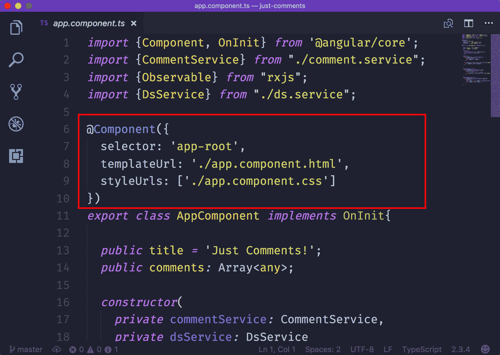

# TypeScript 本地类型和功能

你已经看到了使用 TypeScript 的不同示例。希望你现在知道 TypeScript 作为开发者能为你提供什么。在使用 TypeScript 构建 Angular 2 应用之前，还有一些 TypeScript 核心概念需要学习。本章将涵盖以下 TypeScript 概念：

+   基本类型，如字符串、数字、布尔、数组、void 等

+   函数类型

+   接口

+   装饰器

# 基本类型

让我们回顾一下基本类型。我们将讨论的大多数类型对你来说都很熟悉，因为它们来自 JavaScript，但有一个复习课程来更好地欣赏 TypeScript 提供的功能是很好的。另一方面，有些类型在 JavaScript 中不可用，但 TypeScript 有特定的类型。

# 字符串

字符串在 JavaScript 和 TypeScript 中都可用。它们用于表示文本数据。这些数据以字符串字面量的形式出现在程序中。这些字面量在大多数编程语言中很容易识别，因为它们被双引号（`""`）包围。在 JavaScript（和 TypeScript）中，字面量用双引号（`""`）和单引号（`''`）表示：

```js
let text: string = "Hi, I am a string. Now you know!";
```

在前面的代码片段中，`text` 变量存储了这个字符串：`"Hi, I am a string. Now you know!"`。因为 TypeScript 支持最新的 JavaScript 功能，所以你可以使用新的 ES6 模板字面量：

```js
const outro: string = 'Now you know!';

let text: string = `Hi, I am not just a simple string.
                    I am actually a paragraph. ${outro}`;
```

# 数字

数字在 JavaScript 和 TypeScript 中都可用。在 JavaScript 中，数字代表浮点数。你可以直接用键盘输入它们，而不需要像字符串那样进行任何装饰：

```js
let whole: number = 6;
let decimal: number = 2.5;
let hex: number = 0xf00d; 
let binary: number = 0b1010; 
let octal: number = 0o744;
```

# Boolean

布尔类型在 JavaScript 和 TypeScript 中都可用**。**布尔类型是你在编程语言中会遇到的最简单的类型。它们用 yes 或 no 回答问题，在 JavaScript 中表示为 `true` 或 `false`：

```js
let isHappy: boolean = true;
let done: boolean = false;
```

# 数组

数组在 JavaScript 和 TypeScript 中都可用**。**JavaScript 中的数据结构基本上用对象和数组表示。对象是键值对，而数组有可索引的结构。没有 `array` 类型，而是你为数组中包含的项提供类型。

你有两个选择来做这件事。你可以使用 `[]` 符号对，如下所示：

```js
let textArray: string[];

textArray = ["java", "kotlin", "typescript", "the rest..."]
```

或者，你可以使用内置的泛型类型：

```js
let numberArray: Array<number> = [9, 8, 7, 6, 5, 4, 3, 2, 1, 0]
```

# Void

Void 只在 TypeScript 中可用**。**`void` 类型适用于函数的返回类型（我们很快会讨论这个问题）。Void 表示函数不应该返回任何内容：

```js
let sum: number = 20

// No return type function
function addToGlobalSum(numToAdd): void {     
   number + numToAdd
}

addToGlobalSum(30) 
console.log(number) // 50
```

# Any

`Any` 只在 TypeScript 中可用**。**`any` 类型是最灵活的类型。当需要更接近 JavaScript 的宽松性质时，它允许你这样做。这种需求可能来自未类型化的第三方库，或者如果你不知道属性或方法可能返回哪种值类型。

这种类型可以存储所有已知的 JavaScript 类型：

```js
// Stores a string
let name: any = 'John Doe' 

// Stores a number
let age: any = 24

// Stores a boolean
let employed: any = true

// ...even data structures
let person: any[] =['John Doe', 24, true] 
```

# 元组

元组仅在 TypeScript 中可用**。**它们允许你在数组中拥有不同的类型。元组意味着数组中固定数量的元素在创建类型时必须被定义。例如，如果我们需要一个包含`string`、`number`和`boolean`的数组，它将看起来像这样：

```js
let flexibleArray: [string, number, boolean];

flexibleArray = ['John Doe', 24, true] 
```

当你尝试访问一个最初未创建的索引时，新的索引会以适当的推断类型添加：

```js
let anotherFlexArray: [string, number];

anotherFlexArray = ['John Doe', 24];

Assign true to index 2
anotherFlexArray[2] = true;

// anotherFlexArray becomes ['John Doe', 24, true]
```

# 枚举

枚举仅在 TypeScript 中可用**。**在少数情况下，你可能只想存储一组数字，可以是顺序的，也可以不是。枚举为你提供了一个数值数据结构控制，而无需引入数组或对象的复杂性。

以下示例显示了一个从`0`到`2`的`enum`类型：

```js
enum Status {Started, InProgress, Completed}

let status:Status = Status.InProgress // 1
```

枚举是基于`0`的；因此，`Started`持有`0`，`InProgress`持有`1`，`Completed`持有`2`。此外，枚举是灵活的；因此，你可以提供一个起始数字而不是`0`：

```js
enum Status {Started = 1, InProgress, Completed}

let status:Status = Status.InProgress // 2
```

你可以使用枚举编写更具有表达性的代码。让我们通过使用前一个示例中的百分比值来查看状态，看看如何做到这一点：

```js
enum Status {Started = 33, InProgress = 66, Completed = 100}

let status:Status = Status.InProgress + '% done' // 66% done
```

如果你知道实际值，很容易找到值的名称：

```js
enum Status {Started = 33, InProgress = 66, Completed = 100}

let status:string = Status[66] // InProgress

```

# 函数和函数类型

JavaScript 函数是弱类型化的，并且是语言中最常见的错误来源之一。这是一个基本函数的样子：

```js
function stringToArray(char) {
  return char.split(' ')
}
```

我们有多确定`char`不是一个数字？好吧，我们可能无法控制使用`stringToArray`的开发者会传递什么。这就是为什么我们需要使用 TypeScript 对值类型进行严格限制。

函数在其声明的两个不同部分使用类型：

1.  函数参数

1.  函数返回值

# 函数参数

你可以告诉 TypeScript 函数应该期望哪种类型的值，并且它将严格遵循这一点。以下是一个接收类型化字符串和数字作为参数的函数示例：

```js
// Typed parameters
function stringIndex(char: string, index: number) {
  const arr = char.split(' ')
  return arr[number];
}
```

`char`和`index`参数分别具有`string`和`number`类型。即使在事情到达浏览器之前，TypeScript 也会在你尝试愚蠢的事情时提醒你：

```js
function stringIndex(char: string, index: number) {
 const arr = char.split(' ')
 return arr[number];
}

stringIndex(true, 'silly') // Types don't match
```

当然，函数表达式也不会被遗漏：

```js
const stringIndex = function (char: string, index: number) {
 const arr = char.split(' ')
 return arr[number];
}
```

此外，箭头函数也受到欢迎：

```js
const stringIndex = (char: string, index: number) => char.split(' ')[number];
```

# 函数返回值

当函数执行时预期的值也可以是严格类型化的：

```js
function stringIndex(char: string, index: number): string {
 const arr = char.split(' ')
 return arr[number];
}
```

如您从前面的代码片段中可以看到，返回类型位于包含参数的括号之后和函数体开括号之前。前面的函数预期并必须返回一个字符串。任何非字符串的内容都会以错误的形式向您尖叫。

# 可选参数

当一个函数的参数是严格类型时，如果函数需要灵活，就会感觉比较僵硬。为什么在索引缺失时，我们还要在我们的前一个例子中传递`index`呢？如果我们打算在没有索引的情况下返回整个字符串呢？

当调用函数时省略索引参数，TypeScript 将抛出错误。为了解决这个问题，我们可以将 `index` 参数声明为可选的：

```js
function stringIndex(char: string, index?: number): string {
  // Just return string as is
  // if index is not passed in
  if(!index) return char;
  // else, return the index 
  // that was passed in
  const arr = char.split(' ')
  return arr[number];
}
```

参数名后面的问号告诉 TypeScript，如果调用时参数缺失是可以的。请小心处理函数体中未提供参数的情况，如前例所示。

# 接口

接口是我们代码遵守的合同。这是一个数据结构必须遵循的协议。这有助于每个实现接口的数据/逻辑保持安全，避免不适当或不匹配的类型。它还验证了传入值的类型和可用性。

在 TypeScript 中，接口用于以下目的：

1.  为 JavaScript 对象创建类型。

1.  为类设置遵守的合同。

我们将讨论接口如何在上述场景中应用。

# JavaScript 对象类型的接口

我们同意以下是一个有效的 JavaScript 对象：

```js
// Option bag
let options = {show: true, container: '#main'};
```

这是一段有效的 JavaScript 代码，但类型松散。到目前为止，我们一直在讨论字符串、数字、布尔值，甚至数组。我们还没有考虑对象。

如您所想象的那样，以下代码片段演示了前面示例的已类型化版本：

```js
// Typed object
let options: {show: boolean, container: string};

// Assing values
options = {show: true, container: '#main'};
```

这实际上是正确的，但 TypeScript 可以使用接口使其更易于维护和易于理解。以下是在 TypeScript 中编写接口的方式：

```js
interface OptionBag {
  show: boolean,
  container: string
}
```

您可以这样做的是将 `OptionBag` 类型的 `options` 变量：

```js
// Typed object
let options: OptionBag = {show: true, container: '#main'};
```

# 可选属性

关于接口，有一点需要注意的是，接口中定义的属性/方法在创建使用该接口类型化的值时必须提供。基本上，我是在说我们必须严格遵循与接口建立的合同。

因此，以下是不正确的，并且会抛出错误：

```js
interface OptionBag {
 show: boolean,
 container: string
}

let options: OptionBag = {show: true}; // Error
```

我们可以使 `container` 可选；我们使用前例中看到的问号字面量：

```js
interface OptionBag {
 show: boolean,
 container?: string
}

let options: OptionBag = {show: true}; // No Error
```

但请注意，当可选参数未提供时的情况。以下是一个示例，展示了这种情况：

```js
// Get element
function getContainerElement(options: OptionBag):HTMLElement {
  let containerElement: HTMLElement
  if(!options.container) {
     // container was not passed in
     containerElement = document.querySelector('body');
  } else {
     // container was passed in
     containerElement = document.querySelector(options.container);
  }

  return containerElement
}
```

# 只读属性

另一个典型的情况是，当你有只打算赋值一次的属性时，就像我们使用 ES6 的 `const` 声明关键字那样。您可以标记这些值为 `readonly`：

```js
interface StaticSettings {
  readonly width: number,
  readonly height: number
}

// There are no problems here
let settings: StaticSettings = {width: 1500, height: 750}

// ...but this will throw an error
settings.width = 1000
// or
settings.height = 500
```

# 接口作为合同

您可以使用接口确保一个类遵循特定的合同。我使用术语合同是指接口中定义的所有属性和方法都必须在类中实现。

假设我们有一个以下 `Note` 接口：

```js
interface Note {
  wordCount: number
}
```

要使用类实现接口，我们在类名后添加 `implements` 关键字，后跟我们要实现的接口：

```js
class NoteTaker implements Note {
  // Implement wordCount from
  // Note interface
  wordCount: number;
  constructor(count: number) {
    this.wordCount = count
  }
}
```

接口不仅定义了属性的签名，还接受函数类型作为方法：

```js
interface Note {
  wordCount: number;
  updateCount(count: number): void
}
```

这可以通过以下方式通过一个类来实现：

```js
class NoteTaker implements Note {
 // Implement wordCount from
 // Note interface
 wordCount: number;
 constructor(count: number) {
   this.wordCount = count
 }

 updateCount(count: number): void {
   wordCount += count
 }
}
```

如果 `NoteTaker` 类中既不存在 `wordCount` 属性也不存在 `updateCount` 方法，TypeScript 将会抛出一个错误。

# 装饰器

在 Angular 2+ 中引入的最常见特性是**装饰器**。乍一看，装饰器可能会因为其使用前不寻常的 `@` 符号而让人困惑：



之前的截图是从一个 Angular 应用程序中提取的代码片段。它显示了一个组件装饰器正在装饰一个名为 `AppComponent` 的类。

最初，这可能会看起来令人不知所措，因为在 JavaScript 的历史中，我从未见过 `@` 文字以这种方式使用。如果我们知道它只是一个可以访问它所装饰成员的函数就好了！类、属性、方法和访问器都可以被装饰。让我们讨论如何装饰方法和类

# 装饰方法

假设我们想要将类上的一个方法设置为只读。因此，在创建该方法之后，它不能因为任何原因被重写。例如，这个方法看起来是这样的：

```js
class Report {
  errPayload;

 // To become readonly
  error() {
     console.log(`The following error occured ${errPayload}`)
  }
}
```

如果我们不想在应用程序的生命周期中覆盖 `error`，我们可以编写一个装饰器来将描述符的 `writable` 属性设置为 `false`：

```js
function readonly(target, key, descriptor) {
   descriptor.writable = false;
   return descriptor
}
```

常见的签名是方法装饰器接受与 `Object.defineProperty` 相同的参数。在这种情况下，目标将是类，键将是方法名，它是类的一个属性，描述符将是 `config` 对象。

现在，我们可以使用刚刚创建的 `readonly` 装饰器来装饰 `error` 方法：

```js
class Report {
 errPayload;

 // Decorated method 
 @readonly
 error() {
   console.log(`The following error occured ${errPayload}`)
 }
}
```

任何尝试修改错误属性的行为都将失败：

```js
const report = new Report()

// This would never work
// because 'error' is read only
report.error = function() {
  console.log('I won't even be called')
}
```

# 装饰类

另一个常见的装饰成员是类。实际上，在 Angular 中，几乎所有的类（组件、服务、模块、过滤器以及指令）都被装饰了。这就是为什么理解装饰器存在的重要性很重要的原因。

装饰器可以用来扩展类的功能，如下面的例子所示：

```js
// decorator function
function config(target) {
  target.options = {
    id: '#main',
    show: true
  }
}

// class
@config
class App {}

// options added
console.log(App.options) // {id: '#main', show: true}
```

# 装饰器工厂

之前的例子是固定的，因为 `options` 对象将始终具有相同的值。如果我们需要接收动态值怎么办？当然，这是一个合理的问题，因为 `id` 属性可能并不总是 `#main`。因此，我们需要更加灵活。

装饰器工厂是返回装饰器的函数，这让你能够通过其工厂传递参数给装饰器：

```js
// decorator factory function
function config(options) {
  // decorator function
  return function(target) {
    target.options = options
  }
}

// class decorator
// with arguments
@config({id: '#main', show: true})
class App {}

// options added
console.log(App.options) // {id: '#main', show: true}
```

# 摘要

在前三章中，我们花费时间讨论 TypeScript 的基础知识，目的是在浏览其余章节（其中充满了大量的 Angular 内容）时，TypeScript 将不会成为你需要担心的东西。

假设你已经将基本类型、函数类型、装饰器和接口添加到了你对 TypeScript 的现有知识中。

在本书的后续章节中，我们将深入探索 Angular。如果你已经走到这一步，那么你已经成功通过了本书的枯燥部分，因为从现在开始，我们将使用 Angular 2+ 构建许多有趣的示例。
