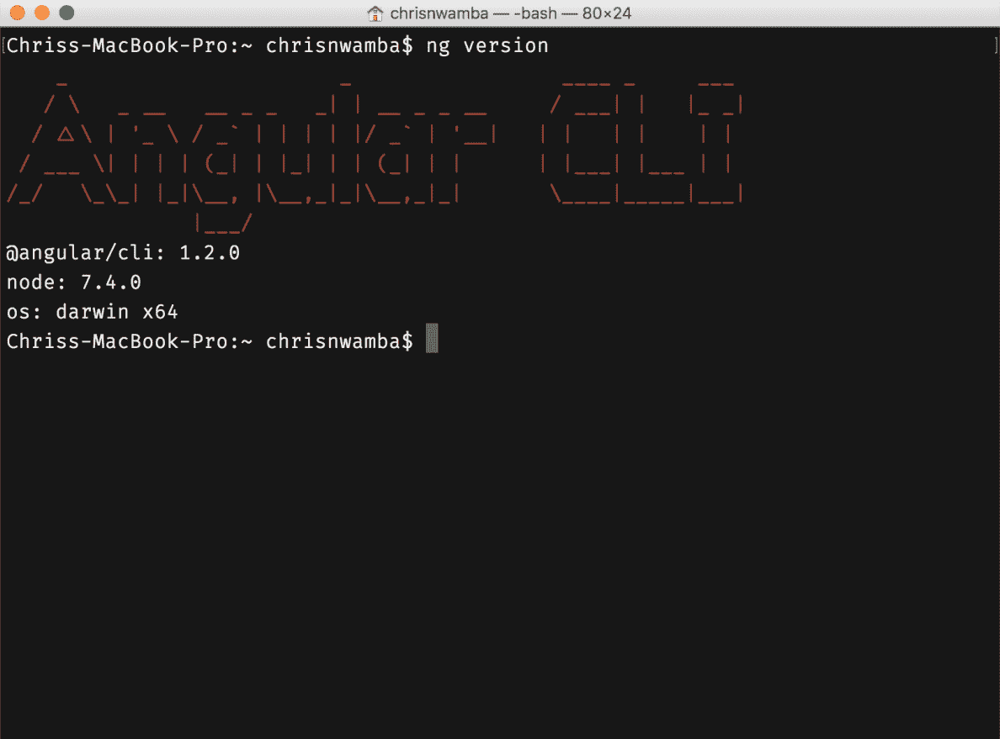

# 使用 Angular 和 TypeScript 快速入门

前几章旨在解释 TypeScript 的基本和最常见功能。在处理 Angular 项目时，这些功能将被广泛使用。在构建 Angular 项目时，TypeScript 完全是可选的，但请相信我，仅仅使用 JavaScript 并不是你在体验了 TypeScript 如何简化开发过程之后想要走的路。

本章将带我们进入这本书的精彩部分——使用 TypeScript 构建 Angular 应用程序。本章我们将涵盖以下主题：

+   使用 TypeScript 设置 Angular

+   理解组件基础

+   了解 Angular 的模板语法

+   一些数据绑定魔法

所有这些激动人心的主题都将伴随着良好的示例，这样你可以亲自看到这些事物是如何工作的。让我们开始吧。

# 使用 TypeScript 设置 Angular

Angular 并不是一个难以开始的框架。不幸的是，从初学者的角度来看，生态系统可能会让你淹没在大量术语中。其中大部分术语代表使 Angular 运作的工具，而不是 Angular 本身。Webpack、linters、TypeScript、typings、构建过程等等，是一些可能会在 Angular 之旅开始时让你感到困惑的术语。

因此，Angular 团队构建了一个全能工具，帮助你减少对那些周边工具的关注，更多地关注构建你的项目。它被称为 Angular CLI，只需几个 CLI 命令，你就可以构建你的应用程序。如今在管理 JavaScript 工具上花费的时间令人担忧，你不想作为一个初学者（甚至专业人士）陷入这种混乱。

要安装 CLI，你需要使用 npm 运行以下命令：

```js
npm install -g @angular/cli
```

安装完成后，你应该在控制台中看到以下 npm 日志：


你可以通过运行 `help` 或 `version` 命令来检查安装是否成功：

```js
# Help command
ng help

# Version command
ng version
```

帮助命令将显示通过 CLI 工具可用的命令列表，而版本命令将显示当前安装的版本。如果安装失败，它们都不会打印上述信息。

当你运行 `help` 命令时，以下是打印的日志详情：


运行版本命令会显示以下截图：



# 创建一个新的 Angular 项目

安装了 CLI 之后，你现在可以开始在项目中使用它了。当然，第一步是创建一个项目。CLI 的 `new` 命令在一个项目中只使用一次，用于生成项目所需的基础文件和配置：

```js
ng new hello-angular
```

命令不仅为你创建了一个项目，还安装了 npm 依赖项，因此你不必在开始之前运行安装命令：


导航到文件夹的根目录并运行 `serve` 命令：

```js
ng serve
```

运行命令后，您将得到以下输出，这表明您的应用程序正在成功运行，以及您可以访问它的位置。它还显示了捆绑文件，包括样式和脚本。请注意，这里没有 TypeScript 文件；一切都已经转换为 JavaScript 以供浏览器理解：


您应该看到您闪亮的应用程序在 `localhost:4200` 上运行：


# 项目结构

Angular 生成大量的辅助文件以方便测试、构建过程、包管理等。您可以在不关心这些文件做什么的情况下构建一个成功的项目。因此，我们只将展示一些对我们开始很重要的重要文件：


目前我们应该关注 `src` 目录。那里将存放我们的项目文件（组件、服务、模板等）。

# 生成文件

您可以手动添加更多的 TypeScript 文件和模板，但使用 CLI 工具这样做更有效。这是因为 CLI 工具不仅创建文件，还生成起始片段来表示您试图创建的文件类型。例如，让我们创建一个引用组件：

```js
ng generate component quote
# OR
ng g component quote
```

这就是组件命令的样子，其中包含一些生成的代码和文件：


该图像包含以下内容：

1.  生成过程的 CLI 输出。

1.  生成的组件、模板、CSS 和测试文件。

1.  TypeScript 组件。

CLI 可以用来生成其他 Angular/TypeScript 构建块，而不仅仅是组件。我们现在不会尝试它；我们将在后续章节讨论相关主题时进行尝试。以下表格显示了在项目的 Github 读取文件中看到的生成命令：

| **脚手架** | **用法** |
| --- | --- |
| 组件 | `ng g component my-new-component` |
| 指令 | `ng g directive my-new-directive` |
| 管道 | `ng g pipe my-new-pipe` |
| 服务 | `ng g service my-new-service` |
| 类 | `ng g class my-new-class` |
| 守卫 | `ng g guard my-new-guard` |
| 接口 | `ng g interface my-new-interface` |
| 枚举 | `ng g enum my-new-enum` |
| 模块 | `ng g module my-module` |

# 基本概念

我们将在本书中深入探讨不同的主题，但为了了解背景，简要解释正在发生的事情是个好主意。

# 组件

您的好奇心可能引导您打开了 `app.component.ts` 或 `quote.component.ts`。如果它们看起来令人不知所措，请不要担心；我们将在本书中广泛讨论组件（特别是在接下来的两章中）。

组件是任何 Angular 项目的核心。它们是核心构建块，其他所有功能都是为了支持组件而设计的。提到的文件包含用 TypeScript 编写的 Angular 组件。这是 `app.component.ts` 的样子：

```js
import { Component } from '@angular/core';  

@Component({  
  selector: 'app-root',  
  templateUrl: './app.component.html',  
  styleUrls: ['./app.component.css'] 
}) 
export class AppComponent {  title = 'app'; } 
```

组件是一个带有模板的装饰类。装饰的类型才是关键，在这种情况下，是一个`Component`装饰器。记得在前一章中提到装饰器只是扩展它们所装饰的功能的函数。这就是前面例子中发生的事情。

首先，我们从 Angular 的核心模块`@angular/core`导入这个装饰器。然后，我们将装饰器放在我们的`AppComponent`类上方。装饰器将其参数作为一个 JavaScript 对象，以描述组件。该对象包含以下内容：

+   `selector`：当在应用的任何部分调用组件时，这就是组件将被识别的内容。因为这个组件是应用的入口点，所以它将通过包含其选择器直接在`body`中使用：

```js
<!--./src/index.html-->
...
<body>  
  <app-root></app-root> 
</body>
...
```

+   `templateUrl`：组件将模板渲染到视图中。我们需要一种方法来告诉组件渲染哪个模板。这可以通过`template`或`templateUrl`属性实现。`template`属性接受一个 HTML 内容的字符串，而`templateUrl`接受一个指向模板 HTML 文件的 URL。

+   `styleUrls`：这是一个应用于定义的模板的样式 URL 数组。

实际的组件类（以及被装饰的类）成为与该组件相关的属性和方法的家。所有这些共同工作，形成一个可重用的功能，称为组件。

引用组件看起来非常相似：

```js
import { Component, OnInit } from '@angular/core';  

@Component({  
  selector: 'app-quote',  
  templateUrl: './quote.component.html',  
  styleUrls: ['./quote.component.css'] 
}) 
export class QuoteComponent implements OnInit {   
  constructor() { }   
  ngOnInit() {  }  
} 
```

唯一明显的区别是它实现了`OnInit`接口，该接口有一个类必须实现的`ngOnInit`方法。这个方法被称为生命周期钩子，我们很快就会讨论。

# 模板

模板只是普通的 HTML 文件，尽管它们被插值和指令增强了。以下是目前`app.component.html`的内容，这是`AppComponent`的模板：

```js
<div style="text-align:center">  
  <h1>  Welcome to {{title}}!!  </h1>  
   
</div> 
<h2>Here are some links to help you start: </h2> 
<ul>  
  <li>  <h2><a target="_blank" href="https://angular.io/tutorial">Tour of Heroes</a></h2>  </li>  
  <li>  <h2><a target="_blank" href="https://github.com/angular/angular-cli/wiki">CLI Documentation</a></h2>  </li>  
  <li>  <h2><a target="_blank" href="http://angularjs.blogspot.ca/">Angular blog</a></h2>  </li> 
</ul>  
```

如你所见，它只是普通的 HTML。尽管如此，有一件事可能看起来不太熟悉：

```js
<h1>  Welcome to {{title}}!!  </h1>  
```

使用双大括号包裹的`title`文本可能会让你感到困惑。这被称为插值。`title`值在运行时根据组件类上的属性值解析。别忘了我们有一个值为`app`的`title`属性：

```js
title = 'app';
```

除了绑定值之外，你还可以在模板上执行许多令人惊叹的任务。它们包括以下内容：

+   属性和事件绑定

+   双向绑定

+   迭代和条件

+   样式和类绑定

+   简单表达式

+   管道和指令

而不是向你提供所有与模板和模板语法相关的无聊内容，我们应该讨论它们以及它们与其他即将到来的主题的关系。这样，你可以在示例中看到它们，这应该更有趣。

# 组件样式

组件大量展示了可重用性。实际上，当你询问使用组件架构的好处时，你得到的第一个答案就是这一点。这就是为什么模板和样式被限制在组件范围内，而不是在应用环境中散布大量的 HTML 和 CSS。

组件装饰器参数中的`styleUrls`属性接受一个指向你想要应用到组件中的样式的 URL 数组。大多数时候，你只需要一个文件；因此，数组中只包含一个 URL 项，在我们的例子中，是`app.component.css`。目前它是空的，但我们可以用它进行实验：

```js
* {  
  background: red; 
}
```

`*`选择器是用来选择文档中的所有内容的。所以，我们说，*选择每个元素并将背景设置为红色*。你可能会对结果感到惊讶：


注意实际的 body 标签没有被样式化，这可能不会立即让你明白，因为你使用了全局选择器。组件样式是作用域到组件的；因此，样式不能泄露到包含的父组件。这就是为什么 body 保持白色，而`AppComponent`模板中的内容是红色的。

# 模块

组件是用来构建产品中的小型可复用功能。它们与诸如服务、指令、管道等概念协同工作，以形成一个功能特性。在某些情况下，你可能希望这些特性可以在一个项目到另一个项目之间，甚至在一个大型项目的不同部分之间移动。因此，你需要一种方法将它们收集在一起作为一个特性。这正是模块的作用。

模块是带有`NgModule`装饰器的类。装饰器接受一个对象，就像组件装饰器一样。这个对象描述了你需要与这个模块关联的所有功能成员。可能的成员（但不是所有成员）如下：

+   **声明**：这些包括组件、指令和管道

+   **提供者**：这些包括可注入的服务

+   **导入**：这些包括其他导入的模块

+   **引导**：这是启动应用的入口组件

我们已经有一个模块了，它就是`AppModule`：

```js
import { BrowserModule } from '@angular/platform-browser'; 
import { NgModule } from '@angular/core';  

import { AppComponent } from './app.component'; 
import { QuoteComponent } from './quote/quote.component';  

@NgModule({  
  declarations: [  
    AppComponent,  
    QuoteComponent  
  ],  
  imports: [  
    BrowserModule  
  ],  
  providers: [],  
  bootstrap: [ 
    AppComponent 
  ] 
}) 
export class AppModule { } 
```

让我们花些时间描述这个模块中的项目：

+   **声明**：`AppComponent`和`QuoteComponent`是组件。因此，它们属于这个类别。Angular CLI 在生成引用组件后所做的令人惊讶的一件事是自动将其添加到声明中。如果不是这样，即使你在应用中某个地方使用了组件选择器，引用组件的内容仍然不会显示，你会在控制台中收到错误。

+   **导入**：`BrowserModule`是一个模块。它是一个包含常见浏览器任务的模块，特别是模板的指令，如`*ngFor`等。

+   **提供者**：由于我们还没有任何服务，可以省略提供者或使数组为空。

+   **引导**：应用程序模块是我们的入口模块。因此，它应该定义入口组件，即`AppComponent`。这就是`bootstrap`属性的作用。

# 单元测试

虽然我们不会在本书的最后一章中涵盖测试，但养成测试的习惯是值得的。这就是为什么我们要在这里探索测试组件的简单性。

事实上，Angular 通过`TestBed`为测试组件提供了一个抽象层。在你能够看到组件是否按计划运行之前，你不需要运行整个应用程序。一个简单的测试与 CLI 框架一起为我们的组件提供。它位于文件旁边（这是一个常见且良好的实践），名为`app.component.spec.ts`。

让我们查看这个文件的内容：

```js
import { TestBed, async } from '@angular/core/testing';  
import { AppComponent } from './app.component';  

describe('AppComponent', () => {

});
```

首先，我们从`@angular/core/testing`导入测试工具和要测试的组件，即`AppComponent`。创建一个`describe`块，它包含给定功能（`AppComponent`）的测试套件集合，也被创建但留空。

在我们开始编写测试套件之前，我们需要为组件配置一个临时的测试模块。这是在`beforeEach`块中完成的：

```js
//...
describe('AppComponent', () => {  
  beforeEach(async(() => {  
    TestBed.configureTestingModule({  
      declarations: [  AppComponent  ],  
    }).compileComponents();  
  }));
  // ...
});
```

在实际应用中，我们可以在`AppComponent`所在的`AppModule`中创建一个声明。在这里，我们只需要一个简单的模块，上面有`AppComponent`，多亏了`TestBed`的`configureTestingModule`模块使得这一点成为可能。

接下来，我们可以开始编写我们想要检查的任何场景的测试套件。首先，让我们检查`AppComponent`是否存在：

```js
describe('AppComponent', () => {  
  it('should create the app', async(() => {  
    const fixture = TestBed.createComponent(AppComponent);  
    const app = fixture.debugElement.componentInstance;  
    expect(app).toBeTruthy();  
  }));
});
```

我们首先在用`createComponent()`创建组件本身之后，尝试使用`componentInstance`创建组件的一个实例。

实际的检查是在我们使用`expect`断言以`toBeTruthy()`查看组件是否存在时进行的。

我们还可以检查组件属性的值：

```js
it(`should have as title 'app'`, async(() => {  
  const fixture = TestBed.createComponent(AppComponent);  
  const app = fixture.debugElement.componentInstance;  
  expect(app.title).toEqual('app');  
}));
```

由于`app`是组件的一个实例，你可以访问这个实例上的属性和方法。我们只是测试了`app.title`的初始值是否等于`app`。

最后的测试套件实际上检查 DOM 中的值：

```js
it('should render title in a h1 tag', async(() => {  
  const fixture = TestBed.createComponent(AppComponent);  
  fixture.detectChanges();  
  const compiled = fixture.debugElement.nativeElement;
  expect(compiled.querySelector('h1').textContent).toContain('Welcome to app!!');  }));
```

注意，在这个测试套件中调用了`detectChanges`。这会启动模板上的绑定（如果有）。然后，我们不是创建一个实例，而是抓住编译后的元素，查询其`h1`标签，并检查该标签的文本内容是否包含`Welcome to app`。

要运行这些测试，请执行以下命令：

```js
ng test
```

这应该会启动 Karma，一个隔离的测试环境。你的测试将会运行，以下内容将被打印到 CLI：


你可能想知道为什么最后一行说有`4`个测试而不是`3`个；记住，我们生成的 quote 组件也有一个单独的测试套件。

# 摘要

在本章中，你学习了如何创建 Angular 项目以及一个新项目必须伴随的文件。现在你知道如何创建 Angular 项目，并构建组件等构建块，并理解组件的基本结构。你还学习了模块存在的原因，如何将简单样式应用到组件上，以及 Angular 中的单元测试是什么样的。

在下一章中，我们将深入了解更多组件的创建，并查看一些实际运行的例子。
