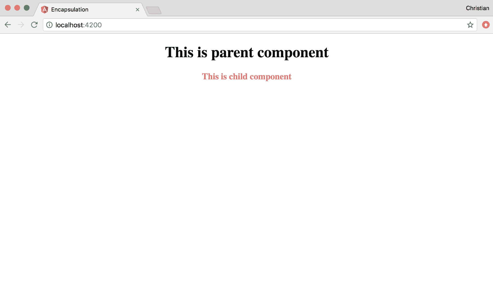

# 第五章：使用 TypeScript 的高级自定义组件

在上一章中，我们讨论了组件创建和使用的基础知识。这些知识不足以构建健壮的应用程序。我们需要更深入地了解 Angular 的精彩组件，并看看 TypeScript 是如何使组件工作变得更容易的。

我们将在展示一些实际操作示例的同时，讨论以下主题：

+   **生命周期钩子**: 这些是 Angular 中的类方法，你可以将其挂钩。这是通过实现 TypeScript 接口来实现的。

+   **ElementRef**: 这涉及到使用 ElementRef API 在 Angular 中安全地操作和查询 DOM。

+   **视图封装**: 你将学习作用域样式是如何应用于 Angular 组件的，以及如何更改默认行为。

# 生命周期钩子

你在类中创建的大多数方法必须由你调用，这是编程中预期的模式。但在 Angular 定义的生命周期钩子中并非如此。这些钩子是你创建的，供 Angular 内部调用，取决于组件/指令的当前状态。它们是在组件或指令的类中创建的。

以下钩子在 Angular 组件中可用：

+   `ngOnChanges`: 记得属性是如何绑定到组件上的。这些属性是响应式的，这意味着当它们发生变化时，视图也会更新。当任何绑定到视图的属性发生变化时，会调用此生命周期方法。因此，你可以在变化反映之前进行操作。

+   `ngOnInit`: 这是最常见的生命周期。它是在组件使用默认属性绑定初始化之后被调用的。因此，它是在第一次`ngOnChanges`之后被调用的。

+   `ngDoCheck`: 响应性（变更检测）通常由你处理，但在极端情况下，如果它没有被处理，你需要自己处理。使用`ngDoCheck`来检测并响应 Angular 无法或不会自动检测的变化。

+   `ngAfterContentInit`: 这是在组件的内容初始化之后被调用的。

+   `ngAfterContentChecked`: 这是在每次检查组件内容之后被调用的。

+   `ngAfterViewInit`: 这是在根据组件的模板初始化视图之后被调用的。

+   `ngAfterViewChecked`: 这是在检查组件的视图及其子组件的视图之后被调用的。

+   `ngOnDestroy`: 这是在组件被销毁之前被调用的。这是一个进行清理的好地方。

一些生命周期钩子可能一开始并不容易理解。你不必担心它们，因为只有在极端情况下你才需要大量使用它们。

一个例子将有助于阐明它们是如何工作的。让我们探索最常见的钩子，即`ngOnInit`。

使用 CLI 命令创建一个新的 Angular 项目。打开 app 组件 TypeScript 文件，并更新导入以包括`OnInit`：

```js
// Code: 5.1
//./src/app/app.component.ts

import { Component, OnInit } from '@angular/core';
```

`OnInit`是一个接口，任何打算实现`ngOnInit`的类都应该继承。这从技术上讲不是必需的（参见[`angular.io/guide/lifecycle-hooks#interfaces-are-optional-technically`](https://angular.io/guide/lifecycle-hooks#interfaces-are-optional-technically)）。

您现在可以让`AppComponent`类实现此接口：

```js
// Code: 5.1
//./src/app/app.component.ts

@Component({ 
  selector: 'app-root', 
  templateUrl: './app.component.html',  
  styleUrls: ['./app.component.css'] 
}) 
export class AppComponent implements OnInit { 
  title: string = 'Items in Bag'; 
  items: Array<string> = []; 
  loading: boolean = false;  
  ngOnInit () { 
    this.loading = true;  
    setTimeout(() => { 
      this.items = [ 
         'Pen', 
         'Note', 
         'Mug', 
         'Charger', 
         'Passport', 
         'Keys' 
      ] 
     this.loading = false; 
   }, 3000) 
 } 
}
```

我们正在尝试模拟异步行为，其中值将在未来解决。这种操作最好在应用程序初始化时进行，这就是为什么我们在`ngOnInit`方法中处理它。一旦组件准备就绪，Angular 将调用此钩子，这将设置项目数组在 3 秒后。

我们可以在值到来之前将它们绑定到视图上。Angular 将在值可用时始终更新视图：

```js
<!-- Code: 5.1 -->
<!-- ./src/app/app.component.html -->

<div style="text-align:center">  
  <h1>  {{title}}!!  </h1>  
  <h4 *ngIf="loading">Please wait...</h4>  
</div>  
<ul>  
  <li *ngFor="let item of items">{{item}}</li>  
</ul>
```

要在 Angular 模板中遍历列表，我们使用`*ngFor`结构指令，如前例所示。`*ngIf`结构指令类似于`*ngFor`，但它用于根据组件上的布尔属性显示 DOM 元素。

如同往常，使用`ng serve`运行应用程序，你将首先看到以下内容：


三秒后，请等待...文本将消失，你将看到你的项目列表：


# DOM 操作

在 Angular 1.x 中，触摸 DOM 似乎很神秘；不是说你不能，但不知为何它总会回来咬你。这很讽刺，因为我们作为网页设计师/开发者所做的就是绘制 DOM，而这不可能不通过操作它来实现。

在 Angular 2+中，这样做变得相当容易。Angular 抽象了 DOM，并给你一个浅拷贝来操作。然后它负责将其放回原处而不伤害任何人。当与 TypeScript 结合使用时，这变得更加有趣，因为你的编辑器可以为你提示大多数 DOM 属性方法。

# ElementRef

实现 DOM 操作的 API 是`ElementRef`。让我们基于[`www.w3schools.com/howto/howto_js_tabs.asp`](https://www.w3schools.com/howto/howto_js_tabs.asp)上的基本示例构建一个使用此 API 的选项卡组件。

首先使用 CLI generate 命令生成一个新的组件：

```js
ng g component tab
```

将模板作为子元素添加到我们的应用程序组件中，紧随`*ngFor`指令之后：

```js
<ul>
  <li *ngFor="let item of items">{{item}}</li>  
</ul>  

<!--Add tab component to app-->
<app-tab></app-tab>
```

然后，用以下内容替换组件的模板：

```js
<!--./src/app/tab/tab.component.css-->
<div class="tab">  
  <button class="tablink" (click)="openTab($event, 'London')">London</button> 
  <button class="tablink" (click)="openTab($event, 'Paris')">Paris</button>
  <button class="tablink" (click)="openTab($event, 'Tokyo')">Tokyo</button>
</div>

<div id="London" class="tabcontent">
  <h3>London</h3>
  <p>London is the capital city of England.</p>
</div>
<div id="Paris" class="tabcontent">
  <h3>Paris</h3>
  <p>Paris is the capital of France.</p>  
</div>
<div id="Tokyo" class="tabcontent">
  <h3>Tokyo</h3>
  <p>Tokyo is the capital of Japan.</p>
</div>
```

你应该在浏览器中看到以下结果，如以下截图所示：


让我们添加一些样式来创建一个选项卡外观：

```js
// based on styles from the base sample

/* ./src/app/tab/tab.component.css */
div.tab {
  overflow: hidden;
  border: 1px solid #ccc;
  background-color: #f1f1f1;
 } 

div.tab button {
  background-color: inherit;
  float: left;
  border: none;
  outline: none;
  cursor: pointer;
  padding: 14px 16px;
  transition: 0.3s;
 }

div.tab button:hover {
  background-color: #ddd;
 }   

div.tab button.active {
  background-color: #ccc;
 }   

.tabcontent {
  padding: 6px 12px;
  border: 1px solid #ccc;
  border-top: none;
}
```

使用样式，你应该得到以下截图所示的结果：


现在是开始操作 DOM 的时候了。我们首先需要通过 CSS 默认隐藏所有选项卡内容；然后，它们可以在 TypeScript 中激活：

```js
.tabcontent {  
  display: none;
 }
```

# 钩入内容初始化

为了确保能够访问 DOM，我们需要挂钩到 `ngAfterContentInit` 生命周期方法。正是在这个方法中，我们可以使用 `ElementRef` 来查询 DOM 并对其进行操作：

```js
import { Component, ElementRef, OnInit, AfterContentInit } from '@angular/core';  

@Component({
  selector: 'app-tab',
  templateUrl: './tab.component.html',
  styleUrls: ['./tab.component.css']
 })

export class TabComponent implements OnInit, AfterContentInit {
  tabContents: Array<HTMLElement>;
  tabLinks: Array<HTMLElement>;

  constructor(
    private el: ElementRef
  ) { }

  ngOnInit() {}

  ngAfterContentInit() {
    // Grab the DOM
    this.tabContents = this.el.nativeElement.querySelectorAll('.tabcontent');
    this.tabLinks = this.el.nativeElement.querySelectorAll('.tablink');
   }   
} 
```

该类实现了 `AfterContentInit` 以及 `OnInint` 接口，展示了如何实现多个接口。然后，我们将按钮声明为一个 `HTMLElement` 链接数组。这也适用于标签页内容。

正在构造函数中，我们创建了一个 `ElementRef` 实例作为 `el`，我们可以用它来与 DOM 交互。`ngAfterContentInit` 函数在 DOM 内容准备好后被调用，这使得它成为处理启动时 DOM 操作的完美候选者。因此，我们在那里获取 DOM 的引用。

我们需要在加载时显示第一个标签页并使第一个标签页链接处于活动状态。让我们扩展 `ngAfterContentInit` 来实现这一点：

```js
export class TabComponent implements OnInit, AfterContentInit {
  tabContents: Array<HTMLElement>;
  tabLinks: Array<HTMLElement>;
  constructor(
    private el: ElementRef
  ) { }
  ngOnInit() {}
  ngAfterContentInit() {
    this.tabContents = this.el.nativeElement.querySelectorAll('.tabcontent');
    this.tabLinks = this.el.nativeElement.querySelectorAll('.tablink');

    // Activate first tab

    this.tabContents[0].style.display = "block";
    this.tabLinks[0].className = " active";
 }
} 
```

这将显示第一个标签页，如下面的截图所示：


# 处理 DOM 事件

最后要做的事情是为点击事件添加事件监听器并开始切换标签。在前面的模板中，我们为每个按钮附加了点击事件：

```js
<button class="tablink" (click)="open($event, 'London')">London</button> 
<button class="tablink" (click)="open($event, 'Paris')">Paris</button>
<button class="tablink" (click)="open($event, 'Tokyo')">Tokyo</button>
```

`openTab` 方法是事件处理器。让我们来实现它：

```js
export class TabComponent implements OnInit, AfterContentInit {
  tabContents: Array<HTMLElement>;
 tabLinks: Array<HTMLElement>;
  constructor(
 private el: ElementRef
  ) { }

  // ...

 open(evt, cityName) {
    for (let i = 0; i < this.tabContents.length; i++) {
      this.tabContents[i].style.display = "none";
    }
    for (let i = 0; i < this.tabLinks.length; i++) {
      this.tabLinks[i].className = this.tabLinks[i].className.replace(" active", "");
    }
   this.el.nativeElement.querySelector(`#${cityName}`).style.display = "block"; 
   evt.currentTarget.className += " active"; 
 }
} 
```

当方法被调用时，我们遍历所有标签并将它们隐藏。我们还遍历按钮，通过将活动类替换为空字符串来禁用它们。然后，我们可以显示我们想要打开的标签页并激活被点击的按钮。

现在当你点击标签按钮时，每个标签内容都会显示：


有不同的方法可以解决这个问题，其中一些更为高级。我们刚刚展示的例子故意执行 DOM 查询，以展示在 Angular 中进行 DOM 操作的可能性和简单性。

# 视图封装

组件可以被配置为以不同的方式应用样式。这个概念被称为封装，这正是我们现在要讨论的。

使用 CLI 创建另一个项目，并使用以下命令添加一个额外的组件：

```js
ng g component child
```

然后，通过应用程序组件添加这个新组件到视图中：

```js
// Code 5.2
<!-- ./src/app/app.component.html -->

<div style="text-align:center">
  <h1>  This is parent component  </h1>
  <app-child></app-child> 
</div>  
```

子组件的模板就像这样：

```js
// Code 5.2
<!-- ./src/app/child/child.component.html -->

<h3>This is child component </h3> 
```

这只是我们理解视图封装策略所需的最小设置。让我们来探索它们。

# 模拟

这是默认策略。通过 HTML（不是父组件）全局应用的所有样式以及应用到组件的所有样式都会反映出来。在我们的例子中，如果我们针对 `h3` 并将样式应用到 `style.css`、`app.component.css` 和 `child.component.css`，只有 `style.css` 和 `child.component.css` 会反映出来。

以下 CSS 是子组件：

```js
h3 {  color: palevioletred }
```

运行前面的代码后，子组件视图的结果如下：



在全局样式和组件本身都应用于相同元素的情况下，组件样式会覆盖全局样式。例如，假设`style.css`文件如下：

```js
h3 {
  color: palevioletred
}
```

现在考虑`child.component.css`文件如下：

```js
h3 {
  color: blueviolet
}
```

`h3`的颜色将是`blueviolet`，如下截图所示：


你可以在组件装饰器中设置此选项，尽管这不是必需的，因为`Emulated`是默认值：

```js
import { Component, OnInit, ViewEncapsulation } from '@angular/core';

@Component({
  selector: 'app-child',
</span>  templateUrl: './child.component.html',
  styleUrls: ['./child.component.css'],
  // Encapsulation: Emulated
  encapsulation: ViewEncapsulation.Emulated
})

export class ChildComponent implements OnInit {
   constructor() { }
   ngOnInit() {  }
} 
```

# 本地

这种策略类似于 Emulated，但它禁用了全局样式进入组件。保留全局样式中的样式不变，将封装设置为本地：

```js
@Component({
  selector: 'app-child',
  templateUrl: './child.component.html',
  styleUrls: ['./child.component.css'],
 // Encapsulation: Native
  encapsulation: ViewEncapsulation.Native
})
```

尽管全局样式将`h3`的颜色设置为`pinkvioletred`，但文本颜色仍然是黑色，因为它无法穿透模板：


# 无

这是自由度最高的策略。无论样式是在子组件还是父组件中设置，样式都会泄露到其他组件中：

```js
@Component({
  selector: 'app-child',
  templateUrl: './child.component.html',
  styleUrls: ['./child.component.css'],
 // Encapsulation: Native
  encapsulation: ViewEncapsulation.None
})
```

使用此设置，你可以通过子组件的样式来设置父标签中的`h1`标签：

```js
// child component style
h1 {
  color: blueviolet
}
```

这在视图中体现出来，如下所示：


# 摘要

希望所讨论的高级主题并不复杂或难以理解。你学习了如何实现生命周期钩子、控制组件作用域样式的行为，以及如何在渲染后操作 DOM 内容。

如果你从这个章节中只学到了一件事，那就是如何使用 TypeScript 实现生命周期接口，以及如何使用 TypeScript 装饰器来配置组件。在下一章中，你将学习组件通信以及组件如何通过属性、事件、视图子组件和内容子组件相互交互。
