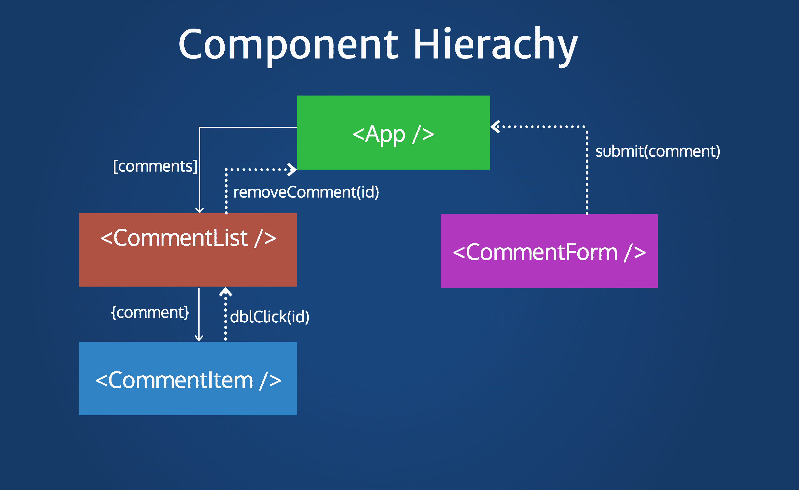
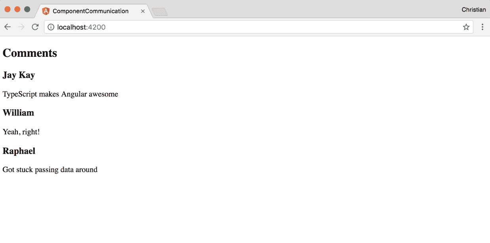
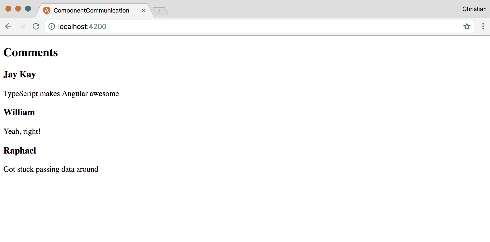
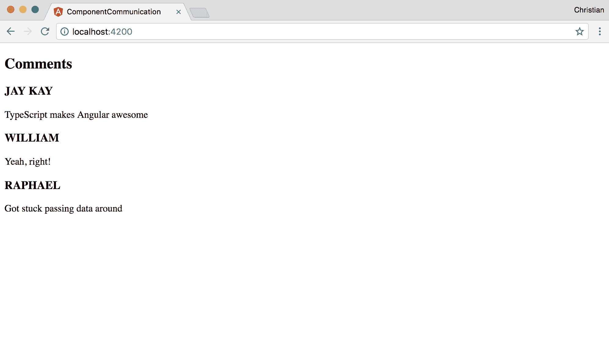
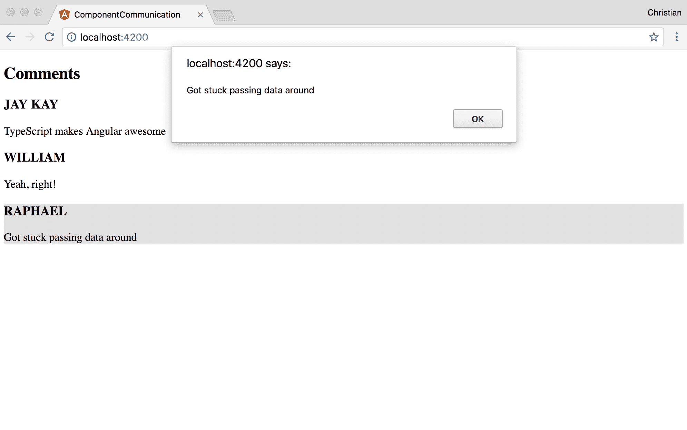
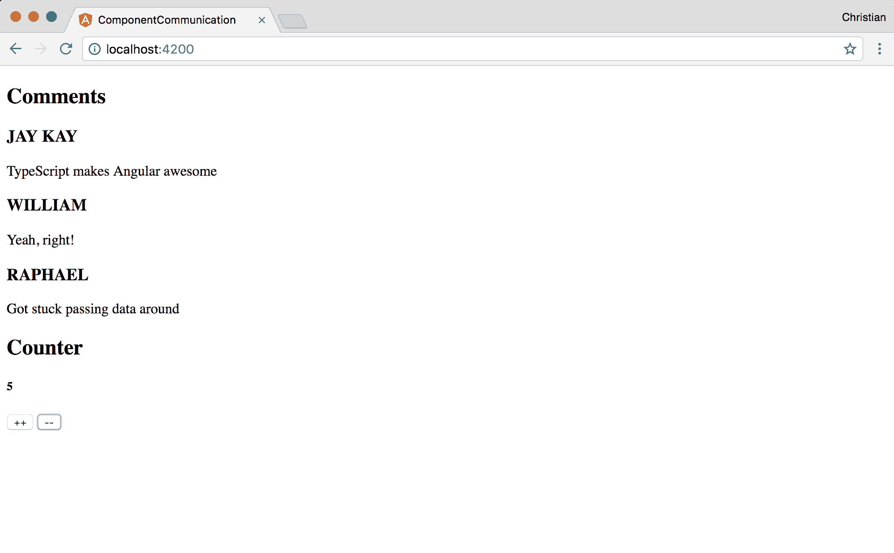

# 第六章：使用 TypeScript 的组件组合

您用 TypeScript 编写的组件在保持简短和简单时表现最佳。然而，一个简短和简单的组件几乎不能构成一个完整的应用程序。您如何组合执行特定任务的组件并将它们组合成一个可用的应用程序？这正是本章的主题。我们将讨论以下主题：

+   组件层次

+   不同级别组件之间的通信

我们还将看到一些实际操作的例子，展示组件是如何组合的，以及这些组合组件是如何相互通信的。

# 组件可组合性

可组合性是组件最突出的特性和卖点。事实上，这就是组件之所以成为组件的原因。不仅限于网络，无论何时一个实体被称为组件，它都有与其他组件组合的倾向。

虽然一些组件可以独立运行，但大多数组件隐式或显式地依赖于其他独立组件以完成特定任务。TypeScript 和模板大大简化了 Angular 中的组合，使其能够以无缝且易于维护的方式将我们的应用程序的各个部分组合在一起。

组合是按层次发生的；因此，大多数组件关系要么是父到子，要么是子到父。还重要的是要记住，如果存在这样的父子关系，那么一些组件可能与其他组件是兄弟关系，这取决于架构。

# 层次组合

一个组合组件与另一个组件之间存在父子关系，要么是父组件，要么是子组件。存在嵌套链的倾向；因此，没有任何东西阻止子组件拥有曾祖父母或父组件拥有孙子组件。

以下截图更好地说明了这一点：



在这里，入口 `App` 组件有两个子组件：`CommentList` 和 `CommentForm`。`CommentList` 也有一个子组件，`CommentItem`。可以说 `CommentItem` 是 `App` 的曾孙组件。也可以说 `CommentList` 和 `CommentForm` 是兄弟组件。

厚箭头显示了数据从父组件流向子组件的方式，而虚线箭头显示了数据作为事件从子组件推送到父组件的方式。这种数据向下流动和向上移动的说明引出了我们接下来要讨论的主题：组件通信。

# 组件通信

根据我们之前看到的图，让我们看看一些实际操作的例子。推荐的起点是从父组件到子组件的数据流。

# 父子流

直接使用 Angular CLI 创建一个新的 Angular 项目。完成此操作后，使用以下内容更新 `AppComponent`：

```js
import { Component } from '@angular/core';

@Component({
  selector: 'app-root',
  templateUrl: './app.component.html',
  styleUrls: ['./app.component.css']
})
export class AppComponent {
  title = 'app';
  comments = [
    {
      author: 'Jay Kay',
      content: 'TypeScript makes Angular awesome'
    },
    {
      author: 'William',
      content: 'Yeah, right!'
    },
    {
      author: 'Raphael',
      content: 'Got stuck passing data around'
    }
  ]
}

```

关键区别在于我添加了一个注释数组。这些注释就是我们打算传递给子组件的内容。

让我们使用 Angular CLI 生成命令创建`CommentListComponent`：

```js
ng g component comment-list
```

创建的组件旨在从父组件`AppComponent`接收评论列表。当它接收到这个组件时，它可以遍历它们并在屏幕上打印出来：

```js
import { Component, OnInit, Input } from '@angular/core';

@Component({
  selector: 'app-comment-list',
  templateUrl: './comment-list.component.html',
  styleUrls: ['./comment-list.component.css']
})
export class CommentListComponent implements OnInit {

  // Received via Imputs
  @Input() comments;

  constructor() { }

  ngOnInit() {}

}

```

`Input` TypeScript 装饰器用于指定一个类属性将由父组件设置。因此，我们不需要在`CommentListComponent.comments`上设置任何值，但我们需要等待通过`AppComponent`向下传递给它一个值。记住`AppComponent.comments`也存在，所以我们可以使用属性绑定在`app.component.html`中将`AppComponent.comments`传递给`CommentListComponent.comments`：

```js
<div>
  <h2>Comments</h2>
  <app-comment-list [comments]="comments"></app-comment-list>
</div>

```

`comments`数组是传递给`[comments]`属性的值。这个属性就是我们创建并装饰在`CommentListComponent`组件中的属性。

现在父组件（`AppComponent`）上有一个评论数组；你已经通过属性绑定将这个组件传递给子组件（`CommentListComponent`），并且你正在使用`Input`装饰器接收评论列表。接下来你需要做的是在`comment-list.component.html`上显示接收到的评论：

```js
<div class="comment-box" *ngFor="let comment of comments">
  <h3>{{comment.author}}</h3>
  <p>{{comment.content}}</p>
</div>

```

使用`*ngFor`指令来遍历评论，获取每个评论，并在我们的视图中显示评论。

这就是输出看起来像什么：



你可以进一步创建一个评论项组件，它只接受一个评论并显示它。创建另一个组件：

```js
ng g component comment-item
```

添加一个装饰过的评论属性，它将接收来自评论列表的评论项：

```js
import { Component, OnInit, Input } from '@angular/core';

@Component({
  selector: 'app-comment-item',
  templateUrl: './comment-item.component.html',
  styleUrls: ['./comment-item.component.css']
})
export class CommentItemComponent implements OnInit {

  // Decorated comment 
  @Input() comment;

  constructor() { }

  ngOnInit() {}

}

```

通过`comment list`父组件向下发送评论：

```js
<app-comment-item 
  *ngFor="let comment of comments" [comment]="comment">
</app-comment-item>

```

`comment`模板变量不需要在组件类中存在。它是从迭代器中获取的。

然后，你可以在`comment-item.component.html`模板上简单地渲染评论项：

```js
<h3>{{comment.author}}</h3>
<p>{{comment.content}}</p>

```

添加另一个子组件来展示嵌套。`App | comment list | comment item`是流程。`App`是`comment list`的父组件，也是`comment item`的祖父组件。`comment list`是`comment item`的父组件。

前往浏览器查看，尽管实际上没有变化，但我们的代码结构更好：



# 拦截属性更改

有时候，你可能想要对从父组件流向子组件的数据进行一些调整。你可以使用 getter 和 setter 来拦截数据，并在将其设置到视图中之前对其进行操作。让我们通过在设置之前将作者姓名大写来展示这个过程：

```js
import { Component, OnInit, Input } from '@angular/core';

@Component({
  selector: 'app-comment-item',
  templateUrl: './comment-item.component.html',
  styleUrls: ['./comment-item.component.css']
})
export class CommentItemComponent implements OnInit {

  private _comment;
  constructor() { }

  ngOnInit() {}

  @Input()
  set comment(comment) {
    this._comment = Object.assign(comment, {
       author: comment.author.toUpperCase()
    });
  }

  get comment() {
    return this._comment
  }

}

```

装饰器不再设置在值属性上，而是设置在 setter 属性上。这个属性接收来自评论列表的评论——父组件。然后它用作者姓名的大写版本覆盖作者属性。getter 只是返回评论，所以你可以从视图中访问它。

下面是它在浏览器中的样子：



# 子组件-父组件流

在这个流程中，而不是向下传递数据，数据需要向上流动。大多数时候，数据基于用户在子组件上触发的事件向上流动，我们试图通知父组件。因此，Angular 允许你在父组件上监听子组件的事件并对事件做出反应。这些事件可以用作为有效负载的数据来描述。

让我们先通过注释列表组件在每个注释项上注册一个双击事件：

```js
<app-comment-item 
  *ngFor="let comment of comments" 
  [comment]="comment" 
  (dblclick)="showComment(comment)">
</app-comment-item>

```

然后，你需要在组件类上添加`showComment`处理程序来处理此事件：

```js
import { 
  Component, 
  OnInit, 
  Input, 
  EventEmitter, 
  Output } from '@angular/core';

@Component({
  selector: 'app-comment-list',
  templateUrl: './comment-list.component.html',
  styleUrls: ['./comment-list.component.css']
})
export class CommentListComponent implements OnInit {

  @Input() comments;
  @Output() onShowComment = new EventEmitter();

  constructor() { }
  ngOnInit() {}

  showComment(comment) {
    this.onShowComment.emit(comment);
  }

}

```

处理程序使用`onShowComment`，它被`Output`装饰器装饰为一个输出属性以发射`EventEmitter`类型的事件。这个发射的事件是父组件需要监听的事件。注意，注释是如何传递给`emit`方法的；这显示了我们可以如何从子组件传递数据到父组件。

接下来，我们监听父组件（`App`）以触发此事件：

```js
<div>
  <h2>Comments</h2>
  <app-comment-list 
    [comments]="comments" 
    (onShowComment)="onShowComment($event)">
  </app-comment-list>
</div>

```

注意，事件绑定注解`()`用于事件，在这种情况下是`onShowComment`。绑定指的是`EventEmitter`，而其值指的是尚未创建的处理程序方法。处理程序方法被调用，并且我们通过`$event`传递来自子组件的值数据。

这是处理程序的实现：

```js
import { Component } from '@angular/core';

@Component({
  selector: 'app-root',
  templateUrl: './app.component.html',
  styleUrls: ['./app.component.css']
})
export class AppComponent {
  title = 'app';
  comments = [
    {
      author: 'Jay Kay',
      content: 'TypeScript makes Angular awesome'
    },
    // ...
  ]

  onShowComment(comment) {
    alert(comment.content);
  }
}

```

该方法正如以下截图所示只是弹出一个注释：



# 通过父组件访问子组件的属性和方法

除了数据流入和事件向上推送之外，还有其他通信策略。我们可以使用模板变量从父组件访问子组件成员。让我们创建一个计数器组件作为我们的例子：

```js
ng g component counter
```

现在添加一个计数器变量并将其初始化为零：

```js
//counter.component.html
<h5>
  {{counter}}
</h5> 
//counter.component.ts 
import { Component, OnInit } from '@angular/core';

@Component({
  selector: 'app-counter',
  templateUrl: './counter.component.html',
  styleUrls: ['./counter.component.css']
})
export class CounterComponent implements OnInit {

  counter: number = 0;

  increment() {
    this.counter++
  }

  decrement() {
    this.counter--
  }

}

```

此外，还有两种方法仅用于增加或减少计数器。请注意，没有任何东西调用这些方法；没有按钮与事件相关联以增加或减少。我们想要做的是从父组件访问这些方法。

要这样做，将组件添加到模板中并使用模板变量：

```js
<div>
  <h2>Comments</h2>
  <app-comment-list [comments]="comments" (onShowComment)="onShowComment($event)"></app-comment-list>

  ...

  <h2>Counter</h2>
  <app-counter #counter></app-counter>

</div>

```

`#counter`是一个在模板的任何地方都可以访问的变量。因此，你可以使用它作为一个对象来访问计数器组件的方法和属性：

```js
<div>
  <h2>Comments</h2>
  <app-comment-list [comments]="comments" (onShowComment)="onShowComment($event)"></app-comment-list>

  ...
  <h2>Counter</h2>
  <app-counter #counter></app-counter>
  <button (click)="counter.increment()">++</button>
  <button (click)="counter.decrement()">--</button>
</div>
```

这显示了带有我们可以点击以增加或减少计数器的按钮的按钮计数器：



# 使用`ViewChild`访问子组件成员

如果模板变量感觉不自然，你可以使用`ViewChild`来实现相同的行为。这允许你将子组件作为类上的一个变量访问，而不是在模板上：

```js
//app.component.ts
import { Component, ViewChild } from '@angular/core';
import { CounterComponent } from './counter/counter.component'

@Component({
  selector: 'app-root',
  templateUrl: './app.component.html',
  styleUrls: ['./app.component.css']
})
export class AppComponent {

  @ViewChild(CounterComponent)
  counterComponent: CounterComponent

  comments = [
    {</span&gt;
      author: 'Jay Kay',
      content: 'TypeScript makes Angular awesome'
    },
    // ...
  ]

  onShowComment(comment) {
    alert(comment.content);
  }

}

```

我们导入计数器组件，并使用`ViewChild`将其注册为该组件的子组件。然后我们创建一个`CounterComponent`类型的`counterComponent`变量。然后我们可以在我们的模板中使用这个变量：

```js
<app-counter></app-counter>
<button (click)="counterComponent.increment()">++</button>
<button (click)="counterComponent.decrement()">--</button>

```

# 摘要

现在，您可以通过编写小型、可维护的组件并将它们通过组合相互交互来开始使用组件作为构建块。在本章中，您学习了在组件架构中分层继承的含义，数据如何在分层树中上下流动，以及组件之间如何相互交互。

在下一章中，我们将探讨使用服务的一个更中心化的交互策略。这将帮助我们创建组件将共享的逻辑，从而保持我们的代码库非常 DRY（不要重复自己）。
