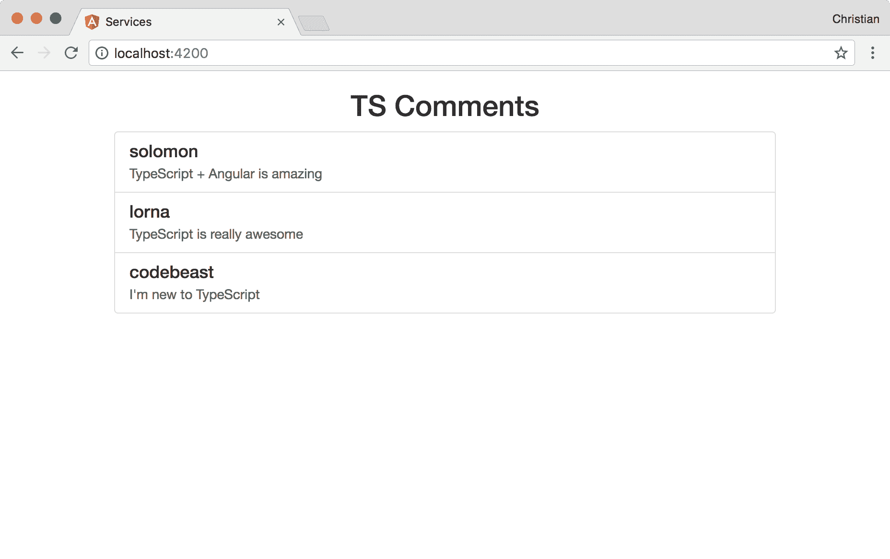
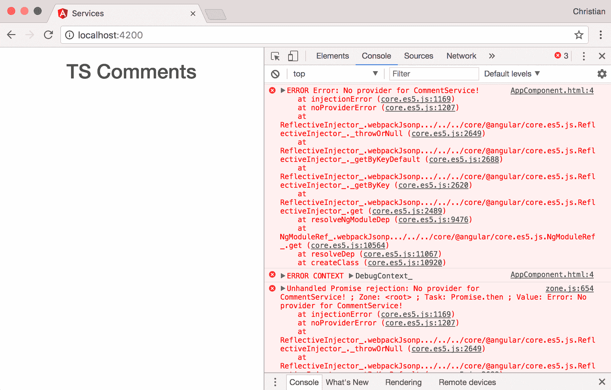
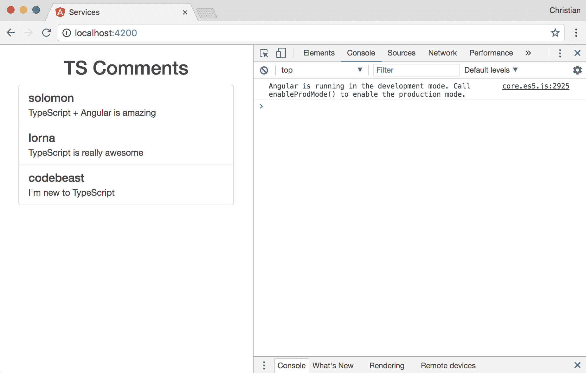
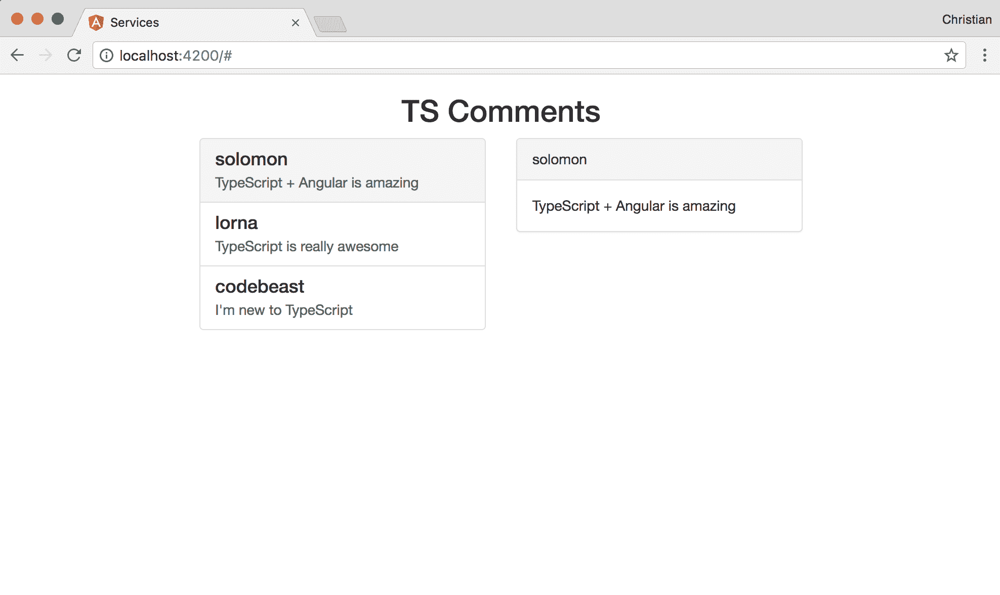
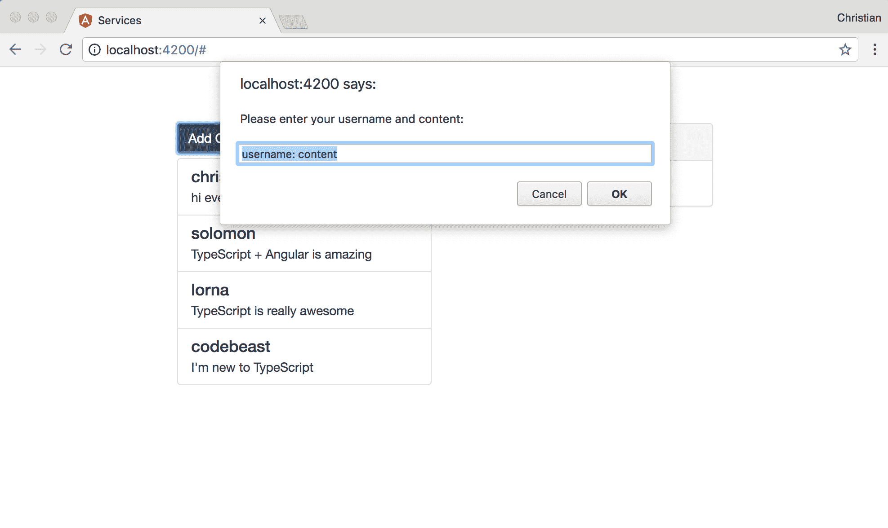

# 使用类型化服务分离关注点

本章在上一章的基础上构建，展示了更多技术，说明了如何在应用程序的构建块之间进行通信。在本章中，你将学习以下主题：

+   服务和依赖注入（DI）概念

+   组件与服务之间的通信

+   使用服务编写数据逻辑

为了更好地理解服务，你需要至少了解依赖注入的基本概念。

# 依赖注入

使用 TypeScript 编写 Angular 要求你的构建块（组件、指令、服务等）是用类编写的。它们只是构建块，这意味着在它们变得功能之前，它们需要相互交织，从而形成一个完整的应用程序。

这个交织过程可能相当令人望而生畏。因此，让我们首先了解这个问题。以以下 TypeScript 类为例：

```js
export class Developer {
  private skills: Array<Skill>;
  private bio: Person;
  constructor() {
    this.bio = new Person('Sarah', 'Doe', 24, 'female');
    this.skills = [
      new Skill('css'), 
      new Skill('TypeScript'), 
      new Skill('Webpack')
    ];
  }
}
```

`人物`和`技能`类的实现就像以下这样：

```js
// Person Class
export class Person {
  private fName: string;
  private lName: string;
  private age: number;
  private gender: string;
  constructor(
    fName: string, 
    lName: string, 
    age: number, 
    gender: string, 
  ) {
    this.fName = fName;
    this.lName = lName;
    this.age = age;
    this.gender = gender;
  }
}

// Skill Class
export class Skill {
  private type: string;
  constructor(
    type: string
  ) {
    this.type = type;
  }
}
```

在开始创建更多需要使用此类的新开发者类型之前，前面的示例是非常功能性和有效的代码。实际上，没有方法可以创建另一种类型的开发者，因为所有实现细节都绑定到一个类上；因此，这个过程不够灵活。在能够用来创建更多类型的开发者之前，我们需要使这个类更加通用。

让我们尝试改进`开发者`类，使其通过构造函数接收创建类所需的所有值，而不是在类中设置：

```js
export class Developer {
  private skills: Array<Skills>;
  private bio: Person;
  constructor(
    fName: string, 
    lName: string, 
    age: number, 
    gender: string, 
    skills: Array<string>
  ) {
    this.bio = new Person(fName, lName, age, gender);
    this.skills = skills.map(skill => new Skill(skill));
  }
}
```

在这么少的代码行中就有如此多的改进！我们现在使用构造函数使代码变得更加灵活。通过这次更新，你可以使用`开发者`类创建所需的所有类型的开发者。

虽然这个解决方案看起来可以解决问题，但系统中仍然存在紧密耦合的问题。当`Person`和`Skill`类的构造函数发生变化时会发生什么？其含义是，你将不得不回到`Developer`类中更新对这个构造函数的调用。以下是在`Skill`中此类变化的一个示例：

```js
// Skill Class
export class Skill {
  private type: string;
  private yearsOfExperience: number;
  constructor(
    type: string,
    yearsOfExperience: number
  ) {
    this.type = type;
    this.yearsOfExperience = yearsOfExperience
  }
}
```

我们为`yearsOfExperience`类添加了另一个字段，它是数字类型，表示开发者练习声称的技能有多长时间。为了在`Developer`中实际工作，我们必须更新`Developer`类：

```js
export class Developer {
  public skills: Array<Skill>;
  private bio: Person;
  constructor(
    fName: string, 
    lName: string, 
    age: number, 
    gender: string, 
    skils: Array<any>
  ) {
    this.bio = new Person(fName, lName, age, gender);
    this.slills = skills.map(skill => 
       new Skill(skill.type, skill.yearsOfExperience));
  }
}
```

每当依赖项发生变化时更新此类，这是我们力求避免的。一种常见的做法是将依赖项的构造函数提升到类的构造函数本身：

```js
export class Developer {
  public skills: <Skill>;
  private person: Person;
  constructor(
    skill: Skill,
    person: Person
  ) {}
}
```

这样，`开发者`对`技能`和`人物`的实现细节了解较少。因此，如果它们内部发生变化，`开发者`不会关心；它只是保持原样。

事实上，TypeScript 提供了一个生产力快捷方式：

```js
export class Developer {
  constructor(
    public skills: <Skill>,
    private person: Person
  ) {}
}
```

这个快捷方式将隐式声明属性，并通过构造函数将它们作为依赖项分配。

这还不是全部；提升这些依赖关系引入了另一个挑战。我们如何在应用中管理所有依赖关系，而不会失去对事物预期位置的跟踪？这就是依赖注入发挥作用的地方。它不是 Angular 的事情，但这是一个在 Angular 中实现的流行模式。

让我们在 Angular 应用中直接看到依赖注入（DI）的实际应用。

# 组件中的数据

为了更好地理解服务和依赖注入的重要性，让我们创建一个简单的应用，其中包含一个显示用户评论列表的组件。一旦创建好应用，你可以运行以下命令来生成所需的组件：

```js
ng g component comment-list
```

更新组件的代码如下片段：

```js
import { Component, OnInit } from '@angular/core';

@Component({
  selector: 'app-comment-list',
  templateUrl: './comment-list.component.html',
  styleUrls: ['./comment-list.component.css']
})
export class CommentListComponent implements OnInit {

  comments: Array<any>
  constructor() { }

  ngOnInit() {
    this.comments = [
      {
        author: 'solomon',
        content: `TypeScript + Angular is amazing`
      },
      {
        author: 'lorna',
        content: `TypeScript is really awesome`
      },
      {
        author: 'codebeast',
        content: `I'm new to TypeScript`
      },
    ];
  }

}
```

组件有一个 `comments` 数组，一旦通过 `ngOnInit` 生命周期初始化组件，就会用硬编码的数据填充。现在我们需要遍历数组并在 DOM 上打印：

```js
<div class="list-group">
  <a href="#" class="list-group-item" *ngFor="let comment of comments">
    <h4 class="list-group-item-heading">{{comment.author}}</h4>
    <p class="list-group-item-text">{{comment.content}}</p>
  </a>
</div>
```

你需要将组件包含在你的入口（app）组件中，才能使其显示：

```js
<div class="container">
  <h2 class="text-center">TS Comments</h2>
  <div class="col-md-6 col-md-offset-3">
    <app-comment-list></app-comment-list>
  </div>
</div>
```

你的应用应该看起来像下面这样（记得包括第二章[1388eb32-f9cf-4efd-86fe-dc3f201ed039.xhtml]中提到的 Bootstrap，*使用 TypeScript 入门*）：



这个例子是可行的，但魔鬼藏在细节中。当另一个组件需要一个评论列表或列表的一部分时，我们最终会重新创建评论。这就是组件中存在数据的问题。

# 数据类服务

为了提高可重用性和可维护性，我们需要将逻辑关注点从组件中抽象出来，让组件仅作为表示层。这就是 TypeScript 在 Angular 中的服务发挥作用的情况之一。

你首先需要使用以下命令创建一个服务：

```js
ng g service comment
```

这将创建你的服务类 `./src/app/comment.service.ts`，并带有脚手架内容。更新内容如下：

```js
import { Injectable } from '@angular/core';

@Injectable()
export class CommentService {
  private comments: Array<any> = [
    {
      author: 'solomon',
      content: `TypeScript + Angular is amazing`
    },
    {
      author: 'lorna',
      content: `TypeScript is really awesome`
    },
    {
      author: 'codebeast',
      content: `I'm new to TypeScript`
    }
  ];
  constructor() {}

  getComments() {
    return this.comments;
  }
}
```

现在这个类现在做的是我们的组件本应使用数据做的事情，数据是通过 `getComments` 方法获取的，该方法简单地返回一个评论数组。`CommentService` 类也被装饰了；除非类有需要解析的依赖关系，否则这不是必需的。尽管如此，良好的实践要求我们始终使用 `Injectable` 装饰，以了解一个类是否意味着要成为一个服务。

回到我们的列表组件，我们只需导入类，从构造函数中解析依赖关系以创建服务类的一个实例，然后使用 `getComments` 返回值填充属性：

```js
import { Component, OnInit } from '@angular/core';
import { CommentService } from '../comment.service';

@Component({
  selector: 'app-comment-list',
  templateUrl: './comment-list.component.html',
  styleUrls: ['./comment-list.component.css']
})
export class CommentListComponent implements OnInit {
  private comments: Array<any>;
  constructor(
    private commentService: CommentService
  ) { }

  ngOnInit() {
    this.comments = this.commentService.getComments();
  }

}
```

让我们尝试在浏览器中运行这些当前更改，看看是否仍然按预期工作：



见鬼，它爆炸了。出了什么问题？错误信息显示没有为 CommentService 提供提供者！

记住，当我们使用 `ng` CLI 命令搭建组件时，CLI 不仅创建了一个组件，还将它添加到 `ngModule` 装饰器的声明数组中：

```js
// ./src/app/app.module.ts
declarations: [
    AppComponent,
    // New scaffolded component here
    CommentListComponent
  ],
```

模块需要知道哪些组件和服务属于它们作为成员。这就是为什么组件会自动为你添加。对于服务来说，情况并不相同，因为 CLI 不会自动更新模块（在脚手架期间会警告你），当你通过 CLI 工具创建服务类时。我们需要通过`providers`数组手动添加服务：

```js
import { CommentService } from './comment.service';
//...

@NgModule({
  //...
  providers: [
    CommentService
  ],
})
export class AppModule { }
```

现在，再次运行应用程序，看看我们的服务现在如何使应用程序运行，且控制台没有更多错误：



如果需要操作数据，必须在服务中而不是在组件中完成。假设你想通过双击列表中的每个项目来删除评论，接收组件上的事件是可以的，但实际的删除应该由服务处理。

首先为列表项添加一个事件监听器：

```js
<a href="#" class="list-group-item" (dblclick)="removeComment(comment)" *ngFor="let comment of comments">
    <h4 class="list-group-item-heading">{{comment.author}}</h4>
    <p class="list-group-item-text">{{comment.content}}</p>
  </a>
```

`dblclick`事件是在双击项目时触发的。当发生这种情况时，我们会调用`removeComment`方法，并传递要从项目中删除的评论。

下面是组件中`removeComment`的样子：

```js
removeComment(comment) {
    this.comments = this.commentService.removeComment(comment);
}
```

如您所见，它所做的不仅仅是调用我们的服务上的一个方法，这个方法也被称为`removeComment`。这是负责从评论数组中删除项的实际责任方法：

```js
// Comment service
removeComment(removableComment) {
    // find the index of the comment
    const index = this.comments.findIndex(
      comment => comment.author === removableComment.author
    );
    // remove the comment from the array
    this.comments.splice(index, 1);
    // return the new array
    return this.comments;
  }
```

# 组件与服务之间的交互

这是对服务的一个非常有用的用例。在第六章，“使用 TypeScript 进行组件组合”，我们讨论了组件如何相互交互，并展示了不同的实现方式。其中一种方式被省略了——使用服务作为不同组件的事件中心/通信平台。

假设当列表中的一个项目被点击时，我们使用与评论列表组件相邻的组件来显示选中的评论的详细视图。首先，我们需要创建这个组件：

```js
ng g component comment-detail
```

然后，你可以更新`app.component.html`文件以显示添加的组件：

```js
<div class="container">
  <h2 class="text-center">TS Comments</h2>
  <div class="col-md-4 col-md-offset-2">
    <app-comment-list></app-comment-list>
  </div>
  <div class="col-md-4">
    <!-- Comment detail component -->
    <app-comment-detail></app-comment-detail>
  </div>
</div>

```

现在，我们需要定义我们的组件要做什么，因为它现在还是空的。但在那之前，让我们更新评论服务，使其同时作为列表组件和相邻的详细组件之间的枢纽：

```js
import { Injectable } from '@angular/core';
import { Subject } from 'rxjs/Subject';

@Injectable()
export class CommentService {
  private commentSelectedSource = new Subject<any>();
  public commentSelected$ = this.commentSelectedSource.asObservable();

  private comments: Array<any> = [
   // ...
  ];

  // ...

  showComment(comment) {
    this.commentSelectedSource.next(comment);
  }
}
```

现在服务使用 Rx subject 创建一个流和一个监听器，选中的评论会通过这个流推送并获取。当评论被点击时，`commentSelectedSource`对象负责将评论添加到流中。`commetSelected$`对象是一个可观察对象，我们可以在评论被点击时订阅并对其操作。

现在，直接回到你的组件中，添加一个点击事件以选择评论项：

```js
<div class="list-group">
  <a href="#" class="list-group-item" 
    (dblclick)="removeComment(comment)" 
    *ngFor="let comment of comments"
    (click)="showComment(comment)"
    >
    <h4 class="list-group-item-heading">{{comment.author}}</h4>
    <p class="list-group-item-text">{{comment.content}}</p>
  </a>
</div>
```

点击事件会在组件上触发一个`showComment`方法，该方法反过来会调用服务中的`showComment`方法：

```js
showComment(comment) {
  this.commentService.showComment(comment);
}
```

我们仍然需要更新评论详情组件，使其订阅我们在类中创建的可观察对象：

```js
import { Component, OnInit } from '@angular/core';
import { CommentService } from '../comment.service';

@Component({
  selector: 'app-comment-detail',
  templateUrl: './comment-detail.component.html',
  styleUrls: ['./comment-detail.component.css']
})
export class CommentDetailComponent implements OnInit {

  comment: any = {
    author: '',
    content: ''
  };
  constructor(
    private commentService: CommentService
  ) { }

  ngOnInit() {
    this.commentService.commentSelected$.subscribe(comment => {
      this.comment = comment;
    })
  }

}
```

使用`ngOnInit`生命周期钩子，一旦组件准备就绪，我们就可以创建对可观察对象的订阅。有一个评论属性将被绑定到视图上，并且每次点击评论项时，该属性都会通过订阅进行更新。以下是显示所选评论的组件模板：

```js
<div class="panel panel-default" *ngIf="comment.author">
  <div class="panel-heading">{{comment.author}}</div>
  <div class="panel-body">
    {{comment.content}}
  </div>
</div>
```

你可以再次启动应用程序并尝试选择一条评论。你应该看到以下行为：



# 服务作为实用工具

除了管理状态和组件交互外，服务还以处理实用操作而闻名。假设我们想在我们的评论应用中开始收集新的评论。我们对表单了解不多，因此可以使用浏览器的提示。我们期望用户通过提示中的同一个文本框传递用户名和内容，如下所示：

```js
<username>: <comment content>
```

因此，我们需要一个实用方法来从文本框中提取这些信息到一个具有作者和内容属性的评论对象中。让我们从收集评论列表组件的信息开始：

```js
showPrompt() {
    const commentString = window.prompt('Please enter your username and content: ', 'username: content');
    const parsedComment = this.commentService.parseComment(commentString);
    this.commentService.addComment(parsedComment);
  }
```

`showPrompt()`方法用于收集用户输入，并将输入传递到服务的`parseComment`方法。这是一个实用方法的例子，我们很快就会实现它。我们还将实现`addComment`方法，该方法使用解析后的评论来更新评论列表。接下来，向视图中添加一个按钮，并添加一个点击事件监听器，该监听器触发`showPrompt`：

```js
<button class="btn btn-primary" 
 (click)="showPrompt()"
>Add Comment</button>
```

将这两种方法添加到评论服务中：

```js
parseComment(commentString) {
    const commentArr = commentString.split(':');
    const comment = {
      author: commentArr[0].trim(),
      content: commentArr[1].trim()
    }
    return comment;
  }

  addComment(comment) {
    this.comments.unshift(comment);
  }
```

`parseComment`方法接受一个字符串，分割该字符串，并获取评论的作者和内容。然后，它返回评论。`addComment`方法接受一个评论并将其添加到现有评论列表中。

现在，你可以开始添加新的评论，如下面的截图所示：



# 摘要

本章揭示了数据抽象中的许多有趣概念，同时利用了依赖注入的力量。你学习了组件如何通过服务作为中心进行交互，数据逻辑如何从组件抽象到服务，以及如何在服务中处理可重用的实用代码以保持应用程序的整洁。在下一章中，你将学习 Angular 中表单的实用方法以及 DOM 事件。
